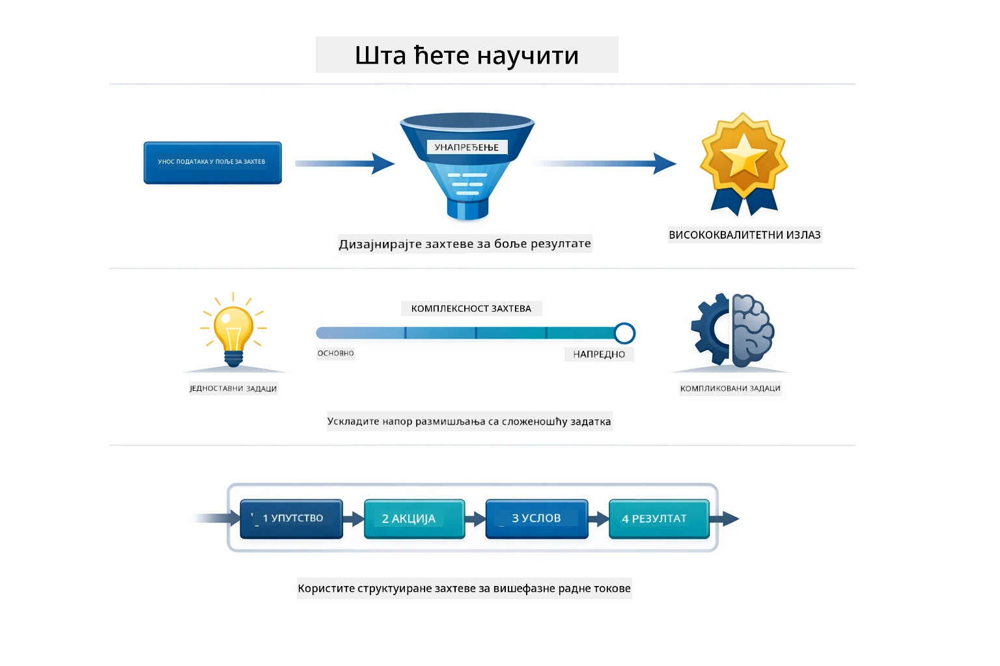
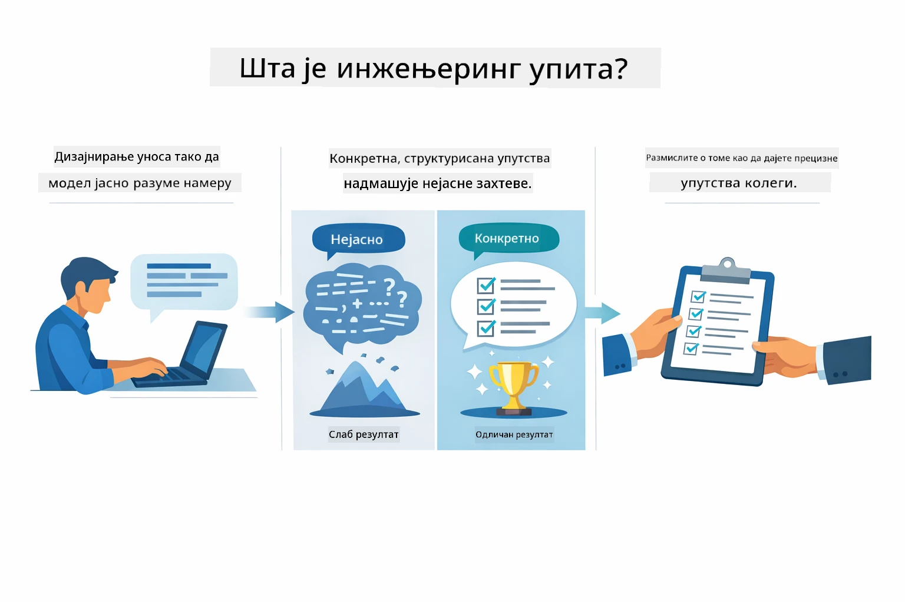
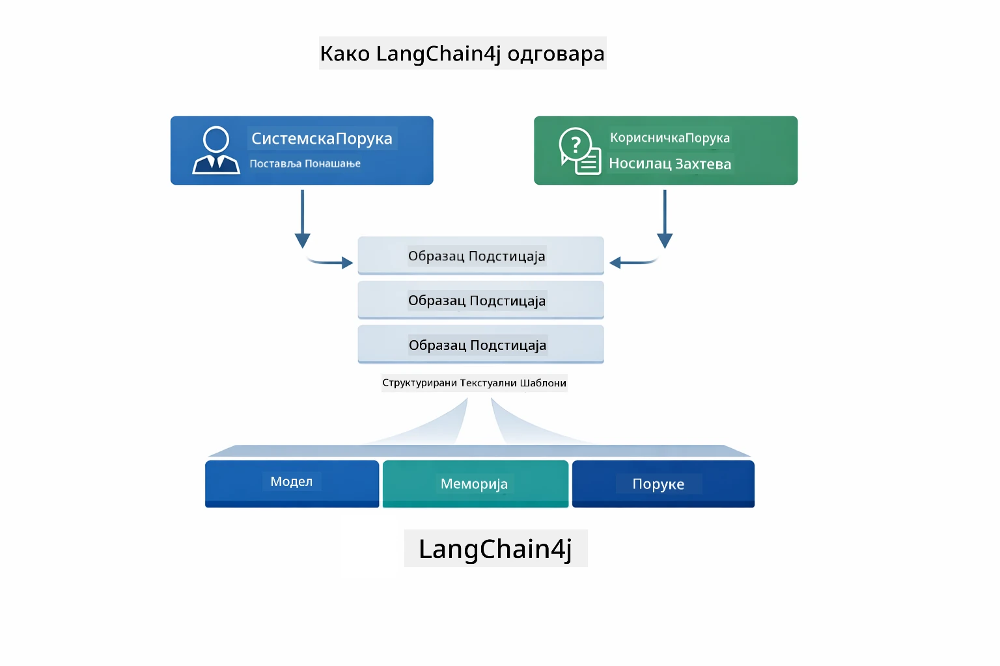
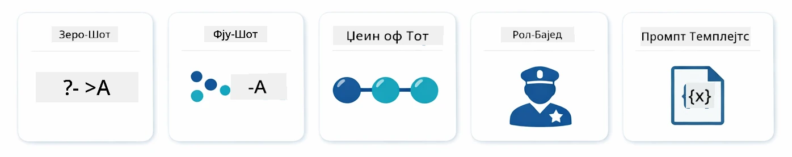
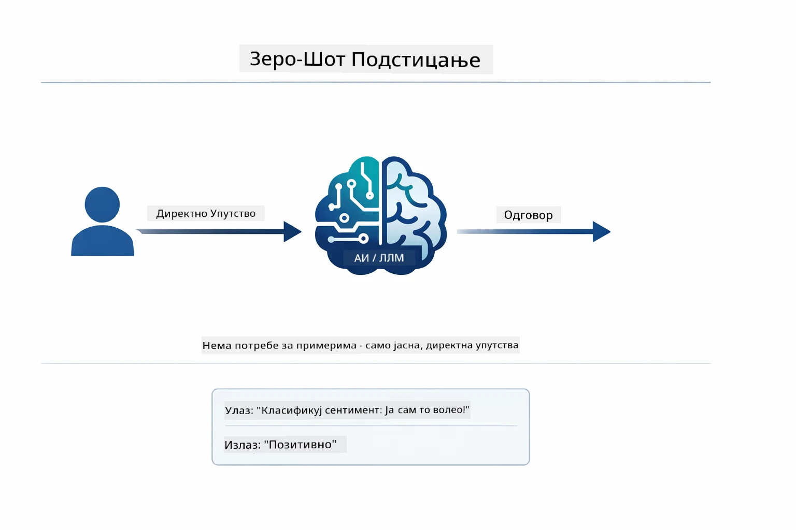
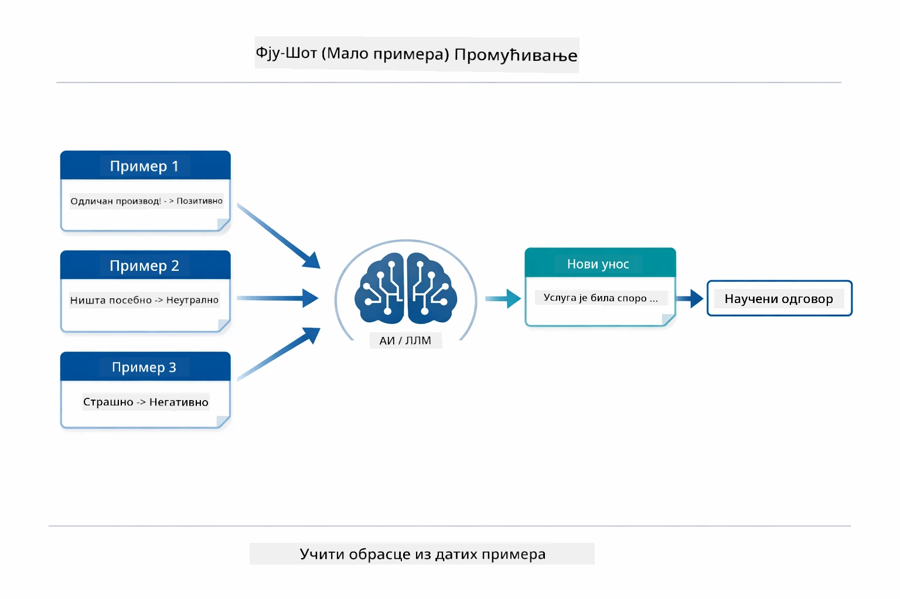
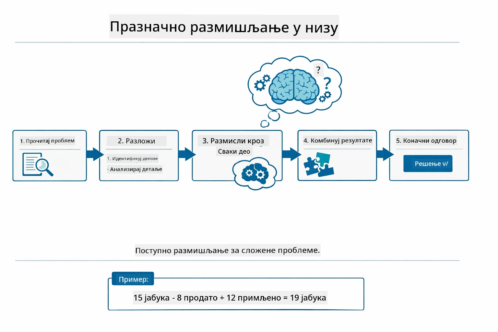
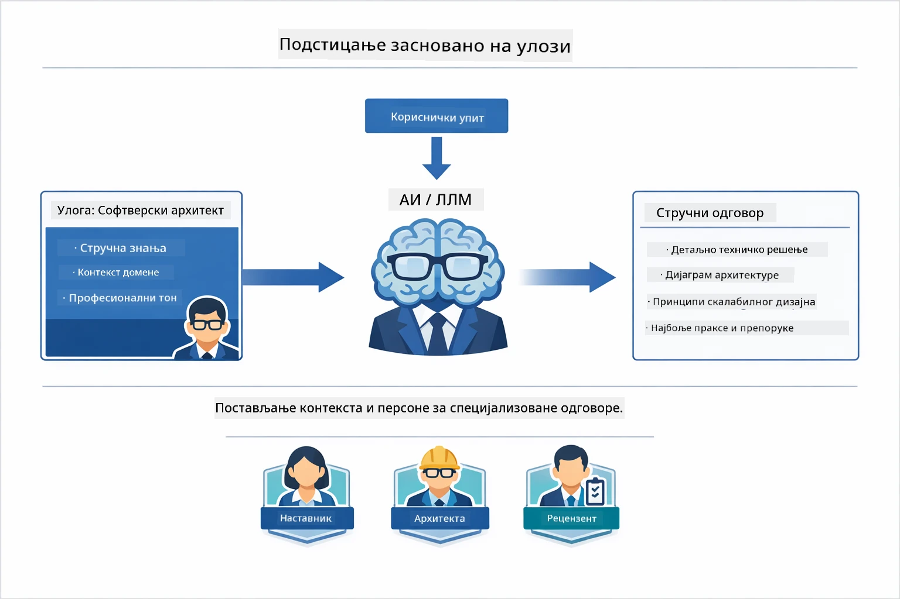
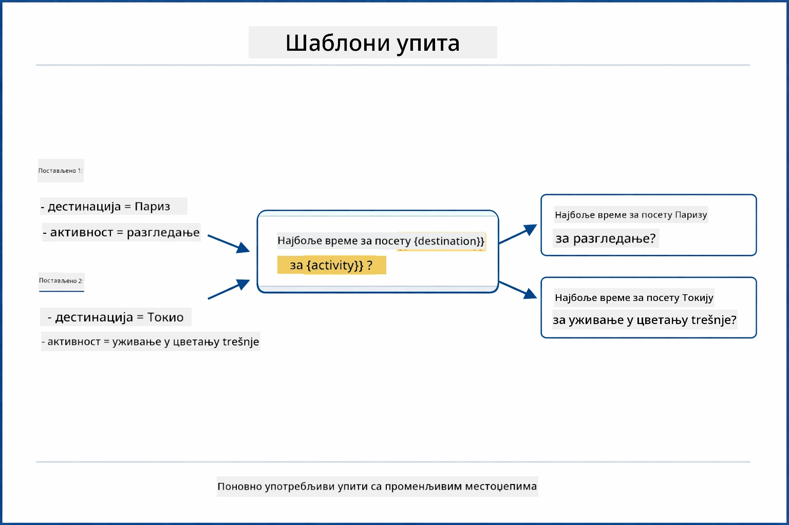
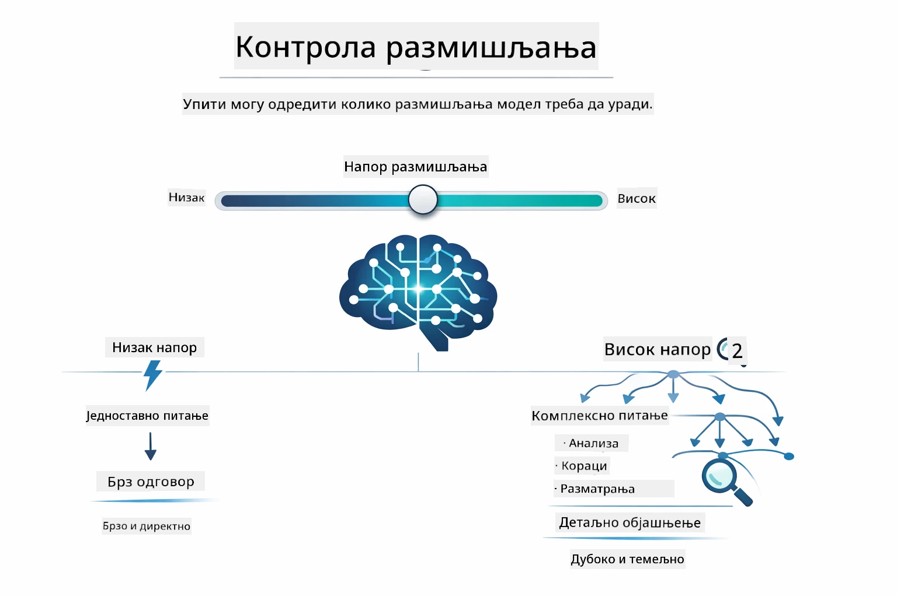

# Модул 02: Инжењеринг упита са GPT-5.2

## Садржај

- [Видео водич](../../../02-prompt-engineering)
- [Шта ћете научити](../../../02-prompt-engineering)
- [Претходни услови](../../../02-prompt-engineering)
- [Разумевање инжењеринга упита](../../../02-prompt-engineering)
- [Основе инжењеринга упита](../../../02-prompt-engineering)
  - [Zero-Shot паљба](../../../02-prompt-engineering)
  - [Few-Shot паљба](../../../02-prompt-engineering)
  - [Ланац размишљања](../../../02-prompt-engineering)
  - [Паљба заснована на улози](../../../02-prompt-engineering)
  - [Шаблони упита](../../../02-prompt-engineering)
- [Напредни обрасци](../../../02-prompt-engineering)
- [Коришћење постојећих Azure ресурса](../../../02-prompt-engineering)
- [Снимци екрана апликације](../../../02-prompt-engineering)
- [Истражујући обрасце](../../../02-prompt-engineering)
  - [Низак против високог ентузијазма](../../../02-prompt-engineering)
  - [Извођење задатка (Реченице алата)](../../../02-prompt-engineering)
  - [Саморефлективни код](../../../02-prompt-engineering)
  - [Структурисана анализа](../../../02-prompt-engineering)
  - [Вишеокретни чет](../../../02-prompt-engineering)
  - [Размишљање корак по корак](../../../02-prompt-engineering)
  - [Ограничен излаз](../../../02-prompt-engineering)
- [Шта заправо учите](../../../02-prompt-engineering)
- [Следећи кораци](../../../02-prompt-engineering)

## Видео водич

Погледајте ову уживо сесију која објашњава како почети са овим модулом: [Prompt Engineering with LangChain4j - Live Session](https://www.youtube.com/live/PJ6aBaE6bog?si=LDshyBrTRodP-wke)

## Шта ћете научити



У претходном модулу видели сте како меморија омогућава разговорни АИ и користили сте GitHub моделе за основне интеракције. Сада ћемо се фокусирати на начин на који постављате питања — саме упите — користећи Azure OpenAI GPT-5.2. Начин на који структурирате своје упите драматично утиче на квалитет одговора које добијате. Започињемо прегледом основних техника упита, а затим прелазимо на осам напредних образаца који у потпуности искоришћавају могућности GPT-5.2.

Користићемо GPT-5.2 јер уводи контролу размишљања - можете рећи моделу колико размишљања да уради пре одговора. Ово чини различите стратегије упита видљивијим и помаже вам да разумете када да користите који приступ. Такође ћемо имати користи од мање Azure-ове ограничења брзине за GPT-5.2 у поређењу са GitHub моделима.

## Претходни услови

- Завршен Модул 01 (дејловани Azure OpenAI ресурси)
- `.env` фајл у коренском директоријуму са Azure акредитивима (креирано помоћу `azd up` у Модулу 01)

> **Напомена:** Ако нисте завршили Модул 01, прво следите упутства за деплојмент тамо.

## Разумевање инжењеринга упита



Инжењеринг упита се бави дизајнирањем улазног текста који доследно добија резултате који су вам потребни. Није само постављање питања — ради се о структурирању захтева тако да модел тачно разуме шта желите и како да то испоручи.

Замислите да дајете упутства колеги. "Поправи грешку" је нејасно. "Поправи null pointer изузетак у UserService.java на линији 45 додавањем проверe за null" је специфично. Језички модели раде исто — специфичност и структура су битни.



LangChain4j пружа инфраструктуру — везе са моделом, меморију и типове порука — док су обрасци упита пажљиво структурисани текст који шаљете кроз ту инфраструктуру. Кључни елементи су `SystemMessage` (који подешава понашање и улогу АИ) и `UserMessage` (која носи ваш стварни захтев).

## Основе инжењеринга упита



Пре него што заронимо у напредне обрасце у овом модулу, прегледајмо пет основних техника упита. Ово су градивни блокови које сваки инжењер упита треба да зна. Ако сте већ прошли кроз [Quick Start модул](../00-quick-start/README.md#2-prompt-patterns), видели сте их у акцији — ово је концептуални оквир иза њих.

### Zero-Shot паљба

Најједноставнији приступ: дати моделу директну инструкцију без примера. Модел се у потпуности ослања на своју обуку да разуме и изврши задатак. Ово добро ради за једноставне захтеве где је очекивано понашање очигледно.



*Директна инструкција без примера — модел закључује задатак само из инструкције*

```java
String prompt = "Classify this sentiment: 'I absolutely loved the movie!'";
String response = model.chat(prompt);
// Одговор: "Позитивно"
```

**Када користити:** Једноставне класификације, директна питања, преводи или било који задатак који модел може обавити без додатних упутстава.

### Few-Shot паљба

Пружите примере који демонстрирају образац који желите да модел прати. Модел учи очекивани формат улаз/излаз из ваших примера и примењује га на нове уносе. Ово драматично побољшава конзистенцију за задатке где жељени формат или понашање није очигледно.



*Учење из примера — модел препознаје образац и примењује га на нове уносе*

```java
String prompt = """
    Classify the sentiment as positive, negative, or neutral.
    
    Examples:
    Text: "This product exceeded my expectations!" → Positive
    Text: "It's okay, nothing special." → Neutral
    Text: "Waste of money, very disappointed." → Negative
    
    Now classify this:
    Text: "Best purchase I've made all year!"
    """;
String response = model.chat(prompt);
```

**Када користити:** Прилагођене класификације, доследно форматирање, задаци специфични за домен или када су zero-shot резултати нестандардни.

### Ланац размишљања

Замолите модел да прикаже свој процес размишљања корак по корак. Уместо да одмах да одговор, модел разбраја проблем и ради кроз сваки део експлицитно. Ово побољшава тачност у математици, логици и задатцима са више корака размишљања.



*Размишљање корак по корак — расклапање сложених проблема у експлицитне логичке кораке*

```java
String prompt = """
    Problem: A store has 15 apples. They sell 8 apples and then 
    receive a shipment of 12 more apples. How many apples do they have now?
    
    Let's solve this step-by-step:
    """;
String response = model.chat(prompt);
// Модел показује: 15 - 8 = 7, затим 7 + 12 = 19 јабука
```

**Када користити:** Математички проблеми, логичке загонетке, отклањање грешака или било који задатак где приказивање процеса размишљања повећава тачност и поверење.

### Паљба заснована на улози

Поставите личност или улогу АИ пре него што поставите питање. Ово пружа контекст који обликује тон, дубину и фокус одговора. „Софтверски архитекта“ даје другачије савете од „млађег програмера“ или „аудитора безбедности“.



*Постављање контекста и личности — иста питања добијају различите одговоре у зависности од додељене улоге*

```java
String prompt = """
    You are an experienced software architect reviewing code.
    Provide a brief code review for this function:
    
    def calculate_total(items):
        total = 0
        for item in items:
            total = total + item['price']
        return total
    """;
String response = model.chat(prompt);
```

**Када користити:** Прегледи кода, подучавање, анализа специфична за домен или када су потребни одговори прилагођени одређеном нивоу стручности или перспективи.

### Шаблони упита

Креирајте поново употребљиве упите са променљивим местима за уметање. Уместо да сваки пут пишете нови упит, дефинишите шаблон једном и убацујте различите вредности. LangChain4j класа `PromptTemplate` то чини лакшим помоћу `{{variable}}` синтаксе.



*Поновно употребљиви упити са променљивим местима — један шаблон, много употреба*

```java
PromptTemplate template = PromptTemplate.from(
    "What's the best time to visit {{destination}} for {{activity}}?"
);

Prompt prompt = template.apply(Map.of(
    "destination", "Paris",
    "activity", "sightseeing"
));

String response = model.chat(prompt.text());
```

**Када користити:** Понављани упити са различитим уносима, серијска обрада, грађење поново употребљивих АИ токова рада или било који сценарио где се структура упита не мења али се подаци мењају.

---

Ових пет основа вам пружају солидан алатник за већину задатака упита. Остатак овог модула надограђује их са **осам напредних образаца** који користе контролу размишљања GPT-5.2, самоевалуацију и могућности структурисаног излаза.

## Напредни обрасци

Када смо покрили основе, пређимо на осам напредних образаца који овај модул чине јединственим. Неки проблеми не захтевају исти приступ. Нека питања требају брзе одговоре, друга дубоко размишљање. Нека захтевају видљиво размишљање, а друга само резултате. Сваки образац испод је оптимизован за различит сценарио — а контрола размишљања GPT-5.2 још више наглашава разлике.


*Преглед осам образаца инжењеринга упита и њихове примене*



*Контрола размишљања GPT-5.2 вам омогућава да одредите колико размишљања модел треба да уради — од брзих директних одговора до дубоке анализе*

**Низак ентузијазам (брзо и фокусирано)** - За једноставна питања где желите брзе, директне одговоре. Модел врши минимално размишљање - максимум 2 корака. Користите за калкулације, прегледе или једноставна питања.

```java
String prompt = """
    <context_gathering>
    - Search depth: very low
    - Bias strongly towards providing a correct answer as quickly as possible
    - Usually, this means an absolute maximum of 2 reasoning steps
    - If you think you need more time, state what you know and what's uncertain
    </context_gathering>
    
    Problem: What is 15% of 200?
    
    Provide your answer:
    """;

String response = chatModel.chat(prompt);
```

> 💡 **Испробајте са GitHub Copilot:** Отворите [`Gpt5PromptService.java`](../../../02-prompt-engineering/src/main/java/com/example/langchain4j/prompts/service/Gpt5PromptService.java) и питајте:
> - "Која је разлика између низког и високог ентузијазма у обрасцима упита?"
> - "Како XML тагови у упитима помажу у структуирању АИ одговора?"
> - "Када треба користити обрасце саморазмишљања уместо директних упутстава?"

**Висок ентузијазам (дубоко и темељно)** - За комплексне проблеме где желите комплетну анализу. Модел дубоко истражује и показује детаљне разлоге. Користите за дизајн система, одлуке у архитектури или компликована истраживања.

```java
String prompt = """
    Analyze this problem thoroughly and provide a comprehensive solution.
    Consider multiple approaches, trade-offs, and important details.
    Show your analysis and reasoning in your response.
    
    Problem: Design a caching strategy for a high-traffic REST API.
    """;

String response = chatModel.chat(prompt);
```

**Извођење задатка (прогрес корак по корак)** - За токове рада са више корака. Модел пружа план унапред, описује сваки корак док ради, затим даје резиме. Користите за миграције, имплементације или било који процес са више корака.

```java
String prompt = """
    <task_execution>
    1. First, briefly restate the user's goal in a friendly way
    
    2. Create a step-by-step plan:
       - List all steps needed
       - Identify potential challenges
       - Outline success criteria
    
    3. Execute each step:
       - Narrate what you're doing
       - Show progress clearly
       - Handle any issues that arise
    
    4. Summarize:
       - What was completed
       - Any important notes
       - Next steps if applicable
    </task_execution>
    
    <tool_preambles>
    - Always begin by rephrasing the user's goal clearly
    - Outline your plan before executing
    - Narrate each step as you go
    - Finish with a distinct summary
    </tool_preambles>
    
    Task: Create a REST endpoint for user registration
    
    Begin execution:
    """;

String response = chatModel.chat(prompt);
```

Ланац размишљања експлицитно тражи од модела да прикаже свој процес размишљања, побољшавајући тачност за сложене задатке. Разлагање корак по корак помаже и људима и АИ да разумеју логику.

> **🤖 Испробајте са четом [GitHub Copilot](https://github.com/features/copilot):** Питајте о овом обрасцу:
> - "Како бих прилагодио образац извођења задатка за дуготрајне операције?"
> - "Које су најбоље праксе за структуирање реченица алата у продукционим апликацијама?"
> - "Како могу да ухватим и прикажем ажурирања средњег напредовања у корисничком интерфејсу?"


*Планирање → Извођење → Резимирање тока рада за више корака*

**Саморефлективни код** - За генерисање кода квалитета за продукцију. Модел генерише код пратећи продукционе стандарде са правилним руковањем грешкама. Користите када градите нове функције или сервисе.

```java
String prompt = """
    Generate Java code with production-quality standards: Create an email validation service
    Keep it simple and include basic error handling.
    """;

String response = chatModel.chat(prompt);
```


*Итеративни циклус побољшавања - генериши, вреднуј, идентификуј проблеме, побољшај, понови*

**Структурисана анализа** - За доследну евалуацију. Модел прегледа код коришћењем фиксног оквира (исправност, праксе, перформансе, безбедност, одрживост). Користите за прегледе кода или процене квалитета.

```java
String prompt = """
    <analysis_framework>
    You are an expert code reviewer. Analyze the code for:
    
    1. Correctness
       - Does it work as intended?
       - Are there logical errors?
    
    2. Best Practices
       - Follows language conventions?
       - Appropriate design patterns?
    
    3. Performance
       - Any inefficiencies?
       - Scalability concerns?
    
    4. Security
       - Potential vulnerabilities?
       - Input validation?
    
    5. Maintainability
       - Code clarity?
       - Documentation?
    
    <output_format>
    Provide your analysis in this structure:
    - Summary: One-sentence overall assessment
    - Strengths: 2-3 positive points
    - Issues: List any problems found with severity (High/Medium/Low)
    - Recommendations: Specific improvements
    </output_format>
    </analysis_framework>
    
    Code to analyze:
    ```
    public List getUsers() {
        return database.query("SELECT * FROM users");
    }
    ```
    Provide your structured analysis:
    """;

String response = chatModel.chat(prompt);
```

> **🤖 Испробајте са четом [GitHub Copilot](https://github.com/features/copilot):** Питајте о структурисаној анализи:
> - "Како могу прилагодити оквир анализе за различите типове прегледа кода?"
> - "Који је најбољи начин за парсирање и рад са структурисаним излазом програмски?"
> - "Како осигурати доследан ниво озбиљности у различитим сесијама прегледа?"


*Оквир за доследне прегледе кода са нивоима озбиљности*

**Вишеокретни чет** - За разговоре који захтевају контекст. Модел памти претходне поруке и надограђује их. Користите за интерактивне сесије помоћи или сложена питања и одговоре.

```java
ChatMemory memory = MessageWindowChatMemory.withMaxMessages(10);

memory.add(UserMessage.from("What is Spring Boot?"));
AiMessage aiMessage1 = chatModel.chat(memory.messages()).aiMessage();
memory.add(aiMessage1);

memory.add(UserMessage.from("Show me an example"));
AiMessage aiMessage2 = chatModel.chat(memory.messages()).aiMessage();
memory.add(aiMessage2);
```


*Како се контекст разговора акумулира током више корака све док се не достигне лимит токена*

**Размишљање корак по корак** - За проблеме који захтевају видљиву логику. Модел показује експлицитно размишљање за сваки корак. Користите за математичке проблеме, логичке загонетке или када треба разумети процес размишљања.

```java
String prompt = """
    <instruction>Show your reasoning step-by-step</instruction>
    
    If a train travels 120 km in 2 hours, then stops for 30 minutes,
    then travels another 90 km in 1.5 hours, what is the average speed
    for the entire journey including the stop?
    """;

String response = chatModel.chat(prompt);
```


*Разлагање проблема у експлицитне логичке кораке*

**Ограничен излаз** - За одговоре са специфичним захтевима формата. Модел строго прате правила формата и дужине. Користите за сажетке или када вам треба прецизна структура излаза.

```java
String prompt = """
    <constraints>
    - Exactly 100 words
    - Bullet point format
    - Technical terms only
    </constraints>
    
    Summarize the key concepts of machine learning.
    """;

String response = chatModel.chat(prompt);
```


*Примена специфичних захтева формата, дужине и структуре*

## Коришћење постојећих Azure ресурса

**Потврдите деплојмент:**

Осигурајте да `.env` фајл постоји у коренском директоријуму са Azure акредитивима (креирано током Модула 01):
```bash
cat ../.env  # Треба да приказује AZURE_OPENAI_ENDPOINT, API_KEY, DEPLOYMENT
```

**Покрените апликацију:**

> **Напомена:** Ако сте већ покренули све апликације користећи `./start-all.sh` из Модула 01, овај модул већ ради на порту 8083. Можете прескочити команде за покретање испод и директно отићи на http://localhost:8083.

**Опција 1: Коришћење Spring Boot Dashboard (препоручено за кориснике VS Code-а)**
Dev kontejner uključuje ekstenziju Spring Boot Dashboard, koja pruža vizuelni interfejs za upravljanje svim Spring Boot aplikacijama. Možete je pronaći na Activity Bar-u na levoj strani VS Code-a (potražite Spring Boot ikonicu).

Sa Spring Boot Dashboard-a možete:
- Videti sve dostupne Spring Boot aplikacije u radnom prostoru
- Pokrenuti/zaustaviti aplikacije jednim klikom
- Pregledati logove aplikacije u realnom vremenu
- Pratiti status aplikacije

Jednostavno kliknite na dugme za pokretanje pored „prompt-engineering“ da pokrenete ovaj modul, ili pokrenite sve module odjednom.


**Opcija 2: Korišćenje shell skripti**

Pokrenite sve web aplikacije (module 01-04):

**Bash:**
```bash
cd ..  # Из коренског директоријума
./start-all.sh
```

**PowerShell:**
```powershell
cd ..  # Из коренског директоријума
.\start-all.ps1
```

Ili pokrenite samo ovaj modul:

**Bash:**
```bash
cd 02-prompt-engineering
./start.sh
```

**PowerShell:**
```powershell
cd 02-prompt-engineering
.\start.ps1
```

Obe skripte automatski učitavaju promenljive okruženja iz root `.env` fajla i izgradiće JAR-ove ako oni ne postoje.

> **Napomena:** Ako želite ručno da izgradite sve module pre pokretanja:
>
> **Bash:**
> ```bash
> cd ..  # Go to root directory
> mvn clean package -DskipTests
> ```
>
> **PowerShell:**
> ```powershell
> cd ..  # Go to root directory
> mvn clean package -DskipTests
> ```

Otvorite http://localhost:8083 u vašem pregledaču.

**Za zaustavljanje:**

**Bash:**
```bash
./stop.sh  # Само овај модул
# Или
cd .. && ./stop-all.sh  # Сви модули
```

**PowerShell:**
```powershell
.\stop.ps1  # Само овај модул
# Или
cd ..; .\stop-all.ps1  # Сви модули
```

## Snimci ekrana aplikacije


*Glavna tabla koja prikazuje svih 8 obrazaca za prompt inženjering sa njihovim karakteristikama i slučajevima upotrebe*

## Istraživanje obrazaca

Web interfejs vam omogućava da eksperimentišete sa različitim strategijama promptova. Svaki obrazac rešava različite probleme - isprobajte ih da biste videli kada koji pristup najbolje funkcioniše.

> **Napomena: Streaming vs Non-Streaming** — Svaka stranica obrasca nudi dva dugmeta: **🔴 Stream Response (Live)** i **Non-streaming** opciju. Streaming koristi Server-Sent Events (SSE) da prikazuje tokene u realnom vremenu dok model generiše, tako da odmah vidite napredak. Opcija bez streaminga čeka ceo odgovor pre nego što ga prikaže. Za promptove koji pokreću duboko zaključivanje (npr. High Eagerness, Self-Reflecting Code), poziv bez streaminga može potrajati veoma dugo — ponekad i minutima — bez vidljive povratne informacije. **Koristite streaming kada eksperimentišete sa složenim promptovima** da biste mogli videti kako model radi i izbegli utisak da je zahtev istekao.
>
> **Napomena: Zahtev za pregledač** — Streaming funkcija koristi Fetch Streams API (`response.body.getReader()`) koji zahteva pun pregledač (Chrome, Edge, Firefox, Safari). Ne radi u ugrađenom Simple Browser-u VS Code-a, jer njegov webview ne podržava ReadableStream API. Ako koristite Simple Browser, dugmad za ne-streaming će i dalje raditi normalno — samo su streaming dugmad pogođena. Otvorite `http://localhost:8083` u eksternom pregledaču za potpuni doživljaj.

### Niska vs Visoka želičnost (Eagerness)

Postavite jednostavno pitanje poput "Koliko je 15% od 200?" koristeći Nisku želičnost. Dobijate instantan, direktan odgovor. Sada postavite nešto složenije poput "Dizajniraj strategiju keširanja za visokoprometni API" koristeći Visoku želičnost. Kliknite **🔴 Stream Response (Live)** i pratite detaljno rezonovanje modela koje se pojavljuje token po token. Isti model, ista struktura pitanja – ali prompt govori koliko razmišljanja treba da obavi.

### Izvršavanje zadataka (Uvodni tekstovi alata)

Višestepeni radni tokovi imaju koristi od predhodnog planiranja i pripovijedanja o napretku. Model iznosi šta će da uradi, pripoveda svaki korak, a zatim sumira rezultate.

### Samoreflektujući kod

Probajte „Napravite servis za validaciju email adresa“. Umesto samo generisanja koda i zaustavljanja, model generiše, ocenjuje prema kvalitetnim kriterijumima, identifikuje slabosti i unapređuje. Videćete kako iterira dok kod ne zadovolji proizvodne standarde.

### Struktuirana analiza

Pregledi koda zahtevaju konzistentne okvire za evaluaciju. Model analizira kod koristeći fiksne kategorije (ispravnost, prakse, performanse, sigurnost) sa nivoima ozbiljnosti.

### Višekratni razgovor (Multi-Turn Chat)

Pitaje „Šta je Spring Boot?“ zatim odmah nastavite sa „Prikaži mi primer“. Model pamti vaše prvo pitanje i daje vam tačan primer Spring Boot-a. Bez memorije, drugo pitanje bi bilo previše neodređeno.

### Zakorači-po-zakorači rezonovanje

Izaberite matematički problem i probajte ga sa i Zakorači-po-zakorači rezonovanjem i Niskom želičnošću. Niska želičnost daje samo odgovor – brzo ali nejasno. Zakorači-po-zakorači vam prikazuje svaki izračun i odluku.

### Ograničen izlaz

Kada vam trebaju specifični formati ili broj reči, ovaj obrazac strogo sprovodi pravila. Probajte generisati rezime tačno sa 100 reči u formatu sa nabrajanjem.

## Šta zaista učite

**Napor rezonovanja menja sve**

GPT-5.2 vam omogućava da kontrolišete računarski napor kroz svoje promptove. Nizak napor znači brze odgovore sa minimalnim istraživanjem. Visok napor znači da model uzima vreme da duboko razmišlja. Učite kako da uskladite napor sa složenošću zadatka – nemojte gubiti vreme na jednostavna pitanja, ali nemojte ni žuriti sa složenim odlukama.

**Struktura vodi ponašanje**

Primećujete li XML tagove u promptovima? Nisu dekorativni. Modeli pouzdanije prate uputstva kada su strukturisana nego slobodan tekst. Kada vam trebaju višestepeni procesi ili složena logika, struktura pomaže modelu da prati gde se nalazi i šta ide sledeće.


*Anatomija dobro strukturisanog prompta sa jasnim sekcijama i XML-stil organizacije*

**Kvalitet kroz samoocenu**

Samoreflektujući obrasci funkcionišu tako što eksplicitno definišu kriterijume kvaliteta. Umesto da se nadate da model "uradi ispravno", tačno mu kažete šta znači "ispravno": ispravna logika, rukovanje greškama, performanse, sigurnost. Model zatim može evaluirati svoj izlaz i unaprediti ga. Ovo pretvara generisanje koda iz lutrije u proces.

**Kontekst je ograničen**

Višekratni razgovori funkcionišu tako što uključuju istoriju poruka sa svakim zahtevom. Ali postoji limit – svaki model ima maksimalan broj tokena. Kako razgovori rastu, biće vam potrebne strategije da održite relevantan kontekst bez dostizanja tog limita. Ovaj modul vam pokazuje kako memorija funkcioniše; kasnije ćete naučiti kada sažimati, kada zaboraviti, a kada povratiti.

## Sledeći koraci

**Sledeći modul:** [03-rag - RAG (Retrieval-Augmented Generation)](../03-rag/README.md)

---

**Navigacija:** [← Prethodni: Modul 01 - Uvod](../01-introduction/README.md) | [Nazad na početak](../README.md) | [Sledeći: Modul 03 - RAG →](../03-rag/README.md)

---

<!-- CO-OP TRANSLATOR DISCLAIMER START -->
**Изјава о одрицању одговорности**:  
Овај документ је преведен помоћу АИ сервиса за превођење [Co-op Translator](https://github.com/Azure/co-op-translator). Иако тежимо тачности, имајте у виду да аутоматизовани преводи могу садржати грешке или нетачности. Првобитни документ на његовом оригиналном језику треба сматрати ауторитетним извором. За критичне информације препоручује се професионални превод од стране људи. Нисмо одговорни за било какве неспоразуме или погрешне тумачења настала употребом овог превода.
<!-- CO-OP TRANSLATOR DISCLAIMER END -->