# Модул 03: RAG (Retrieval-Augmented Generation)

## Садржај

- [Видео водич](../../../03-rag)
- [Шта ћете научити](../../../03-rag)
- [Предуслови](../../../03-rag)
- [Разумевање RAG](../../../03-rag)
  - [Који RAG приступ овај туторијал користи?](../../../03-rag)
- [Како функционише](../../../03-rag)
  - [Обрада докумената](../../../03-rag)
  - [Креирање ембеддинга](../../../03-rag)
  - [Семантичка претрага](../../../03-rag)
  - [Генерисање одговора](../../../03-rag)
- [Покрени апликацију](../../../03-rag)
- [Коришћење апликације](../../../03-rag)
  - [Отпреми документ](../../../03-rag)
  - [Постављај питања](../../../03-rag)
  - [Провери изворне референце](../../../03-rag)
  - [Експериментиши са питањима](../../../03-rag)
- [Кључни појмови](../../../03-rag)
  - [Стратегија раздвајања сегмената](../../../03-rag)
  - [Скорови сличности](../../../03-rag)
  - [Складиштење у меморији](../../../03-rag)
  - [Управљање контекстом у прозору](../../../03-rag)
- [Када је RAG важан](../../../03-rag)
- [Следећи кораци](../../../03-rag)

## Видео водич

Погледајте ову живу сесију која објашњава како почети са овим модулом:

<a href="https://www.youtube.com/watch?v=_olq75ZH_eY"></a>

## Шта ћете научити

У претходним модулима, научили сте како водити разговоре са вештачком интелигенцијом и како ефикасно структуирати ваше упите. Али постоји фундаментално ограничење: језички модели знају само оно што су научили током тренирања. Они не могу да одговоре на питања у вези са политикама ваше компаније, документацијом ваших пројеката или било којом информацијом на којој нису били тренирани.

RAG (Retrieval-Augmented Generation) решава овај проблем. Уместо да покушавате да учите модел ваше информације (што је скупо и непримерено), дајете му могућност да претражује кроз ваше документе. Када неко постави питање, систем пронађе релевантне информације и укључује их у упит. Модел затим одговара на основу тог пронађеног контекста.

Размислите о RAG-у као да дајете моделу библиотеку за референце. Када поставите питање, систем:

1. **Кориснички упит** - Постављате питање  
2. **Ембеддинг** - Претвара ваше питање у вектор  
3. **Векторска претрага** - Пронађе сличне делове документа  
4. **Састављање контекста** - Додаје релевантне делове у упит  
5. **Одговор** - LLM генерише одговор на основу контекста  

Ово оснива одговоре модела у вашим стварним подацима уместо да се ослања на његово тренирано знање или да измишља одговоре.

## Предуслови

- Завршен [Модул 00 - Брзи почетак](../00-quick-start/README.md) (за пример Easy RAG референтан горе)  
- Завршен [Модул 01 - Увод](../01-introduction/README.md) (деплојовани Azure OpenAI ресурси, укључујући `text-embedding-3-small` ембеддинг модел)  
- `.env` фајл у коренском директоријуму са Azure акредитивима (креиран командама `azd up` у Модулу 01)  

> **Напомена:** Ако нисте завршили Модул 01, први пратите упутства за деплојмент тамо. Команда `azd up` деплојује и GPT чат модел и ембеддинг модел који користи овај модул.

## Разумевање RAG

Доле приказана дијаграм илуструје основни концепт: уместо ослањања само на податке за обуку модела, RAG му даје библиотеку ваших докумената за консултовање пре генерисања сваког одговора.

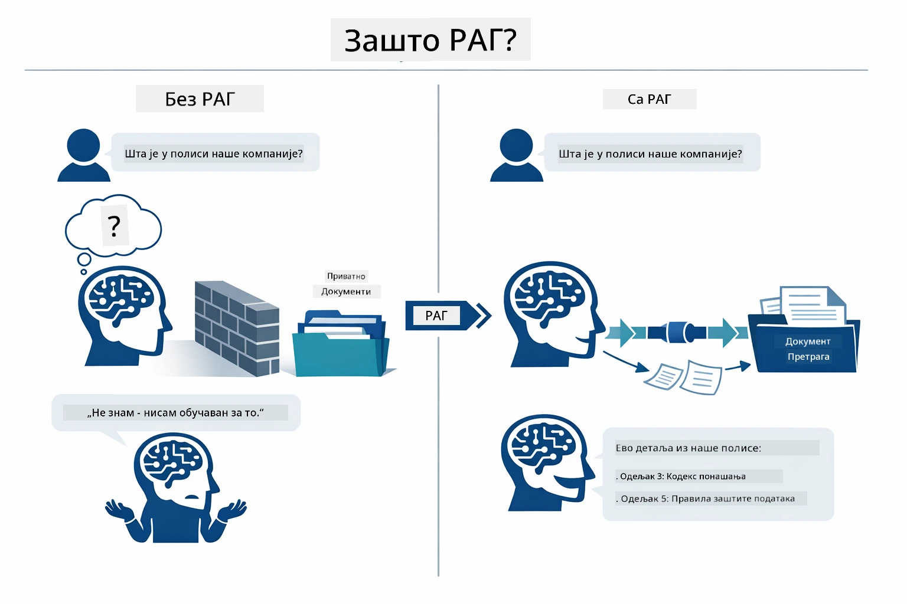

*Овај дијаграм приказује разлику између стандардног LLM-а (који погађа на основу података за обуку) и LLM-а побољшаног RAG-ом (који прво консултује ваше документе).*

Ево како се делови повезују од почетка до краја. Корисничко питање пролази кроз четири фазе — ембеддинг, векторску претрагу, састављање контекста и генерисање одговора — свака надограђујућа на претходну:


*Овај дијаграм приказује крај-до-краја RAG производну линију — кориснички упит пролази кроз ембеддинг, векторску претрагу, састављање контекста и генерисање одговора.*

Остатак овог модула детаљно пролази кроз сваку фазу са примерима кода које можете покренути и модификовати.

### Који RAG приступ овај туторијал користи?

LangChain4j нуди три начина за имплементацију RAG-а, сваки са различитим нивоом апстракције. Дијаграм испод их упоређује редом:

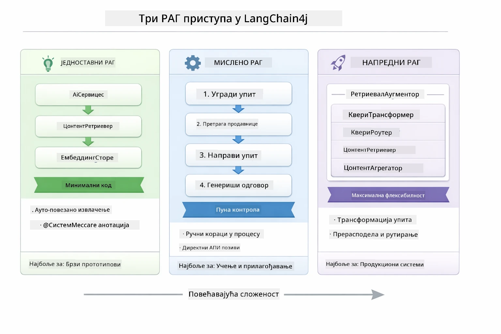

*Овај дијаграм упоређује три LangChain4j RAG приступа — Easy, Native и Advanced — показујући њихове кључне компоненте и када их користити.*

| Приступ | Шта ради | Компромис |
|---|---|---|
| **Easy RAG** | Све аутоматски спаја кроз `AiServices` и `ContentRetriever`. Аннотирате интерфејс, прикачите претраживач и LangChain4j управља ембеддингом, претрагом и састављањем упита у позадини. | Минимално кода, али не видите шта се дешава у сваком кораку. |
| **Native RAG** | Ви позивате ембеддинг модел, претражујете складиште, градите упит и генеришете одговор — један експлицитан корак по корак. | Више кода, али свака фаза је видљива и модификовала. |
| **Advanced RAG** | Користи `RetrievalAugmentor` оквир са плагин трансформерима упита, рутерима, поновним рангирањем и убризгавањем садржаја за производне пипелине. | Максимална флексибилност, али значајно више комплексности. |

**Овај туторијал користи Native приступ.** Сваку фазу RAG пипелина — ембеддинг упита, претрагу векторског складишта, састављање контекста и генерисање одговора — изричито пише [`RagService.java`](../../../03-rag/src/main/java/com/example/langchain4j/rag/service/RagService.java). Ово је намерно: као ресурс за учење, важније је да видите и разумете сваку фазу него да је код минимализован. Када будете сигурни у то како све делови функционишу, можете прелазити на Easy RAG за брзе прототипе или Advanced RAG за производне системе.

> **💡 Већ сте видели Easy RAG у акцији?** [Модул Брзи почетак](../00-quick-start/README.md) укључује пример Питања и Одговора на документима ([`SimpleReaderDemo.java`](../../../00-quick-start/src/main/java/com/example/langchain4j/quickstart/SimpleReaderDemo.java)) који користи Easy RAG приступ — LangChain4j аутоматски управља ембеддингом, претрагом и састављањем упита. Овај модул чини следећи корак разбијајући ту пипелину да бисте видели и контролисали сваку фазу.

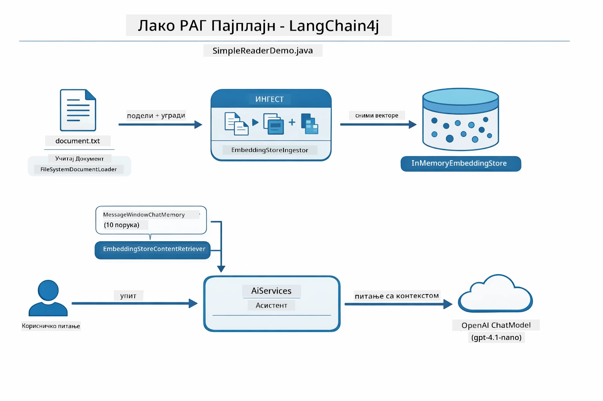

*Овај дијаграм приказује Easy RAG пипелин из `SimpleReaderDemo.java`. Упоредите са Native приступом коришћеним у овом модулу: Easy RAG крије ембеддинг, проналажење и састављање упита иза `AiServices` и `ContentRetriever` — учитате документ, прикачите претраживач и добијате одговоре. Native приступ у овом модулу отвара ту пипелину тако да ви позивате сваку фазу (ембед, претражи, састави контекст, генериши) за целокупну видљивост и контролу.*

## Како функционише

RAG производна линија у овом модулу се састоји из четири фазе које се извршавају секвенцијално сваки пут када корисник постави питање. Прво, отпремљени документ се **парсира и раздваја у сегменте** погодне величине. Ти сегменти се затим претварају у **векторске ембеддинге** и чувају како би се могло математички упоређивати. Када упит стигне, систем врши **семантичку претрагу** да пронађе најрелевантније сегменте, а на крају их прослеђује као контекст LLM-у за **генерисање одговора**. Донде секције детаљно објашњавају сваку фазу са стварним кодом и дијаграмима. Погледајмо први корак.

### Обрада докумената

[DocumentService.java](../../../03-rag/src/main/java/com/example/langchain4j/rag/service/DocumentService.java)

Када отпремите документ, систем га парсира (PDF или чист текст), прикачи метаподатке као што је име датотеке, и онда га раздваја у сегменте — мање делове који се удобно уклапају у контекст прозора модела. Те сегменте делимично преклапају тако да не изгубите контекст на границама.

```java
// Парсирајте отпремљену датотеку и упакујте је у LangChain4j документ
Document document = Document.from(content, metadata);

// Поделите у сегменте од 300 токена са преплитањем од 30 токена
DocumentSplitter splitter = DocumentSplitters
    .recursive(300, 30);

List<TextSegment> segments = splitter.split(document);
```
  
Дијаграм испод приказује како ово ради визуелно. Обратите пажњу како сваки сегмент дели неке токене са суседима — преклапање од 30 токена осигурава да не пропуштате битан контекст између:

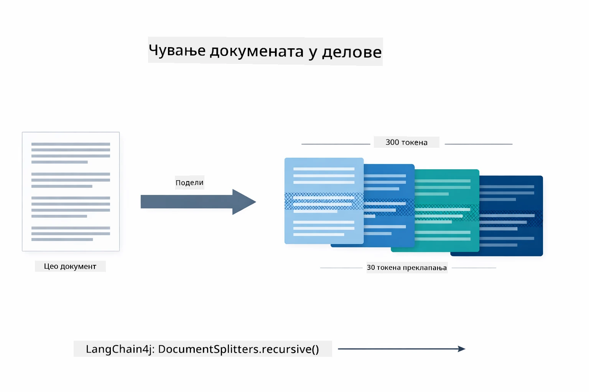

*Овај дијаграм приказује документ подељен у сегменте од 300 токена са преклапањем од 30 токена, чувајући контекст на границама сегмената.*

> **🤖 Испробајте са [GitHub Copilot](https://github.com/features/copilot) Чатом:** Отворите [`DocumentService.java`](../../../03-rag/src/main/java/com/example/langchain4j/rag/service/DocumentService.java) и питајте:  
> - „Како LangChain4j раздваја документе у сегменте и зашто је преклапање важно?“  
> - „Која је оптимална величина сегмента за различите типове докумената и зашто?“  
> - „Како да поступам са документима на више језика или са специјалним форматирањем?“

### Креирање ембеддинга

[LangChainRagConfig.java](../../../03-rag/src/main/java/com/example/langchain4j/rag/config/LangChainRagConfig.java)

Сваки сегмент се претвара у нумеричку представу која се зове ембеддинг — у суштини, претварач значења у бројеве. Ембеддинг модел није "интелигентан" као чат модел; не може да извршава инструкције, размишља или одговара на питања. Оно што може је да текст мапира у математички простор где слична значења завршавају близу једна другог — „ауто“ близу „аутомобил“, „политика повраћаја“ близу „врати ми новац“. Размислите о чат моделу као о особи с којом можете разговарати; ембеддинг модел је одличан систем за архивирање.

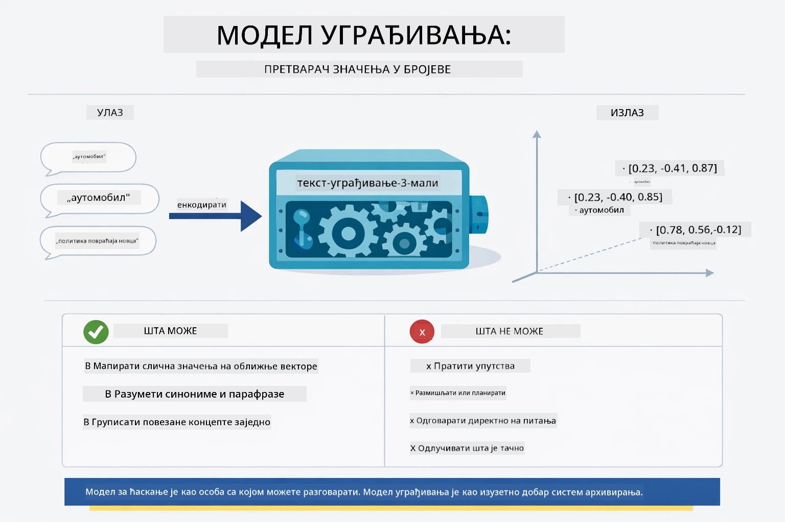

*Овај дијаграм приказује како ембеддинг модел претвара текст у нумеричке векторе, ставаљајући слична значења — као „ауто“ и „аутомобил“ — близу једна другог у векторском простору.*

```java
@Bean
public EmbeddingModel embeddingModel() {
    return OpenAiOfficialEmbeddingModel.builder()
        .baseUrl(azureOpenAiEndpoint)
        .apiKey(azureOpenAiKey)
        .modelName(azureEmbeddingDeploymentName)
        .build();
}

EmbeddingStore<TextSegment> embeddingStore = 
    new InMemoryEmbeddingStore<>();
```
  
Дијаграм класа испод приказује два одвојена тока у RAG пипелини и LangChain4j класе које их имплементирају. **Уносни ток** (извршава се једном при отпремању) раздваја документ, ембеддује сегменте и чува их преко `.addAll()`. **Упитни ток** (извршава се сваки пут када корисник пита) ембеддује питање, претражује складиште преко `.search()` и предаје пронађени контекст моделу за разговор. Оба тока се сусрећу на заједничком интерфејсу `EmbeddingStore<TextSegment>`:

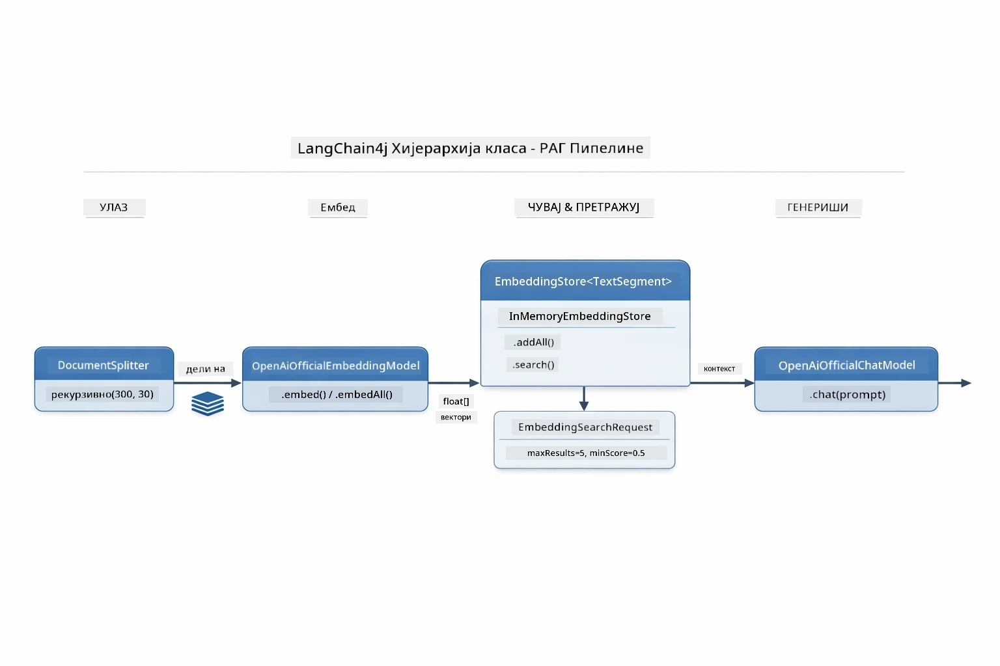

*Овај дијаграм приказује два тока у RAG пипелини — уносни и упитни — и како се повезују кроз заједнички EmbeddingStore.*

Када су ембеддинзи сачувани, сличан садржај природно клструје заједно у векторском простору. Визуализација испод приказује како документи о повезаним темама завршавају као блиски поени, што омогућава семантичку претрагу:


*Ова визуализација приказује како се сродни документи групишу у 3D векторском простору, са темама попут Техничка документа, Пословна правила и Често постављана питања формирајући посебне групе.*

Када корисник претражује, систем следи четири корака: ембеддује документе једном, ембеддује упит приликом сваке претраге, пореди вектор упита са свим сачуваним векторима коришћењем косинусне сличности, и враћа топ-K најбоље оцењених сегмената. Дијаграм испод објашњава сваки корак и LangChain4j класе које су укључене:

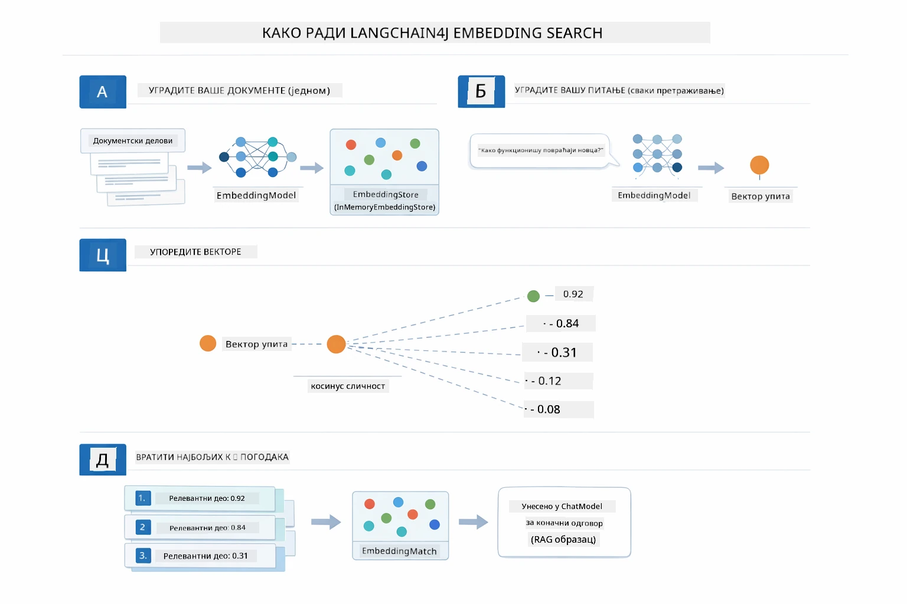

*Овај дијаграм приказује четворокорачни процес претраге ембеддингом: ембедовање докумената, ембедовање упита, упоређивање вектора косинусном сличношћу и враћање топ-K резултата.*

### Семантичка претрага

[RagService.java](../../../03-rag/src/main/java/com/example/langchain4j/rag/service/RagService.java)

Када поставите питање, ваше питање такође постаје ембеддинг. Систем упоређује ембеддинг вашег питања са ембеддингом свих сегмената докумената. Пронађе делове са најсличнијим значењима - не само по кључним речима, већ стварној семантичкој сличности.

```java
Embedding queryEmbedding = embeddingModel.embed(question).content();

EmbeddingSearchRequest searchRequest = EmbeddingSearchRequest.builder()
    .queryEmbedding(queryEmbedding)
    .maxResults(5)
    .minScore(0.5)
    .build();

EmbeddingSearchResult<TextSegment> searchResult = embeddingStore.search(searchRequest);
List<EmbeddingMatch<TextSegment>> matches = searchResult.matches();

for (EmbeddingMatch<TextSegment> match : matches) {
    String relevantText = match.embedded().text();
    double score = match.score();
}
```
  
Дијаграм испод супротставља семантичку претрагу и традиционалну претрагу по кључним речима. Претрага по кључној речи „возило“ пропушта део о „аутомобилима и камионима“, али семантичка претрага разуме да значе исто и враћа га као високо оцењену подударност:

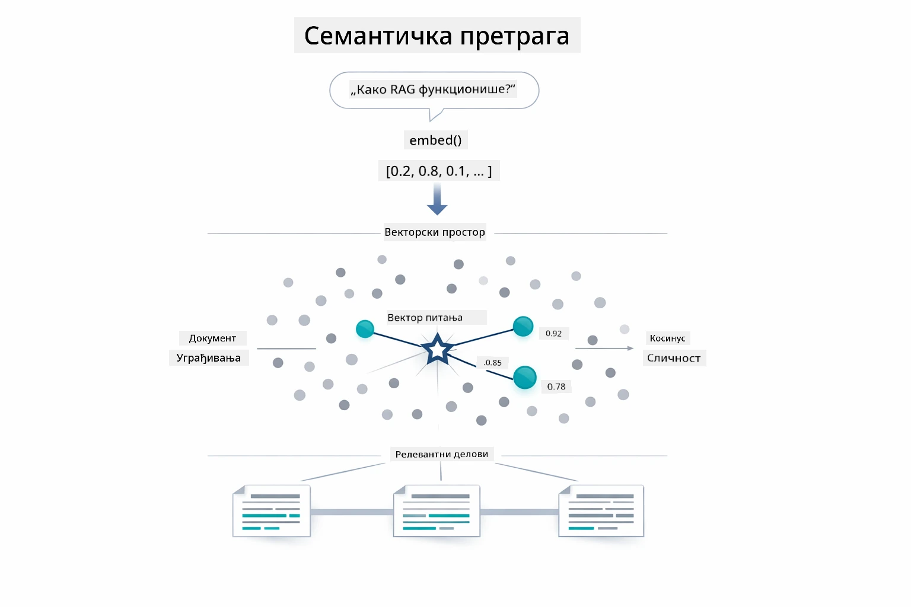

*Овај дијаграм упоређује претрагу по кључним речима са семантичком претрагом, показујући како семантичка претрага враћа концептуално повезан садржај чак и када се кључне речи не подударају.*

У позадини се сличност мери косинусном сличношћу — у суштини питањем „да ли ове две стрелице показују у истом правцу?“ Два сегмента могу користити потпуно различите речи, али ако значе исто, њихови вектори показују у истом правцу и имају скор близу 1.0:

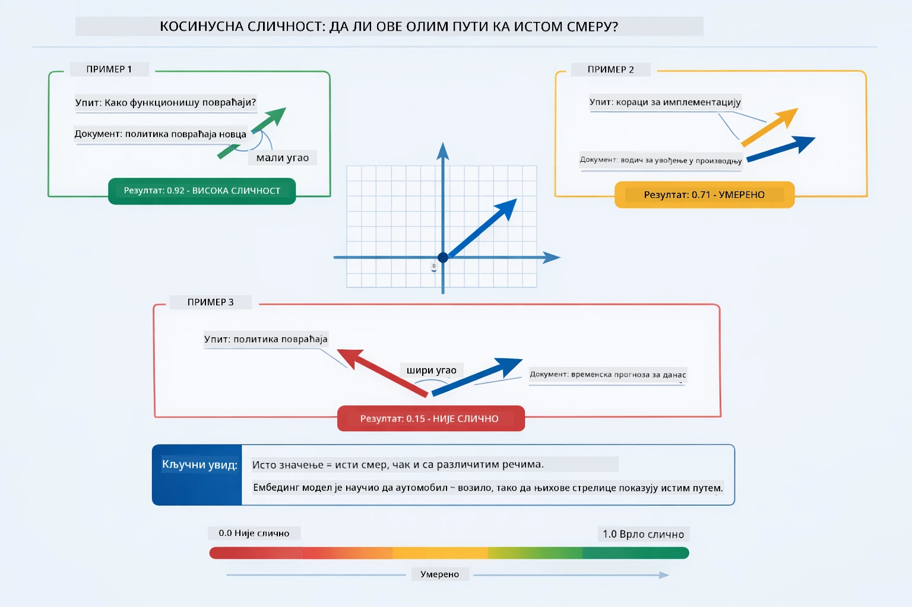
*Овај дијаграм илуструје косинусну сличност као угао између вектора уграђивања — више поравнани вектори добијају резултат ближи 1.0, што означава већу семантичку сличност.*

> **🤖 Испробај са [GitHub Copilot](https://github.com/features/copilot) Chat:** Отвори [`RagService.java`](../../../03-rag/src/main/java/com/example/langchain4j/rag/service/RagService.java) и питај:
> - "Како функционише претраживање по сличности са embeddings и шта одређује резултат?"
> - "Који прагови сличности треба да користим и како утичу на резултате?"
> - "Како да поступим у случајевима када не постоје релевантни документи?"

### Генерисање одговора

[RagService.java](../../../03-rag/src/main/java/com/example/langchain4j/rag/service/RagService.java)

Најрелевантнији делови се састављају у структуирани упит који укључује јасна упутства, преузети контекст и корисниково питање. Модел чита те конкретне делове и одговара на основу тог садржаја — може користити само оно што је пред њим, што спречава халуцинације.

```java
String context = matches.stream()
    .map(match -> match.embedded().text())
    .collect(Collectors.joining("\n\n"));

String prompt = String.format("""
    Answer the question based on the following context.
    If the answer cannot be found in the context, say so.

    Context:
    %s

    Question: %s

    Answer:""", context, request.question());

String answer = chatModel.chat(prompt);
```

Дијаграм испод показује како ова скупштина функционише — делови са највишим резултатом са претраживања убацују се у шаблон упита, а `OpenAiOfficialChatModel` генерише утемељен одговор:

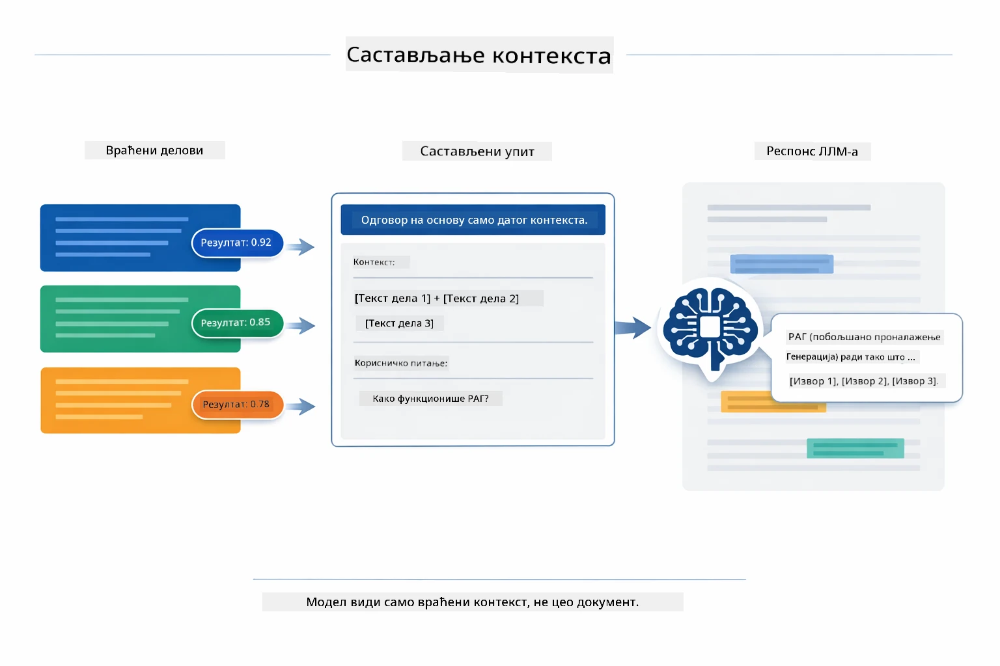

*Овај дијаграм приказује како се делови са највишим резултатом састављају у структуирани упит, омогућавајући моделу да генерише утемељен одговор из ваших података.*

## Покретање апликације

**Потврдите инсталацију:**

Проверите да ли датотека `.env` постоји у коренском директоријуму са Azure акредитивима (направљена током Модула 01):

**Bash:**
```bash
cat ../.env  # Требало би да прикаже AZURE_OPENAI_ENDPOINT, API_KEY, DEPLOYMENT
```

**PowerShell:**
```powershell
Get-Content ..\.env  # Требало би да прикаже AZURE_OPENAI_ENDPOINT, API_KEY, DEPLOYMENT
```

**Покрените апликацију:**

> **Напомена:** Ако сте већ покренули све апликације користећи `./start-all.sh` из Модула 01, овај модул већ ради на порту 8081. Можете прескочити наредбе за покретање испод и директно отићи на http://localhost:8081.

**Опција 1: Коришћење Spring Boot Dashboard-а (Рекомандовано за кориснике VS Code-а)**

Развојни контејнер укључује екстензију Spring Boot Dashboard-а, која пружа визуелни интерфејс за управљање свим Spring Boot апликацијама. Можете је пронаћи у Activity Bar са леве стране VS Code-а (потражите Spring Boot иконицу).

Из Spring Boot Dashboard-а можете:
- Видети све доступне Spring Boot апликације у радном простору
- Покренути/зауставити апликације једним кликом
- Пратити логове апликација у реалном времену
- Надгледати статус апликација

Једноставно кликните на дугме play поред "rag" да покренете овај модул, или покрените све модуле одједном.


*Овај снимак екрана показује Spring Boot Dashboard у VS Code-у, где можете визуелно покретати, заустављати и надгледати апликације.*

**Опција 2: Коришћење shell скрипти**

Покрените све веб апликације (модул 01-04):

**Bash:**
```bash
cd ..  # Из коренског директоријума
./start-all.sh
```

**PowerShell:**
```powershell
cd ..  # Из корен директоријума
.\start-all.ps1
```

Или покрените само овај модул:

**Bash:**
```bash
cd 03-rag
./start.sh
```

**PowerShell:**
```powershell
cd 03-rag
.\start.ps1
```

Обе скрипте аутоматски учитавају променљиве окружења из коренске `.env` датотеке и изградиће JAR-ове ако не постоје.

> **Напомена:** Ако више волите да ручно изградите све модуле пре покретања:
>
> **Bash:**
> ```bash
> cd ..  # Go to root directory
> mvn clean package -DskipTests
> ```
>
> **PowerShell:**
> ```powershell
> cd ..  # Go to root directory
> mvn clean package -DskipTests
> ```

Отворите http://localhost:8081 у вашем прегледачу.

**За заустављање:**

**Bash:**
```bash
./stop.sh  # Само овај модул
# Или
cd .. && ./stop-all.sh  # Сви модули
```

**PowerShell:**
```powershell
.\stop.ps1  # Само овај модул
# Или
cd ..; .\stop-all.ps1  # Сви модули
```

## Коришћење апликације

Апликација пружа веб интерфејс за отпремање докумената и постављање питања.

<a href="images/rag-homepage.png"></a>

*Овај снимак екрана приказује интерфејс RAG апликације где отпремате документе и постављате питања.*

### Отпремите документ

Почните отпремањем документа — TXT фајлови су најбољи за тестирање. У овом директоријуму постоји `sample-document.txt` који садржи информације о функцијама LangChain4j, имплементацији RAG и најбољим праксама — савршено за тестирање система.

Систем обрађује ваш документ, дели га на делове и креира embeddings за сваки део. Ово се догађа аутоматски чим отпремите документ.

### Постављајте питања

Сада питајте конкретна питања везана за садржај документа. Испробајте нешто чињенично што је јасно наведено у документу. Систем претражује релевантне делове, укључује их у упит и генерише одговор.

### Провера референци извора

Обратите пажњу да сваки одговор укључује референце извора са оценама сличности. Ове оцене (од 0 до 1) показују колико је сваки део био релевантан вашем питању. Веће оцене значе боље поклапање. Ово вам омогућава да проверите одговор у односу на изворни материјал.

<a href="images/rag-query-results.png"></a>

*Овај снимак екрана приказује резултате упита са генерисаним одговором, референцама извора и оценама релевантности за сваки преузети део.*

### Експериментишите са питањима

Испробајте различите врсте питања:
- Конкретне чињенице: "Која је главна тема?"
- Поређења: "Која је разлика између X и Y?"
- Сажетке: "Сажми кључне тачке о Z"

Пратите како се оцене релевантности мењају у зависности од тога колико ваше питање одговара садржају документа.

## Кључни појмови

### Стратегија дељења на делове (Chunking)

Документи се деле у делове од по 300 токена са преклапањем од 30 токена. Ова равнотежа осигурава да сваки део има довољно контекста да буде значајан, а истовремено буде довољно мали да се више делова може укључити у један упит.

### Оцене сличности

Свaki преузети део долази са оценом сличности између 0 и 1, која показује колико је тај део близак корисниковом питању. Дијаграм испод визуелно приказује распоне оцена и како систем користи те вредности за филтрирање резултата:

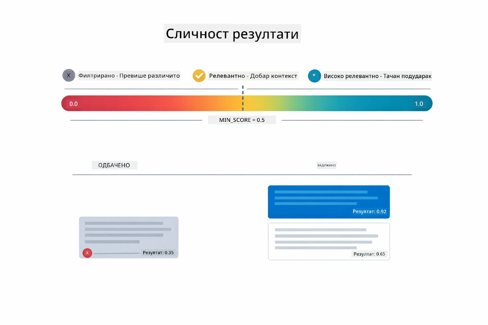

*Овај дијаграм приказује распоне оцена од 0 до 1, са минималним прагом 0.5 који филтрира нерелевантне делове.*

Оцене се крећу од 0 до 1:
- 0.7-1.0: Врло релевантно, прецизно поклапање
- 0.5-0.7: Релевантно, добар контекст
- Испод 0.5: Филтрирано, превише различито

Систем преузима само делове изнад минималног прага како би осигурао квалитет.

Embeddings добро раде када значења формирају јасне групе, али имају и слабости. Дијаграм испод показује уобичајене начине неуспеха — делови који су превелики дају мутне векторе, делови који су премали немају довољан контекст, нејасни термини упућују на више група, и прецизна претраживања (ИД-ови, бројеви делова) уопште не раде са embeddings:

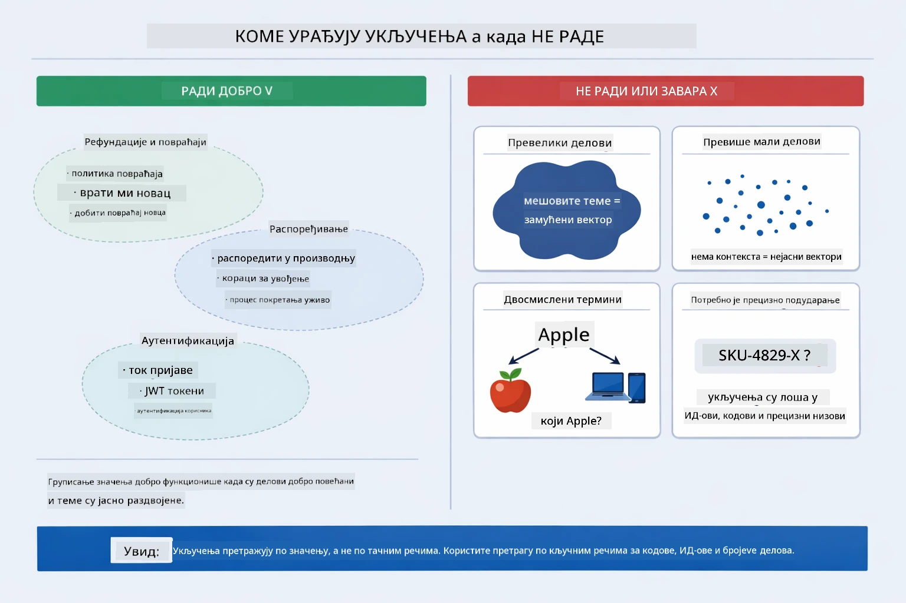

*Овај дијаграм приказује уобичајене начине неуспеха embeddings: делови превелики, делови премали, нејасни термини који упућују на више група и прецизна претраживања као што су ИД-ови.*

### Чување у меморији

Овај модул користи складиштење у меморији ради једноставности. Када поново покренете апликацију, отпремљени документи се губе. Продукциони системи користе перзистентне вектор базе података као што су Qdrant или Azure AI Search.

### Управљање контекстним прозором

Сваки модел има максимални контекстни прозор. Не можете укључити сваки део великог документа. Систем преузима најрелевантнијих N делова (подразумевано 5) да остане унутар ограничења, а да при томе обезбеди довољно контекста за тачне одговоре.

## Када је RAG важан

RAG није увек прави приступ. Водич за одлучивање испод помаже да утврдите када RAG додаје вредност у односу на једноставније приступе — као што је укључивање садржаја директно у упит или ослањање на уграђено знање модела:

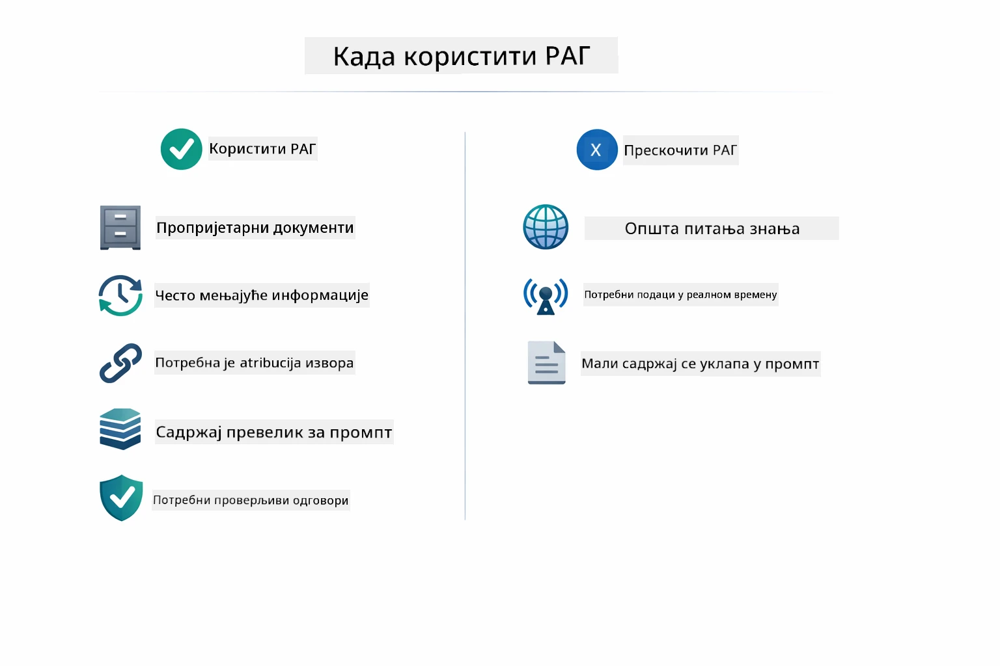

*Овај дијаграм приказује водич за одлучивање када RAG додаје вредност, а када су довољни једноставнији приступи.*

**Користите RAG када:**
- Одговарате на питања о приватним документима
- Информације се често мењају (политике, цене, спецификације)
- Тачност захтева навођење извора
- Садржај је превелик да стане у један упит
- Потребни су вам проверљиви, базирани одговори

**Немојте користити RAG када:**
- Питања захтевају опште знање које модел већ поседује
- Потребни су подаци у реалном времену (RAG ради само с отпремљеним документима)
- Садржај је довољно мали да се укључи директно у упите

## Следећи кораци

**Следећи модул:** [04-tools - AI Agents with Tools](../04-tools/README.md)

---

**Навигација:** [← Претходно: Модул 02 - Prompt Engineering](../02-prompt-engineering/README.md) | [Назад на Главну](../README.md) | [Следеће: Модул 04 - Tools →](../04-tools/README.md)

---

<!-- CO-OP TRANSLATOR DISCLAIMER START -->
**Ослобађање од одговорности**:  
Овај документ је преведен коришћењем AI услуге за превођење [Co-op Translator](https://github.com/Azure/co-op-translator). Иако тежимо прецизности, молимо вас да имате на уму да аутоматски преводи могу садржати грешке или нетачности. Оригинални документ на његовом изворном језику треба сматрати ауторитетним извором. За критичне информације препоручује се професионалан превод од стране људског преводиоца. Не одговарамо за било какве неспоразуме или погрешне тумачења настала употребом овог превода.
<!-- CO-OP TRANSLATOR DISCLAIMER END -->