# Модул 04: AI агенти са алаткама

## Садржај

- [Водич кроз видео](../../../04-tools)
- [Шта ћете научити](../../../04-tools)
- [Предзнања](../../../04-tools)
- [Разумевање AI агената са алаткама](../../../04-tools)
- [Како функционише позивање алатки](../../../04-tools)
  - [Дефиниције алатки](../../../04-tools)
  - [Доношење одлука](../../../04-tools)
  - [Извршење](../../../04-tools)
  - [Генерисање одговора](../../../04-tools)
  - [Архитектура: Spring Boot аутоматско повезивање](../../../04-tools)
- [Повезивање алатки](../../../04-tools)
- [Покретање апликације](../../../04-tools)
- [Коришћење апликације](../../../04-tools)
  - [Пробајте једноставно коришћење алатке](../../../04-tools)
  - [Тестирајте повезивање алатки](../../../04-tools)
  - [Погледајте ток разговора](../../../04-tools)
  - [Експериментишите са различитим захтевима](../../../04-tools)
- [Кључни појмови](../../../04-tools)
  - [ReAct обрасци (рачунање и деловање)](../../../04-tools)
  - [Опис алатки је важан](../../../04-tools)
  - [Управљање сесијом](../../../04-tools)
  - [Руковање грешкама](../../../04-tools)
- [Располиживе алатке](../../../04-tools)
- [Када користити агенте базиране на алаткама](../../../04-tools)
- [Алатке у поређењу са RAG](../../../04-tools)
- [Следећи кораци](../../../04-tools)

## Водич кроз видео

Погледајте ову уживо сесију која објашњава како почети са овим модулом:

<a href="https://www.youtube.com/watch?v=O_J30kZc0rw"></a>

## Шта ћете научити

До сада сте научили како водити разговоре са AI, како ефикасно структуирати упите и како засновати одговоре на вашим документима. Али постоји основно ограничење: модели језика могу само да генеришу текст. Они не могу да провере време, израчунају нешто, упитују базе података или комуницирају са спољним системима.

Алатке мењају то. Омогућавајући моделу приступ функцијама које може позивати, трансформишете га из генератора текста у агента који може предузимати акције. Модел одлучује када му треба алатка, коју алатку да користи и које параметре да проследи. Ваш код извршава функцију и враћа резултат. Модел уноси тај резултат у свој одговор.

## Предзнања

- Завршен [Модул 01 - Увод](../01-introduction/README.md) (размештени Azure OpenAI ресурси)
- Препоручује се завршетак претходних модула (овaj модул референцира [RAG концепте из Модула 03](../03-rag/README.md) у поређењу алатки и RAG)
- `.env` фајл у коренском директоријуму са Azure акредитивима (направљен командом `azd up` у Модулу 01)

> **Напомена:** Ако нисте завршили Модул 01, пратите упутства за постављање тамо прво.

## Разумевање AI агената са алаткама

> **📝 Напомена:** Термин „агенти“ у овом модулу односи се на AI асистенте који су побољшани могућношћу позивања алатки. Ово се разликује од **Agentic AI** образаца (аутономни агенти са планирањем, меморијом и вишестепеним размишљањем) које ћемо обрадити у [Модул 05: MCP](../05-mcp/README.md).

Без алатки, модел језика може само да генерише текст из свог тренинг скупа података. Питајте га какво је време у уређају и мораће да погађа. Додајте му алатке и он може позвати API за време, извршити прорачуне или упитати базу података — и онда уградити те стварне резултате у свој одговор.

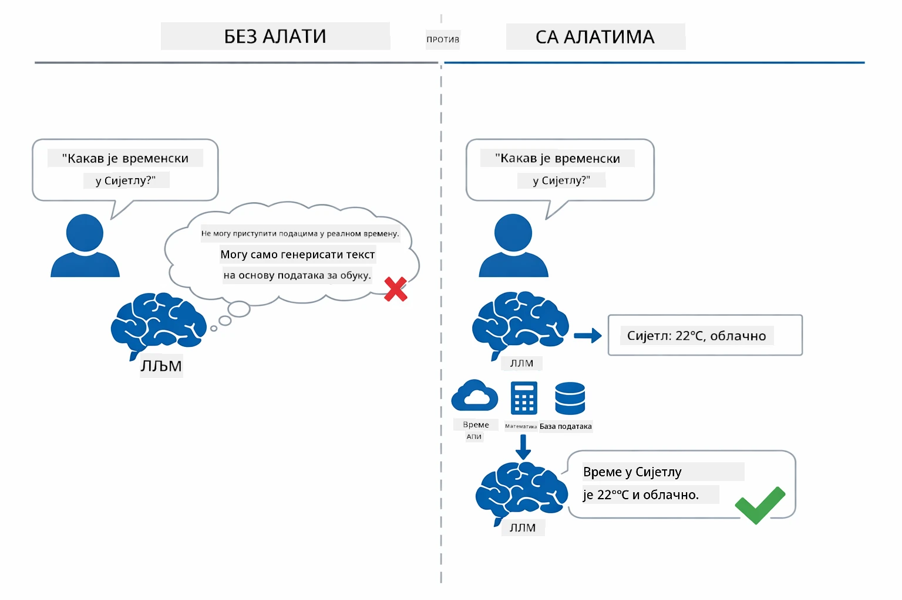

*Без алатки модел само погађа — са алаткама може позивати API-је, извршавати прорачуне и враћати податке у реалном времену.*

AI агент са алаткама прати **Reasoning and Acting (ReAct)** образац. Модел не само да одговара — он размишља шта му треба, делује позивајући алатку, прати резултат и онда одлучује да ли да поново делује или да достави коначни одговор:

1. **Размишљање** — Агент анализира корисничко питање и утврђује које информације су му потребне
2. **Деловање** — Агент бира праву алатку, генерише одговарајуће параметре и позива је
3. **Прати** — Агент добија излаз алатке и процењује резултат
4. **Понавља или одговара** — Ако је потребно више података, агент се враћа на почетак; у супротном, саставља природно језички одговор

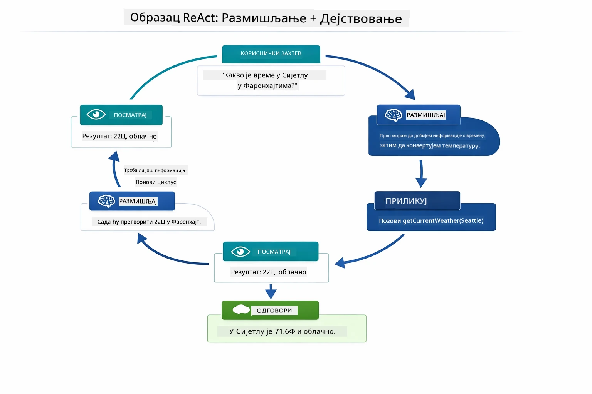

*ReAct циклус — агент размишља шта да уради, делује позивајући алатку, прати резултат и врти се док не може дати коначни одговор.*

Ово се дешава аутоматски. Ви дефинишете алатке и њихове описе. Модел сам одлучује када и како да их користи.

## Како функционише позивање алатки

### Дефиниције алатки

[WeatherTool.java](../../../04-tools/src/main/java/com/example/langchain4j/agents/tools/WeatherTool.java) | [TemperatureTool.java](../../../04-tools/src/main/java/com/example/langchain4j/agents/tools/TemperatureTool.java)

Дефинишете функције са јасним описима и спецификацијом параметара. Модел види те описе у свом системском упиту и разуме шта свака алатка ради.

```java
@Component
public class WeatherTool {
    
    @Tool("Get the current weather for a location")
    public String getCurrentWeather(@P("Location name") String location) {
        // Логика вашег претраживања временске прогнозе
        return "Weather in " + location + ": 22°C, cloudy";
    }
}

@AiService
public interface Assistant {
    String chat(@MemoryId String sessionId, @UserMessage String message);
}

// Помоћник је аутоматски повезан помоћу Spring Boot-а са:
// - ChatModel бином
// - Све @Tool методе из @Component класа
// - ChatMemoryProvider за управљање сесијом
```

Дијаграм испод разлаже сваку анотацију и показује како сваки део помаже AI да разуме када да позове алатку и које аргументе да проследи:

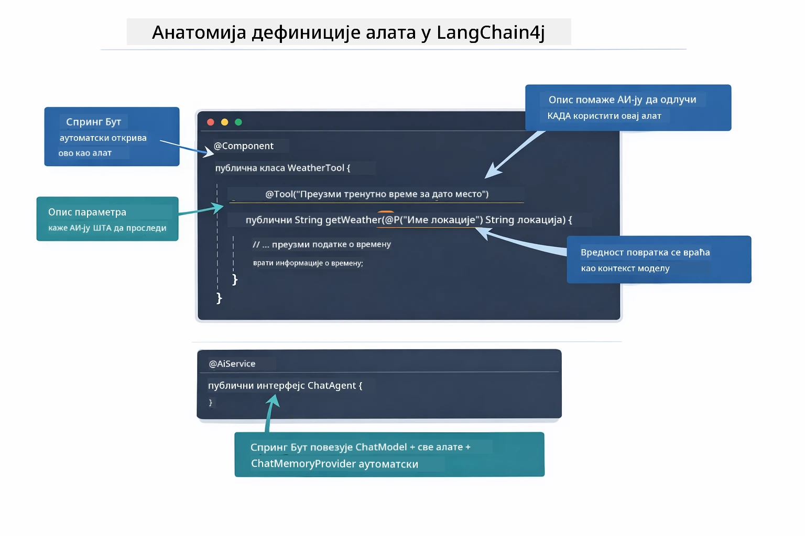

*Анатомија дефиниције алатке — @Tool говори AI кад да је користи, @P описује сваки параметар, а @AiService у стартовању повезује све заједно.*

> **🤖 Пробајте са [GitHub Copilot](https://github.com/features/copilot) Chat:** Отворите [`WeatherTool.java`](../../../04-tools/src/main/java/com/example/langchain4j/agents/tools/WeatherTool.java) и питајте:
> - "Како бих интегрисао прави API за време као OpenWeatherMap уместо лажних података?"
> - "Шта чини добар опис алатке који помаже AI да је правилно користи?"
> - "Како да обрађујем грешке API-ја и ограничења учесталости у имплементацији алатки?"

### Доношење одлука

Када корисник пита „Какво је време у Сијетлу?“, модел не бира алатку насумично. Он упоређује намеру корисника са описима свих алатки којима има приступ, даје оцена важности и бира најбољи одговарајући алат. Онда генерише структуирани позив функције са одговарајућим параметрима — у овом случају, поставља `location` на `"Seattle"`.

Ако ниједна алатка не одговара корисничком захтеву, модел се враћа одговарању на основу свог знања. Ако више алатки одговара, он бира најспецифичнију.

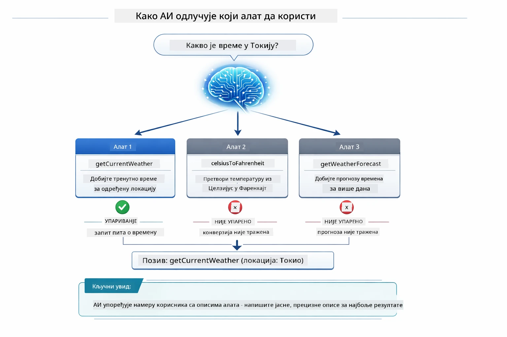

*Модел процењује сваку доступну алатку у односу на намеру корисника и бира најбољу — зато је важно писати јасне и специфичне описе алатки.*

### Извршење

[AgentService.java](../../../04-tools/src/main/java/com/example/langchain4j/agents/service/AgentService.java)

Spring Boot аутоматски повезује декларативни `@AiService` интерфејс са свим регистрованим алаткама, а LangChain4j аутоматски извршава позиве алатки. Испод хаубе, цео позив алатки тече кроз шест фаза — од корисничког питања у природном језику па све до одговора у природном језику:

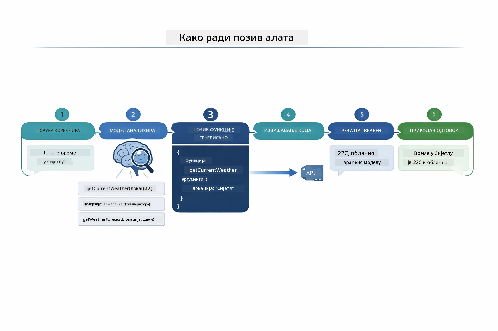

*Потпуни ток — корисник поставља питање, модел бира алатку, LangChain4j је извршава, а модел уграђује резултат у природан одговор.*

Ако сте покренули [ToolIntegrationDemo](../../../00-quick-start/src/main/java/com/example/langchain4j/quickstart/ToolIntegrationDemo.java) у Модулу 00, већ сте видели овај образац у акцији — алатке `Calculator` су позиване на исти начин. Дијаграм секвенце испод приказује шта се тачно десило испод хаубе током тог демо-а:

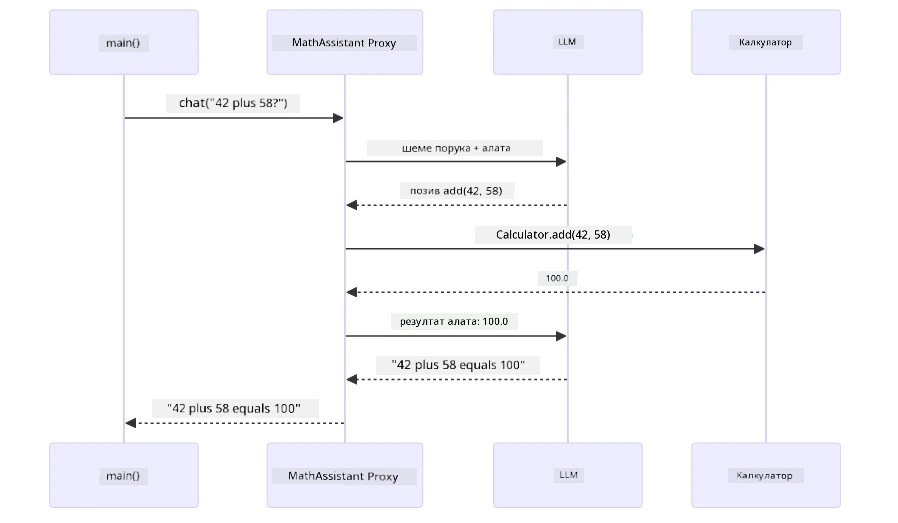

*Луп позива алатки из Quick Start демо-а — `AiServices` шаље вашу поруку и шеме алатки у LLM, LLM одговара позивом функције као што је `add(42, 58)`, LangChain4j локално извршава `Calculator` методу, и враћа резултат назад за коначни одговор.*

> **🤖 Пробајте са [GitHub Copilot](https://github.com/features/copilot) Chat:** Отворите [`AgentService.java`](../../../04-tools/src/main/java/com/example/langchain4j/agents/service/AgentService.java) и питајте:
> - "Како ради ReAct образац и зашто је ефикасан за AI агенте?"
> - "Како агент одлучује коју алатку да користи и у ком редоследу?"
> - "Шта се дешава ако извршење алатке не успе - како да безбедно обрадим грешке?"

### Генерисање одговора

Модел прими податке о времену и форматира их у природан језички одговор за корисника.

### Архитектура: Spring Boot аутоматско повезивање

Овај модул користи LangChain4j Spring Boot интеграцију са декларативним `@AiService` интерфејсима. При покретању, Spring Boot открива сваки `@Component` који садржи `@Tool` методе, ваш `ChatModel` bean и `ChatMemoryProvider` — па их све повезује у један `Assistant` интерфејс без икаквог додатног кода.

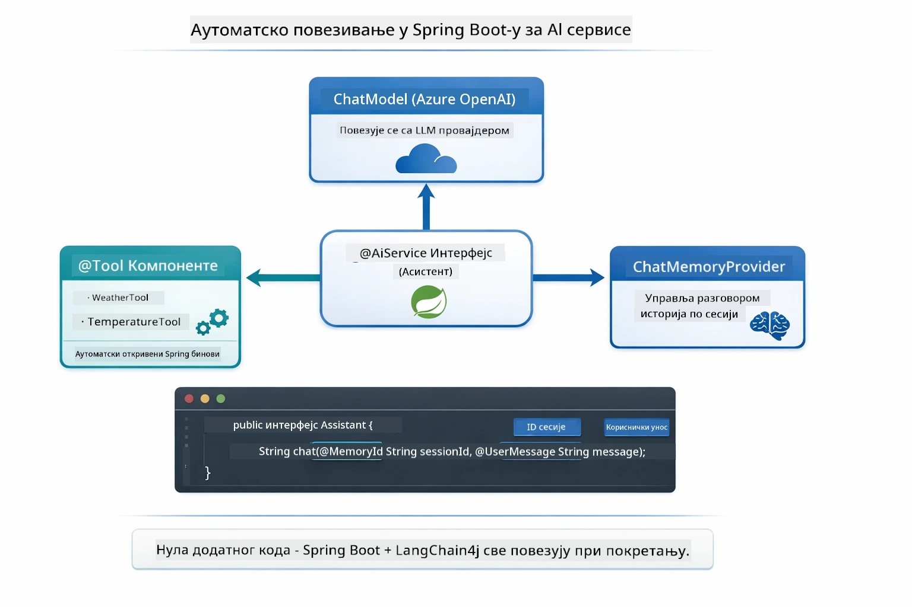

*@AiService интерфејс повезује ChatModel, компоненте алатки и провајдер меморије — Spring Boot све аутоматски повезује.*

Ево комплетног животног циклуса захтева као дијаграма секвенце — од HTTP захтева, преко контролера, сервиса и аутоматски повезаног proxy-ја, све до извршења алатке и повратка:

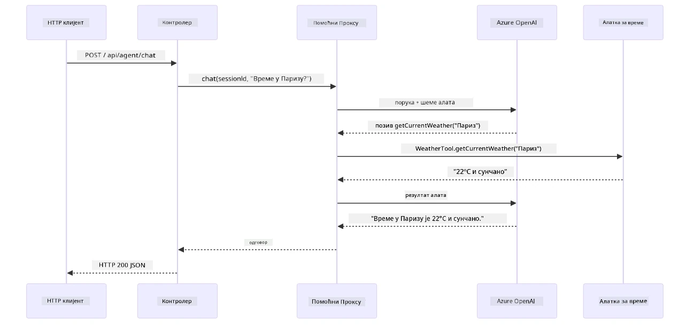

*Комплетан животни циклус HTTP захтева - захтев тече кроз контролер и сервис до аутоматски повезаног Assistant proxy-ја, који аутоматски координише LLM и позиве алатки.*

Кључне предности овог приступа:

- **Spring Boot аутоматско повезивање** — ChatModel и алатке се аутоматски инјектују
- **@MemoryId образац** — Аутоматско управљање меморијом заснованом на сесији
- **Једна инстанца** — Assistant се креира једном и реупотребљава ради боље перформансе
- **Типски безбедно извршење** — Java методе се позивају директно са конверзијом типова
- **Оркестрација више корака** — Аутоматски управља повезивањем алатки
- **Нула шаблонског кода** — Нема ручних позива `AiServices.builder()` или меморијског HashMap-а

Алтернативни приступи (ручно коришћење `AiServices.builder()`) захтевају више кода и немају предности Spring Boot интеграције.

## Повезивање алатки

**Повезивање алатки** — стварна снага агената базираних на алаткама показује се када једно питање захтева више алатки. Питајте „Какво је време у Сијетлу у Фаренхајтима?“ и агент аутоматски повезује две алатке: прво позива `getCurrentWeather` да добије температуру у Целзијусима, а затим ту вредност прослеђује у `celsiusToFahrenheit` за конверзију — све у једном кораку разговора.

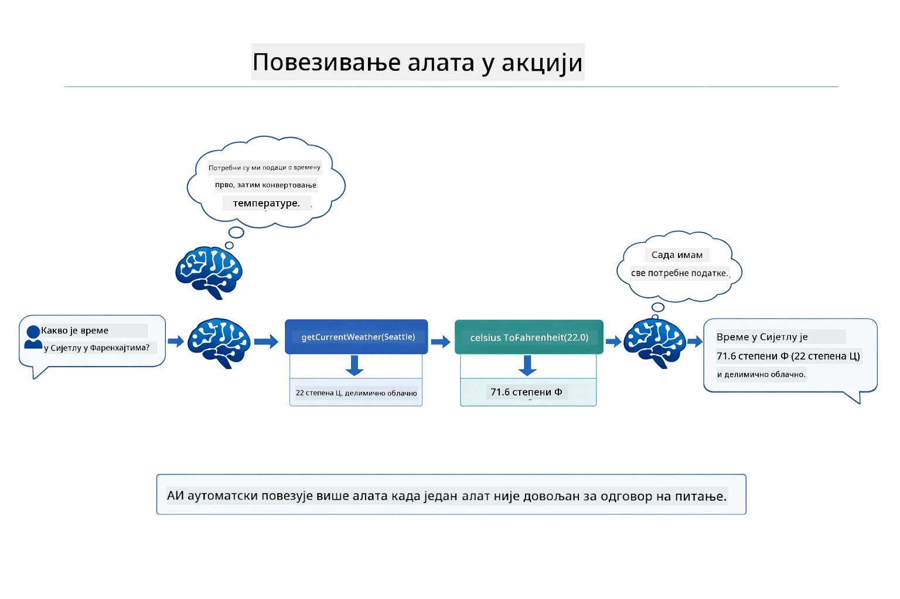

*Повезивање алатки у пракси — агент прво позива getCurrentWeather, затим резултат у Целзијусима пропушта кроз celsiusToFahrenheit и даје комбинивани одговор.*

**Љубазно руковање грешкама** — Питајте за време у граду који није у лажној бази података. Алатка враћа поруку о грешци, а AI објашњава да не може да помогне уместо да апликација падне. Алатке безбедно падају. Дијаграм испод упоређује ова два приступа — уз исправно руковање грешкама агент хвата изузетак и одговара корисно, док без тога цела апликација пада:

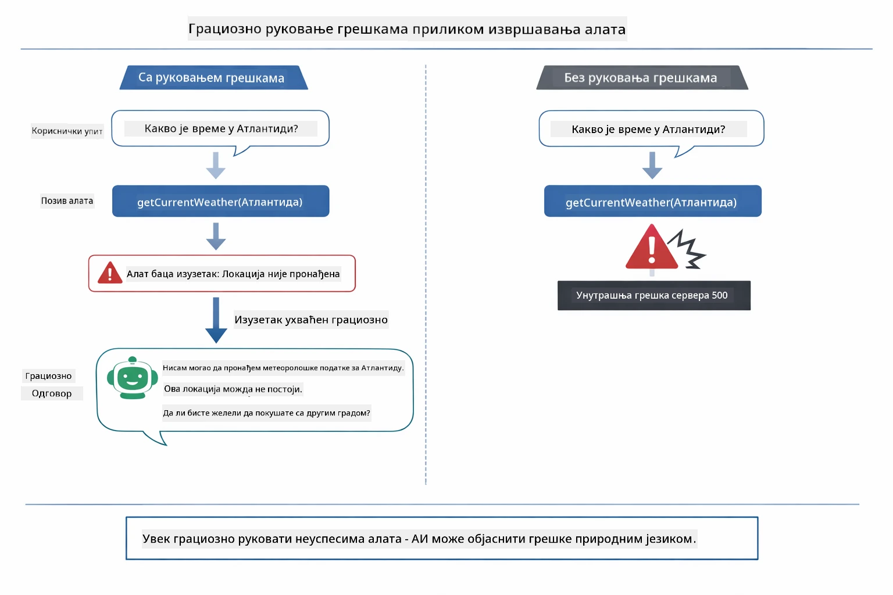

*Када алатка падне, агент хвата грешку и одговара корисним објашњењем уместо да се сруши.*

Ово се дешава у једном кораку разговора. Агент аутономно оркестрира више позива алатки.

## Покретање апликације

**Потврдите постављање:**

Уверите се да `.env` фајл постоји у коренском директоријуму са Azure акредитивима (направљен током Модула 01). Покрените ово из директоријума овог модула (`04-tools/`):

**Bash:**
```bash
cat ../.env  # Требало би да приказује AZURE_OPENAI_ENDPOINT, API_KEY, DEPLOYMENT
```

**PowerShell:**
```powershell
Get-Content ..\.env  # Треба да приказује AZURE_OPENAI_ENDPOINT, API_KEY, DEPLOYMENT
```

**Покрените апликацију:**

> **Напомена:** Ако сте већ покренули све апликације користећи `./start-all.sh` из коренског директоријума (као што је описано у Модулу 01), овај модул већ ради на порту 8084. Можете прескочити следеће команде и отићи директно на http://localhost:8084.

**Опција 1: Коришћење Spring Boot Dashboard-а (препоручено за кориснике VS Code-а)**

Дев контејнер укључује екстензију Spring Boot Dashboard, која пружа визуелни интерфејс за управљање свим Spring Boot апликацијама. Можете је пронаћи у Activity Bar-у са леве стране VS Code-а (потражите Spring Boot иконицу).

Из Spring Boot Dashboard-а можете:
- Виде све доступне Spring Boot апликације у радном простору
- Покренути/пауирати апликације једним кликом
- Пратити логове апликације у реалном времену
- Пратити статус апликације
Једноставно кликните на дугме за репродукцију поред „tools“ да бисте покренули овај модул, или покрените све модуле одједном.

Ево како изгледа Spring Boot Dashboard у VS Code:


*Spring Boot Dashboard у VS Code — покрените, зауставите и пратите све модуле са једног места*

**Опција 2: Коришћење shell скрипти**

Покрените све веб апликације (модули 01-04):

**Bash:**
```bash
cd ..  # Из корен директоријума
./start-all.sh
```

**PowerShell:**
```powershell
cd ..  # Из коренског директоријума
.\start-all.ps1
```

Или покрените само овај модул:

**Bash:**
```bash
cd 04-tools
./start.sh
```

**PowerShell:**
```powershell
cd 04-tools
.\start.ps1
```

Обе скрипте аутоматски учитавају променљиве окружења из `.env` фајла у коренском фолдеру и правиће JAR фајлове ако не постоје.

> **Белешка:** Ако желите да ручно направите све модуле пре покретања:
>
> **Bash:**
> ```bash
> cd ..  # Go to root directory
> mvn clean package -DskipTests
> ```
>
> **PowerShell:**
> ```powershell
> cd ..  # Go to root directory
> mvn clean package -DskipTests
> ```

Отворите http://localhost:8084 у вашем прегледачу.

**Да зауставите:**

**Bash:**
```bash
./stop.sh  # Само овај модул
# Или
cd .. && ./stop-all.sh  # Сви модули
```

**PowerShell:**
```powershell
.\stop.ps1  # Само овај модул
# Или
cd ..; .\stop-all.ps1  # Сви модули
```

## Коришћење апликације

Апликација пружа веб интерфејс где можете комуницирати са AI агентом који има приступ алатима за време и конверзију температуре. Ево како интерфејс изгледа — укључује примере за брзи почетак и ћаскање за слање захтева:

<a href="images/tools-homepage.png"></a>

*AI Agent Tools интерфејс - брзи примери и интерфејс за ћаскање за интеракцију са алатима*

### Испробајте једноставну употребу алата

Почните са једноставним захтевом: „Конвертуј 100 степени Фаренхајта у Целзијус“. Агент препознаје да треба да користи алат за конверзију температуре, позива га са тачним параметрима и враћа резултат. Обратите пажњу колико је ово природно — нисте специфицирали који алат да се користи нити како да га позове.

### Тестирајте ланац алата

Сада покушајте нешто комплексније: „Какво је време у Сијетлу и конвертуј га у Фаренхајт?“ Пратите како агент решава ово у корацима. Прво добија информације о времену (које враћа у Целзијусима), препознаје да мора да конвертује у Фаренхајт, позива алат за конверзију и комбинује оба резултата у један одговор.

### Погледајте ток разговора

Интерфејс за ћаскање чува историју разговора, омогућавајући да имате више размена. Можете видети све претходне упите и одговоре, што олакшава праћење разговора и разумевање како агент гради контекст кроз више интеракција.

<a href="images/tools-conversation-demo.png"></a>

*Више корака разговора који приказује једноставне конверзије, прегледе времена и ланце алата*

### Испробајте различите захтеве

Покушајте различите комбиновације:
- Преглед времена: „Какво је време у Токију?“
- Конверзије температуре: „Колико је 25°C у Келвинима?“
- Комбиновани упити: „Провери време у Паризу и реци ми да ли је изнад 20°C“

Обратите пажњу како агент тумачи природни језик и мапира га на одговарајуће позиве алата.

## Кључни појмови

### ReAct образац (Размишљање и деловање)

Агент наизменично размисли (одлучује шта да ради) и делује (користи алате). Овај образац омогућава аутономно решавање проблема уместо само одговарања на инструкције.

### Описи алата су важни

Квалитет описа ваших алата директно утиче на то како агент користи те алате. Јасни, специфични описи помажу моделу да разуме када и како позвати сваки алат.

### Управљање сесијом

`@MemoryId` анотација омогућава аутоматско управљање меморијом базираном на сесијама. Сваки session ID добија свој `ChatMemory` инстанцу којом управља `ChatMemoryProvider` bean, тако да више корисника може истовремено да комуницира са агентом без мешања разговора. Следећа шема приказује како је више корисника усмерено на изоловане меморијске просторе на основу њихових session ID-ева:

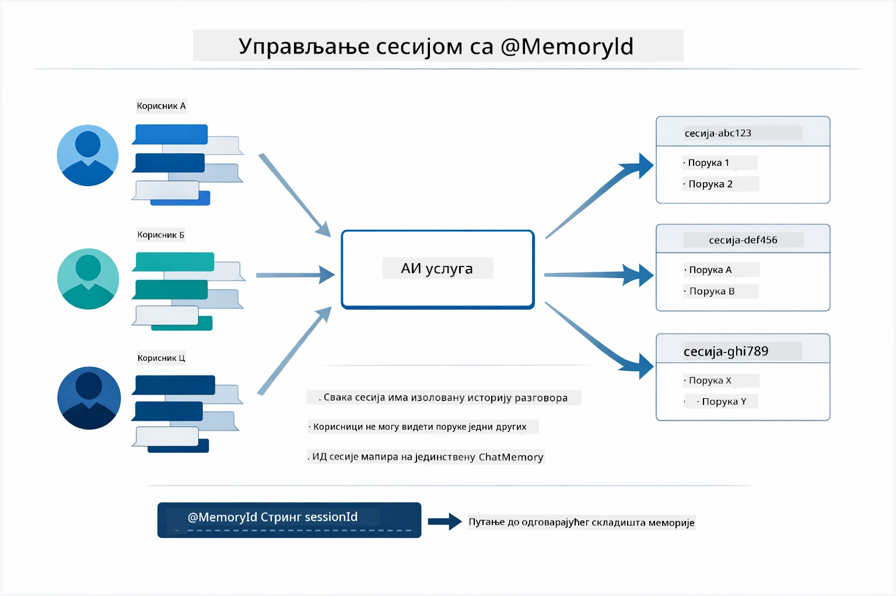

*Сваки session ID мапира историју разговора у изоловану меморију — корисници никада не виде поруке једни других.*

### Обрада грешака

Алат може да пропадне — API-ји могу да истекну, параметри могу бити неважећи, спољни сервиси могу пасти. Производни агенти треба да имају обраду грешака како би модел могао да објасни проблем или покуша алтернативе, уместо да се читава апликација сруши. Када алат баци изузетак, LangChain4j га хвата и шаље поруку о грешци назад моделу, који може да објасни проблем природним језиком.

## Доступни алати

Испод шема приказује широку екосистем алата које можете креирати. Овај модул демонстрира алате за време и температуру, али исти `@Tool` образац ради за било коју Java методу — од упита базе података до обраде плаћања.

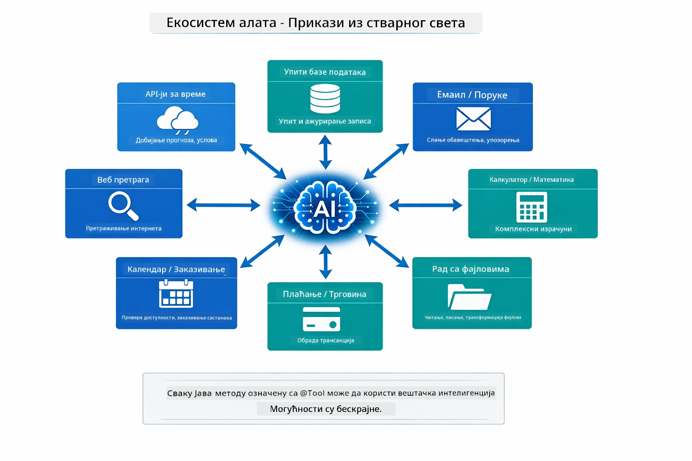

*Било која Java метода анотирана са @Tool постаје доступна AI-ју — образац се проширује на базе података, API-је, имејл, операције са фајловима и још много тога.*

## Када користити агенте базиране на алатима

Ниједан захтев не мора нужно да користи алате. Одлука зависи од тога да ли AI треба да комуницира са спољним системима или може да одговори из властитог знања. Следећи водич сумира када алати доносе вредност, а када нису потребни:

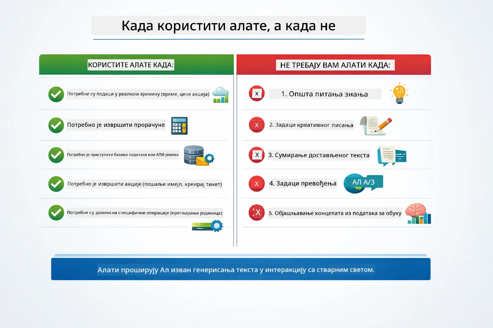

*Брз водич — алати су за реалне податке, калкулације и акције; опште знање и креативни задаци их не захтевају.*

## Алати у односу на RAG

Модули 03 и 04 оба проширују шта AI може да уради, али на супстанцијално различите начине. RAG даје моделу приступ **знању** тако што извлачи документе. Алатке дају моделу способност да изврши **акције** позивајући функције. Следећа шема упоређује ова два приступа поред један другог — од начина рада до компромиса између њих:

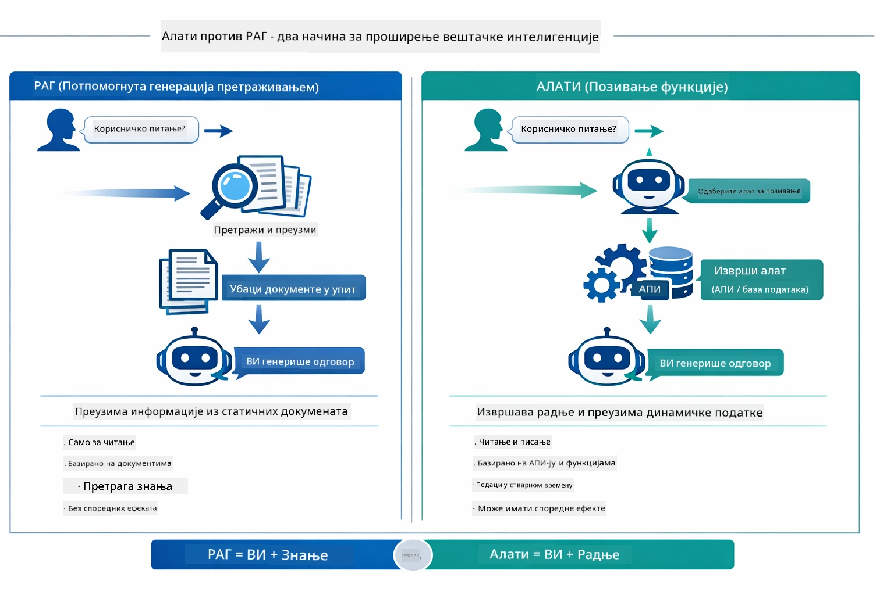

*RAG преузима информације из статичних докумената — Алатке извршавају акције и добијају динамичке, реалне податке. Многи производни системи комбинују оба.*

У пракси, многи производни системи комбинују оба приступа: RAG за утемељење одговора у документацији и Алатке за добијање живих података или извршење операција.

## Следећи кораци

**Следећи модул:** [05-mcp - Model Context Protocol (MCP)](../05-mcp/README.md)

---

**Навигација:** [← Претходни: Модул 03 - RAG](../03-rag/README.md) | [Назад на главну](../README.md) | [Следећи: Модул 05 - MCP →](../05-mcp/README.md)

---

<!-- CO-OP TRANSLATOR DISCLAIMER START -->
**Одрицање одговорности**:  
Овај документ је преведен помоћу АИ услуге за превођење [Co-op Translator](https://github.com/Azure/co-op-translator). Иако тежимо прецизности, молимо имате у виду да аутоматски преводи могу садржати грешке или нетачности. Оригинални документ на његовом изворном језику треба сматрати ауторитетним извором. За критичне информације препоручује се професионални људски превод. Нисмо одговорни за било каква неспоразума или погрешне интерпретације настале коришћењем овог превода.
<!-- CO-OP TRANSLATOR DISCLAIMER END -->