# Модул 05: Протокол контекста модела (MCP)

## Садржај

- [Видео корак по корак](../../../05-mcp)
- [Шта ћете научити](../../../05-mcp)
- [Шта је MCP?](../../../05-mcp)
- [Како MCP функционише](../../../05-mcp)
- [Агентски модул](../../../05-mcp)
- [Покретање примера](../../../05-mcp)
  - [Претпоставке](../../../05-mcp)
- [Брзи почетак](../../../05-mcp)
  - [Фајл операције (Stdio)](../../../05-mcp)
  - [Супервизор агент](../../../05-mcp)
    - [Покретање демоа](../../../05-mcp)
    - [Како супервизор ради](../../../05-mcp)
    - [Како FileAgent открива MCP алате у време извођења](../../../05-mcp)
    - [Стратегије одговора](../../../05-mcp)
    - [Разумевање излаза](../../../05-mcp)
    - [Објашњење функција агентског модула](../../../05-mcp)
- [Кључни појмови](../../../05-mcp)
- [Честитамо!](../../../05-mcp)
  - [Шта даље?](../../../05-mcp)

## Видео корак по корак

Погледајте ову уживо сесију која објашњава како да почнете са овим модулом:

<a href="https://www.youtube.com/watch?v=O_J30kZc0rw"></a>

## Шта ћете научити

Направили сте разговорни AI, савладали упите, оснашкали одговоре у документима и креирали агенте са алатима. Али сви ти алати су били прилагођени за вашу специфичну апликацију. Шта ако бисте могли вашем AI-у дати приступ стандардираној екосистему алата које било ко може да креира и дели? У овом модулу ћете научити како да то радите уз Протокол контекста модела (MCP) и агентски модул LangChain4j. Прво приказујемо једноставан MCP читач фајлова, затим показујемо како се лако интегрише у напредне агентске токове коришћењем шаблона Супервизор агента.

## Шта је MCP?

Протокол контекста модела (MCP) пружа управо то — стандардни начин да AI апликације открију и користе спољне алате. Уместо да пишете прилагођене интеграције за сваки извор података или услугу, повезујете се на MCP сервере који изложe своје способности у доследном формату. Ваш AI агент може онда аутоматски да открије и користи те алате.

Дијаграм испод показује разлику — без MCP, свака интеграција захтева прилагођено повезивање тачка-на-тачку; са MCP, један протокол повезује вашу апликацију са било којим алатом:


*Пре MCP: Комплексне интеграције тачка-на-тачку. После MCP: Један протокол, бескрајне могућности.*

MCP решава основни проблем у развоју AI: свака интеграција је прилагођена. Желите приступ GitHub-у? Прилагођен код. Желите читање фајлова? Прилагођен код. Желите приступ бази података? Прилагођен код. И ниједна од ових интеграција не ради са другим AI апликацијама.

MCP то стандардизује. MCP сервер изложи алате са јасним описима и шемама. Било који MCP клијент се може повезати, открити доступне алате и користити их. Направите једном, користите свуда.

Дијаграм испод илуструје ову архитектуру — један MCP клијент (ваша AI апликација) се повезује са више MCP сервера, од којих сваки изложи свој скуп алата преко стандарног протокола:


*Архитектура Протокола контекста модела - стандардирано откривање и извршење алата*

## Како MCP функционише

Под хаубом, MCP користи слојевиту архитектуру. Ваша Java апликација (MCP клијент) открива доступне алате, шаље JSON-RPC захтеве преко транспортног слоја (Stdio или HTTP), а MCP сервер извршава операције и враћа резултате. Следећи дијаграм разлаже сваки слој овог протокола:

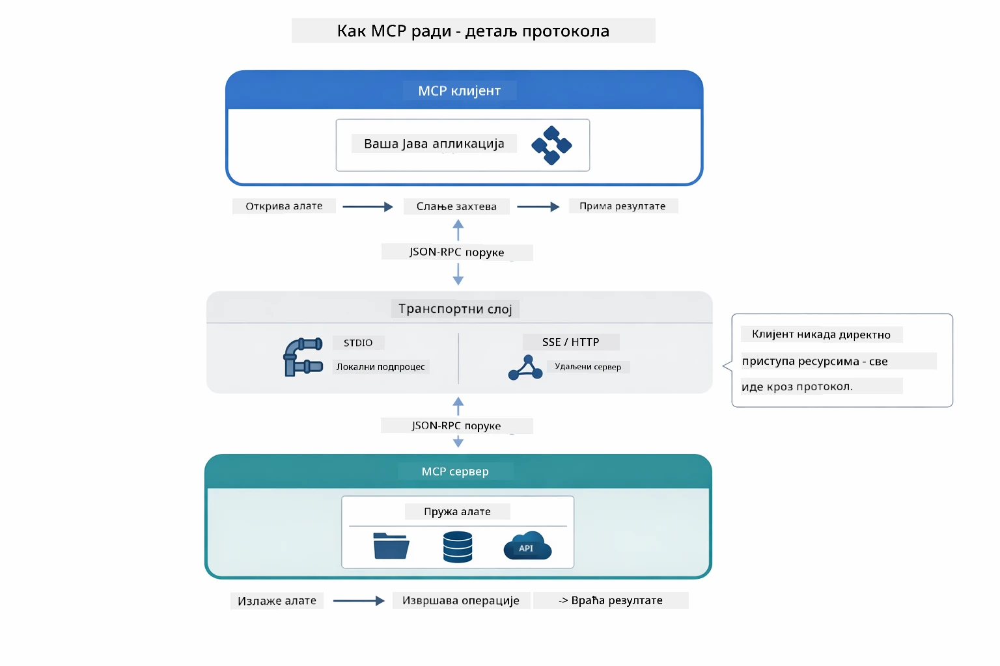

*Како MCP функционише испод хаубе — клијенти откривају алате, размењују JSON-RPC поруке и извршавају операције преко транспортног слоја.*

**Архитектура сервер-клијент**

MCP користи модел сервер-клијент. Сервери пружају алате - читање фајлова, упите база података, позивање API-ја. Клијенти (ваша AI апликација) се повезују на сервере и користе њихове алате.

Да бисте користили MCP са LangChain4j, додајте ову Maven зависност:

```xml
<dependency>
    <groupId>dev.langchain4j</groupId>
    <artifactId>langchain4j-mcp</artifactId>
    <version>${langchain4j.version}</version>
</dependency>
```

**Откривање алата**

Када се ваш клијент повезује на MCP сервер, пита „Које алате имаш?“ Сервер одговара списком доступних алата, сваки са описима и шемама параметара. Ваш AI агент онда може да одлучи које алате да користи на основу корисничких захтева. Дијаграм испод показује овај рукопопис — клијент шаље `tools/list` захтев а сервер враћа своје доступне алате са описима и шемама параметара:

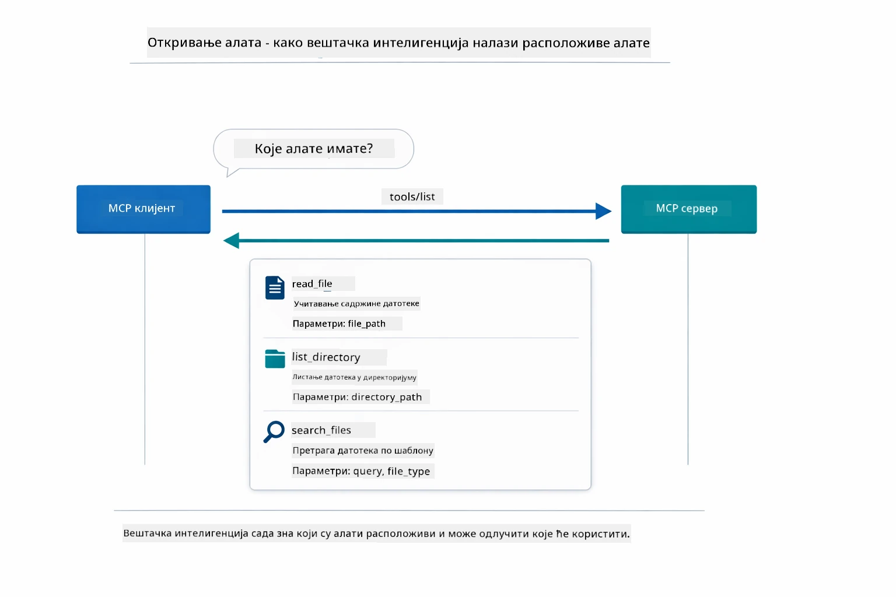

*AI открива доступне алате при покретању — сада зна које могућности постоје и може одлучити које ће користити.*

**Транспортни механизми**

MCP подржава различите транспортне механизме. Две опције су Stdio (за локалну комуникацију са подпроцесима) и Streamable HTTP (за удаљене сервере). Овај модул демонстрира Stdio транспорт:


*Транспортни механизми MCP: HTTP за удаљене сервере, Stdio за локалне процесе*

**Stdio** - [StdioTransportDemo.java](../../../05-mcp/src/main/java/com/example/langchain4j/mcp/StdioTransportDemo.java)

За локалне процесе. Ваша апликација покреће сервер као подпроцес и комуницира преко стандардног улаза/излаза. Корисно за приступ фајл систему или командно-линијским алатима.

```java
McpTransport stdioTransport = new StdioMcpTransport.Builder()
    .command(List.of(
        npmCmd, "exec",
        "@modelcontextprotocol/server-filesystem@2025.12.18",
        resourcesDir
    ))
    .logEvents(false)
    .build();
```

`@modelcontextprotocol/server-filesystem` сервер изложи следеће алате, сви ограничени на директоријуме које одредите:

| Алат | Опис |
|------|-------|
| `read_file` | Читање садржаја једног фајла |
| `read_multiple_files` | Читање више фајлова у једном позиву |
| `write_file` | Креирање или преписивање фајла |
| `edit_file` | Циљано проналажење и замена |
| `list_directory` | Листање фајлова и директоријума у путањи |
| `search_files` | Рекурзивно претраживање фајлова по шаблону |
| `get_file_info` | Добијање метаподатака фајла (величина, временски печати, дозволе) |
| `create_directory` | Креирање директоријума (укључујући родитељске директорijуме) |
| `move_file` | Померање или преименовање фајла или директоријума |

Следећи дијаграм показује како Stdio транспорт функционише у време извођења — ваша Java апликација покреће MCP сервер као дечији процес и комуницирају преко stdin/stdout цеви, без коришћења мреже или HTTP-а:

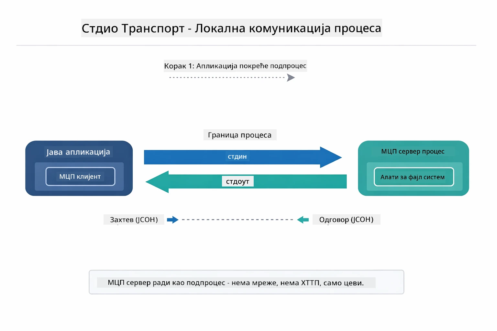

*Stdio транспорт у акцији — ваша апликација покреће MCP сервер као дечији процес и комуницира преко stdin/stdout цеви.*

> **🤖 Испробајте са [GitHub Copilot](https://github.com/features/copilot) Чатом:** Отворите [`StdioTransportDemo.java`](../../../05-mcp/src/main/java/com/example/langchain4j/mcp/StdioTransportDemo.java) и питајте:
> - "Како Stdio транспорт функционише и када треба да га користим уместо HTTP-а?"
> - "Како LangChain4j управља животним циклусом покренутих MCP серверских процеса?"
> - "Које су безбедносне импликације давања AI приступа фајл систему?"

## Агентски модул

Док MCP пружа стандардиране алате, LangChain4j-ов **агентски модул** пружа декларативан начин да градите агенте који оркестрирају те алате. `@Agent` анотација и `AgenticServices` вам омогућавају дефинисање понашања агента кроз интерфејсе уместо императивног кода.

У овом модулу ћете истражити образац **Супервизор агента** — напредан приступ агентском AI где "супервизор" агент динамички одлучује које подагенте да покрене на основу корисничких захтева. Комбиноваћемо оба концепта тако што ћемо једном од наших подагената дати могућности приступа фајловима покретаним MCP-ом.

Да бисте користили агентски модул, додајте ову Maven зависност:

```xml
<dependency>
    <groupId>dev.langchain4j</groupId>
    <artifactId>langchain4j-agentic</artifactId>
    <version>${langchain4j.mcp.version}</version>
</dependency>
```
> **Напомена:** Модул `langchain4j-agentic` користи засебно својство верзије (`langchain4j.mcp.version`) јер се објављује по другачијем распореду од основних LangChain4j библиотека.

> **⚠️ Експериментално:** Модул `langchain4j-agentic` је **експерименталан** и може се мењати. Стабилан начин за прављење AI асистената остаје `langchain4j-core` са прилагођеним алатима (Модул 04).

## Покретање примера

### Претпоставке

- Завршен [Модул 04 - Алатке](../04-tools/README.md) (овај модул се надовезује на концепте прилагођених алата и упоређује их са MCP алатима)
- `.env` фајл у коренском директоријуму са Azure подацима за пријаву (направљен командом `azd up` у Модулу 01)
- Java 21+, Maven 3.9+
- Node.js 16+ и npm (за MCP сервере)

> **Напомена:** Ако још нисте подесили своје променљиве окружења, погледајте [Модул 01 - Увод](../01-introduction/README.md) за упутства за деплојмент (команда `azd up` аутоматски креира `.env` фајл), или копирајте `.env.example` у `.env` у коренском директоријуму и попуните своје вредности.

## Брзи почетак

**Користећи VS Code:** Једноставно кликните десним тастером опет на било који демо фајл у Explorer-у и изаберите **"Run Java"**, или користите конфигурације за покретање из Run and Debug панела (прво уверите се да је ваш `.env` фајл са Azure подацима исправно конфигурисан).

**Користећи Maven:** Алтернативно, можете покренути из командне линије са примерима испод.

### Фајл операције (Stdio)

Ово демонстрира алате засноване на локалним подпроцесима.

**✅ Нема потребних претпоставки** - MCP сервер се аутоматски покреће.

**Коришћење старт скрипти (препоручено):**

Старт скрипте аутоматски учитавају променљиве окружења из коренског `.env` фајла:

**Bash:**
```bash
cd 05-mcp
chmod +x start-stdio.sh
./start-stdio.sh
```

**PowerShell:**
```powershell
cd 05-mcp
.\start-stdio.ps1
```

**Користећи VS Code:** Кликните десним тастером на `StdioTransportDemo.java` и изаберите **"Run Java"** (увек проверите да је `.env` датотека исправно конфигурисана).

Апликација аутоматски покреће MCP сервер за фајл систем и чита локални фајл. Приметите како је управљање подпроцесима решено за вас.

**Очекујете излаз:**
```
Assistant response: The file provides an overview of LangChain4j, an open-source Java library
for integrating Large Language Models (LLMs) into Java applications...
```

### Супервизор агент

Образац **Супервизор агента** представља **флексибилан** облик агентског AI. Супервизор користи LLM како би аутономно одлучио које агенте да позове на основу корисничког захтева. У следећем примеру комбинујемо MCP управљан приступ фајловима са LLM агентом како бисмо креирали надгледани ток читања фајла → извештаја.

У демоу, `FileAgent` чита фајл користећи MCP алате фајл система, а `ReportAgent` генерише структуриран извештај са извршним резимеом (једна реченица), 3 кључне тачке и препоруке. Супервизор аутоматски оркестрира овај ток:

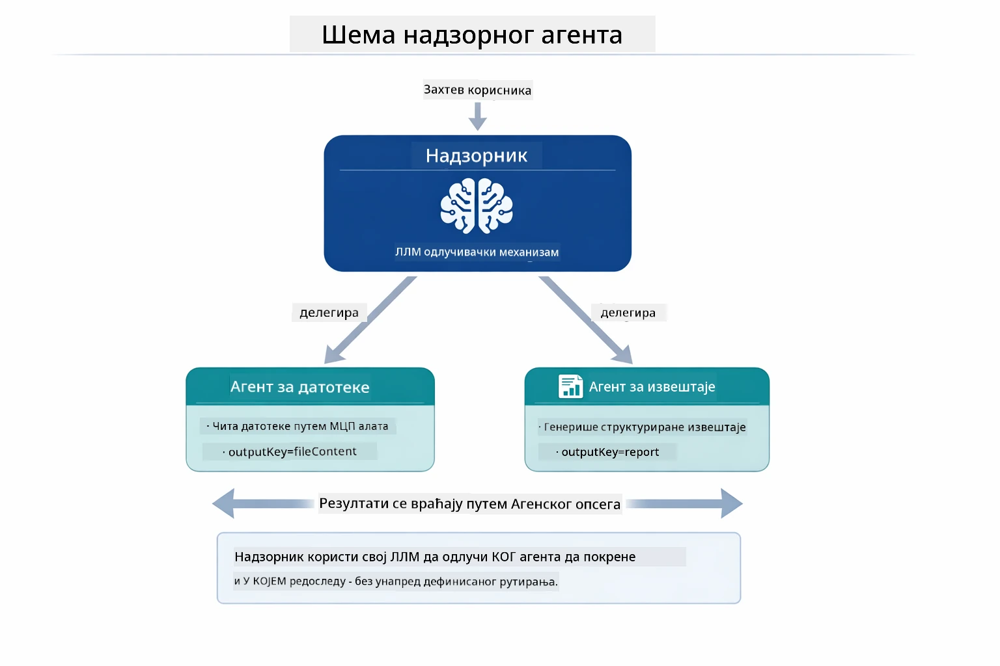

*Супервизор користи свој LLM да одлучи које агенте да покрене и којим редосledом — није потребно ручно усмеравање.*

Ево како конкретан ток изгледа за наш фајл→извештај процес:

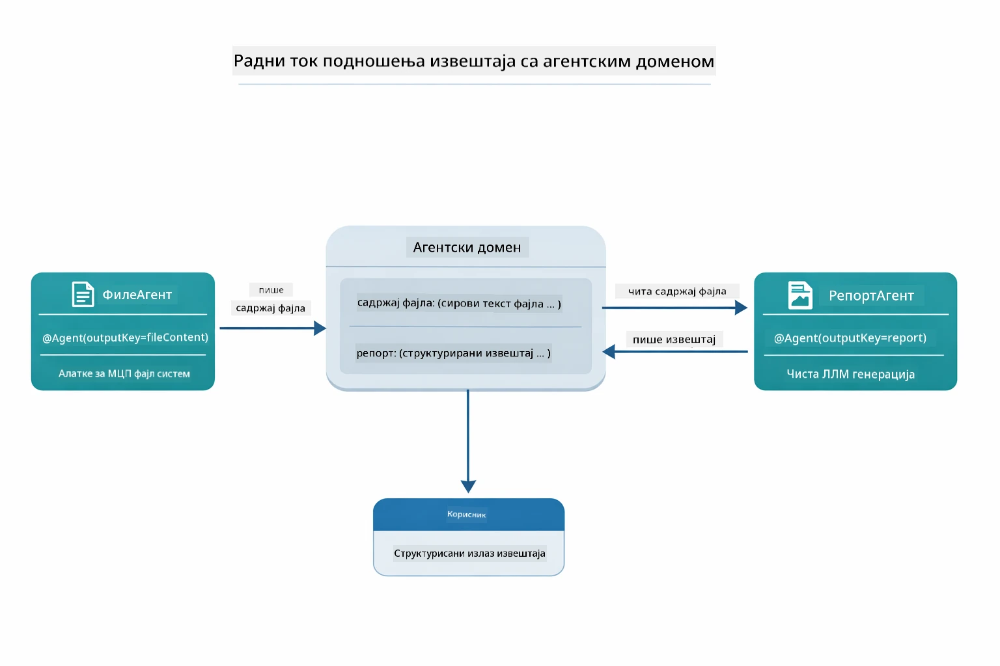

*FileAgent чита фајл преко MCP алата, након чега ReportAgent претвара сирови садржај у структуриран извештај.*

Следећи секвенцијални дијаграм прати потпуну Супервизорову оркестрацију — од покретања MCP сервера, преко аутономног избора агената од стране Супервизора, до позива алата преко stdio и коначног извештаја:

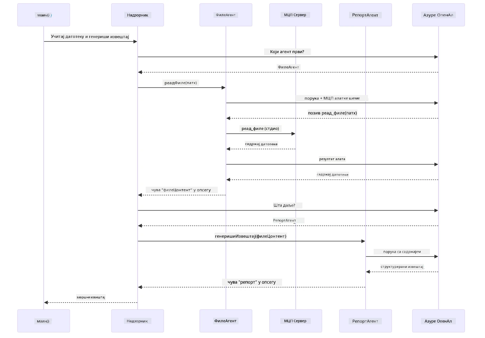

*Супервизор аутономно покреће FileAgent (који позива MCP сервер преко stdio за читање фајла), затим покреће ReportAgent да генерише структуриран извештај — сваки агент чува свој излаз у заједничком Agentic Scope.*

Сваки агент чува свој излаз у **Agentic Scope** (заједничкој меморији), омогућавајући агенатима доле у ланцу да приступе претходним резултатима. Ово илустративно показује како се MCP алати беспрекорно интегришу у агентске токове — Супервизор не мора да зна *како* се фајлови читају, већ само да `FileAgent` то може.

#### Покретање демоа

Старт скрипте аутоматски учитавају променљиве окружења из коренског `.env` фајла:

**Bash:**
```bash
cd 05-mcp
chmod +x start-supervisor.sh
./start-supervisor.sh
```

**PowerShell:**
```powershell
cd 05-mcp
.\start-supervisor.ps1
```

**Користећи VS Code:** Кликните десним тастером на `SupervisorAgentDemo.java` и изаберите **"Run Java"** (проверите да је `.env` фајл конфигурисан).

#### Како супервизор ради

Пре креирања агената, потребно је повезати MCP транспорт са клијентом и омотати га као `ToolProvider`. Овако алати MCP сервера постају доступни вашим агентима:

```java
// Креирај MCP клијента из транспорта
McpClient mcpClient = new DefaultMcpClient.Builder()
        .transport(stdioTransport)
        .build();

// Омотај клијента као ToolProvider — ово повезује MCP алате у LangChain4j
ToolProvider mcpToolProvider = McpToolProvider.builder()
        .mcpClients(List.of(mcpClient))
        .build();
```

Сада можете инјектовати `mcpToolProvider` у било који агент којем су потребни MCP алати:

```java
// Корак 1: FileAgent чита датотеке користећи MCP алате
FileAgent fileAgent = AgenticServices.agentBuilder(FileAgent.class)
        .chatModel(model)
        .toolProvider(mcpToolProvider)  // Поседује MCP алате за рад са датотекама
        .build();

// Корак 2: ReportAgent генерише структуриране извештаје
ReportAgent reportAgent = AgenticServices.agentBuilder(ReportAgent.class)
        .chatModel(model)
        .build();

// Надзорник координализује проток од датотеке до извештаја
SupervisorAgent supervisor = AgenticServices.supervisorBuilder()
        .chatModel(model)
        .subAgents(fileAgent, reportAgent)
        .responseStrategy(SupervisorResponseStrategy.LAST)  // Враћа крајњи извештај
        .build();

// Надзорник одлучује које агенте да покрене на основу захтева
String response = supervisor.invoke("Read the file at /path/file.txt and generate a report");
```

#### Како FileAgent открива MCP алате у време извођења

Можда се питате: **како `FileAgent` зна како да користи npm алате фајл система?** Одговор је да не зна — **LLM** то сазнаје у време извођења анализом шема алата.
Интерфејс `FileAgent` је само **дефиниција упита**. Он нема унапред дефинисано знање о `read_file`, `list_directory` или било којем другом MCP алату. Ево шта се дешава од почетка до краја:

1. **Покретање сервера:** `StdioMcpTransport` покреће `@modelcontextprotocol/server-filesystem` npm пакет као подређени процес
2. **Откривање алата:** `McpClient` шаље `tools/list` JSON-RPC захтев серверу, који одговара именима алата, описима и шемама параметара (нпр. `read_file` — *"Учитај цео садржај датотеке"* — `{ path: string }`)
3. **Убацивање шеме:** `McpToolProvider` омотава пронађене шеме и чини их доступним LangChain4j-у
4. **Одлука LLM-а:** Када се позове `FileAgent.readFile(path)`, LangChain4j шаље системску поруку, корисничку поруку, **и листу шема алата** LLM-у. LLM прочита описе алата и генерише позив алату (нпр. `read_file(path="/some/file.txt")`)
5. **Извршење:** LangChain4j пресреће позив алата, усмерава га кроз MCP клијент назад у Node.js подпроцес, добија резултат и прослеђује га назад LLM-у

Ово је исти метод [Откривања алата](../../../05-mcp) описан горе, али применљив посебно на агентски ток рада. Аннотације `@SystemMessage` и `@UserMessage` усмеравају понашање LLM-а, док инјектовани `ToolProvider` пружа **способности** — LLM у току извршења повезује оба.

> **🤖 Испробајте са [GitHub Copilot](https://github.com/features/copilot) Chat:** Отворите [`FileAgent.java`](../../../05-mcp/src/main/java/com/example/langchain4j/mcp/agents/FileAgent.java) и питајте:
> - "Како овај агент зна који MCP алат да позове?"
> - "Шта би се десило ако уклоним ToolProvider из конструктора агента?"
> - "Како шеме алата стижу до LLM-а?"

#### Стратегије одговора

Када конфигуришете `SupervisorAgent`, одређујете како он треба да формулише коначни одговор кориснику након што под-агенти заврше своје задатке. Дијаграм испод приказује три доступне стратегије — LAST враћа коначни излаз агента директно, SUMMARY синтетише све излазе преко LLM-а, а SCORED бира ону која има виши резултат у односу на почетни захтев:

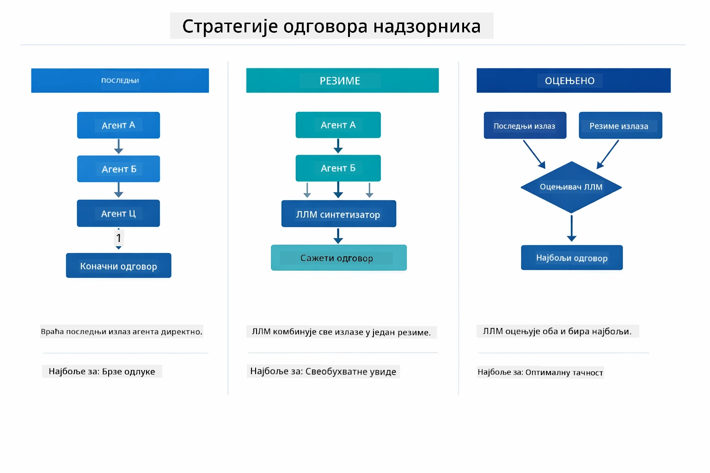

*Три стратегије за формулисање коначног одговора Супервайзора — изаберите у зависности од тога да ли желите последњи излаз агента, синтетизовани резиме или најбољи резултат.*

Доступне стратегије су:

| Стратегија | Опис |
|------------|-------|
| **LAST**   | Супервајзор враћа излаз последњег позваног под-агента или алата. Ово је корисно када је коначни агент у току рада посебно дизајниран да произведе комплетан коначни одговор (нпр. "Agent за резиме" у истраживачком ланцу). |
| **SUMMARY**| Супервајзор користи свој интерни језички модел (LLM) да синтетизује резиме целе интеракције и свих излаза под-агената, затим враћа тај резиме као коначни одговор. Ово обезбеђује чист, агрегирани одговор кориснику. |
| **SCORED** | Систем користи интерни LLM да оцењује и LAST одговор и SUMMARY интеракције у односу на оригинални кориснички захтев, враћајући онај излаз који добије виши резултат. |

Погледајте [SupervisorAgentDemo.java](../../../05-mcp/src/main/java/com/example/langchain4j/mcp/SupervisorAgentDemo.java) за комплетну имплементацију.

> **🤖 Испробајте са [GitHub Copilot](https://github.com/features/copilot) Chat:** Отворите [`SupervisorAgentDemo.java`](../../../05-mcp/src/main/java/com/example/langchain4j/mcp/SupervisorAgentDemo.java) и питајте:
> - "Како Супервајзор одлучује које агенте да позове?"
> - "Која је разлика између шаблона радног тока Supervisor и Sequential?"
> - "Како могу прилагодити понашање планирања Супервајзора?"

#### Разумевање излаза

Када покренете демо, видећете структуриран преглед како Супервајзор orkестрира више агената. Ево шта сваки део значи:

```
======================================================================
  FILE → REPORT WORKFLOW DEMO
======================================================================

This demo shows a clear 2-step workflow: read a file, then generate a report.
The Supervisor orchestrates the agents automatically based on the request.
```

**Наслов** уводи концепт радног тока: фокусиран ланац од читања датотеке до генерисања извештаја.

```
--- WORKFLOW ---------------------------------------------------------
  ┌─────────────┐      ┌──────────────┐
  │  FileAgent  │ ───▶ │ ReportAgent  │
  │ (MCP tools) │      │  (pure LLM)  │
  └─────────────┘      └──────────────┘
   outputKey:           outputKey:
   'fileContent'        'report'

--- AVAILABLE AGENTS -------------------------------------------------
  [FILE]   FileAgent   - Reads files via MCP → stores in 'fileContent'
  [REPORT] ReportAgent - Generates structured report → stores in 'report'
```

**Дијаграм радног тока** приказује проток података између агената. Сваки агент има одређену улогу:
- **FileAgent** чита датотеке помоћу MCP алата и чува сиров садржај у `fileContent`
- **ReportAgent** користи тај садржај и производи структурирани извештај у `report`

```
--- USER REQUEST -----------------------------------------------------
  "Read the file at .../file.txt and generate a report on its contents"
```

**Кориснички захтев** приказује задатак. Супервајзор то парсира и одлучује да позове FileAgent → ReportAgent.

```
--- SUPERVISOR ORCHESTRATION -----------------------------------------
  The Supervisor decides which agents to invoke and passes data between them...

  +-- STEP 1: Supervisor chose -> FileAgent (reading file via MCP)
  |
  |   Input: .../file.txt
  |
  |   Result: LangChain4j is an open-source, provider-agnostic Java framework for building LLM...
  +-- [OK] FileAgent (reading file via MCP) completed

  +-- STEP 2: Supervisor chose -> ReportAgent (generating structured report)
  |
  |   Input: LangChain4j is an open-source, provider-agnostic Java framew...
  |
  |   Result: Executive Summary...
  +-- [OK] ReportAgent (generating structured report) completed
```

**Оркестрација Супервајзора** приказује двостепени ток у акцији:
1. **FileAgent** чита датотеку преко MCP и чува садржај
2. **ReportAgent** прима садржај и генерише структурирани извештај

Супервајзор је ове одлуке донео **аутономно** на основу корисничког захтева.

```
--- FINAL RESPONSE ---------------------------------------------------
Executive Summary
...

Key Points
...

Recommendations
...

--- AGENTIC SCOPE (Data Flow) ----------------------------------------
  Each agent stores its output for downstream agents to consume:
  * fileContent: LangChain4j is an open-source, provider-agnostic Java framework...
  * report: Executive Summary...
```

#### Објашњење функција модула агената

Пример демонстрира неколико напредних особина агентског модула. Погледајмо ближе Agentic Scope и Agent Listeners.

**Agentic Scope** показује заједничку меморију где су агенти чували своје резултате користећи `@Agent(outputKey="...")`. Ово омогућава:
- Каснијим агентима да приступе излазима ранијих агената
- Супервајзору да синтетише коначни одговор
- Вама да прегледате шта је сваки агент произвео

Дијаграм испод показује како Agentic Scope функционише као заједничка меморија у радном току од датотеке до извештаја — FileAgent уписује свој излаз под кључем `fileContent`, ReportAgent га чита и уписује свој излаз под `report`:

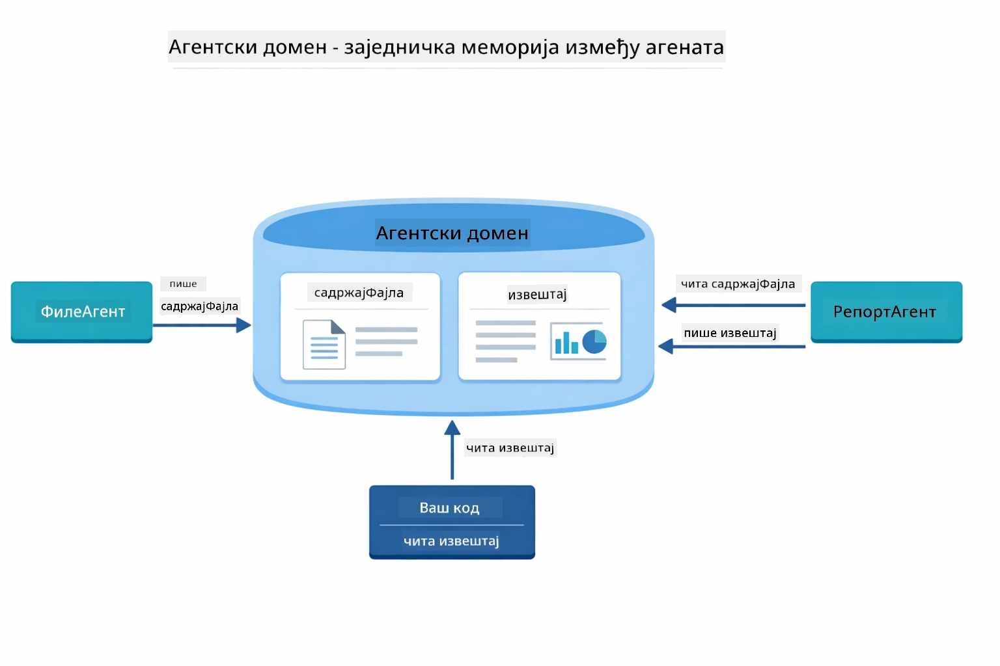

*Agentic Scope делује као заједничка меморија — FileAgent записује `fileContent`, ReportAgent га чита и записује `report`, а ваш код чита коначни резултат.*

```java
ResultWithAgenticScope<String> result = supervisor.invokeWithAgenticScope(request);
AgenticScope scope = result.agenticScope();
String fileContent = scope.readState("fileContent");  // Необрађени подаци из датотеке од FileAgent
String report = scope.readState("report");            // Структурисани извештај од ReportAgent
```

**Agent Listeners** омогућавају праћење и дебаговање извршења агената. Корак-по-корак излаз који видите у демо верзији долази из AgentListener-а који се укључује у сваки позив агента:
- **beforeAgentInvocation** - Позива се када Супервајзор изабере агента, омогућавајући вам да видите који је агент одабран и зашто
- **afterAgentInvocation** - Позива се када агент заврши, приказујући његов резултат
- **inheritedBySubagents** - Када је истинито, слушалац прати све агенте у хијерархији

Следећи дијаграм приказује цео животни циклус Agent Listener-а, укључујући како `onError` обрађује грешке током извршења агента:

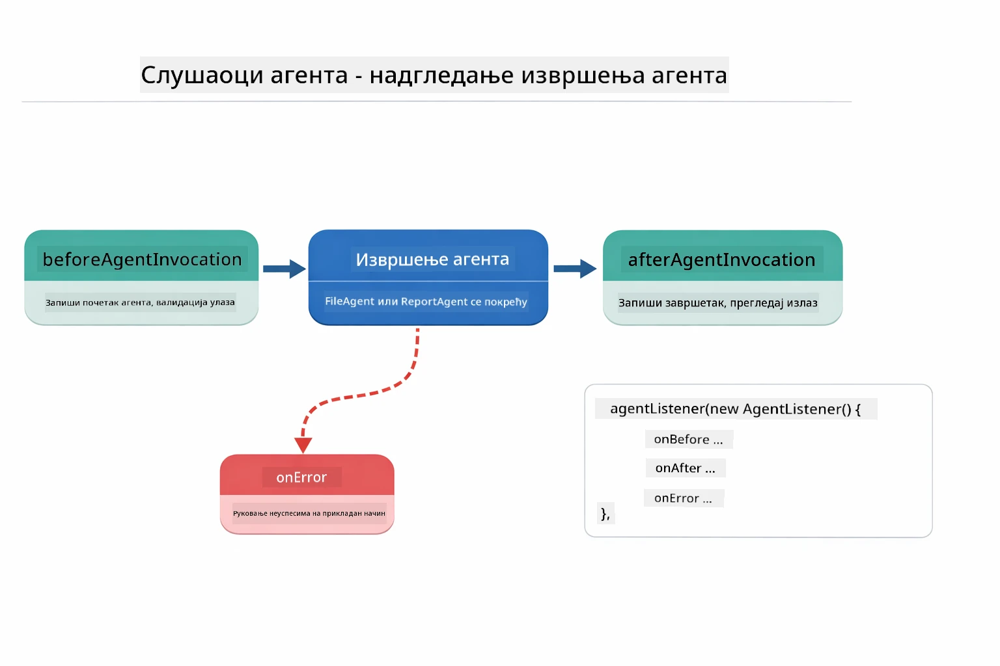

*Agent Listeners се укључују у животни циклус извршења — прате почетак, завршетак или грешке агената.*

```java
AgentListener monitor = new AgentListener() {
    private int step = 0;
    
    @Override
    public void beforeAgentInvocation(AgentRequest request) {
        step++;
        System.out.println("  +-- STEP " + step + ": " + request.agentName());
    }
    
    @Override
    public void afterAgentInvocation(AgentResponse response) {
        System.out.println("  +-- [OK] " + response.agentName() + " completed");
    }
    
    @Override
    public boolean inheritedBySubagents() {
        return true; // Проследи свим под-агентима
    }
};
```

Поред шаблона Супервајзора, модул `langchain4j-agentic` пружа неколико моћних шаблона радног тока. Дијаграм испод приказује свих пет — од једноставних секвенцијалних ланаца до радних токова са људском контролом:

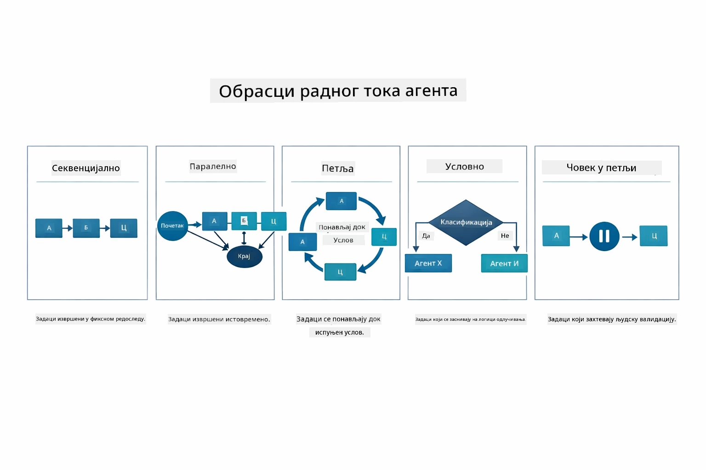

*Пет шаблона радног тока за оркестрацију агената — од једноставних секвенцијалних ланаца до радних токова са људском контролом.*

| Шаблон       | Опис                           | Пример употребе                              |
|--------------|--------------------------------|---------------------------------------------|
| **Sequential** | Извршава агенте по реду, излаз тече ка следећем | Ланци: истраживање → анализа → извештај    |
| **Parallel** | Покреће агенте истовремено      | Независни задаци: време + вести + акције     |
| **Loop**     | Понови док се услов не испуни    | Оцена квалитета: усавршавање док оцена ≥ 0.8 |
| **Conditional** | Усмери у зависности од услова | Класификује → усмерава на специјалистичког агента |
| **Human-in-the-Loop** | Додаје људске контролне тачке | Радни токови одобрења, преглед садржаја    |

## Кључни појмови

Сада када сте истражили MCP и модул агената у акцији, резимирајмо када користити који приступ.

Једна од највећих предности MCP-а је његов растући екосистем. Дијаграм испод показује како један универзални протокол повезује вашу AI апликацију са широким спектром MCP сервера — од приступа датотечном систему и базама података до GitHub-а, е-поште, веб скрејпинга и више:

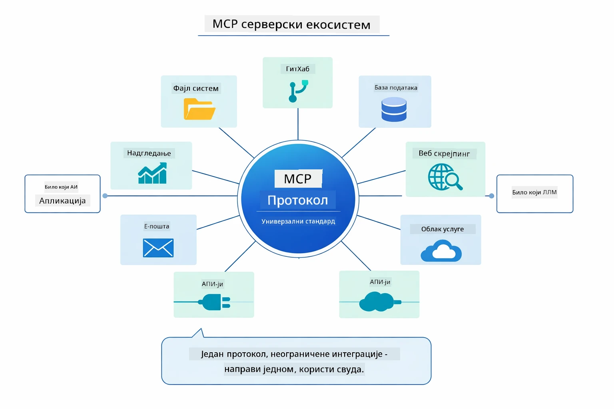

*MCP ствара универзални протоколни екосистем — сваки MCP-компатибилни сервер ради са било којим MCP-компатибилним клијентом, омогућавајући размену алата између апликација.*

**MCP** је идеалан када желите да искористите постојеће екосистеме алата, правите алате које више апликација може да дели, интегришете сервисе трећих страна са стандардним протоколима, или мењате имплементације алата без промене кода.

**Модул агената** најбоље функционише када желите декларативне дефиниције агената са `@Agent` анотацијама, потребна вам је оркестрација радних токова (секвенцијално, петља, паралелно), више волите дизајн агената базиран на интерфејсу него импаративни код, или комбинујете више агената који деле излазе преко `outputKey`.

**Шаблон Supervisor Agent-а** се истиче када ток рада није предвидив унапред и желите да LLM одлучује, када имате више специјализованих агената којима треба динамичка оркестрација, када градите разговорне системе који усмеравају ка различитим способностима, или када желите најфлексибилније, адаптивно понашање агента.

Да бисмо вам помогли да одлучите између прилагођених `@Tool` метода из Модула 04 и MCP алата из овог модула, следећа компарација истиче кључне компромисе — прилагођени алати пружају тесну повезаност и потпуну типску сигурност за логике специфичне за апликацију, док MCP алати нуде стандардизоване, поновно употребљиве интеграције:

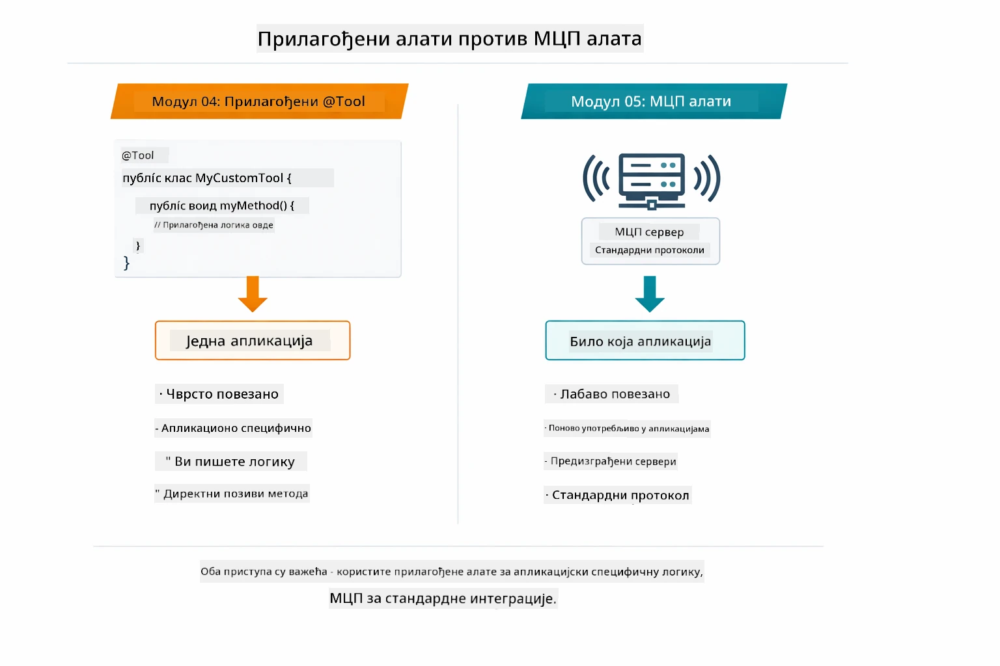

*Када користити прилагођене @Tool методе у односу на MCP алате — прилагођени алати за логике специфичне за апликацију са пуном типском сигурношћу, MCP алати за стандардизоване интеграције које раде на више апликација.*

## Честитамо!

Прошли сте кроз свих пет модула курса LangChain4j за почетнике! Ево прегледа целог вашег пута учења — од основног четовања до система агената покретаних MCP-ом:

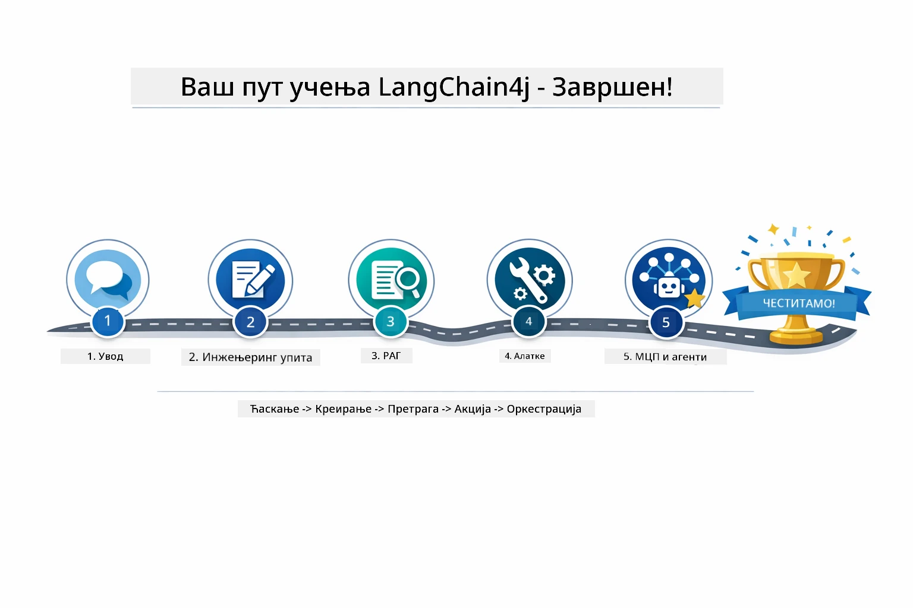

*Ваш пут учења кроз свих пет модула — од основног четовања до система агената покретаних MCP-ом.*

Завршили сте курс LangChain4j за почетнике. Научили сте:

- Како направити разговорни AI са меморијом (Модул 01)
- Обрасце за рад са упитима за различите задатке (Модул 02)
- Повезивање одговора са вашим документима помоћу RAG-а (Модул 03)
- Креирање основних AI агената (асистената) са прилагођеним алатима (Модул 04)
- Интеграцију стандардизованих алата са LangChain4j MCP и Agentic модулима (Модул 05)

### Шта је следеће?

Након завршетка модула, истражите [Testing Guide](../docs/TESTING.md) да видите концепте тестирања LangChain4j у акцији.

**Званични ресурси:**
- [LangChain4j документација](https://docs.langchain4j.dev/) - Комплетни водичи и API референца
- [LangChain4j GitHub](https://github.com/langchain4j/langchain4j) - Изворни код и примери
- [LangChain4j туторијали](https://docs.langchain4j.dev/tutorials/) - Корак по корак туторијали за различите случајеве употребе

Хвала вам што сте прошли овај курс!

---

**Навигација:** [← Претходно: Модул 04 - Алати](../04-tools/README.md) | [Назад на Почетак](../README.md)

---

<!-- CO-OP TRANSLATOR DISCLAIMER START -->
**Одрицање одговорности**:
Овај документ је преведен коришћењем AI преводилачке услуге [Co-op Translator](https://github.com/Azure/co-op-translator). Иако настојимо да превод буде тачан, имајте у виду да аутоматски преводи могу садржати грешке или нетачности. Оригинални документ на његовом изворном језику треба сматрати ауторитетним извором. За критичне информације препоручује се професионални превод од стране стручног човека. Нити једна страна није одговорна за било каква неспоразумевања или погрешне тумачења настала употребом овог превода.
<!-- CO-OP TRANSLATOR DISCLAIMER END -->