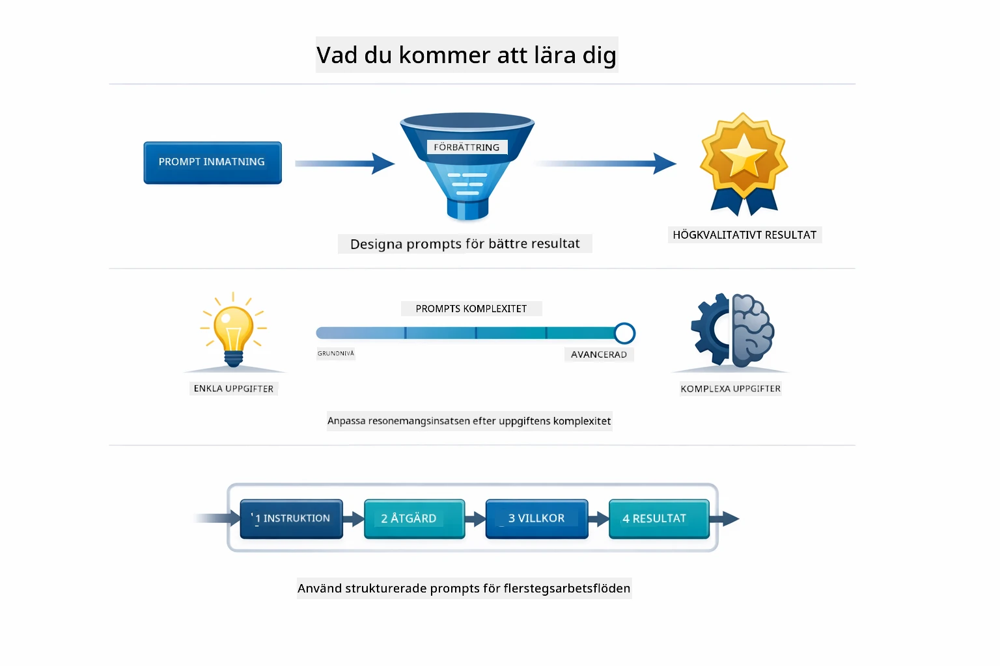
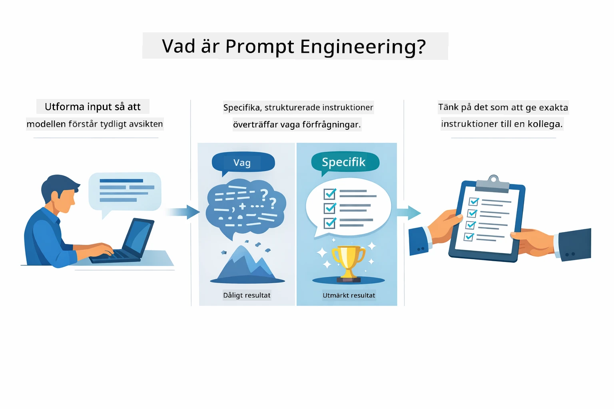
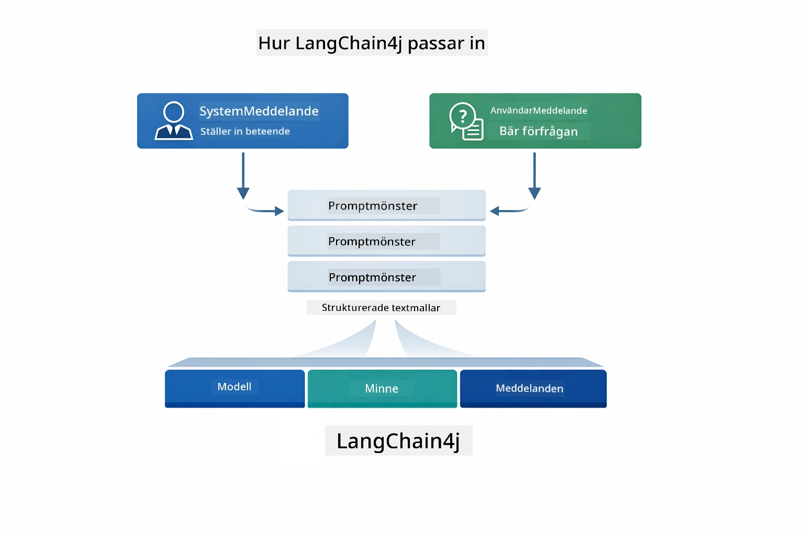
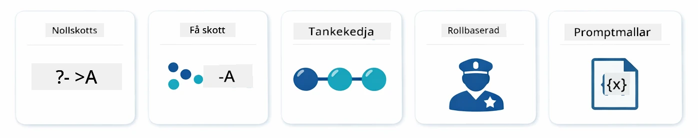
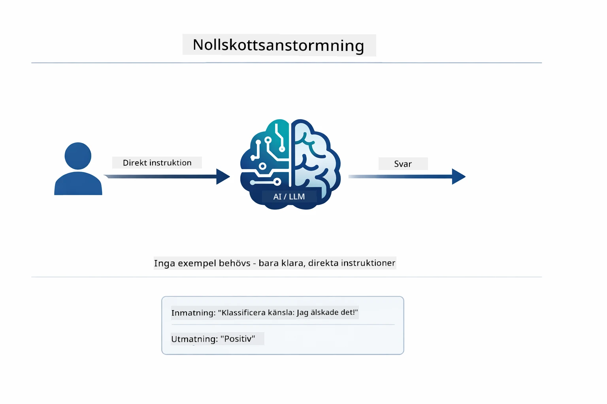
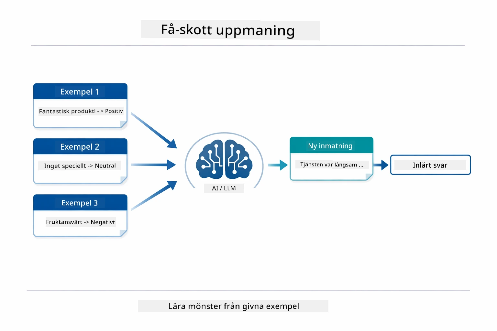
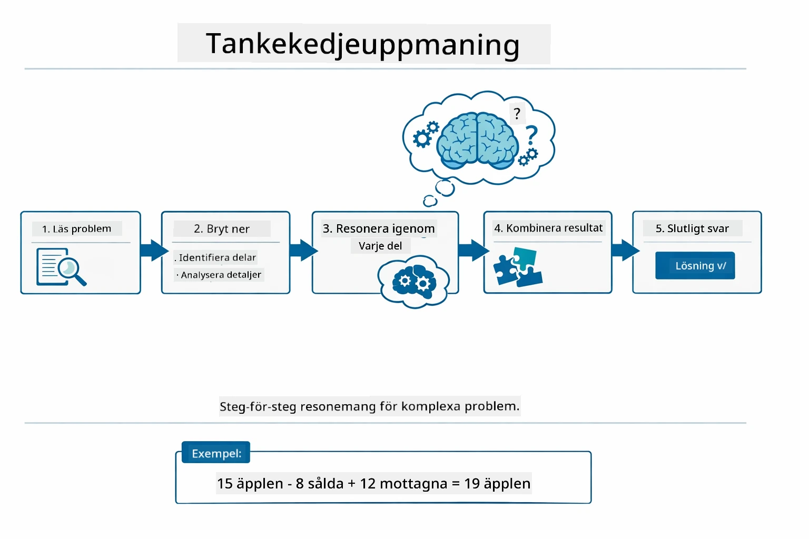
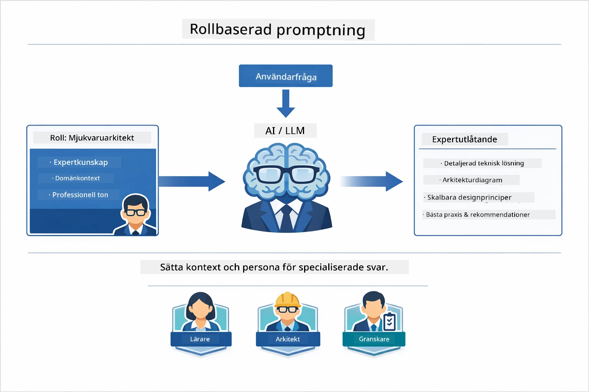
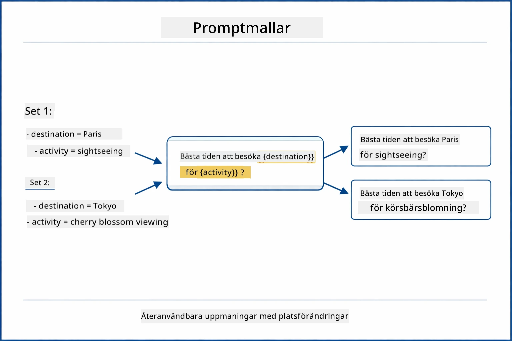
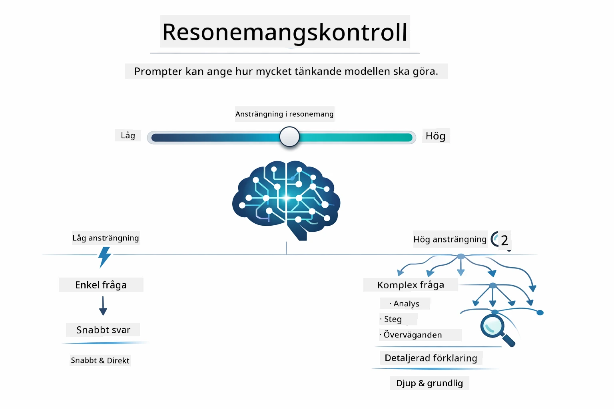

# Module 02: Prompt Engineering med GPT-5.2

## Innehållsförteckning

- [Video Walkthrough](../../../02-prompt-engineering)
- [Vad du kommer lära dig](../../../02-prompt-engineering)
- [Förutsättningar](../../../02-prompt-engineering)
- [Förstå prompt engineering](../../../02-prompt-engineering)
- [Grundläggande prompt engineering](../../../02-prompt-engineering)
  - [Zero-Shot Prompting](../../../02-prompt-engineering)
  - [Few-Shot Prompting](../../../02-prompt-engineering)
  - [Chain of Thought](../../../02-prompt-engineering)
  - [Rollbaserad prompting](../../../02-prompt-engineering)
  - [Prompt-mallar](../../../02-prompt-engineering)
- [Avancerade mönster](../../../02-prompt-engineering)
- [Använda befintliga Azure-resurser](../../../02-prompt-engineering)
- [Skärmdumpar från applikationen](../../../02-prompt-engineering)
- [Utforska mönstren](../../../02-prompt-engineering)
  - [Låg vs hög ambition](../../../02-prompt-engineering)
  - [Uppgiftsutförande (verktygsintroduktioner)](../../../02-prompt-engineering)
  - [Självreflekterande kod](../../../02-prompt-engineering)
  - [Strukturerad analys](../../../02-prompt-engineering)
  - [Flerstegs-chatt](../../../02-prompt-engineering)
  - [Steg-för-steg resonemang](../../../02-prompt-engineering)
  - [Begränsat utdata](../../../02-prompt-engineering)
- [Vad du verkligen lär dig](../../../02-prompt-engineering)
- [Nästa steg](../../../02-prompt-engineering)

## Video Walkthrough

Titta på denna livesession som förklarar hur du kommer igång med denna modul: [Prompt Engineering med LangChain4j - Live Session](https://www.youtube.com/live/PJ6aBaE6bog?si=LDshyBrTRodP-wke)

## Vad du kommer lära dig



I förra modulen såg du hur minne möjliggör konversations-AI och använde GitHub Models för grundläggande interaktioner. Nu fokuserar vi på hur du ställer frågor – själva promptsen – med Azure OpenAI:s GPT-5.2. Hur du strukturerar dina prompts påverkar dramatiskt kvaliteten på de svar du får. Vi börjar med en genomgång av grundläggande promptingstekniker, för att sedan gå vidare till åtta avancerade mönster som utnyttjar GPT-5.2:s kapabiliteter fullt ut.

Vi använder GPT-5.2 eftersom det introducerar resonemangskontroll – du kan instruera modellen hur mycket tänkande den ska göra innan den svarar. Detta gör olika promptingstrategier mer tydliga och hjälper dig att förstå när du ska använda vilken metod. Vi drar också nytta av Azures färre begränsningar för GPT-5.2 jämfört med GitHub Models.

## Förutsättningar

- Genomförd Modu 01 (Azure OpenAI-resurser distribuerade)
- `.env`-fil i rotmappen med Azure-uppgifter (skapad av `azd up` i Modu 01)

> **Notera:** Om du inte har genomfört Modul 01, följ distributionsinstruktionerna där först.

## Förstå prompt engineering



Prompt engineering handlar om att designa inmatningstexter som konsekvent ger dig de resultat du behöver. Det handlar inte bara om att ställa frågor – det handlar om att strukturera förfrågningar så att modellen förstår exakt vad du vill ha och hur det ska levereras.

Tänk på det som att ge instruktioner till en kollega. "Fix the bug" är vagt. "Fix the null pointer exception in UserService.java line 45 by adding a null check" är specifikt. Språkmodeller fungerar på samma sätt – specificitet och struktur spelar roll.



LangChain4j tillhandahåller infrastrukturen — modellanslutningar, minne och meddelandetyper — medan promptmönster är bara välstrukturerad text som du skickar genom den infrastrukturen. Nyckelkomponenterna är `SystemMessage` (som sätter AI:ns beteende och roll) och `UserMessage` (som bär din faktiska förfrågan).

## Grundläggande prompt engineering



Innan vi dyker in i de avancerade mönstren i denna modul, låt oss gå igenom fem grundläggande promptingstekniker. Dessa är byggstenarna som varje promptingenjör bör känna till. Om du redan har gått igenom [Quick Start-modulen](../00-quick-start/README.md#2-prompt-patterns) har du sett dessa i praktiken – här är den konceptuella ramen bakom dem.

### Zero-Shot Prompting

Den enklaste metoden: ge modellen en direkt instruktion utan exempel. Modellen litar helt på sin träning för att förstå och utföra uppgiften. Detta fungerar bra för enkla förfrågningar där förväntat beteende är uppenbart.



*Direkt instruktion utan exempel – modellen härleder uppgiften från instruktionen ensam*

```java
String prompt = "Classify this sentiment: 'I absolutely loved the movie!'";
String response = model.chat(prompt);
// Svar: "Positiv"
```

**När använda:** Enkla klassifikationer, direkta frågor, översättningar eller uppgifter där modellen klarar sig utan extra vägledning.

### Few-Shot Prompting

Ge exempel som visar det mönster du vill att modellen ska följa. Modellen lär sig det förväntade inmatnings- och utmatningsformatet från dina exempel och tillämpar det på nya indata. Detta förbättrar dramatiskt konsekvens för uppgifter där önskat format eller beteende inte är uppenbart.



*Lär sig från exempel – modellen identifierar mönstret och tillämpar det på nya indata*

```java
String prompt = """
    Classify the sentiment as positive, negative, or neutral.
    
    Examples:
    Text: "This product exceeded my expectations!" → Positive
    Text: "It's okay, nothing special." → Neutral
    Text: "Waste of money, very disappointed." → Negative
    
    Now classify this:
    Text: "Best purchase I've made all year!"
    """;
String response = model.chat(prompt);
```

**När använda:** Anpassade klassifikationer, konsekvent formatering, domänspecifika uppgifter eller när zero-shot-resultat är inkonsekventa.

### Chain of Thought

Be modellen visa sitt resonemang steg för steg. Istället för att hoppa direkt till ett svar bryter modellen ner problemet och arbetar igenom varje del uttryckligen. Detta förbättrar noggrannheten vid matte-, logik- och flerstegsresonemangsuppgifter.



*Steg-för-steg resonemang – bryter ner komplexa problem i explicita logiska steg*

```java
String prompt = """
    Problem: A store has 15 apples. They sell 8 apples and then 
    receive a shipment of 12 more apples. How many apples do they have now?
    
    Let's solve this step-by-step:
    """;
String response = model.chat(prompt);
// Modellen visar: 15 - 8 = 7, sedan 7 + 12 = 19 äpplen
```

**När använda:** Matteproblem, logikpussel, felsökning eller uppgifter där visat resonemang förbättrar noggrannhet och förtroende.

### Rollbaserad prompting

Sätt en persona eller roll för AI:n innan du ställer din fråga. Detta ger sammanhang som formar tonen, djupet och fokus för svaret. En "software architect" ger andra råd än en "junior developer" eller en "security auditor".



*Sätta sammanhang och persona – samma fråga får olika svar beroende på tilldelad roll*

```java
String prompt = """
    You are an experienced software architect reviewing code.
    Provide a brief code review for this function:
    
    def calculate_total(items):
        total = 0
        for item in items:
            total = total + item['price']
        return total
    """;
String response = model.chat(prompt);
```

**När använda:** Kodgranskningar, handledning, domänspecifik analys eller när du behöver svar anpassade efter särskild expertisnivå eller perspektiv.

### Prompt-mallar

Skapa återanvändbara prompts med variabla platshållare. Istället för att skriva en ny prompt varje gång definierar du en mall en gång och fyller i olika värden. LangChain4j:s `PromptTemplate`-klass gör detta enkelt med `{{variable}}`-syntax.



*Återanvändbara prompts med variabla platshållare – en mall, många användningar*

```java
PromptTemplate template = PromptTemplate.from(
    "What's the best time to visit {{destination}} for {{activity}}?"
);

Prompt prompt = template.apply(Map.of(
    "destination", "Paris",
    "activity", "sightseeing"
));

String response = model.chat(prompt.text());
```

**När använda:** Upprepade frågor med olika indata, batchbearbetning, bygga återanvändbara AI-arbetsflöden eller scenario där promptstrukturen är fast men data varierar.

---

Dessa fem grundläggande tekniker ger dig en stabil verktygslåda för de flesta prompting-uppgifter. Resten av denna modul bygger vidare på dem med **åtta avancerade mönster** som utnyttjar GPT-5.2:s resonemangskontroll, självvärdering och strukturerade utdatakapabiliteter.

## Avancerade mönster

Med grunderna täckta, låt oss gå vidare till de åtta avancerade mönstren som gör denna modul unik. Inte alla problem behöver samma tillvägagångssätt. Vissa frågor kräver snabba svar, andra djup analys. Vissa behöver synligt resonemang, andra bara resultat. Varje mönster nedan är optimerat för ett annat scenario – och GPT-5.2:s resonemangskontroll gör skillnaderna ännu tydligare.


*Översikt över de åtta prompt engineering-mönstren och deras användningsområden*



*GPT-5.2:s resonemangskontroll låter dig ange hur mycket tänkande modellen ska göra – från snabba direkta svar till djup utforskning*

**Låg ambition (snabbt & fokuserat)** – För enkla frågor där du vill ha snabba, direkta svar. Modellen gör minimalt med resonemang – max 2 steg. Använd detta för beräkningar, uppslag eller enkla frågor.

```java
String prompt = """
    <context_gathering>
    - Search depth: very low
    - Bias strongly towards providing a correct answer as quickly as possible
    - Usually, this means an absolute maximum of 2 reasoning steps
    - If you think you need more time, state what you know and what's uncertain
    </context_gathering>
    
    Problem: What is 15% of 200?
    
    Provide your answer:
    """;

String response = chatModel.chat(prompt);
```

> 💡 **Utforska med GitHub Copilot:** Öppna [`Gpt5PromptService.java`](../../../02-prompt-engineering/src/main/java/com/example/langchain4j/prompts/service/Gpt5PromptService.java) och fråga:
> - "Vad är skillnaden mellan låg ambition och hög ambition i promptingmönster?"
> - "Hur hjälper XML-taggar i prompts att strukturera AI:s svar?"
> - "När ska jag använda självreflektionsmönster kontra direkt instruktion?"

**Hög ambition (djupt & grundligt)** – För komplexa problem där du vill ha omfattande analys. Modellen utforskar grundligt och visar detaljerat resonemang. Använd detta för systemdesign, arkitekturval eller komplex forskning.

```java
String prompt = """
    Analyze this problem thoroughly and provide a comprehensive solution.
    Consider multiple approaches, trade-offs, and important details.
    Show your analysis and reasoning in your response.
    
    Problem: Design a caching strategy for a high-traffic REST API.
    """;

String response = chatModel.chat(prompt);
```

**Uppgiftsutförande (steg-för-steg framsteg)** – För flerstegsarbetsflöden. Modellen ger en upfront-plan, berättar varje steg när det görs, och ger sedan en sammanfattning. Använd detta för migreringar, implementationer eller andra flerstegsprocesser.

```java
String prompt = """
    <task_execution>
    1. First, briefly restate the user's goal in a friendly way
    
    2. Create a step-by-step plan:
       - List all steps needed
       - Identify potential challenges
       - Outline success criteria
    
    3. Execute each step:
       - Narrate what you're doing
       - Show progress clearly
       - Handle any issues that arise
    
    4. Summarize:
       - What was completed
       - Any important notes
       - Next steps if applicable
    </task_execution>
    
    <tool_preambles>
    - Always begin by rephrasing the user's goal clearly
    - Outline your plan before executing
    - Narrate each step as you go
    - Finish with a distinct summary
    </tool_preambles>
    
    Task: Create a REST endpoint for user registration
    
    Begin execution:
    """;

String response = chatModel.chat(prompt);
```

Chain-of-Thought prompting ber uttryckligen modellen visa sitt resonemangsprocess, vilket förbättrar noggrannheten för komplexa uppgifter. Steg-för-steg uppdelningen hjälper både människor och AI att förstå logiken.

> **🤖 Prova med [GitHub Copilot](https://github.com/features/copilot) Chat:** Fråga om detta mönster:
> - "Hur skulle jag anpassa mönstret för uppgiftsutförande för långkörande operationer?"
> - "Vilka är bästa praxis för att strukturera verktygsintroduktioner i produktionsapplikationer?"
> - "Hur kan jag fånga och visa mellanliggande framsteg i en användargränssnitt?"


*Planera → Utför → Sammanfatta arbetsflöde för flerstegsuppgifter*

**Självreflekterande kod** – För att generera produktionskvalitativ kod. Modellen genererar kod enligt produktionsstandarder med korrekt felhantering. Använd detta när du bygger nya funktioner eller tjänster.

```java
String prompt = """
    Generate Java code with production-quality standards: Create an email validation service
    Keep it simple and include basic error handling.
    """;

String response = chatModel.chat(prompt);
```


*Iterativ förbättringsloop – generera, utvärdera, identifiera problem, förbättra, upprepa*

**Strukturerad analys** – För konsekvent utvärdering. Modellen granskar kod med ett fast ramverk (korrekthet, praxis, prestanda, säkerhet, underhållbarhet). Använd detta vid kodgranskningar eller kvalitetsbedömningar.

```java
String prompt = """
    <analysis_framework>
    You are an expert code reviewer. Analyze the code for:
    
    1. Correctness
       - Does it work as intended?
       - Are there logical errors?
    
    2. Best Practices
       - Follows language conventions?
       - Appropriate design patterns?
    
    3. Performance
       - Any inefficiencies?
       - Scalability concerns?
    
    4. Security
       - Potential vulnerabilities?
       - Input validation?
    
    5. Maintainability
       - Code clarity?
       - Documentation?
    
    <output_format>
    Provide your analysis in this structure:
    - Summary: One-sentence overall assessment
    - Strengths: 2-3 positive points
    - Issues: List any problems found with severity (High/Medium/Low)
    - Recommendations: Specific improvements
    </output_format>
    </analysis_framework>
    
    Code to analyze:
    ```
    public List getUsers() {
        return database.query("SELECT * FROM users");
    }
    ```
    Provide your structured analysis:
    """;

String response = chatModel.chat(prompt);
```

> **🤖 Prova med [GitHub Copilot](https://github.com/features/copilot) Chat:** Fråga om strukturerad analys:
> - "Hur kan jag anpassa analysramverket för olika typer av kodgranskningar?"
> - "Vad är bästa sättet att tolka och agera på strukturerat utdata programmässigt?"
> - "Hur säkerställer jag konsekventa allvarlighetsnivåer över olika granskningssessioner?"


*Ramverk för konsekventa kodgranskningar med allvarlighetsnivåer*

**Flerstegs-chatt** – För samtal som behöver sammanhang. Modellen minns tidigare meddelanden och bygger vidare på dem. Använd detta för interaktiva hjälpsessioner eller komplex Q&A.

```java
ChatMemory memory = MessageWindowChatMemory.withMaxMessages(10);

memory.add(UserMessage.from("What is Spring Boot?"));
AiMessage aiMessage1 = chatModel.chat(memory.messages()).aiMessage();
memory.add(aiMessage1);

memory.add(UserMessage.from("Show me an example"));
AiMessage aiMessage2 = chatModel.chat(memory.messages()).aiMessage();
memory.add(aiMessage2);
```


*Hur samtalssammanhang akkumuleras över flera vändningar tills token-gränsen nås*

**Steg-för-steg resonemang** – För problem som kräver synlig logik. Modellen visar explicit resonemang för varje steg. Använd detta för matteproblem, logikpussel eller när du behöver förstå tänkande processen.

```java
String prompt = """
    <instruction>Show your reasoning step-by-step</instruction>
    
    If a train travels 120 km in 2 hours, then stops for 30 minutes,
    then travels another 90 km in 1.5 hours, what is the average speed
    for the entire journey including the stop?
    """;

String response = chatModel.chat(prompt);
```


*Bryter ner problem i explicita logiska steg*

**Begränsat utdata** – För svar med specifika formatkrav. Modellen följer strikt format- och längdregler. Använd detta för sammanfattningar eller när du behöver exakt utdatastruktur.

```java
String prompt = """
    <constraints>
    - Exactly 100 words
    - Bullet point format
    - Technical terms only
    </constraints>
    
    Summarize the key concepts of machine learning.
    """;

String response = chatModel.chat(prompt);
```


*Efterlevnad av specifika format-, längd- och strukturkrav*

## Använda befintliga Azure-resurser

**Verifiera distribution:**

Säkerställ att `.env`-filen finns i rotmappen med Azure-uppgifter (skapad under Modul 01):
```bash
cat ../.env  # Bör visa AZURE_OPENAI_ENDPOINT, API_KEY, DEPLOYMENT
```

**Starta applikationen:**

> **Notera:** Om du redan startade alla applikationer med `./start-all.sh` från Modul 01, kör denna modul redan på port 8083. Du kan hoppa över startkommandon nedan och gå direkt till http://localhost:8083.

**Alternativ 1: Använd Spring Boot Dashboard (Rekommenderat för VS Code-användare)**
Utvecklingscontainern inkluderar tillägget Spring Boot Dashboard, som ger ett visuellt gränssnitt för att hantera alla Spring Boot-applikationer. Du hittar det i Aktivitetsfältet på vänster sida i VS Code (leta efter Spring Boot-ikonen).

Från Spring Boot Dashboard kan du:
- Se alla tillgängliga Spring Boot-applikationer i arbetsytan
- Starta/stoppa applikationer med ett klick
- Visa applikationsloggar i realtid
- Övervaka applikationens status

Klicka helt enkelt på play-knappen bredvid "prompt-engineering" för att starta denna modul, eller starta alla moduler samtidigt.


**Alternativ 2: Använda shell-skript**

Starta alla webbapplikationer (moduler 01-04):

**Bash:**
```bash
cd ..  # Från rotkatalogen
./start-all.sh
```

**PowerShell:**
```powershell
cd ..  # Från rotkatalogen
.\start-all.ps1
```

Eller starta bara denna modul:

**Bash:**
```bash
cd 02-prompt-engineering
./start.sh
```

**PowerShell:**
```powershell
cd 02-prompt-engineering
.\start.ps1
```

Båda skripten laddar automatiskt miljövariabler från roten `.env`-filen och kommer att bygga JAR-filerna om de inte redan finns.

> **Obs:** Om du föredrar att bygga alla moduler manuellt innan start:
>
> **Bash:**
> ```bash
> cd ..  # Go to root directory
> mvn clean package -DskipTests
> ```
>
> **PowerShell:**
> ```powershell
> cd ..  # Go to root directory
> mvn clean package -DskipTests
> ```

Öppna http://localhost:8083 i din webbläsare.

**För att stoppa:**

**Bash:**
```bash
./stop.sh  # Endast denna modul
# Eller
cd .. && ./stop-all.sh  # Alla moduler
```

**PowerShell:**
```powershell
.\stop.ps1  # Endast denna modul
# Eller
cd ..; .\stop-all.ps1  # Alla moduler
```

## Applikationsskärmbilder


*Huvuddashboard som visar alla 8 prompt engineering-mönster med deras karaktäristika och användningsområden*

## Utforska Mönstren

Webbgränssnittet låter dig experimentera med olika promptstrategier. Varje mönster löser olika problem – testa dem för att se när varje metod fungerar bäst.

> **Obs: Streaming vs Icke-streaming** — Varje mönstersida erbjuder två knappar: **🔴 Stream Response (Live)** och en **Icke-streaming**-option. Streaming använder Server-Sent Events (SSE) för att visa tokens i realtid medan modellen genererar dem, så du ser framstegen omedelbart. Icke-streaming-alternativet väntar med att visa svaret tills hela svaret är färdigt. För prompts som triggar djup resonemang (t.ex. High Eagerness, Self-Reflecting Code) kan icke-streaming-anropet ta mycket lång tid – ibland minuter – utan synlig feedback. **Använd streaming när du experimenterar med komplexa prompts** så kan du se modellen arbeta och undvika intrycket av att förfrågan har timeout.
>
> **Obs: Webbläsarkrav** — Streamingfunktionen använder Fetch Streams API (`response.body.getReader()`) vilket kräver en fullständig webbläsare (Chrome, Edge, Firefox, Safari). Det fungerar **inte** i VS Codes inbyggda Simple Browser, eftersom dess webview inte stöder ReadableStream API. Om du använder Simple Browser kommer icke-streaming-knapparna fortfarande att fungera normalt – endast streaming-knapparna påverkas. Öppna `http://localhost:8083` i en extern webbläsare för full funktionalitet.

### Low vs High Eagerness

Ställ en enkel fråga som "Vad är 15 % av 200?" med Low Eagerness. Du får ett snabbt, direkt svar. Ställ sedan en komplex fråga som "Designa en cache-strategi för en högtrafikerad API" med High Eagerness. Klicka på **🔴 Stream Response (Live)** och se modellens detaljerade resonemang dyka upp token för token. Samma modell, samma frågestruktur – men prompten talar om hur mycket tänkande som ska göras.

### Uppgiftsutförande (Verktygspreambler)

Flerstegsarbetsflöden gynnas av förhandsplanering och progressberättande. Modellen skisserar vad den ska göra, berättar om varje steg och sammanfattar sedan resultaten.

### Självreflekterande Kod

Testa "Skapa en tjänst för e-postvalidering". Istället för att bara generera kod och stanna genererar modellen, utvärderar mot kvalitetskriterier, identifierar svagheter och förbättrar. Du ser hur den itererar tills koden uppfyller produktionsstandarder.

### Strukturerad Analys

Kodgranskningar behöver konsekventa utvärderingsramverk. Modellen analyserar kod enligt fasta kategorier (korrekthet, metoder, prestanda, säkerhet) med allvarlighetsnivåer.

### Flerstegs-Samtal

Fråga "Vad är Spring Boot?" och följ sedan omedelbart upp med "Visa mig ett exempel". Modellen minns din första fråga och ger dig ett specifikt Spring Boot-exempel. Utan minne vore den andra frågan för vag.

### Steg-för-steg-resonemang

Välj ett matematiskt problem och pröva både med Steg-för-steg-resonemang och Low Eagerness. Low eagerness ger bara svaret – snabbt men oklart. Steg-för-steg visar alla beräkningar och beslut.

### Begränsat Utdata

När du behöver specifika format eller ordantal, tvingar detta mönster strikt följsamhet. Testa att generera en sammanfattning med exakt 100 ord i punktform.

## Vad Du Verkligen Lär Dig

**Resoneringsinsats Förändrar Allt**

GPT-5.2 låter dig styra beräkningsinsatsen genom dina prompts. Låg insats ger snabba svar med minimal utforskning. Hög insats innebär att modellen tar tid på sig att tänka djupt. Du lär dig att anpassa insatsen efter uppgiftens komplexitet – slösa inte tid på enkla frågor, men skynda inte heller komplexa beslut.

**Struktur Leder Till Beteende**

Lägger du märke till XML-taggarna i promptsen? De är inte dekorativa. Modeller följer strukturerade instruktioner mer tillförlitligt än fri text. När du behöver flerstegsprocesser eller komplex logik hjälper struktur modellen att hålla reda på var den är och vad som kommer härnäst.


*Anatomi av en välstrukturerad prompt med tydliga sektioner och XML-liknande organisation*

**Kvalitet Genom Självutvärdering**

De självreflekterande mönstren fungerar genom att göra kvalitetskriterier explicita. Istället för att hoppas att modellen "gör rätt", talar du om exakt vad "rätt" betyder: korrekt logik, felhantering, prestanda, säkerhet. Modellen kan då utvärdera sin egen output och förbättra den. Detta förvandlar kodgenerering från ett lotteri till en process.

**Kontext Är Begränsad**

Flerstegs-konversationer fungerar genom att inkludera meddelandehistorik med varje förfrågan. Men det finns en gräns – varje modell har max antal tokens. När konversationer växer behöver du strategier för att behålla relevant kontext utan att nå den gränsen. Denna modul visar hur minne fungerar; senare lär du dig när du ska sammanfatta, när du ska glömma och när du ska hämta.

## Nästa Steg

**Nästa Modul:** [03-rag - RAG (Retrieval-Augmented Generation)](../03-rag/README.md)

---

**Navigation:** [← Föregående: Modul 01 - Introduktion](../01-introduction/README.md) | [Tillbaka till Huvudmenyn](../README.md) | [Nästa: Modul 03 - RAG →](../03-rag/README.md)

---

<!-- CO-OP TRANSLATOR DISCLAIMER START -->
**Ansvarsfriskrivning**:
Detta dokument har översatts med hjälp av AI-översättningstjänsten [Co-op Translator](https://github.com/Azure/co-op-translator). Även om vi strävar efter noggrannhet, vänligen notera att automatiska översättningar kan innehålla fel eller brister. Det ursprungliga dokumentet på dess ursprungliga språk bör betraktas som den auktoritativa källan. För kritisk information rekommenderas professionell översättning av människa. Vi ansvarar inte för några missförstånd eller feltolkningar som uppstår från användningen av denna översättning.
<!-- CO-OP TRANSLATOR DISCLAIMER END -->