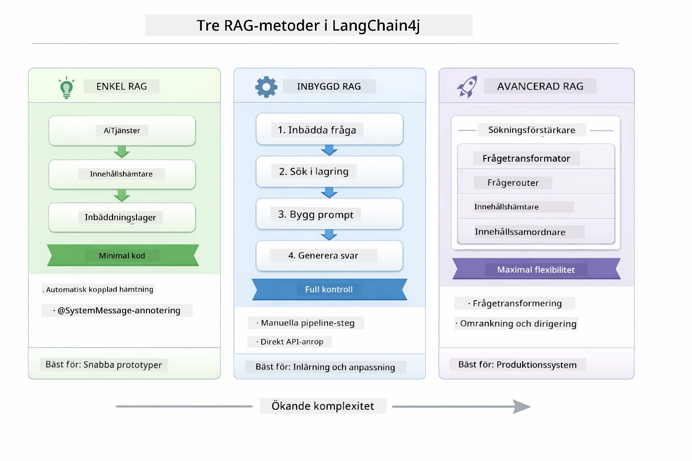
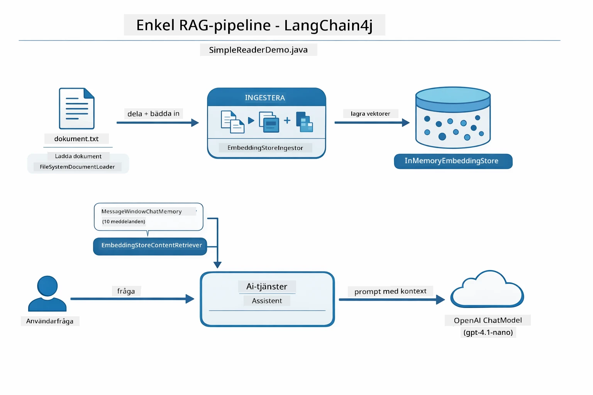
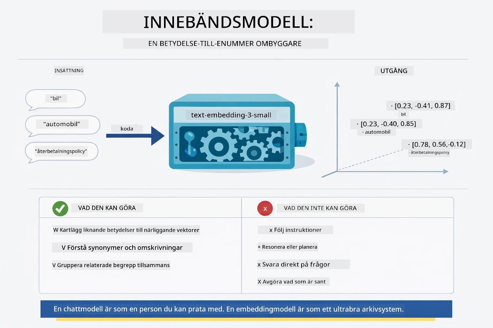
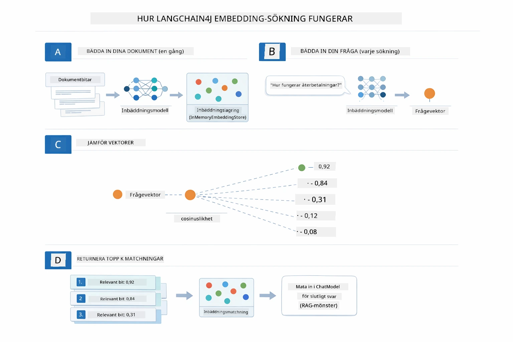
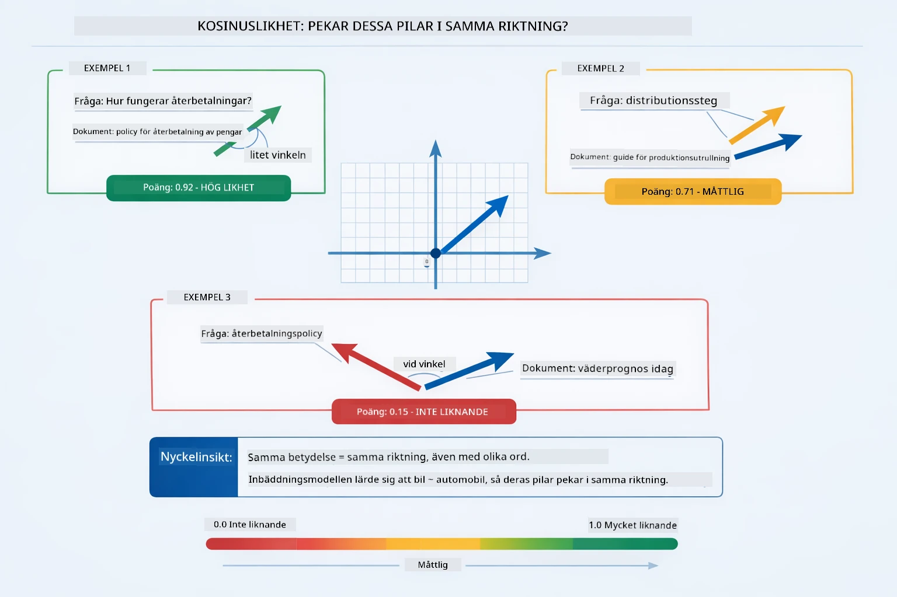
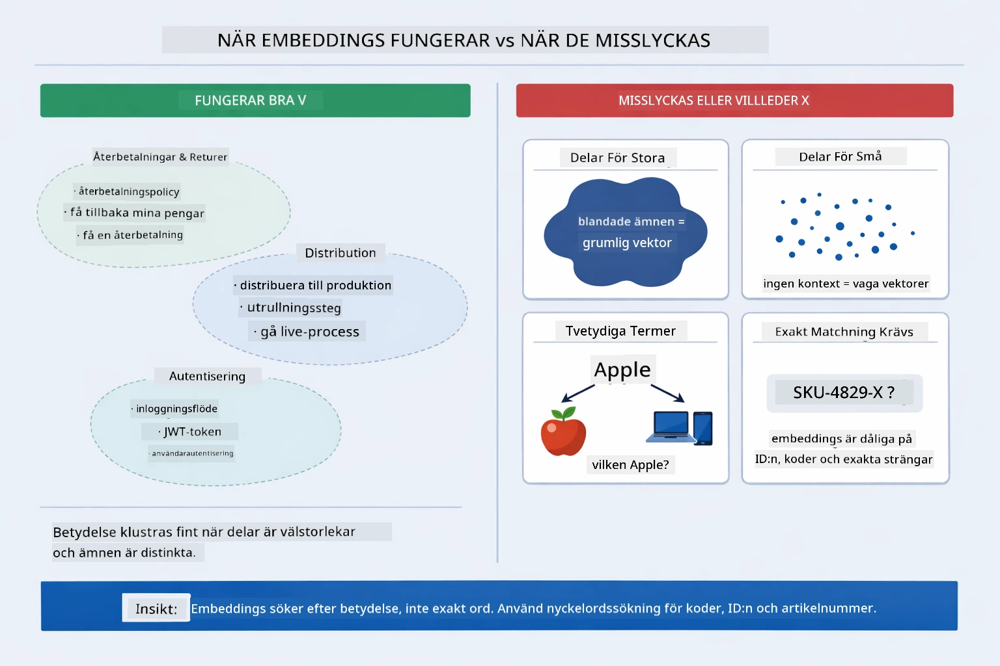

# Modul 03: RAG (Retrieval-Augmented Generation)

## Innehållsförteckning

- [Video Walkthrough](../../../03-rag)
- [Vad du kommer att lära dig](../../../03-rag)
- [Förkunskaper](../../../03-rag)
- [Att förstå RAG](../../../03-rag)
  - [Vilken RAG-metod använder denna handledning?](../../../03-rag)
- [Hur det fungerar](../../../03-rag)
  - [Dokumentbearbetning](../../../03-rag)
  - [Skapa embeddingar](../../../03-rag)
  - [Semantisk sökning](../../../03-rag)
  - [Svarsgenerering](../../../03-rag)
- [Kör applikationen](../../../03-rag)
- [Använda applikationen](../../../03-rag)
  - [Ladda upp ett dokument](../../../03-rag)
  - [Ställ frågor](../../../03-rag)
  - [Kontrollera källreferenser](../../../03-rag)
  - [Experimentera med frågor](../../../03-rag)
- [Nyckelkoncept](../../../03-rag)
  - [Chunking-strategi](../../../03-rag)
  - [Likhetspoäng](../../../03-rag)
  - [Minneslagring](../../../03-rag)
  - [Hantera context-fönster](../../../03-rag)
- [När RAG är viktigt](../../../03-rag)
- [Nästa steg](../../../03-rag)

## Video Walkthrough

Titta på denna livestream där hur du kommer igång med denna modul förklaras:

<a href="https://www.youtube.com/watch?v=_olq75ZH_eY"></a>

## Vad du kommer att lära dig

I de tidigare modulerna lärde du dig hur du kan föra samtal med AI och strukturera dina promtar effektivt. Men det finns en grundläggande begränsning: språkmodeller vet bara det de lärde sig under träningen. De kan inte svara på frågor om ditt företags policyer, din projektdokumentation eller någon information de inte tränades på.

RAG (Retrieval-Augmented Generation) löser detta problem. Istället för att försöka lära modellen din information (vilket är dyrt och opraktiskt), ger du den möjlighet att söka i dina dokument. När någon ställer en fråga hittar systemet relevant information och inkluderar den i prompten. Modellen svarar sedan baserat på den hämtade kontexten.

Tänk på RAG som att ge modellen ett referensbibliotek. När du ställer en fråga gör systemet följande:

1. **Användarfråga** – Du ställer en fråga
2. **Embedding** – Konverterar din fråga till en vektor
3. **Vektorsökning** – Hittar liknande dokumentdelar
4. **Konstruktionssammanställning** – Lägger till relevanta delar i prompten
5. **Svar** – LLM genererar ett svar baserat på kontexten

Detta förankrar modellens svar i din faktiska data istället för att baseras på träningsdata eller fingervickande svar.

## Förkunskaper

- Genomförd [Modul 00 - Snabbstart](../00-quick-start/README.md) (för Easy RAG-exemplet som refereras ovan)
- Genomförd [Modul 01 - Introduktion](../01-introduction/README.md) (Azure OpenAI-resurser utplacerade, inklusive `text-embedding-3-small` embedding-modellen)
- `.env`-fil i rotmappen med Azure-referenser (skapad av `azd up` i Modul 01)

> **Observera:** Om du inte har slutfört Modul 01, följ först installationsanvisningarna där. Kommandot `azd up` distribuerar både GPT-chatmodellen och embedding-modellen som används i denna modul.

## Att förstå RAG

Diagrammet nedan illustrerar kärnkonceptet: istället för att förlita sig enbart på modellens träningsdata ges den ett referensbibliotek av dina dokument att konsultera innan varje svar genereras.


*Detta diagram visar skillnaden mellan en standard-LLM (som gissar från träningsdata) och en RAG-förstärkt LLM (som först konsulterar dina dokument).*

Så här hänger delarna ihop genom hela kedjan. En användarfråga går igenom fyra steg — embedding, vektorsökning, kontextsammansättning och svarsgenerering — där varje steg bygger på det förra:


*Detta diagram visar den kompletta RAG-pipelinen — en användarfråga går genom embedding, vektorsökning, kontextsammansättning och svarsgenerering.*

Resten av denna modul går igenom varje steg i detalj, med kod du kan köra och ändra.

### Vilken RAG-metod använder denna handledning?

LangChain4j erbjuder tre sätt att implementera RAG, var och en med olika abstraktionsnivå. Diagrammet nedan jämför dem sida vid sida:



*Detta diagram jämför de tre LangChain4j RAG-metoderna — Easy, Native och Advanced — och visar deras nyckelkomponenter och när man bör använda varje.*

| Metod | Vad den gör | Avvägning |
|---|---|---|
| **Easy RAG** | Kopplar allt automatiskt via `AiServices` och `ContentRetriever`. Du annoterar ett gränssnitt, lägger till en retriever, och LangChain4j hanterar embedding, sökning och promptsammanställning i bakgrunden. | Minimal kod, men du ser inte vad som händer i varje steg. |
| **Native RAG** | Du anropar embedding-modellen, söker i lagret, bygger prompten och genererar svaret själv — ett uttalat steg i taget. | Mer kod, men varje steg är synligt och modifierbart. |
| **Advanced RAG** | Använder `RetrievalAugmentor` med pluggbara query-transformers, routers, re-rankers och content injectors för produktionspipeline. | Maximal flexibilitet men betydligt mer komplexitet. |

**Denna handledning använder Native-metoden.** Varje steg i RAG-pipelinen — embedning av fråga, sökning i vektorlagret, sammanställning av kontext och generering av svar — är explicit skrivet i [`RagService.java`](../../../03-rag/src/main/java/com/example/langchain4j/rag/service/RagService.java). Detta är avsiktligt: som en inlärningsresurs är det viktigare att du ser och förstår varje steg än att koden är minimal. När du är bekväm med hur delarna hänger ihop kan du gå vidare till Easy RAG för snabba prototyper eller Advanced RAG för produktion.

> **💡 Redan sett Easy RAG i aktion?** [Snabbstart-modulen](../00-quick-start/README.md) inkluderar ett Document Q&A-exempel ([`SimpleReaderDemo.java`](../../../00-quick-start/src/main/java/com/example/langchain4j/quickstart/SimpleReaderDemo.java)) som använder Easy RAG — LangChain4j hanterar embedding, sökning och promptsammanställning automatiskt. Denna modul tar nästa steg genom att öppna den pipelinen så att du kan se och kontrollera varje steg själv.



*Detta diagram visar Easy RAG-pipelinen från `SimpleReaderDemo.java`. Jämför detta med Native-metoden som används i denna modul: Easy RAG döljer embedding, hämtning och promptsammanställning bakom `AiServices` och `ContentRetriever` — du laddar ett dokument, lägger till en retriever och får svar. Native-metoden i denna modul öppnar upp pipelinen så att du själv anropar varje steg (embedda, söka, sammanställa kontext, generera), vilket ger full insyn och kontroll.*

## Hur det fungerar

RAG-pipelinen i denna modul bryts ner i fyra steg som körs i följd varje gång en användare ställer en fråga. Först analyseras och delas det uppladdade dokumentet upp i hanterbara delar. Dessa delar konverteras sedan till vektor-embeddingar och lagras för matematiska jämförelser. När en fråga kommer gör systemet en semantisk sökning efter de mest relevanta delarna, och skickar sedan dem som kontext till LLM för svarsgenerering. Nedan går vi igenom varje steg med kod och diagram. Låt oss titta på första steget.

### Dokumentbearbetning

[DocumentService.java](../../../03-rag/src/main/java/com/example/langchain4j/rag/service/DocumentService.java)

När du laddar upp ett dokument analyserar systemet det (PDF eller ren text), bifogar metadata som filnamn, och delar sedan upp det i delar — mindre segment som rymms bekvämt i modellens context-fönster. Dessa segment överlappar något så att ingen viktig kontext försvinner i gränserna.

```java
// Analysera den uppladdade filen och omslut den i ett LangChain4j-dokument
Document document = Document.from(content, metadata);

// Dela upp i 300-token stycken med 30-token överlappning
DocumentSplitter splitter = DocumentSplitters
    .recursive(300, 30);

List<TextSegment> segments = splitter.split(document);
```

Diagrammet nedan visar hur detta ser ut visuellt. Notera hur varje del delar några tokens med sina grannar — 30-token överlappningen säkerställer att ingen viktig kontext faller mellan stolarna:


*Detta diagram visar hur ett dokument delas upp i 300-token segment med 30-token överlappning, för att bevara kontext vid segmentgränser.*

> **🤖 Testa med [GitHub Copilot](https://github.com/features/copilot) Chat:** Öppna [`DocumentService.java`](../../../03-rag/src/main/java/com/example/langchain4j/rag/service/DocumentService.java) och fråga:
> - "Hur delar LangChain4j upp dokument i chunkar och varför är överlapp viktigt?"
> - "Vilken är optimal chunkstorlek för olika dokumenttyper och varför?"
> - "Hur hanterar jag dokument på flera språk eller med specialformatering?"

### Skapa embeddingar

[LangChainRagConfig.java](../../../03-rag/src/main/java/com/example/langchain4j/rag/config/LangChainRagConfig.java)

Varje del konverteras till en numerisk representation kallad embedding — i grund och botten en omvandlare från betydelse till siffror. Embedding-modellen är inte "intelligent" på samma sätt som en chatmodell; den kan inte följa instruktioner, resonera eller svara på frågor. Vad den kan göra är att kartlägga text till ett matematiskt rum där liknande betydelser hamnar nära varandra — "bil" nära "automobil", "återbetalningspolicy" nära "få tillbaka mina pengar". Tänk på en chatmodell som en person du kan prata med; en embedding-modell är ett mycket bra arkivsystem.



*Detta diagram visar hur en embedding-modell omvandlar text till numeriska vektorer och placerar liknande betydelser — som "bil" och "automobil" — nära varandra i vektorrummet.*

```java
@Bean
public EmbeddingModel embeddingModel() {
    return OpenAiOfficialEmbeddingModel.builder()
        .baseUrl(azureOpenAiEndpoint)
        .apiKey(azureOpenAiKey)
        .modelName(azureEmbeddingDeploymentName)
        .build();
}

EmbeddingStore<TextSegment> embeddingStore = 
    new InMemoryEmbeddingStore<>();
```

Klassdiagrammet nedan visar de två separata flödena i en RAG-pipeline och de LangChain4j-klasser som implementerar dem. **Inmatningsflödet** (körs en gång vid uppladdning) delar dokumentet, embedder chunkarna och lagrar dem via `.addAll()`. **Frågeflödet** (körs varje gång en användare frågar) embedder frågan, söker i lagret via `.search()`, och skickar matchad kontext till chatmodellen. Båda flöden möts vid det delade `EmbeddingStore<TextSegment>`-gränssnittet:


*Detta diagram visar de två flödena i en RAG-pipeline — inmatning och fråga — och hur de kopplas ihop genom ett delat EmbeddingStore.*

När embeddingarna lagrats klustras liknande innehåll naturligt tillsammans i vektorrummet. Visualiseringen nedan visar hur dokument om relaterade ämnen grupperas som närliggande punkter, vilket möjliggör semantisk sökning:


*Denna visualisering visar hur relaterade dokument klustras samman i ett 3D-vektorrum, med ämnen som Tekniska Dokument, Affärsregler och Vanliga Frågor som tydliga grupper.*

När användaren söker följer systemet fyra steg: embedda dokumenten en gång, embedda frågan vid varje sök, jämföra frågevektorn mot alla lagrade vektorer med cosinuslikhet, och returnera topp-K högst rankade chunkar. Diagrammet nedan visar varje steg och LangChain4j-klasser som ingår:



*Detta diagram visar de fyra stegen i embedding-sökningen: embedda dokument, embedda fråga, jämföra vektorer med cosinuslikhet, och returnera toppresultat.*

### Semantisk sökning

[RagService.java](../../../03-rag/src/main/java/com/example/langchain4j/rag/service/RagService.java)

När du ställer en fråga görs även en embedding av frågan. Systemet jämför frågans embedding mot alla dokumentchunkars embeddingar. Den hittar chunkar med mest liknande betydelser — inte bara matchande nyckelord utan verklig semantisk likhet.

```java
Embedding queryEmbedding = embeddingModel.embed(question).content();

EmbeddingSearchRequest searchRequest = EmbeddingSearchRequest.builder()
    .queryEmbedding(queryEmbedding)
    .maxResults(5)
    .minScore(0.5)
    .build();

EmbeddingSearchResult<TextSegment> searchResult = embeddingStore.search(searchRequest);
List<EmbeddingMatch<TextSegment>> matches = searchResult.matches();

for (EmbeddingMatch<TextSegment> match : matches) {
    String relevantText = match.embedded().text();
    double score = match.score();
}
```

Diagrammet nedan jämför semantisk sökning med traditionell nyckelordssökning. En nyckelordssökning på "fordon" missar en chunk om "bilar och lastbilar", medan semantisk sökning förstår att de betyder samma sak och returnerar den med högt poäng:


*Detta diagram jämför nyckelordsbaserad sökning med semantisk sökning, och visar hur semantisk sökning hämtar konceptuellt relaterat innehåll även när exakta nyckelord skiljer sig.*

Under huven mäts likhet med cosinuslikhet — i praktiken frågar man "pekar dessa två pilar i samma riktning?" Två chunkar kan använda helt olika ord, men om de betyder samma sak pekar deras vektorer åt samma håll och får poäng nära 1,0:


*Detta diagram illustrerar cosinuslikhet som vinkeln mellan inbäddningsvektorer — mer riktade vektorer får poäng närmare 1,0, vilket indikerar högre semantisk likhet.*

> **🤖 Prova med [GitHub Copilot](https://github.com/features/copilot) Chat:** Öppna [`RagService.java`](../../../03-rag/src/main/java/com/example/langchain4j/rag/service/RagService.java) och fråga:
> - "Hur fungerar likhetssökning med embeddings och vad avgör poängen?"
> - "Vilken likhetströskel bör jag använda och hur påverkar den resultaten?"
> - "Hur hanterar jag fall där inga relevanta dokument hittas?"

### Svarsgenerering

[RagService.java](../../../03-rag/src/main/java/com/example/langchain4j/rag/service/RagService.java)

De mest relevanta bitarna sammanställs till en strukturerad prompt som inkluderar explicita instruktioner, den hämtade kontexten och användarens fråga. Modellen läser dessa specifika bitar och svarar baserat på den informationen — den kan bara använda det som finns framför sig, vilket förhindrar hallucination.

```java
String context = matches.stream()
    .map(match -> match.embedded().text())
    .collect(Collectors.joining("\n\n"));

String prompt = String.format("""
    Answer the question based on the following context.
    If the answer cannot be found in the context, say so.

    Context:
    %s

    Question: %s

    Answer:""", context, request.question());

String answer = chatModel.chat(prompt);
```

Diagrammet nedan visar denna sammansättning i praktiken — de högst poängsatta bitarna från söksteget injiceras i promptmallen, och `OpenAiOfficialChatModel` genererar ett förankrat svar:


*Detta diagram visar hur de högst poängsatta bitarna sammanställs till en strukturerad prompt, vilket gör att modellen kan generera ett förankrat svar från dina data.*

## Kör applikationen

**Verifiera distribution:**

Se till att `.env`-filen finns i rotkatalogen med Azure-referenser (skapad under Modul 01):

**Bash:**
```bash
cat ../.env  # Bör visa AZURE_OPENAI_ENDPOINT, API_KEY, DEPLOYMENT
```

**PowerShell:**
```powershell
Get-Content ..\.env  # Bör visa AZURE_OPENAI_ENDPOINT, API_KEY, DEPLOYMENT
```

**Starta applikationen:**

> **Notera:** Om du redan startat alla applikationer med `./start-all.sh` från Modul 01, kör denna modul redan på port 8081. Du kan hoppa över startkommandona nedan och gå direkt till http://localhost:8081.

**Alternativ 1: Använd Spring Boot Dashboard (Rekommenderas för VS Code-användare)**

Utvecklingscontainern inkluderar Spring Boot Dashboard-tillägget, som ger ett visuellt gränssnitt för att hantera alla Spring Boot-applikationer. Du hittar det i aktivitetsfältet på vänster sida i VS Code (leta efter Spring Boot-ikonen).

Från Spring Boot Dashboard kan du:
- Se alla tillgängliga Spring Boot-applikationer i arbetsytan
- Starta/stoppapplikationer med ett klick
- Visa applikationsloggar i realtid
- Övervaka applikationsstatus

Klicka bara på spelknappen bredvid "rag" för att starta denna modul, eller starta alla moduler samtidigt.


*Den här skärmbilden visar Spring Boot Dashboard i VS Code, där du visuellt kan starta, stoppa och övervaka applikationer.*

**Alternativ 2: Använd shellskript**

Starta alla webbapplikationer (moduler 01-04):

**Bash:**
```bash
cd ..  # Från rotkatalogen
./start-all.sh
```

**PowerShell:**
```powershell
cd ..  # Från rotkatalogen
.\start-all.ps1
```

Eller starta bara denna modul:

**Bash:**
```bash
cd 03-rag
./start.sh
```

**PowerShell:**
```powershell
cd 03-rag
.\start.ps1
```

Båda skripten laddar automatiskt miljövariabler från rotens `.env`-fil och bygger JAR:arna om de inte finns.

> **Notera:** Om du föredrar att bygga alla moduler manuellt innan start:
>
> **Bash:**
> ```bash
> cd ..  # Go to root directory
> mvn clean package -DskipTests
> ```
>
> **PowerShell:**
> ```powershell
> cd ..  # Go to root directory
> mvn clean package -DskipTests
> ```

Öppna http://localhost:8081 i din webbläsare.

**För att stoppa:**

**Bash:**
```bash
./stop.sh  # Endast denna modul
# Eller
cd .. && ./stop-all.sh  # Alla moduler
```

**PowerShell:**
```powershell
.\stop.ps1  # Endast denna modul
# Eller
cd ..; .\stop-all.ps1  # Alla moduler
```

## Använda applikationen

Applikationen tillhandahåller ett webbgränssnitt för dokumentuppladdning och frågeställning.

<a href="images/rag-homepage.png"></a>

*Denna skärmbild visar RAG-applikationens gränssnitt där du laddar upp dokument och ställer frågor.*

### Ladda upp ett dokument

Börja med att ladda upp ett dokument – TXT-filer fungerar bäst för testning. En `sample-document.txt` finns i denna katalog som innehåller information om LangChain4j-funktioner, RAG-implementering och bästa praxis – perfekt för att testa systemet.

Systemet bearbetar ditt dokument, delar upp det i bitar och skapar inbäddningar för varje bit. Detta sker automatiskt när du laddar upp.

### Ställ frågor

Ställ sedan specifika frågor om dokumentets innehåll. Prova något faktamässigt som tydligt anges i dokumentet. Systemet söker efter relevanta bitar, inkluderar dem i prompten och genererar ett svar.

### Kontrollera källhänvisningar

Observera att varje svar inkluderar källhänvisningar med likhetspoäng. Dessa poäng (0 till 1) visar hur relevant varje bit var för din fråga. Högre poäng betyder bättre träffar. Detta låter dig verifiera svaret mot källmaterialet.

<a href="images/rag-query-results.png"></a>

*Denna skärmbild visar frågeresultat med det genererade svaret, källhänvisningar och relevanspoäng för varje hämtad bit.*

### Experimentera med frågor

Prova olika typer av frågor:
- Specifika fakta: "Vad är huvudämnet?"
- Jämförelser: "Vad är skillnaden mellan X och Y?"
- Sammanfattningar: "Sammanfatta nyckelpunkterna om Z"

Se hur relevanspoängen ändras baserat på hur väl din fråga matchar dokumentinnehållet.

## Nyckelkoncept

### Styckesindelning

Dokument delas upp i 300-token bitar med 30 tokens överlappning. Denna balans säkerställer att varje bit har tillräcklig kontext för att vara meningsfull samtidigt som bitarna hålls små nog att inkluderas flera i en prompt.

### Likhetspoäng

Varje hämtad bit har en likhetspoäng mellan 0 och 1 som visar hur nära den matchar användarens fråga. Diagrammet nedan visualiserar poängintervallen och hur systemet använder dem för att filtrera resultat:


*Detta diagram visar poängintervall från 0 till 1, med en minimigräns på 0,5 som filtrerar bort irrelevanta bitar.*

Poängen sträcker sig från 0 till 1:
- 0.7-1.0: Mycket relevant, exakt träff
- 0.5-0.7: Relevant, bra kontext
- Under 0.5: Filtreras bort, för olik

Systemet hämtar endast bitar över minimigränsen för att säkerställa kvalitet.

Embeddings fungerar bra när betydelser klustrar sig rent, men de har blinda fläckar. Diagrammet nedan visar vanliga felmodes — bitar som är för stora ger otydliga vektorer, bitar som är för små saknar kontext, tvetydiga termer pekar på flera kluster, och exakt-matchningssökningar (ID:n, artikelnummer) fungerar inte alls med embeddings:



*Detta diagram visar vanliga felmodes för embeddings: bitar för stora, bitar för små, tvetydiga termer som pekar på flera kluster och exakt-matchningssökningar som ID:n.*

### In-memory-lagring

Denna modul använder minneslagring för enkelhetens skull. När du startar om applikationen förloras uppladdade dokument. Produktionssystem använder persistenta vektordatabaser som Qdrant eller Azure AI Search.

### Hantering av kontextfönster

Varje modell har ett maximalt kontextfönster. Du kan inte inkludera varje bit från ett stort dokument. Systemet hämtar de topp N mest relevanta bitarna (standard 5) för att hålla sig inom gränser samtidigt som det ger tillräcklig kontext för korrekta svar.

## När RAG är viktigt

RAG är inte alltid rätt tillvägagångssätt. Beslutsguiden nedan hjälper dig avgöra när RAG tillför värde jämfört med när enklare metoder — som att inkludera innehåll direkt i prompten eller förlita sig på modellens inbyggda kunskap — räcker:


*Detta diagram visar en beslutsguide för när RAG tillför värde jämfört med när enklare metoder räcker.*

**Använd RAG när:**
- Du svarar på frågor om proprietära dokument
- Informationen ändras ofta (policyer, priser, specifikationer)
- Noggrannhet kräver källhänvisning
- Innehållet är för stort för att rymmas i en enda prompt
- Du behöver verifierbara, förankrade svar

**Använd inte RAG när:**
- Frågor kräver allmän kunskap som modellen redan har
- Realtidsdata behövs (RAG fungerar på uppladdade dokument)
- Innehållet är tillräckligt litet för att inkluderas direkt i prompts

## Nästa steg

**Nästa modul:** [04-tools - AI-agenter med verktyg](../04-tools/README.md)

---

**Navigering:** [← Föregående: Modul 02 - Prompt Engineering](../02-prompt-engineering/README.md) | [Tillbaka till huvudsida](../README.md) | [Nästa: Modul 04 - Verktyg →](../04-tools/README.md)

---

<!-- CO-OP TRANSLATOR DISCLAIMER START -->
**Ansvarsfriskrivning**:
Detta dokument har översatts med hjälp av AI-översättningstjänsten [Co-op Translator](https://github.com/Azure/co-op-translator). Trots att vi strävar efter noggrannhet bör du vara medveten om att automatiska översättningar kan innehålla fel eller brister. Det ursprungliga dokumentet på dess originalspråk ska betraktas som den auktoritativa källan. För kritisk information rekommenderas professionell mänsklig översättning. Vi ansvarar inte för missförstånd eller feltolkningar som uppstår vid användning av denna översättning.
<!-- CO-OP TRANSLATOR DISCLAIMER END -->