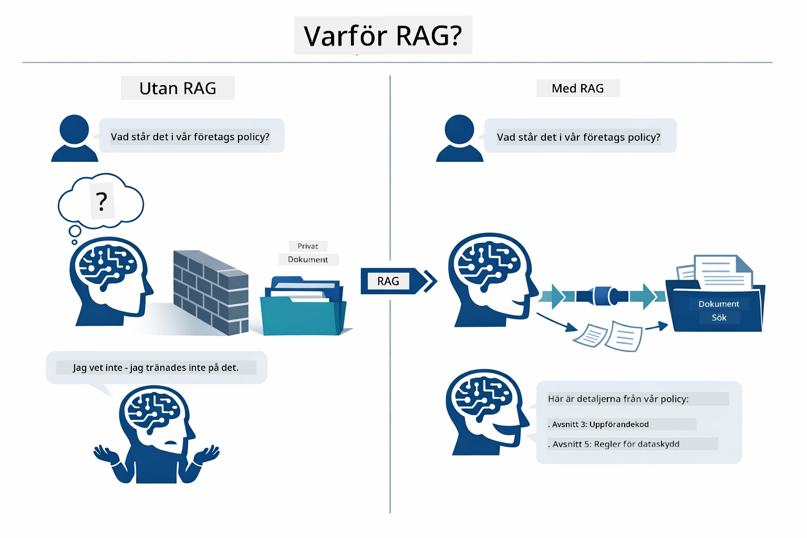
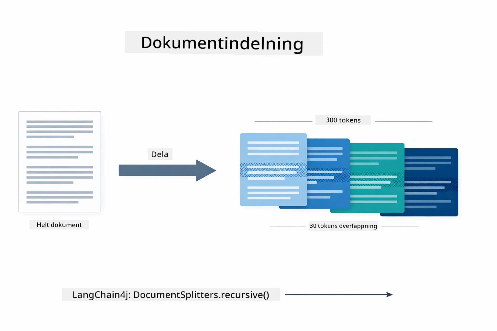
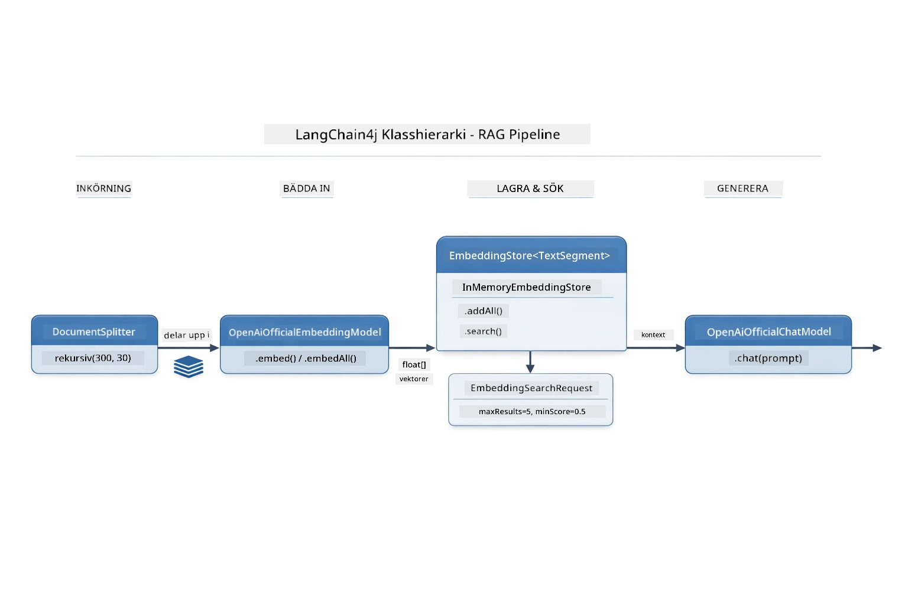
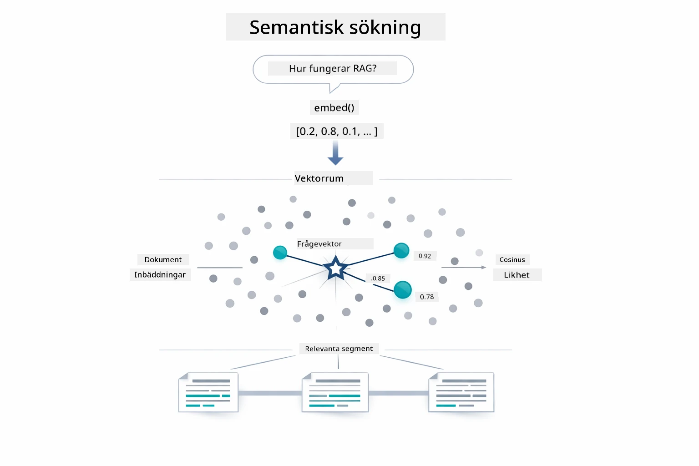
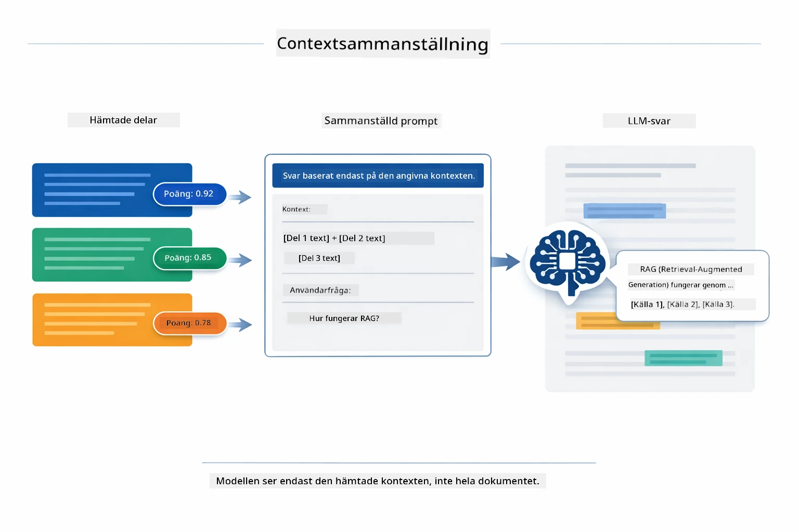
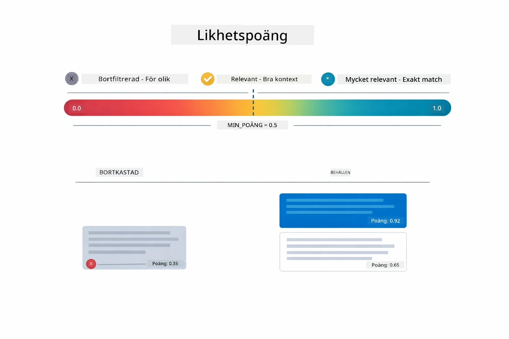
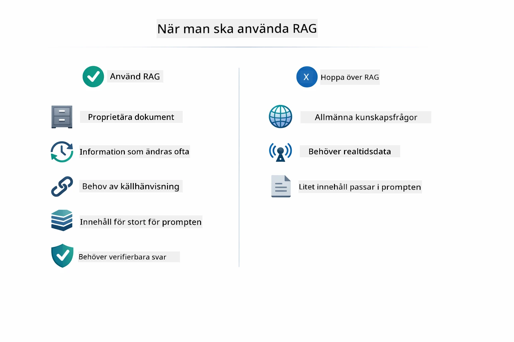

# Modul 03: RAG (Retrieval-Augmented Generation)

## Innehållsförteckning

- [Vad du kommer att lära dig](../../../03-rag)
- [Förstå RAG](../../../03-rag)
- [Förutsättningar](../../../03-rag)
- [Hur det fungerar](../../../03-rag)
  - [Dokumentbehandling](../../../03-rag)
  - [Skapa embeddings](../../../03-rag)
  - [Semantisk sökning](../../../03-rag)
  - [Svarsgenerering](../../../03-rag)
- [Kör applikationen](../../../03-rag)
- [Använda applikationen](../../../03-rag)
  - [Ladda upp ett dokument](../../../03-rag)
  - [Ställ frågor](../../../03-rag)
  - [Kontrollera källreferenser](../../../03-rag)
  - [Experimentera med frågor](../../../03-rag)
- [Nyckelbegrepp](../../../03-rag)
  - [Chunkningsstrategi](../../../03-rag)
  - [Likhetspoäng](../../../03-rag)
  - [Minneslagring](../../../03-rag)
  - [Hantera kontextfönster](../../../03-rag)
- [När RAG är viktigt](../../../03-rag)
- [Nästa steg](../../../03-rag)

## Vad du kommer att lära dig

I de tidigare modulerna lärde du dig att föra samtal med AI och att strukturera dina prompts effektivt. Men det finns en grundläggande begränsning: språkmodeller vet bara det de lärde sig under träningen. De kan inte svara på frågor om ditt företags policies, din projektdokumentation eller någon information de inte tränades på.

RAG (Retrieval-Augmented Generation) löser detta problem. Istället för att försöka lära modellen din information (vilket är dyrt och opraktiskt) ger du den möjlighet att söka igenom dina dokument. När någon ställer en fråga hittar systemet relevant information och inkluderar den i prompten. Modellen svarar sedan baserat på den hämtade kontexten.

Tänk på RAG som att ge modellen ett referensbibliotek. När du ställer en fråga gör systemet följande:

1. **Användarfråga** – Du ställer en fråga  
2. **Embedding** – Omvandlar din fråga till en vektor  
3. **Vektorsökning** – Hittar liknande dokumentbitar  
4. **Kontekstsammansättning** – Lägger till relevanta bitar i prompten  
5. **Svar** – LLM genererar ett svar baserat på kontexten  

Detta grundar modellens svar i dina faktiska data istället för att förlita sig på dess träningskunskap eller hitta på svar.

## Förstå RAG

Diagrammet nedan illustrerar kärnkonceptet: istället för att bara förlita sig på modellens träningsdata ger RAG den ett referensbibliotek av dina dokument att konsultera innan varje svar genereras.



Så här hänger delarna ihop från början till slut. En användarfråga går genom fyra steg — embedding, vektorsökning, kontekstsammansättning och svarsgenerering — där varje steg bygger på det föregående:


Resten av denna modul går igenom varje steg i detalj, med kod du kan köra och modifiera.

## Förutsättningar

- Genomförd Modul 01 (Azure OpenAI-resurser distribuerade)  
- `.env`-fil i rotkatalogen med Azure-uppgifter (skapad av `azd up` i Modul 01)  

> **Obs:** Om du inte har genomfört Modul 01, följ först installationsinstruktionerna där.

## Hur det fungerar

### Dokumentbehandling

[DocumentService.java](../../../03-rag/src/main/java/com/example/langchain4j/rag/service/DocumentService.java)

När du laddar upp ett dokument analyserar systemet det (PDF eller ren text), lägger till metadata som filnamn och delar sedan upp det i bitar — mindre delar som passar bekvämt i modellens kontextfönster. Dessa bitar överlappar lite så att du inte tappar kontext vid gränserna.

```java
// Analysera den uppladdade filen och omslut den i ett LangChain4j-dokument
Document document = Document.from(content, metadata);

// Dela upp i 300-tokenstycken med 30-token överlappning
DocumentSplitter splitter = DocumentSplitters
    .recursive(300, 30);

List<TextSegment> segments = splitter.split(document);
```
  
Diagrammet nedan visar hur detta fungerar visuellt. Notera hur varje bit delar vissa tokens med sina grannar — 30 token-överlapp säkerställer att ingen viktig kontext går förlorad mellan bitarna:



> **🤖 Prova med [GitHub Copilot](https://github.com/features/copilot) Chat:** Öppna [`DocumentService.java`](../../../03-rag/src/main/java/com/example/langchain4j/rag/service/DocumentService.java) och fråga:  
> - "Hur delar LangChain4j upp dokument i bitar och varför är överlappning viktigt?"  
> - "Vad är optimal bitstorlek för olika dokumenttyper och varför?"  
> - "Hur hanterar jag dokument på flera språk eller med specialformatering?"

### Skapa embeddings

[LangChainRagConfig.java](../../../03-rag/src/main/java/com/example/langchain4j/rag/config/LangChainRagConfig.java)

Varje bit omvandlas till en numerisk representation kallad embedding – i princip ett matematiskt fingeravtryck som fångar textens innebörd. Liknande text ger liknande embeddings.

```java
@Bean
public EmbeddingModel embeddingModel() {
    return OpenAiOfficialEmbeddingModel.builder()
        .baseUrl(azureOpenAiEndpoint)
        .apiKey(azureOpenAiKey)
        .modelName(azureEmbeddingDeploymentName)
        .build();
}

EmbeddingStore<TextSegment> embeddingStore = 
    new InMemoryEmbeddingStore<>();
```
  
Klassdiagrammet nedan visar hur dessa LangChain4j-komponenter kopplas ihop. `OpenAiOfficialEmbeddingModel` omvandlar text till vektorer, `InMemoryEmbeddingStore` lagrar vektorerna tillsammans med deras ursprungliga `TextSegment`-data, och `EmbeddingSearchRequest` styr återhämtningsparametrar som `maxResults` och `minScore`:



När embeddings är lagrade klustras liknande innehåll naturligt ihop i vektorutrymmet. Visualiseringen nedan visar hur dokument om relaterade ämnen hamnar som närliggande punkter, vilket gör semantisk sökning möjlig:


### Semantisk sökning

[RagService.java](../../../03-rag/src/main/java/com/example/langchain4j/rag/service/RagService.java)

När du ställer en fråga omvandlas den också till en embedding. Systemet jämför din frågas embedding med embeddings för alla dokumentbitar. Det hittar bitarna med mest liknande betydelse – inte bara matchande nyckelord, utan faktisk semantisk likhet.

```java
Embedding queryEmbedding = embeddingModel.embed(question).content();

EmbeddingSearchRequest searchRequest = EmbeddingSearchRequest.builder()
    .queryEmbedding(queryEmbedding)
    .maxResults(5)
    .minScore(0.5)
    .build();

EmbeddingSearchResult<TextSegment> searchResult = embeddingStore.search(searchRequest);
List<EmbeddingMatch<TextSegment>> matches = searchResult.matches();

for (EmbeddingMatch<TextSegment> match : matches) {
    String relevantText = match.embedded().text();
    double score = match.score();
}
```
  
Diagrammet nedan jämför semantisk sökning med traditionell nyckelordssökning. En nyckelordssökning på "fordon" missar en bit om "bilar och lastbilar", medan semantisk sökning förstår att de betyder samma sak och returnerar den som en högt rankad träff:



> **🤖 Prova med [GitHub Copilot](https://github.com/features/copilot) Chat:** Öppna [`RagService.java`](../../../03-rag/src/main/java/com/example/langchain4j/rag/service/RagService.java) och fråga:  
> - "Hur fungerar likhetssökning med embeddings och vad avgör poängen?"  
> - "Vilken likhetströskel bör jag använda och hur påverkar den resultaten?"  
> - "Hur hanterar jag fall där inga relevanta dokument hittas?"

### Svarsgenerering

[RagService.java](../../../03-rag/src/main/java/com/example/langchain4j/rag/service/RagService.java)

De mest relevanta bitarna sätts ihop till en strukturerad prompt som innehåller tydliga instruktioner, den hämtade kontexten och användarens fråga. Modellen läser de specifika bitarna och svarar baserat på den informationen — den kan bara använda det som finns framför sig, vilket förhindrar hallucination.

```java
String context = matches.stream()
    .map(match -> match.embedded().text())
    .collect(Collectors.joining("\n\n"));

String prompt = String.format("""
    Answer the question based on the following context.
    If the answer cannot be found in the context, say so.

    Context:
    %s

    Question: %s

    Answer:""", context, request.question());

String answer = chatModel.chat(prompt);
```
  
Diagrammet nedan visar denna sammanställning i aktion — de högst rankade bitarna från söksteget injiceras i promptmallen, och `OpenAiOfficialChatModel` genererar ett grundat svar:



## Kör applikationen

**Verifiera distribution:**

Säkerställ att filen `.env` finns i rotkatalogen med Azure-uppgifter (skapad under Modul 01):  
```bash
cat ../.env  # Bör visa AZURE_OPENAI_ENDPOINT, API_KEY, DEPLOYMENT
```
  
**Starta applikationen:**

> **Obs:** Om du redan startade alla applikationer med `./start-all.sh` från Modul 01 så kör denna modul redan på port 8081. Du kan hoppa över startkommandona nedan och gå direkt till http://localhost:8081.

**Alternativ 1: Använd Spring Boot Dashboard (Rekommenderas för VS Code-användare)**

Dev-containern inkluderar förlängningen Spring Boot Dashboard, som ger ett visuellt gränssnitt för att hantera alla Spring Boot-applikationer. Du hittar det i aktivitetsfältet på vänster sida i VS Code (leta efter Spring Boot-ikonen).

Från Spring Boot Dashboard kan du:  
- Se alla tillgängliga Spring Boot-applikationer i arbetsytan  
- Starta/stoppa applikationer med ett klick  
- Visa applikationsloggar i realtid  
- Övervaka applikationsstatus  

Klicka helt enkelt på play-knappen bredvid "rag" för att starta denna modul, eller starta alla moduler på en gång.


**Alternativ 2: Använd shell-skript**

Starta alla webbapplikationer (moduler 01-04):

**Bash:**  
```bash
cd ..  # Från rotkatalogen
./start-all.sh
```
  
**PowerShell:**  
```powershell
cd ..  # Från rotkatalogen
.\start-all.ps1
```
  
Eller starta bara denna modul:

**Bash:**  
```bash
cd 03-rag
./start.sh
```
  
**PowerShell:**  
```powershell
cd 03-rag
.\start.ps1
```
  
Båda skript laddar automatiskt miljövariabler från roten `.env`-filen och bygger JAR-filerna om de inte finns.

> **Obs:** Om du föredrar att bygga alla moduler manuellt innan start:  
>  
> **Bash:**  
> ```bash
> cd ..  # Go to root directory
> mvn clean package -DskipTests
> ```
  
> **PowerShell:**  
> ```powershell
> cd ..  # Go to root directory
> mvn clean package -DskipTests
> ```
  
Öppna http://localhost:8081 i din webbläsare.

**För att stoppa:**

**Bash:**  
```bash
./stop.sh  # Endast denna modul
# Eller
cd .. && ./stop-all.sh  # Alla moduler
```
  
**PowerShell:**  
```powershell
.\stop.ps1  # Endast denna modul
# Eller
cd ..; .\stop-all.ps1  # Alla moduler
```


## Använda applikationen

Applikationen erbjuder ett webbgränssnitt för dokumentuppladdning och frågeställning.

<a href="images/rag-homepage.png"></a>

*RAG-applikationens gränssnitt – ladda upp dokument och ställ frågor*

### Ladda upp ett dokument

Börja med att ladda upp ett dokument – TXT-filer fungerar bäst för testning. En `sample-document.txt` finns i denna katalog som innehåller information om LangChain4j-funktioner, RAG-implementering och bästa praxis – perfekt för systemtestning.

Systemet bearbetar ditt dokument, delar upp det i bitar och skapar embeddings för varje bit. Detta sker automatiskt när du laddar upp.

### Ställ frågor

Ställ nu specifika frågor om dokumentets innehåll. Prova något faktamässigt som tydligt anges i dokumentet. Systemet söker efter relevanta bitar, inkluderar dem i prompten, och genererar ett svar.

### Kontrollera källreferenser

Notera att varje svar inkluderar källreferenser med likhetspoäng. Dessa poäng (0 till 1) visar hur relevant varje bit var för din fråga. Högre poäng betyder bättre matchningar. Det låter dig verifiera svaret mot källmaterialet.

<a href="images/rag-query-results.png"></a>  

*Frågeresultat som visar svar med källreferenser och relevanspoäng*

### Experimentera med frågor

Prova olika typer av frågor:  
- Specifika fakta: "Vad är huvudämnet?"  
- Jämförelser: "Vad är skillnaden mellan X och Y?"  
- Sammanfattningar: "Sammanfatta de viktigaste punkterna om Z"  

Observera hur relevanspoängen ändras beroende på hur väl din fråga matchar dokumentinnehållet.

## Nyckelbegrepp

### Chunkningsstrategi

Dokument delas upp i 300-token bitar med 30 tokens överlappning. Denna balans säkerställer att varje bit har tillräcklig kontext för att vara meningsfull samtidigt som den är tillräckligt liten för att flera bitar ska få plats i en prompt.

### Likhetspoäng

Varje hämtad bit kommer med en likhetspoäng mellan 0 och 1 som visar hur nära den matchar användarens fråga. Diagrammet nedan visualiserar poängintervallen och hur systemet använder dem för att filtrera resultat:



Poängintervall från 0 till 1:  
- 0.7-1.0: Mycket relevant, exakt match  
- 0.5-0.7: Relevant, bra kontext  
- Under 0.5: Filtreras bort, för olik  

Systemet hämtar bara bitar över minimigränsen för att säkerställa kvalitet.

### Minneslagring

Denna modul använder minneslagring för enkelhetens skull. När du startar om applikationen förloras uppladdade dokument. Produktionssystem använder persistenta vektordatabaser som Qdrant eller Azure AI Search.

### Hantera kontextfönster

Varje modell har ett maximalt kontextfönster. Du kan inte inkludera alla bitar från ett stort dokument. Systemet hämtar de topp N mest relevanta bitarna (standard är 5) för att hålla sig inom gränserna samtidigt som det ger tillräcklig kontext för korrekta svar.

## När RAG är viktigt

RAG är inte alltid rätt metod. Beslutsguiden nedan hjälper dig att avgöra när RAG tillför värde jämfört med enklare metoder — som att inkludera innehåll direkt i prompten eller förlita sig på modellens inbyggda kunskap:



**Använd RAG när:**
- Svara på frågor om proprietära dokument  
- Information ändras ofta (policyer, priser, specifikationer)  
- Noggrannhet kräver källhänvisning  
- Innehållet är för stort för att få plats i en enda prompt  
- Du behöver verifierbara, grundade svar  

**Använd inte RAG när:**  
- Frågor kräver allmän kunskap som modellen redan har  
- Realtidsdata behövs (RAG fungerar på uppladdade dokument)  
- Innehållet är tillräckligt litet för att inkluderas direkt i prompts  

## Nästa steg  

**Nästa modul:** [04-tools - AI Agents with Tools](../04-tools/README.md)  

---  

**Navigation:** [← Föregående: Modul 02 - Prompt Engineering](../02-prompt-engineering/README.md) | [Tillbaka till huvudsida](../README.md) | [Nästa: Modul 04 - Tools →](../04-tools/README.md)

---

<!-- CO-OP TRANSLATOR DISCLAIMER START -->
**Ansvarsfriskrivning**:
Detta dokument har översatts med hjälp av AI-översättningstjänsten [Co-op Translator](https://github.com/Azure/co-op-translator). Även om vi strävar efter noggrannhet, var vänlig notera att automatiska översättningar kan innehålla fel eller brister. Det ursprungliga dokumentet på dess ursprungliga språk bör betraktas som den auktoritativa källan. För kritisk information rekommenderas professionell mänsklig översättning. Vi ansvarar inte för eventuella missförstånd eller feltolkningar som uppkommer vid användning av denna översättning.
<!-- CO-OP TRANSLATOR DISCLAIMER END -->