# Modul 04: AI-agenter med verktyg

## Innehållsförteckning

- [Vad du kommer att lära dig](../../../04-tools)
- [Förkunskaper](../../../04-tools)
- [Förstå AI-agenter med verktyg](../../../04-tools)
- [Hur verktygsanrop fungerar](../../../04-tools)
  - [Verktygsdefinitioner](../../../04-tools)
  - [Beslutsfattande](../../../04-tools)
  - [Utförande](../../../04-tools)
  - [Generering av svar](../../../04-tools)
  - [Arkitektur: Spring Boot Auto-Wiring](../../../04-tools)
- [Verktygskedjning](../../../04-tools)
- [Kör applikationen](../../../04-tools)
- [Använd applikationen](../../../04-tools)
  - [Testa enkel verktygsanvändning](../../../04-tools)
  - [Testa verktygskedjning](../../../04-tools)
  - [Se konversationsflödet](../../../04-tools)
  - [Experimentera med olika förfrågningar](../../../04-tools)
- [Nyckelbegrepp](../../../04-tools)
  - [ReAct-mönstret (Resonemang och agerande)](../../../04-tools)
  - [Verktygsbeskrivningar är viktiga](../../../04-tools)
  - [Sessionshantering](../../../04-tools)
  - [Felhanteirng](../../../04-tools)
- [Tillgängliga verktyg](../../../04-tools)
- [När man ska använda verktygsbaserade agenter](../../../04-tools)
- [Verktyg vs RAG](../../../04-tools)
- [Nästa steg](../../../04-tools)

## Vad du kommer att lära dig

Hittills har du lärt dig hur man har konversationer med AI, strukturerar prompts effektivt och förankrar svar i dina dokument. Men det finns fortfarande en grundläggande begränsning: språkmodeller kan endast generera text. De kan inte kolla vädret, göra beräkningar, fråga databaser eller interagera med externa system.

Verktyg förändrar detta. Genom att ge modellen tillgång till funktioner som den kan anropa, förvandlar du den från en textgenerator till en agent som kan vidta åtgärder. Modellen bestämmer när den behöver ett verktyg, vilket verktyg den ska använda och vilka parametrar som ska skickas. Din kod utför funktionen och returnerar resultatet. Modellen införlivar detta resultat i sitt svar.

## Förkunskaper

- Avslutad [Modul 01 - Introduktion](../01-introduction/README.md) (Azure OpenAI-resurser utplacerade)
- Avslutade tidigare moduler rekommenderas (denna modul refererar till [RAG-koncept från Modul 03](../03-rag/README.md) i jämförelsen Verktyg vs RAG)
- `.env`-fil i rotkatalogen med Azure-behörigheter (skapad av `azd up` i Modul 01)

> **Obs:** Om du inte har slutfört Modul 01, följ först installationsinstruktionerna där.

## Förstå AI-agenter med verktyg

> **📝 Obs:** Termen "agenter" i denna modul hänvisar till AI-assistenter förstärkta med verktygsanropsmöjligheter. Detta är skiljt från **Agentic AI**-mönstren (autonoma agenter med planering, minne och flerstegsresonemang) som vi kommer att täcka i [Modul 05: MCP](../05-mcp/README.md).

Utan verktyg kan en språkmodell bara generera text från sin träningsdata. Fråga den om vädret just nu, och den måste gissa. Ge den verktyg, och den kan anropa ett väder-API, utföra beräkningar eller fråga en databas — och sedan väva in dessa riktiga resultat i sitt svar.

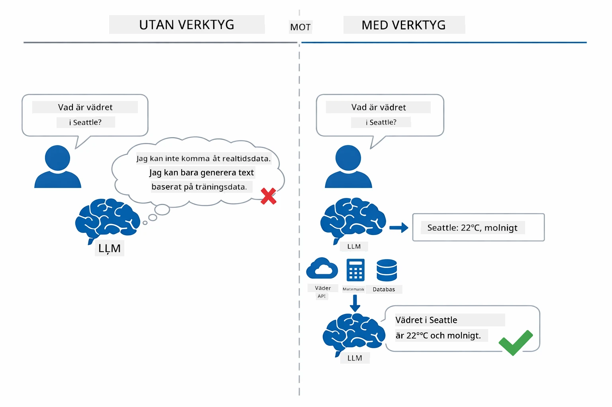

*Utan verktyg kan modellen bara gissa — med verktyg kan den anropa API:er, göra beräkningar och returnera realtidsdata.*

En AI-agent med verktyg följer ett **Reasoning and Acting (ReAct)**-mönster. Modellen svarar inte bara — den tänker på vad den behöver, agerar genom att anropa ett verktyg, observerar resultatet och bestämmer sedan om den ska agera igen eller lämna det slutgiltiga svaret:

1. **Resonera** — Agenten analyserar användarens fråga och avgör vilken information den behöver
2. **Agera** — Agenten väljer rätt verktyg, genererar korrekta parametrar och anropar det
3. **Observera** — Agenten tar emot verktygets output och utvärderar resultatet
4. **Upprepa eller svara** — Om mer data behövs, loopar agenten tillbaka; annars formar den ett naturligt språksvar

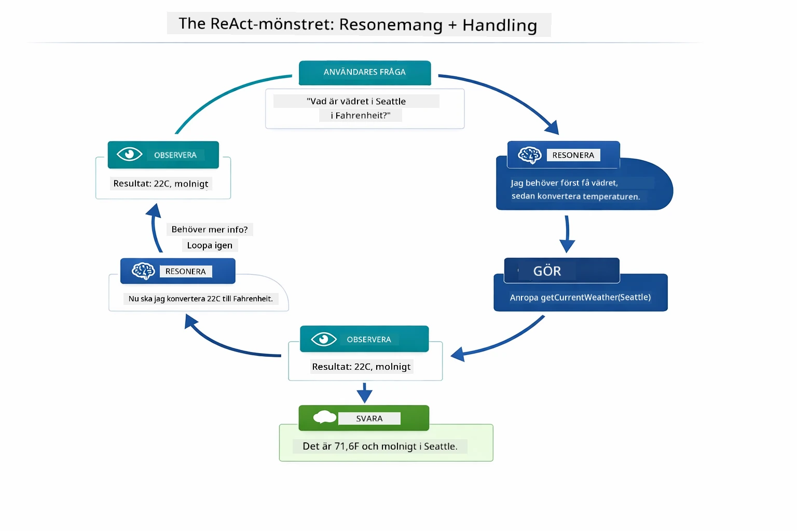

*ReAct-cykeln — agenten resonerar om vad den ska göra, agerar genom att anropa ett verktyg, observerar resultatet och loopar tills den kan ge slutgiltigt svar.*

Detta sker automatiskt. Du definierar verktygen och deras beskrivningar. Modellen hanterar beslutsfattandet om när och hur de ska användas.

## Hur verktygsanrop fungerar

### Verktygsdefinitioner

[WeatherTool.java](../../../04-tools/src/main/java/com/example/langchain4j/agents/tools/WeatherTool.java) | [TemperatureTool.java](../../../04-tools/src/main/java/com/example/langchain4j/agents/tools/TemperatureTool.java)

Du definierar funktioner med tydliga beskrivningar och parameter-specifikationer. Modellen ser dessa beskrivningar i sitt systemprompt och förstår vad varje verktyg gör.

```java
@Component
public class WeatherTool {
    
    @Tool("Get the current weather for a location")
    public String getCurrentWeather(@P("Location name") String location) {
        // Din logik för väderuppslagning
        return "Weather in " + location + ": 22°C, cloudy";
    }
}

@AiService
public interface Assistant {
    String chat(@MemoryId String sessionId, @UserMessage String message);
}

// Assistenten kopplas automatiskt av Spring Boot med:
// - ChatModel bean
// - Alla @Tool-metoder från @Component-klasser
// - ChatMemoryProvider för sessionshantering
```

Diagrammet nedan bryter ner varje annotation och visar hur varje del hjälper AI att förstå när verktyget ska anropas och vilka argument som ska skickas:

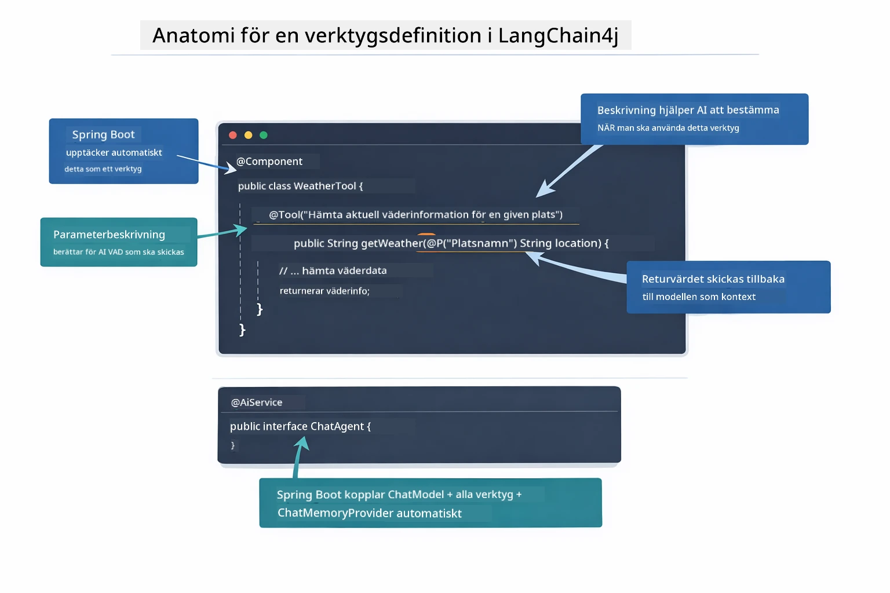

*Anatomi av en verktygsdefinition — @Tool berättar för AI när det ska använda det, @P beskriver varje parameter, och @AiService kopplar ihop allt vid uppstart.*

> **🤖 Testa med [GitHub Copilot](https://github.com/features/copilot) Chat:** Öppna [`WeatherTool.java`](../../../04-tools/src/main/java/com/example/langchain4j/agents/tools/WeatherTool.java) och fråga:
> - "Hur skulle jag integrera ett riktigt väder-API som OpenWeatherMap istället för mockdata?"
> - "Vad gör en bra verktygsbeskrivning som hjälper AI att använda det korrekt?"
> - "Hur hanterar jag API-fel och begränsningar i verktygsimplementeringarna?"

### Beslutsfattande

När en användare frågar "Hur är vädret i Seattle?" väljer modellen inte slumpmässigt ett verktyg. Den jämför användarens avsikt mot varje verktygsbeskrivning den har tillgång till, poängsätter relevansen för var och en och väljer den bästa matchningen. Den genererar sedan ett strukturerat funktionsanrop med rätt parametrar — i det här fallet sätter den `location` till `"Seattle"`.

Om inget verktyg matchar användarens förfrågan faller modellen tillbaka på att svara från sitt eget kunskapslager. Om flera verktyg matchar, väljer den det mest specifika.

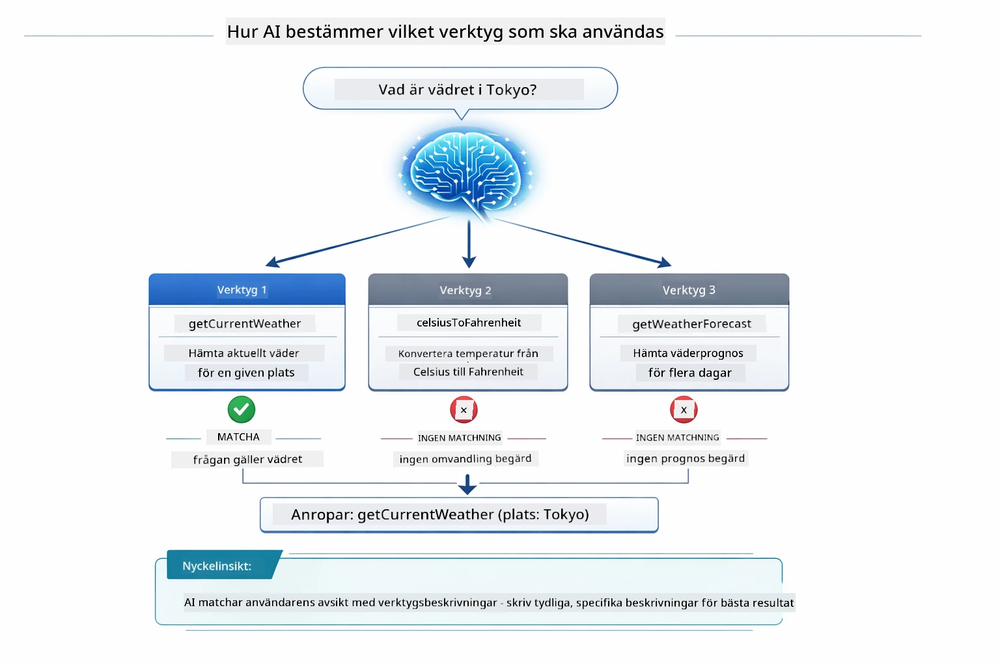

*Modellen utvärderar varje tillgängligt verktyg mot användarens avsikt och väljer bästa matchen — därför är det viktigt att skriva klara, specifika verktygsbeskrivningar.*

### Utförande

[AgentService.java](../../../04-tools/src/main/java/com/example/langchain4j/agents/service/AgentService.java)

Spring Boot auto-wirar den deklarativa `@AiService`-interfacet med alla registrerade verktyg, och LangChain4j utför verktygsanrop automatiskt. Bakom kulisserna flödar ett komplett verktygsanrop genom sex steg — från användarens fråga i naturligt språk hela vägen tillbaka till ett svar i naturligt språk:

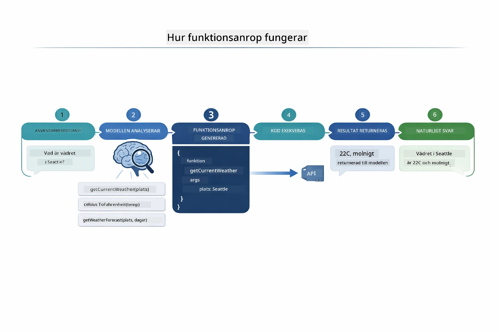

*End-to-end-flödet — användaren ställer en fråga, modellen väljer ett verktyg, LangChain4j kör det, och modellen väver in resultatet i ett naturligt svar.*

> **🤖 Testa med [GitHub Copilot](https://github.com/features/copilot) Chat:** Öppna [`AgentService.java`](../../../04-tools/src/main/java/com/example/langchain4j/agents/service/AgentService.java) och fråga:
> - "Hur fungerar ReAct-mönstret och varför är det effektivt för AI-agenter?"
> - "Hur bestämmer agenten vilket verktyg som ska användas och i vilken ordning?"
> - "Vad händer om ett verktygsanrop misslyckas - hur bör jag hantera fel robust?"

### Generering av svar

Modellen tar emot väderdata och formaterar den till ett svar i naturligt språk för användaren.

### Arkitektur: Spring Boot Auto-Wiring

Den här modulen använder LangChain4js Spring Boot-integration med deklarativa `@AiService`-interface. Vid uppstart hittar Spring Boot varje `@Component` som innehåller `@Tool`-metoder, din `ChatModel`-bean och `ChatMemoryProvider` — och kopplar ihop allt till ett enda `Assistant`-interface utan någon boilerplate.

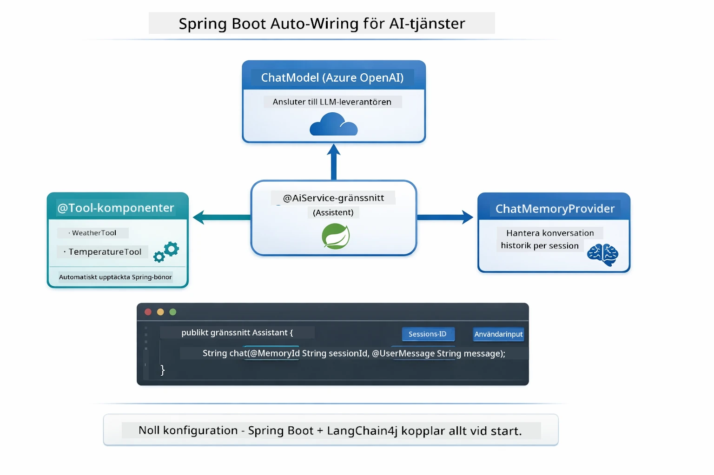

*@AiService-interfacet binder samman ChatModel, verktygskomponenter och minnesleverantör — Spring Boot hanterar all koppling automatiskt.*

Viktiga fördelar med detta tillvägagångssätt:

- **Spring Boot auto-wiring** — ChatModel och verktyg injiceras automatiskt
- **@MemoryId-mönstret** — Automatisk sessionsbaserad minneshantering
- **En enda instans** — Assistant skapas en gång och återanvänds för bättre prestanda
- **Typsäker exekvering** — Java-metoder anropas direkt med typkonvertering
- **Multi-turn orkestrering** — Hanterar verktygskedjning automatiskt
- **Noll boilerplate** — Inga manuella `AiServices.builder()`-anrop eller minnes-HashMap

Alternativa tillvägagångssätt (manuella `AiServices.builder()`) kräver mer kod och saknar Spring Boot-integrationsfördelarna.

## Verktygskedjning

**Verktygskedjning** — Den verkliga styrkan hos verktygsbaserade agenter visar sig när en enda fråga kräver flera verktyg. Fråga "Hur är vädret i Seattle i Fahrenheit?" och agenten kedjar automatiskt ihop två verktyg: först anropas `getCurrentWeather` för att få temperaturen i Celsius, sedan skickas det värdet till `celsiusToFahrenheit` för konvertering — allt i ett och samma samtalssvar.

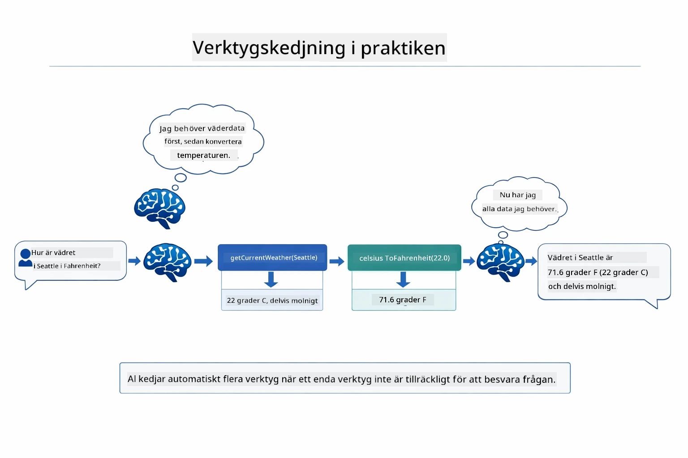

*Verktygskedjning i praktiken — agenten anropar först getCurrentWeather, sedan skickas resultatet i Celsius vidare till celsiusToFahrenheit och levererar ett sammansatt svar.*

**Graceful Failures** — Fråga efter väder i en stad som inte finns i mockdatan. Verktyget returnerar ett felmeddelande, och AI förklarar att den inte kan hjälpa till istället för att krascha. Verktyg misslyckas säkert. Diagrammet nedan visar kontrasten mellan två tillvägagångssätt — med korrekt felhantering fångar agenten undantaget och svarar hjälpsamt, utan det kraschar hela applikationen:

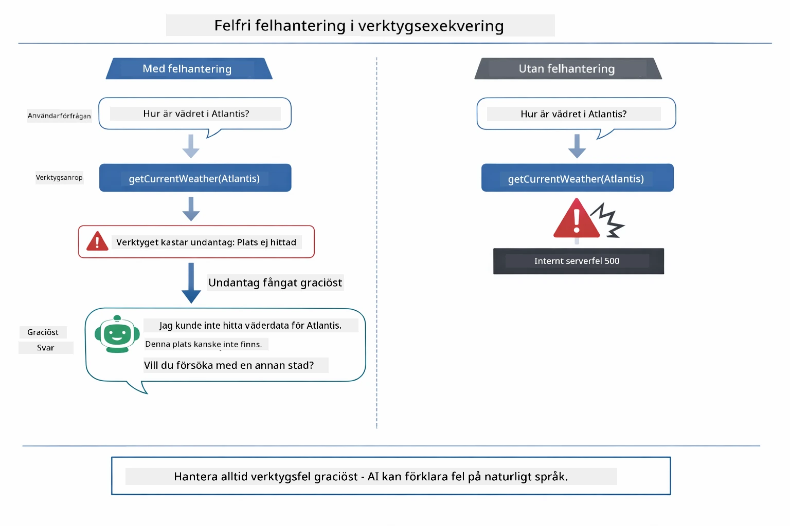

*När ett verktyg misslyckas fångar agenten felet och svarar med en hjälpsam förklaring istället för att krascha.*

Detta sker i ett enda konversationsvarv. Agenten orkestrerar flera verktygsanrop autonomt.

## Kör applikationen

**Verifiera distribution:**

Säkerställ att `.env` filen finns i rotkatalogen med Azure-behörigheter (skapad under Modul 01). Kör detta från modulkatalogen (`04-tools/`):

**Bash:**
```bash
cat ../.env  # Bör visa AZURE_OPENAI_ENDPOINT, API_KEY, DEPLOYMENT
```

**PowerShell:**
```powershell
Get-Content ..\.env  # Bör visa AZURE_OPENAI_ENDPOINT, API_KEY, DEPLOYMENT
```

**Starta applikationen:**

> **Obs:** Om du redan startat alla applikationer med `./start-all.sh` från rotkatalogen (som beskrivet i Modul 01) kör denna modul redan på port 8084. Du kan hoppa över startkommandona nedan och gå direkt till http://localhost:8084.

**Alternativ 1: Använd Spring Boot Dashboard (Rekommenderas för VS Code-användare)**

Dev-containern inkluderar Spring Boot Dashboard-tillägget som ger ett visuellt gränssnitt för att hantera alla Spring Boot-applikationer. Du hittar det i Aktivitetsfältet till vänster i VS Code (titta efter Spring Boot-ikonen).

Från Spring Boot Dashboard kan du:
- Se alla tillgängliga Spring Boot-applikationer i arbetsytan
- Starta/stoppa applikationer med ett klick
- Visa applikationsloggar i realtid
- Övervaka applikationsstatus

Klicka helt enkelt på play-knappen bredvid "tools" för att starta denna modul, eller starta alla moduler samtidigt.

Så här ser Spring Boot Dashboard ut i VS Code:


*Spring Boot Dashboard i VS Code — starta, stoppa och övervaka alla moduler från ett ställe*

**Alternativ 2: Använda shell-skript**

Starta alla webapplikationer (moduler 01-04):

**Bash:**
```bash
cd ..  # Från rotkatalogen
./start-all.sh
```

**PowerShell:**
```powershell
cd ..  # Från rotkatalogen
.\start-all.ps1
```

Eller starta bara denna modul:

**Bash:**
```bash
cd 04-tools
./start.sh
```

**PowerShell:**
```powershell
cd 04-tools
.\start.ps1
```

Båda skripten laddar automatiskt miljövariabler från rotens `.env`-fil och kommer att bygga JAR-filerna om de inte finns.

> **Obs:** Om du föredrar att bygga alla moduler manuellt innan start:
>
> **Bash:**
> ```bash
> cd ..  # Go to root directory
> mvn clean package -DskipTests
> ```

> **PowerShell:**
> ```powershell
> cd ..  # Go to root directory
> mvn clean package -DskipTests
> ```

Öppna http://localhost:8084 i din webbläsare.

**För att stoppa:**

**Bash:**
```bash
./stop.sh  # Endast denna modul
# Eller
cd .. && ./stop-all.sh  # Alla moduler
```

**PowerShell:**
```powershell
.\stop.ps1  # Endast denna modul
# Eller
cd ..; .\stop-all.ps1  # Alla moduler
```

## Använd applikationen

Applikationen erbjuder ett webbgränssnitt där du kan interagera med en AI-agent som har tillgång till väder- och temperaturkonverteringsverktyg. Så här ser gränssnittet ut — det innehåller snabbstartsexempel och en chattruta för att skicka förfrågningar:
<a href="images/tools-homepage.png"></a>

*Gränssnittet för AI Agent-verktyg – snabba exempel och chattgränssnitt för att interagera med verktyg*

### Prova enkel verktygsanvändning

Börja med en enkel förfrågan: "Konvertera 100 grader Fahrenheit till Celsius". Agenten känner igen att den behöver temperaturkonverteringsverktyget, anropar det med rätt parametrar och returnerar resultatet. Lägg märke till hur naturligt detta känns – du specificerade inte vilket verktyg som skulle användas eller hur det skulle anropas.

### Testa kedjning av verktyg

Prova nu något mer komplext: "Hur är vädret i Seattle och konvertera det till Fahrenheit?" Se hur agenten arbetar igenom detta steg för steg. Först hämtar den vädret (som returneras i Celsius), känner igen att den behöver konvertera till Fahrenheit, anropar konverteringsverktyget och kombinerar båda resultaten i ett svar.

### Se konversationsflödet

Chattgränssnittet behåller konversationshistoriken, vilket gör att du kan ha interaktioner över flera turer. Du kan se alla tidigare frågor och svar, vilket gör det lätt att följa konversationen och förstå hur agenten bygger kontext över flera utbyten.

<a href="images/tools-conversation-demo.png"></a>

*Konversation över flera turer som visar enkla konverteringar, väderuppslag och kedjning av verktyg*

### Experimentera med olika förfrågningar

Prova olika kombinationer:
- Väderuppslag: "Hur är vädret i Tokyo?"
- Temperaturkonverteringar: "Vad är 25°C i Kelvin?"
- Kombinerade frågor: "Kolla vädret i Paris och säg om det är över 20°C"

Lägg märke till hur agenten tolkar naturligt språk och mappar det till lämpliga verktygsanrop.

## Viktiga Begrepp

### ReAct-mönstret (Resonera och Agera)

Agenten växlar mellan att resonerar (bestämma vad som ska göras) och agera (använda verktyg). Detta mönster möjliggör autonoma problemlösningar snarare än att bara svara på instruktioner.

### Verktygsbeskrivningar är viktiga

Kvaliteten på dina verktygsbeskrivningar påverkar direkt hur väl agenten använder dem. Tydliga, specifika beskrivningar hjälper modellen att förstå när och hur varje verktyg ska anropas.

### Sessionshantering

`@MemoryId`-annoteringen möjliggör automatisk sessionbaserad minneshantering. Varje sessions-ID får sin egen `ChatMemory`-instans hanterad av `ChatMemoryProvider`-beanen, så att flera användare kan interagera med agenten samtidigt utan att deras konversationer blandas ihop. Följande diagram visar hur flera användare dirigeras till isolerade minneslagringar baserat på deras sessions-ID:

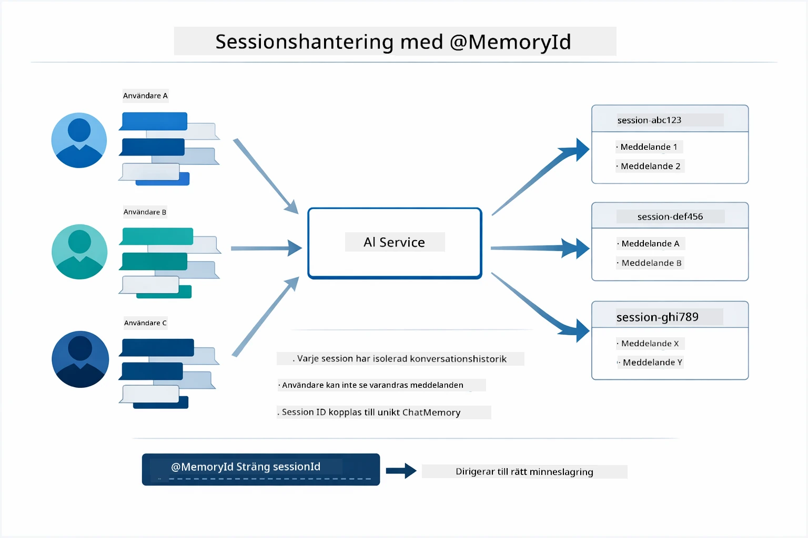

*Varje sessions-ID kopplas till en isolerad konversationshistorik — användare ser aldrig varandras meddelanden.*

### Felfunktioner

Verktyg kan misslyckas — API:er kan time-outa, parametrar kan vara ogiltiga, externa tjänster kan gå ner. Produktionsagenter behöver felhantering så att modellen kan förklara problem eller försöka alternativ istället för att krascha hela applikationen. När ett verktyg kastar ett undantag fångar LangChain4j det och skickar tillbaka felmeddelandet till modellen, som då kan förklara problemet på naturligt språk.

## Tillgängliga Verktyg

Diagrammet nedan visar det breda ekosystemet av verktyg du kan bygga. Denna modul visar väder- och temperaturverktyg, men samma `@Tool`-mönster fungerar för vilken Java-metod som helst – från databasfrågor till betalningshantering.

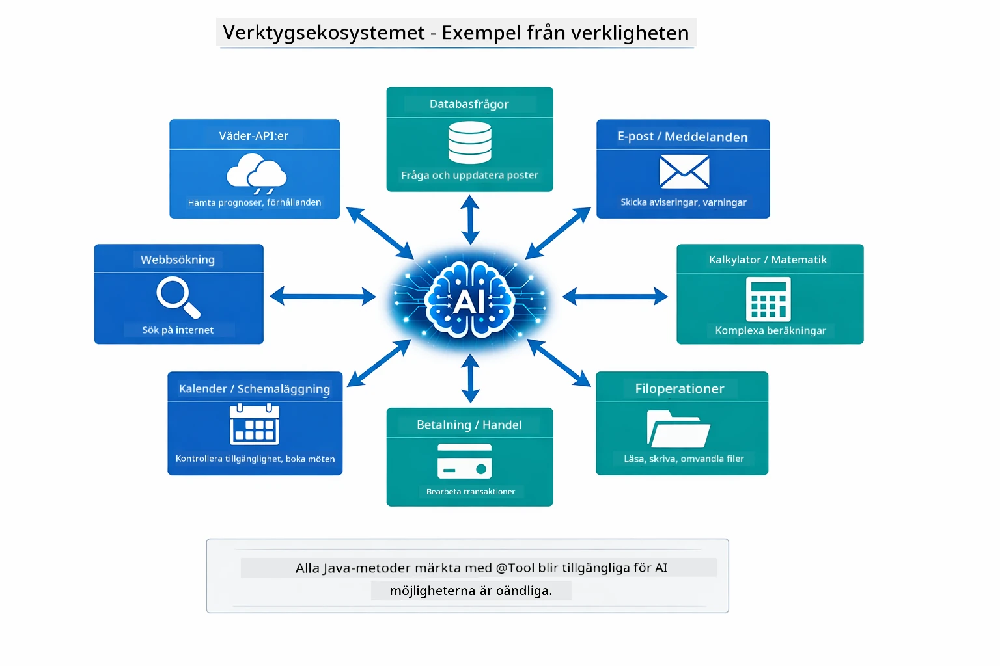

*Alla Java-metoder annoterade med @Tool blir tillgängliga för AI:n – mönstret sträcker sig till databaser, API:er, e-post, filoperationer och mer.*

## När man ska använda verktygsbaserade agenter

Inte alla förfrågningar behöver verktyg. Beslutet handlar om huruvida AI:n behöver interagera med externa system eller kan svara från sin egen kunskap. Följande guide sammanfattar när verktyg tillför värde och när de är onödiga:

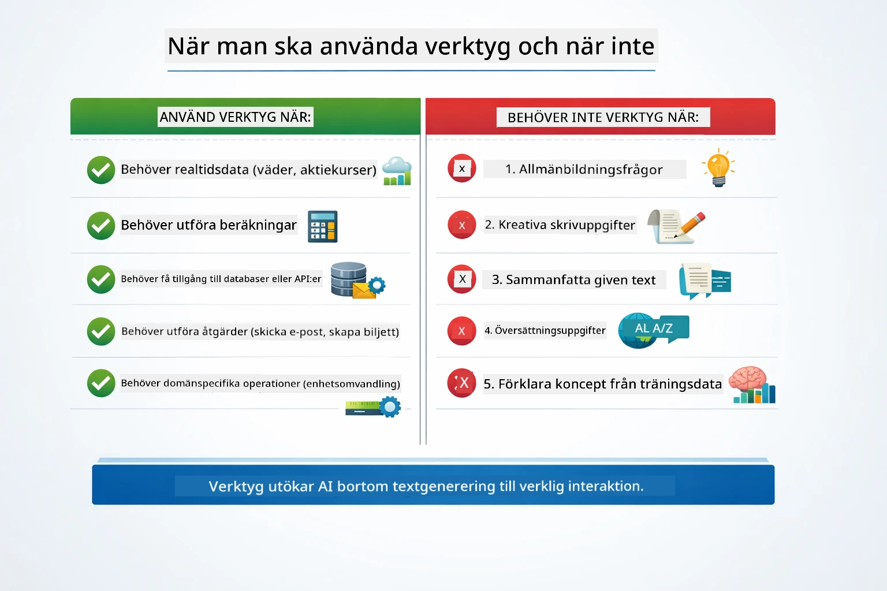

*En snabb beslutsguide — verktyg är för realtidsdata, beräkningar och åtgärder; allmän kunskap och kreativa uppgifter behöver dem inte.*

## Verktyg vs RAG

Modulerna 03 och 04 utökar båda vad AI kan göra, men på fundamentalt olika sätt. RAG ger modellen tillgång till **kunskap** genom att hämta dokument. Verktyg ger modellen möjlighet att göra **åtgärder** genom att anropa funktioner. Diagrammet nedan jämför dessa två tillvägagångssätt sida vid sida – från hur varje arbetsflöde fungerar till för- och nackdelar:

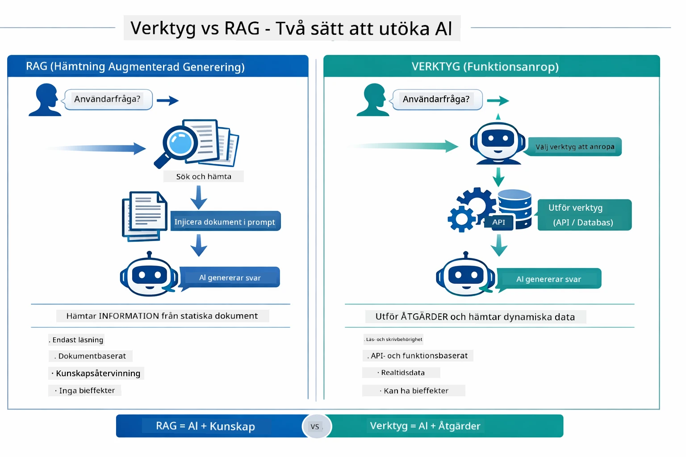

*RAG hämtar information från statiska dokument – Verktyg utför åtgärder och hämtar dynamisk, realtidsdata. Många produktionssystem kombinerar båda.*

I praktiken kombinerar många produktionssystem båda tillvägagångssätten: RAG för att grundlägga svar i din dokumentation och Verktyg för att hämta live-data eller utföra operationer.

## Nästa steg

**Nästa modul:** [05-mcp - Model Context Protocol (MCP)](../05-mcp/README.md)

---

**Navigering:** [← Föregående: Modul 03 - RAG](../03-rag/README.md) | [Tillbaka till huvudmenyn](../README.md) | [Nästa: Modul 05 - MCP →](../05-mcp/README.md)

---

<!-- CO-OP TRANSLATOR DISCLAIMER START -->
**Ansvarsfriskrivning**:
Detta dokument har översatts med hjälp av AI-översättningstjänsten [Co-op Translator](https://github.com/Azure/co-op-translator). Även om vi strävar efter noggrannhet, vänligen var medveten om att automatiska översättningar kan innehålla fel eller brister. Det ursprungliga dokumentet på dess modersmål bör betraktas som den auktoritativa källan. För kritisk information rekommenderas professionell mänsklig översättning. Vi ansvarar inte för några missförstånd eller feltolkningar som uppstår från användningen av denna översättning.
<!-- CO-OP TRANSLATOR DISCLAIMER END -->