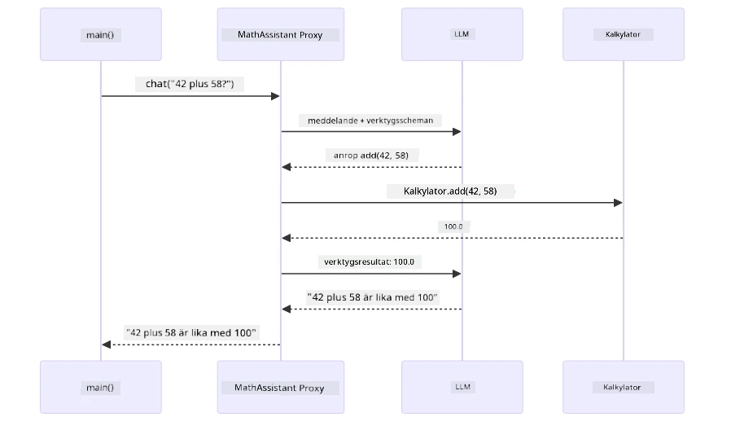
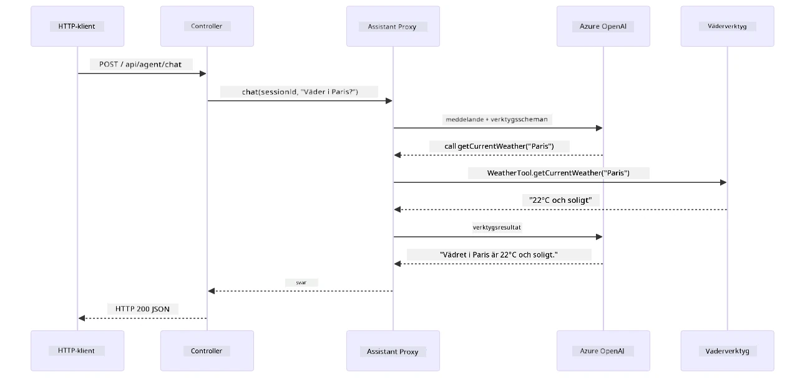

# Modul 04: AI-agenter med verktyg

## Innehållsförteckning

- [Vad du kommer att lära dig](../../../04-tools)
- [Förkunskaper](../../../04-tools)
- [Förstå AI-agenter med verktyg](../../../04-tools)
- [Hur verktygsanrop fungerar](../../../04-tools)
  - [Verktygsdefinitioner](../../../04-tools)
  - [Beslutsfattande](../../../04-tools)
  - [Exekvering](../../../04-tools)
  - [Svarsgenerering](../../../04-tools)
  - [Arkitektur: Spring Boot automatisk sammansättning](../../../04-tools)
- [Verktygskedjning](../../../04-tools)
- [Kör applikationen](../../../04-tools)
- [Använd applikationen](../../../04-tools)
  - [Testa enkel verktygsanvändning](../../../04-tools)
  - [Testa verktygskedjning](../../../04-tools)
  - [Se konversationsflödet](../../../04-tools)
  - [Experimentera med olika förfrågningar](../../../04-tools)
- [Nyckelbegrepp](../../../04-tools)
  - [ReAct-mönstret (Resonera och agera)](../../../04-tools)
  - [Verktygsbeskrivningar är viktiga](../../../04-tools)
  - [Sessionshantering](../../../04-tools)
  - [Felhanteirng](../../../04-tools)
- [Tillgängliga verktyg](../../../04-tools)
- [När man ska använda verktygsbaserade agenter](../../../04-tools)
- [Verktyg vs RAG](../../../04-tools)
- [Nästa steg](../../../04-tools)

## Vad du kommer att lära dig

Hittills har du lärt dig hur man har konversationer med AI, strukturerar prompts effektivt och grundar svar i dina dokument. Men det finns fortfarande en grundläggande begränsning: språkmodeller kan endast generera text. De kan inte kolla vädret, utföra beräkningar, fråga databaser eller interagera med externa system.

Verktyg förändrar detta. Genom att ge modellen tillgång till funktioner den kan anropa förvandlar du den från en textgenerator till en agent som kan utföra handlingar. Modellen bestämmer när den behöver ett verktyg, vilket verktyg som ska användas och vilka parametrar som ska skickas. Din kod exekverar funktionen och returnerar resultatet. Modellen införlivar sedan detta resultat i sitt svar.

## Förkunskaper

- Genomförd [Modul 01 - Introduktion](../01-introduction/README.md) (Azure OpenAI-resurser implementerade)
- Tidigare moduler rekommenderas (denna modul refererar till [RAG-koncept från Modul 03](../03-rag/README.md) i jämförelsen Verktyg vs RAG)
- `.env`-fil i rotkatalogen med Azure-referenser (skapad av `azd up` i Modul 01)

> **Obs:** Om du inte har genomfört Modul 01, följ implementeringsanvisningarna där först.

## Förstå AI-agenter med verktyg

> **📝 Notis:** Termen "agenter" i denna modul syftar på AI-assistenter utökade med verktygsanropsfunktioner. Detta skiljer sig från **Agentic AI**-mönstren (autonoma agenter med planering, minne och flerstegsresonemang) som vi kommer att täcka i [Modul 05: MCP](../05-mcp/README.md).

Utan verktyg kan en språkmodell endast generera text baserat på sin träningsdata. Fråga den om nuvarande väder, så måste den gissa. Ge den verktyg, och den kan anropa en väder-API, utföra beräkningar eller fråga en databas — och sedan väva in dessa verkliga resultat i sitt svar.


*Utan verktyg kan modellen bara gissa – med verktyg kan den anropa API:er, utföra beräkningar och återge realtidsdata.*

En AI-agent med verktyg följer ett **Reasoning and Acting (ReAct)**-mönster. Modellen svarar inte bara — den tänker på vad den behöver, agerar genom att anropa ett verktyg, observerar resultatet och bestämmer sedan om den ska agera igen eller leverera slutgiltigt svar:

1. **Resonera** — Agenten analyserar användarens fråga och avgör vilken information den behöver
2. **Agera** — Agenten väljer rätt verktyg, genererar rätt parametrar och anropar det
3. **Observera** — Agenten tar emot verktygets output och utvärderar resultatet
4. **Upprepa eller svara** — Om mer data behövs, loopar agenten tillbaka; annars formulerar den ett naturligt språksvar


*ReAct-cykeln — agenten resonerar om vad som ska göras, agerar genom att anropa ett verktyg, observerar resultatet och loopar tills den kan ge slutgiltigt svar.*

Detta sker automatiskt. Du definierar verktygen och deras beskrivningar. Modellen hanterar beslutsfattandet om när och hur de ska användas.

## Hur verktygsanrop fungerar

### Verktygsdefinitioner

[WeatherTool.java](../../../04-tools/src/main/java/com/example/langchain4j/agents/tools/WeatherTool.java) | [TemperatureTool.java](../../../04-tools/src/main/java/com/example/langchain4j/agents/tools/TemperatureTool.java)

Du definierar funktioner med tydliga beskrivningar och parameter-specifikationer. Modellen ser dessa beskrivningar i sitt system-prompt och förstår vad varje verktyg gör.

```java
@Component
public class WeatherTool {
    
    @Tool("Get the current weather for a location")
    public String getCurrentWeather(@P("Location name") String location) {
        // Din logik för väderuppslagning
        return "Weather in " + location + ": 22°C, cloudy";
    }
}

@AiService
public interface Assistant {
    String chat(@MemoryId String sessionId, @UserMessage String message);
}

// Assistenten är automatiskt kopplad av Spring Boot med:
// - ChatModel-bean
// - Alla @Tool-metoder från @Component-klasser
// - ChatMemoryProvider för sessionshantering
```
  
Diagrammet nedan bryter ner varje annotation och visar hur varje del hjälper AI att förstå när verktyget ska anropas och vilka argument som ska skickas:


*Anatomi av en verktygsdefinition — @Tool berättar för AI när den ska användas, @P beskriver varje parameter och @AiService kopplar ihop allt vid uppstart.*

> **🤖 Testa med [GitHub Copilot](https://github.com/features/copilot) Chat:** Öppna [`WeatherTool.java`](../../../04-tools/src/main/java/com/example/langchain4j/agents/tools/WeatherTool.java) och fråga:  
> - "Hur integrerar jag en verklig väder-API som OpenWeatherMap istället för mockdata?"  
> - "Vad kännetecknar en bra verktygsbeskrivning som hjälper AI att använda den korrekt?"  
> - "Hur hanterar jag API-fel och takbegränsningar i verktygsimplementationer?"

### Beslutsfattande

När en användare frågar "Hur är vädret i Seattle?" väljer modellen inte ett verktyg slumpmässigt. Den jämför användarens avsikt mot varje verktygsbeskrivning den har tillgång till, graderar varje en för relevans och väljer bästa matchning. Sedan genererar den ett strukturerat funktionsanrop med rätt parametrar — i detta fall sätter den `location` till `"Seattle"`.

Om inget verktyg matchar användarens förfrågan faller modellen tillbaka på att svara från sin egen kunskap. Om flera verktyg matchar väljs det mest specifika.


*Modellen utvärderar varje tillgängligt verktyg mot användarens avsikt och väljer bästa match — därför är tydliga och specifika verktygsbeskrivningar viktiga.*

### Exekvering

[AgentService.java](../../../04-tools/src/main/java/com/example/langchain4j/agents/service/AgentService.java)

Spring Boot sammanlänkar automatiskt det deklarativa `@AiService`-gränssnittet med alla registrerade verktyg, och LangChain4j exekverar verktygsanrop automatiskt. Bakom kulisserna flyter ett komplett verktygsanrop genom sex steg — från användarens naturliga språkfråga hela vägen tillbaka till ett naturligt språk-svar:


*Slut-till-slut-flödet — användaren ställer en fråga, modellen väljer ett verktyg, LangChain4j exekverar det och modellen väver in resultatet i ett naturligt svar.*

Om du körde [ToolIntegrationDemo](../../../00-quick-start/src/main/java/com/example/langchain4j/quickstart/ToolIntegrationDemo.java) i Modul 00 såg du redan detta mönster i aktion — `Calculator`-verktygen anropades på samma sätt. Sekvensdiagrammet nedan visar exakt vad som hände under huven under den demon:



*Tool-calling-loop från Quick Start-demo — `AiServices` skickar ditt meddelande och verktygsscheman till LLM, LLM svarar med ett funktionsanrop som `add(42, 58)`, LangChain4j exekverar `Calculator`-metoden lokalt och matar tillbaka resultatet för slutgiltigt svar.*

> **🤖 Testa med [GitHub Copilot](https://github.com/features/copilot) Chat:** Öppna [`AgentService.java`](../../../04-tools/src/main/java/com/example/langchain4j/agents/service/AgentService.java) och fråga:  
> - "Hur fungerar ReAct-mönstret och varför är det effektivt för AI-agenter?"  
> - "Hur avgör agenten vilket verktyg som ska användas och i vilken ordning?"  
> - "Vad händer om ett verktygsanrop misslyckas - hur hanterar jag fel robust?"

### Svarsgenerering

Modellen tar emot väderdata och formaterar det till ett naturligt språk-svar för användaren.

### Arkitektur: Spring Boot automatisk sammansättning

Den här modulen använder LangChain4js Spring Boot-integration med deklarativa `@AiService`-gränssnitt. Vid uppstart upptäcker Spring Boot varje `@Component` som innehåller `@Tool`-metoder, din `ChatModel`-bean och `ChatMemoryProvider` — och sammanlänkar sedan allt till ett enda `Assistant`-interface utan någon boilerplate.


*`@AiService`-gränssnittet binder samman ChatModel, verktygskomponenter och minnesprovider — Spring Boot hanterar all sammansättning automatiskt.*

Här är hela livscykeln för förfrågan som sekvensdiagram — från HTTP-förfrågan via controller, service och auto-wiread proxy, hela vägen till verktygsutförandet och tillbaka:



*Den kompletta Spring Boot-förfrågningslivscykeln — HTTP-förfrågan flyter genom controller och service till auto-wiread Assistant-proxy, som orkestrerar LLM och verktygsanrop automatiskt.*

Viktiga fördelar med detta tillvägagångssätt:

- **Spring Boot auto-wiring** — ChatModel och verktyg injiceras automatiskt
- **@MemoryId-mönstret** — Automatisk sessionbaserad minneshantering
- **Enkel instans** — Assistant skapas en gång och återanvänds för bättre prestanda
- **Typsäker exekvering** — Java-metoder anropas direkt med typkonvertering
- **Multi-turn orkestrering** — Hanterar verktygskedjning automatiskt
- **Noll boilerplate** — Inga manuella `AiServices.builder()`-anrop eller minnes-HashMap

Alternativa tillvägagångssätt (manuella `AiServices.builder()`) kräver mer kod och saknar Spring Boot-integrationens fördelar.

## Verktygskedjning

**Verktygskedjning** — Den verkliga styrkan hos verktygsbaserade agenter syns när en enda fråga kräver flera verktyg. Fråga "Hur är vädret i Seattle i Fahrenheit?" och agenten kopplar automatiskt ihop två verktyg: först anropas `getCurrentWeather` för att hämta temperaturen i Celsius, sedan skickas det värdet vidare till `celsiusToFahrenheit` för konvertering — allt i en enda konversationsrunda.


*Verktygskedjning i aktion — agenten anropar först getCurrentWeather, sedan skickar Celsius-resultatet till celsiusToFahrenheit, och levererar ett sammansatt svar.*

**Säkra felhanteringar** — Fråga efter väder i en stad som inte finns i mockdatan. Verktyget returnerar ett felmeddelande och AI förklarar att den inte kan hjälpa till istället för att krascha. Verktyg misslyckas säkert. Diagrammet nedan kontrasterar de två tillvägagångssätten — med korrekt felhantering fångar agenten undantaget och svarar hjälpsamt, utan det kraschar hela applikationen:


*När ett verktyg misslyckas fångar agenten felet och svarar med en hjälpsam förklaring istället för att krascha.*

Detta sker i en enda konversationsrunda. Agenten orkestrerar flera verktygsanrop autonomt.

## Kör applikationen

**Verifiera distribution:**  

Säkerställ att `.env`-filen finns i rotkatalogen med Azure-referenser (skapad under Modul 01). Kör detta från modulkatalogen (`04-tools/`):

**Bash:**  
```bash
cat ../.env  # Bör visa AZURE_OPENAI_ENDPOINT, API_KEY, DEPLOYMENT
```
  
**PowerShell:**  
```powershell
Get-Content ..\.env  # Bör visa AZURE_OPENAI_ENDPOINT, API_KEY, DEPLOYMENT
```
  
**Starta applikationen:**

> **Obs:** Om du redan startade alla applikationer med `./start-all.sh` från rotkatalogen (som beskrivs i Modul 01) körs denna modul redan på port 8084. Du kan hoppa över startkommandona nedan och gå direkt till http://localhost:8084.

**Alternativ 1: Använda Spring Boot Dashboard (Rekommenderas för VS Code-användare)**

Dev-containern inkluderar Spring Boot Dashboard-tillägget, som ger ett grafiskt gränssnitt för att hantera alla Spring Boot-applikationer. Du hittar det i aktivitetsfältet till vänster i VS Code (leta efter Spring Boot-ikonen).

Från Spring Boot Dashboard kan du:  
- Se alla tillgängliga Spring Boot-applikationer i arbetsytan  
- Starta/stoppa applikationer med ett klick  
- Visa applikationsloggar i realtid  
- Övervaka applikationens status

Klicka helt enkelt på spela-knappen bredvid "tools" för att starta denna modul, eller starta alla moduler samtidigt.

Så här ser Spring Boot Dashboard ut i VS Code:


*Spring Boot Dashboard i VS Code — starta, stoppa och övervaka alla moduler från en plats*

**Alternativ 2: Använda shell-skript**

Starta alla webbaserade applikationer (moduler 01-04):

**Bash:**
```bash
cd ..  # Från rotkatalogen
./start-all.sh
```

**PowerShell:**
```powershell
cd ..  # Från rotkatalogen
.\start-all.ps1
```

Eller starta bara denna modul:

**Bash:**
```bash
cd 04-tools
./start.sh
```

**PowerShell:**
```powershell
cd 04-tools
.\start.ps1
```

Båda skripten laddar automatiskt miljövariabler från rotens `.env`-fil och kommer att bygga JAR-filerna om de inte existerar.

> **Notera:** Om du föredrar att bygga alla moduler manuellt innan start:
>
> **Bash:**
> ```bash
> cd ..  # Go to root directory
> mvn clean package -DskipTests
> ```
>
> **PowerShell:**
> ```powershell
> cd ..  # Go to root directory
> mvn clean package -DskipTests
> ```

Öppna http://localhost:8084 i din webbläsare.

**För att stoppa:**

**Bash:**
```bash
./stop.sh  # Endast denna modul
# Eller
cd .. && ./stop-all.sh  # Alla moduler
```

**PowerShell:**
```powershell
.\stop.ps1  # Endast denna modul
# Eller
cd ..; .\stop-all.ps1  # Alla moduler
```

## Använda applikationen

Applikationen erbjuder ett webbgränssnitt där du kan interagera med en AI-agent som har tillgång till verktyg för väder och temperaturkonvertering. Så här ser gränssnittet ut — det inkluderar snabbstarts-exempel och en chattpanel för att skicka förfrågningar:

<a href="images/tools-homepage.png"></a>

*AI Agent Tools-gränssnittet - snabbdemo och chattgränssnitt för att interagera med verktyg*

### Prova enkel verktygsanvändning

Börja med en enkel förfrågan: "Konvertera 100 grader Fahrenheit till Celsius". Agenten förstår att den behöver använd temperaturkonverteringsverktyget, anropar det med rätt parametrar och returnerar resultatet. Notera hur naturligt detta känns – du specificerade inte vilket verktyg som skulle användas eller hur du skulle anropa det.

### Testa kedjning av verktyg

Prova nu något mer avancerat: "Hur är vädret i Seattle och konvertera det till Fahrenheit?" Se hur agenten arbetar stegvis. Den hämtar först vädret (som returnerar Celsius), förstår att den behöver konvertera till Fahrenheit, anropar konverteringsverktyget och kombinerar båda resultaten i ett svar.

### Se konversationsflödet

Chattgränssnittet behåller konversationshistoriken, vilket tillåter dig att ha flerfaldiga interaktioner. Du kan se alla tidigare frågor och svar, vilket gör det enkelt att följa samtalet och förstå hur agenten bygger kontext över flera utbyten.

<a href="images/tools-conversation-demo.png"></a>

*Flerpartssamtal med enkla konverteringar, väderuppslagningar och verktygskedjning*

### Experimentera med olika förfrågningar

Prova olika kombinationer:
- Väderuppslagningar: "Hur är vädret i Tokyo?"
- Temperaturkonverteringar: "Vad är 25°C i Kelvin?"
- Kombinerade frågor: "Kolla vädret i Paris och säg om det är över 20°C"

Notera hur agenten tolkar naturligt språk och mappas till lämpliga verktygsanrop.

## Nyckelbegrepp

### ReAct-mönstret (Resonera och agera)

Agenten alternerar mellan att resonera (besluta vad som ska göras) och att agera (använda verktyg). Detta mönster möjliggör autonom problemlösning istället för bara att svara på instruktioner.

### Verktygsbeskrivningar är viktiga

Kvaliteten på dina verktygsbeskrivningar påverkar direkt hur väl agenten använder dem. Klara, specifika beskrivningar hjälper modellen att förstå när och hur varje verktyg ska anropas.

### Sessionshantering

`@MemoryId`-annoteringen möjliggör automatisk sessionsbaserad minneshantering. Varje session-ID får en egen `ChatMemory`-instans som hanteras av `ChatMemoryProvider`-bean, så flera användare kan interagera med agenten samtidigt utan att deras konversationer blandas ihop. Följande diagram visar hur flera användare dirigeras till isolerade minneslager baserat på deras session-ID:


*Varje session-ID kopplas till en isolerad konversationshistorik — användare ser aldrig varandras meddelanden.*

### Felhantering

Verktyg kan misslyckas – API:er kan timeouta, parametrar kan vara ogiltiga, externa tjänster kan krascha. Produktionsagenter behöver felhantering så att modellen kan förklara problem eller försöka alternativ istället för att krascha hela applikationen. När ett verktyg kastar ett undantag, fångar LangChain4j det och skickar felmeddelandet tillbaka till modellen, som sedan kan förklara problemet på naturligt språk.

## Tillgängliga Verktyg

Diagrammet nedan visar det breda ekosystemet av verktyg du kan bygga. Denna modul demonstrerar väder- och temperaturverktyg, men samma `@Tool`-mönster fungerar för vilken Java-metod som helst – från databassökningar till betalningshantering.


*Varje Java-metod annoterad med @Tool blir tillgänglig för AI — mönstret sträcker sig till databaser, API:er, e-post, filoperationer och mer.*

## När man ska använda verktygsbaserade agenter

Inte varje förfrågan behöver verktyg. Beslutet handlar om huruvida AI:n behöver interagera med externa system eller kan svara med sin egen kunskap. Följande guide sammanfattar när verktyg tillför värde och när de är onödiga:


*En snabb beslutsguide – verktyg är för realtidsdata, beräkningar och åtgärder; allmän kunskap och kreativa uppgifter behöver dem inte.*

## Verktyg vs RAG

Modulerna 03 och 04 utökar båda vad AI kan göra, men på fundamentalt olika sätt. RAG ger modellen tillgång till **kunskap** genom att hämta dokument. Verktyg ger modellen möjlighet att utföra **handlingar** genom att anropa funktioner. Diagrammet nedan jämför dessa två angreppssätt sida vid sida – från hur varje arbetsflöde fungerar till kompromisserna mellan dem:


*RAG hämtar information från statiska dokument — Verktyg utför åtgärder och hämtar dynamisk, realtidsdata. Många produktionssystem kombinerar båda.*

I praktiken kombinerar många produktionssystem båda angreppssätten: RAG för att förankra svar i din dokumentation, och Verktyg för att hämta live-data eller utföra operationer.

## Nästa steg

**Nästa modul:** [05-mcp - Model Context Protocol (MCP)](../05-mcp/README.md)

---

**Navigering:** [← Föregående: Modul 03 - RAG](../03-rag/README.md) | [Tillbaka till start](../README.md) | [Nästa: Modul 05 - MCP →](../05-mcp/README.md)

---

<!-- CO-OP TRANSLATOR DISCLAIMER START -->
**Ansvarsfriskrivning**:
Detta dokument har översatts med hjälp av AI-översättningstjänsten [Co-op Translator](https://github.com/Azure/co-op-translator). Även om vi strävar efter noggrannhet, vänligen observera att automatiska översättningar kan innehålla fel eller brister. Det ursprungliga dokumentet på dess ursprungliga språk bör betraktas som den auktoritativa källan. För kritisk information rekommenderas professionell mänsklig översättning. Vi ansvarar inte för eventuella missförstånd eller feltolkningar som uppstår från användningen av denna översättning.
<!-- CO-OP TRANSLATOR DISCLAIMER END -->