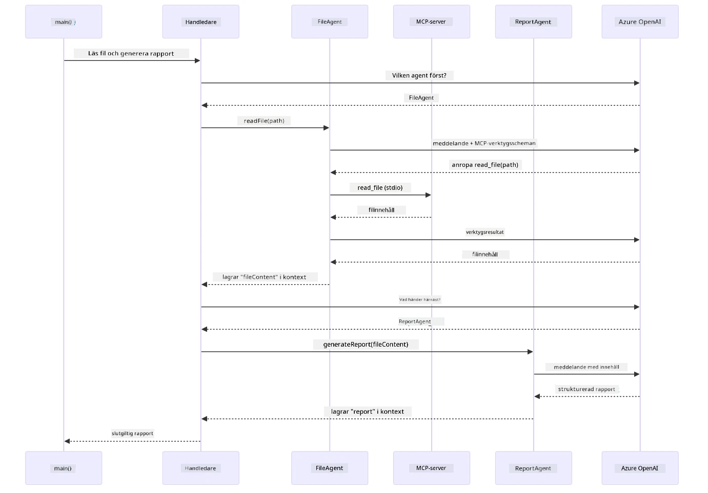

# Modul 05: Model Context Protocol (MCP)

## Innehållsförteckning

- [Vad du kommer att lära dig](../../../05-mcp)
- [Vad är MCP?](../../../05-mcp)
- [Hur MCP fungerar](../../../05-mcp)
- [Agentmodulen](../../../05-mcp)
- [Köra exemplen](../../../05-mcp)
  - [Förutsättningar](../../../05-mcp)
- [Snabbstart](../../../05-mcp)
  - [Filoperationer (Stdio)](../../../05-mcp)
  - [Supervisor-agent](../../../05-mcp)
    - [Köra demon](../../../05-mcp)
    - [Hur Supervisorn fungerar](../../../05-mcp)
    - [Hur FileAgent upptäcker MCP-verktyg vid körning](../../../05-mcp)
    - [Svarsstrategier](../../../05-mcp)
    - [Förstå utdata](../../../05-mcp)
    - [Förklaring av funktioner i agentmodulen](../../../05-mcp)
- [Nyckelbegrepp](../../../05-mcp)
- [Grattis!](../../../05-mcp)
  - [Vad händer sen?](../../../05-mcp)

## Vad du kommer att lära dig

Du har byggt konversations-AI, bemästrat prompts, grundat svar i dokument och skapat agenter med verktyg. Men alla dessa verktyg var specialbyggda för din specifika applikation. Tänk om du kunde ge din AI tillgång till ett standardiserat ekosystem av verktyg som vem som helst kan skapa och dela? I denna modul lär du dig just detta med Model Context Protocol (MCP) och LangChain4js agentmodul. Vi visar först en enkel MCP-filuppläsare och visar sedan hur den enkelt integreras i avancerade agentarbeten med Supervisor Agent-mönstret.

## Vad är MCP?

Model Context Protocol (MCP) erbjuder precis detta - ett standardiserat sätt för AI-applikationer att upptäcka och använda externa verktyg. Istället för att skriva anpassade integrationer för varje datakälla eller tjänst kopplar du till MCP-servrar som exponerar sina funktioner i ett enhetligt format. Din AI-agent kan sedan upptäcka och använda dessa verktyg automatiskt.

Diagrammet nedan visar skillnaden — utan MCP kräver varje integration specialanpassad punkt-till-punkt-koppling; med MCP kopplar en enda protokoll din app till vilket verktyg som helst:


*Före MCP: Komplexa punkt-till-punkt-integrationer. Efter MCP: Ett protokoll, oändliga möjligheter.*

MCP löser ett grundläggande problem i AI-utveckling: varje integration är unik. Vill du komma åt GitHub? Anpassad kod. Vill du läsa filer? Anpassad kod. Vill du göra förfrågningar mot en databas? Anpassad kod. Och ingen av dessa integrationer fungerar med andra AI-applikationer.

MCP standardiserar detta. En MCP-server exponerar verktyg med tydliga beskrivningar och scheman. Varje MCP-klient kan ansluta, upptäcka tillgängliga verktyg och använda dem. Bygg en gång, använd överallt.

Diagrammet nedan illustrerar denna arkitektur — en enda MCP-klient (din AI-applikation) ansluter till flera MCP-servrar, varje med sitt eget verktygsutbud via den standardiserade protokollet:


*Model Context Protocol-arkitektur - standardiserad upptäckt och utförande av verktyg*

## Hur MCP fungerar

Under ytan använder MCP en lagerindelad arkitektur. Din Java-applikation (MCP-klienten) upptäcker tillgängliga verktyg, skickar JSON-RPC-förfrågningar genom ett transportlager (Stdio eller HTTP), och MCP-servern utför operationer och returnerar resultat. Följande diagram delar upp varje lager i detta protokoll:


*Hur MCP fungerar under ytan — klienter upptäcker verktyg, utbyter JSON-RPC-meddelanden och utför operationer genom ett transportlager.*

**Server-klient Arkitektur**

MCP använder en klient-server-modell. Servrar tillhandahåller verktyg – att läsa filer, fråga databaser, anropa API:er. Klienter (din AI-applikation) ansluter till servrar och använder deras verktyg.

För att använda MCP med LangChain4j, lägg till detta Maven-dependencies:

```xml
<dependency>
    <groupId>dev.langchain4j</groupId>
    <artifactId>langchain4j-mcp</artifactId>
    <version>${langchain4j.version}</version>
</dependency>
```

**Verktygsupptäckt**

När din klient ansluter till en MCP-server frågar den "Vilka verktyg har du?" Servern svarar med en lista över tillgängliga verktyg, varje med beskrivningar och parameterscheman. Din AI-agent kan sedan besluta vilka verktyg som ska användas baserat på användarens förfrågningar. Diagrammet nedan visar denna handskakning — klienten skickar en `tools/list`-förfrågan och servern returnerar sina tillgängliga verktyg med beskrivningar och parameterscheman:


*AI:n upptäcker tillgängliga verktyg vid start — den vet nu vilka funktioner som finns och kan besluta vilka som ska användas.*

**Transportmekanismer**

MCP stöder olika transportmekanismer. De två alternativen är Stdio (för lokal subprocess-kommunikation) och Streamable HTTP (för fjärrservrar). Denna modul demonstrerar Stdio-transport:


*MCP-transportmekanismer: HTTP för fjärrservrar, Stdio för lokala processer*

**Stdio** - [StdioTransportDemo.java](../../../05-mcp/src/main/java/com/example/langchain4j/mcp/StdioTransportDemo.java)

För lokala processer. Din applikation startar en server som subprocess och kommunicerar genom standard in-/utdata. Användbart för åtkomst till filsystem eller kommandoradsverktyg.

```java
McpTransport stdioTransport = new StdioMcpTransport.Builder()
    .command(List.of(
        npmCmd, "exec",
        "@modelcontextprotocol/server-filesystem@2025.12.18",
        resourcesDir
    ))
    .logEvents(false)
    .build();
```

`@modelcontextprotocol/server-filesystem`-servern exponerar följande verktyg, alla sandboxade till de kataloger du anger:

| Verktyg | Beskrivning |
|------|-------------|
| `read_file` | Läsa innehållet i en enskild fil |
| `read_multiple_files` | Läsa flera filer i ett anrop |
| `write_file` | Skapa eller skriva över en fil |
| `edit_file` | Göra riktade sök-och-ersätt-redigeringar |
| `list_directory` | Lista filer och kataloger på en sökväg |
| `search_files` | Rekursivt söka efter filer som matchar ett mönster |
| `get_file_info` | Hämta filmetadata (storlek, tidsstämplar, behörigheter) |
| `create_directory` | Skapa en katalog (inklusive föräldrakataloger) |
| `move_file` | Flytta eller byta namn på en fil eller katalog |

Följande diagram visar hur Stdio-transport fungerar vid körning — din Java-applikation startar MCP-servern som en subprocess och de kommunicerar via stdin/stdout pipelines, utan nätverk eller HTTP inblandat:


*Stdio-transport i aktion — din applikation startar MCP-servern som en subprocess och kommunicerar genom stdin/stdout pipelines.*

> **🤖 Prova med [GitHub Copilot](https://github.com/features/copilot) Chat:** Öppna [`StdioTransportDemo.java`](../../../05-mcp/src/main/java/com/example/langchain4j/mcp/StdioTransportDemo.java) och fråga:
> - "Hur fungerar Stdio-transporten och när bör jag använda den istället för HTTP?"
> - "Hur hanterar LangChain4j livscykeln för startade MCP-serverprocesser?"
> - "Vilka säkerhetsimplikationer finns det med att ge AI åtkomst till filsystemet?"

## Agentmodulen

Medan MCP tillhandahåller standardiserade verktyg erbjuder LangChain4js **agentmodul** ett deklarativt sätt att bygga agenter som orkestrerar dessa verktyg. `@Agent`-annoteringen och `AgenticServices` låter dig definiera agentbeteende genom gränssnitt snarare än imperativ kod.

I denna modul utforskar du **Supervisor Agent**-mönstret – en avancerad agentisk AI-metod där en "supervisor"-agent dynamiskt avgör vilka subagenter som ska anropas baserat på användarens förfrågan. Vi kombinerar båda koncepten genom att ge en av våra subagenter MCP-drivna filåtkomstmöjligheter.

För att använda agentmodulen, lägg till detta Maven-dependency:

```xml
<dependency>
    <groupId>dev.langchain4j</groupId>
    <artifactId>langchain4j-agentic</artifactId>
    <version>${langchain4j.mcp.version}</version>
</dependency>
```
> **Notera:** `langchain4j-agentic`-modulen använder en separat versionsegenskap (`langchain4j.mcp.version`) eftersom den släpps på ett annat schema än kärnbiblioteken för LangChain4j.

> **⚠️ Experimentell:** `langchain4j-agentic`-modulen är **experimentell** och kan komma att ändras. Det stabila sättet att bygga AI-assistenter är fortfarande `langchain4j-core` med egna verktyg (Modul 04).

## Köra exemplen

### Förutsättningar

- Genomförd [Modul 04 - Verktyg](../04-tools/README.md) (denna modul bygger vidare på koncepten med egna verktyg och jämför med MCP-verktyg)
- `.env`-fil i rotmappen med Azure-referenser (skapad av `azd up` i Modul 01)
- Java 21+, Maven 3.9+
- Node.js 16+ och npm (för MCP-servrar)

> **Notera:** Om du inte har konfigurerat dina miljövariabler ännu, se [Modul 01 - Introduktion](../01-introduction/README.md) för instruktioner om distribution (`azd up` skapar `.env`-filen automatiskt), eller kopiera `.env.example` till `.env` i rotmappen och fyll i dina värden.

## Snabbstart

**Med VS Code:** Högerklicka på någon demo-fil i Explorer och välj **"Run Java"**, eller använd startkonfigurationer från Run and Debug-panelen (se till att din `.env`-fil är konfigurerad med Azure-referenser först).

**Med Maven:** Alternativt kan du köra från kommandoraden med exemplen nedan.

### Filoperationer (Stdio)

Detta demonstrerar lokala verktyg baserade på subprocess.

**✅ Inga förutsättningar krävs** – MCP-servern startas automatiskt.

**Använd startskript (Rekommenderat):**

Startskripten laddar automatiskt miljövariabler från root `.env`-filen:

**Bash:**
```bash
cd 05-mcp
chmod +x start-stdio.sh
./start-stdio.sh
```

**PowerShell:**
```powershell
cd 05-mcp
.\start-stdio.ps1
```

**Med VS Code:** Högerklicka på `StdioTransportDemo.java` och välj **"Run Java"** (se till att din `.env`-fil är konfigurerad).

Applikationen startar en MCP-server för filsystem automatiskt och läser en lokal fil. Notera hur subprocess-hanteringen sköts åt dig.

**Förväntad utdata:**
```
Assistant response: The file provides an overview of LangChain4j, an open-source Java library
for integrating Large Language Models (LLMs) into Java applications...
```

### Supervisor-agent

**Supervisor Agent-mönstret** är en **flexibel** form av agentik AI. En supervisor använder en LLM för att autonomt bestämma vilka agenter som ska anropas baserat på användarens förfrågan. I nästa exempel kombinerar vi MCP-drivna filåtkomstmöjligheter med en LLM-agent för att skapa ett övervakat flöde för filinläsning → rapportgenerering.

I demon läser `FileAgent` en fil med MCP-filsystemverktyg, och `ReportAgent` genererar en strukturerad rapport med en sammanfattning (1 mening), 3 nyckelpunkter och rekommendationer. Supervisorn orkestrerar detta flöde automatiskt:


*Supervisorn använder sin LLM för att avgöra vilka agenter som ska anropas och i vilken ordning — ingen hårdkodad dirigering behövs.*

Så här ser det konkreta arbetsflödet ut för vår fil till rapport-pipeline:


*FileAgent läser filen via MCP-verktygen, sedan omvandlar ReportAgent det råa innehållet till en strukturerad rapport.*

Följande sekvensdiagram spårar hela Supervisor-orkestreringen — från att starta MCP-servern, via Supervisorns autonoma agentval, till verktygsanrop över stdio och slutrapporten:



*Supervisorn anropar autonomt FileAgent (som anropar MCP-servern över stdio för att läsa filen), och sedan anropar den ReportAgent för att generera en strukturerad rapport — varje agent lagrar sin output i den delade Agentic Scope.*

Varje agent lagrar sin output i **Agentic Scope** (delat minne), vilket tillåter efterföljande agenter att få åtkomst till tidigare resultat. Detta visar hur MCP-verktyg sömlöst integreras i agentiska arbetsflöden — Supervisorn behöver inte veta *hur* filer läses, bara att `FileAgent` kan göra det.

#### Köra demon

Startskripten laddar automatiskt miljövariabler från root `.env`-filen:

**Bash:**
```bash
cd 05-mcp
chmod +x start-supervisor.sh
./start-supervisor.sh
```

**PowerShell:**
```powershell
cd 05-mcp
.\start-supervisor.ps1
```

**Med VS Code:** Högerklicka på `SupervisorAgentDemo.java` och välj **"Run Java"** (se till att din `.env`-fil är konfigurerad).

#### Hur Supervisorn fungerar

Innan agents byggs behöver du koppla MCP-transporten till en klient och omsluta det som en `ToolProvider`. Så här blir MCP-serverns verktyg tillgängliga för dina agenter:

```java
// Skapa en MCP-klient från transporten
McpClient mcpClient = new DefaultMcpClient.Builder()
        .transport(stdioTransport)
        .build();

// Wrappa klienten som en ToolProvider — detta kopplar samman MCP-verktyg till LangChain4j
ToolProvider mcpToolProvider = McpToolProvider.builder()
        .mcpClients(List.of(mcpClient))
        .build();
```

Nu kan du injicera `mcpToolProvider` i vilken agent som helst som behöver MCP-verktyg:

```java
// Steg 1: FileAgent läser filer med hjälp av MCP-verktyg
FileAgent fileAgent = AgenticServices.agentBuilder(FileAgent.class)
        .chatModel(model)
        .toolProvider(mcpToolProvider)  // Har MCP-verktyg för filoperationer
        .build();

// Steg 2: ReportAgent genererar strukturerade rapporter
ReportAgent reportAgent = AgenticServices.agentBuilder(ReportAgent.class)
        .chatModel(model)
        .build();

// Supervisor orkestrerar arbetsflödet från fil till rapport
SupervisorAgent supervisor = AgenticServices.supervisorBuilder()
        .chatModel(model)
        .subAgents(fileAgent, reportAgent)
        .responseStrategy(SupervisorResponseStrategy.LAST)  // Returnera den slutliga rapporten
        .build();

// Supervisor bestämmer vilka agenter som ska anropas baserat på förfrågan
String response = supervisor.invoke("Read the file at /path/file.txt and generate a report");
```

#### Hur FileAgent upptäcker MCP-verktyg vid körning

Du undrar kanske: **hur vet `FileAgent` hur npm-filsystemverktygen ska användas?** Svaret är att den inte vet — det är **LLM** som listar ut det vid körning genom verktygsscheman.

`FileAgent`-gränssnittet är bara en **promptdefinition**. Den har ingen hårdkodad kunskap om `read_file`, `list_directory` eller andra MCP-verktyg. Så här går det till från början till slut:
1. **Server startar:** `StdioMcpTransport` startar npm-paketet `@modelcontextprotocol/server-filesystem` som en underprocess  
2. **Verktygsupptäckt:** `McpClient` skickar en `tools/list` JSON-RPC-förfrågan till servern, som svarar med verktygsnamn, beskrivningar och parameterscheman (t.ex. `read_file` — *"Läs hela innehållet i en fil"* — `{ path: string }`)  
3. **Schemainjektion:** `McpToolProvider` kapslar in dessa upptäckta scheman och gör dem tillgängliga för LangChain4j  
4. **LLM bestämmer:** När `FileAgent.readFile(path)` anropas, skickar LangChain4j systemmeddelandet, användarmeddelandet **och listan över verktygsscheman** till LLM. LLM läser verktygsbeskrivningarna och genererar ett verktygsanrop (t.ex. `read_file(path="/some/file.txt")`)  
5. **Exekvering:** LangChain4j avlyssnar verktygsanropet, skickar det via MCP-klienten tillbaka till Node.js-underprocessen, får resultatet och matar tillbaka det till LLM  

Det här är samma [Verktygsupptäckt](../../../05-mcp)-mekanism som beskrivs ovan, men specifikt tillämpad på agentarbetsflödet. `@SystemMessage` och `@UserMessage`-annoteringarna styr LLM:s beteende, medan den injicerade `ToolProvider` ger den **möjligheterna** — LLM kopplar ihop dem i körningstid.

> **🤖 Prova med [GitHub Copilot](https://github.com/features/copilot) Chat:** Öppna [`FileAgent.java`](../../../05-mcp/src/main/java/com/example/langchain4j/mcp/agents/FileAgent.java) och fråga:  
> - "Hur vet denna agent vilket MCP-verktyg den ska anropa?"  
> - "Vad händer om jag tar bort ToolProvider från agentbyggaren?"  
> - "Hur förs verktygsscheman vidare till LLM?"

#### Svarsstrategier

När du konfigurerar en `SupervisorAgent` specificerar du hur den ska formulera sitt slutgiltiga svar till användaren efter att delagenterna har slutfört sina uppgifter. Diagrammet nedan visar de tre tillgängliga strategierna — LAST returnerar slutagentens output direkt, SUMMARY syntetiserar alla outputs via en LLM och SCORED väljer den som får högst poäng mot den ursprungliga förfrågan:


*Tre strategier för hur Supervisor formulerar sitt slutgiltiga svar — välj baserat på om du vill ha sista agentens output, en syntetiserad sammanfattning eller det bäst poängsatta alternativet.*

De tillgängliga strategierna är:

| Strategi | Beskrivning |
|----------|-------------|
| **LAST** | Supervisorn returnerar output från den sista delagenten eller det sista verktyget som anropats. Detta är användbart när den sista agenten i arbetsflödet är speciellt utformad för att producera det kompletta, slutgiltiga svaret (t.ex. en "Summary Agent" i en forskningspipeline). |
| **SUMMARY** | Supervisorn använder sin egen interna Language Model (LLM) för att syntetisera en sammanfattning av hela interaktionen och alla delagentsoutputs, och returnerar sedan den sammanfattningen som slutgiltigt svar. Detta ger ett rent, aggregerat svar till användaren. |
| **SCORED** | Systemet använder en intern LLM för att poängsätta både LAST-svaret och SUMMARY av interaktionen mot den ursprungliga användarförfrågan, och returnerar den output som får högst poäng. |

Se [SupervisorAgentDemo.java](../../../05-mcp/src/main/java/com/example/langchain4j/mcp/SupervisorAgentDemo.java) för komplett implementering.

> **🤖 Prova med [GitHub Copilot](https://github.com/features/copilot) Chat:** Öppna [`SupervisorAgentDemo.java`](../../../05-mcp/src/main/java/com/example/langchain4j/mcp/SupervisorAgentDemo.java) och fråga:  
> - "Hur bestämmer Supervisor vilka agenter som ska anropas?"  
> - "Vad är skillnaden mellan Supervisor och Sequential arbetsflödesmönster?"  
> - "Hur kan jag anpassa Supervisorns planeringsbeteende?"

#### Förstå outputen

När du kör demon får du en strukturerad genomgång av hur Supervisorn orkestrerar flera agenter. Här är vad varje sektion betyder:

```
======================================================================
  FILE → REPORT WORKFLOW DEMO
======================================================================

This demo shows a clear 2-step workflow: read a file, then generate a report.
The Supervisor orchestrates the agents automatically based on the request.
```
  
**Rubriken** introducerar arbetsflödeskoncepet: en fokuserad pipeline från filinläsning till rapportgenerering.

```
--- WORKFLOW ---------------------------------------------------------
  ┌─────────────┐      ┌──────────────┐
  │  FileAgent  │ ───▶ │ ReportAgent  │
  │ (MCP tools) │      │  (pure LLM)  │
  └─────────────┘      └──────────────┘
   outputKey:           outputKey:
   'fileContent'        'report'

--- AVAILABLE AGENTS -------------------------------------------------
  [FILE]   FileAgent   - Reads files via MCP → stores in 'fileContent'
  [REPORT] ReportAgent - Generates structured report → stores in 'report'
```
  
**Arbetsflödesdiagram** visar dataflödet mellan agenterna. Varje agent har en specifik roll:  
- **FileAgent** läser filer med MCP-verktyg och lagrar råinnehållet i `fileContent`  
- **ReportAgent** konsumerar det innehållet och producerar en strukturerad rapport i `report`

```
--- USER REQUEST -----------------------------------------------------
  "Read the file at .../file.txt and generate a report on its contents"
```
  
**Användarförfrågan** visar uppgiften. Supervisorn parser detta och bestämmer sig för att anropa FileAgent → ReportAgent.

```
--- SUPERVISOR ORCHESTRATION -----------------------------------------
  The Supervisor decides which agents to invoke and passes data between them...

  +-- STEP 1: Supervisor chose -> FileAgent (reading file via MCP)
  |
  |   Input: .../file.txt
  |
  |   Result: LangChain4j is an open-source, provider-agnostic Java framework for building LLM...
  +-- [OK] FileAgent (reading file via MCP) completed

  +-- STEP 2: Supervisor chose -> ReportAgent (generating structured report)
  |
  |   Input: LangChain4j is an open-source, provider-agnostic Java framew...
  |
  |   Result: Executive Summary...
  +-- [OK] ReportAgent (generating structured report) completed
```
  
**Supervisororkestrering** visar det tvåstegiga flödet i praktiken:  
1. **FileAgent** läser filen via MCP och lagrar innehållet  
2. **ReportAgent** tar emot innehållet och genererar en strukturerad rapport

Supervisorn tog dessa beslut **autonomt** baserat på användarens förfrågan.

```
--- FINAL RESPONSE ---------------------------------------------------
Executive Summary
...

Key Points
...

Recommendations
...

--- AGENTIC SCOPE (Data Flow) ----------------------------------------
  Each agent stores its output for downstream agents to consume:
  * fileContent: LangChain4j is an open-source, provider-agnostic Java framework...
  * report: Executive Summary...
```
  
#### Förklaring av Agentic Module-funktioner

Exemplet demonstrerar flera avancerade funktioner i agentic-modulen. Låt oss ta en närmare titt på Agentic Scope och Agent Listeners.

**Agentic Scope** visar det delade minnet där agenter lagrade sina resultat med `@Agent(outputKey="...")`. Detta möjliggör:  
- Senare agenter att komma åt tidigare agenters output  
- Supervisorn att syntetisera ett slutgiltigt svar  
- Dig att inspektera vad varje agent producerade

Diagrammet nedan visar hur Agentic Scope fungerar som delat minne i arbetsflödet fil-till-rapport — FileAgent skriver sin output under nyckeln `fileContent`, ReportAgent läser det och skriver sin output under `report`:


*Agentic Scope agerar som delat minne — FileAgent skriver `fileContent`, ReportAgent läser det och skriver `report`, och din kod läser slutresultatet.*

```java
ResultWithAgenticScope<String> result = supervisor.invokeWithAgenticScope(request);
AgenticScope scope = result.agenticScope();
String fileContent = scope.readState("fileContent");  // Rå filinformation från FileAgent
String report = scope.readState("report");            // Strukturerad rapport från ReportAgent
```
  
**Agent Listeners** möjliggör övervakning och felsökning av agentexekvering. Den steg-för-steg-output du ser i demon kommer från en AgentListener som kopplas in vid varje agentanrop:  
- **beforeAgentInvocation** - Anropas när Supervisorn väljer en agent, och visar vilken agent som valdes och varför  
- **afterAgentInvocation** - Anropas när en agent slutförs, och visar dess resultat  
- **inheritedBySubagents** - När true övervakar lyssnaren alla agenter i hierarkin

Följande diagram visar hela livscykeln för Agent Listener, inklusive hur `onError` hanterar fel under agentexekvering:


*Agent Listeners kopplas in i exekveringslivscykeln — övervakar när agenter startar, slutförs eller stöter på fel.*

```java
AgentListener monitor = new AgentListener() {
    private int step = 0;
    
    @Override
    public void beforeAgentInvocation(AgentRequest request) {
        step++;
        System.out.println("  +-- STEP " + step + ": " + request.agentName());
    }
    
    @Override
    public void afterAgentInvocation(AgentResponse response) {
        System.out.println("  +-- [OK] " + response.agentName() + " completed");
    }
    
    @Override
    public boolean inheritedBySubagents() {
        return true; // Propagera till alla underagenter
    }
};
```
  
Förutom Supervisor-mönstret erbjuder `langchain4j-agentic`-modulen flera kraftfulla arbetsflödesmönster. Diagrammet nedan visar alla fem — från enkla sekventiella pipelines till mänskligt-insatta godkännandeflöden:


*Fem arbetsflödesmönster för att orkestrera agenter — från enkla sekventiella pipelines till godkännandeflöden med mänsklig inblandning.*

| Mönster | Beskrivning | Användningsområde |
|---------|-------------|-------------------|
| **Sequential** | Kör agenter i ordning, output flödar till nästa | Pipelines: forskning → analys → rapport |
| **Parallel** | Kör agenter samtidigt | Oberoende uppgifter: väder + nyheter + aktier |
| **Loop** | Iterera tills villkor uppfylls | Kvalitetspoängsättning: förfina tills poäng ≥ 0.8 |
| **Conditional** | Rutta baserat på villkor | Klassificera → dirigera till specialagent |
| **Human-in-the-Loop** | Lägg till mänskliga kontrollpunkter | Godkännandeflöden, innehållsgranskning |

## Nyckelkoncept

Nu när du har utforskat MCP och agentic-modulen i praktiken, låt oss sammanfatta när man ska använda varje tillvägagångssätt.

En av MCP:s största fördelar är dess växande ekosystem. Diagrammet nedan visar hur ett enda universellt protokoll kopplar din AI-applikation till en bred variation av MCP-servrar — från filsystems- och databasåtkomst till GitHub, e-post, web scraping med mera:


*MCP skapar ett universellt protokollekosystem — vilken MCP-kompatibel server som helst fungerar med vilken MCP-kompatibel klient som helst, vilket möjliggör verktygsdelning över applikationer.*

**MCP** är idealiskt när du vill dra nytta av befintliga verktygsekosystem, bygga verktyg som flera applikationer kan dela, integrera tredjepartstjänster med standardprotokoll eller byta implementationer av verktyg utan att ändra kod.

**Agentic-modulen** fungerar bäst när du vill ha deklarativa agentdefinitioner med `@Agent`-annoteringar, behöver arbetsflödesorkestrering (sekventiell, loop, parallell), föredrar gränssnittsbaserad agentdesign istället för imperativ kod eller kombinerar flera agenter som delar outputs via `outputKey`.

**Supervisor Agent-mönstret** lyser när arbetsflödet inte är förutsägbart i förväg och du vill att LLM ska avgöra, när du har flera specialiserade agenter som behöver dynamisk orkestrering, när du bygger konversationssystem som dirigerar till olika funktioner eller när du vill ha det mest flexibla och adaptiva agentbeteendet.

För att hjälpa dig välja mellan anpassade `@Tool`-metoder från Modul 04 och MCP-verktyg från denna modul, framhäver följande jämförelse nyckelför- och nackdelar — anpassade verktyg ger dig nära koppling och full typkontroll för applikationsspecifik logik, medan MCP-verktyg erbjuder standardiserade, återanvändbara integrationer:


*När man ska använda anpassade @Tool-metoder vs MCP-verktyg — anpassade verktyg för applikationsspecifik logik med full typkontroll, MCP-verktyg för standardiserade integrationer som fungerar över applikationer.*

## Grattis!

Du har gått igenom alla fem moduler i LangChain4j för nybörjare-kursen! Här är en överblick över hela läranderesan du har genomfört — från grundläggande chatt ända till agentbaserade system med MCP:


*Din läranderesa genom alla fem moduler — från grundläggande chatt till agentbaserade system med MCP.*

Du har avslutat LangChain4j för nybörjare-kursen. Du har lärt dig:

- Hur man bygger konversations-AI med minne (Modul 01)  
- Prompt engineering-mönster för olika uppgifter (Modul 02)  
- Grundläggande svar kopplat till dina dokument med RAG (Modul 03)  
- Skapa grundläggande AI-agenter (assistenter) med anpassade verktyg (Modul 04)  
- Integrera standardiserade verktyg med LangChain4j MCP och Agentic-modulerna (Modul 05)  

### Vad händer härnäst?

Efter att ha slutfört modulerna, utforska [Testing Guide](../docs/TESTING.md) för att se LangChain4j testkoncept i praktiken.

**Officiella resurser:**  
- [LangChain4j Dokumentation](https://docs.langchain4j.dev/) – Omfattande guider och API-referens  
- [LangChain4j GitHub](https://github.com/langchain4j/langchain4j) – Källkod och exempel  
- [LangChain4j Tutorials](https://docs.langchain4j.dev/tutorials/) – Steg-för-steg tutorials för olika användningsfall  

Tack för att du har slutfört denna kurs!

---

**Navigering:** [← Föregående: Modul 04 - Verktyg](../04-tools/README.md) | [Tillbaka till huvudmenyn](../README.md)

---

<!-- CO-OP TRANSLATOR DISCLAIMER START -->
**Ansvarsfriskrivning**:
Detta dokument har översatts med hjälp av AI-översättningstjänsten [Co-op Translator](https://github.com/Azure/co-op-translator). Även om vi strävar efter noggrannhet, bör du vara medveten om att automatiska översättningar kan innehålla fel eller brister. Det ursprungliga dokumentet på dess modersmål ska anses vara den auktoritativa källan. För kritisk information rekommenderas professionell mänsklig översättning. Vi ansvarar inte för eventuella missförstånd eller feltolkningar som uppstår vid användning av denna översättning.
<!-- CO-OP TRANSLATOR DISCLAIMER END -->