# Modul 05: Model Context Protocol (MCP)

## Innehållsförteckning

- [Vad du kommer att lära dig](../../../05-mcp)
- [Vad är MCP?](../../../05-mcp)
- [Hur MCP fungerar](../../../05-mcp)
- [Agentmodulen](../../../05-mcp)
- [Köra exemplen](../../../05-mcp)
  - [Förutsättningar](../../../05-mcp)
- [Snabbstart](../../../05-mcp)
  - [Filoperationer (Stdio)](../../../05-mcp)
  - [Supervisoragent](../../../05-mcp)
    - [Köra demon](../../../05-mcp)
    - [Hur supervisorn fungerar](../../../05-mcp)
    - [Svarstrategier](../../../05-mcp)
    - [Förstå utdata](../../../05-mcp)
    - [Förklaring av agentmodulens funktioner](../../../05-mcp)
- [Nyckelbegrepp](../../../05-mcp)
- [Grattis!](../../../05-mcp)
  - [Vad händer härnäst?](../../../05-mcp)

## Vad du kommer att lära dig

Du har byggt konversations-AI, behärskat prompts, grundat svar i dokument och skapat agenter med verktyg. Men alla dessa verktyg var specialbyggda för din specifika applikation. Tänk om du kunde ge din AI tillgång till ett standardiserat ekosystem av verktyg som vem som helst kan skapa och dela? I denna modul lär du dig precis det med Model Context Protocol (MCP) och LangChain4j:s agentmodul. Vi visar först en enkel MCP-fil-läsare och visar sedan hur den enkelt integreras i avancerade agentarbetsflöden med hjälp av Supervisor Agent-mönstret.

## Vad är MCP?

Model Context Protocol (MCP) erbjuder just det – ett standardiserat sätt för AI-applikationer att upptäcka och använda externa verktyg. Istället för att skriva specialanpassade integrationer för varje datakälla eller tjänst, ansluter du till MCP-servrar som exponerar sina kapabiliteter i ett konsekvent format. Din AI-agent kan då automatiskt upptäcka och använda dessa verktyg.


*Innan MCP: Komplexa punkt-till-punkt-integrationer. Efter MCP: En protokoll, oändliga möjligheter.*

MCP löser ett grundläggande problem inom AI-utveckling: varje integration är specialanpassad. Vill du komma åt GitHub? Specialkod. Vill du läsa filer? Specialkod. Vill du fråga en databas? Specialkod. Och ingen av dessa integrationer fungerar med andra AI-applikationer.

MCP standardiserar detta. En MCP-server exponerar verktyg med klara beskrivningar och scheman. Varje MCP-klient kan ansluta, upptäcka tillgängliga verktyg och använda dem. Bygg en gång, använd överallt.


*Model Context Protocol-arkitektur – standardiserad verktygsupptäckt och exekvering*

## Hur MCP fungerar

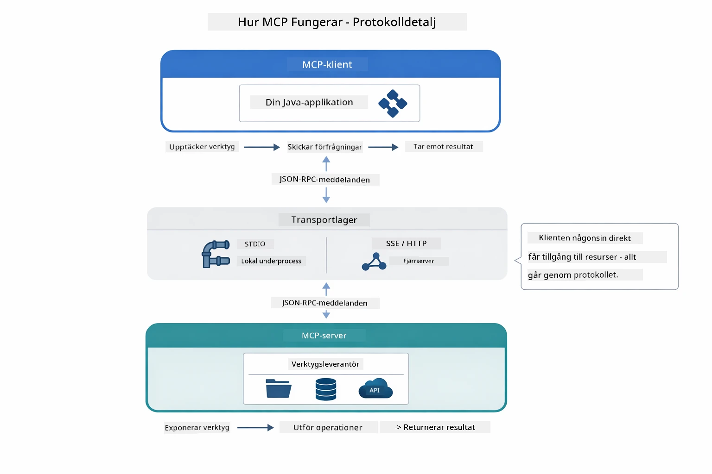

*Hur MCP fungerar under ytan — klienter upptäcker verktyg, utbyter JSON-RPC-meddelanden och kör operationer via ett transportlager.*

**Server-klient-arkitektur**

MCP använder en klient-server-modell. Servrar tillhandahåller verktyg – läsa filer, fråga databaser, anropa API:er. Klienter (din AI-applikation) ansluter till servrar och använder deras verktyg.

För att använda MCP med LangChain4j, lägg till detta Maven-beroende:

```xml
<dependency>
    <groupId>dev.langchain4j</groupId>
    <artifactId>langchain4j-mcp</artifactId>
    <version>${langchain4j.version}</version>
</dependency>
```

**Verktygsupptäckt**

När din klient ansluter till en MCP-server frågar den "Vilka verktyg har du?" Servern svarar med en lista över tillgängliga verktyg, varje med beskrivningar och parameterscheman. Din AI-agent kan sedan välja vilka verktyg den vill använda baserat på användarens förfrågningar.

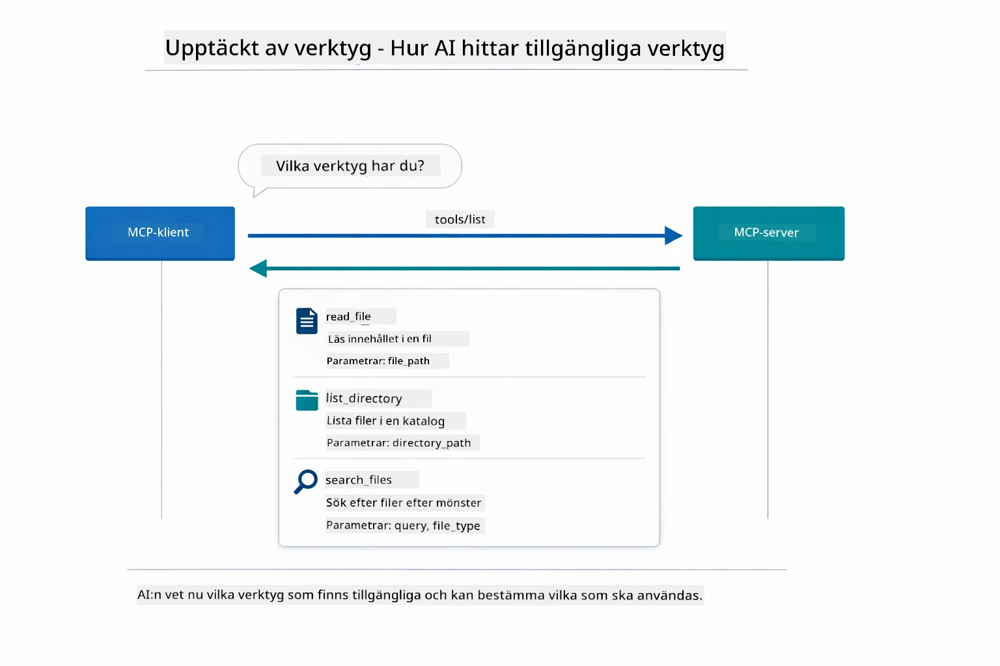

*AI:n upptäcker tillgängliga verktyg vid start — nu vet den vilka kapabiliteter som finns och kan bestämma vilka som ska användas.*

**Transportmekanismer**

MCP stöder olika transportmekanismer. Denna modul demonstrerar Stdio-transporten för lokala processer:


*MCP transportmekanismer: HTTP för fjärrservrar, Stdio för lokala processer*

**Stdio** - [StdioTransportDemo.java](../../../05-mcp/src/main/java/com/example/langchain4j/mcp/StdioTransportDemo.java)

För lokala processer. Din applikation startar en server som en subprocess och kommunicerar via standard in-/utström. Användbart för access till filsystem eller kommandoradsverktyg.

```java
McpTransport stdioTransport = new StdioMcpTransport.Builder()
    .command(List.of(
        npmCmd, "exec",
        "@modelcontextprotocol/server-filesystem@2025.12.18",
        resourcesDir
    ))
    .logEvents(false)
    .build();
```

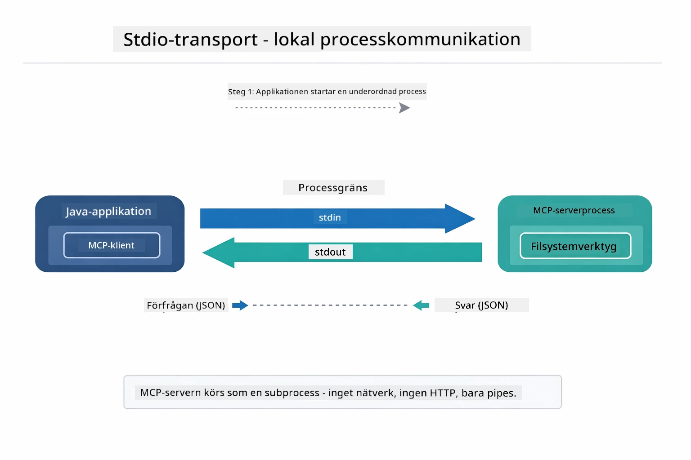

*Stdio-transport i praktiken — din applikation startar MCP-servern som en subprocess och kommunicerar via stdin/stdout-rör.*

> **🤖 Prova med [GitHub Copilot](https://github.com/features/copilot) Chat:** Öppna [`StdioTransportDemo.java`](../../../05-mcp/src/main/java/com/example/langchain4j/mcp/StdioTransportDemo.java) och fråga:
> - "Hur fungerar Stdio-transport och när bör jag använda den istället för HTTP?"
> - "Hur hanterar LangChain4j livscykeln för uppstartade MCP-serverprocesser?"
> - "Vilka är säkerhetsimplikationerna av att ge AI tillgång till filsystemet?"

## Agentmodulen

Medan MCP tillhandahåller standardiserade verktyg, erbjuder LangChain4j:s **agentmodul** ett deklarativt sätt att bygga agenter som orkestrerar dessa verktyg. `@Agent`-annoteringen och `AgenticServices` låter dig definiera agentbeteende genom gränssnitt istället för imperativ kod.

I denna modul utforskar du **Supervisor Agent**-mönstret — en avancerad agentisk AI-ansats där en “supervisor”-agent dynamiskt bestämmer vilka underagenter som ska anropas baserat på användarens förfrågan. Vi kombinerar båda koncepten genom att ge en av våra underagenter MCP-drivna filåtkomstmöjligheter.

För att använda agentmodulen, lägg till detta Maven-beroende:

```xml
<dependency>
    <groupId>dev.langchain4j</groupId>
    <artifactId>langchain4j-agentic</artifactId>
    <version>${langchain4j.mcp.version}</version>
</dependency>
```

> **⚠️ Experimentell:** `langchain4j-agentic`-modulen är **experimentell** och kan komma att ändras. Det stabila sättet att bygga AI-assistenter är fortfarande `langchain4j-core` med egna verktyg (Modul 04).

## Köra exemplen

### Förutsättningar

- Java 21+, Maven 3.9+
- Node.js 16+ och npm (för MCP-servrar)
- Miljövariabler konfigurerade i `.env`-fil (från rotkatalogen):
  - `AZURE_OPENAI_ENDPOINT`, `AZURE_OPENAI_API_KEY`, `AZURE_OPENAI_DEPLOYMENT` (samma som moduler 01–04)

> **Notera:** Om du inte har satt upp dina miljövariabler ännu, se [Modul 00 - Snabbstart](../00-quick-start/README.md) för instruktioner, eller kopiera `.env.example` till `.env` i rotkatalogen och fyll i dina värden.

## Snabbstart

**Med VS Code:** Högerklicka bara på valfri demofil i Utforskaren och välj **"Run Java"**, eller använd launch-konfigurationerna i panelen Kör och Debugga (se till att du först lagt till din token i `.env`-filen).

**Med Maven:** Alternativt kan du köra från kommandoraden med exemplen nedan.

### Filoperationer (Stdio)

Detta demonstrerar verktyg baserade på lokala subprocesser.

**✅ Inga förutsättningar krävs** - MCP-servern startas automatiskt.

**Med startskript (rekommenderat):**

Startskripten laddar automatiskt miljövariabler från rotens `.env`-fil:

**Bash:**
```bash
cd 05-mcp
chmod +x start-stdio.sh
./start-stdio.sh
```

**PowerShell:**
```powershell
cd 05-mcp
.\start-stdio.ps1
```

**Med VS Code:** Högerklicka på `StdioTransportDemo.java` och välj **"Run Java"** (se till att din `.env`-fil är konfigurerad).

Applikationen startar automatiskt en MCP-server för filsystem och läser en lokal fil. Notera hur subprocess-hanteringen sköts åt dig.

**Förväntad utdata:**
```
Assistant response: The file provides an overview of LangChain4j, an open-source Java library
for integrating Large Language Models (LLMs) into Java applications...
```

### Supervisoragent

**Supervisor Agent-mönstret** är en **flexibel** form av agentisk AI. En Supervisor använder en LLM för att autonomt bestämma vilka agenter som ska anropas baserat på användarens förfrågan. I nästa exempel kombinerar vi MCP-drivna filåtkomstverktyg med en LLM-agent för att skapa ett övervakat arbetsflöde fil-läsning → rapport.

I demon läser `FileAgent` en fil med MCP-filsystemverktyg, och `ReportAgent` genererar en strukturerad rapport med en sammanfattning (1 mening), 3 nyckelpunkter och rekommendationer. Supervisorn orkestrerar detta flöde automatiskt:

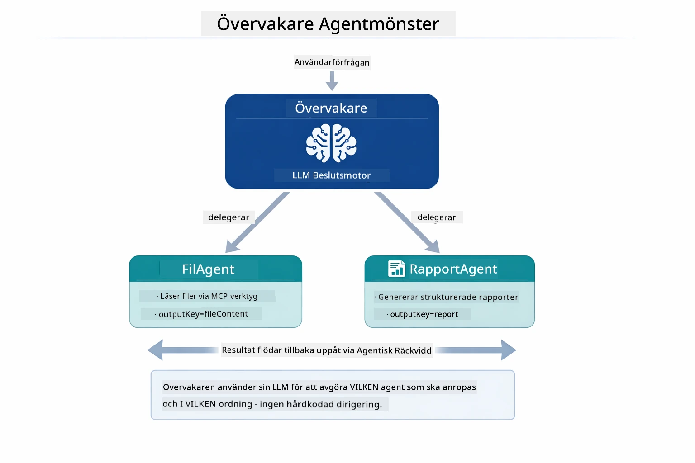

*Supervisorn använder sin LLM för att besluta vilka agenter som ska anropas och i vilken ordning — ingen hårdkodad styrning behövs.*

Så här ser det konkreta arbetsflödet ut för vår fil-till-rapport-pipeline:

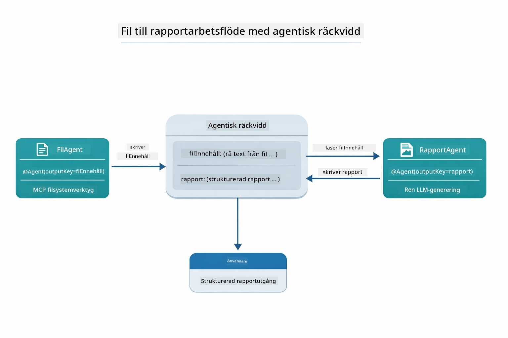

*FileAgent läser filen via MCP-verktyg, sedan omvandlar ReportAgent det råa innehållet till en strukturerad rapport.*

Varje agent lagrar sin utdata i **Agentic Scope** (delat minne), så att efterföljande agenter kan nå tidigare resultat. Detta visar hur MCP-verktyg sömlöst integreras i agentiska arbetsflöden — Supervisorn behöver inte veta *hur* filer läses, bara att `FileAgent` kan göra det.

#### Köra demon

Startskripten laddar automatiskt miljövariabler från rotens `.env`-fil:

**Bash:**
```bash
cd 05-mcp
chmod +x start-supervisor.sh
./start-supervisor.sh
```

**PowerShell:**
```powershell
cd 05-mcp
.\start-supervisor.ps1
```

**Med VS Code:** Högerklicka på `SupervisorAgentDemo.java` och välj **"Run Java"** (se till att din `.env`-fil är konfigurerad).

#### Hur supervisorn fungerar

```java
// Steg 1: FileAgent läser filer med MCP-verktyg
FileAgent fileAgent = AgenticServices.agentBuilder(FileAgent.class)
        .chatModel(model)
        .toolProvider(mcpToolProvider)  // Har MCP-verktyg för filoperationer
        .build();

// Steg 2: ReportAgent genererar strukturerade rapporter
ReportAgent reportAgent = AgenticServices.agentBuilder(ReportAgent.class)
        .chatModel(model)
        .build();

// Supervisor orkestrerar fil → rapport arbetsflöde
SupervisorAgent supervisor = AgenticServices.supervisorBuilder()
        .chatModel(model)
        .subAgents(fileAgent, reportAgent)
        .responseStrategy(SupervisorResponseStrategy.LAST)  // Returnera den slutgiltiga rapporten
        .build();

// Supervisor beslutar vilka agenter som ska anropas baserat på begäran
String response = supervisor.invoke("Read the file at /path/file.txt and generate a report");
```

#### Svarstrategier

När du konfigurerar en `SupervisorAgent` specificerar du hur den ska formulera sitt slutgiltiga svar till användaren efter att underagenterna avslutat sina uppgifter.

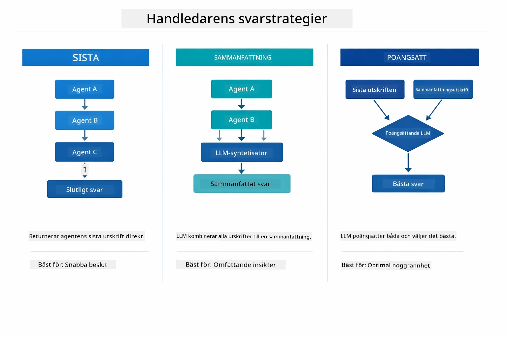

*Tre strategier för hur Supervisorn formulerar sitt slutgiltiga svar — välj baserat på om du vill ha den sista agentens utdata, en syntetiserad sammanfattning eller det bäst poängsatta alternativet.*

De tillgängliga strategierna är:

| Strategi | Beskrivning |
|----------|-------------|
| **LAST** | Supervisorn returnerar utdata från den sista underagenten eller verktyget som anropades. Detta är användbart när den sista agenten i arbetsflödet är särskilt designad för att producera det kompletta, slutgiltiga svaret (t.ex. en "Sammanfattningsagent" i en forskningspipeline). |
| **SUMMARY** | Supervisorn använder sin interna språkmodell (LLM) för att syntetisera en sammanfattning av hela interaktionen inklusive alla underagenters utdata, och returnerar denna sammanfattning som slutgiltigt svar. Detta ger ett rent, aggregerat svar till användaren. |
| **SCORED** | Systemet använder en intern LLM för att betygsätta både LAST-svaret och SUMMARY av interaktionen mot den ursprungliga användarförfrågan, och returnerar det svar som får högst poäng. |

Se [SupervisorAgentDemo.java](../../../05-mcp/src/main/java/com/example/langchain4j/mcp/SupervisorAgentDemo.java) för komplett implementation.

> **🤖 Prova med [GitHub Copilot](https://github.com/features/copilot) Chat:** Öppna [`SupervisorAgentDemo.java`](../../../05-mcp/src/main/java/com/example/langchain4j/mcp/SupervisorAgentDemo.java) och fråga:
> - "Hur beslutar Supervisorn vilka agenter som ska anropas?"
> - "Vad är skillnaden mellan Supervisor- och Sequential arbetsflödesmönster?"
> - "Hur kan jag anpassa Supervisorns planeringsbeteende?"

#### Förstå utdata

När du kör demon får du en strukturerad genomgång av hur Supervisorn orkestrerar flera agenter. Så här tolkar du varje sektion:

```
======================================================================
  FILE → REPORT WORKFLOW DEMO
======================================================================

This demo shows a clear 2-step workflow: read a file, then generate a report.
The Supervisor orchestrates the agents automatically based on the request.
```

**Rubriken** introducerar arbetsflödeskonceptet: en fokuserad pipeline från fil-läsning till rapportgenerering.

```
--- WORKFLOW ---------------------------------------------------------
  ┌─────────────┐      ┌──────────────┐
  │  FileAgent  │ ───▶ │ ReportAgent  │
  │ (MCP tools) │      │  (pure LLM)  │
  └─────────────┘      └──────────────┘
   outputKey:           outputKey:
   'fileContent'        'report'

--- AVAILABLE AGENTS -------------------------------------------------
  [FILE]   FileAgent   - Reads files via MCP → stores in 'fileContent'
  [REPORT] ReportAgent - Generates structured report → stores in 'report'
```

**Arbetsflödesdiagrammet** visar dataflödet mellan agenterna. Varje agent har en specifik roll:
- **FileAgent** läser filer med MCP-verktyg och lagrar rådata i `fileContent`
- **ReportAgent** använder det innehållet och producerar en strukturerad rapport i `report`

```
--- USER REQUEST -----------------------------------------------------
  "Read the file at .../file.txt and generate a report on its contents"
```

**Användarförfrågan** visar uppgiften. Supervisorn analyserar detta och bestämmer att anropa FileAgent → ReportAgent.

```
--- SUPERVISOR ORCHESTRATION -----------------------------------------
  The Supervisor decides which agents to invoke and passes data between them...

  +-- STEP 1: Supervisor chose -> FileAgent (reading file via MCP)
  |
  |   Input: .../file.txt
  |
  |   Result: LangChain4j is an open-source, provider-agnostic Java framework for building LLM...
  +-- [OK] FileAgent (reading file via MCP) completed

  +-- STEP 2: Supervisor chose -> ReportAgent (generating structured report)
  |
  |   Input: LangChain4j is an open-source, provider-agnostic Java framew...
  |
  |   Result: Executive Summary...
  +-- [OK] ReportAgent (generating structured report) completed
```

**Supervisororkestrering** visar det tvåstegsflödet i aktion:
1. **FileAgent** läser filen via MCP och lagrar innehållet
2. **ReportAgent** tar emot innehållet och genererar en strukturerad rapport

Supervisorn fattade dessa beslut **autonomt** baserat på användarens förfrågan.

```
--- FINAL RESPONSE ---------------------------------------------------
Executive Summary
...

Key Points
...

Recommendations
...

--- AGENTIC SCOPE (Data Flow) ----------------------------------------
  Each agent stores its output for downstream agents to consume:
  * fileContent: LangChain4j is an open-source, provider-agnostic Java framework...
  * report: Executive Summary...
```

#### Förklaring av agentmodulens funktioner

Exemplet visar flera avancerade funktioner i agentmodulen. Låt oss granska Agentic Scope och Agent Listeners närmare.

**Agentic Scope** visar det delade minnet där agenter lagrar sina resultat med `@Agent(outputKey="...")`. Detta tillåter:
- Efterföljande agenter att komma åt tidigare agenters utdata
- Supervisorn att syntetisera ett slutligt svar
- Dig att inspektera vad varje agent producerade

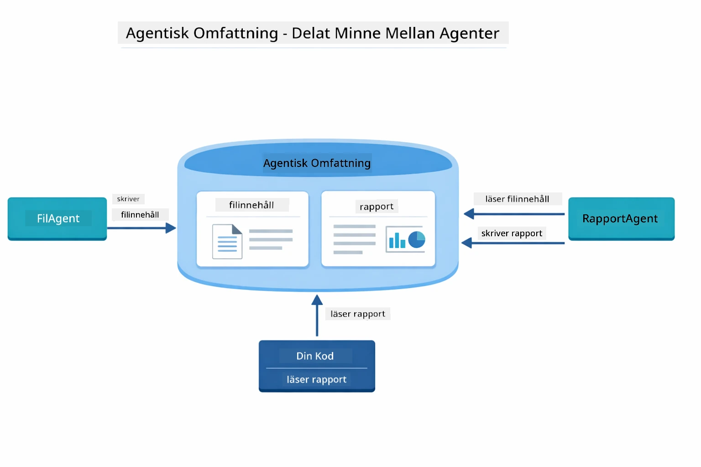

*Agentic Scope fungerar som delat minne — FileAgent skriver `fileContent`, ReportAgent läser det och skriver `report`, och din kod läser det slutgiltiga resultatet.*

```java
ResultWithAgenticScope<String> result = supervisor.invokeWithAgenticScope(request);
AgenticScope scope = result.agenticScope();
String fileContent = scope.readState("fileContent");  // Rådata från FileAgent
String report = scope.readState("report");            // Strukturerad rapport från ReportAgent
```

**Agent Listeners** möjliggör övervakning och felsökning av agentkörning. Den steg-för-steg-utdata du ser i demon kommer från en AgentListener som kopplar in sig i varje agentanrop:
- **beforeAgentInvocation** - Anropas när Supervisor väljer en agent, vilket låter dig se vilken agent som valdes och varför
- **afterAgentInvocation** - Anropas när en agent slutför, och visar dess resultat
- **inheritedBySubagents** - När sant, övervakar lyssnaren alla agenter i hierarkin

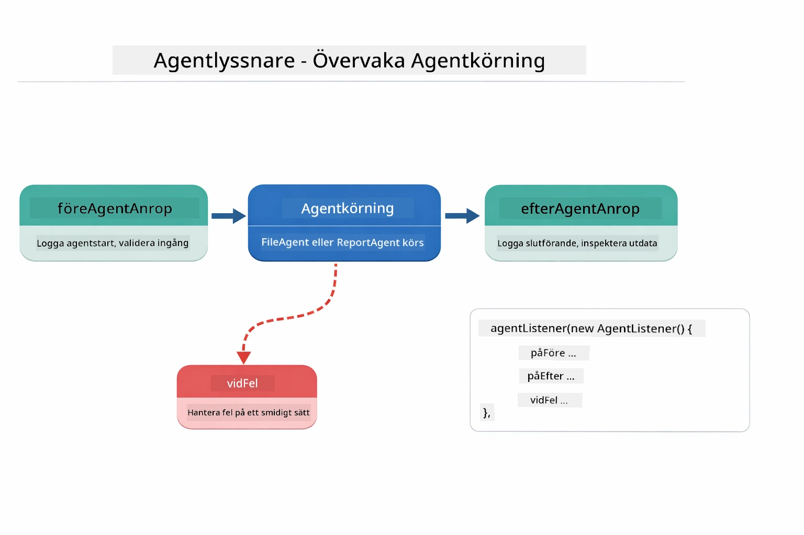

*Agent Listeners kopplar in i exekveringslivscykeln — övervakar när agenter startar, slutför eller stöter på fel.*

```java
AgentListener monitor = new AgentListener() {
    private int step = 0;
    
    @Override
    public void beforeAgentInvocation(AgentRequest request) {
        step++;
        System.out.println("  +-- STEP " + step + ": " + request.agentName());
    }
    
    @Override
    public void afterAgentInvocation(AgentResponse response) {
        System.out.println("  +-- [OK] " + response.agentName() + " completed");
    }
    
    @Override
    public boolean inheritedBySubagents() {
        return true; // Sprid till alla underagenter
    }
};
```

Utöver Supervisor-mönstret tillhandahåller `langchain4j-agentic` modulen flera kraftfulla arbetsflödesmönster och funktioner:

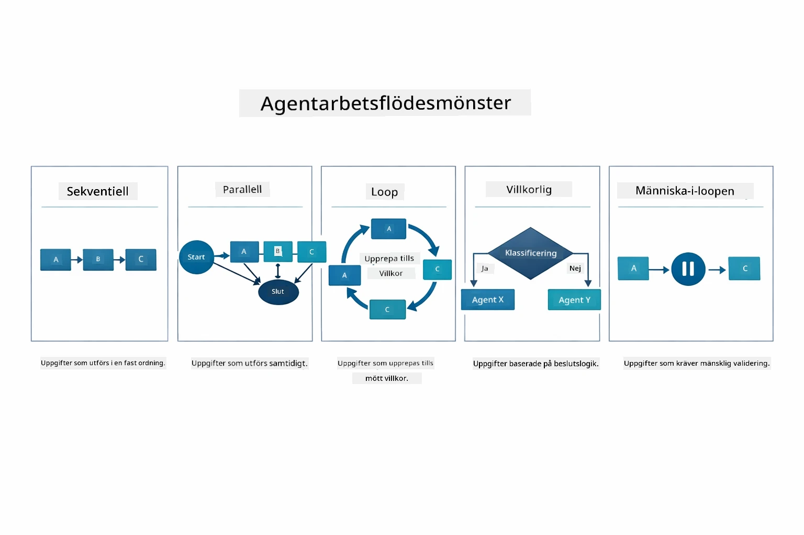

*Fem arbetsflödesmönster för att orkestrera agenter — från enkla sekventiella pipelines till godkännandeflöden med mänsklig inblandning.*

| Pattern | Beskrivning | Användningsfall |
|---------|-------------|-----------------|
| **Sequential** | Kör agenter i ordning, utdata flyter till nästa | Pipelines: undersök → analysera → rapportera |
| **Parallel** | Kör agenter samtidigt | Oberoende uppgifter: väder + nyheter + aktier |
| **Loop** | Iterera tills villkor uppfylls | Kvalitetspoängsättning: förbättra tills poäng ≥ 0.8 |
| **Conditional** | Rutta baserat på villkor | Klassificera → rutta till specialistagent |
| **Human-in-the-Loop** | Lägg till kontrollpunkter för människa | Godkännandeflöden, innehållsgranskning |

## Nyckelbegrepp

Nu när du har utforskat MCP och agentic-modulen i praktiken, låt oss sammanfatta när du ska använda varje metod.

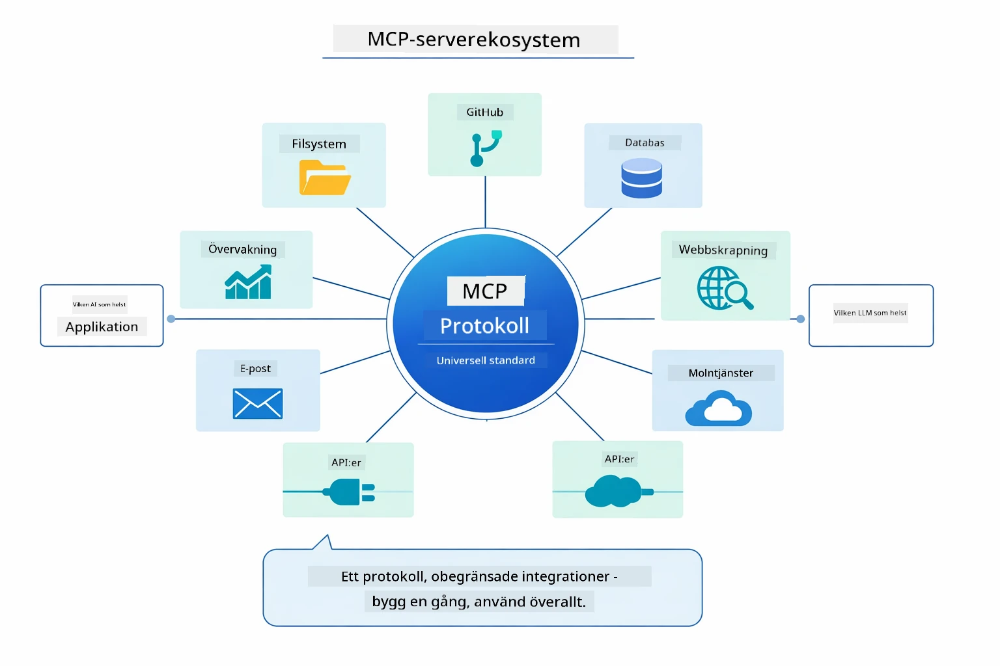

*MCP skapar ett universellt protokollekosystem — vilken MCP-kompatibel server som helst fungerar med vilken MCP-kompatibel klient som helst, vilket möjliggör delning av verktyg mellan applikationer.*

**MCP** är idealiskt när du vill utnyttja befintliga verktygsekosystem, skapa verktyg som flera applikationer kan dela, integrera tredjepartstjänster med standardprotokoll eller byta ut verktygsimplementationer utan att ändra kod.

**Agentic-modulen** fungerar bäst när du vill ha deklarativa agentdefinitioner med `@Agent`-annoteringar, behöver arbetsflödesorkestrering (sekventiell, loop, parallell), föredrar gränssnittsbaserad agentdesign framför imperativ kod, eller kombinerar flera agenter som delar utdata via `outputKey`.

**Supervisor Agent-mönstret** är bäst när arbetsflödet inte är förutsägbart i förväg och du vill att LLM ska besluta, när du har flera specialiserade agenter som behöver dynamisk orkestrering, när du bygger konversationssystem som ruttar till olika funktioner, eller när du vill ha det mest flexibla, adaptiva agentbeteendet.

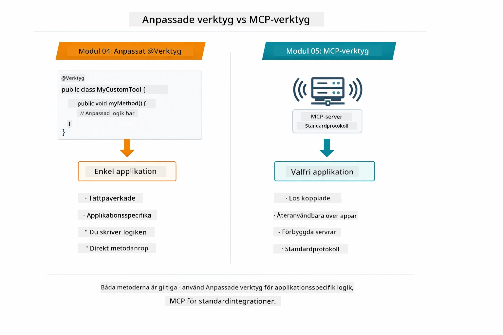

*När du ska använda egna @Tool-metoder vs MCP-verktyg — egna verktyg för app-specifik logik med full typkontroll, MCP-verktyg för standardiserade integrationer som fungerar över applikationer.*

## Grattis!

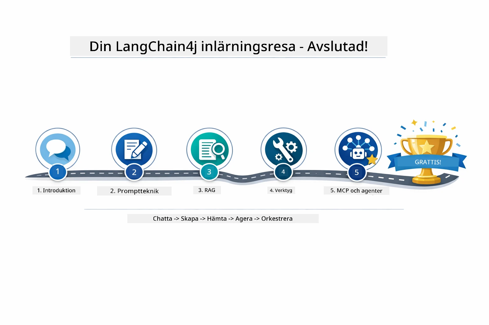

*Din läranderesa genom alla fem moduler — från grundläggande chatt till MCP-drivna agentiska system.*

Du har slutfört LangChain4j for Beginners-kursen. Du har lärt dig:

- Hur man bygger konversations-AI med minne (Modul 01)
- Prompt engineering-mönster för olika uppgifter (Modul 02)
- Att grundlägga svar i dina dokument med RAG (Modul 03)
- Att skapa grundläggande AI-agenter (assistenter) med egna verktyg (Modul 04)
- Att integrera standardiserade verktyg med LangChain4j MCP och Agentic-modulerna (Modul 05)

### Vad händer härnäst?

Efter att ha slutfört modulerna, utforska [Testing Guide](../docs/TESTING.md) för att se LangChain4j testkoncept i praktiken.

**Officiella resurser:**
- [LangChain4j Documentation](https://docs.langchain4j.dev/) - Omfattande guider och API-referens
- [LangChain4j GitHub](https://github.com/langchain4j/langchain4j) - Källkod och exempel
- [LangChain4j Tutorials](https://docs.langchain4j.dev/tutorials/) - Steg-för-steg tutorials för olika användningsfall

Tack för att du genomförde denna kurs!

---

**Navigation:** [← Föregående: Modul 04 - Verktyg](../04-tools/README.md) | [Tillbaka till Huvud](../README.md)

---

<!-- CO-OP TRANSLATOR DISCLAIMER START -->
**Ansvarsfriskrivning**:
Detta dokument har översatts med hjälp av AI-översättningstjänsten [Co-op Translator](https://github.com/Azure/co-op-translator). Även om vi strävar efter noggrannhet, var vänlig observera att automatiska översättningar kan innehålla fel eller brister. Det ursprungliga dokumentet på dess modersmål ska betraktas som den auktoritativa källan. För kritisk information rekommenderas professionell mänsklig översättning. Vi ansvarar inte för några missförstånd eller feltolkningar som uppstår till följd av användningen av denna översättning.
<!-- CO-OP TRANSLATOR DISCLAIMER END -->