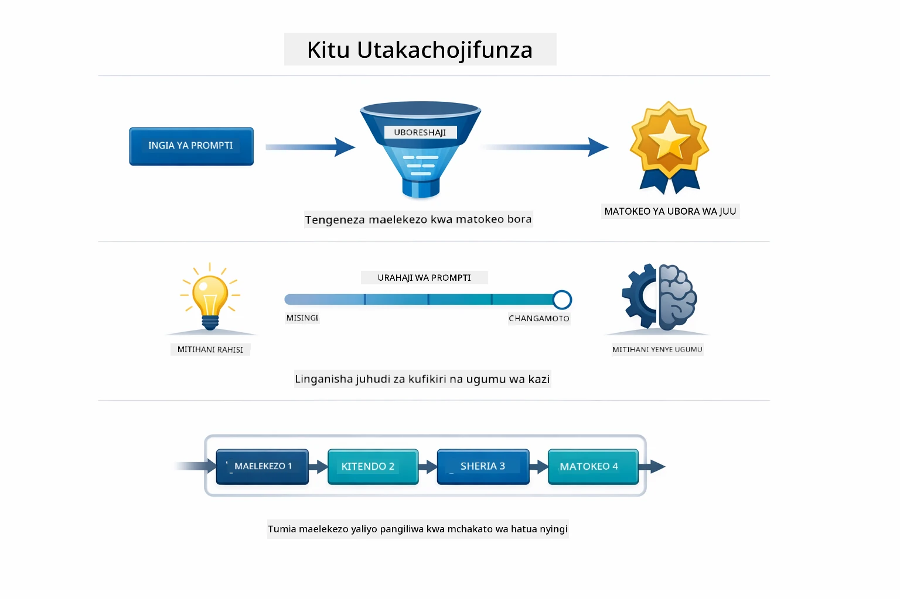
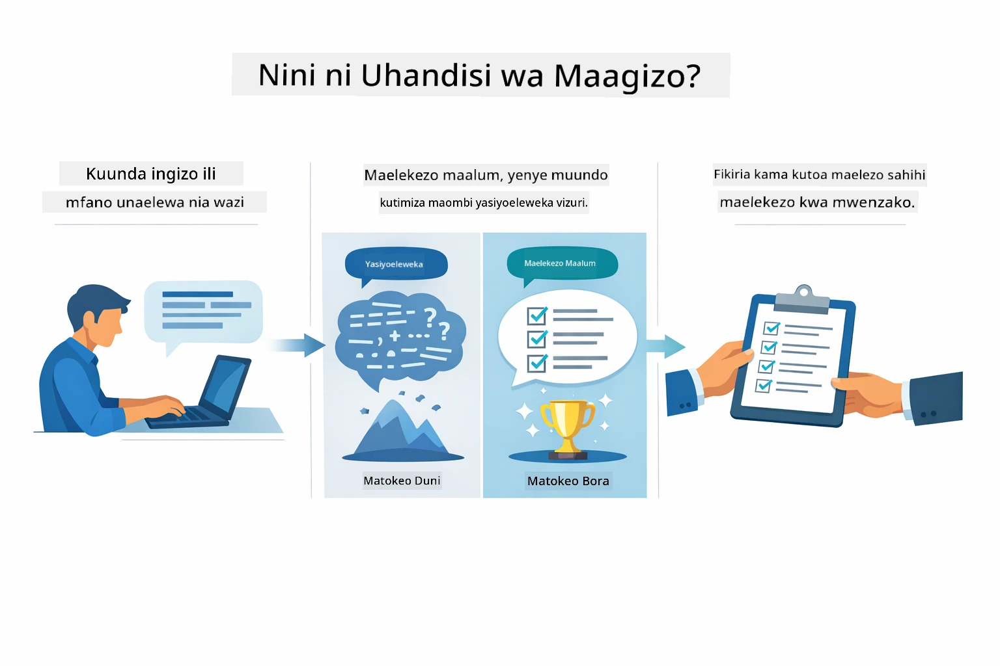
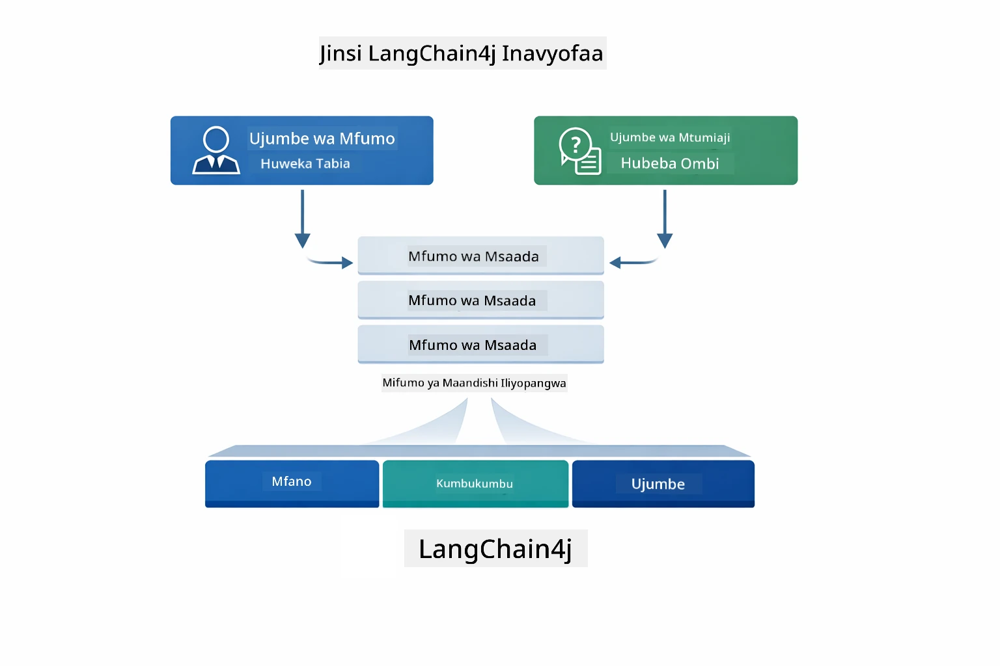
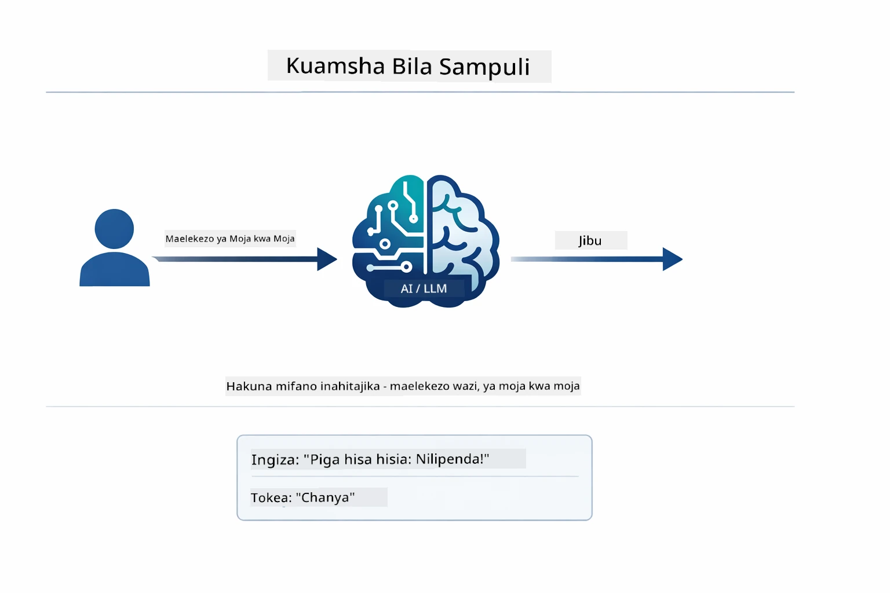
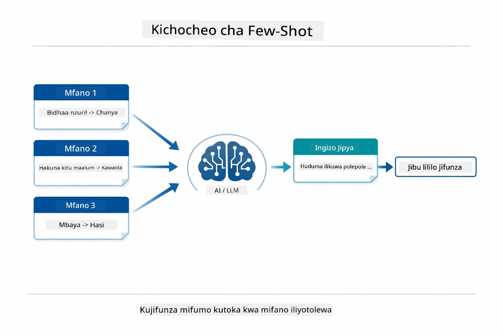
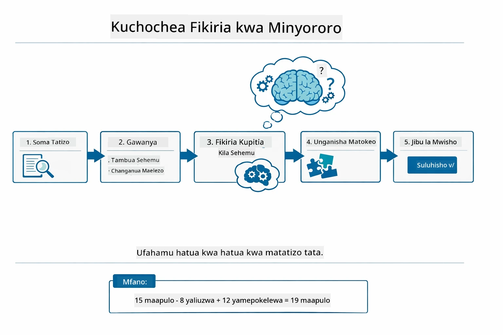
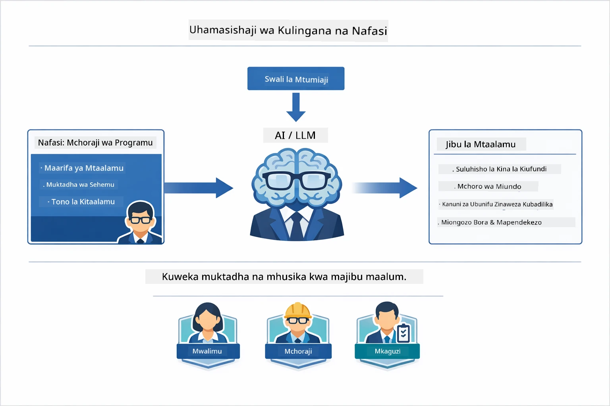
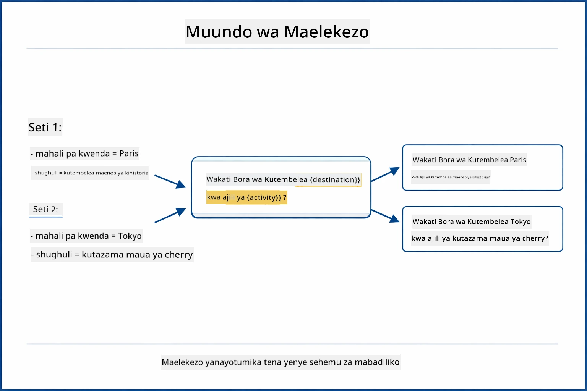
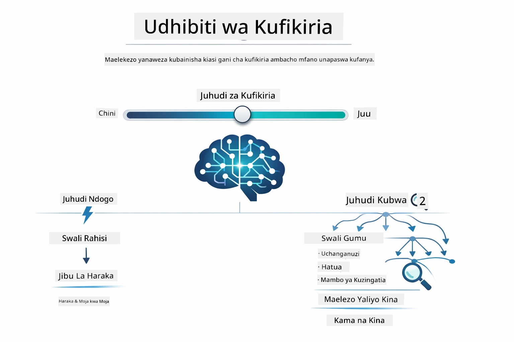

# Moduli 02: Uhandisi wa Prompt na GPT-5.2

## Jedwali la Maudhui

- [Utajifunza Nini](../../../02-prompt-engineering)
- [Yonajili Inayohitajika](../../../02-prompt-engineering)
- [Kuelewa Uhandisi wa Prompt](../../../02-prompt-engineering)
- [Misingi ya Uhandisi wa Prompt](../../../02-prompt-engineering)
  - [Zero-Shot Prompting](../../../02-prompt-engineering)
  - [Few-Shot Prompting](../../../02-prompt-engineering)
  - [Chain of Thought](../../../02-prompt-engineering)
  - [Role-Based Prompting](../../../02-prompt-engineering)
  - [Prompt Templates](../../../02-prompt-engineering)
- [Mifumo ya Juu zaidi](../../../02-prompt-engineering)
- [Kutumia Rasilimali zilizopo za Azure](../../../02-prompt-engineering)
- [Picha za Skrini za Programu](../../../02-prompt-engineering)
- [Kuchunguza Mifumo](../../../02-prompt-engineering)
  - [Ushindani mdogo dhidi ya Ushindani mkubwa](../../../02-prompt-engineering)
  - [Utekelezaji wa Kazi (Utangulizi wa Vifaa)](../../../02-prompt-engineering)
  - [Msimbo wa Kujitathmini](../../../02-prompt-engineering)
  - [Uchambuzi ulioandaliwa](../../../02-prompt-engineering)
  - [Zungumza nyingi-mara](../../../02-prompt-engineering)
  - [Ufikiri Hatua kwa Hatua](../../../02-prompt-engineering)
  - [Matokeo yaliyozuiliwa](../../../02-prompt-engineering)
- [Unajifunza Kifanyacho](../../../02-prompt-engineering)
- [Hatua Zifuatazo](../../../02-prompt-engineering)

## Utajifunza Nini



Kwenye moduli iliyopita, uliona jinsi kumbukumbu inavyorahisisha AI ya mazungumzo na kutumia Models za GitHub kwa maingiliano ya msingi. Sasa tutazingatia jinsi unavyojiuliza maswali — maelekezo yenyewe — kwa kutumia GPT-5.2 ya Azure OpenAI. Jinsi unavyoandaa maelekezo yako huathiri sana ubora wa majibu unayopata. Tunaanzia kwa kupitia mbinu za msingi za kuunda maelekezo, kisha tunaingia kwenye mifumo nane ya juu inayotumia kikamilifu uwezo wa GPT-5.2.

Tutatumia GPT-5.2 kwa sababu inaleta udhibiti wa uelewa — unaweza kusema modeli ni jinsi gani ya kufikiri kabla ya kujibu. Hii inafanya mbinu tofauti za kuprompt kuwa za wazi zaidi na inakusaidia kuelewa lini kutumia kila mbinu. Pia tunafaidika na mipaka midogo ya kiwango cha matumizi (rate limits) ya GPT-5.2 ikilinganishwa na Models za GitHub.

## Yonajili Inayohitajika

- Kumaliza Moduli 01 (Rasilimali za Azure OpenAI zilizowekwa)
- Faili `.env` katika saraka kuu yenye cheti cha Azure (ilizoundwa na `azd up` katika Moduli 01)

> **Kumbuka:** Ikiwa bado hujakamilisha Moduli 01, fuata maelekezo ya usambazaji hapo mwanzo kwanza.

## Kuelewa Uhandisi wa Prompt



Uhandisi wa prompt ni kuhusu kubuni maandishi ya kuingiza ambayo huwa yanakuletea matokeo unayohitaji kila mara. Siyo tu kuuliza maswali - ni kuhusu kupanga maombi ili modeli ielewe hasa unachotaka na jinsi ya kuyatoa.

Fikiria kama unamwelekeza mfanyakazi mwenzako. "Tengeneza kasoro" ni isiyoeleweka. "Tengeneza kasoro ya null pointer kwenye UserService.java mstari wa 45 kwa kuongeza ukaguzi wa null" ni maalum. Models za lugha zinafanya vivyo hivyo - umakini na muundo ni muhimu.



LangChain4j hutoa miundombinu — muunganisho wa modeli, kumbukumbu, na aina za ujumbe — wakati mifumo ya prompt ni maandishi yaliyopangwa kwa uangalifu unayotuma kupitia miundombinu hiyo. Vitu muhimu ni `SystemMessage` (inayoamua tabia na nafasi ya AI) na `UserMessage` (inayoleta ombi lako halisi).

## Misingi ya Uhandisi wa Prompt


Kabla ya kuingia katika mifumo ya juu zaidi katika moduli hii, tuchunguze mbinu tano za msingi za kuunda maelekezo. Hizi ni nguzo za uhandisi wa maelekezo yoyote. Ikiwa umefanya kazi kwenye [moduli ya Msingi ya Haraka](../00-quick-start/README.md#2-prompt-patterns), umeona hizi zikifanyakazi — hapa kuna muundo wa dhana nyuma yake.

### Zero-Shot Prompting

Njia rahisi kabisa: impa modeli maelekezo moja kwa moja bila mifano. Modeli hutegemea mafunzo yake yote kuelewa na kutekeleza kazi. Hii inafaa kwa maombi rahisi ambapo tabia inayotarajiwa ni wazi.



*Maelekezo ya moja kwa moja bila mifano — modeli hudokeza kazi kutokana na maelekezo pekee*

```java
String prompt = "Classify this sentiment: 'I absolutely loved the movie!'";
String response = model.chat(prompt);
// Jibu: "Chanya"
```

**Lini utumie:** Uainishaji rahisi, maswali ya moja kwa moja, tafsiri, au kazi yoyote modeli inaweza kushughulikia bila mwongozo zaidi.

### Few-Shot Prompting

Toa mifano inayoonesha muundo unayotaka modeli ifuate. Modeli hujifunza muundo wa ingizo-mwisho kutoka kwa mifano yako na kutumia kwenye ingizo jipya. Hii huongeza muafaka kwa kazi ambazo muundo au tabia inayotakiwa si dhahiri.



*Kujifunza kutoka kwa mifano — modeli hutambua muundo na kuutumia kwenye ingizo jipya*

```java
String prompt = """
    Classify the sentiment as positive, negative, or neutral.
    
    Examples:
    Text: "This product exceeded my expectations!" → Positive
    Text: "It's okay, nothing special." → Neutral
    Text: "Waste of money, very disappointed." → Negative
    
    Now classify this:
    Text: "Best purchase I've made all year!"
    """;
String response = model.chat(prompt);
```

**Lini utumie:** Uainishaji wa kipekee, uundaji wa format unaoendelea, kazi za nyanja maalum, au wakati matokeo ya zero-shot hayaendi sawa.

### Chain of Thought

Muulize modeli ionyeshe uelewa wake hatua kwa hatua. Badala ya kuruka moja kwa moja kwenye jibu, modeli huvunjavunjua tatizo na kufanyia kila sehemu kazi kwa uwazi. Hii huongeza usahihi kwa hesabu, mantiki, na kazi za uelewa wa hatua nyingi.



*Ufikiriaji hatua kwa hatua — kuvunjavunjua matatizo magumu katika hatua za mantiki wazi*

```java
String prompt = """
    Problem: A store has 15 apples. They sell 8 apples and then 
    receive a shipment of 12 more apples. How many apples do they have now?
    
    Let's solve this step-by-step:
    """;
String response = model.chat(prompt);
// Mfano unaonyesha: 15 - 8 = 7, kisha 7 + 12 = 19 tufaha
```

**Lini utumie:** Matatizo ya hesabu, fumbo za mantiki, utatuaji kasoro, au kazi yoyote ambayo kuonyesha jinsi ya kufikiria huongeza usahihi na kuaminika.

### Role-Based Prompting

Weka persona au nafasi kwa AI kabla ya kuuliza swali lako. Hii hutoa muktadha unaobadilisha mtindo, kina, na umakini wa jibu. "Mbunifu programu" hutoa ushauri tofauti kuliko "mwanafunzi mtaji" au "mkaguzi wa usalama".



*Kuweka muktadha na persona — swali lile linapata jibu tofauti kulingana na nafasi iliyowekwa*

```java
String prompt = """
    You are an experienced software architect reviewing code.
    Provide a brief code review for this function:
    
    def calculate_total(items):
        total = 0
        for item in items:
            total = total + item['price']
        return total
    """;
String response = model.chat(prompt);
```

**Lini utumie:** Uhakiki wa msimbo, kufundisha, uchambuzi wa nyanja maalum, au wakati unahitaji majibu yaliyoandaliwa kwa kiwango maalum cha utaalamu au mtazamo.

### Prompt Templates

Tengeneza maelekezo yanayoweza kutumika tena yenye sehemu zinazobadilika. Badala ya kuandika prompt mpya kila mara, andaa template mara moja na jaza thamani tofauti. Darasa la LangChain4j `PromptTemplate` hufanya hili kuwa rahisi kwa sintaksia ya `{{variable}}`.



*Maelekezo yanayotumika tena yenye sehemu zinazobadilika — template moja, matumizi mengi*

```java
PromptTemplate template = PromptTemplate.from(
    "What's the best time to visit {{destination}} for {{activity}}?"
);

Prompt prompt = template.apply(Map.of(
    "destination", "Paris",
    "activity", "sightseeing"
));

String response = model.chat(prompt.text());
```

**Lini utumie:** Maswali yanayorudiwa yenye ingizo tofauti, usindikaji wa kundi, kujenga mtiririko wa AI unaoweza kutumika tena, au hali yoyote ambapo muundo wa prompt haukubadiliki lakini data hubadilika.

---

Misingi hii mitano inakupa zana imara kwa kazi nyingi za kuunda maelekezo. Mengine ya moduli hii yanajengwa juu yake kwa **mifumo nane ya juu** inayotumia udhibiti wa uelewa wa GPT-5.2, kujitathmini mwenyewe, na uwezo wa kutoa matokeo yaliyopangwa.

## Mifumo ya Juu zaidi

Baada ya msingi, hebu tuende kwenye mifumo nane ya juu inayofanya moduli hii iwe ya kipekee. Sio matatizo yote yanahitaji mbinu ile ile. Baadhi ya maswali yanahitaji majibu ya haraka, mengine yanahitaji fikiria kwa kina. Baadhi yanahitaji dalili za uelewa wazi, wengine wanahitaji matokeo tu. Kila mfumo hapa chini umeboreshwa kwa hali tofauti — na udhibiti wa uelewa wa GPT-5.2 hufanya tofauti hizi kuwa dhahiri zaidi.


*Muhtasari wa mifumo nane ya uhandisi wa prompt na matumizi yao*



*Udhibiti wa uelewa wa GPT-5.2 unakuwezesha kubainisha kiasi cha kufikiri modeli inapaswa kufanya — kutoka majibu ya haraka hadi uchunguzi wa kina*


*Shauku ya chini (haraka, ya moja kwa moja) dhidi ya shauku ya juu (ya kina, ya uchunguzi) mbinu za uelewa*

**Shauku ya Chini (Haraka & Ikiwa Mwelekeo)** - Kwa maswali rahisi ambapo unataka majibu ya haraka, ya moja kwa moja. Modeli hufanya uelewa mdogo - hatua 2 kwa kiwango cha juu. Tumia hii kwa mahesabu, utafutaji, au maswali rahisi.

```java
String prompt = """
    <context_gathering>
    - Search depth: very low
    - Bias strongly towards providing a correct answer as quickly as possible
    - Usually, this means an absolute maximum of 2 reasoning steps
    - If you think you need more time, state what you know and what's uncertain
    </context_gathering>
    
    Problem: What is 15% of 200?
    
    Provide your answer:
    """;

String response = chatModel.chat(prompt);
```

> 💡 **Chunguza na GitHub Copilot:** Fungua [`Gpt5PromptService.java`](../../../02-prompt-engineering/src/main/java/com/example/langchain4j/prompts/service/Gpt5PromptService.java) na uliza:
> - "Nini tofauti kati ya mifumo ya prompt ya shauku ya chini na ya juu?"
> - "Je, vitambulisho vya XML katika maelekezo husaidia vipi kupanga majibu ya AI?"
> - "Lini ninapaswa kutumia mifumo ya kujitathmini mwenyewe dhidi ya maelekezo ya moja kwa moja?"

**Shauku ya Juu (Ya Kina & Kamili)** - Kwa matatizo magumu ambapo unataka uchambuzi mpana. Modeli huchunguza kwa kina na kuonyesha sababu za kina. Tumia hii kwa usanifu wa mfumo, maamuzi ya usanifu, au utafiti mgumu.

```java
String prompt = """
    Analyze this problem thoroughly and provide a comprehensive solution.
    Consider multiple approaches, trade-offs, and important details.
    Show your analysis and reasoning in your response.
    
    Problem: Design a caching strategy for a high-traffic REST API.
    """;

String response = chatModel.chat(prompt);
```

**Utekelezaji wa Kazi (Maendeleo Hatua kwa Hatua)** - Kwa mtiririko wa kazi za hatua nyingi. Modeli hutoa mpango wa awali, huaelezea kila hatua anapofanya kazi, kisha hutoa muhtasari. Tumia hii kwa uhamisho, utekelezaji, au mchakato wowote wa hatua nyingi.

```java
String prompt = """
    <task_execution>
    1. First, briefly restate the user's goal in a friendly way
    
    2. Create a step-by-step plan:
       - List all steps needed
       - Identify potential challenges
       - Outline success criteria
    
    3. Execute each step:
       - Narrate what you're doing
       - Show progress clearly
       - Handle any issues that arise
    
    4. Summarize:
       - What was completed
       - Any important notes
       - Next steps if applicable
    </task_execution>
    
    <tool_preambles>
    - Always begin by rephrasing the user's goal clearly
    - Outline your plan before executing
    - Narrate each step as you go
    - Finish with a distinct summary
    </tool_preambles>
    
    Task: Create a REST endpoint for user registration
    
    Begin execution:
    """;

String response = chatModel.chat(prompt);
```

Chain-of-Thought prompting huomba waziwazi modeli ionyeshe mchakato wake wa fikira, huongeza usahihi kwa kazi ngumu. Kuvunjavunjwa hatua kwa hatua husaidia wanadamu na AI kuelewa mantiki.

> **🤖 Jaribu na [GitHub Copilot](https://github.com/features/copilot) Chat:** Uliza kuhusu mfumo huu:
> - "Ningebadilishaje mfumo wa utekelezaji wa kazi kwa operesheni za muda mrefu?"
> - "Je, ni mbinu gani bora za kupanga utangulizi wa vifaa katika programu za uzalishaji?"
> - "Ninawezaje kunasa na kuonyesha taarifa za maendeleo za kati kwenye UI?"


*Mpango → Tekeleza → Muhtasari kwa kazi za hatua nyingi*

**Msimbo wa Kujitathmini** - Kwa kuunda msimbo wa ubora wa uzalishaji. Modeli huunda msimbo ukifuata viwango vya uzalishaji na kushughulikia makosa vizuri. Tumia hii unapotengeneza vipengele vipya au huduma.

```java
String prompt = """
    Generate Java code with production-quality standards: Create an email validation service
    Keep it simple and include basic error handling.
    """;

String response = chatModel.chat(prompt);
```


*Mzunguko wa kuboresha hatua kwa hatua - tengeneza, tathmini, tambua matatizo, boresha, rudia*

**Uchambuzi ulioandaliwa** - Kwa tathmini inayofanana. Modeli hupitia msimbo kwa kutumia mfumo thabiti (usahihi, mbinu, utendaji, usalama, urahisi wa matengenezo). Tumia hii kwa uhakiki wa msimbo au tathmini za ubora.

```java
String prompt = """
    <analysis_framework>
    You are an expert code reviewer. Analyze the code for:
    
    1. Correctness
       - Does it work as intended?
       - Are there logical errors?
    
    2. Best Practices
       - Follows language conventions?
       - Appropriate design patterns?
    
    3. Performance
       - Any inefficiencies?
       - Scalability concerns?
    
    4. Security
       - Potential vulnerabilities?
       - Input validation?
    
    5. Maintainability
       - Code clarity?
       - Documentation?
    
    <output_format>
    Provide your analysis in this structure:
    - Summary: One-sentence overall assessment
    - Strengths: 2-3 positive points
    - Issues: List any problems found with severity (High/Medium/Low)
    - Recommendations: Specific improvements
    </output_format>
    </analysis_framework>
    
    Code to analyze:
    ```
    public List getUsers() {
        return database.query("SELECT * FROM users");
    }
    ```
    Provide your structured analysis:
    """;

String response = chatModel.chat(prompt);
```

> **🤖 Jaribu na [GitHub Copilot](https://github.com/features/copilot) Chat:** Uliza kuhusu uchambuzi ulioandaliwa:
> - "Ninawezaje kubadilisha mfumo wa uchambuzi kwa aina tofauti za uhakiki wa msimbo?"
> - "Njia bora ya kutafsiri na kutekeleza matokeo yaliyopangwa programmatically ni gani?"
> - "Ninawezaje kuhakikisha viwango vya uzito vinafanana katika vikao tofauti vya ukaguzi?"


*Mfumo wa uhakiki wa msimbo kwa viwango vya uzito vinavyolingana*

**Zungumza nyingi-mara** - Kwa mazungumzo yanayohitaji muktadha. Modeli inakumbuka ujumbe wa awali na kujenga juu yake. Tumia hii kwa vikao vya msaada wa mwingiliano au maswali na majibu magumu.

```java
ChatMemory memory = MessageWindowChatMemory.withMaxMessages(10);

memory.add(UserMessage.from("What is Spring Boot?"));
AiMessage aiMessage1 = chatModel.chat(memory.messages()).aiMessage();
memory.add(aiMessage1);

memory.add(UserMessage.from("Show me an example"));
AiMessage aiMessage2 = chatModel.chat(memory.messages()).aiMessage();
memory.add(aiMessage2);
```


*Jinsi muktadha wa mazungumzo hukusanywa kupitia mizunguko mingi hadi kufikia kikomo cha tokeni*

**Ufikiri Hatua kwa Hatua** - Kwa matatizo yanayohitaji mantiki inayoonekana. Modeli huonyesha sababu wazi kwa kila hatua. Tumia hii kwa matatizo ya hesabu, fumbo za mantiki, au unapotaka kuelewa mchakato wa kufikiria.

```java
String prompt = """
    <instruction>Show your reasoning step-by-step</instruction>
    
    If a train travels 120 km in 2 hours, then stops for 30 minutes,
    then travels another 90 km in 1.5 hours, what is the average speed
    for the entire journey including the stop?
    """;

String response = chatModel.chat(prompt);
```


*Kuvunjavunjua matatizo katika hatua za mantiki wazi*

**Matokeo yaliyozuiliwa** - Kwa majibu yenye mahitaji ya muundo maalum. Modeli hufuata kwa ukali sheria za muundo na urefu. Tumia hii kwa muhtasari au unapotaka muundo wa matokeo sahihi.

```java
String prompt = """
    <constraints>
    - Exactly 100 words
    - Bullet point format
    - Technical terms only
    </constraints>
    
    Summarize the key concepts of machine learning.
    """;

String response = chatModel.chat(prompt);
```


*Kulinda mahitaji maalum ya muundo, urefu, na mpangilio*

## Kutumia Rasilimali zilizopo za Azure

**Thibitisha usambazaji:**

Hakikisha faili `.env` ipo katika saraka kuu ikiwa na cheti cha Azure (kilichoundwa wakati wa Moduli 01):
```bash
cat ../.env  # Inapaswa kuonyesha AZURE_OPENAI_ENDPOINT, API_KEY, DEPLOYMENT
```

**Anzisha programu:**

> **Kumbuka:** Ikiwa tayari umeanzisha programu zote kwa kutumia `./start-all.sh` kutoka Moduli 01, moduli hii tayari inaendesha kwenye mlango 8083. Unaweza kuruka amri za kuanza hapa chini na kwenda moja kwa moja http://localhost:8083.

**Chaguo 1: Kutumia Spring Boot Dashboard (Inapendekezwa kwa watumiaji wa VS Code)**

Kila sehemu ya masanduku ya maendeleo inajumuisha kiendelezi cha Spring Boot Dashboard, kinachotoa kiolesura cha kuona kusimamia programu zote za Spring Boot. Unaweza kuiiona kwenye Baa ya Shughuli upande wa kushoto wa VS Code (tazama ikoni ya Spring Boot).
Kutoka kwenye Dashibodi ya Spring Boot, unaweza:
- Kuona programu zote za Spring Boot zilizopatikana katika mazingira ya kazi
- Anzisha/zimia programu kwa bonyeza moja tu
- Tazama kumbukumbu za programu kwa wakati halisi
- Fuata hali ya programu

Bonyeza kitufe cha kuanzisha kando ya "prompt-engineering" kuanzisha moduli hii, au anzisha moduli zote mara moja.


**Chaguo 2: Kutumia shell scripts**

Anzisha programu zote za wavuti (moduli 01-04):

**Bash:**
```bash
cd ..  # Kutoka kwenye saraka ya mzizi
./start-all.sh
```

**PowerShell:**
```powershell
cd ..  # Kutoka kwenye saraka ya mzizi
.\start-all.ps1
```

Au anzisha moduli hii tu:

**Bash:**
```bash
cd 02-prompt-engineering
./start.sh
```

**PowerShell:**
```powershell
cd 02-prompt-engineering
.\start.ps1
```

Scripts zote mbili hujaza moja kwa moja mabadiliko ya mazingira kutoka kwa faili `.env` ya mzizi na zitaunda JARs ikiwa hazipo.

> **Kumbuka:** Ikiwa unapendelea kujenga moduli zote kwa mikono kabla ya kuanzisha:
>
> **Bash:**
> ```bash
> cd ..  # Go to root directory
> mvn clean package -DskipTests
> ```
>
> **PowerShell:**
> ```powershell
> cd ..  # Go to root directory
> mvn clean package -DskipTests
> ```

Fungua http://localhost:8083 kwenye kivinjari chako.

**Kuzimia:**

**Bash:**
```bash
./stop.sh  # Moduli hii tu
# Au
cd .. && ./stop-all.sh  # Moduli zote
```

**PowerShell:**
```powershell
.\stop.ps1  # Huu moduli tu
# Au
cd ..; .\stop-all.ps1  # Moduli zote
```

## Picha za Programu


*Dashibodi kuu ikionyesha mifumo 8 ya uhandisi wa prompt pamoja na sifa zao na matumizi*

## Kuchunguza Mifumo

Kiolesura cha wavuti kinakuruhusu kujaribu mbinu tofauti za kuomba maelezo. Kila mfumo unatatua matatizo tofauti - jaribu kuona muktadha gani kila mbinu inazidi.

### Huwa Mchapakazi Kidogo vs Mchapakazi Mwenye Hamu Kubwa

Uliza swali rahisi kama "Asilimia 15 ya 200 ni kiasi gani?" ukitumia Hamu Kidogo. Utapata jibu la moja kwa moja, papo hapo. Sasa uliza jambo kigumu kama "Panga mkakati wa kuhifadhi data kwa API yenye trafiki nyingi" ukitumia Hamu Kubwa. Tazama jinsi mfano unavyopungua kasi na kutoa hoja kwa kina. Mfano ule ule, muundo ule ule wa swali - lakini prompt inaeleza kiwango cha kufikiri kinachotakiwa.


*Hesabu ya haraka kwa hoja ndogo kabisa*


*Mkakati wa kina wa kuhifadhi data (2.8MB)*

### Kutekeleza Kazi (Utangulizi wa Zana)

Mifumo ya hatua nyingi hupata faida kutokana na upangaji wa awali na maelezo ya maendeleo. Mfano unaelezea kile kitakachofanyika, unasimulia kila hatua, kisha hutoa muhtasari wa matokeo.


*Kutengeneza mwisho wa huduma ya REST kwa maelezo hatua kwa hatua (3.9MB)*

### Msimbo unaojitathmini

Jaribu "Tengeneza huduma ya uthibitishaji wa barua pepe". Badala ya kutengeneza msimbo na kuacha, mfano hutengeneza, kutathmini kwa vigezo vya ubora, kubainisha udhaifu, na kuboresha. Utaona ukirudia hadi msimbo ukidhi viwango vya uzalishaji.


*Huduma kamili ya uthibitishaji wa barua pepe (5.2MB)*

### Uchambuzi wa Muundo

Mapitio ya msimbo yanahitaji mifumo thabiti ya tathmini. Mfano huchambua msimbo kwa kutumia makundi ya kudumu (usalama, mazoea, utendaji, usalama) kwa viwango vya ukali.


*Mapitio ya msimbo yanayotegemea mfumo thabiti*

### Mazungumzo ya Mizunguko Mingi

Uliza "Spring Boot ni nini?" kisha mara moja fuata na "Nionyeshe mfano". Mfano unakumbuka swali lako la kwanza na kukupa mfano wa Spring Boot mahsusi. Bila kumbukumbu, swali la pili lingekuwa baya kueleweka.


*Uhifadhi wa muktadha kati ya maswali*

### Kueleza Hatua kwa Hatua

Chagua tatizo la hisabati na ulijaribu kwa Kueleza Hatua kwa Hatua na Hamu Kidogo. Hamu kidogo inakupa jibu moja kwa moja - haraka lakini gumu kuelewa. Kueleza hatua kwa hatua kunaonyesha kila hesabu na uamuzi.


*Tatizo la hisabati na hatua wazi*

### Matokeo Yaliyo Thibitika

Unapotaka muundo maalum au idadi ya maneno, mfumo huu hufanya yafuatwe kikamilifu. Jaribu kutengeneza muhtasari wenye maneno 100 kwa muundo wa pointi.


*Muhtasari wa mashine ya kujifunza ukidhibitiwa muundo*

## Kile Unachojifunza Kwa Kawaida

**Juhudi za Kuelewa Zinabadilisha Kila Kitu**

GPT-5.2 inakuwezesha kudhibiti juhudi za kompyuta kupitia maelekezo yako. Juhudi ndogo ina maana ya majibu ya haraka kwa uchunguzi mdogo. Juhudi kubwa ina maana mfano unachukua muda kufikiri kwa kina. Unajifunza kulinganisha juhudi na ugumu wa kazi - usipoteze muda kwa maswali rahisi, lakini usikimbilie maamuzi magumu.

**Muundo Huongoza Tabia**

Umeona alama za XML katika maelekezo? Sio mapambo. Mifano hufuata maelekezo yaliyopangwa kwa uhakika kuliko maandishi ya bure. Unapohitaji mchakato wa hatua nyingi au mantiki ngumu, muundo husaidia mfano kufuatilia anapoenda na kinachofuata.


*Mfuniko wa prompt iliyojaa sehemu zilizo wazi na mpangilio wa mtindo wa XML*

**Ubora Kupitia Kujitathmini**

Mifumo inayojitathmini hufanya vigezo vya ubora kuwa wazi. Badala ya kutegemea mfano "ufanye vizuri", unamwambia hasa maana ya "bora": mantiki sahihi, usimamizi wa makosa, utendaji, usalama. Mfano unaweza kujitathmini na kuboresha matokeo yake. Hii hubadilisha utengenezaji wa msimbo kuwa mchakato wa kuaminika.

**Muktadha Ni Mdogo**

Mazungumzo ya mizunguko mingi hufanya kazi kwa kujumuisha historia ya ujumbe kwa kila ombi. Lakini kuna kikomo - kila mfano una idadi ya tokeni inayoweza kushughulikiwa. Kadiri mazungumzo yanavyoongezeka, utahitaji mbinu za kuhifadhi muktadha unaofaa bila kufikia kikomo hicho. Moduli hii inaonyesha jinsi kumbukumbu inavyofanya kazi; baadaye utajifunza lini kufupisha, lini kusahau, na lini kurejesha.

## Hatua Zifuatazo

**Moduli Ifuatayo:** [03-rag - RAG (Uzalishaji Unaoungwa Mkono na Utafutaji)](../03-rag/README.md)

---

**Urambazaji:** [← Iliyopita: Moduli 01 - Utangulizi](../01-introduction/README.md) | [Rudi Kuu](../README.md) | [Ifuatayo: Moduli 03 - RAG →](../03-rag/README.md)

---

<!-- CO-OP TRANSLATOR DISCLAIMER START -->
**Tangazo La Kutotegemea**:
Nyaraka hii imetafsiriwa kwa kutumia huduma ya tafsiri ya AI [Co-op Translator](https://github.com/Azure/co-op-translator). Ingawa tunajitahidi kuhakikisha usahihi, tafadhali fahamu kwamba tafsiri za kiotomatiki zinaweza kuwa na makosa au kasoro. Nyaraka ya asili katika lugha yake ya mama inapaswa kuzingatiwa kama chanzo chenye mamlaka. Kwa taarifa muhimu, tafsiri ya kitaalamu kwa binadamu inapendekezwa. Hatutojibu kwa kutoelewana au tafsiri potofu zinazotokea kutokana na matumizi ya tafsiri hii.
<!-- CO-OP TRANSLATOR DISCLAIMER END -->