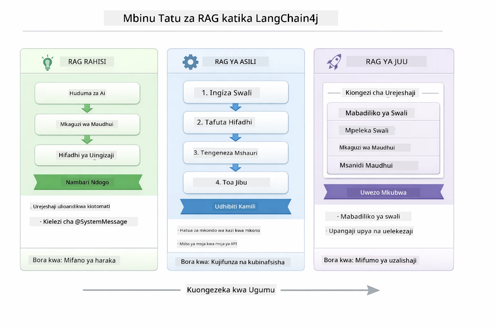
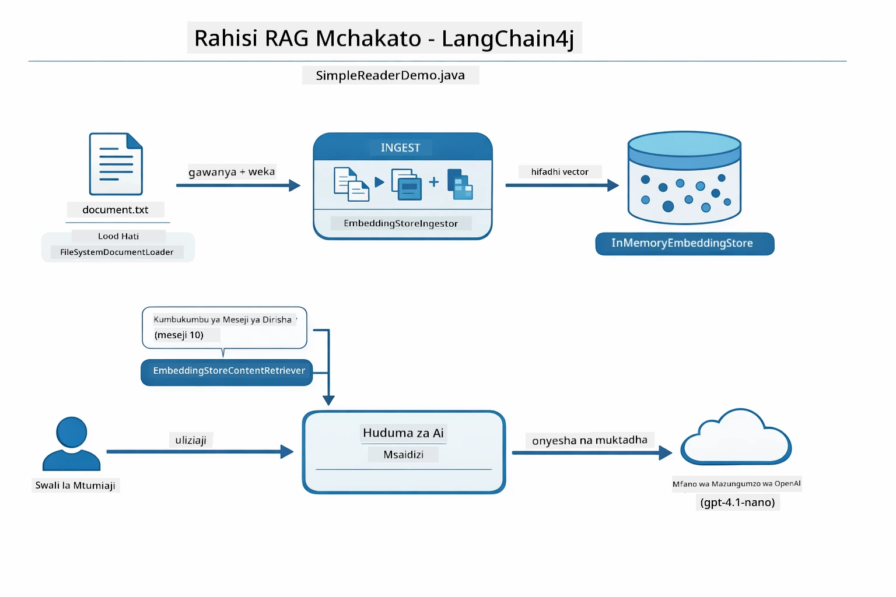
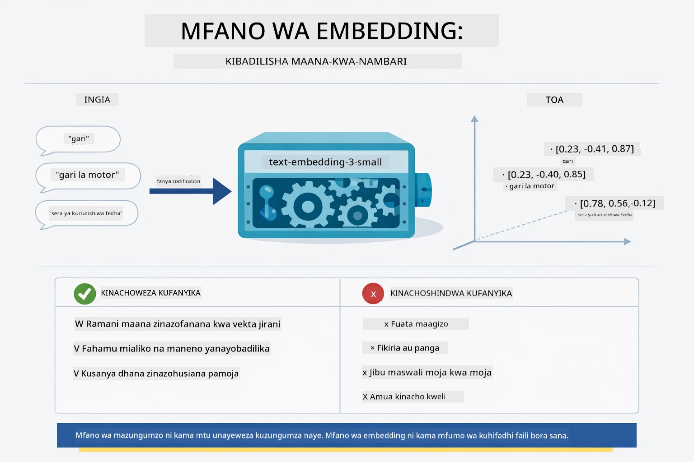
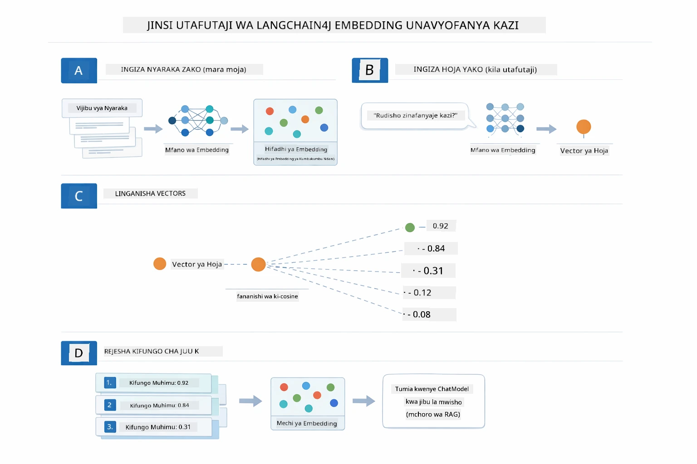
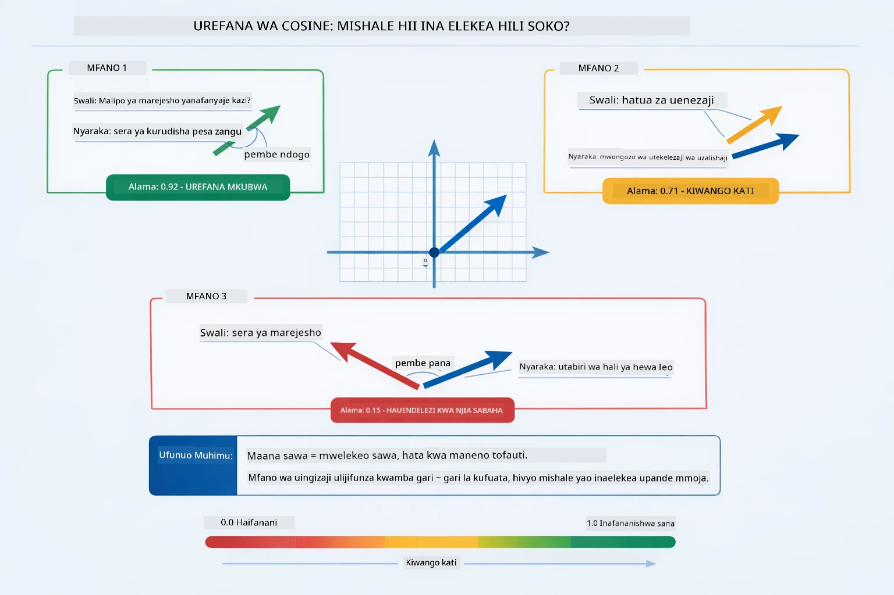
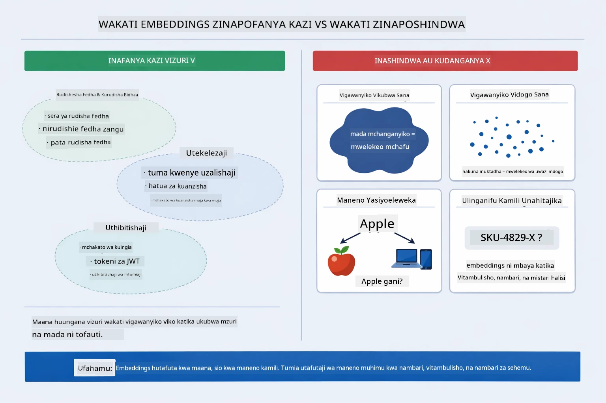

# Moduli 03: RAG (Uzalishaji Unaoungwa Mkono na Upataji)

## Jedwali la Maudhui

- [Video za Maelezo](../../../03-rag)
- [Utajifunza Nini](../../../03-rag)
- [Mahitaji ya Awali](../../../03-rag)
- [Kuelewa RAG](../../../03-rag)
  - [Ni Njia Gani ya RAG Inayotumika Katika Mafunzo Haya?](../../../03-rag)
- [Jinsi Inavyofanya Kazi](../../../03-rag)
  - [Usindikaji wa Hati](../../../03-rag)
  - [Kuumba Embeddings](../../../03-rag)
  - [Utafutaji wa Kisemi](../../../03-rag)
  - [Uzalishaji wa Majibu](../../../03-rag)
- [Endesha Programu](../../../03-rag)
- [Matumizi ya Programu](../../../03-rag)
  - [Pakia Hati](../../../03-rag)
  - [Uliza Maswali](../../../03-rag)
  - [Angalia Marejeleo ya Chanzo](../../../03-rag)
  - [Jaribu na Maswali](../../../03-rag)
- [Mafanikio Muhimu](../../../03-rag)
  - [Mikakati ya Kugawanya Vipande](../../../03-rag)
  - [Alama za Ulinganifu](../../../03-rag)
  - [Uhifadhi wa Kumbukumbu](../../../03-rag)
  - [Usimamizi wa Dirisha la Muktadha](../../../03-rag)
- [Wakati RAG Inapokuwa Muhimu](../../../03-rag)
- [Hatua Zinazofuata](../../../03-rag)

## Video za Maelezo

Tazama kikao hiki cha moja kwa moja kinachoelezea jinsi ya kuanza na moduli hii:

<a href="https://www.youtube.com/watch?v=_olq75ZH_eY"></a>

## Utajifunza Nini

Katika moduli zilizopita, ulijifunza jinsi ya kuzungumza na AI na kupanga maelekezo yako kwa ufanisi. Lakini kuna kikomo cha kimsingi: mifano ya lugha inajua tu kile walichojifunza wakati wa mafunzo. Haiwezi kujibu maswali kuhusu sera za kampuni yako, hati za mradi wako, au maelezo yoyote ambayo hayakufunzwa.

RAG (Uzalishaji Unaoungwa Mkono na Upataji) hutatua tatizo hili. Badala ya kujaribu kufundisha mfano maelezo yako (ambayo ni ghali na haziwezi kutekelezwa kwa urahisi), unampa uwezo wa kutafuta kupitia hati zako. Wakati mtu anauliza swali, mfumo hupata taarifa zinazofaa na kuzijumuisha kwenye maelekezo. Kisha mfano hujibu kulingana na muktadha uliopatikana.

Fikiria RAG kama kumpa mfano maktaba ya rejea. Unapouliza swali, mfumo:

1. **Swali la Mtumiaji** - Unauliza swali
2. **Embedding** - Hubadilisha swali lako kuwa vector
3. **Utafutaji wa Vector** - Hupata vipande vya hati vinavyofanana
4. **Ukusanyaji wa Muktadha** - Huongeza vipande vinavyofaa kwenye maelekezo
5. **Jibu** - LLM huzalisha jibu kulingana na muktadha

Hii huweka majibu ya mfano juu ya data yako halisi badala ya kutegemea maarifa ya mafunzo yake au kubuni majibu.

## Mahitaji ya Awali

- Kumaliza [Moduli 00 - Mwanzo wa Haraka](../00-quick-start/README.md) (kwa mfano wa RAG Rahisi unaotajwa baadaye katika moduli hii)
- Kumaliza [Moduli 01 - Utangulizi](../01-introduction/README.md) (Rasilimali za Azure OpenAI zimewezeshwa, ikiwa ni pamoja na mfano wa kuingiza `text-embedding-3-small`)
- Faili `.env` katika saraka kuu na vyeti vya Azure (vilivyoundwa na `azd up` katika Moduli 01)

> **Kumbuka:** Ikiwa hujamaliza Moduli 01, fuata maelekezo ya uwezeshaji huko kwanza. Amri `azd up` huweka mfano wa mazungumzo wa GPT na mfano wa kuingiza unaotumika katika moduli hii.

## Kuelewa RAG

Mchoro ulio hapa chini unaonyesha wazo kuu: badala ya kutegemea data za mafunzo za mfano pekee, RAG humsaidia na maktaba ya rejea ya hati zako za kushauriana kabla ya kuzalisha jibu kila mara.


*Mchoro huu unaonyesha tofauti kati ya LLM ya kawaida (inayokisia kwa kutumia data za mafunzo) na LLM iliyoongezwa RAG (inayoshirikiana na hati zako kwanza).*

Hapa ni jinsi vipande vinavyounganishwa mwisho hadi mwisho. Swali la mtumiaji hupitia hatua nne — kuingizwa, utafutaji wa vector, ukusanyaji wa muktadha, na uzalishaji wa jibu — kila moja likijenga juu ya ile iliyotangulia:


*Mchoro huu unaonyesha mpangilio wa RAG kutoka mwanzo hadi mwisho — swali la mtumiaji hupitia kuingizwa, utafutaji wa vector, ukusanyaji wa muktadha, na uzalishaji wa jibu.*

Sehemu zingine za moduli hii huenda hatua kwa hatua, kwa maelezo ya kina, na pamoja na msimbo unaoweza kuendesha na kuubadilisha.

### Ni Njia Gani ya RAG Inayotumika Katika Mafunzo Haya?

LangChain4j hutoa njia tatu za kutekeleza RAG, kila moja ikiwa na kiwango tofauti cha ujumuishaji. Mchoro ulio hapa chini unalinganisha njia hizo pande kwa pande:



*Mchoro huu unalinganisha njia tatu za RAG za LangChain4j — Rahisi, Asili, na Zaidi — unaonyesha vipengele muhimu na wakati wa kutumia kila moja.*

| Njia | Kinachofanya | Ushindani |
|---|---|---|
| **RAG Rahisi** | Huunganisha kila kitu moja kwa moja kupitia `AiServices` na `ContentRetriever`. Unachora interface, unambatanisha retriever, na LangChain4j hushughulikia kuingiza, kutafuta, na ukusanyaji wa maelekezo nyuma ya pazia. | Msimbo mdogo, lakini hauoni kinachotokea hatua kwa hatua. |
| **RAG ya Asili** | Unaita mfano wa kuingiza, unatafuta duka, unajenga maelekezo, na kuzalisha jibu mwenyewe — kila hatua wazi. | Msimbo mwingi, lakini kila hatua inaonekana na inaweza kubadilishwa. |
| **RAG ya Zaidi** | Inatumia mfumo wa `RetrievalAugmentor` wenye badilishaji za kuuliza, marubaini, wawekaji upya wa alama, na waingiza maudhui kwa mifumo ya uzalishaji wa kiwango cha juu. | Uwezo mkubwa zaidi, lakini changamoto kubwa. |

**Mafunzo haya yanatumia Njia ya Asili.** Kila hatua ya mtiririko wa RAG — kuingiza swali, kutafuta duka la vector, kukusanya muktadha, na kuzalisha jibu — umeandikwa wazi katika [`RagService.java`](../../../03-rag/src/main/java/com/example/langchain4j/rag/service/RagService.java). Hii ni kwa makusudi: kama rasilimali ya kujifunza, ni muhimu zaidi kuona na kuelewa kila hatua kuliko kupunguza msimbo. Ukijua vizuri jinsi vipande vinaunganishwa, unaweza kuhamia RAG Rahisi kwa majaribio ya haraka au RAG ya Zaidi kwa mifumo ya uzalishaji.

> **💡 Umewahi kuona RAG Rahisi ikifanya kazi?** Moduli ya [Mwanzo wa Haraka](../00-quick-start/README.md) ina mfano wa Maswali na Majibu ya Hati ([`SimpleReaderDemo.java`](../../../00-quick-start/src/main/java/com/example/langchain4j/quickstart/SimpleReaderDemo.java)) unaotumia njia ya RAG Rahisi — LangChain4j hushughulikia kuingiza, kutafuta, na ukusanyaji wa maelekezo moja kwa moja. Moduli hii inafuata hatua inayofuata kwa kufungua mtiririko huo ili uweze kuona na kudhibiti kila hatua mwenyewe.

Mchoro ulio hapa chini unaonyesha mtiririko wa RAG Rahisi kutoka kwa mfano wa Mwanzo wa Haraka. Angalia jinsi `AiServices` na `EmbeddingStoreContentRetriever` vinavyoficha ugumu wote — unapakia hati, unambatanisha retriever, na kupata majibu. Njia ya Asili katika moduli hii hufungua kila hatua zilizofichwa:



*Mchoro huu unaonyesha mtiririko wa RAG Rahisi kutoka `SimpleReaderDemo.java`. Linganisha na Njia ya Asili inayotumika katika moduli hii: RAG Rahisi huficha kuingiza, upataji, na ukusanyaji wa maelekezo nyuma ya `AiServices` na `ContentRetriever` — unapakia hati, unambatanisha retriever, na unapata majibu. Njia ya Asili katika moduli hii hufungua mtiririko huo ili wewe uite kila hatua (kuingiza, kutafuta, kukusanya muktadha, kuzalisha) mwenyewe, ikikupa uwazi kamili na udhibiti.*

## Jinsi Inavyofanya Kazi

Mtiririko wa RAG katika moduli hii unajumuisha hatua nne zinazofuatana kila wakati mtumiaji anapouliza swali. Kwanza, hati iliyopakuliwa inatafsiriwa na kugawanywa katika vipande vinavyoweza kusimamiwa. Vipande hivyo hubadilishwa kuwa embeddings za vector na kuhifadhiwa ili ziweze kulinganishwa kihisabati. Wakati swali linapokuja, mfumo unafanya utafutaji wa kisemi kupata vipande vinavyofaa, na hatimaye huvipitisha kama muktadha kwa LLM kwa ajili ya uzalishaji wa jibu. Sehemu zilizo hapa chini zinaelezea kila hatua kwa msimbo halisi na michoro. Hebu tuangalie hatua ya kwanza.

### Usindikaji wa Hati

[DocumentService.java](../../../03-rag/src/main/java/com/example/langchain4j/rag/service/DocumentService.java)

Unapopakua hati, mfumo huichambua (PDF au maandishi ya kawaida), huambatanisha metadata kama jina la faili, na kisha hugawanya kuwa vipande — vipande vidogo vinavyolingana vizuri na dirisha la muktadha la mfano. Vipande hivi vinafanana kidogo ili usipoteze muktadha kwenye mipaka.

```java
// Tafsiri faili lililopakiwa na lifunge katika Hati ya LangChain4j
Document document = Document.from(content, metadata);

// Gawanya katika vipande vya tokeni 300 na mgongano wa tokeni 30
DocumentSplitter splitter = DocumentSplitters
    .recursive(300, 30);

List<TextSegment> segments = splitter.split(document);
```

Mchoro ulio hapa chini unaonyesha jinsi hili linavyofanya kazi kwa picha. Angalia jinsi kila kipande kinashirikiana tokens na viungo vyake — kufanana kwa tokens 30 huhakikisha hakuna muktadha muhimu unaporejea pembeni:


*Mchoro huu unaonyesha hati ikigawanywa kuwa vipande vya token 300 vyenye kufanana kwa token 30, ikihifadhi muktadha katika mipaka ya vipande.*

> **🤖 Jaribu na [GitHub Copilot](https://github.com/features/copilot) Chat:** Fungua [`DocumentService.java`](../../../03-rag/src/main/java/com/example/langchain4j/rag/service/DocumentService.java) na uliza:
> - "Je, LangChain4j huigawanya hati vipande vipi na kwa nini kufanana ni muhimu?"
> - "Ni ukubwa gani sahihi wa kipande kwa aina tofauti za hati na kwa nini?"
> - "Nashughulikiaje hati kwa lugha nyingi au zenye muundo maalum?"

### Kuumba Embeddings

[LangChainRagConfig.java](../../../03-rag/src/main/java/com/example/langchain4j/rag/config/LangChainRagConfig.java)

Kipande kila kimebadilishwa kuwa maelezo ya nambari yanayoitwa embedding — kwa maana ni mfafanuzi wa maana kwenda kwa nambari. Mfano wa embedding si "mwerevu" kama vile mfano wa mazungumzo; hawezi kufuata maagizo, kutafakari, au kujibu maswali. Kinachoweza kufanya ni kuweka maandishi katika nafasi ya kihesabu ambapo maana zinazofanana ziko karibu — "gari" karibu na "magari," "sera ya kurejesha fedha" karibu na "rudisha fedha zangu." Fikiria mfano wa mazungumzo kama mtu unayemzungumza; mfano wa embedding ni mfumo bora wa kuhifadhi hati.

Mchoro ulio hapa chini unaonyesha dhana hii — maandishi yanaingia, vector wa nambari yanatoka, na maana zinazofanana hutoa vector za karibu:



*Mchoro huu unaonyesha jinsi mfano wa embedding hubadilisha maandishi kuwa vector za nambari, ukiweka maana zinazofanana — kama "gari" na "magari" — karibu katika nafasi ya vector.*

```java
@Bean
public EmbeddingModel embeddingModel() {
    return OpenAiOfficialEmbeddingModel.builder()
        .baseUrl(azureOpenAiEndpoint)
        .apiKey(azureOpenAiKey)
        .modelName(azureEmbeddingDeploymentName)
        .build();
}

EmbeddingStore<TextSegment> embeddingStore = 
    new InMemoryEmbeddingStore<>();
```

Mchoro wa darasa ulio hapa chini unaonyesha mtiririko miwili katika mtiririko wa RAG na madarasa ya LangChain4j yanayotekeleza. **Mtiririko wa ingizo** (unayotekeleza mara moja wakati wa upakiaji) hugawanya hati, huingiza vipande, na kuvitunza kupitia `.addAll()`. **Mtiririko wa swali** (unapotekelezwa kila mtu anapouliza) huingiza swali, hufanya utafutaji kwenye duka kupitia `.search()`, na hupitisha muktadha wanaoungana kwa mfano wa mazungumzo. Mitiririko yote hukutana kwenye kiolesura cha pamoja `EmbeddingStore<TextSegment>`:


*Mchoro huu unaonyesha mitiririko miwili katika mtiririko wa RAG — ingizo na swali — na jinsi vinavyounganishwa kupitia EmbeddingStore ya pamoja.*

Mara embeddings zinahifadhiwa, maudhui yanayolingana hujikusanya kiasili pamoja katika nafasi ya vector. Uonyeshaji hapa chini unaonyesha jinsi hati kuhusu mada zinazohusiana zinaishia kama pointi za karibu, ambacho ndicho kinachowezesha utafutaji wa kisemi:


*Uonyeshaji huu unaonyesha jinsi hati zinazohusiana hukusanyika pamoja katika nafasi ya vector ya 3D, na mada kama Hati za Kiufundi, Kanuni za Biashara, na Maswali ya Mara kwa Mara zikiwa vikundi tofauti.*

Mtumiaji anapofanya utafutaji, mfumo hufuata hatua nne: kuingiza hati mara moja, kuingiza swali kila utafutaji, kulinganisha vector ya swali na vector zote zilizo hapo duka kwa kutumia uwiano wa cosine, na kurudisha vipande vinavyoongoza kulingana na alama za juu. Mchoro hapa chini unaelezea kila hatua na madarasa ya LangChain4j yanayohusika:



*Mchoro huu unaonyesha mchakato wa hatua nne wa utafutaji wa embedding: kuingiza hati, kuingiza swali, kulinganisha vector kwa uwiano wa cosine, na kurudisha matokeo ya juu-K.*

### Utafutaji wa Kisemi

[RagService.java](../../../03-rag/src/main/java/com/example/langchain4j/rag/service/RagService.java)

Unapouliza swali, swali lako pia hubadilishwa kuwa embedding. Mfumo hulinganisha embedding ya swali lako na embeddings zote za vipande vya hati. Hupata vipande vyenye maana zinazofanana zaidi - sio tu maneno yanayolingana, bali maana halisi za mtu.

```java
Embedding queryEmbedding = embeddingModel.embed(question).content();

EmbeddingSearchRequest searchRequest = EmbeddingSearchRequest.builder()
    .queryEmbedding(queryEmbedding)
    .maxResults(5)
    .minScore(0.5)
    .build();

EmbeddingSearchResult<TextSegment> searchResult = embeddingStore.search(searchRequest);
List<EmbeddingMatch<TextSegment>> matches = searchResult.matches();

for (EmbeddingMatch<TextSegment> match : matches) {
    String relevantText = match.embedded().text();
    double score = match.score();
}
```

Mchoro hapa chini unaonyesha tofauti ya utafutaji wa kisemi na utafutaji wa neno kuu wa kawaida. Utafutaji wa neno kuu kwa "gari" haupati kipande kuhusu "magari na malori," lakini utafutaji wa kisemi unaelewa maana yao ni sawa na kurudisha kipande hicho kama chenye alama ya juu:


*Mchoro huu unalinganisha utafutaji wa maneno muhimu na utafutaji wa kisemi, unaoonyesha jinsi utafutaji wa kisemi unavyopata maudhui yanayohusiana kifikra hata maneno halisi yapotofautiana.*
Chini ya kifuniko, umafananisho hupimwa kwa kutumia umafananisho wa cosine — kwa msingi kuuliza "je, mishale hii miwili inaelekeana upande mmoja?" Vipande viwili vinaweza kutumia maneno tofauti kabisa, lakini kama zinamaanisha jambo kama hilo mihimili yao inaelekeana upande mmoja na hupata alama karibu na 1.0:



*Michoro hii inaonyesha umafananisho wa cosine kama pembe kati ya mihimili ya uingizaji — mihimili inayolingana zaidi hupata alama karibu na 1.0, ikionyesha umafananisho mkubwa wa maana.*

> **🤖 Jaribu na [GitHub Copilot](https://github.com/features/copilot) Chat:** Fungua [`RagService.java`](../../../03-rag/src/main/java/com/example/langchain4j/rag/service/RagService.java) na uliza:
> - "Utafutaji wa umafananisho hufanya kazi vipi na uingizaji na nini huchagua alama?"
> - "Kigezo gani cha umafananisho ninapaswa kutumia na kinaathirije matokeo?"
> - "Nashughulikiaje kesi ambapo hakuna nyaraka zinazohusiana zinazopatikana?"

### Uundaji wa Jibu

[RagService.java](../../../03-rag/src/main/java/com/example/langchain4j/rag/service/RagService.java)

Vipande vinavyofaa zaidi huunganishwa kuwa amri iliyopangwa inayojumuisha maagizo wazi, muktadha uliochukuliwa, na swali la mtumiaji. Mfano husoma vipande hivyo maalum na kujibu kulingana na taarifa hiyo — unaweza kutumia tu kilicho mbele yake, jambo ambalo linazuia kuibua habari isiyo ya kweli.

```java
String context = matches.stream()
    .map(match -> match.embedded().text())
    .collect(Collectors.joining("\n\n"));

String prompt = String.format("""
    Answer the question based on the following context.
    If the answer cannot be found in the context, say so.

    Context:
    %s

    Question: %s

    Answer:""", context, request.question());

String answer = chatModel.chat(prompt);
```

Michoro ifuatayo inaonyesha uunganishaji huu ukiwa kazini — vipande vinavyopata alama ya juu kutoka hatua ya utafutaji huingizwa ndani ya kiolezo cha amri, na `OpenAiOfficialChatModel` huunda jibu lililo na msingi:


*Michoro hii inaonyesha jinsi vipande vinavyopata alama ya juu vinavyojumuishwa kuwa amri iliyopangwa, ikiruhusu mfano kutoa jibu lenye msingi kutoka kwa data yako.*

## Endesha Programu

**Thibitisha usanidi:**

Hakikisha faili `.env` ipo katika saraka kuu na ina taarifa za sera za Azure (zilizoanzishwa wakati wa Moduli 01). Endesha kutoka kwenye saraka ya moduli (`03-rag/`):

**Bash:**
```bash
cat ../.env  # Inapaswa kuonyesha AZURE_OPENAI_ENDPOINT, API_KEY, DEPLOYMENT
```

**PowerShell:**
```powershell
Get-Content ..\.env  # Inapaswa kuonyesha AZURE_OPENAI_ENDPOINT, API_KEY, DEPLOYMENT
```

**Anzisha programu:**

> **Kumbuka:** Ikiwa tayari umeanza programu zote kwa kutumia `./start-all.sh` kutoka saraka kuu (kama ilivyoelezwa Moduli 01), moduli hii tayari inaendeshwa kwa bandari 8081. Unaweza kuruka amri za kuanzisha hapo chini na kwenda moja kwa moja http://localhost:8081.

**Chaguo la 1: Kutumia Spring Boot Dashboard (Inapendekezwa kwa watumiaji wa VS Code)**

Kontena ya maendeleo ina nyongeza ya Spring Boot Dashboard, inayotoa kiolesura cha kuona na kudhibiti programu zote za Spring Boot. Unaweza kuipata kwenye Ukurasa wa Shughuli upande wa kushoto wa VS Code (angalia ikoni ya Spring Boot).

Kutoka Spring Boot Dashboard, unaweza:
- Kuona programu zote za Spring Boot zinazopatikana katika eneo la kazi
- Anzisha/zuia programu kwa kubofya mara moja
- Tazama kumbukumbu za programu kwa wakati halisi
- Fuata hali ya programu

Bofya tu kitufe cha kuanzia kando ya "rag" kuanzisha moduli hii, au anzisha moduli zote kwa pamoja.


*Picha hii inaonyesha Spring Boot Dashboard katika VS Code, ambapo unaweza kuanzisha, kuzuia, na kufuatilia programu kwa njia ya kuona.*

**Chaguo la 2: Kutumia script za shell**

Anzisha programu zote za wavuti (moduli 01-04):

**Bash:**
```bash
cd ..  # Kutoka kwenye saraka ya mizizi
./start-all.sh
```

**PowerShell:**
```powershell
cd ..  # Kutoka kwa saraka ya mzizi
.\start-all.ps1
```

Au anzisha moduli hii tu:

**Bash:**
```bash
cd 03-rag
./start.sh
```

**PowerShell:**
```powershell
cd 03-rag
.\start.ps1
```

Script zote zinapakia moja kwa moja vigezo vya mazingira kutoka faili la `.env` la saraka kuu na zitajenga faili za JAR ikiwa hazipo.

> **Kumbuka:** Ikiwa unapotaka kujenga moduli zote kwa mikono kabla ya kuanzisha:
>
> **Bash:**
> ```bash
> cd ..  # Go to root directory
> mvn clean package -DskipTests
> ```
>
> **PowerShell:**
> ```powershell
> cd ..  # Go to root directory
> mvn clean package -DskipTests
> ```

Fungua http://localhost:8081 kwenye kivinjari chako.

**Kuzima:**

**Bash:**
```bash
./stop.sh  # Huu moduli tu
# Au
cd .. && ./stop-all.sh  # Moduli zote
```

**PowerShell:**
```powershell
.\stop.ps1  # Moduli hii tu
# Au
cd ..; .\stop-all.ps1  # Moduli zote
```

## Kutumia Programu

Programu hutoa kiolesura cha wavuti kwa ajili ya kupakia nyaraka na kuuliza maswali.

<a href="images/rag-homepage.png"></a>

*Picha hii inaonyesha kiolesura cha programu ya RAG ambacho unapakiza nyaraka na kuuliza maswali.*

### Pakia Nyaraka

Anza kwa kupakia nyaraka - faili za TXT zinafanya vizuri kwa ajili ya majaribio. Faili la `sample-document.txt` limewekwa katika saraka hii linayoelezea kuhusu vipengele vya LangChain4j, utekelezaji wa RAG, na mbinu bora - bora kwa kujaribu mfumo.

Mfumo unashughulikia nyaraka yako, kuigawa vipande, na kuunda uingizaji kwa kila kipande. Hii hufanyika moja kwa moja unapo upload.

### Uliza Maswali

Sasa uliza maswali maalum kuhusu maudhui ya nyaraka. Jaribu jambo la kweli lililoonyeshwa wazi katika nyaraka. Mfumo unatafuta vipande vinavyohusiana, huvijumuisha katika amri, na hutoa jibu.

### Angalia Marejeo ya Chanzo

Tambua kila jibu lina marejeo ya chanzo na alama za umafananisho. Alama hizi (0 hadi 1) zinaonyesha jinsi vipande vilivyohusiana na swali lako. Alama za juu zina maana ya mechi bora. Hii hukuwezesha kuthibitisha jibu dhidi ya nyaraka za chanzo.

<a href="images/rag-query-results.png"></a>

*Picha hii inaonyesha matokeo ya utaftaji pamoja na jibu lililoundwa, marejeo ya chanzo, na alama za umafananisho kwa kila kipande kilichopatikana.*

### Jaribu Maswali Tofauti

Jaribu aina tofauti za maswali:
- Ukweli maalum: "Nini mada kuu?"
- Ulinganisho: "Nini tofauti kati ya X na Y?"
- Muhtasari: "Fupisha sehemu muhimu kuhusu Z"

Tazama jinsi alama za umafananisho zinavyobadilika kulingana na jinsi swali lako linavyolingana na maudhui ya nyaraka.

## Dhana Muhimu

### Mkakati wa Kugawanya Vipande

Nyaraka hugawanywa katika vipande vya tokeni 300 na tokeni 30 zinashirikiana kati ya vipande. Mlingano huu unahakikisha kila kipande kina muktadha wa kutosha kuwa na maana wakati kinabaki kidogo kuwajumuisha vipande vingi katika amri.

### Alama za Umafananisho

Kipande kila kinaletwa na alama ya umafananisho kati ya 0 na 1 inayoonyesha jinsi kinavyolingana na swali la mtumiaji. Michoro ifuatayo inaonyesha anuwai za alama na jinsi mfumo unavyotumia kusafisha matokeo:


*Michoro hii inaonyesha anuwai za alama kutoka 0 hadi 1, na kigezo cha chini cha 0.5 kinachosema vipande visivyo husika visijumuishwe.*

Alama zinatoka 0 hadi 1:
- 0.7-1.0: Zinahusiana sana, mechi halisi
- 0.5-0.7: Zinahusiana, muktadha mzuri
- Chini ya 0.5: Zinazitolewa, haziendani

Mfumo unachukua vipande tu vilivyo juu ya kigezo cha chini kuhakikisha ubora.

Uingizaji hufanya kazi vizuri wakati maana za vikundi zinaonekana wazi, lakini huwa na sehemu zisizo wazi. Michoro ifuatayo inaonyesha vidhibiti vya kufeli vya kawaida — vipande vikubwa sana hutoa mihimili isiyo wazi, vipande vidogo sana havina muktadha, maneno yenye maana mbili yanaelekeza kwenye vikundi vingi, na maangalia mechi halisi (IDs, namba za sehemu) hayaendi na uingizaji kabisa:



*Michoro hii inaonyesha aina za kawaida za kushindwa kwa uingizaji: vipande vikubwa sana, vipande vidogo sana, maneno yenye maana nyingi yanayoelekeza kwenye vikundi vingi, na utafutaji wa mechi halisi kama IDs.*

### Uhifadhi wa Kumbukumbu za Kiasi

Moduli hii hutumia uhifadhi wa kumbukumbu za kiasi kwa ajili ya urahisi. Unaporudisha programu, nyaraka zilizopakiwa hupotea. Mifumo ya uzalishaji hutumia hifadhidata za vector zenye uhifadhi wa kudumu kama Qdrant au Azure AI Search.

### Usimamizi wa Dirisha la Muktadha

Mfano wowote una dirisha la muktadha kwa kiwango cha juu. Huwezi kujumuisha kila kipande kutoka kwenye nyaraka kubwa. Mfumo hunyakua vipande vinavyolingana zaidi N (kawaida 5) ili kubaki katika mipaka huku ukitoa muktadha wa kutosha kwa majibu sahihi.

## Wakati RAG Inafaa

RAG si kila wakati ni njia sahihi. Mwongozo wa uamuzi hapa chini utakusaidia kuamua wakati RAG huongeza thamani dhidi ya njia rahisi — kama kujumuisha maudhui moja kwa moja kwenye amri au kutegemea ujuzi uliopo wa mfano — ni wa kutosha:


*Michoro hii inaonyesha mwongozo wa uamuzi wa wakati RAG huongeza thamani dhidi ya wakati njia rahisi zinafaa.*

## Hatua Zifuatazo

**Moduli Inayofuata:** [04-tools - AI Agents with Tools](../04-tools/README.md)

---

**Uvinjari:** [← Ilivyopita: Moduli 02 - Uhandisi wa Amri](../02-prompt-engineering/README.md) | [Rudi Kwenye Msingi](../README.md) | [Ifuatayo: Moduli 04 - Zana →](../04-tools/README.md)

---

<!-- CO-OP TRANSLATOR DISCLAIMER START -->
**Kielelezo cha Kujiweka Huru**:  
Nyaraka hii imetafsiriwa kwa kutumia huduma ya kutafsiri ya AI [Co-op Translator](https://github.com/Azure/co-op-translator). Ingawa tunajitahidi kupata usahihi, tafadhali fahamu kwamba tafsiri zilizotengenezwa kiotomatiki zinaweza kuwa na makosa au kasoro. Nyaraka ya asili katika lugha yake ya asili inapaswa kuzingatiwa kama chanzo kikuu cha ukweli. Kwa taarifa muhimu, tunapendekeza tafsiri ya kitaalamu na mtu mzima. Hatuna dhamana kwa kutoelewana au tafsiri zisizofaa zitokanazo na kutumia tafsiri hii.
<!-- CO-OP TRANSLATOR DISCLAIMER END -->