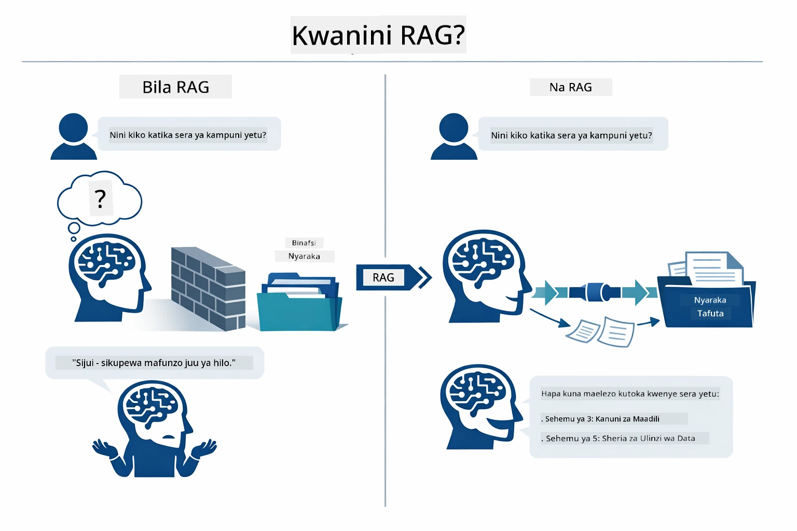
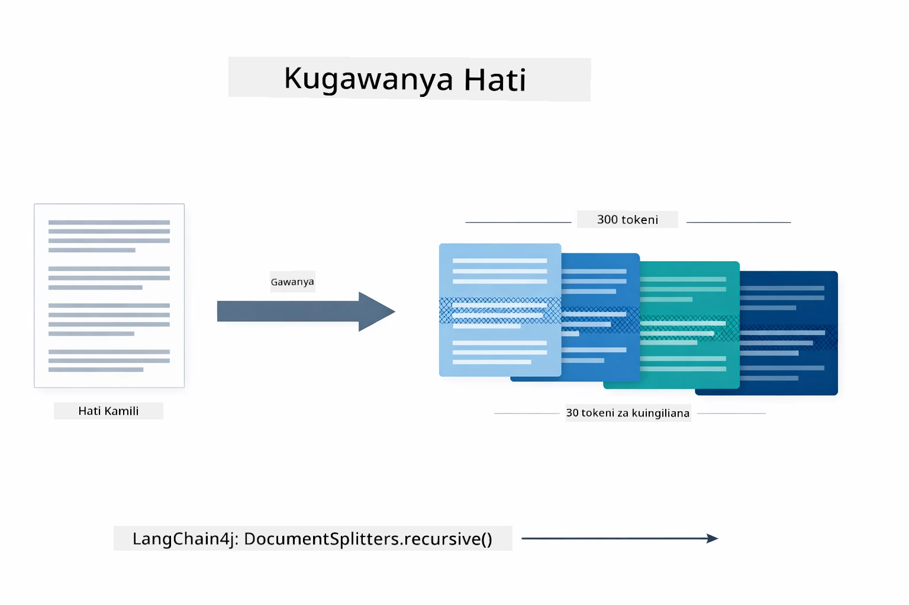
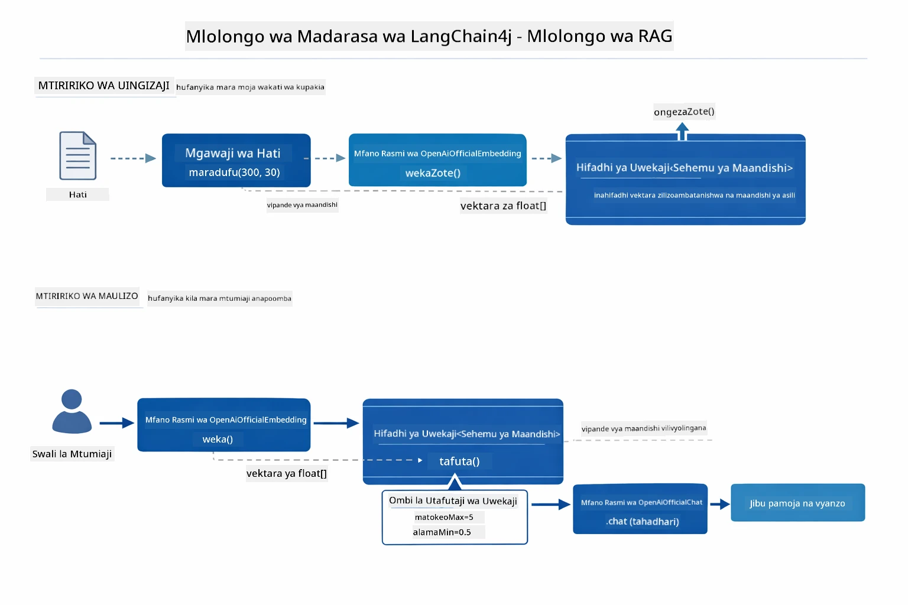
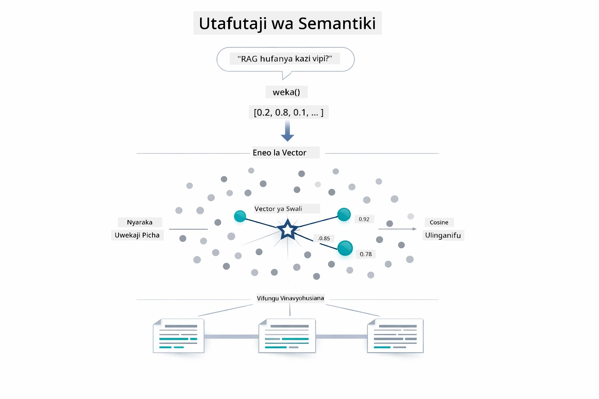
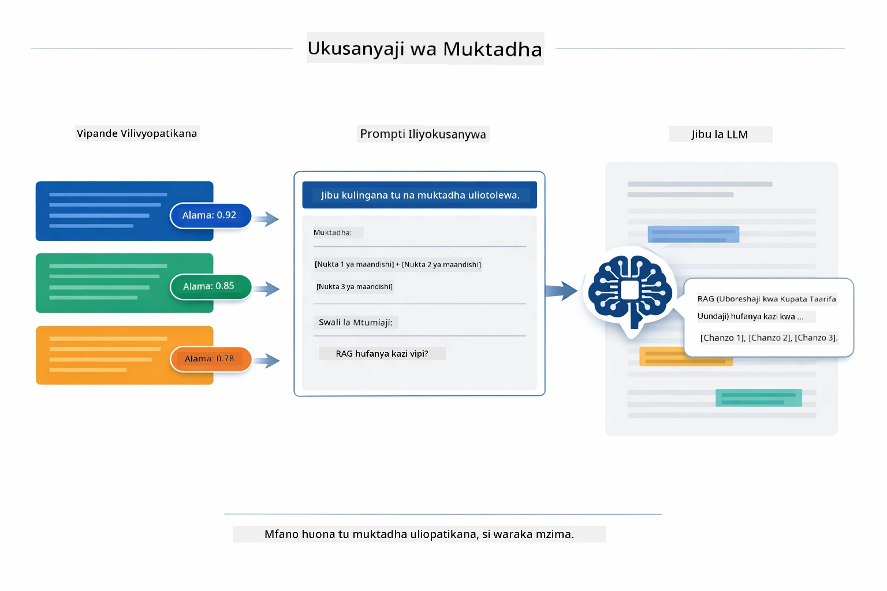
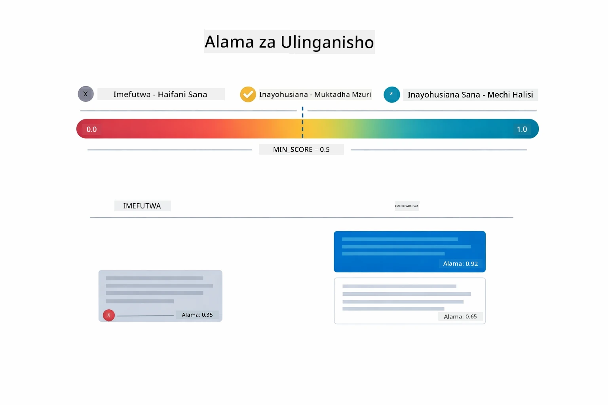
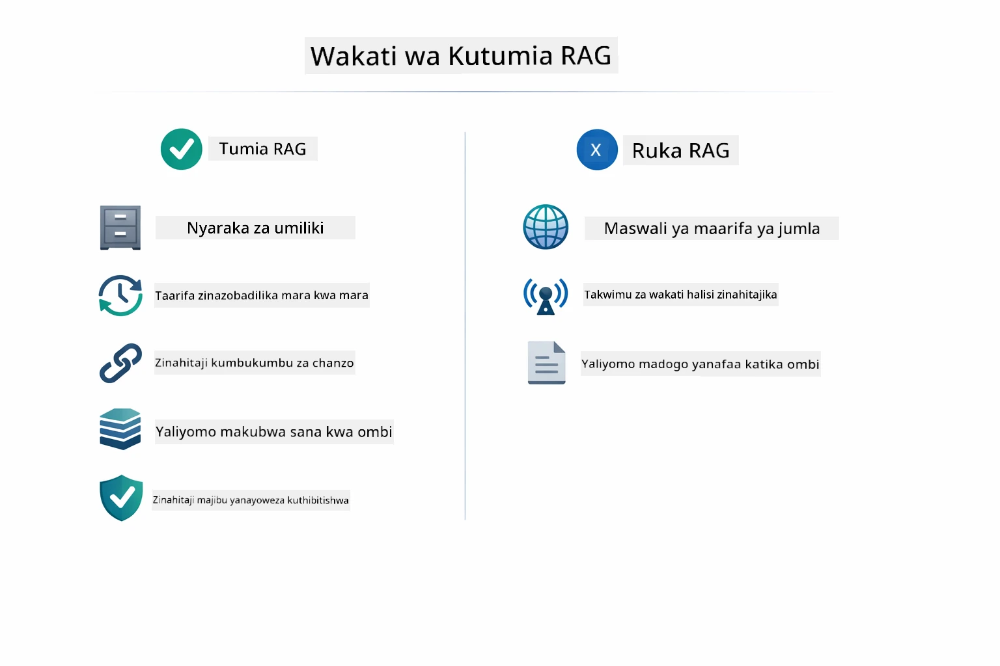

# Moduli 03: RAG (Uzazi Unaoboreshwa kwa Kuwasiliana)

## Jedwali la Yaliyomo

- [Utajifunza Nini](../../../03-rag)
- [Kuelewa RAG](../../../03-rag)
- [Sharti](../../../03-rag)
- [Inavyofanya Kazi](../../../03-rag)
  - [Usindikaji wa Nyaraka](../../../03-rag)
  - [Kuumba Embeddings](../../../03-rag)
  - [Utafutaji wa Semantiki](../../../03-rag)
  - [Uzalishaji wa Majibu](../../../03-rag)
- [Endesha Programu](../../../03-rag)
- [Matumizi ya Programu](../../../03-rag)
  - [Pakia Nyaraka](../../../03-rag)
  - [Uliza Maswali](../../../03-rag)
  - [Angalia Marejeleo ya Chanzo](../../../03-rag)
  - [Jaribu Maswali](../../../03-rag)
- [Mada Muhimu](../../../03-rag)
  - [Mkakati wa Kugawanya Vipande](../../../03-rag)
  - [Alama za Ulinganifu](../../../03-rag)
  - [Uhifadhi Kwenye Kumbukumbu ya Ndani](../../../03-rag)
  - [Usimamizi wa Dirisha la Muktadha](../../../03-rag)
- [Lini RAG Inakuwa Muhimu](../../../03-rag)
- [Hatua Zinazofuata](../../../03-rag)

## Utajifunza Nini

Katika moduli zilizopita, ulijifunza jinsi ya kuzungumza na AI na kuunda maagizo yako kwa ufanisi. Lakini kuna kizingiti cha msingi: mifano ya lugha hujua tu kile walichojifunza wakati wa mafunzo. Hawawezi kujibu maswali kuhusu sera za kampuni yako, nyaraka za mradi wako, au taarifa yoyote ambayo hawakufundishwa.

RAG (Uzazi Unaoboreshwa kwa Kuwasiliana) hutatua tatizo hili. Badala ya kujaribu kufundisha mfano taarifa zako (ambayo ni ghali na haiwezekani), unampa uwezo wa kutafuta katika nyaraka zako. Mtu anapouliza swali, mfumo hupata taarifa zinazohusika na kuziweka katika maelezo. Mfano hutoa jibu kulingana na muktadha uliopatikana.

Fikiria RAG kama kumpa mfano maktaba ya rejea. Unapouliza swali, mfumo:

1. **Swali la Mtumiaji** - Unamuuliza swali
2. **Embedding** - Hubadilisha swali lako kuwa vekta
3. **Utafutaji wa Vekta** - Huona vipande vya nyaraka vinavyofanana
4. **Kukusanya Muktadha** - Huongeza vipande husika kwenye maelezo
5. **Jibu** - LLM hutengeneza jibu kulingana na muktadha

Hii huweka majibu ya mfano kulingana na data yako halisi badala ya kutegemea maarifa ya mafunzo au kutoa majibu ya kudanganya.

## Kuelewa RAG

Mchoro hapa chini unaonyesha dhana kuu: badala ya kutegemea data ya mafunzo ya mfano pekee, RAG humpa maktaba ya rejea ya nyaraka zako ili kushauriana kabla ya kutoa kila jibu.



Hapa ni jinsi vipande vinavyounganika kuanzia mwanzo hadi mwisho. Swali la mtumiaji hupitia hatua nne — embedding, utafutaji wa vekta, kukusanya muktadha, na uzalishaji wa jibu — kila moja ikijenga juu ya ile iliyopita:


Sehemu nyingine za moduli hii zinapitia kila hatua kwa undani, pamoja na msimbo unaoweza kuendesha na kurekebisha.

## Sharti

- Umemaliza Moduli 01 (Rasilimali za Azure OpenAI zimeanzishwa)
- Faili `.env` iko kwenye saraka kuu yenye cheti cha Azure (imeundwa na `azd up` katika Moduli 01)

> **Kumbuka:** Ikiwa hujakamilisha Moduli 01, fuata maelekezo ya usambazaji hapo kwanza.

## Inavyofanya Kazi

### Usindikaji wa Nyaraka

[DocumentService.java](../../../03-rag/src/main/java/com/example/langchain4j/rag/service/DocumentService.java)

Unapopakua nyaraka, mfumo huichambua (PDF au maandishi ya kawaida), huambatisha metadata kama jina la faili, kisha hugawanya vipande — vipande vidogo vinavyofaa kwa dirisha la muktadha la mfano. Vipande hivi vina mzingatio kidogo ili usipoteze muktadha kwenye mipaka.

```java
// Fanya uchambuzi wa faili lililopakuliwa na uifunge katika Hati ya LangChain4j
Document document = Document.from(content, metadata);

// Gawanya katika vipande vya tokeni 300 na mkusanyiko wa tokeni 30
DocumentSplitter splitter = DocumentSplitters
    .recursive(300, 30);

List<TextSegment> segments = splitter.split(document);
```

Mchoro hapa chini unaonyesha hili kwa picha. Angalia jinsi kila kipande kinavyoshiriki baadhi ya tokeni na viichanganuzi vyake — mzingatio wa tokeni 30 huhakikisha hakuna muktadha muhimu unapopotea:



> **🤖 Jaribu na [GitHub Copilot](https://github.com/features/copilot) Chat:** Fungua [`DocumentService.java`](../../../03-rag/src/main/java/com/example/langchain4j/rag/service/DocumentService.java) na uliza:
> - "LangChain4j hugawanya nyaraka vipande vipi na kwa nini mzingatio ni muhimu?"
> - "Kipimo bora cha kipande kwa aina tofauti za nyaraka ni kipi na kwa nini?"
> - "Nitashughulikia vipi nyaraka zenye lugha nyingi au zenye fomati maalum?"

### Kuumba Embeddings

[LangChainRagConfig.java](../../../03-rag/src/main/java/com/example/langchain4j/rag/config/LangChainRagConfig.java)

Kipande kila kinasemekana kuwa uwakilishi wa nambari unaoitwa embedding - kwa maana ndiyo alama za kihesabu zinazobeba maana ya maandishi. Maandishi yanayofanana hutoa embeddings zinazofanana.

```java
@Bean
public EmbeddingModel embeddingModel() {
    return OpenAiOfficialEmbeddingModel.builder()
        .baseUrl(azureOpenAiEndpoint)
        .apiKey(azureOpenAiKey)
        .modelName(azureEmbeddingDeploymentName)
        .build();
}

EmbeddingStore<TextSegment> embeddingStore = 
    new InMemoryEmbeddingStore<>();
```

Mchoro wa darasa hapa chini unaonyesha jinsi vipengele vya LangChain4j vinavyounganishwa. `OpenAiOfficialEmbeddingModel` hubadilisha maandishi kuwa vekta, `InMemoryEmbeddingStore` huhifadhi vekta pamoja na data ya awali ya `TextSegment`, na `EmbeddingSearchRequest` huongoza vigezo vya upokeaji kama `maxResults` na `minScore`:



Mara embeddings zinapohifadhiwa, maudhui yanayofanana hukusanyika papo hapo katika anga ya vekta. Uchoraji wa picha hapa chini unaonyesha jinsi nyaraka kuhusu mada zinazohusiana zinavyojipanga karibu, jambo linalowezesha utafutaji wa semantiki:


### Utafutaji wa Semantiki

[RagService.java](../../../03-rag/src/main/java/com/example/langchain4j/rag/service/RagService.java)

Unapouliza swali, swali lako pia hubadilishwa kuwa embedding. Mfumo unalinganisha embedding ya swali lako dhidi ya embeddings za vipande vya nyaraka vyote. Hupata vipande vyenye maana inayofanana zaidi - si tu maneno yanayolingana, bali ufanano wa kimaana.

```java
Embedding queryEmbedding = embeddingModel.embed(question).content();

EmbeddingSearchRequest searchRequest = EmbeddingSearchRequest.builder()
    .queryEmbedding(queryEmbedding)
    .maxResults(5)
    .minScore(0.5)
    .build();

EmbeddingSearchResult<TextSegment> searchResult = embeddingStore.search(searchRequest);
List<EmbeddingMatch<TextSegment>> matches = searchResult.matches();

for (EmbeddingMatch<TextSegment> match : matches) {
    String relevantText = match.embedded().text();
    double score = match.score();
}
```

Mchoro hapa chini unaonyesha tofauti kati ya utafutaji wa semantiki na utafutaji wa neno moja kwa moja. Utafutaji wa neno "gari" hupoteza kipande kinachozungumzia "magari na malori," lakini utafutaji wa semantiki unaelewa kwa maana hiyo ndipo hurudisha matokeo yenye alama kubwa:



> **🤖 Jaribu na [GitHub Copilot](https://github.com/features/copilot) Chat:** Fungua [`RagService.java`](../../../03-rag/src/main/java/com/example/langchain4j/rag/service/RagService.java) na uliza:
> - "Utafutaji wa ulinganifu hufanya kazi vipi na embeddings na nini huamua alama?"
> - "Kipimo cha ulinganifu kinapaswa kuwa kipi na kinaathirije matokeo?"
> - "Nashughulikia vipi kesi ambazo hakuna nyaraka zinazohusiana zinazopatikana?"

### Uzalishaji wa Majibu

[RagService.java](../../../03-rag/src/main/java/com/example/langchain4j/rag/service/RagService.java)

Vipande vinavyohusiana zaidi vinakusanywa kwenye maelezo yenye muundo wa maagizo wazi, muktadha uliopatikana, na swali la mtumiaji. Mfano husoma vipande hivyo maalum na kutoa jibu kulingana na taarifa hizo — unaweza kutumia tu kile kilicho mbele yake, jambo linalozuia udanganyifu.

```java
String context = matches.stream()
    .map(match -> match.embedded().text())
    .collect(Collectors.joining("\n\n"));

String prompt = String.format("""
    Answer the question based on the following context.
    If the answer cannot be found in the context, say so.

    Context:
    %s

    Question: %s

    Answer:""", context, request.question());

String answer = chatModel.chat(prompt);
```

Mchoro hapa chini unaonyesha mkusanyiko huu ukiendelea — vipande vinavyopata alama za juu kutoka hatua ya utafutaji vinaingizwa kwenye kiolezo cha maelezo, na `OpenAiOfficialChatModel` hutengeneza jibu linalosimama imara:



## Endesha Programu

**Hakikisha usambazaji:**

Hakikisha faili `.env` ipo sarakana kuu ikiwa na cheti cha Azure (kilichotengenezwa wakati wa Moduli 01):
```bash
cat ../.env  # Inapaswa kuonyesha AZURE_OPENAI_ENDPOINT, API_KEY, DEPLOYMENT
```

**Anzisha programu:**

> **Kumbuka:** Ikiwa tayari umeanzisha programu zote kwa kutumia `./start-all.sh` kutoka Moduli 01, moduli hii tayari inaendeshwa kwenye bandari 8081. Unaweza kuruka amri za kuanzisha hapa chini na kwenda moja kwa moja http://localhost:8081.

**Chaguo 1: Kutumia Dashibodi ya Spring Boot (Inapendekezwa kwa watumiaji wa VS Code)**

Hifadhi ya maendeleo ina nyongeza ya Dashibodi ya Spring Boot, inayotoa kiolesura cha kuona kudhibiti programu zote za Spring Boot. Unaweza kuipata kwenye Bar ya Shughuli upande wa kushoto wa VS Code (tafuta ikoni ya Spring Boot).

Kutoka Dashibodi ya Spring Boot, unaweza:
- Kuona programu zote za Spring Boot zilizo tayari kwenye ofisi ya kazi
- Anzisha / zima programu kwa kubofya kitufe kimoja
- Tazama rekodi za programu kwa wakati halisi
- Chunguza hali ya programu

Bonyeza kitufe cha kucheza kando ya "rag" kuanzisha moduli hii, au anzisha moduli zote pamoja.


**Chaguo 2: Kutumia skripti za shell**

Anzisha programu zote za wavuti (moduli 01-04):

**Bash:**
```bash
cd ..  # Kutoka kwenye saraka ya mzizi
./start-all.sh
```

**PowerShell:**
```powershell
cd ..  # Kutoka kwa saraka ya mzizi
.\start-all.ps1
```

Au anza moduli hii pekee:

**Bash:**
```bash
cd 03-rag
./start.sh
```

**PowerShell:**
```powershell
cd 03-rag
.\start.ps1
```

Skripti zote hupakia moja kwa moja vigezo vya mazingira kutoka faili kuu `.env` na zitajenga JARs ikiwa hazipo.

> **Kumbuka:** Ikiwa unapendelea kujenga moduli zote kwa mikono kabla ya kuanzisha:
>
> **Bash:**
> ```bash
> cd ..  # Go to root directory
> mvn clean package -DskipTests
> ```

> **PowerShell:**
> ```powershell
> cd ..  # Go to root directory
> mvn clean package -DskipTests
> ```

Fungua http://localhost:8081 katika kivinjari chako.

**Kuzima:**

**Bash:**
```bash
./stop.sh  # Huu moduli tu
# Au
cd .. && ./stop-all.sh  # Moduli zote
```

**PowerShell:**
```powershell
.\stop.ps1  # Huu moduli tu
# Au
cd ..; .\stop-all.ps1  # Moduli zote
```

## Matumizi ya Programu

Programu hutoa kiolesura cha wavuti kwa ajili ya kupakia nyaraka na kuuliza maswali.

<a href="images/rag-homepage.png"></a>

*Kiolesura cha programu ya RAG - pakia nyaraka na ulize maswali*

### Pakia Nyaraka

Anza kwa kupakia nyaraka - faili za TXT zinafaa kwa majaribio. Faili `sample-document.txt` inapatikana katika saraka hii inayojumuisha taarifa kuhusu vipengele vya LangChain4j, utekelezaji wa RAG, na mbinu bora - kamili kwa kujaribu mfumo.

Mfumo huchakata nyaraka zako, kuzigawanya vipande, na kuunda embeddings kwa kila kipande. Hii hufanyika moja kwa moja unapo pakia.

### Uliza Maswali

Sasa uliza maswali maalum kuhusu maudhui ya nyaraka. Jaribu jambo la ukweli lililo wazi ndani ya nyaraka. Mfumo hutafta vipande husika, kuviweka katika maelezo, na kutoa jibu.

### Angalia Marejeleo ya Chanzo

Tazama kila jibu linajumuisha marejeleo ya chanzo na alama za ulinganifu. Alama hizi (kutoka 0 hadi 1) zinaonyesha jinsi kipande kilivyohusiana na swali lako. Alama za juu zinamaanisha mechi bora. Hii inakuwezesha kuthibitisha jibu dhidi ya nyaraka za chanzo.

<a href="images/rag-query-results.png"></a>

*Matokeo ya utafutaji yanaonyesha jibu na marejeleo ya chanzo na alama za umuhimu*

### Jaribu Maswali

Jaribu aina mbalimbali za maswali:
- Ukweli maalum: "Mada kuu ni gani?"
- Mlinganisho: "Tofauti kati ya X na Y ni gani?"
- Muhtasari: "Ifupishe hoja muhimu kuhusu Z"

Angalia jinsi alama za umuhimu zinavyobadilika kulingana na jinsi swali lako linavyolingana na maudhui ya nyaraka.

## Mada Muhimu

### Mkakati wa Kugawanya Vipande

Nyaraka hugawanywa vipande vya tokeni 300 na tokeni 30 za mzingatio. Mchanganyiko huu huhakikisha kila kipande kina muktadha wa kutosha kuwa na maana huku kikibaki kidogo cha kutosha kujumuisha vipande vingi katika maelezo.

### Alama za Ulinganifu

Kipande kilichopatikana kina alama ya ulinganifu kati ya 0 na 1 inayonyesha jinsi kilivyolingana na swali la mtumiaji. Mchoro hapa chini unaonyesha viwango vya alama na jinsi mfumo unavyovitumia kuchuja matokeo:



Alama zinaanzia 0 hadi 1:
- 0.7-1.0: Muhimu sana, mechi halisi
- 0.5-0.7: Muhimu, muktadha mzuri
- Chini ya 0.5: Imepangwa nje, sio sawa

Mfumo hupata vipande vya juu ya kizingiti cha chini kuhakikisha ubora.

### Uhifadhi Kwenye Kumbukumbu ya Ndani

Moduli hii inatumia uhifadhi ndani ya kumbukumbu kwa ajili ya urahisi. Unapoanzisha tena programu, nyaraka zilizopakuliwa hupotea. Mifumo ya uzalishaji hutumia hifadhidata za vekta endelevu kama Qdrant au Azure AI Search.

### Usimamizi wa Dirisha la Muktadha

Mfano wowote una dirisha la juu la muktadha. Huwezi kujumuisha kila kipande kutoka kwenye nyaraka kubwa. Mfumo hupata vipande N vinavyohusika zaidi (chaguo-msingi ni 5) ili kubaki ndani ya kikomo huku ukitoa muktadha wa kutosha kwa majibu sahihi.

## Lini RAG Inakuwa Muhimu

RAG si kila wakati ni njia sahihi. Mwongozo wa uamuzi hapa chini unakusaidia kubaini wakati RAG inaleta thamani ikilinganishwa na njia rahisi — kama kujumuisha maudhui moja kwa moja katika maelezo au kutegemea maarifa ya mfano — ni ya kutosha:



**Tumia RAG wakati:**
- Kujibu maswali kuhusu hati miliki
- Taarifa hubadilika mara kwa mara (sera, bei, vipimo)
- Usahihi unahitaji marejeo ya chanzo
- Maudhui ni makubwa mno kuingizwa kwenye ombi moja
- Unahitaji majibu yanayothibitishwa na yenye msingi

**Usitumie RAG wakati:**
- Maswali yanahitaji maarifa ya jumla ambayo modeli tayari ina
- Taarifa za wakati halisi zinahitajika (RAG hufanya kazi kwenye hati zilizopakuliwa)
- Maudhui ni machache vya kutosha kuingizwa moja kwa moja katika maombi

## Hatua Zijazo

**Moduli Ifuatayo:** [04-tools - Mawakala wa AI wenye Zana](../04-tools/README.md)

---

**Ukurasa wa Kuongoza:** [← Awali: Moduli 02 - Uhandisi wa Maombi](../02-prompt-engineering/README.md) | [Rudi Kwenye Kuu](../README.md) | [Ifuatayo: Moduli 04 - Zana →](../04-tools/README.md)

---

<!-- CO-OP TRANSLATOR DISCLAIMER START -->
**Kisahihisho**:  
Hati hii imefasiriwa kwa kutumia huduma ya tafsiri ya AI [Co-op Translator](https://github.com/Azure/co-op-translator). Ingawa tunajitahidi usahihi, tafadhali fahamu kuwa tafsiri za moja kwa moja zinaweza kuwa na makosa au upungufu wa usahihi. Hati ya asili katika lugha yake ya asili inapaswa kuchukuliwa kama chanzo cha mamlaka. Kwa taarifa muhimu, tafsiri ya kitaalamu inayofanywa na binadamu inashauriwa. Hatuna wajibu wowote kwa kutoelewana au tafsiri potofu zinazotokana na kutumia tafsiri hii.
<!-- CO-OP TRANSLATOR DISCLAIMER END -->