# Sehemu ya 04: Maajenti wa AI Wenye Vifaa

## Jedwali la Yaliyomo

- [Ufafanuzi wa Video](../../../04-tools)
- [Utachojifunza](../../../04-tools)
- [Masharti ya Awali](../../../04-tools)
- [Kuelewa Maajenti wa AI Wenye Vifaa](../../../04-tools)
- [Jinsi Kuitwa kwa Kifaa Kunavyofanya Kazi](../../../04-tools)
  - [Maelezo ya Vifaa](../../../04-tools)
  - [Uamuzi](../../../04-tools)
  - [Utekelezaji](../../../04-tools)
  - [Uundaji wa Majibu](../../../04-tools)
  - [Mimino: Kubana Moja kwa Moja Spring Boot](../../../04-tools)
- [Ufuatiliaji wa Vifaa](../../../04-tools)
- [Endesha Programu](../../../04-tools)
- [Kutumia Programu](../../../04-tools)
  - [Jaribu Matumizi Rahisi ya Kifaa](../../../04-tools)
  - [Jaribu Ufuatiliaji wa Vifaa](../../../04-tools)
  - [Tazama Mtiririko wa Mazungumzo](../../../04-tools)
  - [Fanya Jaribio na Maombi Tofauti](../../../04-tools)
- [Mafundisho Muhimu](../../../04-tools)
  - [Mfumo wa ReAct (Kufikiria na Kutenda)](../../../04-tools)
  - [Maelezo ya Vifaa Ni Muhimu](../../../04-tools)
  - [Usimamizi wa Kikao](../../../04-tools)
  - [Kushughulikia Makosa](../../../04-tools)
- [Vifaa Vilivyopo](../../../04-tools)
- [Wakati wa Kutumia Maajenti Wenye Vifaa](../../../04-tools)
- [Vifaa dhidi ya RAG](../../../04-tools)
- [Hatua Zifuatazo](../../../04-tools)

## Ufafanuzi wa Video

Tazama kikao hiki cha moja kwa moja kinachoelezea jinsi ya kuanza na sehemu hii:

<a href="https://www.youtube.com/watch?v=O_J30kZc0rw"></a>

## Utachojifunza

Mpaka sasa, umekuwa ukijifunza jinsi ya kuzungumza na AI, kuunda maelekezo kwa ufanisi, na kuweka majibu yako kwenye nyaraka zako. Lakini bado kuna kikomo msingi: mifano ya lugha inaweza tu kutoa maandishi. Haiwezi kuangalia hali ya hewa, kufanya mahesabu, kuuliza hifadhidata, au kuingiliana na mifumo ya nje.

Vifaa hubadilisha hili. Kwa kumpa mfumo upatikanaji wa kazi anazoweza kuitwa, unamgeuza kutoka kuwa mtengenezaji tu wa maandishi kuwa maajenti anayeweza kuchukua hatua. Mfano huamua anapohitaji kifaa, kifaa gani atakachotumia, na vigezo gani atavitumia. Msimbo wako unatekeleza kazi na kurudisha matokeo. Mfano huingiza matokeo hayo kwenye jibu lake.

## Masharti ya Awali

- Umekamilisha [Sehemu ya 01 - Utangulizi](../01-introduction/README.md) (Rasilimali za Azure OpenAI zimetumika)
- Umekamilisha sehemu zilizopita zinapendekezwa (sehemu hii inarejelea [dhana za RAG kutoka Sehemu 03](../03-rag/README.md) katika kulinganisha Vifaa dhidi ya RAG)
- Kificho `.env` kiko kwenye saraka kuu chenye cheti cha Azure (kimeundwa na `azd up` katika Sehemu 01)

> **Kumbuka:** Ikiwa bado hujakamilisha Sehemu 01, fuata maelekezo ya usambazaji hapo kwanza.

## Kuelewa Maajenti wa AI Wenye Vifaa

> **📝 Kumbuka:** Neno "maajenti" katika sehemu hii linamaanisha wasaidizi wa AI walioboresha na uwezo wa kuitwa kwa vifaa. Hii ni tofauti na mifumo ya **Agentic AI** (maajenti huru wenye mipango, kumbukumbu, na fikra zinazoendelea hatua kwa hatua) ambayo tutafundisha katika [Sehemu ya 05: MCP](../05-mcp/README.md).

Bila vifaa, mfano wa lugha unaweza tu kutoa maandishi kutoka kwa data zake za mafunzo. Muulize hali ya hewa ya sasa, na lazima adhani. Mpe vifaa, na anaweza kuitisha API ya hali ya hewa, kufanya mahesabu, au kuuliza hifadhidata — kisha acha matokeo halisi yaende kwenye jibu lake.

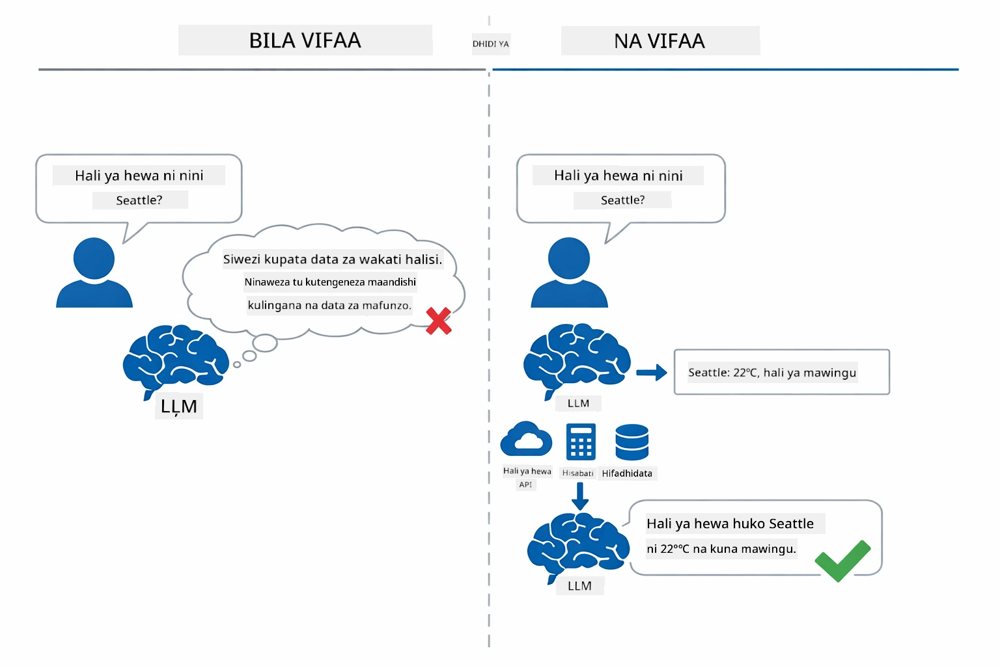

*Bila vifaa mfano unaweza tu kudhani — kwa vifaa anaweza kuitisha API, kuendesha mahesabu, na kurudisha data za wakati halisi.*

Mojawapo maajenti wa AI wenye vifaa hufuata mfumo wa **Kufikiri na Kutenda (ReAct)**. Mfano haujibu tu — huwaafanya mawazo kuhusu anachohitaji, hutenda kwa kuitisha kifaa, hushuhudia matokeo, kisha huamua kama ataendelea kutenda au kutoa jibu la mwisho:

1. **Fikiri** — Maajenti huchambua swali la mtumiaji na kubaini taarifa anazohitaji  
2. **Tenda** — Maajenti huamua kifaa sahihi, huunda vigezo sahihi, na huuita  
3. **Shuhudia** — Maajenti hupokea matokeo ya kifaa na kuangalia  
4. **Rudia au Jibu** — Ikiwa inahitaji data zaidi, hurudia; vinginevyo, huunda jibu la lugha asili  

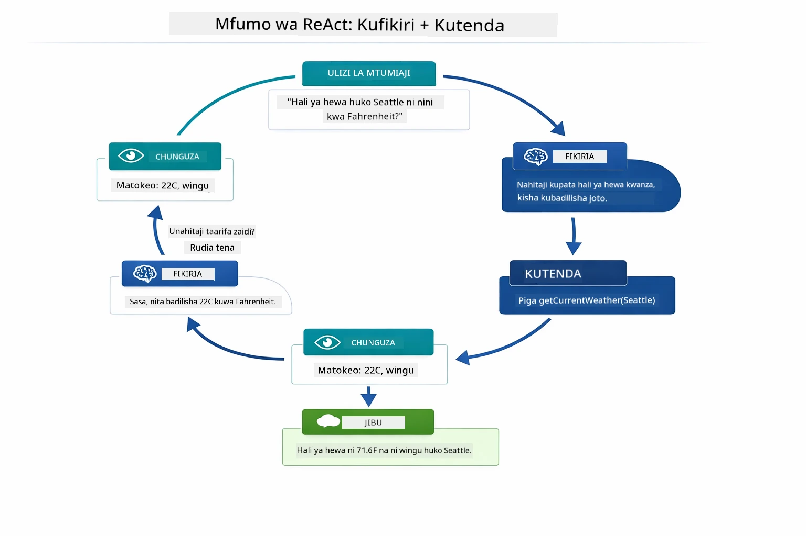

*Mzunguko wa ReAct — maajenti hufikiri kuhusu kitendo, hutenda kwa kuitisha kifaa, hushuhudia matokeo, na kuendelea hadi aweze kutoa jibu la mwisho.*

Hii hufanyika moja kwa moja. Unaeleza vifaa na maelezo yao. Mfano unashughulikia uamuzi wa lini na jinsi ya kutumia.

## Jinsi Kuitwa kwa Kifaa Kunavyofanya Kazi

### Maelezo ya Vifaa

[WeatherTool.java](../../../04-tools/src/main/java/com/example/langchain4j/agents/tools/WeatherTool.java) | [TemperatureTool.java](../../../04-tools/src/main/java/com/example/langchain4j/agents/tools/TemperatureTool.java)

Unaeza kazi zilizo na maelezo wazi na sifa za vigezo. Mfano unaona maelezo haya kwenye maelekezo ya mfumo wake na unaelewa kile kifaa kila kinachofanya.

```java
@Component
public class WeatherTool {
    
    @Tool("Get the current weather for a location")
    public String getCurrentWeather(@P("Location name") String location) {
        // Mantiki yako ya kutafuta hali ya hewa
        return "Weather in " + location + ": 22°C, cloudy";
    }
}

@AiService
public interface Assistant {
    String chat(@MemoryId String sessionId, @UserMessage String message);
}

// Msaidizi huunganishwa moja kwa moja na Spring Boot na:
// - Bean ya ChatModel
// - Njia zote za @Tool kutoka kwa darasa la @Component
// - ChatMemoryProvider kwa usimamizi wa kikao
```
  
Michoro hapa chini hufafanua kila alama na kuonyesha jinsi kila sehemu inavyosaidia AI kuelewa lini kuitisha kifaa na vigezo gani kuwasilisha:

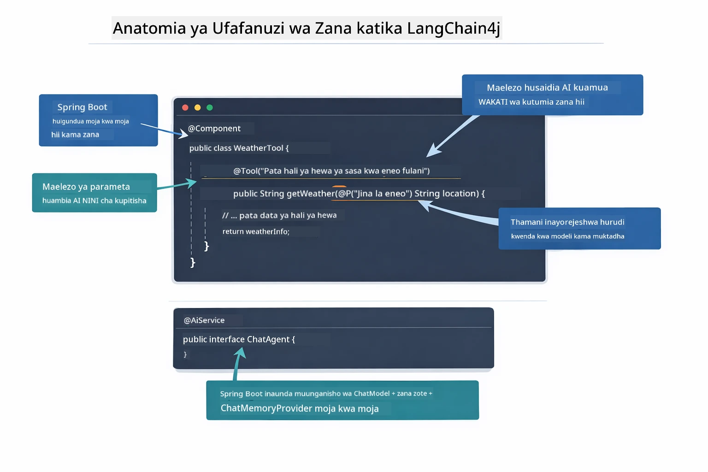

*Muundo wa maelezo ya kifaa — @Tool humweleza AI lini aichukue, @P huambia kila kipengele, na @AiService huunganisha kila kitu wakati wa kuanzisha.*

> **🤖 Jaribu na [GitHub Copilot](https://github.com/features/copilot) Chat:** Fungua [`WeatherTool.java`](../../../04-tools/src/main/java/com/example/langchain4j/agents/tools/WeatherTool.java) na uliza:  
> - "Nitashirikisha API halisi ya hali ya hewa kama OpenWeatherMap badala ya data za kuigwa jinsi gani?"  
> - "Nini kinafanya maelezo ya kifaa kuwa mazuri kwa kusaidia AI kuitumia kwa usahihi?"  
> - "Nashughulikiaje makosa ya API na viwango vya maombi katika utekelezaji wa vifaa?"  

### Uamuzi

Mtumiaji akuulize "Hali ya hewa Seattle iko aje?", mfano hauchagui kifaa kwa bahati. Huongeza nia ya mtumiaji na maelezo yote ya kifaa anazopata, hupima kila moja kwa umuhimu, na kuchagua bora zaidi. Kisha huunda mwito uliopangwa kiufundi na vigezo sahihi — katika kesi hii, kuweka `location` kuwa `"Seattle"`.

Ikiwa hakuna kifaa kinacholingana na ombi la mtumiaji, mfano hurudi kujibu kwa maarifa yake mwenyewe. Ikiwa vifaa vingi vinalingana, huchagua kile kilicho maalum zaidi.

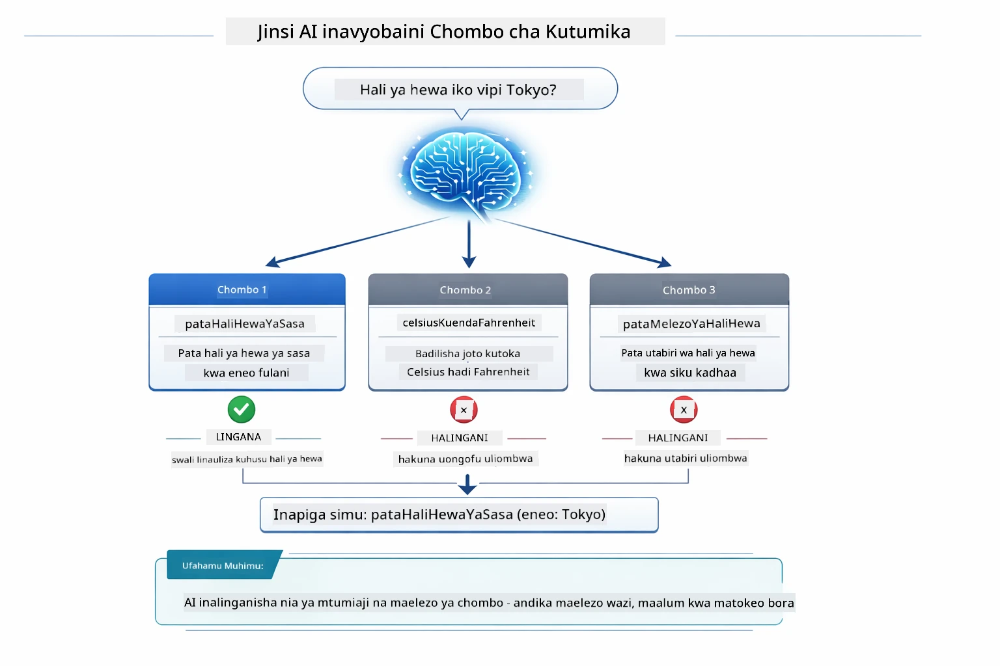

*Mfano hupima kila kifaa kinachopatikana dhidi ya nia ya mtumiaji na huchagua lililo bora — ndio maana kuandika maelezo ya kifaa kwa uwazi na ufafanuzi ni muhimu.*

### Utekelezaji

[AgentService.java](../../../04-tools/src/main/java/com/example/langchain4j/agents/service/AgentService.java)

Spring Boot huunganisha moja kwa moja kiolesura cha `@AiService` chenye vifaa vyote vilivyorekodiwa, na LangChain4j hutoa mwito wa kifaa moja kwa moja. Ndani yake, mwitikio kamili huenda kupitia hatua sita — kutoka kwa swali la lugha asili la mtumiaji hadi jibu la lugha asili:

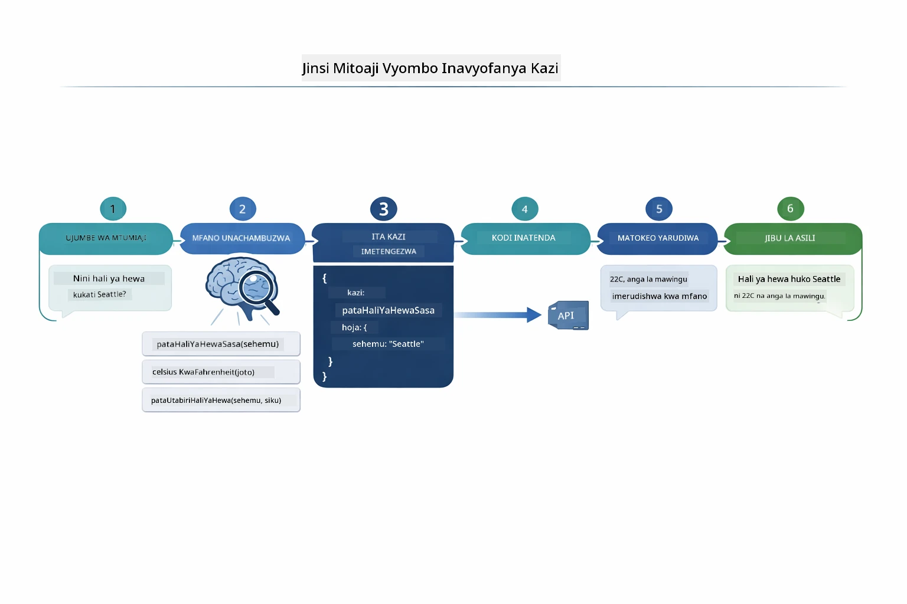

*Mtiririko kutoka mwanzo hadi mwisho — mtumiaji houliza swali, mfano huchagua kifaa, LangChain4j kinaendesha, na mfano huingiza matokeo katika jibu la asili.*

Ukiendesha [ToolIntegrationDemo](../../../00-quick-start/src/main/java/com/example/langchain4j/quickstart/ToolIntegrationDemo.java) katika Sehemu 00, tayari umeona mfumo huu ukitenda — vifaa vya `Calculator` vilitumwa kwa njia ile ile. Mchoro wa mfuatano hapa chini unaonyesha hasa kilichotokea chini ya pazia wakati wa onyesho hilo:

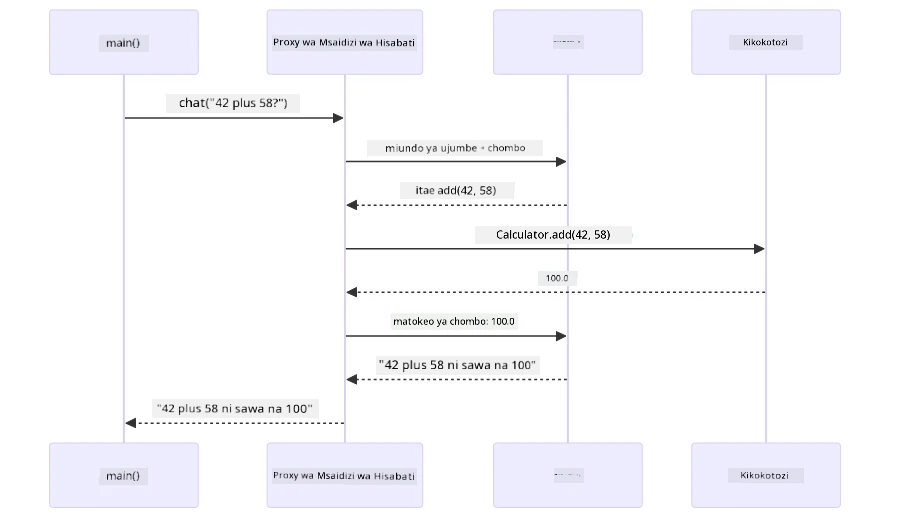

*Kizunguko cha kuitwa kwa kifaa kutoka Demo ya Quick Start — `AiServices` hutuma ujumbe wako na muundo wa vifaa kwa LLM, LLM hurudisha mwito wa kazi kama `add(42, 58)`, LangChain4j hufanya kazi ya `Calculator` ndani, na hulaidia matokeo kwa jibu la mwisho.*

> **🤖 Jaribu na [GitHub Copilot](https://github.com/features/copilot) Chat:** Fungua [`AgentService.java`](../../../04-tools/src/main/java/com/example/langchain4j/agents/service/AgentService.java) na uliza:  
> - "Mfumo wa ReAct hufanya kazi vipi na kwa nini ni mzuri kwa maajenti wa AI?"  
> - "Maajenti huamua vipi kifaa cha kutumia na kwa utaratibu gani?"  
> - "Nini hutokea ikiwa utekelezaji wa kifaa unashindwa - jinsi gani nashughulikia makosa kwa usahihi?"  

### Uundaji wa Majibu

Mfano hupokea data ya hali ya hewa na kuipitisha kuwa jibu la lugha asili kwa mtumiaji.

### Mimino: Kubana Moja kwa Moja Spring Boot

Sehemu hii inatumia mchanganyiko wa LangChain4j na Spring Boot kwa kiolesura cha `@AiService` kinachoeleza kazi. Wakati wa kuanzisha, Spring Boot hugundua kila `@Component` yenye njia za `@Tool`, kipande chako cha `ChatModel`, na `ChatMemoryProvider` — kisha huchanganya yote kwa kiolesura kimoja kinachoitwa `Assistant` bila kazi ya ziada nyingi.

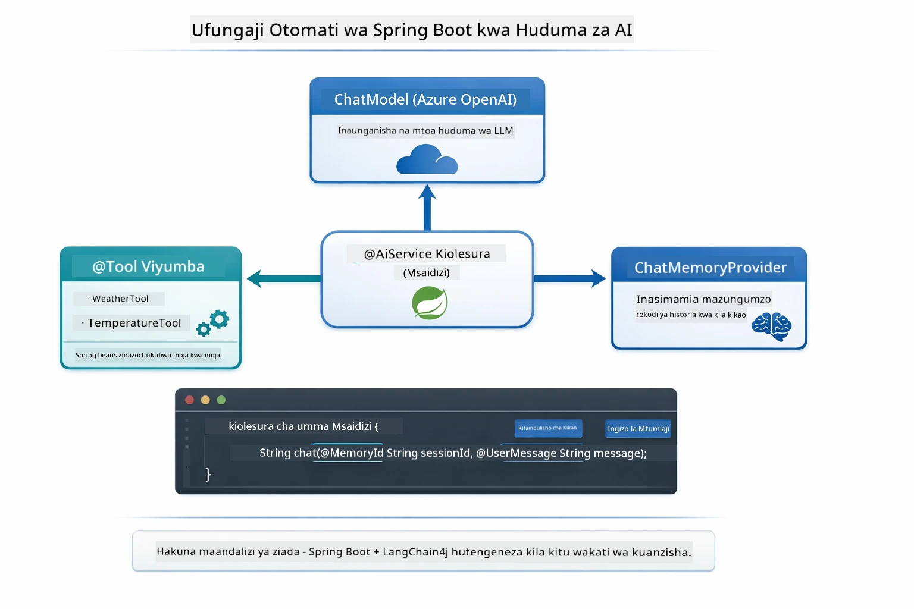

*Kiolesura cha @AiService kinaringanisha ChatModel, vipengele vya kifaa, na mtoaji kumbukumbu — Spring Boot hushughulikia unganisho zote moja kwa moja.*

Huu ni mtiririko kamili wa maisha ya ombi kama mchoro wa mfuatano — kutoka ombi la HTTP kupitia kontorola, huduma, na wakala aliyeunganishwa moja kwa moja, hadi utekelezaji wa kifaa na kurudi:

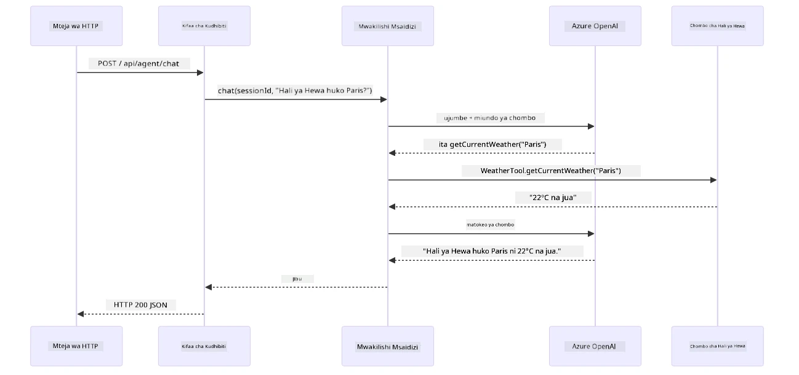

*Mtiririko kamili wa maisha ya ombi la Spring Boot — ombi la HTTP hupanuka kupitia kontorola na huduma hadi wakala wa Assistant aliyeunganisha moja kwa moja, anayoratibu LLM na mwito wa kifaa moja kwa moja.*

Manufaa makuu ya njia hii:

- **Ubunganishaji moja kwa moja wa Spring Boot** — ChatModel na vifaa huingizwa moja kwa moja  
- **Mfumo wa @MemoryId** — Usimamizi wa kumbukumbu kwa kikao moja kwa moja  
- **Toleo moja tu** — Assistant huunda mara moja na kutumika tena kwa utendaji bora  
- **Utekelezaji salama wa aina** — Njia za Java huitwa moja kwa moja na uongofu wa aina  
- **Uendeshaji wa mizunguko mingi** — Hukabiliana na ufuatiliaji wa vifaa moja kwa moja  
- **Hakuna kazi za ziada** — Hakuna mwito wa mkono wa `AiServices.builder()` au ramani ya kumbukumbu  

Njia mbadala (ya mkono `AiServices.builder()`) zinahitaji msimbo zaidi na hupoteza manufaa ya ushirikiano wa Spring Boot.

## Ufuatiliaji wa Vifaa

**Ufuatiliaji wa Vifaa** — Nguvu halisi ya maajenti wenye vifaa hujionyesha wakati swali moja linahitaji vifaa vingi. Uliza "Hali ya hewa Seattle ni kiasi gani kwa Fahrenheit?" na maajenti huhusisha moja kwa moja vifaa viwili: kwanza huita `getCurrentWeather` kupata joto kwa Celsius, kisha hupitisha thamani hiyo kwa `celsiusToFahrenheit` kwa mabadiliko — yote yakiwa kwenye zamu moja ya mazungumzo.

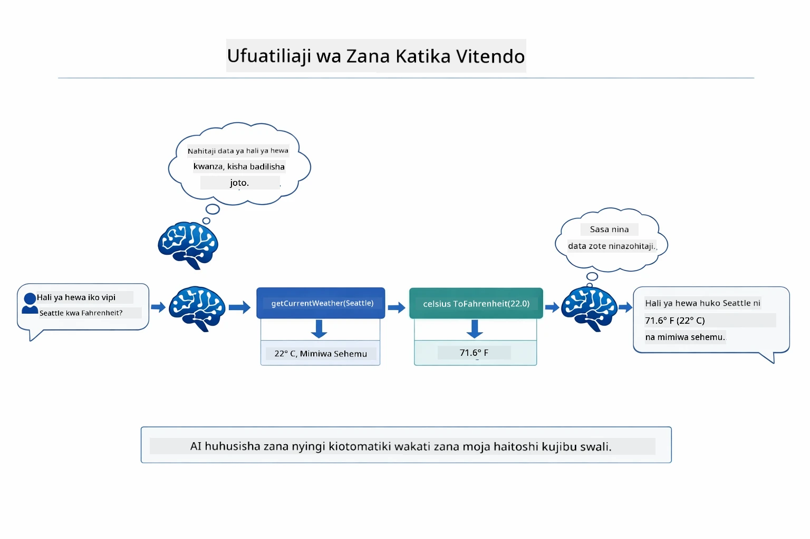

*Ufuatiliaji wa vifaa ukiwa kazini — maajenti huita kwanza getCurrentWeather, kisha hupitisha matokeo ya Celsius kwa celsiusToFahrenheit, na kutoa jibu limeunganishwa.*

**Makala za Makosa kwa Hekima** — Uliza hali ya hewa katika mji usiopo kwenye data ya majaribio. Kifaa hurudisha ujumbe wa kosa, na AI huonyesha hawezi kusaidia badala ya kuanguka. Vifaa hutenda kwa usalama. Chati iliyo hapo chini inaonyesha tofauti za mbinu mbili — kushughulikia makosa vizuri, maajenti hukamata kosa na kujibu kwa msaada, wakati bila hiyo programu nzima huanguka:

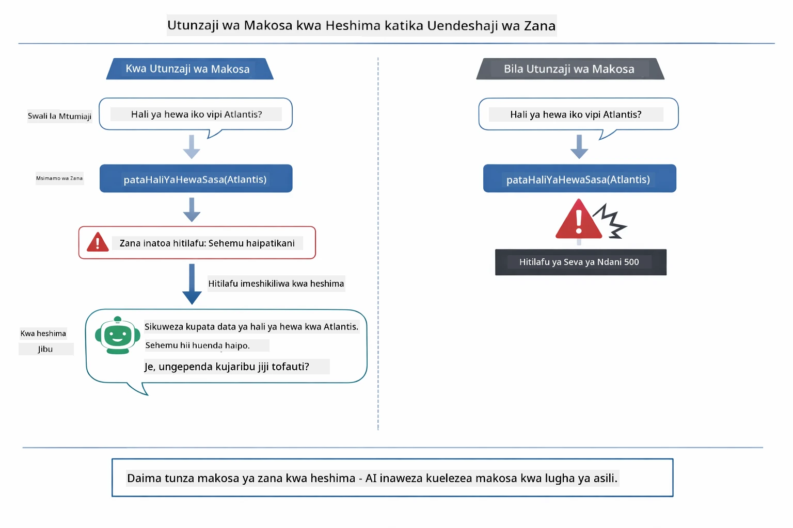

*Wakati kifaa kinashindwa, maajenti hukamata kosa na kujibu kwa maelezo ya msaada badala ya kuanguka.*

Hii hufanyika kwa zamu moja ya mazungumzo. Maajenti huratibu mwito wa vifaa vingi kwa uhuru.

## Endesha Programu

**Thibitisha usambazaji:**

Thibitisha faili `.env` ipo kwenye saraka kuu ikiwa na cheti cha Azure (kimeundwa wakati wa Sehemu 01). Endesha amri hii kutoka kwa saraka ya sehemu (`04-tools/`):

**Bash:**  
```bash
cat ../.env  # Inapaswa kuonyesha AZURE_OPENAI_ENDPOINT, API_KEY, DEPLOYMENT
```
  
**PowerShell:**  
```powershell
Get-Content ..\.env  # Inapaswa kuonyesha AZURE_OPENAI_ENDPOINT, API_KEY, DEPLOYMENT
```
  
**Anza programu:**

> **Kumbuka:** Ikiwa tayari umeanza programu zote kwa kutumia `./start-all.sh` kutoka kwenye saraka kuu (kama ilivyoelezwa katika Sehemu 01), sehemu hii tayari inaendesha kwenye bandari 8084. Unaweza kupita amri za kuanzisha hapa na kwenda moja kwa moja http://localhost:8084.

**Chaguo 1: Kutumia Dashibodi ya Spring Boot (Inapendekezwa kwa watumiaji wa VS Code)**

Kontena la maendeleo lina programu-jalizi ya Dashibodi ya Spring Boot, inayotoa kiolesura cha kuona ili kusimamia programu zote za Spring Boot. Unaweza kuipata kwenye Bar ya Shughuli upande wa kushoto wa VS Code (tazama ikoni ya Spring Boot).

Kutoka kwenye Dashibodi ya Spring Boot, unaweza:  
- Kuona programu zote za Spring Boot zinazopatikana kwenye nafasi ya kazi  
- Anzisha/acha programu kwa kubofya mara moja  
- Angalia kumbukumbu za programu papo hapo  
- Fuata hali ya programu  

Bonyeza tu kitufe cha kucheza kando ya "zana" kuanza moduli hii, au anzisha moduli zote kwa pamoja.

Hivi ndivyo Dashibodi ya Spring Boot inavyoonekana katika VS Code:


*Dashibodi ya Spring Boot katika VS Code — anzisha, zima, na fuatilia moduli zote kutoka sehemu moja*

**Chaguo 2: Kutumia skripti za shell**

Anzisha programu zote za wavuti (moduli 01-04):

**Bash:**
```bash
cd ..  # Kutoka kwenye saraka ya mizizi
./start-all.sh
```

**PowerShell:**
```powershell
cd ..  # Kutoka katika saraka ya mizizi
.\start-all.ps1
```

Au anzisha moduli hii tu:

**Bash:**
```bash
cd 04-tools
./start.sh
```

**PowerShell:**
```powershell
cd 04-tools
.\start.ps1
```

Skripti zote hujipakia moja kwa moja mabadiliko ya mazingira kutoka kwenye faili `.env` ya mzizi na zitajenga JARs ikiwa hazipo.

> **Kumbuka:** Ikiwa unapendelea kujenga moduli zote kwa mkono kabla ya kuanza:
>
> **Bash:**
> ```bash
> cd ..  # Go to root directory
> mvn clean package -DskipTests
> ```
>
> **PowerShell:**
> ```powershell
> cd ..  # Go to root directory
> mvn clean package -DskipTests
> ```

Fungua http://localhost:8084 kwenye kivinjari chako.

**Kuzima:**

**Bash:**
```bash
./stop.sh  # Hii moduli tu
# Au
cd .. && ./stop-all.sh  # Moduli zote
```

**PowerShell:**
```powershell
.\stop.ps1  # Moduli hii pekee
# Au
cd ..; .\stop-all.ps1  # Moduli zote
```

## Kutumia Programu

Programu hutoa kiolesura cha wavuti ambapo unaweza kuwasiliana na wakala wa AI ambaye ana upatikanaji wa zana za hali ya hewa na uongofu wa joto. Hivi ndivyo kiolesura kinavyoonekana — kinajumuisha mifano ya kuanza haraka na jopo la mazungumzo la kutuma maombi:

<a href="images/tools-homepage.png"></a>

*Kiolesura cha Zana za Wakala wa AI - mifano ya haraka na kiolesura cha mazungumzo kwa kuwasiliana na zana*

### Jaribu Matumizi Rahisi ya Zana

Anza na ombi rahisi: "Badilisha nyuzi 100 Fahrenheit kuwa Celsius". Wakala anatambua anahitaji zana ya uongofu wa joto, ainakili kwa vigezo sahihi, na kurudisha matokeo. Angalia jinsi hii inavyohisi kwa asili - hukueleza ni zana gani ya kutumia au jinsi ya kuitumia.

### Jaribu Mfuatano wa Zana

Sasa jaribu kitu kigumu zaidi: "Hali ya hewa iko vipi Seattle na ibadilisha hadi Fahrenheit?" Tazama jinsi wakala anavyofanya kazi hatua kwa hatua. Kwanza anapata hali ya hewa (inayorejesha Celsius), anatambua anahitaji kubadilisha hadi Fahrenheit, aita zana ya uongofu, na kuunganisha matokeo yote kuwa jibu moja.

### Angalia Mtiririko wa Mazungumzo

Kiolesura cha mazungumzo kinahifadhi historia ya mazungumzo, kukuwezesha kuwa na mazungumzo ya mizunguko mingi. Unaweza kuona maswali na majibu yote ya zamani, kufanya kufuatilia mazungumzo na kuelewa jinsi wakala anavyojenga muktadha kupitia mabadilikano mbalimbali iwe rahisi.

<a href="images/tools-conversation-demo.png"></a>

*Mazungumzo ya mizunguko mingi yanayoonyesha uongofu rahisi, utafutaji wa hali ya hewa, na mfuatano wa zana*

### Jaribu Maombi Tofauti

Jaribu mchanganyiko mbalimbali:
- Utafutaji wa hali ya hewa: "Hali ya hewa iko vipi Tokyo?"
- Uongofu wa joto: "Ni kiasi gani 25°C kwa Kelvin?"
- Maswali mchanganyiko: "Angalia hali ya hewa Paris na niambie kama iko juu ya 20°C"

Angalia jinsi wakala anavyotafsiri lugha ya asili na kuibeba kwa miito sahihi ya zana.

## Misingi Muhimu

### Mfano wa ReAct (Kufikiri na Kutenda)

Wakala hubadilishana kati ya kufikiri (kuamua cha kufanya) na kutenda (kutumia zana). Mfano huu unaruhusu kutatua matatizo kwa kujitegemea badala ya kujibu tu maagizo.

### Maelezo ya Zana Yanahitajika

Ubora wa maelezo ya zana zako unasababisha wakala kuzitumia vema. Maelezo wazi, maalum husaidia mfano kuelewa wakati na jinsi ya kuita kila zana.

### Usimamizi wa Kikao

Maelezo ya `@MemoryId` huruhusu usimamizi wa kumbukumbu zinazoendeshwa na kikao kiotomatiki. Kila ID ya kikao hupata mfano wake wa `ChatMemory` unaosimamiwa na bean ya `ChatMemoryProvider`, hivyo watumiaji wengi wanaweza kuwasiliana na wakala bila mazungumzo yao kuchanganyika. Mchoro ufuatao unaonyesha jinsi watumiaji wengi wanavyopangwa kwenye hifadhidata za kumbukumbu pekee kwa kutumia ID zao za kikao:

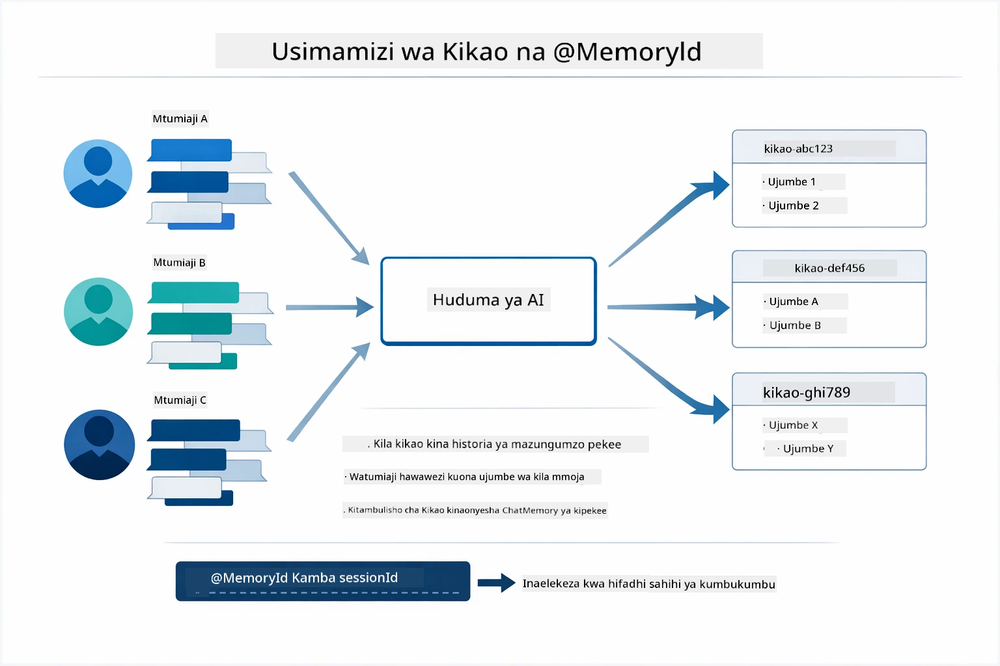

*Kila ID ya kikao ina historia yake ya mazungumzo iliyotengwa — watumiaji hawwezi kuona ujumbe wa wengine.*

### Usimamizi wa Makosa

Zana zinaweza kufeli — API zinaweza kushindwa, vigezo vinaweza kuwa batili, huduma za nje zinaweza kushindwa. Wakala wa uzalishaji wanahitaji usimamizi wa makosa ili mfano uweze kueleza matatizo au kujaribu mbadala badala ya kusababisha programu yote kushindwa. Wakati zana inapotupa hitilafu, LangChain4j huikamata na kurudisha ujumbe wa kosa kwa mfano, ambao unaweza kisha kueleza tatizo kwa lugha asili.

## Zana Zinazopatikana

Mchoro uliopo unaonyesha mfumo mpana wa zana unazoweza kujenga. Moduli hii inaonesha zana za hali ya hewa na joto, lakini mfano ule ule wa `@Tool` hufanya kazi kwa njia yoyote ya Java — kutoka kwa maswali ya database hadi usindikaji wa malipo.

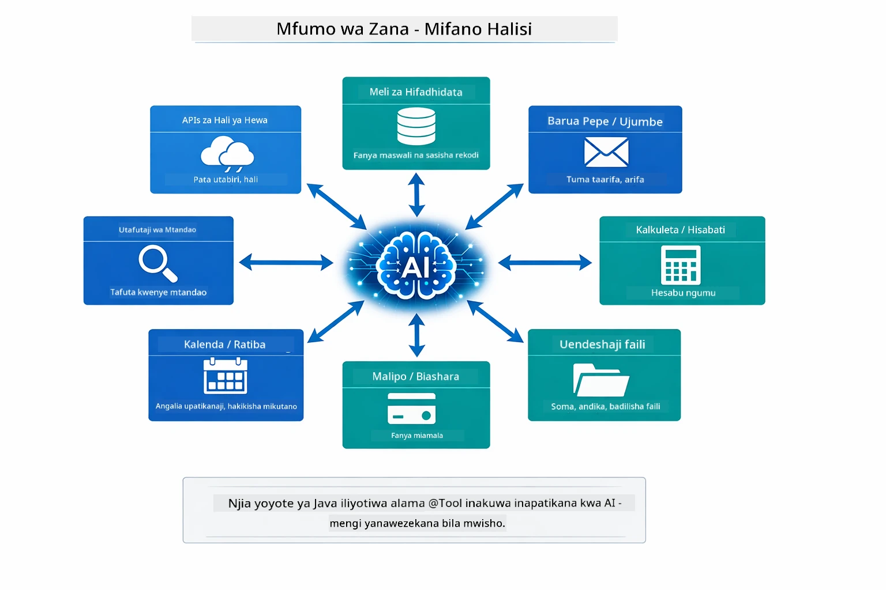

*Kila njia ya Java iliyoandikwa na @Tool inapatikana kwa AI — mfano huu unaenea kwa database, API, barua pepe, operesheni za faili, na zaidi.*

## Wakati wa Kutumia Wakala Wa Zana

Sio kila ombi linahitaji zana. Uamuzi unategemea kama AI inahitaji kuingiliana na mifumo ya nje au inaweza kujibu kwa maarifa yake mwenyewe. Mwongozo ufuatao unatoa muhtasari wa wakati zana zinaongeza thamani na wakati hazihitajiki:

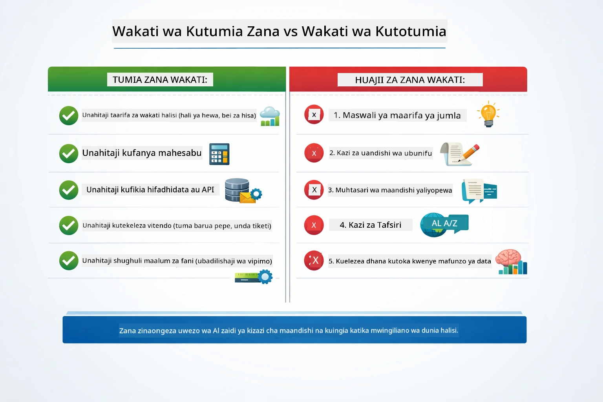

*Mwongozo wa haraka wa uamuzi — zana ni kwa data za wakati halisi, hesabu, na vitendo; maarifa ya jumla na kazi za ubunifu hazihitaji zana.*

## Zana dhidi ya RAG

Moduli 03 na 04 zote hupanua kile AI inaweza kufanya, lakini kwa njia tofauti kabisa. RAG humpa mfano upatikanaji wa **maarifa** kwa kupata hati. Zana humpa mfano uwezo wa kuchukua **vitendo** kwa kuita kazi. Mchoro hapa chini unalinganisha mbinu hizi mbili kando kando — kutoka jinsi kila mchakato unavyofanya kazi hadi mikataba kati yao:

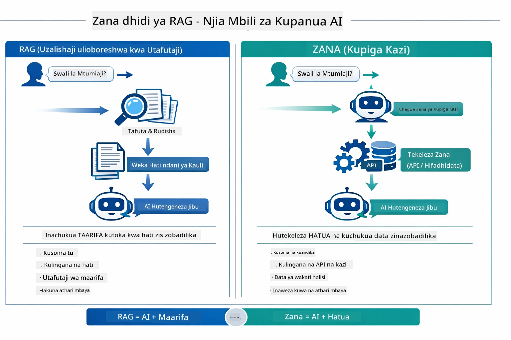

*RAG hupata taarifa kutoka kwa hati tulivu — Zana hutekeleza vitendo na kupata data hai, ya wakati halisi. Mifumo mingi ya uzalishaji hutumia wote wawili.*

Kwa vitendo, mifumo mingi ya uzalishaji hutumia mbinu zote mbili: RAG kwa kuhamasisha majibu yako katika nyaraka, na Zana kwa kupata data hai au kutekeleza shughuli.

## Hatua Zifuatazo

**Moduli Ifuatayo:** [05-mcp - Itifaki ya Muktadha wa Mfano (MCP)](../05-mcp/README.md)

---

**Uelekezaji:** [← Kwenye Moduli ya Awali: 03 - RAG](../03-rag/README.md) | [Rudi Kwenye Mwanzo](../README.md) | [Ifuatayo: Moduli 05 - MCP →](../05-mcp/README.md)

---

<!-- CO-OP TRANSLATOR DISCLAIMER START -->
**Kiarifu cha Kutohusika**:  
Hati hii imetafsiriwa kwa kutumia huduma ya tafsiri ya AI [Co-op Translator](https://github.com/Azure/co-op-translator). Ingawa tunajitahidi kuwa sahihi, tafadhali fahamu kwamba tafsiri za moja kwa moja zinaweza kuwa na makosa au upotoshaji. Hati asili katika lugha yake ya asili inapaswa kuzingatiwa kama chanzo cha mamlaka. Kwa taarifa muhimu, tafsiri za mtaalamu wa kibinadamu zinapendekezwa. Hatujawajibika kwa kutoelewana au tafsiri zisizo sahihi zinazotokana na matumizi ya tafsiri hii.
<!-- CO-OP TRANSLATOR DISCLAIMER END -->