# Moduli 05: Itifaki ya Muktadha wa Mfano (MCP)

## Jedwali la Yaliyomo

- [Video Maelekezo](../../../05-mcp)
- [Utajifunza Nini](../../../05-mcp)
- [MCP ni Nini?](../../../05-mcp)
- [MCP Inavyofanya Kazi](../../../05-mcp)
- [Moduli ya Wakala](../../../05-mcp)
- [Kukimbia Mifano](../../../05-mcp)
  - [Masharti ya awali](../../../05-mcp)
- [Anza Haraka](../../../05-mcp)
  - [Uendeshaji wa Faili (Stdio)](../../../05-mcp)
  - [Wakala Mkuu](../../../05-mcp)
    - [Kukimbia Demo](../../../05-mcp)
    - [Jinsi Mkuu Anavyofanya Kazi](../../../05-mcp)
    - [Jinsi FileAgent Inavyogundua Vifaa vya MCP Wakati wa Kukimbia](../../../05-mcp)
    - [Mikakati ya Majibu](../../../05-mcp)
    - [Kuelewa Matokeo](../../../05-mcp)
    - [Maelezo ya Sifa za Moduli ya Wakala](../../../05-mcp)
- [Mafahamu Muhimu](../../../05-mcp)
- [Hongera!](../../../05-mcp)
  - [Nini Kifuatavyo?](../../../05-mcp)

## Video Maelekezo

Tazama kikao hiki cha moja kwa moja kinachoelezea jinsi ya kuanza na moduli hii:

<a href="https://www.youtube.com/watch?v=O_J30kZc0rw"></a>

## Utajifunza Nini

Umekuwa ukiunda AI za mazungumzo, umejifunza kutumia maagizo, umefanya majibu yawe na msingi katika nyaraka, na umeunda mawakala wenye zana. Lakini zana zote hizo zilijengwa mahsusi kwa ajili ya programu yako. Je, ungempenda AI yako ipate ufikiaji wa ekosistimu ya zana za viwango ambavyo mtu yeyote anaweza kuunda na kushiriki? Katika moduli hii, utajifunza jinsi ya kufanya hivyo kwa kutumia Itifaki ya Muktadha wa Mfano (MCP) na moduli ya wakala ya LangChain4j. Kwanza tunaonesha msomaji rahisi wa faili wa MCP kisha tunaonyesha jinsi inavyojumuishwa kwa urahisi katika mifumo ya wakala wa hali ya juu kwa kutumia mfano wa Wakala Mkuu.

## MCP ni Nini?

Itifaki ya Muktadha wa Mfano (MCP) hutoa haswa hilo - njia ya kawaida kwa programu za AI kugundua na kutumia zana za nje. Badala ya kuandika ujumuishaji wa kipekee kwa kila chanzo cha data au huduma, unajiunga na seva za MCP zinazonyesha uwezo wao kwa muundo thabiti. Wakala wako wa AI anaweza kisha kugundua na kutumia zana hizi kiotomatiki.

Mchoro hapa chini unaonyesha tofauti — bila MCP, kila ujumuishaji unahitaji uunganishaji wa moja kwa moja; na MCP, itifaki moja inaunganisha programu yako na chombo chochote:


*Kabla ya MCP: Ujumuishaji mgumu wa moja kwa moja. Baada ya MCP: Itifaki moja, mambo yasiyo na kikomo.*

MCP inatatua tatizo msingi katika maendeleo ya AI: kila ujumuishaji ni maalum. Unataka kufikia GitHub? Msimbo maalum. Unataka kusoma faili? Msimbo maalum. Unataka kuuliza hifadhidata? Msimbo maalum. Na hakuna ujumuishaji wowote kati ya haya unaofanya kazi na programu nyingine za AI.

MCP huweka kiwango hiki. Seva ya MCP inaonyesha zana pamoja na maelezo na muundo wazi. Kila mteja wa MCP anaweza kuungana, kugundua zana zilizopo, na kuzitumia. Jenga mara moja, tumia kila mahali.

Mchoro hapa chini unaonyesha usanifu huu — mteja mmoja wa MCP (programu yako ya AI) unaungana na seva nyingi za MCP, kila moja ikionyesha zana zake kupitia itifaki ya kawaida:


*Usanifu wa Itifaki ya Muktadha wa Mfano - ugunduzi na utekelezaji wa zana ulio thabiti*

## MCP Inavyofanya Kazi

Chini ya uso, MCP inatumia usanifu wa tabaka. Programu yako ya Java (mteja wa MCP) hugundua zana zilizopo, hutuma maombi ya JSON-RPC kupitia tabaka la usafirishaji (Stdio au HTTP), na seva ya MCP hufanya shughuli na kurudisha matokeo. Mchoro ufuatao unaelezea kila tabaka ya itifaki hii:

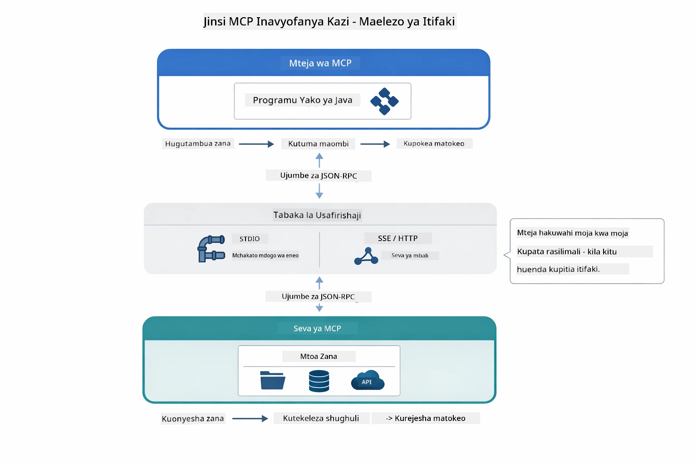

*Jinsi MCP inavyofanya kazi chini ya uso — wateja hugundua zana, kubadilishana ujumbe za JSON-RPC, na kutekeleza shughuli kupitia tabaka la usafirishaji.*

**Usanifu wa Seva-Mteja**

MCP hutumia mfano wa mteja-seva. Seva hutoa zana - kusoma faili, kuuliza hifadhidata, kuita API. Wateja (programu yako ya AI) huungana na seva na kutumia zana zao.

Ili kutumia MCP na LangChain4j, ongeza utegemezi huu wa Maven:

```xml
<dependency>
    <groupId>dev.langchain4j</groupId>
    <artifactId>langchain4j-mcp</artifactId>
    <version>${langchain4j.version}</version>
</dependency>
```

**Ugunduzi wa Zana**

Unapounganisha mteja wako kwa seva ya MCP, huuliza "Una zana gani?" Seva hurudisha orodha ya zana zilizopo, kila moja ikiwa na maelezo na muundo wa vigezo. Wakala wako wa AI anaweza kisha kuamua zana gani za kutumia kulingana na maombi ya mtumiaji. Mchoro hapa chini unaonyesha mikatano hii — mteja hutuma ombi la `tools/list` na seva hurudisha zana zake zote zilizoelezewa na muundo wa vigezo:

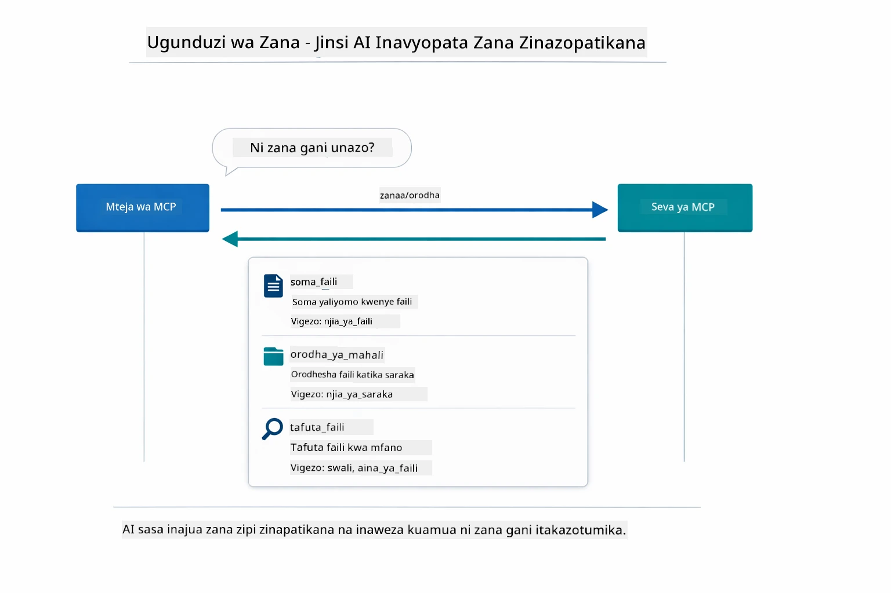

*AI hugundua zana zilizopo mwanzoni — sasa inajua uwezo uliopo na inaweza kuamua ipi itumike.*

**Mbinu za Usafirishaji**

MCP inasaidia mbinu tofauti za usafirishaji. Chaguo mbili ni Stdio (kwa mawasiliano ya michakato ya ndani) na HTTP inayoweza kupeleka data mfululizo (kwa seva za mbali). Moduli hii inaonyesha usafirishaji wa Stdio:


*Mbinu za usafirishaji za MCP: HTTP kwa seva za mbali, Stdio kwa michakato ya ndani*

**Stdio** - [StdioTransportDemo.java](../../../05-mcp/src/main/java/com/example/langchain4j/mcp/StdioTransportDemo.java)

Kwa michakato ya ndani. Programu yako huanzisha seva kama mchakato mdogo na kuwasiliana kupitia ingizo/zao la kawaida. Inafaa kwa upatikanaji wa mfumo wa faili au zana za mstari wa amri.

```java
McpTransport stdioTransport = new StdioMcpTransport.Builder()
    .command(List.of(
        npmCmd, "exec",
        "@modelcontextprotocol/server-filesystem@2025.12.18",
        resourcesDir
    ))
    .logEvents(false)
    .build();
```

Seva `@modelcontextprotocol/server-filesystem` inaonyesha zana zifuatazo, zote zimezuiliwa kwa saraka ulizochagua:

| Chombo | Maelezo |
|------|-------------|
| `read_file` | Soma yaliyomo katika faili moja |
| `read_multiple_files` | Soma faili nyingi kwa moja |
| `write_file` | Tengeneza au andika juu faili |
| `edit_file` | Fanya marekebisho maalum ya tafuta-na-badilisha |
| `list_directory` | Orodhesha faili na saraka katika njia fulani |
| `search_files` | Tafuta faili zinazolingana na muundo kwa kurudia |
| `get_file_info` | Pata metadata ya faili (ukubwa, timestamps, ruhusa) |
| `create_directory` | Tengeneza saraka (pamoja na saraka wazazi) |
| `move_file` | Hamisha au badilisha jina la faili au saraka |

Mchoro hapa chini unaonyesha jinsi usafirishaji wa Stdio unavyofanya kazi wakati wa kukimbia — programu yako ya Java huanzisha seva ya MCP kama mchakato mdogo na wanawasiliana kupitia mabomba ya stdin/stdout, bila mtandao au HTTP:

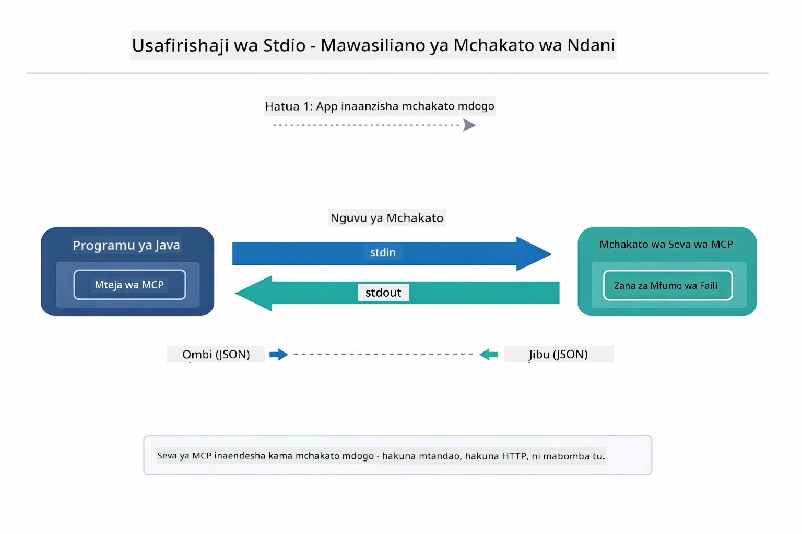

*Usafirishaji wa Stdio ukiendelea — programu yako huanzisha seva ya MCP kama mchakato mdogo na kuwasiliana kupitia mabomba ya stdin/stdout.*

> **🤖 Jaribu na [GitHub Copilot](https://github.com/features/copilot) Chat:** Fungua [`StdioTransportDemo.java`](../../../05-mcp/src/main/java/com/example/langchain4j/mcp/StdioTransportDemo.java) na uliza:
> - "Usafirishaji wa Stdio unafanya kazi vipi na ni lini ni bora kutumia badala ya HTTP?"
> - "LangChain4j hushughulikia vipi maisha ya michakato ya seva ya MCP inayozalishwa?"
> - "Madhara gani ya usalama ya kumpa AI ufikiaji wa mfumo wa faili?"

## Moduli ya Wakala

Wakati MCP hutoa zana za kiwango cha viwango, moduli ya **wakala** ya LangChain4j hutoa njia ya tamko la kuunda mawakala wanaoratibu zana hizo. Kielezi `@Agent` na `AgenticServices` hukuruhusu kufafanua tabia za wakala kupitia interfaces badala ya msimbo wa lazima.

Katika moduli hii, utachunguza mfano wa **Wakala Mkuu (Supervisor Agent)** — mbinu ya hali ya juu ya AI ya wakala ambapo wakala " mkuu" huchagua kwa msukumo ni mawakala gani wadogo ili waitwe kulingana na maombi ya mtumiaji. Tutaunganisha dhana zote mbili kwa kumpa moja ya mawakala zetu kidogo uwezo wa upatikanaji wa faili wa MCP.

Ili kutumia moduli ya wakala, ongeza utegemezi huu wa Maven:

```xml
<dependency>
    <groupId>dev.langchain4j</groupId>
    <artifactId>langchain4j-agentic</artifactId>
    <version>${langchain4j.mcp.version}</version>
</dependency>
```
> **Kumbuka:** Moduli `langchain4j-agentic` hutumia mali tofauti ya toleo (`langchain4j.mcp.version`) kwa sababu hutolewa kwa ratiba tofauti na maktaba zilizopo ya msingi za LangChain4j.

> **⚠️ Jaribio:** Moduli `langchain4j-agentic` ni **jaribio** na inaweza kubadilika. Njia thabiti ya kuunda wasaidizi wa AI bado ni `langchain4j-core` na zana maalum (Moduli 04).

## Kukimbia Mifano

### Masharti ya awali

- Umemaliza [Moduli 04 - Zana](../04-tools/README.md) (moduli hii inajenga juu ya dhana za zana maalum na kuzilinganisha na zana za MCP)
- Faili `.env` katika saraka kuu na cheti za Azure (kilichoundwa na `azd up` katika Moduli 01)
- Java 21+, Maven 3.9+
- Node.js 16+ na npm (kwa seva za MCP)

> **Kumbuka:** Ikiwa bado hujapanga mabadiliko yako ya mazingira, tazama [Moduli 01 - Utangulizi](../01-introduction/README.md) kwa maelekezo ya usakinishaji (`azd up` huunda faili `.env` kiotomatiki), au nakili `.env.example` hadi `.env` katika saraka kuu na ujaze maadili yako.

## Anza Haraka

**Kutumia VS Code:** Bonyeza kulia kwenye faili lolote la demo katika Explorer na chagua **"Run Java"**, au tumia mipangilio ya kuzindua kutoka kwa paneli ya Run and Debug (hakikisha faili `.env` yako imesanidiwa na cheti za Azure kwanza).

**Kutumia Maven:** Vinginevyo, unaweza kukimbia kutoka mstari wa amri kwa mifano ifuatayo.

### Uendeshaji wa Faili (Stdio)

Hii inaonyesha zana zinazotegemea michakato ya ndani.

**✅ Hakuna sharti la awali** - seva ya MCP huanzishwa kiotomatiki.

**Kutumia Skripti za Kuanzisha (Inayopendekezwa):**

Skripti za kuanzisha huingiza mabadiliko ya mazingira kutoka faili `.env` ya saraka kuu:

**Bash:**
```bash
cd 05-mcp
chmod +x start-stdio.sh
./start-stdio.sh
```

**PowerShell:**
```powershell
cd 05-mcp
.\start-stdio.ps1
```

**Kutumia VS Code:** Bonyeza kulia faili `StdioTransportDemo.java` na chagua **"Run Java"** (hakikisha faili yako `.env` imesanidiwa).

Programu huanzisha seva ya MCP ya mfumo wa faili kiotomatiki na husoma faili ya ndani. Angalia jinsi usimamizi wa mchakato mdogo unavyotendeka kwa niaba yako.

**Matokeo Yanayotarajiwa:**
```
Assistant response: The file provides an overview of LangChain4j, an open-source Java library
for integrating Large Language Models (LLMs) into Java applications...
```

### Wakala Mkuu

Mfano wa **Wakala Mkuu** ni aina **nyepesi** ya AI ya wakala. Mkuu hutumia LLM kuamua peke yake mawakala wadogo gani wawaithe kulingana na ombi la mtumiaji. Katika mfano unaofuata, tunaunganisha upatikanaji wa faili ulioendeshwa na MCP na wakala wa LLM kuunda mchakato wa kusoma faili → ripoti.

Katika demo, `FileAgent` husoma faili kwa kutumia zana za mfumo wa faili za MCP, na `ReportAgent` hutoa ripoti iliyopangwa yenye muhtasari mtendaji (sentensi 1), pointi kuu 3, na mapendekezo. Mkuu huandaa mchakato huu kiotomatiki:

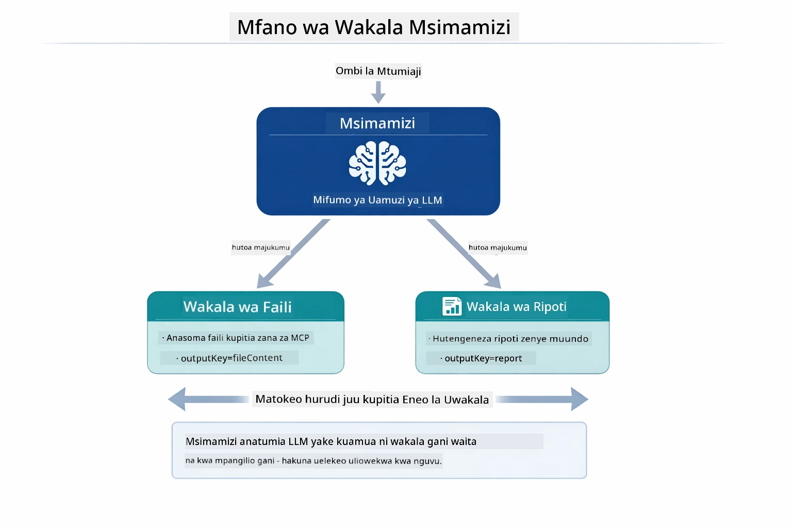

*Mkuu hutumia LLM yake kuamua ni mawakala gani wawaithe na kwa mpangilio gani — hakuna njia ngumu za kuingilia.*

Huu ndio mchakato halisi wa bomba letu la faili-kuwa-ripoti:

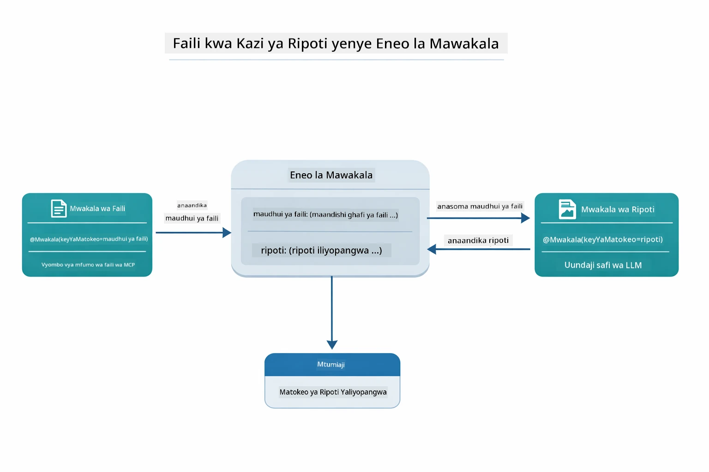

*FileAgent husoma faili kupitia zana za MCP, kisha ReportAgent hubadilisha yaliyomo kuwa ripoti iliyopangwa.*

Mchoro wa msururu ufuatao unaonyesha mchakato wa Mkuu kamili — kuanzia kuanzisha seva ya MCP, hadi uteuzi wa wakala wa Mkuu, kwa simu za zana kupitia stdio na ripoti ya mwisho:

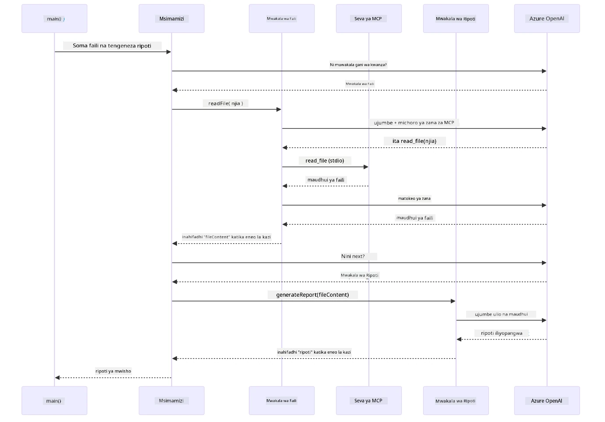

*Mkuu huwaamuru FileAgent (anayemuita seva ya MCP kupitia stdio kusoma faili), kisha ReportAgent kutengeneza ripoti iliyopangwa — kila wakala kuhifadhi pato lake katika Kiwango cha Wakala.*

Kila wakala huhifadhi matokeo yake katika **Kiwango cha Wakala** (kumbukumbu iliyoshirikiwa), ikiruhusu mawakala wa nyuma kufikia matokeo yaliyopita. Hii inaonyesha jinsi zana za MCP zinavyojumuishwa kwa urahisi katika mifumo ya wakala — Mkuu hahitaji kujua *jinsi* faili husomwa, bali tu kuwa `FileAgent` ana uwezo wa kufanya hivyo.

#### Kukimbia Demo

Skripti za kuanzisha huingiza mabadiliko ya mazingira kutoka faili `.env` ya saraka kuu:

**Bash:**
```bash
cd 05-mcp
chmod +x start-supervisor.sh
./start-supervisor.sh
```

**PowerShell:**
```powershell
cd 05-mcp
.\start-supervisor.ps1
```

**Kutumia VS Code:** Bonyeza kulia faili `SupervisorAgentDemo.java` na chagua **"Run Java"** (hakikisha faili yako `.env` imesanidiwa).

#### Jinsi Mkuu Anavyofanya Kazi

Kabla ya kuunda mawakala, unahitaji kuunganisha usafirishaji wa MCP kwa mteja na kuifunika kama `ToolProvider`. Hii ndiko jinsi zana za seva ya MCP zinavyopatikana kwa mawakala wako:

```java
// Tengeneza mteja wa MCP kutoka kwa usafiri
McpClient mcpClient = new DefaultMcpClient.Builder()
        .transport(stdioTransport)
        .build();

// Funga mteja kama ToolProvider — hili linahurumia zana za MCP ndani ya LangChain4j
ToolProvider mcpToolProvider = McpToolProvider.builder()
        .mcpClients(List.of(mcpClient))
        .build();
```

Sasa unaweza kuiingiza `mcpToolProvider` kwa wakala yeyote anayeztaji zana za MCP:

```java
// Hatua ya 1: FileAgent husoma faili kwa kutumia zana za MCP
FileAgent fileAgent = AgenticServices.agentBuilder(FileAgent.class)
        .chatModel(model)
        .toolProvider(mcpToolProvider)  // Ina zana za MCP kwa ajili ya shughuli za faili
        .build();

// Hatua ya 2: ReportAgent huunda ripoti zilizo na muundo
ReportAgent reportAgent = AgenticServices.agentBuilder(ReportAgent.class)
        .chatModel(model)
        .build();

// Supervisor huandaa mchakato wa faili → ripoti
SupervisorAgent supervisor = AgenticServices.supervisorBuilder()
        .chatModel(model)
        .subAgents(fileAgent, reportAgent)
        .responseStrategy(SupervisorResponseStrategy.LAST)  // Rudisha ripoti ya mwisho
        .build();

// Supervisor huchagua mawakala gani waite kwa msingi wa ombi
String response = supervisor.invoke("Read the file at /path/file.txt and generate a report");
```

#### Jinsi FileAgent Inavyogundua Zana za MCP Wakati wa Kukimbia

Labda unajiuliza: **Vipi `FileAgent` inajua jinsi ya kutumia zana za mifumo ya faili za npm?** Jibu ni kwamba haijui — **LLM** hutambua kwa kutumia muundo wa zana wakati wa kukimbia.
Kiolesura cha `FileAgent` ni **ufafanuzi wa prompt** tu. Hakuna maarifa yaliyowekwa moja kwa moja ya `read_file`, `list_directory`, au zana nyingine yoyote ya MCP. Hapa ni kinachotokea kuanzia mwanzo hadi mwisho:

1. **Seva inaanza:** `StdioMcpTransport` inaendesha kifurushi cha npm cha `@modelcontextprotocol/server-filesystem` kama mchakato mdogo
2. **Ugundaji wa zana:** `McpClient` hutuma ombi la JSON-RPC la `tools/list` kwa seva, ambayo hujibu na majina ya zana, maelezo, na miundo ya vigezo (mfano, `read_file` — *"Soma maudhui yote ya faili"* — `{ path: string }`)
3. **Uingizaji wa muundo:** `McpToolProvider` inaweka kando miundo hii iliyogunduliwa na kuifanikisha kwa LangChain4j
4. **Uamuzi wa LLM:** Wakati `FileAgent.readFile(path)` inapoitwa, LangChain4j hutuma ujumbe wa mfumo, ujumbe wa mtumiaji, **na orodha ya miundo ya zana** kwa LLM. LLM husoma maelezo ya zana na kuunda simu ya zana (mfano, `read_file(path="/some/file.txt")`)
5. **Utekelezaji:** LangChain4j hushika simu ya zana, kuipeleka kwa mteja wa MCP kurudi kwa mchakato mdogo wa Node.js, kupata matokeo, na kuirudisha kwa LLM

Hii ni sawa na [Ugundaji wa Zana](../../../05-mcp) ulioelezewa hapo juu, lakini ukitumika hasa kwa mtiririko wa wakala. Maandishi ya `@SystemMessage` na `@UserMessage` huongoza tabia ya LLM, wakati `ToolProvider` aliyeingizwa humpa **uwezo** — LLM huunganisha vyote viwili wakati wa utekelezaji.

> **🤖 Jaribu na [GitHub Copilot](https://github.com/features/copilot) Chat:** Fungua [`FileAgent.java`](../../../05-mcp/src/main/java/com/example/langchain4j/mcp/agents/FileAgent.java) na uliza:
> - "Wakala huyu anajua aje ni zana gani ya MCP ya kuita?"
> - "Nini kingetokea kama ningeondoa ToolProvider kutoka kwa muundaji wa wakala?"
> - "Jinsi gani miundo ya zana huhifadhiwa kwa LLM?"

#### Mikakati ya Majibu

Unapo sanidi `SupervisorAgent`, unaeleza jinsi inavyopaswa kuandaa jibu lake la mwisho kwa mtumiaji baada ya wakala ndogo kukamilisha majukumu yao. Mchoro hapa chini unaonyesha mikakati mitatu inayopatikana — LAST hurudisha matokeo ya wakala wa mwisho moja kwa moja, SUMMARY huunganisha matokeo yote kupitia LLM, na SCORED huchagua ile inayopata alama ya juu zaidi dhidi ya ombi la awali:

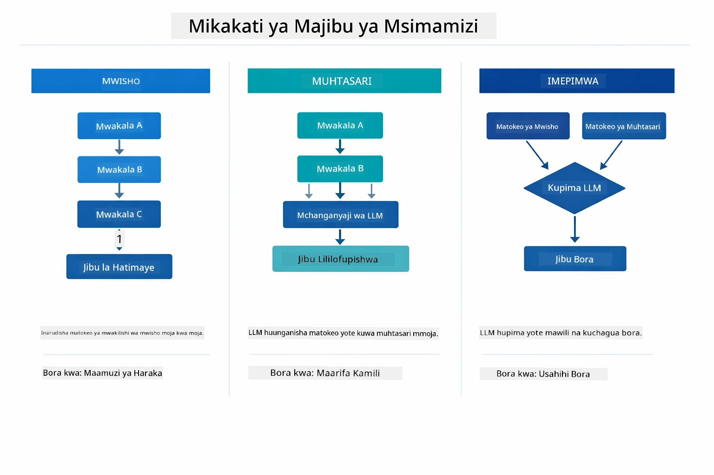

*Mikakati mitatu ya jinsi Supervisor huunda jibu lake la mwisho — chagua kulingana na unavyotaka matokeo ya wakala wa mwisho, muhtasari uliounganishwa, au chaguo lenye alama bora.*

Mikakati inayopatikana ni:

| Mkakati | Maelezo |
|----------|-------------|
| **LAST** | Msimamizi hurudisha matokeo ya wakala mdogo wa mwisho au zana iliyotumiwa. Hii ni muhimu wakati wakala wa mwisho katika mtiririko wa kazi ameundwa mahsusi kutoa jibu kamili la mwisho (mfano, "Wakala Muhtasari" katika bomba la utafiti). |
| **SUMMARY** | Msimamizi hutumia Modeli yake ya Lugha (LLM) kutengeneza muhtasari wa maingiliano yote na matokeo ya wakala ndogo, kisha hurudisha muhtasari huo kama jibu la mwisho. Hii hutoa jibu safi lililojumuishwa kwa mtumiaji. |
| **SCORED** | Mfumo hutumia LLM ya ndani kupima alama za jibu la LAST na muhtasari (SUMMARY) wa maingiliano dhidi ya ombi la mtumiaji la awali, na kurudisha matokeo yaliyo na alama kubwa zaidi. |

Tazama [SupervisorAgentDemo.java](../../../05-mcp/src/main/java/com/example/langchain4j/mcp/SupervisorAgentDemo.java) kwa utekelezaji kamili.

> **🤖 Jaribu na [GitHub Copilot](https://github.com/features/copilot) Chat:** Fungua [`SupervisorAgentDemo.java`](../../../05-mcp/src/main/java/com/example/langchain4j/mcp/SupervisorAgentDemo.java) na uliza:
> - "Msimamizi huchaguaje wakala gani wa kuita?"
> - "Nini tofauti kati ya Supervisor na mifumo ya mtiririko wa kazi ya mfuatano?"
> - "Ninawezaje kubinafsisha tabia ya mipango ya Supervisor?"

#### Kuelewa Matokeo

Unaporun demo, utaona maelezo yaliyopangwa ya jinsi Msisimamizi anavyoendesha wakala wengi. Hapa ni kile kila sehemu inamaanisha:

```
======================================================================
  FILE → REPORT WORKFLOW DEMO
======================================================================

This demo shows a clear 2-step workflow: read a file, then generate a report.
The Supervisor orchestrates the agents automatically based on the request.
```

**Kichwa cha habari** kinaanzisha dhana ya mtiririko wa kazi: bomba lililolenga kutoka kusoma faili hadi uzalishaji wa taarifa.

```
--- WORKFLOW ---------------------------------------------------------
  ┌─────────────┐      ┌──────────────┐
  │  FileAgent  │ ───▶ │ ReportAgent  │
  │ (MCP tools) │      │  (pure LLM)  │
  └─────────────┘      └──────────────┘
   outputKey:           outputKey:
   'fileContent'        'report'

--- AVAILABLE AGENTS -------------------------------------------------
  [FILE]   FileAgent   - Reads files via MCP → stores in 'fileContent'
  [REPORT] ReportAgent - Generates structured report → stores in 'report'
```

**Mchoro wa Mtiririko wa Kazi** unaonyesha mtiririko wa data kati ya mawakala. Kila wakala ana jukumu maalum:
- **FileAgent** husoma faili kwa kutumia zana za MCP na kuhifadhi maudhui ghafi katika `fileContent`
- **ReportAgent** hutumia maudhui hayo na kuzalisha ripoti yenye muundo katika `report`

```
--- USER REQUEST -----------------------------------------------------
  "Read the file at .../file.txt and generate a report on its contents"
```

**Ombi la Mtumiaji** linaonyesha kazi. Msisimamizi huchambua na kuamua kuitisha FileAgent → ReportAgent.

```
--- SUPERVISOR ORCHESTRATION -----------------------------------------
  The Supervisor decides which agents to invoke and passes data between them...

  +-- STEP 1: Supervisor chose -> FileAgent (reading file via MCP)
  |
  |   Input: .../file.txt
  |
  |   Result: LangChain4j is an open-source, provider-agnostic Java framework for building LLM...
  +-- [OK] FileAgent (reading file via MCP) completed

  +-- STEP 2: Supervisor chose -> ReportAgent (generating structured report)
  |
  |   Input: LangChain4j is an open-source, provider-agnostic Java framew...
  |
  |   Result: Executive Summary...
  +-- [OK] ReportAgent (generating structured report) completed
```

**Utawala wa Msisimamizi** unaonyesha mtiririko wa hatua 2 katika utekelezaji:
1. **FileAgent** husoma faili kupitia MCP na kuhifadhi maudhui
2. **ReportAgent** hupokea maudhui na kuunda ripoti yenye muundo

Msisimamizi alifanya maamuzi haya **kwa uhuru** kulingana na ombi la mtumiaji.

```
--- FINAL RESPONSE ---------------------------------------------------
Executive Summary
...

Key Points
...

Recommendations
...

--- AGENTIC SCOPE (Data Flow) ----------------------------------------
  Each agent stores its output for downstream agents to consume:
  * fileContent: LangChain4j is an open-source, provider-agnostic Java framework...
  * report: Executive Summary...
```

#### Maelezo ya Sifa za Moduli za Wakala

Mfano unaonyesha sifa kadhaa za hali ya juu za moduli ya wakala. Tuchunguze kwa karibu Agentic Scope na Agent Listeners.

**Agentic Scope** inaonyesha kumbukumbu ya pamoja ambapo mawakala walihifadhi matokeo yao kwa kutumia `@Agent(outputKey="...")`. Hii huruhusu:
- Mawakala wa baadaye kufikia matokeo ya mawakala wa awali
- Msisimamizi kuunganisha jibu la mwisho
- Wewe kukagua kile kila wakala alichotoa

Mchoro hapa chini unaonyesha jinsi Agentic Scope inavyofanya kazi kama kumbukumbu ya pamoja katika mtiririko wa faili-kwa-ripoti — FileAgent anaandika matokeo yake chini ya ufunguo `fileContent`, ReportAgent anasoma na kuandika matokeo yake chini ya `report`:

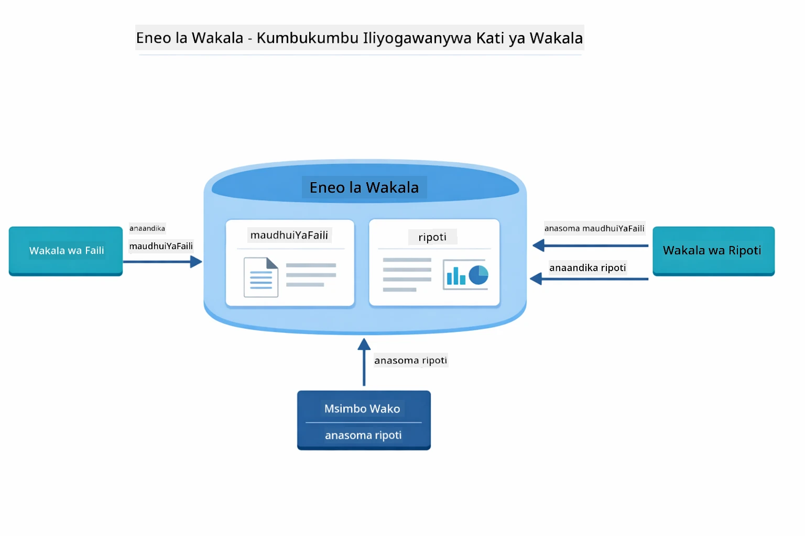

*Agentic Scope hutumika kama kumbukumbu ya pamoja — FileAgent anaandika `fileContent`, ReportAgent anasoma na kuandika `report`, na msimbo wako unasoma matokeo ya mwisho.*

```java
ResultWithAgenticScope<String> result = supervisor.invokeWithAgenticScope(request);
AgenticScope scope = result.agenticScope();
String fileContent = scope.readState("fileContent");  // Data iliyopo kwenye faili kutoka kwa FileAgent
String report = scope.readState("report");            // Ripoti iliyo na muundo kutoka kwa ReportAgent
```

**Agent Listeners** huwezesha ufuatiliaji na urekebishaji wa makosa wakati wa utekelezaji wa wakala. Matokeo ya hatua kwa hatua unayoona katika demo yanatoka kwa AgentListener inayoshikilia kila wito wa wakala:
- **beforeAgentInvocation** - Inaitwa wakati Msisimamizi anapochagua wakala, ikikupa nafasi ya kuona ni wakala gani alichaguliwa na kwa nini
- **afterAgentInvocation** - Inaitwa baada ya wakala kukamilisha, ikionyesha matokeo yake
- **inheritedBySubagents** - Wakati ni kweli, msikilizaji hufuatilia mawakala wote katika daraja

Mchoro ufuatao unaonyesha maisha kamili ya Agent Listener, ikiwa ni pamoja na jinsi `onError` inavyoshughulikia makosa wakati wa utekelezaji wa wakala:

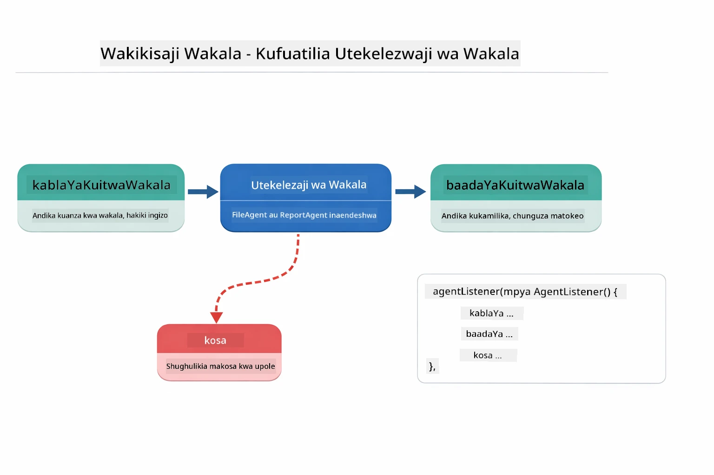

*Agent Listeners hushikilia mzunguko wa maisha wa utekelezaji — fuatilia wakati mawakala wanaanza, wanamaliza, au wanapokutana na makosa.*

```java
AgentListener monitor = new AgentListener() {
    private int step = 0;
    
    @Override
    public void beforeAgentInvocation(AgentRequest request) {
        step++;
        System.out.println("  +-- STEP " + step + ": " + request.agentName());
    }
    
    @Override
    public void afterAgentInvocation(AgentResponse response) {
        System.out.println("  +-- [OK] " + response.agentName() + " completed");
    }
    
    @Override
    public boolean inheritedBySubagents() {
        return true; // Sambaza kwa maajenti wote kidogo
    }
};
```

Zaidi ya mfano wa Supervisor, moduli ya `langchain4j-agentic` hutoa mifumo kadhaa yenye nguvu ya mtiririko wa kazi. Mchoro hapa chini unaonyesha yote matano — kutoka bomba rahisi la mfuatano hadi mifumo ya idhini yenye mpangilio wa binadamu ndani ya mzunguko:

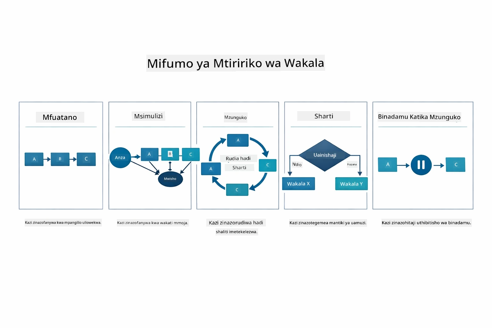

*Mifumo mitano ya mtiririko wa kazi kwa kuendesha mawakala — kutoka bomba rahisi la mfuatano hadi mifumo yenye idhini ya binadamu.*

| Mfano | Maelezo | Matumizi |
|---------|-------------|----------|
| **Sequential** | Endesha mawakala kwa mpangilio, matokeo huingia kwa mwingine | Bomba: tafiti → uchambuzi → ripoti |
| **Parallel** | Endesha mawakala kwa wakati mmoja | Majukumu huru: hali ya hewa + habari + hisa |
| **Loop** | Rudia hadi hali ikamilike | Kupima ubora: boresha hadi alama ≥ 0.8 |
| **Conditional** | Elekeza kulingana na masharti | Panga → peleka kwa mtaalamu wakala |
| **Human-in-the-Loop** | Ongeza hatua za mtu | Mifumo ya idhini, mapitio ya maudhui |

## Dhana Muhimu

Sasa umechunguza MCP na moduli ya wakala ikitekelezwa, hebu tumshezeshe wakati wa kutumia kila njia.

Moja ya faida kubwa za MCP ni mazingira yake yanayokua. Mchoro hapa chini unaonyesha jinsi itifaki moja ya ulimwengu inavyounganisha programu yako ya AI na seva mbalimbali za MCP — kutoka upatikanaji wa mfumo wa faili na hifadhidata hadi GitHub, barua pepe, uchimbaji wavuti, na zaidi:

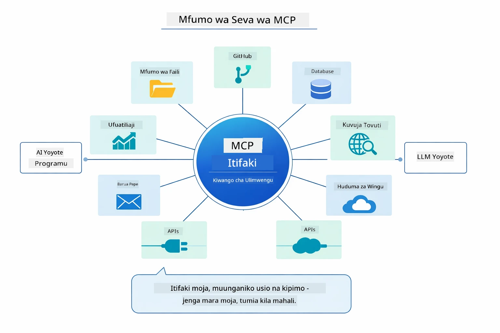

*MCP huunda ekosistimu ya itifaki ya ulimwengu — seva yoyote ya MCP huendana na mteja yoyote wa MCP, ikiruhusu kushirikiana kwa zana kati ya programu.*

**MCP** ni bora unapotaka kutumia mifumo ya zana zilizopo, kujenga zana zinazoshirikishwa na programu nyingi, kuunganisha huduma za wahusika wa tatu kwa itifaki za kawaida, au kubadilisha utekelezaji wa zana bila kubadilisha msimbo.

**Moduli ya Wakala** inaendana vyema unapotaka ufafanuzi wa wakala kwa kutumia alama za `@Agent`, unahitaji udhibiti wa mtiririko wa kazi (mfuatano, mizunguko, sambamba), unapendelea muundo wa wakala unaotegemea kiolesura kuliko msimbo wa amri, au unapotumia mawakala wengi wanaoshirikiana matokeo kupitia `outputKey`.

**Mfumo wa Wakala wa Msisimamizi** unapendeza unapotu mtiririko wa kazi hauwezi kutabirika mapema na unataka LLM ichague, wakati unakuwa na mawakala maalum kadhaa wanaohitaji usimamizi wa hali ya juu, unapojenga mifumo ya mazungumzo inayompeleka mtumiaji kwa uwezo tofauti, au unapotaka tabia ya wakala yenye ufanisi na inayobadilika.

Kusaidia uamuzi kati ya njia ya `@Tool` za kawaida kutoka Moduli ya 04 na zana za MCP kutoka moduli hii, ulinganisho ufuatao unaweka wazi faida kuu — zana za kawaida hutoa uhusiano wa karibu na usalama wa aina kamili kwa mantiki maalum, wakati zana za MCP zinatoa uunganishaji wa kawaida, unaoweza kutumika tena:

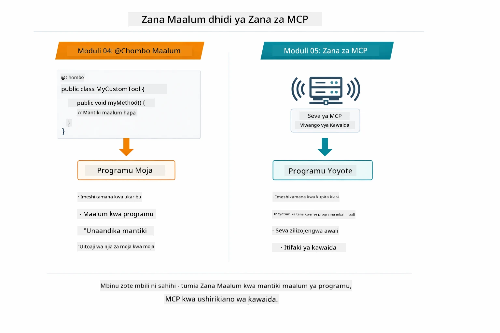

*Wakati wa kutumia njia za kawaida @Tool dhidi ya zana za MCP — zana za kawaida kwa mantiki maalum na usalama kamili wa aina, zana za MCP kwa usawa wa viunganishi vinavyofanya kazi kwenye programu tofauti.*

## Hongera!

Umefika mwisho wa moduli zote tano za LangChain4j kwa Waanzilishi! Hapa ni muhtasari wa safari kamili ya kujifunza uliyokamilisha — kutoka mazungumzo ya msingi hadi mifumo ya wakala yenye nguvu ya MCP:

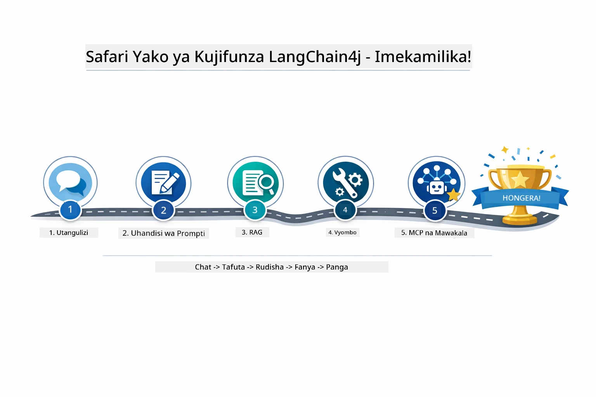

*Safari yako ya kujifunza kupitia moduli zote tano — kutoka mazungumzo ya msingi hadi mifumo ya wakala yenye nguvu ya MCP.*

Umekamilisha kozi ya LangChain4j kwa Waanzilishi. Umejifunza:

- Jinsi ya kujenga AI ya mazungumzo yenye kumbukumbu (Moduli 01)
- Mifumo ya uhandisi wa prompt kwa kazi tofauti (Moduli 02)
- Kuunganisha majibu na nyaraka zako kwa RAG (Moduli 03)
- Kuunda mawakala wa AI wa msingi (wasaidizi) kwa zana za kawaida (Moduli 04)
- Kuunganisha zana za kawaida kupitia moduli za LangChain4j MCP na Agentic (Moduli 05)

### Nini Kinachofuata?

Baada ya kukamilisha moduli, chunguza [Mwongozo wa Mtihani](../docs/TESTING.md) kuona dhana za mtihani za LangChain4j zikitumika.

**Rasilimali Rasmi:**
- [Nyaraka za LangChain4j](https://docs.langchain4j.dev/) - Miongozo kamili na marejeleo ya API
- [LangChain4j GitHub](https://github.com/langchain4j/langchain4j) - Chanzo cha msimbo na mifano
- [LangChain4j Mafunzo](https://docs.langchain4j.dev/tutorials/) - Mafunzo ya hatua kwa hatua kwa matumizi mbalimbali

Asante kwa kukamilisha kozi hii!

---

**Uvinjari:** [← Iliyotangulia: Moduli 04 - Zana](../04-tools/README.md) | [Rudi Kwenye Msingi](../README.md)

---

<!-- CO-OP TRANSLATOR DISCLAIMER START -->
**Kandhari ya Majawabahu:**
Hati hii imetafsiriwa kwa kutumia huduma ya utafsiri kwa AI [Co-op Translator](https://github.com/Azure/co-op-translator). Ingawa tunajitahidi kufikia usahihi, tafadhali fahamu kwamba tafsiri za kiotomatiki zinaweza kuwa na makosa au upungufu wa usahihi. Hati ya asili katika lugha yake ya asili inapaswa kuzingatiwa kama chanzo cha kuaminika. Kwa taarifa muhimu, tafsiri ya kitaalamu inayofanywa na binadamu inashauriwa. Hatuhusiki kwa masimulizi au tafsiri potofu zinazotokana na matumizi ya tafsiri hii.
<!-- CO-OP TRANSLATOR DISCLAIMER END -->