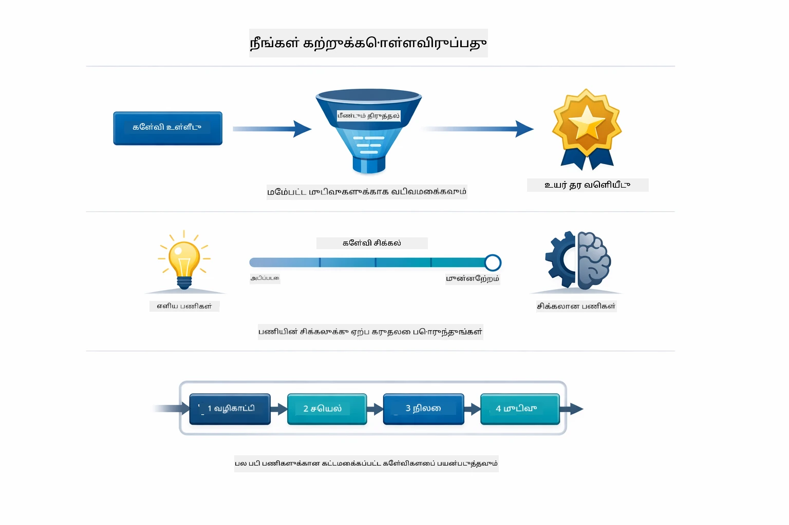
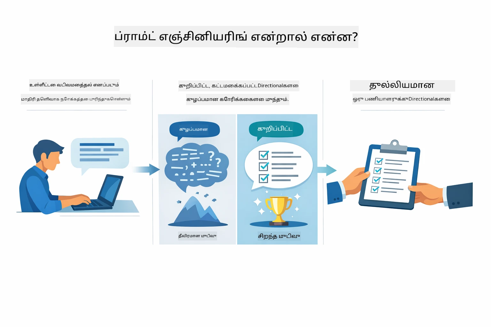
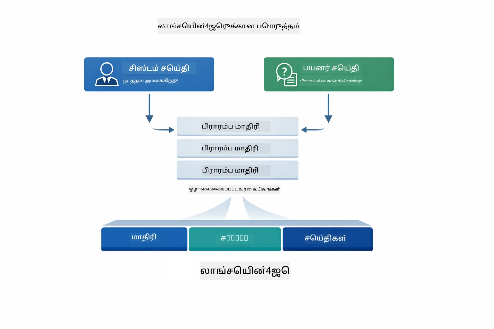
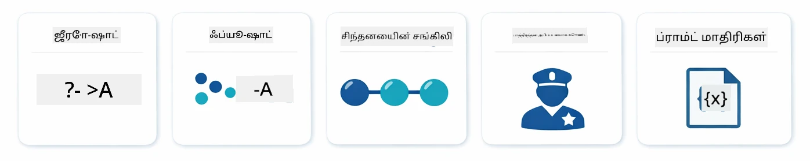
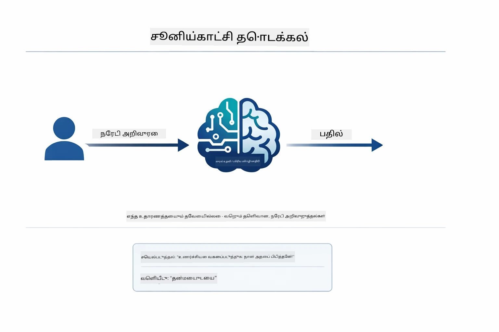
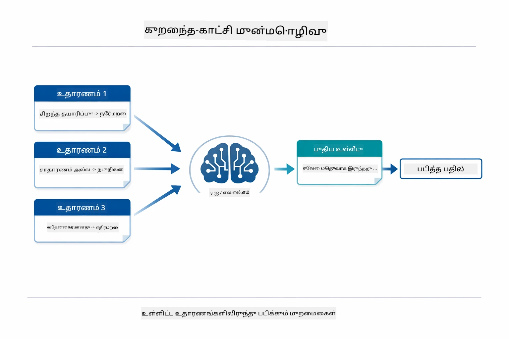
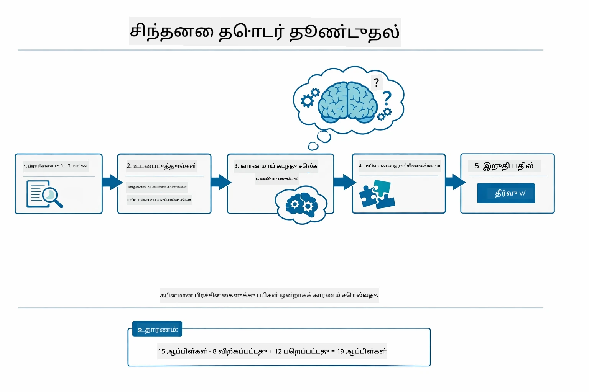
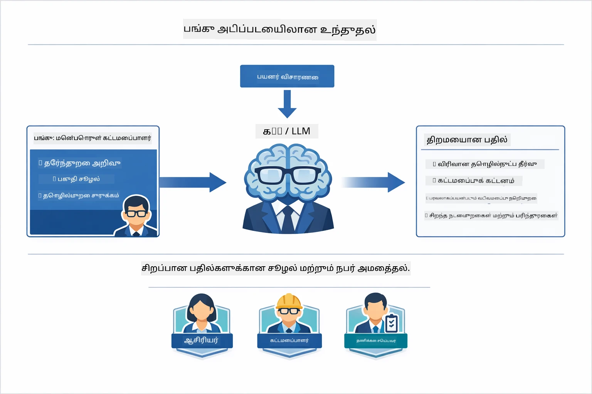
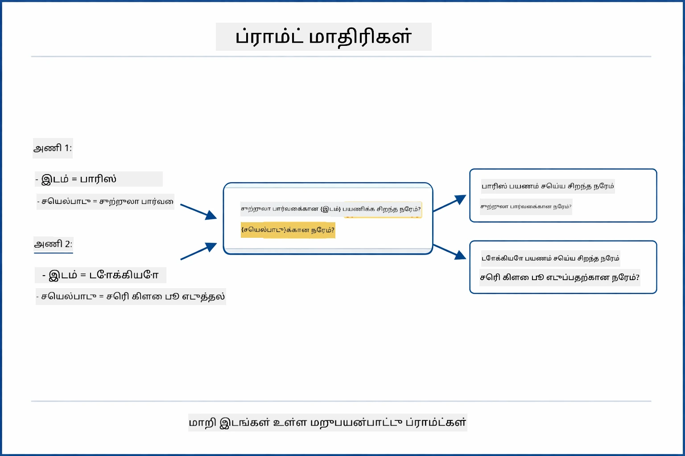
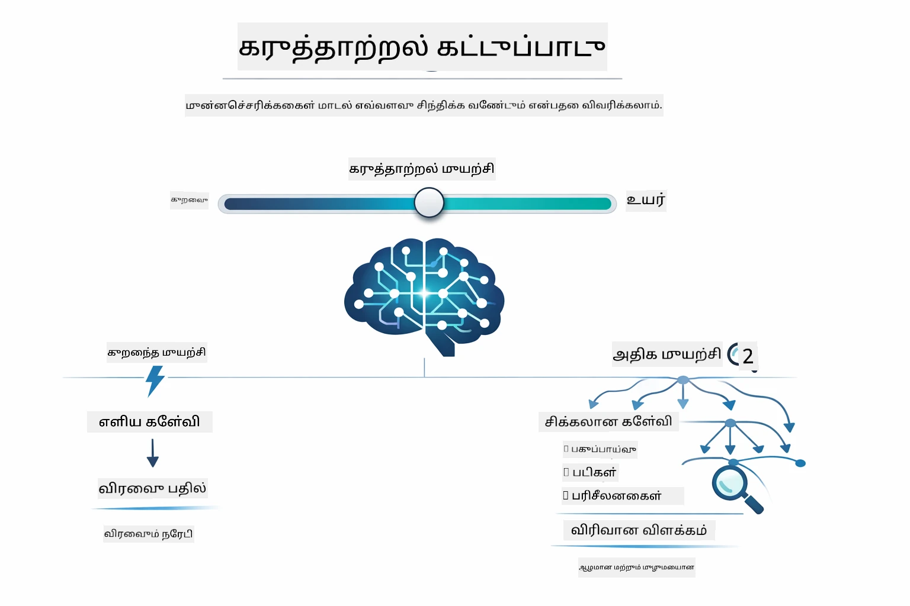

# Module 02: GPT-5.2 உடன் பிராம்ட் பொறியியல்

## உள்ளடக்க அட்டவணை

- [நீங்கள் கற்றுக் கொள்ளப்போகும் விசைகள்](../../../02-prompt-engineering)
- [முன் நிபுணத்துவங்கள்](../../../02-prompt-engineering)
- [பிராம்ட் பொறியியலைப் புரிந்து கொள்வது](../../../02-prompt-engineering)
- [பிராம்ட் பொறியியல் அடிப்படைகள்](../../../02-prompt-engineering)
  - [கோஒ-ஷாட் பிராம்டிங்](../../../02-prompt-engineering)
  - [ஃபியூ-ஷாட் பிராம்டிங்](../../../02-prompt-engineering)
  - [சிந்தனை தொடர்ச்சி](../../../02-prompt-engineering)
  - [பங்கு அடிப்படையிலான பிராம்டிங்](../../../02-prompt-engineering)
  - [பிராம்ட் டெம்ப்ளேட்டுகள்](../../../02-prompt-engineering)
- [உயர் நிலை முறைகள்](../../../02-prompt-engineering)
- [உள்ளிருக்கிற Azure வளங்களைப் பயன்படுத்துதல்](../../../02-prompt-engineering)
- [அப்ளிகேஷன் ஸ்கிரீன்ஷாட்கள்](../../../02-prompt-engineering)
- [முறைகளை ஆராய்தல்](../../../02-prompt-engineering)
  - [குறைந்த பதில் ஆர்வம் மற்றும் அதிக பதில் ஆர்வம்](../../../02-prompt-engineering)
  - [திட்டம் செயல்படுத்தல் (கருவி முன்னுரை)](../../../02-prompt-engineering)
  - [சுய-பார்வை குறியீடு](../../../02-prompt-engineering)
  - [கட்டமைக்கப்பட்ட பகுப்பாய்வு](../../../02-prompt-engineering)
  - [பல-தொடர் உரையாடல்](../../../02-prompt-engineering)
  - [படி படியாக காரணமறிதல்](../../../02-prompt-engineering)
  - [கட்டுப்படுத்தப்பட்ட வெளியீடு](../../../02-prompt-engineering)
- [நீங்கள் உண்மையில் கற்றுக்கொள்ளும் விஷயங்கள்](../../../02-prompt-engineering)
- [அடுத்த படிகள்](../../../02-prompt-engineering)

## நீங்கள் கற்றுக்கொள்ளப்போகுவது



முந்தைய மொடியூலில், நினைவகத்தின் மூலம் உரையாடல் AI எவ்வாறு இயங்குகிறது மற்றும் அடிப்படை தொடர்புகளுக்கு GitHub மாடல்களை எப்படி பயன்படுத்துவது என்பதை பார்த்தீர்கள். இப்போது, கேள்விகள் எப்படி கேட்கப்படும் என்பதைக் கவனிப்போம் — அதாவது பிராம்ட்கள் — Azure OpenAI இன் GPT-5.2 பயன்படுத்தி. நீங்கள் உங்கள் பிராம்ட்களை அமைக்கும் விதம் பெறும் பதில்களின் தரத்தை மிகுந்த அளவில் மாற்றிவிடும். நாங்கள் முதலில் அடிப்படையான பிராம்டிங் தொழில்நுட்பங்களை பரிசிலித்து, பின் GPT-5.2 இன் முழு திறன்களை பயன்படுத்து ்தற்கான எட்டு உயர் நிலை முறைகளுக்கு வருவோம்.

GPT-5.2யை நாங்கள் பயன்படுத்துகிறோம் காரணம், இது காரணமறிதல் கட்டுப்பாட்டை கொண்டு வருகிறது - பதிலளிக்கும் முன் எந்த அளவு சிந்தனை செய்ய வேண்டும் என்பதை மாதிரிக்குக் கூற முடியும். இது பிராம்ட் உருவாக்கக் கொள்கைகளை தெளிவுபடுத்துகிறது மற்றும் எந்த முறையை எப்போது பயன்படுத்த வேண்டும் என்பதை புரிய உதவுகிறது. GitHub மாடல்களுடன் ஒப்பிடுகையில், Azure  GPT-5.2க்கு குறைந்த விகித வரம்புகளை வழங்குகிறது எனும் நன்மையும் உண்டு.

## முன் நிபுணத்துவங்கள்

- Module 01 முடித்திருப்பது (Azure OpenAI வளங்கள் அமைக்கப்பட்டுள்ளன)
- ரூட் இயக்க அடைவில் `.env` கோப்பு Azure அங்கீகாரங்களுடன் உள்ளது (Module 01 இல் `azd up` இயக்கு உருவாக்கியது)

> **குறிப்பு:** Module 01 முடிக்கவில்லையெனில், முதலில் அங்கு வழங்கிய அமைப்பு வழிமுறைகளை பின்பற்றவும்.

## பிராம்ட் பொறியியலைப் புரிந்து கொள்வது



பிராம்ட் பொறியியல் என்பது தேவையான முடிவுகளை தொடர்ந்து பெறக் கூடிய உள்ளீடு உரையினை வடிவமைப்பதாகும். இது கேள்விகளை கேட்கும் மட்டுமல்ல - மாதிரிக்கு நீங்கள் என்ன வேண்டும், அதை எப்படி வழங்க வேண்டும் என்பதை தெளிவாக புரிந்து கொள்ளக்கூடிய கோரிக்கைகளை அமைப்பதாகும்.

இதை ஒரு சக ஊழியருக்கு அறிவுறுத்தல்கள் கூறுவது போல நண்கொள்ளுங்கள். "பிழையை சரி செய்" என்பது பொதுவான ஒரு சொல்லாகும். "UserService.java கோப்பின் 45வது வரியில் இருக்கும் null pointer தவறை null சோதனையுடன் சரி செய்" என்பது தெளிவானது. மொழி மாதிரிகள் இதே விதமாக செயற்படுகின்றன - தெளிவும் அமைப்பும் முக்கியம்.



LangChain4j என்பது அடிப்படை செயல்முறை — மாதிரி இணைப்புகள், நினைவகங்கள் மற்றும் செய்தி வகைகள் — வழங்குகிறது, பிராம்ட் முறைகள் அதிலிருந்து வாங்கும் பராமரிக்கப்பட்ட அமைப்பு உரை மாத்திரம். முக்கிய கட்டமைப்புகள் `SystemMessage` (AI நடத்தையும் பங்கை அமைக்கிறது) மற்றும் `UserMessage` (உங்களின் விண்ணப்பத்தை கொண்டுள்ளது).

## பிராம்ட் பொறியியல் அடிப்படைகள்



இந்த மொடியூலில் உள்ள உயர் நிலை முறைகளை நுழைந்ததற்கு முன், ஐந்து அடிப்படையான பிராம்டிங் தொழில்நுட்பங்களை கற்போம். இவை ஒவ்வொரு பிராம்ட் பொறியாளர் தெரிந்திருக்க வேண்டிய கட்டமைப்புகளாகும். நீங்கள் ஏற்கனவே [Quick Start module](../00-quick-start/README.md#2-prompt-patterns) பார்த்திருந்தால், இவை உங்கள் அனுபவத்தில் இருந்தாலும்கூட, இதோ இவரது கருத்துக் கட்டமைப்பு.

### கோஒ-ஷாட் பிராம்டிங்

செரிய முயற்சி: மாதிரிக்கு எந்த எடுத்துக்காட்டுகளும் இல்லாமல் ஒரு நேரடி ஆயத்தம் கொடுங்கள். மாதிரி அதன் பயிற்சித்திறனை முழுமையாக நம்பி பணியை புரிந்து செயற்படும். இது எளிதான கோரிக்கைகளுக்கு மிகவும் பொருத்தமாகும்.



*எடுத்துக்காட்டுகள் இல்லாமல் நேரடி ஆயத்தம் — மாதிரி அதிலேயே பணியைக் கண்டு செயலை புரிந்து கொள்கிறது*

```java
String prompt = "Classify this sentiment: 'I absolutely loved the movie!'";
String response = model.chat(prompt);
// பதில்: "நேர்மறை"
```

**பயன்படுத்த நேரம்:** எளிய வகைப்பாடு, நேரடி கேள்விகள், மொழிபெயர்ப்புகள் அல்லது கூடுதல் வழிகாட்டி தேவையில்லாத பணிகளுக்கு.

### ஃபியூ-ஷாட் பிராம்டிங்

நீங்கள் விரும்பும் வடிவத்தை மாதிரி அறிந்துகொள்ள உதவ கூடிய எடுத்துக்காட்டுகளை அளிக்கவும். மாதிரி உங்கள் எடுத்துக்காட்டுகளிலிருந்து உள்ளீடு-வெளியீடு வடிவத்தை கற்றுக்கொண்டு புதிய உள்ளீடுகளில் அதைப் பயன்படுத்தும். இது விருப்பமான வடிவம் அல்லது நடத்தைகள் தெளிவாக இல்லாத வேலைகளில் ஒருமைப்படுத்தலை மிகச் சிறப்பாகச் செய்கிறது.



*எடுத்துக்காட்டுகளிலிருந்து கற்றுக்கொள்கிறது — மாதிரி வடிவத்தை கண்டறிந்து புதிதாக செயல்படுத்துகிறது*

```java
String prompt = """
    Classify the sentiment as positive, negative, or neutral.
    
    Examples:
    Text: "This product exceeded my expectations!" → Positive
    Text: "It's okay, nothing special." → Neutral
    Text: "Waste of money, very disappointed." → Negative
    
    Now classify this:
    Text: "Best purchase I've made all year!"
    """;
String response = model.chat(prompt);
```

**பயன்படுத்த நேரம்:** அசலான வகைப்பாடு, ஒருமைப்படுத்தப்பட்ட வடிவமைப்பு, பிரிவுக்கான பணிகள், அல்லது கோஒ-ஷாட் பதில்கள் மறுமொழியாக இருக்கும்போது.

### சிந்தனை தொடர்ச்சி

மாதிரிக்குக் காரணமறிதல் தாமதம் காட்டச் சொல்லுங்கள். நேரடி விடையுக்கு செல்லாமல், மாதிரி பிரச்சனையை உடைந்து பகுதி பகுதி விளக்கமாக முயற்சிக்கிறது. இது கணிதம், தார்க்கிகம் மற்றும் பல படி சிந்தனை பணிகளில் துல்லியத்தை அதிகரிக்கிறது.



*படி படியாக காரணமறிதல் — சிக்கலான பிரச்சனைகளை தெளிவான தார்க்கிக படிகளாக்குதல்*

```java
String prompt = """
    Problem: A store has 15 apples. They sell 8 apples and then 
    receive a shipment of 12 more apples. How many apples do they have now?
    
    Let's solve this step-by-step:
    """;
String response = model.chat(prompt);
// மாதிரி காட்டுகிறது: 15 - 8 = 7, பின்னர் 7 + 12 = 19 சே Apples
```

**பயன்படுத்த நேரம்:** கணிதம், தர்க்க நுணுக்கங்கள், பிழை திருத்துதல் அல்லது காரணமறிதல் செயல்முறையை கண்டு கொள்ள வேண்டிய பணிகளுக்கு.

### பங்கு அடிப்படையிலான பிராம்டிங்

உங்கள் கேள்விக்கு முன் ஒரு பாத்திரம் அல்லது பங்கேற்பை AIக்குத் தெளிவுபடுத்துங்கள். இது பதிலின் தொனியும் ஆழமும் கவனத்தையும் மாற்றுகிறது. "சாப்ட்வேர் கட்டுமான அலுவலர்" மற்றும் "சிறுவர் டெவலப்பர்" அல்லது "பாதுகாப்பு ஆராய்ச்சியாளர்" கொடுக்கும் விளக்கங்கள் வேறுபடும்.



*சூழலை மற்றும் பாத்திரத்தை அமைத்தல் — ஒரே கேள்விக்கு விதவிதமான பதில்கள்*

```java
String prompt = """
    You are an experienced software architect reviewing code.
    Provide a brief code review for this function:
    
    def calculate_total(items):
        total = 0
        for item in items:
            total = total + item['price']
        return total
    """;
String response = model.chat(prompt);
```

**பயன்படுத்த நேரம்:** குறியீடு மதிப்பீடுகள், பயிற்சி, பிரிவுக்கான பகுப்பாய்வு அல்லது குறிப்பிட்ட திறமைகோவை அல்லது பார்வைக்கு ஏற்ப பதில்கள் தேவைப்படும்போது.

### பிராம்ட் டெம்ப்ளேட்டுகள்

மாறிலி இடங்கள் கொண்ட மீண்டும் பயன்படுத்தக் கூடிய பிராம்ட்களை உருவாக்குங்கள். ஒவ்வொன்றும் புதிய பிராம்ட் எழுதுவதற்கு பதிலாக, ஒருமுறை டெம்ப்ளேட் உருவாக்கி மாறிலிகள் கொண்டு பூர்த்தி செய்யுங்கள். LangChain4j இன் `PromptTemplate` வகுப்பு இதற்கு `{{variable}}` வகை உரையை வழங்குகிறது.



*மாறிலிகள் கொண்ட மீண்டும் பிரயோகம் செல்லும் பிராம்ட்கள் — ஒரே டெம்ப்ளேட், பல பயன்பாடுகள்*

```java
PromptTemplate template = PromptTemplate.from(
    "What's the best time to visit {{destination}} for {{activity}}?"
);

Prompt prompt = template.apply(Map.of(
    "destination", "Paris",
    "activity", "sightseeing"
));

String response = model.chat(prompt.text());
```

**பயன்படுத்த நேரம்:** மாறுபட்ட உள்ளீடுகளுடன் மீண்டும் கேட்கும் விண்ணப்பங்கள், தொகுதி செயலாக்கம், மீண்டும் பயன்படுத்தக் கூடிய AI வேலைப்பாடுகள் அல்லது கட்டமைப்பு அதே ஆனால் தரவு மாறும் போது.

---

இந்த ஐந்து அடிப்படைகள் பெரும்பாலான பிராம்ட் பணிகளுக்கு ஒரு வலுவான கருவி தொகுப்பை வழங்கும். இதன் மீதமான பகுதி **எட்டு உயர் நிலை முறைகள்** மூலம் GPT-5.2 இன் காரணமறிதல் கட்டுப்பாடு, சுய-மதிப்பீடு, மற்றும் கட்டமைப்பான வெளியீடு திறன்களை முழுமையாகப் பயன்படுத்துகிறது.

## உயர் நிலை முறைகள்

அடிப்படைகள் முடிந்துவிட்டதால், இ module-ஐ தனித்துவமாக்கும் எட்டு உயர் நிலை முறைகளுக்கு செல்லலாம். எல்லா பிரச்னைகளுக்கும் ஒரே வழி பொருந்தாது. சில கேள்விகளுக்கு விரைவான பதில் தேவை, சிலக்கு ஆழமான சிந்தனை தேவைவும். சிலக்கு காரணமறிதல் தெரிந்தும்தான் போதுமானது, மற்றவை முடிவுகளான்ல் ப்ரதிபலிக்கும். கீழுள்ள ஒவ்வொரு முறை வேறுவிதமான சூழலுக்கு உகந்ததாகும் — GPT-5.2 இன் காரணமறிதல் கட்டுப்பாடு வேறுபாடுகளை மிக தெளிவாகக் காட்டுகிறது.


*எட்டு பிராம்ட் பொறியியல் முறைகளின் மேம்பார்வை மற்றும் அவற்றின் பயன்பாடுகள்*



*GPT-5.2 காரணமறிதல் கட்டுப்பாடு மாதிரிக்கு எவ்வளவு சிந்தனை செய்யவேண்டும் என்பதை குறிப்பிட அனுமதிக்கிறது — விரைவு நேரடி பதிலிடலிலிருந்து ஆழமான ஆய்வுக்குள் மாற்றம்*

**குறைந்த பதில் ஆர்வம் (விரைவு & கவனமாக):** எளிய கேள்விகளுக்கான விரைவு, நேரடி பதில்கள். மாதிரி குறைந்த காரணமறிதல் செய்கிறது - அதிகபட்சம் 2 படிகள். கணக்கீடு, தேடல் அல்லது நேரடியான கேள்விகளுக்கு இதை பயன்படுத்தவும்.

```java
String prompt = """
    <context_gathering>
    - Search depth: very low
    - Bias strongly towards providing a correct answer as quickly as possible
    - Usually, this means an absolute maximum of 2 reasoning steps
    - If you think you need more time, state what you know and what's uncertain
    </context_gathering>
    
    Problem: What is 15% of 200?
    
    Provide your answer:
    """;

String response = chatModel.chat(prompt);
```

> 💡 **GitHub Copilot உடன் ஆராயவும்:** [`Gpt5PromptService.java`](../../../02-prompt-engineering/src/main/java/com/example/langchain4j/prompts/service/Gpt5PromptService.java) திறந்து கேளுங்கள்:
> - "குறைந்த பதில் ஆர்வம் மற்றும் அதிக பதில் ஆர்வம் பிராம்ட் முறைகளில் என்ன வித்தியாசம் உள்ளது?"
> - "XML குறிச்சொற்கள் மாதிரியின் பதிலை அமைக்க எப்படிச் சாயம் கொடுக்கின்றன?"
> - "எப்போது சுய-பார்வை முறைகளையும் எப்போது நேரடி நியூகம் முறைகளையும் பயன்படுத்த வேண்டும்?"

**உயர் பதில் ஆர்வம் (ஆழ்ந்த & விரிவான):** கடினமான பிரச்சினைகளுக்கு விரிவான பகுப்பாய்வு வேண்டும். மாதிரி ஆழமாக ஆய்ந்து, விரிவான காரணமறிதலை காட்டும். அமைப்பு வடிவமைப்பு, கட்டமைப்பு முடிவுகள் அல்லது சிக்கலான ஆராய்ச்சிக்கு இதைப் பயன்படுத்துங்கள்.

```java
String prompt = """
    Analyze this problem thoroughly and provide a comprehensive solution.
    Consider multiple approaches, trade-offs, and important details.
    Show your analysis and reasoning in your response.
    
    Problem: Design a caching strategy for a high-traffic REST API.
    """;

String response = chatModel.chat(prompt);
```

**திட்டம் செயல்படுத்தல் (படி படி முன்னேற்றம்):** பல படி வேலைப்பாடுகளுக்கு. மாதிரி முன் அட்டவணை கொடுக்கும், ஒவ்வொரு படியையும் செய்பவரைப் பாடி பாடி குறிப்பிடும், அதன் பின் சுருக்கம் தரும். இடமாற்றங்கள், செயல்படுத்தல்கள் அல்லது எந்தவொரு பல படி செயல்முறைக்கும் இது உகந்தது.

```java
String prompt = """
    <task_execution>
    1. First, briefly restate the user's goal in a friendly way
    
    2. Create a step-by-step plan:
       - List all steps needed
       - Identify potential challenges
       - Outline success criteria
    
    3. Execute each step:
       - Narrate what you're doing
       - Show progress clearly
       - Handle any issues that arise
    
    4. Summarize:
       - What was completed
       - Any important notes
       - Next steps if applicable
    </task_execution>
    
    <tool_preambles>
    - Always begin by rephrasing the user's goal clearly
    - Outline your plan before executing
    - Narrate each step as you go
    - Finish with a distinct summary
    </tool_preambles>
    
    Task: Create a REST endpoint for user registration
    
    Begin execution:
    """;

String response = chatModel.chat(prompt);
```

சிந்தனை தொடர்ச்சி பிராம்டிங் அதிர்ச்சியுடனான காரணமறிதலை காட்டச் சொல்லுகிறது, சிக்கலான பணிகளில் துல்லியத்தை மேம்படுத்துகிறது. படி படி முறையும், மனிதர்களுக்கும் AIயுக்கும் காரணமறிதலை புரிந்து கொள்ள உதவுகிறது.

> **🤖 [GitHub Copilot](https://github.com/features/copilot) உரையாடலுடன் முயற்சிக்கவும்:** இ முறை பற்றி கேளுங்கள்:
> - "நீண்டகால செயல்பாடுகளுக்கு திட்டம் செயல்படுத்தல் முறையை எப்படிச் சீரமைப்பது?"
> - "உற்பத்தி பயன்பாடுகளில் கருவி முன்னுரை அமைப்புக்கான சிறந்த நடைமுறைகள் என்ன?"
> - "நடுத்தர முன்னேற்ற புதுப்பிப்புகளை UI இல் பிடித்து காட்ட எப்படிச் செய்வது?"


*திட்டமிடு → செயல்படுத்து → சுருக்கம் செய்யும் வேலைப்பாடு*

**சுய-பார்வை குறியீடு:** உற்பத்தி தரத்துக்கு ஏற்ற குறியீடு உருவாக்கும். மாதிரி உற்பத்தி தர வரம்புகளை பின்பற்றிக் கொண்டு பிழை கையாளுதலைச் சேர்த்து குறியீட்டை உருவாக்கும். புதிய அம்சங்கள் அல்லது சேவைகள் உருவாக்கும் பொழுதெல்லாம் இதைப் பயன்படுத்துங்கள்.

```java
String prompt = """
    Generate Java code with production-quality standards: Create an email validation service
    Keep it simple and include basic error handling.
    """;

String response = chatModel.chat(prompt);
```


*மறுமொழி மேம்பாட்டுச் சுற்று - உருவாக்கு, மதிப்பீடு செய், சிக்கல்களை கண்டறி, மேம்படுத்து, மீண்டும் செய்*

**கட்டமைக்கப்பட்ட பகுப்பாய்வு:** ஒருமைப்படுத்தப்பட்ட மதிப்பீடு. மாதிரி ஒரு நிலைத்த கட்டமைப்பில் குறியீட்டை மதிப்பாய்வு செய்கிறது (தீர்மானமேற்கொள்ளுதல், நடைமுறைகள், செயல்திறன், பாதுகாப்பு, பராமரிப்பு திறன்). குறியீடு மதிப்பீடு அல்லது தர அலகிற்கு இதை பயன்படுத்துங்கள்.

```java
String prompt = """
    <analysis_framework>
    You are an expert code reviewer. Analyze the code for:
    
    1. Correctness
       - Does it work as intended?
       - Are there logical errors?
    
    2. Best Practices
       - Follows language conventions?
       - Appropriate design patterns?
    
    3. Performance
       - Any inefficiencies?
       - Scalability concerns?
    
    4. Security
       - Potential vulnerabilities?
       - Input validation?
    
    5. Maintainability
       - Code clarity?
       - Documentation?
    
    <output_format>
    Provide your analysis in this structure:
    - Summary: One-sentence overall assessment
    - Strengths: 2-3 positive points
    - Issues: List any problems found with severity (High/Medium/Low)
    - Recommendations: Specific improvements
    </output_format>
    </analysis_framework>
    
    Code to analyze:
    ```
    public List getUsers() {
        return database.query("SELECT * FROM users");
    }
    ```
    Provide your structured analysis:
    """;

String response = chatModel.chat(prompt);
```

> **🤖 [GitHub Copilot](https://github.com/features/copilot) உரையாடலுடன் முயற்சிக்கவும்:** கட்டமைக்கப்பட்ட பகுப்பாய்வு பற்றி கேளுங்கள்:
> - "வெவ்வேறு வகை குறியீடு மதிப்பீடுகளுக்கு பகுப்பாய்வு கட்டமைப்பை எப்படி தனிப்பயனாக்கலாம்?"
> - "கட்டமைக்கப்பட்ட வெளியீட்டை நிரல் வழியாக பிரித்தறிந்து செயல்படுத்த சிறந்த வழி என்ன?"
> - "வேறுபட்ட மதிப்பாய்வு அமர்வுகளில் ஒரே மாதிரியான தீவிரத்தன்மை நிலைகளை எப்படிச் உறுதி செய்யலாம்?"


*தீவிரத்தன்மை நிலைகளுடன் ஒருமைப்படுத்தப்பட்ட குறியீடு மதிப்பீடு கட்டமைப்பு*

**பல-தொடர் உரையாடல்:** சூழலை தேவைப்படுத்தும் உரையாடல்களுக்கு. மாதிரி முந்தைய செய்திகளை நினைவுகொண்டே அதில் கட்டமைக்கிறது. இன்டர்ஐக்டிவ் உதவி அமர்வுகள் அல்லது சிக்கலான கேள்வி-பதில் உரையாடல்களுக்கு இதைப் பயன்படுத்துங்கள்.

```java
ChatMemory memory = MessageWindowChatMemory.withMaxMessages(10);

memory.add(UserMessage.from("What is Spring Boot?"));
AiMessage aiMessage1 = chatModel.chat(memory.messages()).aiMessage();
memory.add(aiMessage1);

memory.add(UserMessage.from("Show me an example"));
AiMessage aiMessage2 = chatModel.chat(memory.messages()).aiMessage();
memory.add(aiMessage2);
```


*பல முறை உரையாடல்களுக்கு முன்கூட்டிய டோக்கன் வரம்பு வெறும் வரை சேர்க்கப்படும் உரையாடல் கூற்று*

**படி படியாக காரணமறிதல்:** தெரியக்கூடிய தார்க்கிகத்திற்கு. மாதிரி ஒவ்வொரு படிக்கும் தெளிவான காரணத்தையும் காட்டுகிறது. கணிதம், தர்க்கநுணுக்கங்கள் அல்லது சிந்தனை செயல்முறையை புரிந்து கொள்ள வேண்டிய பணிகளுக்கு இதை பயன்படுத்தவும்.

```java
String prompt = """
    <instruction>Show your reasoning step-by-step</instruction>
    
    If a train travels 120 km in 2 hours, then stops for 30 minutes,
    then travels another 90 km in 1.5 hours, what is the average speed
    for the entire journey including the stop?
    """;

String response = chatModel.chat(prompt);
```


*பிரச்சனைகளை தெளிவான தார்க்கிக படிகளாக உடைக்கும்*

**கட்டுப்படுத்தப்பட்ட வெளியீடு:** குறிப்பிட்ட வடிவ, நீளம் தேவைகளுடன் பதில்களுக்கு. மாதிரி வடிவமைப்பும் நீள வரம்பும் கடுமையாக பின்பற்றுகிறது. சுருக்கங்கள் அல்லது துல்லியமான வெளியீடு கட்டமைப்பு தேவைகளுக்கு இதைப் பயன்படுத்தலாம்.

```java
String prompt = """
    <constraints>
    - Exactly 100 words
    - Bullet point format
    - Technical terms only
    </constraints>
    
    Summarize the key concepts of machine learning.
    """;

String response = chatModel.chat(prompt);
```


*குறிப்பிட்ட வடிவம், நீளம் மற்றும் கட்டமைப்பு விதிகளை பின்பற்றுதல்*

## உள்ளிருக்கிற Azure வளங்களைப் பயன்படுத்துதல்

**நிறுவல் சரிபார்த்தல்:**

Azure அங்கீகாரங்களுடன் `.env` கோப்பு ரூட் அடைவில் இருக்கிறதை உறுதி செய்யவும் (Module 01 இல் உருவாக்கப்பட்டது):
```bash
cat ../.env  # AZURE_OPENAI_ENDPOINT, API_KEY, DEPLOYMENT காட்ட வேண்டும்
```

**ஆப்ளிகேஷனை துவங்குதல்:**

> **குறிப்பு:** நீங்கள் அமுட்லுள்ள அனைத்து ஆப்ளிகேஷன்களையும் Module 01 இலிருந்து `./start-all.sh` என்று துவக்கியிருந்தால், இந்த மொடியூல் ஏற்கனவே 8083 போர்டில் இயங்கிவருகிறது. கீழுள்ள துவக்க கட்டளைகளை தவிர்த்து http://localhost:8083 இற்கு நேரடியாக செல்லலாம்.

**விகிதாச்சார உரையாடல் பயன்படுத்தும் Spring Boot டாஷ்போர்டு (VS Code பயனர்களுக்கு பரிந்துரைக்கப்படுகிறது)**

வளையமைப்பில் உள்ள dev container-ல் Spring Boot டாஷ்போர்டு விரிவாக்கம் உள்ளது, இது அனைத்து Spring Boot பயன்பாடுகளையும் காண்பிக்கும் ஒரு காட்சி இடைமுகம் வழங்குகிறது. இது VS Code இல் இடது பக்க Activity Bar இல் (Spring Boot ஐகானைக் காணவும்) கிடைக்கும்.

Spring Boot டாஷ்போர்டிலிருந்து, நீங்கள்:
- பணிமனையில் உள்ள அனைத்து Spring Boot பயன்பாடுகளையும் காணலாம்
- ஒரே கிளிக் மூலம் செயலிகளை துவக்க/நிறுத்தலாம்
- பயன்பாட்டு பதிவுகளை நேரடியாக பார்க்கலாம்
- பயன்பாட்டின் நிலையை கண்காணிக்கலாம்
"prompt-engineering" என்ற旁வேளை பிளே பொத்தானை கிளிக் செய்து இந்த தொகுதியை தொடங்கலாம், அல்லது அனைத்து தொகுதிகளையும் ஒரே நேரத்தில் தொடங்கலாம்.


**விருப்பம் 2: ஷெல் ஸ்கிரிப்ட்கள் பயன்படுத்துவது**

அனைத்து வலை பயன்பாடுகளையும் (தொகுதிகள் 01-04) தொடங்கவும்:

**Bash:**
```bash
cd ..  # மூல அடைவில் இருந்து
./start-all.sh
```

**PowerShell:**
```powershell
cd ..  # ரூட் அடைவை இருந்து
.\start-all.ps1
```

அல்லது இந்த தொகுதியை மட்டும் தொடங்கவும்:

**Bash:**
```bash
cd 02-prompt-engineering
./start.sh
```

**PowerShell:**
```powershell
cd 02-prompt-engineering
.\start.ps1
```

இரு ஸ்கிரிப்ட்களும் ரூட் `.env` கோப்பில் இருந்து சுற்றுச்சூழல் மாறிலிகளை தானாக ஏற்றும் மற்றும் JARகளை இல்லாவிட்டால் உருவாக்கும்.

> **குறிப்பு:** அனைத்து தொகுதிகளையும் தன்னிச்சையாக உருவாக்கி தொடங்க விரும்பினால்:
>
> **Bash:**
> ```bash
> cd ..  # Go to root directory
> mvn clean package -DskipTests
> ```
>
> **PowerShell:**
> ```powershell
> cd ..  # Go to root directory
> mvn clean package -DskipTests
> ```

உங்கள் உலாவியில் http://localhost:8083 ஐ திறக்கவும்.

**நிறுத்த:**

**Bash:**
```bash
./stop.sh  # இந்த தொகுதி மட்டும்
# அல்லது
cd .. && ./stop-all.sh  # அனைத்து தொகுதிகளும்
```

**PowerShell:**
```powershell
.\stop.ps1  # இந்த தொகுப்பே
# அல்லது
cd ..; .\stop-all.ps1  # அனைத்து தொகுதிகளும்
```

## பயன்பாட்டு திரைப்பட்டைகள்


*எல்லா 8 முன்மொழிவு இயந்திரவியல் மாதிரிகளையும் அவற்றின் பண்புகள் மற்றும் பயன்பாட்டு வழிகளை காட்டு முக்கிய டாஷ்போர்டு*

## மாதிரிகளை ஆராய்ச்சி செய்வது

இணைய இடைமுகம் உங்களுக்கு விதவிதமான முன்மொழிவு நடைமுறைகளை முயற்சிக்க உதவும். ஒவ்வொரு மாதிரியும் வேறுபட்ட பிரச்சினைகளை தீர்க்கிறது - அவற்றைப் பயன்படுத்தி ஒவ்வொரு முறையும் எப்போது எப்படி சிறந்து விளங்குகிறதோ பாருங்கள்.

### குறைந்த ஆர்வம் vs உயர் ஆர்வம்

"200 இல் 15% என்பது என்ன?" என்ற எளிய கேள்வியை குறைந்த ஆர்வத்துடன் கேளுங்கள். உடனடி, நேரடி பதிலை பெறுவீர்கள். இப்போது "உயர் பாராட்டுக்களுடன் அதிக பார்வையசலம் கொண்ட API க்கான கேசிங் கருவி வடிவமைக்கவும்" என்ற சிக்கலான கேள்வியை கேளுங்கள். மாடல் எப்படி மெதுவாக சிந்திக்கிறது மற்றும் விரிவான காரணத்தளவுகளுடன் பதில் அளிக்கிறது என்பதை காணலாம். அதே மாடல், அதே கேள்வி வடிவமைப்பு - ஆனாலும் முன்மொழிவு அதை எவ்வளவு சிந்திக்க வேண்டும் என்று கூறுகிறது.


*குறைந்த ஆராய்ச்சியுடன் எளிய கணக்கீடு*


*முழுமையான கேசிங் கருவி (2.8MB)*

### பணிகள் நிறைவாக செயல் படுத்தல் (கருவி முன்னுரை)

பல படி வேலை流程கள் முன்கூட்டிய திட்டமிடலும் முன்னேற்றக் குரலும் மூலம் பெறுவன. மாடல் என்ன செய்யப் போகிறது என்பதை விளக்கி, ஒவ்வொரு படியையும் விளக்கி, பின்னர் முடிவுகளை சுருக்கமாக வழங்குகிறது.


*படி படியாக விளக்கத்துடன் REST இடைமுகம் உருவாக்குதல் (3.9MB)*

### சுயபரிசீலனை குறியீடு

"மின்னஞ்சல் சரிபார்ப்பு சேவையை உருவாக்கு" என்று முயற்சிக்கவும். வெறும் குறியீடு உருவாக்கி நிறுத்துவதற்கு பதிலாக, மாடல் உருவாக்கி, தரநிலைகளுக்கு எதிராக மதிப்பாய்வு செய்து, பலவீனங்களை கண்டறிந்து திருத்தும். குறியீடு தயாரிப்பு தரத்திற்கு செல்லும் வரை மீண்டும் மீண்டும் முயற்சி செய்யப்படுவதை நீங்கள் காண்பீர்கள்.


*முழுமையான மின்னஞ்சல் சரிபார்ப்பு சேவை (5.2MB)*

### கட்டமைக்கப்பட்ட பகுப்பாய்வு

குறியீடு மதிப்பீடு ஒரே மாதிரியான மதிப்பீடு கட்டமைப்புகளை தேவைப்படுத்துகிறது. மாடல் நிலையான வகைப்படுத்தல்கள் (சரியானது, நடைமுறைகள், செயல்திறன், பாதுகாப்பு) மற்றும் தீவிரம் நிலைகளுடன் குறியீட்டை பகுப்பாய்வு செய்கிறது.


*கட்டமைக்கப்பட்ட அடிப்படையிலான குறியீட்டு மதிப்பாய்வு*

### பல-முறை உரையாடல்

"Spring Boot என்ன?" என்று கேளுங்கள், பின்னர் உடனடியாக "என் உதாரணம் காட்டு" என்று தொடரவும். மாடல் உங்கள் முதல் கேள்வியை நினைவில் வைத்து, குறிப்பாக Spring Boot உதாரணத்தை வழங்குகிறது. நினைவின் இல்லாமல், இரண்டாவது கேள்வி பொதுவாக மாறிவிடும்.


*கேள்விகளுக்கிடையில் சூழல் நிலை பாதுகாப்பு*

### படி படியான காரணத்தளம்

ஒரு கணிதத் பிரச்சினையை எடுத்துக் கொண்டு அதைப் படி படியாகச் சிந்திக்கும் முறையிலும் குறைந்த ஆர்வத்துடனும் முயற்சிக்கவும். குறைந்த ஆர்வம் வெறும் பதிலை விரைவாக வழங்குகிறது - ஆனால் அந்த பதில் விளக்கமில்லை. படி படியான முறையில் ஒவ்வொரு கணக்கீடு மற்றும் முடிவும் காட்டப்படும்.


*விரிவான படி படியான கணிதப் பிரச்சினை அறிமுகம்*

### கட்டுப்படுத்தப்பட்ட வெளியீடு

குறைந்த சொற்கள் எண்ணிக்கை அல்லது குறிப்பிட்ட வடிவங்கள் தேவைப்பட்டால், இந்த மாதிரி கடுமையான ஒத்துழைப்பு விதிகளை ஏற்கிறது. கொண்று 100 சொற்கள் கொண்ட மொத்தமாக அதே போர்மெட்டில் சுருக்கத்தை உருவாக்கி பார்க்கவும்.


*வடிவ கட்டுப்பாட்டுடன் இயந்திரக் கற்றல் சுருக்கம்*

## நீங்கள் உண்மையில் கற்றுக் கொள்வது

**காரண முடிவு முயற்சி அனைத்தும் மாற்றியது**

GPT-5.2 உங்களுக்கு உங்கள் முன்மொழிவுகள் வழியாக கணினி முயற்சியை கட்டுப்படுத்த அனுமதிக்கிறது. குறைந்த முயற்சி மாற்றங்களை மிக விரைவாக பதிலளிக்கும் ஆனால் குறைந்த ஆழத்துடன். உயர்ந்த முயற்சி மாடல் ஆழமாக சிந்திக்க நேரம் செலவிடும். நீங்கள் செயற்பாட்டின் சிக்கலை பொருந்தும் முயற்சியை ஒத்திசைக்க கற்கிறீர்கள் - எளிய கேள்விகளை நேரம் வீணாக்காமல் சரியாக பதில் சொல்லவும், ஆனால் சிக்கிய முடிவுகளில் அவசரம் செய்யாமல் இருங்கள்.

**கட்டமைப்பு நடத்தையை வழிநடத்துகிறது**

நீங்கள் முன்மொழிவுகளில் உள்ள XML குறிகளை கவனிக்கிறீர்களா? அவை அலங்காரத் துறைகளல்ல. மாடல்கள் கட்டமைக்கப்பட்ட உத்தரவுகளை இலவச உரையுடன் ஒப்பிடுகையில் நம்பகமாக பின்பற்றுகின்றன. பல படி செயல்முறைகள் அல்லது சிக்கலான தன்னிடமிருந்து நடந்துகொள்ளும் முறைகள் தேவைப்பட்டால் கட்டமைப்பு மாடல் தற்போது எங்கே உள்ளது, அடுத்து என்னப்பட வேண்டும் என்று பின் தொடர உதவுகிறது.


*நன்கு கட்டமைக்கப்பட்ட முன்மொழிவின் அமைப்பு - தெளிவான பிரிவுகள் மற்றும் XML போல அமைப்பு*

**தனிப்பயன் மதிப்பீட்டின் மூலம் தரம்**

சுய பரிசீலனை மாதிரிகள் தரநிலைகளை விளக்கமாக்குவதன் மூலம் வேலை செய்கின்றன. மாடல் "சரி செய்" என்று நம்புவதை விட நீங்கள் "சரி" என்ன என்பது தெளிவாகச் சொல்ல வேண்டும்: சரியான மெய்யியல், பிழை கையாளல், செயல்திறன், பாதுகாப்பு. பின்னர் மாடல் தனது வெளியீட்டை மதிப்பாய்வு செய்து மேம்படுத்த முடியும். இதனால் குறியீடு உருவாக்கல் ஒரு வாய்ப்பு சதுரம் என்பதைவிட ஒரு செயல் முறை ஆகிறது.

**சூழல் நிலை வரம்பு உள்ளது**

பல-முறை உரையாடல்கள் அனைத்துக் கோரிக்கைகளுடனும் செய்தி வரலாற்றைக் கொண்டுள்ளது. ஆனால் வரம்பு உள்ளது - ஒவ்வொரு மாடலும் அதிகபட்ச டோக்கன் எண்ணிக்கையை கொண்டுள்ளது. உரையாடல் வளர்ந்தவரை, சம்பந்தப்பட்ட சூழலை மெருகூட்ட அழிவின்றி வைத்திருக்கும் வழிகள் தேவைப்படும். இந்த தொகுதி நினைவின் செயல்பாட்டை விளக்குகிறது; பிறகு எப்போது சுருக்க வேண்டும், எப்போது மறக்க வேண்டும், எப்போது மீட்டெடுக்க வேண்டும் என்பதை நீங்கள் கற்கப்போகிறீர்கள்.

## அடுத்த படிகள்

**அடுத்த தொகுதி:** [03-rag - RAG (Retrieval-Augmented Generation)](../03-rag/README.md)

---

**முகப்பு வழிசெலுத்தல்:** [← முந்தையது: தொகுதி 01 - அறிமுகம்](../01-introduction/README.md) | [மீண்டும் முதன்மைக்கு](../README.md) | [அடுத்தது: தொகுதி 03 - RAG →](../03-rag/README.md)

---

<!-- CO-OP TRANSLATOR DISCLAIMER START -->
**குறிப்பு**:  
இந்த ஆவணம் [Co-op Translator](https://github.com/Azure/co-op-translator) எனும் AI மொழிபெயர்ப்பு சேவையை பயன்படுத்தி மொழிபெயர்க்கப்பட்டுள்ளது. எங்களின் முயற்சிகள் சரியானதான தவிர்க்கவும், தானியங்கி மொழிபெயர்ப்புகளில் பிழைகள் அல்லது தவறுகள் இருக்கக்கூடும் என்றதை தயவுசெய்து கவனத்தில் கொள்ளுங்கள். இந்த ஆவணத்தின் இயல்புநிலையான மொழியில் உள்ள அசல் ஆவணத்தை அதிகாரப்பூர்வ泉 மார்க்கமாகக் கருத வேண்டும். முக்கியமான தகவல்களுக்கு, தொழில்முறை மனித மொழிபெயர்ப்பை பரிந்துரைக்கிறோம். இந்த மொழிபெயர்ப்பில் ஏற்படும் புரிதல் பிழைகள் அல்லது தவறான விளக்கங்களுக்கு எங்களுக்கு எந்தவொரு பொறுப்பும் இல்லை.
<!-- CO-OP TRANSLATOR DISCLAIMER END -->