# Module 03: RAG (Retrieval-Augmented Generation)

## Table of Contents

- [Video Walkthrough](../../../03-rag)
- [What You'll Learn](../../../03-rag)
- [Prerequisites](../../../03-rag)
- [Understanding RAG](../../../03-rag)
  - [Which RAG Approach Does This Tutorial Use?](../../../03-rag)
- [How It Works](../../../03-rag)
  - [Document Processing](../../../03-rag)
  - [Creating Embeddings](../../../03-rag)
  - [Semantic Search](../../../03-rag)
  - [Answer Generation](../../../03-rag)
- [Run the Application](../../../03-rag)
- [Using the Application](../../../03-rag)
  - [Upload a Document](../../../03-rag)
  - [Ask Questions](../../../03-rag)
  - [Check Source References](../../../03-rag)
  - [Experiment with Questions](../../../03-rag)
- [Key Concepts](../../../03-rag)
  - [Chunking Strategy](../../../03-rag)
  - [Similarity Scores](../../../03-rag)
  - [In-Memory Storage](../../../03-rag)
  - [Context Window Management](../../../03-rag)
- [When RAG Matters](../../../03-rag)
- [Next Steps](../../../03-rag)

## Video Walkthrough

இந்த மாட்யூலை ஆரம்பிப்பது எப்படி என்பதை விளக்கும் இந்த நேரடி அமர்வைப் பாருங்கள்:

<a href="https://www.youtube.com/watch?v=_olq75ZH_eY"></a>

## What You'll Learn

முந்தைய மாட்யூல்களில், நீங்கள் AI உடன் உரையாடல்களை நடத்தி உங்கள் ப்ராம்ப்ட்களை சீரமைப்பதற்கு கற்றிருந்தீர்கள். ஆனால் ஒரு அடிப்படை வரம்பு உள்ளது: மொழி மாதிரிகள் பயிற்சியில் கற்றுக்கொண்டதையே மட்டும் அறிவார்கள். அவை உங்கள் நிறுவன கொள்கைகள், உங்கள் திட்ட ஆவணங்கள் அல்லது பயிற்சியில் இல்லாத எந்தத் தகவலுக்கும் பதில் அளிக்க முடியாது.

RAG (Retrieval-Augmented Generation) இந்த பிரச்சினையை சமாளிக்கிறது. மாதிரிக்கு உங்கள் தகவலை கற்றுக்கொள்ள முயற்சிப்பதைவிட (இதற்கான செலவு மற்றும் செயல்திறன் குறைவு உள்ளது), நீங்கள் அதை உங்கள் ஆவணங்களைத் தேட வைக்கும் திறனை வழங்குகிறீர்கள். யாராவது கேள்வி கேட்கும் போது, சிஸ்டம் தொடர்புடைய தகவலை கண்டுபிடித்து ப்ராம்ப்டில் சேர்க்கிறது. அப்போதுதான் மாதிரி அந்த பெறப்பட்ட சூழலை அடிப்படையாகக் கொண்டு பதில் அளிக்கிறது.

RAG ஐ மாதிரிக்கு ஒரு குறிப்பு நூலகத்தை வழங்குவதாக நினைத்துக் கொள்ளுங்கள். நீங்கள் ஒரு கேள்வி கேட்கும் போது, சிஸ்டம்:

1. **பயனர் கேள்வி** - நீங்கள் கேள்வி கேட்கிறீர்கள்
2. **எம்பெடியிங்** - உங்கள் கேள்வியை வெக்டர் ஆக மாற்றுகிறது
3. **வெக்டர் தேடல்** - ஒத்திருக்கும் ஆவண துண்டுகளை நாடுகிறது
4. **சூழல் சேர்தல்** - தொடர்புடைய துண்டுகளை ப்ராம்ப்டுக்கு சேர்க்கிறது
5. **பதில்** - LLM அந்த சூழலை அடிப்படையாகக் கொண்டு பதில் உருவாக்குகிறது

இதன் மூலம் மாதிரி பதில்கள் பயிற்சி அறிவுக்கு அல்லது பொய் பதில்களை உருவாக்குவதற்கு பதிலாக உங்கள் உண்மையான தரவுகளில் நிலை பெறுகின்றன.

## Prerequisites

- [Module 00 - Quick Start](../00-quick-start/README.md) முடித்திருக்க வேண்டும் (இந்த மாட்யூலில் பின்னர் குறிப்பிட்டுள்ள எசி RAG உதாரணத்திற்காக)
- [Module 01 - Introduction](../01-introduction/README.md) முடித்திருக்க வேண்டும் (Azure OpenAI வளங்கள் நியமிக்கப்பட்டவை, `text-embedding-3-small` என்ற எம்பெடியிங் மாதிரியை உட்பட)
- ரூட் டைரக்டரியில் `.env` கோப்பு Azure அங்கீகாரத்துடன் இருக்க வேண்டும் (Module 01 இல் `azd up` மூலம் உருவாக்கப்பட்டது)

> **குறிப்பு:** Module 01 முடிக்கவில்லை என்றால், அங்குள்ள டெப்ளாய்மென்ட் வழிகாட்டுதலை முதலில் பின்பற்றவும். `azd up` கட்டளை GPT அரட்டை மாதிரியையும், இந்த மாட்யூலில் பயன்படுத்தப்படும் எம்பெடியிங் மாதிரியையும் டெப்ளாய் செய்கிறது.

## Understanding RAG

கீழுள்ள வரைபடம் அடிப்படையான கான்செப்டை காட்டுகிறது: மாதிரியின் பயிற்சி தரவை மட்டும் பொறுத்துக் கொள்ளாமல், RAG ஒவ்வொரு பதிலையும் உருவாக்கும் முன் உங்கள் ஆவணங்களில் உள்ள குறிப்பு நூலகத்தை அணுகுவதற்கான வழியை வழங்குகிறது.

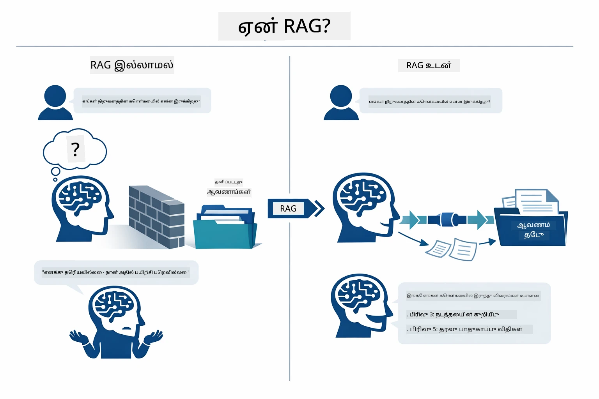

*இந்த வரைபடம் ஒரு நுண்ணறிவு LLM (பயிற்சி தரவிலிருந்து ஊகிக்கிறது) மற்றும் RAG-சேர்க்கப்பட்ட LLM (முதலில் உங்கள் ஆவணங்களை அணுகுகிறது) ஆகிய இரண்டின் வேறுபாட்டை காட்டுகிறது.*

இங்கே உள்ள கூறுகள் எவ்வாறு தொடர் முறையில் இணைகின்றன: ஒரு பயனரின் கேள்வி நான்கு படிகளுக்கு செல்கிறது — எம்பெடியிங், வெக்டர் தேடல், சூழல் சேர்தல், பதில் உருவாக்கம் — ஒவ்வொன்றும் முந்தைய ஒரு அடிப்படையில்:


*இந்த வரைபடம் முழுமையான RAG குழாய்துறையை காட்டுகிறது — பயனர் கேள்வி எம்பெடியிங், வெக்டர் தேடல், சூழல் சேர்தல், பதில் உருவாக்கம் ஆகியவற்றை கடக்கிறது.*

இந்த மாட்யூல் ஒவ்வொரு படியையும் விரிவாக குறியீடு மற்றும் மாற்றி இயக்குவதை அறிவுரை செய்கிறது.

### Which RAG Approach Does This Tutorial Use?

LangChain4j RAG ஐ செயல்படுத்த மூன்று விதங்கள் வழங்குகிறது, ஒவ்வொன்றும் வேறு விவரத் தன்மையுடன். கீழுள்ள வரைபடம் அவற்றை ஒப்பிடுகிறது:

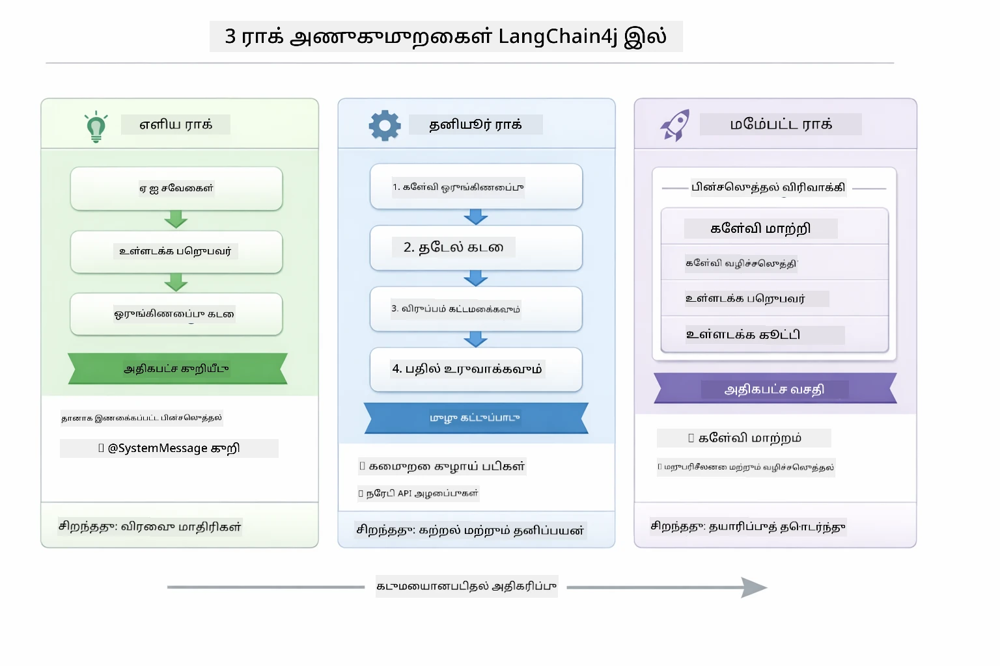

*இந்த வரைபடம் LangChain4j இன் மூன்று RAG அணுகுமுறைகளை — எசி, நேடிவ், மற்றும் உயர் நிலை — முக்கிய கூறுகளுடன் ஒப்பிடுகிறது தொடர்புடைய முறையில்.*

| அணுகுமுறை | அதை செய்யும் செயல் | விலைபோக்கு |
|---|---|---|
| **எசி RAG** | அனைத்தையும் தானாகவே `AiServices` மற்றும் `ContentRetriever` மூலம் கையாள்கிறது. ஒரு இடைமுகத்தை குறிக்கவும், ஒரு ரீட்ரைவரை இணைக்கவும், LangChain4j பின்னணியில் எம்பெடியிங், தேடல், ப்ராம்ப்ட் தொகுப்பை கையாள்கிறது. | குறைந்த குறியீடு, ஆனால் ஒவ்வொரு படியும் என்ன நடக்கிறது என்பது தெரியாது. |
| **நேடிவ் RAG** | நீங்கள் எம்பெடியிங் மாதிரியை அழைக்கவும், அங்கிரக தூணிலிருந்து தேடவும், ப்ராம்ப்டை உருவாக்கவும், பதிலை உருவாக்கவும் செய்யும் போது ஒவ்வொரு படியும் தெளிவாகவும் தனித்தனியாகவும் செயல்படுதல். | குறியாக்கம் அதிகம், ஆனால் ஒவ்வொரு படியும் தெளிவாகவும் மாற்றத்தக்கதும் உள்ளது. |
| **உயர் நிலை RAG** | `RetrievalAugmentor` கட்டமைப்பைப் பயன்படுத்தி கேள்வி மாற்றிகள், ரூட்டர்கள், மறுபதிப்பீட்டாளர்கள், மற்றும் உள்ளடக்க செலுத்திகளுடன் தயாரிப்பு நிலை குழாய்களுக்காக. | அதிக திடீர் மற்றும் தூய்மையான விடுப்பு, ஆனால் கூடுதலான சிக்கலும் இருக்கிறது. |

**இந்த பயிற்சி நேடிவ் அணுகுமுறையைப் பயன்படுத்துகிறது.** RAG குழாயின் ஒவ்வொரு படியையும் — கேள்வியை எம்பெடியிங் செய்தல், வெக்டர் அங்க்ஷையை தேடல், சூழலை ஒன்றிணைத்து பதில் உருவாக்குதல் — [`RagService.java`](../../../03-rag/src/main/java/com/example/langchain4j/rag/service/RagService.java) இல் தெளிவாக எழுதப்பட்டுள்ளது. இது ஒரு கற்றல் வளமாகும்: குறியீடு குறைவு அல்லாமல் ஒவ்வொரு படியும் தெளிவாக புரிந்து கொள்ளும் பொருட்டு. கூறுகள் எப்படி இணைகின்றன என்பதை புரிந்துகொண்ட பிறகு, எசி RAG உடன் விரைவு முன்மாதிரிகள் அல்லது உயர் நிலை RAG உடன் தயாரிப்பு சிஸ்டம்கள் உருவாக்கலாம்.

> **💡 எசி RAG ஐ ஏற்கனவே பார்த்தீர்களா?** [Quick Start மாட்யூல்](../00-quick-start/README.md) ஒரு ஆவண கேள்வி-பதில் உதாரணத்தை கொண்டுள்ளது ([`SimpleReaderDemo.java`](../../../00-quick-start/src/main/java/com/example/langchain4j/quickstart/SimpleReaderDemo.java)) எசி RAG அணுகுமுறையைப் பயன்படுத்துகிறது — LangChain4j தானாகவே எம்பெடியிங், தேடல் மற்றும் ப்ராம்ப்ட் தொகுப்பை கையாள்கிறது. இந்த மாட்யூல் அந்த குழாயை திறந்து, ஒவ்வொரு படியையும் உங்களால் பார்க்க மற்றும் கட்டுப்படுத்த முடியும்.

கீழுள்ள வரைபடம் அந்த எசி RAG குழாயை காட்டுகிறது. `AiServices` மற்றும் `EmbeddingStoreContentRetriever` எல்லா சிக்கல்களையும் மறைக்கும் — நீங்கள் ஆவணத்தை ஏற்றிக், ரீட்ரைவரை இணைத்து பதில்களை பெறுவீர்கள். இந்த மாட்யூல் இருப்பிடத்தின் ஒவ்வொரு படியையும் நேரடியாக அழைக்கும்படி வேறாக்குகிறது:

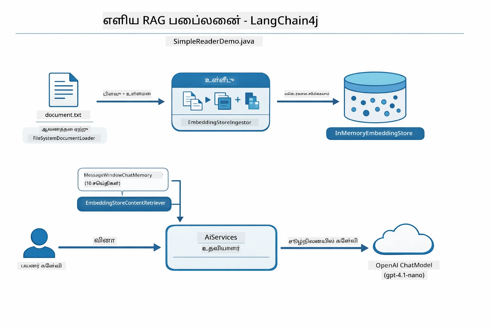

*இந்த வரைபடம் `SimpleReaderDemo.java` இன் எசி RAG குழாயை காட்டுகிறது. இந்த மாட்யூல் பயன்படுத்தும் நேடிவ் அணுகுமுறையுடன் ஒப்பிடுக: எசி RAG எம்பெடியிங், திரும்பப்பெறும் மற்றும் ப்ராம்ப்ட் தொகுப்பை `AiServices` மற்றும் `ContentRetriever` மூலமாக மறைக்கிறது — நீங்கள் ஆவணத்தை ஏற்று, ரீட்ரைவரை இணைத்து, பதில்களைப் பெறுவீர்கள். இந்த மாட்யூல் அந்த குழாயை திறந்து, ஒவ்வொரு படியையும் நீங்கள் அழைக்கவும் கட்டுப்படுத்தவும் அனுமதிக்கிறது.*

## How It Works

இந்த மாட்யூலில் உள்ள RAG குழாய், பயனருக்குப் பிரச்சனை கேட்கும் வேளையில் ஒவ்வொரு முறையும் தொடர்ச்சியாக இயங்கும் நான்கு படிகளாக பிரிக்கப்படுகிறது. முதலில், ஏற்றுமதி செய்யப்பட்ட ஆவணம் **பகுக்கப்பட்டு துண்டாக்கப்படுகிறது**. அவை பிறகு **வெக்டர் எம்பெடியிங்களாக** மாறி சேமிக்கப்படுகின்றன, அவை கணித ரீதியாக ஒப்பிடப்படக்கூடும். ஒரு கேள்வி வந்தபோது, சிஸ்டம் மிக தொடர்புடைய துண்டுகளை மட்டும் கண்டுபிடிக்க **உள்ளார்ந்த தேடலை** செயல்படுத்துகிறது, மற்றும் கடைசியாக அவை LLM க்கு **பதில் உருவாக்குவதற்கான** சூழல் ஆக வழங்கப்படுகின்றன. கீழே ஒவ்வொரு படியையும் சம்மந்தமான குறியீடு மற்றும் வரைபடங்கள் மூலம் எடுத்துரைக்கப்பட்டது. முதலில் முதலாவது படியைப் பார்ப்போம்.

### Document Processing

[DocumentService.java](../../../03-rag/src/main/java/com/example/langchain4j/rag/service/DocumentService.java)

நீங்கள் ஒரு ஆவணத்தை ஏற்றும் போது, சிஸ்டம் அதை (PDF அல்லது தெருவுரை) பகுக்கிறது, கோப்பு பெயர் போன்ற மெட்டா தரவுகளை மீண்டும் இணைக்கிறது, பின்னர் அதை சிறிய துண்டுகளாக பிரிக்கிறது — மாதிரியின் சூழலை நேர்த்தியான முறையில் இயங்க உகந்த அளவு குலைப்புக் கொண்ட துண்டுகள். இந்த துண்டுகள் வெவ்வேறு பகுதி இடைவெளிகளில் சிறிது பகிர்ந்துகொள்ளப்படுகின்றன, இதனால் (சூழல்) எல்லைகளை இழக்காமல் பாதுகாக்கப்படுகிறது.

```java
// பதிவேற்றப்பட்ட கோப்பை பகுப்பாய்வு செய்து LangChain4j ஆவணமாக மூடியிடுக
Document document = Document.from(content, metadata);

// 30-டோக்கன் ஓவர்லாப்புடன் 300-டோக்கன் துண்டுகளாக பிரிக்கவும்
DocumentSplitter splitter = DocumentSplitters
    .recursive(300, 30);

List<TextSegment> segments = splitter.split(document);
```

கீழுள்ள வரைபடம் இதை விசுவல் முறையில் காட்டுகிறது. ஒவ்வொரு துண்டும் அதன் அண்டை துண்டுகளுடன் சில குறியீடுகளை பகிர்ந்து கொள்ளும் என்பதை கவனிக்கவும் — 30 குறியீடு பகிர்வு எதிர்காலத்தில் எந்த முக்கிய சூழலும் இழக்கப்படாமல் அதை உறுதி செய்கிறது:

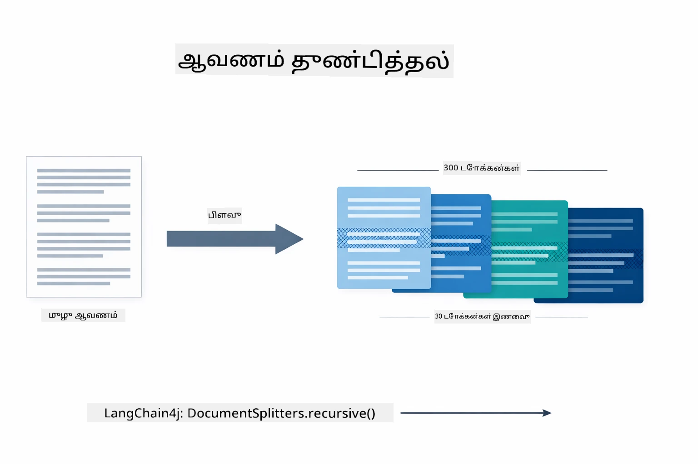

*இந்த வரைபடம் ஒரு ஆவணத்தை 300 குறியீடு குலைகளாக 30 குறியீடு பகிர்வுடன் பிரிப்பதை மற்றும் பகுதி எல்லைகளில் சூழலை பாதுகாப்பதை காட்டுகிறது.*

> **🤖 [GitHub Copilot](https://github.com/features/copilot) அரட்டையுடன் முயற்சிக்கவும்:** [`DocumentService.java`](../../../03-rag/src/main/java/com/example/langchain4j/rag/service/DocumentService.java) திறந்து கேட்கவும்:
> - "LangChain4j ஆவணங்களைத் துண்டுகளாக எப்படிப்பட்ட முறையில் பிரிக்கிறது மற்றும் பகிர்வு ஏன் முக்கியம்?"
> - "விவேகமான ஆவண வகைகளுக்கான சிறந்த துண்டு அளவு எது மற்றும் ஏன்?"
> - "பல மொழிகளில் உள்ள ஆவணங்கள் அல்லது சிறப்பு வடிவமைப்புகளுடன் எப்படி கையாளவேண்டும்?"

### Creating Embeddings

[LangChainRagConfig.java](../../../03-rag/src/main/java/com/example/langchain4j/rag/config/LangChainRagConfig.java)

ஒவ்வொரு துண்டும் எம்பெடியிங் என்ற எண்ணுக்கூறு பிரதிநிதித்துவமாக மாற்றப்படுகிறது — இது அதற்கு பொருள் விளக்கமாகும். எம்பெடியிங் மாதிரி அரட்டை மாதிரி போல "நுண்ணறிவு" இல்லை; கட்டளைகளை பின்பற்றவும், காரணமாக்கவும், பதில்களைக் கூறவும் முடியாது. அஞ்சு செய்யும் விஷயம், அது உரையை ஒரு கணிதப் பரப்பிற்கு மாற்றுவதாகும், அதில் சமான பொருள்கள் ஒன்றுக்கு அருகில் இருக்கும் — "கார்" மிகவும் "வாகனம்" அருகில், "பணத்தை திரும்பப் பெறுதல் கொள்கை" மிகவும் "இணைய பணத்தை திரும்பப் பெறுதல்" அருகில். ஒருவருடன் பேசும் அரட்டை மாதிரியாக எண்ணினால், எம்பெடியிங் மாதிரி ஒரு மிகச்சிறந்த கோப்பு முறையாகும்.

கீழுள்ள வரைபடம் இந்த கருத்தை காட்டுகிறது — உரை உள்ளே, எண்ணியல் வெக்டர்கள் வெளியே; இணையான பொருள்கள் மிக அருகிலுள்ள வெக்டர்களை உருவாக்குகின்றன:

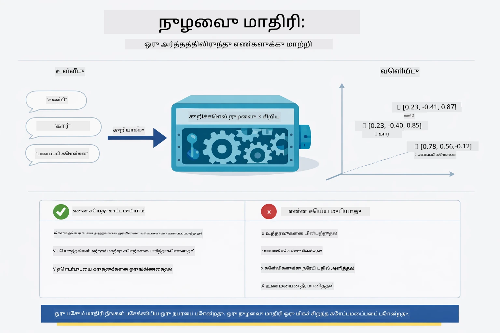

*இந்த வரைபடம் எம்பெடியிங் மாதிரி உரையை எண்ணியல் வெக்டர்களாக மாற்றுவது மற்றும் அதில் "கார்" மற்றும் "வாகனம்" போன்ற இணையான பொருள்களை வெக்டர் இடத்தில் அருகில் வைக்கிறது.*

```java
@Bean
public EmbeddingModel embeddingModel() {
    return OpenAiOfficialEmbeddingModel.builder()
        .baseUrl(azureOpenAiEndpoint)
        .apiKey(azureOpenAiKey)
        .modelName(azureEmbeddingDeploymentName)
        .build();
}

EmbeddingStore<TextSegment> embeddingStore = 
    new InMemoryEmbeddingStore<>();
```

கிளாஸ் வரைபடம் RAG குழாயில் இரண்டு தனித்தனியான பாய்முறைகளையும் மற்றும் அவற்றை செயல்படுத்தும் LangChain4j கிளாஸ்களையும் காட்டுகிறது. **எண்கொள்ளும் பாய்முறை** (ஏற்றுமதி செய்யும் போது ஒருமுறை இயங்கும்) ஆவணத்தை துண்டுகள로 பிரித்து, அந்த துண்டுகளை எம்பெடியிங் செய்து `.addAll()` மூலம் சேமிக்கிறது. **கேள்வி பாய்முறை** (ஒவ்வொரு முறையும் பயனரே கேள்வி கேட்கும் போது இயங்கும்) கேள்வியை எம்பெடியிங் செய்து, `.search()` மூலம் தேடிக், பொருந்தக்கூடிய சூழலை அரட்டை மாதிரிக்கு தருகிறது. இரண்டும் `EmbeddingStore<TextSegment>` இடைமுகத்தில் இணைக்கப்பட்டுள்ளது:

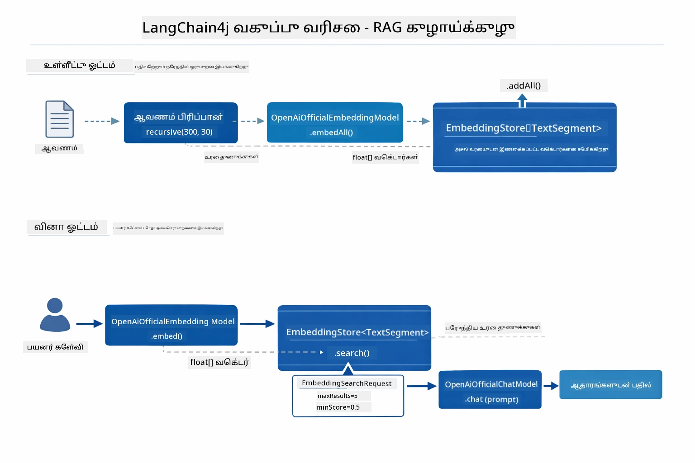

*இந்த வரைபடம் RAG குழாயில் உள்ள இரண்டு பாய்முறைகள் — எண்கொள் மற்றும் கேள்வி — மற்றும் அவை ஒரே EmbeddingStore மூலம் எவ்வாறு இணைக்கப்படுகின்றன என்பதை காட்டுகிறது.*

எம்பெடியிங் சேமிக்கப்பட்ட பிறகு, இணையான உள்ளடக்கம் குரூப்பாக ஆடைந்துவிடும். கீழுள்ள விசுவல் ஆவணங்கள் தொடர்புடைய பிரிவுகளை அருகிலுள்ள புள்ளிகளாக 3D வெக்டர் இடத்தில் நிரம்பியுள்ளன, இது உள்ளார்ந்த தேடலை சாத்தியமாக்குகிறது:


*இந்த விசுவலேஷன் தொடர்புடைய ஆவணங்கள் தொடர்பான குறிப்புகள் (பாவனைகளில், வணிகக் கொள்கைகளை, அடிக்கடி கேட்கப்படும் கேள்விகளைக் போன்றவை) வெக்டர் இடத்தில் தனித்தனியாக குழுக்களாக இருப்பதை காட்டுகிறது.*

பயனர் தேடும் போது, சிஸ்டம் நான்குப் படிகளை பின்பற்றுகிறது: ஆவணங்களை ஒருமுறை எம்பெடியிங் செய்கிறது, ஒவ்வொரு தேடும் நேரமும் கேள்வியை எம்பெடியிங் செய்கிறது, கேள்வி வெக்டரை அனைத்து சேமிக்கப்பட்ட வெக்டர்களுடன் கோசைன் ஒத்திசைவை அளவில் ஒப்பிடுகிறது, மேலும் அதிக மதிப்பெண்களுக்குள் உள்ள சிறந்த-K துண்டுகளைத் திருப்பி அளிக்கிறது. கீழுள்ள வரைபடம் ஒவ்வொரு படியையும் மற்றும் LangChain4j கிளாஸ்களையும் காட்டுகிறது:

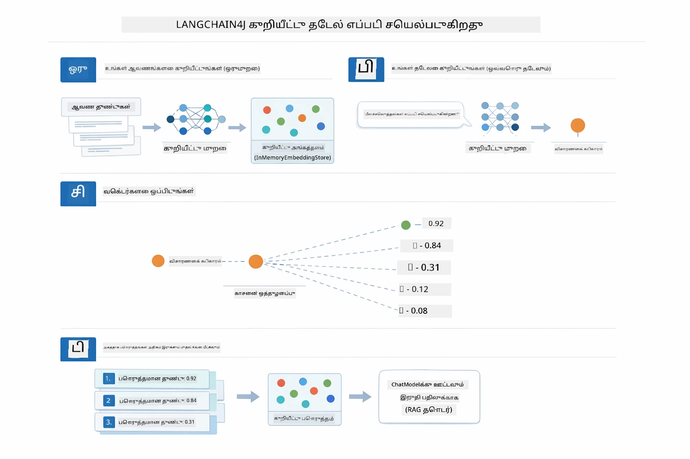

*இந்த வரைபடம் நான்கு படி எம்பெடியிங் தேடல் செயல்முறையை காட்டுகிறது: ஆவணங்களை எம்பெடியிங் செய்தல், கேள்வியை எம்பெடியிங் செய்தல், கோசைன் ஒத்திசைவு பயன்படுத்து வெக்டர்களை ஒப்பிடுதல், மற்றும் உச்ச மதிப்புள்ள முடிவுகள்.*

### Semantic Search

[RagService.java](../../../03-rag/src/main/java/com/example/langchain4j/rag/service/RagService.java)

நீங்கள் ஒரு கேள்வி கேட்டாலே, அந்த கேள்வியும் ஒரு எம்பெடியிங்காக மாறுகிறது. சிஸ்டம் உங்கள் கேள்வியின் எம்பெடியிங் மற்றும் ஆவண துண்டுகளின் எம்பெடியிங்குகளுடன் ஒப்பிடுகிறது. முக்கியமான பொருள் அதே நண்பர்களை மட்டும் தேடுகிறது - வெறும் இணையான முக்கியசொற்கள் மட்டுமல்ல, உண்மையான உள்ளார்ந்த ஒத்திசைவு கொண்டவை.

```java
Embedding queryEmbedding = embeddingModel.embed(question).content();

EmbeddingSearchRequest searchRequest = EmbeddingSearchRequest.builder()
    .queryEmbedding(queryEmbedding)
    .maxResults(5)
    .minScore(0.5)
    .build();

EmbeddingSearchResult<TextSegment> searchResult = embeddingStore.search(searchRequest);
List<EmbeddingMatch<TextSegment>> matches = searchResult.matches();

for (EmbeddingMatch<TextSegment> match : matches) {
    String relevantText = match.embedded().text();
    double score = match.score();
}
```

கீழுள்ள வரைபடம் உள்ளார்ந்த தேடலை எடுத்துக்காட்டுகிறது. "வாகனம்" என்பதற்கான ஒரு முக்கியச்சொல் தேடல் "கார்கள் மற்றும் டிரக்குகள்" பற்றி உள்ள துண்டை காணாமல் விடுகிறது, ஆனால் உள்ளார்ந்த தேடல் அதற்குரிய பொருள் ஒன்றையே பொருள் படுத்தி அதை உயர்ந்த மதிப்புடன் திருப்பிச் செலுத்துகிறது:

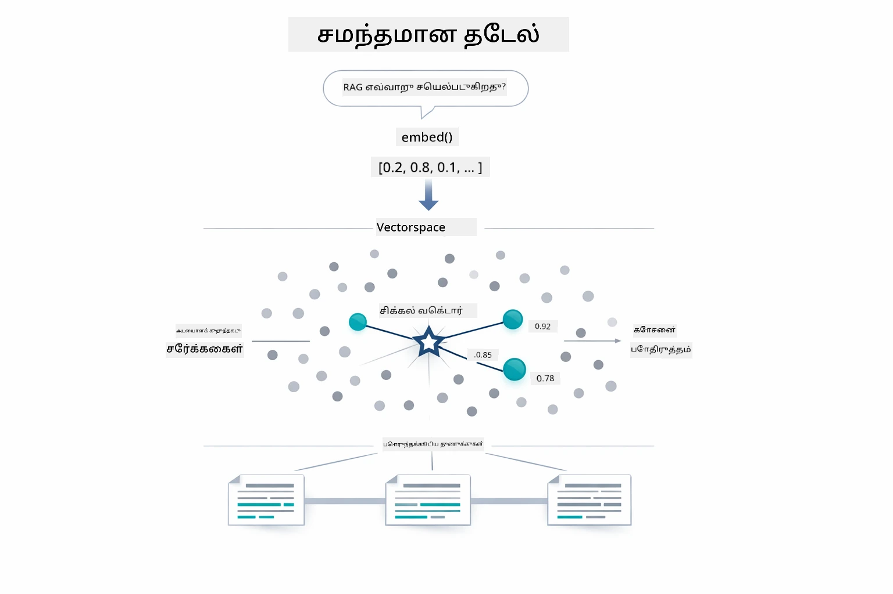

*இந்த வரைபடம் முக்கியச்சொல் அடிப்படையிலான தேடலை உள்ளார்ந்த தேடலுடன் ஒப்பிட்டு காட்டுகிறது, மேலும் உள்ளார்ந்த தேடல் சரியான முக்கியச்சொற்கள் இல்லாதபோதிலும் பொருத்தமான உள்ளடக்கத்தை மீட்டெடுக்கிறது.*
உள் நோக்கில், ஒத்திசைவு கோசைன் ஒத்திசைவைக் கொண்டு அளக்கப்படுகிறது — அடிப்படையாக "இந்த இரண்டு அம்புகள் ஒரே திசை நோக்குகின்றனவா?" என்று கேட்கிறது. இரண்டு பகுதியும் முற்றிலும் வேறுபட்ட சொற்களைப் பயன்படுத்தலாம், ஆனால் அவை ஒரே பொருளைக் குறிக்குமானால், அவற்றின் வெக்டர்கள் ஒரே வழியில் நோக்கி, மதிப்பு 1.0க்கு அருகில் இருக்கும்:

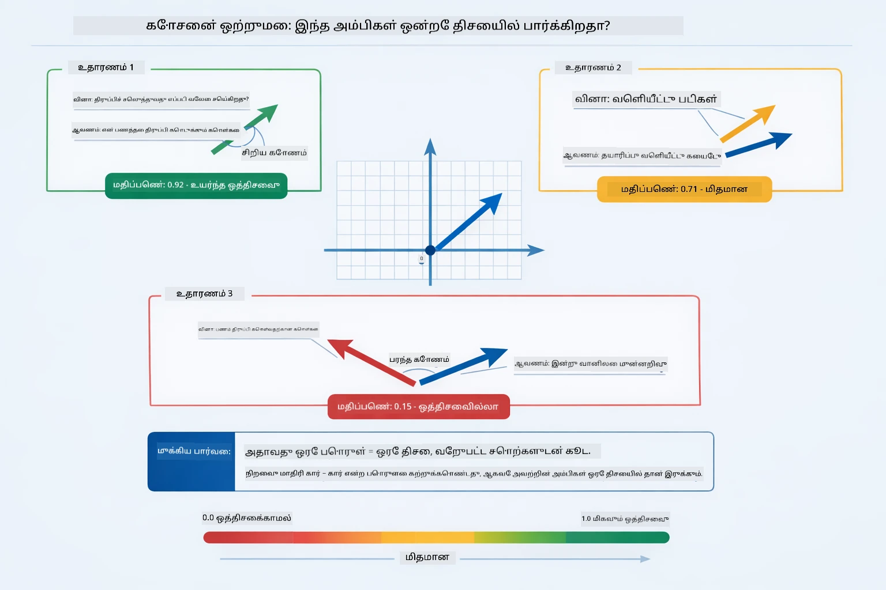

*இந்த படக்காட்சி எம்பெட்டிங் வெக்டர்களுக்கிடையேயான கோசைன் ஒத்திசைவின் கோணத்தை விளக்குகிறது — மேலும் ஒருங்கிணைக்கப்பட்ட வெக்டர்கள் 1.0க்கு அருகிலான மதிப்பைப் பெறும், இது பொருள் சார்ந்த உயர்ந்த ஒத்திசைவை குறிக்கிறது.*

> **🤖 [GitHub Copilot](https://github.com/features/copilot) உரையாடலுடன் முயற்சிக்கவும்:** [`RagService.java`](../../../03-rag/src/main/java/com/example/langchain4j/rag/service/RagService.java) திறந்து கேளுங்கள்:
> - "எம்பெட்டிங்களுடன் ஒத்திசைவு தேடல் எப்படி வேலை செய்கிறது மற்றும் மதிப்பை எப்படி நிர்ணயிக்கிறது?"
> - "எந்த ஒத்திசைவு சேதத்தினைப் பயன்படுத்த வேண்டும் மற்றும் அது முடிவுகளை எப்படி பாதிக்கிறது?"
> - "பொருத்தமான ஆவணங்கள் எப்படிச் சேர்ந்தவை இல்லை என்பதைக் கையாள எப்படி?"

### பதில் உருவாக்கல்

[RagService.java](../../../03-rag/src/main/java/com/example/langchain4j/rag/service/RagService.java)

அதிக பொருத்தமான பகுதியை கட்டமைக்கப்பட்ட ஊக்கவாதமாக இணைக்கப்படுகிறது, இதில் தெளிவான அறிவுரைகள், பெற்றுள்ள சூழல் மற்றும் பயனர் கேள்வி அடங்கும். மாதிரியின் முன்னிலையில் உள்ளவை மட்டுமே பயன்படுத்த முடியும், இது கலப்பைத் தடுக்கும்.

```java
String context = matches.stream()
    .map(match -> match.embedded().text())
    .collect(Collectors.joining("\n\n"));

String prompt = String.format("""
    Answer the question based on the following context.
    If the answer cannot be found in the context, say so.

    Context:
    %s

    Question: %s

    Answer:""", context, request.question());

String answer = chatModel.chat(prompt);
```

கீழே உள்ள படக்காட்சி இந்த கூடுதலை செயல்பாட்டில் காட்டுகிறது — தேடல் படி இருந்து மேல் மதிப்பிடப்பட்ட பகுதி ஊக்கவாத வார்ப்புருவில் இணைக்கப்படுகின்றன, மற்றும் `OpenAiOfficialChatModel` நிலையான பதிலை உருவாக்குகிறது:

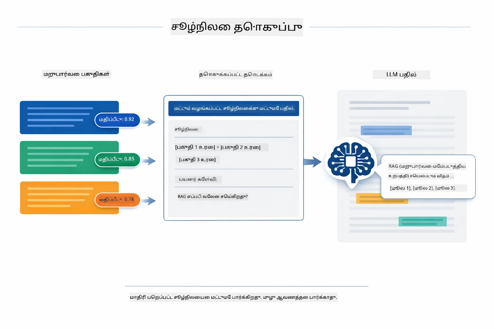

*இந்த படக்காட்சி மேல் மதிப்பிடப்பட்ட பகுதிகள் கட்டமைக்கப்பட்ட ஊக்கவாதமாக இணைக்கப்படுவதைக் காட்டுகிறது, இது உங்கள் தரவிலிருந்து ஒரு நிலையான பதிலை மாதிரிக்கு உருவாக்க அனுமதிக்கிறது.*

## பயன்பாட்டை இயக்கவும்

**நியமனம் சரிபார்க்கவும்:**

மூலம் அடைவுகளில் Azure அங்கீகாரங்கள் கொண்ட `.env` கோப்பு உள்ளது என்பதை உறுதி செய்யவும் (Module 01 இல் உருவாக்கப்பட்டது). இதனை module அடைவிலிருந்து இயக்கவும் (`03-rag/`):

**Bash:**
```bash
cat ../.env  # AZURE_OPENAI_ENDPOINT, API_KEY, DEPLOYMENT காட்டப்பட வேண்டும்
```

**PowerShell:**
```powershell
Get-Content ..\.env  # AZURE_OPENAI_ENDPOINT, API_KEY, DEPLOYMENT காட்சி செய்ய வேண்டும்
```

**பயன்பாட்டை துவங்கவும்:**

> **குறிப்பு:** Module 01 இல் குறிப்பிடப்பட்டபடி நீங்கள் ஏற்கனவே அனைத்து பயன்பாடுகளையும் `./start-all.sh` கொண்டு இயக்கி இருந்தால், இந்த module 8081 போர்ட்டில் இயங்கிக்கொண்டிருக்கும். கீழ்க்காணும் துவக்க கட்டளைகளை தவிர்க்கவும் மற்றும் நேரடியாக http://localhost:8081 சென்றுடங்கலாம்.

**விருப்பம் 1: Spring Boot டாஷ்போர்டைப் பயன்படுத்துதல் (VS Code பயனர்களுக்கு பரிந்துரை)**

dev கன்டெய்னரில் Spring Boot டாஷ்போர்ட் நீட்சிப்பொருள் உள்ளது, இது அனைத்து Spring Boot பயன்பாடுகளையும் நிர்வகிக்க காட்சியியல் முகப்பை வழங்குகிறது. VS Code இல் இடது பக்க Activity Bar இல் (Spring Boot ஐகானைக் காணவும்) இதைப் பார்க்கலாம்.

Spring Boot டாஷ்போர்டிலிருந்து, நீங்கள்:
- வேலைநிலை மண்டலத்தில் உள்ள அனைத்து Spring Boot பயன்பாடுகளையும் பார்க்க முடியும்
- ஒரு கிளிக்குடன் பயன்பாடுகளை துவங்கி/நிறுத்த முடியும்
- பயன்பாட்டு பதிவுகளை நேரடியாக காண முடியும்
- பயன்பாட்டு நிலையை கண்காணிக்க முடியும்

"rag" அருகே உள்ள பிளே பட்டனை கிளிக் செய்து இந்த module ஐத் துவங்கவும், அல்லது அனைத்துத் moduleகளையும் ஒரே நேரத்தில் துவங்கவும்.


*இந்த ஸ்கிரீன்ஷாட் VS Code இல் Spring Boot டாஷ்போர்டை காட்டுகிறது, இங்கு நீங்கள் பயன்பாடுகளை தோக்க, நிறுத்த, கண்காணிக்க முடியும்.*

**விருப்பம் 2: ஷெல் ஸ்கிரிப்ட்கள் பயன்படுத்துதல்**

அனைத்து வலை பயன்பாடுகளையும் (moduleகள் 01-04) துவங்கவும்:

**Bash:**
```bash
cd ..  # ரூட் அடைவு கோப்புறையிலிருந்து
./start-all.sh
```

**PowerShell:**
```powershell
cd ..  # ரூட் அடைவரிசையில் இருந்து
.\start-all.ps1
```

அல்லது இந்த module மட்டும் துவங்க:

**Bash:**
```bash
cd 03-rag
./start.sh
```

**PowerShell:**
```powershell
cd 03-rag
.\start.ps1
```

இரண்டாமொழி ஸ்கிரிப்ட்களும் வேரு `.env` கோப்பிலிருந்து சுற்றுச்சூழல் மாறிலிகளை தானாக ஏற்றும் மற்றும் JARகளை இல்லை என்றால் உருவாக்கும்.

> **குறிப்பு:** நீங்கள் ஆரம்பிப்பதற்கு முன் அனைத்து moduleகளையும் கைமுறையாக கட்டவதற்கு விரும்பினால்:
>
> **Bash:**
> ```bash
> cd ..  # Go to root directory
> mvn clean package -DskipTests
> ```
>
> **PowerShell:**
> ```powershell
> cd ..  # Go to root directory
> mvn clean package -DskipTests
> ```

உங்கள் உலாவியில் http://localhost:8081 திறக்கவும்.

**நிறுத்த:**

**Bash:**
```bash
./stop.sh  # இந்த தொகுதி மட்டும்
# அல்லது
cd .. && ./stop-all.sh  # அனைத்துத் தொகுதிகள்
```

**PowerShell:**
```powershell
.\stop.ps1  # இந்த மொட்யூல் மட்டும்
# அல்லது
cd ..; .\stop-all.ps1  # அனைத்து மொட்யூல்கள்
```

## பயன்பாட்டைப் பயன்படுத்துதல்

இந்தப் பயன்பாடு ஆவணம் பதிவேற்றம் மற்றும் கேள்வி கேட்க வலை முகப்பை வழங்குகிறது.

<a href="images/rag-homepage.png"></a>

*இந்த ஸ்கிரீன்ஷாட் RAG பயன்பாட்டு முகப்பை காட்டுகிறது, இதில் நீங்கள் ஆவணங்களை பதிவேற்றவும் கேள்விகளைக் கேட்க முடியும்.*

### ஆவணம் பதிவேற்றல்

ஆரம்பத்தில் ஒரு ஆவணத்தை பதிவேற்றவும் - சோதனைக்காக TXT கோப்புகள் சிறந்தவை. இந்த அடைவிலுள்ள `sample-document.txt` LangChain4j அம்சங்கள், RAG செயல்பாடு மற்றும் சிறந்த நடைமுறைகள் ஆகியவற்றை தருகிறது - முற்றிலும் சோதனைக்காக சிறந்தது.

சிஸ்டம் உங்கள் ஆவணத்தை செயலாக்கி, அதனை பகுதிகளாக உடைத்து, ஒவ்வொரு பகுதியுக்கும் எம்பெட்டிங்களை உருவாக்குகிறது. இது பதிவேற்றுகிறபோது தானாக நடக்கும்.

### கேள்விகளைக் கேளுங்கள்

இந்த பின்னர் ஆவண உள்ளடக்கத்தைப் பற்றி குறிப்பிட்ட கேள்விகளை கேளுங்கள். ஆவணத்தில் தெளிவாக கூறப்பட்ட உண்மைகளை முயற்சி செய்யவும். சிஸ்டம் பொருத்தமான பகுதிகளைத் தேடி, அவற்றை ஊக்கவாதத்தில் சேர்த்து, பதிலை உருவாக்கும்.

### மூலக் குறிப்புகளை அமைத்தல்

ஒவ்வொரு பதிலும் ஒத்திசைவு மதிப்புடன் மூலக் குறிப்புகளையும் கொண்டுள்ளது. இவை (0 முதல் 1 வரை மதிப்புகள்) உங்கள் கேள்விக்கு எந்த போதிலும் அந்த பகுதி பொருத்தமானது என்பதை காட்டுகின்றன. அதிக மதிப்புகள் சிறந்த பொருத்தத்தை குறிக்கின்றன. இதனால் பதிலை மூலத் தகவலிடம் ஒப்பிட முடியும்.

<a href="images/rag-query-results.png"></a>

*இந்த ஸ்கிரீன்ஷாட் விசாரணை முடிவுகளை காட்டுகிறது, உருவாக்கப்பட்ட பதில், மூலக் குறிப்புகள் மற்றும் ஒவ்வொரு பெறப்பட்ட பகுதியின் பொருத்த மதிப்புகள்.*

### கேள்விகளுடன் கலைவுடன் விளையாடு

விதிவழி கேள்விகளை முயற்சி செய்யுங்கள்:
- குறிப்பிட்ட உண்மைகள்: "முக்கிய தலைப்பு என்ன?"
- ஒப்பீடுகள்: "X மற்றும் Y இடையேயான வேறுபாடு என்ன?"
- சுருக்கங்கள்: "Z பற்றி முக்கிய புள்ளிகளை சுருக்குக"

உங்கள் கேள்வியின் பின் ஆவண உள்ளடக்கத்துடன் பொருந்துவதில் பொருத்த மதிப்புகள் எப்படி மாறுகிறதென்பதை கவனிக்கவும்.

## முக்கிய கருத்துக்கள்

### பகுதி பிரித்தல் முறை

ஆவணங்கள் 300-டோக்கன் பகுதிகளாக பிரிக்கப்படுகின்றன, 30 டோக்கன்கள் ஒவர்லாப் உடன். இந்த சமநிலை ஒவ்வொரு பகுதியும் பொருத்தமான சூழலைக் கொண்டிருக்கும் வகையில் மற்றும் ஒரு ஊக்கவாதத்தில் பல பகுதிகள் சேர்க்க அனுமதிக்கும் அளவுக்கு சிறியதாக இருக்கும்.

### ஒத்திசைவு மதிப்புகள்

ஒவ்வொரு பெறப்பட்ட பகுதியும் 0 முதல் 1 வரை உள்ள ஒத்திசைவு மதிப்போடு வருகிறது, இது பயனர் கேள்விக்கேளிச் சரியாக பொருந்துதலின் அளவை காட்டுகிறது. கீழ்க்காணும் வரைபடம் மதிப்புகளின் அகரவரிசையை மற்றும் சிஸ்டம் அவற்றைப் பயன்படுத்தி முடிவுகளை வடிகட்டி பார்க்கும் முறையை காண்பிக்கிறது:

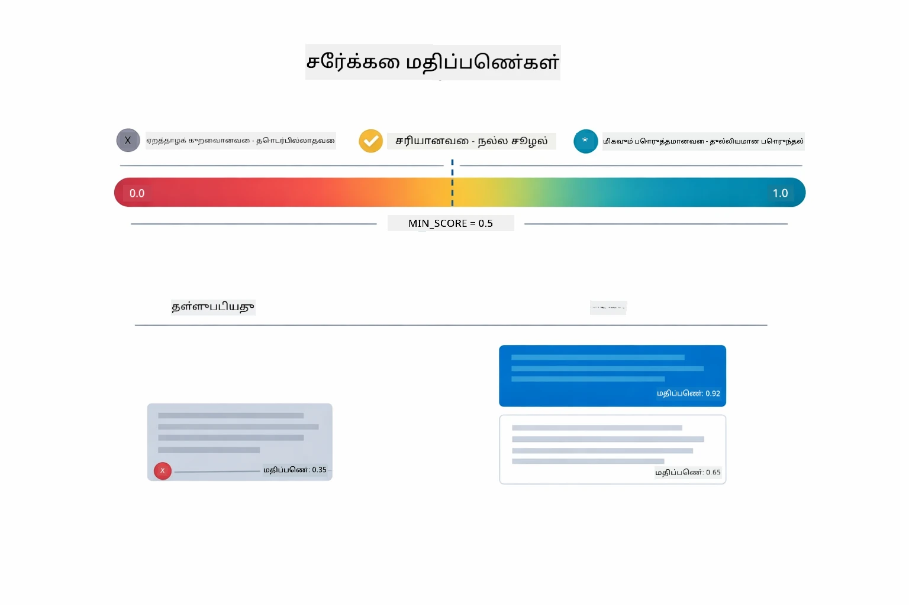

*இந்த படக்காட்சி 0 முதல் 1 வரை மதிப்பு விரிவுகளைக் காட்டுகிறது, 0.5 குறைந்தபட்ச சேதத்துடன் பொருந்தாத பகுதிகளை வடிகட்டும்.*

மதிப்புகள் 0 முதல் 1 வரையிலானவை:
- 0.7-1.0: மிகவும் பொருத்தமான, துல்லியமான பொருத்தம்
- 0.5-0.7: பொருத்தமான, நல்ல சூழல்
- 0.5 க்கும் கீழே: வடிகட்டப்பட்டது, மிகவும் வேறுபட்டது

சிஸ்டம் குறைந்தபட்ச சேதத்தை மீறிய பகுதிகளையே பெறுகிறது, இது தரநிலையை உறுதிப்படுத்துகிறது.

எம்பெட்டிங்குகள் அர்த்தம் நன்கு குழுக்களால் வருகையில் சிறப்பாக செயல்படுகின்றன, ஆனால் அவற்றுக்கு பனி உள்ள இடங்கள் உள்ளன. கீழ்க்காணும் படக்காட்சி பொதுவான தோல்வி முறைகளை காட்டுகிறது — மிகப் பெரிய பகுதிகள் குழ்படுத்திய வெக்டர்களை உருவாக்குகின்றன, மிகச் சிறிய பகுதிகளை சூழல் குறைபாடு உள்ளது, குழப்பமான சொற்கள் பல குழுக்களை நோக்குகின்றன, மற்றும் துல்லிய பொருத்தத் தேடல்கள் (IDs, பாக எண்கள்) எண்பட்டிங்குகளுடன் வேலை செய்யமாட்டார்:

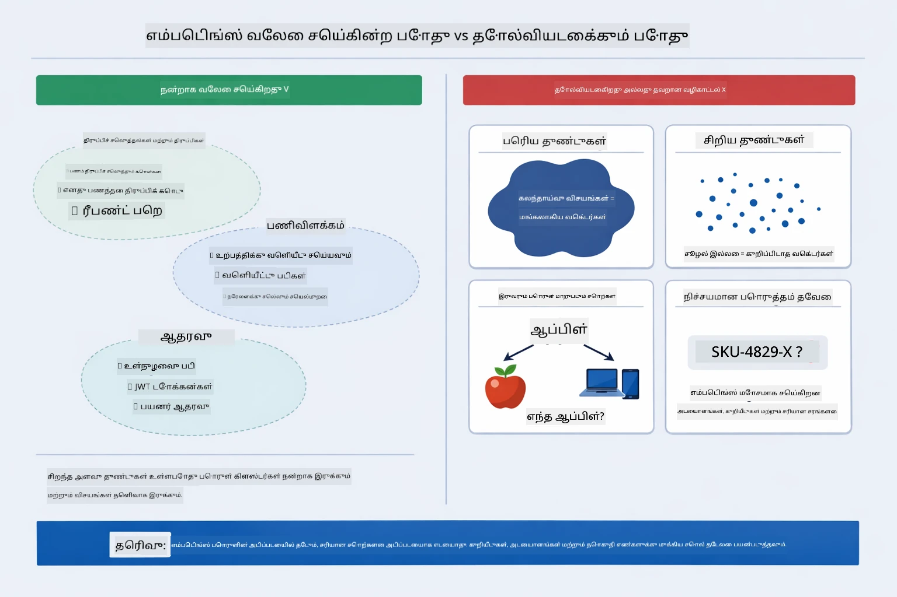

*இந்த படக்காட்சி பொதுவான எம்பெட்டிங் தோல்வி முறைகளை காட்டுகிறது: மிகப் பெரிய பகுதிகள், மிகச் சிறிய பகுதிகள், பல குழுக்களை நோக்குவிக்கும் குழப்பமான சொற்கள், மற்றும் IDs போன்ற துல்லிய பொருத்த தேடல்கள்.*

### நினைவகச் சேமிப்பு

இந்த module எளிமைக்காக நினைவகக் களஞ்சியத்தைப் பயன்படுத்துகிறது. பயன்பாட்டை மறுசீரமைத்தால் பதிவேற்றப்பட்ட ஆவணங்கள் இழக்கும். உற்பத்தி முறைகள் Qdrant அல்லது Azure AI Search போன்ற நிலையான வெக்டர் தரவுத்தளங்களைப் பயன்படுத்துகின்றன.

### சூழல் ஜன்னல் முகாமை

ஒவ்வொரு மாதிரிக்கும் அதிகபட்ச சூழல் ஜன்னல் உள்ளது. பெரிய ஆவணத்திலிருந்து எல்லா பகுதிகளையும் சேர்க்க முடியாது. சிஸ்டம் அதிகம் பொருத்தமான ஊதான N பகுதிகளை (இயல்பு 5) இயற்றுகிறது, இது வரம்புகளில் இருக்க உதவுகின்றது மேலும் துல்லியப் பதில்களுக்கு போதுமான சூழலை வழங்குகின்றது.

## RAG முக்கியம் எப்போது

RAG எப்போதும் சரியான அணுகுமுறை அல்ல. கீழ்காணும் தீர்மான வழிகாட்டி RAG மதிப்பை எப்போது சேர்க்கின்றது மற்றும் எப்போது எளிய அணுகுமுறைகள் — நேரடியாக உள்ளடக்கத்தை ஊக்கவாதத்தில் சேர்ப்பது அல்லது மாதிரியின் உள்ளடக்க அறிவுக்கு நம்புவதே போதும் — போதுமானனவாக இருக்கும் என்பதை உதவுகின்றது:

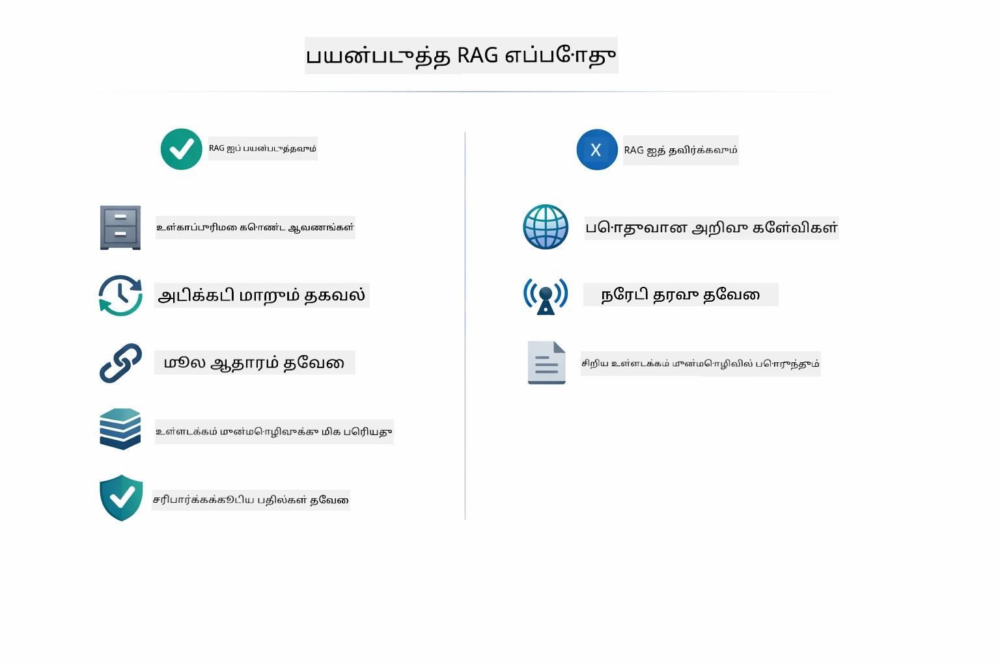

*இந்த படக்காட்சி RAG மதிப்பை எப்போது சேர்க்கின்றது மற்றும் எப்போது எளிய அணுகுமுறைகள் போதும் என்பதை தீர்மானிக்கும் வழிகாட்டியைக் காட்டுகிறது.*

## அடுத்த படிகள்

**அடுத்த Module:** [04-tools - கருவிகளுடன் AI முகவர்கள்](../04-tools/README.md)

---

**நோக்கம்:** [← முன்பு: Module 02 - ஊக்கவாத உருவாக்கம்](../02-prompt-engineering/README.md) | [மீண்டும் முதற்கொள்ளு](../README.md) | [அடுத்து: Module 04 - கருவிகள் →](../04-tools/README.md)

---

<!-- CO-OP TRANSLATOR DISCLAIMER START -->
**மறுப்பு**:  
இந்த ஆவணம் AI மொழிபெயர்ப்பு சேவை [Co-op Translator](https://github.com/Azure/co-op-translator) மூலம் மொழிபெயர்க்கப்பட்டுள்ளது. நாங்கள் துல்லியத்திற்காக முயலினாலும், தானாக செய்யப்பட்ட மொழிபெயர்ப்புகளில் பிழைகள் அல்லது தவறுகள் இருக்கக்கூடும் என்பதை தயவுசெய்து கவனியுங்கள். இந்த ஆவணத்தின் அசல் மொழி சார்ந்த பதிப்பே அதிகாரப்பூர்வமான ஆதாரமாகக் கருதப்பட வேண்டும். முக்கியமான தகவல்களுக்காக, தொழில்முறை மனித மொழிபெயர்ப்பை பரிந்துரைக்கிறோம். இந்த மொழிபெயர்ப்பைப் பயன்படுத்தியதன் காரணமாக ஏற்பட்ட எந்தவொரு தவறுணர்வு அல்லது தவறான புரிதலுக்கான பொறுப்பானவர்கள் அல்லாமை நாங்கள் உறுதிசெய்கிறோம்.
<!-- CO-OP TRANSLATOR DISCLAIMER END -->