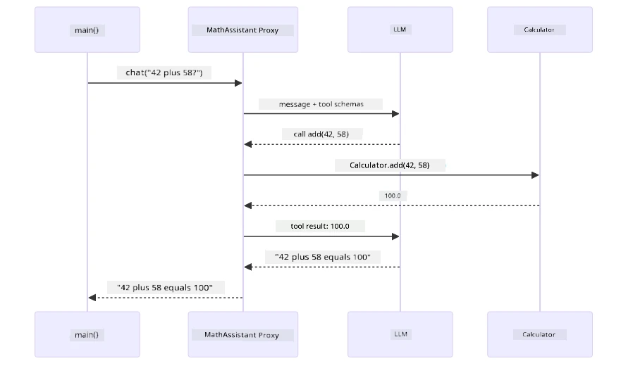
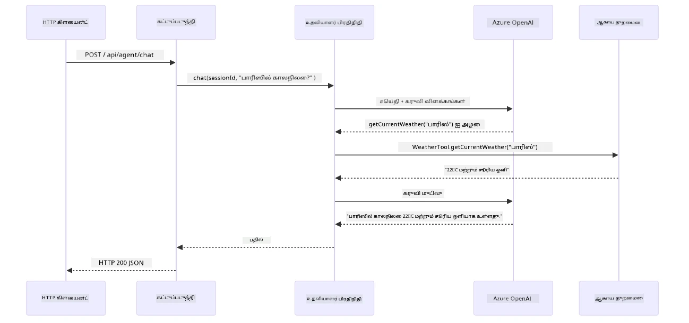

# Module 04: கருவிகளுடன் கூடிய AI முகவர்கள்

## உள்ளடக்க அட்டவணை

- [காணொலி வழிகாட்டி](../../../04-tools)
- [நீங்கள் கற்றுக்கொள்ளப்போகும் விஷயங்கள்](../../../04-tools)
- [முதன்மையான தேவைகள்](../../../04-tools)
- [கருவிகளுடன் கூடிய AI முகவர்களை förstå](../../../04-tools)
- [கருவி அழைப்பது எப்படி வேலை செய்கிறது](../../../04-tools)
  - [கருவி வரையறைகள்](../../../04-tools)
  - [முடிவெடுக்கும் செயல்முறை](../../../04-tools)
  - [நிர்வாகம்](../../../04-tools)
  - [பதில் உருவாக்குதல்](../../../04-tools)
  - [வடிவமைப்பு: Spring Boot தானாக இணைத்தல்](../../../04-tools)
- [கருவி சங்கிலி](../../../04-tools)
- [விண்ணப்பத்தை இயக்கு](../../../04-tools)
- [விண்ணப்பத்தை பயன்படுத்துதல்](../../../04-tools)
  - [எளிய கருவி பயன்பாட்டை முயற்சி செய்](../../../04-tools)
  - [கருவி சங்கிலியை சோதிக்கவும்](../../../04-tools)
  - [संवाद ஓட்டம் கண்டு கெள்](../../../04-tools)
  - [விதிவிலக்கு கோரிக்கைகளுடன் பரிசோதனை செய்](../../../04-tools)
- [முக்கிய கருத்துகள்](../../../04-tools)
  - [ReAct வடிவம் (கருத்துக்களிக்கும் மற்றும் செயல்படும்)](../../../04-tools)
  - [கருவி விளக்கங்கள் முக்கியம்](../../../04-tools)
  - [அதுிகட்சி நிர்வாகம்](../../../04-tools)
  - [பிழை கையாளுதல்](../../../04-tools)
- [கிடைக்கும் கருவிகள்](../../../04-tools)
- [எப்போது கருவி அடிப்படையிலான முகவர்களை பயன்படுத்துவது](../../../04-tools)
- [கருவிகள் மற்றும் RAG](../../../04-tools)
- [அடுத்த படிகள்](../../../04-tools)

## காணொலி வழிகாட்டி

இந்த மாடியுடன் எப்படித் தொடங்குவது என்பதை விளக்குகிறது இந்த நேரடி சந்திப்பை பார்க்கவும்:

<a href="https://www.youtube.com/watch?v=O_J30kZc0rw"></a>

## நீங்கள் கற்றுக்கொள்ளப்போகும் விஷயங்கள்

இந்நிலையில், நீங்கள் AI உடன் உரையாடல்கள் செய்வது, கீழ்காணும் முறையில் கேள்விகளை அமைப்பதையும், உங்கள் ஆவணங்களில் பதில்களை நிலைநிறுத்துவது போல் பலவற்றை கற்று கொண்டிருக்கிறீர்கள். ஆனால் இன்னும் ஒரு அடிப்படையான வரம்பு உள்ளது: மொழி மாதிரிகள் வெறும் உரையை உருவாக்க முடியும் மட்டுமே. அவை வானிலை சரிபார்க்க முடியாது, கணக்கீடுகளை செய்ய முடியாது, தரவுத்தளங்களை விசாரிக்க முடியாது அல்லது வெளியிலுள்ள அமைப்புகளுடன் தொடர்புகொள்ள முடியாது.

கருவிகள் இதை மாற்றுகிறது. மாதிரிக்கு செயல்பாடுகளை அழைக்க அனுமதிப்பதன் மூலம், நீங்கள் அதை உரை உருவாக்கும் கருவியிலிருந்து, செயல்களை செய்யக்கூடிய முகவராக மாற்றுகிறீர்கள். மாதிரி எப்போது ஒரு கருவியைத் தேவைப்படுத்துவது, எந்த கருவியைப் பயன்படுத்துவது, மற்றும் எந்த அளவுருக்களை அனுப்புவது என்பதைத் தீர்மானிக்கிறது. உங்கள் கோடு செயல்பாட்டை நடத்தியவுடன் முடிவைப் பெறுகிறது. மாதிரி அந்த முடிவை தனது பதிலில் இணைக்கும்.

## முதன்மையான தேவைகள்

- முடிவு செய்தது [Module 01 - அறிமுகம்](../01-introduction/README.md) (Azure OpenAI வளங்கள் பணி நிலையில்)
- முன் தொகுதிகள் பரிந்துரைக்கப்பட்டவை (இந்த தொகுதி [Module 03 இல் RAG கருத்துக்களை](../03-rag/README.md) கருவிகள் மற்றும் RAG ஒப்பீட்டில் குறிப்பிடுகிறது)
- `.env` கோப்பு ரூட் கோப்பகத்தில் உள்ளது Azure அங்கீகாரத்துடன் (Module 01 இல் `azd up` மூலம் உருவாக்கப்பட்டது)

> **குறிப்பு:** Module 01 முடிக்கப்படாவிட்டால், முதலில் அங்கே உள்ள 배치 வழிகாட்டுதலை பின்பற்றவும்.

## கருவிகளுடன் கூடிய AI முகவர்களை புரிந்துகொள்ளுதல்

> **📝 குறிப்பு:** இந்த தொகுதியில் "முகவர்கள்" என்பதற்கான பொருள் கருவி அழைப்புக் கொள்கைகளை கொண்ட AI உதவியாளர்களைக் குறிக்கிறது. இது [Module 05: MCP](../05-mcp/README.md) இல் நாம் கையாளும் **Agentic AI** படிமங்கள் (தன்னாட்சி முகவர்கள் திட்டமிடல், நினைவகத்துடன் மற்றும் பல படி காரணிப்பாட்டுடன்) என்பவைகளில் இருந்து வேறுபட்டது.

கருவிகள் இல்லாமல், ஒரு மொழி மாதிரி அதன் பயிற்சி தரவிலிருந்து மட்டும் உரையைக் காண்பிக்க முடியும். தற்போதைய வானிலை பற்றி கேள்வி கேட்கும் பொழுது, அது சூட்டமாக கண்டறிய முனைகிறது. ஆனால் கருவிகள் கொடுத்தால், அது வானிலை API-ஐ அழைக்க, கணக்கீடுகளை செய்ய, அல்லது தரவுத்தளத்தை விசாரிக்க முடியும் — பின்னர் அந்த உண்மையான முடிவுகளை அதன் பதிலில் ஓத்திச் சேர்.


*கருவிகள் இல்லாமல் மாதிரி மட்டும் ஊகிக்க முடியும் — கருவிகள் மூலம் அது APIகளை அழைக்க, கணக்கீடுகளை செய்ய, நேரடி தரவைத் திரும்ப வழங்க முடியும்.*

கருவிகளுடன் கூடிய AI முகவர் ஒரு **கருத்துக்களிப்பு மற்றும் செயல்பாடு (ReAct)** வடிவத்தை பின்பற்றுகிறது. மாதிரி வெறும் பதிலளிப்பது மட்டுமல்ல — அது என்ன வேண்டும் என்பதை யோசிக்கிறது, கருவியை அழைத்து செயல்படுகிறது, முடிவைக் காண்கிறது, பிறகு மீண்டும் செயல்பட வேண்டுமா அல்லது இறுதி பதிலை வழங்குமா என்று தீர்மானிக்கிறது:

1. **கருத்துக்களிக்கவும்** — பயனர் கேள்வியை பகுப்பாய்வு செய்து எந்தத் தகவல் தேவைப்படுகின்றதா என்பதை கண்டறிதல்  
2. **செயல் படுத்துதல்** — சரியான கருவியை தேர்வு செய்து, சரியான அளவுருக்களை உருவாக்கி அதை அழைக்குதல்  
3. **கவனிக்கவும்** — கருவியின் வெளியீட்டை பெற்றுக் கொண்டு முடிவை மதிப்பாய்வு செய்தல்  
4. **மீண்டும் செயல் படுத்துதல் அல்லது பதிலளித்தல்** — மேலதிக தரவு தேவையாயினால் மீண்டும் செயலாக்கம்; இல்லையெனில் இயல்பான மொழி பதிலை உருவாக்குதல்


*ReAct சுற்றம் — முகவர் என்ன செய்யவேண்டும் என்பதை நினைத்து, கருவியை அழைத்து, முடிவைக் காண்கிறது மற்றும் முடிவைப் பெறும் வரை இது பின்வரிசையாக நடைபெறுகிறது.*

இது தானாக நிகழ்கிறது. நீங்கள் கருவிகளையும் அவற்றின் விளக்கங்களையும் வரையறுக்கின்றீர்கள். மாதிரி அவற்றைப் பயன்படுத்த எப்போது, எப்படி என்பதைக் குறித்து முடிவுகளை எடுக்கிறது.

## கருவி அழைப்பது எப்படி வேலை செய்கிறது

### கருவி வரையறைகள்

[WeatherTool.java](../../../04-tools/src/main/java/com/example/langchain4j/agents/tools/WeatherTool.java) | [TemperatureTool.java](../../../04-tools/src/main/java/com/example/langchain4j/agents/tools/TemperatureTool.java)

நீங்கள் தெளிவான விளக்கங்களும் அளவுரு விவரங்களும் கொண்ட செயல்பாடுகளை வரையறுக்கிறீர்கள். மாதிரி அவற்றை தனது கணினி இயக்கவியல் சார்ந்த குறிப்புகளில் பார்த்து அந்த கருவி என்ன செய்யும் என்பதைக் கற்றுக்கொள்கிறது.

```java
@Component
public class WeatherTool {
    
    @Tool("Get the current weather for a location")
    public String getCurrentWeather(@P("Location name") String location) {
        // உங்கள் வானிலை தாக்குதலைத் தேடும் தந்திரம்
        return "Weather in " + location + ": 22°C, cloudy";
    }
}

@AiService
public interface Assistant {
    String chat(@MemoryId String sessionId, @UserMessage String message);
}

// உதவியாளர் Spring Boot மூலம் தானாக இணைக்கப்பட்டுள்ளது:
// - ChatModel பீன்
// - @Component வகுப்புகளிலிருந்து அனைத்து @Tool முறைகள்
// - அமர்வு மேலாண்மைக்கான ChatMemoryProvider
```

கீழே உள்ள வரைபடம் ஒவ்வொரு குறிப்பு நிரலை விவரித்து AI எப்போது கருவியை அழைக்க வேண்டும், என்ன அளவுருக்கள் அனுப்ப வேண்டும் என்பதைக் காட்டுகிறது:


*கருவி வரையறையின் அமைப்பு — @Tool AIக்கு எப்போது பயன்படுத்த வேண்டும் என்பதைக் கூறுகிறது, @P ஒவ்வொரு அளவுருவையும் விவரிக்கிறது, மற்றும் @AiService அனைத்தையும் துவக்கத்திலே இணைத்து இருக்கிறது.*

> **🤖 [GitHub Copilot](https://github.com/features/copilot) உரையாடலுடன் முயற்சி செய்க:** [`WeatherTool.java`](../../../04-tools/src/main/java/com/example/langchain4j/agents/tools/WeatherTool.java) திறந்து கேளுங்கள்:
> - "Mock தரவின் பதிலாக உண்மையான வானிலை API OpenWeatherMap-ஐ எப்படி இணைப்பேன்?"
> - "AI அதை சரியாக பயன்படுத்த உதவும் நல்ல கருவி விளக்கம் என்பது என்ன?"
> - "கருவி செயல்பாடுகளில் API பிழைகள் மற்றும் வேக வரம்புகளை எப்படி கையாள வேண்டும்?"

### முடிவெடுக்கும் செயல்முறை

பயனர் "சீటில் வானிலை எப்படி?" என்று கேட்டால், மாதிரி வெகுவகை கருவிகளுக்கு தற்சமயம் கருவியை சர்வே செய்யாது. அது பயனர் நோக்கத்தை ஒவ்வொரு கருவியின் விளக்கத்துடனும் ஒப்பிட்டு, பொருத்தத்திற்கான மதிப்பெண்களை ოomp மற்றும் சிறந்த ஒன்றை தேர்வு செய்கிறது. பிறகு அமைப்புப் பாடல் கொண்ட செயல்பாட்டுக் கூற்று உருவாக்குகிறது — இங்கு `location`-ஐ `"Seattle"` என அமைக்கிறது.

பயனர் கோரிக்கைக்கு பொருத்தமான கருவி இல்லையெனில் மாடல் தனது அறிவில் இருந்து பதில் அளிக்கிறது. பல கருவிகள் பொருந்தினால், மிகக் குறிப்பிட்ட ஒரு கருவியை தேர்வு செய்யும்.


*மாதிரி பயனர் நோக்கத்துக்கு ஏற்ப கிடைக்கும் கருவிகளைக் மதிப்பாய்வு செய்து சிறந்த ஒன்றைத் தேர்ந்தெடுக்கிறது — ஆகவே தெளிவான, குறிப்பிட்ட கருவி விளக்கங்கள் அவசியம்.*

### நிர்வாகம்

[AgentService.java](../../../04-tools/src/main/java/com/example/langchain4j/agents/service/AgentService.java)

Spring Boot தரமான `@AiService` இடைமுகத்துடன் அனைத்து பதிவு செய்யப்பட்ட கருவிகளையும் தானாக இணைக்கிறது, LangChain4j கருவி அழைப்புகளை தானாகச் செயற்கைகிறான். பின்னணி செயல்முறையில், ஒரு முழுமையான கருவி அழைப்பு ஆறு படிகள் மூலம் செல்கிறது — பயனர் இயல்பான மொழி கேள்வியிலிருந்து இயல்பான மொழி பதிலுக்கு முழுமையாக:


*முழு வழிமுறை — பயனர் கேள்வி கேட்கிறது, மாதிரி கருவியை தேர்வு செய்கிறது, LangChain4j அதை செயல்படுத்துகிறது, மற்றும் மாதிரி முடிவை இயல்பான பதிலாக இணைக்கிறது.*

நீங்கள் Module 00ல் உள்ள [ToolIntegrationDemo](../../../00-quick-start/src/main/java/com/example/langchain4j/quickstart/ToolIntegrationDemo.java) ஒழுங்கில் இவ்வழித்தடத்தை ஏற்கனவே பார்த்திருக்கிறீர்கள் — `Calculator` கருவிகள் அதே முறையில் அழைக்கப்பட்டன. கீழே உள்ள வரிசை வரைபடம் அந்த நேரத்தில் சமீபத்திய விளக்கத்தை அளிக்கிறது:



*குவிக் ஸ்டார்ட் டெமோவில் இருந்து கருவி அழைப்புக் கட்டை — `AiServices` உங்கள் செய்தி மற்றும் கருவி வடிவமைப்புகளை LLM-க்கு அனுப்புகிறது, LLM `add(42, 58)` போன்ற செயல்பாட்டு கூற்றுடன் பதிலளிக்கிறது, LangChain4j உள்ளூர் `Calculator` முறையை செயல்படுத்துகிறது மற்றும் இறுதி பதிலுக்கு முடிவை திருப்புகிறது.*

> **🤖 [GitHub Copilot](https://github.com/features/copilot) உரையாடலுடன் முயற்சி செய்க:** [`AgentService.java`](../../../04-tools/src/main/java/com/example/langchain4j/agents/service/AgentService.java) திறந்து கேளுங்கள்:
> - "ReAct வடிவம் எப்படி வேலை செய்கிறது மற்றும் AI முகவர்களுக்குப் பயனுள்ளதாக இருப்பது ஏன்?"
> - "முகவர் எந்த கருவியை எப்போது பயன்படுத்த வேண்டும் என்று எவ்வாறு தீர்மானிக்கின்றான்?"
> - "ஒரு கருவி செயல்பாடு தோல்வியடையும் போது என்ன நடக்கும் — பிழைகளை வலுவாக எப்படி கையாள வேண்டும்?"

### பதில் உருவாக்குதல்

மாதிரி வானிலை தரவுகளைப் பெற்று பயனருக்கு இயல்பான மொழி பதிலாக வடிவமைக்கிறது.

### வடிவமைப்பு: Spring Boot தானாக இணைத்தல்

இந்த தொகுதி LangChain4j இன் Spring Boot ஒருங்கிணைப்பைப் பயன்படுத்துகிறது, `@AiService` இடைமுகங்களுடன் கூடிய. துவக்கத்தில் Spring Boot அனைத்து `@Tool` முறைகள் உள்ள ஒவ்வொரு `@Component` ஐ கண்டறிந்து, உங்கள் `ChatModel` பீன் மற்றும் `ChatMemoryProvider`-ஐ ஒரே `Assistant` இடைமுகத்தில் இணைக்கிறது, நிரல் அச்சிடும் செயல்திறன் இல்லாமல்.


*@AiService இடைமுகம் ChatModel, கருவி கூறுகள் மற்றும் நினைவகத்தை இணைக்கிறது — Spring Boot அனைத்து இணைப்புகளையும் தானாக கையாள்கிறது.*

கடைசி புகாரின் முழு வாழ்நிகழ்வு அமைப்பு வரைபடம் — HTTP கோரிக்கையிலிருந்து கட்டுப்பன்றருக்கு, சேவைக்கு மற்றும் தானாக இணைக்கப்பட்ட பிரதிநிதிக்குச் செல்ல, வேண்டிய கருவி அழைப்புக்கு திரும்ப:



*முழுமையான Spring Boot கோரிக்கை வாழ்நிகழ்வு — HTTP கோரிக்கை கட்டுப்பட்சி மற்றும் சேவையிலிருந்து தானாக இணைக்கும் Assistant பிரதிநிதிக்கு செல்லும், இது LLM மற்றும் கருவி அழைப்புகளை தானாக ஒருங்கிணைக்கிறது.*

இந்த அணுகுமுறையின் முக்கிய நன்மைகள்:

- **Spring Boot தானாக இணைத்தல்** — ChatModel மற்றும் கருவிகள் தானாக சேர்க்கப்படுகிறது
- **@MemoryId வடிவம்** — தானாக அமர்வு அடிப்படையிலான நினைவக மேலாண்மை
- **ஒரே செயற்கூறு** — வளர்ச்சிக்கு சிறந்த கோப்புரிமை உடைய உதவி ஒருமுறை உருவாக்கப்படுகிறது
- **வகை-பாதுகாப்பான செயல்பாடு** — Java செயல்கள் நேரடியாக வகை மாற்றத்துடன் அழைக்கப்படுகிறது
- **பல முறை ஒருங்கிணைப்பு** — கருவி சங்கிலி தானாக கையாளப்படுகிறது
- **இரை அச்சிடும் நிரல் இல்லை** — கைமுறை `AiServices.builder()` அழைப்புகள் அல்லது நினைவக HashMap இல்லை

மாற்று முறைகள் (கைமுறை `AiServices.builder()`) அதிகக் கோடுகளை தேவையாக்கிறது மற்றும் Spring Boot ஒருங்கிணைப்பு நன்மைகளை தவறவிடுகிறது.

## கருவி சங்கிலி

**கருவி சங்கிலி** — கருவி அடிப்படையிலான முகவர்களின் உண்மையான சக்தி ஒரே கேள்வியில் பல கருவிகளை தேவையாக்கும் போது தெரிகிறது. "சீட்டிலில் வானிலை என்ன பதிவை அளிக்கும்?" என்ற கேள்விக்கான விடையானது இரண்டு கருவிகளையும் கிண்டல் செய்கிறது: முதலில் `getCurrentWeather`-ஐ அழைத்து செல்சியஸ் வெப்ப நிலையை பெறுகிறது, பின்னர் அதை `celsiusToFahrenheit`-க்கு அளித்து பரிமாற்றம் செய்யவைக்கிறது — இது அனைத்தும் ஒரு உரையாடல் சுற்றத்தில் நிகழ்கிறது.


*கருவி சங்கிலி செயல்பாடு — முகவர் முதலில் getCurrentWeather-ஐ அழைக்கிறது, பிறகு செல்சியஸ் முடிவை celsiusToFahrenheit-க்கு அனுப்பி, கூடிய பதிலை வழங்குகிறது.*

**மெல்லிய தோல்விகள்** — மாக் தரவில் இல்லை என்ற நகரின் வானிலை கேட்கும் போது கருவி பிழை செய்தி திரும்ப அளிக்கிறது, மற்றும் AI உதவ முடியாது என்று விளக்குகிறது, முற்றிலும் செயலிழக்காமல். கருவிகள் பாதுகாப்பாக தோல்வியடைகின்றன. கீழுள்ள வரைபடத்தில் இரண்டு அணுகுமுறைகள் ஒப்பிடப்படுகின்றன: சரியான பிழை கையாளுதலுடன், முகவர் தவறை பிடித்து உதவியுடன் பதிலளிக்கிறது; இல்லாவிட்டால் முழு பயன்பாடு முடக்கம்:


*ஒரு கருவி தோல்வியடையும் போது, முகவர் பிழையை பிடித்து பயன்பாட்டை முடக்காமல் உதவியுடன் பதில் அளிக்கிறது.*

இது ஒரே உரையாடல் சுற்றத்தில் நடக்கிறது. முகவர் பல கருவி அழைப்புகளை தன்னிச்சையாக ஒருங்கிணைக்கிறது.

## விண்ணப்பத்தை இயக்கு

**பணி நிலையை உறுதி செய்க:**

Module 01ல் உருவாக்கப்பட்ட Azure அங்கீகாரத்துடன் `.env` கோப்பு ரூட் கோப்பகத்தில் இருப்பதை உறுதிசெய்யவும். இந்த தொகுதியின் கோப்பகத்தில் இருந்து இயக்குக (`04-tools/`):

**Bash:**
```bash
cat ../.env  # AZURE_OPENAI_ENDPOINT, API_KEY, DEPLOYMENT காட்சியளிக்க வேண்டும்
```

**PowerShell:**
```powershell
Get-Content ..\.env  # AZURE_OPENAI_ENDPOINT, API_KEY, DEPLOYMENT ஐக் காட்ட வேண்டும்
```

**விண்ணப்பத்தைத் துவக்கவும்:**

> **குறிப்பு:** நீங்கள் முந்தையதாக ரூட் கோப்பகத்தில் `./start-all.sh` மூலம் அனைத்து செயல்பாடுகளையும் துவக்கியிருந்தால் (Module 01 இல் குறிப்பிடப்பட்டபடி), இந்த தொகுதி ஏற்கனவே துவங்கியிருக்கிறது போர்ட் 8084 இல். கீழே உள்ள துவக்க கட்டளைகளைத் தவிர்த்து நேரடியாக http://localhost:8084 ஐ அணுகலாம்.

**விருப்பம் 1: Spring Boot ட্যাস்போர்டைப் பயன்படுத்துதல் (VS Code பயனர்களுக்கான பரிந்துரை)**

வளவுரு கணினி Spring Boot டாஷ்போர்டு விரிவாக்கத்துடன் வருகிறது, இது அனைத்து Spring Boot செயல்பாடுகளையும் கையாளும் காட்சியமைப்பைக் கொடுக்கும். VS Code இன் இடது பக்க செயல்பாட்டு பட்டியில் (Spring Boot ஐகான் தேடவும்) இதைக் காணலாம்.

Spring Boot டாஷ்போர்டில் இருந்து நீங்கள்:
- வேலைப்பளுவில் கிடைக்கும் அனைத்து Spring Boot செயல்பாடுகளையும் கண்டு கொள்ளலாம்
- ஒரு கிளிக்கில் செயல்பாடுகளைத் துவக்கி/நிறுத்தலாம்
- செயலியில் பதிவு இடம்பெற்றதை நேரடியாகப் பார்க்கலாம்
- செயலியின் நிலையை கண்காணிக்கலாம்
"tools" என்ற பெயருக்கு அடுத்துள்ள play பொத்தானை கிளிக் செய்து இந்த தொகுதியை துவங்கவும், அல்லது எல்லா தொகுதிகளையும் ஒரே நேரத்தில் துவங்கவும்.

VS Code இல் Spring Boot டாஷ்போர்டு இவ்வாறு இருக்கும்:


*VS Code இல் Spring Boot டாஷ்போர்ட் — எல்லா தொகுதிகளையும் ஒரே இடத்திலிருந்து துவக்கவும், நிறுத்தவும் மற்றும் கண்காணிக்கவும்*

**விருப்பம் 2: ஷெல் ஸ்கிரிப்ட்கள் பயன்படுத்துதல்**

எல்லா வலை செயலிகளையும் (01-04 தொகுதிகள்) துவங்கவும்:

**Bash:**
```bash
cd ..  # ரூட் அடைவு இருந்து
./start-all.sh
```

**PowerShell:**
```powershell
cd ..  # மூல கோப்புறை இருந்து
.\start-all.ps1
```

அல்லது இந்த தொகுதியையேத் துவங்கவும்:

**Bash:**
```bash
cd 04-tools
./start.sh
```

**PowerShell:**
```powershell
cd 04-tools
.\start.ps1
```

இரு ஸ்கிரிப்ட்களும் தானாகவே மூல `.env` கோப்பில் இருந்து சூழல் மாறிகளைக் கொண்டு, JAR கோப்புகள் இல்லையெனில் அவற்றை கட்டும்.

> **குறிப்பு:** நீங்கள் அனைத்து தொகுதிகளையும் துணை முறையில் கட்டி பின்னர் துவங்க விருப்பப்பட்டால்:
>
> **Bash:**
> ```bash
> cd ..  # Go to root directory
> mvn clean package -DskipTests
> ```
>
> **PowerShell:**
> ```powershell
> cd ..  # Go to root directory
> mvn clean package -DskipTests
> ```

உங்கள் உலாவியில் http://localhost:8084 ஐ திறக்கவும்.

**நிறுத்த:**

**Bash:**
```bash
./stop.sh  # இந்த தொகுதி மட்டுமே
# அல்லது
cd .. && ./stop-all.sh  # அனைத்து தொகுதிகளும்
```

**PowerShell:**
```powershell
.\stop.ps1  # இந்த மொட்யூல் மட்டும்
# அல்லது
cd ..; .\stop-all.ps1  # அனைத்து மொட்யூல்கள்
```

## பயன்பாட்டைப் பயன்படுத்துதல்

இந்த பயன்பாடு வலை முகாமைக் கொடுக்கிறது, அதில் நீங்கள் வானிலை மற்றும் வெப்ப நிலை மாற்றும் கருவிகளுடன் இணைந்துள்ள AI முகவருடன் தொடர்பு கொள்ளலாம். முகாம் இவ்வாறு தோற்றம் பெறுகிறது — அதில் விரைவான துவக்க உதாரணங்கள் மற்றும் பணிப்படை அனுப்பும் உரையாடல் வார்டு உள்ளது:

<a href="images/tools-homepage.png"></a>

*AI முகவர் கருவிகள் இடைமுகம் - விரைவான உதாரணங்கள் மற்றும் கருவிகளுடன் தொடர்பு கொள்ள உரையாடல் இடைமுகம்*

### எளிய கருவி பயன்பாட்டை முயற்சி செய்யவும்

எளிய கோரிக்கையுடன் துவங்கவும்: "100 டிகிரி ஃபாரன்ஹீட்-ஐ செல்சியஸாக மாற்று". முகவர் வெப்ப நிலை மாற்றும் கருவி தேவையானது என்பதை அறிந்து, சரியான அளவுகளுடன் அதை அழைத்து முடிவை வழங்குகிறது. இது எவ்வளவு இயல்பாக உள்ளது என்பதை கவனிக்கவும் - நீங்கள் எந்த கருவியை பயன்படுத்த வேண்டும் அல்லது எப்படிக் கூப்பிட வேண்டும் என்று குறிப்பிடவில்லை.

### கருவி சங்கிலியைச் சோதிக்கவும்

இப்போது சிறிது சிக்கலானதை முயற்சிக்கவும்: "சியாட்டிலில் வானிலை என்ன மற்றும் அதை ஃபாரன்ஹீட்டுக்கு மாற்று?" முகவர் இதை படிப்படியாக செய்கின்றது. முதலில் வானிலை பெறுகிறது (இதன் முடிவு செல்சியஸ்), அதன்பின் ஃபாரன்ஹீட்டுக்கு மாற்ற வேண்டும் என்பதை உணர்ந்து, மாற்றும் கருவியைக் கூப்பிடுகிறது மற்றும் இரண்டும் ஒரே பதிலாக சேர்க்கிறது.

### உரையாடல் ஓட்டத்தை காண்க

உரையாடல் இடைமுகம் உரையாடல் வரலாற்றை பராமரிக்கிறது, இதனால் நீங்கள் பல முறை தொடர்பு கொள்ள முடியும். நீங்கள் முந்தைய அனைத்து கேள்விகளையும் பதில்களையும் பார்க்க முடியும், இது உரையாடலை பின்தொடரவும் முகவர் எவ்வாறு பல முறை பரிமாற்றங்களில் சூழலை உருவாக்குகிறான் என்பதை புரிந்துகொள்ளவும் எளிதாகும்.

<a href="images/tools-conversation-demo.png"></a>

*எளிய மாற்றங்கள், வானிலை தேடல்கள் மற்றும் கருவி சங்கிலி காட்டும் பல-முறை உரையாடல்*

### வெவ்வேறு கோரிக்கைகளுடன் முயற்சி செய்யவும்

பல்வேறு வகைகள் முயற்சிக்கவும்:
- வானிலை தேடல்கள்: "டோக்கியோவின் வானிலை என்ன?"
- வெப்ப நிலை மாற்றங்கள்: "25°C என்பது கேல்வினில் कितना?"
- கலந்துகொண்டு கேட்கல்: "பாரீஸில் வானிலைச் சரிபார்த்து, 20°C-க்கு மேல் உள்ளது எனச் சொல்லவும்"

முகவர் இயல்பான மொழியை எப்படி வகைப்படுத்தி சரியான கருவிகளுக்கு அழைப்பது என்பதை கவனிக்கவும்.

## முக்கிய கருத்துக்கள்

### ReAct மாதிரி (விவேகமும் செயலும்)

முகவர் விவேகம் (எதை செய்ய வேண்டும் என்று முடிவு) மற்றும் செயல் (கருவிகளை பயன்படுத்துதல்) முறை மாறிவருகிறது. இந்த மாதிரி வழிமுறைகளைப் பின்பற்றாமல் சுயமாக பிரச்சனைகளை தீர்க்க உதவுகிறது.

### கருவி விவரங்கள் முக்கியம்

உங்கள் கருவி விவரங்களின் தரம் முகவர் அவற்றைப் பயன்படுத்தும் திறனை நேரடியாக பாதிக்கிறது. தெளிவான, குறிப்பிட்ட விவரங்கள் மொத்த மாதிரியால் எப்போது மற்றும் எப்படிக் கூப்பிட வேண்டும் என்பதை புரிந்து கொள்வதில் உதவும்.

### அமர்வு முகாமை

`@MemoryId` குறியீடு தானாக அமர்வு அடிப்படையிலான நினைவக ஆளுமையை இயக்கும். ஒவ்வொரு அமர்வுக்கான அடையாளத்திற்கும் தனியான `ChatMemory` மாதிரி `ChatMemoryProvider` மூலம் நிர்வகிக்கப்படுகிறது, இதனால் பல பயனர்கள் ஒரே சமயம் முகவருடன் தொடர்பு கொண்டு அவர்களது உரையாடல்கள் கலக்காமல் இருக்கும். கீழ்காணும் படமоу பல பயனர்கள் எவ்வாறு வேறுபட்ட நினைவகத்தில் வழிமுறை பெறுகிறார்கள் என்பதைக் காட்டுகிறது:


*ஒவ்வொரு அமர்வு அடையாளமும் தனித்த உரையாடல் வரலாற்றுக்கு இணைக்கப்பட்டுள்ளது — பயனர்கள் ஒருவருக்கொருவர் செய்திகள் பார்க்க முடியாது.*

### பிழைகள் கையாளுதல்

கருவிகள் தோல்வியுறக்கூடும் — API காலாவதியாகும், அளவுருக்கள் தவறாக இருக்கலாம், வெளி சேவைகள் செயலிழக்கும். உற்பத்தித் தொழில்நுட்ப முகவர்கள் பிழை கையாளல் கொண்டிருக்க வேண்டும், அதனால் மாதிரி பிரச்சினைகளை விளக்க அல்லது மாற்று முயற்சிகளை முயற்ற முடியும், செயலியை முழுமையாக கவிழச் செய்யாது. கருவி தோற்றுக்கையான போது, LangChain4j அது கொண்டு வரும் பிழை செய்தியைப் பெற்றுக்கொண்டு மாதிரிக்குத் திருப்பி அளித்து, இயல்பான மொழியில் பிரச்சினையை விளக்க உதவுகிறது.

## கிடைக்கும் கருவிகள்

கீழ்காணும் படத்தில் நீங்கள் கட்டக்கூடிய கருவிகளின் பரந்த சூழல் காட்டப்பட்டுள்ளது. இந்த தொகுதி வானிலை மற்றும் வெப்ப நிலை கருவிகளை காட்டுகிறது, ஆனால் `@Tool` மாதிரி எந்த Java முறைமையையும் — தரவுத்தள விசாரணைகள் முதல் செலுத்தும் செயலி வரை — செயல்படுத்தும்.


*@Tool குறியீட்டுடன் எந்த Java முறைமைவும் AIக்குப் பயன்படக்கூடியது — இந்த மாதிரி தரவுத்தளங்கள், APIகள், மின்னஞ்சல், கோப்பு பணிகள் மற்றும் பிறவற்றுக்கு விரிவடைகிறது.*

## எப்போது கருவி அடிப்படையிலான முகவர்களைப் பயன்படுத்த வேண்டும்

எல்லா கோரிக்கைகளும் கருவிகள் தேவையில்லை. முடிவு AI வெளிப்புற அமைப்புகளுடன் தொடர்பு கொள்ள வேண்டுமா அல்லது தனது அறிவிலிருந்து பதில் அளிக்க முடியும் என்பதைக் கொண்டு வரும். கீழ்காணும் வழிகாட்டி எப்போது கருவிகள் மதிப்பை கூட்டுகின்றன மற்றும் எப்போது அவை தேவையில்லை என்பதை சுருக்கமாக காட்சியளிக்கிறது:


*உருவாக்கத்திற்கான விரைவு முடிவு வழிகாட்டி — கருவிகள் நேரடி தரவு, கணக்கீடுகள் மற்றும் செயல்பாடுகளுக்கு; பொது அறிவு மற்றும் படைப்பு பணிகளுக்கு அவை தேவையில்லை.*

## கருவிகள் மற்றும் RAG

03 மற்றும் 04 தொகுதிகள் இரண்டும் AIக்கு திறனைக் கூட்டுகின்றன, ஆனால் அடிப்படையாக வெவ்வேறு முறையில். RAG மாதிரிக்கு **அறிவு** கிடைக்கும் ஆவணங்களை மீட்கும் மூலமாக. கருவிகள் மாதிரிக்கு செயல்களைச் செய்யும் திறனை வழங்கும் முறையாகும். கீழ்காணும் படத்தில் ஒப்பிடப்பட்டுள்ளது — ஒவ்வொரு வேலைப்பாட்டும் எப்படி இயங்குகின்றது மற்றும் அவற்றுக்கிடையேயான வியாபாரத் திட்டங்கள்:


*RAG நிலையான ஆவணங்களில் இருந்து தகவலை பெறுகிறது — கருவிகள் செயல்களைச் செய்து நேரடி, தானாக தரவை பெற்று வருகின்றன. பல உற்பத்தித் தொழில்நுட்பங்கள் இரண்டும் சேர்த்து பயன்படுத்தப்படுகின்றன.*

நிகழ்வு நேரத்தில், பல உற்பத்தித் தொழில்நுட்பங்கள் இரு அணுகுமுறைகளையும் சேர்த்து பயன்படுத்துகின்றன: உங்கள் ஆவணங்களில் பதில்களை அடிப்படையாக்க RAG மற்றும் நேரடி தரவு பெற அல்லது செயல்பாடுகளை செய்ய கருவிகள்.

## அடுத்த படிகள்

**அடுத்து: [05-mcp - மாதிரி சூழல் நியமனம் (MCP)](../05-mcp/README.md)**

---

**வழிசெலுத்தல்:** [← முந்தைய: தொகுதி 03 - RAG](../03-rag/README.md) | [மீண்டும் முதன்மை பக்கம்](../README.md) | [அடுத்து: தொகுதி 05 - MCP →](../05-mcp/README.md)

---

<!-- CO-OP TRANSLATOR DISCLAIMER START -->
**புறக்கணிப்பு**:  
இந்த ஆவணம் AI மொழிபெயர்ப்பு சேவை [Co-op Translator](https://github.com/Azure/co-op-translator) பயன்படுத்தி மொழி மாற்றப்பட்டதாகும். நாம் சீரான மொழிபெயர்ப்பிற்கு முயலுகிறாலும், தானாக இயங்கும் மொழிபெயர்ப்புகளில் பிழைகள் அல்லது துல்லியமின்மைகள் இருக்கக்கூடும் என்பதனை கவனிக்கவும். பதிவேற்றப்பட்ட மொழியில் உள்ள மூல ஆவணம் கொண்டது அதிகாரபூர்வமான மூல ஆதாரமாக கருதப்பட வேண்டும். முக்கியமான தகவல்களுக்கு, தொழிலைப்புரிதல் மனித மொழிபெயர்ப்பை பரிந்துரைக்கிறோம். இந்த மொழிபெயர்ப்பைப் பயன்படுத்துவதில் ஏற்படும் தவறான புரிதல்கள் அல்லது தவறான அர்த்தமளிப்புகளுக்கு எங்களை பொறுப்பேற்க இயலாது.
<!-- CO-OP TRANSLATOR DISCLAIMER END -->