# Module 04: கருவிகளுடன் AI முகவர்கள்

## உள்ளடக்க அட்டவணை

- [நீங்கள் கற்கப்போகும் பாடங்கள்](../../../04-tools)
- [முன்தயாரிப்புகள்](../../../04-tools)
- [கருவிகளுடன் AI முகவர்களைப் புரிந்துகொள்வது](../../../04-tools)
- [கருவி அழைப்பது எப்படி வேலை செய்கிறது](../../../04-tools)
  - [கருவி விவரக்குறிப்புக்கள்](../../../04-tools)
  - [முடிவு எடுப்பு](../../../04-tools)
  - [நிர்வாகம்](../../../04-tools)
  - [பதில் தயாரிப்பு](../../../04-tools)
  - [வடிவமைப்பு: ஸ்பிரிங் பூட் தானியங்கி இணைப்பு](../../../04-tools)
- [கருவி தொடர் இணைப்பு](../../../04-tools)
- [செயலியை இயக்குக](../../../04-tools)
- [செயலியைப் பயன்படுத்துதல்](../../../04-tools)
  - [எளிய கருவி பயன்பாட்டை முயற்சிக்கவும்](../../../04-tools)
  - [கருவி தொடர் இணைப்பை சோதிக்கவும்](../../../04-tools)
  - [செய்தி சுழற்சி பார்க்கவும்](../../../04-tools)
  - [விதிவிலக்கான கோரிக்கைகளுடன் சோதனை செய்யவும்](../../../04-tools)
- [முக்கிய கருத்துகள்](../../../04-tools)
  - [ReAct முறைமை (கருத்தறிதல் மற்றும் செயல்படுத்தல்)](../../../04-tools)
  - [கருவி விளக்கங்கள் முக்கியம்](../../../04-tools)
  - [அமர்வு மேலாண்மை](../../../04-tools)
  - [பிழை கையாளுதல்](../../../04-tools)
- [கிடைக்கும் கருவிகள்](../../../04-tools)
- [கருவி அடிப்படையிலான முகவர்களை எப்போது பயன்படுத்துதல்](../../../04-tools)
- [கருவிகள் மற்றும் RAG](../../../04-tools)
- [அடுத்த படிகள்](../../../04-tools)

## நீங்கள் கற்கப்போகும் பாடங்கள்

இன்மேல், நீங்கள் AI உடன் உரையாடல் நடத்துவது, கேள்விகளை நுட்பமாகத் தொகுப்பது மற்றும் பதில்களை உங்கள் ஆவணங்களில் அடிப்படைப்படுத்துவது எப்படி என்பது குறித்துத் தெரிந்து கொண்டிருக்கும். ஆனால் இன்னும் ஒரு அடிப்படைக் கட்டுப்பாடு உள்ளது: மொழி மாதிரிகள் வெறும் உரையை மட்டும் உருவாக்க முடியும். அவை வானிலை பார்க்க முடியாது, கணக்கீடுகள் செய்ய முடியாது, தரவுத்தளங்களை விசாரிக்க முடியாது அல்லது வெளிநிலை அமைப்புகளுடன் தொடர்பு கொள்ள முடியாது.

கருவிகள் இதை மாற்றுகின்றன. மாதிரிக்கு அழைக்கக்கூடிய செயல்பாடுகளை வழங்குவதன் மூலம், நீங்கள் அதை உரை தயாரிப்பாளராக இருந்தது ஒரு முகவராக மாற்றுகிறீர்கள், அது நடவடிக்கைகள் எடுக்கக்கூடியது. மாதிரி எந்த நேரத்தில் கருவி தேவைப்படுகிறதென்று, எந்தக் கருவியை பயன்படுத்துவது என்பது மற்றும் எந்த அளவுருக்களை நல் வழங்குவது எனத் தீர்மானிக்கிறது. உங்கள் குறியீடு செயல்பாட்டை இயக்குகிறது மற்றும் முடிவை திருப்பி வழங்குகிறது. மாதிரி இதை தனது பதிலில் இணைக்கிறது.

## முன்தயாரிப்புகள்

- [Module 01 - உருவாக்கம்](../01-introduction/README.md) முடிக்கப்பட்டது (Azure OpenAI வளங்கள் பின்பற்றப்பட்டது)
- முன்பு பரிந்துரைக்கப்பட்ட மாடுல்கள் முடிக்கப்பட்டவை (இந்த மாடுல் [Module 03 இல் RAG கருத்துக்கள்](../03-rag/README.md) சார்ந்தது கருவிகள் மற்றும் RAG ஒப்பீட்டில்)
- ரூட் அடைவில் `.env` கோப்பு, Azure அங்கீகாரங்களுடன் (Module 01 இல் `azd up` மூலம் உருவாக்கப்பட்டது)

> **குறிப்பு:** நீங்கள் Module 01 முடியாமல் இருந்தால், முதலில் அங்கு பகுதியை பின்பற்றி நிலைமை செய்துகொள்ளவும்.

## கருவிகளுடன் AI முகவர்களைப் புரிந்துகொள்வது

> **📝 குறிப்பு:** இந்த பாடத்தில் "முகவர்கள்" என்பது கருவி அழைக்கும் திறனுடன் மேம்படுத்தப்பட்ட AI உதவியாளர்களைக் குறிக்கிறது. இது [Module 05: MCP](../05-mcp/README.md) இல் பார்க்கப்போகும் **Agentic AI** மாதிரிகளிடமிருந்து வேறுபட்டது (தனிக்கல்ட் முகவர்கள் திட்டமிடல், நினைவகம் மற்றும் பல படி காரணிப்பதிலுள்ள).

கருவிகள் இல்லாமல், ஒரு மொழி மாதிரி தனது பயிற்சி தரவிலிருந்து மட்டுமே உரையை உருவாக்க முடியும். தற்போதைய வானிலையை கேட்டால், அது ஊகிக்க வேண்டும். கருவிகளை கொடுத்தால், அது வானிலை API ஐ அழைக்க முடியும், கணக்கீடுகள் செய்யலாம், அல்லது தரவுத்தளத்தை விசாரிக்கலாம் — பிறகு அந்த உண்மையான முடிவுகளை தனது பதிலில் இணைக்க முடியும்.

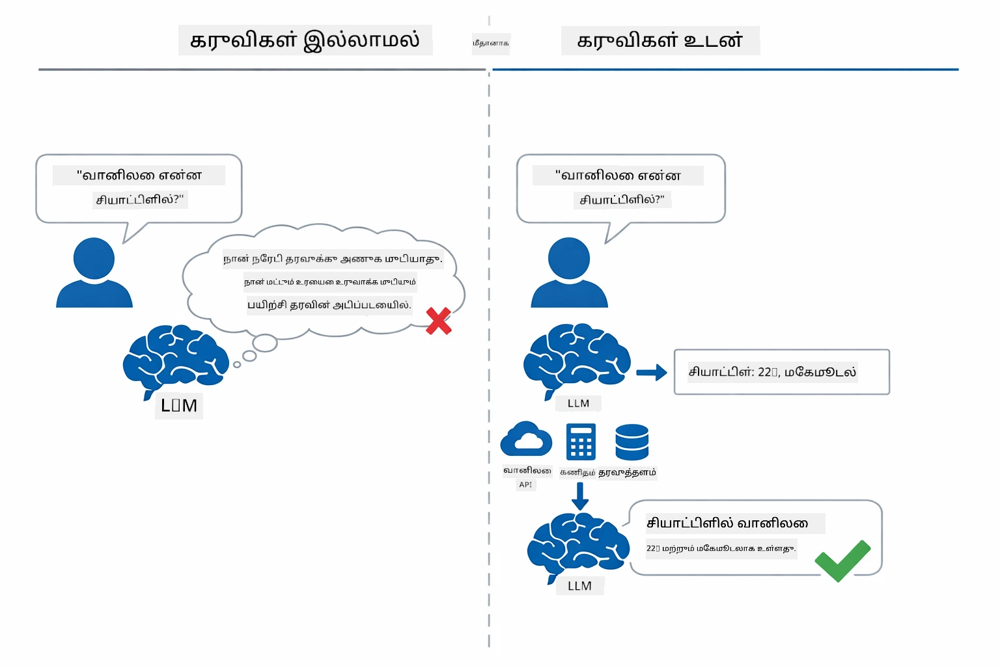

*கருவிகள் இல்லாமல் மாதிரி ஊகிப்பது மட்டுமே செய்யும் — கருவிகளுடன் APIகளை அழைக்கிறது, கணக்கீடுகள் செய்கிறது, நேரடி தரவை வழங்குகிறது.*

கருவிகளுடன் AI முகவர் **கருத்தறிதல் மற்றும் செயல்படுத்தல் (ReAct)** முறைவழியை பின்பற்றுகிறது. மாதிரி வெறும் பதில் அளிப்பதல்ல — அது என்ன தேவையெனக் கணக்கிட்டு, கருவி அழைத்து, முடிவை பின்தொடர்ந்து, மீண்டும் செயல்படவேண்டுமா அல்லது இறுதிப் பதிலளிக்குமா என்று தீர்மானிக்கிறது:

1. **கருத்தறிதல்** — பயனரின் கேள்வியை பகுத்தறிந்து தேவைப்படும் தகவலை தீர்மானிக்கிறது
2. **செயல்** — சரியான கருவியை தேர்ந்தெடுத்து, சரியான அளவுருக்களை உருவாக்கி அழைக்கிறது
3. **காணுதல்** — கருவியின் வெளிவிவரத்தைப் பெற்று முடிவை மதிப்பீடு செய்கிறது
4. **மீண்டும் அல்லது பதில் அளிப்பு** — மேலும் தரவு வேண்டுமானால் மீண்டும் முயற்சி; இல்லையெனில் இயல்பான மொழி பதிலை உருவாக்குகிறது

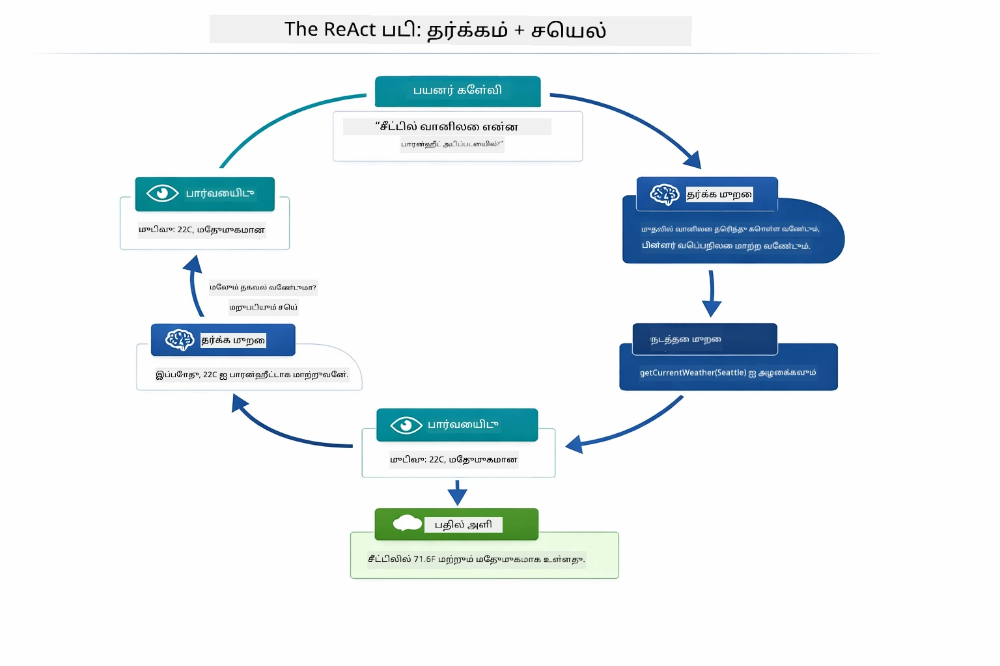

*ReAct சுழற்சி — முகவர் செய்ய வேண்டியது என்ன என அறிவு கொண்டு, கருவி அழைக்க, முடிவைக் காணும், மற்றும் இறுதி பதிலை வழங்கும் வரை மீளும.*

இது தானாக நடைபெறும். நீங்கள் கருவிகளை மற்றும் அவற்றின் விளக்கங்களை வரையறுக்கிறீர்கள். மாதிரி அவற்றை எப்போது மற்றும் எப்படி பயன்படுத்துவது என்பதை தீர்மானிக்கிறது.

## கருவி அழைப்பது எப்படி வேலை செய்கிறது

### கருவி விவரக்குறிப்புக்கள்

[WeatherTool.java](../../../04-tools/src/main/java/com/example/langchain4j/agents/tools/WeatherTool.java) | [TemperatureTool.java](../../../04-tools/src/main/java/com/example/langchain4j/agents/tools/TemperatureTool.java)

நீங்கள் தெளிவான விளக்கங்கள் மற்றும் அளவுரு குறிப்புகளுடன் செயல்பாடுகளை வரையறுக்கிறீர்கள். மாதிரி இந்த விளக்கங்களை அதன் சிஸ்டம் கேள்வியில் பார்க்கிறது மற்றும் ஒவ்வொரு கருவி என்ன செய்யும் என்பதை புரிகிறது.

```java
@Component
public class WeatherTool {
    
    @Tool("Get the current weather for a location")
    public String getCurrentWeather(@P("Location name") String location) {
        // உங்கள் வானிலை தேடல் தர்க்கம்
        return "Weather in " + location + ": 22°C, cloudy";
    }
}

@AiService
public interface Assistant {
    String chat(@MemoryId String sessionId, @UserMessage String message);
}

// அசிஸ்டன்ட் ஸ்பிரிங் பூட்டால் தானாக இணைக்கப்படுகிறது:
// - ChatModel பீன்
// - @Component வகுப்புகளிலிருந்து அனைத்து @Tool முறைகள்
// - அமர்வுக்கான ChatMemoryProvider
```

கீழே உள்ள படத்தில் ஒவ்வொரு குறிப்பு விளக்கப்படுகிறது மற்றும் எப்படி AI கருவியை எப்போது அழைக்க வேண்டும், எந்த_ARGUMENTS_ வரவேற்க வேண்டும் என்று புரிந்து கொள்வதற்கு உதவுகிறது:

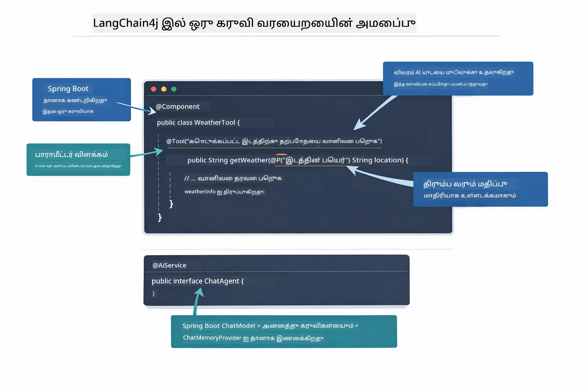

*ஒரு கருவி வரையறையின் அமைப்பு — @Tool AIக்கு எப்போது பயன்படுத்தவேண்டும் என்பதைச் சொல்கிறது, @P ஒவ்வொரு பண்பையும் விவரிக்கிறது, மற்றும் @AiService எல்லாவற்றையும் ஆரம்பத்தில் இணைக்கிறது.*

> **🤖 [GitHub Copilot](https://github.com/features/copilot) Chat உடன் முயற்சிக்கவும்:** [`WeatherTool.java`](../../../04-tools/src/main/java/com/example/langchain4j/agents/tools/WeatherTool.java) திறந்து கேளுங்கள்:
> - "OpenWeatherMap போன்ற நிஜ வானிலை API-ஐ மோக் தரவுக்குப் பதிலாக எப்படி இணைக்கலாம்?"
> - "AI அதை சரியாகப் பயன்படுத்த உதவும் நல்ல கருவி விளக்கம் என்ன?"
> - "கருவி செயலாக்கங்களில் API பிழைகள் மற்றும் வரம்புகளை எப்படி கையாளலாம்?"

### முடிவு எடுப்பு

பயனர் "Seattle இல் வானிலை என்ன?" என்று கேட்டால், மாதிரி எந்த கருவியையும் மறக்காது. அது பயனரின் நோக்கத்தை ஒவ்வொரு கருவி விளக்கத்துடனும் ஒப்பிடுகிறது, முக்கியத்துவம் பெற்று மதிப்பீடு செய்யும், சிறந்த பொருத்தத்தைத் தேர்ந்தெடுக்கிறது. பின்னர் சரியான அளவுருக்களுடன் கட்டமைக்கப்பட்ட செயல்பாடு அழைப்பை உருவாக்குகிறது — இதுவரை `location` ஐ `"Seattle"` என அமைக்கிறது.

யாராவது கருவி பயனர் கோரிக்கையின் பொருத்தமானது இல்லை என்றால் மாதிரி தனது அறிவின் அடிப்படையில் பதில் கூறும். பல கருவிகள் பொருத்தப்பட்டால், அதில் மிகவும் சிறப்பான ஒன்றை தேர்ந்தெடுக்கிறது.

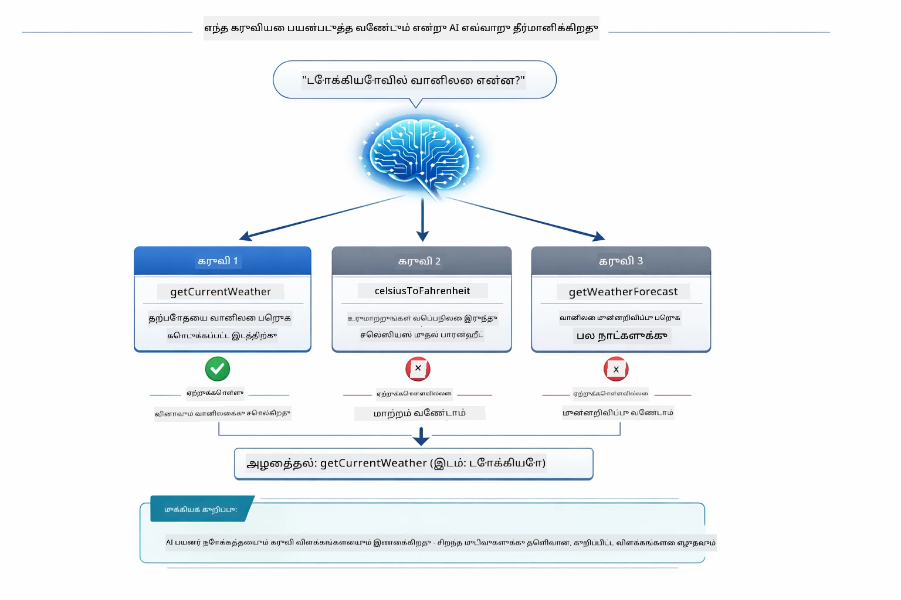

*மாதிரி பயனரின் நோக்கத்துடன் ஒப்பிடாமல் கிடைக்கும் கருவிகளின் அனைத்தையும் மதிப்பெண்ண க்கிறது மற்றும் சிறந்தது தேர்ந்தெடுக்கிறது — இதுவே தெளிவான, குறிப்பிட்ட கருவி விளக்கங்கள் முக்கியமான காரணம்.*

### நிர்வாகம்

[AgentService.java](../../../04-tools/src/main/java/com/example/langchain4j/agents/service/AgentService.java)

Spring Boot தானியங்கி @AiService இடைமுகத்துடன் பதிவான கருவிகளை இணைக்கிறது, மற்றும் LangChain4j கருவி அழைப்புகளை தானாக நிறைவேற்றுகிறது. பின்புலத்தில், முழுமையான கருவி அழைப்பு ஆறு படிகளுக்குள் சுழல்கிறது — பயனரின் இயல்பான மொழி கேள்வியிலிருந்து இயல்பான பதிலுக்கு வரைக்கும்:

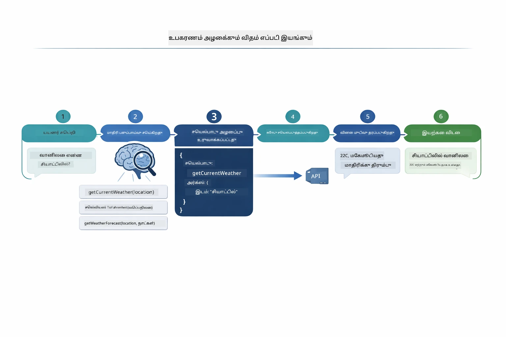

*முழு நடவடிக்கை — பயனர் கேள்வி கேட்கிறார், மாதிரி கருவி தேர்ந்தெடுக்கிறது, LangChain4j அதை இயக்குகிறது, மாதிரியும் முடிவை இயல்பான பதிலில் இணைக்கிறது.*

> **🤖 [GitHub Copilot](https://github.com/features/copilot) Chat உடன் முயற்சிக்கவும்:** [`AgentService.java`](../../../04-tools/src/main/java/com/example/langchain4j/agents/service/AgentService.java) திறந்து கேளுங்கள்:
> - "ReAct முறைப்படுகிறது எப்படி வேலை செய்கிறது மற்றும் AI முகவர்களுக்கு ஏன் பயனுள்ளதாக இருக்கிறது?"
> - "முகவர் எந்த கருவியை மற்றும் எந்த வரிசையில் பயன்படுதிக்க வேண்டும் என்று எப்படி தீர்மானிக்கிறது?"
> - "ஒரு கருவி செயலாக்கம் தோல்வியடைந்தால் என்ன நிகழும் - பிழைகளை எப்படிச் சரியாக கையாள வேண்டும்?"

### பதில் தயாரிப்பு

மாதிரி வானிலை தரவைப் பெற்று, பயனருக்கு இயல்பான மொழி பதிலாக வடிவமைக்கிறது.

### வடிவமைப்பு: ஸ்பிரிங் பூட் தானியங்கி இணைப்பு

இந்த மாடுல் LangChain4j இன் ஸ்பிரிங் பூட் ஒருங்கிணைப்பை `@AiService` இடைமுகங்களுடன் பயன்படுத்துகிறது. ஆரம்பத்தில் ஸ்பிரிங் பூட் அனைத்துக் `@Tool` முறைகளைக் கொண்ட அனைத்து `@Component`-களையும், உங்கள் `ChatModel` பீன் மற்றும் `ChatMemoryProvider`-ஐ கண்டறிந்து — பின்பு எல்லாவற்றையும் ஒன்றாகவும் டூண்டிக்கொண்டுள்ள `Assistant` இடைமுகத்தில் இணைக்கிறது.

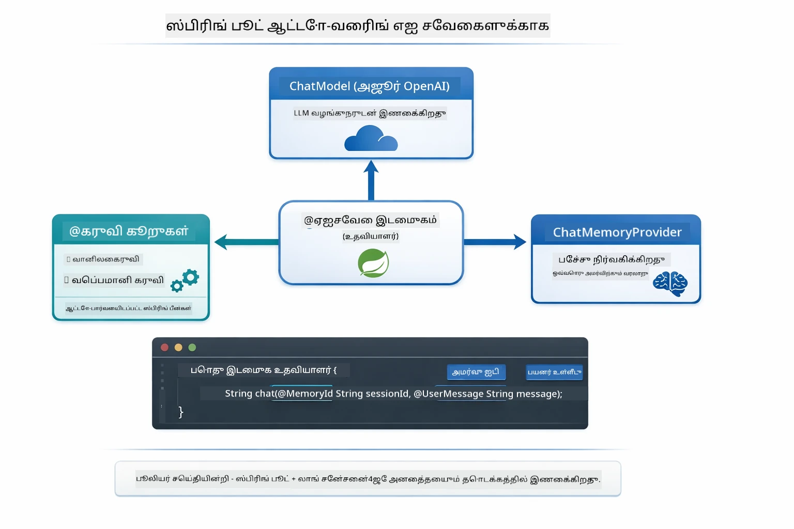

*@AiService இடைமுகம் ChatModel, கருவி கூறுகள் மற்றும் நினைவக வழங்கியவரை இணைக்கிறது — ஸ்பிரிங் பூட் தானாகச் சுருங்கலை நிர்வகிக்கிறது.*

இந்த அணுகுமுறையின் முக்கிய நன்மைகள்:

- **ஸ்பிரிங் பூட் தானியங்கி இணைப்பு** — ChatModel மற்றும் கருவிகள் தானாக செலுத்தப்படுகிறன
- **@MemoryId முறை** — தானாக அமர்வு அடிப்படையிலான நினைவக மேலாண்மை
- **ஒரே உதவி** — உதவியாளர் ஒருமுறை உருவாக்கப்பட்டு நல்ல செயல்திறனுக்காக மீண்டும் பயன்படுத்தப்படுகிறது
- **வகை-பாதுகாப்பான செயல்பாடு** — ஜாவா முறைகள் நேரடியாக வகை மாற்றத்துடன் அழைக்கப்படுகின்றன
- **பல சுற்றுக் ஒருங்கிணைப்பு** — கருவி தொடர் இணைப்பை தானாக கையாள்கிறது
- **பொதுக் குறியீடு இல்லாதது** — கைமுறை `AiServices.builder()` அழைப்புகள் அல்லது நினைவக ஹாஷ்மேப் இல்லை

மாற்று அணுகுமுறைகள் (கைமுறை `AiServices.builder()`) அதிக குறியீடு தேவைபடும் மற்றும் ஸ்பிரிங் பூட் ஒருங்கிணைப்பு நன்மைகள் இவை வழங்காது.

## கருவி தொடர் இணைப்பு

**கருவி தொடர் இணைப்பு** — ஒரு கேள்விக்கு பல கருவிகள் தேவைப்படும் போது கருவி அடிப்படையிலான முகவர்களின் உண்மை சக்தி வெளிப்படுகிறது. "Seattle இல் வானிலை என்ன ஃபாரன்ஹீட்டில்?" என்று கேட்பது எனில், முகவர் தானாக இரண்டு கருவிகளை தொடர்ந்து அழைக்கிறது: முதலில் `getCurrentWeather` ஐ பயன்படுத்தி செல்சியஸில் வெப்பநிலை பெறுகிறது, பின்னர் அந்த மதிப்பை மாற்ற `celsiusToFahrenheit`-க்கு அனுப்பி சேர்ந்த பதிலைச் சொல்லுகிறது — எல்லாம் ஒரு உரையாடல் முறையில்.

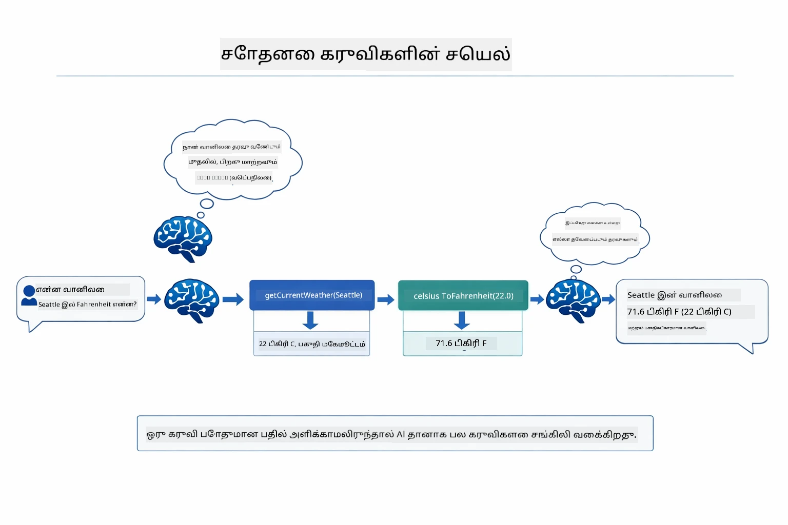

*கருவி தொடர் இணைப்பு செயல்பாட்டில் — முகவர் முதலில் getCurrentWeather க்கு அழைக்கிறது, பின்னர் செல்சியஸ் முடிவை celsiusToFahrenheit க்கு அனுப்பி இணைந்த பதிலை வழங்குகிறது.*

**மெல்லிய தோல்விகள்** — மோக் தரவிலில்லை என்ற நகரத்தின் வானிலை கேட்டால், கருவி பிழை செய்தியைத் திருப்பி அனுப்புகிறது, AI உதவி செய்ய முடியாது என்று விளக்குகிறது, கெட்டுப்போகாது. கருவிகள் பாதுகாப்பாக தோல்வி அடைகின்றன. கீழே உள்ள படத்தில் இரண்டு அணுகுமுறைகள் ஒப்பிடப்பட்டுள்ளன — சரியான பிழையொத்திகையுடன் இருக்கும் முகவர் தவறை பிடித்து உதவிக்குறிப்புடன் பதிலளிக்கின்றது, இல்லையெனில் செயலி முழுவதும் இடிந்து விடும்:

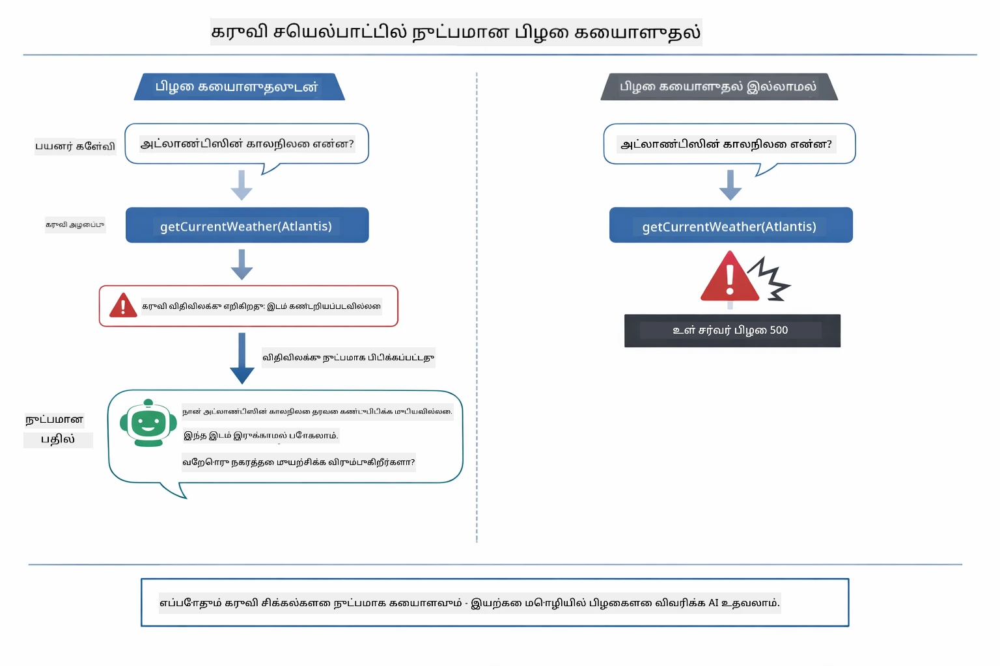

*ஒரு கருவி தோல்வியடையும் போது, முகவர் பிழையை பிடித்து முறையான விளக்கத்துடன் பதிலளிக்கின்றது இடிந்து விடுவதை தவிர்க்கும்.*

இது ஒரே உரையாடல் முறையில் நிகழ்கிறது. முகவர் பல கருவி அழைப்புகளை தன்னிச்சையாக ஒருங்கிணைக்கிறது.

## செயலியை இயக்குக

**நிர்மாணத்தை சரிபார்க்கவும்:**

அடைவில் `.env` கோப்பு Azure அங்கீகாரங்களுடன் உள்ளது என்பதை உறுதி செய்யவும் (Module 01 இல் உருவாக்கப்பட்டது). இந்த மாடுல் அடைவிலிருந்து இயக்கவும் (`04-tools/`):

**Bash:**
```bash
cat ../.env  # AZURE_OPENAI_ENDPOINT, API_KEY, DEPLOYMENT காண்பிக்க வேண்டும்
```

**PowerShell:**
```powershell
Get-Content ..\.env  # AZURE_OPENAI_ENDPOINT, API_KEY, DEPLOYMENT காட்ட வேண்டும்
```

**செயலியை துவக்கவும்:**

> **குறிப்பு:** நீங்கள் ஏற்கனவே `./start-all.sh` கையாண்டு அனைத்து செயலிகளையும் ஆரம்பித்திருந்தால் (Module 01 இல் விவரிக்கப்பட்டது), இந்த மாடுல் 8084 போர்டில் இயங்கிக் கொண்டிருக்கும். கீழ்கண்ட துவக்கக் கட்டளைகளைச்.skip செய்து http://localhost:8084-க்கு நேரடியாக செல்க.

**விருப்பம் 1: Spring Boot Dashboard பயன்படுத்துதல் (VS Code பயனர்களுக்கு பரிந்துரைக்கப்படுகிறது)**

உருவாக்கி பொதி (dev container) Spring Boot Dashboard விரிவாக்கத்துடன் வருகிறது, இது அனைத்து ஸ்பிரிங் பூட் செயலிகளை கையாள வினாடி இடைமுகத்தை வழங்குகிறது. இது VS Code இன் இடது பக்கத்தில் உள்ள Activity Bar-இல் (Spring Boot ஐகானை காணவும்) இருக்கும்.

Spring Boot Dashboard மூலம், நீங்கள்:
- வேலைவாய்ப்பில் உள்ள அனைத்து ஸ்பிரிங் பூட் செயலிகளையும் காணலாம்
- செயலைத் தொடக்க/நிறுத்த முடியும் ஒரு கிளிக்கில்
- செயலி பதிவுகளை நேரடியாகக் காணலாம்
- செயலியின் நிலையை கண்காணிக்கலாம்

"tools" பக்கத்தில் பிளே பொத்தானைக் கிளிக் செய்து இந்த மாடுலை துவக்கவும், அல்லது அனைத்தையும் ஒரே முறையில் துவக்கவும்.

VS Code இல் Spring Boot Dashboard இவ்வாறு தோன்றும்:


*VS Code இல் Spring Boot Dashboard — அனைத்துத் தளங்களையும் ஒரே இடத்தில் துவக்க/நிறுத்த மற்றும் கண்காணிக்கலாம்*

**விருப்பம் 2: ஷெல் ஸ்கிரிப்ட்கள் பயன்படுத்துதல்**

01-04 மாடுல்களின் அனைத்து வலை செயலிகளையும் துவக்கவும்:

**Bash:**
```bash
cd ..  # ரூட் அடைவை இருந்து
./start-all.sh
```

**PowerShell:**
```powershell
cd ..  # ரூட் அடைவு இருந்து
.\start-all.ps1
```

அல்லது இந்த மாடுலை மட்டும் துவக்கவும்:

**Bash:**
```bash
cd 04-tools
./start.sh
```

**PowerShell:**
```powershell
cd 04-tools
.\start.ps1
```

இரண்டும் ஷெல் ஸ்கிரிப்ட்கள் ரூட் `.env` கோப்பிலிருந்து சுற்றுப்பக்க மாறிலிகளை தானாக ஏற்றும் மற்றும் JAR கோப்புகள் இல்லாவிடில் அவற்றை கட்டமைக்கும்.

> **குறிப்பு:** அனைத்து மாடுல்களையும் கைமுறையா கட்டிய பிறகே துவங்க விரும்பினால்:
>
> **Bash:**
> ```bash
> cd ..  # Go to root directory
> mvn clean package -DskipTests
> ```
>
> **PowerShell:**
> ```powershell
> cd ..  # Go to root directory
> mvn clean package -DskipTests
> ```


உங்கள் உலாவியில் http://localhost:8084 ஐத் திறக்கவும்.

**நிறுத்த:**

**Bash:**
```bash
./stop.sh  # இந்த தொகுதி மட்டும்
# அல்லது
cd .. && ./stop-all.sh  # அனைத்து தொகுதிகளும்
```

**PowerShell:**
```powershell
.\stop.ps1  # இந்த தொகுதி மட்டும்
# அல்லது
cd ..; .\stop-all.ps1  # அனைத்து தொகுதிகளும்
```

## செயலியைப் பயன்படுத்துதல்

செயலி வானிலை மற்றும் வெப்பநிலை மாற்ற கருவிகளுக்கு அணுகல் கொண்ட AI முகவருடன் தொடர்பு கொள்ள கூடிய வலை இடைமுகத்தை வழங்குகிறது. இங்கு இடைமுகம் எப்படி தோன்றுகிறது — இது விரைவான தொடக்க உதாரணங்களும், கோரிக்கைகளை அனுப்ப ஒரு உரையாடல் பகுதியும் உள்ளது:
<a href="images/tools-homepage.png"></a>

*ஏஐ முகவர் கருவிகள் இடைமுகம் - கருவிகளுடன் தொடர்பு கொள்ள சரியான உதாரணங்கள் மற்றும் உரையாடல் இடைமுகம்*

### எளிய கருவி பயன்பாட்டைப் பரிசோதிக்கவும்

ஒரு எளிதான கோரிக்கையுடன் தொடங்கவும்: "100 டிகிரி பாரன்ஹீட்-ஐ செல்சியஸுக்கு மாற்றவும்". முகவர் வெப்ப நிலை மாற்ற கருவி தேவை என்பதை அடையாளம் காண்கிறார், சரியான அளவுருக்களுடன் அதை அழைக்கிறார், மற்றும் முடிவை வழங்குகிறார். இது எவ்வாறெல்லாம் இயல்பாக இருக்கின்றது என்பதை கவனியுங்கள் - நீங்கள் எந்த கருவியை பயன்படுத்த வேண்டும் அல்லது அதை எப்படி அழைக்க வேண்டும் என்று குறிப்பிடவில்லை.

### கருவி இணைப்பை சோதிக்கவும்

இப்பொழுது இன்னும் சிக்கலான ஒன்றை முயற்சிக்கவும்: "சியாட்டிலில் வானிலை என்ன மற்றும் அதை பாரன்ஹீட்டுக்கு மாற்றவும்?" முகவர் இதை படி படியாக செய்கிறார். முதலில் வானிலை பெறுகிறார் (சில்சியஸ் மதிப்பைத் தருகிறது), அதனை பாரன்ஹீட்டுக்கு மாற்ற வேண்டியது அவசியமென உணர்கிறார், மாற்ற கருவியை அழைக்கிறார், மற்றும் இரு முடிவுகளையும் ஒன்றாக சேர்த்து பதிலளிக்கிறார்.

### உரையாடல் பரிவர்த்தனை பார்க்கவும்

உரையாடல் இடைமுகம் உரையாடல் வரலாற்றை பேணி வைத்திருக்கிறது, இதன்மூலம் நீங்கள் பலமுறை உரையாடல்களை நடத்த முடியும். நீங்கள் எல்லா முந்தைய கேள்விகளையும் பதில்களையும் பார்க்க முடியும், இது உரையாடலை கண்காணிக்கவும் மற்றும் முகவர் பல பரிமாற்றங்களில் எப்படி சூழலை கட்டமைக்கிறார் என்பதை புரிந்துகொள்ளவும் எளிதாக உள்ளது.

<a href="images/tools-conversation-demo.png"></a>

*எளிய மாற்றங்கள், வானிலை பார்க்கும், மற்றும் கருவி இணைப்புகளை காட்டும் பலமுறை உரையாடல்*

### வெவ்வேறு கோரிக்கைகளை முயற்சிக்கவும்

பல இணைப்பு முயற்சிகள் செய்யவும்:
- வானிலை பார்க்கவும்: "டோக்கியோவின் வானிலை என்ன?"
- வெப்ப நிலை மாற்றங்கள்: "25°செல்வியம் என்ன வெல்வின்?"
- சேர்க்கப்பட்ட கேள்விகள்: "பாரிஸில் வானிலை பாருங்கள் மற்றும் அது 20°செல்வியத்தை கடந்ததா என சொல்லுங்கள்"

முகவர் இயல்பான மொழியை எப்படி ஆராய்ந்து பொருத்த கருவி அழைப்புகளுக்கு மாற்றுகிறான் என்பதை கவனியுங்கள்.

## முக்கியக் கான்செப்ட்கள்

### ReAct படிவம் (தீர்மானம் மற்றும் செயல்)

முகவர் தீர்மானிப்பதும் (ஏன் செய்ய வேண்டும் என்பதைக் கணக்கிடுதல்) மற்றும் செயல்படும் (கருவிகளை பயன்படுத்துவது) இடையே மாறி செயல்படுகிறான். இந்த படிவம் தானாக தீர்வு காண்பதற்கான முனைப்பை வழங்குகிறது; உத்தரவுகளை மட்டும் பின்பற்றுவதில்லை.

### கருவி விளக்கங்கள் முக்கியம்

உங்கள் கருவி விளக்கங்களின் தரம் முகவர் அவற்றை எவ்வளவு சிறப்பாக பயன்படுத்துகிறானோ அதைப் பக்குவமாக பாதிக்கிறது. தெளிவான, சிறப்பான விளக்கங்கள் மாதிரியை எப்போது மற்றும் எப்படி ஒவ்வொரு கருவியையும் அழைக்கவேண்டும் என்பதை புரிந்து கொள்ள உதவுகிறது.

### அமர்வு மேலாண்மை

`@MemoryId` குறிப்பு தானாக அமர்வு அடிப்படையிலான நினைவக மேலாண்மையை இயக்குகிறது. ஒவ்வொரு அமர்வு ஐடியுக்கும் தனித்த `ChatMemory` உதவி `ChatMemoryProvider` மூலம் நிர்வகிக்கப்படுகிறது, எனவே பல பயனர்கள் ஒரே நேரத்தில் முகவருடன் உரையாடலாம் அவர்கள் உரையாடல்கள் கலந்து மாறாமல். பின்வரும் வரைபடம் பல பயனர்கள் அவர்களது அமர்வு ஐடியின் அடிப்படையில் தனித்த நினைவகங்கள் என்ன பாதை செல்லும் என்பதைக் காட்டுகிறது:

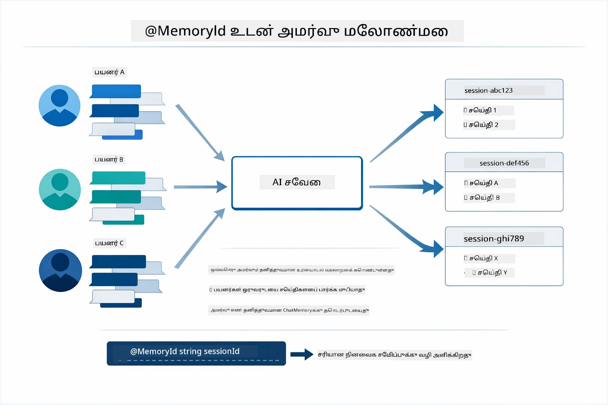

*ஒவ்வொரு அமர்வு ஐடியும் தனித்த உரையாடல் வரலாறுக்கு தொடர்புடையவை — பயனர்கள் ஒருவருடைய செய்திகளை ஒருவரே காண மாட்டார்கள்.*

### பிழை கையாளுதல்

கருவிகள் தோல்வி அடையலாம் — APIகள் நேரம் முடிவடையலாம், அளவுருக்கள் தவறானவையாயிருக்கலாம், வெளிப்புற சேவைகள் நிறுத்தப்படலாம். உற்பத்தி முகவர்களுக்குப் பிழை கையாளுதல் அவசியம்; மாதிரி பிரச்சனைகளை விளக்கவோ அல்லது மாற்று முயற்சிகளோ செய்ய வாழுமாறு. ஒரு கருவி தவறுகளை எழுப்பினால், LangChain4j அதனைப் பிடித்து பிழை செய்தியை மாதிரிக்கு வழங்குகிறது, பின்னர் மாதிரி இயல்பான மொழியில் பிரச்சனையை விளக்க முடியும்.

## கிடைக்கும் கருவிகள்

தடங்கியுள்ள வரைபடம் நீங்கள் உருவாக்கக்கூடிய பரவலான கருவிகள் சூழலை காட்டுகிறது. இந்த தொகுதி வானிலை மற்றும் வெப்ப நிலை கருவிகளை காட்டுகிறது, ஆனால் அதே `@Tool` வடிவம் எந்த ஜாவா முறைமைக்குமான பொருந்தும் — தரவுத்தள கோரிக்கைகளிலிருந்து பணம் பரிமாற்ற பயன்பாடுகள் வரை.

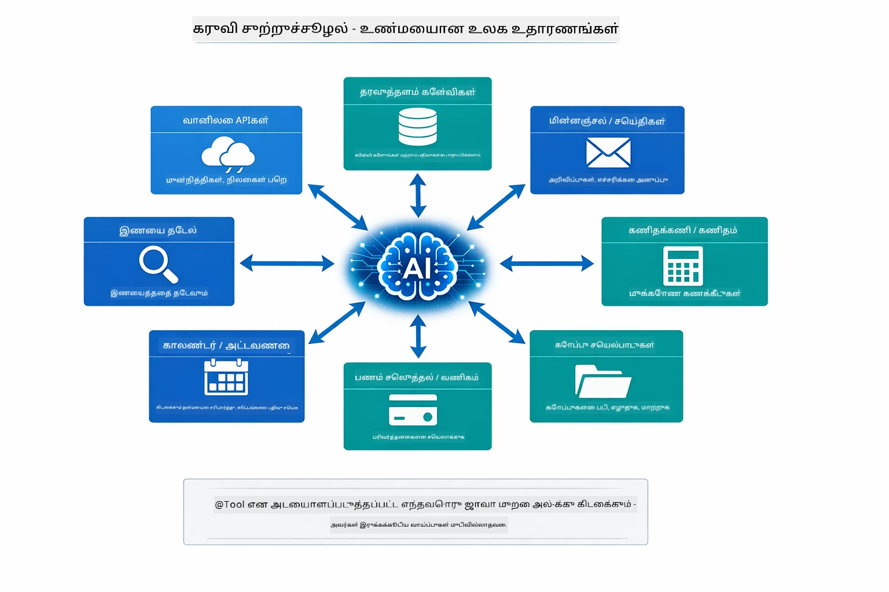

*@Tool என்பதுடன் குறிக்கப்படும் எந்த ஜாவா முறைமையும் ஏஐக்குப் கிடைக்கக்கூடியதாகும் — இது தரவுத்தளங்கள், APIகள், மின்னஞ்சல், கோப்பு செயல்பாடுகள் மற்றும் பலவற்றுக்கான வடிவத்தை நீட்டிக்கிறது.*

## கருவி அடிப்படையிலான முகவர்களை எப்போது பயன்படுத்துவது

எல்லா கோரிக்கைகளும் கருவிகளை தேவைப்படுத்தாது. முடிவு என்னவென்றால் AI வெளிப்புற முறைமைகளுடன் தொடர்பு கொள்ளவேண்டும் என்பதோ அல்லது தனது அறிவிலிருந்து பதில் அளிக்க முடியும் என்பதோ. பின்வரும் வழிகாட்டு அட்டவணை எப்போது கருவிகள் மதிப்பிடப்படுகின்றன, எப்போது தேவையில்லை என்பதைக் கூற்று செய்கிறது:

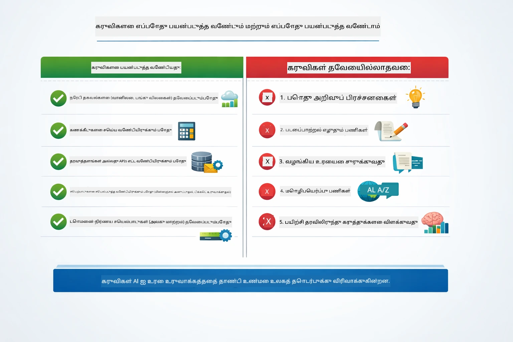

*விரைவான தீர்வு வழிகாட்டு - கருவிகள் நேரடி தரவு, கணக்கீடுகள் மற்றும் செயல்பாடுகளுக்காக; பொதுவான அறிவும் படைப்பாற்றல் பணிகளும் அவற்றை தேவையில்லை.*

## கருவிகள் மற்றும் RAG

மொடியூல்கள் 03 மற்றும் 04 இரண்டும் ஏஐ செய்யக்கூடியவற்றை விரிவாக்குகின்றன, ஆனால் அடிப்படையாக வேறுபட்ட முறைகளில். RAG மாதிரிக்கு **அறிவை** அறிய ஆவணங்களை மீட்டெடுக்க அனுமதிக்கிறது. கருவிகள் மாதிரிக்கு **செயல்களை** மேற்கொள்ளும் திறமை வழங்கும், செயல்பாட்டுக்களை அழைப்பதன் மூலம். கீழே உள்ள வரைபடம் இந்த இரண்டு அணுகுமுறைகள் ஒப்பிடப்பட்டுள்ளவை - ஒவ்வொரு வேலைவாய்ப்போடும் செயல்பாடுகளும் மற்றும் அவற்றிற்கு இடையேயான வியாபார கூறுகள்:

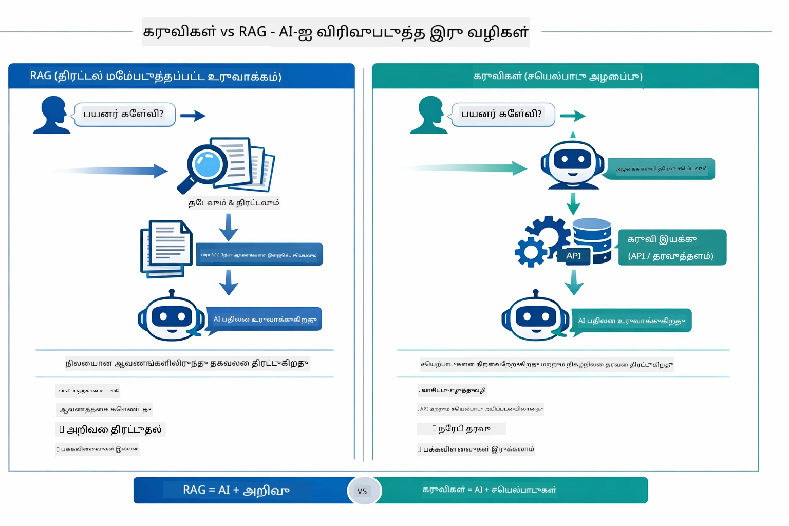

*RAG நிலையான ஆவணங்களிலிருந்து தகவலை மீட்டெடுக்கிறது — கருவிகள் செயல்களை நிறைவேற்றுகின்றன மற்றும் இயக்கும்போது நேரடி தரவை பெறுகின்றன. பல உற்பத்தி முறைமைகள் இரண்டையும் ஒருங்கிணைக்கின்றன.*

வாவிய நிஜத்தில், பல உற்பத்தி முறைமைகள் இரண்டையும் ஒருங்கிணைக்கின்றன: உங்கள் ஆவணங்களில் பதில்களை அடிப்படையாக்க RAG பயன்படுத்துவது, நேரடி தரவைக் கொண்டு வர அல்லது செயல்பாடுகளை செய்ய கருவிகள்.

## அடுத்த படிகள்

**அடுத்த முயற்சி:** [05-mcp - மாதிரி சூழல் ஒப்பந்தம் (MCP)](../05-mcp/README.md)

---

**திசைதிருத்தம்:** [← முந்தையது: மொடியூல் 03 - RAG](../03-rag/README.md) | [முதன்மைக்கு திரும்பு](../README.md) | [அடுத்து: மொடியூல் 05 - MCP →](../05-mcp/README.md)

---

<!-- CO-OP TRANSLATOR DISCLAIMER START -->
**எச்சரிக்கை**:
இந்தக் குறிப்பு AI மொழிபெயர்ப்பு சேவை [Co-op Translator](https://github.com/Azure/co-op-translator) மூலம் மொழிபெயர்க்கப்பட்டுள்ளது. நாங்கள் துல்லியத்திற்காக முயற்சி செய்கிறோம் என்றாலும், தானியங்கி மொழிபெயர்ப்புகளில் பிழைகள் அல்லது தவறுகள் இருக்கலாம் என்பதை தயவுசெய்து கவனியுங்கள். தாய்மொழியில் உள்ள அசல் ஆவணம் சரியான மூலமாக கருதப்பட வேண்டும். முக்கியமான தகவல்களுக்கு, தொழில்முனைவோர் மனித மொழிபெயர்ப்பை பரிந்துரைக்கிறோம். இந்த மொழிபெயர்ப்பின் பயன்பாட்டால் ஏற்படும் எந்த விதமான தவறான புரிதல்கள் அல்லது தவறான விளக்கங்களுக்கு நாங்கள் பொறுப்பு ஏற்க மாட்டோம்.
<!-- CO-OP TRANSLATOR DISCLAIMER END -->