# Module 05: மாடல் மேலுள்ள நிலைத்துறை(ECP) அடிப்படை நடைமுறை (MCP)

## உள்ளடக்க அட்டவணை

- [வீடியோ நடைபோக்கு](../../../05-mcp)
- [நீங்கள் என்ன கற்று கொள்வீர்கள்](../../../05-mcp)
- [MCP என்பது என்ன?](../../../05-mcp)
- [MCP எவ்வாறு செயல்படுகிறது](../../../05-mcp)
- [ஏஜென்சிக் தொகுதி](../../../05-mcp)
- [உதாரணங்களை இயக்குதல்](../../../05-mcp)
  - [முன்னுரிமைகள்](../../../05-mcp)
- [விரைவான துவக்கம்](../../../05-mcp)
  - [கோப்பு செயல்பாடுகள் (Stdio)](../../../05-mcp)
  - [மேற்பார்வையாளர் ஏஜெண்ட்](../../../05-mcp)
    - [டெமோவை இயக்குதல்](../../../05-mcp)
    - [மேற்பார்வையாளர் எவ்வாறு செயல்படுகிறது](../../../05-mcp)
    - [FileAgent எவ்வாறு இயக்க நேரத்தில் MCP கருவிகளை கண்டுபிடிக்கிறது](../../../05-mcp)
    - [பதில் முன்னெடுப்புகள்](../../../05-mcp)
    - [வெளியீட்டை புரிவது](../../../05-mcp)
    - [ஏஜென்சிக் தொகுதியின் அம்சங்களின் விளக்கம்](../../../05-mcp)
- [முக்கிய கருத்துகள்](../../../05-mcp)
- [வாழ்த்து!](../../../05-mcp)
  - [அடுத்தது என்ன?](../../../05-mcp)

## வீடியோ நடைபோக்கு

இந்த தொகுதியை எப்படி துவங்குவது என்பது குறித்து விளக்கும் நேரடி அமர்வை காண்க:

<a href="https://www.youtube.com/watch?v=O_J30kZc0rw"></a>

## நீங்கள் என்ன கற்று கொள்வீர்கள்

நீங்கள் உரையாடல் AIயை உருவாக்கி விட்டீர்கள், ப்ராம்ப்ட்களை கொண்டாடி, பதில்களை ஆவணங்களில் அடிப்படையாக வைத்து, கருவிகள் கொண்ட ஏஜெண்ட்களை உருவாக்கியுள்ளீர்கள். ஆனால் அந்த எல்லா கருவிகளும் உங்கள் தனிப்பட்ட பயன்பாட்டுக்காக தனிப்பயன் கட்டப்பட்டவை. யாரும் உருவாக்கி பகிரக்கூடிய ஒரு நிலையான கருவியமைவை உங்கள் AIக்கு அணுகல் வழங்க முடியுமானால்? இந்த தொகுதியில், நீங்கள் அதை எவ்வாறு செய்வது என்பதை Model Context Protocol (MCP) மற்றும் LangChain4j இன் ஏஜென்சிக் தொகுதியுடன் கற்கப்போகிறீர்கள். முதலில் ஒரு எளிய MCP கோப்பு வாசிப்பாளரை காண்பித்து, பின்னர் அதனை மேம்பட்ட ஏஜென்சிக் வேலைபாடுகளில் எவ்வாறு எளிதாக இணைக்கலாம் என்பதை Supervisor Agent முறைப்பாட்டின் மூலம் விளக்குகிறோம்.

## MCP என்பது என்ன?

Model Context Protocol (MCP) அதே மாதிரி - AI பயன்பாடுகள் வெளிப்புற கருவிகளை கண்டுபிடித்து பயன்படுத்த ஒரு நிலையான வழியை கொடுக்கிறது. ஒவ்வொரு தரவூறு அல்லது சேவைக்கான தனிப்பயன் இணைப்புகளை எழுதுவதற்குப் பதிலாக, நீங்கள் நிலையான வடிவத்தில் திறன்களை வெளிப்படுத்தும் MCP சேவையகங்களுடன் இணைக்கிறீர்கள். உங்கள் AI ஏஜெண்ட் பின்னர் அவற்றை தானாக கண்டுபிடித்து பயன்படுத்த முடியும்.

கீழேயுள்ள வரைபடம் வேறுபாட்டை காட்டுகிறது — MCP இல்லாமல், ஒவ்வொரு இணைப்பும் தனிப்பயன் புள்ளி-படிப்பு வயரிங் தேவை; MCP உடன், ஒரு Protocol உங்கள் செயலியை எந்த கருவியுடனும் இணைக்கிறது:


*முன்பு MCP: சிக்கலான புள்ளி-புள்ளி இணைப்புகள். MCPக்கு பிறகு: ஒன்று Protocol, முடிவற்ற சாத்தியங்கள்.*

MCP AI மேம்பாட்டில் அடிப்படை சிக்கலை தீர்க்கிறது: ஒவ்வொரு இணைப்பும் தனிப்பயன். GitHub-ஐ அணுக விரும்புகிறீர்களா? தனிப்பயன் குறியீடு. கோப்புகளை வாசிக்க விரும்புகிறீர்கள்? தனிப்பயன் குறியீடு. தரவுத்தளத்தை வினவ விரும்புகிறீர்களா? தனிப்பயன் குறியீடு. இந்த இணைப்புகள் எந்த AI பயன்பாடுகளுடனும் வேலை செய்யாது.

MCP இதனை நிலையானதாக மாற்றுகிறது. MCP சேவையகம் தெளிவான விளக்கங்கள் மற்றும் ஸ்கீமாக்களுடன் கருவிகளை வெளிப்படுத்தும். எந்த MCP கிளையன்ட் இருந்தும் இணைந்து, கிடைக்கும் கருவிகளை கண்டுபிடித்து பயன்படுத்தலாம். ஒருமுறை உருவாக்கி, எங்கு வேண்டுமானும் பயன்படுத்துங்கள்.

கீழேயுள்ள வரைபடம் இந்த கட்டமைப்பை விளக்குகிறது — ஒரு MCP கிளையன்ட் (உங்கள் AI பயன்பாடு) பல MCP சேவையகங்களுடன் இணைந்து, ஒவ்வொன்றும் தங்களுடைய கருவிகளின் தொகுப்பை நிலையான protocol மூலம் வெளிக்காட்டுகின்றன:


*Model Context Protocol கட்டமைப்பு - நிலையான கருவி கண்டுபிடித்தலும் செயல்படுத்தலும்*

## MCP எவ்வாறு செயல்படுகிறது

மூடிய பின் MCP ஒரு மூடி கட்டமைப்பை பயன்படுத்துகிறது. உங்கள் Java பயன்பாடு (MCP கிளையன்ட்) கிடைக்கும் கருவிகளை கண்டுபிடித்து, ஒரு திறமையான தரவு பரிமாற்ற அடுக்கு (Stdio அல்லது HTTP) மூலமாக JSON-RPC கோரிக்கைகளை அனுப்புகிறது, MCP சேவையகம் நடவடிக்கைகளை செயல்படுத்தி முடிவுகளைத் திருப்பி அனுப்புகிறது. கீழே இந்த Protocol இன் ஒவ்வொரு அடுக்கு பற்றிய விளக்க வரைபடம்:

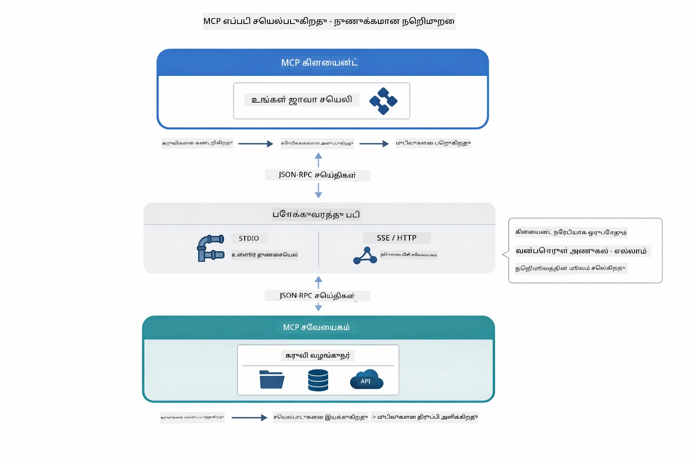

*MCP அதன் மூடிய பின் எவ்வாறு செயல்படுகிறது — கிளையன்ட்கள் கருவிகளை கண்டுபிடித்து, JSON-RPC செய்திகளுக்கு பரிமாறி, இயக்கங்களை ஒரு பரிமாற்ற அடுக்கு மூலம் செயல்படுத்துகிறார்கள்.*

**சேவையக-கிளையன்ட் கட்டமைப்பு**

MCP கிளையன்ட்-சேவையக நகலை பயன்படுத்துகிறது. சேவையகங்கள் கருவிகள் வழங்குகின்றன - கோப்புகளை வாசித்தல், தரவுத்தளங்களை வினா செய்தல், API களை அழைத்தல். கிளையன்ட்கள் (உங்கள் AI பயன்பாடு) சேவையகங்களுடன் இணைந்து அவற்றின் கருவிகளை பயன்படுத்துகின்றன.

LangChain4j உடன் MCP பயன்படுத்த, இந்த Maven சார்பைச் சேர்க்கவும்:

```xml
<dependency>
    <groupId>dev.langchain4j</groupId>
    <artifactId>langchain4j-mcp</artifactId>
    <version>${langchain4j.version}</version>
</dependency>
```

**கருவி கண்டுபிடித்தல்**

உங்கள் கிளையன்ட் MCP சேவையகத்துடன் இணைந்துப் "உங்களிடம் எத்தனை கருவிகள் உள்ளன?" என கேட்டால், சேவையகம் கிடைக்கும் கருவிகளின் பட்டியலை விளக்கங்களுடன் மற்றும் அளவுரு ஸ்கீமாக்களுடன் பதிலளிக்கிறது. உங்கள் AI ஏஜெண்ட் பயனர் கோரிக்கைகள் அடிப்படையில் எந்த கருவிகளைப் பயன்படுத்த வேண்டுமென முடிவு செய்யக்கூடியது. கீழே உள்ள வரைபடம் இந்த பாரம்பரியத்தை காண்க — கிளையன்ட் ஒரு `tools/list` கோரிக்கையை அனுப்புகிறது, சேவையகம் அவ்வப்போது கிடைக்கும் கருவிகளுடன் விளக்கங்களையும் அளவுரு ஸ்கீமாக்களையும் உடன் திருப்பி அளிக்கிறது:

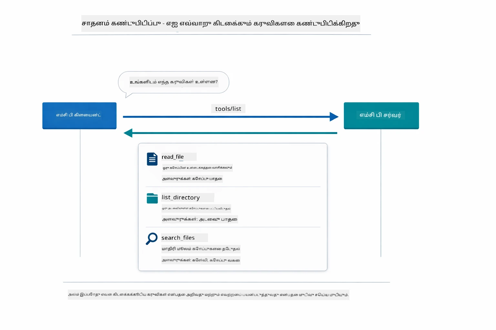

*AI துவக்கத்தில் கிடைக்கும் கருவிகளை கண்டுபிடிக்கிறது — அது இப்போது எந்த திறன்கள் கிடைப்பவை என்பதை அறிவது மற்றும் எந்த கருவிகளை பயன்படுத்தலாம் என்பது யோசிக்கிறது.*

**பரிமாற்ற இயந்திரங்கள்**

MCP பல்வேறு பரிமாற்ற இயந்திரங்களை ஆதரிக்கிறது. இரண்டு விருப்பங்கள் உள்ளன: Stdio (உள் செயலாக்க இடைமுகம்) மற்றும் Streamable HTTP (தூர சேவையகங்களுக்கான). இந்த தொகுதி Stdio பரிமாற்றத்தை காட்டுகிறது:


*MCP பரிமாற்ற இயந்திரங்கள்: தூர சேவையகங்களுக்கு HTTP, உள்ளீட்டுப் செயல்களுக்கு Stdio*

**Stdio** - [StdioTransportDemo.java](../../../05-mcp/src/main/java/com/example/langchain4j/mcp/StdioTransportDemo.java)

உள் செயலாக்கங்களுக்கு. உங்கள் பயன்பாடு ஒரு சேவையகத்தை துணை செயலாக்கமாக எழுப்பி தரவுகளை standard input/output மூலமாக பரிமாறுகிறது. கோப்புத்தளப் அணுகல் அல்லது கட்டளையடை குறிகள் பயன்பாடுகளுக்கு உதவியாக இருக்கும்.

```java
McpTransport stdioTransport = new StdioMcpTransport.Builder()
    .command(List.of(
        npmCmd, "exec",
        "@modelcontextprotocol/server-filesystem@2025.12.18",
        resourcesDir
    ))
    .logEvents(false)
    .build();
```

`@modelcontextprotocol/server-filesystem` சேவையகம் கீழ்க்காணும் கருவிகளை வழங்குகிறது, அனைத்தும் நீங்கள் குறிப்பிடும் அடைவுகளுக்கு sandbox செய்யப்பட்டவை:

| கருவி | விளக்கம் |
|------|-------------|
| `read_file` | ஒரு கோப்பின் உள்ளடக்கத்தை வாசிக்க |
| `read_multiple_files` | ஒரே அழைப்பில் பல கோப்புகளை வாசிக்க |
| `write_file` | ஒரு கோப்பை உருவாக்க அல்லது மீண்டும் எழுத |
| `edit_file` | இலக்கு அடிப்படையில் கண்டுபிடிக்கப்பட்ட மாற்றங்களை செய்ய |
| `list_directory` | ஒரு பாதையில் கோப்புகள் மற்றும் அடைப்புகளை பட்டியலிடு |
| `search_files` | எடுத்துக்காட்டுடன் பொருந்தும் கோப்புகளை மீண்டும் மீண்டும் தேடு |
| `get_file_info` | கோப்பு மெட்டாஃடேட்டா பெற (அளவு, காலச்சுட்டுகள், அனுமதிகள்) |
| `create_directory` | ஒரு அடைவை (பெற்றோர் அடைவுகளுடன்) உருவாக்கு |
| `move_file` | ஒரு கோப்பு அல்லது அடைவை நகர்த்து அல்லது பெயர் மாற்று |

கீழேயுள்ள வரைபடம் Stdio பரிமாற்றம் இயக்க நேரத்தில் எப்படிப் பணிபுரிகிறது என்பதைக் காட்டுகிறது — உங்கள் Java பயன்பாடு MCP சேவையகத்தை குழந்தை செயலாக்கமாக எழுப்பி, stdin/stdout குழாய்கள் மூலம் தொடர்பு கொள்கிறது, எந்த நெட்வொர்க் அல்லது HTTP லும் இல்லை:

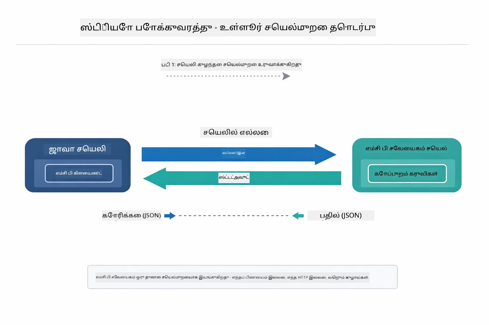

*Stdio பரிமாற்றம் செயல்பாட்டில் — உங்கள் பயன்பாடு MCP சேவையகத்தை குழந்தை செயலாக்கமாக எழுப்பி stdin/stdout குழாய்களைப் பயன்படுத்தி தொடர்பு கொள்கிறது.*

> **🤖 [GitHub Copilot](https://github.com/features/copilot) Chat உடன் முயற்சி செய்க:** [`StdioTransportDemo.java`](../../../05-mcp/src/main/java/com/example/langchain4j/mcp/StdioTransportDemo.java) கோப்பைத் திறந்து கேளுங்கள்:
> - "Stdio பரிமாற்றம் எவ்வாறு வேலை செய்கிறது மற்றும் HTTP விட எப்போது பயன்படுத்தவேண்டும்?"
> - "LangChain4j எவ்வாறு MCP சேவையக துணை செயலாக்கங்களின் வாழ்க்கைசுழற்சியை நிர்வகிக்கிறது?"
> - "AIக்குப் கோப்புத்தள அணுகல் கொடுப்பதன் பாதுகாப்பு விளைவுகள் என்ன?"

## ஏஜென்சிக் தொகுதி

MCP நிலையான கருவிகளை வழங்கும் போது, LangChain4j இன் **ஏஜென்சிக் தொகுதி** அவற்றை ஒருங்கிணைக்கும் ஏஜெண்ட்களை உருவாக்க ஒரு அறிவிப்புக் கோட்பாடான வழியை வழங்குகிறது. `@Agent` கலவை மற்றும் `AgenticServices` மூலம் நீங்கள் இயக்கவியல்பட்ட மொழிச்சார்பு குறியீடு தூண்டுதலைவிட இடைமுகங்கள் மூலம் ஏஜன்ட் நடத்தை வரையறுக்கலாம்.

இந்த தொகுதியில், நீங்கள் **மேற்பார்வையாளர் ஏஜெண்ட்** முறைப்பாட்டை ஆராய்வீர்கள் — பயனர் கோரிக்கையின் அடிப்படையில் எந்த துணை ஏஜெண்ட்களை шақிக்க வேண்டும் என்று தானாக முடிவு செய்யும் மேம்பட்ட ஏஜென்சிக் AI அணுகுமுறை. MCP சக்தியூட்டப்பட்ட கோப்பு அணுகல் திறன்களைத் துணை ஏஜெண்ட்களில் ஒருவருக்கு வழங்கி இரு கருத்துக்களையும் இணைப்போம்.

ஏஜென்சிக் தொகுதி பயன்படுத்த, இந்த Maven சார்பைச் சேர்க்கவும்:

```xml
<dependency>
    <groupId>dev.langchain4j</groupId>
    <artifactId>langchain4j-agentic</artifactId>
    <version>${langchain4j.mcp.version}</version>
</dependency>
```
> **குறிப்பு:** `langchain4j-agentic` தொகுதி வேறு கால அட்டவணையில் வெளியிடப்படுவதால் தனித்த உறுப்பு (`langchain4j.mcp.version`) பயன்படுத்துகிறது, ஏனென்றால் இது முதன்மை LangChain4j நூலகங்களிருந்து வேறுபடுகிறது.

> **⚠️ சோதனை நிலை:** `langchain4j-agentic` தொகுதி **சோதனை நிலையிலிருந்து** உள்ளது மற்றும் மாற்றப்படக்கூடும். AI உதவியாளர்களை கட்டமைப்பதற்கு நிலையாக உள்ள வழி `langchain4j-core` ஆகும் (தனிப்பயன் கருவிகளுடன், Module 04).

## உதாரணங்களை இயக்குதல்

### முன்னுரிமைகள்

- [Module 04 - கருவிகள்](../04-tools/README.md) முடித்திருப்பது (இந்த தொகுதி தனிப்பயன் கருவித்தொகுப்புக் கருத்துகளை ஆதரிக்கிறது மற்றும் MCP கருவிகளுடன் ஒப்பிடுகிறது)
- ரூட் அடைவில் `.env` கோப்பு Azure அங்கீகார தகவல்களுடன் (Module 01 இல் `azd up` மூலம் உருவாக்கப்பட்டது)
- Java 21+, Maven 3.9+
- Node.js 16+ மற்றும் npm (MCP சேவையகங்களுக்கு)

> **குறிப்பு:** நீங்கள் இன்னும் சுற்றுச்சூழல் மாறிலிகளை அமைக்காவிட்டால், [Module 01 - அறிமுகம்](../01-introduction/README.md) இல் உள்ள நிறுவல் வழிமுறைகளைப் பாருங்கள் (`azd up` ஆட்சேபணையை தானாக `.env` கோப்பை உருவாக்கும்), அல்லது `.env.example` ஐ ரூட் அடைவில் `.env` ஆக நகலெடுத்து உங்கள் மதிப்புகளை நிரப்பவும்.

## விரைவான துவக்கம்

**VS Code பயன்படுத்துதல்:** எக்ஸ்ப்ளோரரில் எந்த ஒரு டெமோ கோப்பிலும் வழி கிளிக் செய்து **"Run Java"** தேர்ந்தெடுக்கவும், அல்லது இயக்கம் மற்றும் பிழைத்திருத்து குழு மேனுவிலிருந்து துவக்க கட்டமைப்புகளைப் பயன்படுத்தவும் (`.env` கோப்பில் Azure அங்கீகாரங்கள் முதலில் உள்ளதை சரிபார்க்கவும்).

**Maven பயன்படுத்துதல்:** மாற்றாக, கீழ்க்காணும் உதாரணங்களுடன் கட்டளை வரியில் இயக்கலாம்.

### கோப்பு செயல்பாடுகள் (Stdio)

இது உள்ள இடைநிலை செயலாக்க கருவிகளை காட்டுகிறது.

**✅ எந்த முன்னுரிமையும் தேவையில்லை** - MCP சேவையகத்தை தானாக இயக்குகிறது.

**துவக்கக் காட்சிகள் (பரிந்துரைக்கப்பட்டது):**

துவக்கக் காட்சிகள் ரூட் `.env` கோப்பிலிருந்து சுற்றுச்சூழல் மாறிலிகளை தானாக ஏற்றுகிறது:

**Bash:**
```bash
cd 05-mcp
chmod +x start-stdio.sh
./start-stdio.sh
```

**PowerShell:**
```powershell
cd 05-mcp
.\start-stdio.ps1
```

**VS Code பயன்படுத்த:** `StdioTransportDemo.java` கோப்பில் உருளையை வலது கிளிக் செய்து **"Run Java"** தேர்ந்தெடுக்கவும் (`.env` கோப்பை சரிபார்க்கவும்).

பயன்பாடு ஒரு கோப்பு அமைப்புக்கான MCP சேவையகத்தை தானாக இயக்கி உள்ளூர் கோப்பை வாசிக்கும். துணை செயலாக்க மேலாண்மை எவ்வாறு உங்கள் வசதிக்காக செய்யப்பட்டிருக்கிறது என்பதை கவனியுங்கள்.

**எதிர்பார்க்கப்படும் வெளியீடு:**
```
Assistant response: The file provides an overview of LangChain4j, an open-source Java library
for integrating Large Language Models (LLMs) into Java applications...
```

### மேற்பார்வையாளர் ஏஜெண்ட்

**மேற்பார்வையாளர் ஏஜெண்ட் முறைப்பாடு** என்பது **இடையழகான** ஏஜென்சிக் AI வடிவம். ஒரு மேற்பார்வையாளர் LLM ஐப் பயன்படுத்தி பயனர் கோரிக்கையின்படி எந்த ஏஜெண்ட்களை அழைக்க வேண்டுமானால் தானாக முடிவெடுக்கிறது. அடுத்த உதாரணத்தில், MCP சக்தியூட்டிய கோப்பு அணுகலை LLM ஏஜெண்டுடன் சேர்த்து மேற்பார்வையாளர் மூலம் கோப்பு வாசி → அறிக்கை வேலைபாட்டை உருவாக்குகிறோம்.

டெமோவில், `FileAgent` MCP கோப்பு அமைப்பு கருவிகளைக் கொண்டு ஒரு கோப்பை வாசிக்கிறான், `ReportAgent` ஒரு கட்டமைக்கும் அறிக்கையை உருவாக்குகிறது, அதன் உள்ளடக்கம் தலைமை சுருக்கம் (ஒரு வாக்கியம்), 3 முக்கிய புள்ளிகள் மற்றும் பரிந்துரைகள் உள்ளன. மேற்பார்வையாளர் இந்த வேலைப்பாடானை தானாக ஒருங்கிணைக்கிறது:

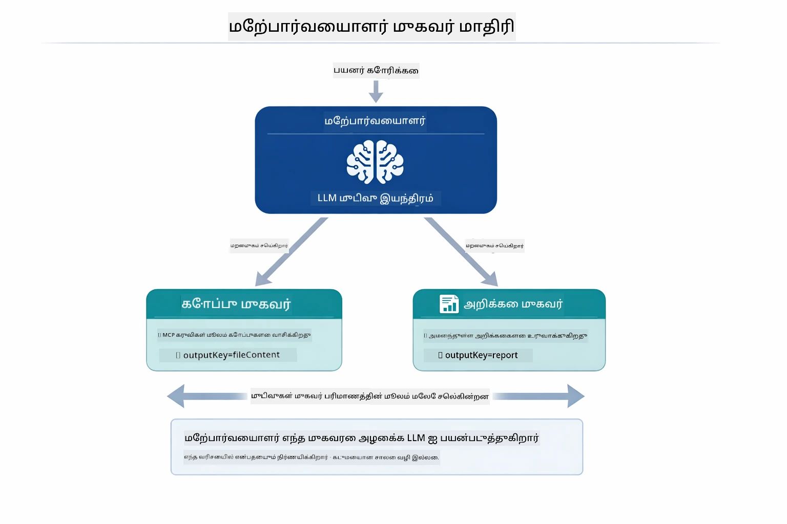

*மேற்பார்வையாளர் தனது LLM ஐப் பயன்படுத்தி எந்த ஏஜெண்ட்களை எப்போது அழைக்க வேண்டும் எனத் தீர்மானிக்கிறது — எந்த கடுமையான வழி பிரசாரம் தேவையில்லை.*

கோப்பிலிருந்து அறிக்கைக்கு நமது வேலைச்சூழலை கீழே காணலாம்:

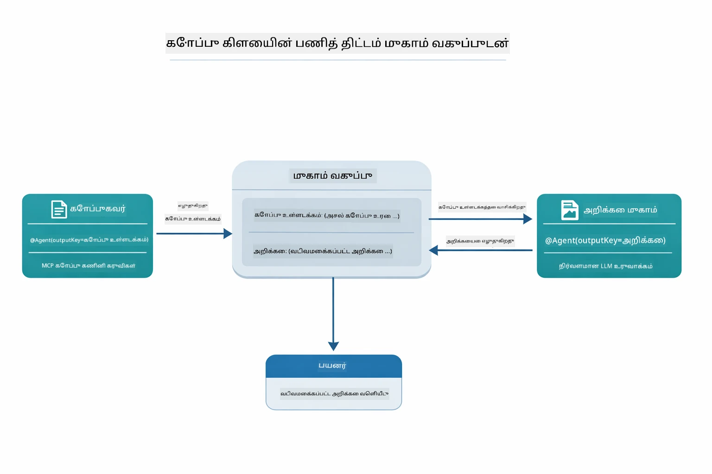

*FileAgent MCP கருவிகள் மூலம் கோப்பை வாசிக்கிறது, பிறகு ReportAgent உள்ளடக்கத்தை கட்டமைக்கும் அறிக்கையாக மாற்றுகிறது.*

அடுத்த தொடர் வரைபடம் முழு மேற்பார்வையாளர் ஒருங்கிணைப்பை பின்தொடர்கிறது — MCP சேவையகத்தை எழுப்புதல், மேற்பார்வையாளர் தானாக ஆண்ட அழைப்பு, stdio வழியாக கருவி அழைப்புகள் மற்றும் இறுதி அறிக்கை:

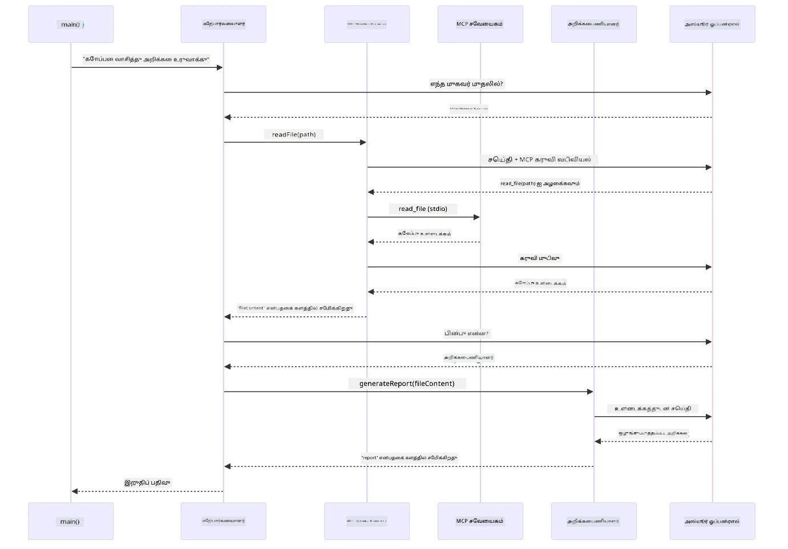

*மேற்பார்வையாளர் தானாக FileAgent ஐ அழைக்கிறது (stdio வழியாக MCP சேவையகத்தை அழைத்து கோப்பை வாசிக்க), பின்னர் ReportAgent ஐ அழைத்து கட்டமைக்கும் அறிக்கையை உருவாக்குகிறது — ஒவ்வொரு ஏஜெண்டும் தனது வெளியீட்டை Agentic Scope இல் (பகிர்ந்த நினைவகத்தில்) சேமிக்கிறது.*

ஒவ்வொரு ஏஜெண்டும் **Agentic Scope** (பகிரப்பட்ட நினைவகம்) இல் தனது வெளியீட்டை சேமிப்பதால், பிற ஏஜெண்ட்களுக்கு முந்தைய முடிவுகளை அணுக உதவுகிறது. இவ்வாறு MCP கருவிகள் ஏஜென்சிக் வேலைப்பாடுகளுடன் இடைவிடாது இணையும் என்பதைக் காட்டுகிறது — மேற்பார்வையாளர் கோப்புகள் எப்படி வாசிக்கப்படுகின்றன என்பதை அறிய அவசியமில்லை, `FileAgent` அதை செய்ய முடியும் என்பதுதான்.

#### டெமோவை இயக்குதல்

துவக்கக் காட்சிகள் ரூட் `.env` கோப்பிலிருந்து சுற்றுச்சூழல் மாறிலிகளை தானாக ஏற்றுகிறது:

**Bash:**
```bash
cd 05-mcp
chmod +x start-supervisor.sh
./start-supervisor.sh
```

**PowerShell:**
```powershell
cd 05-mcp
.\start-supervisor.ps1
```

**VS Code பயன்படுத்த:** `SupervisorAgentDemo.java` ஐ வலது கிளிக் செய்து **"Run Java"** தேர்ந்தெடுக்கவும் (`.env` கோப்பை சரிபார்க்கவும்).

#### மேற்பார்வையாளர் எவ்வாறு செயல்படுகிறது

ஏஜெண்ட்களை உருவாக்குவதற்கு முன்பு, MCP பரிமாற்றத்தை கிளையன்ட்டுடன் இணைத்து, அதை `ToolProvider` ஆக ஒருங்கிணைக்க வேண்டும். இதுவே MCP சேவையக கருவிகள் உங்கள் ஏஜெண்ட்களுக்கு கிடைக்க உதவுகிறது:

```java
// போக்குவரத்திலிருந்து ஒரு MCP கிளையண்டை உருவாக்கவும்
McpClient mcpClient = new DefaultMcpClient.Builder()
        .transport(stdioTransport)
        .build();

// கிளையண்டை ஒரு ToolProvider ஆக உறைத்துக்கொள்ளவும் — இது MCP கருவிகளை LangChain4j உடன் இணைக்கிறது
ToolProvider mcpToolProvider = McpToolProvider.builder()
        .mcpClients(List.of(mcpClient))
        .build();
```

இப்போது தேவையான ஏஜெண்ட்களில் `mcpToolProvider` ஐ ஊசி பூசி கிளையன்ட்டாகப் பயன்படுத்தலாம்:

```java
// படி 1: FileAgent MCP கருவிகளை பயன்படுத்தி கோப்புகளை வாசிக்கிறது
FileAgent fileAgent = AgenticServices.agentBuilder(FileAgent.class)
        .chatModel(model)
        .toolProvider(mcpToolProvider)  // கோப்பு செயல்பாடுகளுக்கு MCP கருவிகள் உள்ளன
        .build();

// படி 2: ReportAgent அமைந்த அறிக்கைகளை உருவாக்குகிறது
ReportAgent reportAgent = AgenticServices.agentBuilder(ReportAgent.class)
        .chatModel(model)
        .build();

// மேற்பார்வையாளர் கோப்பு → அறிக்கை பணிக்கு ஒழுங்கமைக்கிறார்
SupervisorAgent supervisor = AgenticServices.supervisorBuilder()
        .chatModel(model)
        .subAgents(fileAgent, reportAgent)
        .responseStrategy(SupervisorResponseStrategy.LAST)  // இறுதி அறிக்கையை திரும்ப அளிக்கவும்
        .build();

// கோரிக்கையின் அடிப்படையில் எந்த முகவர்களை அழைக்க வேண்டும் என்பதை மேற்பார்வையாளர் முடிவு செய்கிறார்
String response = supervisor.invoke("Read the file at /path/file.txt and generate a report");
```

#### FileAgent எவ்வாறு இயங்கும்போது MCP கருவிகளை கண்டுபிடிக்கிறது

நீங்கள் கேட்கலாம்: **`FileAgent` npm கோப்பு அமைப்பு கருவிகளை எப்படி பயன்படுத்துமெனக் காட்டுகிறது?** பதில், அதுவில்லை — **LLM** கருவி ஸ்கீமாக்களின் மூலம் இயக்க நேரத்தில் அதை புரிந்துகொள்ளிறது.
`FileAgent` இடைமுகம் என்பது ஒரு **prompt வரையறை** மட்டுமே. அது `read_file`, `list_directory`, அல்லது வேறு எந்த MCP கருவியின் கடினமாக்கப்பட்ட அறிவையும் கொண்டிருப்பதில்லை. இது உண்டாகும் முழு செயல்முறை இத如下:

1. **சேவை வழங்கி உருவாகிறது:** `StdioMcpTransport` `@modelcontextprotocol/server-filesystem` npm தொகுப்பை ஒரு குழந்தை செயலாக இயக்குகிறது  
2. **கருவி கண்டறிதல்:** `McpClient` சர்வருக்கு `tools/list` JSON-RPC கோரிக்கையை அனுப்புகிறது, சர்வர் கருவி பெயர்கள், விளக்கங்கள் மற்றும் அளவுரு வரையறைகள் (schema) களை (உதா., `read_file` — *"ஒரு கோப்பின் முழு உள்ளடக்கத்தையும் வாசிக்க"* — `{ path: string }`) பதிலளிக்கிறது  
3. **வரைபு செருகல்:** `McpToolProvider` கண்டறிந்த அத்தகைய வரையறைகளை சுற்றி இவை LangChain4jக்கு கிடைக்கும் வகையில் சமர்ப்பிக்கிறது  
4. **LLM தீர்மானிக்கிறது:** `FileAgent.readFile(path)` அழைக்கப்படும் போது, LangChain4j சிஸ்டம் செய்தி, பயனர் செய்தி, **மற்றும் கருவி வரைபுகளின் பட்டியலை** LLMக்கு அனுப்புகிறது. LLM கருவி விளக்கங்களை வாசித்து கருவி அழைப்பு ஒன்றை உருவாக்குகிறது (உதா., `read_file(path="/some/file.txt")`)  
5. **செயற்படுத்தல்:** LangChain4j கருவி அழைப்பை இடையூறாக பிடித்து, MCP கிளையண்ட் வழியாக Node.js துணை செயலுக்கு மறுவழி அனுப்பி முடிவைப் பெற்று மீண்டும் LLMக்கு வழங்குகிறது  

இதுவே மேலே விவரிக்கப்பட்ட [Tool Discovery](../../../05-mcp) செயல்முறையுடன் ஒரே உரைநடை, ஆனாலும் பிரத்யேகமாக முகவர் செயல்பாடுகளுக்கு பொருந்தும். `@SystemMessage` மற்றும் `@UserMessage` குறியீடுகள் LLM நடத்தை வழிநடத்துகின்றன, அதேபோல் செருகப்பட்ட `ToolProvider` அதற்கு **திறன்களை** வழங்குகிறது — LLM இது இரண்டையும் இயங்கும் நேரத்தில் மேம்படுத்து கொள்கிறது.

> **🤖 [GitHub Copilot](https://github.com/features/copilot) பேச்சுடன் முயற்சியுங்கள்:** [`FileAgent.java`](../../../05-mcp/src/main/java/com/example/langchain4j/mcp/agents/FileAgent.java) கோப்பை திறந்து கேளுங்கள்:  
> - "இந்த முகவர் எந்த MCP கருவியை அழைக்கிறது என்பதை எப்படி அறிவதாக உள்ளது?"  
> - "நான் முகவர் கட்டுமானகருவியில் இருந்து ToolProvider-ஐ அகற்றினால் என்ன நடக்கும்?"  
> - "கருவி வரைபுகள் LLMக்கு எப்படி வழங்கப்படுகின்றன?"

#### பதிலளிப்பு உத்திகள்

`SupervisorAgent` ஐ அமைக்கும் போது, துணை முகவர்கள் வேலை முடித்த பின்பு பயனருக்கு இறுதி பதிலை எப்படி உருவாக்க வேண்டும் என்று நீங்கள் குறிப்பிடலாம். கீழ்காணும் வரைபடம் மூன்று கிடைக்கும் உத்திகளை காட்டுகிறது — LAST நேரடியாக இறுதி முகவர் வெளியீட்டை தரும், SUMMARY அனைத்துப் பதில்களையும் LLM மூலமாக சந்திக்கிறது, மற்றும் SCORED ஆரம்ப கோரிக்கைக்கு எதிரான மதிப்பெண்களை பயன்படுத்தி மிகத் தரமானதைக் தேர்ந்தெடுக்கிறது:

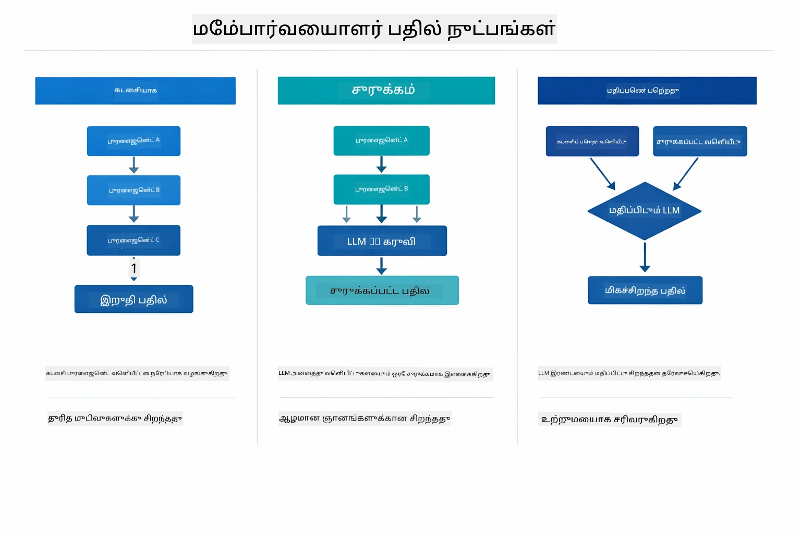

*இறுதி பதிலை எப்படி உருவாக்குவது என்பது பற்றி மூன்று உத்திகள் — நீங்கள் இறுதி முகவர் வெளிப்பாட்டை விரும்புகிறீர்களா, ஒருங்கிணைக்கப்பட்ட சுருக்கத்தை அல்லது மிகச் சிறந்த மதிப்பெண் பெற்ற தேர்வை.*

கிடைக்கும் உத்திகள்:

| உத்தி | விளக்கம் |
|----------|-------------|
| **LAST** | மேற்பார்வையாளர் நேரடியாக இறுதி துணை முகவர் அல்லது கருவி வெளியீட்டைப் பெறுகிறார். இது குறிப்பாக பணி ஓட்டையில் இறுதி முகவர் முழு, இறுதி பதிலை உருவாக்கும் வகையால் உதவுகிறது (உதா., ஒரு “சுருக்க முகவர்” ஆராய்ச்சி குழாயில்). |  
| **SUMMARY** | மேற்பார்வையாளர் சொந்த உள்ளமைவு மொழி மாதிரி (LLM) பயன்படுத்தி முழு பரிமாற்றத்தையும் துணை முகவர் பதில்களையும் ஒருங்கிணைத்து சுருக்கம் உருவாக்கி, அதை இறுதி பதிலாக வழங்குகிறார். இது பயனருக்கு நன்கு ஒருங்கிணைந்த பதிலாக அமைகிறது. |  
| **SCORED** | அமைப்பு சொந்த LLM வைத்து LAST பதிலும் பரிமாற்ற சுருக்கமும் ஆரம்ப பயனர் கோரிக்கையை எதிரோக்கி மதிப்பெண் வைத்து, அதிக மதிப்பெண் பெற்ற பதிலைத் திருப்புகிறது. |

முழு செயலாக்கம் `[SupervisorAgentDemo.java](../../../05-mcp/src/main/java/com/example/langchain4j/mcp/SupervisorAgentDemo.java)` கோப்பில் காணலாம்.

> **🤖 [GitHub Copilot](https://github.com/features/copilot) பேச்சுடன் முயற்சியுங்கள்:** [`SupervisorAgentDemo.java`](../../../05-mcp/src/main/java/com/example/langchain4j/mcp/SupervisorAgentDemo.java) திறந்து கேளுங்கள்:  
> - "மேற்பார்வையாளர் எந்த முகவர்களை அழைக்கத் தீர்மானிக்கிறார்?"  
> - "Supervisor மற்றும் Sequential வேலைப்பாடுகளுக்கு இடையேயான வித்தியாசம் என்ன?"  
> - "Supervisor திட்டமிடும் நடத்தை எப்படி தனிப்பயனாக்கலாம்?"

#### வெளியீட்டை புரிந்து கொள்வது

டெமோ ஓட்டும்போது, மேற்பார்வையாளர் பல முகவர்களை எப்படி ஒருங்கிணைக்கிறான் என்பதை கட்டமைப்புடன் காட்டுகிறது. ஒவ்வொரு பகுதியின் பொருள்:

```
======================================================================
  FILE → REPORT WORKFLOW DEMO
======================================================================

This demo shows a clear 2-step workflow: read a file, then generate a report.
The Supervisor orchestrates the agents automatically based on the request.
```
  
**தலைப்பு** வேலைப்பாட்டின் கருத்தை அறிமுகப்படுத்துகிறது: கோப்பு வாசித்தல் முதல் அறிக்கை உருவாக்கம் வரை ஒரு கவனம் செலுத்திய குழாய்.

```
--- WORKFLOW ---------------------------------------------------------
  ┌─────────────┐      ┌──────────────┐
  │  FileAgent  │ ───▶ │ ReportAgent  │
  │ (MCP tools) │      │  (pure LLM)  │
  └─────────────┘      └──────────────┘
   outputKey:           outputKey:
   'fileContent'        'report'

--- AVAILABLE AGENTS -------------------------------------------------
  [FILE]   FileAgent   - Reads files via MCP → stores in 'fileContent'
  [REPORT] ReportAgent - Generates structured report → stores in 'report'
```
  
**வேலை ஓட்டம் வரைபடம்** முகவர்கள் இடையே தரவு போக்கை காட்டுகிறது. ஒவ்வொரு முகவருக்கும் தனித்துவமான பணி உள்ளது:  
- **FileAgent** MCP கருவிகளை பயன்படுத்தி கோப்புகளை வாசித்து `fileContent` இல் மூல உள்ளடக்கத்தை சேமிக்கிறது  
- **ReportAgent** அந்த உள்ளடக்கத்தை உபயோகித்து `report` என்ற கட்டமைக்கப்பட்ட அறிக்கையை உருவாக்குகிறது

```
--- USER REQUEST -----------------------------------------------------
  "Read the file at .../file.txt and generate a report on its contents"
```
  
**பயனர் கோரிக்கை** பணியை காட்டுகிறது. மேற்பார்வையாளர் இதைக் க解析 செய்து FileAgent → ReportAgent அழைப்பதற்கு தீர்மானிக்கிறான்.

```
--- SUPERVISOR ORCHESTRATION -----------------------------------------
  The Supervisor decides which agents to invoke and passes data between them...

  +-- STEP 1: Supervisor chose -> FileAgent (reading file via MCP)
  |
  |   Input: .../file.txt
  |
  |   Result: LangChain4j is an open-source, provider-agnostic Java framework for building LLM...
  +-- [OK] FileAgent (reading file via MCP) completed

  +-- STEP 2: Supervisor chose -> ReportAgent (generating structured report)
  |
  |   Input: LangChain4j is an open-source, provider-agnostic Java framew...
  |
  |   Result: Executive Summary...
  +-- [OK] ReportAgent (generating structured report) completed
```
  
**மேற்பார்வையாளர் ஒருங்கிணைப்பு** இரு படிநிலை செயல்நிலையை காட்டுகிறது:  
1. **FileAgent** MCP மூலம் கோப்பை வாசித்து உள்ளடக்கத்தை சேமிக்கிறது  
2. **ReportAgent** அந்த உள்ளடக்கத்தை பெற்று கட்டமைக்கப்பட்ட அறிக்கையை உருவாக்குகிறது

மேற்பார்வையாளர் பயனர் கோரிக்கையை **சுயேச்சையான முறையில்** இந்த முடிவுகளை அமல்படுத்தினான்.

```
--- FINAL RESPONSE ---------------------------------------------------
Executive Summary
...

Key Points
...

Recommendations
...

--- AGENTIC SCOPE (Data Flow) ----------------------------------------
  Each agent stores its output for downstream agents to consume:
  * fileContent: LangChain4j is an open-source, provider-agnostic Java framework...
  * report: Executive Summary...
```
  
#### முகவரியல் மட்யூல் அம்சங்களின் விளக்கம்

எக்சாம்பிள் முகவரியல் (Agentic) தொகுதியின் முன்னேற்ற அம்சங்களை காட்டுகிறது. Agentic Scope மற்றும் Agent Listeners அருகிலிருந்து பார்க்கலாம்.

**Agentic Scope** `@Agent(outputKey="...")` கொண்டு முகவர்கள் தங்களது முடிவுகளை சேமித்த பகிர்ந்த நினைவகம் (shared memory) காட்டுகிறது. இதனால்:  
- பிறகு வரும் முகவர்கள் முதலில் உள்ள முகவர்களின் வெளியீடுகளை அணுகலாம்  
- மேற்பார்வையாளர் இறுதி பதிலை உருவாக்கலாம்  
- நீங்கள் ஒவ்வொரு முகவரும் என்ன தயாரித்தது என்பதை ஆய்வு செய்யலாம்

கீழ்காணும் வரைபடம் Agentic Scope பகிர்ந்த நினைவகம் போல முகவர்கள் எப்படி செயல்படுகிறார்கள் என்பதை காட்டுகிறது — FileAgent `fileContent` என்ற விசையின் கீழ் எழுத்தளிக்கிறான், ReportAgent அதை வாசித்து `report` என்ற விசையின் கீழ் தனது வெளிப்பாட்டை எழுதுகிறான்:

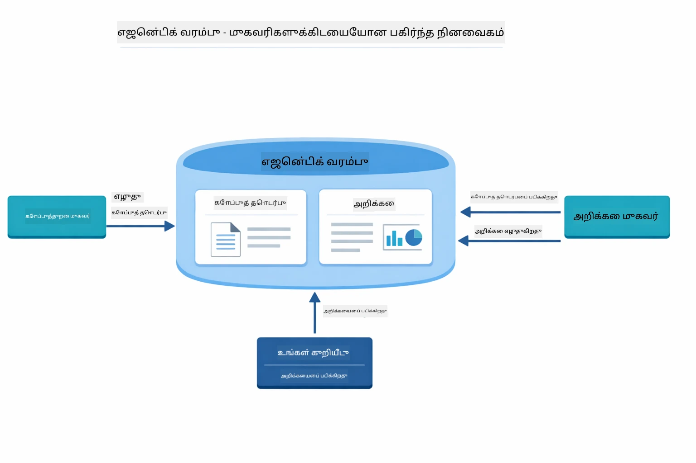

*Agentic Scope என்பது பகிர்ந்த நினைவகம் — FileAgent `fileContent` க்கு எழுதுகிறான், ReportAgent அதைப் படித்து `report` க்கு எழுதுகிறான், உங்கள் குறியீடு இறுதி முடிவை வாசிக்கிறது.*

```java
ResultWithAgenticScope<String> result = supervisor.invokeWithAgenticScope(request);
AgenticScope scope = result.agenticScope();
String fileContent = scope.readState("fileContent");  // FileAgent இல் இருந்து மூல கோப்பு தரவு
String report = scope.readState("report");            // ReportAgent இல் இருந்து கட்டமைக்கப்பட்ட அறிக்கை
```
  
**Agent Listeners** முகவர் இயங்குதிறன் கண்காணிப்பு மற்றும் பிழைத்திருத்தத்துக்கு உதவுகின்றன. டெமோவில் நீங்கள் காணும் படிநிலை வெளியீடு ஒவ்வொரு முகவர் அழைப்பிலும் இணைக்கப்பட்ட AgentListener இலிருந்து வருகிறது:  
- **beforeAgentInvocation** - மேற்பார்வையாளர் ஒரு முகவரைக் தேர்ந்தெடுக்கும்போது அழைக்கப்படுகிறது; இது எது மற்றும் ஏன் என்பதை காட்டுகிறது  
- **afterAgentInvocation** - ஒரு முகவர் முடிந்தபின் அழைக்கப்படுகிறது; அதன் முடிவை காட்டுகிறது  
- **inheritedBySubagents** - true என்றால், அனைத்து துணை முகவர்களையும் கவனிக்கிறது

பின்வரும் வரைபடம் முழு Agent Listener வாழ்க்கைச் சுழற்சியை காட்டுகிறது, இதில் `onError` பயனர்கள் பிழை நேர்ந்தால் அதைக் கையாளுகிறது:

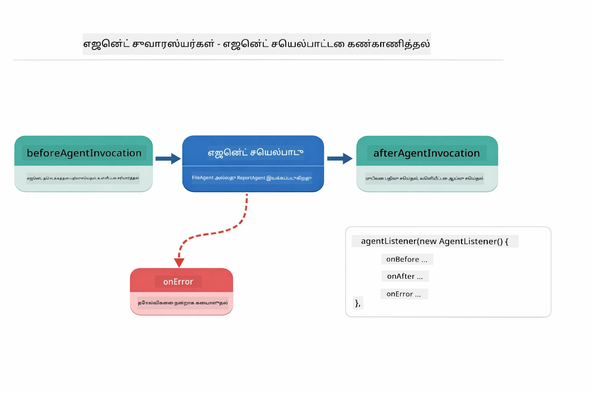

*Agent Listeners இயங்கும் கட்டத்தை உட்பிரவேசிக்கின்றன — முகவர்கள் தொடங்கும், முடியும், அல்லது பிழை சந்திக்கும் நேரங்களை கண்காணிக்கின்றன.*

```java
AgentListener monitor = new AgentListener() {
    private int step = 0;
    
    @Override
    public void beforeAgentInvocation(AgentRequest request) {
        step++;
        System.out.println("  +-- STEP " + step + ": " + request.agentName());
    }
    
    @Override
    public void afterAgentInvocation(AgentResponse response) {
        System.out.println("  +-- [OK] " + response.agentName() + " completed");
    }
    
    @Override
    public boolean inheritedBySubagents() {
        return true; // அனைத்து துணையினங்களுக்கு பரப்புக
    }
};
```
  
மேற்பார்வையாளர் மாதிரியின் அுல்வாய், `langchain4j-agentic` தொகுதி பல சக்திவாய்ந்த வேலைபாட்டுக் காட்சிமுறைகளையும் வழங்குகிறது. கீழ்காணும் வரைபடம் அனைத்து ஐந்து வகைகளையும் காட்டுகிறது — எளிய தொடர்ச்சியான குழாய்குன்றிலிருந்து மனித-இன்று நிர்வாக ஒப்புதல் வேலைபாடுகள் வரை:

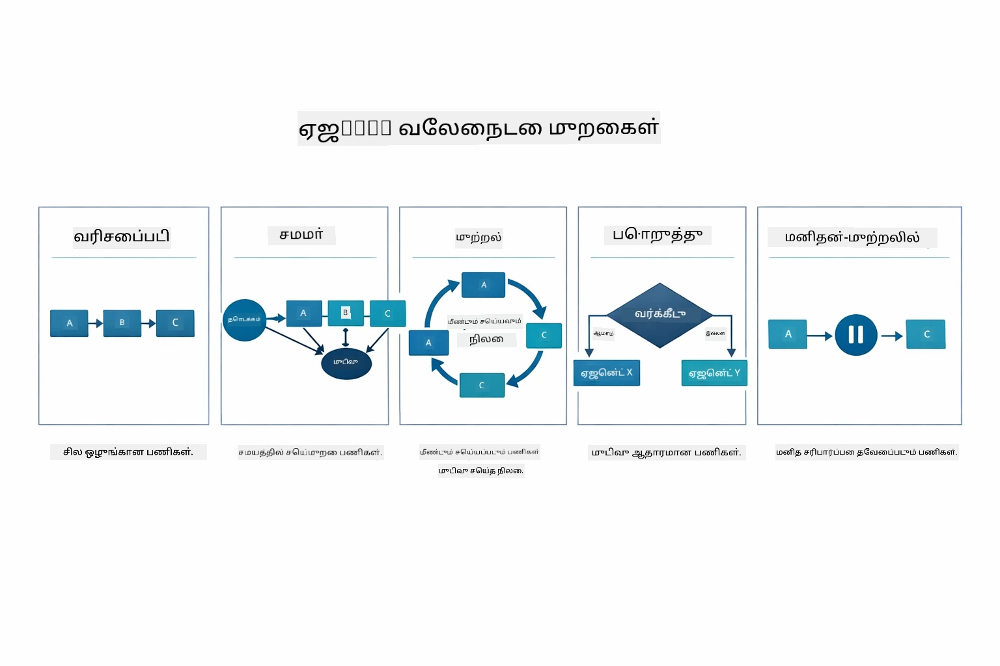

*ஐந்து வேலைபாட்டுக் காட்சிமுறைகள் முகவர்களை ஒருங்கிணைக்க — எளிய தொடர்ச்சி குழாய்கள் முதல் மனித-இன்று ஒப்புதல் வேலைப்பாடுகள் வரை.*

| காட்சி | விளக்கம் | பயன்பாடு |  
|---------|-------------|----------|  
| **Sequential** | முகவர்களை ஒழுங்குபடுத்து வேலைசெய்யுங்கள், வெளியீடு அடுத்துவரிசையിലേക്ക് ஓடுகிறது | குழாய்கள்: ஆராய்ச்சி → பகுப்பு → அறிக்கை |  
| **Parallel** | முகவர்களை ஒரே சமயத்தில் இயக்குங்கள் | சுயாதீன பணிகள்: காலநிலை + செய்தி + பங்குகள் |  
| **Loop** | நிபந்தனை நிறைவு செய்யும் வரை மீண்டும் செயல் | தர மதிப்பீடு: மதிப்பெண் ≥ 0.8 வரை சீரமை |  
| **Conditional** | நிபந்தனைகளுக்கு அமைய வழிமாற்று | வகைப்படுத்து → நிபுணர் முகவருக்கு வழி |  
| **Human-in-the-Loop** | மனித சரிபார்ப்புகள் சேர்க்கவும் | ஒப்புதல் வேலைப்பாடுகள், உள்ளடக்க மதிப்பாய்வு |

## முக்கிய கருத்துக்கள்

MCP மற்றும் முகவரியல் தொகுதியின் பயன்பாட்டை ஆராய்ந்த பிறகு, எப்போது எந்த அணுகுமுறையை பயன்படுத்த வேண்டும் என்று சுருக்கமாக பார்க்கலாம்.

MCP வும் அதன் வளர்ச்சியிலான சூழல் அமைப்பும் பெரும் வல்லுநர் ஆகும். கீழ்காணும் வரைபடம் ஒரே ஸாதாரண நெறிமுறை உங்கள் AI பயன்பாட்டை பல்வேறு MCP சர்வர்களுடன் — கோப்பு அமைப்பு, தரவுத்தளம், GitHub, மின்னஞ்சல், வலைவெட்டியலும் பல — இணைக்கிறது எப்படி என்பதை காட்டுகிறது:

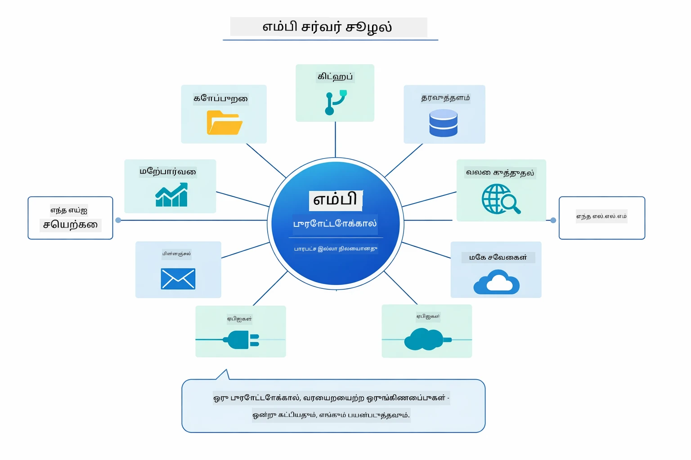

*MCP ஒரு பரந்து விரிந்த பரிமாற்ற நெறிமுறை சூழல் அமைப்பை உருவாக்குகிறது — எதொரு MCP-இன் பொருத்தமான சர்வரும் எதொரு MCP பொருத்தமான கிளையண்டுடனும் வேலை செய்கிறது, மற்றும் கருவிகள் பல பயன்பாடுகளுக்கு பகிர முடியும்.*

**MCP** ஏற்கனவே உள்ள கருவிக் சூழல்கள், பல பயன்பாடுகள் பகிரக்கூடிய கருவிகள், மூன்றாம் தரப்புத் சேவைகள் நிலையான நெறிமுறைகளுடன் இணைப்பது, அல்லது கருவி செயல்பாடுகளை குறியீடு மாற்றாமலே மாற்ற விரும்பும் போது சிறந்தது.

**Agentic Module** `@Agent` குறியீடுகளுடன் அறிவியல் முகவரி வரையறைகளை விரும்புகிறீர்கள், வேலைஒழுக்க ஒருங்கிணைப்பு (தொடர்ச்சி, சுற்றம், தொகுப்பு), கட்டளை முறை முகவர் வடிவமைப்பினை விரும்புகிறீர்கள், அல்லது பல முகவர்கள் பகிர்ந்தெடுக்கும் வெளியீடுகளை `outputKey` மூலம் இணைக்கிறீர்கள் என்றால் சிறந்தது.

**Supervisor Agent மாதிரி** முன்கூட்டியே வேலை ஒழுக்கம் கணிக்க முடியாதபோது, LLM தீர்மானிக்கும்போது, பல சிறப்பு முகவர்களை உருமாற்ற ஒருங்கிணைப்புக்கு பயன்படுத்தும் போது, பல திறன்களுக்குப் பல்வேறு சேனல்களை இயக்கும் பேச்சு அமைப்புகளை உருவாக்கும் போது அல்லது மிக நெகிழ்வான, தகுதிவாய்ந்த முகவர் நடத்தை வேண்டும் என்று நினைத்தால் மிகவும் பயனுள்ளது.

ஒவ்வொரு அணுகுமுறையும் எப்போது பயன்படுத்த வேண்டும் என்பதற்கான ஒப்புமை கீழே உள்ளது — தனிப்பயன் `@Tool` முறை MCP கருவிகள் எதிரிலான பிரதான தொடர்பும், முழு வகை பாதுகாப்பையும் உத்தரவாதம் செய்கிறது; MCP கருவிகள் நிலையான, மீண்டும் பயன்படுத்தக்கூடிய இணைப்புகளை வழங்குகின்றன:

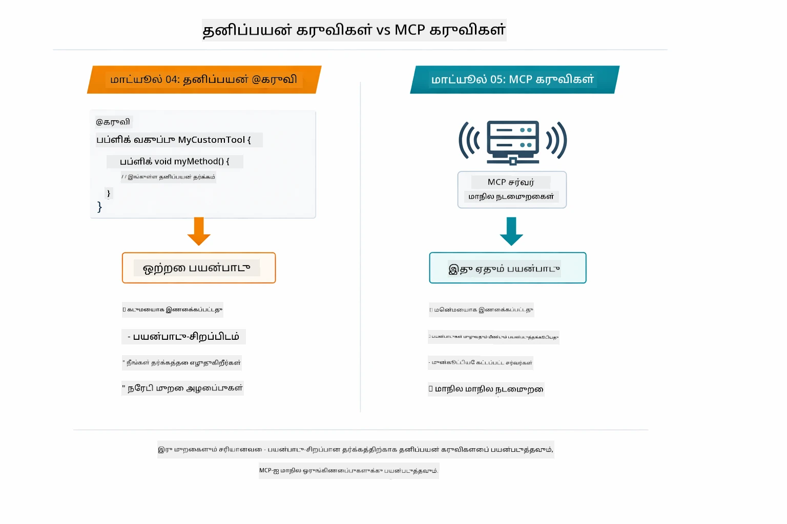

*தனிப்பயன் @Tool முறைகள் மற்றும் MCP கருவிகளினை எப்போது பயன்படுத்துவது — தனிப்பயன் கருவிகள் பயன்பாட்டுக்கேற்ற வலுவான இணைப்புக்கான முழு வகை பாதுகாப்புடன், MCP கருவிகள் பல பயன்பாடுகளில் வேலை செய்யும் நிலையானமயமான இணைப்புகளுக்கு.*

## வாழ்த்துக்கள்!

LangChain4j for Beginners படிப்பின் அனைத்து ஐந்து தொகுதிகளும் வெற்றிகரமாக முடிந்துவிட்டன! இங்கே நீங்கள் முடித்த முழு கற்கை பயணத்தின் பார்வை — அடிப்படைக் பேச்சு முதல் MCP இயக்கும் முகவரியல் அமைப்புகள் வரை:

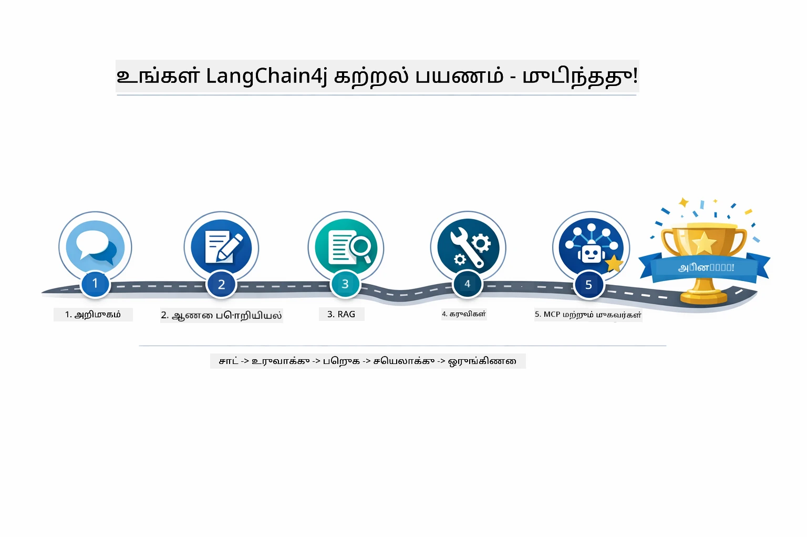

*அந்த ஐந்து தொகுதிகள் முழுவதும் உங்கள் கற்கை பயணம் — அடிப்படை பேச்சு முதல் MCP இயக்கும் முகவரியல் அமைப்புகள் வரை.*

நீங்கள் LangChain4j for Beginners படிப்பை முடித்துவிட்டீர்கள். நீங்கள் கற்றுக்கொண்டுள்ளீர்கள்:

- நினைவகத்துடன் உரையாடல் AI உருவாக்குவது (தொகுதி 01)  
- வேறுவேறு பணிகளுக்கு ஊக்கமளிக்கும் கூறும் வடிவமைப்புகள் (தொகுதி 02)  
- உங்கள் ஆவணங்களில் ஆதாரப்பட்ட பதில்கள் உருவாக்க RAG (தொகுதி 03)  
- தனிப்பயன் கருவிகளுடன் அடிப்படை AI முகவர்கள் உருவாக்குதல் (தொகுதி 04)  
- LangChain4j MCP மற்றும் முகவரியல் தொகுதிகளில் நிலையான கருவிகளை ஒருங்கிணைத்தல் (தொகுதி 05)

### அடுத்தது என்ன?

மோடியூல்கள் முடியவுடன், LangChain4j சோதனை கருத்துக்களைப் பார்ப்பதற்காக [Testing Guide](../docs/TESTING.md) ஐ ஆராயுங்கள்.

**அதிகாரப்பூர்வ வளங்கள்:**  
- [LangChain4j ஆவணம்](https://docs.langchain4j.dev/) - விரிவான வழிகாட்டிகள் மற்றும் API குறிப்பு  
- [LangChain4j GitHub](https://github.com/langchain4j/langchain4j) - மூலக் குறியீடு மற்றும் உதாரணங்கள்  
- [LangChain4j பயிற்சிகள்](https://docs.langchain4j.dev/tutorials/) - பல பயன்பாட்டு நோக்கங்களுக்கான படிநிலை படிநிலையான பயிற்சிகள்

இந்த படிப்பை முடித்ததற்கு நன்றி!

---

**பயணவழி:** [← முந்தையது: Module 04 - Tools](../04-tools/README.md) | [மீண்டும் முதன்மை](../README.md)

---

<!-- CO-OP TRANSLATOR DISCLAIMER START -->
**முகமை அறிவிப்பு**:  
இந்த ஆவணம் AI மொழி மொழிமாற்று சேவை [Co-op Translator](https://github.com/Azure/co-op-translator) மூலம் மொழிபெயர்க்கப்பட்டது. நாங்கள் துல்லியத்திற்காக முயலினாலும், தானாக மொழிபெயர்க்கப்பட்ட உரையில் பிழைகள் அல்லது தவறுதல்கள் இருக்கக்கூடும் என்பதை நினைவில் வையுங்கள். அசல் ஆவணம் அதன் சொந்த மொழியிலேயே அதிகாரப்பூர்வமான மூலமாக கருதப்பட வேண்டும். முக்கியமான தகவல்களுக்கு, தொழில்முறை மனித மொழிபெயர்ப்பு பரிந்துரைக்கப்படுகிறது. இந்த மொழிபெயர்ப்பைப் பயன்படுத்துவதால் ஏற்பட்ட எந்த புரிதல் தவறுகள் அல்லது தவறான விளக்கங்களுக்கும் நாங்கள் பொறுப்பானவர்களாக இல்லை.
<!-- CO-OP TRANSLATOR DISCLAIMER END -->