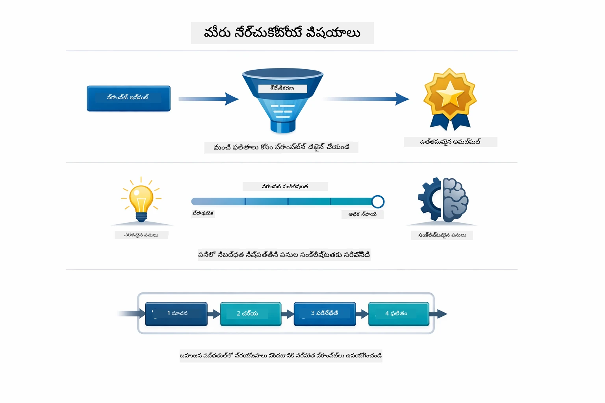
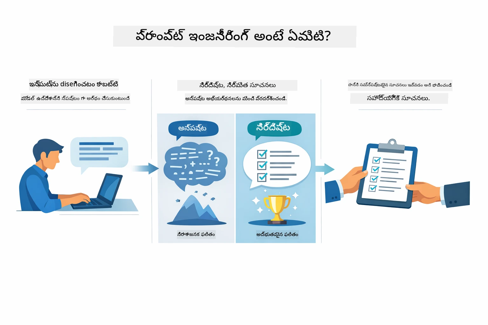
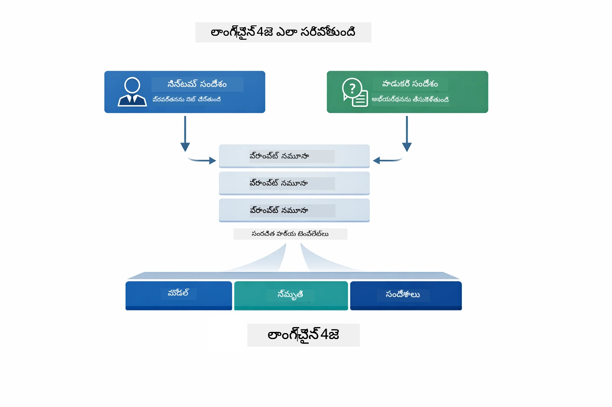
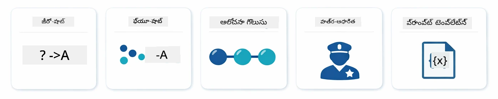
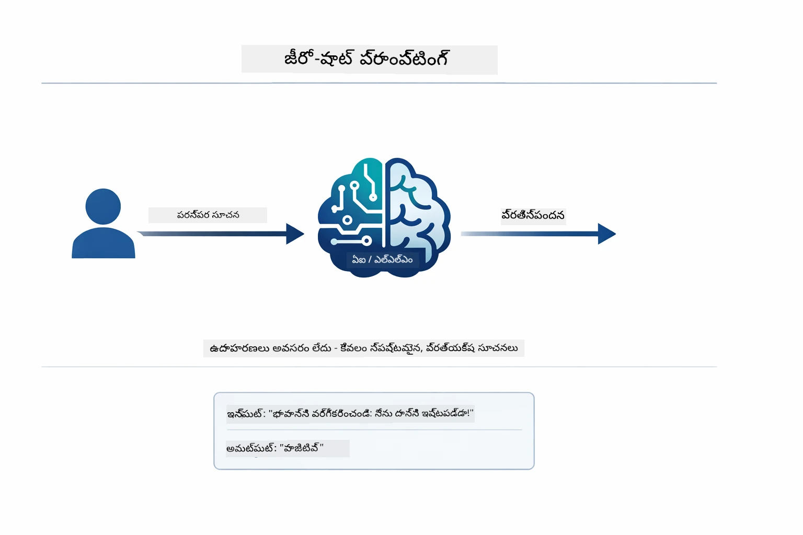
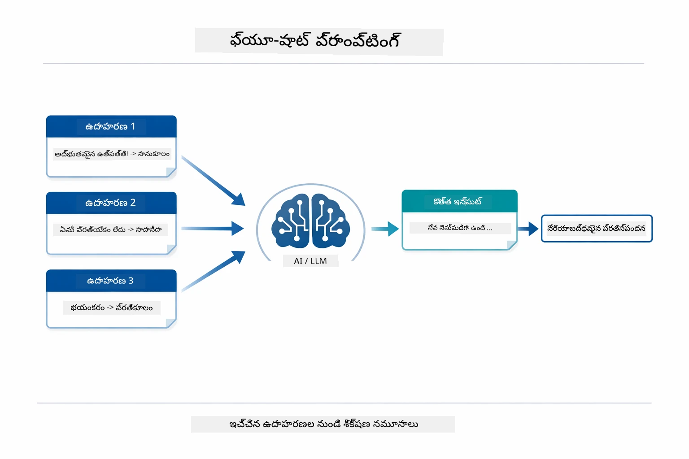
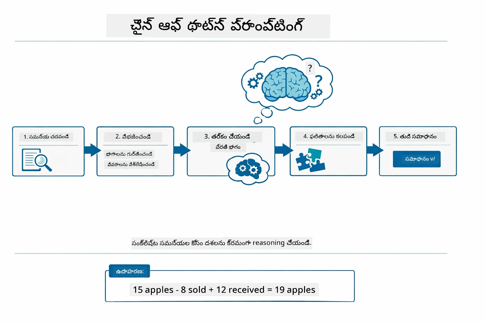
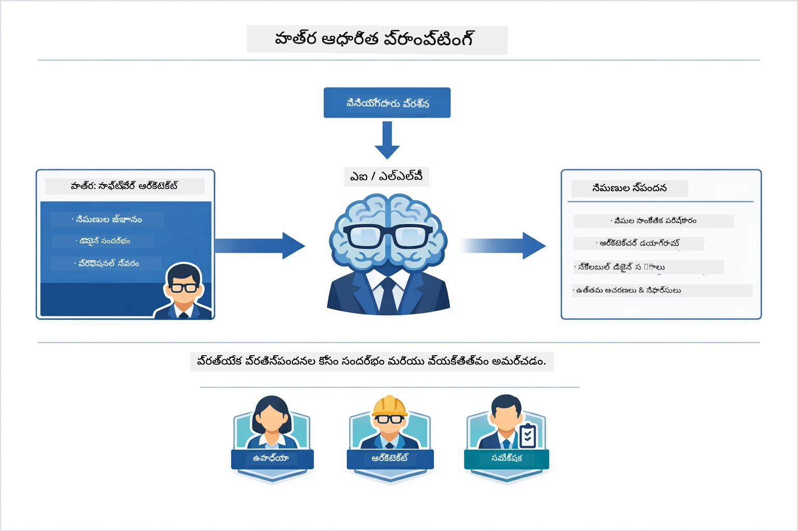
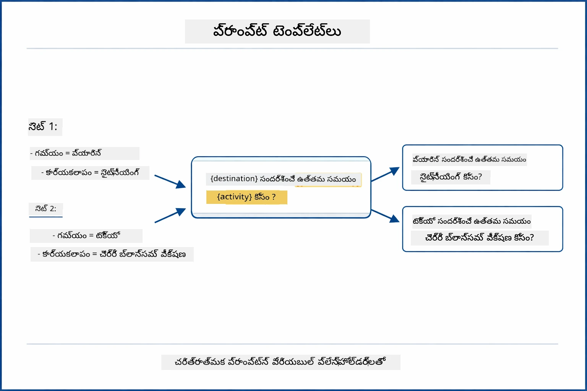
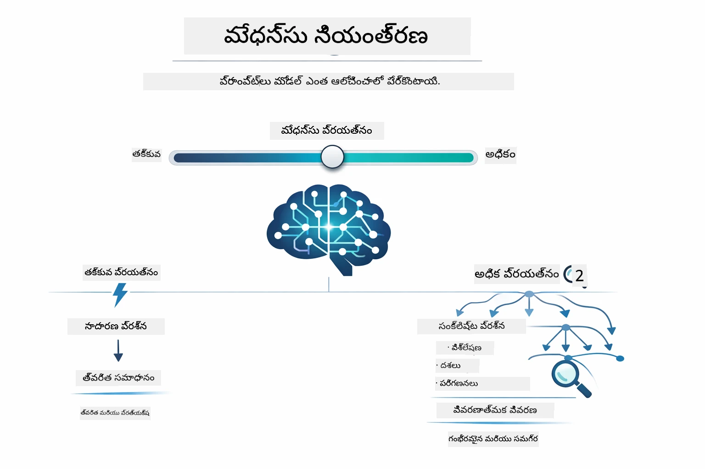

# Module 02: GPT-5.2తో ప్రాంప్ట్ ఇంజనీరింగ్

## సూచనలు పట్టిక

- [మీరు నేర్చుకునేది](../../../02-prompt-engineering)
- [ముందస్తు జ్ఞానం](../../../02-prompt-engineering)
- [ప్రాంప్ట్ ఇంజనీరింగ్ అర్థం చేసుకోవడం](../../../02-prompt-engineering)
- [ప్రాంప్ట్ ఇంజనీరింగ్ మౌలికాలు](../../../02-prompt-engineering)
  - [జీరో-షాట్ ప్రాంప్టింగ్](../../../02-prompt-engineering)
  - [ఫ్యూ-షాట్ ప్రాంప్టింగ్](../../../02-prompt-engineering)
  - [చెయిన్ ఆఫ్ థాట్](../../../02-prompt-engineering)
  - [రోల్-బేస్డ్ ప్రాంప్టింగ్](../../../02-prompt-engineering)
  - [ప్రాంప్ట్ టెంప్లేట్లు](../../../02-prompt-engineering)
- [అదనపు ప్యాటర్న్లు](../../../02-prompt-engineering)
- [ఉన్న ఆజూర్ వనరులను ఉపయోగించడం](../../../02-prompt-engineering)
- [ఆప్‌లికేషన్ స్క్రీన్ షాట్లు](../../../02-prompt-engineering)
- [ప్యాటర్న్లను అన్వేషించడం](../../../02-prompt-engineering)
  - [తక్కువ vs ఎక్కువ ఉత్సాహం](../../../02-prompt-engineering)
  - [టాస్క్ ఎగ్జిక్యూషన్ (టూల్ ప్రీంబుల్స్)](../../../02-prompt-engineering)
  - [స్వీయ-చింతన కోడ్](../../../02-prompt-engineering)
  - [నిర్మాణాత్మక విశ్లేషణ](../../../02-prompt-engineering)
  - [బహు-తరం సంభాషణ](../../../02-prompt-engineering)
  - [దశలవారీ తర్కం](../../../02-prompt-engineering)
  - [పరిమిత అవుట్‌పుట్](../../../02-prompt-engineering)
- [మీరు నిజంగా నేర్చుకునేది](../../../02-prompt-engineering)
- [తదుపరి దశలు](../../../02-prompt-engineering)

## మీరు నేర్చుకునేది



మునుపటి మాడ్యూల్‌లో, మీరు మెమరీ ఎలా సంభాషణాత్మక AIకి సహాయపడతుందో చూశారు మరియు GitHub మోడల్స్‌ను ప్రాథమిక పరస్పర చర్యల కోసం ఉపయోగించారు. ఇప్పుడు మేము Azure OpenAI యొక్క GPT-5.2 ఉపయోగించి మీరు ప్రశ్నలు ఎలా అడుగుతారో — అంటే ప్రాంప్ట్‌లు ఎలా ఉంటాయో పరిగణిస్తాము. మీరు ప్రాంప్ట్‌ల నిర్మాణం చేస్తే, మీరు పొందే స్పందనల నాణ్యత మీద బాగా ప్రభావం పడుతుంది. మేము ప్రాంప్ట్ ఇంజనీరింగ్ యొక్క మౌలిక సాంకేతికతల సమీక్షతో ప్రారంభించి, తర్వాత GPT-5.2 యొక్క తీసుకున్న  ఎనిమిది అధునాతన ప్యాటర్న్ల వైపు కదులుతాము.

మేము GPT-5.2 ను ఎందుకంటే ఇది తర్క నియంత్రణను పరిచయిస్తుంది - మీరు మోడల్‌కు సమాధానం ఇవ్వడానికి ముందే ఎంత ఆలోచించాలనేది చెప్పవచ్చు. ఇది వివిధ ప్రాంప్ట్ వ్యూహాలను స్పష్టంగా చేస్తుంది మరియు ఎప్పుడు ఏ విధానాన్ని ఉపయోగించాలో అర్థం చేసుకోవడంలో సహాయపడుతుంది. Azure యొక్క GPT-5.2 కి GitHub మోడల్స్ కంటే తక్కువ రేటు పరిమితులు వుంటాయి.

## ముందస్తు జ్ఞానం

- మాడ్యూల్ 01 పూర్తి అయింది (Azure OpenAI వనరులు అమర్చబడ్డాయి)
- రూట్ డైరెక్టరీలో Azure నేడు ఉన్న `.env` ఫైల్ (Module 01లో `azd up` ద్వారా సృష్టించబడింది)

> **గమనిక:** మీరు మాడ్యూల్ 01 పూర్తి చేయనిఅయితే, ముందు అక్కడ ఉన్న డిప్లాయ్‌మెంట్ సూచనలను అనుసరించండి.

## ప్రాంప్ట్ ఇంజనీరింగ్ అర్థం చేసుకోవడం



ప్రాంప్ట్ ఇంజనీరింగ్ అనేది మీరు తగిన ఫలితాలు పొందేలా క్రమం తప్పకుండా అందించే ఇన్పుట్ టెక్స్టును రూపకల్పన చేయడమే. ఇది కేవలం ప్రశ్నలు అడిగేదే కాదు - మోడల్ మీరు కోరుకునే దాని అర్థాన్ని మరియు ఎలా అందించాలో సమగ్రంగా అర్థం చేసుకునేలా అభ్యర్థనలు నిర్మించడం.

ఇది సహచరుడికి సూచనలు ఇవ్వడంలా ఆలోచించండి. "బగ్ ని సరి చేయండి" అనేది అస్పష్టంగా ఉంటుంది. "UserService.java ఫైల్ 45వ లైনে నల్ పాయింటర్ ఎక్సెప్షన్‌ను నల్ చెక్ చేర్చడం ద్వారా సరి చేయండి" అనేది స్పష్టంగా ఉంటుంది. భాషా మోడల్స్ కూడా అదే విధంగా పనిచేస్తాయి - స్పష్టత మరియు నిర్మాణం ముఖ్యం.



LangChain4j మౌలిక సౌకర్యాలను అందిస్తుంది — మోడల్ కనెక్షన్లు, మెమరీ, సందేశ రకాలతో, ప్రాంప్ట్ ప్యాటర్న్లు కేవలం ఆ మౌలిక సౌకర్యాల ద్వారా పంపే జాగ్రత్తగా రూపొందించిన టెక్స్ట్. ముఖ్యమైన నిర్మాణ భాగాలు `SystemMessage` (ఇది AI యొక్క ప్రవర్తన మరియు పాత్రను సెట్ చేస్తుంది) మరియు `UserMessage` (మీ అసలు అభ్యర్థనను తీసుకుంటుంది).

## ప్రాంప్ట్ ఇంజనీరింగ్ మౌలికాలు



ఈ మాడ్యూల్‌లోని అధునాతన ప్యాటర్న్లలోకి ప్రవేశించే ముందుగా, ఐదు ప్రాథమిక ప్రాంప్ట్ సాంకేతికతలను చూసుకుందాం. ఇవి ప్రతి ప్రాంప్ట్ ఇంజనీర్ తెలుసుకోగల మూలనిర్మాణ బ్లాక్స్. మీరు [క్విక్ స్టార్ట్ మాడ్యూల్](../00-quick-start/README.md#2-prompt-patterns) లో వున్న వాటిని ఇప్పటికే చూశుంటే — వీటి వెనుక ఉన్న భావనాత్మక ఫ్రేమ్‌వర్క్ ఇదే.

### జీరో-షాట్ ప్రాంప్టింగ్

సరళమైన పద్ధతి: ఉదాహరణలు లేకుండానే మోడల్‌కు నేరుగా సూచన ఇవ్వండి. మోడల్ పూర్తిగా తన శిక్షణ ఆధారంగా ఈ పని అర్థం చేసుకుని చేస్తుంది. ఈ పద్ధతి అర్థం సులభమైన అభ్యర్థనల కోసం బాగా పనిచేస్తుంది.



*ఉదాహరణలేని నేరుగా సూచన — మోడల్ సూచన నుండి పనిని అర్థం చేసుకుంటుంది*

```java
String prompt = "Classify this sentiment: 'I absolutely loved the movie!'";
String response = model.chat(prompt);
// ప్రతిస్పందన: "పాజిటివ్"
```

**ఎప్పుడు ఉపయోగించాలి:** సులభమైన వర్గీకరణలు, నేరుగా ప్రశ్నలు, అనువాదాలు, లేదా అదనపు మార్గనిర్దేశం లేకుండా మోడల్ చేయగల పని.

### ఫ్యూ-షాట్ ప్రాంప్టింగ్

మీరు ఆశిస్తున్న నమూనా మోడల్ అనుసరించటం ఎలా అనేదుకు ఉదాహరణలను అందించండి. మోడల్ మీ ఉదాహరణల నుండి ఇన్‌పుట్-అవుట్‌పుట్ ఫార్మాట్ నేర్చుకుని, కొత్త ఇన్‌పుట్‌లకు అన్వయిస్తుంది. ఇది కావలసిన ఫార్మాట్ లేదా ప్రవర్తన అర్థం కాని పనులకు సమర్థతను మెరుగుపరుస్తుంది.



*ఉదాహరణల నుండి నేర్చుకోవటం — మోడల్ నమూనాను గుర్తించి కొత్త ఇన్‌పుట్‌లపై అన్వయిస్తుంది*

```java
String prompt = """
    Classify the sentiment as positive, negative, or neutral.
    
    Examples:
    Text: "This product exceeded my expectations!" → Positive
    Text: "It's okay, nothing special." → Neutral
    Text: "Waste of money, very disappointed." → Negative
    
    Now classify this:
    Text: "Best purchase I've made all year!"
    """;
String response = model.chat(prompt);
```

**ఎప్పుడు ఉపయోగించాలి:** కస్టమ్ వర్గీకరణలు, నిరంతర ఫార్మాటింగ్, డోమైన్-స్పెసిఫిక్ పనులు, లేదా జీరో-షాట్ ఫలితాలు అసమానమైనప్పుడు.

### చెయిన్ ఆఫ్ థాట్

మోడల్ దశలవారీ తర్కాన్ని చూపించాలని అడుగు. సమాధానానికి తక్షణం దూకకుండా, మోడల్ సమస్యను విడగొట్టి కొద్ది కొద్ది భాగాలుగా స్పష్టంగా పని చేస్తుంది. ఇది గణితం, తర్కం, బహు-దశా తర్క పనులకు ఖచ్చితత్వాన్ని మెరుగుపరుస్తుంది.



*దశలవారీ తర్కం — క్లిష్టమైన సమస్యలను స్పష్టమైన తర్క దశలుగా విభజించడం*

```java
String prompt = """
    Problem: A store has 15 apples. They sell 8 apples and then 
    receive a shipment of 12 more apples. How many apples do they have now?
    
    Let's solve this step-by-step:
    """;
String response = model.chat(prompt);
// మోడల్ చూపిస్తుంది: 15 - 8 = 7, తదనంతరం 7 + 12 = 19 ఆపిళ్లు
```

**ఎప్పుడు ఉపయోగించాలి:** గణితం సమస్యలు, తర్క పజిల్స్, డీబగ్గింగ్, లేదా తర్క ప్రక్రియ చూపడం ఖచ్చితత్వం మరియు నమ్మకం పెంచే పనులలో.

### రోల్-బేస్డ్ ప్రాంప్టింగ్

మీ ప్రశ్న అడగడానికి ముందు AIకి పాత్ర లేదా వ్యక్తిత్వం ఇవ్వండి. ఇది స్పందన యొక్క స్వరం, లోతు మరియు దృష్టిని ఆకారం ఇస్తుంది. "సాఫ్ట్‌వేర్ ఆర్కిటెక్ట్" "జూనియర్ డెవలపర్" లేదా "సెక్యూరిటీ ఆడిటర్" కంటే వేరు సలహాలు ఇస్తాడు.



*సందర్భం మరియు పాత్రను సెట్ చేయడం — అదే ప్రశ్నను కేటాయించిన పాత్రపై ఆధారపడి వేరే ప్రతిస్పందన వస్తుంది*

```java
String prompt = """
    You are an experienced software architect reviewing code.
    Provide a brief code review for this function:
    
    def calculate_total(items):
        total = 0
        for item in items:
            total = total + item['price']
        return total
    """;
String response = model.chat(prompt);
```

**ఎప్పుడు ఉపయోగించాలి:** కోడ్ రివ్యూలు, పరీక్షలు, డోమైన్-స్పెసిఫిక్ విశ్లేషణ, లేదా నిర్దిష్ట నైపుణ్యత స్థాయికి సరిపోయే సమాధానాలు కావాలనుకున్నప్పుడు.

### ప్రాంప్ట్ టెम्प్లేట్లు

వేరియబుల్ ప్లేస్‌హోల్డర్లతో పునర్వినియోగించదగిన ప్రాంప్ట్స్ తయారుచేయండి. ప్రతి సారి కొత్త ప్రాంప్ట్ రాయడం బదులుగా, ఒక టెంప్లేట్ ఒకసారి నిర్వచించి, వేరే వేరే విలువలు నింపండి. LangChain4j యొక్క `PromptTemplate` క్లాస్ దీనిని `{{variable}}` సింటాక్స్ తో సులభం చేస్తుంది.



*వేరియబుల్ ప్లేస్‌హోల్డర్లతో పునర్వినియోగ ప్రాంప్ట్‌లు — ఒక టెంప్లేట్, ఎన్నో ఉపయోగాలు*

```java
PromptTemplate template = PromptTemplate.from(
    "What's the best time to visit {{destination}} for {{activity}}?"
);

Prompt prompt = template.apply(Map.of(
    "destination", "Paris",
    "activity", "sightseeing"
));

String response = model.chat(prompt.text());
```

**ఎప్పుడు ఉపయోగించాలి:** వేరే వేరే ఇన్‌పుట్‌లు ఉన్న పునరావృత ప్రశ్నల కోసం, బ్యాచ్ ప్రాసెస్ చేయుట, పునర్వినియోగ AI వర్క్‌ఫ్లోలు నిర్మించుట, లేదా ప్రాంప్ట్ నిర్మాణం ఒకటే కానీ డేటా మారుతుంది అనిపించే సందర్భాలు.

---

ఈ ఐదు మౌలికాలు మీకు చాలా ప్రాంప్టింగ్ పనులకి బలమైన సాధనాన్ని ఇస్తాయి. ఈ మాడ్యూల్ లో మిగతా భాగం GPT-5.2 యొక్క తర్క నియంత్రణ, స్వీయ-మూల్యాంకనం, మరియు నిర్మాణాత్మక అవుట్‌పుట్ సామర్ధ్యాలను ఉపయోగించే **ఎనిమిది అధునాతన ప్యాటర్న్లతో** అభివృద్ధి చేస్తుంది.

## అదనపు ప్యాటర్న్లు

మౌలికాలు కవర్ చేసిన తర్వాత, ఈ మాడ్యూల్‌ను ప్రత్యేకమైనవి చేసే ఎనిమిది అధునాతన ప్యాటర్న్ల వైపు వెళ్దాము. అన్ని సమస్యలకు ఒకే విధానము అవసరం కాదు. కొంత ప్రశ్నలు త్వరిత సమాధానాలు కావాలి, మరికొన్నింటికి లోతైన ఆలోచన అవసరం. కొంత తర్కం కనిపించవలసి ఉంటుంది, మరికొన్నింటికి ఫలితాలు అవసరం. கீழువున్న ప్రతి ప్యాటర్న్ వేర్వేరు పరిస్థితికి అనుగుణంగా రూపొందించబడింది — మరియు GPT-5.2 యొక్క తర్క నియంత్రణ ఈ తేడాలు మరింత స్పష్టంగా చేస్తుంది.


*ఎనిమిది ప్రాంప్ట్ ఇంజనీరింగ్ ప్యాటర్న్ల అవలోకనం మరియు వాటి ఉపయోగం*



*GPT-5.2 తర్క నియంత్రణ మోడల్ ఎంత ఆలోచించాలో—from వేగవంతమైన నేరుగా సమాధానాలు నుండి లోతైన అన్వేషణ వరకు*

**తక్కువ ఉత్సాహం (త్వరిత & కేంద్రీకృతం)** - సరళమైన ప్రశ్నలకు వేగంగా, నేరుగా సమాధానాలు కావాలి. మోడల్ తక్కువగా తర్కాన్ని ఉపయోగిస్తుంది - గరిష్టం 2 దశలు. లెక్కణలు, లుక్‌అప్పులు, లేదా సరళమైన ప్రశ్నలకు ఉపయోగించండి.

```java
String prompt = """
    <context_gathering>
    - Search depth: very low
    - Bias strongly towards providing a correct answer as quickly as possible
    - Usually, this means an absolute maximum of 2 reasoning steps
    - If you think you need more time, state what you know and what's uncertain
    </context_gathering>
    
    Problem: What is 15% of 200?
    
    Provide your answer:
    """;

String response = chatModel.chat(prompt);
```

> 💡 **GitHub Copilot తో అన్వేషించండి:** [`Gpt5PromptService.java`](../../../02-prompt-engineering/src/main/java/com/example/langchain4j/prompts/service/Gpt5PromptService.java) తెరుచుకుని అడగండి:
> - "తక్కువ ఉత్సాహం మరియు ఎక్కువ ఉత్సాహం ప్రాంప్టింగ్ ప్యాటర్న్ల మధ్య తేడా ఏమిటి?"
> - "ప్రాంప్ట్‌లలో XML ట్యాగ్లు AI స్పందనను ఎలా నిర్మిస్తాయి?"
> - "నేను ఎప్పుడు స్వీయ-చింతన ప్యాటర్న్లను, ఎప్పుడు నేరుగా సూచనలను ఉపయోగించాలి?"

**ఎక్కువ ఉత్సాహం (లోతైన & సమగ్ర)** - సంక్లిష్ట సమస్యలకు సమగ్ర విశ్లేషణ కావాలి. మోడల్ పూర్తిగా అన్వేషించి, విపులంగా తర్కం చూపిస్తుంది. సిస్టమ్ డిజైన్, ఆర్కిటెక్చర్ నిర్ణయాలు, లేదా క్లిష్ట పరిశోధనలకు ఉపయోగించండి.

```java
String prompt = """
    Analyze this problem thoroughly and provide a comprehensive solution.
    Consider multiple approaches, trade-offs, and important details.
    Show your analysis and reasoning in your response.
    
    Problem: Design a caching strategy for a high-traffic REST API.
    """;

String response = chatModel.chat(prompt);
```

**టాస్క్ ఎగ్జిక్యూషన్ (దశలవారీ ప్రగతి)** - బహు-దశా వర్క్‌ఫ్లోలకు. మోడల్ ముందుగా ప్రణాళికను ఇస్తుంది, పని చేస్తూ ప్రతి దశను వివరిస్తుంది, ఆపై సరాంశం ఇస్తుంది. మైగ్రేషన్‌లు, అమలు, లేదా ఏదైనా బహు-దశా ప్రక్రియకు ఉపయోగించండి.

```java
String prompt = """
    <task_execution>
    1. First, briefly restate the user's goal in a friendly way
    
    2. Create a step-by-step plan:
       - List all steps needed
       - Identify potential challenges
       - Outline success criteria
    
    3. Execute each step:
       - Narrate what you're doing
       - Show progress clearly
       - Handle any issues that arise
    
    4. Summarize:
       - What was completed
       - Any important notes
       - Next steps if applicable
    </task_execution>
    
    <tool_preambles>
    - Always begin by rephrasing the user's goal clearly
    - Outline your plan before executing
    - Narrate each step as you go
    - Finish with a distinct summary
    </tool_preambles>
    
    Task: Create a REST endpoint for user registration
    
    Begin execution:
    """;

String response = chatModel.chat(prompt);
```

చెయిన్ ఆఫ్ థాట్ ప్రాంప్టింగ్ స్పష్టంగా తర్క ప్రక్రియను చూపమని మోడల్‌ని అడుగుతుంది, క్లిష్టమైన పనుల కోసం ఖచ్చితత్వాన్ని మెరుగుపరుస్తుంది. దశలవారీ విభజన మానవులు మరియు AI ఇద్దరికి తర్కాన్ని అర్థం చేసుకోవడంలో సహాయపడుతుంది.

> **🤖 [GitHub Copilot](https://github.com/features/copilot) చాట్‌తో ప్రయత్నించండి:** ఈ ప్యాటర్న్ గురించి అడగండి:
> - "నెల్లుగా నడిచే ఆపరేషన్ల కోసం టాస్క్ ఎగ్జిక్యూషన్ ప్యాటర్న్‌ను ఎలా అనుసరించాలి?"
> - "ఉత్పత్తి అప్లికేషన్లలో టూల్ ప్రీంబుల్స్ నిర్మాణం కోసం ఉత్తమ ప్రాక్టీసులు ఏమిటి?"
> - "UIలో మధ్యవరుగు ప్రగతి నవీకరణలను ఎలా స్వీకరించి ప్రదర్శించవచ్చు?"


*ప్రణాళిక → అమలు → సారాంశం బహు-దశా పనుల కోసం వర్క్‌ఫ్లో*

**స్వీయ-చింతన కోడ్** - ఉత్పత్తి ప్రమాణానికి అనుగుణంగా కోడ్ ఉత్పత్తి చేయడానికి. మోడల్ ఉత్పత్తి ప్రమాణాలను పాటిస్తూ సరైన ఎర్రర్ హ్యాండ్లింగ్‌తో కోడ్ ఉత్పత్తి చేస్తుంది. కొత్త ఫీచర్లు లేదా సర్వీసులు నిర్మించేటప్పుడు ఉపయోగించండి.

```java
String prompt = """
    Generate Java code with production-quality standards: Create an email validation service
    Keep it simple and include basic error handling.
    """;

String response = chatModel.chat(prompt);
```


*పునరావృత మెరుగుదల లూప్ - ఉత్పత్తి చేయడం, మూల్యాంకనం, సమస్యలను గుర్తించడం, మెరుగుపరచడం, మళ్ళీ繰返ించుట*

**నిర్మాణాత్మక విశ్లేషణ** - నిరంతర మూల్యాంకనానికి. మోడల్ కోడ్‌ను ఒక నిర్ణీత ఫ్రేమ్‌వర్క్ (ఖచ్చితత్వం, సాధనాలు, పనితీరు, భద్రత, నిర్వహణ) తో సమీక్షిస్తుంది. కోడ్ రివ్యూలు లేదా నాణ్యత మూల్యాంకనానికి ఉపయోగించండి.

```java
String prompt = """
    <analysis_framework>
    You are an expert code reviewer. Analyze the code for:
    
    1. Correctness
       - Does it work as intended?
       - Are there logical errors?
    
    2. Best Practices
       - Follows language conventions?
       - Appropriate design patterns?
    
    3. Performance
       - Any inefficiencies?
       - Scalability concerns?
    
    4. Security
       - Potential vulnerabilities?
       - Input validation?
    
    5. Maintainability
       - Code clarity?
       - Documentation?
    
    <output_format>
    Provide your analysis in this structure:
    - Summary: One-sentence overall assessment
    - Strengths: 2-3 positive points
    - Issues: List any problems found with severity (High/Medium/Low)
    - Recommendations: Specific improvements
    </output_format>
    </analysis_framework>
    
    Code to analyze:
    ```
    public List getUsers() {
        return database.query("SELECT * FROM users");
    }
    ```
    Provide your structured analysis:
    """;

String response = chatModel.chat(prompt);
```

> **🤖 [GitHub Copilot](https://github.com/features/copilot) చాట్‌తో ప్రయత్నించండి:** నిర్మాణాత్మక విశ్లేషణ గురించి అడగండి:
> - "వివిధ రకాల కోడ్ రివ్యూస్‌కు విశ్లేషణ ఫ్రేమ్‌వర్క్‌ను ఎలా అనుకూలీకరించవచ్చు?"
> - "నిర్మాణాత్మక అవుట్‌పుట్‌ను ప్రోగ్రామేటిక్గా పార్స్ చేసి ఎలా చర్య తీసుకోవాలి?"
> - "వివిధ రివ్యూ సెషన్లలో స్థిరమైన తీవ్రత స్థాయిలను ఎలా నిర్ధారించగలను?"


*స్థిరమైన కోడ్ రివ్యూసు కోసం తీవ్రత స్థాయిలతో ఫ్రేమ్‌వర్క్*

**బహు-తరం సంభాషణ** - సందర్భాన్ని అవసరం చేసే సంభాషణలకు. మోడల్ మునుపటి సందేశాలను గుర్తుంచుకుంటుంది మరియు వాటిపై ఆధారపడి అభివృద్ధి చేస్తుంది. ఇంటరాక్టివ్ సాయం సెషన్లు లేదా క్లిష్ట Q&A కి ఉపయోగించండి.

```java
ChatMemory memory = MessageWindowChatMemory.withMaxMessages(10);

memory.add(UserMessage.from("What is Spring Boot?"));
AiMessage aiMessage1 = chatModel.chat(memory.messages()).aiMessage();
memory.add(aiMessage1);

memory.add(UserMessage.from("Show me an example"));
AiMessage aiMessage2 = chatModel.chat(memory.messages()).aiMessage();
memory.add(aiMessage2);
```


*చర్చా సందర్భం పలుసార్లు తిరిగి ఎక్కువ వర్తిస్తుంటుంది టోకెన్ పరిమితికి చేరేవరకు*

**దశలవారీ తర్కం** - కనిపించే తర్కం అవసరం గల సమస్యలకు. మోడల్ ప్రతి దశకు స్పష్టమైన తర్కాన్ని చూపిస్తుంది. గణితం సమస్యలు, తర్క పజిల్స్, లేదా ఆలోచన ప్రక్రియ అర్థం చేసుకోవాలనుకుంటే ఉపయోగించండి.

```java
String prompt = """
    <instruction>Show your reasoning step-by-step</instruction>
    
    If a train travels 120 km in 2 hours, then stops for 30 minutes,
    then travels another 90 km in 1.5 hours, what is the average speed
    for the entire journey including the stop?
    """;

String response = chatModel.chat(prompt);
```


*సమస్యలను స్పష్టమైన తర్క దశలుగా విభజించడం*

**పరిమిత అవుట్‌పుట్** - నిర్దిష్ట ఫార్మాట్ అవసరాలు ఉన్న సమాధానాలకు. మోడల్ కఠినమైన ఫార్మాట్ మరియు పొడవు నియమాలను పాటిస్తుంది. సారాంశాలు లేదా ఖచ్చితమైన అవుట్‌పుట్ నిర్మాణం కావాలనుకున్నప్పుడు ఉపయోగించండి.

```java
String prompt = """
    <constraints>
    - Exactly 100 words
    - Bullet point format
    - Technical terms only
    </constraints>
    
    Summarize the key concepts of machine learning.
    """;

String response = chatModel.chat(prompt);
```


*ఖచ్చితమైన ఫార్మాట్, పొడవు, మరియు నిర్మాణ నియమాలను అమలుపరచడం*

## ఉన్న ఆజూర్ వనరులను ఉపయోగించడం

**డిప్లాయ్‌మెంట్‌ని ధృవీకరించండి:**

Root డైరక్టరీలో Azure సూత్రాలతో `.env` ఫైల్ ఉన్నదో చూసుకోండి (Module 01లో సృష్టించబడింది):
```bash
cat ../.env  # AZURE_OPENAI_ENDPOINT, API_KEY, DEPLOYMENT చూపించాలి
```

**ఆప్‌ను ప్రారంభించండి:**

> **గమనిక:** మీరు మాడ్యూల్ 01 నుండి `./start-all.sh` ఉపయోగించి ఇప్పటికే అన్ని ఆప్‌లను ప్రారంభించి ఉంటే, ఈ మాడ్యూల్ ఇప్పటికే 8083 పోర్ట్‌లో పరుగుపొందుతుంది. దిగువ ప్రారంభ కమాండ్‌లు తప్పక పోవచ్చు మరియు మీరు నేరుగా http://localhost:8083 కు వెళ్లవచ్చు.

**ఎంపిక 1: స్ప్రింగ్ బూట్ డాష్‌బోర్డ్ ఉపయోగించడం (VS కోడ్ వినియోగదారులకు సిఫార్సు చేసినది)**

డెవ్ కంటైనర్‌లో స్ప్రింగ్ బూట్ డాష్‌బోర్డ్ ఎక్స్‌టెన్షన్ ఉంది, ఇది అన్ని స్ప్రింగ్ బూట్ అప్లికేషన్‌లను అంతర్దృష్టితో నిర్వహించడానికి ఒక దృశ్య ఇంటర్‌ఫేస్ అందిస్తుంది. మీరు దీన్ని VS కోడ్ Activity Bar ఎడమపక్కన (స్ప్రింగ్ బూట్ చిహ్నం కోసం చూడండి) చూడవచ్చు.

స్ప్రింగ్ బూట్ డాష్‌బోర్డ్ నుండి మీరు:
- వర్క్‌స్పేస్‌లో లభ్యమయ్యే అన్ని స్ప్రింగ్ బూట్ అప్లికేషన్లను చూడవచ్చు
- ఒక క్లిక్‌తో అప్లికేషన్లను ప్రారంభించు/ఆపు చేయవచ్చు
- అప్లికేషన్ లాగ్‌లను తక్షణం చూడవచ్చు
- అప్లికేషన్ స్థితిని పర్యవేక్షించవచ్చు
సింప్లీ "prompt-engineering" పక్కన ఉన్న ప్లే బటన్ పై క్లిక్ చేసి ఈ మాడ్యూల్ ను ప్రారంభించండి, లేదా ఒక్కసారి అన్ని మాడ్యూల్స్ ను ప్రారంభించండి.


**ఎంపిక 2: షెల్ స్క్రిప్ట్‌లను ఉపయోగించడం**

అన్ని వెబ్ అప్లికేషన్స్ (మాడ్యూల్స్ 01-04) ప్రారంభించండి:

**బ్యాష్:**
```bash
cd ..  # రూట్ డైరెక్టరీ నుండి
./start-all.sh
```

**పవర్‌షెల్:**
```powershell
cd ..  # మూల డైరెక్టరీ నుండి
.\start-all.ps1
```

లేదా ఈ మాడ్యూల్ ను మాత్రమే ప్రారంభించండి:

**బ్యాష్:**
```bash
cd 02-prompt-engineering
./start.sh
```

**పవర్‌షెల్:**
```powershell
cd 02-prompt-engineering
.\start.ps1
```

రూట్ `.env` ఫైల్ నుండి వాతావరణ చారాలు ఆటోమేటిక్ గా లోడ్ అవుతాయి మరియు JAR లు లేవంటే అవి బిల్డ్ అవుతాయి.

> **గమనిక:** మీరు ప్రారంభించే ముందు అన్ని మాడ్యూల్స్ మాన్యువల్‌గా బిల్డ్ చేయాలని ఇష్టపడితే:
>
> **బ్యాష్:**
> ```bash
> cd ..  # Go to root directory
> mvn clean package -DskipTests
> ```
>
> **పవర్‌షెల్:**
> ```powershell
> cd ..  # Go to root directory
> mvn clean package -DskipTests
> ```

మీ బ్రౌజర్‌లో http://localhost:8083 ను తెరవండి.

**ఆపేందుకు:**

**బ్యాష్:**
```bash
./stop.sh  # ఈ మాడ్యూల్ మాత్రమే
# లేదా
cd .. && ./stop-all.sh  # అన్ని మాడ్యూల్స్
```

**పవర్‌షెల్:**
```powershell
.\stop.ps1  # ఈ మాడ్యూల్ మాత్రమే
# లేదా
cd ..; .\stop-all.ps1  # అన్ని మాడ్యూల్స్
```

## అప్లికేషన్ స్క్రీన్‌షాట్లు


*ముఖ్య డ్యాష్‌బోర్డు 8 ప్రాంప్ట్ ఇంజనీयरింగ్ నమూనాలను వారి లక్షణాలు మరియు ఉపయోగాలను చూపిస్తుంది*

## నమూనాలు అన్వేషణ

వెబ్ ఇంటర్‌ఫేస్ మీరు విభిన్న ప్రాంప్టింగ్ వ్యూహాలతో ప్రయోగాలు చేయడానికి అనుమతిస్తుంది. ప్రతి నమూనా వేర్వేరు సమస్యలను పరిష్కరిస్తుంది - ప్రతి విధానాన్ని ఎప్పుడైతే మెరుగ్గా పనిచేస్తుందో చూడండి.

### తక్కువ మరియు ఎక్కువ ఉత్సాహం

"200 లో 15% ఎంత?" అనే సిలువ ప్రశ్నను తక్కువ ఉత్సాహంతో అడగండి. మీరు తక్షణం, నేరుగా సమాధానం పొందుతారు. ఇప్పుడు "హై ట్రాఫిక్ API కోసం క్యాషింగ్ వ్యూహాన్ని రూపకల్పన చేయండి" అనే క్లిష్టమైన ప్రశ్నను ఎక్కువ ఉత్సాహంతో అడగండి. మోడల్ ఎలా ఆలస్యం చేస్తుందో మరియు విపులమైన న్యాయసమ్మత వ్యాఖ్యానం ఇస్తుందో చూడండి. అదే మోడల్, అదే ప్రశ్న నిర్మాణం - కాని ప్రాంప్ట్ ఎంత గా ఆలోచించాలో తెలియజేస్తుంది.


*కనిష్ట ఆలోచనతో వేగవంతమైన గణన*


*విస్తృత క్యాషింగ్ వ్యూహం (2.8MB)*

### పనిని అమలు (టూల్ ప్రీంబుల్స్)

బహుళ-దశ వర్క్‌ఫ్లోలు ముందస్తు ప్లానింగ్ మరియు పురోగతి వివరణతో లాభాలు కలిగి ఉంటాయి. మోడల్ అతి ప్రారంభంలో ఏమి చేయబోతుందో వివరించి, ప్రతి దశను వివరిస్తుంది, ఆపై ఫలితాలను సారాంశం చేస్తుంది.


*దశలవారీ వివరణతో REST ఎండ్‌పాయింట్ సృష్టించడం (3.9MB)*

### స్వయం-పరిశీలన కోడ్

"ఒక ఇమెయిల్ ధృవీకరణ సర్వీస్‌ను సృష్టించండి" అని ప్రయత్నించండి. సంకేతాన్ని మాత్రమే సృష్టించి ఆగకుండా, మోడల్ ను కోడ్‌ను సృష్టించి, నాణ్యత ప్రమాణాలతో విలయించుకుంటుంది, లోపాలను గుర్తించి మెరుగుపరుస్తుంది. మీరు మోడల్ పునరావృతమై తయారు చేసే ప్రక్రియను చూడగలుగుతారు, కోడ్ ఉత్పత్తి ప్రమాణాలను తగినంత వరకూ ప్రతిసారి మెరుగుపరుస్తుంది.


*సంపూర్ణ ఇమెయిల్ ధృవీకరణ సేవ (5.2MB)*

### నిర్మాణాత్మక విశ్లేషణ

కోడ్ సమీక్షలు నిరంతర ఆమోద చర్యలను అవసరం చేస్తాయి. మోడల్ నిస్థిర కేటగిరీల (సరైనదై ఉండటం, అభ్యాసాలు, పనితీరు, భద్రత) ఆధారంగా లక్షణా స్థాయిలతో కోడ్‌ను విశ్లేషిస్తుంది.


*ఫ్రేమ్‌వర్క్ ఆధారిత కోడ్ సమీక్ష*

### బహుళ-తురుట్ సంభాషణ

"Spring Boot అంటే ఏమిటి?" అని అడగండి, ఆ తర్వాత వెంటనే "నాకు ఒక ఉదాహరణ చూపించు" అని అనుసరించండి. మోడల్ మీ మొదటి ప్రశ్నను గుర్తుంచుకొని ప్రత్యేకంగా Spring Boot ఉదాహరణ ఇస్తుంది. మెమరీ లేకపోతే, ఆ రెండవ ప్రశ్న చాలా అస్పష్టమైనది అవుతుంది.


*ప్రశ్నల మధ్య సందర్భ రక్షణ*

### దశలవారీ కారణతన్

ఒక గణిత సమస్య ఎంచుకుని దాన్ని దశలవారీ కారణతన్ మరియు తక్కువ ఉత్సాహంతో ప్రయత్నించండి. తక్కువ ఉత్సాహం మీరు సమాధానం పొందే వేగం ఎక్కువ కాని స్పష్టత తక్కువగా ఉంటుంది. దశలవారీ కారణతనంతో మీరు ప్రతి గణన మరియు నిర్ణయాన్ని చూడగలుగుతారు.


*స్పష్టమైన దశలతో గణిత సమస్య*

### పరిమిత అవుట్‌పుట్

మీకు నిర్దిష్ట ఫార్మాట్లు లేదా పదాల లెక్క అవసరమైతే, ఈ నమూనా కఠినంగా దీని పాటించటాన్ని నిర్దేశిస్తుంది. 100 పదాల కూడిన సారాంశాన్ని బుల్లెట్ పాయింట్ ఫార్మాట్లో రూపొందించి చూడండి.


*ఫార్మాట్ నియంత్రణతో మిషన్ లెర్నింగ్ సారాంశం*

## మీరు నిజంగా నేర్చుకుంటున్నది

**కారణాత్మక ప్రయత్నం ప్రతిదీ మార్చిస్తుంది**

GPT-5.2 మీ ప్రాంప్ట్‌ల ద్వారా గణనాత్మక ప్రయత్నాన్ని నియంత్రించడానికి అనుమతిస్తుంది. తక్కువ ప్రయత్నం అంటే త్వరిత స్పందనలు, కనిష్ట అన్వేషణతో. ఎక్కువ ప్రయత్నం అంటే మోడల్ గేహంగా ఆలోచించి సమగ్రంగా స్పందిస్తుంది. మీరు పనిదిటీలో ప్రయత్నాన్ని సరిపోనివ్వడాన్ని నేర్చుకుంటున్నారు - సులభమైన ప్రశ్నలపై సమయం వృథా చేయకండి, కానీ క్లిష్ట నిర్ణయాలపై తొమ్మిది అలసత్వం వద్దు.

**నిర్మాణం ప్రవర్తనను మార్గనిర్దేశిస్తుంది**

ప్రాంప్ట్‌లలో ఉన్న XML ట్యాగ్స్ గమనించారా? అవి అలంకరణ కావు. మోడల్స్ నిర్మాణాత్మక సూచనలను స్వతంత్ర వచనం కంటే విశ్వసనీయంగా అనుసరిస్తాయి. బహుళ-దశ ప్రక్రియలు లేదా క్లిష్ట తర్కాలు అవసరమైతే, నిర్మాణం మోడల్ ఎక్కడ ఉందో మరియు తర్వాత ఏమి చేయాలో తెలుసుకోవడానికి సహాయపడుతుంది.


*స్పష్ట విభాగాలు మరియు XML-శైలి వ్య‌వస్థ‌తో బాగా నిర్మితమైన ప్రాంప్ట్ యొక్క నిర్మాణం*

**నాణ్యత స్వయం-మూల్యాంకనం ద్వారా వస్తుంది**

స్వయం-పరిశీలన నమూనాలు నాణ్యత ప్రమాణాలను స్పష్టంగా నిర్దేశిస్తూ పనిచేస్తాయి. మోడల్ "సరైన విధంగా చేస్తుంది" అని నమ్మకంతో కాకుండా, మీరు దాని యొక్క "సరైన" అంటే ఏమిటో ఖచ్చితంగా చెప్పగలుగుతారు: సరైన తర్కం, లోపాలు నిర్వహణ, పనితీరు, భద్రత. మోడల్ తన స్వంత అవుట్‌పుట్‌ను మూల్యాంకనం చేసి మెరుగుపరచగలదు. ఇది కోడ్ జనరేషన్‌ను లాటరీ నుండి ఒక నిర్దిష్ట ప్రక్రియగా మార్చుతుంది.

**సందర్భం పరిమితి కలిగి ఉంటుంది**

బహుళ-తురుట్ సంభాషణలు ప్రతి అభ్యర్థనలో సందేశ చరిత్రను పొందుపరచడం ద్వారా పనిచేస్తాయి. కానీ పరిమితి ఉంది – ప్రతి మోడల్ గరిష్ట టోకెన్ కౌంట్ కలిగి ఉంటుంది. సంభాషణ పెరిగేకొద్దీ సంబంధిత సారాంశాన్ని కలవచ్చు కానీ అతి పెరగకుండా ఉండేందుకు వ్యూహాలు అవసరం. ఈ మాడ్యూల్ మీకు మెమరీ ఎలా పనిచేస్తుందో చూపిస్తుంది; తరువాత మీరు ఎప్పుడు సారాంశం చేయాలో, ఎప్పుడు మరవాలో, ఎప్పుడు తిరిగి పొందాలో నేర్చుకుంటారు.

## తరువాతి దశలు

**తరువాత మాడ్యూల్:** [03-rag - RAG (Retrieval-Augmented Generation)](../03-rag/README.md)

---

**నావిగేషన్:** [← మునుపటి: మాడ్యూల్ 01 - పరిచయం](../01-introduction/README.md) | [ముఖ్యముక్కకి తిరిగి](../README.md) | [తరువాత: మాడ్యూల్ 03 - RAG →](../03-rag/README.md)

---

<!-- CO-OP TRANSLATOR DISCLAIMER START -->
**డిస్క్లెయిమర్**:  
ఈ పత్రాన్ని AI అనువాద సేవ [Co-op Translator](https://github.com/Azure/co-op-translator) ద్వారా అనువదించారు. మేము ఖచ్చితత్వానికి ప్రయత్నిస్తూనే ఉన్నప్పటికీ, ఆటోమేటెడ్ అనువాదాలలో లోపాలు లేదా పొరపాట్లు ఉండొచ్చు. మూల పత్రాన్ని దాని తమాషా భాషలో అధికారిక మూలంగా భావించాలి. ముఖ్యమైన సమాచారం కోసం, ప్రొఫెషనల్ మానవ అనువాదాన్ని సూచించడం జరుగుతుంది. ఈ అనువాదం ఉపయోగించడాన్ని కారణంగా ఏవైనా అపర్థనలు లేదా తప్పు అర్థాలు ఎదురైనప్పుడు మేము బాధ్యులం కымызు.
<!-- CO-OP TRANSLATOR DISCLAIMER END -->