# Module 03: RAG (రెట్రీవల్-ఆగ్మెంటెడ్ జనరేషన్)

## Table of Contents

- [వీడియో వాక్ థ్రూ](../../../03-rag)
- [మీరు నేర్చుకునేది](../../../03-rag)
- [ముందస్తు అవసరాలు](../../../03-rag)
- [RAG ను అర్థం చేసుకోండి](../../../03-rag)
  - [ఈ ట్యుటోరియల్ ఏ RAG విధానాన్ని ఉపయోగిస్తుంది?](../../../03-rag)
- [ఇది ఎలా పనిచేస్తుంది](../../../03-rag)
  - [డాక్యుమెంట్ ప్రాసెసింగ్](../../../03-rag)
  - [ఎంబెడ్డింగ్స్ సృష్టించడం](../../../03-rag)
  - [సెమాంటిక్ సెర్చ్](../../../03-rag)
  - [సమాధానాన్ని రూపొందించడం](../../../03-rag)
- [అప్లికేషన్ ను నడపండి](../../../03-rag)
- [అప్లికేషన్ ఉపయోగించడం](../../../03-rag)
  - [డాక్యుమెంట్ అప్‌లోడ్ చేయండి](../../../03-rag)
  - [ప్రశ్నలు అడగండి](../../../03-rag)
  - [మూల సాపేక్షాలను తనిఖీ చేయండి](../../../03-rag)
  - [ప్రశ్నలపై ప్రయోగం చేయండి](../../../03-rag)
- [ముఖ్యమైన భావనలు](../../../03-rag)
  - [చంకింగ్ వ్యూహం](../../../03-rag)
  - [సాదృశ్య స్కోర్లు](../../../03-rag)
  - [ఇన్-మెమరీ స్టోరేజ్](../../../03-rag)
  - [కాంటెక్స్ట్ విండో నిర్వహణ](../../../03-rag)
- [ఎప్పుడు RAG ముఖ్యం అవుతుంది](../../../03-rag)
- [తదుపరి దశలు](../../../03-rag)

## వీడియో వాక్ థ్రూ

ఈ మాడ్యూల్‌లో ఎలా మొదలు పెట్టాలో వివరించే ఈ లైవ్ సెషన్‌ను చూడండి:

<a href="https://www.youtube.com/watch?v=_olq75ZH_eY"></a>

## మీరు నేర్చుకునేది

మునుపటి మాడ్యూల్స్‌లో, మీరు AIతో సంభాషణలు ఎలా చేయాలో, మీ ప్రాంప్ట్లను సక్రమంగా ఎలా నిర్మించాలో నేర్చుకున్నారు. కాని ఒక ప్రాథమిక పరిమితి ఉంది: భాషా మోడళ్లు కేవలం వారు శిక్షణ పేపర్ సమయంలో నేర్చుకున్నదే తెలుసుకుంటాయి. అవి మీ కంపెనీ విధానాలు, మీ ప్రాజెక్ట్ డాక్యుమెంటేషన్ లేదా శిక్షణ పొందని ఏ సమాచారం గురించి ప్రశ్నలు జవాబు ఇవ్వలేవు.

RAG (రెట్రీవల్-ఆగ్మెంటెడ్ జనరేషన్) ఈ సమస్యను పరిష్కరిస్తుంది. మోడల్‌కు మీ సమాచారాన్ని నేర్చుకునేందుకు ప్రయత్నించడంలో (అది ఖరీదైనది మరియు ప్రాక్టికల్ కాదు) బదులు, మీరు దాని కోసం మీ డాక్యుమెంట్లను శోధించుకునే సామర్థ్యం ఇస్తారు. ఎవరో ప్రశ్న అడిగితే, సిస్టమ్ సంబంధిత సమాచారాన్ని కనుక్కుని ప్రాంప్ట్‌లో చేర్చుతుంది. ఆ తర్వాత మోడల్ ఆ పొందిన కాంటెక్స్ట్ ఆధారంగా సమాధానం ఇస్తుంది.

RAG ను ఒక రిఫరెన్స్ లైబ్రరీని మోడల్‌కు అందించడం లాంటిదే భావించండి. మీరు ప్రశ్న అడిగేటప్పుడు, సిస్టమ్:

1. **వాడుకరి ప్రశ్న** - మీరు ప్రశ్న అడుగుతారు  
2. **ఎంబెడ్డింగ్** - మీ ప్రశ్నను వెక్టార్‌గా మార్చడం  
3. **వెక్టర్ సెర్చ్** - సమానమైన డాక్యుమెంట్ చంక్‌లు కనుగొనడం  
4. **కాంటెక్స్ట్ అసెంబ్లీ** - సంబంధించిన చంక్‌లను ప్రాంప్ట్‌లో చేర్చడం  
5. **సమాధానం** - LLM ఆ కాంటెక్స్ట్ ఆధారంగా సమాధానం ఉత్పత్తి చేస్తుంది  

ఇది మోడల్ స్పందనలను దాని శిక్షణ జ్ఞానం మీద కాకుండా, మీ నిజమైన డేటా ఆధారంగా స్థిరపరుస్తుంది.

## ముందస్తు అవసరాలు

- పూర్తి చేసిన [Module 00 - Quick Start](../00-quick-start/README.md) (ముందుగా సూచించిన ఈజీ RAG ఉదాహరణ కోసం)  
- పూర్తి చేసిన [Module 01 - Introduction](../01-introduction/README.md) (`text-embedding-3-small` ఎంబెడ్డింగ్ మోడల్ సహా Azure OpenAI వనరులు అమర్చబడినవి)  
- రూట్ డైరెక్టరీలో `.env` ఫైలు Azure క్రెడెన్షియల్స్ తో (Module 01లో `azd up` ద్వారా సృష్టించబడింది)  

> **గమనిక:** మీరు Module 01 పూర్తిచేయని వారైతే, ముందుగా అక్కడ డిప్లాయ్‌మెంట్ సూచనలను అనుసరించండి. `azd up` ఆదేశం GPT చాట్ మోడల్ మరియు ఈ మాడ్యూల్ ఉపయోగించే ఎంబెడ్డింగ్ మోడల్ రెండు కూడా డిప్లాయ్ చేస్తుంది.

## RAG ను అర్థం చేసుకోండి

కింద ఇచ్చిన చిత్రరూపం ప్రధాన భావనను చూపిస్తుంది: మోడల్ శిక్షణ డేటాను మాత్రమే ఆధారపడకుండా, RAG దీన్ని అనుసరించడానికి మీ డాక్యుమెంట్ల యొక్క ఒక రిఫరెన్స్ లైబ్రరీని ఇస్తుంది, ప్రతి సమాధానాన్ని రూపొందించే ముందు.

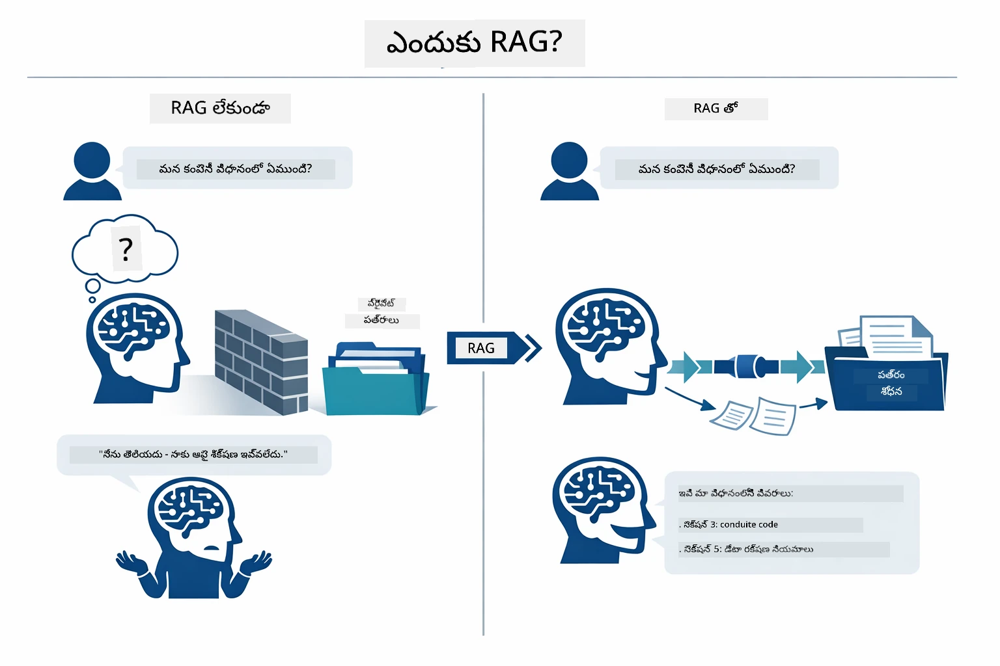

*ఈ చిత్రంలో సాధారణ LLM (శిక్షణ డేటా నుంచి అంచనా వేస్తుంది) మరియు RAG-పుంజిన LLM (ముందుగా మీ డాక్యుమెంట్లను పరిశీలిస్తుంది) మధ్య వ్యత్యాసం చూపబడింది.*

ఇక్కడ భాగాలు ఎండ్-టు-ఎండ్ ఎలా కలసి పనిచేస్తాయో చూపబడింది. వాడుకరి ప్రశ్న నాలుగు దశల ద్వారా ప్రవహిస్తుంది — ఎంబెడ్డింగ్, వెక్టార్ సెర్చ్, కాంటెక్స్ట్ అసెంబ్లీ, మరియు సమాధాన ఉత్పత్తి — ప్రతి దశ పూర్వ దశపై ఆధారపడుతుంది:


*ఈ చిత్రంలో పూర్తి RAG పైప్లైన్ చూపబడింది — వాడుకరి ప్రశ్న ఎంబెడ్డింగ్, వెక్టార్ సెర్చ్, కాంటెక్స్ట్ అసెంబ్లీ మరియు సమాధాన ఉత్పత్తి ద్వారా ప్రవహిస్తుంది.*

మిగిలిన భాగం ఈ మాడ్యూల్‌లో ప్రతి దశను వివరంగా, మీరు నడిపించి మార్పులు చేయగల కోడ్ తో చూపబడుతుంది.

### ఈ ట్యుటోరియల్ ఏ RAG విధానాన్ని ఉపయోగిస్తుంది?

LangChain4j RAGను అమలు చేసేందుకు మూడు మార్గాలను అందిస్తుంది, ప్రతి దశలో వేరే స్థాయి సారాంశంతో. క్రింది చిత్రంలో వాటి పక్కపక్కన పోలిక చూపబడింది:

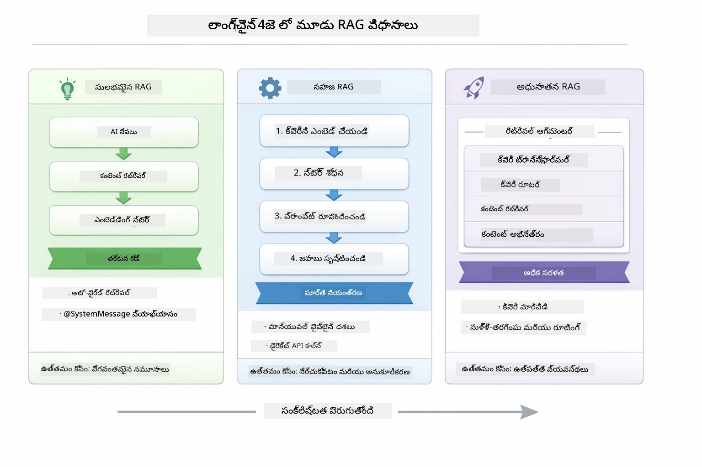

*ఈ చిత్రంలో LangChain4j RAG మూడు విధానాలను పోల్చారు — ఈజీ, నేటివ్, మరియు అడ్వాన్స్డ్ — వాటి ప్రధాన భాగాలు మరియు ఎప్పుడు ఏది ఉపయోగించాలో చూపబడింది.*

| విధానం | ఇది చేసే పని | ట్రేడ్-ఆఫ్ |
|---|---|---|
| **ఈజీ RAG** | `AiServices` మరియు `ContentRetriever` ద్వారా అన్ని స్వయంచాలకంగా కనెక్ట్ చేస్తుంది. మీరు ఇంటర్‌ఫేస్‌ను అనోటేట్ చేసి, రిట్రీవర్‌ను జోడిస్తారు, మరియు LangChain4j ఎంబెడ్డింగ్, సెర్చ్ మరియు ప్రాంప్ట్ అసెంబ్లీని రహస్యంగా నిర్వహిస్తుంది. | తగ్గిన కోడ్, కానీ ప్రతి దశలో ఏమి జరుగుతుందో చూడలేరు. |
| **నేటివ్ RAG** | మీరు ఎంబెడ్డింగ్ మోడల్‌ను పిలవండి, స్టోర్‌లో సెర్చ్ చేయండి, ప్రాంప్ట్‌ను తయారు చేయండి, మరియు సమాధానం ఉత్పత్తి చేయండి — ఒక్కో స్పష్టమైన దశలో ఒకేసారి. | ఎక్కువ కోడ్, కానీ ప్రతి దశ కనిపిస్తుంది మరియు మార్చొచ్చు. |
| **అడ్వాన్స్డ్ RAG** | `RetrievalAugmentor` ఫ్రేమ్‌వర్క్ ఉపయోగించి ప్రొడక్షన్-గ్రేడ్ పైప్లైన్లకు క్వరీ ట్రాన్స్‌ఫార్మర్స్, రూటర్లు, రీ-రాంకర్స్, మరియు కంటెంట్ ఇంజెక్టర్స్ ఉపయోగిస్తుంది. | అత్యధిక ఫ్లెక్సిబిలిటీ, కానీ చాలా సంక్లిష్టం. |

**ఈ ట్యుటోరియల్ నేటివ్ విధానాన్ని ఉపయోగిస్తుంది.** RAG పైప్లైన్ ప్రతి దశ — క్వరీ ఎంబెడ్డింగ్, వెక్టార్ స్టోర్ సెర్చ్, కాంటెక్స్ట్ అసెంబ్లీ, మరియు సమాధాన ఉత్పత్తి — [`RagService.java`](../../../03-rag/src/main/java/com/example/langchain4j/rag/service/RagService.java) లో స్పష్టంగా వ్రాయబడింది. ఇది నిఖార్సైనది: ఒక నేర్చుకునే వనరుగా, కోడ్ తగ్గించడంలో కాకుండా, ప్రతి దశను మీరు చూసి అర్థం చేసుకోవడం ముఖ్యం. మీరు భాగాల కలయిక ఎలా ఉన్నదో అర్థం చేసుకున్న తర్వాత, త್ವರిత ప్రోటోటైపుల కోసం ఈజీ RAG లేదా ప్రొడక్షన్ సిస్టమ్స్ కోసం అడ్వాన్స్డ్ RAG కు వెళ్లవచ్చు.

> **💡 ఈజీ RAG ను ఇప్పటికే చూశారా?** [Quick Start module](../00-quick-start/README.md) లో ఒక డాక్యుమెంట్ Q&A ఉదాహరణ ([`SimpleReaderDemo.java`](../../../00-quick-start/src/main/java/com/example/langchain4j/quickstart/SimpleReaderDemo.java)) ఈజీ RAG విధానాన్ని ఉపయోగిస్తుంది — LangChain4j ఎంబెడ్డింగ్, సెర్చ్, మరియు ప్రాంప్ట్ అసెంబ్లీని స్వయంచాలకంగా నిర్వహిస్తుంది. ఈ మాడ్యూల్ ఆ పైప్లైన్‌ను విడదీసి, మీరు ప్రతి దశను అవగాహన చేసుకొని నియంత్రణ పొందేందుకు తీసుకువస్తుంది.

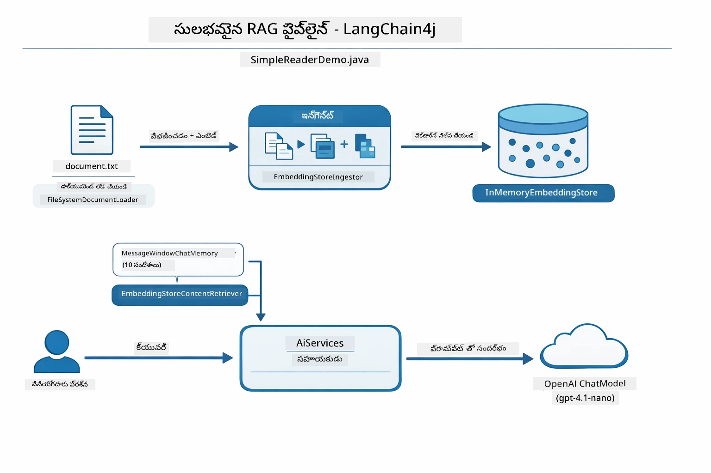

*ఈ చిత్రంలో `SimpleReaderDemo.java` నుండి ఈజీ RAG పైప్లైన్ చూపబడింది. ఈ మాడ్యూల్ లో ఉపయోగించే నేటివ్ విధానంతో పోల్చండి: ఈజీ RAG లో `AiServices` మరియు `ContentRetriever` వెనక ఎంబెడ్డింగ్, రిట్రీవల్, మరియు ప్రాంప్ట్ అసెంబ్లీ దాచబడి ఉంటాయి — మీరు డాక్యుమెంట్ లోడ్ చేసి, రిట్రీవర్ జోడించి, సమాధానాలు పొందుతారు. ఈ మాడ్యూల్ లో నేటివ్ విధానం ఆ పైప్లైన్‌ను తెరిచి, మీరు ప్రతి దశను (ఎంబెడ్, సెర్చ్, కాంటెక్స్ట్ అసెంబుల్, జనరేట్) మీదే పిలుచుకోవడంతో పూర్తిగా చూడగలిగేలా చేస్తుంది.*

## ఇది ఎలా పనిచేస్తుంది

ఈ మాడ్యూల్‌లో RAG పైప్లైన్ ప్రతి సారి వాడుకరి ప్రశ్న అడుగుతే సీక్వెన్స్ లో నడుస్తున్న నాలుగు దశలుగా విభజించబడింది. మొదట, అప్‌లోడ్ చేసిన డాక్యుమెంట్ **పార్స్ చేసి చంక్స్ గా విభజించబడుతుంది** — మోడల్ యొక్క కాంటెక్స్ట్ విండోలో సడలకుండా సరిపోయే చిన్న చిన్న భాగాలు. ఆ చంక్స్ కొద్దిగా ఒకరి దగ్గర ఒకరు ఓవర్లాప్ ఉంటాయి, అందువల్ల సరిహద్దుల వద్ద కాంటెక్స్ట్ పోకుండా ఉంటుంది.

కొందరు భాగాలు తరువాత **వెక్టర్ ఎంబెడ్డింగ్స్** గా మార్చబడతాయి మరియు నిల్వ చేయబడతాయి, ఇవి గణితంగా సరిపోల్చుకోవచ్చు. ప్రశ్న పుట్టినప్పుడు, సిస్టమ్ **సెమాంటిక్ సెర్చ్** చేస్తుంది, అత్యంత సంబంధిత చంక్‌లను కనుగొని, LLM కి **సమాధానానికి** ఆ కాంటెక్స్ట్‌ను పంపుతుంది. కింద ఉన్న విభాగాలు ప్రతి దశను సంబంధిత కోడ్ మరియు చిత్రాలతో చూపిస్తున్నాయి. మొదటి దశను చూద్దాం.

### డాక్యుమెంట్ ప్రాసెసింగ్

[DocumentService.java](../../../03-rag/src/main/java/com/example/langchain4j/rag/service/DocumentService.java)

మీరు ఒక డాక్యుమెంట్ అప్‌లోడ్ చేసినప్పుడు, సిస్టమ్ దానిని పార్స్ చేస్తుంది (PDF లేదా ప్లెయిన్ టెక్స్ట్), ఫైల్ పేరు వంటి మెటాడేటాను జత చేస్తుంది, తరువాత దాన్ని చంక్స్ గా విడగొడుతుంది — చిన్న చిన్న భాగాలు, మోడల్ కాంటెక్స్ట్ విండోలో సులభంగా సరిపోతాయి. ఈ చంక్స్ కొంతమేర ఒవర్‌ల్యాప్ ఉంటాయి కాబట్టి సరిహద్దుల్లో కాంటెక్స్ట్ పోదు.

```java
// అప్‌లోడ్ చేసిన ఫైల్‌ను పార్స్ చేసి దాన్ని LangChain4j డాక్యుమెంట్‌లో మడత వేయండి
Document document = Document.from(content, metadata);

// 30-టోకెన్ తరసలో 300-టోకెన్ భాగాలుగా విడగొట్టండి
DocumentSplitter splitter = DocumentSplitters
    .recursive(300, 30);

List<TextSegment> segments = splitter.split(document);
```

క్రింద ఉన్న చిత్రంలో దీని పని విధానాన్ని بصریగా చూపిస్తున్నారు. ప్రతి చంక్ పరిసర భాగాలతో కొంత టోకెన్లను పంచుకుంటుంది — 30-టోకెన్ ఒవర్‌ల్యాప్ ముఖ్యం కాంటెక్స్ట్ మిస్ కాకుండా చూసుకునేందుకు:

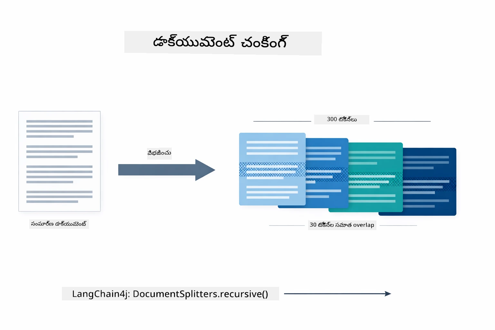

*ఈ చిత్రంలో డాక్యుమెంట్ 300-టోకెన్ చంక్స్ గా 30-టోకెన్ ఒవర్‌ల్యాప్ తో విభజించబడుతోంది, చంక్ సరిహద్దుల వద్ద కాంటెక్స్ట్ పరిరక్షిస్తోంది.*

> **🤖 [GitHub Copilot](https://github.com/features/copilot) చాట్‌తో ప్రయత్నించండి:** [`DocumentService.java`](../../../03-rag/src/main/java/com/example/langchain4j/rag/service/DocumentService.java) తెరవండి మరియు అడగండి:  
> - "LangChain4j డాక్యుమెంట్లను చంక్స్ గా ఎలా విభజిస్తుంది మరియు ఒవర్‌ల్యాప్ ఎందుకు ముఖ్యం?"  
> - "విభిన్న డాక్యుమెంట్ రకాల కోసం ఉత్తమ చంక్ పరిమాణం ఎంత మరియు ఎందుకు?"  
> - "బహుభాషా డాక్యుమెంట్లు లేదా ప్రత్యేక ఫార్మాటింగ్ ఉన్నవి ఎలా నిర్వహించాలి?"

### ఎంబెడ్డింగ్స్ సృష్టించడం

[LangChainRagConfig.java](../../../03-rag/src/main/java/com/example/langchain4j/rag/config/LangChainRagConfig.java)

ప్రతీ చంక్ ను ఒక సంఖ్యాత్మక ప్రాతినిధ్యం (ఎంబెడ్డింగ్) గా మార్చబడుతుంది — అది ప్రామాణికంగా అర్థం నుండి సంఖ్యలకి మార్పిడి. ఎంబెడ్డింగ్ మోడల్ చాట్ మోడల్ లా "బుద్ధివంతం" కాదు; ఇది సూచనలు అనుసరించదు, తర్కం చెప్పదు లేదా ప్రశ్నలకు జవాబు ఇవ్వదు. అది చేయగలిగేది: ఒక గణితీయ స్థలంలో టెక్స్ట్‌ను మ్యాప్ చేయడం, ఇంతలా సమాన అర్థాలు ఒకరితో ఒకరు దగ్గరగా ఉంటాయి — "కారు" "ఆటోమొబైల్" దగ్గర, "రిఫండ్ పాలసీ" "నాకు నా డబ్బు తిరిగి ఇవ్వాలి" దగ్గర. చాట్ మోడల్ అనగా మీరు మాట్లాడగలిగిన వ్యక్తి, ఎంబెడ్డింగ్ మోడల్ ఒక అద్భుతమైన ఫైలింగ్ వ్యవస్థ లాంటిది.

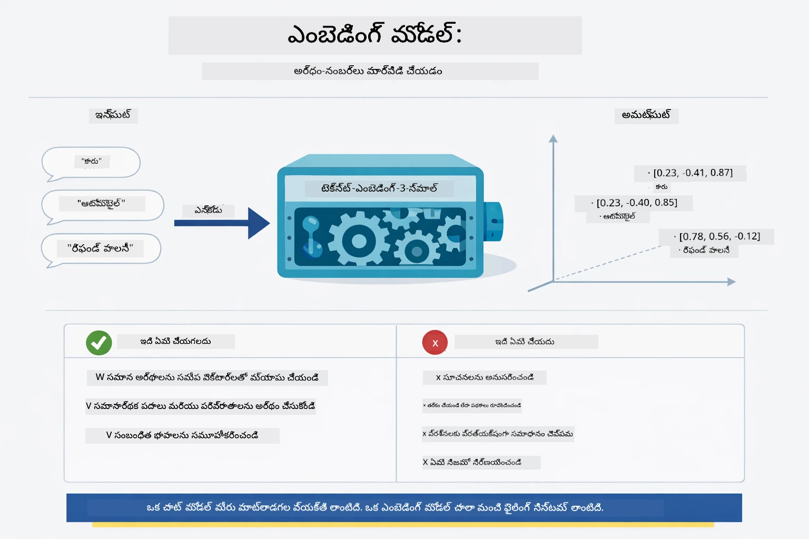

*ఈ చిత్రంలో ఎంబెడ్డింగ్ మోడల్ టెక్స్ట్‌ను సంఖ్యాత్మక వెక్టార్లలోకి మార్చడం చూపిస్తోంది, "కారు" మరియు "ఆటోమొబైల్" లాంటివి సమీపంలో ఉంటాయి.*

```java
@Bean
public EmbeddingModel embeddingModel() {
    return OpenAiOfficialEmbeddingModel.builder()
        .baseUrl(azureOpenAiEndpoint)
        .apiKey(azureOpenAiKey)
        .modelName(azureEmbeddingDeploymentName)
        .build();
}

EmbeddingStore<TextSegment> embeddingStore = 
    new InMemoryEmbeddingStore<>();
```

క్లాస్ డయాగ్రామ్ కింద RAG పైప్లైన్ లో రెండు వేర్వేరు ప్రవాహాలు మరియు వాటిని అమలు చేసే LangChain4j క్లాసులు చూపిస్తున్నాయి. **ఇన్జెస్టన్ ఫ్లో** (ఒకసారి అప్‌లోడ్ సమయంలో నడుస్తుంది) డాక్యుమెంట్‌ను విడగొట్టి, చంక్స్ ఎంబెడ్ చేసి `.addAll()` ద్వారా సేవ్ చేస్తుంది. **క్వరీ ఫ్లో** (ప్రతి సారీ వాడుకరి అడిగే సమయంలో నడుస్తుంది) ప్రశ్నను ఎంబెడ్ చేసి, `.search()` ద్వారా స్టోర్ ను సెర్చ్ చేసి, సరిపోయే కాంటెక్స్ట్‌ను చాట్ మోడల్‌కు పంపిస్తుంది. రెండు ప్రవాహాలు పంచుకున్న `EmbeddingStore<TextSegment>` ఇంటర్‌ఫేస్ వద్ద కలసి కలుస్తాయి:

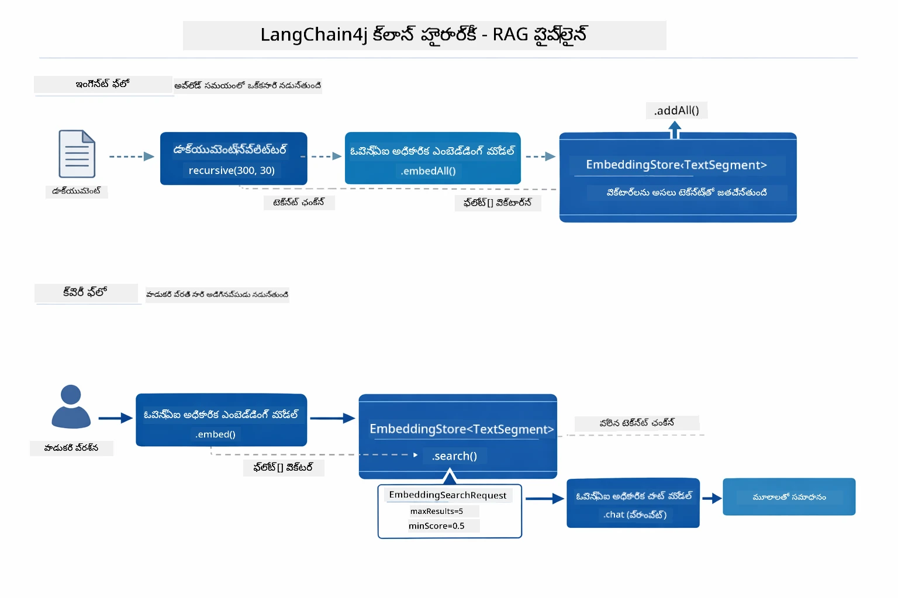

*ఈ చిత్రం RAG పైప్లైన్ లోని రెండు ప్రవాహాలు — ఇన్జెస్టన్ మరియు క్వరీ — మరియు అవి ఎంబెడ్డింగ్ స్టోర్ ద్వారా ఎలా కలుస్తాయో చూపిస్తోంది.*

ఎంబెడ్డింగ్స్ నిల్వ చేసిన తర్వాత, సామాన్య విషయాలు సహజంగానే వెక్టర్ స్థలంలో సమీపంలో కలుస్తాయి. క్రింది విజువలైజేషన్ ఎలా సంబంధిత విషయాల డాక్యుమెంట్లు సమీపపు బిందువులుగా వస్తాయో చూపిస్తోంది, ఇది సెమాంటిక్ సెర్చ్ సాధ్యమయిన కారణం:


*ఈ విజువలైజేషన్ relation topics తో డాక్యుమెంట్లు ఎలా 3D వెక్టర్ స్థలంలో బలమైన సమూహాలు కుట్టుకుంటాయో చూపిస్తుంది, Technical Docs, Business Rules, FAQs వంటి టాపిక్స్ స్పష్టంగా వేర్వేరు అవుతాయి.*

వాడుకరి సెర్చ్ చేస్తే, సిస్టమ్ నాలుగు దశలు పాటిస్తుంది: డాక్యుమెంట్లు ఒకసారి ఎంబెడ్ చేయబడతాయి, ప్రతి సెర్చ్ కి క్వరీ ఎంబెడ్ చేయబడుతుంది, క్వరీ వెక్టర్‌ను నిల్వ వెక్టార్లతో కోసైన్ సాదృశ్యంతో పోలుస్తుంది, టాప్-K మంచి స్కోరు చంక్స్ రిటర్న్ చేస్తుంది. క్రింది చిత్రంలో ఈ ఒక్క ఒక్క దశ మరియు వాటి సంబంధించిన LangChain4j క్లాసులు చూపబడ్డాయి:

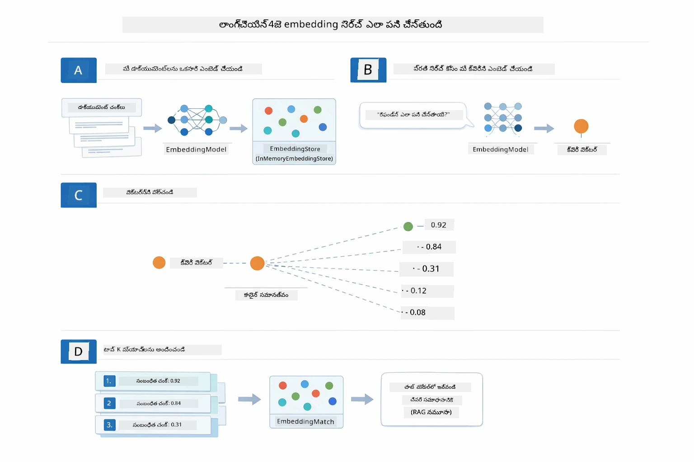

*ఈ చిత్రంలో నాలుగు దశల ఎంబెడ్డింగ్ సెర్చ్ ప్రక్రియ చూపబడింది: డాక్యుమెంట్లను ఎంబెడ్ చేయడం, క్వరీ ఎంబెడ్ చేయడం, వెక్టార్లను కోసైన్ సాదృశ్యంతో పోల్చడం, మరియు టాప్-K ఫలితాలను అందించడం.*

### సెమాంటిక్ సెర్చ్

[RagService.java](../../../03-rag/src/main/java/com/example/langchain4j/rag/service/RagService.java)

మీరు ప్రశ్న అడిగితే, మీ ప్రశ్న కూడా ఎంబెడ్ అవుతుంది. సిస్టమ్ మీ ప్రశ్న యొక్క ఎంబెడ్డింగ్ అన్ని డాక్యుమెంట్ చంక్‌ల ఎంబెడ్డింగ్స్ తో పోల్చుతుంది. ఇది సమాన అర్థాలు ఉన్న చంక్‌లను కనుగొంటుంది — కీవర్డ్ మ్యాచ్ కాకుండా నిజమైన సెమాంటిక్ సాదృశ్యం.

```java
Embedding queryEmbedding = embeddingModel.embed(question).content();

EmbeddingSearchRequest searchRequest = EmbeddingSearchRequest.builder()
    .queryEmbedding(queryEmbedding)
    .maxResults(5)
    .minScore(0.5)
    .build();

EmbeddingSearchResult<TextSegment> searchResult = embeddingStore.search(searchRequest);
List<EmbeddingMatch<TextSegment>> matches = searchResult.matches();

for (EmbeddingMatch<TextSegment> match : matches) {
    String relevantText = match.embedded().text();
    double score = match.score();
}
```

క్రింది చిత్రం సెమాంటిక్ సెర్చ్ మరియు పరంపరాగత కీవర్డ్ సెర్చ్ మధ్య తేడాను చూపిస్తుంది. "వాహనం" కోసం కీవర్డ్ సెర్చ్ "కారు మరియు ట్రక్కులు" గురించి ఒక చంక్‌ని మిస్ చేస్తుంది, కానీ సెమాంటిక్ సెర్చ్ అవి ఒకటే అర్థం అని అర్థం చేసుకొని అది ఒక అధిక స్కోరు సరిపోయే ఫలితంగా అందజేస్తుంది:

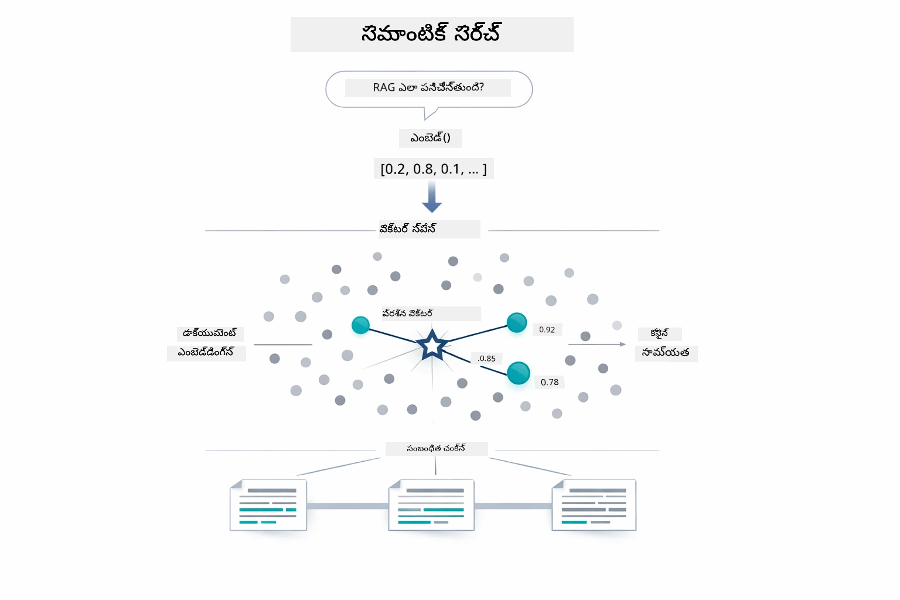

*ఈ చిత్రం కీవర్డ్ ఆధారిత సెర్చ్ మరియు సెమాంటిక్ సెర్చ్ ను పోల్చుతుంది, సెమాంటిక్ సెర్చ్ ఎలా నిర్ణీత కీవర్డ్లు కాకపోయినా సంబంధిత విషయాలను రిట్రీవ్ చేస్తుందో చూపిస్తుంది.*

తలిందులను కొలవడంలో కోసైన్ సాదృశ్యం ఉపయోగపడుతుంది — సిసలైనగా "ఇవి రెండు అంబులెసిని ఒకే దిశలో చూపిస్తున్నాయా?" అని అడుగుతుంది. రెండు చంక్స్ భిన్న పదాలు వాడినా, అవి ఒకే అర్థం ఉంటే వాటి వెక్టార్లు ఒకే దిశలో ఉంటాయి మరియు 1.0కి దగ్గరగా స్కోరు అందుతాయి:

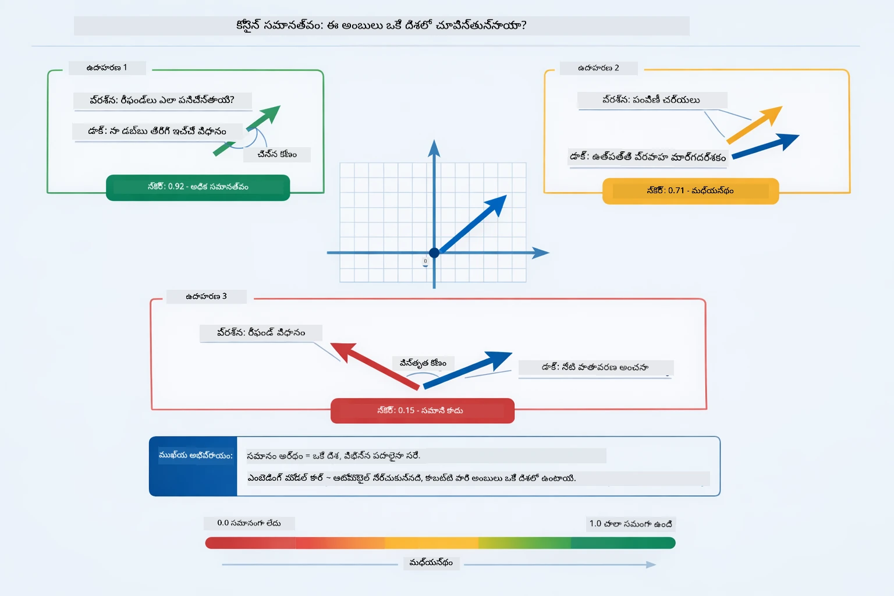
*ఈ చార్టు కోసైన్ సారూప్యతను embedding వెక్టర్లు మధ్య కోణంగా చూపిస్తుంది — మరింత సరిగ్గా సరిచేయబడిన వెక్టర్లు 1.0కి దగ్గరగా స్కోర్ పొందుతాయి, ఇది ఉన్నతమైన సాంకేతిక సారూప్యతను సూచిస్తుంది.*

> **🤖 [GitHub Copilot](https://github.com/features/copilot) చాట్‌తో ప్రయత్నించండి:** [`RagService.java`](../../../03-rag/src/main/java/com/example/langchain4j/rag/service/RagService.java) ఫైల్ తెరవండి మరియు అడగండి:
> - "ఎంబెడ్డింగ్స్‌తో సారూప్యత శోధన ఎలా పని చేస్తుంది మరియు స్కోర్‌ను ఏమి నిర్ణయిస్తుంది?"
> - "నేను ఏ సారూప్యత సరిహద్దు ఉపయోగించాలి మరియు అది ఫలితాలను ఎలా ప్రభావితం చేస్తుంది?"
> - "సంబంధిత డాక్యుమెంట్లు కనుగొనబడకపోతే నేను ఎలా వ్యవహరించాలి?"

### సమాధానం సృష్టి

[RagService.java](../../../03-rag/src/main/java/com/example/langchain4j/rag/service/RagService.java)

అత్యంత సంబంధిత భాగాలను స్పష్టమైన సూచనలను, తిరిగి పొందిన నేపథ్యాన్ని మరియు వినియోగదారుడి ప్రశ్నను కలిగి ఉన్న నిర్మిత ప్రాంప్ట్‌గా జతచేస్తారు. మోడల్ ఆ ప్రత్యేక భాగాలను చదివి ఆ సమాచారం ఆధారంగా సమాధానం ఇస్తుంది — అది ముందుకు ఉన్నదే ఉపయోగించగలం, తద్వారా మిస్సింగ్ లేదా అబద్ధాల రాకుండా ఉంటుంది.

```java
String context = matches.stream()
    .map(match -> match.embedded().text())
    .collect(Collectors.joining("\n\n"));

String prompt = String.format("""
    Answer the question based on the following context.
    If the answer cannot be found in the context, say so.

    Context:
    %s

    Question: %s

    Answer:""", context, request.question());

String answer = chatModel.chat(prompt);
```

క్రింది చార్టు ఈ జతచేసే ప్రక్రియను చూపుతుంది — శోధన దశ నుండి టాప్-స్కోరింగ్ భాగాలు ప్రాంప్ట్ టెంప్లేట్‌లో చేర్చబడతాయి మరియు `OpenAiOfficialChatModel` ఆధారిత సమాధానం ఉత్పత్తి చేస్తుంది:

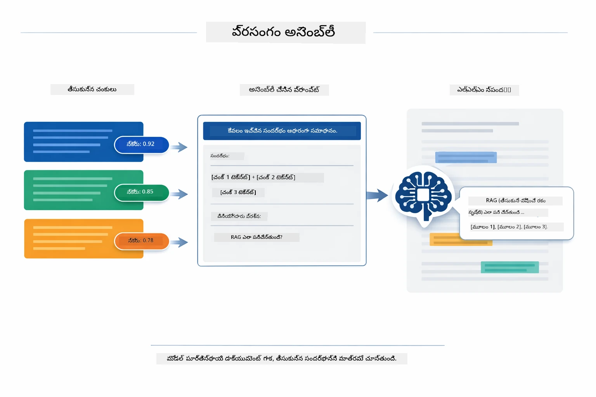

*ఈ చార్టు టాప్-స్కోరింగ్ భాగాలు నిర్మిత ప్రాంప్ట్‌గా ఎలా కలిపి మోడల్ మీ డేటా నుండి స్పష్టమైన సమాధానం సృష్టించగలదో చూపిస్తుంది.*

## అప్లికేషన్‌ను నడపండి

**పరిచర్య నిర్ధారించండి:**

రూట్ డైరెక్టరీలో Azure క్రెడెన్షియల్స్‌తో `.env` ఫైల్ ఉనికిలో ఉందనే ధృవీకరించండి (Module 01 సమయంలో సృష్టించబడింది):

**Bash:**
```bash
cat ../.env  # AZURE_OPENAI_ENDPOINT, API_KEY, DEPLOYMENT ని చూపించాలి
```

**PowerShell:**
```powershell
Get-Content ..\.env  # AZURE_OPENAI_ENDPOINT, API_KEY, DEPLOYMENT చూపించాలి
```


**అప్లికేషన్ ప్రారంభించండి:**

> **గమనిక:** Module 01 నుండి `./start-all.sh` ఉపయోగించి మీరు ఇప్పటికే అన్ని అప్లికేషన్లను ప్రారంభించి ఉంటే, ఈ మాడ్యూల్ 8081 పోర్ట్‌లో ఇప్పటికే నడుస్తుంది. మీరు దిగువ ప్రారంభ ఆదేశాలు వాటిల్లకుండానే http://localhost:8081కి నేరుగా వెళ్లవచ్చు.

**ఎంపిక 1: Spring Boot డాష్‌బోర్డ్ ఉపయోగించడం (VS Code వినియోగదారులకు సిఫార్సు)**

డెవ్ కంటెయినర్ Spring Boot డాష్‌బోర్డ్ ఎక్స్‌టెన్షన్‌ను కలిగి ఉంది, ఇది అన్ని Spring Boot అప్లికేషన్లను కళ్లకు కనపడే ఇంటర్‌ఫేస్ ద్వారా నియంత్రిస్తుంది. ఇది VS Code Activity Bar (ఎడమ వైపున)లో Spring Boot ఐకాన్‌తో ఉంటుంది.

Spring Boot డాష్‌బోర్డ్ నుండే మీరు:
- వర్క్‌స్పేస్‌లో అందుబాటులో ఉన్న అన్ని Spring Boot అప్లికేషన్లను వీక్షించగలరు
- పాలిక్కి ఒక క్లిక్‌తో అప్లికేషన్లను ప్రారంభించండి/ఆపండి
- అప్లికేషన్ లాగ్స్‌ను రియల్‌టైంలో చూడండి
- అప్లికేషన్ స్థితిని పర్యవేక్షించండి

"rag" పక్కన ప్లే బటనుపై క్లిక్ చేసి ఈ మాడ్యూల్‌ను ప్రారంభించవచ్చు, లేదా ఒక్కసారిగా అన్ని మాడ్యూల్స్ ప్రారంభించండి.


*ఈ స్క్రీన్‌షాట్ VS Codeలో Spring Boot డాష్‌బోర్డ్‌ను చూపిస్తుంది, ఇక్కడ మీరు అప్లికేషన్లను ప్రారంభించడం, ఆపడం మరియు పర్యవేక్షించడం చేయవచ్చు.*

**ఎంపిక 2: షెల్ స్క్రిప్ట్‌ల ఉపయోగం**

అన్ని వెబ్ అప్లికేషన్లను ప్రారంభించండి (మాడ్యూల్స్ 01-04):

**Bash:**
```bash
cd ..  # రూట్ డైరెక్టరీ నుండి
./start-all.sh
```

**PowerShell:**
```powershell
cd ..  # రూట్ డైరెక్టరీ నుండి
.\start-all.ps1
```


లేదా ఈ మాడ్యూల్ మాత్రమే ప్రారంభించండి:

**Bash:**
```bash
cd 03-rag
./start.sh
```

**PowerShell:**
```powershell
cd 03-rag
.\start.ps1
```


రూట్ `.env` ఫైల్ నుండి ఆటోమేటిక్‌గా వాతావరణ చరత్రాలు లోడ్ అవుతాయి, జార్స్ ఉనికిలో లేనప్పటికీ అవి నిర్మించబడతాయి.

> **గమనిక:** మీరు ప్రారంభించడం కంటే ముందే మాడ్యూల్స్‌ను చేతితో నిర్మించాలనుకుంటే:
>
> **Bash:**
> ```bash
> cd ..  # Go to root directory
> mvn clean package -DskipTests
> ```

> **PowerShell:**
> ```powershell
> cd ..  # Go to root directory
> mvn clean package -DskipTests
> ```

మీ బ్రౌజర్‌లో http://localhost:8081 తెరవండి.

**ఆపడానికి:**

**Bash:**
```bash
./stop.sh  # ఈ మాడ్యూల్ మాత్రమే
# లేదా
cd .. && ./stop-all.sh  # అన్ని మాడ్యూల్స్
```

**PowerShell:**
```powershell
.\stop.ps1  # ఈ మాడ్యుల్ మాత్రమే
# లేదా
cd ..; .\stop-all.ps1  # అన్ని మాడ్యుల్స్
```


## అప్లికేషన్ ఉపయోగించడం

అప్లికేషన్ డాక్యుమెంట్లు అప్లోడ్ చేయడం మరియు ప్రశ్నలు అడగటానికి వెబ్ ఇంటర్‌ఫేస్ అందిస్తుంది.

<a href="images/rag-homepage.png"></a>

*ఈ స్క్రీన్‌షాట్ RAG అప్లికేషన్ ఇంటర్‌ఫేస్ను చూపిస్తుంది, ఇక్కడ మీరు డాక్యుమెంట్లు అప్లోడ్ చేసి ప్రశ్నలు అడగవచ్చు.*

### డాక్యుమెంట్ అప్లోడ్ చేయండి

మొదట డాక్యుమెంట్ అప్లోడ్ చేయడం ప్రారంభించండి - పరీక్షకు TXT ఫైళ్లు ఉత్తమం. ఈ డైరెక్టరీలో LangChain4j ఫీచర్లు, RAG అమలు, మరియు ఉత్తమ పద్ధతులు గురించి సమాచారాన్ని కలిగిన `sample-document.txt` ఫైల్ అందుబాటులో ఉంది - ఇది సిస్టమ్‌ను పరీక్షించడానికి సరిగ్గా సరిపోతుంది.

సిస్టమ్ మీ డాక్యుమెంట్‌ను ప్రాసెస్ చేసి, దాన్ని భాగాలుగా విభజించి, ప్రతి భాగానికి embeddingలు సృష్టిస్తుంది. ఇది అప్లోడ్ చేసిన వెంటనే ఆటోమేటిక్‌గా జరుగుతుంది.

### ప్రశ్నలు అడగండి

ఇప్పుడండి డాక్యుమెంట్ కంటెంట్ గురించి ప్రత్యేకమైన ప్రశ్నలు అడగండి. స్పష్టం గా ఉన్న వాస్తవమయిన సమాచారం అడగండి. సిస్టమ్ సంబంధిత భాగాలను శోధించి, వాటిని ప్రాంప్ట్‌లో చేర్చి సమాధానం సృష్టిస్తుంది.

### మూలల సూచనలను తనిఖీ చేయండి

ప్రతి సమాధానం మూల సూత్ర సూచనలను మరియు సారూప్యత స్కోర్లతో వస్తుంది. ఈ స్కోర్లు (0 నుండి 1 వరకూ) మీ ప్రశ్నకు ఏ మేరకు భాగం సంబంధించినదో చూపిస్తాయి. ఎక్కువ స్కోర్లు బాగా సరిపోతాయి. దీని ద్వారా మీరు సమాధానాన్ని మూలంతో సమన్వయం చేయవచ్చు.

<a href="images/rag-query-results.png"></a>

*ఈ స్క్రీన్‌షాట్ ప్రశ్న ఫలితాలను, సృష్టించబడిన సమాధానాన్ని, మూల సూచనలను మరియు ప్రతి తిరిగి తీసుకున్న భాగం కోసం సంబంధిత స్కోర్లను చూపిస్తుంది.*

### ప్రశ్నలతో ప్రయోగాలు చేయండి

వివిధ రకాల ప్రశ్నలు అడగండి:
- స్పష్టమైన వాస్తవాలు: "ప్రధాన విషయం ఏమిటి?"
- పోలికలు: "X మరియు Y మధ్య తేడా ఏమిటి?"
- సారాంశాలు: "Z గురించి ముఖ్యాంశాలను సారాంశం చేయండి"

మీ ప్రశ్న డాక్యుమెంట్ కంటెంట్‌కు ఎంత వరకూ సరిపోతుందో ఆధారంగా సంబంధిత స్కోర్లు ఎలా మారుతాయో గమనించండి.

## ముఖ్యమైన భావనలు

### భాగాలుగా విభజించే విధానం

డాక్యుమెంట్లు 300-టోకెన్ భాగాలుగా విభజించబడతాయి, అందులో 30 టోకెన్ల మధ్యలో ఓవర్లాప్ ఉంటుంది. ఈ సంతులనం ప్రతి భాగానికి సరిపడా కాంటెక్స్ట్ ఉండేలా చేస్తుంది కానీ ప్రాంప్ట్‌లో చాలా భాగాలు ఉండగలిగేలా చిన్నగా ఉంచుతుంది.

### సారూప్యత స్కోర్లు

ప్రతి తిరిగి పొందిన భాగానికి 0 నుండి 1 మధ్యలో సారూప్యత స్కోర్ ఉంటుంది, ఇది వినియోగదారుడి ప్రశ్నకు ఎంత దగ్గరగా ఉండిందో సూచిస్తుంది. క్రింది చార్టు స్కోర్ పరిధులను చూపిస్తుంది మరియు సిస్టమ్ ఫలితాలను ఎలా ఫిల్టర్ చేస్తుందో వివరిస్తుంది:

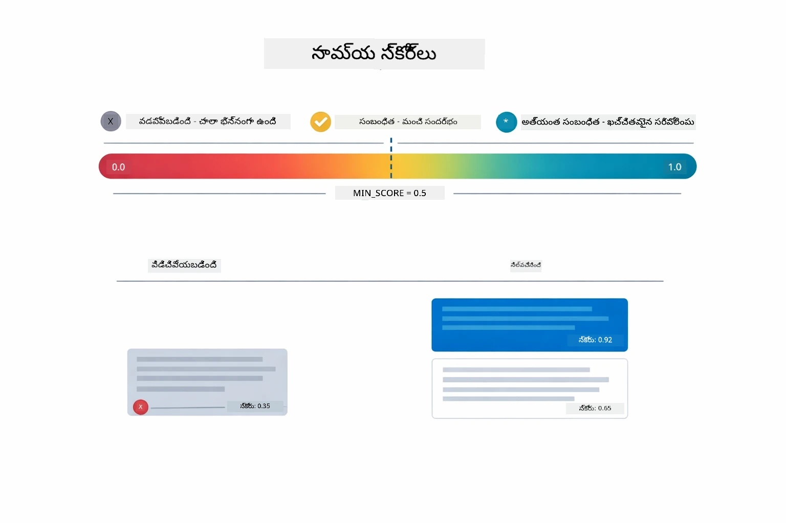

*ఈ చార్టు 0 నుండి 1 వరకు స్కోర్ పరిధులను చూపిస్తుంది, మరియు కనిష్ట సరిహద్దు 0.5 ఎటువంటి సంబంధం లేని భాగాలను వడించింది.*

స్కోర్లు శ్రేణి:
- 0.7-1.0: అత్యంత సంబంధిత, ఖచ్చితమైన మేళవింపు
- 0.5-0.7: సంబంధిత, మంచి కాంటెక్స్ట్
- 0.5కి తక్కువ: వడిలివేయబడింది, చాలా విభిన్నమైనది

నాణ్యత కోసం సిస్టమ్ కనిష్ట సరిహద్దు పై only భాగాలను మాత్రమే తిరిగి పొందుతుంది.

ఎంబెడ్డింగ్స్ అర్థం క్లీన్గా క్లస్టర్ అయినప్పుడు బాగా పని చేస్తాయి, కానీ వాటిలో కొందటి బ్లైండ్ స్పాట్స్ ఉంటాయి. క్రింది చార్టు సాధారణ విఫలతలకు ఉదాహరణ చూపుతుంది — పెద్ద భాగాలు మబ్బుగా ఉన్న వెక్టర్లను ఉత్పత్తి చేస్తాయి, చిన్న భాగాలకు కాంటెక్స్ట్ లేదు, అనిశ్చిత పదాలు అనేక క్లస్టర్లను సూచిస్తాయి, ఖచ్చితమైన లుకప్‌లు (IDs, భాగ సంఖ్యలు) embeddingలు తో పనిచేయవు:

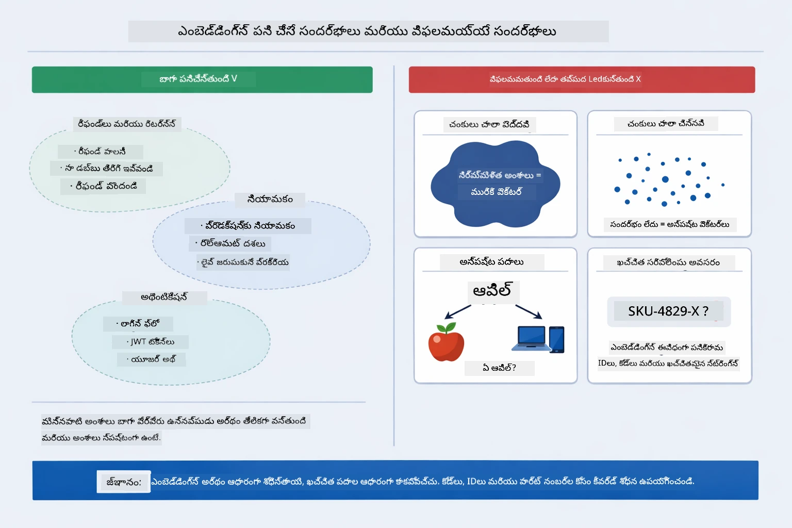

*ఈ చార్టు సాధారణ ఎంబెడ్డింగ్ విఫలత మోడ్స్ చూపిస్తుంది: పెద్ద భాగాలు, చిన్న భాగాలు, అనిశ్చిత పదాలు అనేక క్లస్టర్లను సూచించడం, మరియు IDs వంటి ఖచ్చితమైన లుకప్‌లు.*

### ఇన్-మెమరీ నిల్వ

ఈ మాడ్యూల్ సరళత కోసం ఇన్-మెమరీ నిల్వను ఉపయోగిస్తుంది. మీరు అప్లికేషన్‌ను రీస్టార్ట్ చేస్తే, అప్లోడ్ చేసిన డాక్యుమెంట్లు పోతాయి. ప్రొడక్షన్ సిస్టమ్స్ Qdrant లేదా Azure AI Search వంటి స్థిరమైన వెక్టర్ డేటాబేసులను ఉపయోగిస్తాయి.

### కాంటెక్స్ట్ విండో నిర్వహణ

ప్రతి మోడల్‌కు గరిష్ట కాంటెక్స్ట్ విండో ఉంటుంది. పెద్ద డాక్యుమెంట్ నుంచి ప్రతి భాగాన్ని చేర్చలేరు. సిస్టమ్ టాప్ N అత్యంత సంబంధిత భాగాలను తిరిగి సంపాదిస్తుంది (డీఫాల్ట్ 5) పరిమితుల లోపల ఉండటానికీ, ఖచ్చితమైన సమాధానాలకు సరిపడా కాంటెక్స్ట్ ఇవ్వటానికీ.

## RAG కి ప్రాధాన్యం ఉండే సమయాలు

RAG ఎల్లప్పుడూ సరైన దురుశీల కాదు. క్రింది నిర్ణయ మార్గదర్శకం RAG విలువా సామాన్య పద్ధతులు — ప్రాంప్ట్‌లో కంటెంట్ చేర్చడం లేదా మోడల్ అంతర్గత జ్ఞానంపై ఆధారపడటం — సరిపోతాయా అనే విషయంలో సహాయం చేస్తుంది:

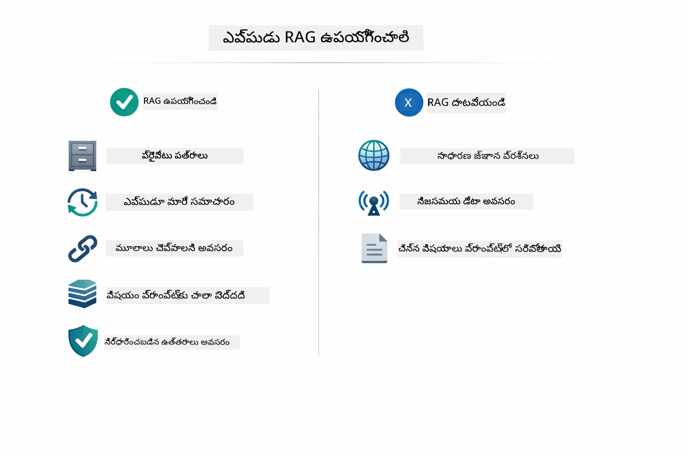

*ఈ చార్టు RAG విలువ ఇచ్చే సమయాలు మరియు సాధారణ పద్ధతులు సరిపోతున్న సమయాల గమన సూచనను చూపిస్తుంది.*

**RAG ని ఉపయోగించండి:**
- స్వంత డాక్యుమెంట్ల గురించి ప్రశ్నలకు సమాధానం ఇచ్చేటప్పుడు
- సమాచారం తరచుగా మారేప్పుడు (నియమాలు, ధరలు, స్పెసిఫికేషన్లు)
- ఖచ్చితత్వానికి మూలాన్ని అవసరం ఉంటే
- కంటెంట్ ఒక్కో ప్రాంప్ట్‌లో పెట్టడానికి చాలా పెద్దగా ఉన్నప్పుడు
- మీరు ధృవపరచగల, భూమి పై నిలబడిన సమాధానాలు కావాలంటే

**RAG ఉపయోగించకండి:**
- ప్రశ్నలు మోడల్ ఇప్పటికే కలిగిన సాధారణ జ్ఞానాన్ని అడిగేటప్పుడు
- రియల్-టైమ్ డేటా అవసరం ఉంటే (RAG అప్లోడ్ అయిన డాక్యుమెంట్లపై పని చేస్తుంది)
- కంటెంట్ ప్రాంప్ట్‌లో నేరుగా చేర్చడానికి చిన్నదయితే

## తదుపరి దశలు

**తదుపరి మాడ్యూల్:** [04-tools - AI Agents with Tools](../04-tools/README.md)

---

**నావిగేషన్:** [← గతది: Module 02 - Prompt Engineering](../02-prompt-engineering/README.md) | [ముఖ్య పేజీకి తిరిగి](../README.md) | [తదుపరి: Module 04 - Tools →](../04-tools/README.md)

---

<!-- CO-OP TRANSLATOR DISCLAIMER START -->
**త్యాగప్రకటన**:
ఈ పత్రం AI అనువాద సేవ [Co-op Translator](https://github.com/Azure/co-op-translator) ఉపయోగించి అనువదించబడింది. మేము ఖచ్చితత కోసం ప్రయత్నిస్తున్నప్పటికీ, స్వయంచాలక అనువాదాలలో లోపాలు లేదా తప్పిదాలు ఉండవచ్చని దయచేసి గమనించండి. అసలు పత్రం దాని స్వస్థ భాషలో అధికారిక మూలంగా పరిగణించబడాలి. కీలకమైన సమాచారానికి, వృత్తిపరమైన మానవ ప్రవరీణత అనువాదం సూచించబడింది. ఈ అనువాదం వాడకంవలన సంభవించే ఏమైనా అపవాదాల లేదా తప్పుదర్ధాంతాల కోసం మేము బాధ్యత వహించము.
<!-- CO-OP TRANSLATOR DISCLAIMER END -->