# Module 04: టూల్స్‌తో AI ఏజెంట్లు

## Table of Contents

- [మీరు నేర్చుకునేది ఏమిటి](../../../04-tools)
- [మునుపటి అవగాహన](../../../04-tools)
- [టూల్స్‌తో AI ఏజెంట్లపై అవగాహన](../../../04-tools)
- [టూల్ కాలింగ్ ఎలా పనిచేస్తుంది](../../../04-tools)
  - [టూల్ నిర్వచనాలు](../../../04-tools)
  - [సిద్ధాంతం తయారీ](../../../04-tools)
  - [నిర్వాహణ](../../../04-tools)
  - [పెల్లెనిచ్చే ప్రతిస్పందన](../../../04-tools)
  - [నిర్మాణం: స్ప్రింగ్ బూట్ ఆటో-వైరింగ్](../../../04-tools)
- [టూల్ కైత్రికరణ](../../../04-tools)
- [అప్లికేషన్ నడపండి](../../../04-tools)
- [అప్లికేషన్ ఉపయోగించడం](../../../04-tools)
  - [సాధారణ టూల్ వినియోగాన్ని ప్రయత్నించండి](../../../04-tools)
  - [టూల్ కైత్రికరణను పరీక్షించండి](../../../04-tools)
  - [संवाद ప్రవాహం చూడండి](../../../04-tools)
  - [వివిధ అభ్యర్థనలతో ప్రయోగించండి](../../../04-tools)
- [ప్రధాన సిద్దాంతాలు](../../../04-tools)
  - [ReAct ప్యాటర్న్ (తేలంపాటు మరియు చర్య)](../../../04-tools)
  - [టూల్ వివరణలు ముఖ్యం](../../../04-tools)
  - [సెషన్ నిర్వహణ](../../../04-tools)
  - [లోపాలను నిర్వహించడం](../../../04-tools)
- [ఉපలబ్ధి టూల్స్](../../../04-tools)
- [ఎప్పుడు టూల్ ఆధారిత ఏజెంట్లను ఉపయోగించాలి](../../../04-tools)
- [టూల్స్ వర్సెస్ RAG](../../../04-tools)
- [తప్పకుండా పాటించవలసిన తదుపరి దశలు](../../../04-tools)

## మీరు నేర్చుకునేది ఏమిటి

ఇప్పటికీ, మీరు AI తో సంభాషణలు ఎలా నిర్వహించాలో, ప్రాంప్టులను సమర్థవంతంగా నిర్మించుకోవడాన్ని, మరియు ప్రత్యుత్తరాలను మీ డాక్యుమెంట్లలో ఎలా ఆధారపెట్టాలో నేర్చుకున్నారు. కానీ ఒక ప్రాథమిక పరిమితి ఉంది: భాషా నమూనాలు కేవలం టెక్స్ట్‌ను సృష్టించగలవు. అవి వాతావరణాన్ని పరిశీలించలేవు, గణనలను నిర్వహించలేవు, డేటాబేస్లను పర్‌చేయలేవు, లేదా బాహ్య వ్యవస్థలతో పరస్పర చర్య చేయలేవు.

టూల్స్ దీన్ని మార్చేస్తాయి. నమూనాకు కాల్ చేయగల ఫంక్షన్లను అందించడం ద్వారా, మీరు దాన్ని ఒక టెక్స్ట్ జనరేటర్ నుండి చర్యలు చేపట్టగల ఏజెంటుగా మార్చేస్తారు. నమూనా ఎప్పుడు టూల్ అవసరమో, ఏ టూల్ ఉపయోగించాలో, ఏ పరామితులను ఇచ్చాలో నిర్ణయిస్తుంది. మీ కోడ్ ఆ ఫంక్షన్‌ను అమలు చేసి ఫలితాన్ని తిరిగి ఇస్తుంది. నమూనా ఆ ఫలితాన్ని తన ప్రతిస్పందనలో చేర్చుకుంటుంది.

## మునుపటి అవగాహన

- Module 01 పూర్తి చేసారు (Azure OpenAI వనరులు అమర్చారు)
- రూట్ డైరెక్టరీలో `.env` ఫైల్ Azure ప్రమాణాల‌తో కలిగివుంది (Module 01లో `azd up` ద్వారా సృష్టించినది)

> **గమనిక:** మీరు Module 01 పూర్తి చేయలేదంటే, ముందుగా అక్కడ ఇవ్వబడిన అమర్చే సూచనలను అనుసరించండి.

## టూల్స్‌తో AI ఏజెంట్లపై అవగాహన

> **📝 గమనిక:** ఈ మాడ్యూల్‌లో "ఏజెంట్లు" అన్న మాట టూల్-కాలింగ్ సామర్థ్యాలతో మెరుగుపరచబడిన AI అసిస్టెంట్లకు సూచిస్తుంది. ఇది [Module 05: MCP](../05-mcp/README.md)లో మేము చూడబోయే **Agentic AI** ప్యాటర్న్స్ (స్వతంత్ర ఏజెంట్లు, ప్లానింగ్, మెమరీ మరియు బహుళ-దశ నిర్ణయాలతో) నుంచి వేరువేరు.

టూల్స్ లేకుండా, ఒక భాషా నమూనా తన శిక్షణ డేటా నుంచి మాత్రమే టెక్స్ట్ సృష్టించగలదు. ప్రస్తుత వాతావరణ పరిస్థితిగాని అడిగితే, ఇది అంచనా వేయాలి. టూల్స్ ఇస్తే, ఇది వాతావరణ API కాల్ చేయగలదు, గణనలు చేయగలదు, లేదా డేటాబేస్‌ను పర్‌చేయగలదు — ఆ తర్వాత ఆ నిజమైన ఫలితాలను తన ప్రతిస్పందనలో కలుపుతుంది.

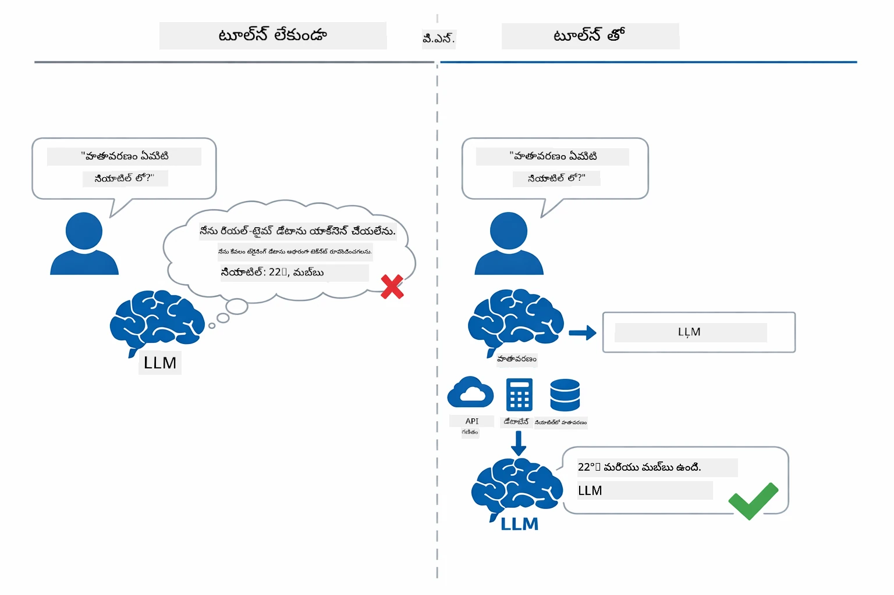

*టూల్స్ లేకుండా నమూనా అంచనా వేయగలదు — టూల్స్‌తో ఇది APIలను పిలవగలదు, గణనలు జరపగలదు, మరియు నేరిత డేటాను అందించగలదు.*

టూల్స్‌తో కూడిన AI ఏజెంట్ ఒక **ReAct (తేలంపాటు మరియు చర్య)** ప్యాటర్న్‌ను అనుసరిస్తుంది. నమూనా కేవలం ప్రతిస్పందించదు — దానికి ఏం అవసరమైందో ఆలోచిస్తుంది, టూల్‌ను పిలవడం ద్వారా చర్యలు తీసుకుంటుంది, ఫలితాన్ని పరిశీలిస్తుంది, మరియు మళ్లీ చర్య తీసుకోవాలా లేదా తుదితిరుగుబాటు ఇవ్వాలా అని నిర్ణయిస్తుంది:

1. **తేలంపాటు** — యూజర్ ప్రశ్నను విశ్లేషించి అవసరమైన సమాచారాన్ని నిర్ణయిస్తుంది
2. **చర్య** — సరైన టూల్ను ఎంచుకుని సరైన పరామితులతో పిలుస్తుంది
3. **పరిశీలన** — టూల్ నుండి ఉత్పన్నమైన ఫలితాన్ని పొందుతూ ఆఫలితాన్ని అంచనా వేస్తుంది
4. **మళ్లించు లేదా ప్రతిస్పందించు** — మరింత డేటా అవసరమైతే తిరిగి సైకిల్ లోకి వెళ్లి, లేనిదైతే సహజ భాషా సమాధానం రూపొందిస్తుంది

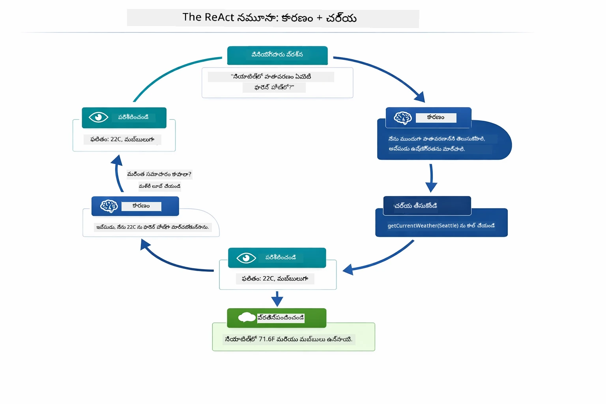

*ReAct చక్రం — ఏజెంట్ ఏం చేయాలనే ఆలోచన, టూల్ పిలుపు ద్వారా చర్య, ఫలిత పరిశీలన, మరియు తుదితిరుగుబాటు ఇవ్వడ వరకు తిరుగుతున్నది.*

ఇది ఆటోమేటిగానే జరుగుతుంది. మీరు టూల్స్ మరియు వాటి వివరణలను నిర్వచిస్తారు. నమూనా ఎప్పుడు మరియు ఎలా వాటిని ఉపయోగించాలో నిర్ణయిస్తుంటుంది.

## టూల్ కాలింగ్ ఎలా పనిచేస్తుంది

### టూల్ నిర్వచనాలు

[WeatherTool.java](../../../04-tools/src/main/java/com/example/langchain4j/agents/tools/WeatherTool.java) | [TemperatureTool.java](../../../04-tools/src/main/java/com/example/langchain4j/agents/tools/TemperatureTool.java)

మీరు స్పష్టమైన వివరణలు మరియు పరామితి స్పెసిఫికేషన్లతో ఫంక్షన్లు నిర్వచిస్తారు. నమూనా ఈ వివరణలను తన సిస్టమ్ ప్రాంప్ట్‌లో చూసి ఏ టూల్ ఏమి చేస్తుందో అర్థం చేసుకుంటుంది.

```java
@Component
public class WeatherTool {
    
    @Tool("Get the current weather for a location")
    public String getCurrentWeather(@P("Location name") String location) {
        // మీ వాతావరణ లుకప్ లాజిక్
        return "Weather in " + location + ": 22°C, cloudy";
    }
}

@AiService
public interface Assistant {
    String chat(@MemoryId String sessionId, @UserMessage String message);
}

// అసిస్టెంట్ స్వయంచాలకంగా Spring Boot ద్వారా వైర్డ్ అవుతుంది:
// - ChatModel బీన్
// - @Component తరగతుల నుండి అన్ని @Tool మెథడ్స్
// - సెషన్ నిర్వహణ కోసం ChatMemoryProvider
```

కింద ఇచ్చిన రూపరేఖ ప్రతి అనోటేషన్‌ను విడగొట్టి చూపుతుంది మరియు ఏ అంచు AIకి టూల్ పిలవడానికి ఎప్పుడు అని, ఏ వాదాలను అందించాలి అన్న విషయాలు ఎలా సహాయపడతాయో వివరిస్తుంది:

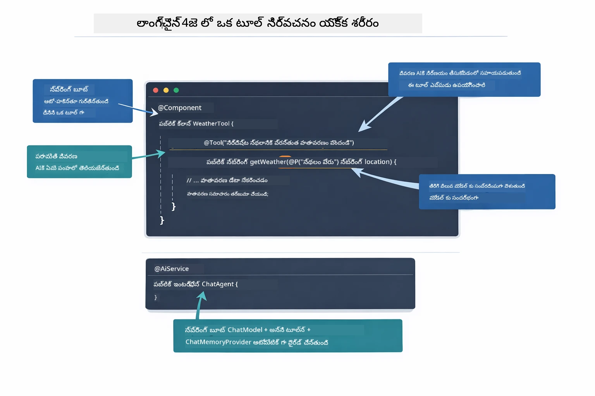

*ఒక టూల్ నిర్వచన శరీరం — @Tool AIకి ఎప్పుడు ఉపయోగించాలో చెప్పుతుంది, @P ప్రతీ పరామితిని వివరిస్తుంది, మరియు @AiService ఆ కార్యాచరణను స్టార్ట్ అప్ లో ఒకసారిగా కలపుతుంది.*

> **🤖 [GitHub Copilot](https://github.com/features/copilot) చాట్ తో ప్రయత్నించండి:** [`WeatherTool.java`](../../../04-tools/src/main/java/com/example/langchain4j/agents/tools/WeatherTool.java) తెరచి అడగండి:
> - "నిజమైన వాతావరణ API (OpenWeatherMap వంటివి)ని మాక్ డేటా బదులుగా ఎలా సమీకరించవచ్చు?"
> - "AIకి సరి అయిన పద్ధతిలో ఉపయోగించేందుకు సహాయపడే మంచి టూల్ వివరణలు ఎలా ఉండాలి?"
> - "API లోపాలు మరియు రేట్ పరిమితులను టూల్ అమలు సమయంలో ఎలా నిర్వహించాలి?"

### సిద్ధాంతం తయారీ

ఒక యూజర్ "సియాటల్‌లో వాతావరణం ఎలా ఉంది?" అని అడగనున్నప్పుడు, నమూనా యాదృచ్ఛికంగా ఆ టూల్‌ను ఎంచుకోదు. యూజర్ ఉద్దేశం ప్రతి టూల్ వివరణతో పోల్చుతుంది, వాడుక సంబంధితత అంపించుకుని ఉత్తమమైనదాన్ని ఎంచుకుంటుంది. ఆపై సరైన పారామితులతో ఫంక్షన్ కాల్‌ను నిర్మిస్తుంది — ఈ సందర్భంలో `location`ను `"Seattle"`గా సెటప్ చేస్తుంది.

యూజర్ అభ్యర్థనకు సరిపడే టూల్ లేకపోతే, నమూనా తన స్వంత పరిజ్ఞానాన్ని ఉపయోగించి సమాధానాన్ని ఇస్తుంది. ఎక్కువ సంఖ్యలో టూల్స్ సరిపోయినప్పుడు, అత్యంత నిర్దిష్టమైనది ఎంచుకుంటుంది.

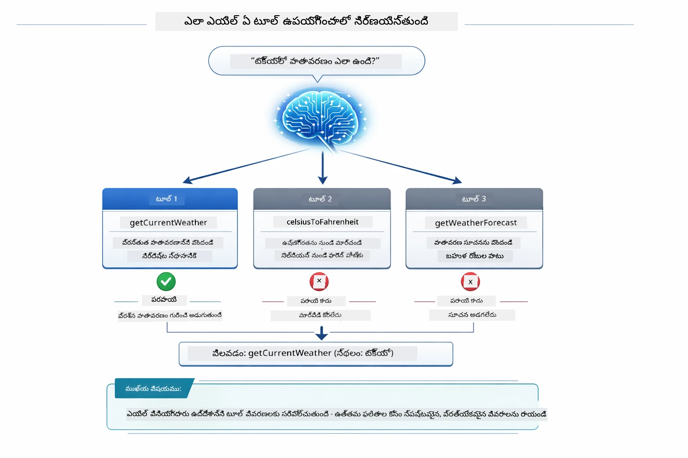

*నమూనా యూజర్ ఉద్దేశంతో అందుబాటులో ఉన్న ప్రతీ టూల్ను అంచనా వేస్తుంది మరియు ఉత్తమాన్ని ఎంచుకుంటుంది — అందుకే స్పష్టమైన, నిర్దిష్టమైన టూల్ వివరణలు ముఖ్యం.*

### నిర్వహణ

[AgentService.java](../../../04-tools/src/main/java/com/example/langchain4j/agents/service/AgentService.java)

స్ప్రింగ్ బూట్ లో `@AiService` డిక్లరేటివ్ ఇంటర్ఫేసును అన్ని నమోదైన టూల్‌లతో ఆటో-వైరింగ్ చేస్తుంది, మరియు LangChain4j ఆటోమాటిగ్గా టూల్ కాల్స్ నిర్వహిస్తుంది. నేపథ్యంలో, పూర్తిగా టూల్ కాల్ ఆరు దశలుగా ప్రవహిస్తుంది — యూజర్ సహజ భాషా ప్రశ్న నుండి సహజ భాషా సమాధానం వరకు:

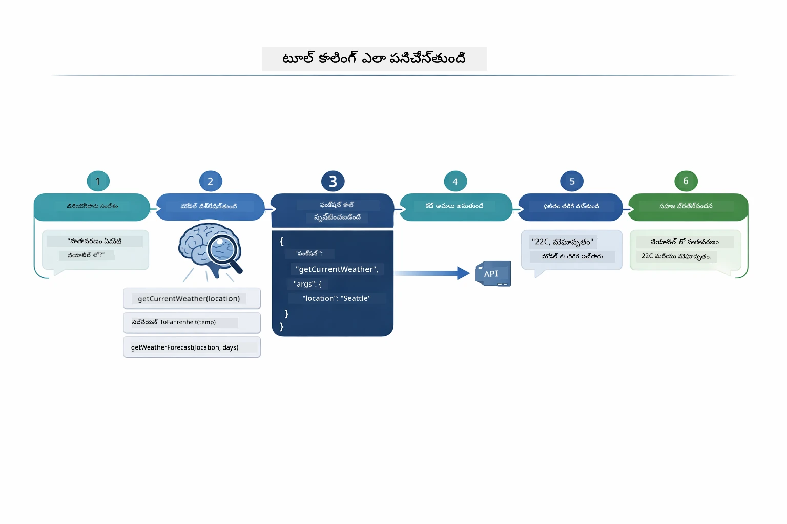

*అంత్యంత ప్రయాణం — యూజర్ ప్రశ్న అడుగుతాడు, నమూనా టూల్ ఎంచుకుంటుంది, LangChain4j దాన్ని అమలు చేస్తోంది, నమూనా ఫలితాన్ని సహజ ప్రతిస్పందనలో కలిపింది.*

> **🤖 [GitHub Copilot](https://github.com/features/copilot) చాట్ తో ప్రయత్నించండి:** [`AgentService.java`](../../../04-tools/src/main/java/com/example/langchain4j/agents/service/AgentService.java) తెరచి అడగండి:
> - "ReAct ప్యాటర్న్ ఎలా పనిచేస్తుంది మరియు AI ఏజెంట్లకు ఇది ఎందుకు సమర్థవంతమైంది?"
> - "ఏజెంట్ ఏ టూల్ ఉపయోగించాలో మరియు ఏ క్రమంలో ఉపయోగించాలో ఎలా నిర్ణయిస్తుంది?"
> - "టూల్ అమలు విఫలమైతే ఏమవుతుంది - లోపాలను బలంగా ఎలా నిర్వహించాలి?"

### ప్రతిస్పందన తయారీ

నమూనా వాతావరణ సమాచారాన్ని అందుకుని యూజర్ కోసం సహజ భాషా ప్రతిస్పందనగా రూపొందిస్తుంది.

### నిర్మాణం: స్ప్రింగ్ బూట్ ఆటో-వైరింగ్

ఈ మాడ్యూల్ LangChain4j యొక్క స్ప్రింగ్ బూట్ ఇంటిగ్రేషన్ ఉపయోగించి డిక్లరేటివ్ `@AiService` ఇంటర్ఫేస్లను వినియోగిస్తుంది. స్టార్ట్ అప్ సమయంలో స్ప్రింగ్ బూట్ ప్రతీ `@Component` (అందులో `@Tool` విధానాలతో), మీ `ChatModel` బీన్, మరియు `ChatMemoryProvider`ని కనుగొని, వాటన్నింటినీ ఒకే `Assistant` ఇంటర్ఫేస్‌లో జత చేస్తుంది, బొయిలర్ ఫ్లేట్ లేకుండా.

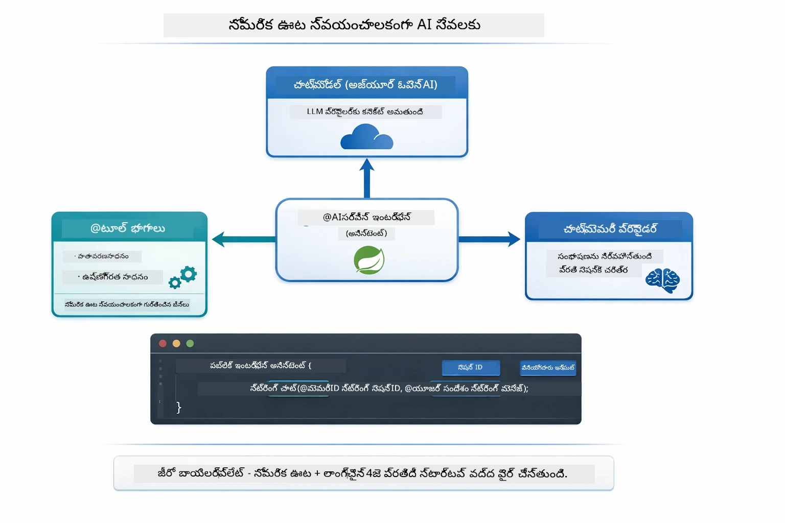

*@AiService ఇంటర్ఫేస్ ChatModel, టూల్ భాగాలు మరియు మెమరీ ప్రొవైడర్‌ని కలిపి — స్ప్రింగ్ బూట్ ఆటోమాటిగ్గా అన్ని వైర్లను నిర్వహిస్తుంది.*

ఈ విధానం యొక్క ప్రధాన లాభాలు:

- **స్ప్రింగ్ బూట్ ఆటో-వైరింగ్** — ChatModel మరియు టూల్స్ ఆటోమేటిక్గా ఇంజెక్ట్ చేయబడతాయి
- **@MemoryId ప్యాటర్న్** — ఆటోమేటిక్ సెషన్-ఆధారిత మెమరీ నిర్వహణ
- **एकే ఉదాహరణ** — అసిస్టెంట్ ఒకసారి సృష్టించి పునఃవినియోగం కోసం
- **టైప్-సురక్షిత అమలు** — Java విధానాలు ప్రత్యక్షంగా టైప్ మార్పిడి తో పిలవబడతాయి
- **బహుళ-తిరుగుబాటు సమన్వయం** — టూల్ కైత్రికరణ ఆటోమాటిగ్గా నిర్వహిస్తుంది
- **బొయిలర్ ఫ్లేట్ లేదు** — మాన్యువల్ `AiServices.builder()` కాల్స్ మరియు మెమరీ HashMap అవసరం లేదు

ప్రత్యామ్నాయ పద్ధతులు (మాన్యువల్ `AiServices.builder()`) ఎక్కువ కోడ్ అవసరం, స్ప్రింగ్ బూట్ ఇంటిగ్రేషన్ లాభాలు మిస్ అవుతాయి.

## టూల్ కైత్రికరణ

**టూల్ కైత్రికరణ** — ఒకే ప్రశ్నకు అనేక టూల్స్ అవసరమైనప్పుడు టూల్-ఆధారిత ఏజెంట్ల అసలైన శక్తి కనపడుతుంది. "సియాటల్‌లో ఫారన్‌హీట్లో వాతావరణం ఎలా ఉంది?" అని అడగండి; ఏజెంట్ ఆటోమాటిగ్గా రెండు టూల్స్‌కు కాల్ చేస్తుంది: మొదట `getCurrentWeather` ను పిలవగా ఉష్ణోగ్రతను సెల్సియస్ లోకు పొందుతుంది, ఆపై ఆ విలువను `celsiusToFahrenheit` కు మార్చడానికి ఇస్తుంది — ఈ రెండు టూల్స్ కాల్స్ ఒకే సంభాషణ తలుపులో జరుగుతాయి.

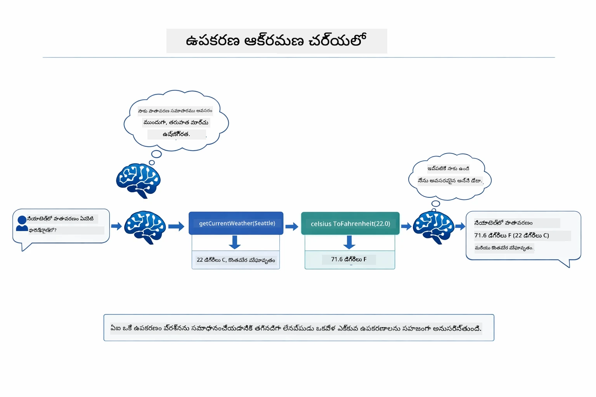

*టూల్ కైత్రికరణ చర్యలో — ఏజెంట్ ముందుగా getCurrentWeather ను పిలుస్తుంది, ఆ తర్వాత సెల్సియస్ ఫలితాన్ని celsiusToFahrenheit కు పంపిస్తుంది, మరియు సమ్మిళిత సమాధానం ఇస్తుంది.*

ఇదే రన్ అవుతున్న అప్లికేషన్‌లో ఇలా ఉంటుంది — ఏజెంట్ ఒకే సంభాషణ తలుపులో రెండు టూల్ కాల్స్ కైత్రికరణ చేస్తుంది:

<a href="images/tool-chaining.png"></a>

*నిజమైన అప్లికేషన్ అవుట్‌పుట్ — ఏజెంట్ ఆటోమాటిగ్గా getCurrentWeather → celsiusToFahrenheit ని ఒకే తలుపులో కట్టిపడేస్తుంది.*

**సౌమ్య నష్టాలు** — మాక్ డేటాలో లేని నగరం వాతావరణం అడగండి. టూల్ లోపం సందేశాన్ని ఇస్తుంది, మరియు AI దానిని సహాయం చేయలేని కారణంగా చెబుతుంది, క్రాష్ అవ్వకుండా. టూల్స్ సురక్షితంగా విఫలవుతుంటాయి.

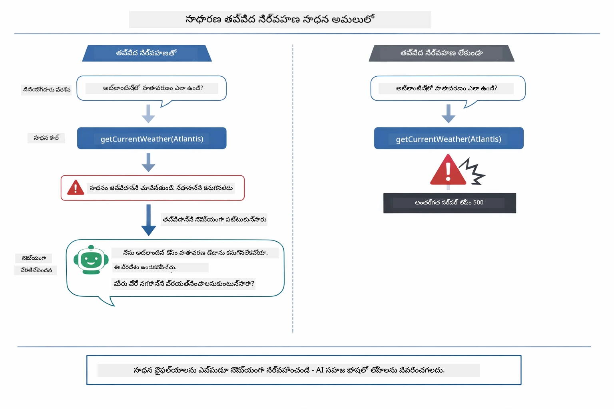

*టూల్ విఫలమైతే, ఏజెంట్ లోపాన్ని పట్టు, క్రాష్ కాకుండా సహాయక వివరణతో ప్రతిస్పందిస్తుంది.*

ఇది ఒకే సంభాషణ తలుపులో జరుగుతుంది. ఏజెంట్ స్వతంత్రంగా అనేక టూల్ కాల్స్ నిర్వహిస్తుంది.

## అప్లికేషన్ నడపండి

**అమర్చినదని నిర్ధారించుకోండి:**

రూట్ డైరెక్టరీలో `.env` ఫైల్ Azure ప్రమాణాలతో ఉంది (Module 01 నడివా సమయంలో సృష్టించబడింది):
```bash
cat ../.env  # AZURE_OPENAI_ENDPOINT, API_KEY, DEPLOYMENT చూపించాలి
```

**అప్లికేషన్ ప్రారంభించండి:**

> **గమనిక:** మీరు Module 01 నుండి `./start-all.sh` ఉపయోగించి ఇప్పటికే అన్ని అప్లికేషన్లను స్టార్ట్ చేశారా, ఈ మాడ్యూల్ ఇప్పటికే పోర్ట్ 8084 మీద నడుస్తోంది. కాబట్టి దిగువ స్టార్ట్ కమాండ్లను మినహాయించండి మరియు నేరుగా http://localhost:8084 కి వెళ్ళండి.

**వికల్పం 1: స్ప్రింగ్ బూట్ డాష్‌బోర్డ్ ఉపయోగించడం (VS Code వినియోగదారులకు సిఫార్సు)**

డెవ్ కంటైనర్ స్ప్రింగ్ బూట్ డాష్‌బోర్డ్ ఎక్స్‌టెన్షన్ కలిగి ఉంది, ఇది అన్ని స్ప్రింగ్ బూట్ అప్లికేషన్లను నిర్వహించడానికి విజువల్ ఇంటర్‌ఫేస్ ఇస్తుంది. మీరు VS Code ఎడమవైపున ఉన్న Activity Bar లో స్ప్రింగ్ బూట్ చిత్రాన్ని చూసే అవకాశం ఉంది.

స్ప్రింగ్ బూట్ డాష్‌బోర్డ్ నుండి మీరు చేయవచ్చు:
- వర్క్‌స్పేస్‌లో అందుబాటులో ఉన్న అన్ని స్ప్రింగ్ బూట్ అప్లికేషన్లు చూడండి
- ఒక క్లిక్ తో అప్లికేషన్లను ప్రారంభించండి / ఆపండి
- అప్లికేషన్ లాగ్స్ ను రియల్-టైమ్ లో చూడండి
- అప్లికేషన్ స్థితిని పర్యవేక్షించండి

"tools" పక్కన ఉన్న ప్లే బటన్‌ను క్లిక్ చేస్తే ఈ మాడ్యూల్ ప్రారంభమవుతుంది, లేదా అన్ని మాడ్యూల్స్‌ను ఒకేసారి ప్రారంభించవచ్చు.


**వికల్పం 2: షెల్ స్క్రిప్ట్‌లు ఉపయోగించడం**

మొత్తం వెబ్ అప్లికేషన్లను ప్రారంభించండి (మాడ్యూల్స్ 01-04):

**బాష్:**
```bash
cd ..  # రూట్ డైరెక్టరీ నుండి
./start-all.sh
```

**పవర్‌షెల్:**
```powershell
cd ..  # రూట్ డైరెక్టరీ నుండి
.\start-all.ps1
```

లేదా కేవలం ఈ మాడ్యూల్ను ప్రారంభించండి:

**బాష్:**
```bash
cd 04-tools
./start.sh
```

**పవర్‌షెల్:**
```powershell
cd 04-tools
.\start.ps1
```

రెండూ స్క్రిప్ట్‌లు ఆటోమాటిగ్గా రూట్ `.env` నుండి ఎన్విరాన్‌మెంట్ వేరియబుల్స్‌ను లోడ్ చేస్తాయి మరియు JARs లేవంటే నిర్మిస్తాయి.

> **గమనిక:** మీరు ప్రారంభించే ముందు అన్ని మాడ్యూల్స్‌ను గానీ క్రమంగా గానీ మాన్యువల్‌గా నిర్మించాలనుకుంటే:
>
> **బాష్:**
> ```bash
> cd ..  # Go to root directory
> mvn clean package -DskipTests
> ```
>
> **పవర్‌షెల్:**
> ```powershell
> cd ..  # Go to root directory
> mvn clean package -DskipTests
> ```

మీ బ్రౌజర్‌లో http://localhost:8084ని ఓపెన్ చేయండి.

**ఆపాలంటే:**

**బాష్:**
```bash
./stop.sh  # ఈ మాడ్యూల్ మాత్రమే
# లేదా
cd .. && ./stop-all.sh  # అన్ని మాడ్యూల్స్
```

**పవర్‌షెల్:**
```powershell
.\stop.ps1  # ఈ మాడ్యూల్ మాత్రమే
# లేదా
cd ..; .\stop-all.ps1  # అన్ని మాడ్యూల్స్
```

## అప్లికేషన్ ఉపయోగించడం

అప్లికేషన్ ఒక వెబ్ ఇంటర్‌ఫేస్ అందిస్తుంది, ఇక్కడ మీరు వాతావరణ మరియు ఉష్ణోగ్రత మార్పిడి టూల్స్‌కి యాక్సెస్ ఉన్న AI ఏజెంట్‌తో సహకరించవచ్చు.

<a href="images/tools-homepage.png"></a>

*AI ఏజెంట్ టూల్స్ ఇంటర్‌ఫేస్ - టూల్స్‌తో ఇంటరాక్ట్ అవ్వడానికి త్వరిత ఉదాహరణలు మరియు చాట్ ఇంటర్‌ఫేస్*

### సాధారణ టూల్ వినియోగాన్ని ప్రయత్నించండి
సరళమైన అభ్యర్థనతో ప్రారంభించండి: "100 డిగ్రీల ఫారెన్‌హీట్‌ను సెల్సియస్‌గా మార్చండి". ఏజెంట్ तापం మార్పిడి టూల్ అవసరమని గుర్తించి, సరైన పరామితులతో దాన్ని పిలుస్తుంది మరియు ఫలితాన్ని అందిస్తుంది. మీరు ఎవరూ ఏ టూల్ ఉపయోగించాలో లేదా దానిని ఎలా పిలవాలో స్పష్టంగా చెప్పలేదని గమనించండి - ఇది ఎంత సహజంగా అనిపిస్తోంది.

### టూల్ చైనింగ్ పరీక్ష

ఇప్పుడు కాస్త క్లిష్టమైనది ప్రయత్నించండి: "సియాటెల్‌లో వాతావరణం ఏమిటి మరియు దాన్ని ఫారెన్‌హైట్‌కు మార్చండి?" ఏజెంట్ దీనిని దశల వారీగా చేయడం గమనించండి. మొదట అది వాతావరణాన్ని పొందుతుంది (సెల్సియస్‌లో ఇస్తుంది), ఫారెన్‌హైట్‌కి మార్చుకోవలసిందని గుర్తించి మార్పిడి టూల్‌ని పిలుస్తుంది, ఆ రెండు ఫలితాలను కలిపి ఒక సమాధానం అందిస్తుంది.

### సంభాషణ ప్రవాహం చూడండి

చాట్ ఇంటర్‌ఫేస్ సంభాషణ చరిత్రని నిర్వహిస్తుంది, ఇది మీరు బహుళ బార్లు సంభాషణలు జరగడానికి అనుమతిస్తుంది. మీరు అన్ని గత ప్రశ్నలు మరియు సమాధానాలను చూడవచ్చు, ఇది సంభాషణను అనుసరించడంలో మరియు ఏజెంట్ ఎలా బహుళ మార్పిడులలో సందర్భాన్ని సృష్టించిందో అర్థం చేసుకోవడంలో సులభతరంగా చేస్తుంది.

<a href="images/tools-conversation-demo.png"></a>

*సరళమైన మార్పులతో, వాతావరణ లుక్‌అప్స్ మరియు టూల్ చైనింగ్ లోబడి ఉన్న బహుళ బార్ సంభాషణ*

### వేర్వేరు అభ్యర్థనలతో ప్రయోగించండి

వివిధ సమ్మేళనాలను ప్రయత్నించండి:
- వాతావరణ పరిశీలనలు: "టోక్యోలో వాతావరణం ఎలా ఉంది?"
- ఉష్ణోగ్రత మార్పిడి: "25°C ని కెల్విన్‌లో ఎంత?"
- సమ్మిళిత ప్రశ్నలు: "పారిస్‌లో వాతావరణం పరీక్షించండి, అది 20°C కు పైగా ఉందా అని చెప్పండి"

ఏజెంట్ సహజ భాషను ఎలా భావించగలడో మరియు అనువైన టూల్ పిలుపులకు ఎలా మ్యాప్ చేయగలడో గమనించండి.

## ముఖ్య భావాలు

### ReAct પેટર્ન (తర్జుమా మరియు చర్య)

ఏజెంట్ తర్జుమా (ఏం చేయాలో నిర్ణయించడం) మరియు చర్య (టూల్స్ ఉపయోగించడం) మధ్య మార్పిడి చేస్తుంది. ఈ પેટర్న్ స్వయం నిర్వహించే సమస్య పరిష్కారానికే సరిపోతుంది, కేవలం సూచనలకు ప్రతిస్పందించడం కాకుండా.

### టూల్ వివరణల ముఖ్యం

మీ టూల్ వివరణల నాణ్యత ఏజెంట్ వాటిని ఎంత బాగా ఉపయోగించగలదో నేరుగా ప్రభావితం చేస్తుంది. క్లియర్, నిర్దిష్ట వివరణలు మోడల్ ఏ టూల్ ఎప్పుడు మరియు ఎలా పిలవాలో అర్థం చేసుకోవడంలో సహాయం చేస్తాయి.

### సెషన్ నిర్వహణ

`@MemoryId` అనోటేషన్ స్వయంచాలక సెషన్-ఆధారిత మెమరీ నిర్వహణను సాధ్యమవుతుంది. ప్రతి సెషన్ IDకి దాని సొంత `ChatMemory` ఉదాహరణ ఉంటుంది, ఇది `ChatMemoryProvider` బీన్ ద్వారా నిర్వహించబడుతుంది, కాబట్టి బహుళ వినియోగదారులు ఏజెంట్‌తో సమాంతరంగా సంభాషించేటపుడు వారి సంభాషణలు కలవకుండా ఉంటాయి.

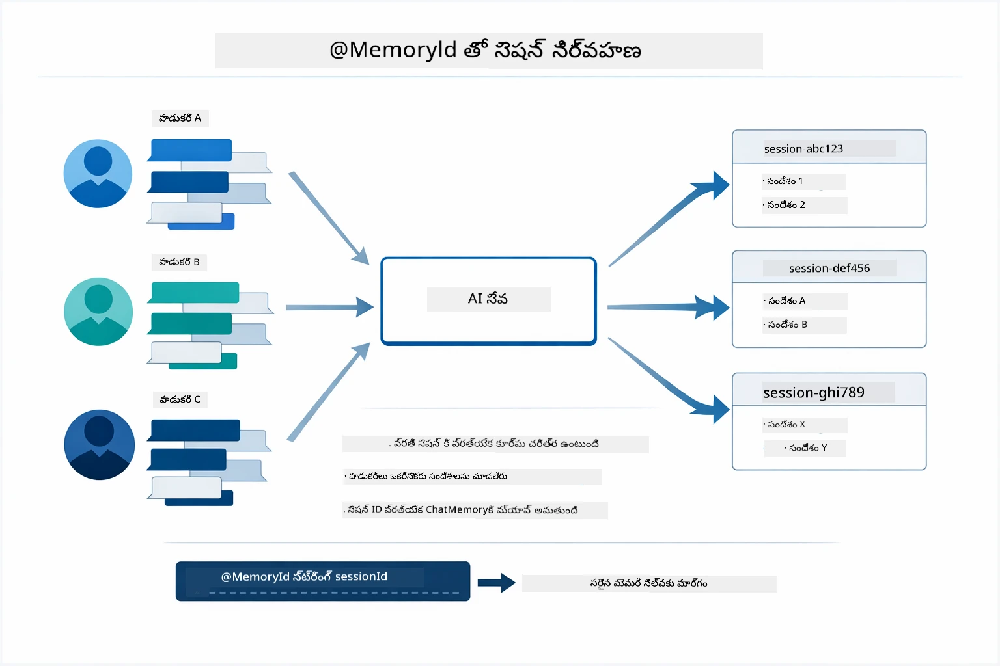

*ప్రతి సెషన్ ID ఒక వేరే సంభాషణ చరిత్రకు మ్యాప్ అవుతుంది — వినియోగదారులు పరస్పర సందేశాలను ఎప్పుడూ కనబడరు.*

### లోపాల నిర్వహణ

టూల్స్ వైఫల్యం చెందవచ్చు — APIs సమయం ముగియవచ్చు, పరామితులు తప్పుగా ఉండవచ్చు, బయటి సేవలు నిలిచిపోవచ్చు. ప్రొడక్షన్ ఏజెంట్లు లోపాల నిర్వహణ అవసరం, దాని వల్ల మోడల్ సమస్యలను వివరించగలదు లేదా ఇతర మార్గాలు ప్రయత్నించగలదు, మొత్తం యాప్లికేషన్ క్రాష్ కాకుండా. ఒక టూల్ ఎక్స్‌సెప్షన్ వేసినప్పుడు, LangChain4j దాన్ని పట్టుకొని లోప సందేశాన్ని మోడల్‌కు పంపుతుంది, తద్వారా అది సహజ భాషలో సమస్యను వివరించగలదు.

## అందుబాటులో ఉన్న టూల్స్

కింద ఉన్న చిత్రంలో మీరు నిర్మించగల సాధారణ టూల్స్ యొక్క విస్తృత ఎకోసిస్టమ్ చూపబడింది. ఈ మాడ్యూల్ వాతావరణం మరియు ఉష్ణోగ్రత టూల్స్‌ని చూపిస్తుంది, కానీ అదే `@Tool` પેટర్న్ ఏ Java మెతడ్స్‌కు సరిపోతుంది — డేటాబేస్ ప్రశ్నల నుండి చెల్లింపు ప్రాసెసింగ్ వరకు.

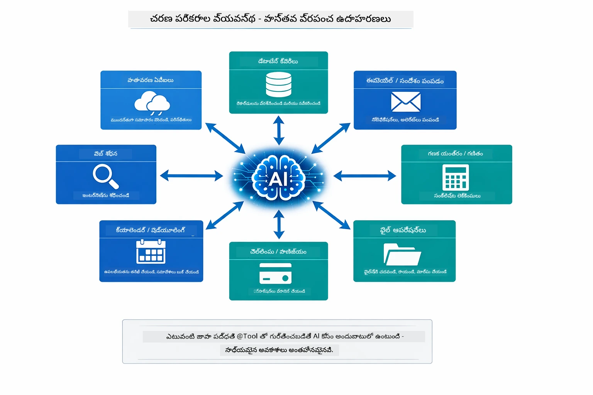

*పైకి `@Tool` తో గుర్తించబడ్డ ఏ Java మెతడ్స్ AIకి అందుబాటులో ఉంటాయి — પેટర్న్ డేటాబేస్‌లు, APIs, ఇమెయిల్, ఫైల్ ఆపరేషన్స్ మరియు మరిన్ని వరకు విస్తరించబడుతుంది.*

## టూల్ ఆధారిత ఏజెంట్లు ఉపయోగించాల్సినప్పుడు

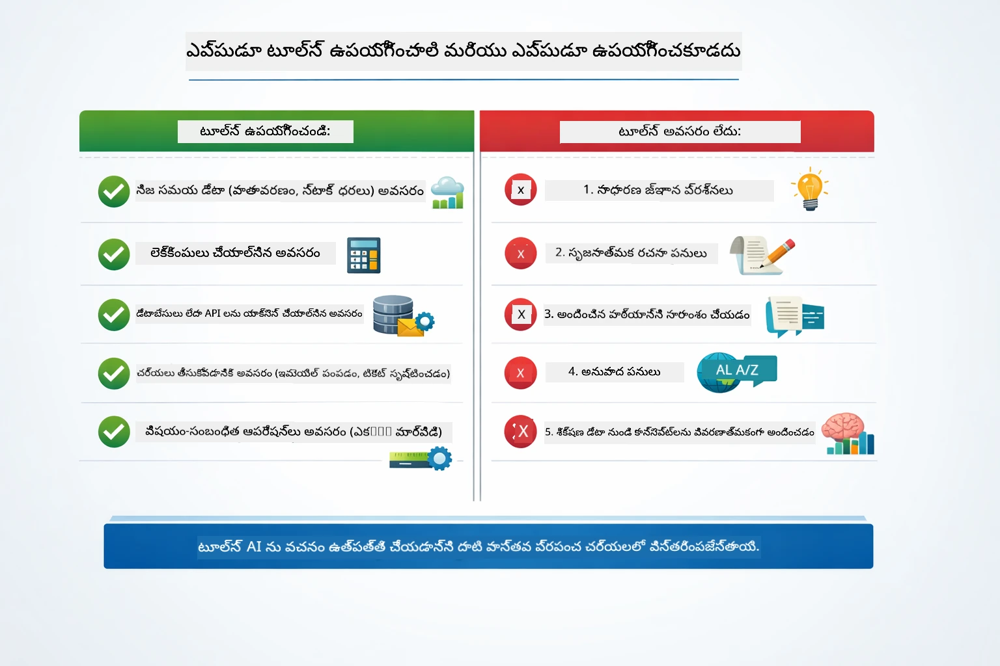

*త్వరిత నిర్ణయ మార్గదర్శకము — టూల్స్ రియల్టైమ్ డేటా, లెక్కింపుల, మరియు చర్యలకే; సాధారణ జ్ఞానం మరియు సృజనాత్మక పనులకు అవి అవసరం కాదు.*

**ఉపయోగించండి టూల్స్:**
- సమాధానానికి రియల్టైమ్ డేటా అవసరం ఉన్నప్పుడు (వాతావరణం, స్టాక్ ధరలు, ఇన్వెంటరీ)
- సరళ గణితం కంటే కష్టమైన లెక్కింపులు చేయవలసినప్పుడు
- డేటాబేస్‌లు లేదా APIs యాక్సెస్ చేసేటప్పుడు
- చర్యలు తీసుకోవలసినప్పుడు (ఇమెయిల్లు పంపడం, టికెట్లు సృష్టించడం, రికార్డులు నవీకరించడం)
- బహుళ డేటా మూలాలను ఏకీకృతం చేయాల్సినప్పుడు

**ఉపయోగించకండి టూల్స్:**
- ప్రశ్నలకు సాధారణ జ్ఞానం ఆధారంగా సమాధానం ఇవ్వవచ్చు
- ప్రతిస్పందన పూర్తిగా సంభాషణాత్మకం మాత్రమే
- టూల్ లేటెన్సీ అనుభవాన్ని నెమ్మదిగా చేయగలదు

## టూల్స్ vs RAG

మాడ్యూలులు 03 మరియు 04 రెండూ AI సామర్థ్యాన్ని విస్తరిస్తాయి, కానీ సారూప్యంగా కాకుండా. RAG మోడల్‌కు **జ్ఞానాన్ని** డాక్యుమెంట్లను తెచ్చే ద్వారా అందిస్తుంది. టూల్స్ మోడల్‌కు **చర్యలు** చేపట్టడానికి ఫంక్షన్‌లను పిలవడానికి సామర్థ్యాన్ని ఇస్తుంది.

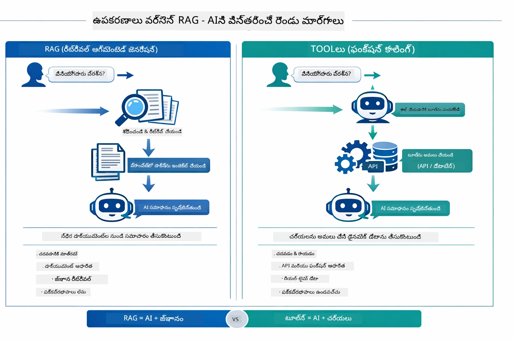

*RAG స్థిరమైన డాక్యుమెంట్ల నుంచి సమాచారం తెస్తుంది — టూల్స్ చర్యలు అమరవేస్తాయి మరియు గడిచిపోయి, రియల్టైమ్ డేటాను తీసుకొస్తాయి. అనేక ప్రొడక్షన్ సిస్టమ్లు రెండింటినీ కలుపుకుంటాయి.*

ప్రాయోగికంగా అనేక ప్రొడక్షన్ సిస్టమ్లు ఇద్దరిని కలుపుకుంటాయి: RAG మీ డాక్యుమెంటేషన్‌లో సమాధానాలను స్థిరపడించడానికి, టూల్స్ లైవ్ డేటా తీసుకోవడానికి లేదా ఆపరేషన్లు చేయడానికి.

## తదుపరి దశలు

**తదుపరి మాడ్యూల్:** [05-mcp - మోడల్ కాంటెక్స్ట్ ప్రోటోకాల్ (MCP)](../05-mcp/README.md)

---

**నావిగేషన్:** [← ముందు: మాడ్యూల్ 03 - RAG](../03-rag/README.md) | [ప్రధాన صفحాకు తిరిగి](../README.md) | [తదుపరి: మాడ్యూల్ 05 - MCP →](../05-mcp/README.md)

---

<!-- CO-OP TRANSLATOR DISCLAIMER START -->
**నిబంధనలు**:
ఈ పత్రాన్ని AI అనువాద సేవ [Co-op Translator](https://github.com/Azure/co-op-translator) ఉపయోగించి అనువదింపు చేయబడింది. మేము ఖచ్చితత్వానికి ప్రయత్నించినప్పటికీ, స్వయంచాలక అనువాదాలలో లోపాలు లేదా తప్పులుంటాయని గమనించండి. మాతృభాషలో ఉన్న అసలు పత్రం అధికారం కలిగిన మూలంగా భావించాలి. కీలక సమాచారం కోసం, నిపుణుల మానవ అనువాదాన్ని సూచించబడుతుంది. ఈ అనువాదం వాడకంలో ఉన్న ఏదైనా అపార్థాలు లేదా తప్పుగా అర్ధం చేసుకోవడంపై మేము బాధ్యత వహించము.
<!-- CO-OP TRANSLATOR DISCLAIMER END -->