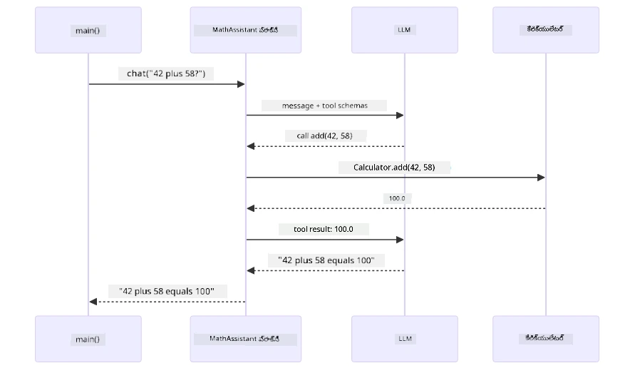
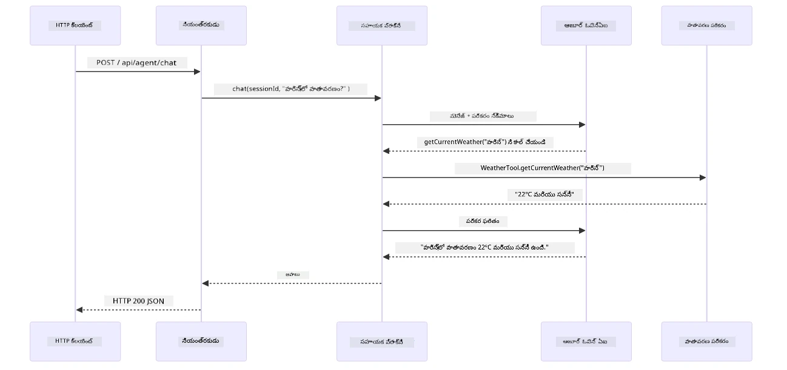

# మాడ్యూల్ 04: టూల్స్ తో AI ఏజెంట్లు

## కంటెంట్ పట్టిక

- [వీడియో వాక్‌థ్రూ](../../../04-tools)
- [మీరు నేర్చుకోనున్నవి](../../../04-tools)
- [ముందస్తు అవసరాలు](../../../04-tools)
- [టూల్స్ తో AI ఏజెంట్లను అర్థం చేసుకోవడం](../../../04-tools)
- [టూల్ కాలింగ్ ఎలా పనిచేస్తుంది](../../../04-tools)
  - [టూల్ నిర్వచనాలు](../../../04-tools)
  - [సিদ্ধాంత నిర్ణయం](../../../04-tools)
  - [నిర్వాహణ](../../../04-tools)
  - [స్పందన విడుదల](../../../04-tools)
  - [ఆర్కిటెక్చర్: స్ప్రింగ్ బూట్ ఆటో-వైరింగ్](../../../04-tools)
- [టూల్ చైనింగ్](../../../04-tools)
- [అప్లికేషన్ నడిపించండి](../../../04-tools)
- [అప్లికేషన్ ఉపయోగించడం](../../../04-tools)
  - [సరళ టూల్ వినియోగం ప్రయత్నించండి](../../../04-tools)
  - [టెస్టు టూల్ చైనింగ్](../../../04-tools)
  - [సమావేయం ప్రవాహం చూడండి](../../../04-tools)
  - [వివిధ అభ్యర్థనలతో ప్రయోగం చేయండి](../../../04-tools)
- [ప్రధాన సూత్రాలు](../../../04-tools)
  - [ReAct నమూనా (తర్కాన్విత చర్యలు)](../../../04-tools)
  - [టూల్ వివరణలు ముఖ్యమైనవి](../../../04-tools)
  - [సెషన్ నిర్వహణ](../../../04-tools)
  - [పొరపాట్ల హ్యాండ్లింగ్](../../../04-tools)
- [లభ్యమయ్యే టూల్స్](../../../04-tools)
- [ఎప్పుడు టూల్-ఆధారిత ఏజెంట్లు ఉపయోగించాలి](../../../04-tools)
- [టూల్స్ vs RAG](../../../04-tools)
- [తరవాతి దశలు](../../../04-tools)

## వీడియో వాక్‌థ్రూ

ఈ మాడ్యూల్‌ను ప్రారంభించడం ఎలా అన్నది వివరించే లైవ్ సెషన్ చూడండి:

<a href="https://www.youtube.com/watch?v=O_J30kZc0rw"></a>

## మీరు నేర్చుకోనున్నవి

ఇప్పటి వరకు మీరు AI తో సంభాషణలు ఎలా చేయాలో, ప్రాంప్ట్స్‌ను ప్రభావవంతంగా ఎలా నిర్మించాలో, మరియు మీ డాక్యుమెంట్లలో ఆధారంగా సమాధానాలు ఎలా ఇవ్వాలో నేర్చుకున్నారు. కానీ వుందని ఒక బహుళమైన పరిమితి ఉంది: భాషా మోడల్స్ కేవలం టెక్స్ట్‌ను మాత్రమే ఉత్పత్తి చేయగలవు. అవి వాతావరణం తనిఖీ చేయడం, లెక్కలు చేయడం, డేటాబేస్‌లను దరఖాస్తు చేయడం, లేదా బాహ్య వ్యవస్థలతో పరస్పర చర్య చేయలేవు.

టూల్స్ దీన్ని మార్చేస్తాయి. మోడల్‌కు కాల్ చేయడానికి ఫంక్షన్లను ఇచ్చి, మీరు దాన్ని టెక్స్ట్ ఉత్పత్తిదారుడి నుండి చర్యలు చేయగల ఏజెంట్‌గా మారుస్తారు. మోడల్ ఎప్పుడు టూల్ అవసరం ఉందో, ఏ టూల్ ఉపయోగించాలో, మరియు ఏ పరామితులు పంపాలో నిర్ణయిస్తుంది. మీ కోడ్ ఆ ఫంక్షన్‌ను అమలు చేస్తుంది మరియు ఫలితాన్ని తిరిగి ఇస్తుంది. మోడల్ ఆ ఫలితాన్ని తన స్పందనలో చేర్చుతుంది.

## ముందస్తు అవసరాలు

- పూర్తి చేసిన [మాడ్యూల్ 01 - పరిచయం](../01-introduction/README.md) (Azure OpenAI వనరులు అమర్చబడ్డాయి)
- సూచించిన మునుపటి మాడ్యూల్స్ పూర్తి చేసినవి (ఈ మాడ్యూల్ టూల్స్ vs RAG నుండి [RAG కాన్సెప్ట్‌లు మాడ్యూల్ 03 నుండి](../03-rag/README.md) సూచిస్తుంది)
- రూట్ డైరెక్టరీలో `.env` ఫైల్ Azure సర్టిఫికెట్లతో (Module 01 లో `azd up` ద్వారా సృష్టించబడింది)

> **గమనిక:** మాడ్యూల్ 01 పూర్తి చేయకపోయినట్లయితే, మొదట అక్కడని అమరణ సూచనలను అనుసరించండి.

## టూల్స్ తో AI ఏజెంట్లను అర్థం చేసుకోవడం

> **📝 గమనిక:** ఈ మాడ్యూల్లో "ఏజెంట్లు" పదం టూల్-కాలింగ్ సామర్థ్యాలతో ఇంకా మెరుగుపర్చబడిన AI అసిస్టెంట్లను సూచిస్తుంది. ఇది [మాడ్యూల్ 05: MCP](../05-mcp/README.md) లో మేము కవర్ చేసే **Agentic AI** నమూనాల నుండి వేరుగా ఉంటుంది (స్వతంత్ర ఏజెంట్లు, ప్లానింగ్, మెమరీ మరియు బహుళ-దశ తర్కం).

టూల్స్ లేకపోతే, ఒక భాషా మోడల్ కేవలం తన సెర్చిత డేటా నుండి టెక్స్ట్ ఉత్పత్తి చేయగలదు. ప్రస్తుత వాతావరణాన్ని అడగండి, అది ఊహించాల్సి ఉంటుంది. టూల్స్ ఇచ్చినప్పుడు, అది వాతావరణ API కాల్ చేయగలదు, లెక్కలు చేయవచ్చు, లేదా డేటాబేస్‌ను ప్రశ్నించవచ్చు — ఆ నిజ ఫలితాలను తన ప్రతిస్పందనలో చేర్చుతుంది.


*టూల్స్ లేకపోతే మోడల్ ఊహించాలి — టూల్స్ ఉన్నప్పుడు ఇది APIs కాల్ చేయగలదు, లెక్కలు నిర్వహించగలదు, మరియు రియల్-టైమ్ డేటా అందించగలదు.*

ఒక టూల్స్ తో AI ఏజెంట్ **తర్కం మరియు చర్య (ReAct)** నమూనాను అనుసరిస్తుంది. మోడల్ కేవలం ప్రతిస్పందించదు — అది ఏమి అవసరమో ఆలోచిస్తుంది, టూల్ కాలింగ్ ద్వారా చర్య తీసుకుంటుంది, ఫలితాన్ని పరిశీలిస్తుంది, ఆపై మరలా చర్య తీసుకోవాలా లేదా ఫైనల్ సమాధానం ఇవ్వాలా నిర్ణయించుకుంటుంది:

1. **తర్కం** — ఏజెంట్ వినియోగదారు ప్రశ్నను విశ్లేషించి అవసరమైన సమాచారాన్ని నిర్ధారిస్తుంది  
2. **చర్య** — ఏజెంట్ సరైన టూల్ ఎంచుకొని, సరైన పారామితులను రూపొందించి కాల్ చేస్తుంది  
3. **పరిశీలన** — ఏజెంట్ టూల్ ఔట్పుట్‌ని పొందించి ఫలితాన్ని అంచనా వేస్తుంది  
4. **పునర్వంధన లేదా స్పందన** — మరింత డేటా అవసరమైతే, ఏజెంట్ తిరిగి ఇస్తుంది; లేకపోతే సహజ భాషలో సమాధానం తయారుచేస్తుంది  


*ReAct చక్రం — ఏజెంట్ ఏం చేయాలో తర్కం, టూల్‌ను కాల్ చేసి చర్య, ఫలితాన్ని పరిశీలన, మరియు ఫైనల్ సమాధానం ఇవ్వగలిగే వరకూ పునరావృతం.*

ఇది స్వయంచాలకంగా జరుగుతోంది. మీరు టూల్స్ మరియు వాటి వివరణలు నిర్వచిస్తారు. మోడల్ ఎప్పుడు, ఎలా ఉపయోగించాలో నిర్ణయాన్ని తగిలిస్తుంది.

## టూల్ కాలింగ్ ఎలా పనిచేస్తుంది

### టూల్ నిర్వచనాలు

[WeatherTool.java](../../../04-tools/src/main/java/com/example/langchain4j/agents/tools/WeatherTool.java) | [TemperatureTool.java](../../../04-tools/src/main/java/com/example/langchain4j/agents/tools/TemperatureTool.java)

మీరు స్పష్టమైన వివరణలు మరియు పారామీటర్ వివరాలతో ఫంక్షన్లను నిర్వచిస్తారు. మోడల్ ఈ వివరణలను తన సిస్టమ్ ప్రాంప్ట్‌లో చూస్తుంది మరియు ప్రతి టూల్ ఏమి చేస్తుందో అర్థం చేసుకుంటుంది.

```java
@Component
public class WeatherTool {
    
    @Tool("Get the current weather for a location")
    public String getCurrentWeather(@P("Location name") String location) {
        // మీ వాతావరణ లుకప్ లాజిక్
        return "Weather in " + location + ": 22°C, cloudy";
    }
}

@AiService
public interface Assistant {
    String chat(@MemoryId String sessionId, @UserMessage String message);
}

// అసిస్ట్ Spring Boot ద్వారా ఆటోమేటిక్‌గా వైర్డ్ చేయబడింది:
// - ChatModel బీన్
// - @Component క్లాసుల నుండి అన్ని @Tool మেথడ్లు
// - సెషన్ నిర్వహణ కోసం ChatMemoryProvider
```
  
కింద డాగ్రామ్ ప్రతి అనోటేషన్‌ను పగలబెడుతుంది మరియు AI టూల్‌ను ఎప్పుడు కాల్ చేయాలో, ఎలాంటి ఆర్గ్యుమెంట్లను పంపాలో అర్థం చేసుకోవడంలో ఏ విధంగా సహాయం చేస్తుందో చూపిస్తుంది:


*టూల్ నిర్వచన నిర్మాణం — @Tool AI కి ఎప్పుడు ఉపయోగించాలో సూచిస్తుంది, @P ప్రతి పారామీటర్‌ని వివరిస్తుంది, మరియు @AiService స్టార్టప్లో అంతింటినీ సకాలంలో వైర్ చేస్తుంది.*

> **🤖 [GitHub Copilot](https://github.com/features/copilot) చాట్‌తో ప్రయత్నించండి:** [`WeatherTool.java`](../../../04-tools/src/main/java/com/example/langchain4j/agents/tools/WeatherTool.java) తెరవండి మరియు అడగండి:  
> - " реальные వాతావరణ API గా OpenWeatherMap ని మాక్ డేటా బదులు ఎలా ఇంటిగ్రేట్ చేయండి?"  
> - "ఏరి AI టూల్ ని సరిగ్గా ఉపయోగించేందుకు మంచి టూల్ వివరణ ఏమి కావాలి?"  
> - "టూల్ అమల్‌లో API పొరపాట్లు మరియు రేట్ పరిమితులు ఎలా హ్యాండిల్ చేయాలి?"

### సిద్ధాంత నిర్ణయం

వినియోగదారు "సియాటిల్‌లో వాతావరణం ఎలా ఉంది?" అని అడగగా, మోడల్ యాదృచ్చికంగా టూల్ ఎంచుకోదు. ఇది వినియోగదారు ఉద్దేశాన్ని అందుబాటులో ఉన్న ప్రతి టూల్ వివరణతో పోల్చి, సంబంధిత స్కోర్ ఇస్తుంది మరియు ఉత్తమ మ్యాచ్ ఎంచుకుంటుంది. ఆపై సరైన పారామితులతో నిర్మితమైన ఫంక్షన్ కాల్‌ను రూపొందిస్తుంది — ఈ సందర్భంలో `location` ను `"Seattle"` గా సెట్ చేస్తుంది.

వినియోగదారు అభ్యర్థనకు ఏ ٹూల్ సరిపోదంటే, మోడల్ తన స్వంత జ్ఞానంతో సమాధానం ఇస్తుంది. పలు టూల్స్ సరిపోతేనయితే, అత్యంత ప్రత్యేకమైనదాన్ని ఎంచుకుంటుంది.


*మోడల్ ప్రతి అందుబాటులో ఉన్న టూల్‌ను వినియోగదారు ఉద్దేశానికి ఎదురుగా అంచనా వేస్తుంది మరియు ఉత్తమ మ్యాచ్ను ఎన్నుకుంటుంది — అందుచేత స్పష్టమైన, నిర్దిష్ట టూల్ వివరణలు చాలా ముఖ్యం.*

### నిర్వహణ

[AgentService.java](../../../04-tools/src/main/java/com/example/langchain4j/agents/service/AgentService.java)

స్ప్రింగ్ బూట్ డిక్లరేటివ్ `@AiService` ఇంటర్‌ఫేస్ను అన్ని రిజిస్టర్ అయిన టూల్స్‌తో ఆటో-వైరింగ్ చేస్తుంది, మరియు LangChain4j టూల్ కాల్స్ ని ఆటోమేటిక్ గా అమలు చేస్తుంది. వాడుకరి సహజ భాషా ప్రశ్న నుండి సహజ భాష సమాధానం వరకు సంపూర్ణ టూల్ కాల్ ఆరు దశల్లో సాగుతుంది:


*పూర్తి ప్రవాహం — వాడుకరి ప్రశ్న అడుగుతాడు, మోడల్ టూల్ ఎంచుకుంటుంది, LangChain4j దాన్ని అమలు చేస్తుంది, మోడల్ ఫలితాన్ని సహజ భాషా ప్రతిస్పందనలో చేర్చుతుంది.*

మీరు మాడ్యూల్ 00లో [ToolIntegrationDemo](../../../00-quick-start/src/main/java/com/example/langchain4j/quickstart/ToolIntegrationDemo.java) నడిపించి ఉంటే, మీరు ఇదే నమూనాను చూశారు — `Calculator` టూల్స్ కూడా ఇదే విధంగా కాల్ చేయబడ్డాయి. క్రింది సీక్వెన్స్ డయాగ్రామ్ లో ఆ డెమోలో ఏమి జరిగిందో కచ్చితంగా చూపిస్తుంది:



*క్విక్ స్టార్ట్ డెమోలో టూల్-కాల్ లూప్ — `AiServices` మీ సందేశం మరియు టూల్ స్కీమాలను LLM కి పంపుతుంది, LLM `add(42, 58)` వంటి ఫంక్షన్ కాల్ తో సమాధానం ఇస్తుంది, LangChain4j లోకల్ గా `Calculator` విధానాన్ని అమలు చేస్తుంది, ఫలితాన్ని తిరిగి అర్థం చేసుకొని చివరి సమాధానానికి ఉపయోగిస్తుంది.*

> **🤖 [GitHub Copilot](https://github.com/features/copilot) చాట్‌తో ప్రయత్నించండి:** [`AgentService.java`](../../../04-tools/src/main/java/com/example/langchain4j/agents/service/AgentService.java) తెరవండి మరియు అడగండి:  
> - "ReAct నమూనా ఎలా పనిచేస్తుంది మరియు AI ఏజెంట్లు దానికి ఎందుకు సమర్ధవంతంగా ఉన్నారు?"  
> - "ఏజెంట్ ఏ టూల్ ఎంచుకోవాలో, ఎలాంటి క్రమంలో ఉపయోగించాలో ఎలా నిర్ణయిస్తాడు?"  
> - "టూల్ అమలు విఫలం కాకపోతే ఏం జరుగుతుంది - పొరపాట్లను పటిష్టంగా ఎలా హ్యాండిల్ చేయాలి?"

### స్పందన విడుదల

మోడల్ వాతావరణ డేటాను అందుకొని దానిని సహజ భాషా ప్రతిస్పందనగా వినియోగదారుని కోసం మాడ్జులేట్ చేస్తుంది.

### ఆర్కిటెక్చర్: స్ప్రింగ్ బూట్ ఆటో-వైరింగ్

ఈ మాడ్యూల్ LangChain4j యొక్క స్ప్రింగ్ బూట్ ఇంటిగ్రేషన్ ను `@AiService` డిక్లరేటివ్ ఇంటర్‌ఫేస్లతో ఉపయోగిస్తుంది. స్టార్టప్ లో స్ప్రింగ్ బూట్ ప్రతి `@Component` జాబితా చేసిన `@Tool` పద్ధతులతో పాటు మీ `ChatModel` బీన్, మరియు `ChatMemoryProvider` చూడగలదు — అప్పుడు అన్ని వాటిని ఒకే `Assistant` ఇంటర్‌ఫేసులో బహుళ కోడ్ లేకుండా వైర్ చేస్తుంది.


*@AiService ఇంటర్‌ఫేస్ చాట్‌మోడల్, టూల్ భాగాలు మరియు మెమరీ ప్రొవైడర్‌ను కలిపి స్ప్రింగ్ బూట్ అన్ని వైరింగ్‌ను ఆటోమేటిక్ గా నిర్వహిస్తుంది.*

క్రింది పూర్తి అభ్యర్థన జీవిత చక్రాన్ని సీక్వెన్స్ డయాగ్రామ్‌గా చూడండి — HTTP అభ్యర్థన నుండి కంట్రోలర్, సర్వీస్, ఆటో-వైర్డ్ ప్రాక్సీ వరకు, आखिरڪار టూల్ అమలుకు తిరిగి వస్తుంది:



*సంపూర్ణ స్ప్రింగ్ బూట్ అభ్యర్థన జీవితం — HTTP అభ్యర్థన కంట్రోలర్, సర్వీస్ ద్వారా డైరెక్ట్ అయ్యి ఆటో-వైర్డ్ అసిస్టెంట్ ప్రాక్సీకి వెళుతుంది, ఇది LLM మరియు టూల్ కాల్స్‌ని ఆటోమేటిక్ గా సమన్వయపరుస్తుంది.*

ఈ పద్ధతి యొక్క ముఖ్య ప్రయోజనాలు:

- **స్ప్రింగ్ బూట్ ఆటో-వైరింగ్** — చాట్‌మోడల్ మరియు టూల్స్ ఆటోమేటిక్ ఇంజెక్షన్  
- **@MemoryId నమూనా** — ఆటోమేటిక్ సెషన్ ఆధారిత మెమరీ నిర్వహణ  
- **ఒక్కటి మాత్రమే ఉత్పత్తి** — అసిస్టెంట్ ఒక్కసారి సృష్టించి మెరుగైన పనితీరు కోసం పునర్వినియోగం  
- **టైప్-సేఫ్ నిర్వహణ** — జావా పద్ధతులు టైప్ మార్పిడి తో నేరుగా పిలవబడతాయి  
- **బహుళ-టర్న్ ఆర్కెస్ట్రేషన్** — టూల్ చైనింగ్ ని ఆటోమేటిక్ గా నిర్వహిస్తుంది  
- **జీరో బోయిలర్‌ ప్లేట్** — మాన్యువల్ `AiServices.builder()` కాల్స్ లేదా మెమరీ హాష్‌మ్యాప్ అవసరం లేదు  

వేరే పద్ధతులు (`AiServices.builder()` మాన్యువల్) ఎక్కువ కోడ్ అవసరం మరియు స్ప్రింగ్ బూట్ ఇంటిగ్రేషన్ ప్రయోజనాలు లేవు.

## టూల్ చైనింగ్

**టూల్ చైనింగ్** — ఒకే ప్రశ్నకి బహుళ టూల్స్ అవసరమయ్యే సమయంలో టూల్-ఆధారిత ఏజెంట్ల అసలు శక్తి కనబడుతుంది. "సియాటిల్‌లో వాతావరణం ఫారెన్హీట్‌లో ఎలా ఉంటుంది?" అని అడిగితే, ఏజెంట్ ఆటోమేటిక్ గా రెండు టూల్స్‌ను చైన్ చేస్తుంది: మొదట `getCurrentWeather` కాల్ చేసి సెల్సియస్ ఉష్ణోగ్రత పొందుతుంది, తరువాత ఆ విలువను `celsiusToFahrenheit` కి అందించి మలచుతుంది — ఇది పూర్తీ సంభాషణ టర్న్ లో జరుగుతుంది.


*టూల్ చైనింగ్ సన్నివేశం — ఏజెంట్ మొట్టమొదట getCurrentWeather ను కాల్ చేసి, తర్వాత సెల్సియస్ ఫలితాన్ని celsiusToFahrenheit కి పంపించి కలిపిన సమాధానం ఇస్తుంది.*

**శాంతమైన వైఫల్యాలు** — మాక్ డేటాలో లేని నగరానికి వాతావరణం అడిగి చూడండి. టూల్ లోపం సందేశాన్ని ఇస్తుంది, మరియు AI క్లిష్టానికి బదులుగా సహాయంగా తెలియజేస్తుంది. టూల్స్ సురక్షితంగా వైఫల్యమవుతాయి. క్రింది డాగ్రామ్ రెండు వంతులను పోలుస్తుంది — సరైన పొరపాటు నిర్వహణతో, ఏజెంట్ తప్పు పట్టుకొని సహాయక స్పందన ఇస్తుంది; లేకపోతే అనువర్తనం మొత్తం క్రాష్ అవుతుంది:


*టూల్ విఫలం అయితే ఏజెంట్ పొరపాటును పట్టుకొని క్రాష్ కాకుండా సహాయక వివరణతో స్పందిస్తుంది.*

ఇది ఒకే సంభాషణ టర్న్ లో జరుగుతుంది. ఏజెంట్ బహుళ టూల్ కాల్స్ స్వతంత్రంగా ఆపరేట్ చేస్తుంది.

## అప్లికేషన్ నడిపించండి

**డిప్లాయ్‌మెంట్ పరిశీలించండి:**

మాడ్యూల్ 01 సమయంలో సృష్టించిన `.env` ఫైల్ రూట్ డైరెక్టరీలో ఉన్నదని నిర్ధారించుకోండి. ఈ మాడ్యూల్ డైరెక్టరీ నుంచి (`04-tools/`) ఇది నడపండి:

**Bash:**  
```bash
cat ../.env  # AZURE_OPENAI_ENDPOINT, API_KEY, DEPLOYMENT చూపించాలి
```
  
**PowerShell:**  
```powershell
Get-Content ..\.env  # AZURE_OPENAI_ENDPOINT, API_KEY, DEPLOYMENT చూపించాలి
```
  
**అప్లికేషన్ ప్రారంభించండి:**

> **గమనిక:** మీరు ఇప్పటికే రూట్ డైరెక్టరీ నుంచి `./start-all.sh` ఉపయోగించి అన్ని అప్లికేషన్లు ప్రారంభించలేదని అనుకుంటే (మాడ్యూల్ 01 లో వివరించబడింది), ఈ మాడ్యూల్ ఇప్పటికే 8084 పోర్ట్‌లో నడుచుకుంటుంది. మీరు క్రింది ప్రారంభ ఆజ్ఞలను దాటవేసి నేరుగా http://localhost:8084 కి వెళ్ళవచ్చు.

**వికల్పం 1: స్ప్రింగ్ బూట్ డాష్‌బోర్డు ఉపయోగించడం (VS కోడ్ వినియోగదారులకు సిఫార్సు)**

డెవ్ కంటైనర్ స్ప్రింగ్ బూట్ డాష్‌బోర్డు ఎక్స్‌టెన్షన్ కలిగి ఉంది, ఇది అన్ని స్ప్రింగ్ బూట్ అప్లికేషన్లను నిర్వహించడానికి విజువల్ ఇంటర్‌ఫేస్ అందిస్తుంది. దీన్ని VS కోడ్ లో ఎడమ వైపు యాక్టివిటీ బార్‌లో (స్ప్రింగ్ బూట్ చిహ్నం కోసం చూడండి) చూడవచ్చు.

స్ప్రింగ్ బూట్ డాష్‌బోర్డు నుండి మీరు:  
- వర్క్‌స్పేస్‌లో అందుబాటులో ఉన్న అన్ని స్ప్రింగ్ బూట్ అప్లికేషన్లు చూడండి  
- ఒరిగిపోయే క్లిక్‌తో అప్లికేషన్లు ప్రారంభించండి/ఆపు  
- అప్లికేషన్ లాగ్‌లు రియల్-టైમ్లో చూడండి  
- అప్లికేషన్ స్థితిని పర్యవేక్షించండి
కేవలం "tools" పక్కన ఉన్న ప్లే బటన్‌ను క్లిక్ చేయడం ద్వారా ఈ మాడ్యూల్‌ను ప్రారంభించండి, లేదా అన్ని మాడ్యూల్స్‌ను ఒక్కసారి ప్రారంభించండి.

ఇక్కడ VS Codeలో Spring Boot Dashboard ఎలా కనిపిస్తుందో చూపించబడింది:


*VS Codeలో Spring Boot Dashboard — ఒకే చోట నుండి అన్ని మాడ్యూల్స్‌ను ప్రారంభించండి, ఆపండి మరియు పర్యవేక్షించండి*

**ఎంపిక 2: షెల్ స్క్రిప్ట్స్ వాడటం**

అన్ని వెబ్ అప్లికేషన్స్ (మాడ్యూల్స్ 01-04) ప్రారంభించండి:

**Bash:**
```bash
cd ..  # రూట్ డైరెక్టరీ నుండి
./start-all.sh
```

**PowerShell:**
```powershell
cd ..  # రూట్ డైరెక్టరీ నుండి
.\start-all.ps1
```

లేదా కేవలం ఈ మాడ్యూల్‌ను ప్రారంభించండి:

**Bash:**
```bash
cd 04-tools
./start.sh
```

**PowerShell:**
```powershell
cd 04-tools
.\start.ps1
```

రూట్ `.env` ఫైల్ నుండి మౌలిక వాతావరణ వేరియబుల్స్‌ను రెండు స్క్రిప్ట్స్ స్వయంచాలకంగా లోడ్ చేస్తాయి మరియు JAR లు లేని సందర్భంలో అవి నిర్మిస్తాయి.

> **గమనిక:** మీరు ప్రారంభించే ముందు అన్ని మాడ్యూల్స్‌ను دستیగా నిర్మించాలనుకుంటే:
>
> **Bash:**
> ```bash
> cd ..  # Go to root directory
> mvn clean package -DskipTests
> ```
>
> **PowerShell:**
> ```powershell
> cd ..  # Go to root directory
> mvn clean package -DskipTests
> ```

మీ బ్రౌజర్‌లో http://localhost:8084 ని తెరిచి చూడండి.

**ఆపడానికి:**

**Bash:**
```bash
./stop.sh  # ఈ మాడ్యూల్ మాత్రమే
# లేదా
cd .. && ./stop-all.sh  # అన్ని మాడ్యూల్లు
```

**PowerShell:**
```powershell
.\stop.ps1  # ఈ మాడ్యూల్ మాత్రమే
# లేదా
cd ..; .\stop-all.ps1  # అన్ని మాడ్యూల్స్
```

## అప్లికేషన్ వాడకం

ఈ అప్లికేషన్ ఒక వెబ్ ఇంటర్ఫేస్‌ను అందిస్తోంది, మీరు ఇది ద్వారా వాతావరణ సమాచారాన్ని మరియు ఉష్ణోగ్రత మార్పిడి సాధనాలను యాక్సెస్ చేసే AI ఏజెంట్‌తో ముం హాని చేయవచ్చు. ఇంటర్ఫేస్ ఎలా కనిపిస్తుందో ఇక్కడ ఉంది — ఇది త్వరిత ప్రారంభ ఉదాహరణలు మరియు అభ్యర్థనలు పంపేందుకు చాట్ ప్యానెల్‌ను కలిగి ఉంది:

<a href="images/tools-homepage.png"></a>

*AI ఏజెంట్ టూల్స్ ఇంటర్‌ఫేస్ - టూల్స్‌తో సంక్రియ చేసేందుకు త్వరిత ఉదాహరణలు మరియు చాట్ ఇంటర్‌ఫేస్*

### సింపుల్ టూల్ వాడకం ప్రయత్నించండి

సరళమైన అభ్యర్థనతో మొదలు పెట్టండి: "100 డిగ్రీలు ఫారెన్‌హీట్‌ను సెల్సియస్‌కు మార్పిడిచి". ఏజెంట్ దీనికి ఉష్ణోగ్రత మార్పిడి సాధనం అవసరం olduğunu గుర్తించి, సరైన పారామితులతో పిలుస్తుంది మరియు ఫలితాన్ని తిరిగి అందిస్తుంది. ఇది సహజంగా అనిపిస్తుంది — మీరు ఎటువంటి టూల్ వాడాలని లేదా ఎలా పిలవాలని పేర్కొనలేదు.

### టూల్ చైనింగ్ పరీక్షించండి

ఇప్పుడిముత్తి కాస్త క్లిష్టమైనది ప్రయత్నించండి: "సియాటిల్‌లో వాతావరణం ఏంటంటే మరియు దాన్ని ఫారెన్‌హీట్‌కు మార్పిడిచి?" ఏజెంట్ దశలవారీగా పని చేసే విధానం చూడండి. మొదట వాతావరణాన్ని పొందుతుంది (అది సెల్సియస్‌ను ఇస్తుంది), తరువాత ఫారెన్‌హీట్‌కు మార్చాలని గుర్తించి, మార్పిడి టూల్‌ను పిలుస్తుంది మరియు రెండింటిని కలిపి ఫలితాన్ని ఇస్తుంది.

### సంభాషణ ప్రవాహం చూడండి

చాట్ ఇంటర్ఫేస్ సంభాషణ చరిత్రను నిర్వహిస్తుంది, దీనివల్ల మీరు బహుళ-తిరుగుల పరస్పర చర్యలు చేయవచ్చు. మీరు గత అభ్యర్థనలు మరియు ప్రతిస్పందనలను చూడగలుగుతారు, తద్వారా సంభాషణను ట్రాక్ చేయడం మరియు ఏజెంట్ ఎలా వివిధ పోకడలలో సారాన్ని నిర్మిస్తున్నాడో అర్థం చేసుకోవడం సులభమవుతుంది.

<a href="images/tools-conversation-demo.png"></a>

*సింపుల్ మార్పిడులు, వాతావరణ సమాచారాలు, టూల్ చైనింగ్‌లతో బహుళ-తిరుగు సంభాషణ చూపడం*

### వేర్వేరు అభ్యర్థనలతో ప్రయోగం చేయండి

వివిధ సంకలింపులను ప్రయత్నించండి:
- వాతావరణ సమాచారాలు: "టోక్యోలో వాతావరణం ఏమిటి?"
- ఉష్ణోగ్రత మార్పిడులు: "25°C ను కెல்வిన్‌లో ఎంత?"
- కలిపిన ప్రశ్నలు: "పారిస్‌లో వాతావరణం చెక్ చేసి 20°C కంటే ఎక్కువ ఉంటే చెప్పు"

ఏజెంట్ సహజ భాషను ఎలా అర్థం చేసుకుని సరైన టూల్ పిలుపులకు మ్యాప్ చేస్తుందో గమనించండి.

## కీలక భావనలు

### ReAct నమూనా (రాజనీతికత మరియు చర్య)

ఏజెంట్ తర్కం (మంచి ప్రవర్తన నిర్ణయించడం) మరియు చర్య (టూల్స్ ఉపయోగించడం) మధ్య మారుతుంటుంది. ఈ నమూనా స్వతంత్ర సమస్య పరిష్కారానికి సహాయపడుతుంది, కేవలం సూచనలకు ప్రతిస్పందించడంలో కాదు.

### టూల్ వివరాలు ముఖ్యం

మీ టూల్ వివరణల నాణ్యత ఏజెంట్ వాటిని ఎంతగా ఉపయోగిస్తాయో నేరుగా ప్రభావితం చేస్తుంది. స్పష్టమైన, ప్రత్యేకమైన వివరణలతో మోడల్ ఎప్పుడు మరియు ఎలా టూల్ పిలవాలో అర్థం చేసుకుంటుంది.

### సెషన్ నిర్వహణ

`@MemoryId` వ్యాఖ్య ద్వారా ఆటోమేటిక్ సెషన్ ఆధారిత మెమరీ నిర్వహణ సాధ్యం అవుతుంది. ప్రతి సెషన్ IDకి `ChatMemory` ఉదాహరణ `ChatMemoryProvider` బీన్ ద్వారా నిర్వహించబడుతుంది, కాబట్టి బహుళ వినియోగదారులు ఏజెంట్‌తో ఒక్కసారి సహకరించినా వారి సంభాషణలు కలగడాన్ని నివారిస్తుంది. ఈ డయాగ్రామ్ బహుళ వినియోగదారులు ఎలా వారి సెషన్ IDs ఆధారంగా వేరుగానే మెమరీ స్టోర్లు పొందుతారో చూపిస్తుంది:


*ప్రతి సెషన్ ID వేర్వేరు సంభాషణ చరిత్రకు మ్యాప్ అవుతుంది — వినియోగదారులు ఒకరినొకరు సందేశాలను ఎప్పుడూ చూడరు.*

### లోపాల నిర్వహణ

టూల్స్ విఫలం కావచ్చు — APIs టైమౌట్ అవ్వచ్చు, పారామితులు తప్పు కావచ్చు, బాహ్య సేవలు డౌన్ కావచ్చు. ఉత్పత్తి ఏజెంట్లు లోపాల నిర్వహణ అవసరం, తద్వారా మోడల్ సమస్యలను వివరించగలుగుతుంది లేదా ప్రత్యామ్నాయాలను ప్రయత్నిస్తుంది, మొత్తం అప్లికేషన్ క్రాష్ కాకుండా. ఏదైనా టూల్ ఎక్సెప్షన్ వేస్తే, LangChain4j అదన్ని పట్టుకొని లోప సందేశాన్ని మోడల్‌కు తిరిగి అందిస్తుంది, తద్వారా సహజ భాషలో సమస్యను వివరించవచ్చు.

## అందుబాటులో ఉన్న టూల్స్

క్రింది డయాగ్రామ్ మీరు నిర్మించగలిగే విస్తృత టూల్ ఎకోసిస్టమ్‌ను చూపిస్తుంది. ఈ మాడ్యూల్ వాతావరణం మరియు ఉష్ణోగ్రత టూల్స్‌ను ప్రదర్శిస్తుంది, కానీ అదే `@Tool` నమూనా ఏ Java మethoడ్‌కి వాడవచ్చు — డేటాబేస్ ప్రశ్నలు నుంచి పేమెంట్ ప్రాసెసింగ్ వరకు.


*@Tool తో గుర్తించిన ఏ Java మethoడ్ AI కి అందుబాటులో ఉంటుంది — ఈ నమూనా డేటాబేస్లు, APIs, ఇమెయిల్లు, ఫైల్ ఆపరేషన్లు మరియు మరిన్ని వరకు విస్తరిస్తుంది.*

## టూల్-ఆధారిత ఏజెంట్లను ఎప్పుడు వాడాలి

ప్రతి అభ్యర్థనకి టూల్స్ అవసరం కాదు. నిర్ణయం ఏ ఐ తన జ్ఞానంతో సమాధానం ఇవ్వగలదా లేదా బాహ్య వ్యవస్థలతో సంక్రియ అవసరమైందా అనే దానిపై ఆధారపడుతుంది. క్రింది మార్గదర్శకం టూల్స్ విలువ కలిగించేటప్పుడు మరియు అవసరం లేనప్పుడు ప్లస్ మైనస్ చెప్పుతుంది:


*త్వరిత నిర్ణయ మార్గదర్శకం — రియల్-టైమ్ డేటా, గణనల కోసం టూల్స్; సాధారణ జ్ఞానం మరియు సృజనాత్మక పనులకి అవి అవసరం కాదు.*

## టూల్స్ వర్సెస్ RAG

మాడ్యూల్స్ 03 మరియు 04 రెండూ AI సామర్థ్యాన్ని విస్తరిస్తాయి, కాని మౌలికంగా వేర్వేరు మార్గాల్లో. RAG మోడల్‌కు **జ్ఞానం** యాక్సెస్ ఇవ్వడానికి డాక్యుమెంట్లను తిరిగి తెస్తుంది. టూల్స్ మోడల్‌కు చర్యలు చేపట్టడానికి ఫంక్షన్‌లను పిలిచే సామర్థ్యం ఇస్తాయి. క్రింది డయాగ్రామ్ వీటి రెండు విధానాల వైపుల్యాలను మరియు ప్రయోజనాలను పక్కనపక్క చూడిస్తుంది — ప్రతి వర్క్‌ఫ్లో ఎలా పనిచేస్తుందో మరియు వాటి మధ్య వ్యత్యాసాలు:


*RAG స్థిర డాక్యుమెంట్ల నుంచి సమాచారం తెస్తుంది — టూల్స్ చర్యలు చేపడుతూ డైనమిక్, రియల్-టైమ్ డేటాను తెచ్చుకుంటాయి. చాల ఉత్పత్తి వ్యవస్థలు రెండింటినీ కలిపి వాడతారు.*

ప్రాయోగికంగా, చాల ఉత్పత్తి వ్యవస్థలు రెండు విధానాలను కలపడం కొనసాగిస్తాయి: RAG మీ డాక్యుమెంటేషన్‌లో జవాబులను గ్రౌండింగ్ చేయడానికి, మరియు టూల్స్ ప్రత్యక్ష డేటా తీసుకోవడానికి లేదా ఆపరేషన్లు చేయడానికి.

## తదుపరి దశలు

**తదుపరి మాడ్యూల్:** [05-mcp - Model Context Protocol (MCP)](../05-mcp/README.md)

---

**నావిగేషన్:** [← మునుపటి: మాడ్యూల్ 03 - RAG](../03-rag/README.md) | [ప్రధానానికి తిరిగి](../README.md) | [తరువాత: మాడ్యూల్ 05 - MCP →](../05-mcp/README.md)

---

<!-- CO-OP TRANSLATOR DISCLAIMER START -->
**స్పష్టం**:
ఈ డాక్యుమెంట్‌ను AI అనువాద సేవ [Co-op Translator](https://github.com/Azure/co-op-translator) ఉపయోగించి అనువదించబడ్డది. మేము ఖచ్చితత్వానికి ప్రయత్నించినప్పటికీ, ఆటోమేటెడ్ అనువాదాలలో తప్పులూ లేదా అసత్యతలూ ఉండవచ్చు. మూల డాక్యుమెంట్ దీనిది స్వదేశీ భాషలో ఉన్నదీ అధికారిక మూలంగా పరిగణించాలి. అత్యవసర సమాచారం కోసం, వృత్తిపరమైన మానవ అనువాదం చేయించుకోవడం సిఫార్సు చేయబడుతుంది. ఈ అనువాదం ఉపయోగంలో ఏమైనా అపార్థాలు లేదా పొరిపోకల కారణంగా మేము బాధ్యులం కాకపోయే మేము.
<!-- CO-OP TRANSLATOR DISCLAIMER END -->