# Module 05: మోడల్ కాంటెక్స్ట్ ప్రోటోకాల్ (MCP)

## Table of Contents

- [What You'll Learn](../../../05-mcp)
- [What is MCP?](../../../05-mcp)
- [How MCP Works](../../../05-mcp)
- [The Agentic Module](../../../05-mcp)
- [Running the Examples](../../../05-mcp)
  - [Prerequisites](../../../05-mcp)
- [Quick Start](../../../05-mcp)
  - [File Operations (Stdio)](../../../05-mcp)
  - [Supervisor Agent](../../../05-mcp)
    - [Running the Demo](../../../05-mcp)
    - [How the Supervisor Works](../../../05-mcp)
    - [Response Strategies](../../../05-mcp)
    - [Understanding the Output](../../../05-mcp)
    - [Explanation of Agentic Module Features](../../../05-mcp)
- [Key Concepts](../../../05-mcp)
- [Congratulations!](../../../05-mcp)
  - [What's Next?](../../../05-mcp)

## What You'll Learn

మీరు సంభాషణాత్మక AI ని నిర్మించారు, ప్రాంప్ట్‌లను స్సమర్థించారు, ప్రతిస్పందనలను డాక్యుమెంట్లలో ఆధారపడ్డారు, మరియు పరికరాలతో ఏజెంట్‌లను సృష్టించారు. కానీ ఆ అన్ని పరికరాలు మీ ప్రత్యేక అప్లికేషన్ కోసం ప్రత్యేకంగా తయారుచేసినవి. మీరు మీ AI కి ఎవరికైనా సృష్టించగల మరియు పంచుకోగల ఒక ప్రమాణీకృత పరికర వ్యవస్థకు యాక్సెస్ ఇచ్చినట్లయితే? ఈ మోడ్యూల్‌లో, మీరు Model Context Protocol (MCP) మరియు LangChain4j యొక్క ఏజెంటిక్ మాడ్యూల్‌తో అప్పుడు ఎలా చేయాలో నేర్చుకుంటారు. ముందుగా ఒక సరళ MCP ఫైల్ రీడర్ ను ప్రదర్శిస్తాము, తరువాత అది Supervisor Agent ప్యాటర్న్ ఉపయోగించి యాజమాన్యక ఉన్నత ఏజెంటిక్ వర్క్‌ఫ్లోలలో ఎలా సులభంగా ఏకరూపం అవుతుందో చూపిస్తాము.

## What is MCP?

Model Context Protocol (MCP) ఈ క్షేత్రంలో ఇదే అందిస్తుంది - ఒక ప్రమాణీకృత మార్గం AI అప్లికేషన్లు బయటి పరికరాలను కనుగొని ఉపయోగించడానికి. ప్రతి డేటా స్రవంతి లేదా సేవ కోసం ప్రత్యేక ఇంటిగ్రేషన్లు రాయకుండా, మీరు మీ యాప్ ను MCP సర్వర్‌లకు కనెక్ట్ చేస్తారు, అవి వారి సామర్థ్యాలను ఒక సూటిగా ఉన్న ఫార్మాట్‌లో ప్రదర్శిస్తాయి. మీ AI ఏజెంట్ ఆ పరికరాలను దాని ప్రమాణాల ప్రకారం స్వయంచాలకంగా కనుగొని ఉపయోగించగలదు.

క్రింద డయాగ్రామ్ తేడాను చూపుతుంది — MCP లేకుండా, ప్రతి ఇంటిగ్రేషన్ ప్రత్యేక పాయింట్-టు-పాయింట్ వైరింగ్ అవసరం; MCP తో, ఒకే ప్రోటోకాల్ మీ అప్లికేషన్ ను ఏ పరికరంతో అయిన కనెక్ట్ చేస్తుంది:


*MCP ముందు: క్లిష్టమైన పాయింట్-టు-పాయింట్ ఇంటిగ్రేషన్లు. MCP తర్వాత: ఒక ప్రోటోకాల్, అనంత అవకాశాలు.*

MCP AI అభివృద్ధిలో ఒక మూలప్రధాన సమస్యను పరిష్కరిస్తుంది: ప్రతి ఇంటిగ్రేష్ అనేది ప్రత్యేకమైనది. GitHub యాక్సెస్ చేయాలనుకుంటే? ప్రత్యేక కోడ్. ఫైళ్ళను చదవాలనుకుంటే? ప్రత్యేక కోడ్. డేటాబేస్‌ను ప్రశ్నించాలనుకుంటే? ప్రత్యేక కోడ్. ఇంకా ఈ ఇంటిగ్రేషన్లు ఇతర AI అప్లికేషన్లతో పనిచేయవు.

MCP దీన్ని ప్రమాణీకృతం చేస్తుంది. ఒక MCP సర్వర్ పరికరాలను స్పష్టమైన వివరణలు మరియు స్కీమాలతో ప్రదర్శిస్తుంది. ఏ MCP క్లయింట్ కనెక్ట్ కాగా, అందుబాటులో ఉన్న పరికరాలను కనుగొని ఉపయోగించవచ్చు. ఒకసారి నిర్మించి, అన్ని చోట్ల ఉపయోగించండి.

క్రింద డయాగ్రామ్ ఈ నిర్మాణాన్ని చూపిస్తుంది — ఒక MCP క్లయింట్ (మీ AI అప్లికేషన్) అనేక MCP సర్వర్‌లను కనెక్ట్ చేస్తుంది, ప్రతి ఒక్కటి తమ స్వంత పరికరాలను ప్రమాణం ప్రకారమే ప్రదర్శించే వారు:


*Model Context Protocol నిర్మాణం - ప్రమాణీకృత పరికరాల కనుగొనడం మరియు కార్యాచరణ*

## How MCP Works

తలమునకు దిగితే, MCP ఒక పీళ్లితల నిర్మాణాన్ని ఉపయోగిస్తుంది. మీరు జావా అప్లికేషన్ (MCP క్లయింట్) అందుబాటులో ఉన్న పరికరాలను కనుగొని, ట్రాన్స్‌పోర్ట్ పరతం (Stdio లేదా HTTP) ద్వారా JSON-RPC అభ్యర్థనలను పంపి, MCP సర్వర్ ఆపరేషన్లను నడపగా ఫలితాలు ఇస్తుంది. క్రింద డయాగ్రామ్ ఈ ప్రోటోకాల్ యొక్క ప్రతి స్థరం వివరంగా చెబుతుంది:

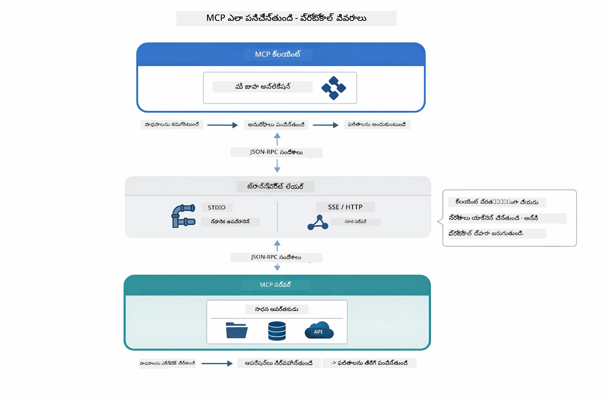

*MCP కింద ఎలా పని చేస్తుంది — క్లయింట్లు పరికరాలను కనుగొంటాయి, JSON-RPC సందేశాలు మార్పిడీ చేస్తాయి, ట్రాన్స్‌పోర్ట్ పొర ద్వారా ఆపరేషన్లు నడిపిస్తాయి.*

**సర్వర్-క్లయింట్ నిర్మాణం**

MCP క్లయింట్-సర్వర్ మోడల్ ను ఉపయోగిస్తుంది. సర్వర్లు పరికరాలు అందిస్తాయి - ఫైళ్లు చదవడం, డేటాబేసులు ప్రశ్నించడం, APIలను పిలవడం. క్లయింట్లు (మీ AI అప్లికేషన్) సర్వర్లకు కనెక్ట్ అవుతాయి మరియు వారి పరికరాలను ఉపయోగిస్తాయి.

LangChain4j తో MCP ను ఉపయోగించేందుకు, ఈ Maven డిపెండెన్సీని జోడించండి:

```xml
<dependency>
    <groupId>dev.langchain4j</groupId>
    <artifactId>langchain4j-mcp</artifactId>
    <version>${langchain4j.version}</version>
</dependency>
```

**పరికరాల కనుగొనడం**

మీ క్లయింట్ MCP సర్వర్‌కు కనెక్ట్ అయినప్పుడు, అది "మీ వద్ద ఎలాంటి పరికరాలు ఉన్నాయి?" అని అడుగుతుంది. సర్వర్ అందుబాటులో ఉన్న పరికరాల జాబితాను వివరణలు మరియు పరామితి స్కీమాలతో అందిస్తుంది. మీ AI ఏజెంట్ యూజర్ అభ్యర్థనల ఆధారంగా ఏ పరికరాలను ఉపయోగించాలో నిర్ణయించగలదు. క్రింద డయాగ్రామ్ ఈ చేతి పట్టింపు చూపిస్తుంది — క్లయింట్ `tools/list` అభ్యర్థన పంపి, సర్వర్ తన అందుబాటులో ఉన్న పరికరాలను వివరణలతో మరియు పరామితి స్కీమాలతో అందిస్తుంది:

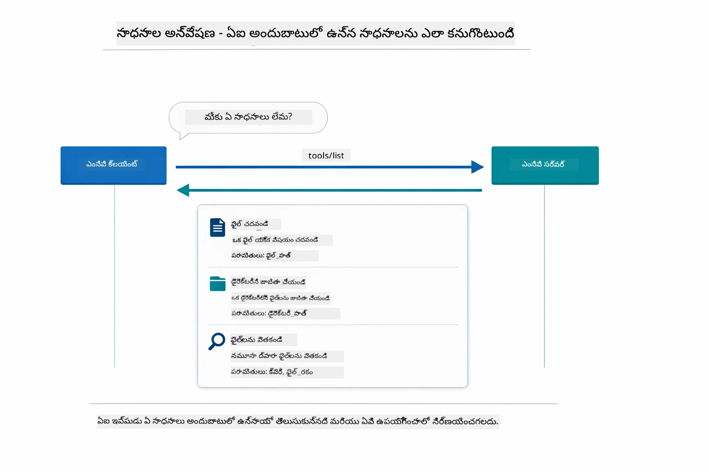

*AI స్టార్టప్పులో అందుబాటులో ఉన్న పరికరాలను కనుగొంటుంది — ఇప్పుడు దానికి ఏ సామర్థ్యాలు ఉన్నాయో తెలుసు, వాటిలో ఏవైనా ఉపయోగించవచ్చు.*

**ట్రాన్స్‌పోర్ట్ మెకానిజమ్స్**

MCP విభిన్న ట్రాన్స్‌పోర్ట్ మెకానిజమ్స్‌ను మద్దతు ఇస్తుంది. రెండు ఎంపికలు ఉన్నాయి Stdio (లోకల్ సబ్‌ప్రోసెస్ కమ్యూనికేషన్ కోసం) మరియు Streamable HTTP (రిమోట్ సర్వర్ల కోసం). ఈ మోడ్యూల్ Stdio ట్రాన్స్‌పోర్ట్‌ను ప్రదర్శిస్తుంది:


*MCP ట్రాన్స్‌పోర్ట్ మెకానిజమ్‌లు: రిమోట్ సర్వర్లకు HTTP, లోకల్ ప్రాసెస్‌లకు Stdio*

**Stdio** - [StdioTransportDemo.java](../../../05-mcp/src/main/java/com/example/langchain4j/mcp/StdioTransportDemo.java)

లోకల్ ప్రాసెస్‌ల కోసం. మీ అప్లికేషన్ సబ్‌ప్రోసెస్‌గా ఒక సర్వర్‌ను జన్మించి, స్టాండర్డ్ ఇన్‌పుట్/ఆుట్‌పుట్ ద్వారా కమ్యూనికేట్ చేస్తుంది. ఫైల్‌సిస్టమ్ యాక్సెస్ లేదా కమాండ్-లైన్ పరికరాలకు ఉపయోగపడుతుంది.

```java
McpTransport stdioTransport = new StdioMcpTransport.Builder()
    .command(List.of(
        npmCmd, "exec",
        "@modelcontextprotocol/server-filesystem@2025.12.18",
        resourcesDir
    ))
    .logEvents(false)
    .build();
```

`@modelcontextprotocol/server-filesystem` సర్వర్ క్రింది పరికరాలను అందిస్తుంది, ఇవన్నీ మీరు నిర్దేశించిన డైరెక్టరీలకి పరిమితం చేయబడ్డవి:

| పరికరం | వివరణ |
|------|-------------|
| `read_file` | ఒకే ఒక ఫైల్ యొక్క కంటెంట్ చదవడం |
| `read_multiple_files` | ఒకే కాల్‌లో బహుళ ఫైళ్లు చదవడం |
| `write_file` | ఒక ఫైల్ సృష్టించడం లేదా రాయడం |
| `edit_file` | లక్ష్యంగా గుర్తించి ప్రత్యామ్నాయం చేయడం |
| `list_directory` | ఒక మార్గంలో ఫైళ్లు మరియు డైరెక్టరీలను జాబితా చేయడం |
| `search_files` | పదం సరిపోయే ఫైళ్ళ కోసం పునరావరణ శోధన |
| `get_file_info` | ఫైల్ మెటాడేటా (పరిమాణం, టైమ్‌స్టాంపులు, అనుమతులు) పొందడం |
| `create_directory` | ఒక డైరెక్టరీ సృష్టించడం (పేరెంట్ డైరెక్టరీలతో కలిసి) |
| `move_file` | ఒక ఫైల్ లేదా డైరెక్టరీని కదిలించడం లేదా పునర్నామకరణ చేయడం |

క్రింది డయాగ్రామ్ Stdio ట్రాన్స్‌పోర్ట్ ఎలా-runtime లో పని చేస్తుందో చూపిస్తుంది — మీ జావా అప్లికేషన్ MCP సర్వర్‌ను చైల్డ్ ప్రాసెస్‌గా జన్మించి, stdin/stdout పైపులతో కమ్యూనికేట్ చేస్తుంది, ఎటువంటి నెట్‌వర్క్ లేదా HTTP లాంటి సంగతి involvement లేదు:

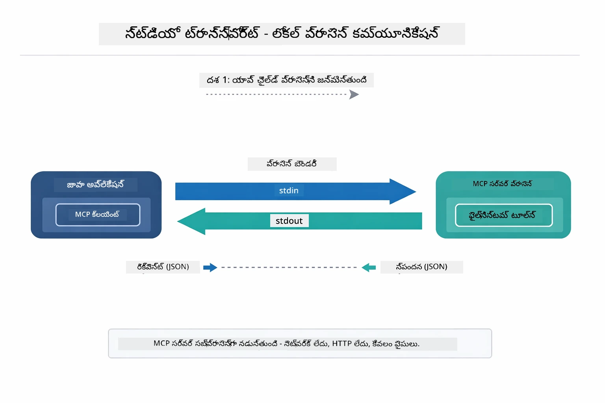

*Stdio ట్రాన్స్‌పోర్ట్ చర్యలో — మీ అప్లికేషన్ MCP సర్వర్‌ను చైల్డ్ ప్రాసెస్‌గా జన్మించి, stdin/stdout పైపులతో కమ్యూనికేట్ చేస్తుంది.*

> **🤖 [GitHub Copilot](https://github.com/features/copilot) చాట్‌తో ప్రయత్నించండి:** [`StdioTransportDemo.java`](../../../05-mcp/src/main/java/com/example/langchain4j/mcp/StdioTransportDemo.java) ఓపెన్ చేసి అడగండి:
> - "Stdio ట్రాన్స్‌పోర్ట్ ఎలా పనిచేస్తుంది మరియు HTTPతోపాటుగా ఎప్పుడు ఉపయోగించాలి?"
> - "LangChain4j MCP సర్వర్ ప్రాసెస్‌ల లైఫ్ సైకిల్‌ను ఎలా నిర్వహిస్తుంది?"
> - "AI కి ఫైల్ సిస్టమ్ యాక్సెస్ ఇచ్చేటప్పుడు భద్రతా ఫలితాలు ఏమిటి?"

## The Agentic Module

MCP ప్రమాణీకృత పరికరాలు అందించినప్పటికీ, LangChain4j యొక్క **ఏజెంటిక్ మాడ్యూల్** ఆ పరికరాలను నిర్వర్తించే ఏజెంట్లను ప్రకటనా శైలిలో సృష్టించేందుకు ఇన్స్ట్రుమెంటల్ మార్గాన్ని అందిస్తుంది. `@Agent` గుర్తింపు మరియు `AgenticServices` మీకు ఏజెంట్ ప్రవర్తనను ఇంపిరేటివ్ కోడ్ కంటే ఇంటర్‌ఫేస్‌ల ద్వారా నిర్వచించేందుకు అనుమతిస్తుంది.

ఈ మోడ్యూల్లో, మీరు **సూపర్‌వైజర్ ఏజెంట్** ప్యాటర్న్‌ని అన్వేషిస్తారు — ఇది ఒక అభివృద్ధి చెందిన ఏజెంట్ల AI వైఖరి, ఇక్కడ "సూపర్‌వైజర్" ఏజెంట్ యూజర్ అభ్యర్థనల ఆధారంగా ఏ ఉప ఏజెంట్లు కాల్ చేయాలో డైనమిక్‌గా నిర్ణయిస్తుంది. మనము రెండు భావనలను కలిపి ఒక ఉప ఏజెంట్‌కు MCP ఆధారిత ఫైల్ యాక్సెస్ సామర్థ్యాలను ఇస్తాం.

ఏజెంటిక్ మాడ్యూల్ ఉపయోగించాలంటే, ఈ Maven డిపెండెన్సీని జత చేయండి:

```xml
<dependency>
    <groupId>dev.langchain4j</groupId>
    <artifactId>langchain4j-agentic</artifactId>
    <version>${langchain4j.mcp.version}</version>
</dependency>
```
> **గమనిక:** `langchain4j-agentic` మాడ్యూల్ వేరే విడుదల షెడ్యూలులో ఉండటంతో వర్తించే వర్షన్ ప్రాపర్టీ (`langchain4j.mcp.version`) వేరువారీగా ఉంది.

> **⚠️ ప్రయోగాత్మక:** `langchain4j-agentic` మాడ్యూల్ ప్రయోగాత్మకంగా ఉంది మరియు మార్పులకు లోబడి ఉంటుంది. AI అసిస్టెంట్‌లను నిర్మించడానికి స్థిరమైన మార్గం `langchain4j-core` మంచి కస్టమ్ పరికరాలతో (మాడ్యూల్ 04) కొనసాగుతుంది.

## Running the Examples

### Prerequisites

- పూర్తయిన [Module 04 - Tools](../04-tools/README.md) (ఈ మాడ్యూల్ కస్టమ్ టూల్ భావనలపై నిర్మించబడి MCP టూల్స్‌తో పోలుస్తుంది)
- రూట్ డైరెక్టరీలో Azure క్రెడెన్షియల్స్‌తో `.env` ఫైల్ (Module 01లో `azd up` ద్వారా సృష్టించబడింది)
- జావా 21+, మావెన్ 3.9+
- Node.js 16+ మరియు npm (MCP సర్వర్ల కోసం)

> **గమనిక:** మీరు మీ ఎన్‌విరాన్‌మెంట్ వేరియబుల్స్ సెటప్ చేయకపోతే, [Module 01 - Introduction](../01-introduction/README.md) లో డిప్లాయ్‌మెంట్ సూచనలు చూడండి (`azd up` ఆ ఆటోమేటిక్‌గా `.env` ఫైల్‌ను సృష్టిస్తుంది), లేదా రూట్ డైరెక్టరీలో `.env.example` ను `.env` గా కాపీ చేసి మీ వివరాలు పూరించండి.

## Quick Start

**VS Code ఉపయోగించడం:** ఎక్స్‌ప్లోరర్‌లో ఏ డెమో ఫైల్ పైన రైట్-క్లిక్ చేసి **"Run Java"** ఎంచుకోండి, లేదా రన్ అండ్ డీబగ్ ప్యానెల్‌లోని లాంచ్ కాన్ఫిగరేషన్లను ఉపయోగించండి (మీ `.env` ఫైల్ Azure క్రెడెన్షియల్స్‌తో ముందుగా సెట్ చేయబడినట్లు ఉన్నదని నిర్ధారించుకోండి).

**మావెన్ ఉపయోగించడం:** ప్రత్యామ్నాయం గా, మీరు కింది ఉదాహరణలతో కమాండ్ లైన్ నుంచి రన్ చేయవచ్చు.

### File Operations (Stdio)

ఇది లోకల్ సబ్‌ప్రోసెస్ ఆధారిత పరికరాలను ప్రదర్శిస్తుంది.

**✅ ఎలాంటి ప్రీరిక్విజిట్లు అవసరం లేదు** - MCP సర్వర్ ఆటోమేటిగానే స్పాన్ అవుతుంది.

**స్టార్ట్ స్క్రిప్ట్‌ల ఉపయోగం (శిఫారసు):**

అటువంటి స్క్రిప్టులు ఆటోమాటిగా రూట్ `.env` ఫైల్ నుండి ఎన్విరాన్‌మెంట్ వేరియబుల్స్‌ను లోడ్ చేస్తాయి:

**Bash:**
```bash
cd 05-mcp
chmod +x start-stdio.sh
./start-stdio.sh
```

**PowerShell:**
```powershell
cd 05-mcp
.\start-stdio.ps1
```

**VS Code ఉపయోగించడం:** `StdioTransportDemo.java` పై రైట్-క్లిక్ చేసి **"Run Java"** ఎంచుకోండి (`.env` ఫైల్ సెట్ చేయబడిందని నిర్ధారించండి).

అప్లికేషన్ ఆటోమేటిగానే ఫైల్‌సిస్టమ్ MCP సర్వర్‌ను స్పాన్ చేసి, ఒక లోకల్ ఫైల్‌ను చదవుతుంది. సబ్‌ప్రోసెస్ నిర్వహణ మీరు ఎవరు చేయబడుతుంది.

**ఎక్స్పెక్టెడ్ అవుట్పుట్:**
```
Assistant response: The file provides an overview of LangChain4j, an open-source Java library
for integrating Large Language Models (LLMs) into Java applications...
```

### Supervisor Agent

**Supervisor Agent ప్యాటర్న్** ఒక **అనుకూల** ఏజెంటిక్ AI రూపం. ఒక సూపర్‌వైజర్ LLM ఉపయోగించి యూజర్ అభ్యర్థనల ఆధారంగా ఏ ఏజెంట్లు కాల్ చేయాలో స్వయంసిద్ధంగా నిర్ణయం తీసుకుంటుంది. తదుపరి ఉదాహరణలో, MCP ఆధారిత ఫైల్ యాక్సెస్‌ను LLM ఏజెంట్‌తో కలిపి ఒక సూపర్వైజ్డ్ ఫైల్ చదవడం → నివేదిక వర్క్‌ఫ్లోని సృష్టిస్తాము.

డెమోలో, `FileAgent` MCP ఫైల్‌సిస్టమ్ పరికరాలు ఉపయోగించి ఒక ఫైల్‌ను చదవగలదు, `ReportAgent` ఒక నిర్మిత నివేదికను రూపొందిస్తుంది, అందుకు ఒక ఎగ్జిక్యూటివ్ సమ్మరీ (1 వాక్యం), 3 ముఖ్యాంశాలు, మరియు సిఫారసులు ఉంటాయి. సూపర్‌వైజర్ ఈ ప్రవాహాన్ని ఆటోమాటిగానే సమన్వయం చేస్తుంది:

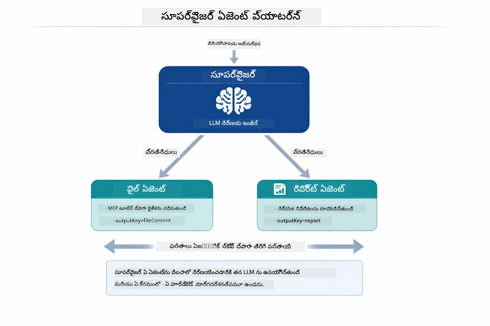

*సూపర్‌వైజర్ దాని LLMను ఉపయోగించి ఏ ఏజెంట్లను పిలవాలో మరియు ఏ క్రమంలో పిలవాలో నిర్ణయిస్తుంది — ప్రతిదీ కఠిన-కోడ్ రౌటింగ్ అవసరం లేదు.*

ఇది మన ఫైల్-టు-నివేదిక పైపు‌లైన్ యొక్క కాంక్రీట్ వర్క్‌ఫ్లో:

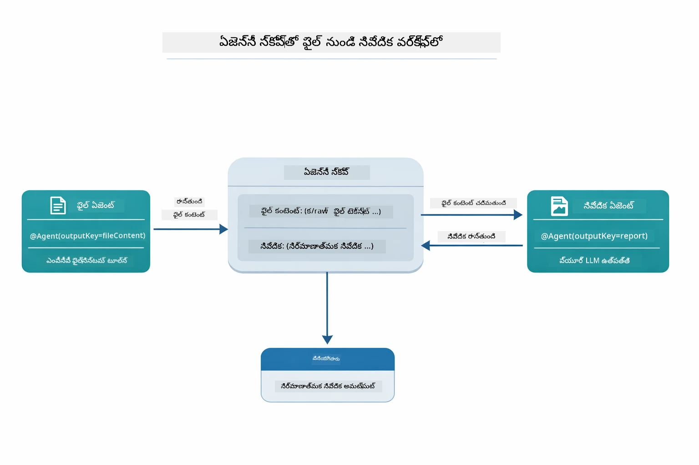

*FileAgent MCP పరికరాల ద్వారా ఫైల్ ను చదివి, ReportAgent ఆ రా కంటెంట్‌ను ఒక నిర్మిత నివేదికగా మార్చుతుంది.*

ప్రతి ఏజెంట్ దాని అవుట్పుట్‌ను **Agentic Scope** (పంచుకున్న మెమరీ) లో నిల్వ చేస్తుంది, తద్వారా తరువాతి ఏజెంట్లు మునుపటి ఫలితాలను యాక్సెస్ చేయవచ్చు. ఇది MCP పరికరాలు ఏజెంటిక్ వర్క్‌ఫ్లోలలో ఎలా సులభంగా ఇంటిగ్రేట్ అయ్యే దానిని చూపిస్తుంది — సూపర్‌వైజర్ కి ఫైళ్ళు ఎలా చదవబడతాయో తెలుసుకోవాలసిన అవసరం లేదు, కేవలం `FileAgent` అది చేయగలదనే తెలిసి ఉంటుంది.

#### Running the Demo

స్టార్ట్ స్క్రిప్ట్‌లు ఆటోమేటిగానే రూట్ `.env` ఫైల్ నుండి ఎన్విరాన్‌మెంట్ వేరియబుల్స్‌ను లోడ్ చేస్తాయి:

**Bash:**
```bash
cd 05-mcp
chmod +x start-supervisor.sh
./start-supervisor.sh
```

**PowerShell:**
```powershell
cd 05-mcp
.\start-supervisor.ps1
```

**VS Code ఉపయోగించడం:** `SupervisorAgentDemo.java` పై రైట్-క్లిక్ చేసి **"Run Java"** ఎంచుకోండి (`.env` ఫైల్ సెట్ చేయబడిందని నిర్ధారించండి).

#### How the Supervisor Works

ఏజెంట్లను నిర్మించే ముందు, మీరు MCP ట్రాన్స్‌పోర్ట్ ను క్లయింట్‌కు కనెక్ట్ చేసి దాన్ని `ToolProvider` గా ర్యాప్ చేయవలసి ఉంటుంది. ఈ విధంగా MCP సర్వర్ పరికరాలు మీ ఏజెంట్లకు అందుబాటులో ఉంటాయి:

```java
// ట్రాన్స్‌పోర్ట్ నుండి MCP క్లయింట్ సృష్టించండి
McpClient mcpClient = new DefaultMcpClient.Builder()
        .transport(stdioTransport)
        .build();

// క్లయింట్ను ToolProviderగా ఆవర్తనం చేయండి — ఇది MCP టూల్స్‌ను LangChain4jలోకి అనుసంధానం చేస్తుంది
ToolProvider mcpToolProvider = McpToolProvider.builder()
        .mcpClients(List.of(mcpClient))
        .build();
```

ఇప్పుడు మీరు ఏ ఏజెంట్లోనైనా MCP టూల్స్ అవసరమైతే `mcpToolProvider` ను ఇంజెక్ట్ చేయవచ్చు:

```java
// దశ 1: FileAgent MCP టూల్స్ ఉపయోగించి ఫైళ్లను చదివి నడుపుతుంది
FileAgent fileAgent = AgenticServices.agentBuilder(FileAgent.class)
        .chatModel(model)
        .toolProvider(mcpToolProvider)  // ఫైల్ ఆపరేషన్ల కోసం MCP టూల్స్ ఉన్నాయి
        .build();

// దశ 2: ReportAgent నిర్మిత రిపోర్టులను రూపొందిస్తుంది
ReportAgent reportAgent = AgenticServices.agentBuilder(ReportAgent.class)
        .chatModel(model)
        .build();

// Supervisor ఫైల్ → రిపోర్ట్ పని ప్రవాహాన్ని ఒరెస్ట్ చేస్తుంది
SupervisorAgent supervisor = AgenticServices.supervisorBuilder()
        .chatModel(model)
        .subAgents(fileAgent, reportAgent)
        .responseStrategy(SupervisorResponseStrategy.LAST)  // తుది రిపోర్టును తిరిగి ఇవ్వండి
        .build();

// Supervisor అభ్యర్థన ఆధారంగా ఏ ఏజెంట్లను ఉపయోగించాలో నిర్ణయిస్తుంది
String response = supervisor.invoke("Read the file at /path/file.txt and generate a report");
```

#### Response Strategies

`SupervisorAgent` ను మీరు కన్ఫిగర్ చేసేటప్పుడు, సబ్-ఏజెంట్లు వారి పనులు పూర్తి చేసిన తర్వాత యూజర్‌కు తుదిగానీ సమాధానం ఎలా అందించాలో మీరు ప్రత్యేకించవచ్చు. క్రింది డయాగ్రామ్ మూడు అందుబాటులో ఉన్న వ్యూహాలను చూపిస్తుంది — LAST చివరి ఏజెంట్ యొక్క అవుట్పుట్‌ను డైరెక్ట్గా ఇస్తుంది, SUMMARY అన్ని అవుట్పుట్‌లను LLM ద్వారా సింథసైజ్ చేస్తుంది, SCORED మొదటి అభ్యర్థనకు సంబంధించి అధిక స్కోరు పొందిన అవుట్పుట్‌ను ఎంచుకుంటుంది:

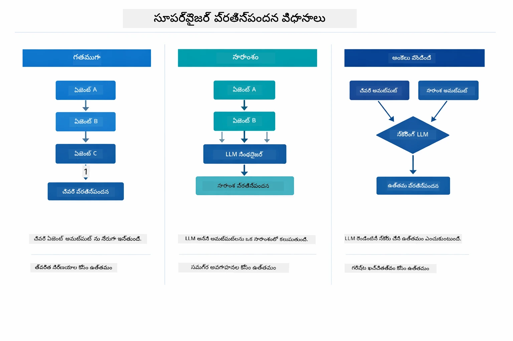

*సూపర్‌వైజర్ తుదిగానీ సమాధానం ఎలా తయారుచేస్తుందో మూడుఉ పద్ధతులు — చివరి ఏజెంట్ అవుట్పుట్, సింథసైజ్డ్ సమ్మరి, లేదా ఉత్తమ స్కోరు పొందిన ఎంపిక.*

అందుబాటులో ఉన్న వ్యూహాలు:

| వ్యూహం | వివరణ |
|----------|-------------|
| **LAST** | సూపర్‌వైజర్ చివరి సబ్-ఏజెంట్ లేదా పరికరం పిలిచి ఇచ్చిన అవుట్పుట్‌ను ఇస్తుంది. ఇది చివరి ఏజెంట్ పూర్తి, తుది సమాధానం ఇవ్వడానికి ప్రత్యేకంగా రూపొందించినప్పుడు ఉపయోగకరం (ఉదాహరణకు, రీసర్చ్ పైప్‌లైన్లో "సమ్మరి ఏజెంట్"). |
| **SUMMARY** | సూపర్‌వైజర్ తాను ఉపయోగించే భాషా మోడల్ (LLM) సహాయంతో మొత్తం పరస్పర చర్య మరియు సబ్-ఏజెంట్ అవుట్పుట్‌ల సమ్మరీని తయారుచేసి, దాన్ని తుది సమాధానంగా ఇస్తుంది. ఇది యూజర్‌కు ఒక చిటపటమయిన సమగ్ర సమాధానాన్ని అందిస్తుంది. |
| **SCORED** | సిస్టమ్ ఒక అంతర్గత LLM ద్వారా LAST ప్రతిస్పందనను మరియు పరస్పర చర్య యొక్క SUMMARY ను యూజర్ యొక్క అసలు అభ్యర్థనకు విరుద్ధంగా స్కోర్ చేస్తుంది, మరియు ఎక్కువ స్కోరు పొందిన అవుట్పుట్ ను తిరిగి ఇస్తుంది. |
సంపూర్ణ అమలు కోసం [SupervisorAgentDemo.java](../../../05-mcp/src/main/java/com/example/langchain4j/mcp/SupervisorAgentDemo.java)ను చూడండి.

> **🤖 [GitHub Copilot](https://github.com/features/copilot) చాట్‌తో ప్రయత్నించండి:** [`SupervisorAgentDemo.java`](../../../05-mcp/src/main/java/com/example/langchain4j/mcp/SupervisorAgentDemo.java)ను తెరిచి అడగండి:
> - "Supervisor ఏ ఏజెంట్లను ఉపయోగించాలనుకుంటున్నాడో ఎలా నిర్ణయిస్తాడు?"
> - "Supervisor మరియు Sequential వర్క్‌ఫ్లో ప్యాటర్న్స్ మధ్య తేడా ఏమిటి?"
> - "Supervisor యొక్క ప్రణాళిక ప్రవర్తనను ఎలా అనుకూలీకరించవచ్చు?"

#### అవుట్పుట్‌ను అర్థం చేసుకోడం

మీరు డెమోను నడిపించినప్పుడు, Supervisor ఏజెంట్లను ఎలా సమన్వయపరుస్తున్నాడో ఒక నిర్మిత ప్రదర్శనను చూడగలరు. ప్రతి విభాగం ఏమి సూచిస్తున్నదో ఇక్కడ ఉంది:

```
======================================================================
  FILE → REPORT WORKFLOW DEMO
======================================================================

This demo shows a clear 2-step workflow: read a file, then generate a report.
The Supervisor orchestrates the agents automatically based on the request.
```
  
**శీర్షిక** వర్క్‌ఫ్లో భావనను పరిచయం చేస్తుంది: ఫైల్ చదవడం నుండి నివేదిక రూపొందించడం వరకు ఒక యోచించిన పైప్‌లైన్.

```
--- WORKFLOW ---------------------------------------------------------
  ┌─────────────┐      ┌──────────────┐
  │  FileAgent  │ ───▶ │ ReportAgent  │
  │ (MCP tools) │      │  (pure LLM)  │
  └─────────────┘      └──────────────┘
   outputKey:           outputKey:
   'fileContent'        'report'

--- AVAILABLE AGENTS -------------------------------------------------
  [FILE]   FileAgent   - Reads files via MCP → stores in 'fileContent'
  [REPORT] ReportAgent - Generates structured report → stores in 'report'
```
  
**వర్క్‌ఫ్లో డయాగ్రాము** ఏజెంట్ల మధ్య డేటా ప్రవాహాన్ని చూపుతుంది. ప్రతి ఏజెంట్‌కు ప్రత్యేక భూమిక ఉంటుంది:  
- **FileAgent** MCP పరికరాల సహాయంతో ఫైళ్లను చదువుతుంది మరియు ముడి కంటెంట్ ను `fileContent` లో నిల్వ చేస్తుంది  
- **ReportAgent** ఆ కంటెంట్‌ను వినియోగించి నిర్మిత నివేదికను `report`లో ఉత్పత్తి చేస్తుంది  

```
--- USER REQUEST -----------------------------------------------------
  "Read the file at .../file.txt and generate a report on its contents"
```
  
**వినియోగదారుని అభ్యర్థన** పని చూపిస్తుంది. Supervisor దీన్ని విశ్లేషించి FileAgent → ReportAgent ను పిలవాలని నిర్ణయిస్తాడు.

```
--- SUPERVISOR ORCHESTRATION -----------------------------------------
  The Supervisor decides which agents to invoke and passes data between them...

  +-- STEP 1: Supervisor chose -> FileAgent (reading file via MCP)
  |
  |   Input: .../file.txt
  |
  |   Result: LangChain4j is an open-source, provider-agnostic Java framework for building LLM...
  +-- [OK] FileAgent (reading file via MCP) completed

  +-- STEP 2: Supervisor chose -> ReportAgent (generating structured report)
  |
  |   Input: LangChain4j is an open-source, provider-agnostic Java framew...
  |
  |   Result: Executive Summary...
  +-- [OK] ReportAgent (generating structured report) completed
```
  
**Supervisor సమన్వయం** 2 దశల ప్రవాహాన్ని చూపిస్తుంది:  
1. **FileAgent** MCP ద్వారా ఫైల్‌ను చదివి కంటెంట్ నిల్వ చేస్తుంది  
2. **ReportAgent** ఆ కంటెంట్‌ను స్వీకరించి నిర్మిత నివేదికను తయారుచేస్తుంది  

Supervisor ఈ నిర్ణయాలను **స్వయంచాలకంగా** తీసుకున్నాడు వినియోగదారు అభ్యర్థన ఆధారంగా.

```
--- FINAL RESPONSE ---------------------------------------------------
Executive Summary
...

Key Points
...

Recommendations
...

--- AGENTIC SCOPE (Data Flow) ----------------------------------------
  Each agent stores its output for downstream agents to consume:
  * fileContent: LangChain4j is an open-source, provider-agnostic Java framework...
  * report: Executive Summary...
```
  
#### ఏజెంటిక్ మాడ్యూల్ ఫీచర్ల వివరణ

ఉదాహరణ ఏజెంటిక్ మాడ్యూల్ లోని అనేక ఆధునిక ఫీచర్లను ప్రదర్శిస్తుంది. Agentic Scope మరియు Agent Listeners గురించి మరింత లోతుగా చూస్తాం.

**Agentic Scope** ఏజెంట్లు తమ ఫలితాలను `@Agent(outputKey="...")` ఉపయోగించి నిల్వ చేసిన సార్వత్రిక మెమరీని చూపుతుంది. ఇది అనుమతిస్తుంది:  
- తరువాతి ఏజెంట్లు ముందరి ఏజెంట్ల అవుట్పుట్లను యాక్సెస్ చేయడం  
- Supervisor చివరి ప్రతిస్పందనను సమ్మేళితం చేయడం  
- మీరు ప్రతి ఏజెంట్ ఉత్పత్తిని పరిశీలించగలగడం  

కింది డయాగ్రాములో Agentic Scope ఫైల్-టు-నివేదిక వర్క్‌ఫ్లోలో ఏజెంటుల విషయం సార్వత్రిక మెమరీగా ఎలా పనిచేస్తుందో చూపబడింది — FileAgent `fileContent` కీ క్రింద అవుట్పుట్ రాస్తుంది, ReportAgent అది చదివి `report` కీ క్రింద తన అవుట్పుట్ రాస్తుంది:

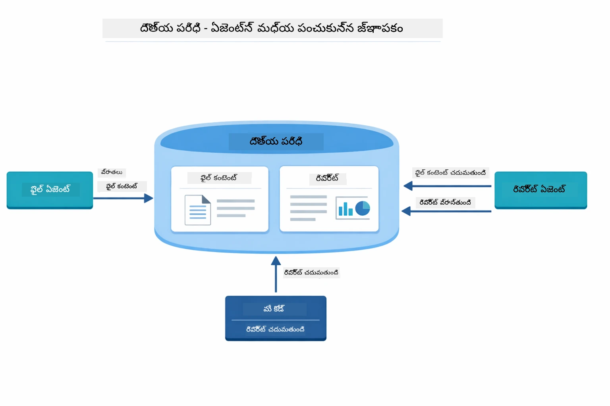

*Agentic Scope సార్వత్రిక మెమరీగా పనిచేస్తుంది — FileAgent `fileContent` ను రాస్తుంది, ReportAgent అది చదివి `report` ను రాస్తుంది, మరియు మీ కోడ్ ఆ చివరి ఫలితాన్ని చదువుతుంది.*

```java
ResultWithAgenticScope<String> result = supervisor.invokeWithAgenticScope(request);
AgenticScope scope = result.agenticScope();
String fileContent = scope.readState("fileContent");  // FileAgent నుండి రా ఫైల్ డేటా
String report = scope.readState("report");            // ReportAgent నుండి నిర్మించబడిన నివేదిక
```
  
**Agent Listeners** ఏజెంట్ ఎగ్జిక్యూషన్‌ను పరిశీలించడం మరియు డీబగ్గింగ్‌కు అనుమతిస్తాయి. డెమోలో మీరు చూస్తున్న దశల వారీ అవుట్పుట్ ఒక AgentListener నుండి వస్తుంది, ఇది ప్రతి ఏజెంట్ పిలుపుతో జోడిస్తుంది:  
- **beforeAgentInvocation** - Supervisor ఏ ఏజెంట్ ఎంపిక చేసుకున్నాడో మరియు ఎందుకు ని చూపుతుంది  
- **afterAgentInvocation** - ఏజెంట్ పూర్తి అయినప్పుడు దాని ఫలితాన్ని ప్రదర్శిస్తుంది  
- **inheritedBySubagents** - నిజమైనప్పుడు, లిసనర్ హైర్‌ ఆర్కీలోని అన్ని ఏజెంట్లను పర్యవేక్షిస్తుంది  

క్రింది డయాగ్రామ్ పూర్తి Agent Listener జీవితచక్రాన్ని చూపిస్తూ, ఏజెంట్ అమలు సమయంలో పతనాలను `onError` ఎలా హ్యాండిల్ చేస్తుందో చూపిస్తుంది:

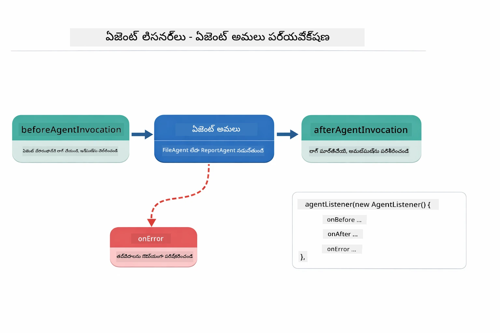

*Agent Listeners అమలు జీవితచక్రంలో జోడింపులుగా ఉంటాయి — ఏజెంట్లు ప్రారంభించినప్పుడు, పూర్తయినప్పుడు లేదా లోపాలు కలిగినప్పుడు పర్యవేక్షణ చేస్తాయి.*

```java
AgentListener monitor = new AgentListener() {
    private int step = 0;
    
    @Override
    public void beforeAgentInvocation(AgentRequest request) {
        step++;
        System.out.println("  +-- STEP " + step + ": " + request.agentName());
    }
    
    @Override
    public void afterAgentInvocation(AgentResponse response) {
        System.out.println("  +-- [OK] " + response.agentName() + " completed");
    }
    
    @Override
    public boolean inheritedBySubagents() {
        return true; // అన్ని సబ్-ఏజెంట్లకు వ్యాప్తి చేయండి
    }
};
```
  
Supervisor ప్యాటర్న్ కనిష్టంగా, `langchain4j-agentic` మాడ్యూల్ అనేక శక్తివంతమైన వర్క్‌ఫ్లో ప్యాటర్న్లను అందిస్తుంది. కింద డయాగ్రామ్ లో ఐదు అందించబడినవి — సాధారణ శ్రేణి పైప్‌లైన్ల నుండి మానవ-ఇన్-ది-లూప్ అనుమతి వర్క్‌ఫ్లోలకు:

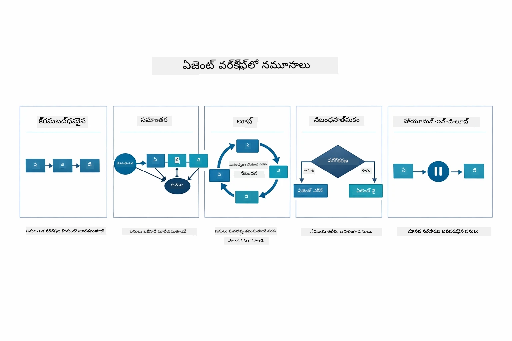

*ఏజెంట్లను సమన్వయపరచడానికి ఐదు వర్క్‌ఫ్లో ప్యాటర్న్లు — సాధారణ శ్రేణి పైప్‌లైన్ల నుండి మానవ-ఇన్-ది-లూప్ అనుమతి వర్క్‌ఫ్లో వరకు.*

| ప్యాటర్న్ | వివరణ | వాడుక సందర్భం |
|---------|-------------|----------|
| **Sequential** | ఏజెంట్లను వరుసగా అమలు చేయటం, అవుట్పుట్ తర్వాత వాటికి ప్రవహిస్తుంది | పైప్‌లైన్లు: పరిశోధన → విశ్లేషణ → నివేదిక |
| **Parallel** | ఏజెంట్లను సమకాలీనంగా నడపటం | స్వతంత్ర పనులు: వాతావరణం + వార్తలు + స్టాక్‌లు |
| **Loop** | షరతు నెరవేర్చే వరకు పునరావృతం | నాణ్యత స్కోరింగ్: స్కోరు ≥ 0.8 వరకు మెరుగుపరచు |
| **Conditional** | పరిస్థితుల ఆధారంగా మార్గదర్శనం | వర్గీకరించడం → నిపుణ ఏజెంట్ కు మార్గనిర్దేశం |
| **Human-in-the-Loop** | మానవ నిర్ధారణ స్థానాలు చేర్చడం | అనుమతి వర్క్‌ఫ్లోలు, కంటెంట్ సమీక్ష |

## ప్రముఖ భావనలు

ఇప్పుడు మీరు MCP మరియు Agentic మాడ్యూల్‌ని ప్రత్యక్షంగా అన్వయించుకున్నారు, ఏ దృక్పథాన్ని ఎప్పుడు వాడాలి అన్న దానిపై సంక్షిప్త వివరంగా చెప్పుకుందాం.

MCP యొక్క అత్యంత పెద్ద లాభం దాని పెరిగెదురు జీవవేదిక. క్రింది డయాగ్రామ్ ఒక ఏకైక యూనివర్సల్ ప్రోటోకాలుగా మీ AI అప్లికేషన్ ను విస్తృతమైన MCP సర్వర్లతో ఎలా కనెక్ట్ చేస్తుందో చూపుతుంది — ఫైల్‌సిస్టమ్ మరియు డేటాబేస్ యాక్సెస్ నుండి GitHub, ఇమెయిల్, వెబ్ స్క్రాపింగ్ మరియు మరింత వరకు:

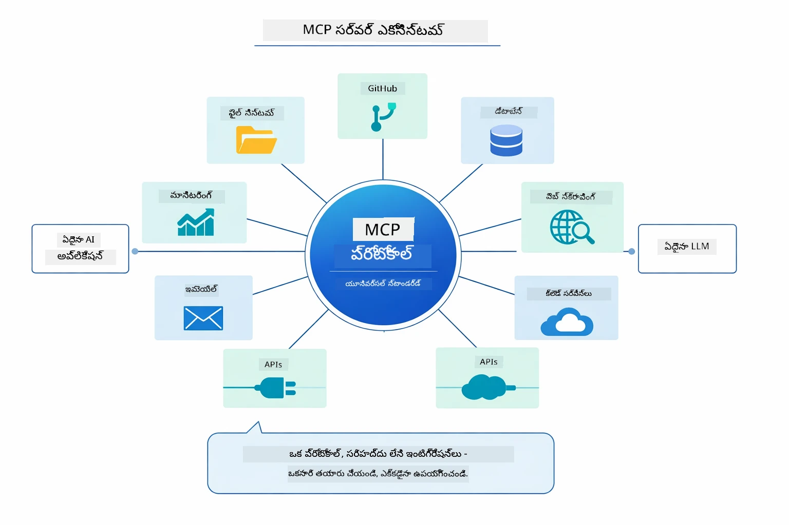

*MCP ఒక సాధారణ ప్రోటోకాల జీవవేదికను సృష్టిస్తుంది — ఏ MCP-అనుకూల సర్వర్ ఏ MCP-అనుకూల క్లయింట్‌తో పని చేస్తుంది, అప్లికేషన్ల మధ్య పరికరాల భాగస్వామ్యాన్ని సులభతరం చేస్తుంది.*

**MCP** మీరు ఇప్పటికే ఉన్న పరికర వేదికను ఉపయోగించాలనుకునే సందర్భాల్లో, బహుళ అప్లికేషన్లు పంచుకునే పరికరాలను సృష్టించేటప్పుడు, మూడవ పక్ష సేవలను ప్రామాణిక ప్రోటోకాల్లతో ఇంటిగ్రేట్ చేయాలనేటప్పుడు, లేదా కోడ్ మార్చకుండా పరికర అమలు మార్పులు చేయాలనేటప్పుడు తొలగింపు అవుతుంది.

**Agentic Module** ఉత్తమంగా పనిచేస్తుంది మీరు ప్రకటనాత్మక Agent నిర్వచనాలను `@Agent` వ్యాఖ్యలతో చేయాలనుకునేటప్పుడు, వర్క్‌ఫ్లో సమన్వయాన్ని (శ్రేణి, లూప్, పారల్లల్) అవసరమైతే, ఆదేశాత్మక కోడ్ పై ఆధారపడని ఇంటర్‌ఫేస్ ఆధారిత Agent రూపకల్పన ఇష్టపడితే, లేదా `outputKey` ద్వారా పంచుకునే బహుళ ఏజెంట్లను కలిపేటప్పుడు.

**Supervisor Agent ప్యాటర్న్** మెరుగైనది అవుతుంది మీరు ముందుగా అంచనా వేయలేని వర్క్‌ఫ్లో వుంటే, LLM ఆధారంగా నిర్ణయం తీసుకోవాలనేటప్పుడు, వివిధ నిపుణ ఏజెంట్లు పొందుపరచుకుని డైనమిక్ సమన్వయం కావాలనేటప్పుడు, వేర్వేరు సామర్ధ్యాలకు మార్గనిర్దేశం చేసే సంభాషణ వ్యవస్థలు తయారుచేయాలనేటప్పుడు లేదా అత్యంత అనుకూల, సరళ agent ప్రవర్తన కోరుకునేటప్పుడు.

Module 04 నుండి కస్టమ్ `@Tool` విధానాల‌తో ఈ మాడ్యూల్ నుండి MCP పరికరాల మధ్య ఎంచుకునేందుకు సహాయపడటానికి, క్రింది సమీక్ష ముఖ్యమైన వ్యత్యాసాలను వివరిస్తుంది — కస్టమ్ పరికరాలు అప్లికేషన్ నిర్ధిష్ట తర్కానికి కచ్చితమైన అనుసంధానం మరియు పూర్తి రకం భద్రతను అందిస్తాయి, MCP పరికరాలు ప్రామాణిక, తిరిగి ఉపయోగించుకునే ఇంటిగ్రేషన్లను అందిస్తాయి:

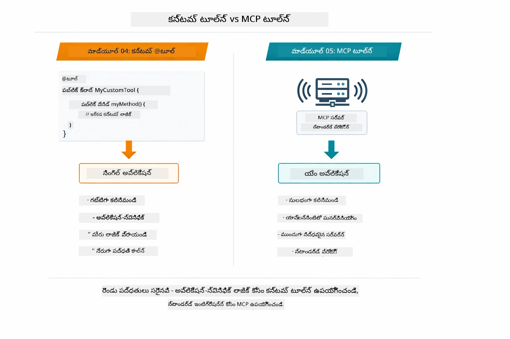

*ఎప్పుడు కస్టమ్ @Tool విధానాలు ఉపయోగించాలి, ఎప్పుడు MCP పరికరాలు వాడాలి — అప్లికేషన్-కేంద్రిత తర్కానికి పూర్తి రకం భద్రతతో కస్టమ్ పరికరాలు, అనేక అప్లికేషన్లలో పని చేసే ప్రామాణిక ఇంటిగ్రేషన్లకు MCP పరికరాలు.*

## అభినందనలు!

మీరు LangChain4j for Beginners కోర్సు యొక్క ఐదు మాడ్యూల్స్ సంపూర్ణంగా పూర్తిచేశారు! క్రింద మీ పూర్తి అధ్యయన ప్రయాణం చూపబడింది — ప్రాథమిక చాట్ నుండి MCP-శక్తిగల agentic సిస్టమ్స్ వరకు:

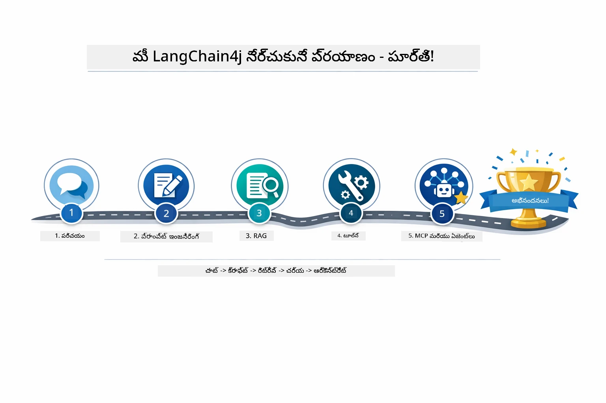

*మీరు ఈ ఐదు మాడ్యూల్స్ ద్వారా చేయించిన అధ్యయన ప్రయాణం — ప్రాథమిక చాట్ నుండి MCP-శక్తిగల agentic సిస్టమ్స్ వరకు.*

మీరే LangChain4j for Beginners కోర్సును పూర్తి చేశారు. మీరు నేర్చుకున్నాం:

- జ్ఞాపకశక్తితో సంభాషణాత్మక AI ఎలా నిర్మించాలి (Module 01)  
- వివిధ పనుల కొరకు ప్రాంప్ట్ ఇంజనీరింగ్ ప్యాటర్న్లు (Module 02)  
- RAG తో మీ డాక్యుమెంట్లలోని సమాచారం ఆధారంగా స్పందనలు పొందడం (Module 03)  
- కస్టమ్ పరికరాలతో ప్రాథమిక AI ఏజెంట్లను సృష్టించడం (Module 04)  
- LangChain4j MCP మరియు Agentic మాడ్యూల్‌లతో ప్రామాణిక పరికరాలను వీలుగా జత చేయడం (Module 05)  

### తర్వాత ఏమి?

మాడ్యూల్స్ పూర్తి చేసిన తరువాత, [Testing Guide](../docs/TESTING.md)ను అన్వేషించి LangChain4j పరీక్షా భావనలను ప్రత్యక్షంగా చూడండి.

**అధికారిక వనరులు:**  
- [LangChain4j డాక్యుమెంటేషన్](https://docs.langchain4j.dev/) - సమగ్ర మార్గదర్శకాలు మరియు API రెఫరెన్స్  
- [LangChain4j GitHub](https://github.com/langchain4j/langchain4j) - మూల కోడ్ మరియు ఉదాహరణలు  
- [LangChain4j ట్యుటోరియల్స్](https://docs.langchain4j.dev/tutorials/) - వివిధ ఉపయోగాలకు దశల వారీ ట్యుటోరియల్స్  

ఈ కోర్సును పూర్తి చేసినందుకు ధన్యవాదాలు!

---

**నావిగేషన్:** [← మునుపటి: Module 04 - పరికరాలు](../04-tools/README.md) | [తెల్లవారదలకు తిరిగి](../README.md)

---

<!-- CO-OP TRANSLATOR DISCLAIMER START -->
**విధిసూచక నోటీసు**:  
ఈ పత్రాన్ని AI అనువాద సేవ [Co-op Translator](https://github.com/Azure/co-op-translator) ఉపయోగించి అనువదించబడింది. మేము సరైన అనువాదానికి ప్రయత్నిస్తున్నప్పటికీ, ఆటోమేటెడ్ అనువాదాల్లో తప్పులు లేదా తప్పుదోవలు ఉండొచ్చు. అసలు పత్రం దాని స్వదేశీ భాషలో అధికారం కలిగిన మూలంగా పరిగణించాలి. ముఖ్యమైన సమాచారానికి, నైపుణ్యం కలిగిన మానవ అనువాదం సిఫార్సు చేస్తారు. ఈ అనువాదం వాడకం వల్ల ఏర్పడే ఏమైనా అవగాహనల లోపం లేదా తప్పుగా అర్థం చేసుకోవడంలో మేము బాధ్యత వహించము.
<!-- CO-OP TRANSLATOR DISCLAIMER END -->