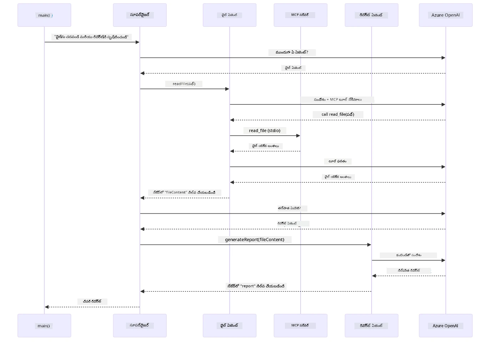

# మాడ్యూల్ 05: మోడల్ కాంటెక్స్ట్ ప్రోటోకాల్ (MCP)

## పట్టిక

- [ వీడియో వాక్ పాత్](../../../05-mcp)
- [మీకు నేర్చుకోగలిగేది](../../../05-mcp)
- [MCP అంటే ఏమిటి?](../../../05-mcp)
- [MCP ఎలా పని చేస్తుంది](../../../05-mcp)
- [ఏజెంటిక్ మాడ్యూల్](../../../05-mcp)
- [ఉదాహరణలను అమలు చేయడం](../../../05-mcp)
  - [ముందస్తు అర్హతలు](../../../05-mcp)
- [త్వరిత ప్రారంభం](../../../05-mcp)
  - [ఫైల్ ఆపరేషన్లు (స్ట్డియో)](../../../05-mcp)
  - [సూపర్వైజర్ ఏజెంట్](../../../05-mcp)
    - [డెమో అమలు](../../../05-mcp)
    - [సూపర్వైజర్ ఎలా పని చేస్తుంది](../../../05-mcp)
    - [ఫైల్ ఏజెంట్ ఎలా MCP టూల్స్‌ను రన్‌టైమ్‌లో కనుగొంటుంది](../../../05-mcp)
    - [ప్రతిస్పందన వ్యూహాలు](../../../05-mcp)
    - [ఫలితాన్ని అర్థం చేసుకోవడం](../../../05-mcp)
    - [ఏజెంటిక్ మాడ్యూల్ లక్షణాల వివరణ](../../../05-mcp)
- [ప్రధాన సూత్రాలు](../../../05-mcp)
- [అഭినందనలు!](../../../05-mcp)
  - [తదుపరి ఏమిటి?](../../../05-mcp)

## వీడియో వాక్ పాత్

ఈ మాడ్యూల్‌తో ఎలా ప్రారంభించాలో వివరించే లైవ్ సెషన్‌ను చూడండి:

<a href="https://www.youtube.com/watch?v=O_J30kZc0rw"></a>

## మీకు నేర్చుకోగలిగేది

మీరు సంభాషణాత్మక AI ని నిర్మించారు, ప్రాంప్ట్‌లను మాస్టర్ చేసుకున్నారు, ప్రత్యుత్తరాలను డాక్యుమెంట్లలో స్థిరపరిచారు మరియు టూల్స్‌తో ఏజెంట్లను సృష్టించారు. కానీ ఆ అన్ని టూల్స్ మీ నిర్దిష్ట అనువర్తనానికి అనుకూలంగా తీర్చిదిద్దబడ్డాయి. ఎవరైనా సృష్టించి పంచుకునే ఒక ప్రమాణీకృత టూల్స్ వాతావరణానికి మీ AI కి యాక్సెస్ ఇవ్వగలిగితే ఎలా ఉంటుందో? ఈ మాడ్యూల్‌లో, మీరు Model Context Protocol (MCP) మరియు LangChain4j యొక్క ఏజెంటిక్ మాడ్యూల్‌తో దాన్ని ఎలా చేయాలో నేర్చుకుంటారు. మొదట ఒక సులభమైన MCP ఫైల్ రీడర్‌ను ప్రదర్శిస్తాము, తరువాత ఈ టూల్‌ను సూపర్వైజర్ ఏజెంట్ ప్యాటర్న్ ఉపయోగించి అభివృద్ధి ఏజెంటిక్ వర్క్‌ఫ్లోల్లో ఎలాగు సులభంగా అనుసంధానించాలో చూపిస్తాము.

## MCP అంటే ఏమిటి?

Model Context Protocol (MCP) అ именно ఈది - AI అనువర్తనాలకి బయటి టూల్స్‌ని కనుగొని ఉపయోగించడానికి ఒక ప్రమాణీకృత మార్గాన్ని అందిస్తుంది. ప్రతి డేటా మూలం లేదా సేవ కోసం ప్రత్యేక ఇంటిగ్రేషన్లను రాయడం కంటే, మీరు MCP సర్వర్‌లతో కనెక్ట్ అవుతారు, అవి తమ సామర్థ్యాలను సమానికృత ఫార్మాట్‌లో ప్రదర్శిస్తాయి. మీ AI ఏజెంట్ ఆ టూల్స్‌ని ఆటోమాటిక్‌గా కనుగొని ఉపయోగించగలదు.

క్రింది డయాగ్రామ్ మధ్య తేడాను చూపిస్తుంది — MCP లేకుండా ప్రతి ఇంటిగ్రేషన్ కోసం ప్రత్యేక పాయింట్-టూ-పాయింట్ వైరింగ్ అవసరం; MCP తో, ఒకే ప్రోటోకాల్ మీ యాప్‌ని ఏ టూల్‌తో అయినా కनेक్ట్ చేస్తుంది:


*ముందు MCP: సంక్లిష్ట పాయింట్-టూ-పాయింట్ ఇంటిగ్రేషన్లు. MCP తర్వాత: ఒక ప్రోటోకాల్, అसीమిత అవకాశాలు.*

MCP AI అభివృద్ధిలో ఒక ప్రధాన సమస్యను పరిష్కరిస్తుంది: ప్రతి ఇంటిగ్రేషన్ ప్రత్యేకమైనది. GitHub యాక్సెస్ కావాలా? ప్రత్యేక కోడ్. ఫైల్స్ చదవాలా? ప్రత్యేక కోడ్. డేటాబేస్‌ని ప్రశ్నించాలా? ప్రత్యేక కోడ్. మరియు ఈ ఇంటిగ్రేషన్లు ఇతర AI అనువర్తనాలతో పనిచేయవు.

MCP దీనిని ప్రమాణీకరించేస్తుంది. ఒక MCP సర్వర్ సులభంగా అర్థమయ్యే వివరణలు మరియు స్కీమాలతో టూల్స్‌ను ప్రదర్శిస్తుంది. ఏ MCP క్లయింట్ కనెక్ట్ అవ్వవచ్చు, అందుబాటులో ఉన్న టూల్స్ నొక్కించి వాటిని ఉపయోగించవచ్చు. ఒకసారి నిర్మించండి, ఎక్కడైనా ఉపయోగించండి.

క్రింది చిత్రీకరణ ఈ ఆర్కిటెక్చర్‌ను చూపిస్తుంది — ఒక MCP క్లయింట్ (మీ AI అనువర్తనం) ఒకাধিক MCP సర్వర్లతో కనెక్ట్ అవుతుంది, ప్రతి సర్వర్ తమ స్వంత టూల్‌లు ప్రమాణ ప్రోటోకాల్ ద్వారా ప్రదర్శిస్తుంది:


*మోడల్ కాంటెక్స్ట్ ప్రోటోకాల్ ఆర్కిటెక్చర్ - ప్రమాణీకృత టూల్ కనుగొనడం మరియు అమలు*

## MCP ఎలా పని చేస్తుంది

అండర్ ది హుడ్, MCP లేయర్డ్ ఆర్కిటెక్చర్‌ను ఉపయోగిస్తుంది. మీ జావా అనువర్తనం (MCP క్లయింట్) అందుబాటులో ఉన్న టూల్స్‌ను కనుగొంటుంది, JSON-RPC అభ్యర్థనలు పంపడానికి ట్రాన్స్‌పోర్ట్ లేయర్ (స్ట్డియో లేదా HTTP) ఉపయోగిస్తుంది, మరియు MCP సర్వర్ ఆపరేషన్లను అమలు చేసి ఫలితాలు తిరిగి పంపుతుంది. ఈ క్రింది డయాగ్రామ్ ఈ ప్రోటోకాల్ యొక్క ప్రతి లేయర్‌ను విడగొడుతుంది:


*ఎలా MCP అండర్ ది హుడ్ పనిచేస్తుందో — క్లయింట్లు టూల్స్ ని కనుగొంటారు, JSON-RPC సందేశాలు మార్పిడి చేస్తారు, మరియు ట్రాన్స్‌పోర్ట్ లేయర్ ద్వారా ఆపరేషన్లు అమలు చేస్తారు.*

**సర్వర్-క్లయింట్ ఆర్కిటెక్చర్**

MCP ఒక క్లయింట్-సర్వర్ మోడల్‌ను ఉపయోగిస్తుంది. సర్వర్లు టూల్స్ అందిస్తాయి - ఫైళ్ళను చదవడం, డేటాబేస్ ప్రశ్నించడం, APIs కాల్ చేయడం. క్లయింట్లు (మీ AI అనువర్తనం) సర్వర్లకు కనెక్ట్ అవుతాయి మరియు వారి టూల్స్ ఉపయోగిస్తాయి.

LangChain4j తో MCP ఉపయోగించడానికి, ఈ Maven డిపెండెన్సీని జోడించండి:

```xml
<dependency>
    <groupId>dev.langchain4j</groupId>
    <artifactId>langchain4j-mcp</artifactId>
    <version>${langchain4j.version}</version>
</dependency>
```

**టూల్ కనుగొనడం**

మీ క్లయింట్ MCP సర్వర్‌కు కనెక్ట్ అయ్యప్పుడు, ఇది అడుగుతుంది "మీ వద్ద ఏ టూల్స్ ఉన్నవి?" సర్వర్ అందుబాటులో ఉన్న టూల్స్ జాబితాను వివరణలు మరియు పారామీటర్ స్కీమాలతో సమర్పిస్తుంది. మీ AI ఏజెంట్ యూజర్ అభ్యర్థనల ఆధారంగా ఏ టూల్స్ ఉపయోగించాలో నిర్ణయించగలదు. క్రింది డయాగ్రామ్ ఈ హ్యాండ్‌షేక్‌ను చూపిస్తుంది — క్లయింట్ `tools/list` అభ్యర్థనను పంపుతుంది మరియు సర్వర్ దాని టూల్స్ వివరణలతో తిరిగి ఇస్తుంది:


*AI ప్రారంభంలో అందుబాటులో ఉన్న టూల్స్‌ను కనుగొంటుంది — ఇది ఇప్పుడు అందుబాటులో ఉన్న సామర్థ్యాలను తెలుసుకుంటుంది మరియు ఏవి ఉపయోగించాలో నిర్ణయించగలదు.*

**ట్రాన్స్‌పోర్ట్ మెకానిజంలు**

MCP వివిధ ట్రాన్స్‌పోర్ట్ మెకానిజంలను మద్దతు ఇస్తుంది. రెండు ఎంపికలు స్ట్డియో (లోకల్ సబ్‌ప్రాసెస్ కమ్యూనికేషన్ కోసం) మరియు స్ట్రీమబుల్ HTTP (రిమోట్ సర్వర్‌లకు) ఉన్నాయి. ఈ మాడ్యూల్ స్ట్డియో ట్రాన్స్‌పోర్ట్‌ను చూపిస్తుంది:


*MCP ట్రాన్స్‌పోర్ట్ మెకానిజంలు: రిమోట్ సర్వర్లకు HTTP, లోకల్ ప్రాసెస్‌లకు స్ట్డియో*

**స్ట్డియో** - [StdioTransportDemo.java](../../../05-mcp/src/main/java/com/example/langchain4j/mcp/StdioTransportDemo.java)

లోకల్ ప్రాసెస్‌ల కోసం. మీ అప్లికేషన్ సబ్‌ప్రాసెస్‌గా సర్వర్‌ను సృష్టించి స్టాండర్డ్ ఇన్‌పుట్/అవుట్‌పై కమ్యూనికేట్ చేస్తుంది. ఫైల్ సిస్టమ్ యాక్సెస్ లేదా కమాండ్ లైన్ టూల్స్‌కు ఉపయోగకరం.

```java
McpTransport stdioTransport = new StdioMcpTransport.Builder()
    .command(List.of(
        npmCmd, "exec",
        "@modelcontextprotocol/server-filesystem@2025.12.18",
        resourcesDir
    ))
    .logEvents(false)
    .build();
```

`@modelcontextprotocol/server-filesystem` సర్వర్ క్రింది టూల్స్‌ను ప్రదర్శిస్తుంది, వీటన్నీ మీరు పేర్కొన్న డైరెక్టరీలకి సీమితమయ్యాయి:

| టూల్ | వివరణ |
|------|-------------|
| `read_file` | ఒక సింగిల్ ఫైల్ యొక్క కంటెంట్‌ను చదవండి |
| `read_multiple_files` | ఒక కాల్‌లో బహుళ ఫైళ్ళను చదవండి |
| `write_file` | ఒక ఫైల్ సృష్టించండి లేదా ఓవర్రైట్ చేయండి |
| `edit_file` | లక్ష్యాత్మక ఫైండ్‌అండ్-రిఫ్లేస్ ఎడిట్స్ చేయండి |
| `list_directory` | ఒక పాథ్ వద్ద ఫైళ్ళు మరియు డైరెక్టరీలు జాబితా చేయండి |
| `search_files` | ఒక ప్యాటర్న్‌కు సరిపోయే ఫైళ్ళను రికర్సివ్‌గా శోధించండి |
| `get_file_info` | ఫైల్ మెటాడేటా (పరిమాణం, టైమ్‌స్టాంప్స్, అనుమతులు) పొందండి |
| `create_directory` | ఒక డైరెక్టరీ (పేరెంట్ డైరెక్టరీలతో సహా) సృష్టించండి |
| `move_file` | ఒక ఫైల్ లేదా డైరెక్టరీని స్థానం మార్చండి లేదా పునఃపేరు పెట్టండి |

క్రింది డయాగ్రామ్ స్ట్డియో ట్రాన్స్‌పోర్ట్ ఎలా రన్‌టైమ్‌లో పని చేస్తుందో చూపిస్తుంది — మీ జావా అప్లికేషన్ MCP సర్వర్‌ను చైల్డ్ ప్రాసెస్‌గా తెరుస్తుంది మరియు అవి stdin/stdout పైపుల ద్వారా కమ్యూనికేట్ చేస్తాయి, నెట్‌వర్క్ లేదా HTTP ఉపయోగించబడదు:


*స్ట్డియో ట్రాన్స్‌పోర్ట్ చర్యలో — మీ అప్లికేషన్ MCP సర్వర్‌ను చైల్డ్ ప్రాసెస్‌గా తెరుస్తుంది మరియు stdin/stdout పైపుల ద్వారా కమ్యూనికేట్ చేస్తుంది.*

> **🤖 [GitHub Copilot](https://github.com/features/copilot) చాట్‌తో ప్రయత్నించండి:** [`StdioTransportDemo.java`](../../../05-mcp/src/main/java/com/example/langchain4j/mcp/StdioTransportDemo.java) ఓపెన్ చేసి అడగండి:
> - "స్ట్డియో ట్రాన్స్‌పోర్ట్ ఎలా పని చేస్తుంది మరియు నేను దానిని HTTPతో పోల్చితే ఎప్పుడు ఉపయోగించాలి?"
> - "LangChain4j MCP సర్వర్ ప్రాసెస్ లైఫ్సైకిల్ ఎలా నిర్వహిస్తుంది?"
> - "AIకి ఫైల్ సిస్టమ్ యాక్సెస్ ఇవ్వడం యొక్క భద్రతా ప్రభావాలు ఏంటి?"

## ఏజెంటిక్ మాడ్యూల్

MCP ప్రమాణీకృత టూల్స్ అందిస్తుండగా, LangChain4j యొక్క **ఏజెంటిక్ మాడ్యూల్** ఆ టూల్స్ ను సమన్వయ పరిచే ఏజెంట్లను రూపొందించడానికి డిక్లరేటివ్ పద్ధతిని ఇస్తుంది. `@Agent` అనోటేషన్ మరియు `AgenticServices` ద్వారా మీరు అమలు కోడ్ కాకుండా ఇంటర్ఫేసుల ద్వారా ఏజెంట్ ప్రవర్తనని నిర్వచించవచ్చు.

ఈ మాడ్యూల్లో మీరు **సూపర్వైజర్ ఏజెంట్** ఫ్యాటర్న్‌ని అన్వేషిస్తారు — ఇది ఒక అభివృద్ధి చెందిన ఏజెంటిక్ AI కొలత, ఇందులో "సూపర్వైజర్" ఏజెంట్ యూజర్ అభ్యర్థనల ఆధారంగా డైనమిక్‌గా ఉప ఏజెంట్లను ఎప్పుడు, ఎవరు పిలవాలో నిర్ణయిస్తుంది. మేము ఈ రెండు సిద్ధాంతాలను కలిపి ఒక ఉపఏజెంటుకి MCP ఆధారిత ఫైల్ యాక్సెస్ సామర్థ్యాలను ఇస్తాము.

ఏజెంటిక్ మాడ్యూల్ ఉపయోగించడానికి, ఈ Maven డిపెండెన్సీని జోడించండి:

```xml
<dependency>
    <groupId>dev.langchain4j</groupId>
    <artifactId>langchain4j-agentic</artifactId>
    <version>${langchain4j.mcp.version}</version>
</dependency>
```
> **గమనిక:** `langchain4j-agentic` మాడ్యూల్ కోసం వేరే వెర్షన్ ప్రాపర్టీ (`langchain4j.mcp.version`) ఉపయోగిస్తారు, ఇది కోర్ LangChain4j లైబ్రరీలతో భిన్నంగా విడుదల అవుతుంది.

> **⚠️ ప్రయోగాత్మకం:** `langchain4j-agentic` మాడ్యూల్ **ప్రయోగాత్మకం** మరియు మార్పులకు లోనవుతుంది. AI అసిస్టెంట్లను సృష్టించడానికి స్థిరమైన పద్ధతి `langchain4j-core` తో కస్టమ్ టూల్స్ (మాడ్యూల్ 04) ఉపయోగించడమే.

## ఉదాహరణలు అమలు చేయడం

### ముందస్తు అర్హతలు

- [మాడ్యూల్ 04 - టూల్స్](../04-tools/README.md) పూర్తి చేసిన ఉండాలి (ఈ మాడ్యూల్ కస్టమ్ టూల్స్ కాన్సెప్ట్లపై ఆధారపడింది మరియు వాటిని MCP టూల్‌లతో పోల్చుతుంది)
- రూట్ డైరెక్టరీలో `.env` ఫైల్ Azure క్రెడెన్షియల్స్‌తో (మాడ్యూల్ 01 లో `azd up` ద్వారా సృష్టించబడింది)
- Java 21+, Maven 3.9+
- Node.js 16+ మరియు npm (MCP సర్వర్‌ల కోసం)

> **గమనిక:** మీరు ఇంకా ఎన్విరాన్‌మెంట్ వేరియబుల్స్ సెటప్ చేయకపోతే, [మాడ్యూల్ 01 - పరిచయం](../01-introduction/README.md) చూడండి (డిప్లాయ్‌మెంట్ సూచనలు, `azd up` ఆటోమాటిగ్గా `.env` ఫైల్ సృష్టిస్తుంది), లేదా `.env.example` ను రూట్ డైరెక్టరీలో `.env` గా కాపీ చేసి మీ విలువలను భర్తీ చేయండి.

## త్వరిత ప్రారంభం

**VS కోడ్ ఉపయోగిస్తూ:** ఎక్స్ప్లోరర్‌లో ఏ డెమో ఫైల్‌పై రైట్-క్లిక్ చేసి **“Run Java”** ఎంచుకోండి, లేదా రన్ మరియు డీబగ్ ప్యానెల్ నుండి లాంచ్ కాన్ఫిగరేషన్లను ఉపయోగించండి (ముందుగా మీ `.env` ఫైల్ Azure క్రెడెన్షియల్స్‌తో సెట్ చేయబడింది అని నిర్ధారించుకోండి).

**Maven ఉపయోగిస్తూ:** లేదా, క్రింద ఇచ్చిన ఉదాహరణలతో కమాండ్ లైన్ నుండి అమలు చేయవచ్చు.

### ఫైల్ ఆపరేషన్లు (స్ట్డియో)

ఇది లోకల్ సబ్‌ప్రాసెస్ ఆధారిత టూల్స్‌ను చూపిస్తుంది.

**✅ ముందస్తు అర్హతలు అవసరం లేదు** - MCP సర్వర్ ఆటోమాటిగ్గా తెరుస్తుంది.

**పొందిన స్క్రిప్ట్లు ఉపయోగించడం (సిఫార్సు):**

స్టార్ట్ స్క్రిప్ట్లు ఆటోమాటిగ్గా రూట్ `.env` ఫైల్ నుండీ ఎన్విరాన్‌మెంట్ వేరియబుల్స్‌ను లోడ్ చేస్తాయి:

**బాష్:**
```bash
cd 05-mcp
chmod +x start-stdio.sh
./start-stdio.sh
```

**పవర్‌షెల్:**
```powershell
cd 05-mcp
.\start-stdio.ps1
```

**VS కోడ్ ఉపయోగిస్తూ:** `StdioTransportDemo.java` పై రైట్-క్లిక్ చేసి **“Run Java”** ఎంచుకోండి (మీ `.env` ఫైల్ సెటప్ అయినట్లు నిర్ధారించుకోండి).

అప్లికేషన్ ఆటోమాటిగ్గా MCP ఫైల్‌సిస్టమ్ సర్వర్‌ను తెరువు, ఒక స్థానిక ఫైల్‌ను చదువుతుంది. సబ్‌ప్రాసెస్ నిర్వహణ ఎలా జరుగుతుందో గమనించండి.

**అంచనా ఫలితం:**
```
Assistant response: The file provides an overview of LangChain4j, an open-source Java library
for integrating Large Language Models (LLMs) into Java applications...
```

### సూపర్వైజర్ ఏజెంట్

**సూపర్వైజర్ ఏజెంట్ ప్యాటర్న్** అనేది **అనుకూలమైన** ఏజెంటిక్ AI రూపం. సూపర్వైజర్ ఒక LLM ఉపయోగించి యూజర్ అభ్యర్థన ఆధారంగా ఏ ఏజెంట్లను పిలవాలో స్వతంత్రంగా నిర్ణయిస్తుంది. ఈ ఉదాహరణలో, మేము MCP ఆధారిత ఫైల్ యాక్సెస్ ను LLM ఏజెంట్‌తో కలిపి నియంత్రిత ఫైల్ చదవడం → నివేదిక ప్రాసెస్‌ను తయారుచేస్తాము.

డెమోలో, `FileAgent` MCP ఫైల్‌సిస్టమ్ టూల్స్ ద్వారా ఫైల్ చదువుతుంది, మరియు `ReportAgent` ఒక నిర్మాణాత్మక నివేదికను సృష్టిస్తుంది, ఇందులో కార్యనిర్వాహక సారాంశం (1 వాక్యం), 3 ముఖ్య అంశాలు, మరియు సిఫార్సులు ఉంటాయి. సూపర్వైజర్ ఈ ఫ్లోను ఆటోమాటిక్గా సమన్వయ పరిచేస్తుంది:


*సూపర్వైజర్ తన LLM ఉపయోగించి ఏ ఏజెంట్లను, ఏ ఆర్డర్‌లో పిలవాలో నిర్ణయిస్తుంది — హార్డ్‌కోడెడ్ రూటింగ్ అవసరం లేదు.*

ఫైల్-టూ-నివేదిక పైప్‌లైన్ కోసం నిర్దిష్ట వర్క్‌ఫ్లో ఇలాగే ఉంటుంది:


*FileAgent MCP టూల్స్ ఉపయోగించి ఫైల్‌ను చదవగా, ReportAgent కచ్చితమైన కంటెంట్‌ను నిర్మాణాత్మక నివేదికగా మార్చుతుంది.*

క్రింది సీక్వెన్స్ డయాగ్రామ్ పూర్తి సూపర్వైజర్ నిర్వహణను చూపిస్తుంది — MCP సర్వర్‌ను స్పాన్ చేయడం, సూపర్వైజర్ స్వతంత్ర ఏజెంట్ ఎంపిక, స్ట్డియోపై టూల్ కాల్స్, మరియు చివరి నివేదిక వరకు:



*సూపర్వైజర్ స్వతంత్రంగా FileAgent‌ను పిలుస్తుంది (MCP సర్వర్‌ను స్ట్డియో ద్వారా పిలిచి ఫైల్ చదవుతుంది), తరువాత ReportAgent‌ను ساختిత నివేదిక ఉత్పత్తి కోసం పిలుస్తుంది — ప్రతి ఏజెంట్ తన అవుట్పుట్‌ను Agentic Scopeలో భద్రతపరచుకొంటుంది.*

ప్రతి ఏజెంట్ తన అవుట్పుట్‌ను **Agentic Scope** (షేర్డ్ మెమరీ)లో భద్రతపరచుతుంది, తద్వారా తర్వాతి ఏజెంట్లు ముందరి ఫలితాలను అందగలవు. ఇది MCP టూల్స్ ఎలా ఏజెంటిక్ వర్క్‌ఫ్లోలతో సజావుగా మిళితం అవుతాయో చూపిస్తుంది — సూపర్వైజర్ ఫైళ్ళు ఎలా చదవబడుతున్నాయో తెలియకపోయినా సరే, `FileAgent` అది చేయగలదు అనే విషయం మాత్రమే తెలుసుకోవాలి.

#### డెమో అమలు

స్టార్ట్ స్క్రిప్ట్లు ఆటోమాటిగ్గా రూట్ `.env` ఫైల్ నుండి ఎన్విరాన్‌మెంట్ వేరియబుల్స్‌ను లోడ్ చేస్తాయి:

**బాష్:**
```bash
cd 05-mcp
chmod +x start-supervisor.sh
./start-supervisor.sh
```

**పవర్‌షెల్:**
```powershell
cd 05-mcp
.\start-supervisor.ps1
```

**VS కోడ్ ఉపయోగిస్తూ:** `SupervisorAgentDemo.java` పై రైట్ క్లిక్ చేసి **“Run Java”** ఎంచుకోండి (మీ `.env` ఫైల్ సెట్ చేసుకున్నట్లు నిర్ధారించుకోండి).

#### సూపర్వైజర్ ఎలా పని చేస్తుంది

ఏజెంట్లు నిర్మించేముందు, మీరు MCP ట్రాన్స్‌పోర్ట్‌ను క్లయింట్‌కు కనెక్ట్ చేసి దానిని `ToolProvider`గా తెరచాలి. így MCP సర్వర్ టూల్స్ మీ ఏజెంట్లకు అందుబాటులోకి వస్తాయి:

```java
// ట్రాన్స్‌పోట్ నుండి MCP క్లయింట్‌ను సృష్టించండి
McpClient mcpClient = new DefaultMcpClient.Builder()
        .transport(stdioTransport)
        .build();

// క్లయింట్‌ను ToolProvider గా ముట్టండి — ఇది MCP టూల్స్‌ను LangChain4jకి అనుసంధానిస్తుంది
ToolProvider mcpToolProvider = McpToolProvider.builder()
        .mcpClients(List.of(mcpClient))
        .build();
```

ఇప్పటికే మీరు ఏ ఏజెంట్లోనైనా MCP టూల్స్ అవసరంఉంటే `mcpToolProvider` ను ఇంజెక్ట్ చేయవచ్చు:

```java
// దశ 1: FileAgent MCP సాధనాలను ఉపయోగించి ఫైళ్లను చదువుతుంది
FileAgent fileAgent = AgenticServices.agentBuilder(FileAgent.class)
        .chatModel(model)
        .toolProvider(mcpToolProvider)  // ఫైలు కార్యకలాపాలకు MCP సాధనాలు ఉన్నాయి
        .build();

// దశ 2: ReportAgent నిర్మితమైన నివేదికలను తయారు చేస్తుంది
ReportAgent reportAgent = AgenticServices.agentBuilder(ReportAgent.class)
        .chatModel(model)
        .build();

// సూపర్‌వైజర్ ఫైలు → నివేదిక పని ప్రవాహాన్ని సమన్వయిస్తుంది
SupervisorAgent supervisor = AgenticServices.supervisorBuilder()
        .chatModel(model)
        .subAgents(fileAgent, reportAgent)
        .responseStrategy(SupervisorResponseStrategy.LAST)  // తుది నివేదికను తిరిగి సమర్పించండి
        .build();

// సూపర్‌వైజర్ అభ్యర్థన ఆధారంగా ఏ ఏజెంట్లను పిలవాలో నిర్ణయిస్తాడు
String response = supervisor.invoke("Read the file at /path/file.txt and generate a report");
```

#### ఫైల్ ఏజెంట్ MCP టూల్స్‌ను రన్‌టైమ్‌లో ఎలా కనుగొంటుంది

మీరు ఆశ్చర్యపడవచ్చు: **`FileAgent` npm ఫైల్‌సిస్టమ్ టూల్స్ ఎలా ఉపయోగించాలో ఎలా తెలుసుకుంటుంది?** జవాబు అది తెలుసుకోదు — **LLM** టూల్ స్కీమాల ద్వారా రన్‌టైమ్‌లో దానిని ఆలోచిస్తుంది.
`FileAgent` ఇంటర్ఫేస్ అంటే కేవలం ఒక **prompt నిర్వచనం** మాత్రమే. ఇందులో `read_file`, `list_directory` లేదా ఇతర MCP టూల్స్ గురించి ఎటువంటి హార్డ్‌కోడ్ చేసిన జ్ఞానం లేదు. ఇక్కడ ప్రారంభం నుండి ముగింపు వరకు ఏమి జరుగుతుందో తెలుసుకుందాము:

1. **సర్వర్ ప్రారంభం:** `StdioMcpTransport` `@modelcontextprotocol/server-filesystem` npm ప్యాకేజ్‌ను చైల్డ్ ప్రాసెస్‌గా లాంచ్ చేస్తుంది
2. **టూల్ కనుగొనడం:** `McpClient` సర్వర్‌కి `tools/list` JSON-RPC అభ్యర్థన పంపుతుంది, సర్వర్ టూల్ పేర్లు, వివరణలు మరియు పరామితి స్కీమాలు (ఉదా: `read_file` — *"ఫైల్ యొక్క పూర్తి విషయాన్ని చదవండి"* — `{ path: string }`)తో స్పందిస్తుంది
3. **స్కీమా ఇంజెక్షన్:** `McpToolProvider` కనుగొన్న ఈ స్కీమాలను షరించిన తర్వాత LangChain4j కి అందిస్తుంది
4. **LLM నిర్ణయం:** `FileAgent.readFile(path)` కాల్ చేసినప్పుడు, LangChain4j సిస్టమ్ సందేశం, యూజర్ సందేశం, **మరియు టూల్ స్కీమాల జాబితాను** LLM కి పంపుతుంది. LLM టూల్ వివరణలు చదివి టూల్ కాల్ (ఉదా: `read_file(path="/some/file.txt")`) తయారు చేస్తుంది
5. **నిధానాత్మక అమలు:** LangChain4j ఆ టూల్ కాల్‌ను మధ్యవర్తిగా MCP క్లయింట్ ద్వారా Node.js ఉపప్రాసెస్‌కి పంపిస్తుంది, ఫలితాన్ని తీసుకుంటుంది, మళ్ళీ LLM కి అందిస్తుంది

ఇది పై పరిచయం చేసిన [టూల్ డిస్కవరీ](../../../05-mcp) యంత్రాంగం అమలు చేయడమే, కానీ ఇది ప్రత్యేకంగా ఏజెంట్ వర్క్‌ఫ్లోకి వర్తిస్తుంది. `@SystemMessage` మరియు `@UserMessage` అనోటేషన్లు LLM ప్రవర్తనను మార్గనిర్దేశం చేస్తాయి, ఇంజెక్ట్ చేసిన `ToolProvider` దానికి **సామర్థ్యాలు** ఇస్తుంది — LLM వాటిని రన్‌టైమ్‌లో కలుపుతుంది.

> **🤖 [GitHub Copilot](https://github.com/features/copilot) చాట్‌తో ప్రయత్నించండి:** [`FileAgent.java`](../../../05-mcp/src/main/java/com/example/langchain4j/mcp/agents/FileAgent.java) తెరచి అడగండి:
> - "ఈ ఏజెంట్ ఏ MCP టూల్‌ని ఎప్పుడు కాల్ చేయాలో ఎట్లా తెలుసుకుంటుంది?"
> - "Agent builder నుండి ToolProvider తీసేయబడితే ఏమవుతుంది?"
> - "టూల్ స్కీమాలు LLM కి ఎలా పంపబడతాయి?"

#### స్పందన నైపుణ్యాలు

`SupervisorAgent` ని సెట్ చేసినప్పుడు, ఉప-ఏజెంట్లు తమ పని పూర్తి చేసిన తర్వాత యూజర్ కు తుది సమాధానాన్ని ఎలా పంక్తి క్రమంలో ఇవ్వాలో మీరు సూచిస్తారు. క్రింది చిత్రంలో అందుబాటులో ఉన్న మూడు వ్యూహాలు చూపబడ్డాయి — LAST చివరి ఏజెంట్ ఔట్‌పుట్‌ను నేరుగా అందిస్తుంది, SUMMARY అన్ని ఔట్‌పుట్స్‌ను LLM ద్వారా సింథసైజ్ చేస్తుంది, SCORED మాత్రం మొదటి అభ్యర్థనతో పోల్చడం ద్వారా ఎక్కువ స్కోరు పొందిన ఔట్‌పుట్‌ను ఇస్తుంది:


*Supervisor తుది స్పందన తయారుచేసే మూడు వ్యూహాలు — మీరు చివరి ఏజెంట్ ఔట్‌పుట్ కావాలనుకుంటున్నారా, సమ్మరీ కావాలనుకుంటున్నారా లేక బెస్ట్ స్కోరింగ్ ఎంపిక కావాలనుకుంటున్నారా అనుసరించి ఎంచుకోండి.*

అందుబాటులో ఉన్న వ్యూహాలు:

| వ్యూహం    | వివరణ                                                                  |
|----------|------------------------------------------------------------------------|
| **LAST** | సూపర్వైజర్ చివరి ఉప-ఏజెంట్ లేదా టూల్ ఔట్‌పుట్‌ను ఇస్తుంది. ఇది ముఖ్యంగా చివరి ఏజెంట్ పూర్తి, తుది సమాధానం ఇవ్వాలనుకున్నప్పుడు ఉపయోగకరంగా ఉంటుంది (ఉదా: పరిశోధనా పైప్‌లైన్‌లో "సమ్మరీ ఏజెంట్"). |
| **SUMMARY** | సూపర్వైజర్ తన సొంత అంతర్గత LLM ఉపయోగించి మొత్తం పరస్పర చర్య మరియు ఉప-ఏజెంట్ ఔట్‌పుట్‌ల సమ్మరీని సృష్టించి, ఆ సమ్మరీని తుది స్పందనగా ఇస్తుంది. ఇది యూజర్‌కు శుభ్రమైన సమగ్ర సమాధానం అందిస్తుంది. |
| **SCORED** | సిస్టమ్ లాస్ట్ స్పందన మరియు SUMMARY యొక్క ఆ అంతర్గత LLM స్కోరింగ్ ఉపయోగించి, మొదటి యూజర్ అభ్యర్థనతో పోల్చి ఎక్కువ స్కోరు పొందిన ఔట్‌పుట్‌ను అందిస్తుంది. |

మంపైన [SupervisorAgentDemo.java](../../../05-mcp/src/main/java/com/example/langchain4j/mcp/SupervisorAgentDemo.java) పూర్తిగా చూడవచ్చు.

> **🤖 [GitHub Copilot](https://github.com/features/copilot) చాట్‌తో ప్రయత్నించండి:** [`SupervisorAgentDemo.java`](../../../05-mcp/src/main/java/com/example/langchain4j/mcp/SupervisorAgentDemo.java) తెరచి అడగండి:
> - "Supervisor ఏ ఏజెంట్లను ఎప్పుడు పిలవాలో ఎలా నిర్ణయిస్తాడు?"
> - "Supervisor మరియు Sequential వర్క్‌ఫ్లో మోడల్స్ మధ్య తేడా ఏమిటి?"
> - "Supervisor యోజన ప్రవర్తనను ఎలా అనుకూలీకరించగలను?"

#### ఔట్‌పుట్ అర్ధం చేసుకోవడం

డెమో నడుపుతున్నప్పుడు, సూపర్వైజర్ ఎలా బహుళ ఏజెంట్లను సమన్వయం చేస్తాడో ఒక క్రమబద్ధమైన వ్యుహం అవుతుంది. ఒక్కో భాగం అర్థం:

```
======================================================================
  FILE → REPORT WORKFLOW DEMO
======================================================================

This demo shows a clear 2-step workflow: read a file, then generate a report.
The Supervisor orchestrates the agents automatically based on the request.
```

**శీర్షిక** వర్క్‌ఫ్లో భావనను పరిచయం చేస్తుంది: ఫైల్ చదివి నివేదిక తయారుచేసే సూటిబద్ధమైన పైప్‌లైన్.

```
--- WORKFLOW ---------------------------------------------------------
  ┌─────────────┐      ┌──────────────┐
  │  FileAgent  │ ───▶ │ ReportAgent  │
  │ (MCP tools) │      │  (pure LLM)  │
  └─────────────┘      └──────────────┘
   outputKey:           outputKey:
   'fileContent'        'report'

--- AVAILABLE AGENTS -------------------------------------------------
  [FILE]   FileAgent   - Reads files via MCP → stores in 'fileContent'
  [REPORT] ReportAgent - Generates structured report → stores in 'report'
```

**వర్క్‌ఫ్లో చిత్రణ** ఏజెంట్ల మధ్య డేటా ప్రవాహాన్ని చూపిస్తుంది. ఒక్కో ఏజెంట్ ప్రత్యేక పాత్ర కలిగి ఉంటుంది:
- **FileAgent** MCP టూల్స్ ఉపయోగించి ఫైల్‌ను చదివి `fileContent` లో పదార్ధాన్ని ఉంచుతుంది
- **ReportAgent** ఆ పదార్ధం తీసుకుని `report` లో నిర్మిత నివేదికను తయారుచేస్తుంది

```
--- USER REQUEST -----------------------------------------------------
  "Read the file at .../file.txt and generate a report on its contents"
```

**యూజర్ అభ్యర్థన** పనిని చూపిస్తుంది. సూపర్వైజర్ దీన్ని పార్స్ చేయి FileAgent → ReportAgent పిలవాలని నిర్ణయిస్తుంది.

```
--- SUPERVISOR ORCHESTRATION -----------------------------------------
  The Supervisor decides which agents to invoke and passes data between them...

  +-- STEP 1: Supervisor chose -> FileAgent (reading file via MCP)
  |
  |   Input: .../file.txt
  |
  |   Result: LangChain4j is an open-source, provider-agnostic Java framework for building LLM...
  +-- [OK] FileAgent (reading file via MCP) completed

  +-- STEP 2: Supervisor chose -> ReportAgent (generating structured report)
  |
  |   Input: LangChain4j is an open-source, provider-agnostic Java framew...
  |
  |   Result: Executive Summary...
  +-- [OK] ReportAgent (generating structured report) completed
```

**Supervisor నిర్వహణ** 2 దశల ప్రవాహం చూపిస్తుంది:
1. **FileAgent** ఫైల్‌ను MCP ద్వారా చదవి పదార్ధాన్ని నిల్వ చేస్తుంది
2. **ReportAgent** ఆ పదార్ధం తీసుకుని నిర్మిత నివేదిక తయారుచేస్తుంది

సూపర్వైజర్ ఈ నిర్ణయాలు **స్వతంత్రంగా** యూజర్ అభ్యర్థన ఆధారంగా తీసుకున్నది.

```
--- FINAL RESPONSE ---------------------------------------------------
Executive Summary
...

Key Points
...

Recommendations
...

--- AGENTIC SCOPE (Data Flow) ----------------------------------------
  Each agent stores its output for downstream agents to consume:
  * fileContent: LangChain4j is an open-source, provider-agnostic Java framework...
  * report: Executive Summary...
```

#### ఏజెంటిక్ మాడ్యూల్ లక్షణాల వివరణ

ఈ ఉదాహరణ ఏజెంటిక్ మాడ్యూల్ యొక్క పలు ఆధునిక లక్షణాలను ప్రదర్శిస్తుంది. Agentic Scope మరియు Agent Listeners ని చూద్దాము.

**Agentic Scope** `@Agent(outputKey="...")` ఉపయోగించి ఏజెంట్లు తమ ఫలితాలను సేవ్ చేసే షేర్డ్ మెమరీ చూపిస్తుంది. ఇది సులభం చేస్తుంది:
- తరువాతి ఏజెంట్లు పూర్వ ఏజెంట్ ఔట్‌పుట్‌లను యాక్సెస్ చేయగలగడం
- సూపర్వైజర్ తుది సమాధానాన్ని సమ్మరీ చేసే అవకాశం
- ప్రతి ఏజెంట్ ఏ పనిచేసిందో పరిశీలన

క్రింది చిత్రం Agentic Scope shared memoryగా ఎలా పనిచేస్తుందో చూపిస్తుంది — FileAgent `fileContent` కీ క్రింద ఔట్‌పుట్ వ్రాస్తుంది, ReportAgent దాన్ని చదవడం, అంతేకాకుండా తన ఔట్‌పుట్‌ను `report` కీ క్రింద వ్రాస్తుంది:


*Agentic Scope షేర్డ్ మెమరీగా పనిచేస్తుంది — FileAgent `fileContent` వ్రాస్తుంది, ReportAgent దాన్ని చదివి `report` వ్రాస్తుంది, మీ కోడ్ చివరి ఫలితాన్ని చదుస్తుంది.*

```java
ResultWithAgenticScope<String> result = supervisor.invokeWithAgenticScope(request);
AgenticScope scope = result.agenticScope();
String fileContent = scope.readState("fileContent");  // ఫైల్ ఏజెంట్ నుండి రా ఫైల్ డేటా
String report = scope.readState("report");            // రిపోర్ట్ ఏజెంట్ నుండి నిర్మిత నివేదిక
```

**Agent Listeners** ఏజెంట్ అమలును పర్యవేక్షించడానికి, డీబగ్ చేయడానికి ఉపయోగిస్తారు. డెమోలో కనిపించే ప్రతీ దశ స్తంభం AgentListener నుండని:
- **beforeAgentInvocation** - సూపర్వైజర్ ఏ ఏజెంట్‌ను ఎంచుకున్నది మరియు ఎందుకు అన్నది చూపిస్తుంది
- **afterAgentInvocation** - ఏజెంట్ పని పూర్తయితే ఫలితం చూపిస్తుంది
- **inheritedBySubagents** - true అయితే, శ్రేణి లోని అన్ని ఏజెంట్లను నిఘా చేస్తుంది

క్రింది చిత్రం పూర్తి Agent Listener లైఫ్‌సైకిల్ చూపిస్తుంది, అంతేకాక `onError` ఎటువంటి లోపం సంభవించినప్పుడు ఎలా నిర్వహించడమో వివరిస్తుంది:


*Agent Listeners అమలులో ఏజెంట్ ప్రారంభం, పూర్తి, లోపాలు సంభవించినప్పుడు పర్యవేక్షణ చేస్తాయి.*

```java
AgentListener monitor = new AgentListener() {
    private int step = 0;
    
    @Override
    public void beforeAgentInvocation(AgentRequest request) {
        step++;
        System.out.println("  +-- STEP " + step + ": " + request.agentName());
    }
    
    @Override
    public void afterAgentInvocation(AgentResponse response) {
        System.out.println("  +-- [OK] " + response.agentName() + " completed");
    }
    
    @Override
    public boolean inheritedBySubagents() {
        return true; // అన్ని సబ్-ఏజెంట్లకు పంపిణీ చేయండి
    }
};
```

Supervisor మోడల్ మించిన `langchain4j-agentic` మాడ్యూల్ పలు ശക്തివంతమైన వర్క్‌ఫ్లో నమూనాలను అందిస్తుంది. క్రింది చిత్రం ఐదు నమూనాలను చూపిస్తుంది — సింపుల్ సీక్వెన్షియల్ పైప్‌లైన్ల నుండి హ్యూమన్-ఇన్-ది-లూప్ ఆమోద వర్క్‌ఫ్లోల వరకూ:


*ఏజెంట్లను సమన్వయం చేసే ఐదు వర్క్‌ఫ్లో నమూనాలు — సీక్వెన్షియల్ పైప్‌లైన్లు నుంచి హ్యూమన్-ఇన్-ది-లూప్ ఆమోదాలు వరకు.*

| నమూనా        | వివరణ                        | ఉపయోగం                        |
|--------------|-----------------------------|------------------------------|
| **Sequential** | ఏజెంట్లను వరుసగా అమలు చేయడం, ఔట్‌పుట్ వచ్చే వరుసకు వెళ్తుంది | పైప్‌లైన్లు: పరిశోధన → విశ్లేషణ → నివేదిక |
| **Parallel** | ఏజెంట్లను ఒకేసారి నడపడం        | స్వతంత్ర పనులు: వాతావరణం + వార్తలు + స్టాక్స్ |
| **Loop**    | షరతు తీరేవరకు పునరావృతం చేయడం | నాణ్యత స్కోరింగ్: స్కోరు ≥ 0.8 అవ్వం వరకు మెరుగు పడుతూ ఉండాలి |
| **Conditional** | శరతు ప్రకారం మార్గం సూచించడం  | వర్గీకరణ → నిపుణ ఏజెంట్‌కి మార్గం సూచించడం |
| **Human-in-the-Loop** | మానవ నిర్ధారణ స్థితులు జోడించడం | ఆమోద వర్క్‌ఫ్లోలు, కంటెంట్ సమీక్ష |

## కీలక భావనలు

మీరు MCP మరియు ఏజెంటిక్ మాడ్యూల్‌ను అనుభవించిన తర్వాత, ఒక్కో విధానం ఎప్పుడు ఉపయోగించాలో గుర్తు చేసుకుందాము.

MCP యొక్క ప్రధాన లాభం దాని పెరుగుతున్న ఎకోసిస్టమ్. క్రింది చిత్రం ఒక ఏకైక సర్వర్ ప్రోటోకాల్తో ఎలా విస్తృతమైన MCP సర్వర్‌లను మీ AI యాప్ చేరేలా చేస్తుందో చూపిస్తుంది — ఫైల్‌సిస్టమ్, డేటాబేస్ యాక్సెస్ నుండి గిట్‌హబ్, ఇమెయిల్, వెబ్ స్క్రాపింగ్ వరకు విస్తరిస్తుంది:


*MCP ఏకైక ప్రోటోకాల్తో ఎకోసిస్టమ్‌ను సృష్టిస్తుంది — ఏ MCP-సంబంధిత సర్వర్, ఏ MCP-సంబంధిత క్లయింట్‌తో పని చేయగలదు, టూల్ పంచుకునే అవకాశాన్ని కలిగిస్తుంది.*

**MCP** మీరు ఇప్పటికే ఉన్న టూల్ ఎకోసిస్టమ్స్‌ను వినియోగించాలనుకుంటే, బహుళ యాప్స్ వాటిని పంచుకోవాలని కలగాలని, మూడవ పక్ష సేవల్ని ప్రామాణిక ప్రోటోకాల్స్‌తో జతచేయాలనుకుంటే, లేదా టూల్ అమలులలో మార్పులు కోడ్ మార్చకుండా చేయాలనుకుంటే సరైనదైంది.

**Agentic Module** ఉత్తమం మీరు `@Agent` అనోటేషన్లతో డిక్లరేటివ్ ఏజెంట్ నిర్వచనాలు చేయాలనుకుంటే, వర్క్‌ఫ్లో నిర్వహణ (సీక్వెన్షియల్, లూప్, ప్యారలల్) కావాలనుకుంటే, ఇంక్రెమెంటల్ కోడ్ కంటే ఇంటర్‌ఫేస్ ఆధారిత ఏజెంట్ డిజైన్ ఇష్టపడితే, లేదా బహుళ ఏజెంట్లు `outputKey` ద్వారా ఔట్‌పుట్ పంచుకునేటప్పుడు ఉపయోగపడుతుంది.

**Supervisor Agent మోడల్** ఉత్తమంగా ఉంటుంది మీరు ముందుగానే వర్క్‌ఫ్లో అంచనా పెట్టలేనప్పుడు LLM నిర్ణయం తీసుకోవాలనప్పుడు, అనేక ప్రత్యేక ఏజెంట్లు డైనమిక్ సమన్వయం అవసరం ఉన్నప్పుడు, సంభాషణాత్మక వ్యవస్థలు భిన్న సామర్థ్యాలకు మార్గనిర్దేశం చేయాలనుకునేటప్పుడు, లేదా అత్యంత అనుకూలమైన, సర్దుబాటు చేయగల ఏజెంట్ ప్రవర్తన కావలసినప్పుడు.

మొదటి మాడ్యూల్ 04 నుండి ప్రత్యేక `@Tool` పద్ధతులు మరియు ఈ మాడ్యూల్ MCP టూల్స్ మధ్య తేడాలను సహాయపడేందుకు కింద లెక్కింపు:


*ఎప్పుడు కస్టమ్ @Tool పద్ధతులు, ఎప్పుడు MCP టూల్స్ ఉపయోగించాలో — కస్టమ్ టూల్స్ యాప్-ప్రత్యేక లాజిక్ కోసం తిక్కు జతచేయడం మరియు పూర్తి టైపు భద్రత కలిగిస్తాయి, MCP టూల్స్ ప్రామాణిక, పునర్వినియోగపరచదగిన ఇంటిగ్రేషన్లను అందిస్తాయి.*

## అభినందనలు!

మీరు LangChain4j for Beginners కోర్సు యొక్క ఐదు మాడ్యూల్లు పూర్తి చేసారు! ఈ క్రింది చిత్రం మీరు పూర్తి చేసిన పూర్తి అభ్యాస యాత్రను చూపిస్తుంది — సాదారణ చాట్ నుండి MCP ఆధారిత ఏజెంటిక్ సిస్టమ్స్ వరకూ:


*మీ అభ్యాస యాత్ర అన్ని ఐదు మాడ్యూల్ల ద్వారా — సాధారణ చాట్ నుండి MCP ఆధారిత ఏజెంటిక్ సిస్టమ్స్ వరకు.*

మీరు LangChain4j for Beginners కోర్సు పూర్తిచేశారు. మీరు నేర్చుకున్నారు:

- మేమరీతో సంభాషణాత్మక AI ఎలా నిర్మించాలో (మాడ్యూల్ 01)
- వేర్వేరు పనుల కోసం prompt ఇంజినీరింగ్ నమూనాలు (మాడ్యూల్ 02)
- మీ డాక్‌యుమెంట్లలో ఆధారపడి సమాధానాలు (RAG) (మాడ్యూల్ 03)
- కస్టమ్ టూల్స్‌తో ప్రాథమిక AI ఏజెంట్లు (అసిస్టెంట్‌లు) సృష్టించడం (మాడ్యూల్ 04)
- LangChain4j MCP మరియు Agentic మాడ్యూల్స్‌తో ప్రమాణీకృత టూల్స్ ఏకీకరణ (మాడ్యూల్ 05)

### తర్వాత ఏమిటి?

మాడ్యూల్స్ పూర్తిచేసిన తర్వాత, LangChain4j పరీక్షా భావనలను అనుభవించడానికి [Testing Guide](../docs/TESTING.md) పరిశీలన చేయండి.

**అధికారిక వనరులు:**
- [LangChain4j డాక్యుమెంటేషన్](https://docs.langchain4j.dev/) - సమగ్ర మార్గనిర్దేశకాలు మరియు API సూచిక
- [LangChain4j GitHub](https://github.com/langchain4j/langchain4j) - మూల కోడ్ మరియు ఉదాహరణలు
- [LangChain4j ట్యుటోరియల్స్](https://docs.langchain4j.dev/tutorials/) - వివిధ వాడుకల కోసం దశల వారీ ట్యుటోరియల్స్

ఈ కోర్సు పూర్తిచేసినందుకు ధన్యవాదాలు!

---

**నావిగేషన్:** [← క్రితం: Module 04 - Tools](../04-tools/README.md) | [మొదటికి తిరుగు](../README.md)

---

<!-- CO-OP TRANSLATOR DISCLAIMER START -->
**అस्वీకరణ**:  
ఈ పత్రాన్ని AI అనువాద సేవ అయిన [Co-op Translator](https://github.com/Azure/co-op-translator) ఉపయోగించి అనువదించబడింది. మనము సరిగ్గా అనువదించడానికి ప్రయత్నిస్తున్నప్పటికీ, స్వయంచాలక అనువాదాల్లో తప్పులు లేదా అస్పష్టతలు ఉండవచ్చు. అసలు పత్రం దాని మాతృభాషలో ఉన్న దాన్ని ఆధారిత వనరుగా చూడాలి. కీలక సమాచారం కోసం, వృత్తిపరమైన మానవ అనువాదాన్ని సూచిస్తాము. ఈ అనువాదం వలన జరిగిన ఏవైనా అపవర్ణనలు లేదా లోపాలను మేము బాధ్యత వహించము.
<!-- CO-OP TRANSLATOR DISCLAIMER END -->