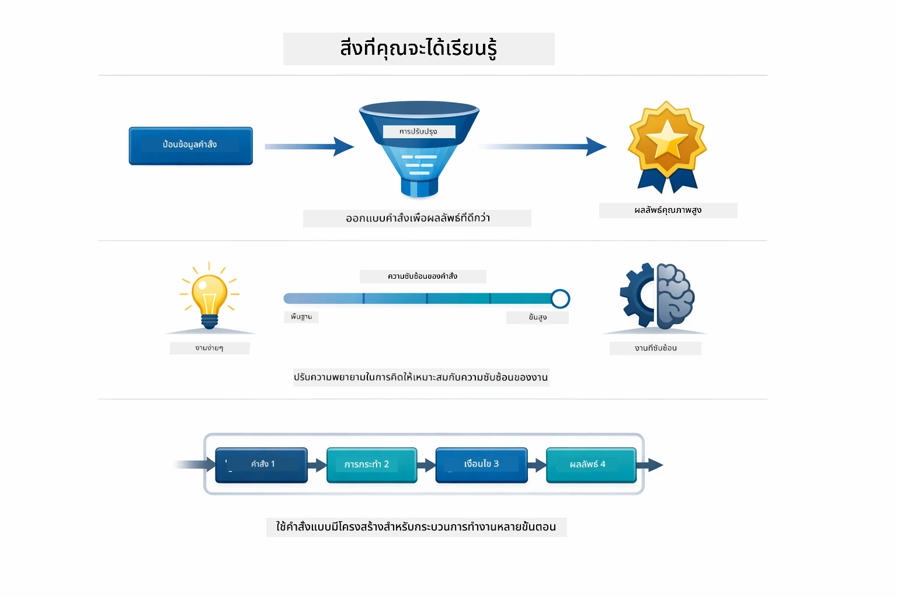
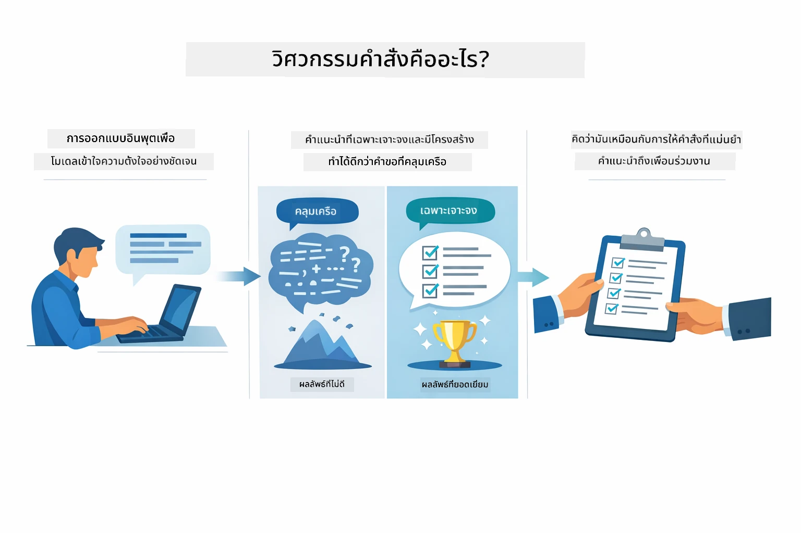
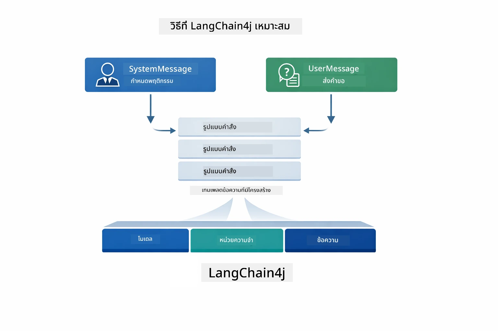
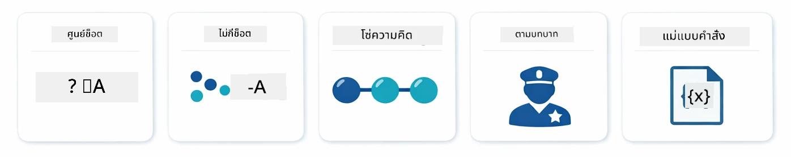
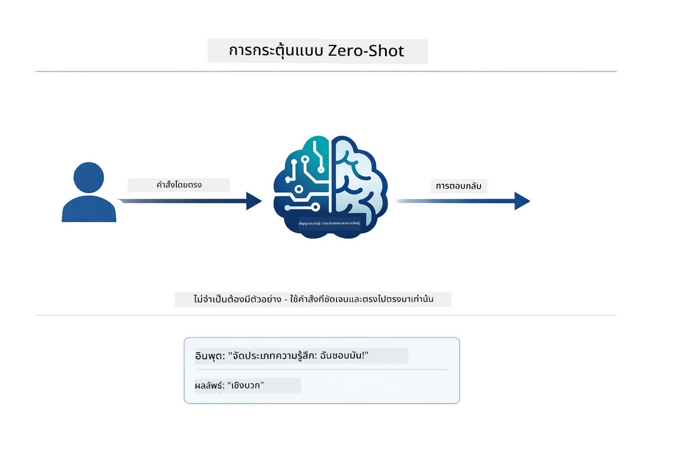
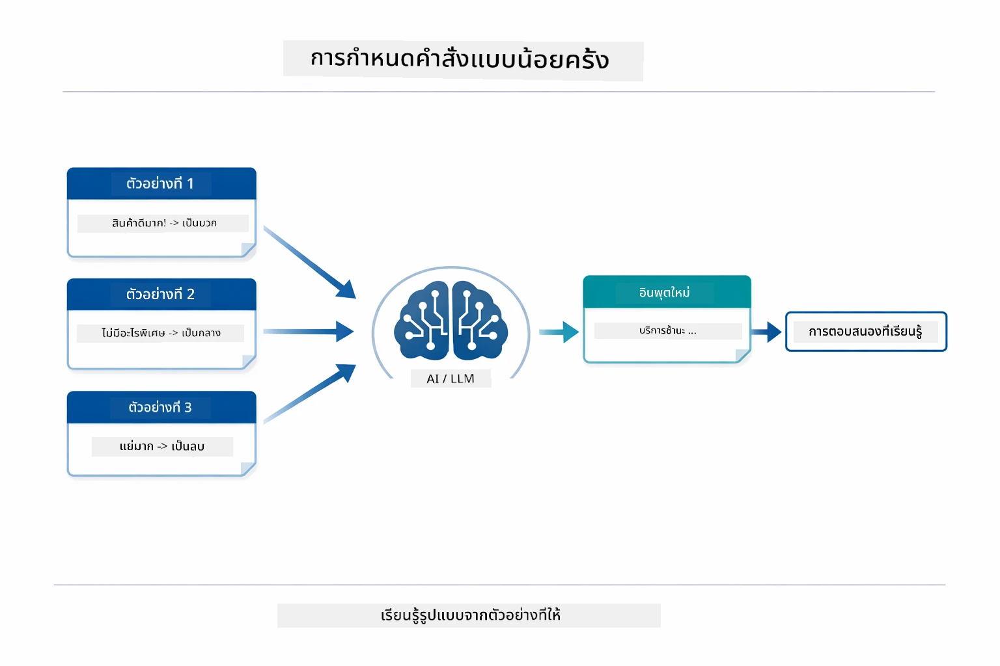
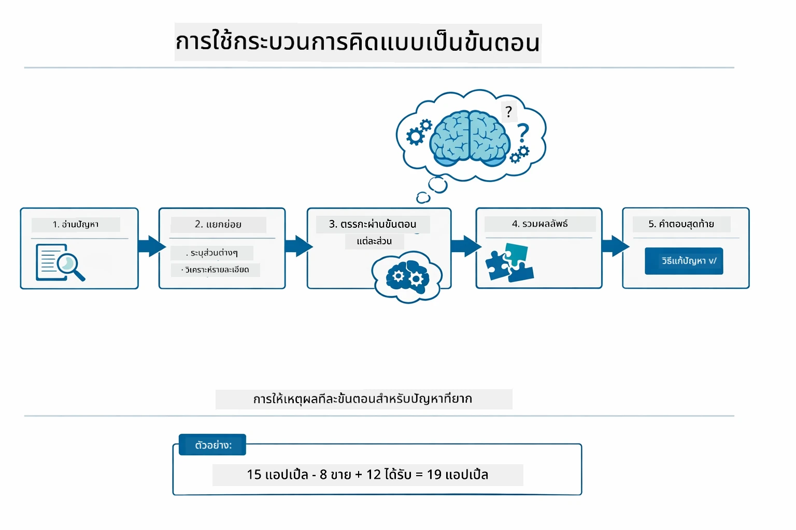
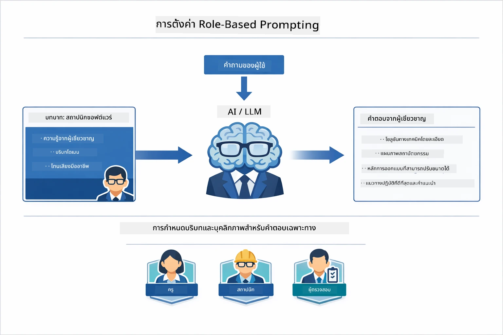
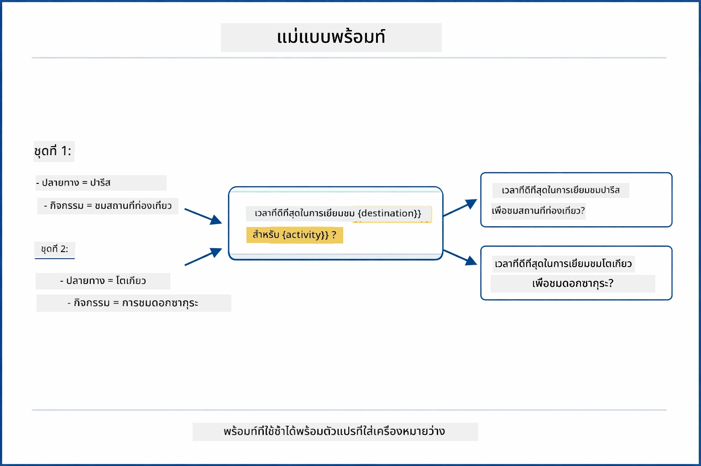
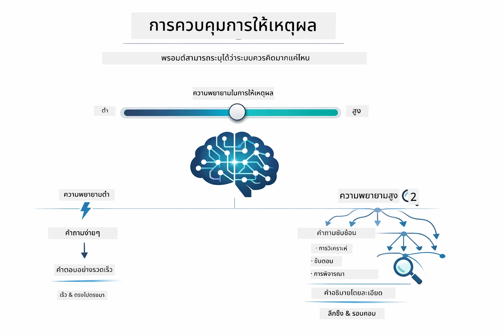

# Module 02: การออกแบบคำสั่งกับ GPT-5.2

## สารบัญ

- [วิดีโอสาธิต](../../../02-prompt-engineering)
- [สิ่งที่คุณจะได้เรียนรู้](../../../02-prompt-engineering)
- [ข้อกำหนดเบื้องต้น](../../../02-prompt-engineering)
- [ทำความเข้าใจการออกแบบคำสั่ง](../../../02-prompt-engineering)
- [พื้นฐานการออกแบบคำสั่ง](../../../02-prompt-engineering)
  - [Zero-Shot Prompting](../../../02-prompt-engineering)
  - [Few-Shot Prompting](../../../02-prompt-engineering)
  - [Chain of Thought](../../../02-prompt-engineering)
  - [Role-Based Prompting](../../../02-prompt-engineering)
  - [Prompt Templates](../../../02-prompt-engineering)
- [รูปแบบขั้นสูง](../../../02-prompt-engineering)
- [การใช้แหล่งข้อมูล Azure ที่มีอยู่](../../../02-prompt-engineering)
- [ภาพหน้าจอของแอปพลิเคชัน](../../../02-prompt-engineering)
- [การสำรวจรูปแบบ](../../../02-prompt-engineering)
  - [ความกระตือรือร้นต่ำกับสูง](../../../02-prompt-engineering)
  - [การดำเนินงานตามขั้นตอน (คำแนะนำเครื่องมือ)](../../../02-prompt-engineering)
  - [โค้ดที่สะท้อนความคิดตัวเอง](../../../02-prompt-engineering)
  - [การวิเคราะห์เชิงโครงสร้าง](../../../02-prompt-engineering)
  - [แชทแบบหลายรอบ](../../../02-prompt-engineering)
  - [การให้เหตุผลทีละขั้นตอน](../../../02-prompt-engineering)
  - [ผลลัพธ์ที่มีข้อจำกัด](../../../02-prompt-engineering)
- [สิ่งที่คุณกำลังเรียนรู้อย่างแท้จริง](../../../02-prompt-engineering)
- [ขั้นตอนถัดไป](../../../02-prompt-engineering)

## วิดีโอสาธิต

รับชมการถ่ายทอดสดนี้ที่อธิบายวิธีเริ่มต้นกับโมดูลนี้:

<a href="https://www.youtube.com/live/PJ6aBaE6bog?si=LDshyBrTRodP-wke"></a>

## สิ่งที่คุณจะได้เรียนรู้



ในโมดูลก่อนหน้านี้ คุณได้เห็นว่าความจำช่วยให้ AI การสนทนาได้อย่างไร และใช้โมเดล GitHub สำหรับการโต้ตอบพื้นฐาน ตอนนี้เราจะเน้นที่วิธีการถามคำถาม — หรือคำสั่งเอง — โดยใช้ GPT-5.2 ของ Azure OpenAI วิธีที่คุณจัดโครงสร้างคำสั่งมีผลอย่างมากต่อคุณภาพของคำตอบที่ได้รับ เราจะเริ่มด้วยการทบทวนเทคนิคพื้นฐานของการเขียนคำสั่ง จากนั้นไปสู่แปดรูปแบบขั้นสูงที่ใช้ประโยชน์เต็มที่จากความสามารถของ GPT-5.2

เราจะใช้ GPT-5.2 เพราะมันแนะนำการควบคุมการให้เหตุผล — คุณสามารถบอกโมเดลได้ว่าจะคิดมากแค่ไหนก่อนตอบ สิ่งนี้ทำให้กลยุทธ์การเขียนคำสั่งแตกต่างกันชัดเจนขึ้นและช่วยให้คุณเข้าใจว่าเมื่อไหร่ควรใช้แต่ละวิธี นอกจากนี้ เรายังได้รับประโยชน์จากข้อจำกัดอัตราการเรียกใช้ของ Azure ที่น้อยกว่า GPT-5.2 เมื่อเทียบกับโมเดล GitHub

## ข้อกำหนดเบื้องต้น

- สำเร็จโมดูล 01 แล้ว (มีการเปิดใช้ทรัพยากร Azure OpenAI เรียบร้อย)
- ไฟล์ `.env` อยู่ที่โฟลเดอร์หลักพร้อมข้อมูลรับรอง Azure (สร้างโดย `azd up` ในโมดูล 01)

> **หมายเหตุ:** หากคุณยังไม่ได้ทำโมดูล 01 ให้ทำตามคำแนะนำการติดตั้งที่นั่นก่อน

## ทำความเข้าใจการออกแบบคำสั่ง



การออกแบบคำสั่งคือการออกแบบข้อความนำเข้าเพื่อให้ได้ผลลัพธ์ที่คุณต้องการอย่างสม่ำเสมอ ไม่ใช่แค่การถามคำถาม — แต่เป็นการจัดโครงสร้างคำร้องเพื่อให้โมเดลเข้าใจอย่างชัดเจนว่าคุณต้องการอะไรและจะส่งมอบอย่างไร

คิดว่ามันเหมือนการให้คำสั่งกับเพื่อนร่วมงาน "แก้บั๊ก" คือคำสั่งที่ไม่ชัดเจน "แก้ไขข้อผิดพลาด null pointer exception ในไฟล์ UserService.java บรรทัดที่ 45 โดยเพิ่มการตรวจสอบ null" นั้นชัดเจน โมเดลภาษาเองก็เหมือนกัน — ความชัดเจนและโครงสร้างสำคัญ



LangChain4j ให้โครงสร้างพื้นฐาน — การเชื่อมต่อโมเดล, หน่วยความจำ, และประเภทข้อความ — ขณะที่รูปแบบการเขียนคำสั่งคือตัวข้อความที่จัดโครงสร้างอย่างรอบคอบที่คุณส่งผ่านโครงสร้างพื้นฐานนี้ ก้อนที่สำคัญได้แก่ `SystemMessage` (กำหนดพฤติกรรมและบทบาทของ AI) และ `UserMessage` (ซึ่งบรรจุคำขอของคุณจริงๆ)

## พื้นฐานการออกแบบคำสั่ง



ก่อนจะดำดิ่งสู่รูปแบบขั้นสูงในโมดูลนี้ ให้เราทบทวนเทคนิคการเขียนคำสั่งพื้นฐาน 5 แบบ นี่คือบล็อกพื้นฐานที่นักออกแบบคำสั่งทุกคนควรรู้ หากคุณเคยทำโมดูล [Quick Start](../00-quick-start/README.md#2-prompt-patterns) คุณจะเห็นสิ่งเหล่านี้ในสนามจริง — นี่คือกรอบแนวคิดเบื้องหลัง

### Zero-Shot Prompting

วิธีที่ง่ายที่สุด: ให้คำสั่งตรงๆ กับโมเดลโดยไม่มีตัวอย่าง โมเดลจะพึ่งพาการฝึกฝนทั้งหมดเพื่อเข้าใจและดำเนินการงาน วิธีนี้ดีสำหรับคำขอที่ตรงไปตรงมาที่พฤติกรรมที่คาดหวังชัดเจน



*คำสั่งตรงโดยไม่มีตัวอย่าง — โมเดลอนุมานงานจากคำสั่งเท่านั้น*

```java
String prompt = "Classify this sentiment: 'I absolutely loved the movie!'";
String response = model.chat(prompt);
// การตอบสนอง: "บวก"
```

**เมื่อใดควรใช้:** การจัดหมวดหมู่ที่ง่าย, คำถามตรง, การแปลภาษา หรือภารกิจใดๆ ที่โมเดลสามารถจัดการโดยไม่ต้องมีคำแนะนำเพิ่ม

### Few-Shot Prompting

ให้ตัวอย่างเพื่อแสดงรูปแบบที่คุณต้องการให้โมเดลทำตาม โมเดลเรียนรู้รูปแบบอินพุต-เอาต์พุตที่คาดหวังจากตัวอย่างและนำไปใช้กับข้อมูลใหม่ วิธีนี้ช่วยเพิ่มความสม่ำเสมอสำหรับงานที่รูปแบบหรือพฤติกรรมที่ต้องการไม่ชัดเจน



*เรียนรู้จากตัวอย่าง — โมเดลระบุรูปแบบและใช้กับข้อมูลใหม่*

```java
String prompt = """
    Classify the sentiment as positive, negative, or neutral.
    
    Examples:
    Text: "This product exceeded my expectations!" → Positive
    Text: "It's okay, nothing special." → Neutral
    Text: "Waste of money, very disappointed." → Negative
    
    Now classify this:
    Text: "Best purchase I've made all year!"
    """;
String response = model.chat(prompt);
```

**เมื่อใดควรใช้:** การจัดหมวดหมู่แบบกำหนดเอง, ฟอร์แมตที่สม่ำเสมอ, งานเฉพาะกลุ่มโดเมน, หรือเมื่อผลลัพธ์แบบ zero-shot ไม่สม่ำเสมอ

### Chain of Thought

ขอให้โมเดลแสดงเหตุผลทีละขั้นตอน แทนที่จะตอบทันที โมเดลจะแยกปัญหาและทำงานผ่านแต่ละส่วนอย่างชัดเจน วิธีนี้ช่วยเพิ่มความแม่นยำในการแก้โจทย์คณิตศาสตร์, ตรรกะ และปัญหาที่ต้องคิดหลายขั้นตอน



*เหตุผลทีละขั้นตอน — แยกปัญหาที่ซับซ้อนเป็นขั้นตอนตรรกะที่ชัดเจน*

```java
String prompt = """
    Problem: A store has 15 apples. They sell 8 apples and then 
    receive a shipment of 12 more apples. How many apples do they have now?
    
    Let's solve this step-by-step:
    """;
String response = model.chat(prompt);
// แบบจำลองแสดง: 15 - 8 = 7 จากนั้น 7 + 12 = 19 แอปเปิ้ล
```

**เมื่อใดควรใช้:** ปัญหาคณิตศาสตร์, ปริศนาตรรกะ, การแก้ดีบัก หรือภารกิจใดที่การแสดงกระบวนการคิดช่วยเพิ่มความแม่นยำและความน่าเชื่อถือ

### Role-Based Prompting

กำหนดบทบาทหรือบุคลิกของ AI ก่อนถามคำถาม วิธีนี้ให้บริบทที่กำหนดโทนเสียง, ความลึก และจุดสนใจของคำตอบ เช่น “สถาปนิกซอฟต์แวร์” ให้คำแนะนำที่แตกต่างจาก “นักพัฒนาระดับจูเนียร์” หรือ “ผู้ตรวจสอบความปลอดภัย”



*การกำหนดบริบทและบทบาท — คำถามเดียวกันได้คำตอบที่ต่างกันขึ้นกับบทบาทที่กำหนด*

```java
String prompt = """
    You are an experienced software architect reviewing code.
    Provide a brief code review for this function:
    
    def calculate_total(items):
        total = 0
        for item in items:
            total = total + item['price']
        return total
    """;
String response = model.chat(prompt);
```

**เมื่อใดควรใช้:** ตรวจสอบโค้ด, สอน, วิเคราะห์เฉพาะโดเมน หรือเมื่อคุณต้องการคำตอบที่เหมาะกับระดับความเชี่ยวชาญหรือมุมมองที่เจาะจง

### Prompt Templates

สร้างคำสั่งที่ใช้ซ้ำได้ด้วยช่องว่างสำหรับตัวแปร แทนที่จะเขียนคำสั่งใหม่ทุกครั้ง ให้กำหนดแม่แบบแล้วใส่ค่าแตกต่างกันคลาส `PromptTemplate` ของ LangChain4j ทำให้ง่ายด้วยไวยากรณ์ `{{variable}}`



*คำสั่งที่ใช้ซ้ำได้พร้อมช่องว่างสำหรับตัวแปร — แม่แบบเดียว ใช้งานได้หลายครั้ง*

```java
PromptTemplate template = PromptTemplate.from(
    "What's the best time to visit {{destination}} for {{activity}}?"
);

Prompt prompt = template.apply(Map.of(
    "destination", "Paris",
    "activity", "sightseeing"
));

String response = model.chat(prompt.text());
```

**เมื่อใดควรใช้:** คำถามที่ถามซ้ำกับข้อมูลแตกต่าง, การประมวลผลแบบกลุ่ม, สร้างเวิร์กโฟลว์ AI ที่ใช้ซ้ำได้ หรือสถานการณ์ที่โครงสร้างคำสั่งเหมือนเดิมแต่ข้อมูลเปลี่ยน

---

พื้นฐานห้าอย่างนี้ให้ชุดเครื่องมือที่มั่นคงสำหรับงานออกแบบคำสั่งส่วนใหญ่ ส่วนที่เหลือของโมดูลนี้ต่อยอดด้วย **แปดรูปแบบขั้นสูง** ที่ใช้ประโยชน์จากการควบคุมเหตุผลของ GPT-5.2, การประเมินตนเอง, และความสามารถในการออกผลลัพธ์แบบมีโครงสร้าง

## รูปแบบขั้นสูง

หลังจากเข้าใจพื้นฐานแล้ว มาดูแปดรูปแบบขั้นสูงที่ทำให้โมดูลนี้แตกต่าง ปัญหาไม่ใช่ทั้งหมดที่จะใช้วิธีเดียวกัน บางคำถามต้องตอบอย่างรวดเร็ว บางคำถามต้องคิดลึก บางคำถามต้องเห็นเหตุผล บางคำถามแค่ผลลัพธ์ รูปแบบแต่ละแบบด้านล่างถูกปรับให้เหมาะกับสถานการณ์ต่างๆ — และการควบคุมเหตุผลของ GPT-5.2 ทำให้ความต่างนี้ชัดเจนยิ่งขึ้น


*ภาพรวมแปดรูปแบบการออกแบบคำสั่งและกรณีใช้งาน*



*ความสามารถควบคุมเหตุผลของ GPT-5.2 ให้คุณกำหนดได้ว่าโมเดลควรคิดมากแค่ไหน — ตั้งแต่ตอบตรงเร็วไปจนถึงสำรวจลึก*

**ความกระตือรือร้นต่ำ (เร็วและตรงประเด็น)** — สำหรับคำถามง่ายที่ต้องการคำตอบตรงเร็ว โมเดลคิดน้อยมาก — สูงสุด 2 ขั้นตอน ใช้กับการคำนวณ, สืบค้น, หรือคำถามธรรมดา

```java
String prompt = """
    <context_gathering>
    - Search depth: very low
    - Bias strongly towards providing a correct answer as quickly as possible
    - Usually, this means an absolute maximum of 2 reasoning steps
    - If you think you need more time, state what you know and what's uncertain
    </context_gathering>
    
    Problem: What is 15% of 200?
    
    Provide your answer:
    """;

String response = chatModel.chat(prompt);
```

> 💡 **สำรวจด้วย GitHub Copilot:** เปิด [`Gpt5PromptService.java`](../../../02-prompt-engineering/src/main/java/com/example/langchain4j/prompts/service/Gpt5PromptService.java) แล้วถาม:
> - "ความแตกต่างระหว่างรูปแบบเขียนคำสั่งความกระตือรือร้นต่ำและสูงคืออะไร?"
> - "แท็ก XML ในคำสั่งช่วยจัดโครงสร้างการตอบของ AI อย่างไร?"
> - "เมื่อใดควรใช้รูปแบบสะท้อนคิดเองกับคำสั่งตรง?"

**ความกระตือรือร้นสูง (ลึกและละเอียด)** — สำหรับปัญหาซับซ้อนที่ต้องวิเคราะห์อย่างเต็มที่ โมเดลจะสำรวจอย่างละเอียดและแสดงเหตุผลชัดเจน ใช้กับการออกแบบระบบ, การตัดสินใจสถาปัตยกรรม, หรือการวิจัยซับซ้อน

```java
String prompt = """
    Analyze this problem thoroughly and provide a comprehensive solution.
    Consider multiple approaches, trade-offs, and important details.
    Show your analysis and reasoning in your response.
    
    Problem: Design a caching strategy for a high-traffic REST API.
    """;

String response = chatModel.chat(prompt);
```

**การดำเนินงานตามขั้นตอน (ความก้าวหน้าเป็นขั้น)** — สำหรับเวิร์กโฟลว์หลายขั้นตอน โมเดลนำเสนอแผนล่วงหน้า เล่าขั้นตอนทีละขั้น แล้วสรุป ใช้สำหรับการย้ายระบบ, การนำไปใช้, หรือกระบวนการหลายขั้นตอน

```java
String prompt = """
    <task_execution>
    1. First, briefly restate the user's goal in a friendly way
    
    2. Create a step-by-step plan:
       - List all steps needed
       - Identify potential challenges
       - Outline success criteria
    
    3. Execute each step:
       - Narrate what you're doing
       - Show progress clearly
       - Handle any issues that arise
    
    4. Summarize:
       - What was completed
       - Any important notes
       - Next steps if applicable
    </task_execution>
    
    <tool_preambles>
    - Always begin by rephrasing the user's goal clearly
    - Outline your plan before executing
    - Narrate each step as you go
    - Finish with a distinct summary
    </tool_preambles>
    
    Task: Create a REST endpoint for user registration
    
    Begin execution:
    """;

String response = chatModel.chat(prompt);
```

การใช้ Chain-of-Thought คือการขอให้โมเดลแสดงเหตุผลอย่างชัดเจน ทำให้เพิ่มความแม่นยำสำหรับงานซับซ้อน การแยกเหตุผลทีละขั้นช่วยให้ทั้งมนุษย์และ AI เข้าใจกฎเหตุผล

> **🤖 ลองกับ [GitHub Copilot](https://github.com/features/copilot) Chat:** ถามเกี่ยวกับรูปแบบนี้:
> - "ฉันจะปรับรูปแบบการดำเนินงานตามขั้นตอนเพื่อรองรับงานที่ใช้เวลานานอย่างไร?"
> - "แนวทางปฏิบัติที่ดีที่สุดสำหรับจัดการคำแนะนำเครื่องมือในแอปผลิตจริงคืออะไร?"
> - "จะจับและแสดงความก้าวหน้าระหว่างทางใน UI ได้อย่างไร?"


*วางแผน → ดำเนินงาน → สรุป สำหรับงานหลายขั้นตอน*

**โค้ดที่สะท้อนความคิดตัวเอง** — สำหรับการสร้างโค้ดคุณภาพใช้ในผลิต โมเดลสร้างโค้ดตามมาตรฐานพร้อมจัดการข้อผิดพลาดอย่างเหมาะสม ใช้สำหรับพัฒนาฟีเจอร์หรือบริการใหม่

```java
String prompt = """
    Generate Java code with production-quality standards: Create an email validation service
    Keep it simple and include basic error handling.
    """;

String response = chatModel.chat(prompt);
```


*วงจรปรับปรุงซ้ำ — สร้าง, ประเมิน, หาข้อผิดพลาด, ปรับปรุง, ทำซ้ำ*

**การวิเคราะห์เชิงโครงสร้าง** — สำหรับการประเมินอย่างสม่ำเสมอ โมเดลตรวจสอบโค้ดโดยใช้กรอบงานตายตัว (ความถูกต้อง, แนวปฏิบัติ, ประสิทธิภาพ, ความปลอดภัย, การบำรุงรักษา) ใช้สำหรับรีวิวโค้ดหรือประเมินคุณภาพ

```java
String prompt = """
    <analysis_framework>
    You are an expert code reviewer. Analyze the code for:
    
    1. Correctness
       - Does it work as intended?
       - Are there logical errors?
    
    2. Best Practices
       - Follows language conventions?
       - Appropriate design patterns?
    
    3. Performance
       - Any inefficiencies?
       - Scalability concerns?
    
    4. Security
       - Potential vulnerabilities?
       - Input validation?
    
    5. Maintainability
       - Code clarity?
       - Documentation?
    
    <output_format>
    Provide your analysis in this structure:
    - Summary: One-sentence overall assessment
    - Strengths: 2-3 positive points
    - Issues: List any problems found with severity (High/Medium/Low)
    - Recommendations: Specific improvements
    </output_format>
    </analysis_framework>
    
    Code to analyze:
    ```
    public List getUsers() {
        return database.query("SELECT * FROM users");
    }
    ```
    Provide your structured analysis:
    """;

String response = chatModel.chat(prompt);
```

> **🤖 ลองกับ [GitHub Copilot](https://github.com/features/copilot) Chat:** ถามเกี่ยวกับการวิเคราะห์เชิงโครงสร้าง:
> - "จะปรับแต่งกรอบงานวิเคราะห์สำหรับประเภทการรีวิวโค้ดต่างๆ ได้อย่างไร?"
> - "วิธีที่ดีที่สุดในการแยกวิเคราะห์และใช้งานผลลัพธ์เชิงโครงสร้างคืออะไร?"
> - "จะทำอย่างไรให้ระดับความรุนแรงคงที่ระหว่างการรีวิวหลายรอบ?"


*กรอบงานสำหรับรีวิวโค้ดอย่างสม่ำเสมอพร้อมระดับความรุนแรง*

**แชทแบบหลายรอบ** — สำหรับการสนทนาที่ต้องการบริบท โมเดลจดจำข้อความก่อนหน้าและสร้างจากนั้น ใช้สำหรับการช่วยเหลือแบบโต้ตอบหรือถามตอบซับซ้อน

```java
ChatMemory memory = MessageWindowChatMemory.withMaxMessages(10);

memory.add(UserMessage.from("What is Spring Boot?"));
AiMessage aiMessage1 = chatModel.chat(memory.messages()).aiMessage();
memory.add(aiMessage1);

memory.add(UserMessage.from("Show me an example"));
AiMessage aiMessage2 = chatModel.chat(memory.messages()).aiMessage();
memory.add(aiMessage2);
```


*บริบทการสนทนาสะสมผ่านหลายรอบจนถึงขีดจำกัดโทเค็น*

**การให้เหตุผลทีละขั้นตอน** — สำหรับปัญหาที่ต้องการเห็นตรรกะอย่างชัดเจน โมเดลแสดงเหตุผลชัดเจนในแต่ละขั้นตอน ใช้กับโจทย์คณิตศาสตร์, ปริศนาตรรกะ หรือเมื่ออยากเข้าใจกระบวนการคิด

```java
String prompt = """
    <instruction>Show your reasoning step-by-step</instruction>
    
    If a train travels 120 km in 2 hours, then stops for 30 minutes,
    then travels another 90 km in 1.5 hours, what is the average speed
    for the entire journey including the stop?
    """;

String response = chatModel.chat(prompt);
```


*แยกปัญหาเป็นขั้นตอนตรรกะที่ชัดเจน*

**ผลลัพธ์ที่มีข้อจำกัด** — สำหรับคำตอบที่ต้องการรูปแบบเฉพาะ โมเดลปฏิบัติตามกฎรูปแบบและความยาวอย่างเคร่งครัด ใช้สำหรับสรุปหรือเมื่อคุณต้องการโครงสร้างผลลัพธ์ที่แม่นยำ

```java
String prompt = """
    <constraints>
    - Exactly 100 words
    - Bullet point format
    - Technical terms only
    </constraints>
    
    Summarize the key concepts of machine learning.
    """;

String response = chatModel.chat(prompt);
```


*บังคับใช้รูปแบบ, ความยาว, และข้อกำหนดโครงสร้างเฉพาะ*

## การใช้แหล่งข้อมูล Azure ที่มีอยู่

**ตรวจสอบการติดตั้ง:**

ตรวจสอบให้แน่ใจว่าไฟล์ `.env` อยู่ที่โฟลเดอร์หลักพร้อมข้อมูลรับรอง Azure (สร้างระหว่างโมดูล 01):
```bash
cat ../.env  # ควรแสดง AZURE_OPENAI_ENDPOINT, API_KEY, DEPLOYMENT
```

**เริ่มแอปพลิเคชัน:**

> **หมายเหตุ:** หากคุณเริ่มแอปทั้งหมดแล้วโดยใช้ `./start-all.sh` จากโมดูล 01 โมดูลนี้กำลังทำงานที่พอร์ต 8083 แล้ว คุณสามารถข้ามคำสั่งเริ่มด้านล่างและไปที่ http://localhost:8083 ได้เลย
**ตัวเลือกที่ 1: การใช้ Spring Boot Dashboard (แนะนำสำหรับผู้ใช้ VS Code)**

dev container มีส่วนขยาย Spring Boot Dashboard ซึ่งให้ส่วนติดต่อผู้ใช้แบบกราฟิกเพื่อจัดการกับแอปพลิเคชัน Spring Boot ทั้งหมด คุณสามารถหาได้ที่ Activity Bar ทางด้านซ้ายของ VS Code (มองหาไอคอน Spring Boot)

จาก Spring Boot Dashboard คุณสามารถ:
- ดูแอปพลิเคชัน Spring Boot ทั้งหมดที่มีใน workspace
- เริ่ม/หยุดแอปพลิเคชันด้วยการคลิกครั้งเดียว
- ดูบันทึกของแอปพลิเคชันแบบเรียลไทม์
- ติดตามสถานะของแอปพลิเคชัน

แค่คลิกปุ่มเล่นข้างๆ "prompt-engineering" เพื่อเริ่มโมดูลนี้ หรือเริ่มโมดูลทั้งหมดพร้อมกัน


**ตัวเลือกที่ 2: การใช้สคริปต์ shell**

เริ่มแอปพลิเคชันเว็บทั้งหมด (โมดูล 01-04):

**Bash:**
```bash
cd ..  # จากไดเรกทอรีราก
./start-all.sh
```

**PowerShell:**
```powershell
cd ..  # จากไดเรกทอรีราก
.\start-all.ps1
```

หรือเริ่มแค่โมดูลนี้:

**Bash:**
```bash
cd 02-prompt-engineering
./start.sh
```

**PowerShell:**
```powershell
cd 02-prompt-engineering
.\start.ps1
```

ทั้งสองสคริปต์จะโหลดตัวแปรสภาพแวดล้อมจากไฟล์ `.env` ที่รูทโดยอัตโนมัติ และจะสร้าง JARs หากยังไม่มี

> **หมายเหตุ:** หากคุณต้องการสร้างโมดูลทั้งหมดด้วยตนเองก่อนเริ่ม:
>
> **Bash:**
> ```bash
> cd ..  # Go to root directory
> mvn clean package -DskipTests
> ```
>
> **PowerShell:**
> ```powershell
> cd ..  # Go to root directory
> mvn clean package -DskipTests
> ```

เปิด http://localhost:8083 ในเบราว์เซอร์ของคุณ

**เพื่อหยุด:**

**Bash:**
```bash
./stop.sh  # โมดูลนี้เท่านั้น
# หรือ
cd .. && ./stop-all.sh  # ทุกโมดูล
```

**PowerShell:**
```powershell
.\stop.ps1  # เฉพาะโมดูลนี้
# หรือ
cd ..; .\stop-all.ps1  # ทุกโมดูล
```

## ภาพหน้าจอแอปพลิเคชัน


*แดชบอร์ดหลักแสดงรูปแบบ prompt engineering ทั้งหมด 8 รูปแบบพร้อมลักษณะและกรณีการใช้งานของแต่ละรูปแบบ*

## การสำรวจรูปแบบต่างๆ

อินเทอร์เฟซเว็บให้คุณทดลองใช้กลยุทธ์การ prompt ที่แตกต่างกัน แต่ละรูปแบบแก้ปัญหาต่างกัน — ลองใช้เพื่อดูว่ากรณีไหนแต่ละวิธีเหมาะสมที่สุด

> **หมายเหตุ: การสตรีมกับไม่สตรีม** — ทุกหน้ารูปแบบมีปุ่มสองปุ่ม: **🔴 Stream Response (Live)** และตัวเลือก **Non-streaming** การสตรีมใช้ Server-Sent Events (SSE) เพื่อแสดง token แบบเรียลไทม์ขณะที่โมเดลสร้างคำตอบ ทำให้คุณเห็นความคืบหน้าได้ทันที ตัวเลือกแบบไม่สตรีมจะรอจนได้คำตอบทั้งหมดก่อนจึงแสดง สำหรับ prompt ที่ต้องการการวิเคราะห์ลึก (เช่น High Eagerness, Self-Reflecting Code) การเรียกแบบไม่สตรีมอาจใช้เวลานานมาก — บางครั้งนานเป็นนาที — โดยไม่มีฟีดแบ็กที่มองเห็นได้ **ให้ใช้การสตรีมเมื่อทดลองกับ prompt ซับซ้อน** เพื่อให้คุณเห็นโมเดลกำลังทำงานและหลีกเลี่ยงความรู้สึกว่าคำขอหมดเวลาแล้ว
>
> **หมายเหตุ: ความต้องการเบราว์เซอร์** — ฟีเจอร์สตรีมใช้ Fetch Streams API (`response.body.getReader()`) ซึ่งต้องใช้เบราว์เซอร์แบบเต็ม (Chrome, Edge, Firefox, Safari) ไม่สามารถทำงานได้ใน Simple Browser ที่ฝังมากับ VS Code เนื่องจากส่วน webview ไม่รองรับ ReadableStream API หากคุณใช้ Simple Browser ปุ่มแบบไม่สตรีมยังทำงานได้ตามปกติ — มีผลกระทบเฉพาะปุ่มแบบสตรีม เปิด `http://localhost:8083` ในเบราว์เซอร์ภายนอกเพื่อประสบการณ์เต็มรูปแบบ

### ความกระตือรือร้นต่ำกับสูง

ถามคำถามง่ายๆ เช่น "15% ของ 200 คือเท่าไหร่?" โดยใช้ Low Eagerness คุณจะได้รับคำตอบทันทีและตรงไปตรงมา ตอนนี้ถามคำถามซับซ้อน เช่น "ออกแบบกลยุทธ์การแคชสำหรับ API ที่มีการใช้งานสูง" โดยใช้ High Eagerness คลิก **🔴 Stream Response (Live)** แล้วดูการวิเคราะห์รายละเอียดโดยโมเดลแสดงออกมาเป็น token ทีละตัว โมเดลเดียวกัน โครงสร้างคำถามเหมือนกัน — แต่ prompt กำหนดระดับความคิดที่ต้องทำ

### การดำเนินงานแบบทีละขั้นตอน (Tool Preambles)

เวิร์กโฟลว์ที่มีหลายขั้นตอนจะได้ประโยชน์จากการวางแผนล่วงหน้าและการบรรยายความคืบหน้า โมเดลจะสรุปก่อนว่าต้องทำอะไร บรรยายแต่ละขั้นตอน จากนั้นสรุปผลลัพธ์

### Self-Reflecting Code

ลอง "สร้างบริการตรวจสอบอีเมล" แทนที่จะสร้างโค้ดอย่างเดียวและหยุด โมเดลจะสร้าง ประเมินตามเกณฑ์คุณภาพ ระบุจุดอ่อน และปรับปรุง คุณจะเห็นมันวนลูปจนโค้ดมีมาตรฐานสำหรับใช้งานจริง

### การวิเคราะห์แบบมีโครงสร้าง

การตรวจสอบโค้ดต้องการกรอบการประเมินที่สม่ำเสมอ โมเดลจะวิเคราะห์โค้ดโดยใช้หมวดหมู่ที่กำหนดไว้ เช่น ความถูกต้อง แนวทางปฏิบัติ ประสิทธิภาพ และความปลอดภัย พร้อมระดับความรุนแรง

### การสนทนาแบบหลายรอบ

ถาม "Spring Boot คืออะไร?" แล้วตามด้วย "ยกตัวอย่างให้ดู" ทันที โมเดลจะจำคำถามแรกและให้ตัวอย่าง Spring Boot โดยเฉพาะ หากไม่มีความจำ คำถามที่สองจะกว้างเกินไป

### การวิเคราะห์ทีละขั้นตอน

เลือกโจทย์คณิตศาสตร์และลองทั้ง Step-by-Step Reasoning กับ Low Eagerness Low eagerness ให้คำตอบเร็วแต่ไม่แสดงรายละเอียด Step-by-step จะแสดงการคำนวณและการตัดสินใจทุกขั้นตอน

### ผลลัพธ์ที่จำกัด

เมื่อคุณต้องการรูปแบบหรือจำนวนคำที่เฉพาะเจาะจง รูปแบบนี้จะบังคับให้ปฏิบัติตามอย่างเข้มงวด ลองสร้างสรุปที่มี 100 คำอย่างเป๊ะในรูปแบบหัวข้อย่อย

## สิ่งที่คุณกำลังเรียนรู้จริงๆ

**ความพยายามในการให้เหตุผลเปลี่ยนทุกอย่าง**

GPT-5.2 ให้คุณควบคุมความพยายามในการประมวลผลผ่าน prompt ของคุณ ความพยายามต่ำหมายถึงตอบเร็วพร้อมการสำรวจน้อย ความพยายามสูงหมายถึงโมเดลต้องใช้เวลาคิดลึก คุณเรียนรู้ที่จะจับคู่ความพยายามกับความซับซ้อนของงาน — อย่าเสียเวลากับคำถามง่ายๆ แต่ก็อย่าเร่งรีบในการตัดสินใจซับซ้อน

**โครงสร้างชี้นำพฤติกรรม**

สังเกตแท็ก XML ใน prompt ไหม? ไม่ใช่แค่การตกแต่ง โมเดลติดตามคำสั่งที่มีโครงสร้างได้แม่นยำกว่าข้อความอิสระ เมื่อคุณต้องการกระบวนการหลายขั้นตอนหรือตรรกะซับซ้อน โครงสร้างช่วยให้โมเดลรู้ว่ากำลังอยู่ส่วนไหนและจะทำอะไรต่อ


*โครงสร้างของ prompt ที่จัดอย่างดีมีส่วนชัดเจนและการจัดการในแบบ XML*

**คุณภาพผ่านการประเมินตนเอง**

รูปแบบ self-reflecting ทำงานโดยระบุเกณฑ์คุณภาพอย่างชัดเจน แทนที่จะหวังว่าโมเดลจะ "ทำถูก" คุณบอกมันว่าคำว่า "ถูกต้อง" คืออะไร: ตรรกะที่ถูกต้อง การจัดการข้อผิดพลาด ประสิทธิภาพ ความปลอดภัย โมเดลจึงประเมินผลลัพธ์ของตนเองและปรับปรุง ซึ่งเปลี่ยนการสร้างโค้ดจากการลุ้นโชคเป็นกระบวนการ

**บริบทมีขีดจำกัด**

การสนทนาแบบหลายรอบทำงานโดยรวมประวัติข้อความในแต่ละคำขอ แต่มีขีดจำกัด — ทุกโมเดลมีโทเคนสูงสุด เมื่อบทสนทนายาวขึ้น คุณต้องมีกลยุทธ์ในการเก็บบริบทที่เกี่ยวข้องโดยไม่เกินขีดจำกัด โมดูลนี้แสดงให้เห็นว่า memory ทำงานอย่างไร; ต่อไปคุณจะเรียนรู้ว่าเมื่อไหร่ควรสรุป เมื่อไหร่ควรลืม และเมื่อไหร่ควรดึงข้อมูลคืน

## ขั้นตอนถัดไป

**โมดูลถัดไป:** [03-rag - RAG (Retrieval-Augmented Generation)](../03-rag/README.md)

---

**นำทาง:** [← ก่อนหน้า: โมดูล 01 - บทนำ](../01-introduction/README.md) | [กลับไปยังหน้าหลัก](../README.md) | [ถัดไป: โมดูล 03 - RAG →](../03-rag/README.md)

---

<!-- CO-OP TRANSLATOR DISCLAIMER START -->
**ข้อจำกัดความรับผิดชอบ**:
เอกสารฉบับนี้ได้รับการแปลโดยใช้บริการแปลภาษาอัตโนมัติ [Co-op Translator](https://github.com/Azure/co-op-translator) แม้เราจะพยายามให้ความถูกต้องสูงสุด แต่โปรดทราบว่าการแปลโดยอัตโนมัติอาจมีข้อผิดพลาดหรือความไม่ถูกต้อง เอกสารต้นฉบับในภาษาต้นทางถือเป็นแหล่งข้อมูลที่เชื่อถือได้ สำหรับข้อมูลที่สำคัญ ขอแนะนำให้ใช้บริการแปลโดยมืออาชีพ เราไม่รับผิดชอบต่อความเข้าใจผิดหรือการตีความผิดที่เกิดขึ้นจากการใช้การแปลนี้
<!-- CO-OP TRANSLATOR DISCLAIMER END -->