# Module 03: RAG (Retrieval-Augmented Generation)

## Table of Contents

- [Video Walkthrough](../../../03-rag)
- [What You'll Learn](../../../03-rag)
- [Prerequisites](../../../03-rag)
- [Understanding RAG](../../../03-rag)
  - [Which RAG Approach Does This Tutorial Use?](../../../03-rag)
- [How It Works](../../../03-rag)
  - [Document Processing](../../../03-rag)
  - [Creating Embeddings](../../../03-rag)
  - [Semantic Search](../../../03-rag)
  - [Answer Generation](../../../03-rag)
- [Run the Application](../../../03-rag)
- [Using the Application](../../../03-rag)
  - [Upload a Document](../../../03-rag)
  - [Ask Questions](../../../03-rag)
  - [Check Source References](../../../03-rag)
  - [Experiment with Questions](../../../03-rag)
- [Key Concepts](../../../03-rag)
  - [Chunking Strategy](../../../03-rag)
  - [Similarity Scores](../../../03-rag)
  - [In-Memory Storage](../../../03-rag)
  - [Context Window Management](../../../03-rag)
- [When RAG Matters](../../../03-rag)
- [Next Steps](../../../03-rag)

## Video Walkthrough

ดูเซสชันถ่ายทอดสดนี้ที่อธิบายวิธีเริ่มต้นทำงานกับโมดูลนี้:

<a href="https://www.youtube.com/watch?v=_olq75ZH_eY"></a>

## What You'll Learn

ในโมดูลก่อนหน้านี้ คุณได้เรียนรู้วิธีการสนทนากับ AI และจัดโครงสร้างพรอมต์ของคุณได้อย่างมีประสิทธิภาพ แต่มีข้อจำกัดพื้นฐานคือ: โมเดลภาษา (language models) รู้เฉพาะสิ่งที่เรียนรู้ในระหว่างการฝึกเท่านั้น พวกมันไม่สามารถตอบคำถามเกี่ยวกับนโยบายบริษัทของคุณ, เอกสารโครงการของคุณ หรือข้อมูลใดๆ ที่ไม่ได้ถูกฝึกสอน

RAG (Retrieval-Augmented Generation) แก้ปัญหานี้ แทนที่จะพยายามสอนข้อมูลของคุณให้กับโมเดล (ซึ่งแพงและไม่เหมาะสม) คุณให้โมเดลมีความสามารถในการค้นหาผ่านเอกสารของคุณ เมื่อมีคนถามคำถาม ระบบจะค้นหาข้อมูลที่เกี่ยวข้องและรวมข้อมูลนั้นไว้ในพรอมต์ โมเดลจึงตอบกลับโดยอิงบริบทที่ถูกดึงมา

คิดว่า RAG เหมือนกับการให้โมเดลมีห้องสมุดอ้างอิง เมื่อคุณถามคำถาม ระบบจะ:

1. **User Query** – คุณถามคำถาม
2. **Embedding** – แปลงคำถามของคุณเป็นเวกเตอร์
3. **Vector Search** – ค้นหาชิ้นส่วนของเอกสารที่คล้ายกัน
4. **Context Assembly** – เพิ่มชิ้นส่วนที่เกี่ยวข้องในพรอมต์
5. **Response** – LLM สร้างคำตอบโดยอิงจากบริบทนั้น

นี่ทำให้คำตอบของโมเดลมีพื้นฐานจากข้อมูลจริงของคุณ แทนที่จะพึ่งพาความรู้จากการฝึกหรือสร้างคำตอบขึ้นเอง

## Prerequisites

- ผ่าน [Module 00 - Quick Start](../00-quick-start/README.md) แล้ว (สำหรับตัวอย่าง Easy RAG ที่อ้างถึงด้านบน)
- ผ่าน [Module 01 - Introduction](../01-introduction/README.md) แล้ว (ทรัพยากร Azure OpenAI ถูกติดตั้ง รวมถึงโมเดล embedding `text-embedding-3-small`)
- ไฟล์ `.env` ในไดเรกทอรีรากที่มีข้อมูลรับรอง Azure (สร้างโดยคำสั่ง `azd up` ใน Module 01)

> **หมายเหตุ:** หากคุณยังไม่ได้ทำ Module 01 ให้ทำตามคำแนะนำการติดตั้งขั้นตอนนั้นก่อน คำสั่ง `azd up` จะติดตั้งโมเดล GPT chat และโมเดล embedding ที่ใช้ในโมดูลนี้

## Understanding RAG

แผนภาพด้านล่างแสดงแนวคิดหลัก: แทนที่จะอิงแค่ข้อมูลการฝึกของโมเดล RAG ให้โมเดลมีห้องสมุดอ้างอิงของเอกสารของคุณเพื่อใช้ปรึกษาก่อนสร้างคำตอบแต่ละครั้ง

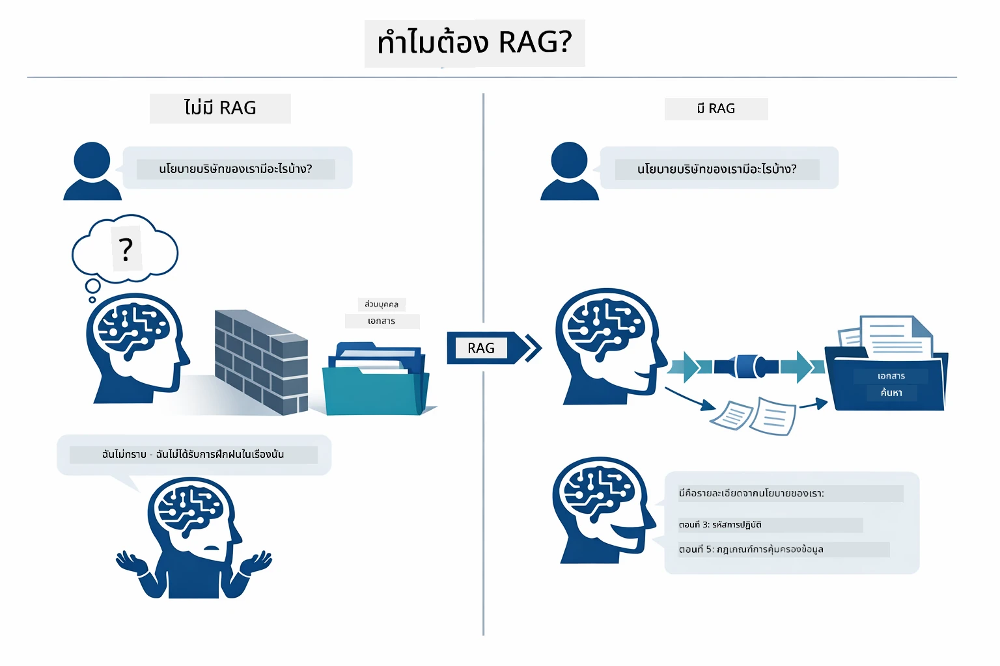

*แผนภาพนี้แสดงความแตกต่างระหว่าง LLM ธรรมดา (ที่เดาคำตอบจากข้อมูลฝึก) กับ LLM ที่เพิ่ม RAG (ที่ปรึกษาเอกสารของคุณก่อน)*

นี่คือวิธีเชื่อมต่อของแต่ละส่วนตั้งแต่ต้นจนจบ คำถามของผู้ใช้ผ่านสี่ขั้นตอน — embedding, การค้นหาเวกเตอร์, การประกอบบริบท และการสร้างคำตอบ — โดยแต่ละขั้นตอนต่อเนื่องจากขั้นก่อนหน้า:


*แผนภาพนี้แสดงสายงาน RAG ตั้งแต่ต้นจนจบ — คำถามของผู้ใช้ผ่าน embedding, การค้นหาเวกเตอร์, การประกอบบริบท และการสร้างคำตอบ*

ส่วนที่เหลือของโมดูลนี้จะพาไล่ทีละขั้นตอนอย่างละเอียด พร้อมโค้ดที่คุณสามารถเรียกใช้และแก้ไขได้

### Which RAG Approach Does This Tutorial Use?

LangChain4j มีสามวิธีในการใช้งาน RAG โดยแต่ละวิธีมีระดับนามธรรมต่างกัน แผนภาพด้านล่างเปรียบเทียบวิธีเหล่านั้นเคียงข้างกัน:

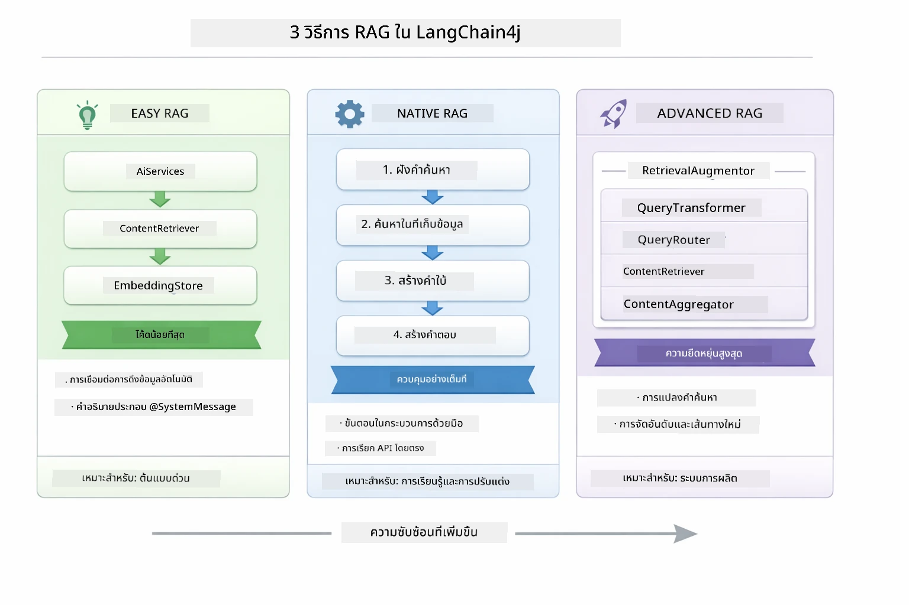

*แผนภาพนี้เปรียบเทียบสามวิธี RAG ใน LangChain4j — Easy, Native และ Advanced — แสดงส่วนประกอบหลักและช่วงเวลาที่ควรใช้*

| Approach | What It Does | Trade-off |
|---|---|---|
| **Easy RAG** | เชื่อมต่อทุกอย่างอัตโนมัติผ่าน `AiServices` และ `ContentRetriever` คุณแค่กำกับ interface และแนบ retriever, LangChain4j จะจัดการ embedding, การค้นหา และการประกอบพรอมต์ให้เอง | โค้ดน้อย แต่มองไม่เห็นสิ่งที่เกิดขึ้นในแต่ละขั้นตอน |
| **Native RAG** | คุณเรียกใช้โมเดล embedding, ค้นหาในที่เก็บ, สร้างพรอมต์ และสร้างคำตอบเอง — ทีละขั้นตอนอย่างชัดเจน | โค้ดมากขึ้น แต่เห็นและแก้ไขแต่ละขั้นตอนได้ |
| **Advanced RAG** | ใช้เฟรมเวิร์ก `RetrievalAugmentor` ที่มีตัวแปลง query, router, re-ranker และ content injector แบบ pluggable สำหรับสายงานคุณภาพการผลิต | มีความยืดหยุ่นสูงสุด แต่ซับซ้อนมากขึ้นอย่างมีนัยสำคัญ |

**บทเรียนนี้ใช้วิธี Native** แต่ละขั้นตอนของ pipeline RAG — embedding คำถาม, ค้นหาในที่เก็บเวกเตอร์, ประกอบบริบท และสร้างคำตอบ — เขียนอย่างชัดเจนใน [`RagService.java`](../../../03-rag/src/main/java/com/example/langchain4j/rag/service/RagService.java) โดยมีเจตนา: ในฐานะแหล่งเรียนรู้ การที่คุณสามารถเห็นและเข้าใจแต่ละขั้นตอนมีความสำคัญกว่าการลดโค้ดให้น้อย เมื่อคุณเข้าใจว่าแต่ละส่วนเชื่อมต่อกันอย่างไรแล้ว คุณสามารถก้าวไปใช้ Easy RAG สำหรับต้นแบบเร็ว ๆ หรือ Advanced RAG สำหรับระบบผลิต

> **💡 เคยเห็น Easy RAG แล้วใช่ไหม?** โมดูล [Quick Start](../00-quick-start/README.md) รวมตัวอย่าง Document Q&A ([`SimpleReaderDemo.java`](../../../00-quick-start/src/main/java/com/example/langchain4j/quickstart/SimpleReaderDemo.java)) ที่ใช้ Easy RAG — LangChain4j จะจัดการ embedding, การค้นหา และการประกอบพรอมต์ให้โดยอัตโนมัติ โมดูลนี้จะพาคุณเปิด pipeline นั้นเพื่อให้คุณเห็นและควบคุมแต่ละขั้นตอนด้วยตัวเอง

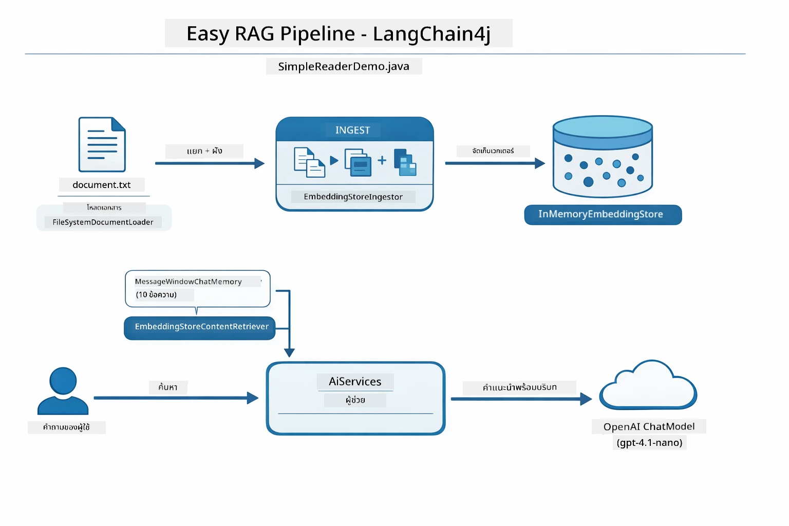

*แผนภาพนี้แสดง pipeline Easy RAG จาก `SimpleReaderDemo.java` เปรียบเทียบกับวิธี Native ที่ใช้ในโมดูลนี้: Easy RAG ซ่อน embedding, retrieval และการประกอบพรอมต์ไว้หลัง `AiServices` และ `ContentRetriever` — คุณโหลดเอกสาร, แนบ retriever แล้วรับคำตอบได้ ส่วน Native ในโมดูลนี้จะแยก pipeline นั้นออกมาให้คุณเรียกแต่ละขั้นตอน (embed, search, assemble context, generate) เองอย่างชัดเจน มีความโปร่งใสและควบคุมได้เต็มที่*

## How It Works

pipeline RAG ในโมดูลนี้แบ่งออกเป็นสี่ขั้นตอนที่ทำงานเรียงลำดับเมื่อผู้ใช้ถามคำถาม ก่อนอื่น เอกสารที่อัปโหลดจะถูก **แยกและแบ่งเป็นชิ้นส่วน** ชิ้นส่วนนั้นจะถูกแปลงเป็น **embedding แบบเวกเตอร์** และจัดเก็บเพื่อการเปรียบเทียบเชิงคณิตศาสตร์ เมื่อมีคำถามเข้ามา ระบบจะทำ **การค้นหาเชิงความหมาย** เพื่อหาชิ้นส่วนที่เกี่ยวข้องที่สุด และสุดท้ายส่งชิ้นส่วนเหล่านั้นเป็นบริบทให้ LLM เพื่อ **สร้างคำตอบ** ส่วนต่างๆ ด้านล่างจะอธิบายแต่ละขั้นตอนพร้อมโค้ดและแผนภาพ มาดูขั้นตอนแรกกัน

### Document Processing

[DocumentService.java](../../../03-rag/src/main/java/com/example/langchain4j/rag/service/DocumentService.java)

เมื่อคุณอัปโหลดเอกสาร ระบบจะวิเคราะห์เอกสารนั้น (PDF หรือข้อความธรรมดา) แนบข้อมูลเมตาเช่นชื่อไฟล์ และจากนั้นแบ่งออกเป็นชิ้นส่วน — ชิ้นเล็ก ๆ ที่อยู่ในขนาดที่โมเดลสามารถจัดการได้ง่าย ชิ้นส่วนเหล่านี้จะทับซ้อนกันเล็กน้อยเพื่อไม่ให้เสียบริบทตรงขอบเขต

```java
// แยกวิเคราะห์ไฟล์ที่อัปโหลดและห่อหุ้มในเอกสาร LangChain4j
Document document = Document.from(content, metadata);

// แบ่งเป็นชิ้นส่วนขนาด 300 โทเค็น โดยทับซ้อน 30 โทเค็น
DocumentSplitter splitter = DocumentSplitters
    .recursive(300, 30);

List<TextSegment> segments = splitter.split(document);
```
  
แผนภาพด้านล่างแสดงวิธีทำงานในเชิงภาพสังเกตว่าชิ้นส่วนแต่ละชิ้นแชร์โทเค็นบางส่วนกับชิ้นข้างเคียง — การทับซ้อน 30 โทเค็นรับประกันว่าจะไม่มีบริบทสำคัญตกหล่นระหว่างชิ้นส่วน:

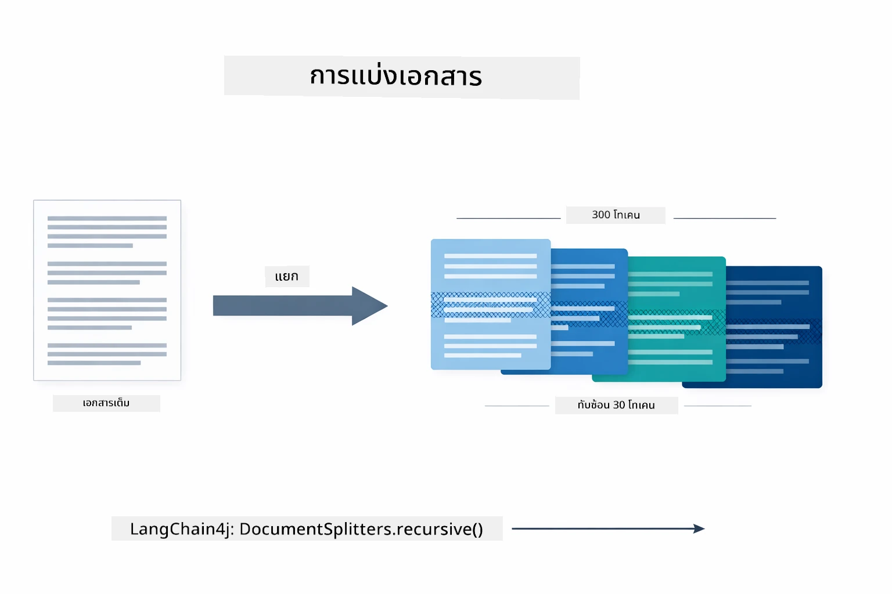

*แผนภาพนี้แสดงเอกสารถูกแบ่งเป็นชิ้นส่วนขนาด 300 โทเค็นที่ทับซ้อนกัน 30 โทเค็น เพื่อรักษาบริบทที่ขอบเขตชิ้นส่วน*

> **🤖 ลองใช้ [GitHub Copilot](https://github.com/features/copilot) Chat:** เปิด [`DocumentService.java`](../../../03-rag/src/main/java/com/example/langchain4j/rag/service/DocumentService.java) แล้วถามว่า:
> - "LangChain4j แบ่งเอกสารออกเป็นชิ้นได้อย่างไรและทำไมการทับซ้อนถึงสำคัญ?"
> - "ขนาดชิ้นส่วนที่เหมาะสมสำหรับเอกสารแต่ละประเภทคือเท่าไรและทำไม?"
> - "จะจัดการเอกสารในหลายภาษา หรือที่มีรูปแบบพิเศษอย่างไร?"

### Creating Embeddings

[LangChainRagConfig.java](../../../03-rag/src/main/java/com/example/langchain4j/rag/config/LangChainRagConfig.java)

ชิ้นส่วนแต่ละชิ้นจะถูกแปลงเป็นการแทนค่าตัวเลขที่เรียกว่า embedding — โดยพื้นฐานคือเครื่องมือแปลงความหมายเป็นตัวเลข โมเดล embedding ไม่ได้ “ฉลาด” เหมือนโมเดลแชท; มันไม่สามารถปฏิบัติตามคำสั่ง, ให้เหตุผล หรือถามตอบ แต่อย่างไร มันสามารถแมปข้อความเข้าไปในพื้นที่คณิตศาสตร์ที่ความหมายที่คล้ายกันจะอยู่ใกล้กัน — เช่น "car" ใกล้กับ "automobile", "refund policy" ใกล้กับ "return my money" คิดว่าโมเดลแชทเปรียบเหมือนคนที่คุณคุยด้วย โมเดล embedding เปรียบเหมือนระบบจัดเก็บข้อมูลที่ดีที่สุด

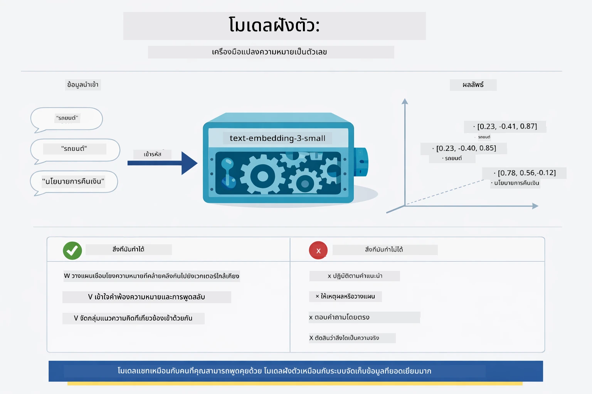

*แผนภาพนี้แสดงว่าโมเดล embedding แปลงข้อความเป็นเวกเตอร์ตัวเลข วางความหมายที่คล้ายกัน — เช่น "car" กับ "automobile" — ไว้ใกล้กันในพื้นที่เวกเตอร์*

```java
@Bean
public EmbeddingModel embeddingModel() {
    return OpenAiOfficialEmbeddingModel.builder()
        .baseUrl(azureOpenAiEndpoint)
        .apiKey(azureOpenAiKey)
        .modelName(azureEmbeddingDeploymentName)
        .build();
}

EmbeddingStore<TextSegment> embeddingStore = 
    new InMemoryEmbeddingStore<>();
```
  
แผนภาพชั้นเรียนด้านล่างแสดงสองเส้นทางแยกใน pipeline RAG และคลาสของ LangChain4j ที่รองรับ เส้นทาง **ingestion** (ทำครั้งเดียวตอนอัปโหลด) จะแบ่งเอกสาร, embed ชิ้นส่วน และจัดเก็บผ่าน `.addAll()` เส้นทาง **query** (ทำทุกครั้งเมื่อผู้ใช้ถาม) embed คำถาม, ค้นหาในที่เก็บผ่าน `.search()` และส่งบริบทที่จับคู่ไปยังโมเดลแชท ทั้งสองเส้นทางมาเจอกันที่ interface ร่วม `EmbeddingStore<TextSegment>`:

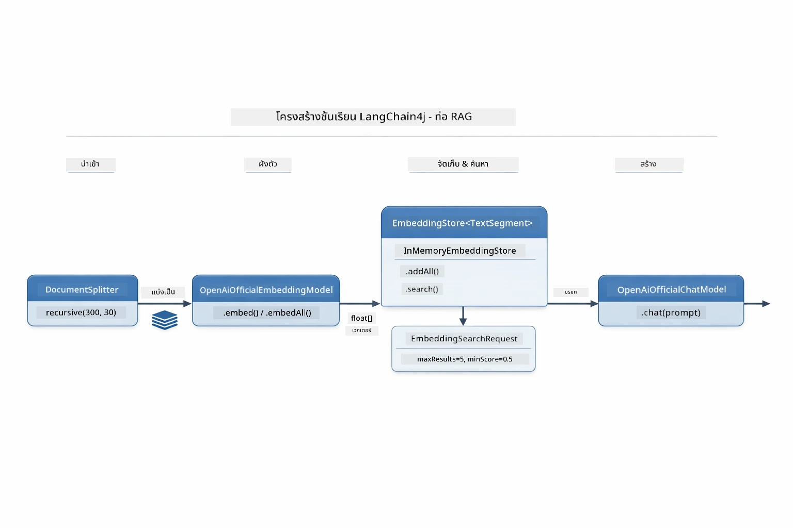

*แผนภาพนี้แสดงสองเส้นทางใน pipeline RAG — ingestion และ query — และวิธีเชื่อมต่อผ่าน EmbeddingStore ร่วมกัน*

เมื่อ embeddings ถูกจัดเก็บ เนื้อหาที่คล้ายกันจะรวมกลุ่มกันตามธรรมชาติในพื้นที่เวกเตอร์ ภาพประกอบด้านล่างแสดงเอกสารที่เกี่ยวข้องกันจะอยู่ใกล้กันเป็นกลุ่ม ซึ่งนี่คือสิ่งที่ทำให้การค้นหาเชิงความหมายเป็นไปได้:


*ภาพนี้แสดงการจัดกลุ่มเอกสารที่เกี่ยวข้องกันในพื้นที่เวกเตอร์ 3 มิติ ซึ่งหัวข้ออย่าง Technical Docs, Business Rules และ FAQs จัดเป็นกลุ่มต่างๆ*

เมื่อผู้ใช้ค้นหา ระบบทำตามสี่ขั้นตอน: embed เอกสารครั้งเดียว, embed คำถามทุกครั้งที่ค้นหา, เปรียบเทียบเวกเตอร์คำถามกับเวกเตอร์ทั้งหมดในที่เก็บโดยใช้ cosine similarity, และส่งชิ้นส่วนที่มีคะแนนสูงสุด K ชิ้น ภาพด้านล่างแสดงแต่ละขั้นตอนและคลาสใน LangChain4j ที่เกี่ยวข้อง:

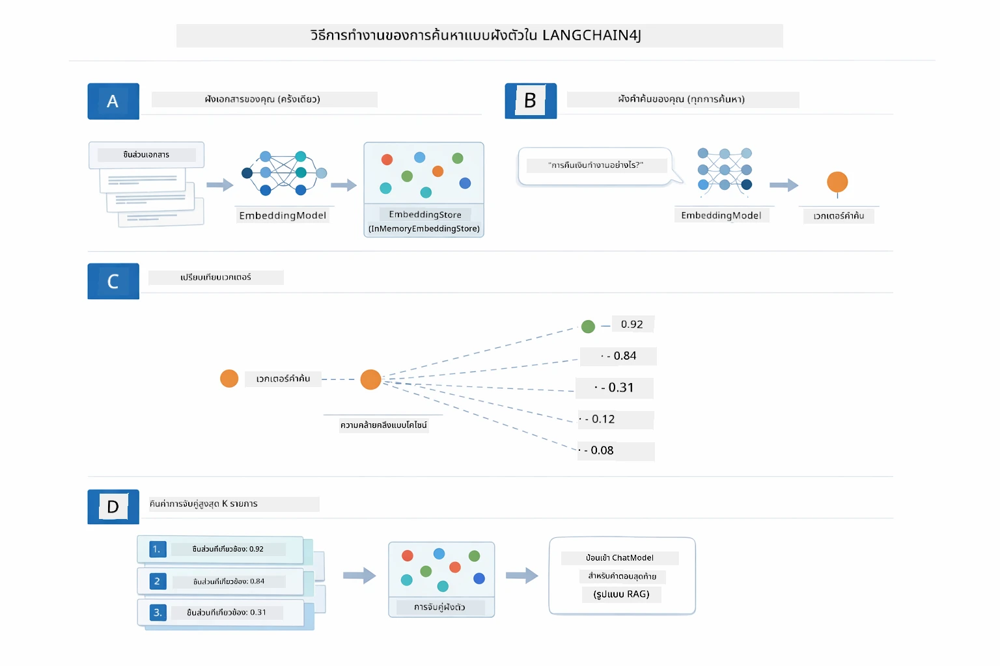

*แผนภาพนี้แสดงขั้นตอนการค้นหาด้วย embedding สี่ขั้นตอน: embed เอกสาร, embed คำถาม, เปรียบเทียบเวกเตอร์โดยใช้ cosine similarity, และส่งผลลัพธ์ท็อป-K*

### Semantic Search

[RagService.java](../../../03-rag/src/main/java/com/example/langchain4j/rag/service/RagService.java)

เมื่อคุณถามคำถาม คำถามของคุณจะถูกแปลงเป็น embedding ด้วยเช่นกัน ระบบจะเปรียบเทียบ embedding ของคำถามกับ embedding ของชิ้นส่วนเอกสารทั้งหมด มันจะค้นหาชิ้นส่วนที่มีความหมายใกล้เคียงที่สุด — ไม่ใช่แค่คำสำคัญที่ตรงกันเท่านั้น แต่เป็นความหมายจริง ๆ ที่คล้ายกัน

```java
Embedding queryEmbedding = embeddingModel.embed(question).content();

EmbeddingSearchRequest searchRequest = EmbeddingSearchRequest.builder()
    .queryEmbedding(queryEmbedding)
    .maxResults(5)
    .minScore(0.5)
    .build();

EmbeddingSearchResult<TextSegment> searchResult = embeddingStore.search(searchRequest);
List<EmbeddingMatch<TextSegment>> matches = searchResult.matches();

for (EmbeddingMatch<TextSegment> match : matches) {
    String relevantText = match.embedded().text();
    double score = match.score();
}
```
  
แผนภาพด้านล่างเปรียบเทียบการค้นหาแบบ semantic กับการค้นหาคำสำคัญแบบดั้งเดิม การค้นหาด้วยคำสำคัญ "vehicle" จะพลาดชิ้นส่วนเกี่ยวกับ "cars and trucks" แต่การค้นหาเชิงความหมายจะเข้าใจว่าหมายถึงสิ่งเดียวกันและส่งคืนผลลัพธ์ที่มีคะแนนสูง:

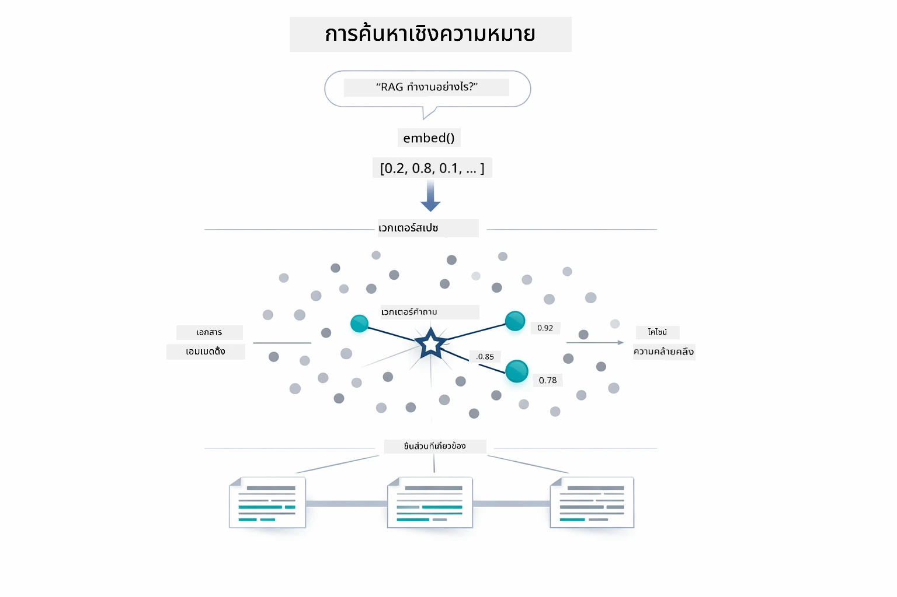

*แผนภาพนี้เปรียบเทียบการค้นหาโดยใช้คำสำคัญกับการค้นหาเชิงความหมาย แสดงให้เห็นว่าการค้นหาเชิงความหมายจะดึงเนื้อหาที่เกี่ยวข้องตามความหมาย แม้คำสำคัญจะต่างกัน*

เบื้องหลัง ความเหมือนกันถูกวัดโดยใช้ cosine similarity — ถามว่า “ลูกศรสองอันนี้ชี้ไปในทิศทางเดียวกันหรือไม่?” ชิ้นส่วนสองชิ้นอาจใช้คำที่แตกต่างกันโดยสิ้นเชิง แต่ถ้าความหมายเหมือนกัน เวกเตอร์ของมันจะชี้ในทิศทางเดียวกันและได้คะแนนใกล้ 1.0:

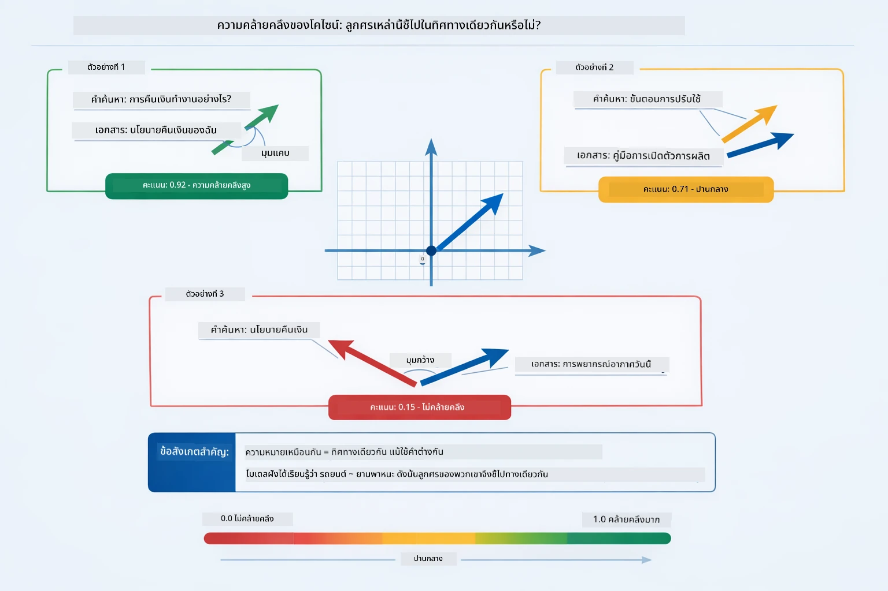
*ไดอะแกรมนี้แสดงความคล้ายคลึงแบบโคไซน์ในฐานะมุมระหว่างเวกเตอร์การฝังตัว — เวกเตอร์ที่สอดคล้องกันมากกว่าจะมีคะแนนใกล้เคียง 1.0 ซึ่งบ่งชี้ถึงความเหมือนเชิงความหมายที่สูงกว่า*

> **🤖 ลองใช้ [GitHub Copilot](https://github.com/features/copilot) Chat:** เปิดไฟล์ [`RagService.java`](../../../03-rag/src/main/java/com/example/langchain4j/rag/service/RagService.java) และถามว่า:
> - "การค้นหาความเหมือนทำงานอย่างไรกับ embeddings และอะไรเป็นตัวกำหนดคะแนน?"
> - "ฉันควรใช้เกณฑ์ความเหมือนระดับใดและมันส่งผลต่อผลลัพธ์อย่างไร?"
> - "จะจัดการกับกรณีที่ไม่พบเอกสารที่เกี่ยวข้องอย่างไร?"

### การสร้างคำตอบ

[RagService.java](../../../03-rag/src/main/java/com/example/langchain4j/rag/service/RagService.java)

ชิ้นส่วนที่เกี่ยวข้องมากที่สุดจะถูกจัดรวมเป็นพรอมต์ที่มีโครงสร้าง รวมถึงคำแนะนำอย่างชัดเจน บริบทที่ดึงมา และคำถามของผู้ใช้ โมเดลจะอ่านเฉพาะชิ้นส่วนเฉพาะเหล่านั้นและตอบตามข้อมูลดังกล่าว — มันใช้ได้แค่สิ่งที่อยู่ตรงหน้าซึ่งช่วยป้องกันการประดิษฐ์ข้อมูลขึ้นมาเอง (hallucination)

```java
String context = matches.stream()
    .map(match -> match.embedded().text())
    .collect(Collectors.joining("\n\n"));

String prompt = String.format("""
    Answer the question based on the following context.
    If the answer cannot be found in the context, say so.

    Context:
    %s

    Question: %s

    Answer:""", context, request.question());

String answer = chatModel.chat(prompt);
```

ไดอะแกรมด้านล่างแสดงการจัดรวมนี้ในทางปฏิบัติ — ชิ้นส่วนที่ได้คะแนนสูงสุดจากขั้นตอนการค้นหาจะถูกสอดแทรกลงในเท็มเพลตพรอมต์ และ `OpenAiOfficialChatModel` สร้างคำตอบที่มีหลักฐานสนับสนุน:

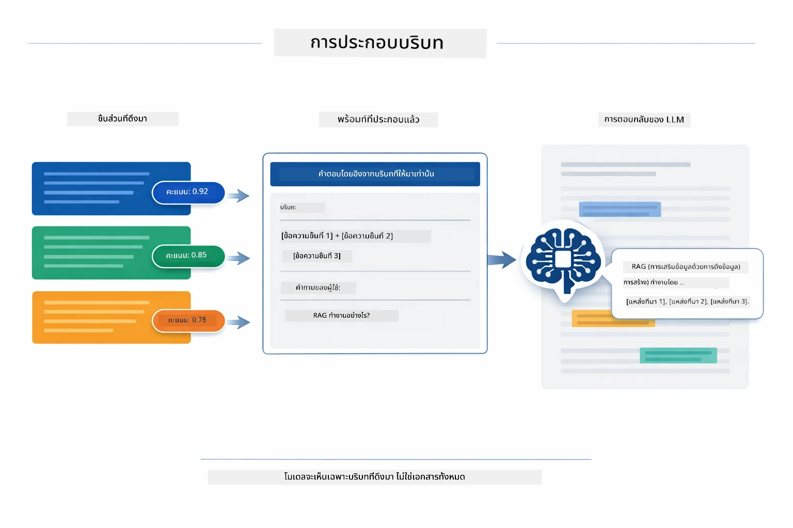

*ไดอะแกรมนี้แสดงวิธีการจัดรวมชิ้นส่วนที่ได้รับคะแนนสูงสุดเป็นพรอมต์ที่มีโครงสร้าง เพื่อให้โมเดลสร้างคำตอบที่มีพื้นฐานจากข้อมูลของคุณ*

## การรันแอปพลิเคชัน

**ตรวจสอบการติดตั้ง:**

ตรวจสอบให้แน่ใจว่าไฟล์ `.env` อยู่ในไดเรกทอรีรากพร้อมข้อมูลรับรอง Azure (สร้างในโมดูล 01):

**Bash:**
```bash
cat ../.env  # ควรแสดง AZURE_OPENAI_ENDPOINT, API_KEY, DEPLOYMENT
```

**PowerShell:**
```powershell
Get-Content ..\.env  # ควรแสดง AZURE_OPENAI_ENDPOINT, API_KEY, DEPLOYMENT
```

**เริ่มแอปพลิเคชัน:**

> **หมายเหตุ:** หากคุณเริ่มแอปพลิเคชันทั้งหมดผ่าน `./start-all.sh` ในโมดูล 01 แล้ว โมดูลนี้จะทำงานบนพอร์ต 8081 อยู่แล้ว คุณสามารถข้ามคำสั่งเริ่มต้นด้านล่างและไปที่ http://localhost:8081 ได้เลย

**ตัวเลือก 1: ใช้ Spring Boot Dashboard (แนะนำสำหรับผู้ใช้ VS Code)**

คอนเทนเนอร์สำหรับการพัฒนามีส่วนขยาย Spring Boot Dashboard ซึ่งมีอินเทอร์เฟซแบบกราฟิกสำหรับจัดการแอป Spring Boot ทั้งหมด คุณจะพบได้ในแถบกิจกรรมด้านซ้ายของ VS Code (มองหาไอคอน Spring Boot)

จาก Spring Boot Dashboard คุณสามารถ:
- ดูแอปพลิเคชัน Spring Boot ทั้งหมดในพื้นที่ทำงาน
- เริ่ม/หยุดแอปด้วยคลิกเดียว
- ดูล็อกแอปตามเวลาจริง
- ตรวจสอบสถานะแอป

คลิกปุ่มเล่นข้าง ๆ “rag” เพื่อเริ่มโมดูลนี้ หรือเริ่มทุกโมดูลพร้อมกัน


*ภาพหน้าจอนี้แสดง Spring Boot Dashboard ใน VS Code ซึ่งคุณสามารถเริ่ม หยุด และตรวจสอบแอปแบบกราฟิกได้*

**ตัวเลือก 2: ใช้สคริปต์เชลล์**

เริ่มเว็บแอปพลิเคชันทั้งหมด (โมดูล 01-04):

**Bash:**
```bash
cd ..  # จากไดเรกทอรีหลัก
./start-all.sh
```

**PowerShell:**
```powershell
cd ..  # จากไดเรกทอรีราก
.\start-all.ps1
```

หรือเริ่มแค่โมดูลนี้:

**Bash:**
```bash
cd 03-rag
./start.sh
```

**PowerShell:**
```powershell
cd 03-rag
.\start.ps1
```

ทั้งสองสคริปต์จะโหลดตัวแปรสภาพแวดล้อมจากไฟล์ `.env` ที่รากโดยอัตโนมัติ และจะสร้างไฟล์ JAR หากยังไม่มี

> **หมายเหตุ:** หากคุณต้องการสร้างโมดูลทั้งหมดด้วยตัวเองก่อนเริ่ม:
>
> **Bash:**
> ```bash
> cd ..  # Go to root directory
> mvn clean package -DskipTests
> ```
>
> **PowerShell:**
> ```powershell
> cd ..  # Go to root directory
> mvn clean package -DskipTests
> ```

เปิด http://localhost:8081 ในเบราว์เซอร์ของคุณ

**เพื่อหยุด:**

**Bash:**
```bash
./stop.sh  # โมดูลนี้เท่านั้น
# หรือ
cd .. && ./stop-all.sh  # โมดูลทั้งหมด
```

**PowerShell:**
```powershell
.\stop.ps1  # โมดูลนี้เท่านั้น
# หรือ
cd ..; .\stop-all.ps1  # ทุกโมดูล
```

## การใช้งานแอปพลิเคชัน

แอปพลิเคชันมีอินเทอร์เฟซเว็บสำหรับอัปโหลดเอกสารและถามคำถาม

<a href="images/rag-homepage.png"></a>

*ภาพหน้าจอนี้แสดงอินเทอร์เฟซแอป RAG ที่คุณสามารถอัปโหลดเอกสารและถามคำถามได้*

### อัปโหลดเอกสาร

เริ่มด้วยการอัปโหลดเอกสาร — ไฟล์ TXT เหมาะสำหรับการทดสอบมากที่สุด มีตัวอย่างไฟล์ `sample-document.txt` ให้ในไดเรกทอรีนี้ซึ่งมีข้อมูลเกี่ยวกับฟีเจอร์ LangChain4j, การใช้งาน RAG และแนวปฏิบัติที่ดีที่สุด — เหมาะสำหรับทดสอบระบบ

ระบบจะประมวลผลเอกสารของคุณ แบ่งเป็นชิ้น ๆ และสร้าง embeddings สำหรับแต่ละชิ้น ซึ่งเกิดขึ้นโดยอัตโนมัติเมื่อคุณอัปโหลด

### ถามคำถาม

ตอนนี้ให้ถามคำถามเฉพาะเจาะจงเกี่ยวกับเนื้อหาในเอกสาร ลองถามข้อเท็จจริงที่ระบุไว้อย่างชัดเจนในเอกสาร ระบบจะค้นหาชิ้นส่วนที่เกี่ยวข้อง นำมารวมไว้ในพรอมต์ และสร้างคำตอบ

### ตรวจสอบแหล่งที่มา

สังเกตว่าแต่ละคำตอบจะมีการอ้างอิงแหล่งที่มาพร้อมกับคะแนนความคล้ายคลึง คะแนนเหล่านี้ (0 ถึง 1) แสดงให้เห็นว่าชิ้นส่วนแต่ละชิ้นเกี่ยวข้องกับคำถามมากแค่ไหน คะแนนสูงหมายถึงการจับคู่ที่ดีกว่า ช่วยให้คุณตรวจสอบคำตอบเทียบกับแหล่งข้อมูลต้นฉบับได้

<a href="images/rag-query-results.png"></a>

*ภาพหน้าจอนี้แสดงผลการค้นหาคำถามพร้อมคำตอบที่สร้างขึ้น อ้างอิงแหล่งที่มา และคะแนนความเกี่ยวข้องของแต่ละชิ้นส่วนที่ถูกดึงมา*

### ทดลองถามคำถาม

ลองถามคำถามประเภทต่าง ๆ:
- ข้อเท็จจริงเฉพาะ: "หัวข้อหลักคืออะไร?"
- การเปรียบเทียบ: "ความแตกต่างระหว่าง X กับ Y คืออะไร?"
- สรุป: "สรุปประเด็นสำคัญเกี่ยวกับ Z"

สังเกตว่าคะแนนความเกี่ยวข้องเปลี่ยนแปลงอย่างไรตามความเข้ากันของคำถามกับเนื้อหาในเอกสาร

## แนวคิดสำคัญ

### กลยุทธ์การแบ่งชิ้น (Chunking)

เอกสารถูกแบ่งเป็นชิ้นละ 300 โทเค็น โดยทับซ้อน 30 โทเค็น สมดุลนี้ช่วยให้แต่ละชิ้นมีบริบทเพียงพอที่จะมีความหมายและยังเล็กพอที่จะรวมหลายชิ้นในพรอมต์เดียว

### คะแนนความคล้ายคลึง

ทุกชิ้นส่วนที่ดึงมาจะมาพร้อมกับคะแนนความคล้ายคลึงระหว่าง 0 ถึง 1 ซึ่งแสดงถึงความใกล้เคียงกับคำถามของผู้ใช้ ไดอะแกรมด้านล่างแสดงช่วงคะแนนและวิธีที่ระบบใช้เพื่อกรองผลลัพธ์:

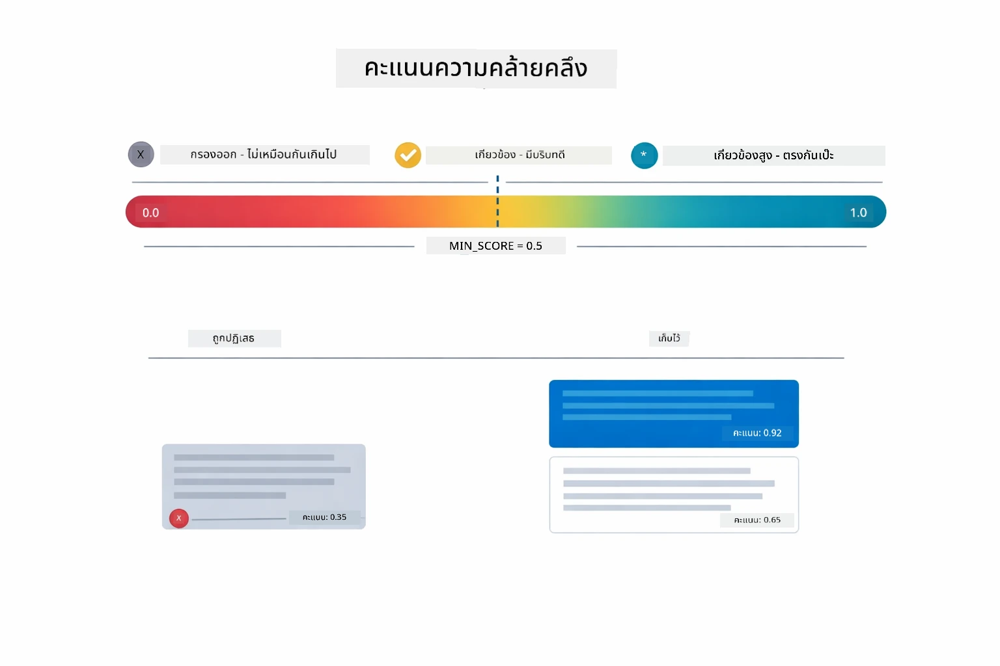

*ไดอะแกรมนี้แสดงช่วงคะแนนจาก 0 ถึง 1 โดยมีเกณฑ์ขั้นต่ำ 0.5 ที่กรองชิ้นส่วนที่ไม่เกี่ยวข้องออก*

คะแนนอยู่ในช่วง 0 ถึง 1:
- 0.7-1.0: เกี่ยวข้องสูง ตรงกันแบบเป๊ะ
- 0.5-0.7: เกี่ยวข้อง มีบริบทดี
- ต่ำกว่า 0.5: ถูกกรองออก ไม่เหมือนกันมากเกินไป

ระบบจะดึงชิ้นส่วนที่มีคะแนนสูงกว่าเกณฑ์ขั้นต่ำเท่านั้นเพื่อรักษาคุณภาพ

Embeddings ทำงานได้ดีเมื่อความหมายรวมกลุ่มชัดเจน แต่มีจุดบอด ไดอะแกรมด้านล่างแสดงโหมดล้มเหลวทั่วไป — ชิ้นส่วนที่ใหญ่เกินไปทำให้เวกเตอร์เบลอ ชิ้นส่วนเล็กเกินไปขาดบริบท คำที่หมายความไม่ชัดเจนชี้ไปยังหลายกลุ่ม และการค้นหาตรง ๆ (รหัสประจำตัว หมายเลขชิ้นส่วน) ไม่ทำงานกับ embeddings เลย:

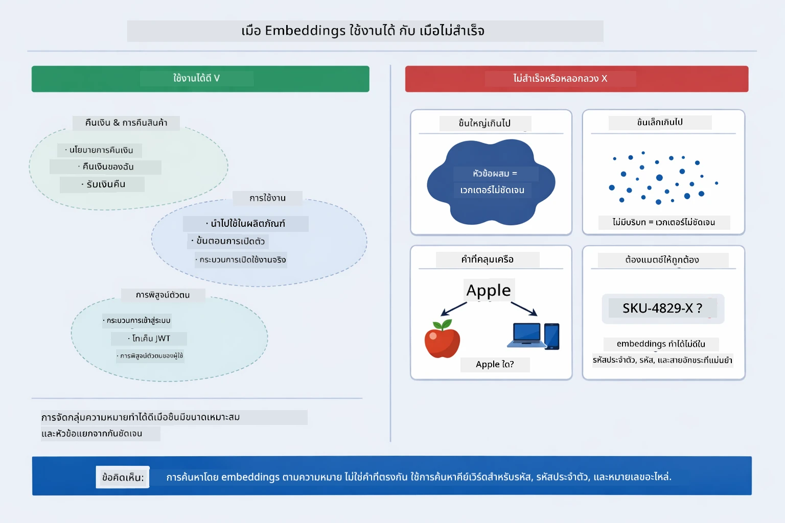

*ไดอะแกรมนี้แสดงโหมดล้มเหลวของ embeddings ที่พบบ่อย: ชิ้นส่วนใหญ่เกินไป, ชิ้นส่วนเล็กเกินไป, คำไม่ชัดเจนที่ชี้ไปยังหลายกลุ่ม และการค้นหาตรง ๆ เช่น ID*

### การจัดเก็บในหน่วยความจำ

โมดูลนี้ใช้การจัดเก็บในหน่วยความจำเพื่อความเรียบง่าย เมื่อคุณรีสตาร์ทแอปเอกสารที่อัปโหลดจะหายไป ระบบที่ใช้ในผลิตจริงจะใช้ฐานข้อมูลเวกเตอร์ถาวร เช่น Qdrant หรือ Azure AI Search

### การจัดการหน้าต่างบริบท (Context Window)

แต่ละโมเดลมีขนาดหน้าต่างบริบทสูงสุด คุณไม่สามารถใส่ชิ้นส่วนทั้งหมดจากเอกสารขนาดใหญ่ได้ ระบบจะดึงชิ้นส่วนที่เกี่ยวข้องสูงสุด N ชิ้น (ค่าเริ่มต้น 5) เพื่อให้อยู่ในขีดจำกัดพร้อมให้บริบทเพียงพอสำหรับคำตอบที่แม่นยำ

## ตอนที่ RAG สำคัญ

RAG ไม่ใช่วิธีที่เหมาะสมเสมอไป ไดอะแกรมด้านล่างช่วยให้คุณตัดสินใจว่าเมื่อไร RAG จะเพิ่มมูลค่าและเมื่อไรวิธีที่ง่ายกว่า — เช่น การรวมเนื้อหาในพรอมต์โดยตรงหรืออาศัยความรู้ในตัวโมเดล — ก็เพียงพอ:

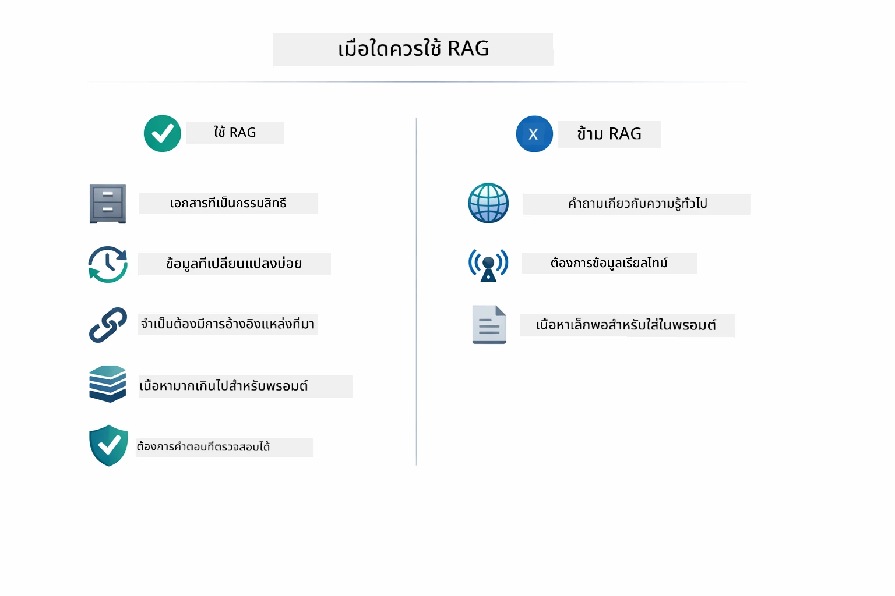

*ไดอะแกรมนี้แสดงแนวทางตัดสินใจว่าเมื่อไร RAG จะเพิ่มมูลค่าและเมื่อไรรูปแบบที่ง่ายกว่าเพียงพอ*

**ใช้ RAG เมื่อ:**
- ตอบคำถามเกี่ยวกับเอกสารที่เป็นกรรมสิทธิ์
- ข้อมูลเปลี่ยนแปลงบ่อย (นโยบาย ราคา สเปค)
- ความถูกต้องต้องการการอ้างอิงแหล่งที่มา
- เนื้อหาใหญ่เกินกว่าจะใส่ในพรอมต์เดียว
- ต้องการคำตอบที่ตรวจสอบได้และมีหลักฐานสนับสนุน

**ไม่ใช้ RAG เมื่อ:**
- คำถามต้องใช้ความรู้ทั่วไปที่โมเดลมีอยู่แล้ว
- ต้องการข้อมูลเรียลไทม์ (RAG ทำงานกับเอกสารที่อัปโหลด)
- เนื้อหาเล็กพอที่จะใส่ในพรอมต์โดยตรงได้

## ขั้นตอนถัดไป

**โมดูลถัดไป:** [04-tools - AI Agents with Tools](../04-tools/README.md)

---

**การนำทาง:** [← ก่อนหน้า: โมดูล 02 - Prompt Engineering](../02-prompt-engineering/README.md) | [กลับสู่หน้าหลัก](../README.md) | [ถัดไป: โมดูล 04 - Tools →](../04-tools/README.md)

---

<!-- CO-OP TRANSLATOR DISCLAIMER START -->
**ข้อจำกัดความรับผิดชอบ**:  
เอกสารฉบับนี้ได้รับการแปลโดยใช้บริการแปลภาษาด้วย AI [Co-op Translator](https://github.com/Azure/co-op-translator) แม้เราจะพยายามให้ความถูกต้อง แต่โปรดทราบว่าการแปลโดยอัตโนมัติอาจมีข้อผิดพลาดหรือละเมิดความถูกต้องได้ เอกสารต้นฉบับในภาษาต้นฉบับควรถือเป็นแหล่งข้อมูลที่มีอำนาจสูงสุด สำหรับข้อมูลที่สำคัญ แนะนำให้ใช้บริการแปลโดยมนุษย์มืออาชีพ เราไม่รับผิดชอบต่อความเข้าใจผิดหรือการตีความที่ผิดพลาดใด ๆ ที่เกิดขึ้นจากการใช้การแปลฉบับนี้
<!-- CO-OP TRANSLATOR DISCLAIMER END -->