# Module 04: ตัวแทน AI พร้อมเครื่องมือ

## สารบัญ

- [สิ่งที่คุณจะได้เรียนรู้](../../../04-tools)
- [สิ่งที่ต้องมีพื้นฐาน](../../../04-tools)
- [ทำความเข้าใจตัวแทน AI พร้อมเครื่องมือ](../../../04-tools)
- [การทำงานของการเรียกใช้เครื่องมือ](../../../04-tools)
  - [คำจำกัดความของเครื่องมือ](../../../04-tools)
  - [การตัดสินใจ](../../../04-tools)
  - [การดำเนินการ](../../../04-tools)
  - [การสร้างการตอบกลับ](../../../04-tools)
  - [สถาปัตยกรรม: การต่อสายอัตโนมัติของ Spring Boot](../../../04-tools)
- [การเชื่อมโยงเครื่องมือ](../../../04-tools)
- [การรันแอปพลิเคชัน](../../../04-tools)
- [การใช้แอปพลิเคชัน](../../../04-tools)
  - [ลองใช้เครื่องมือแบบง่าย](../../../04-tools)
  - [ทดสอบการเชื่อมโยงเครื่องมือ](../../../04-tools)
  - [ดูการไหลของการสนทนา](../../../04-tools)
  - [ทดลองด้วยคำขอที่ต่างกัน](../../../04-tools)
- [แนวคิดสำคัญ](../../../04-tools)
  - [รูปแบบ ReAct (การให้เหตุผลและการปฏิบัติ)](../../../04-tools)
  - [คำอธิบายของเครื่องมือสำคัญ](../../../04-tools)
  - [การจัดการเซสชัน](../../../04-tools)
  - [การจัดการข้อผิดพลาด](../../../04-tools)
- [เครื่องมือที่มีให้ใช้](../../../04-tools)
- [เมื่อใดควรใช้ตัวแทนที่ใช้เครื่องมือ](../../../04-tools)
- [เครื่องมือกับ RAG](../../../04-tools)
- [ขั้นตอนถัดไป](../../../04-tools)

## สิ่งที่คุณจะได้เรียนรู้

จนถึงตอนนี้ คุณได้เรียนรู้วิธีการสนทนากับ AI วิธีการจัดโครงสร้างพรอมต์อย่างมีประสิทธิภาพ และการทำให้การตอบกลับอิงตามเอกสารของคุณ แต่ยังคงมีข้อจำกัดพื้นฐาน: โมเดลภาษาไม่สามารถมากกว่าการสร้างข้อความได้ มันไม่สามารถตรวจสอบสภาพอากาศ ทำการคำนวณ ถามข้อมูลจากฐานข้อมูล หรือโต้ตอบกับระบบภายนอกได้

เครื่องมือเปลี่ยนแปลงเรื่องนี้ โดยการมอบฟังก์ชันที่โมเดลสามารถเรียกใช้ได้ คุณเปลี่ยนมันจากผู้สร้างข้อความเป็นตัวแทนที่สามารถดำเนินการได้ โมเดลตัดสินใจว่าเมื่อไหร่ที่ต้องใช้เครื่องมือ เครื่องมือใดที่ใช้ และพารามิเตอร์อะไรที่จะส่งผ่าน โค้ดของคุณจะดำเนินการฟังก์ชันและส่งผลลัพธ์กลับ โมเดลจะนำผลลัพธ์นั้นมาใช้ในคำตอบของมัน

## สิ่งที่ต้องมีพื้นฐาน

- ผ่าน Module 01 แล้ว (ติดตั้งทรัพยากร Azure OpenAI เรียบร้อย)
- ไฟล์ `.env` อยู่ในไดเรกทอรีหลักพร้อมข้อมูลรับรอง Azure (สร้างโดย `azd up` ใน Module 01)

> **หมายเหตุ:** หากคุณยังไม่ผ่าน Module 01 โปรดทำตามคำแนะนำการติดตั้งในนั้นก่อน

## ทำความเข้าใจตัวแทน AI พร้อมเครื่องมือ

> **📝 หมายเหตุ:** คำว่า "ตัวแทน" ในโมดูลนี้หมายถึงผู้ช่วย AI ที่ได้รับการปรับปรุงด้วยความสามารถในการเรียกใช้เครื่องมือ ซึ่งแตกต่างจากรูปแบบ **Agentic AI** (ตัวแทนอิสระที่มีการวางแผน ความจำ และเหตุผลหลายขั้นตอน) ซึ่งเราจะพูดถึงใน [Module 05: MCP](../05-mcp/README.md)

หากไม่มีเครื่องมือ โมเดลภาษาไม่สามารถทำอะไรมากไปกว่าการสร้างข้อความจากข้อมูลการฝึก ถามมันเกี่ยวกับสภาพอากาศปัจจุบัน มันต้องเดาคำตอบ หากให้เครื่องมือ มันสามารถเรียกใช้ API สภาพอากาศ ทำคำนวณ หรือถามฐานข้อมูล — แล้วสอดแทรกผลลัพธ์จริงเหล่านั้นในการตอบกลับได้

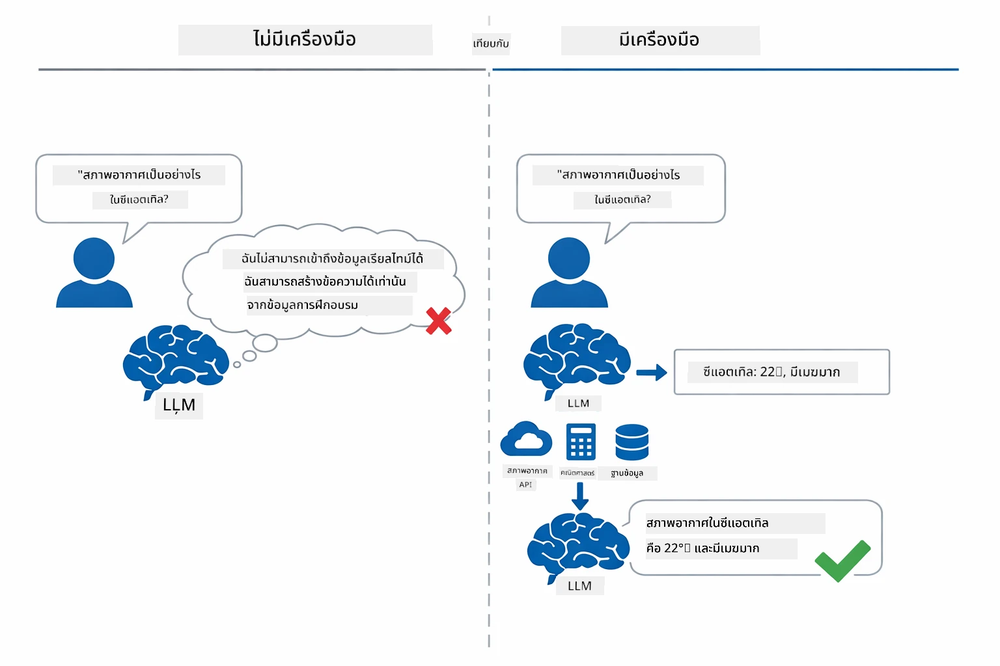

*ถ้าไม่มีเครื่องมือ โมเดลจะเดาได้อย่างเดียว — แต่ถ้ามีเครื่องมือ มันสามารถเรียก API ทำคำนวณ และส่งคืนข้อมูลแบบเรียลไทม์*

ตัวแทน AI พร้อมเครื่องมือตามรูปแบบ **การให้เหตุผลและการปฏิบัติ (ReAct)** โมเดลไม่ได้แค่ตอบกลับ — มันคิดว่าสิ่งที่ต้องการ ปฏิบัติด้วยการเรียกใช้เครื่องมือ สังเกตผลลัพธ์ แล้วตัดสินใจว่าจะดำเนินการอีกหรือส่งคำตอบสุดท้าย:

1. **เหตุผล** — ตัวแทนวิเคราะห์คำถามผู้ใช้และกำหนดข้อมูลที่ต้องการ
2. **ปฏิบัติ** — ตัวแทนเลือกเครื่องมือที่เหมาะสม สร้างพารามิเตอร์ที่ถูกต้อง และเรียกใช้เครื่องมือ
3. **สังเกต** — ตัวแทนรับผลลัพธ์จากเครื่องมือและประเมินผล
4. **ทำซ้ำหรือส่งคำตอบ** — ถ้าต้องการข้อมูลเพิ่ม ตัวแทนจะวนกลับไป; มิฉะนั้นจะสร้างคำตอบเป็นภาษาธรรมชาติ

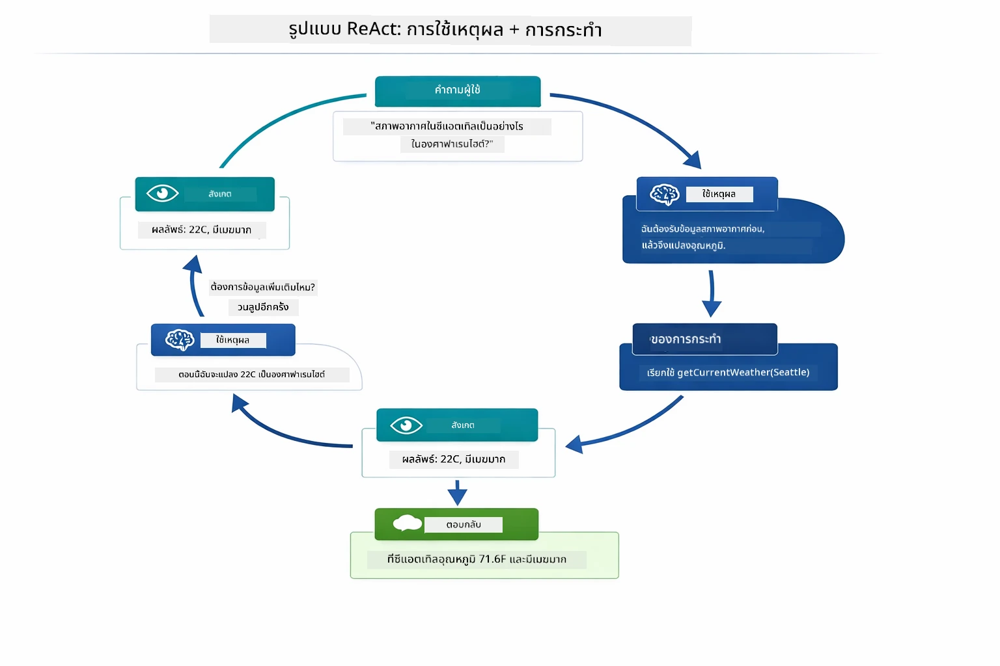

*วงจร ReAct — ตัวแทนให้เหตุผลว่าควรทำอะไร ปฏิบัติด้วยการเรียกเครื่องมือ สังเกตผล แล้ววนจนได้คำตอบสุดท้าย*

สิ่งนี้เกิดขึ้นโดยอัตโนมัติ คุณกำหนดเครื่องมือและคำอธิบายของมัน โมเดลจะจัดการการตัดสินใจว่าจะใช้เมื่อใดและอย่างไร

## การทำงานของการเรียกใช้เครื่องมือ

### คำจำกัดความของเครื่องมือ

[WeatherTool.java](../../../04-tools/src/main/java/com/example/langchain4j/agents/tools/WeatherTool.java) | [TemperatureTool.java](../../../04-tools/src/main/java/com/example/langchain4j/agents/tools/TemperatureTool.java)

คุณกำหนดฟังก์ชันด้วยคำอธิบายชัดเจนและรายละเอียดพารามิเตอร์ โมเดลจะเห็นคำอธิบายเหล่านี้ในพรอมต์ของระบบและเข้าใจว่าแต่ละเครื่องมือทำอะไร

```java
@Component
public class WeatherTool {
    
    @Tool("Get the current weather for a location")
    public String getCurrentWeather(@P("Location name") String location) {
        // ตรรกะการค้นหาสภาพอากาศของคุณ
        return "Weather in " + location + ": 22°C, cloudy";
    }
}

@AiService
public interface Assistant {
    String chat(@MemoryId String sessionId, @UserMessage String message);
}

// ผู้ช่วยถูกเชื่อมต่อโดยอัตโนมัติด้วย Spring Boot ด้วย:
// - bean ของ ChatModel
// - เมธอด @Tool ทั้งหมดจากคลาส @Component
// - ChatMemoryProvider สำหรับการจัดการเซสชัน
```

ภาพด้านล่างแสดงการแยกทุกคำอธิบายและแสดงว่าชิ้นส่วนแต่ละอย่างช่วยให้ AI เข้าใจเมื่อเรียกเครื่องมือและพารามิเตอร์ที่จะส่งผ่านอย่างไร:

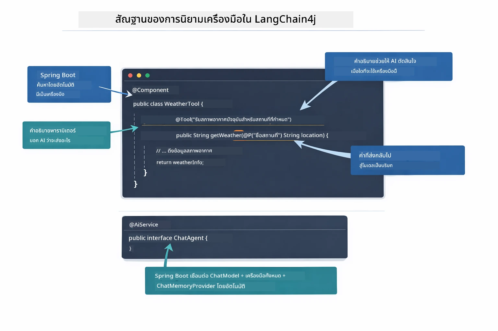

*โครงสร้างคำจำกัดความของเครื่องมือ — @Tool บอก AI ว่าควรใช้เมื่อใด, @P อธิบายพารามิเตอร์แต่ละตัว, และ @AiService ต่อสายทุกอย่างเข้าด้วยกันตอนเริ่มต้น*

> **🤖 ลองใช้กับ [GitHub Copilot](https://github.com/features/copilot) Chat:** เปิด [`WeatherTool.java`](../../../04-tools/src/main/java/com/example/langchain4j/agents/tools/WeatherTool.java) แล้วถาม:
> - "ฉันจะผสานรวม API สภาพอากาศจริงอย่าง OpenWeatherMap แทนข้อมูลตัวอย่างได้อย่างไร?"
> - "คำอธิบายเครื่องมือแบบไหนที่ดีและช่วยให้ AI ใช้เครื่องมือได้ถูกต้อง?"
> - "ฉันจะจัดการกับข้อผิดพลาดของ API และข้อจำกัดอัตราเรียกในโค้ดเครื่องมืออย่างไร?"

### การตัดสินใจ

เมื่อผู้ใช้ถามว่า "สภาพอากาศในซียาติลเป็นอย่างไร?" โมเดลจะไม่เลือกเครื่องมือแบบสุ่ม แต่มันจะเปรียบเทียบเจตนาของผู้ใช้กับคำอธิบายเครื่องมือทุกตัวที่มีอยู่ ให้คะแนนความเกี่ยวข้องแต่ละตัว และเลือกตัวที่เหมาะสมที่สุด จากนั้นมันจะสร้างคำสั่งฟังก์ชันแบบมีโครงสร้างพร้อมพารามิเตอร์ที่ถูกต้อง — ในกรณีนี้คือกำหนด `location` เป็น `"Seattle"`

หากไม่มีเครื่องมือใดตรงกับคำขอ โมเดลจะย้อนกลับมาให้คำตอบจากความรู้ของตัวเอง หากมีหลายเครื่องมือที่ตรงกัน มันจะเลือกตัวที่เฉพาะเจาะจงที่สุด

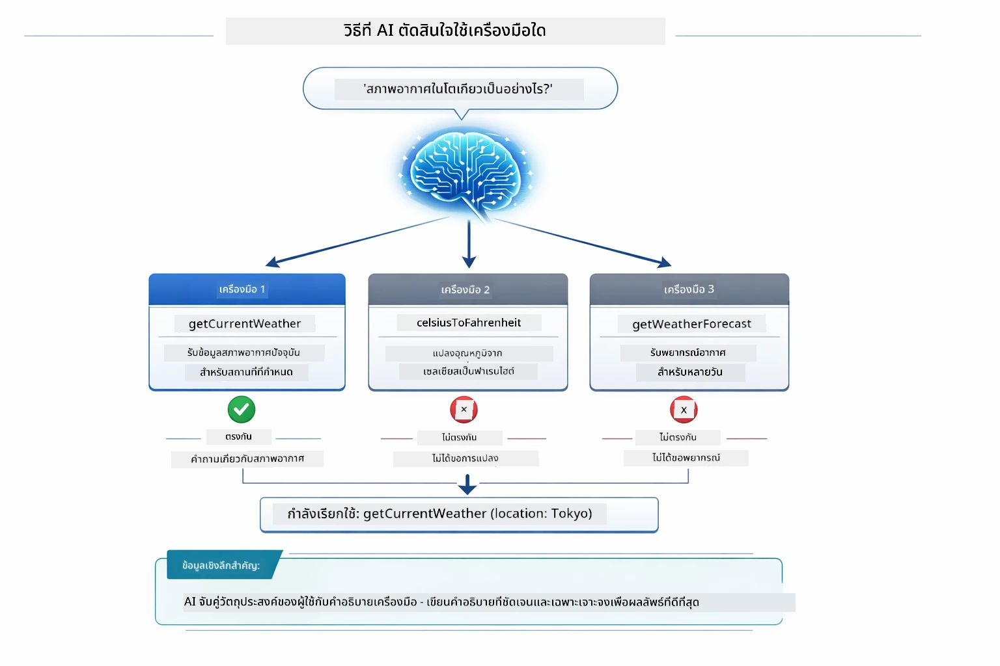

*โมเดลประเมินเครื่องมือที่มีทุกตัวเทียบกับเจตนาของผู้ใช้และเลือกตัวที่เหมาะสมที่สุด — นี่คือเหตุผลที่การเขียนคำอธิบายเครื่องมือที่ชัดเจนและเฉพาะเจาะจงมีความสำคัญ*

### การดำเนินการ

[AgentService.java](../../../04-tools/src/main/java/com/example/langchain4j/agents/service/AgentService.java)

Spring Boot ต่อสายอัตโนมัติอินเทอร์เฟซประกาศ `@AiService` กับเครื่องมือที่ลงทะเบียนทั้งหมด และ LangChain4j ดำเนินการเรียกใช้เครื่องมือโดยอัตโนมัติ เบื้องหลัง การเรียกเครื่องมือครบถ้วนจะไหลผ่านหกระยะ — จากคำถามภาษาธรรมชาติของผู้ใช้จนถึงคำตอบภาษาธรรมชาติ:

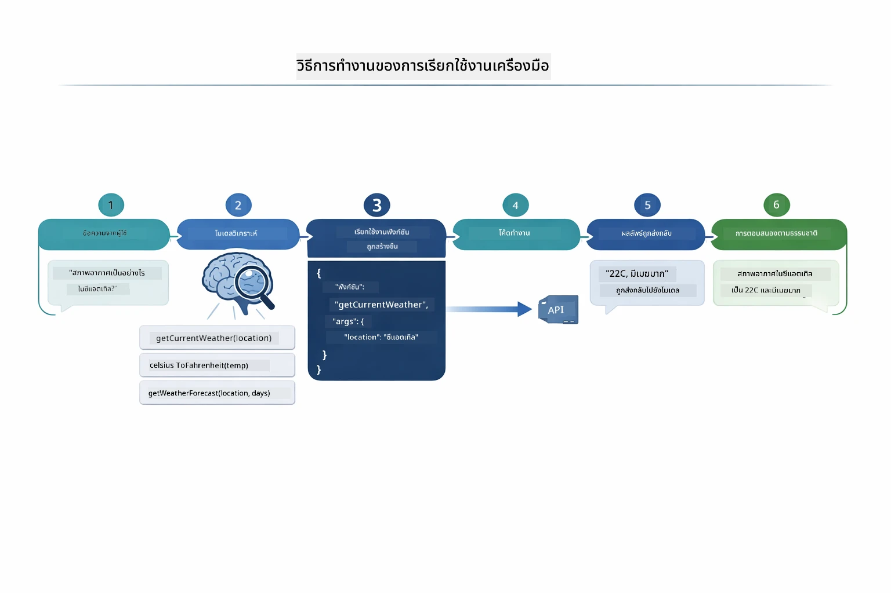

*การไหลแบบครบวงจร — ผู้ใช้ถามคำถาม โมเดลเลือกเครื่องมือ LangChain4j ดำเนินการ และโมเดลสอดแทรกผลลัพธ์ในคำตอบธรรมชาติ*

> **🤖 ลองใช้กับ [GitHub Copilot](https://github.com/features/copilot) Chat:** เปิด [`AgentService.java`](../../../04-tools/src/main/java/com/example/langchain4j/agents/service/AgentService.java) แล้วถาม:
> - "รูปแบบ ReAct ทำงานอย่างไรและทำไมจึงมีประสิทธิภาพกับตัวแทน AI?"
> - "ตัวแทนตัดสินใจเลือกเครื่องมือใดและลำดับอย่างไร?"
> - "จะเกิดอะไรขึ้นถ้าการเรียกใช้เครื่องมือไม่สำเร็จ — ฉันควรจัดการข้อผิดพลาดอย่างไรให้มั่นคง?"

### การสร้างการตอบกลับ

โมเดลรับข้อมูลสภาพอากาศและจัดรูปแบบเป็นคำตอบภาษาธรรมชาติให้กับผู้ใช้

### สถาปัตยกรรม: การต่อสายอัตโนมัติของ Spring Boot

โมดูลนี้ใช้การรวม LangChain4j กับ Spring Boot ผ่านอินเทอร์เฟซประกาศ `@AiService` ตอนเริ่มต้น Spring Boot จะค้นหา `@Component` ทุกตัวที่มีเมธอด `@Tool` บีน `ChatModel` ของคุณ และ `ChatMemoryProvider` — แล้วต่อสายทั้งหมดเข้าด้วยกันในอินเทอร์เฟซ `Assistant` ตัวเดียวโดยไม่มีโค้ดซ้ำซ้อน

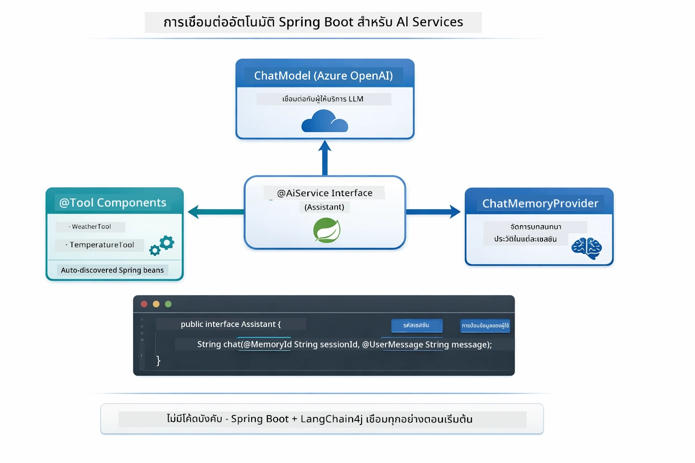

*อินเทอร์เฟซ @AiService ผูก ChatModel, คอมโพเนนต์เครื่องมือ และผู้ให้บริการหน่วยความจำเข้าด้วยกัน — Spring Boot ต่อสายทั้งหมดให้โดยอัตโนมัติ*

ข้อดีหลักของแนวทางนี้:

- **Spring Boot ต่อสายอัตโนมัติ** — ChatModel และเครื่องมือถูกฉีดโดยอัตโนมัติ
- **รูปแบบ @MemoryId** — การจัดการหน่วยความจำแบบเซสชันโดยอัตโนมัติ
- **อินสแตนซ์เดียว** — ตอบสนอง Assistant สร้างครั้งเดียวใช้งานซ้ำประสิทธิภาพสูง
- **การดำเนินการแบบปลอดภัยตามชนิดข้อมูล** — เรียกเมธอด Java โดยตรงพร้อมแปลงชนิดข้อมูล
- **การออร์เคสตราเซชันหลายรอบ** — จัดการการเชื่อมโยงเครื่องมือโดยอัตโนมัติ
- **ไม่มีบอยเลอร์เพลต** — ไม่ต้องเรียก `AiServices.builder()` ด้วยตนเองหรือใช้ HashMap ในหน่วยความจำ

แนวทางทางเลือก (เรียก `AiServices.builder()` ด้วยตนเอง) ต้องเขียนโค้ดมากขึ้นและขาดข้อดีของการรวมกับ Spring Boot

## การเชื่อมโยงเครื่องมือ

**การเชื่อมโยงเครื่องมือ** — พลังจริงของตัวแทนที่ใช้เครื่องมือแสดงเมื่อคำถามเดียวต้องการเครื่องมือหลายตัว ถามว่า "สภาพอากาศในซียาติลเป็นฟาเรนไฮต์เท่าไหร่?" ตัวแทนจะเชื่อมโยงเครื่องมือสองตัวโดยอัตโนมัติ: เรียก `getCurrentWeather` เพื่อรับอุณหภูมิในเซลเซียสก่อน แล้วส่งค่านั้นไปยัง `celsiusToFahrenheit` เพื่อแปลง — ทั้งหมดในรอบสนทนาเดียว

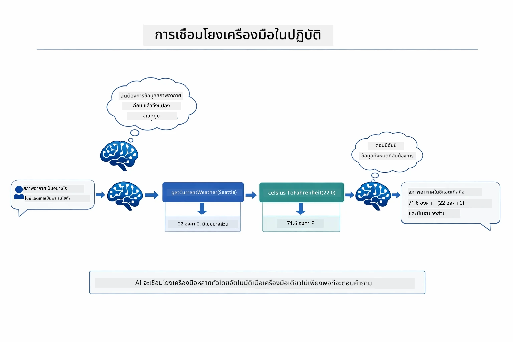

*ตัวอย่างการเชื่อมโยงเครื่องมือ — ตัวแทนเรียก getCurrentWeather ก่อน แล้วส่งผลลัพธ์เป็นเซลเซียสไปยัง celsiusToFahrenheit และส่งคำตอบรวมกัน*

นี่คือลักษณะในแอปพลิเคชันที่กำลังรัน — ตัวแทนเชื่อมโยงการเรียกเครื่องมือสองครั้งในรอบสนทนาเดียว:

<a href="images/tool-chaining.png"></a>

*ผลลัพธ์ของแอปพลิเคชันจริง — ตัวแทนเชื่อมโยง getCurrentWeather → celsiusToFahrenheit โดยอัตโนมัติในรอบเดียว*

**ความล้มเหลวอย่างสง่างาม** — ถามหาสภาพอากาศในเมืองที่ไม่มีในข้อมูลตัวอย่าง เครื่องมือจะส่งข้อความแสดงข้อผิดพลาด และ AI อธิบายว่าช่วยไม่ได้แทนที่จะล่ม เครื่องมือจึงล้มเหลวอย่างปลอดภัย

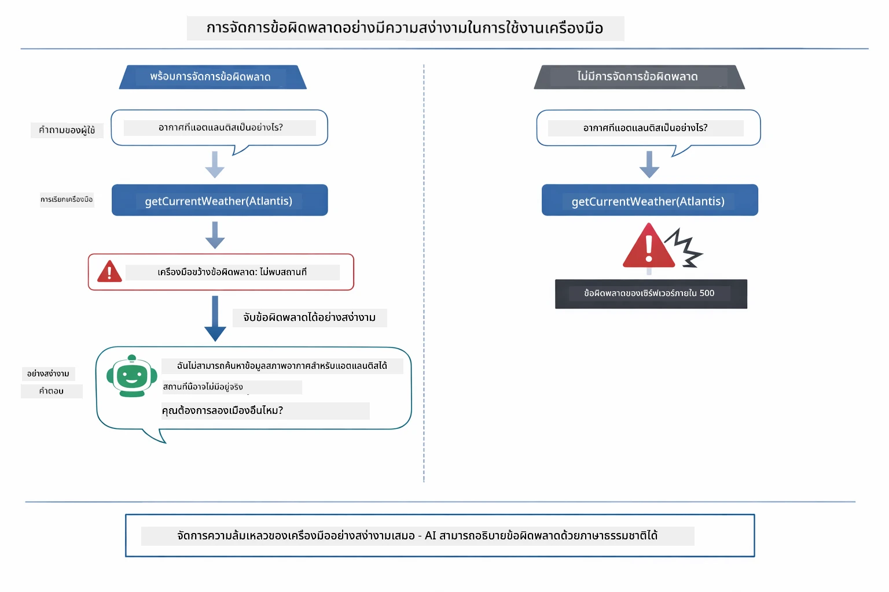

*เมื่อเครื่องมือเกิดข้อผิดพลาด ตัวแทนจับข้อผิดพลาดและตอบกลับด้วยคำอธิบายที่เป็นประโยชน์แทนการล่ม*

สิ่งนี้เกิดขึ้นในรอบสนทนาเดียว ตัวแทนออร์เคสตราเซชันการเรียกหลายเครื่องมือโดยอัตโนมัติ

## การรันแอปพลิเคชัน

**ตรวจสอบการปรับใช้:**

ตรวจสอบว่าไฟล์ `.env` อยู่ในไดเรกทอรีหลักพร้อมข้อมูลรับรอง Azure (สร้างระหว่าง Module 01):
```bash
cat ../.env  # ควรแสดง AZURE_OPENAI_ENDPOINT, API_KEY, DEPLOYMENT
```

**เริ่มแอปพลิเคชัน:**

> **หมายเหตุ:** หากคุณเริ่มแอปทั้งหมดด้วยสคริปต์ `./start-all.sh` จาก Module 01 แล้ว โมดูลนี้จะรันอยู่ที่พอร์ต 8084 อยู่แล้ว คุณสามารถข้ามคำสั่งเริ่มด้านล่างแล้วไปที่ http://localhost:8084 ได้เลย

**ตัวเลือก 1: ใช้ Spring Boot Dashboard (แนะนำสำหรับผู้ใช้ VS Code)**

คอนเทนเนอร์ผู้พัฒนามีส่วนขยาย Spring Boot Dashboard ซึ่งเป็นอินเทอร์เฟซภาพสำหรับจัดการแอป Spring Boot ทั้งหมด คุณจะเจอมันที่แถบกิจกรรมด้านซ้ายของ VS Code (สัญลักษณ์ Spring Boot)

จาก Spring Boot Dashboard คุณสามารถ:
- ดูแอป Spring Boot ทั้งหมดในเวิร์กสเปซ
- เริ่ม/หยุดแอปด้วยคลิกเดียว
- ดูล็อกแอปแบบเรียลไทม์
- ตรวจสอบสถานะแอป

แค่คลิกปุ่มเล่นข้าง "tools" เพื่อเริ่มโมดูลนี้ หรือเริ่มทุกโมดูลพร้อมกัน


**ตัวเลือก 2: ใช้สคริปต์เชลล์**

เริ่มเว็บแอปทั้งหมด (โมดูล 01-04):

**Bash:**
```bash
cd ..  # จากไดเรกทอรีรูท
./start-all.sh
```

**PowerShell:**
```powershell
cd ..  # จากไดเรกทอรีรูท
.\start-all.ps1
```

หรือเริ่มแค่โมดูลนี้:

**Bash:**
```bash
cd 04-tools
./start.sh
```

**PowerShell:**
```powershell
cd 04-tools
.\start.ps1
```

ทั้งสองสคริปต์จะโหลดตัวแปรสภาพแวดล้อมจากไฟล์ `.env` ในไดเรกทอรีหลักและจะสร้าง JAR หากยังไม่มี

> **หมายเหตุ:** หากคุณต้องการสร้างทุกโมดูลเองก่อนเริ่ม:
>
> **Bash:**
> ```bash
> cd ..  # Go to root directory
> mvn clean package -DskipTests
> ```
>
> **PowerShell:**
> ```powershell
> cd ..  # Go to root directory
> mvn clean package -DskipTests
> ```

เปิด http://localhost:8084 ในเบราว์เซอร์ของคุณ

**เพื่อหยุด:**

**Bash:**
```bash
./stop.sh  # เฉพาะโมดูลนี้
# หรือ
cd .. && ./stop-all.sh  # ทุกโมดูล
```

**PowerShell:**
```powershell
.\stop.ps1  # โมดูลนี้เท่านั้น
# หรือ
cd ..; .\stop-all.ps1  # ทุกโมดูล
```

## การใช้แอปพลิเคชัน

แอปพลิเคชันมีอินเทอร์เฟซเว็บให้คุณโต้ตอบกับตัวแทน AI ที่เข้าถึงเครื่องมือเช่น แปลงอุณหภูมิและสภาพอากาศได้

<a href="images/tools-homepage.png"></a>

*อินเทอร์เฟซ AI Agent Tools - ตัวอย่างด่วนและอินเทอร์เฟซแชทสำหรับโต้ตอบกับเครื่องมือ*

### ลองใช้เครื่องมือแบบง่าย
เริ่มด้วยคำขอตรงไปตรงมา: "แปลง 100 องศาฟาเรนไฮต์เป็นเซลเซียส" ตัวแทนรับรู้ว่าต้องใช้เครื่องมือแปลงอุณหภูมิ เรียกใช้งานด้วยพารามิเตอร์ที่ถูกต้อง และส่งผลลัพธ์กลับมา สังเกตว่ามันรู้สึกเป็นธรรมชาติอย่างไร — คุณไม่ได้ระบุว่าจะใช้เครื่องมือใดหรือวิธีเรียกใช้งานอย่างไร

### ทดสอบการเชื่อมโยงเครื่องมือ

ตอนนี้ลองทำอะไรที่ซับซ้อนขึ้น: "สภาพอากาศที่ซีแอตเทิลเป็นอย่างไรและแปลงเป็นฟาเรนไฮต์?" ดูว่าตัวแทนทำงานทีละขั้นตอนอย่างไร โดยมันจะดึงข้อมูลอากาศ (ซึ่งเป็นเซลเซียส), รับรู้ว่าต้องแปลงเป็นฟาเรนไฮต์, เรียกใช้งานเครื่องมือแปลง, และรวมผลลัพธ์ทั้งสองเป็นคำตอบเดียว

### ดูการไหลของบทสนทนา

อินเทอร์เฟซแชทจะเก็บประวัติการสนทนา ทำให้คุณสามารถโต้ตอบหลายรอบได้ คุณจะเห็นคำถามและคำตอบก่อนหน้าทั้งหมด ทำให้ง่ายต่อการติดตามบทสนทนาและเข้าใจว่าตัวแทนสร้างบริบทอย่างไรผ่านหลายรอบการแลกเปลี่ยน

<a href="images/tools-conversation-demo.png"></a>

*บทสนทนาหลายรอบแสดงการแปลงค่าอย่างง่าย, การค้นหาสภาพอากาศ, และการเชื่อมโยงเครื่องมือ*

### ทดลองด้วยคำขอที่หลากหลาย

ลองใช้การผสมผสานต่าง ๆ:
- การค้นหาสภาพอากาศ: "สภาพอากาศที่โตเกียวเป็นอย่างไร?"
- การแปลงอุณหภูมิ: "25°C เท่ากับกี่เคลวิน?"
- คำถามแบบผสม: "ตรวจสอบสภาพอากาศในปารีสและบอกฉันว่ามันสูงกว่า 20°C หรือไม่"

สังเกตว่าตัวแทนตีความภาษาธรรมชาติและแม็ปไปยังการเรียกใช้งานเครื่องมือที่เหมาะสมอย่างไร

## แนวคิดสำคัญ

### รูปแบบ ReAct (การให้เหตุผลและการดำเนินการ)

ตัวแทนสลับระหว่างการให้เหตุผล (ตัดสินใจว่าจะทำอะไร) และการดำเนินการ (ใช้เครื่องมือ) รูปแบบนี้ช่วยให้แก้ปัญหาได้อย่างอิสระแทนที่จะทำตามคำสั่งอย่างเดียว

### คำอธิบายเครื่องมือสำคัญ

คุณภาพของคำอธิบายเครื่องมือส่งผลโดยตรงต่อการใช้งานของตัวแทน คำอธิบายที่ชัดเจนและเฉพาะเจาะจงช่วยให้โมเดลเข้าใจว่าเมื่อใดและอย่างไรจึงควรเรียกใช้เครื่องมือแต่ละตัว

### การจัดการเซสชัน

การประกาศ `@MemoryId` ช่วยให้จัดการหน่วยความจำแบบเซสชันได้โดยอัตโนมัติ ID ของแต่ละเซสชันจะสร้าง instance ของ `ChatMemory` ที่จัดการโดย bean `ChatMemoryProvider` ดังนั้นผู้ใช้หลายคนจึงสามารถโต้ตอบกับตัวแทนพร้อมกันโดยไม่ทำให้บทสนทนาเพี้ยน

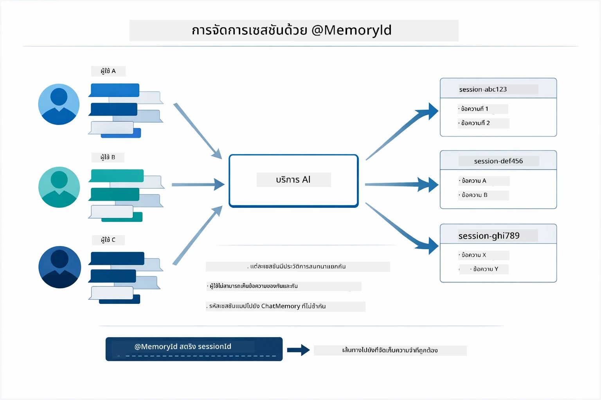

*ID เซสชันแต่ละอันมีประวัติการสนทนาแยกจากกัน — ผู้ใช้ไม่เคยเห็นข้อความของผู้อื่น*

### การจัดการข้อผิดพลาด

เครื่องมืออาจล้มเหลว — API หมดเวลา, พารามิเตอร์ผิด, บริการภายนอกขัดข้อง ตัวแทนในระบบจริงจำเป็นต้องมีการจัดการข้อผิดพลาดเพื่อให้โมเดลสามารถอธิบายปัญหาหรือพยายามทางเลือกอื่นแทนที่จะทำให้แอปพลิเคชันทั้งระบบล่ม เมื่อเครื่องมือขว้างข้อผิดพลาด LangChain4j จะจับมันและส่งข้อความผิดพลาดกลับไปยังโมเดล ซึ่งจากนั้นจะอธิบายปัญหาเป็นภาษาธรรมชาติได้

## เครื่องมือที่มีให้ใช้งาน

แผนภาพด้านล่างแสดงระบบนิเวศของเครื่องมือที่คุณสามารถสร้าง โมดูลนี้แสดงตัวอย่างเครื่องมือสภาพอากาศและอุณหภูมิ แต่รูปแบบ `@Tool` เดียวกันใช้ได้กับเมธอด Java ใด ๆ — ตั้งแต่การสอบถามฐานข้อมูลไปจนถึงการประมวลผลการชำระเงิน

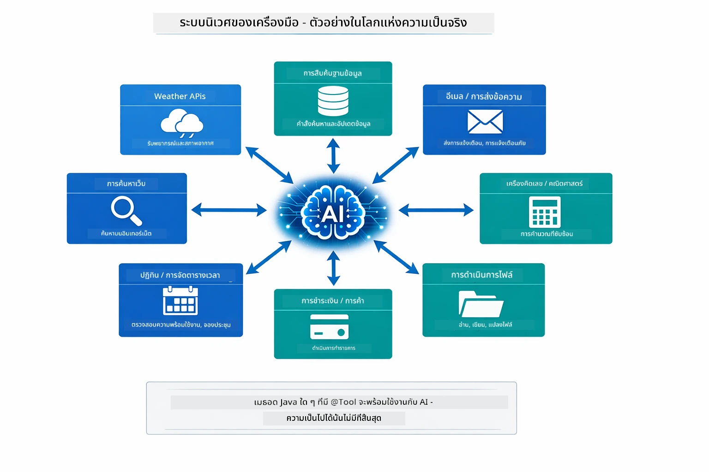

*เมธอด Java ใดที่มีการประกาศด้วย @Tool จะพร้อมใช้งานสำหรับ AI — รูปแบบนี้ขยายไปยังฐานข้อมูล, API, อีเมล, การจัดการไฟล์ และอื่น ๆ*

## เมื่อใดควรใช้ตัวแทนที่ใช้เครื่องมือ

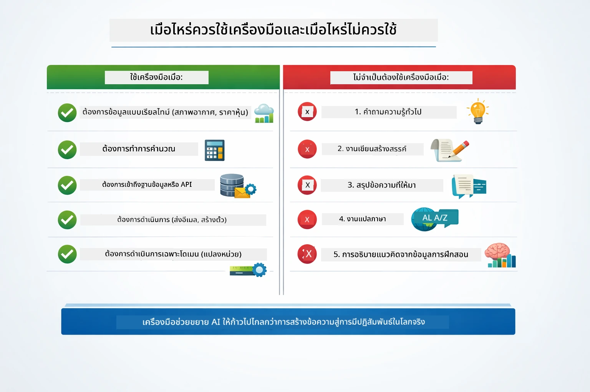

*คู่มือการตัดสินใจอย่างรวดเร็ว — เครื่องมือเหมาะกับข้อมูลแบบเรียลไทม์, การคำนวณ และการดำเนินการ; ความรู้ทั่วไปและงานสร้างสรรค์ไม่จำเป็นต้องใช้*

**ใช้เครื่องมือเมื่อ:**
- การตอบกลับต้องใช้ข้อมูลเรียลไทม์ (สภาพอากาศ, ราคาหุ้น, สินค้าคงคลัง)
- ต้องการทำการคำนวณที่ซับซ้อนเกินคณิตศาสตร์พื้นฐาน
- เข้าถึงฐานข้อมูลหรือ API
- ดำเนินการ (ส่งอีเมล, สร้างตั๋ว, อัพเดตข้อมูล)
- รวมข้อมูลจากหลายแหล่ง

**ไม่ใช้เครื่องมือเมื่อ:**
- คำถามตอบได้จากความรู้ทั่วไป
- การตอบสนองเป็นเพียงบทสนทนา
- ความหน่วงของเครื่องมือทำให้ประสบการณ์ช้าเกินไป

## เครื่องมือ vs RAG

โมดูล 03 และ 04 ต่างขยายขีดความสามารถของ AI แต่ต่างกันอย่างมีนัยสำคัญ RAG ให้โมเดลเข้าถึง **ความรู้** โดยการดึงเอกสาร เครื่องมือให้โมเดลสามารถดำเนิน **การกระทำ** โดยเรียกใช้ฟังก์ชัน

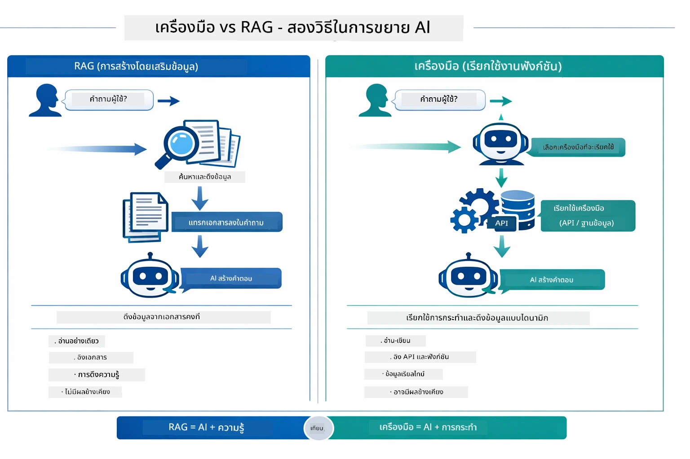

*RAG ดึงข้อมูลจากเอกสารแบบคงที่ — เครื่องมือประมวลการกระทำและดึงข้อมูลเรียลไทม์ที่เปลี่ยนแปลงอยู่เสมอ ระบบจริงหลายระบบใช้ทั้งสองวิธีรวมกัน*

ในทางปฏิบัติ ระบบในองค์กรหลายระบบใช้ทั้งสองแนวทางร่วมกัน: RAG เพื่อยึดคำตอบในเอกสารของคุณ และเครื่องมือเพื่อดึงข้อมูลสดหรือทำการดำเนินการ

## ขั้นตอนถัดไป

**โมดูลถัดไป:** [05-mcp - โปรโตคอลบริบทของโมเดล (MCP)](../05-mcp/README.md)

---

**นำทาง:** [← ก่อนหน้า: โมดูล 03 - RAG](../03-rag/README.md) | [กลับสู่หน้าหลัก](../README.md) | [ถัดไป: โมดูล 05 - MCP →](../05-mcp/README.md)

---

<!-- CO-OP TRANSLATOR DISCLAIMER START -->
**คำปฏิเสธความรับผิดชอบ**:
เอกสารฉบับนี้ได้รับการแปลโดยใช้บริการแปลภาษาด้วย AI [Co-op Translator](https://github.com/Azure/co-op-translator) แม้เราจะพยายามให้มีความถูกต้อง แต่โปรดทราบว่าการแปลอัตโนมัติอาจมีข้อผิดพลาดหรือความไม่ถูกต้อง เอกสารต้นฉบับในภาษาต้นฉบับควรถือเป็นแหล่งข้อมูลที่ถูกต้องที่สุด สำหรับข้อมูลสำคัญ ขอแนะนำให้ใช้บริการแปลโดยผู้เชี่ยวชาญด้านภาษามนุษย์ เราไม่รับผิดชอบต่อความเข้าใจผิดหรือการตีความที่ผิดพลาดซึ่งเกิดจากการใช้การแปลนี้
<!-- CO-OP TRANSLATOR DISCLAIMER END -->