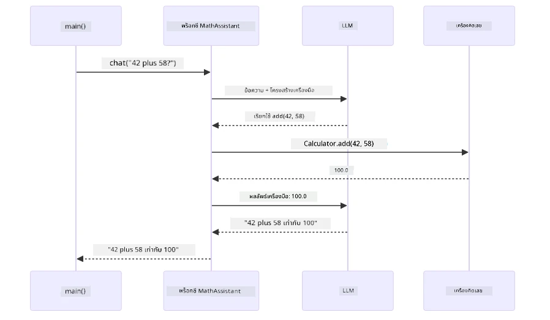
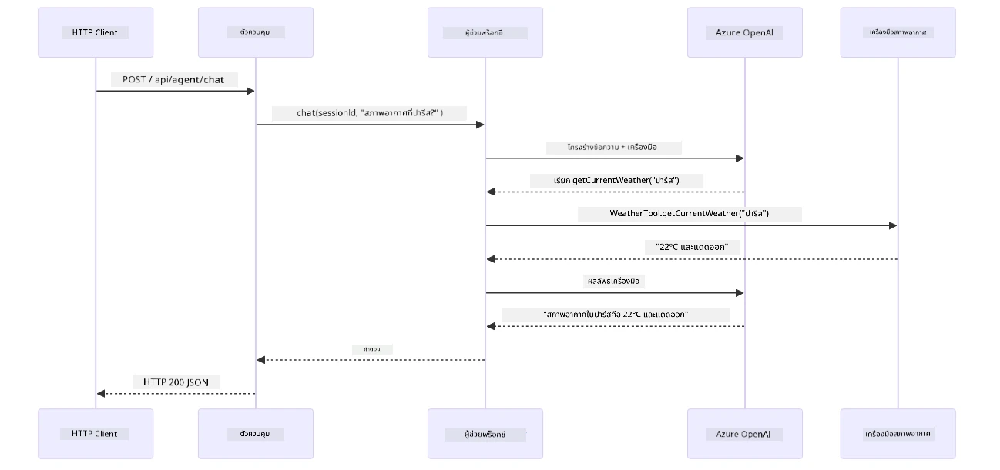

# Module 04: ตัวแทน AI พร้อมเครื่องมือ

## สารบัญ

- [วิดีโอสาธิต](../../../04-tools)
- [สิ่งที่คุณจะได้เรียนรู้](../../../04-tools)
- [สิ่งที่ต้องมีพื้นฐานก่อน](../../../04-tools)
- [ทำความเข้าใจกับตัวแทน AI พร้อมเครื่องมือ](../../../04-tools)
- [การทำงานของการเรียกเครื่องมือ](../../../04-tools)
  - [คำจำกัดความของเครื่องมือ](../../../04-tools)
  - [การตัดสินใจ](../../../04-tools)
  - [การดำเนินการ](../../../04-tools)
  - [การสร้างการตอบสนอง](../../../04-tools)
  - [สถาปัตยกรรม: การต่อสายอัตโนมัติของ Spring Boot](../../../04-tools)
- [การเชื่อมโยงเครื่องมือ](../../../04-tools)
- [รันแอปพลิเคชัน](../../../04-tools)
- [การใช้งานแอปพลิเคชัน](../../../04-tools)
  - [ลองใช้เครื่องมือแบบง่าย](../../../04-tools)
  - [ทดสอบการเชื่อมโยงเครื่องมือ](../../../04-tools)
  - [ดูการไหลของการสนทนา](../../../04-tools)
  - [ทดลองกับคำขอต่างๆ](../../../04-tools)
- [แนวคิดสำคัญ](../../../04-tools)
  - [รูปแบบ ReAct (Reasoning and Acting)](../../../04-tools)
  - [คำอธิบายของเครื่องมือสำคัญ](../../../04-tools)
  - [การจัดการเซสชัน](../../../04-tools)
  - [การจัดการข้อผิดพลาด](../../../04-tools)
- [เครื่องมือที่มีอยู่](../../../04-tools)
- [เมื่อไหร่ควรใช้ตัวแทนที่ใช้เครื่องมือ](../../../04-tools)
- [เครื่องมือเทียบกับ RAG](../../../04-tools)
- [ขั้นตอนต่อไป](../../../04-tools)

## วิดีโอสาธิต

รับชมเซสชันสดนี้ที่อธิบายวิธีเริ่มต้นกับโมดูลนี้:

<a href="https://www.youtube.com/watch?v=O_J30kZc0rw"></a>

## สิ่งที่คุณจะได้เรียนรู้

จนถึงตอนนี้ คุณได้เรียนรู้วิธีสนทนากับ AI การจัดโครงสร้างพรอมต์อย่างมีประสิทธิภาพ และการทำให้การตอบสนองอ้างอิงกับเอกสารของคุณ แต่ยังมีข้อจำกัดพื้นฐานอยู่: แบบจำลองภาษาเพียงสามารถสร้างข้อความเท่านั้น มันไม่สามารถตรวจสอบสภาพอากาศ ทำการคำนวณ สืบค้นฐานข้อมูล หรือโต้ตอบกับระบบภายนอกได้

เครื่องมือเปลี่ยนสิ่งนี้ โดยการให้แบบจำลองสามารถเข้าถึงฟังก์ชันที่สามารถเรียกใช้ได้ คุณเปลี่ยนจากการเป็นเครื่องสร้างข้อความเป็นตัวแทนที่สามารถดำเนินการต่าง ๆ ได้ แบบจำลองจะตัดสินใจเมื่อไหร่ที่มันต้องใช้เครื่องมือ เครื่องมือใดที่ใช้ และส่งพารามิเตอร์อะไร โค้ดของคุณจะดำเนินการฟังก์ชันและคืนผลลัพธ์ แบบจำลองจะนำผลลัพธ์นั้นมารวมในคำตอบ

## สิ่งที่ต้องมีพื้นฐานก่อน

- เสร็จสิ้น [Module 01 - Introduction](../01-introduction/README.md) (ทรัพยากร Azure OpenAI ถูกติดตั้งแล้ว)
- แนะนำให้เสร็จสิ้นโมดูลก่อนหน้า (โมดูลนี้อ้างอิงแนวคิด [RAG จาก Module 03](../03-rag/README.md) ในการเปรียบเทียบ Tools vs RAG)
- ไฟล์ `.env` อยู่ในไดเรกทอรีหลักพร้อมข้อมูลรับรอง Azure (สร้างด้วยคำสั่ง `azd up` ใน Module 01)

> **หมายเหตุ:** หากยังไม่เสร็จสิ้น Module 01 ให้ทำตามคำแนะนำการติดตั้งในนั้นก่อน

## ทำความเข้าใจกับตัวแทน AI พร้อมเครื่องมือ

> **📝 หมายเหตุ:** คำว่า "agents" ในโมดูลนี้หมายถึงผู้ช่วย AI ที่ได้รับการเสริมความสามารถด้วยฟีเจอร์การเรียกเครื่องมือ ซึ่งแตกต่างจากรูปแบบ **Agentic AI** (ตัวแทนอัตโนมัติที่มีการวางแผน ความจำ และการให้เหตุผลหลายขั้นตอน) ที่เราจะพูดถึงใน [Module 05: MCP](../05-mcp/README.md)

ไม่มีเครื่องมือ แบบจำลองภาษาเพียงสร้างข้อความจากข้อมูลการฝึกฝน ถามเรื่องสภาพอากาศปัจจุบัน มันต้องเดา ให้เครื่องมือแก่มัน มันสามารถเรียก API สภาพอากาศ ทำคำนวณ หรือสืบค้นฐานข้อมูล — แล้วนำผลจริงเหล่านั้นมารวมในคำตอบ


*ไม่มีเครื่องมือ แบบจำลองจึงคาดเดา — มีเครื่องมือแล้วมันสามารถเรียก API, ทำคำนวณ และส่งข้อมูลเรียลไทม์ได้*

ตัวแทน AI พร้อมเครื่องมือทำงานตามรูปแบบ **Reasoning and Acting (ReAct)** แบบจำลองไม่ได้แค่ตอบ — แต่มันคิดถึงสิ่งที่ต้องการ ทำการเรียกเครื่องมือ ดูผลลัพธ์ แล้วตัดสินใจว่าจะทำอีกหรือส่งคำตอบสุดท้าย:

1. **วิเคราะห์** — ตัวแทนวิเคราะห์คำถามผู้ใช้และกำหนดว่าต้องการข้อมูลอะไร
2. **ลงมือทำ** — ตัวแทนเลือกเครื่องมือที่เหมาะสม สร้างพารามิเตอร์ที่ถูกต้อง และเรียกเครื่องมือ
3. **สังเกต** — ตัวแทนรับผลลัพธ์จากเครื่องมือและประเมินผล
4. **ทำซ้ำหรือตอบ** — หากต้องการข้อมูลเพิ่ม ตัวแทนวนกลับ; หากไม่ใช่ จะสร้างคำตอบในภาษาธรรมชาติ


*วงจร ReAct — ตัวแทนคิด วิเคราะห์ว่าจะทำอะไร ลงมือเรียกเครื่องมือ สังเกตผล และวนจนพร้อมตอบคำถามสุดท้าย*

สิ่งนี้เกิดขึ้นโดยอัตโนมัติ คุณกำหนดเครื่องมือและคำอธิบายแบบจำลองจัดการการตัดสินใจเมื่อต้องใช้และใช้อย่างไร

## การทำงานของการเรียกเครื่องมือ

### คำจำกัดความของเครื่องมือ

[WeatherTool.java](../../../04-tools/src/main/java/com/example/langchain4j/agents/tools/WeatherTool.java) | [TemperatureTool.java](../../../04-tools/src/main/java/com/example/langchain4j/agents/tools/TemperatureTool.java)

คุณกำหนดฟังก์ชันพร้อมคำอธิบายและพารามิเตอร์ที่ชัดเจน แบบจำลองจะเห็นคำอธิบายนี้ในพรอมต์ระบบและเข้าใจว่าเครื่องมือแต่ละตัวทำอะไร

```java
@Component
public class WeatherTool {
    
    @Tool("Get the current weather for a location")
    public String getCurrentWeather(@P("Location name") String location) {
        // ตรรกะการค้นหาสภาพอากาศของคุณ
        return "Weather in " + location + ": 22°C, cloudy";
    }
}

@AiService
public interface Assistant {
    String chat(@MemoryId String sessionId, @UserMessage String message);
}

// ผู้ช่วยถูกตั้งค่าโดยอัตโนมัติโดย Spring Boot ด้วย:
// - bean ChatModel
// - ทุกเมธอด @Tool จากคลาส @Component
// - ChatMemoryProvider สำหรับการจัดการเซสชัน
```

แผนภาพด้านล่างแสดงการกำกับทุกส่วนและแสดงวิธีที่แต่ละส่วนช่วยให้ AI เข้าใจเมื่อเรียกใช้เครื่องมือและส่งอากิวเมนต์อะไร:


*โครงสร้างคำจำกัดความเครื่องมือ — @Tool บอก AI เมื่อใช้เครื่องมือ, @P อธิบายแต่ละพารามิเตอร์, และ @AiService ต่อสายทุกอย่างตอนเริ่มทำงาน*

> **🤖 ลองกับ [GitHub Copilot](https://github.com/features/copilot) Chat:** เปิด [`WeatherTool.java`](../../../04-tools/src/main/java/com/example/langchain4j/agents/tools/WeatherTool.java) และถาม:
> - "ฉันจะรวม API สภาพอากาศจริงอย่าง OpenWeatherMap แทนข้อมูลจำลองได้อย่างไร?"
> - "อะไรคือคำอธิบายเครื่องมือที่ดีที่จะช่วยให้ AI ใช้มันได้ถูกต้อง?"
> - "ฉันควรจัดการกับข้อผิดพลาด API และข้อจำกัดอัตราอย่างไรเมื่อสร้างเครื่องมือ?"

### การตัดสินใจ

เมื่อผู้ใช้ถามว่า "สภาพอากาศที่ซีแอตเทิลเป็นอย่างไร?" แบบจำลองไม่ได้สุ่มเลือกเครื่องมือ มันเปรียบเทียบเจตนาผู้ใช้กับคำอธิบายเครื่องมือทั้งหมดที่เข้าถึงได้, ให้คะแนนความเกี่ยวข้อง และเลือกอันที่เหมาะสมที่สุด แล้วสร้างคำเรียกฟังก์ชันที่มีพารามิเตอร์ถูกต้อง — ในกรณีนี้ตั้ง `location` เป็น `"Seattle"`

ถ้าไม่มีเครื่องมือไหนตรงกับคำขอผู้ใช้ แบบจำลองจะตอบจากความรู้ของตัวเอง หากมีหลายเครื่องมือเหมาะสม มันจะเลือกอันที่เจาะจงที่สุด


*แบบจำลองประเมินเครื่องมือทุกตัวเทียบกับเจตนาผู้ใช้และเลือกอันที่ตรงที่สุด — นี่คือเหตุผลที่การเขียนคำอธิบายเครื่องมือให้ชัดเจนและเฉพาะเจาะจงสำคัญ*

### การดำเนินการ

[AgentService.java](../../../04-tools/src/main/java/com/example/langchain4j/agents/service/AgentService.java)

Spring Boot ต่อสาย `@AiService` แบบประกาศกับเครื่องมือที่ลงทะเบียนทั้งหมดและ LangChain4j ดำเนินการเรียกเครื่องมือโดยอัตโนมัติ เบื้องหลัง การเรียกเครื่องมือครบวงจรผ่านหกขั้นตอน — จากคำถามภาษาธรรมชาติของผู้ใช้จนถึงคำตอบภาษาธรรมชาติ:


*ไหลตั้งแต่ต้นจนจบ — ผู้ใช้ถามคำถาม, แบบจำลองเลือกเครื่องมือ, LangChain4j ดำเนินการ, และแบบจำลองรวมผลลัพธ์ในคำตอบ*

ถ้าคุณรัน [ToolIntegrationDemo](../../../00-quick-start/src/main/java/com/example/langchain4j/quickstart/ToolIntegrationDemo.java) ใน Module 00 คุณจะเห็นรูปแบบนี้ทำงาน — เครื่องมือ `Calculator` ถูกเรียกแบบเดียวกัน แผนภาพลำดับด้านล่างแสดงสิ่งที่เกิดขึ้นภายในในตอนนั้น:



*ลูปเรียกเครื่องมือจากเดโม Quick Start — `AiServices` ส่งข้อความและสเกม่าเครื่องมือให้ LLM, LLM ตอบด้วยฟังก์ชันเรียกอย่าง `add(42, 58)`, LangChain4j ดำเนินการเมธอด `Calculator` ในเครื่อง และส่งผลลัพธ์กลับเพื่อคำตอบสุดท้าย*

> **🤖 ลองกับ [GitHub Copilot](https://github.com/features/copilot) Chat:** เปิด [`AgentService.java`](../../../04-tools/src/main/java/com/example/langchain4j/agents/service/AgentService.java) และถาม:
> - "รูปแบบ ReAct ทำงานอย่างไรและทำไมจึงมีประสิทธิภาพสำหรับตัวแทน AI?"
> - "ตัวแทนตัดสินใจเลือกเครื่องมือและลำดับการใช้เครื่องมืออย่างไร?"
> - "ถ้าการดำเนินการเครื่องมือล้มเหลว คืออะไรและฉันควรจัดการข้อผิดพลาดอย่างไรให้มั่นคง?"

### การสร้างการตอบสนอง

แบบจำลองรับข้อมูลสภาพอากาศและจัดรูปแบบเป็นคำตอบภาษาธรรมชาติสำหรับผู้ใช้

### สถาปัตยกรรม: การต่อสายอัตโนมัติของ Spring Boot

โมดูลนี้ใช้การผสมผสาน LangChain4j กับ Spring Boot ผ่านอินเทอร์เฟซ `@AiService` แบบประกาศ ตอนเริ่มทำงาน Spring Boot จะค้นหา `@Component` ทุกตัวที่มีเมธอด `@Tool`, bean `ChatModel`, และ `ChatMemoryProvider` — แล้วต่อสายทั้งหมดเข้ากับอินเทอร์เฟซ `Assistant` เดียวโดยไม่มีโค้ดซ้ำซ้อน


*อินเทอร์เฟซ @AiService รวม ChatModel, คอมโพเนนต์เครื่องมือ และ memory provider — Spring Boot ต่อสายทั้งหมดให้โดยอัตโนมัติ*

นี่คือวงจรคำขอสมบูรณ์ในรูปแบบแผนภาพลำดับ — จาก HTTP request ผ่านคอนโทรลเลอร์, เซอร์วิส, และพร็อกซีที่ต่อสายอัตโนมัติ จนถึงการเรียกเครื่องมือและส่งผลลัพธ์กลับ:



*วงจรคำขอ Spring Boot ครบถ้วน — HTTP request ไหลผ่านคอนโทรลเลอร์และเซอร์วิสเข้าสู่พร็อกซี Assistant ที่ต่อสายอัตโนมัติ, จัดการ LLM และการเรียกเครื่องมือโดยอัตโนมัติ*

ข้อดีหลักของวิธีนี้:

- **ต่อสายอัตโนมัติของ Spring Boot** — ฉีด ChatModel และเครื่องมือโดยอัตโนมัติ
- **รูปแบบ @MemoryId** — จัดการหน่วยความจำตามเซสชันอัตโนมัติ
- **อินสแตนซ์เดียว** — สร้าง Assistant ครั้งเดียวใช้ซ้ำเพื่อประสิทธิภาพดีขึ้น
- **การดำเนินการปลอดภัยตามชนิด** — เรียกเมธอด Java โดยตรงพร้อมการแปลงชนิดข้อมูล
- **จัดการหลายรอบอัตโนมัติ** — รองรับการเชื่อมโยงเครื่องมือโดยอัตโนมัติ
- **ไม่มีโค้ดซ้ำซ้อน** — ไม่ต้องเรียก `AiServices.builder()` หรือจัดการ HashMap เอง

วิธีการอื่น (เรียก `AiServices.builder()` เอง) ใช้โค้ดมากกว่าและไม่มีประโยชน์จากการผสานกับ Spring Boot

## การเชื่อมโยงเครื่องมือ

**การเชื่อมโยงเครื่องมือ** — พลังจริงของตัวแทนที่ใช้เครื่องมือแสดงเมื่อคำถามหนึ่งต้องใช้หลายเครื่องมือ ถามว่า "สภาพอากาศที่ซีแอตเทิลในองศาฟาเรนไฮต์เป็นอย่างไร?" ตัวแทนจะเชื่อมโยงเครื่องมือสองตัวโดยอัตโนมัติ: เรียก `getCurrentWeather` เพื่อรับอุณหภูมิในเซลเซียส จากนั้นส่งค่าดังกล่าวไปยัง `celsiusToFahrenheit` เพื่อแปลง — ทั้งหมดในรอบสนทนาเดียว


*การเชื่อมโยงเครื่องมือในงานจริง — ตัวแทนเรียก getCurrentWeather ก่อน จากนั้นส่งผลลัพธ์เซลเซียสไปยัง celsiusToFahrenheit และให้คำตอบที่รวมกัน*

**การล้มเหลวอย่างอ่อนโยน** — ถามถึงสภาพอากาศในเมืองที่ไม่มีในข้อมูลจำลอง เครื่องมือจะส่งข้อความผิดพลาดและ AI อธิบายว่าช่วยไม่ได้ แทนที่จะล่ม เครื่องมือล้มเหลวอย่างปลอดภัย แผนภาพด้านล่างเปรียบเทียบสองวิธี — การจัดการข้อผิดพลาดอย่างเหมาะสม ตัวแทนจับข้อผิดพลาดและตอบกลับให้ความช่วยเหลือ ในขณะที่ไม่มี จะทำให้แอปล่มทั้งหมด:


*เมื่อเครื่องมือเกิดข้อผิดพลาด ตัวแทนจับข้อผิดพลาดและตอบด้วยคำอธิบายที่ช่วยเหลือแทนการล่ม*

สิ่งนี้เกิดขึ้นในรอบสนทนาเดียว ตัวแทนจัดการการเรียกเครื่องมือหลายตัวโดยอัตโนมัติ

## รันแอปพลิเคชัน

**ตรวจสอบการติดตั้ง:**

ตรวจสอบว่าไฟล์ `.env` อยู่ในไดเรกทอรีหลักพร้อมข้อมูลระบุตัวตน Azure (สร้างใน Module 01) รันคำสั่งนี้จากไดเรกทอรีโมดูล (`04-tools/`):

**Bash:**
```bash
cat ../.env  # ควรแสดง AZURE_OPENAI_ENDPOINT, API_KEY, DEPLOYMENT
```

**PowerShell:**
```powershell
Get-Content ..\.env  # ควรแสดง AZURE_OPENAI_ENDPOINT, API_KEY, DEPLOYMENT
```

**เริ่มแอปพลิเคชัน:**

> **หมายเหตุ:** หากคุณเริ่มแอปทั้งหมดด้วยคำสั่ง `./start-all.sh` จากไดเรกทอรีหลักแล้ว (ตามคำแนะนำใน Module 01) โมดูลนี้จะรันอยู่ที่พอร์ต 8084 คุณสามารถข้ามคำสั่งเริ่มด้านล่างและไปที่ http://localhost:8084 ได้เลย

**ตัวเลือก 1: ใช้ Spring Boot Dashboard (แนะนำสำหรับผู้ใช้ VS Code)**

Dev container มีส่วนเสริม Spring Boot Dashboard ซึ่งให้ส่วนติดต่อผู้ใช้แบบกราฟิกสำหรับจัดการแอป Spring Boot ทุกตัว คุณจะพบได้ในแถบกิจกรรมด้านซ้ายของ VS Code (ดูไอคอน Spring Boot)

จาก Spring Boot Dashboard คุณสามารถ:
- ดูแอป Spring Boot ทั้งหมดใน workspace
- เริ่ม/หยุดแอปได้ด้วยคลิกเดียว
- ดูล็อกแอปแบบเรียลไทม์
- ตรวจสอบสถานะแอป
เพียงคลิกปุ่มเล่นถัดจาก "tools" เพื่อเริ่มโมดูลนี้ หรือเริ่มทุกโมดูลพร้อมกัน

นี่คือรูปลักษณ์ของ Spring Boot Dashboard ใน VS Code:


*Spring Boot Dashboard ใน VS Code — เริ่ม หยุด และตรวจสอบโมดูลทั้งหมดจากที่เดียว*

**ตัวเลือกที่ 2: ใช้สคริปต์เชลล์**

เริ่มเว็บแอปพลิเคชันทั้งหมด (โมดูล 01-04):

**Bash:**
```bash
cd ..  # จากไดเรกทอรีรูท
./start-all.sh
```

**PowerShell:**
```powershell
cd ..  # จากไดเรกทอรีรูท
.\start-all.ps1
```

หรือเริ่มเพียงโมดูลนี้:

**Bash:**
```bash
cd 04-tools
./start.sh
```

**PowerShell:**
```powershell
cd 04-tools
.\start.ps1
```

สคริปต์ทั้งสองโหลดค่าตัวแปรสภาพแวดล้อมจากไฟล์ `.env` ที่รูทโดยอัตโนมัติ และจะคอมไพล์ JAR หากยังไม่มี

> **หมายเหตุ:** หากคุณต้องการคอมไพล์ทุกโมดูลด้วยตัวเองก่อนเริ่ม:
>
> **Bash:**
> ```bash
> cd ..  # Go to root directory
> mvn clean package -DskipTests
> ```
>
> **PowerShell:**
> ```powershell
> cd ..  # Go to root directory
> mvn clean package -DskipTests
> ```

เปิด http://localhost:8084 ในเบราว์เซอร์ของคุณ

**เพื่อหยุด:**

**Bash:**
```bash
./stop.sh  # เพียงโมดูลนี้
# หรือ
cd .. && ./stop-all.sh  # ทุกโมดูล
```

**PowerShell:**
```powershell
.\stop.ps1  # เฉพาะโมดูลนี้
# หรือ
cd ..; .\stop-all.ps1  # ทุกโมดูล
```

## การใช้งานแอปพลิเคชัน

แอปพลิเคชันมีอินเทอร์เฟซเว็บที่คุณสามารถโต้ตอบกับ AI agent ที่เข้าถึงเครื่องมือสำหรับสภาพอากาศและการแปลงอุณหภูมิได้ นี่คือรูปลักษณ์ของอินเทอร์เฟซ — มีตัวอย่างเริ่มต้นอย่างรวดเร็ว และแผงแชทสำหรับส่งคำขอ:

<a href="images/tools-homepage.png"></a>

*อินเทอร์เฟซ AI Agent Tools - ตัวอย่างอย่างรวดเร็วและอินเทอร์เฟซแชทสำหรับโต้ตอบกับเครื่องมือ*

### ลองใช้เครื่องมืออย่างง่าย

เริ่มจากคำขอธรรมดา: "แปลง 100 องศาฟาเรนไฮต์เป็นเซลเซียส" ตัวแทนจะรับรู้ว่าต้องใช้เครื่องมือแปลงอุณหภูมิ เรียกใช้ด้วยพารามิเตอร์ที่ถูกต้อง และส่งผลลัพธ์กลับมา สังเกตว่ามันดูเป็นธรรมชาติมาก - คุณไม่ได้ระบุว่าจะใช้เครื่องมือไหนหรือวิธีเรียกอย่างไร

### ทดสอบการเชื่อมโยงเครื่องมือ

ลองทำอะไรที่ซับซ้อนขึ้น: "สภาพอากาศในซีแอตเทิลเป็นอย่างไรและแปลงเป็นฟาเรนไฮต์" ดูว่าเอเย่นต์ทำงานเป็นขั้นตอนอย่างไร มันดึงข้อมูลสภาพอากาศ (ซึ่งเป็นเซลเซียส) รับรู้ว่าต้องแปลงเป็นฟาเรนไฮต์ เรียกใช้เครื่องมือแปลง และรวมผลลัพธ์ทั้งสองเป็นคำตอบเดียว

### ดูการไหลของการสนทนา

อินเทอร์เฟซแชทเก็บประวัติการสนทนาไว้ ทำให้คุณสามารถมีการโต้ตอบหลายรอบได้ คุณจะเห็นคำถามและคำตอบทั้งหมดที่ผ่านมา ทำให้ง่ายต่อการติดตามการสนทนาและเข้าใจว่าตัวแทนสร้างบริบทอย่างไรในหลายแลกเปลี่ยนข้อมูล

<a href="images/tools-conversation-demo.png"></a>

*การสนทนาหลายรอบแสดงการแปลงแบบง่าย การค้นหาสภาพอากาศ และการเชื่อมโยงเครื่องมือ*

### ทดลองด้วยคำขอหลากหลาย

ลองชุดคำขอต่าง ๆ:
- ค้นหาสภาพอากาศ: "สภาพอากาศในโตเกียวเป็นอย่างไร?"
- การแปลงอุณหภูมิ: "25°C เท่ากับกี่เคลวิน?"
- คำถามผสม: "ตรวจสอบสภาพอากาศในปารีสและบอกว่ามันเกิน 20°C หรือไม่"

สังเกตว่าตัวแทนตีความภาษาธรรมชาติและแปลงเป็นการเรียกใช้เครื่องมือที่เหมาะสมอย่างไร

## แนวคิดหลัก

### รูปแบบ ReAct (Reasoning and Acting)

ตัวแทนสลับระหว่างการคิดวิเคราะห์ (ตัดสินใจว่าจะทำอะไร) และการลงมือทำ (ใช้เครื่องมือ) รูปแบบนี้ช่วยให้แก้ปัญหาได้อย่างอิสระแทนที่จะตอบตามคำสั่งเท่านั้น

### คำอธิบายเครื่องมือมีความสำคัญ

คุณภาพของคำอธิบายเครื่องมือมีผลโดยตรงต่อประสิทธิภาพการใช้งานของตัวแทน คำอธิบายที่ชัดเจนและเจาะจงช่วยให้โมเดลเข้าใจว่าเมื่อไหร่และอย่างไรควรเรียกใช้แต่ละเครื่องมือ

### การจัดการเซสชัน

แอนโนเทชัน `@MemoryId` ช่วยให้จัดการความจำตามเซสชันโดยอัตโนมัติ แต่ละ ID ของเซสชันจะได้อินสแตนซ์ `ChatMemory` ที่บริหารโดยบีน `ChatMemoryProvider` ดังนั้นผู้ใช้หลายคนสามารถโต้ตอบกับตัวแทนพร้อมกันโดยไม่ทำให้ข้อความสนทนาเขวี้ยงปนกัน แผนภาพด้านล่างแสดงว่าผู้ใช้หลายคนถูกส่งไปยังที่เก็บความจำแยกตาม ID ของแต่ละเซสชันอย่างไร:


*แต่ละ ID ของเซสชันจะเชื่อมต่อกับประวัติการสนทนาแยกกัน — ผู้ใช้จะไม่เห็นข้อความของกันและกัน*

### การจัดการข้อผิดพลาด

เครื่องมืออาจล้มเหลว — API หมดเวลา ค่าพารามิเตอร์ไม่ถูกต้อง เซอร์วิสภายนอกล่ม ตัวแทนในระบบจริงจึงต้องมีการจัดการข้อผิดพลาดเพื่อให้โมเดลสามารถอธิบายปัญหาหรือพยายามทางเลือกอื่นแทนที่จะทำให้แอปพลิเคชันล่ม เมื่อเครื่องมือขว้างข้อยกเว้น LangChain4j จะจับและส่งข้อความข้อผิดพลาดกลับไปที่โมเดลเพื่อให้สามารถอธิบายในภาษาธรรมชาติได้

## เครื่องมือที่มีให้ใช้

แผนภาพด้านล่างแสดงระบบนิเวศกว้างของเครื่องมือที่คุณสามารถสร้าง โมดูลนี้สาธิตเครื่องมือสภาพอากาศและอุณหภูมิ แต่รูปแบบ `@Tool` เหมาะกับเมธอด Java ใด ๆ — ตั้งแต่การสืบค้นฐานข้อมูลไปจนถึงการประมวลผลการชำระเงิน


*เมธอด Java ใด ๆ ที่มีแอนโนเทชัน @Tool จะพร้อมใช้งานกับ AI — รูปแบบนี้ขยายไปยังฐานข้อมูล, APIs, อีเมล, การจัดการไฟล์ และอื่น ๆ*

## เมื่อใดควรใช้ตัวแทนที่ใช้เครื่องมือ

ไม่ใช่ทุกคำขอที่จะต้องใช้เครื่องมือ การตัดสินใจขึ้นอยู่กับว่าตัว AI ต้องโต้ตอบกับระบบภายนอกหรือสามารถตอบจากความรู้ของตนเองได้ คู่มือด้านล่างสรุปว่าเมื่อไหร่ที่เครื่องมือมีประโยชน์และเมื่อไหร่ที่ไม่จำเป็น:


*คู่มือการตัดสินใจอย่างรวดเร็ว — เครื่องมือเหมาะกับข้อมูลสด การคำนวณ และการกระทำ; ความรู้ทั่วไปและงานสร้างสรรค์ไม่จำเป็นต้องใช้*

## เครื่องมือ vs RAG

โมดูล 03 และ 04 ต่างขยายขีดความสามารถของ AI แต่ในวิธีการที่แตกต่างกันโดยพื้นฐาน RAG ให้โมเดลเข้าถึง **ความรู้** โดยการดึงเอกสาร เครื่องมือให้โมเดลสามารถทำ **การกระทำ** โดยการเรียกใช้ฟังก์ชัน แผนภาพด้านล่างเปรียบเทียบสองแนวทางนี้ข้างกัน — ตั้งแต่การทำงานของแต่ละเวิร์กโฟลว์จนถึงการแลกเปลี่ยนข้อดีข้อเสีย:


*RAG ดึงข้อมูลจากเอกสารคงที่ — เครื่องมือรันการกระทำและดึงข้อมูลสดแบบเรียลไทม์ ระบบหลายระบบในงานจริงจึงใช้ทั้งสองร่วมกัน*

ในทางปฏิบัติ ระบบจริงจำนวนมากใช้ทั้งสองแนวทางร่วมกัน: RAG เพื่อยืนยันคำตอบจากเอกสารของคุณ และเครื่องมือเพื่อดึงข้อมูลสดหรือดำเนินการต่าง ๆ

## ขั้นตอนถัดไป

**โมดูลถัดไป:** [05-mcp - Model Context Protocol (MCP)](../05-mcp/README.md)

---

**การนำทาง:** [← ก่อนหน้า: โมดูล 03 - RAG](../03-rag/README.md) | [กลับสู่หน้าหลัก](../README.md) | [ถัดไป: โมดูล 05 - MCP →](../05-mcp/README.md)

---

<!-- CO-OP TRANSLATOR DISCLAIMER START -->
**ข้อจำกัดความรับผิดชอบ**:
เอกสารนี้ได้รับการแปลโดยใช้บริการแปลภาษาด้วย AI [Co-op Translator](https://github.com/Azure/co-op-translator) แม้ว่าเราจะพยายามให้ความถูกต้องสูงสุด แต่โปรดทราบว่าการแปลโดยอัตโนมัติอาจมีข้อผิดพลาดหรือความไม่ถูกต้อง เอกสารต้นฉบับในภาษาต้นทางควรถูกพิจารณาเป็นแหล่งข้อมูลที่เป็นทางการ สำหรับข้อมูลที่สำคัญ ขอแนะนำให้ใช้บริการแปลโดยผู้เชี่ยวชาญภาษามนุษย์ เราไม่รับผิดชอบต่อความเข้าใจผิดหรือการตีความที่คลาดเคลื่อนที่อาจเกิดขึ้นจากการใช้การแปลนี้
<!-- CO-OP TRANSLATOR DISCLAIMER END -->