# Module 05: โปรโตคอลบริบทของโมเดล (MCP)

## สารบัญ

- [สิ่งที่คุณจะได้เรียนรู้](../../../05-mcp)
- [MCP คืออะไร?](../../../05-mcp)
- [MCP ทำงานอย่างไร](../../../05-mcp)
- [โมดูล Agentic](../../../05-mcp)
- [การรันตัวอย่าง](../../../05-mcp)
  - [ข้อกำหนดเบื้องต้น](../../../05-mcp)
- [เริ่มต้นอย่างรวดเร็ว](../../../05-mcp)
  - [การทำงานกับไฟล์ (Stdio)](../../../05-mcp)
  - [ผู้ควบคุม Agent](../../../05-mcp)
    - [การรันเดโม](../../../05-mcp)
    - [ผู้ควบคุมทำงานอย่างไร](../../../05-mcp)
    - [FileAgent ค้นพบเครื่องมือ MCP ได้อย่างไรขณะรันไทม์](../../../05-mcp)
    - [กลยุทธ์การตอบกลับ](../../../05-mcp)
    - [ทำความเข้าใจผลลัพธ์](../../../05-mcp)
    - [คำอธิบายคุณสมบัติของโมดูล Agentic](../../../05-mcp)
- [แนวคิดสำคัญ](../../../05-mcp)
- [ขอแสดงความยินดี!](../../../05-mcp)
  - [ขั้นตอนถัดไปคืออะไร?](../../../05-mcp)

## สิ่งที่คุณจะได้เรียนรู้

คุณได้สร้าง AI ที่สามารถสนทนาได้แล้ว เชี่ยวชาญในการใช้ prompt ตอบสนองโดยยึดตามเอกสาร และสร้าง agents ที่มีเครื่องมือ แต่เครื่องมือทั้งหมดนั้นถูกสร้างขึ้นมาเฉพาะสำหรับแอปพลิเคชันของคุณ ถ้าคุณสามารถให้ AI ของคุณเข้าถึงระบบนิเวศน์เครื่องมือมาตรฐานที่ใครก็สามารถสร้างและแชร์ได้ล่ะ? ในโมดูลนี้ คุณจะได้เรียนรู้วิธีทำเช่นนั้นด้วย โปรโตคอลบริบทของโมเดล (Model Context Protocol, MCP) และโมดูล agentic ของ LangChain4j เราจะแสดงตัวอย่างตัวอ่านไฟล์ MCP ที่เรียบง่ายก่อน แล้วจึงแสดงวิธีการผสานเข้ากับเวิร์กโฟลว์ agentic ชั้นสูงโดยใช้รูปแบบผู้ควบคุม Agent (Supervisor Agent)

## MCP คืออะไร?

โปรโตคอลบริบทของโมเดล (MCP) มอบสิ่งที่คุณต้องการอย่างแท้จริง – วิธีมาตรฐานสำหรับแอปพลิเคชัน AI ในการค้นหาและใช้เครื่องมือภายนอก แทนที่จะเขียนการผสานเฉพาะสำหรับแต่ละแหล่งข้อมูลหรือบริการ คุณเชื่อมต่อกับเซิร์ฟเวอร์ MCP ที่แสดงความสามารถในรูปแบบที่สอดคล้องกัน จากนั้น agent AI ของคุณสามารถค้นหาและใช้เครื่องมือเหล่านี้โดยอัตโนมัติ

ไดอะแกรมด้านล่างแสดงความแตกต่าง — หากไม่มี MCP แต่ละการเชื่อมต่อต้องเขียนโค้ดเฉพาะแบบจุดต่อจุด แต่กับ MCP โปรโตคอลเดียวเชื่อมแอปของคุณเข้ากับเครื่องมือใดก็ได้:


*ก่อน MCP: การผสานแบบจุดต่อจุดซับซ้อน หลัง MCP: โปรโตคอลเดียว โอกาสไม่รู้จบ*

MCP แก้ปัญหาพื้นฐานของการพัฒนา AI: ทุกการผสานเป็นแบบเฉพาะตัว ต้องการเข้าถึง GitHub? โค้ดเฉพาะตัว ต้องการอ่านไฟล์? โค้ดเฉพาะตัว ต้องการสืบค้นฐานข้อมูล? โค้ดเฉพาะตัว และไม่มีการผสานใดทำงานร่วมกับแอป AI อื่น ๆ ได้

MCP มาตรฐานเครื่องมือนี้ เซิร์ฟเวอร์ MCP เปิดเผยเครื่องมือพร้อมคำอธิบายและสคีมาอย่างชัดเจน ลูกค้าของ MCP ใด ๆ ก็เชื่อมต่อ ค้นหาเครื่องมือที่มี และใช้งาน สร้างครั้งเดียว ใช้ได้ทุกที่

ไดอะแกรมด้านล่างอธิบายสถาปัตยกรรมนี้ — ลูกค้า MCP ตัวเดียว (แอป AI ของคุณ) เชื่อมต่อเซิร์ฟเวอร์ MCP หลายตัว แต่ละตัวเปิดเผยชุดเครื่องมือผ่านโปรโตคอลมาตรฐาน:


*สถาปัตยกรรมโปรโตคอลบริบทของโมเดล - การค้นหาและใช้งานเครื่องมือที่มาตรฐาน*

## MCP ทำงานอย่างไร

เบื้องหลัง MCP ใช้สถาปัตยกรรมแบบหลายชั้น แอปพลิเคชัน Java ของคุณ (ลูกค้า MCP) ค้นหาเครื่องมือที่มี ส่งคำขอ JSON-RPC ผ่านชั้นการขนส่ง (Stdio หรือ HTTP) และเซิร์ฟเวอร์ MCP จะทำการดำเนินการและส่งผลลัพธ์กลับ ไดอะแกรมด้านล่างอธิบายแต่ละชั้นของโปรโตคอลนี้:

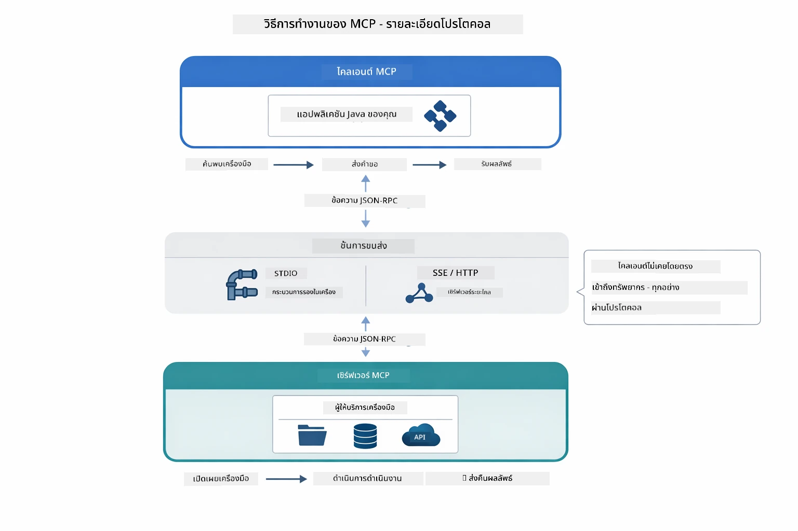

*MCP ทำงานอย่างไร — ลูกค้าค้นหาเครื่องมือ แลกเปลี่ยนข้อความ JSON-RPC และดำเนินการผ่านชั้นการขนส่ง*

**สถาปัตยกรรมเซิร์ฟเวอร์-ลูกค้า**

MCP ใช้รูปแบบเซิร์ฟเวอร์-ลูกค้า เซิร์ฟเวอร์ให้บริการเครื่องมือ - อ่านไฟล์ สืบค้นฐานข้อมูล เรียก API ลูกค้า (แอป AI ของคุณ) เชื่อมต่อกับเซิร์ฟเวอร์และใช้เครื่องมือเหล่านั้น

เพื่อใช้ MCP กับ LangChain4j ให้เพิ่ม dependencies ของ Maven นี้:

```xml
<dependency>
    <groupId>dev.langchain4j</groupId>
    <artifactId>langchain4j-mcp</artifactId>
    <version>${langchain4j.version}</version>
</dependency>
```

**การค้นพบเครื่องมือ**

เมื่อไคลเอนต์ของคุณเชื่อมต่อกับเซิร์ฟเวอร์ MCP มันจะถามว่า "คุณมีเครื่องมืออะไรบ้าง?" เซิร์ฟเวอร์ตอบกลับด้วยรายการเครื่องมือทั้งหมดพร้อมคำอธิบายและสคีมาพารามิเตอร์ AI agent ของคุณจึงตัดสินใจได้ว่าจะใช้เครื่องมือใดตามคำขอของผู้ใช้ ไดอะแกรมด้านล่างแสดงการเชื่อมโยงนี้ — ไคลเอนต์ส่งคำขอ `tools/list` และเซิร์ฟเวอร์ตอบกลับเครื่องมือทั้งหมดที่มีพร้อมคำอธิบายและสคีมากำกับ:

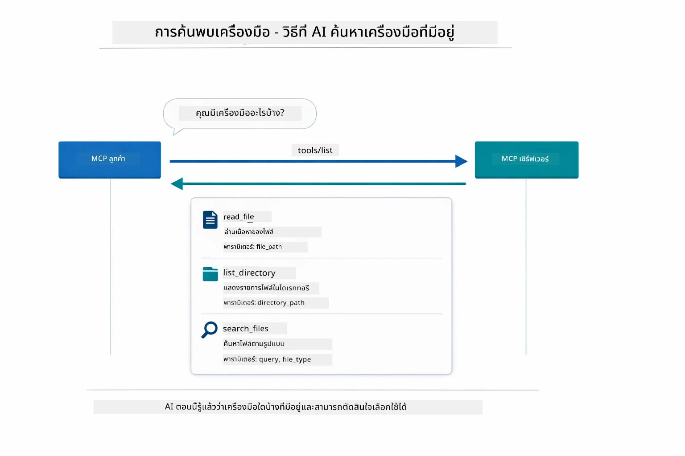

*AI ค้นพบเครื่องมือที่มีอยู่ตอนเริ่มต้น — ทำให้รู้ความสามารถที่มีและตัดสินใจเลือกใช้ได้*

**กลไกการขนส่ง**

MCP รองรับกลไกการขนส่งหลายแบบ ตัวเลือกสองแบบคือ Stdio (สำหรับสื่อสารกับ subprocess ในเครื่อง) และ Streamable HTTP (สำหรับเซิร์ฟเวอร์จากระยะไกล) โมดูลนี้สาธิตการใช้งานแบบ Stdio:


*กลไกการขนส่ง MCP: HTTP สำหรับเซิร์ฟเวอร์ระยะไกล, Stdio สำหรับกระบวนการในเครื่อง*

**Stdio** - [StdioTransportDemo.java](../../../05-mcp/src/main/java/com/example/langchain4j/mcp/StdioTransportDemo.java)

สำหรับกระบวนการในเครื่อง แอปของคุณสร้างเซิร์ฟเวอร์เป็น subprocess และสื่อสารผ่านช่องทาง standard input/output เหมาะสำหรับการเข้าถึงระบบไฟล์หรือเครื่องมือบรรทัดคำสั่ง

```java
McpTransport stdioTransport = new StdioMcpTransport.Builder()
    .command(List.of(
        npmCmd, "exec",
        "@modelcontextprotocol/server-filesystem@2025.12.18",
        resourcesDir
    ))
    .logEvents(false)
    .build();
```

เซิร์ฟเวอร์ `@modelcontextprotocol/server-filesystem` เปิดเผยเครื่องมือต่อไปนี้ทั้งหมดซึ่งถูกจำกัดให้อยู่ในไดเรกทอรีที่คุณกำหนด:

| เครื่องมือ | คำอธิบาย |
|------|-------------|
| `read_file` | อ่านเนื้อหาของไฟล์เดียว |
| `read_multiple_files` | อ่านไฟล์หลายไฟล์ในคำสั่งเดียว |
| `write_file` | สร้างหรือเขียนทับไฟล์ |
| `edit_file` | แก้ไขแบบค้นหาและแทนที่เป้าหมายเฉพาะ |
| `list_directory` | แสดงรายการไฟล์และไดเรกทอรีในเส้นทางที่กำหนด |
| `search_files` | ค้นหาไฟล์แบบเรียกซ้ำที่ตรงกับรูปแบบ |
| `get_file_info` | อ่านเมตาดาต้าของไฟล์ (ขนาด, วันที่เวลา, สิทธิ์) |
| `create_directory` | สร้างไดเรกทอรี (รวมถึงไดเรกทอรีย่อย) |
| `move_file` | ย้ายหรือเปลี่ยนชื่อไฟล์หรือไดเรกทอรี |

ไดอะแกรมด้านล่างแสดงการทำงานของการขนส่งแบบ Stdio ขณะรันไทม์—แอป Java ของคุณสร้างเซิร์ฟเวอร์ MCP เป็น subprocess และสื่อสารผ่านท่อ stdin/stdout โดยไม่มีเครือข่ายหรือ HTTP:

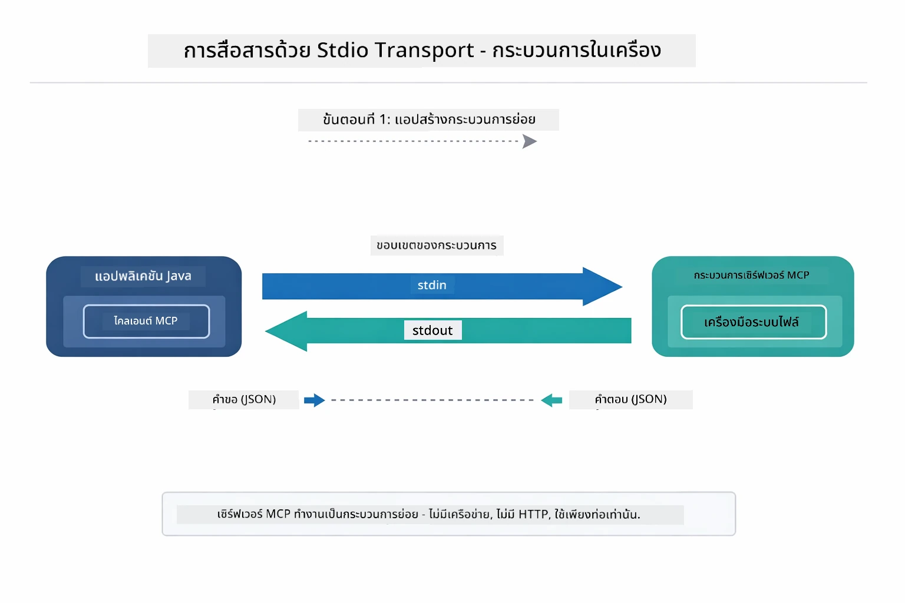

*การขนส่งแบบ Stdio กำลังทำงาน — แอปของคุณสร้างเซิร์ฟเวอร์ MCP เป็น subprocess และสื่อสารผ่านท่อ stdin/stdout*

> **🤖 ลองกับ [GitHub Copilot](https://github.com/features/copilot) Chat:** เปิด [`StdioTransportDemo.java`](../../../05-mcp/src/main/java/com/example/langchain4j/mcp/StdioTransportDemo.java) และถาม:
> - "การขนส่งแบบ Stdio ทำงานอย่างไรและเมื่อไหร่ควรใช้แทน HTTP?"
> - "LangChain4j จัดการวงจรชีวิตของกระบวนการเซิร์ฟเวอร์ MCP ที่ถูกสร้างขึ้นอย่างไร?"
> - "ผลกระทบด้านความปลอดภัยของการให้ AI เข้าถึงระบบไฟล์คืออะไร?"

## โมดูล Agentic

ในขณะที่ MCP ให้เครื่องมือมาตรฐาน โมดูล **agentic** ของ LangChain4j ให้วิธีการประกาศ (declarative) ในการสร้าง agents ที่ประสานเครื่องมือเหล่านั้น การใช้ `@Agent` annotation และ `AgenticServices` ช่วยให้คุณกำหนดพฤติกรรม agent ผ่านอินเทอร์เฟซแทนการเขียนโค้ดเชิงกระบวนการ

ในโมดูลนี้ คุณจะสำรวจรูปแบบ **ผู้ควบคุม Agent (Supervisor Agent)** — แนวทาง agentic AI ขั้นสูง ที่ผู้ควบคุมตัดสินใจไดนามิกว่าจะเรียก sub-agents ใดตามคำขอของผู้ใช้ เราจะผสานแนวคิดนี้ด้วยการมอบความสามารถในการเข้าถึงไฟล์โดยใช้ MCP ให้กับหนึ่งใน sub-agents ของเรา

เพื่อใช้โมดูล agentic ให้เพิ่ม dependencies ของ Maven นี้:

```xml
<dependency>
    <groupId>dev.langchain4j</groupId>
    <artifactId>langchain4j-agentic</artifactId>
    <version>${langchain4j.mcp.version}</version>
</dependency>
```
> **หมายเหตุ:** โมดูล `langchain4j-agentic` ใช้ property เวอร์ชันแยก (`langchain4j.mcp.version`) เพราะปล่อยเวอร์ชันตามตารางเวลาที่ต่างจากไลบรารีหลักของ LangChain4j

> **⚠️ อยู่ในช่วงทดลอง:** โมดูล `langchain4j-agentic` ยัง **อยู่ในสถานะทดลอง** และอาจเปลี่ยนแปลง วิธีสร้างผู้ช่วย AI ที่เสถียรยังคงเป็น `langchain4j-core` กับเครื่องมือที่สร้างเอง (Module 04)

## การรันตัวอย่าง

### ข้อกำหนดเบื้องต้น

- จบการเรียนรู้ [Module 04 - Tools](../04-tools/README.md) (โมดูลนี้ต่อยอดจากแนวคิดเครื่องมือที่สร้างเองและเปรียบเทียบกับเครื่องมือ MCP)
- ไฟล์ `.env` ในไดเรกทอรีรากที่มีข้อมูลรับรอง Azure (ได้จากคำสั่ง `azd up` ใน Module 01)
- Java 21+, Maven 3.9+
- Node.js 16+ และ npm (สำหรับเซิร์ฟเวอร์ MCP)

> **หมายเหตุ:** หากยังไม่ได้ตั้งค่าตัวแปรสภาพแวดล้อม ดูที่ [Module 01 - Introduction](../01-introduction/README.md) สำหรับคำแนะนำการ deploy (`azd up` สร้างไฟล์ `.env` ให้อัตโนมัติ) หรือคัดลอก `.env.example` เป็น `.env` ในไดเรกทอรีรากและเติมข้อมูลของคุณ

## เริ่มต้นอย่างรวดเร็ว

**ใช้ VS Code:** คลิกขวาที่ไฟล์เดโมใด ๆ ใน Explorer แล้วเลือก **"Run Java"** หรือใช้การตั้งค่า launch จากแผง Run and Debug (อย่าลืมตั้งค่าไฟล์ `.env` กับข้อมูลรับรอง Azure ก่อน)

**ใช้ Maven:** หรือคุณสามารถรันจากบรรทัดคำสั่งตามตัวอย่างด้านล่าง

### การทำงานกับไฟล์ (Stdio)

นี่เป็นตัวอย่างเครื่องมือที่ใช้ subprocess ในเครื่อง

**✅ ไม่ต้องใช้ข้อกำหนดเบื้องต้น** — เซิร์ฟเวอร์ MCP ถูกสร้างขึ้นโดยอัตโนมัติ

**ใช้สคริปต์เริ่มต้น (แนะนำ):**

สคริปต์เริ่มต้นโหลดตัวแปรสิ่งแวดล้อมจากไฟล์ `.env` ในโฟลเดอร์รากโดยอัตโนมัติ:

**Bash:**
```bash
cd 05-mcp
chmod +x start-stdio.sh
./start-stdio.sh
```

**PowerShell:**
```powershell
cd 05-mcp
.\start-stdio.ps1
```

**ใช้ VS Code:** คลิกขวาที่ `StdioTransportDemo.java` แล้วเลือก **"Run Java"** (ตรวจสอบให้แน่ใจว่าไฟล์ `.env` ถูกตั้งค่าแล้ว)

แอปพลิเคชันจะสร้างเซิร์ฟเวอร์ MCP สำหรับระบบไฟล์โดยอัตโนมัติและอ่านไฟล์ในเครื่อง โปรดสังเกตการจัดการ subprocess ที่ดำเนินการให้คุณ

**ผลลัพธ์ที่คาดหวัง:**
```
Assistant response: The file provides an overview of LangChain4j, an open-source Java library
for integrating Large Language Models (LLMs) into Java applications...
```

### ผู้ควบคุม Agent

รูปแบบ **ผู้ควบคุม Agent (Supervisor Agent)** เป็นรูปแบบ agentic AI ที่ **ยืดหยุ่น** ผู้ควบคุมใช้ LLM ตัดสินใจอิสระว่าจะเรียกใช้ agents ใดตามคำขอของผู้ใช้ ในตัวอย่างถัดไป เราจะผสานการเข้าถึงไฟล์ด้วย MCP กับ agent LLM เพื่อสร้างเวิร์กโฟลว์การอ่านไฟล์ → รายงาน ภายใต้การควบคุม

ในเดโม `FileAgent` อ่านไฟล์โดยใช้เครื่องมือระบบไฟล์ MCP และ `ReportAgent` สร้างรายงานที่มีโครงสร้างพร้อมสรุปผู้บริหาร (1 ประโยค), 3 ข้อสำคัญ และคำแนะนำ ผู้ควบคุมประสานเวิร์กโฟลว์นี้โดยอัตโนมัติ:

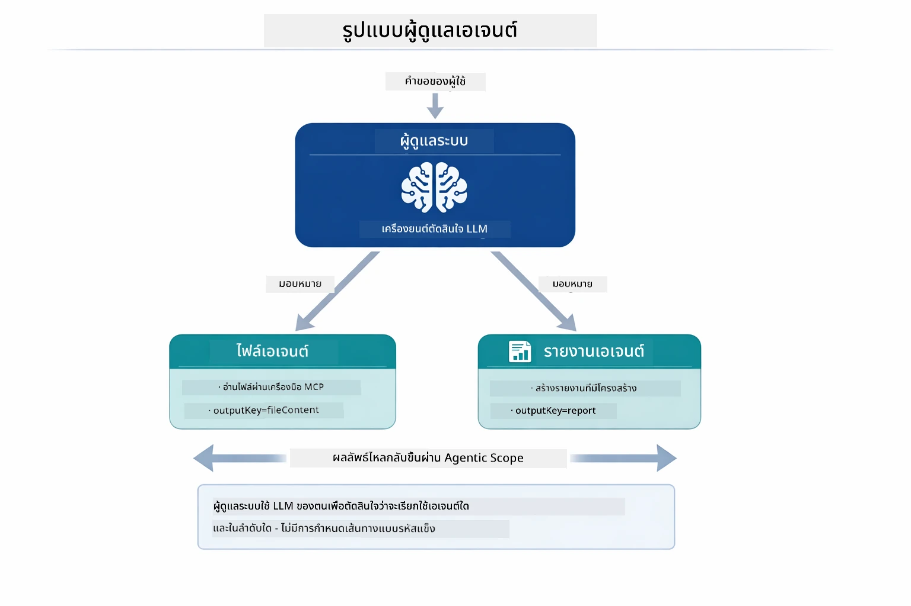

*ผู้ควบคุมใช้ LLM ของตนตัดสินใจเรียก agents ใดและลำดับอย่างไร — ไม่ต้องมีการเขียน routing แบบรหัสตายตัว*

นี่คือเวิร์กโฟลว์จริงของ pipeline อ่านไฟล์เป็นรายงาน:

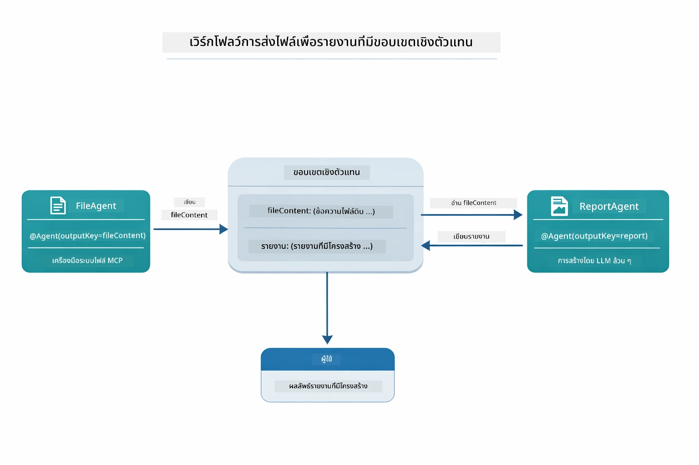

*FileAgent อ่านไฟล์ผ่านเครื่องมือ MCP แล้ว ReportAgent แปลงเนื้อหาเป็นรายงานที่มีโครงสร้าง*

ไดอะแกรมลำดับด้านล่างแสดงการประสานงานทั้งหมดของผู้ควบคุม — ตั้งแต่การสร้างเซิร์ฟเวอร์ MCP ผ่านการเลือก agent อัตโนมัติของผู้ควบคุม ไปจนถึงการเรียกเครื่องมือผ่าน stdio และรายงานขั้นสุดท้าย:

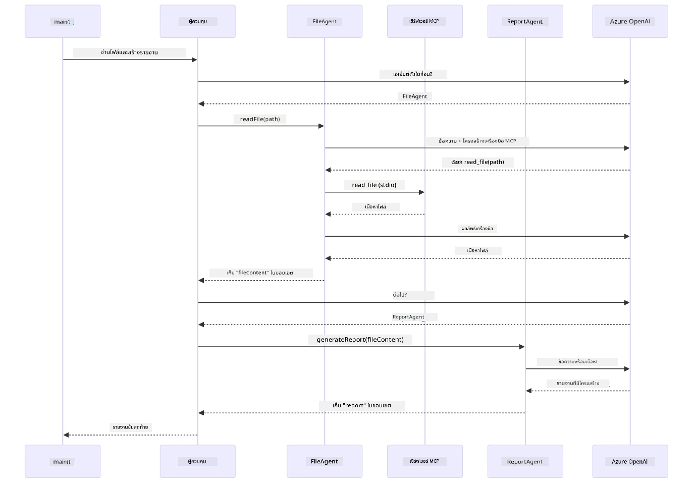

*ผู้ควบคุมเรียก FileAgent อัตโนมัติ (ซึ่งเรียกเซิร์ฟเวอร์ MCP ผ่าน stdio เพื่ออ่านไฟล์) จากนั้นเรียก ReportAgent เพื่อสร้างรายงานที่มีโครงสร้าง — แต่ละ agent เก็บผลลัพธ์ใน Agentic Scope ร่วมกัน*

แต่ละ agent เก็บผลลัพธ์ใน **Agentic Scope** (หน่วยความจำร่วม) ให้ agent ถัดไปเข้าถึงผลลัพธ์ก่อนหน้าได้ นี่แสดงให้เห็นว่าเครื่องมือ MCP ผนวกได้อย่างไรในเวิร์กโฟลว์แบบ agentic — ผู้ควบคุมไม่จำเป็นต้องรู้ *ว่าการอ่านไฟล์ทำอย่างไร* เพียงแต่รู้ว่า `FileAgent` ทำได้

#### การรันเดโม

สคริปต์เริ่มต้นโหลดตัวแปรสิ่งแวดล้อมจากไฟล์ `.env` ในโฟลเดอร์รากโดยอัตโนมัติ:

**Bash:**
```bash
cd 05-mcp
chmod +x start-supervisor.sh
./start-supervisor.sh
```

**PowerShell:**
```powershell
cd 05-mcp
.\start-supervisor.ps1
```

**ใช้ VS Code:** คลิกขวาที่ `SupervisorAgentDemo.java` แล้วเลือก **"Run Java"** (ตรวจสอบให้แน่ใจว่าไฟล์ `.env` ถูกตั้งค่าแล้ว)

#### ผู้ควบคุมทำงานอย่างไร

ก่อนสร้าง agents คุณต้องเชื่อมต่อ MCP transport กับไคลเอนต์และห่อไว้ใน `ToolProvider` นี่คือวิธีที่เครื่องมือของเซิร์ฟเวอร์ MCP ถูกเปิดใช้สำหรับ agents ของคุณ:

```java
// สร้างไคลเอ็นต์ MCP จากการขนส่ง
McpClient mcpClient = new DefaultMcpClient.Builder()
        .transport(stdioTransport)
        .build();

// ห่อหุ้มไคลเอ็นต์เป็น ToolProvider — สิ่งนี้เชื่อมต่อเครื่องมือ MCP เข้ากับ LangChain4j
ToolProvider mcpToolProvider = McpToolProvider.builder()
        .mcpClients(List.of(mcpClient))
        .build();
```

ตอนนี้คุณสามารถฉีด `mcpToolProvider` เข้าไปใน agent ใดก็ได้ที่ต้องการเครื่องมือ MCP:

```java
// ขั้นตอนที่ 1: FileAgent อ่านไฟล์โดยใช้เครื่องมือ MCP
FileAgent fileAgent = AgenticServices.agentBuilder(FileAgent.class)
        .chatModel(model)
        .toolProvider(mcpToolProvider)  // มีเครื่องมือ MCP สำหรับการจัดการไฟล์
        .build();

// ขั้นตอนที่ 2: ReportAgent สร้างรายงานที่มีโครงสร้าง
ReportAgent reportAgent = AgenticServices.agentBuilder(ReportAgent.class)
        .chatModel(model)
        .build();

// ผู้ควบคุมดูแลการทำงานลำดับขั้นระหว่างไฟล์ → รายงาน
SupervisorAgent supervisor = AgenticServices.supervisorBuilder()
        .chatModel(model)
        .subAgents(fileAgent, reportAgent)
        .responseStrategy(SupervisorResponseStrategy.LAST)  // ส่งคืนรายงานขั้นสุดท้าย
        .build();

// ผู้ควบคุมตัดสินใจเรียกใช้เอเจนต์ใดตามคำขอ
String response = supervisor.invoke("Read the file at /path/file.txt and generate a report");
```

#### FileAgent ค้นพบเครื่องมือ MCP ได้อย่างไรขณะรันไทม์

คุณอาจสงสัยว่า: **`FileAgent` รู้วิธีใช้เครื่องมือระบบไฟล์ npm ได้อย่างไร?** คำตอบคือ มันไม่รู้ — **LLM** เป็นตัวตัดสินใจขณะรันไทม์ผ่านสคีมาของเครื่องมือ

อินเทอร์เฟซ `FileAgent` เป็นแค่ **การนิยาม prompt** ไม่มีความรู้ที่เขียนทิ้งไว้สำหรับ `read_file`, `list_directory` หรือเครื่องมือ MCP อื่นใด นี่คือสิ่งที่เกิดขึ้นตั้งแต่ต้นจนจบ:
1. **การสร้างเซิร์ฟเวอร์:** `StdioMcpTransport` จะเปิดใช้งานแพ็กเกจ `@modelcontextprotocol/server-filesystem` ของ npm เป็น child process  
2. **การค้นหาเครื่องมือ:** `McpClient` ส่งคำขอ JSON-RPC ประเภท `tools/list` ไปยังเซิร์ฟเวอร์ ซึ่งเซิร์ฟเวอร์ตอบกลับด้วยชื่อเครื่องมือ คำอธิบาย และสคีมาเงื่อนไขพารามิเตอร์ (เช่น `read_file` — *"อ่านเนื้อหาฉบับสมบูรณ์ของไฟล์"* — `{ path: string }`)  
3. **การฉีดสคีมา:** `McpToolProvider` ห่อหุ้มสคีมาเหล่านี้ที่ค้นพบและทำให้พร้อมใช้งานแก่ LangChain4j  
4. **การตัดสินใจของ LLM:** เมื่อตอนที่เรียกใช้ `FileAgent.readFile(path)` LangChain4j จะส่งข้อความระบบ ข้อความผู้ใช้ **และรายการของสคีมาเครื่องมือ** ไปยัง LLM ซึ่ง LLM จะอ่านคำอธิบายเครื่องมือและสร้างการเรียกเครื่องมือ (เช่น `read_file(path="/some/file.txt")`)  
5. **การดำเนินการ:** LangChain4j จะดักจับการเรียกเครื่องมือ เส้นทางส่งผ่านกลับไปยัง subprocess ของ Node.js ผ่าน MCP client รับผลลัพธ์ และป้อนกลับให้ LLM  

นี่คือกลไก [การค้นหาเครื่องมือ](../../../05-mcp) เดียวกันที่กล่าวถึงข้างต้น แต่ใช้เฉพาะในเวิร์กโฟลว์ของ agent เท่านั้น คำอธิบาย `@SystemMessage` และ `@UserMessage` เป็นตัวนำพฤติกรรมของ LLM ในขณะที่ `ToolProvider` ที่ฉีดเข้าไปให้อำนาจความสามารถ — ทำให้ LLM สามารถเชื่อมโยงทั้งสองขณะทำงานจริงได้  

> **🤖 ลองใช้กับ [GitHub Copilot](https://github.com/features/copilot) Chat:** เปิด [`FileAgent.java`](../../../05-mcp/src/main/java/com/example/langchain4j/mcp/agents/FileAgent.java) และถามว่า:  
> - "agent นี้รู้ได้อย่างไรว่าควรเรียกใช้เครื่องมือ MCP ใด?"  
> - "จะเกิดอะไรขึ้นถ้าฉันลบ ToolProvider ออกจากตัวสร้าง agent?"  
> - "สคีมาเครื่องมือถูกส่งผ่านไปยัง LLM อย่างไร?"  

#### กลยุทธ์การตอบกลับ  

เมื่อคุณกำหนดค่า `SupervisorAgent` คุณจะระบุวิธีที่ควรจัดรูปแบบคำตอบสุดท้ายให้กับผู้ใช้หลังจาก sub-agent ทำงานเสร็จ แผนภาพด้านล่างแสดงกลยุทธ์สามแบบที่มี — LAST คืนค่าผลลัพธ์ของ agent สุดท้ายโดยตรง, SUMMARY สังเคราะห์ผลลัพธ์ทั้งหมดผ่าน LLM และ SCORED เลือกผลลัพธ์ที่ได้คะแนนสูงกว่าตามคำขอเดิม:

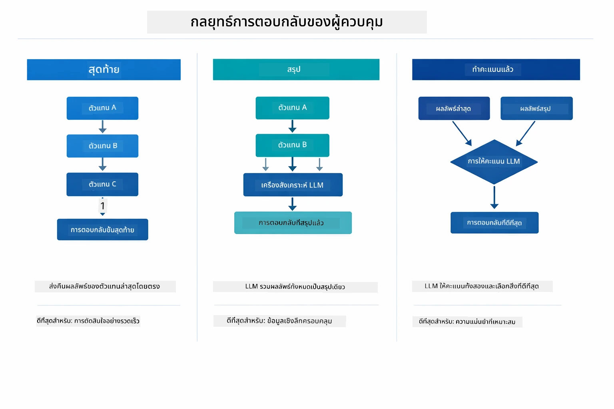

*สามกลยุทธ์สำหรับการจัดรูปแบบคำตอบสุดท้ายของ Supervisor — เลือกตามว่าคุณต้องการค่าผลลัพธ์ของ agent สุดท้าย, สรุปที่สังเคราะห์, หรือทางเลือกที่ได้คะแนนดีที่สุด*  

กลยุทธ์ที่มี ได้แก่:  

| กลยุทธ์ | คำอธิบาย |  
|----------|-------------|  
| **LAST** | ผู้ดูแลระบบ (supervisor) คืนค่าผลลัพธ์ของ sub-agent หรือตัวเครื่องมือที่ถูกเรียกใช้ล่าสุด ซึ่งเหมาะสำหรับกรณีที่ agent สุดท้ายในเวิร์กโฟลว์ถูกออกแบบมาเพื่อผลิตคำตอบขั้นสุดท้ายอย่างครบถ้วน (เช่น "Summary Agent" ในกระบวนการวิจัย) |  
| **SUMMARY** | ผู้ดูแลระบบใช้ Language Model (LLM) ภายในของตนเพื่อสังเคราะห์สรุปผลของปฏิสัมพันธ์ทั้งหมดและผลลัพธ์จาก sub-agent ต่างๆ แล้วจึงคืนค่าสรุปนั้นเป็นคำตอบสุดท้าย ซึ่งช่วยให้ได้คำตอบที่ครบถ้วนและกระชับแก่ผู้ใช้ |  
| **SCORED** | ระบบใช้ LLM ภายในเพื่อให้คะแนนทั้งผลลัพธ์ LAST และ SUMMARY ของปฏิสัมพันธ์เทียบกับคำขอผู้ใช้เดิม จากนั้นคืนค่าผลลัพธ์ที่ได้คะแนนสูงกว่า |  

ดูตัวอย่างการใช้งานได้ที่ [SupervisorAgentDemo.java](../../../05-mcp/src/main/java/com/example/langchain4j/mcp/SupervisorAgentDemo.java)  

> **🤖 ลองใช้กับ [GitHub Copilot](https://github.com/features/copilot) Chat:** เปิด [`SupervisorAgentDemo.java`](../../../05-mcp/src/main/java/com/example/langchain4j/mcp/SupervisorAgentDemo.java) แล้วถามว่า:  
> - "Supervisor ตัดสินใจเลือก agent ใดบ้างที่ต้องเรียกใช้ได้อย่างไร?"  
> - "ความแตกต่างระหว่าง Supervisor กับรูปแบบเวิร์กโฟลว์ Sequential คืออะไร?"  
> - "ฉันสามารถปรับแต่งพฤติกรรมการวางแผนของ Supervisor ได้อย่างไร?"  

#### การทำความเข้าใจผลลัพธ์  

เมื่อคุณรันเดโม คุณจะเห็นการอธิบายตามขั้นตอนอย่างมีโครงสร้างว่าผู้ดูแลระบบจัดการหลายๆ agent อย่างไร ดังนี้:  

```
======================================================================
  FILE → REPORT WORKFLOW DEMO
======================================================================

This demo shows a clear 2-step workflow: read a file, then generate a report.
The Supervisor orchestrates the agents automatically based on the request.
```
  
**ส่วนหัว** แนะนำแนวคิดเวิร์กโฟลว์: ท่อทำงานตั้งแต่การอ่านไฟล์จนถึงการสร้างรายงาน  

```
--- WORKFLOW ---------------------------------------------------------
  ┌─────────────┐      ┌──────────────┐
  │  FileAgent  │ ───▶ │ ReportAgent  │
  │ (MCP tools) │      │  (pure LLM)  │
  └─────────────┘      └──────────────┘
   outputKey:           outputKey:
   'fileContent'        'report'

--- AVAILABLE AGENTS -------------------------------------------------
  [FILE]   FileAgent   - Reads files via MCP → stores in 'fileContent'
  [REPORT] ReportAgent - Generates structured report → stores in 'report'
```
  
**ไดอะแกรมเวิร์กโฟลว์** แสดงการไหลของข้อมูลระหว่าง agent แต่ละตัวมีบทบาทเฉพาะ:  
- **FileAgent** อ่านไฟล์โดยใช้เครื่องมือ MCP และเก็บเนื้อหาดิบใน `fileContent`  
- **ReportAgent** ใช้เนื้อหานั้นและสร้างรายงานเชิงโครงสร้างใน `report`  

```
--- USER REQUEST -----------------------------------------------------
  "Read the file at .../file.txt and generate a report on its contents"
```
  
**คำขอผู้ใช้** แสดงงานที่ได้รับ ผู้ดูแลระบบจะวิเคราะห์ต่อและตัดสินใจเรียก FileAgent → ReportAgent  

```
--- SUPERVISOR ORCHESTRATION -----------------------------------------
  The Supervisor decides which agents to invoke and passes data between them...

  +-- STEP 1: Supervisor chose -> FileAgent (reading file via MCP)
  |
  |   Input: .../file.txt
  |
  |   Result: LangChain4j is an open-source, provider-agnostic Java framework for building LLM...
  +-- [OK] FileAgent (reading file via MCP) completed

  +-- STEP 2: Supervisor chose -> ReportAgent (generating structured report)
  |
  |   Input: LangChain4j is an open-source, provider-agnostic Java framew...
  |
  |   Result: Executive Summary...
  +-- [OK] ReportAgent (generating structured report) completed
```
  
**การประสานงานของ Supervisor** แสดงการดำเนินการสองขั้นตอนจริง:  
1. **FileAgent** อ่านไฟล์ผ่าน MCP และจัดเก็บเนื้อหา  
2. **ReportAgent** รับเนื้อหาและสร้างรายงานเชิงโครงสร้าง  

Supervisor ตัดสินใจเหล่านี้ได้เองโดยอัตโนมัติตามคำขอผู้ใช้  

```
--- FINAL RESPONSE ---------------------------------------------------
Executive Summary
...

Key Points
...

Recommendations
...

--- AGENTIC SCOPE (Data Flow) ----------------------------------------
  Each agent stores its output for downstream agents to consume:
  * fileContent: LangChain4j is an open-source, provider-agnostic Java framework...
  * report: Executive Summary...
```
  
#### คำอธิบายฟีเจอร์ Agentic Module  

ตัวอย่างนี้แสดงฟีเจอร์ขั้นสูงของโมดูล agentic ให้ดูอย่างละเอียดที่ Agentic Scope และ Agent Listeners  

**Agentic Scope** แสดงหน่วยความจำที่แชร์ซึ่ง agent ต่างๆ ใช้เก็บผลลัพธ์ผ่าน `@Agent(outputKey="...")` ทำให้:  
- agent ภายหลังสามารถเข้าถึงผลลัพธ์ของ agent ก่อนหน้าได้  
- Supervisor สามารถสังเคราะห์คำตอบขั้นสุดท้าย  
- คุณสามารถตรวจสอบข้อมูลที่แต่ละ agent ผลิตได้  

ไดอะแกรมด้านล่างแสดงการทำงานของ Agentic Scope เป็นหน่วยความจำที่แชร์ในเวิร์กโฟลว์ไฟล์สู่รายงาน — FileAgent เขียนผลลัพธ์ภายใต้กุญแจ `fileContent` และ ReportAgent อ่านจากนั้นเขียนผลลัพธ์ของตนเองภายใต้กุญแจ `report`:  

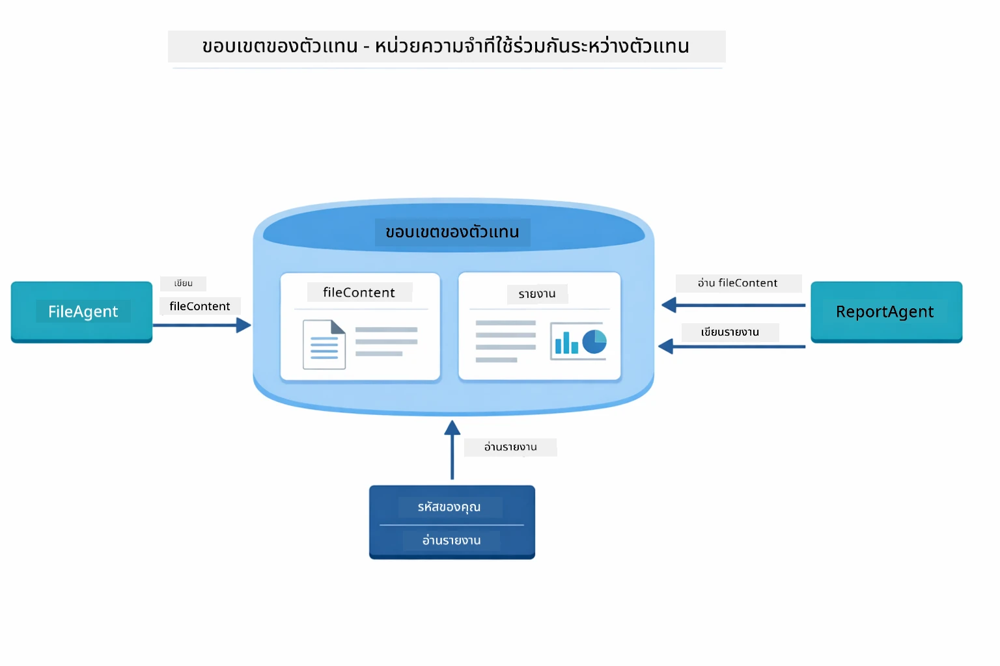  

*Agentic Scope ทำหน้าที่เป็นหน่วยความจำที่แชร์ — FileAgent เขียน `fileContent`, ReportAgent อ่านและเขียน `report` แล้วโค้ดของคุณอ่านผลลัพธ์ขั้นสุดท้าย*  

```java
ResultWithAgenticScope<String> result = supervisor.invokeWithAgenticScope(request);
AgenticScope scope = result.agenticScope();
String fileContent = scope.readState("fileContent");  // ข้อมูลไฟล์ดิบจาก FileAgent
String report = scope.readState("report");            // รายงานที่มีโครงสร้างจาก ReportAgent
```
  
**Agent Listeners** ช่วยให้สามารถตรวจสอบและดีบักการทำงานของ agent ได้ ข้อมูลผลลัพธ์ที่เห็นในเดโมนี้มาจาก AgentListener ที่เชื่อมต่อกับการเรียกใช้งานของแต่ละ agent เช่น:  
- **beforeAgentInvocation** - เรียกก่อนที่ Supervisor จะเลือก agent ให้เห็นว่าเลือก agent ใดและเพราะเหตุใด  
- **afterAgentInvocation** - เรียกหลัง agent ทำงานเสร็จ แสดงผลลัพธ์ที่ได้  
- **inheritedBySubagents** - เมื่อเป็นจริง listener จะตรวจสอบ agent ทุกตัวในลำดับชั้น  

ไดอะแกรมด้านล่างแสดงวงจรชีวิตของ Agent Listener รวมถึงวิธีที่ `onError` จัดการกับความล้มเหลวระหว่างการทำงานของ agent:  

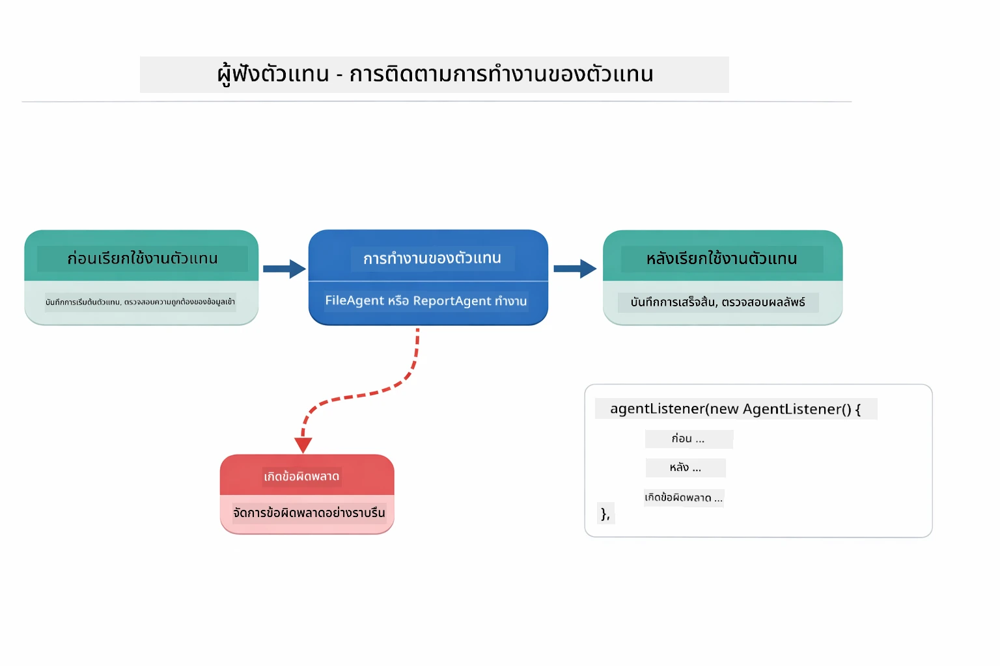  

*Agent Listener เชื่อมโยงวงจรชีวิตการทำงาน — ตรวจสอบเมื่อ agent เริ่ม ทำงานเสร็จ หรือเกิดข้อผิดพลาด*  

```java
AgentListener monitor = new AgentListener() {
    private int step = 0;
    
    @Override
    public void beforeAgentInvocation(AgentRequest request) {
        step++;
        System.out.println("  +-- STEP " + step + ": " + request.agentName());
    }
    
    @Override
    public void afterAgentInvocation(AgentResponse response) {
        System.out.println("  +-- [OK] " + response.agentName() + " completed");
    }
    
    @Override
    public boolean inheritedBySubagents() {
        return true; // กระจายไปยังตัวแทนย่อยทั้งหมด
    }
};
```
  
นอกจากรูปแบบ Supervisor แล้ว โมดูล `langchain4j-agentic` ยังมีรูปแบบเวิร์กโฟลว์ที่ทรงพลังอีกหลายแบบ ด้านล่างแสดงทั้งห้าแบบ — ตั้งแต่ท่อทำงานแบบเรียงต่อเนื่องจนถึงเวิร์กโฟลว์การอนุมัติที่มีมนุษย์ตรวจสอบ:  

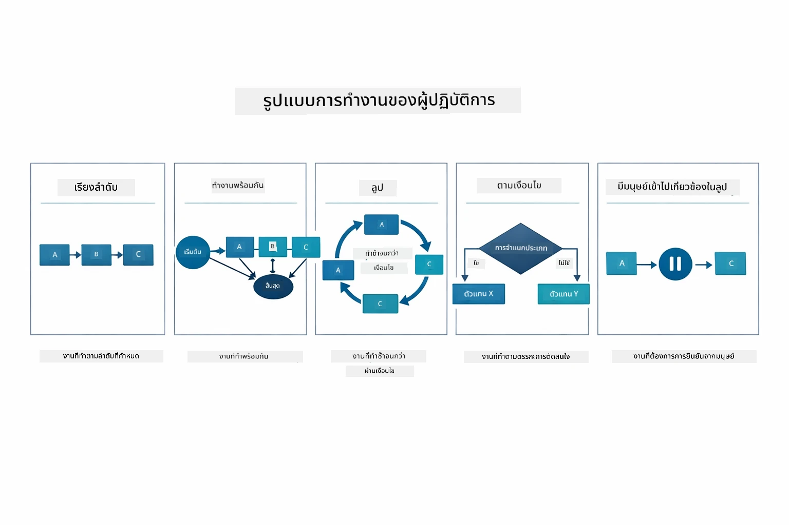  

*รูปแบบเวิร์กโฟลว์ 5 แบบ สำหรับจัดการ agent — ตั้งแต่ท่อทำงานแบบเรียงต่อเนื่องถึงเวิร์กโฟลว์อนุมัติของมนุษย์*  

| รูปแบบ | คำอธิบาย | กรณีใช้งาน |  
|---------|-------------|----------|  
| **Sequential** | รัน agent ตามลำดับโดยส่งผลลัพธ์ไปยังตัวถัดไป | ท่อทำงาน: วิจัย → วิเคราะห์ → รายงาน |  
| **Parallel** | รัน agent พร้อมกันหลายตัว | งานอิสระ: สภาพอากาศ + ข่าว + หุ้น |  
| **Loop** | ทำซ้ำจนกว่าจะถึงเงื่อนไข | การให้คะแนนคุณภาพ: ปรับปรุงจนได้คะแนน ≥ 0.8 |  
| **Conditional** | ส่งต่อเส้นทางตามเงื่อนไข | แยกประเภท → ส่งต่อไปยัง agent ผู้เชี่ยวชาญ |  
| **Human-in-the-Loop** | เพิ่มจุดตรวจสอบโดยมนุษย์ | เวิร์กโฟลว์อนุมัติ, ตรวจสอบเนื้อหา |  

## แนวคิดสำคัญ  

เมื่อคุณได้สำรวจ MCP และโมดูล agentic ในการใช้งานแล้ว มาแจกแจงว่าแต่ละแนวทางควรใช้เมื่อไร  

หนึ่งในข้อได้เปรียบใหญ่ของ MCP คือระบบนิเวศที่เติบโตขึ้น แผนภาพด้านล่างแสดงว่าโปรโตคอลสากลเดียวช่วยให้แอปฯ AI ของคุณเชื่อมต่อกับเซิร์ฟเวอร์ MCP หลากหลายประเภท — ตั้งแต่การเข้าถึงไฟล์และฐานข้อมูล ไปจนถึง GitHub, อีเมล, การดึงข้อมูลเว็บ และอื่นๆ:  

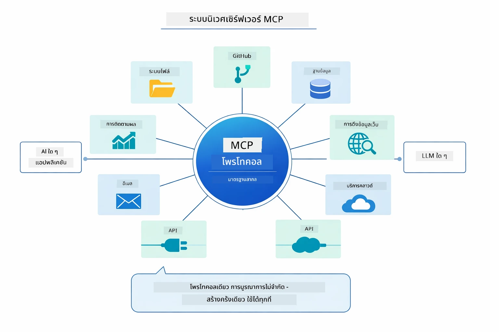  

*MCP สร้างระบบนิเวศโปรโตคอลสากล — เซิร์ฟเวอร์ MCP ใดก็ได้ที่เข้ากันได้กับ MCP client ใดก็ได้ ช่วยให้แลกเปลี่ยนเครื่องมือระหว่างแอปพลิเคชันได้*  

**MCP** เหมาะสำหรับการใช้ประโยชน์จากระบบเครื่องมือที่มีอยู่ สร้างเครื่องมือที่แชร์โดยหลายแอปพลิเคชัน รวมบริการบุคคลที่สามผ่านโปรโตคอลมาตรฐาน หรือเปลี่ยนการใช้งานเครื่องมือโดยไม่ต้องแก้ไขโค้ด  

**โมดูล Agentic** เหมาะที่สุดเมื่อคุณต้องการนิยาม agent แบบประกาศผ่าน `@Agent` ต้องการการประสานเวิร์กโฟลว์ (ลำดับ, วนซ้ำ, พร้อมกัน), ชอบการออกแบบ agent แบบอินเทอร์เฟซแทนโค้ดเชิงคำสั่ง หรือใช้ agent หลายตัวที่แชร์ผลลัพธ์ผ่าน `outputKey`  

**รูปแบบ Supervisor Agent** โดดเด่นเมื่อเวิร์กโฟลว์ไม่สามารถคาดการณ์ล่วงหน้าและคุณต้องการให้ LLM ตัดสินใจ, เมื่อมี agent เฉพาะทางหลายตัวที่ต้องการการประสานแบบไดนามิก, เมื่อสร้างระบบสนทนาที่ส่งต่อไปยังความสามารถต่างๆ, หรือเมื่อคุณต้องการพฤติกรรม agent ที่ยืดหยุ่นและปรับตัวสูงสุด  

เพื่อช่วยตัดสินใจระหว่างเมธอด `@Tool` ที่กำหนดเองจากโมดูล 04 กับเครื่องมือ MCP จากโมดูลนี้ ตารางเปรียบเทียบด้านล่างจะเน้นจุดแลกเปลี่ยนหลัก — เครื่องมือกำหนดเองให้การเชื่อมต่อที่ใกล้ชิดและความปลอดภัยของชนิดข้อมูลสมบูรณ์สำหรับตรรกะเฉพาะแอปฯ ในขณะที่เครื่องมือ MCP เสนอการบูรณาการมาตรฐานซ้ำใช้ได้:  

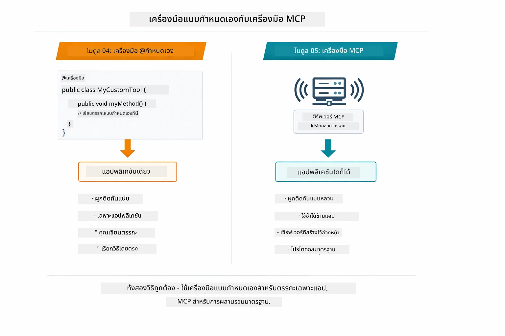  

*เมื่อใดควรใช้เมธอด @Tool กำหนดเองกับเครื่องมือ MCP — เครื่องมือกำหนดเองสำหรับตรรกะเฉพาะแอปฯ ที่มีความปลอดภัยของชนิดข้อมูลเต็มที่, เครื่องมือ MCP สำหรับการบูรณาการมาตรฐานที่ใช้งานได้กับหลายแอปฯ*  

## ขอแสดงความยินดี!  

คุณได้ผ่านทั้งห้าโมดูลของหลักสูตร LangChain4j for Beginners แล้ว! นี่คือภาพรวมเส้นทางการเรียนรู้ทั้งหมดที่คุณทำได้ — ตั้งแต่แชทพื้นฐานจนถึงระบบ agentic ที่ใช้พลัง MCP:  

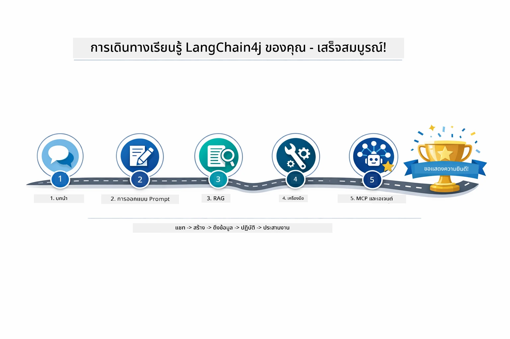  

*เส้นทางการเรียนรู้ของคุณผ่านทั้งห้าโมดูล — จากแชทพื้นฐานสู่ระบบ agentic ที่ขับเคลื่อนด้วย MCP*  

คุณเรียนรู้:  

- วิธีสร้าง AI สนทนาที่มีหน่วยความจำ (โมดูล 01)  
- รูปแบบ prompt engineering สำหรับงานต่างๆ (โมดูล 02)  
- การอ้างอิงคำตอบในเอกสารด้วย RAG (โมดูล 03)  
- การสร้าง AI agent เบื้องต้น (ผู้ช่วย) ด้วยเครื่องมือกำหนดเอง (โมดูล 04)  
- การบูรณาการเครื่องมือมาตรฐานด้วย LangChain4j MCP และโมดูล Agentic (โมดูล 05)  

### ต่อไปคืออะไร?  

หลังจากทำโมดูลเสร็จแล้ว ให้สำรวจ [คู่มือการทดสอบ](../docs/TESTING.md) เพื่อดูแนวคิดการทดสอบ LangChain4j ในการใช้งาน  

**แหล่งข้อมูลอย่างเป็นทางการ:**  
- [เอกสาร LangChain4j](https://docs.langchain4j.dev/) - คู่มือและเอกสาร API ครบถ้วน  
- [LangChain4j GitHub](https://github.com/langchain4j/langchain4j) - โค้ดต้นฉบับและตัวอย่าง  
- [บทเรียน LangChain4j](https://docs.langchain4j.dev/tutorials/) - บทเรียนทีละขั้นตอนสำหรับกรณีใช้งานต่างๆ  

ขอบคุณที่เรียนจบหลักสูตรนี้!  

---  

**เมนูนำทาง:** [← ก่อนหน้า: Module 04 - Tools](../04-tools/README.md) | [กลับสู่หน้าหลัก](../README.md)

---

<!-- CO-OP TRANSLATOR DISCLAIMER START -->
**ข้อจำกัดความรับผิดชอบ**:  
เอกสารนี้ได้รับการแปลโดยใช้บริการแปลภาษา AI [Co-op Translator](https://github.com/Azure/co-op-translator) แม้ว่าเราจะพยายามให้ความถูกต้องสูงสุด แต่โปรดทราบว่าการแปลอัตโนมัติอาจมีข้อผิดพลาดหรือความไม่ถูกต้อง เอกสารต้นฉบับในภาษาต้นทางถือเป็นแหล่งข้อมูลที่เชื่อถือได้ที่สุด สำหรับข้อมูลที่สำคัญ แนะนำให้ใช้การแปลโดยมนุษย์มืออาชีพ เราไม่รับผิดชอบต่อความเข้าใจผิดหรือการตีความที่ผิดพลาดใด ๆ ที่เกิดจากการใช้การแปลนี้
<!-- CO-OP TRANSLATOR DISCLAIMER END -->