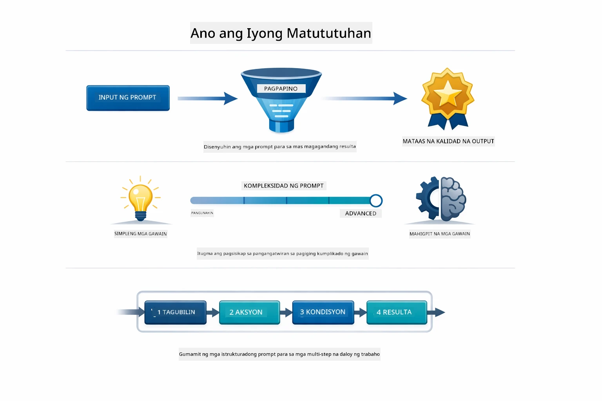
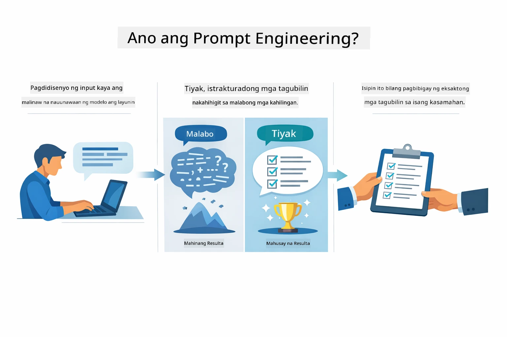
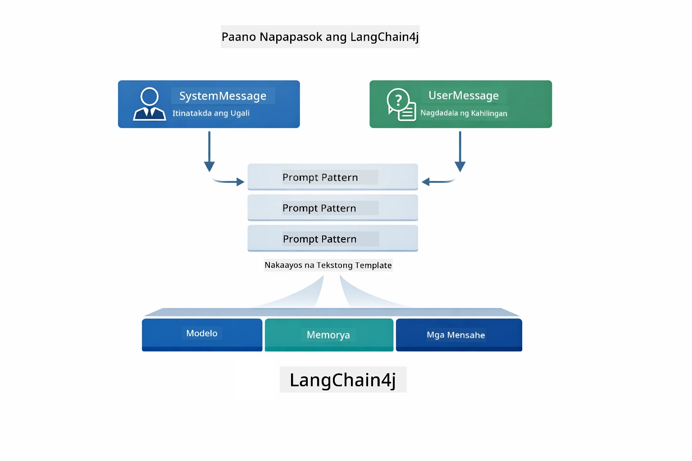
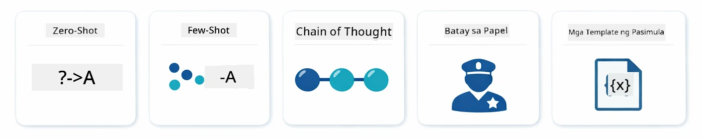
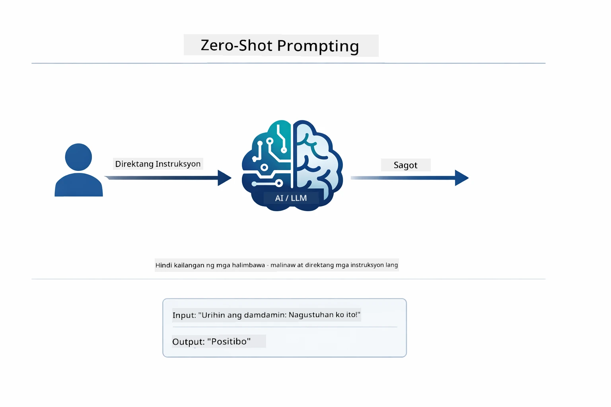
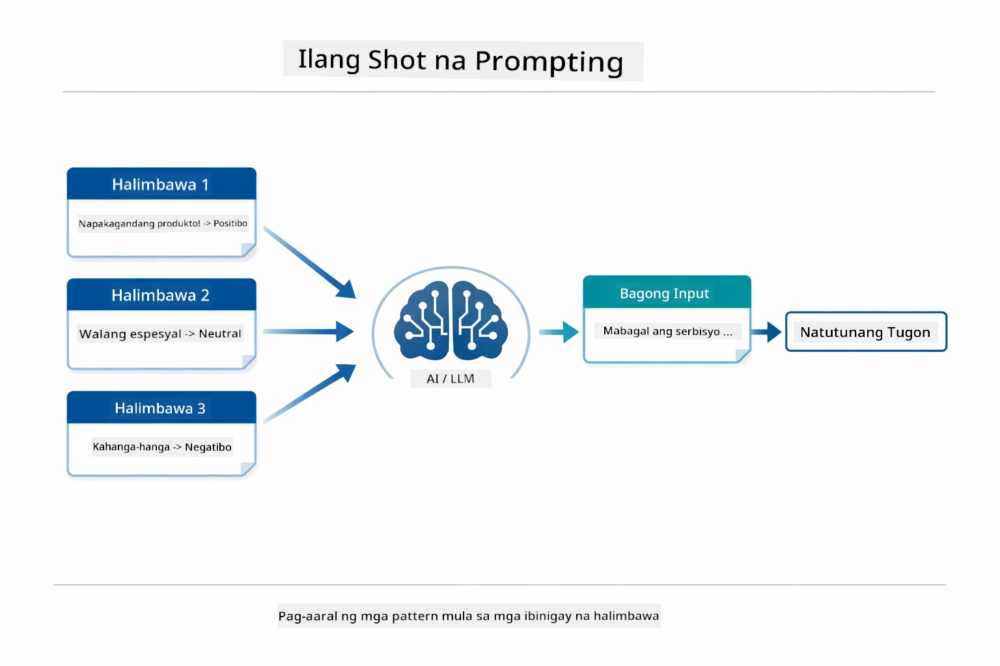
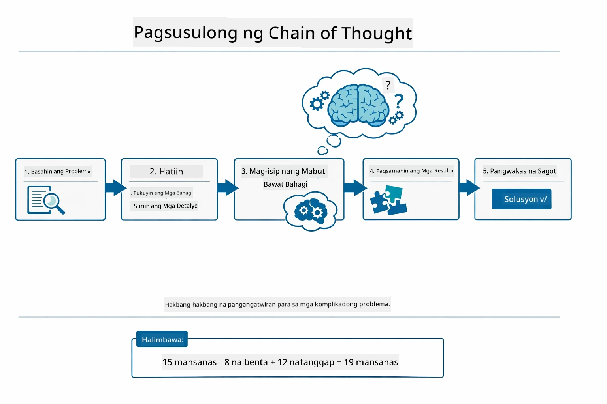
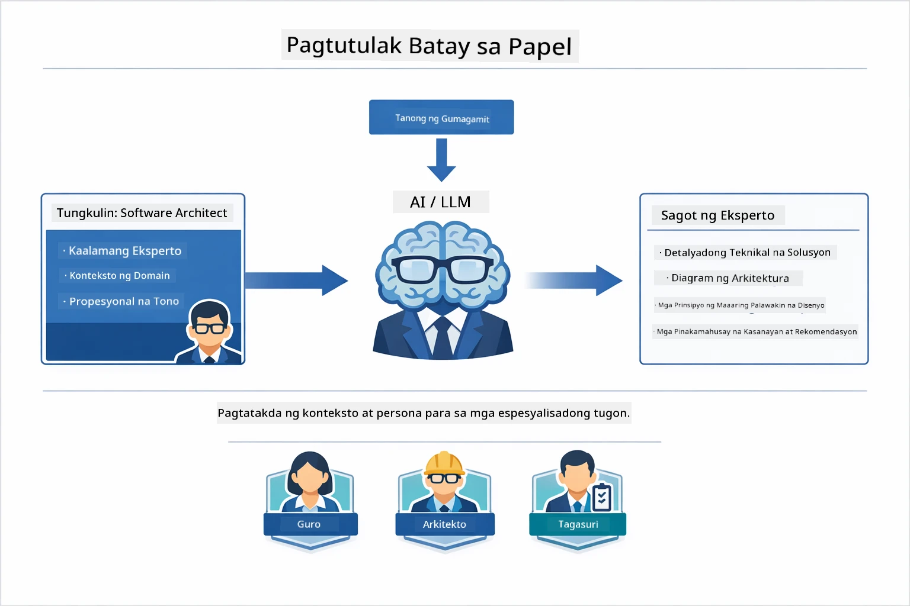
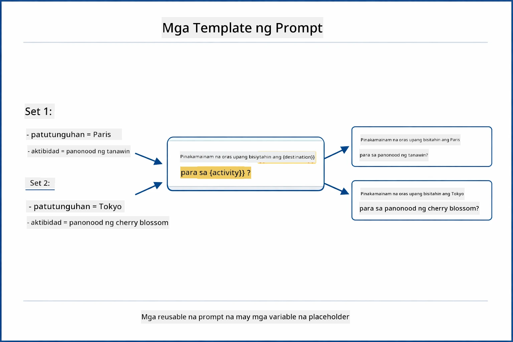
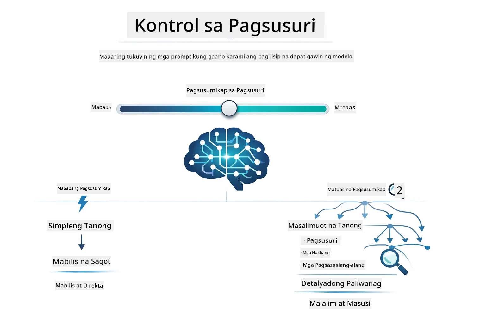

# Module 02: Prompt Engineering gamit ang GPT-5.2

## Talaan ng Nilalaman

- [Ano ang Matututuhan Mo](../../../02-prompt-engineering)
- [Mga Paunang Kaalaman](../../../02-prompt-engineering)
- [Pag-unawa sa Prompt Engineering](../../../02-prompt-engineering)
- [Mga Pundamental sa Prompt Engineering](../../../02-prompt-engineering)
  - [Zero-Shot Prompting](../../../02-prompt-engineering)
  - [Few-Shot Prompting](../../../02-prompt-engineering)
  - [Chain of Thought](../../../02-prompt-engineering)
  - [Role-Based Prompting](../../../02-prompt-engineering)
  - [Prompt Templates](../../../02-prompt-engineering)
- [Mga Advanced na Pattern](../../../02-prompt-engineering)
- [Paggamit ng Umiiral na Azure Resources](../../../02-prompt-engineering)
- [Mga Screenshot ng Aplikasyon](../../../02-prompt-engineering)
- [Pagsusuri sa mga Pattern](../../../02-prompt-engineering)
  - [Mababang Eagerness vs Mataas na Eagerness](../../../02-prompt-engineering)
  - [Pagsasagawa ng Gawain (Tool Preambles)](../../../02-prompt-engineering)
  - [Pag-replekta sa Sarili ng Code](../../../02-prompt-engineering)
  - [Nakaayos na Pagsusuri](../../../02-prompt-engineering)
  - [Multi-Turn Chat](../../../02-prompt-engineering)
  - [Hakbang-hakbang na Pangangatwiran](../../../02-prompt-engineering)
  - [Limitadong Output](../../../02-prompt-engineering)
- [Ano Talaga ang Iyong Natututuhan](../../../02-prompt-engineering)
- [Mga Susunod na Hakbang](../../../02-prompt-engineering)

## Ano ang Matututuhan Mo



Sa nakaraang module, nakita mo kung paano pinapagana ng memorya ang conversational AI at ginamit ang GitHub Models para sa mga pangunahing interaksyon. Ngayon, magpo-focus tayo kung paano ka magtatanong — ang mga prompts mismo — gamit ang Azure OpenAI GPT-5.2. Ang paraan ng pag-istruktura ng iyong mga prompt ay malaki ang epekto sa kalidad ng mga sagot na iyong matatanggap. Sisimula tayo sa pagrepaso ng mga pundamental na teknik sa prompting, tapos lilipat tayo sa walong advanced na pattern na lubos na gumagamit sa kakayahan ng GPT-5.2.

Gagamit tayo ng GPT-5.2 dahil ito ay nagdadala ng control sa pag-iisip — maaari mong sabihin sa modelo kung gaano karaming pag-iisip ang gagawin bago sumagot. Pinapalinaw nito ang iba't ibang istratehiya sa prompting at tinutulungan kang maintindihan kung kailan gagamitin ang bawat isa. Makinabang din tayo mula sa mas kaunting rate limits ng Azure para sa GPT-5.2 kumpara sa GitHub Models.

## Mga Paunang Kaalaman

- Natapos ang Module 01 (naideploy na ang Azure OpenAI resources)
- `\.env` file sa root directory na may Azure credentials (ginawa ng `azd up` sa Module 01)

> **Tandaan:** Kung hindi mo pa natatapos ang Module 01, sundan muna ang mga tagubilin sa pag-deploy doon.

## Pag-unawa sa Prompt Engineering



Ang prompt engineering ay tungkol sa pagdidisenyo ng input na teksto na palaging nakukuha ang mga kailangang resulta. Hindi ito basta pagtatanong lang — ito ay pag-istruktura ng mga kahilingan upang maintindihan ng modelo kung ano eksakto ang gusto mo at paano ito ihahatid.

Isipin mo itong pagbibigay ng mga tagubilin sa isang kasamahan. Ang "Ayusin ang bug" ay malabo. Ang "Ayusin ang null pointer exception sa UserService.java linya 45 sa pamamagitan ng pagdaragdag ng null check" ay tiyak. Ganoon din ang mga language model — mahalaga ang pagiging tiyak at istruktura.



Ang LangChain4j ay nagbibigay ng imprastruktura — koneksyon sa modelo, memorya, at mga uri ng mensahe — habang ang mga prompt pattern ay maingat na nakaayos na teksto na ipinapadala mo sa imprastrukturang iyon. Ang mga pangunahing bahagi ay ang `SystemMessage` (na nagseset ng asal at papel ng AI) at ang `UserMessage` (na nagdadala ng aktwal mong kahilingan).

## Mga Pundamental sa Prompt Engineering



Bago sumabak sa mga advanced na pattern sa module na ito, balikan muna natin ang limang pundamental na teknik sa prompting. Ito ang mga pundasyon na dapat malaman ng bawat prompt engineer. Kung napagdaanan mo na ang [Quick Start module](../00-quick-start/README.md#2-prompt-patterns), nakita mo na ito sa aksyon — narito ang konseptwal na balangkas sa likod nila.

### Zero-Shot Prompting

Pinakasimpleng lapit: bigyan ang modelo ng direktang tagubilin nang walang mga halimbawa. Umaasa ang modelo sa kanyang training para maintindihan at isagawa ang gawain. Epektibo ito sa mga simpleng kahilingan kung saan ang inaasahang kilos ay halata.



*Direktang tagubilin na walang mga halimbawa — hinuhango ng modelo ang gawain mula sa tagubilin lang*

```java
String prompt = "Classify this sentiment: 'I absolutely loved the movie!'";
String response = model.chat(prompt);
// Tugon: "Positibo"
```

**Kailan gagamitin:** Simpleng klasipikasyon, direktang mga tanong, pagsasalin, o anumang gawain na kaya ng modelo nang walang dagdag na gabay.

### Few-Shot Prompting

Magbigay ng mga halimbawa na nagpapakita ng pattern na gusto mong sundin ng modelo. Natutunan ng modelo ang inaasahang format ng input-output mula sa mga halimbawang ito at inilalapat ito sa mga bagong input. Pinapabuti nito nang malaki ang konsistensi para sa mga gawain kung saan hindi halata ang nais na format o kilos.



*Pagtuturo mula sa mga halimbawa — kinikilala ng modelo ang pattern at inilalapat ito sa bagong input*

```java
String prompt = """
    Classify the sentiment as positive, negative, or neutral.
    
    Examples:
    Text: "This product exceeded my expectations!" → Positive
    Text: "It's okay, nothing special." → Neutral
    Text: "Waste of money, very disappointed." → Negative
    
    Now classify this:
    Text: "Best purchase I've made all year!"
    """;
String response = model.chat(prompt);
```

**Kailan gagamitin:** Custom na klasipikasyon, konsistenteng pag-format, mga domain-specific na gawain, o kapag hindi consistent ang resulta ng zero-shot.

### Chain of Thought

Hilingin sa modelo na ipakita ang kanyang pagsasaalang-alang step-by-step. Sa halip na diretso sumagot, hinahati ng modelo ang problema at tinatrabaho bawat bahagi nang malinaw. Pinapataas nito ang katumpakan sa math, logic, at mga multi-step na pangangatwiran.



*Hakbang-hakbang na pangangatwiran — paghati ng komplikadong mga problema sa malinaw na lohikal na hakbang*

```java
String prompt = """
    Problem: A store has 15 apples. They sell 8 apples and then 
    receive a shipment of 12 more apples. How many apples do they have now?
    
    Let's solve this step-by-step:
    """;
String response = model.chat(prompt);
// Ipinapakita ng modelo: 15 - 8 = 7, pagkatapos ay 7 + 12 = 19 na mansanas
```

**Kailan gagamitin:** Mga problemang pang-matematika, logic puzzles, debugging, o anumang gawain kung saan pinapabuti ng pagpapakita ng proseso ng pangangatwiran ang katumpakan at pagtitiwala.

### Role-Based Prompting

Itakda ang persona o papel ng AI bago itanong ang iyong tanong. Nagbibigay ito ng konteksto na humuhubog sa tono, lalim, at pokus ng sagot. Iba ang payo ng "software architect" kaysa sa isang "junior developer" o "security auditor".



*Pagtatakda ng konteksto at persona — nagkakaiba ang sagot depende sa nakatalagang papel*

```java
String prompt = """
    You are an experienced software architect reviewing code.
    Provide a brief code review for this function:
    
    def calculate_total(items):
        total = 0
        for item in items:
            total = total + item['price']
        return total
    """;
String response = model.chat(prompt);
```

**Kailan gagamitin:** Code reviews, pagtuturo, domain-specific na pagsusuri, o kapag kailangan mo ng mga sagot na nakaangkop sa partikular na antas ng kadalubhasaan o perspektibo.

### Prompt Templates

Gumawa ng reusable prompts na may mga variable placeholders. Sa halip na gumawa ng bagong prompt sa bawat pagkakataon, idefine ang template nang isang beses at punan ang iba't ibang mga halaga. Pinapadali ito ng klase ng LangChain4j na `PromptTemplate` gamit ang `{{variable}}` na syntax.



*Reusable na mga prompt na may variable placeholders — isang template, maraming gamit*

```java
PromptTemplate template = PromptTemplate.from(
    "What's the best time to visit {{destination}} for {{activity}}?"
);

Prompt prompt = template.apply(Map.of(
    "destination", "Paris",
    "activity", "sightseeing"
));

String response = model.chat(prompt.text());
```

**Kailan gagamitin:** Uulit-ulit na mga query na may iba't ibang inputs, batch processing, paggawa ng reusable na AI workflows, o anumang senaryo kung saan pare-pareho ang istruktura ng prompt pero nagbabago ang datos.

---

Binibigyan ka ng limang pundamental na ito ng matibay na kasangkapan para sa karamihan ng mga gawain sa prompting. Ang natitira sa module na ito ay nagpapalawak gamit ang **walong advanced na pattern** na kumikinabang sa reasoning control, self-evaluation, at structured output ng GPT-5.2.

## Mga Advanced na Pattern

Matapos talakayin ang mga pundamental, lumipat tayo sa walong advanced na pattern na nagpapasikat sa module na ito. Hindi pareho ang lapit sa lahat ng problema. May mga tanong na nangangailangan ng mabilisang sagot, ang iba naman ay kailangang malalim ang pag-iisip. May mga kailangan ng nakikitang pangangatwiran, ang iba ay direktang resulta lang. Bawat pattern sa ibaba ay inangkop sa iba't ibang senaryo — at pinalalakas ng reasoning control ng GPT-5.2 ang mga pagkakaiba.


*Pangkalahatang-ideya ng walong prompt engineering patterns at ang kanilang mga gamit*



*Pinapayagan ka ng reasoning control ng GPT-5.2 na tukuyin kung gaano karaming pag-iisip ang gagawin ng modelo — mula sa mabilis at direktang sagot hanggang sa malalim na pagsusuri*

**Mababang Eagerness (Mabilis at Pokusado)** - Para sa mga simpleng tanong na gusto mo ng mabilis at direktang sagot. Minimal lang ang pag-iisip ng modelo - maximum 2 hakbang. Gamitin ito para sa mga kalkulasyon, paghahanap, o mga direktang tanong.

```java
String prompt = """
    <context_gathering>
    - Search depth: very low
    - Bias strongly towards providing a correct answer as quickly as possible
    - Usually, this means an absolute maximum of 2 reasoning steps
    - If you think you need more time, state what you know and what's uncertain
    </context_gathering>
    
    Problem: What is 15% of 200?
    
    Provide your answer:
    """;

String response = chatModel.chat(prompt);
```

> 💡 **Siyasatin gamit ang GitHub Copilot:** Buksan ang [`Gpt5PromptService.java`](../../../02-prompt-engineering/src/main/java/com/example/langchain4j/prompts/service/Gpt5PromptService.java) at itanong:
> - "Ano ang kaibahan ng mababang eagerness at mataas na eagerness na prompting patterns?"
> - "Paano nakatutulong ang mga XML tags sa prompts sa pag-istruktura ng tugon ng AI?"
> - "Kailan ko dapat gamitin ang mga self-reflection patterns kumpara sa direktang tagubilin?"

**Mataas na Eagerness (Malalim at Komprehensibo)** - Para sa mga komplikadong problema na gusto mo ng malawak na pagsusuri. Malalim ang pag-explore ng modelo at ipinapakita ang detalyadong pangangatwiran. Para ito sa system design, mga desisyon sa arkitektura, o komplikadong pananaliksik.

```java
String prompt = """
    Analyze this problem thoroughly and provide a comprehensive solution.
    Consider multiple approaches, trade-offs, and important details.
    Show your analysis and reasoning in your response.
    
    Problem: Design a caching strategy for a high-traffic REST API.
    """;

String response = chatModel.chat(prompt);
```

**Pagsasagawa ng Gawain (Hakbang-hakbang na Pag-usad)** - Para sa mga multi-step na workflow. Nagbibigay ang modelo ng planong paunang gawin, inilalahad ang bawat hakbang habang gumagawa, at nagbibigay ng buod sa huli. Gamitin ito sa mga migration, implementasyon, o anumang multi-step na proseso.

```java
String prompt = """
    <task_execution>
    1. First, briefly restate the user's goal in a friendly way
    
    2. Create a step-by-step plan:
       - List all steps needed
       - Identify potential challenges
       - Outline success criteria
    
    3. Execute each step:
       - Narrate what you're doing
       - Show progress clearly
       - Handle any issues that arise
    
    4. Summarize:
       - What was completed
       - Any important notes
       - Next steps if applicable
    </task_execution>
    
    <tool_preambles>
    - Always begin by rephrasing the user's goal clearly
    - Outline your plan before executing
    - Narrate each step as you go
    - Finish with a distinct summary
    </tool_preambles>
    
    Task: Create a REST endpoint for user registration
    
    Begin execution:
    """;

String response = chatModel.chat(prompt);
```

Ang Chain-of-Thought prompting ay malinaw na hinihiling sa modelo na ipakita ang proseso ng pangangatwiran, na nagpapataas ng katumpakan sa mga komplikadong gawain. Nakakatulong ang hakbang-hakbang na paghahati sa parehong tao at AI na maintindihan ang lohika.

> **🤖 Subukan gamit ang [GitHub Copilot](https://github.com/features/copilot) Chat:** Magtanong tungkol sa pattern na ito:
> - "Paano ko iaangkop ang task execution pattern para sa mga long-running na operasyon?"
> - "Ano ang mga pinakamahusay na gawain sa pag-istruktura ng tool preambles sa mga production application?"
> - "Paano ko makukuha at maipapakita ang mga update sa intermediate progress sa UI?"


*Planuhin → Isagawa → Ibuod na workflow para sa mga multi-step na gawain*

**Self-Reflecting Code** - Para sa paggawa ng production-quality code. Gumagawa ang modelo ng code na sumusunod sa production standards na may tamang error handling. Gamitin ito kapag bumubuo ng mga bagong feature o serbisyo.

```java
String prompt = """
    Generate Java code with production-quality standards: Create an email validation service
    Keep it simple and include basic error handling.
    """;

String response = chatModel.chat(prompt);
```


*Ulit-ulit na loop ng pagpapabuti - generate, evaluate, tukuyin ang problema, pag-ibayo, ulitin*

**Nakaayos na Pagsusuri** - Para sa konsistenteng pagsusuri. Nirereview ng modelo ang code gamit ang isang tiyak na framework (katumpakan, mga gawi, performance, seguridad, maintainability). Gamitin ito sa code reviews o pagsusuri ng kalidad.

```java
String prompt = """
    <analysis_framework>
    You are an expert code reviewer. Analyze the code for:
    
    1. Correctness
       - Does it work as intended?
       - Are there logical errors?
    
    2. Best Practices
       - Follows language conventions?
       - Appropriate design patterns?
    
    3. Performance
       - Any inefficiencies?
       - Scalability concerns?
    
    4. Security
       - Potential vulnerabilities?
       - Input validation?
    
    5. Maintainability
       - Code clarity?
       - Documentation?
    
    <output_format>
    Provide your analysis in this structure:
    - Summary: One-sentence overall assessment
    - Strengths: 2-3 positive points
    - Issues: List any problems found with severity (High/Medium/Low)
    - Recommendations: Specific improvements
    </output_format>
    </analysis_framework>
    
    Code to analyze:
    ```
    public List getUsers() {
        return database.query("SELECT * FROM users");
    }
    ```
    Provide your structured analysis:
    """;

String response = chatModel.chat(prompt);
```

> **🤖 Subukan gamit ang [GitHub Copilot](https://github.com/features/copilot) Chat:** Magtanong tungkol sa nakaayos na pagsusuri:
> - "Paano ko mai-customize ang analysis framework para sa iba't ibang uri ng code review?"
> - "Ano ang pinakamainam na paraan upang i-parse at iaksyonan ang structured output programmatically?"
> - "Paano ko mapapanatili ang konsistenteng antas ng severity sa iba't ibang review session?"


*Framework para sa konsistenteng code review na may severity levels*

**Multi-Turn Chat** - Para sa mga pag-uusap na nangangailangan ng konteksto. Naaalala ng modelo ang mga naunang mensahe at pinapalawig ito. Gamitin ito para sa interaktibong help sessions o komplikadong Q&A.

```java
ChatMemory memory = MessageWindowChatMemory.withMaxMessages(10);

memory.add(UserMessage.from("What is Spring Boot?"));
AiMessage aiMessage1 = chatModel.chat(memory.messages()).aiMessage();
memory.add(aiMessage1);

memory.add(UserMessage.from("Show me an example"));
AiMessage aiMessage2 = chatModel.chat(memory.messages()).aiMessage();
memory.add(aiMessage2);
```


*Paano ang konteksto ng pag-uusap ay naiipon sa maraming turn hanggang umabot sa token limit*

**Hakbang-hakbang na Pangangatwiran** - Para sa mga problema na nangangailangan ng nakikitang lohika. Ipinapakita ng modelo ang malinaw na pangangatwiran para sa bawat hakbang. Gamitin ito sa math problems, logic puzzles, o kapag kailangan mong maunawaan ang proseso ng pag-iisip.

```java
String prompt = """
    <instruction>Show your reasoning step-by-step</instruction>
    
    If a train travels 120 km in 2 hours, then stops for 30 minutes,
    then travels another 90 km in 1.5 hours, what is the average speed
    for the entire journey including the stop?
    """;

String response = chatModel.chat(prompt);
```


*Paghahati ng mga problema sa malinaw na lohikal na hakbang*

**Limitadong Output** - Para sa mga tugon na may partikular na hinihinging format. Mahigpit na sinusunod ng modelo ang mga alituntunin sa format at haba. Gamitin ito para sa mga buod o kapag kailangan mo ng tiyak na istruktura ng output.

```java
String prompt = """
    <constraints>
    - Exactly 100 words
    - Bullet point format
    - Technical terms only
    </constraints>
    
    Summarize the key concepts of machine learning.
    """;

String response = chatModel.chat(prompt);
```


*Pagpapatupad ng tiyak na format, haba, at mga kinakailangan sa istruktura*

## Paggamit ng Umiiral na Azure Resources

**Suriin ang deployment:**

Siguraduhing may `.env` file sa root directory na may Azure credentials (nagawa noong Module 01):
```bash
cat ../.env  # Dapat ipakita ang AZURE_OPENAI_ENDPOINT, API_KEY, DEPLOYMENT
```

**Simulan ang aplikasyon:**

> **Tandaan:** Kung sinimulan mo na ang lahat ng aplikasyon gamit ang `./start-all.sh` mula sa Module 01, tumatakbo na ang module na ito sa port 8083. Maaari mong laktawan ang mga utos ng pagsisimula sa ibaba at direktang pumunta sa http://localhost:8083.

**Opsyon 1: Paggamit ng Spring Boot Dashboard (Inirerekomenda para sa mga gumagamit ng VS Code)**

Kasama sa dev container ang Spring Boot Dashboard extension, na nagbibigay ng visual na interface para pamahalaan ang lahat ng mga Spring Boot application. Makikita mo ito sa Activity Bar sa kaliwang bahagi ng VS Code (hanapin ang icon ng Spring Boot).

Mula sa Spring Boot Dashboard, maaari mong gawin ang mga sumusunod:
- Tingnan ang lahat ng magagamit na Spring Boot application sa workspace
- Simulan/hintuin ang mga aplikasyon gamit ang isang click lang
- Tingnan ang mga log ng aplikasyon nang real-time
- Subaybayan ang status ng aplikasyon
I-click lamang ang pindutang play sa tabi ng "prompt-engineering" upang simulan ang module na ito, o simulan lahat ng modules nang sabay-sabay.


**Opsyon 2: Paggamit ng shell scripts**

Simulan lahat ng web applications (modules 01-04):

**Bash:**
```bash
cd ..  # Mula sa direktorong ugat
./start-all.sh
```

**PowerShell:**
```powershell
cd ..  # Mula sa root direktoryo
.\start-all.ps1
```

O simulang ang module na ito lamang:

**Bash:**
```bash
cd 02-prompt-engineering
./start.sh
```

**PowerShell:**
```powershell
cd 02-prompt-engineering
.\start.ps1
```

Awtomatikong nilaload ng parehong script ang mga environment variables mula sa root `.env` na file at magbubuo ng JARs kung wala pa ito.

> **Tandaan:** Kung nais mong manu-manong itayo lahat ng modules bago simulan:
>
> **Bash:**
> ```bash
> cd ..  # Go to root directory
> mvn clean package -DskipTests
> ```
>
> **PowerShell:**
> ```powershell
> cd ..  # Go to root directory
> mvn clean package -DskipTests
> ```

Buksan ang http://localhost:8083 sa iyong browser.

**Para huminto:**

**Bash:**
```bash
./stop.sh  # Para lamang sa modulong ito
# O
cd .. && ./stop-all.sh  # Lahat ng mga module
```

**PowerShell:**
```powershell
.\stop.ps1  # Para lamang sa module na ito
# O
cd ..; .\stop-all.ps1  # Lahat ng mga module
```

## Mga Screenshot ng Application


*Ang pangunahing dashboard na nagpapakita ng lahat ng 8 prompt engineering patterns kasama ang kanilang mga katangian at mga gamit*

## Pagsusuri sa Mga Pattern

Pinapayagan ka ng web interface na subukan ang iba't ibang mga diskarte sa prompting. Ang bawat pattern ay nakakatugon sa iba't ibang problema - subukan ang mga ito upang makita kung kailan lumalabas ang bawat pamamaraan.

> **Tandaan: Streaming vs Non-Streaming** — Ang bawat pahina ng pattern ay may dalawang mga pindutan: **🔴 Stream Response (Live)** at isang **Non-streaming** na opsyon. Ginagamit ng streaming ang Server-Sent Events (SSE) para ipakita ang mga token nang real-time habang ini-generate ito ng modelo, kaya nakikita mo agad ang progreso. Ang non-streaming na opsyon ay naghihintay ng buong sagot bago ito ipakita. Para sa mga prompt na nangangailangan ng malalim na pag-iisip (halimbawa, High Eagerness, Self-Reflecting Code), maaaring tumagal nang matagal ang non-streaming call — kung minsan ay ilang minuto — nang walang nakikitang tugon. **Gamitin ang streaming kapag nagsu-experiment ka gamit ang mga komplikadong prompt** upang makita mong gumagana ang modelo at maiwasan ang impresyon na nag-timeout ang kahilingan.
>
> **Tandaan: Kinakailangan ng Browser** — Ginagamit ng streaming feature ang Fetch Streams API (`response.body.getReader()`) na nangangailangan ng ganap na browser (Chrome, Edge, Firefox, Safari). Hindi ito gumagana sa built-in Simple Browser ng VS Code, dahil hindi sinusuportahan ng webview nito ang ReadableStream API. Kung gagamit ka ng Simple Browser, gagana pa rin nang normal ang non-streaming buttons — ang streaming buttons lang ang apektado. Buksan ang `http://localhost:8083` sa isang panlabas na browser para sa buong karanasan.

### Low vs High Eagerness

Magtanong ng simpleng tanong tulad ng "Ano ang 15% ng 200?" gamit ang Low Eagerness. Makakakuha ka ng instant at direktang sagot. Ngayon, magtanong ng mas komplikado tulad ng "Magdisenyo ng caching strategy para sa mataas na trapikong API" gamit ang High Eagerness. I-click ang **🔴 Stream Response (Live)** at panoorin ang detalyadong pangangatwiran ng modelo na lumilitaw token-by-token. Parehong modelo, pareho ang istruktura ng tanong - ngunit sinasabi ng prompt kung gaano kalalim ang pag-iisip.

### Task Execution (Tool Preambles)

Ang mga multi-step na workflow ay nakikinabang sa maagang pagpaplano at pagsasalaysay ng progreso. Ipinapakita ng modelo kung ano ang gagawin nito, ipinapaliwanag ang bawat hakbang, at pagkatapos ay nire-recap ang mga resulta.

### Self-Reflecting Code

Subukan ang "Gumawa ng email validation service". Sa halip na bumuo lang ng code at huminto, ang modelo ay bumubuo, sinusuri batay sa mga pamantayan ng kalidad, tinutukoy ang mga kahinaan, at pinapabuti ito. Makikita mong inuulit nito hanggang matugunan ng code ang mga pamantayan para sa produksyon.

### Structured Analysis

Ang mga pagsusuri ng code ay nangangailangan ng pare-parehong mga balangkas ng pagsusuri. Inaalam ng modelo ang code gamit ang mga nakapirming kategorya (katumpakan, mga gawi, pagganap, seguridad) na may mga antas ng kaseryosohan.

### Multi-Turn Chat

Magtanong ng "Ano ang Spring Boot?" at agad na sundan ng "Ipakita mo ang isang halimbawa". Naalala ng modelo ang iyong unang tanong at bibigyan ka nito ng isang partikular na halimbawa ng Spring Boot. Kung walang memorya, magiging masyadong malabo ang pangalawang tanong.

### Step-by-Step Reasoning

Pumili ng problema sa matematika at subukan ito gamit ang Step-by-Step Reasoning at Low Eagerness. Ang low eagerness ay nagbibigay lang ng sagot - mabilis ngunit malabo. Ipinapakita ng step-by-step ang bawat kalkulasyon at desisyon.

### Constrained Output

Kapag kailangan mo ng partikular na format o bilang ng salita, pinipilit ng pattern na ito ang mahigpit na pagsunod. Subukang gumawa ng buod na may eksaktong 100 salita sa format na bullet points.

## Ano Talagang Natututuhan Mo

**Binabago ng Pagsisikap sa Pag-iisip ang Lahat**

Pinapayagan ka ng GPT-5.2 na kontrolin ang computational effort sa pamamagitan ng iyong mga prompt. Ang mababang pagsisikap ay nangangahulugang mabilis na mga tugon na may minimal na eksplorasyon. Ang mataas na pagsisikap ay nangangahulugang ang modelo ay maglalaan ng oras para mag-isip nang malalim. Natututuhan mong iangkop ang pagsisikap sa kumpleksidad ng gawain - huwag sayangin ang oras sa simpleng mga tanong, ngunit huwag din magmadali sa mga kumplikadong desisyon.

**Pinapatnubayan ng Estruktura ang Pag-uugali**

Napansin mo ba ang mga XML tags sa mga prompt? Hindi ito palamuti lamang. Mas maaasahan ang mga modelo kapag sumusunod sila sa mga istrukturadong tagubilin kaysa sa malayang teksto. Kapag kailangan mo ng multi-step na proseso o komplikadong lohika, nakakatulong ang estruktura para mabantayan ng modelo kung nasaan ito at ano ang susunod.


*Anatomiya ng isang maayos na istrukturadong prompt na may malinaw na mga seksyon at organisasyon na parang XML*

**Kalidad sa Pamamagitan ng Sariling Pagsusuri**

Gumagana ang mga self-reflecting patterns sa pamamagitan ng pagpapahayag ng mga pamantayan ng kalidad. Sa halip na umaasa na "tama ang gagawin" ng modelo, tinutukoy mo kung ano ang ibig sabihin ng "tama": wastong lohika, paghawak ng error, pagganap, seguridad. Maaari nang suriin ng modelo ang sariling output at pagbutihin ito. Ginagawa nitong proseso ang pagbuo ng code, hindi basta-loteriya.

**May Hangganan ang Konteksto**

Gumagana ang multi-turn na pag-uusap sa pamamagitan ng pagsama ng kasaysayan ng mensahe sa bawat kahilingan. Ngunit may limitasyon - bawat modelo ay may maximum token count. Habang lumalaki ang pag-uusap, kakailanganin mo ng mga estratehiya para mapanatili ang mahalagang konteksto nang hindi umaabot sa limitasyon. Ipinapakita sa module na ito kung paano gumagana ang memorya; sa hinaharap matututuhan mo kung kailan magsasummarize, kailan kakalimutan, at kailan kukunin.

## Mga Susunod na Hakbang

**Susunod na Module:** [03-rag - RAG (Retrieval-Augmented Generation)](../03-rag/README.md)

---

**Pag-navigate:** [← Nakaraan: Module 01 - Panimula](../01-introduction/README.md) | [Bumalik sa Pangunahing Pahina](../README.md) | [Susunod: Module 03 - RAG →](../03-rag/README.md)

---

<!-- CO-OP TRANSLATOR DISCLAIMER START -->
**Paunawa**:  
Ang dokumentong ito ay isinalin gamit ang AI translation service na [Co-op Translator](https://github.com/Azure/co-op-translator). Bagamat nagsusumikap kami para sa katumpakan, pakatandaan na ang mga awtomatikong pagsasalin ay maaaring maglaman ng mga pagkakamali o kamalian. Ang orihinal na dokumento sa orihinal nitong wika ang dapat ituring na pinagsanggunian. Para sa mahahalagang impormasyon, inirerekomenda ang propesyonal na pagsasalin ng tao. Hindi kami mananagot sa anumang hindi pagkakaunawaan o maling interpretasyon na magmumula sa paggamit ng pagsasaling ito.
<!-- CO-OP TRANSLATOR DISCLAIMER END -->