# Module 03: RAG (Retrieval-Augmented Generation)

## Table of Contents

- [Video Walkthrough](../../../03-rag)
- [What You'll Learn](../../../03-rag)
- [Prerequisites](../../../03-rag)
- [Understanding RAG](../../../03-rag)
  - [Which RAG Approach Does This Tutorial Use?](../../../03-rag)
- [How It Works](../../../03-rag)
  - [Document Processing](../../../03-rag)
  - [Creating Embeddings](../../../03-rag)
  - [Semantic Search](../../../03-rag)
  - [Answer Generation](../../../03-rag)
- [Run the Application](../../../03-rag)
- [Using the Application](../../../03-rag)
  - [Upload a Document](../../../03-rag)
  - [Ask Questions](../../../03-rag)
  - [Check Source References](../../../03-rag)
  - [Experiment with Questions](../../../03-rag)
- [Key Concepts](../../../03-rag)
  - [Chunking Strategy](../../../03-rag)
  - [Similarity Scores](../../../03-rag)
  - [In-Memory Storage](../../../03-rag)
  - [Context Window Management](../../../03-rag)
- [When RAG Matters](../../../03-rag)
- [Next Steps](../../../03-rag)

## Video Walkthrough

Panoorin ang live session na ito na nagpapaliwanag kung paano magsimula gamit ang module na ito:

<a href="https://www.youtube.com/watch?v=_olq75ZH_eY"></a>

## What You'll Learn

Sa mga naunang module, natutunan mo kung paano magkaroon ng pag-uusap sa AI at kung paano epektibong isaayos ang iyong mga prompt. Ngunit may isang pangunahing limitasyon: ang mga language model ay nakakalamang lamang sa kanilang natutunan sa panahon ng pagsasanay. Hindi sila makakasagot ng mga tanong tungkol sa mga patakaran ng iyong kumpanya, dokumentasyon ng proyekto, o anumang impormasyon na hindi nila pinag-aralan.

Nilulutas ng RAG (Retrieval-Augmented Generation) ang problemang ito. Sa halip na turuan ang modelo tungkol sa iyong impormasyon (na mahal at hindi praktikal), binibigyan mo ito ng kakayahan na maghanap sa iyong mga dokumento. Kapag may nagtanong, hahanapin ng sistema ang kaugnay na impormasyon at isasama ito sa prompt. Sagot ng modelo batay sa kontekstong nakuha.

Isipin ang RAG bilang pagbibigay sa modelo ng isang sanggunian na aklatan. Kapag ikaw ay nagtanong:

1. **User Query** - Nagtanong ka
2. **Embedding** - Kinokonvert ang tanong mo sa isang vector
3. **Vector Search** - Hinahanap ang kahalintulad na mga bahagi ng dokumento
4. **Context Assembly** - Dinadagdag ang mga kaugnay na bahagi sa prompt
5. **Response** - Gumagawa ang LLM ng sagot batay sa konteksto

Ito ay nag-uugat sa mga sagot ng modelo sa iyong aktwal na datos sa halip na umasa lamang sa kaalaman mula sa pagsasanay o paggawa ng sagot.

## Prerequisites

- Nakumpleto ang [Module 00 - Quick Start](../00-quick-start/README.md) (para sa Easy RAG na halimbawa na nabanggit sa itaas)
- Nakumpleto ang [Module 01 - Introduction](../01-introduction/README.md) (na-deploy ang Azure OpenAI resources, kabilang ang `text-embedding-3-small` embedding model)
- `.env` file sa root directory na may Azure credentials (nilikha ng `azd up` sa Module 01)

> **Note:** Kung hindi mo pa natatapos ang Module 01, sundin muna ang mga tagubilin doon para sa deployment. Ang `azd up` na utos ay nagde-deploy ng parehong GPT chat model at embedding model na ginagamit sa module na ito.

## Understanding RAG

Ipinapakita ng diagram sa ibaba ang pangunahing konsepto: sa halip na umasa lamang sa data ng pagsasanay ng modelo, binibigyan ng RAG ang modelo ng isang sangguniang aklatan ng iyong mga dokumento na pwedeng konsultahin bago gumawa ng sagot.

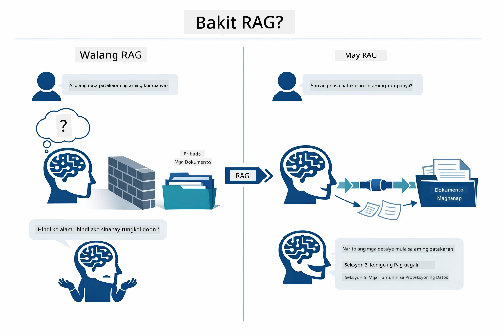

*Ipinapakita ng diagram na ito ang pagkakaiba sa pagitan ng isang karaniwang LLM (na huhula mula sa data ng pagsasanay) at isang RAG-enhanced LLM (na kumukonsulta muna sa iyong mga dokumento).*

Ganito ang koneksyon ng mga bahagi mula simula hanggang dulo. Ang tanong ng user ay dumadaan sa apat na yugto — embedding, vector search, context assembly, at answer generation — na bawat isa ay nakabatay sa naunang proseso:


*Ipinapakita ng diagram na ito ang end-to-end RAG pipeline — dumadaan ang user query sa embedding, vector search, context assembly, at answer generation.*

Ang natitirang bahagi ng module na ito ay naglalahad ng bawat yugto nang detalyado, kasama ang code na maaari mong patakbuhin at baguhin.

### Which RAG Approach Does This Tutorial Use?

Nag-aalok ang LangChain4j ng tatlong paraan upang ipatupad ang RAG, bawat isa ay may iba't ibang antas ng abstraksyon. Iina-compare ng diagram sa ibaba ang mga ito nang magkakatabi:

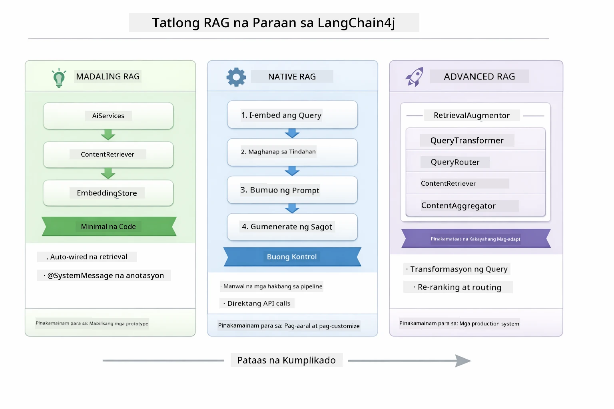

*Ipinapakita ng diagram na ito ang tatlong RAG approaches sa LangChain4j — Easy, Native, at Advanced — na may mga pangunahing bahagi at kung kailan gamitin ang bawat isa.*

| Approach | Ano ang Ginagawa Nito | Kapalit |
|---|---|---|
| **Easy RAG** | Awtomatikong ni-raroute lahat gamit ang `AiServices` at `ContentRetriever`. Naga-annotate ka ng interface, naka-attach ang retriever, at hinahandle ng LangChain4j ang embedding, paghahanap, at pagbuo ng prompt sa likod ng mga eksena. | Minimal na code, pero hindi mo nakikita ang nangyayari sa bawat hakbang. |
| **Native RAG** | Sinasadya mong tinatawag ang embedding model, hinahanap sa store, binubuo ang prompt, at ginagawa ang sagot — isang hakbang kada panahon. | Mas maraming code, pero makikita at mababago ang bawat yugto. |
| **Advanced RAG** | Ginagamit ang `RetrievalAugmentor` framework na may pluggable query transformers, routers, re-rankers, at content injectors para sa production-grade na pipelines. | Pinakamataas na flexibility, ngunit mas malaki ang komplikasyon. |

**Gamit ng tutorial na ito ang Native na pamamaraan.** Ang bawat hakbang ng RAG pipeline — pag-embed ng query, paghahanap sa vector store, pagbuo ng konteksto, at paggawa ng sagot — ay malinaw na nakasulat sa [`RagService.java`](../../../03-rag/src/main/java/com/example/langchain4j/rag/service/RagService.java). Sadyang ginawa ito: bilang isang learning resource, mas importante na makita at maintindihan mo ang bawat hakbang kaysa bawasan ang code. Kapag naging komportable ka na sa pagsasama-sama ng mga bahagi, maaari kang lumipat sa Easy RAG para sa mabilisang prototype o sa Advanced RAG para sa production.

> **💡 Nakita mo na ba ang Easy RAG?** Kasama sa [Quick Start module](../00-quick-start/README.md) ang isang Document Q&A na halimbawa ([`SimpleReaderDemo.java`](../../../00-quick-start/src/main/java/com/example/langchain4j/quickstart/SimpleReaderDemo.java)) na gumagamit ng Easy RAG approach — hinahandle ng LangChain4j ang embedding, paghahanap, at prompt assembly nang awtomatiko. Ang module na ito ang susunod na hakbang na binubuksan ang pipeline para makita at kontrolin mo ang bawat yugto nang sarili mo.

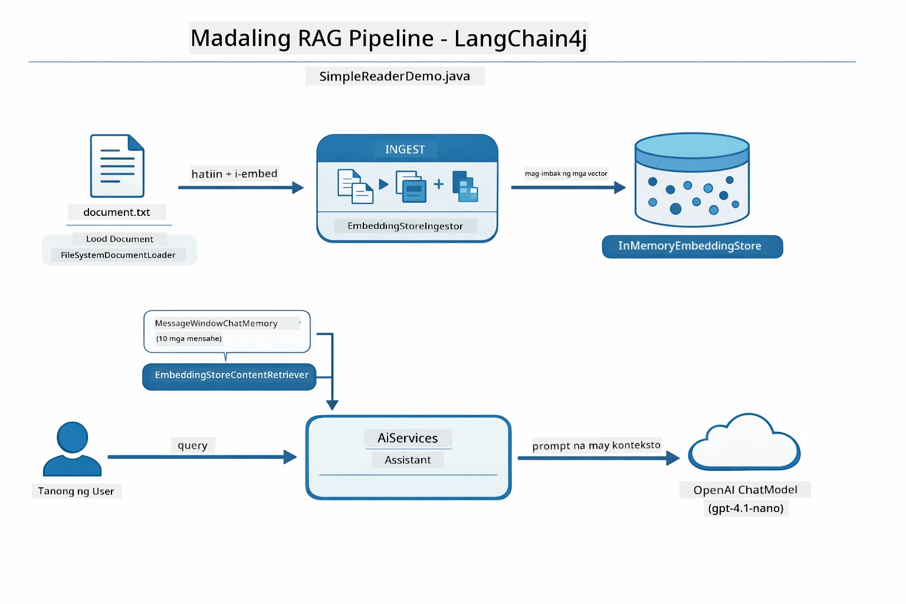

*Ipinapakita ng diagram na ito ang Easy RAG pipeline mula sa `SimpleReaderDemo.java`. Ihambing ito sa Native approach na gamit sa module na ito: itinatago ng Easy RAG ang embedding, retrieval, at prompt assembly sa likod ng `AiServices` at `ContentRetriever` — naglo-load ka lang ng dokumento, nag-attach ng retriever, at nakakakuha ng sagot. Binubuksan ng Native approach dito ang pipeline para tawagin mo ang bawat yugto (embed, search, assemble context, generate) nang sarili mo, nagbibigay ng buong visibility at kontrol.*

## How It Works

Ang RAG pipeline sa module na ito ay nahahati sa apat na yugto na sunod-sunod na gumagana tuwing may tanong ang user. Una, ang ina-upload na dokumento ay **pinoproseso at hinahati-hati** sa mga piraso na madaling pamahalaan. Ang mga pirasong ito ay kinokonvert sa **vector embeddings** at ini-store upang madamuang maikumpara. Kapag dumating ang query, nagsasagawa ang sistema ng **semantic search** upang mahanap ang pinaka-kaugnay na mga piraso, at sa huli ay ipinapasa ito bilang konteksto sa LLM para sa **pagbuo ng sagot**. Nilalakaran ng mga seksyon sa ibaba ang bawat yugto kasama ang aktwal na code at mga diagram. Tingnan natin ang unang hakbang.

### Document Processing

[DocumentService.java](../../../03-rag/src/main/java/com/example/langchain4j/rag/service/DocumentService.java)

Kapag nag-upload ka ng dokumento, ito ay pini-parse (PDF o plain text), nilalagyan ng metadata tulad ng pangalan ng file, at hinahati sa mga chunks — mga maliit na piraso na kasya nang maayos sa context window ng modelo. Ang mga chunks na ito ay bahagyang nag-o-overlap upang hindi mawala ang konteksto sa mga hangganan.

```java
// I-parse ang in-upload na file at balutin ito sa isang LangChain4j Document
Document document = Document.from(content, metadata);

// Hatiin sa 300-token na piraso na may 30-token na overlap
DocumentSplitter splitter = DocumentSplitters
    .recursive(300, 30);

List<TextSegment> segments = splitter.split(document);
```

Ipinapakita ng diagram sa ibaba kung paano ito gumagana nang biswal. Pansinin kung paano bawat chunk ay may ibinabahaging ilang tokens sa mga kalapit nito — ang 30-token overlap ay nagsisiguro na walang mahalagang konteksto ang mawawala sa pagitan:

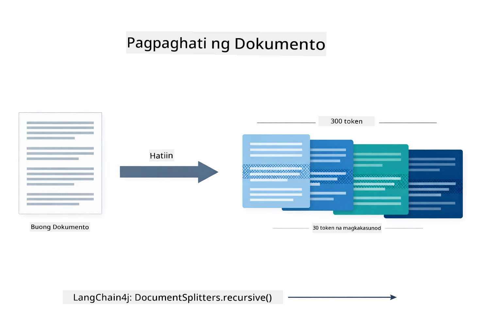

*Ipinapakita ng diagram na ito ang paghahati sa dokumento sa 300-token chunks na may 30-token overlap, pinapanatili ang konteksto sa mga hangganan ng chunk.*

> **🤖 Subukan gamit ang [GitHub Copilot](https://github.com/features/copilot) Chat:** Buksan ang [`DocumentService.java`](../../../03-rag/src/main/java/com/example/langchain4j/rag/service/DocumentService.java) at itanong:
> - "Paano hinahati ng LangChain4j ang mga dokumento sa chunks at bakit mahalaga ang overlap?"
> - "Ano ang pinakamainam na laki ng chunk para sa iba't ibang uri ng dokumento at bakit?"
> - "Paano hawakan ang mga dokumento sa maraming wika o na may espesyal na formatting?"

### Creating Embeddings

[LangChainRagConfig.java](../../../03-rag/src/main/java/com/example/langchain4j/rag/config/LangChainRagConfig.java)

Ang bawat chunk ay kinakabig bilang isang numerikal na representasyon na tinatawag na embedding — sa esensya, isang converter ng kahulugan sa mga numero. Ang embedding model ay hindi "matalino" tulad ng chat model; hindi ito sumusunod sa mga utos, hindi nagrereason, at hindi sumasagot ng mga tanong. Ang kaya lang nito ay i-map ang teksto sa isang matematikal na espasyo kung saan ang magkakatulad na kahulugan ay magkakalapit — "car" malapit sa "automobile," "refund policy" malapit sa "return my money." Isipin ang chat model bilang isang taong pwede mong kausapin; ang embedding model ay isang napakahusay na filing system.

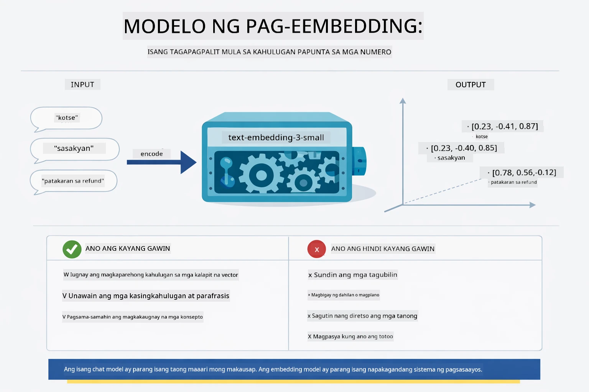

*Ipinapakita ng diagram na ito kung paano kino-convert ng embedding model ang teksto sa numerikal na vector, inilalagay ang magkakatulad na kahulugan — tulad ng "car" at "automobile" — nang magkalapit sa vector space.*

```java
@Bean
public EmbeddingModel embeddingModel() {
    return OpenAiOfficialEmbeddingModel.builder()
        .baseUrl(azureOpenAiEndpoint)
        .apiKey(azureOpenAiKey)
        .modelName(azureEmbeddingDeploymentName)
        .build();
}

EmbeddingStore<TextSegment> embeddingStore = 
    new InMemoryEmbeddingStore<>();
```

Ipinapakita ng class diagram sa ibaba ang dalawang hiwalay na daloy sa RAG pipeline at ang mga LangChain4j class na nagpapatupad sa mga ito. Ang **ingestion flow** (tumakbo isang beses sa pag-upload) ay naghahati ng dokumento, nag-e-embed ng mga chunks, at ini-store gamit ang `.addAll()`. Ang **query flow** (tumakbo kada tanong ng user) ay nag-e-embed ng tanong, naghahanap sa store gamit ang `.search()`, at ipinapasa ang tumugmang konteksto sa chat model. Ang dalawang daloy ay nagsasanib sa shared na `EmbeddingStore<TextSegment>` interface:

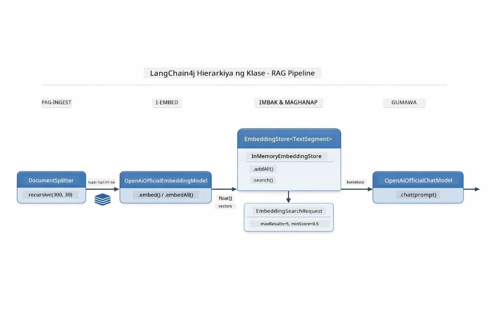

*Ipinapakita ng diagram na ito ang dalawang daloy sa RAG pipeline — ingestion at query — at kung paano sila nag-uugnay sa pamamagitan ng shared EmbeddingStore.*

Kapag na-store na ang embeddings, natural na nagsasama-sama ang magkakatulad na nilalaman sa vector space. Ipinapakita ng visualization sa ibaba kung paano nauuwi ang mga dokumento tungkol sa magkaugnay na paksa bilang mga kalapit na puntos, na siyang nagbibigay-daan sa semantic search:


*Ipinapakita ng visualization na ito kung paano nagsasama-sama ang magkaugnay na dokumento sa 3D vector space, kung saan ang mga paksa tulad ng Technical Docs, Business Rules, at FAQs ay bumubuo ng mga hiwalay na grupo.*

Kapag nagsagawa ang user ng paghahanap, sumusunod ang sistema sa apat na hakbang: i-embed ang mga dokumento nang isang beses, i-embed ang query sa bawat paghahanap, i-compare ang query vector laban sa lahat ng naka-store na vector gamit ang cosine similarity, at ibalik ang top-K na pinakamataas ang score na chunks. Ipinapaliwanag ng diagram sa ibaba ang bawat hakbang at ang mga LangChain4j na klase na kasama:

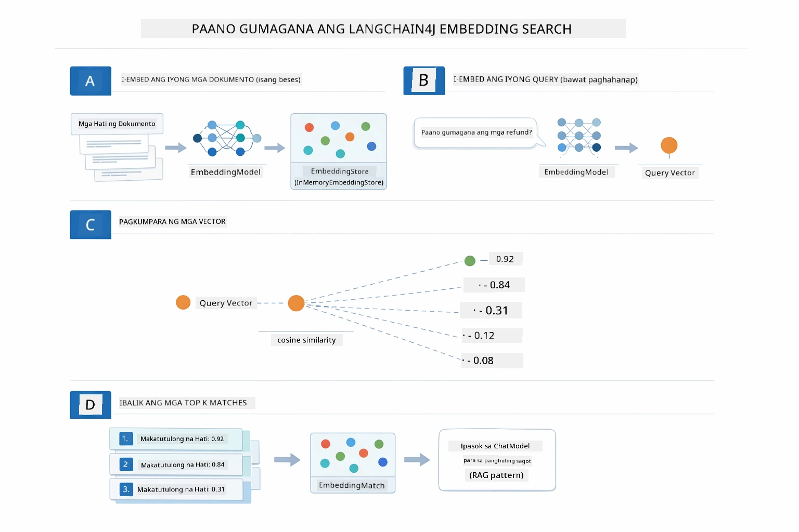

*Ipinapakita ng diagram na ito ang apat na hakbang sa proseso ng embedding search: i-embed ang mga dokumento, i-embed ang query, i-compare ang vectors gamit ang cosine similarity, at ibalik ang top-K na resulta.*

### Semantic Search

[RagService.java](../../../03-rag/src/main/java/com/example/langchain4j/rag/service/RagService.java)

Kapag nagtanong ka, ang tanong mo ay nagiging embedding din. Kinukumpara ng sistema ang embedding ng tanong mo laban sa lahat ng embedding ng mga chunks ng dokumento. Hinahanap nito ang mga chunks na may pinakakahalintulad na kahulugan - hindi lamang tumutugma sa mga keywords, kundi tunay na semantic similarity.

```java
Embedding queryEmbedding = embeddingModel.embed(question).content();

EmbeddingSearchRequest searchRequest = EmbeddingSearchRequest.builder()
    .queryEmbedding(queryEmbedding)
    .maxResults(5)
    .minScore(0.5)
    .build();

EmbeddingSearchResult<TextSegment> searchResult = embeddingStore.search(searchRequest);
List<EmbeddingMatch<TextSegment>> matches = searchResult.matches();

for (EmbeddingMatch<TextSegment> match : matches) {
    String relevantText = match.embedded().text();
    double score = match.score();
}
```

Ipinapakita ng diagram sa ibaba ang pinagkaiba ng semantic search at tradisyunal na keyword search. Ang keyword search para sa "vehicle" ay hindi nakakahanap ng chunk tungkol sa "cars and trucks," pero naiintindihan ng semantic search na pareho ang ibig sabihin at ibinabalik ito bilang mataas ang score:

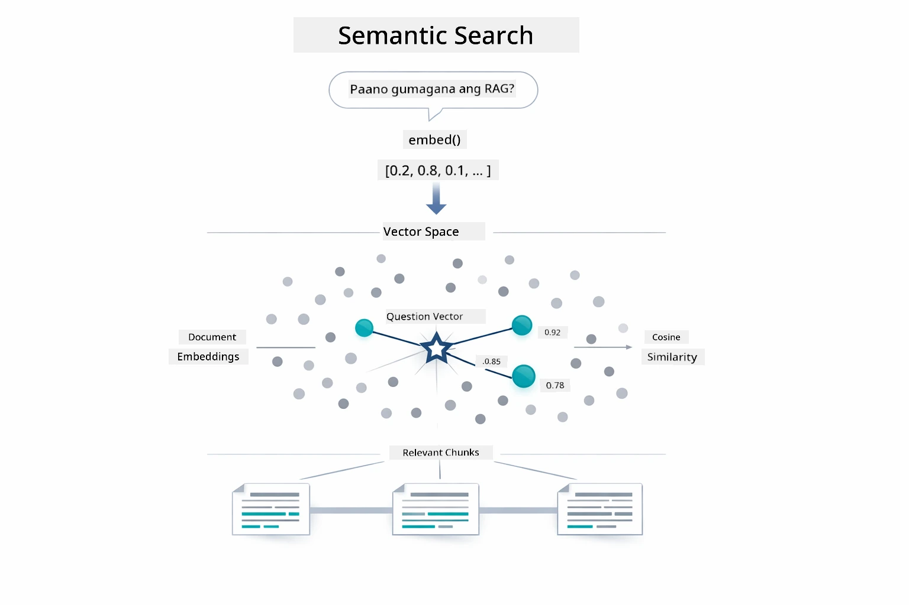

*Ipinapakita ng diagram na ito ang paghahambing ng paghahanap gamit ang keyword at semantic search, na nagpapakita kung paano kinukuha ng semantic search ang konseptuwal na kaugnay na nilalaman kahit magkaiba ang eksaktong keyword.*

Sa ilalim, sinusukat ang similarity gamit ang cosine similarity — sa madaling salita, tinatanong kung "pareho bang direksyon ang dalawang arrow?" Puwedeng magkaiba ang mga salita sa dalawang chunks, pero kung pareho ang kahulugan, magkapareho ang direksyon ng mga vector at malapit sa 1.0 ang score:

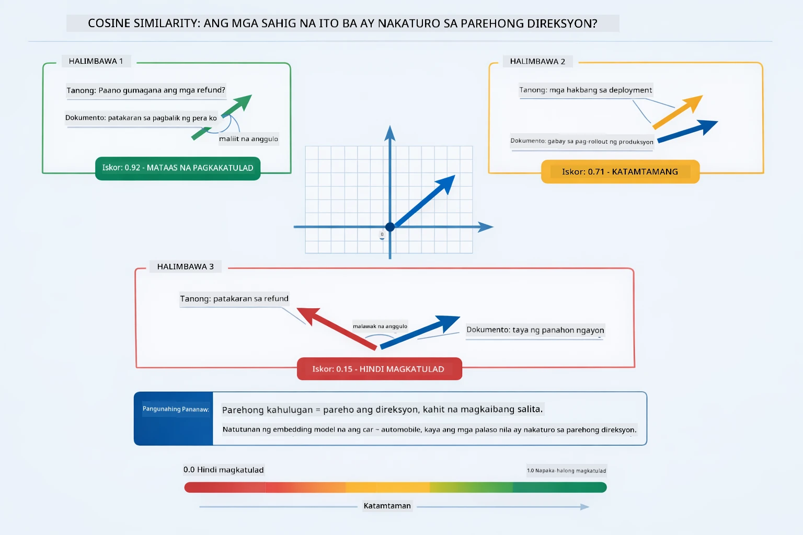
*Ipinapakita ng diagram na ito ang cosine similarity bilang anggulo sa pagitan ng mga embedding vector — mas magkakatugmang mga vector ang may score na mas malapit sa 1.0, na nagpapahiwatig ng mas mataas na semantic similarity.*

> **🤖 Subukan gamit ang [GitHub Copilot](https://github.com/features/copilot) Chat:** Buksan ang [`RagService.java`](../../../03-rag/src/main/java/com/example/langchain4j/rag/service/RagService.java) at itanong:
> - "Paano gumagana ang similarity search gamit ang embeddings at ano ang nagtatakda ng score?"
> - "Anong similarity threshold ang dapat kong gamitin at paano ito nakakaapekto sa mga resulta?"
> - "Paano ko haharapin ang mga kaso kung walang relevanteng dokumento na makita?"

### Paggawa ng Sagot

[RagService.java](../../../03-rag/src/main/java/com/example/langchain4j/rag/service/RagService.java)

Ang mga pinaka-naaangkop na chunks ay pinagsasama sa isang istrukturadong prompt na may kasamang malinaw na mga tagubilin, ang nakuha na konteksto, at ang tanong ng gumagamit. Binabasa ng modelo ang mga partikular na chunk na iyon at sumasagot batay sa impormasyong iyon — maaari lamang nitong gamitin ang nasa harap nito, na pumipigil sa hallucination.

```java
String context = matches.stream()
    .map(match -> match.embedded().text())
    .collect(Collectors.joining("\n\n"));

String prompt = String.format("""
    Answer the question based on the following context.
    If the answer cannot be found in the context, say so.

    Context:
    %s

    Question: %s

    Answer:""", context, request.question());

String answer = chatModel.chat(prompt);
```

Ipinapakita ng diagram sa ibaba ang prosesong ito — ang mga top-scoring chunks mula sa hakbang ng paghahanap ay inilalagay sa prompt template, at ang `OpenAiOfficialChatModel` ay bumubuo ng grounded na sagot:

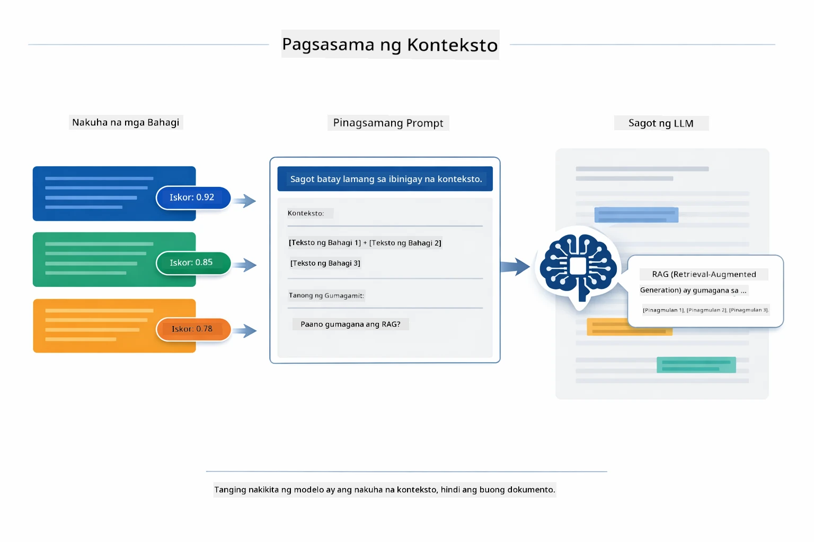

*Ipinapakita ng diagram na ito kung paano pinagsasama-sama ang mga top-scoring chunks sa isang istrukturadong prompt, na nagpapahintulot sa modelo na gumawa ng grounded na sagot mula sa iyong datos.*

## Patakbuhin ang Aplikasyon

**Beripikahin ang deployment:**

Siguraduhing naroroon ang `.env` file sa root directory na may Azure credentials (nilikha noong Module 01):

**Bash:**
```bash
cat ../.env  # Dapat ipakita ang AZURE_OPENAI_ENDPOINT, API_KEY, DEPLOYMENT
```

**PowerShell:**
```powershell
Get-Content ..\.env  # Dapat ipakita ang AZURE_OPENAI_ENDPOINT, API_KEY, DEPLOYMENT
```

**Simulan ang aplikasyon:**

> **Tandaan:** Kung sinimulan mo na ang lahat ng aplikasyon gamit ang `./start-all.sh` mula sa Module 01, tumatakbo na ang module na ito sa port 8081. Maaari mo nang laktawan ang mga start commands sa ibaba at direktang pumunta sa http://localhost:8081.

**Opsyon 1: Gamit ang Spring Boot Dashboard (Inirerekomenda para sa mga gumagamit ng VS Code)**

Kasama sa dev container ang Spring Boot Dashboard extension, na nagbibigay ng visual na interface para pamahalaan ang lahat ng Spring Boot na aplikasyon. Makikita mo ito sa Activity Bar sa kaliwang bahagi ng VS Code (hanapin ang icon ng Spring Boot).

Mula sa Spring Boot Dashboard, maaari mong:
- Tingnan ang lahat ng available na Spring Boot na aplikasyon sa workspace
- Simulan/hinto ang mga aplikasyon gamit ang isang click lang
- Tingnan ang mga application logs nang real-time
- I-monitor ang status ng aplikasyon

Pindutin lang ang play button sa tabi ng "rag" para simulan ang module na ito, o simulan lahat ng modules nang sabay-sabay.


*Ipinapakita ng screenshot na ito ang Spring Boot Dashboard sa VS Code, kung saan maaari mong simulan, itigil, at i-monitor ang mga aplikasyon nang biswal.*

**Opsyon 2: Gamit ang shell scripts**

Simulan ang lahat ng web application (modules 01-04):

**Bash:**
```bash
cd ..  # Mula sa ugat na direktoryo
./start-all.sh
```

**PowerShell:**
```powershell
cd ..  # Mula sa root na direktoryo
.\start-all.ps1
```

O simulan lang ang module na ito:

**Bash:**
```bash
cd 03-rag
./start.sh
```

**PowerShell:**
```powershell
cd 03-rag
.\start.ps1
```

Awtomatikong niloload ng parehong script ang environment variables mula sa root `.env` file at gagawa ng JARs kung wala pa.

> **Tandaan:** Kung nais mong manu-manong i-build lahat ng modules bago simulan:
>
> **Bash:**
> ```bash
> cd ..  # Go to root directory
> mvn clean package -DskipTests
> ```
>
> **PowerShell:**
> ```powershell
> cd ..  # Go to root directory
> mvn clean package -DskipTests
> ```

Buksan ang http://localhost:8081 sa iyong browser.

**Para itigil:**

**Bash:**
```bash
./stop.sh  # Para lamang sa module na ito
# O
cd .. && ./stop-all.sh  # Lahat ng mga module
```

**PowerShell:**
```powershell
.\stop.ps1  # Para sa module na ito lamang
# O
cd ..; .\stop-all.ps1  # Lahat ng mga module
```

## Paggamit ng Aplikasyon

Nagbibigay ang aplikasyon ng web interface para sa pag-upload ng dokumento at pagtatanong.

<a href="images/rag-homepage.png"></a>

*Ipinapakita ng screenshot na ito ang interface ng RAG application kung saan nag-upload ka ng mga dokumento at nagtatanong.*

### Mag-upload ng Dokumento

Magsimula sa pag-upload ng dokumento - mas mainam ang mga TXT file para sa testing. May kasamang `sample-document.txt` sa direktoryong ito na naglalaman ng impormasyon tungkol sa mga feature ng LangChain4j, implementasyon ng RAG, at mga best practice - perpekto para subukan ang sistema.

Pinoproseso ng sistema ang iyong dokumento, hinahati-hati ito sa mga chunks, at gumagawa ng embeddings para sa bawat chunk. Nangyayari ito nang awtomatiko kapag nag-upload ka.

### Magtanong

Ngayon, magtanong ng mga partikular na katanungan tungkol sa nilalaman ng dokumento. Subukan ang mga factual na tanong na malinaw na nakasaad sa dokumento. Hinahanap ng sistema ang mga relevant na chunks, isinama ang mga ito sa prompt, at bumubuo ng sagot.

### Suriin ang mga Pinagkunan

Mapapansin mong ang bawat sagot ay may kasamang source references na may similarity scores. Ipinapakita ng mga score na ito (mula 0 hanggang 1) kung gaano kaepektibo ang tugma ng bawat chunk sa iyong tanong. Mas mataas na score ay mas maganda ang tugma. Pinapayagan ka nitong beripikahin ang sagot laban sa source material.

<a href="images/rag-query-results.png"></a>

*Ipinapakita ng screenshot na ito ang mga resulta ng query na may pinagbuong sagot, mga reference ng pinagmulan, at mga relevance score para sa bawat nakuha na chunk.*

### Subukan ang mga Tanong

Subukan ang iba't ibang uri ng tanong:
- Mga espesipikong katotohanan: "Ano ang pangunahing paksa?"
- Pagkumpara: "Ano ang pagkakaiba ng X at Y?"
- Buod: "Buodin ang mga pangunahing punto tungkol sa Z"

Pansinin kung paano nagbabago ang mga relevance scores batay sa kung gaano kaepektibo ang pagtugma ng iyong tanong sa nilalaman ng dokumento.

## Mga Pangunahing Konsepto

### Estratehiya sa Pag-chunk

Hinahati ang mga dokumento sa 300-token chunks na may 30 token na overlap. Tinitiyak ng balanse na ito na bawat chunk ay may sapat na konteksto upang maging makahulugan habang hindi naman masyadong malaki para isama sa maramihang chunks sa isang prompt.

### Similarity Scores

Bawat nakuha na chunk ay may kasamang similarity score mula 0 hanggang 1 na nagpapakita kung gaano ito kahusay na tumutugma sa tanong ng gumagamit. Ipinapakita ng diagram sa ibaba ang mga saklaw ng score at kung paano ito ginagamit ng sistema upang salain ang mga resulta:

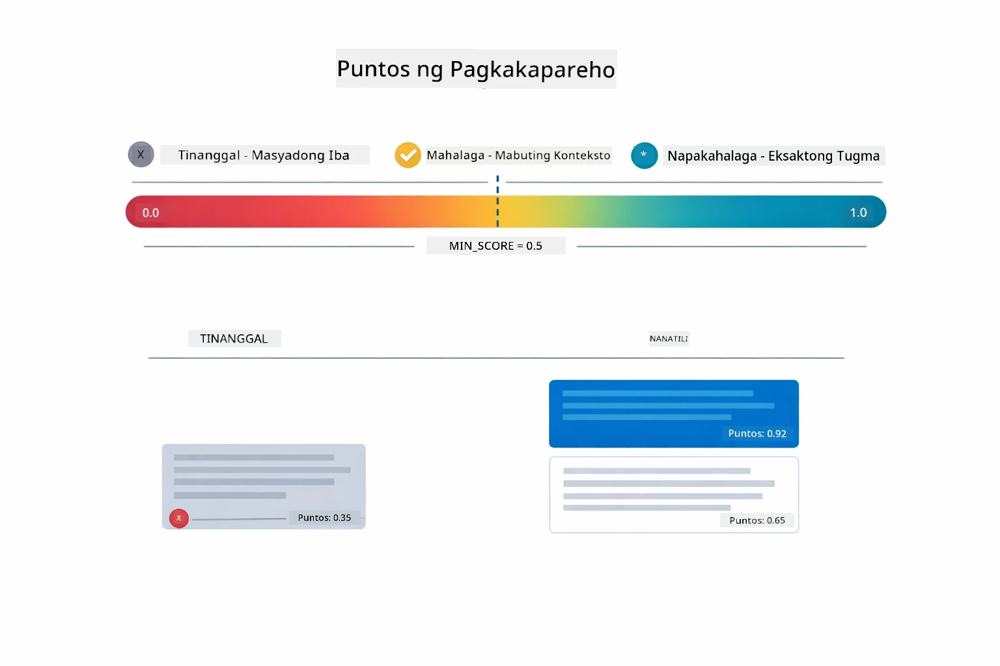

*Ipinapakita ng diagram na ito ang mga saklaw ng score mula 0 hanggang 1, na may minimum threshold na 0.5 para salain ang mga hindi kaugnay na chunks.*

Ang mga score ay mula 0 hanggang 1:
- 0.7-1.0: Lubos na nauugnay, eksaktong tugma
- 0.5-0.7: Nauugnay, magandang konteksto
- Mas mababa sa 0.5: Hindi isinama, masyadong malayo

Kumuha lamang ang sistema ng mga chunks na lampas sa minimum threshold upang matiyak ang kalidad.

Maganda ang trabaho ng embeddings kapag malinis ang clustering ng mga kahulugan, ngunit may mga blind spot ito. Ipinapakita ng diagram sa ibaba ang mga karaniwang failure mode — ang masyadong malalaking chunks ay nagbubunga ng malabong vectors, ang masyadong maliliit na chunks ay kulang sa konteksto, ang mga hindi malinaw na termino ay tumutukoy sa maraming cluster, at ang eksaktong pagtutugma (IDs, part numbers) ay hindi gumagana sa embeddings:

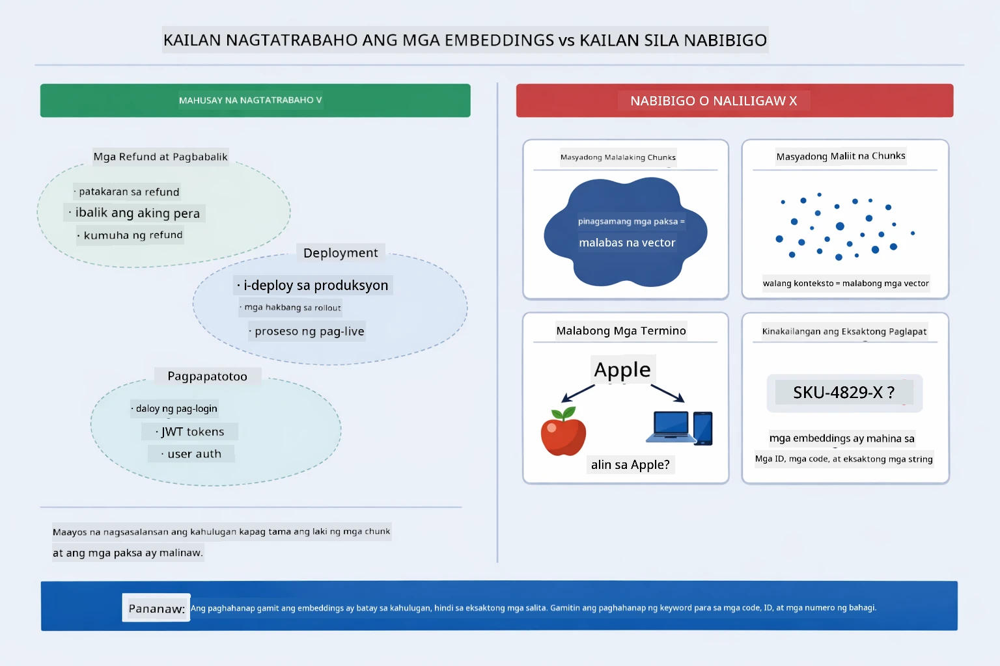

*Ipinapakita ng diagram na ito ang mga karaniwang failure mode sa embeddings: masyadong malalaking chunks, masyadong maliliit na chunks, malabong termino na tumutukoy sa maraming cluster, at eksaktong pagkakatugma tulad ng mga ID.*

### In-Memory Storage

Gumagamit ang module na ito ng in-memory storage para sa pagiging simple. Kapag ni-restart mo ang aplikasyon, mawawala ang mga na-upload na dokumento. Ang mga production system ay gumagamit ng persistent vector databases tulad ng Qdrant o Azure AI Search.

### Pamamahala ng Context Window

May maximum context window ang bawat modelo. Hindi mo maaaring isama lahat ng chunks mula sa malaking dokumento. Kinukuha ng sistema ang top N pinaka-nauugnay na chunks (default 5) upang hindi lalampas sa limitasyon habang nagbibigay ng sapat na konteksto para sa tama at tumpak na mga sagot.

## Kailan Mahalaga ang RAG

Hindi palaging tamang paraan ang RAG. Nakakatulong ang gabay sa desisyon sa ibaba upang malaman kung kailan nagdadagdag ng halaga ang RAG kumpara sa mas simpleng paraan — tulad ng direktang pagsasama ng nilalaman sa prompt o pag-asa sa built-in knowledge ng modelo:

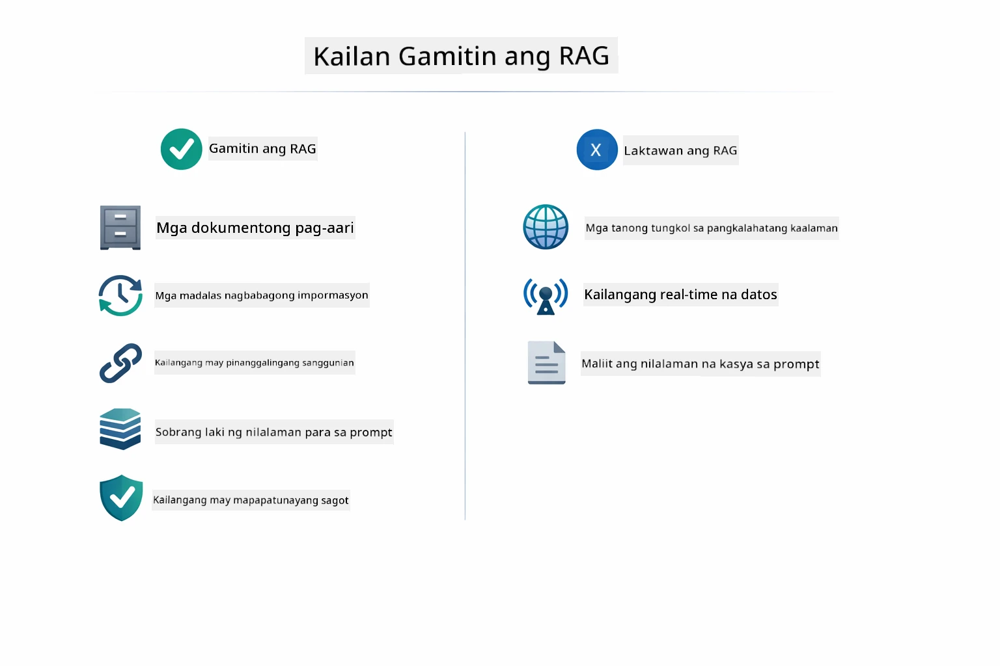

*Ipinapakita ng diagram na ito ang gabay sa desisyon kung kailan may halaga ang RAG kumpara sa kapag sapat na ang mas simpleng paraan.*

**Gamitin ang RAG kapag:**
- Sumagot ng mga tanong tungkol sa mga proprietary na dokumento
- Madalas nagbabago ang impormasyon (mga patakaran, presyo, espesipikasyon)
- Kinakailangan ang katumpakan na may pagkilala sa pinanggalingan
- Masyadong malaki ang nilalaman upang ilagay lahat sa isang prompt
- Kailangan ng mapagkakatiwalaang, grounded na mga sagot

**Huwag gamitin ang RAG kapag:**
- Ang mga tanong ay nangangailangan ng pangkalahatang kaalaman na mayroon na ang modelo
- Kailangan ng real-time na data (gumagana ang RAG sa mga na-upload na dokumento)
- Maliit lang ang nilalaman na maaaring direktang isama sa prompt

## Mga Susunod na Hakbang

**Susunod na Module:** [04-tools - AI Agents with Tools](../04-tools/README.md)

---

**Navigasyon:** [← Nakaraan: Module 02 - Prompt Engineering](../02-prompt-engineering/README.md) | [Bumalik sa Pangunahing Pahina](../README.md) | [Susunod: Module 04 - Tools →](../04-tools/README.md)

---

<!-- CO-OP TRANSLATOR DISCLAIMER START -->
**Paunawa**:  
Ang dokumentong ito ay isinalin gamit ang serbisyo ng AI na pagsasalin na [Co-op Translator](https://github.com/Azure/co-op-translator). Bagamat aming pinagsusumikapang maging tama ang pagsasalin, pakatandaan na ang mga awtomatikong pagsasalin ay maaaring maglaman ng mga pagkakamali o di-tiyak na impormasyon. Ang orihinal na dokumento sa orihinal nitong wika ang dapat ituring na pinagmumulan ng tama at opisyal. Para sa mga mahalagang impormasyon, inirerekomenda ang propesyonal na pagsasalin ng tao. Hindi kami mananagot sa anumang hindi pagkakaunawaan o maling interpretasyon na maaaring magmula sa paggamit ng pagsasaling ito.
<!-- CO-OP TRANSLATOR DISCLAIMER END -->