# Module 04: Mga AI Agent na may Mga Tool

## Table of Contents

- [Ano ang Malalaman Mo](../../../04-tools)
- [Mga Kinakailangan](../../../04-tools)
- [Pag-unawa sa Mga AI Agent na may Mga Tool](../../../04-tools)
- [Paano Gumagana ang Pagtawag ng Tool](../../../04-tools)
  - [Mga Depinisyon ng Tool](../../../04-tools)
  - [Pagpapasya](../../../04-tools)
  - [Pagpapatupad](../../../04-tools)
  - [Paggawa ng Tugon](../../../04-tools)
  - [Arkitektura: Spring Boot Auto-Wiring](../../../04-tools)
- [Pagkakadena ng Tool](../../../04-tools)
- [Patakbuhin ang Aplikasyon](../../../04-tools)
- [Paggamit ng Aplikasyon](../../../04-tools)
  - [Subukan ang Simpleng Paggamit ng Tool](../../../04-tools)
  - [Subukan ang Pagkakadena ng Tool](../../../04-tools)
  - [Tingnan ang Daloy ng Usapan](../../../04-tools)
  - [Mag-eksperimento sa Iba't Ibang Kahilingan](../../../04-tools)
- [Mga Pangunahing Konsepto](../../../04-tools)
  - [ReAct Pattern (Pangangatwiran at Pagsasakilos)](../../../04-tools)
  - [Mahalaga ang Mga Deskripsyon ng Tool](../../../04-tools)
  - [Pamamahala ng Session](../../../04-tools)
  - [Paghawak ng Error](../../../04-tools)
- [Mga Magagamit na Tool](../../../04-tools)
- [Kailan Gamitin ang Mga Agent na Batay sa Tool](../../../04-tools)
- [Mga Tool kumpara sa RAG](../../../04-tools)
- [Mga Susunod na Hakbang](../../../04-tools)

## Ano ang Malalaman Mo

Sa ngayon, natutunan mo kung paano makipag-usap sa AI, ayusin nang maayos ang mga prompt, at gawing batayan ang mga tugon sa iyong mga dokumento. Ngunit may isang pangunahing limitasyon pa rin: ang mga language model ay kaya lamang gumawa ng teksto. Hindi nila kayang tingnan ang lagay ng panahon, magsagawa ng kalkulasyon, mag-query ng mga database, o makipag-ugnayan sa mga panlabas na sistema.

Binabago ito ng mga tool. Sa pagbibigay ng access sa model sa mga function na maaari nitong tawagan, binabago mo ito mula sa isang tagagawa ng teksto tungo sa isang agent na kayang gumawa ng mga aksyon. Ang model ay nagdedesisyon kung kailan kailangan nito ng tool, kung aling tool ang gagamitin, at kung ano ang mga parameter na ipapasa. Ang iyong code ang nagpapatupad ng function at nagbabalik ng resulta. Isinasama ng model ang resulta sa kanyang tugon.

## Mga Kinakailangan

- Natapos na ang Module 01 (na-deploy na ang mga Azure OpenAI resources)
- May `.env` file sa root directory na may mga kredensyal ng Azure (nagawa ng `azd up` sa Module 01)

> **Tandaan:** Kung hindi mo pa natatapos ang Module 01, sundin muna ang mga tagubilin sa deployment doon.

## Pag-unawa sa Mga AI Agent na may Mga Tool

> **📝 Tandaan:** Ang terminong "agents" sa module na ito ay tumutukoy sa mga AI assistant na pinalakas ng kakayahang tumawag ng mga tool. Iba ito sa mga **Agentic AI** na pattern (mga autonomous agents na may pagpaplano, alaala, at multi-step na pangangatwiran) na tatalakayin natin sa [Module 05: MCP](../05-mcp/README.md).

Kung walang mga tool, ang isang language model ay makakagawa lamang ng teksto mula sa mga datos ng pagsasanay nito. Kung tatanungin mo ito tungkol sa kasalukuyang panahon, huhulaan lang nito. Sa pagbibigay ng mga tool, maaari itong tumawag ng weather API, magsagawa ng kalkulasyon, o mag-query ng database — pagkatapos ay isinalin ang mga totoong resulta sa tugon nito.

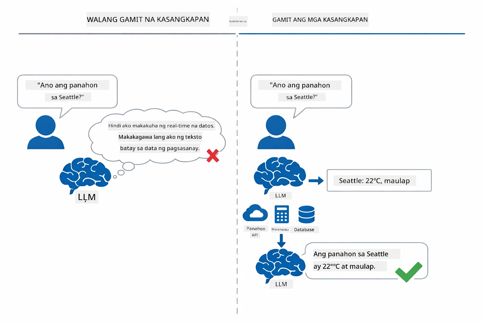

*Kung walang mga tool ay huhulaan lamang ng model — sa mga tool maaari itong tumawag ng API, magsagawa ng kalkulasyon, at magbalik ng totoong datos sa takdang oras.*

Isang AI agent na may mga tool ay sumusunod sa **Reasoning and Acting (ReAct)** na pattern. Hindi lamang tumutugon ang model — iniisip nito kung ano ang kailangan, kumikilos sa pamamagitan ng pagtawag ng tool, pinagmamasdan ang resulta, at pagkatapos ay nagdedesisyon kung uulitin ang aksyon o ibigay ang pangwakas na sagot:

1. **Pangangatwiran** — Sinusuri ng agent ang tanong ng gumagamit at tinutukoy kung anong impormasyon ang kailangan
2. **Pagsasakilos** — Pinipili ng agent ang tamang tool, gumagawa ng wastong mga parameter, at tinatawag ito
3. **Pagmamasid** — Tinatanggap ng agent ang output ng tool at sinusuri ang resulta
4. **Ulitin o Tugunan** — Kung kailangan pa ng karagdagang datos, bumabalik ang agent; kung hindi, bumubuo ito ng sagot sa natural na wika

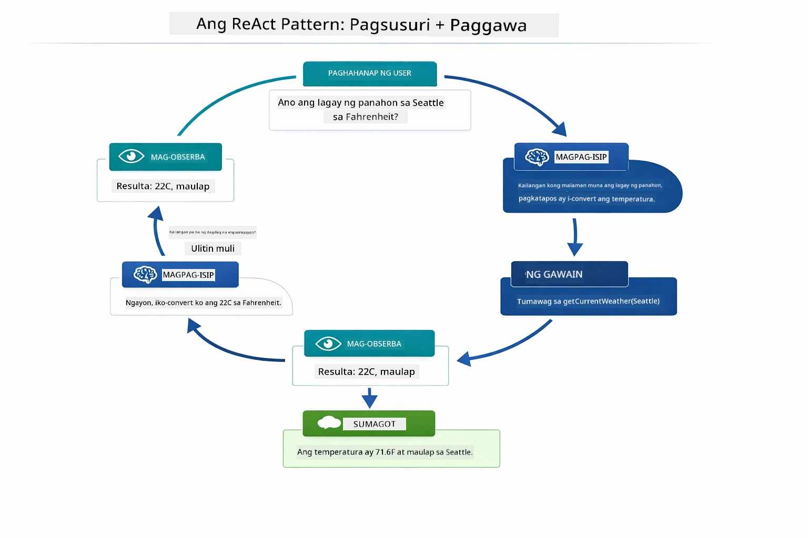

*Ang siklo ng ReAct — ang agent ay nag-iisip kung ano ang gagawin, kumikilos sa pagtawag ng tool, pinagmamasdan ang resulta, at uulitin hanggang maibigay ang pangwakas na sagot.*

Awtomatikong nangyayari ito. Dine-define mo ang mga tool at ang kanilang mga deskripsyon. Ang model ang humahawak ng pagpapasya kung kailan at paano ito gagamitin.

## Paano Gumagana ang Pagtawag ng Tool

### Mga Depinisyon ng Tool

[WeatherTool.java](../../../04-tools/src/main/java/com/example/langchain4j/agents/tools/WeatherTool.java) | [TemperatureTool.java](../../../04-tools/src/main/java/com/example/langchain4j/agents/tools/TemperatureTool.java)

Dine-define mo ang mga function na may malinaw na mga deskripsyon at mga pagtukoy ng parameter. Nakikita ng model ang mga deskripsyong ito sa system prompt nito at nauunawaan kung ano ang ginagawa ng bawat tool.

```java
@Component
public class WeatherTool {
    
    @Tool("Get the current weather for a location")
    public String getCurrentWeather(@P("Location name") String location) {
        // Ang iyong lohika sa pagtingin ng panahon
        return "Weather in " + location + ": 22°C, cloudy";
    }
}

@AiService
public interface Assistant {
    String chat(@MemoryId String sessionId, @UserMessage String message);
}

// Ang Assistant ay awtomatikong konektado ng Spring Boot sa:
// - ChatModel na bean
// - Lahat ng @Tool na mga metodo mula sa mga klase na may @Component
// - ChatMemoryProvider para sa pamamahala ng session
```

Pinapaliwanag ng diagram sa ibaba ang bawat anotasyon at ipinapakita kung paano tumutulong ang bawat bahagi upang maunawaan ng AI kung kailan tatawagin ang tool at anong mga argumento ang ipapasa:

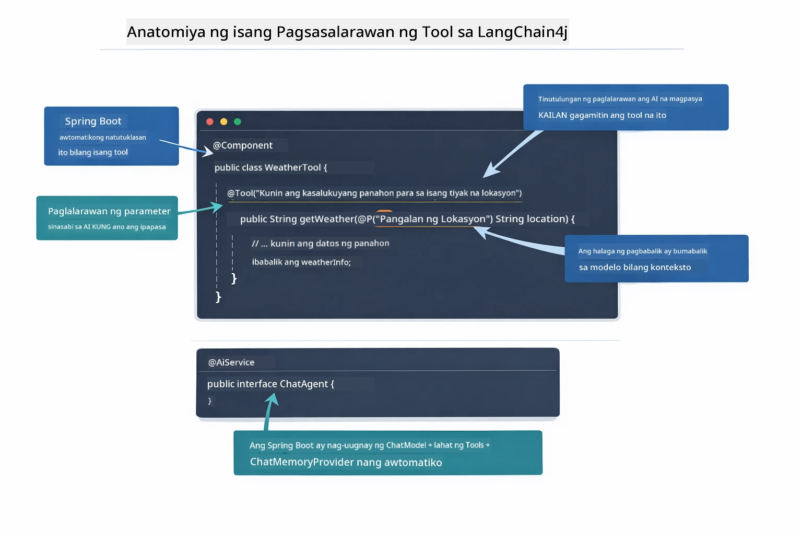

*Anatomiya ng isang depinisyon ng tool — sinasabi ng @Tool sa AI kung kailan ito gagamitin, inilarawan ng @P ang bawat parameter, at ang @AiService ang nag-uugnay sa lahat sa pagsisimula.*

> **🤖 Subukan gamit ang [GitHub Copilot](https://github.com/features/copilot) Chat:** Buksan ang [`WeatherTool.java`](../../../04-tools/src/main/java/com/example/langchain4j/agents/tools/WeatherTool.java) at itanong:
> - "Paano ko isasama ang totoong weather API tulad ng OpenWeatherMap sa halip na mock data?"
> - "Ano ang bumubuo ng magandang deskripsyon ng tool na tumutulong sa AI na gamitin ito nang tama?"
> - "Paano ko haharapin ang mga error ng API at mga rate limit sa mga implementasyon ng tool?"

### Pagpapasya

Kapag tinanong ng gumagamit na "Ano ang lagay ng panahon sa Seattle?", hindi basta-basta pumipili ang model ng isang tool. Inihahambing nito ang intensyon ng gumagamit sa bawat deskripsyon ng tool na mayroon ito, sinusuri ang mga ito para sa kaugnayan, at pinipili ang pinakamahusay na tugma. Pagkatapos, gumagawa ito ng istrakturadong pagtawag ng function na may tamang mga parameter — sa kasong ito, itinakda ang `location` sa `"Seattle"`.

Kung walang tool na tumutugma sa kahilingan ng gumagamit, bumabalik ang model upang sumagot mula sa sarili nitong kaalaman. Kung maraming tool ang tumutugma, pinipili nito ang pinakaespesipiko.

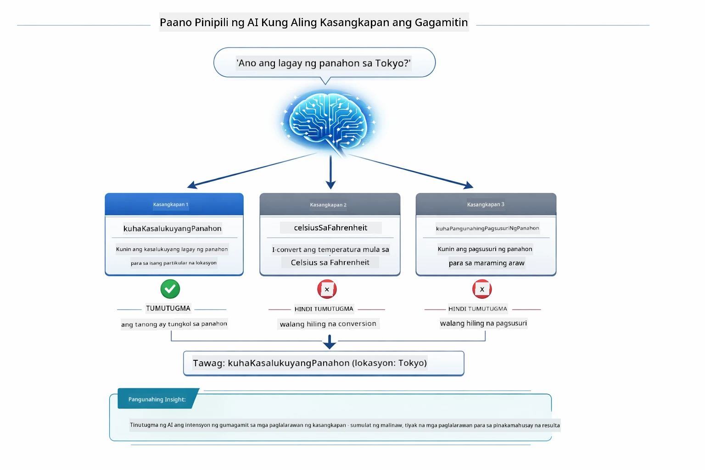

*Sinusuri ng model ang bawat magagamit na tool laban sa intensyon ng gumagamit at pinipili ang pinakamahusay na tugma — kaya mahalaga ang pagsulat ng malinaw at espesipikong mga deskripsyon ng tool.*

### Pagpapatupad

[AgentService.java](../../../04-tools/src/main/java/com/example/langchain4j/agents/service/AgentService.java)

Ang Spring Boot ay awtomatikong nag-uugnay sa deklaratibong `@AiService` interface gamit ang lahat ng rehistradong tool, at pinapatupad ng LangChain4j ang mga pagtawag sa tool nang awtomatiko. Sa likod ng eksena, dumadaan sa anim na yugto ang kumpletong pagtawag ng tool — mula sa tanong ng gumagamit hanggang sa isang natural na sagot:

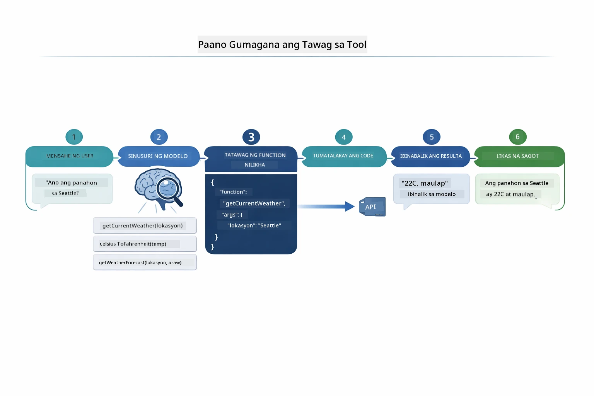

*Ang end-to-end na daloy — nagtatanong ang user, pumipili ang model ng tool, pinapatupad ito ng LangChain4j, at isinisingit ng model ang resulta sa natural na tugon.*

> **🤖 Subukan gamit ang [GitHub Copilot](https://github.com/features/copilot) Chat:** Buksan ang [`AgentService.java`](../../../04-tools/src/main/java/com/example/langchain4j/agents/service/AgentService.java) at itanong:
> - "Paano gumagana ang ReAct pattern at bakit ito epektibo para sa mga AI agent?"
> - "Paano pinipili ng agent kung aling tool ang gagamitin at sa anong pagkakasunod?"
> - "Ano ang nangyayari kung mabigo ang pagpapatupad ng tool — paano ko dapat robust na hawakan ang mga error?"

### Paggawa ng Tugon

Tinatanggap ng model ang datos ng panahon at ini-format ito bilang natural na tugon para sa gumagamit.

### Arkitektura: Spring Boot Auto-Wiring

Ginagamit ng module na ito ang integrasyon ng LangChain4j sa Spring Boot na may deklaratibong `@AiService` interfaces. Sa pagsisimula, nadidiskubre ng Spring Boot ang bawat `@Component` na may mga `@Tool` method, ang iyong `ChatModel` bean, at ang `ChatMemoryProvider` — pagkatapos ay ini-uugnay lahat sa isang `Assistant` interface nang walang dagdag na boilerplate.

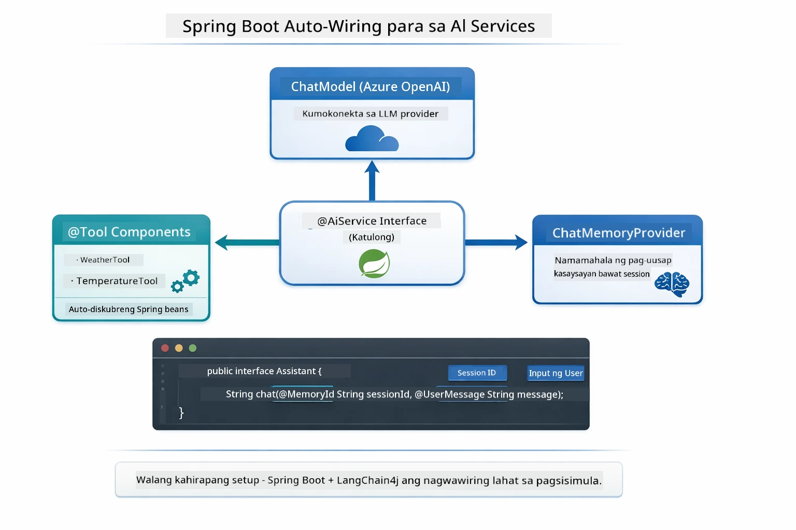

*Pinag-uugnay ng @AiService interface ang ChatModel, mga component ng tool, at memory provider — awtomatikong inaasikaso ng Spring Boot ang lahat ng wiring.*

Pangunahing benepisyo ng ganitong paraan:

- **Spring Boot auto-wiring** — Awtomatikong ini-inject ang ChatModel at mga tool
- **@MemoryId pattern** — Awtomatikong pamamahala ng session-based memory
- **Isang instance lang** — Assistant ay nililikha nang minsan at ginagamit muli para sa mas mahusay na performance
- **Type-safe na pagpapatupad** — Direktang tinatawag ang mga Java method na may type conversion
- **Multi-turn orchestration** — Awtomatikong humahawak sa pagkakadena ng tool
- **Walang dagdag na boilerplate** — Walang manual na `AiServices.builder()` na tawag o memory HashMap

Mas maraming code ang kailangan sa alternatibong paraan (manwal na `AiServices.builder()`) at nawawala ang mga benepisyo ng Spring Boot integration.

## Pagkakadena ng Tool

**Pagkakadena ng Tool** — Ang tunay na kapangyarihan ng mga agent na batay sa tool ay makikita kapag ang isang tanong ay nangangailangan ng maraming tool. Kapag tinanong na "Ano ang lagay ng panahon sa Seattle sa Fahrenheit?" awtomatikong magkakadena ang agent ng dalawang tool: una nitong tinatawag ang `getCurrentWeather` para makuha ang temperatura sa Celsius, pagkatapos ay ipinasok nito ang halagang iyon sa `celsiusToFahrenheit` para sa conversion — lahat ito ay sa isang pag-uusap lang.

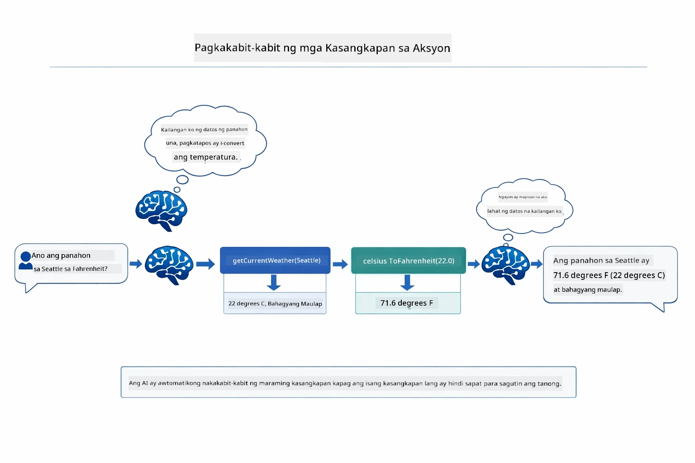

*Pagkakadena ng tool sa aksyon — tinatawag ng agent ang getCurrentWeather muna, pagkatapos ay ipinapasa ang resulta ng Celsius sa celsiusToFahrenheit, at naghahatid ng pinagsamang sagot.*

Ganito ang hitsura nito sa tumatakbong aplikasyon — ang agent ay magkakadena ng dalawang pagtawag ng tool sa isang pag-uusap:

<a href="images/tool-chaining.png"></a>

*Aktwal na output ng aplikasyon — awtomatikong magkakadena ng getCurrentWeather → celsiusToFahrenheit ang agent sa isang pag-uusap.*

**Magaan na Pagkabigo** — Humiling ng panahon sa isang lungsod na wala sa mock data. Nagbabalik ng mensahe ng error ang tool, at ipinaliliwanag ng AI na hindi ito makakatulong sa halip na mag-crash. Ang mga tool ay ligtas na nabibigo.

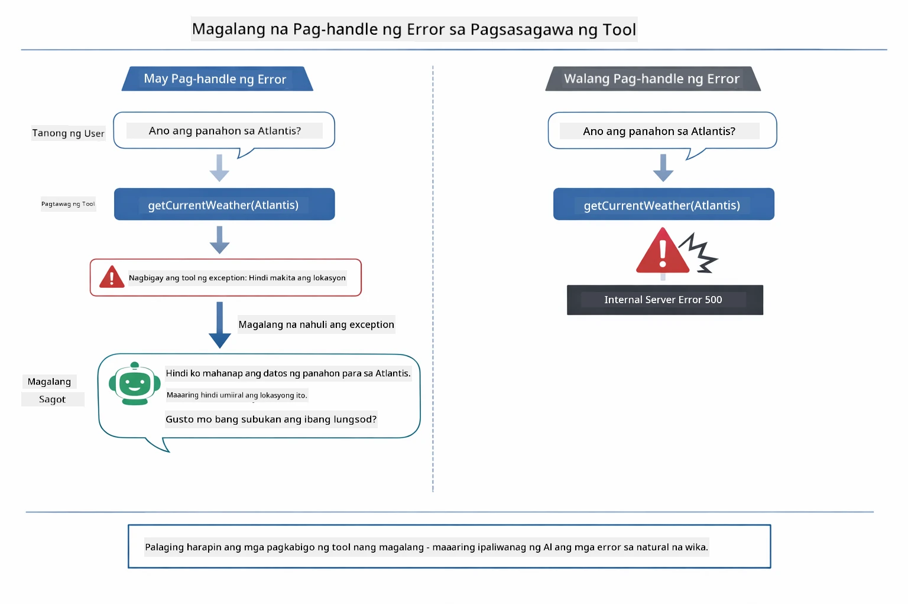

*Kapag nabigo ang isang tool, nahuhuli ng agent ang error at sumasagot nang may kapaki-pakinabang na paliwanag sa halip na mag-crash.*

Nangyayari ito sa isang pag-uusap lang. Awtomatikong naisasaayos ng agent ang maraming pagtawag sa tool.

## Patakbuhin ang Aplikasyon

**Suriin ang deployment:**

Siguraduhin na may `.env` file sa root directory na may mga kredensyal ng Azure (nagawa sa Module 01):
```bash
cat ../.env  # Dapat ipakita ang AZURE_OPENAI_ENDPOINT, API_KEY, DEPLOYMENT
```

**Simulan ang aplikasyon:**

> **Tandaan:** Kung sinimulan mo na lahat ng aplikasyon gamit ang `./start-all.sh` mula sa Module 01, tumatakbo na ang module na ito sa port 8084. Maaari mo nang laktawan ang mga start na utos sa ibaba at diretsong pumunta sa http://localhost:8084.

**Opsyon 1: Paggamit ng Spring Boot Dashboard (Inirerekomenda para sa mga gumagamit ng VS Code)**

Kasama sa dev container ang extension ng Spring Boot Dashboard, na nagbibigay ng visual na interface para pamahalaan lahat ng Spring Boot na aplikasyon. Makikita ito sa Activity Bar sa kaliwang bahagi ng VS Code (hanapin ang icon ng Spring Boot).

Mula sa Spring Boot Dashboard, maaari mong:
- Tingnan lahat ng magagamit na Spring Boot na aplikasyon sa workspace
- Simulan/hintuin ang mga aplikasyon sa isang click lang
- Tingnan ang mga log ng aplikasyon nang realtime
- Subaybayan ang status ng aplikasyon

I-click lamang ang play button sa tabi ng "tools" para simulan ang module na ito, o simulan lahat ng module nang sabay-sabay.


**Opsyon 2: Paggamit ng shell scripts**

Simulan lahat ng web aplikasyon (modules 01-04):

**Bash:**
```bash
cd ..  # Mula sa root directory
./start-all.sh
```

**PowerShell:**
```powershell
cd ..  # Mula sa root na direktoryo
.\start-all.ps1
```

O simulan lamang ang module na ito:

**Bash:**
```bash
cd 04-tools
./start.sh
```

**PowerShell:**
```powershell
cd 04-tools
.\start.ps1
```

Parehong awtomatikong naglo-load ng environment variables mula sa root `.env` file ang mga scripts at gagawin ang pag-build ng mga JAR kung wala pa ang mga ito.

> **Tandaan:** Kung nais mong i-build manual ang lahat ng module bago simulan:
>
> **Bash:**
> ```bash
> cd ..  # Go to root directory
> mvn clean package -DskipTests
> ```
>
> **PowerShell:**
> ```powershell
> cd ..  # Go to root directory
> mvn clean package -DskipTests
> ```

Buksan ang http://localhost:8084 sa iyong browser.

**Para ihinto:**

**Bash:**
```bash
./stop.sh  # Para lamang sa module na ito
# O
cd .. && ./stop-all.sh  # Lahat ng module
```

**PowerShell:**
```powershell
.\stop.ps1  # Para lamang sa module na ito
# O
cd ..; .\stop-all.ps1  # Lahat ng mga module
```

## Paggamit ng Aplikasyon

Nagbibigay ang aplikasyon ng web interface kung saan maaari kang makipag-ugnayan sa isang AI agent na may access sa mga tool para sa panahon at conversion ng temperatura.

<a href="images/tools-homepage.png"></a>

*Interface ng AI Agent Tools - mabilisang mga halimbawa at chat interface para makipag-ugnayan sa mga tool*

### Subukan ang Simpleng Paggamit ng Tool
Magsimula sa isang tuwirang kahilingan: "I-convert ang 100 degrees Fahrenheit sa Celsius". Nakikilala ng ahente na kailangan nito ang temperature conversion tool, tinatawag ito gamit ang tamang mga parametro, at ibinabalik ang resulta. Pansinin kung gaano ito kadali — hindi mo tinukoy kung aling tool ang gagamitin o kung paano ito tatawagin.

### Subukan ang Tool Chaining

Ngayon subukan ang isang mas kumplikadong bagay: "Ano ang panahon sa Seattle at i-convert ito sa Fahrenheit?" Panoorin ang pagkilos ng ahente sa mga hakbang. Una nitong kinukuha ang panahon (na nagbabalik ng Celsius), nakikilala na kailangan nitong i-convert sa Fahrenheit, tinatawag ang conversion tool, at pinagsasama ang parehong resulta sa isang tugon.

### Tingnan ang Daloy ng Usapan

Pinananatili ng chat interface ang kasaysayan ng usapan, na nagpapahintulot sa iyo na magkaroon ng multi-turn interactions. Makikita mo ang lahat ng mga naunang tanong at sagot, na nagpapadali upang masubaybayan ang pag-uusap at maunawaan kung paano bumubuo ang ahente ng konteksto sa maraming palitan.

<a href="images/tools-conversation-demo.png"></a>

*Multi-turn na pag-uusap na nagpapakita ng simpleng mga konbersyon, paghahanap ng panahon, at tool chaining*

### Mag-eksperimento sa Iba’t ibang Kahilingan

Subukan ang iba't ibang kumbinasyon:
- Paghahanap ng panahon: "Ano ang panahon sa Tokyo?"
- Pag-convert ng temperatura: "Ano ang 25°C sa Kelvin?"
- Pinagsamang mga tanong: "Suriin ang panahon sa Paris at sabihin kung ito ay higit sa 20°C"

Pansinin kung paano ininterpret ng ahente ang natural na wika at ini-map ito sa angkop na pagtawag ng tool.

## Pangunahing Konsepto

### ReAct Pattern (Pangangatwiran at Pagkilos)

Palitan ng ahente ang pagitan ng pangangatwiran (pagpapasya kung ano ang gagawin) at pagkilos (paggamit ng mga tool). Pinapagana ng pattern na ito ang autonomous na paglutas ng problema kaysa sa simpleng pagsagot sa mga utos.

### Mahalaga ang Mga Deskripsyon ng Tool

Direktang naaapektuhan ng kalidad ng iyong mga deskripsyon ng tool kung gaano kahusay magagamit ng ahente ang mga ito. Ang malinaw at espesipikong mga deskripsyon ay tumutulong sa modelo na maunawaan kung kailan at paano tatawagin ang bawat tool.

### Pamamahala ng Session

Pinapagana ng anotasyon na `@MemoryId` ang awtomatikong session-based na pamamahala ng memorya. Bawat session ID ay nakakakuha ng sarili nitong `ChatMemory` na pinamamahalaan ng `ChatMemoryProvider` bean, kaya maraming gumagamit ang maaaring makipag-usap sa ahente nang sabay-sabay nang hindi nagkakagulo ang kanilang mga pag-uusap.

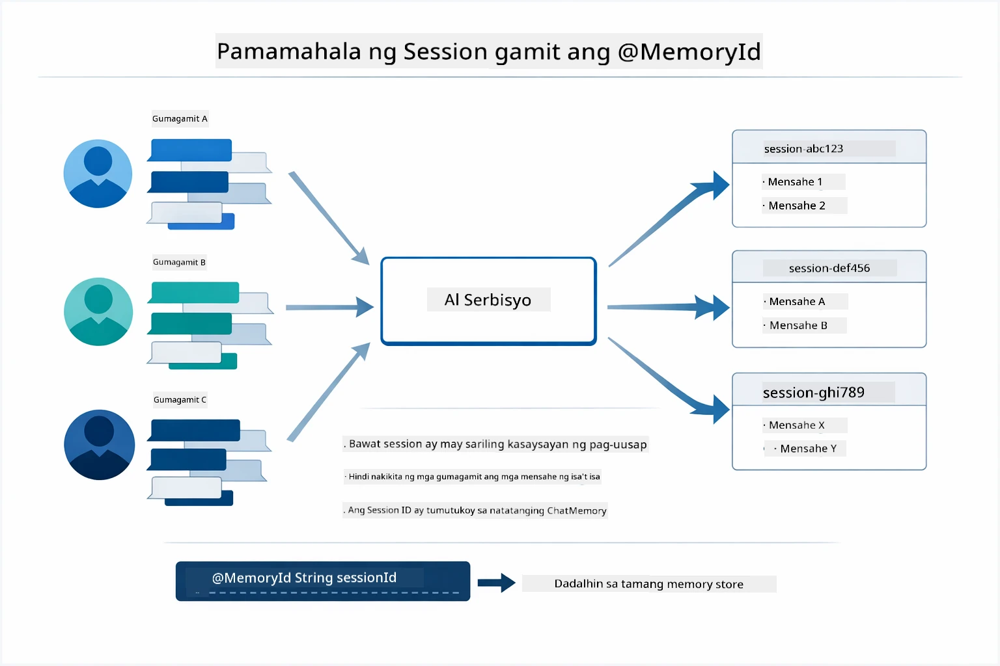

*Bawat session ID ay nagmamapa sa isang hiwalay na kasaysayan ng pag-uusap — hindi nakikita ng mga user ang mga mensahe ng isa't isa.*

### Pag-handle ng Error

Maaaring pumalya ang mga tool — mga API ay time-out, maaaring hindi wasto ang mga parametro, bumibigay ang mga panlabas na serbisyo. Nangangailangan ng pag-handle ng error ang mga production agents para maipaliwanag ng modelo ang mga problema o subukan ang mga alternatibo sa halip na mag-crash ang buong aplikasyon. Kapag nag-throw ng exception ang tool, hinahawakan ito ng LangChain4j at ibinabalik ang error message sa modelo, na maaring ipaliwanag ang problema sa natural na wika.

## Mga Available na Tool

Ipinapakita ng diagram sa ibaba ang malawak na ekosistema ng mga tool na maaari mong buuin. Ipinapakita ng module na ito ang weather at temperature tools, ngunit ang parehong `@Tool` pattern ay gumagana para sa anumang Java method — mula sa mga database query hanggang sa pagproseso ng bayad.

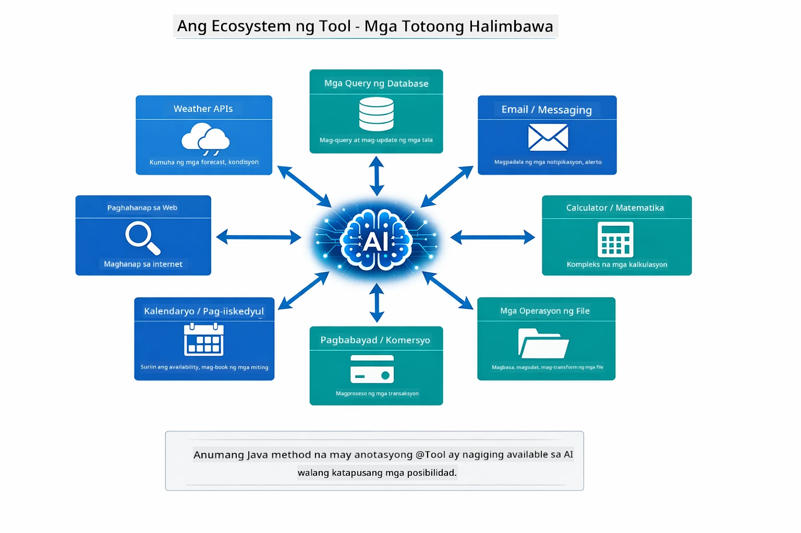

*Anumang Java method na may anotasyon na @Tool ay nagiging available sa AI — ang pattern ay nagsasaklaw sa databases, APIs, email, file operations, at iba pa.*

## Kailan Gagamit ng Tool-Based Agents

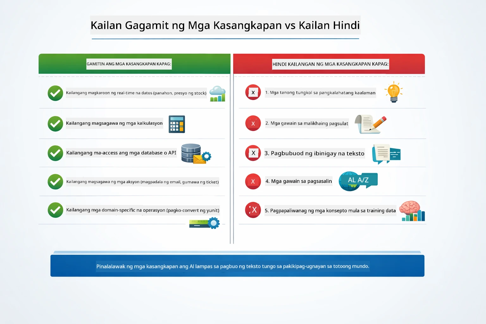

*Isang mabilis na gabay sa pagdedesisyon — ang mga tool ay para sa real-time na data, kalkulasyon, at mga aksyon; ang pangkalahatang kaalaman at malikhaing gawain ay hindi nangangailangan nito.*

**Gamitin ang mga tool kapag:**
- Ang pagsagot ay nangangailangan ng real-time na data (panahon, presyo ng stock, imbentaryo)
- Kailangang magsagawa ng kalkulasyon na higit pa sa simpleng matematika
- Pag-access sa mga database o API
- Paggawa ng mga aksyon (pagpapadala ng email, paggawa ng tickets, pag-update ng mga tala)
- Pagsasama-sama ng maraming pinagkukunan ng data

**Huwag gumamit ng mga tool kapag:**
- Ang mga tanong ay masasagot mula sa pangkalahatang kaalaman
- Ang sagot ay purong pag-uusap lang
- Ang latency ng tool ay magpapabagal ng karanasan

## Tools laban sa RAG

Parehong pinapalawak ng Modules 03 at 04 kung ano ang kaya ng AI, ngunit sa mga pangunahing magkaibang paraan. Binibigyan ng RAG ang modelo ng access sa **kaalaman** sa pamamagitan ng pagkuha ng dokumento. Binibigyan naman ng mga Tool ang modelo ng kakayahang gumawa ng **aksiyon** sa pamamagitan ng pagtawag ng mga function.

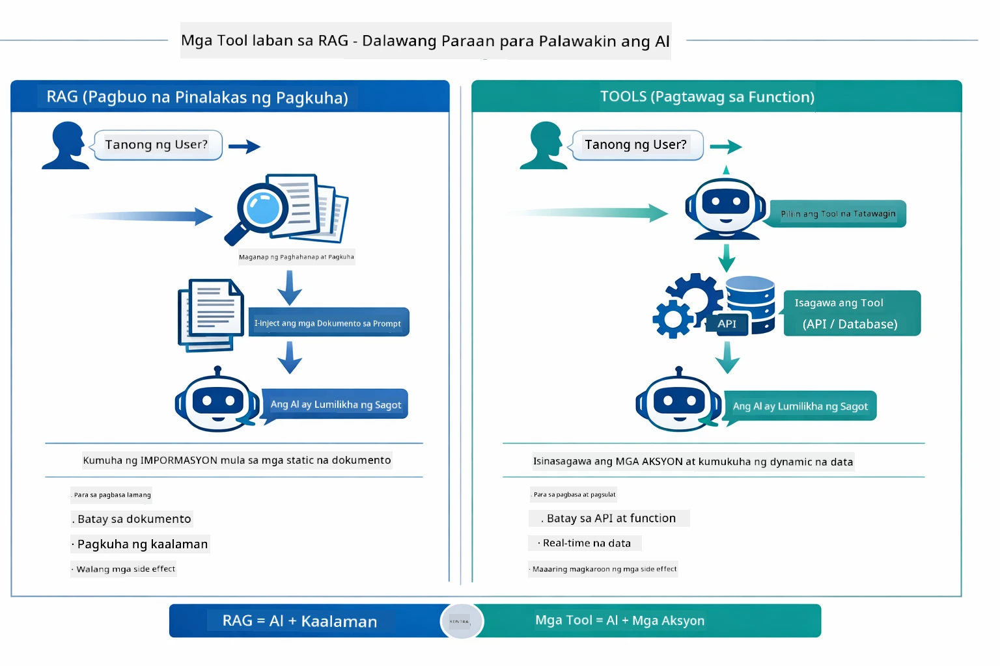

*Kinukuha ng RAG ang impormasyon mula sa static na mga dokumento — Ang mga Tool ay nagpapatupad ng mga aksyon at kumukuha ng dynamic, real-time na data. Maraming production system ang pinagsasama ang dalawa.*

Sa praktika, maraming production system ang pinagsasama ang dalawang paraan: RAG para gawing matibay ang mga sagot sa iyong dokumentasyon, at Tools para kumuha ng live na data o magsagawa ng mga operasyon.

## Mga Susunod na Hakbang

**Susunod na Module:** [05-mcp - Model Context Protocol (MCP)](../05-mcp/README.md)

---

**Navigation:** [← Nakaraang: Module 03 - RAG](../03-rag/README.md) | [Bumalik sa Main](../README.md) | [Susunod: Module 05 - MCP →](../05-mcp/README.md)

---

<!-- CO-OP TRANSLATOR DISCLAIMER START -->
**Pahayag ng Pagwawaksi**:  
Ang dokumentong ito ay isinalin gamit ang AI translation service na [Co-op Translator](https://github.com/Azure/co-op-translator). Bagamat nagsusumikap kami para sa katumpakan, pakatandaan na ang mga awtomatikong pagsasalin ay maaaring maglaman ng mga pagkakamali o hindi pagkakatugma. Ang orihinal na dokumento sa orihinal nitong wika ang dapat ituring na opisyal na sanggunian. Para sa mahahalagang impormasyon, inirerekomenda ang propesyonal na pagsasaling-tao. Hindi kami mananagot sa anumang hindi pagkakaunawaan o maling interpretasyon na maaaring magmula sa paggamit ng salin na ito.
<!-- CO-OP TRANSLATOR DISCLAIMER END -->