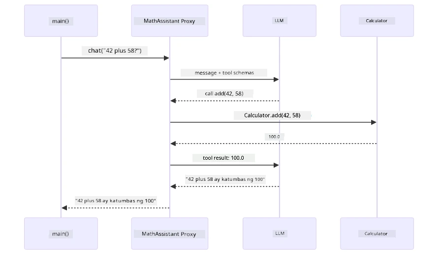
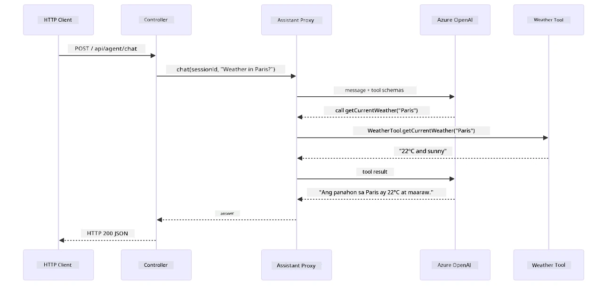

# Module 04: AI Agents with Tools

## Table of Contents

- [Video Walkthrough](../../../04-tools)
- [What You'll Learn](../../../04-tools)
- [Prerequisites](../../../04-tools)
- [Understanding AI Agents with Tools](../../../04-tools)
- [How Tool Calling Works](../../../04-tools)
  - [Tool Definitions](../../../04-tools)
  - [Decision Making](../../../04-tools)
  - [Execution](../../../04-tools)
  - [Response Generation](../../../04-tools)
  - [Architecture: Spring Boot Auto-Wiring](../../../04-tools)
- [Tool Chaining](../../../04-tools)
- [Run the Application](../../../04-tools)
- [Using the Application](../../../04-tools)
  - [Try Simple Tool Usage](../../../04-tools)
  - [Test Tool Chaining](../../../04-tools)
  - [See Conversation Flow](../../../04-tools)
  - [Experiment with Different Requests](../../../04-tools)
- [Key Concepts](../../../04-tools)
  - [ReAct Pattern (Reasoning and Acting)](../../../04-tools)
  - [Tool Descriptions Matter](../../../04-tools)
  - [Session Management](../../../04-tools)
  - [Error Handling](../../../04-tools)
- [Available Tools](../../../04-tools)
- [When to Use Tool-Based Agents](../../../04-tools)
- [Tools vs RAG](../../../04-tools)
- [Next Steps](../../../04-tools)

## Video Walkthrough

Panoorin ang live session na nagpapaliwanag kung paano magsimula gamit ang module na ito:

<a href="https://www.youtube.com/watch?v=O_J30kZc0rw"></a>

## What You'll Learn

Sa ngayon, natutunan mo kung paano makipag-usap sa AI, epektibong istraktura ng mga prompt, at ipundar ang mga tugon sa iyong mga dokumento. Ngunit may isang pangunahing limitasyon pa rin: ang mga language model ay makakalikha lang ng teksto. Hindi nila kayang suriin ang panahon, magsagawa ng mga kalkulasyon, mag-query ng mga database, o makipag-ugnayan sa mga panlabas na sistema.

Binabago ito ng mga tool. Sa pagbibigay ng access sa mga function na maaaring tawagin ng modelo, ginagawa mo itong mula sa simpleng tagalikha ng teksto na maging isang agent na makakagawa ng mga aksyon. Nagpapasiya ang modelo kung kailan kailangan nito ng isang tool, aling tool ang gagamitin, at anong mga parameter ang ipapasa. Ang iyong code ang magsasagawa ng function at ibabalik ang resulta. Kasama ng modelo ang resulta sa kanyang tugon.

## Prerequisites

- Nakatapos ng [Module 01 - Introduction](../01-introduction/README.md) (Azure OpenAI resources na na-deploy)
- Rekomendadong nakatapos na ang mga naunang module (ang module na ito ay tumutukoy sa [RAG concepts mula sa Module 03](../03-rag/README.md) sa paghahambing ng Tools vs RAG)
- `.env` file sa root directory na may Azure credentials (nilikha gamit ang `azd up` sa Module 01)

> **Note:** Kung hindi mo pa natatapos ang Module 01, sundin muna ang mga instruksyon doon sa deployment.

## Understanding AI Agents with Tools

> **📝 Note:** Ang terminong "agents" sa module na ito ay tumutukoy sa mga AI assistant na pinalakas ng mga kakayahan sa pagtawag ng tool. Iba ito sa mga **Agentic AI** pattern (autonomous agents na may planning, memory, at multi-step reasoning) na tatalakayin natin sa [Module 05: MCP](../05-mcp/README.md).

Kung walang tools, ang isang language model ay makakalikha lang ng teksto mula sa kanyang training data. Tanungin ito tungkol sa kasalukuyang panahon, at manghuhula lang ito. Bigyan ito ng mga tool, at kaya nitong tumawag ng weather API, magsagawa ng kalkulasyon, o mag-query ng database — at pagkatapos ay isasama ang mga totoong resulta sa kanyang tugon.


*Kung walang tools, ang modelo ay nanghuhula lang — sa tulong ng mga tool, kaya nitong tumawag ng mga API, magpatakbo ng kalkulasyon, at magbigay ng data sa totoong oras.*

Ang AI agent na may tools ay sumusunod sa **Reasoning and Acting (ReAct)** na pattern. Hindi lang basta sumasagot ang modelo — pinag-iisipan nito ang kailangan nito, kumikilos sa pamamagitan ng pagtawag ng tool, pinagmamasdan ang resulta, at nagpapasya kung uulit pa o magbibigay ng huling sagot:

1. **Reason** — Sinusuri ng agent ang tanong ng user at tinutukoy kung anong impormasyon ang kailangan nito
2. **Act** — Pinipili ng agent ang tamang tool, bumubuo ng tamang mga parameter, at tinatawagan ito
3. **Observe** — Natatanggap ng agent ang output ng tool at sinusuri ang resulta
4. **Repeat or Respond** — Kung kailangan pa ng dagdag na data, umaulit ang agent; kung hindi, bumubuo ng natural na wika na sagot


*Ang ReAct cycle — pinaplanuhan ng agent kung ano ang gagawin, kumikilos sa pagtawag ng tool, pinagmamasdan ang resulta, at inuulit hanggang makapagbigay ng huling sagot.*

Ito ay nangyayari nang awtomatiko. Idefine mo ang mga tools at ang kanilang mga paglalarawan. Ang modelo ang humahawak sa pagpapasya kung kailan at paano ito gagamitin.

## How Tool Calling Works

### Tool Definitions

[WeatherTool.java](../../../04-tools/src/main/java/com/example/langchain4j/agents/tools/WeatherTool.java) | [TemperatureTool.java](../../../04-tools/src/main/java/com/example/langchain4j/agents/tools/TemperatureTool.java)

Nagbibigay ka ng mga function na may malinaw na paglalarawan at espesipikasyon ng mga parameter. Nakikita ng modelo ang mga paglalarawang ito sa system prompt nito at nauunawaan kung ano ang ginagawa ng bawat tool.

```java
@Component
public class WeatherTool {
    
    @Tool("Get the current weather for a location")
    public String getCurrentWeather(@P("Location name") String location) {
        // Ang iyong lohika para sa paghahanap ng panahon
        return "Weather in " + location + ": 22°C, cloudy";
    }
}

@AiService
public interface Assistant {
    String chat(@MemoryId String sessionId, @UserMessage String message);
}

// Awtomatikong naka-wire ang Assistant ng Spring Boot gamit ang:
// - ChatModel bean
// - Lahat ng @Tool na mga metodo mula sa mga klase na may @Component
// - ChatMemoryProvider para sa pamamahala ng sesyon
```

Ang diagram sa ibaba ay nagpapakita ng bawat anotasyon at kung paano tinutulungan ng bawat bahagi ang AI na maintindihan kung kailan tatawagin ang tool at anong mga argumento ang ipapasa:


*Anatomiya ng isang definition ng tool — sinasabi ng @Tool sa AI kung kailan ito gagamitin, inilarawan ng @P ang bawat parameter, at ang @AiService ang nagsasama ng lahat sa pagsisimula.*

> **🤖 Try with [GitHub Copilot](https://github.com/features/copilot) Chat:** Buksan ang [`WeatherTool.java`](../../../04-tools/src/main/java/com/example/langchain4j/agents/tools/WeatherTool.java) at itanong:
> - "Paano ko i-integrate ang totoong weather API tulad ng OpenWeatherMap sa halip na mock data?"
> - "Ano ang bumubuo ng mahusay na paglalarawan ng tool na tumutulong sa AI na gamitin ito nang tama?"
> - "Paano ko haharapin ang mga error sa API at mga rate limit sa implementasyon ng mga tool?"

### Decision Making

Kapag nagtanong ang user ng "Ano ang panahon sa Seattle?", hindi basta random na pumipili ang modelo ng tool. Kinukumpara nito ang intensyon ng user sa bawat paglalarawan ng tool na mayroon ito, binibigay ng marka ang bawat isa base sa kaugnayan, at pinipili ang pinaka-akmang tugma. Pagkatapos ay bumubuo ito ng istrukturadong pagtawag ng function na may tamang mga parameter — sa kasong ito, itinatakda ang `location` sa `"Seattle"`.

Kung walang tool na tumutugma sa kahilingan ng user, bumabalik ang modelo sa pagsagot mula sa sariling kaalaman nito. Kung maraming tool ang tumutugma, pinipili nito ang pinaka-tukoy.


*Pinag-aaralan ng modelo ang bawat magagamit na tool laban sa intensyon ng user at pinipili ang pinakamahusay — kaya mahalaga ang pagsulat ng malinaw, tiyak na mga paglalarawan ng tool.*

### Execution

[AgentService.java](../../../04-tools/src/main/java/com/example/langchain4j/agents/service/AgentService.java)

Awtomatikong ina-wire ng Spring Boot ang deklaratibong `@AiService` interface sa lahat ng naka-rehistrong tool, at awtomatikong isinasagawa ng LangChain4j ang pagtawag ng mga tool. Sa likod ng eksena, dumadaan ang isang kompletong pagtawag ng tool sa anim na yugto — mula sa likas na tanong ng user pabalik sa likas na sagot:


*Ang buo at tuloy-tuloy na daloy — nagtatanong ang user, pumipili ang modelo ng tool, isinasagawa ng LangChain4j, at isinama ng modelo ang resulta sa natural na tugon.*

Kung pinatakbo mo ang [ToolIntegrationDemo](../../../00-quick-start/src/main/java/com/example/langchain4j/quickstart/ToolIntegrationDemo.java) sa Module 00, nakita mo na ang pattern na ito sa aksyon — ang mga `Calculator` tool ay tinawag din sa parehong paraan. Ipinapakita ng sequence diagram sa ibaba kung ano ang nangyari sa likod ng eksena noong demo na iyon:



*Ang loop ng pagtawag ng tool mula sa Quick Start demo — nagpapadala ang `AiServices` ng iyong mensahe at tool schemas sa LLM, sumasagot ang LLM gamit ang function call na tulad ng `add(42, 58)`, isinasagawa ng LangChain4j ang `Calculator` method locally, at ibinabalik ang resulta para sa huling sagot.*

> **🤖 Try with [GitHub Copilot](https://github.com/features/copilot) Chat:** Buksan ang [`AgentService.java`](../../../04-tools/src/main/java/com/example/langchain4j/agents/service/AgentService.java) at itanong:
> - "Paano gumagana ang ReAct pattern at bakit ito epektibo para sa mga AI agent?"
> - "Paano nagpapasya ang agent kung aling tool ang gagamitin at sa anong ayos?"
> - "Ano ang nangyayari kung pumalya ang pagtawag ng tool - paano ko dapat mahawakang mabuti ang mga error?"

### Response Generation

Natanggap ng modelo ang datos ng panahon at inilalatag ito sa natural na tugon para sa user.

### Architecture: Spring Boot Auto-Wiring

Gamit ang module na ito ang LangChain4j na integrasyon sa Spring Boot gamit ang deklaratibong `@AiService` interfaces. Sa pagsisimula, nadidiskubre ng Spring Boot ang bawat `@Component` na may mga `@Tool` method, ang iyong `ChatModel` bean, at ang `ChatMemoryProvider` — pagkatapos ay awtomatikong pinag-iisa ang mga ito sa isang `Assistant` interface na walang kailangang boilerplate.


*Pinagsasama-sama ng interface na @AiService ang ChatModel, mga component ng tool, at memory provider — pinangangasiwaan ng Spring Boot ang wiring nang awtomatiko.*

Narito ang buong siklo ng request bilang sequence diagram — mula sa HTTP request papunta sa controller, service, at auto-wired proxy, hanggang sa pagtawag ng tool at pabalik:



*Ang kumpletong siklo ng request sa Spring Boot — dumadaloy ang HTTP request sa controller at service patungo sa auto-wired Assistant proxy, na awtomatikong pinamamahalaan ang LLM at pagtawag ng mga tool.*

Mga pangunahing benepisyo ng ganitong approach:

- **Spring Boot auto-wiring** — Awtomatikong ini-inject ang ChatModel at mga tool
- **@MemoryId pattern** — Awtomatikong session-based memory management
- **Single instance** — Ang Assistant ay nilikha minsan lang at muling ginagamit para sa mas mahusay na performance
- **Type-safe execution** — Direktang pagtawag sa mga Java method na may type conversion
- **Multi-turn orchestration** — Awtomatikong humahawak sa tool chaining
- **Zero boilerplate** — Walang mano-manong `AiServices.builder()` na tawag o memory HashMap

Ang mga alternatibong paraan (manu-manong `AiServices.builder()`) ay nangangailangan ng mas maraming code at nawawala ang benepisyo ng Spring Boot integration.

## Tool Chaining

**Tool Chaining** — Ang tunay na kapangyarihan ng mga agent na gumamit ng tool ay nakikita kapag ang isang tanong ay nangangailangan ng maraming tool. Tanungin "Ano ang panahon sa Seattle sa Fahrenheit?" at ang agent ay awtomatikong magkakabit ng dalawang tool: una nitong tinatawagan ang `getCurrentWeather` upang makuha ang temperatura sa Celsius, pagkatapos ay ipinapasa ang value na ito sa `celsiusToFahrenheit` para sa conversion — lahat sa isang pag-usap lang.


*Tool chaining na gumagana — tinatawagan ng agent ang getCurrentWeather muna, pagkatapos ipinasok ang Celsius na resulta sa celsiusToFahrenheit, at nagbigay ng pinagsamang sagot.*

**Graceful Failures** — Humiling ng panahon sa isang lungsod na wala sa mock data. Ibinabalik ng tool ang mensahe ng error, at ipinaliwanag ng AI na hindi ito makakatulong sa halip na mag-crash. Ligtas ang pagpalya ng mga tool. Ipinapakita ng diagram sa ibaba ang kaibahan ng dalawang approach — sa tamang paghawak ng error, nahuhuli ng agent ang exception at tumutugon nang maayos, habang kung wala ito ay magka-crash ang buong application:


*Kapag pumalya ang tool, nahuhuli ng agent ang error at tumutugon nang makatulong sa halip na mag-crash.*

Nangyayari ito sa isang pag-uusap lang. Awtonomo ang agent sa pag-organisa ng maraming pagtawag ng tool.

## Run the Application

**Patunayan ang deployment:**

Siguraduhin na may `.env` file sa root directory na may Azure credentials (nilikha sa panahon ng Module 01). Patakbuhin ito mula sa module directory (`04-tools/`):

**Bash:**
```bash
cat ../.env  # Dapat ipakita ang AZURE_OPENAI_ENDPOINT, API_KEY, DEPLOYMENT
```

**PowerShell:**
```powershell
Get-Content ..\.env  # Dapat ipakita ang AZURE_OPENAI_ENDPOINT, API_KEY, DEPLOYMENT
```

**Simulan ang application:**

> **Note:** Kung sinimulan mo na ang lahat ng applications gamit ang `./start-all.sh` mula sa root directory (ayon sa Module 01), tumatakbo na ang module na ito sa port 8084. Maaari mong laktawan ang mga start command sa ibaba at pumunta agad sa http://localhost:8084.

**Option 1: Paggamit ng Spring Boot Dashboard (Recommended para sa mga gumagamit ng VS Code)**

Kasama sa dev container ang Spring Boot Dashboard extension, na naglalaman ng visual na interface upang pamahalaan ang lahat ng Spring Boot applications. Makikita mo ito sa Activity Bar sa kaliwang bahagi ng VS Code (hanapin ang icon ng Spring Boot).

Mula sa Spring Boot Dashboard, maaari mong:
- Tingnan ang lahat ng magagamit na Spring Boot applications sa workspace
- Simulan/hinto ang applications gamit ang isang click lang
- Tingnan ang mga log ng application nang real-time
- Subaybayan ang status ng application
Pindutin lamang ang play button sa tabi ng "tools" para simulan ang modyul na ito, o simulan lahat ng modyul nang sabay-sabay.

Ganito ang hitsura ng Spring Boot Dashboard sa VS Code:


*Ang Spring Boot Dashboard sa VS Code — simulan, ihinto, at bantayan ang lahat ng mga modyul mula sa iisang lugar*

**Opsyon 2: Paggamit ng shell scripts**

Simulan lahat ng web application (mga modyul 01-04):

**Bash:**
```bash
cd ..  # Mula sa root na direktoryo
./start-all.sh
```

**PowerShell:**
```powershell
cd ..  # Mula sa ugat na direktoryo
.\start-all.ps1
```

O simulan lamang ang modyul na ito:

**Bash:**
```bash
cd 04-tools
./start.sh
```

**PowerShell:**
```powershell
cd 04-tools
.\start.ps1
```

Awtomatikong niloload ng parehong mga script ang mga environment variable mula sa root `.env` file at gagawin ang mga JAR kung hindi pa ito umiiral.

> **Tandaan:** Kung gusto mong manually na gawin ang lahat ng mga modyul bago simulan:
>
> **Bash:**
> ```bash
> cd ..  # Go to root directory
> mvn clean package -DskipTests
> ```
>
> **PowerShell:**
> ```powershell
> cd ..  # Go to root directory
> mvn clean package -DskipTests
> ```

Buksan ang http://localhost:8084 sa iyong browser.

**Para ihinto:**

**Bash:**
```bash
./stop.sh  # Ang modulong ito lamang
# O
cd .. && ./stop-all.sh  # Lahat ng mga module
```

**PowerShell:**
```powershell
.\stop.ps1  # Ang modulong ito lamang
# O
cd ..; .\stop-all.ps1  # Lahat ng mga module
```

## Paggamit ng Aplikasyon

Nagbibigay ang aplikasyon ng web interface kung saan maaari kang makipag-ugnayan sa isang AI agent na may access sa mga tool para sa panahon at pagtanggap ng temperatura. Ganito ang hitsura ng interface — kasama dito ang mga mabilisang halimbawa at panel ng chat para magpadala ng mga kahilingan:

<a href="images/tools-homepage.png"></a>

*Ang interface ng AI Agent Tools - mabilisang mga halimbawa at chat interface para makipag-ugnayan sa mga tool*

### Subukan ang Simpleng Paggamit ng Tool

Magsimula sa isang tuwirang kahilingan: "Convert 100 degrees Fahrenheit to Celsius". Nakikilala ng agent na kailangan nito ang tool para sa pagtanggap ng temperatura, tinatawag ito gamit ang tamang mga parameter, at ibinabalik ang resulta. Pansinin kung gaano ito naiintindihan nang natural — hindi mo kailangang sabihin kung aling tool ang gagamitin o paano ito tatawagin.

### Subukan ang Pagsunod-sunod ng Tool

Ngayon subukan ang mas kumplikadong bagay: "What's the weather in Seattle and convert it to Fahrenheit?" Panoorin ang agent habang ginagawa ito nang paunti-unti. Una nitong kukunin ang panahon (na nagbabalik ng Celsius), nakikilala na kailangan pang i-convert sa Fahrenheit, tinatawag ang conversion tool, at pinagsasama ang parehong resulta sa isang tugon.

### Tingnan ang Daloy ng Usapan

Pinapanatili ng chat interface ang kasaysayan ng usapan, kaya maaari kang magkaroon ng multi-turn interactions. Makikita mo ang lahat ng mga nakaraang tanong at tugon, na nagpapadali upang subaybayan ang usapan at maintindihan kung paano bumubuo ng konteksto ang agent sa maraming palitan.

<a href="images/tools-conversation-demo.png"></a>

*Multi-turn na usapan na nagpapakita ng simpleng conversions, pagtingin ng panahon, at pagsunod-sunod ng tool*

### Magsagawa ng Mga Iba't Ibang Kahilingan

Subukan ang iba't ibang kombinasyon:
- Pagtingin ng panahon: "What's the weather in Tokyo?"
- Pagtanggap ng temperatura: "What is 25°C in Kelvin?"
- Pinagsamang mga tanong: "Check the weather in Paris and tell me if it's above 20°C"

Pansinin kung paano binibigyang-kahulugan ng agent ang natural na wika at inaakma ito sa angkop na mga tawag sa tool.

## Pangunahing Mga Konsepto

### ReAct Pattern (Pangangatwiran at Pagkilos)

Ang agent ay nagpapalit-palit sa pagitan ng pangangatwiran (pagpapasya kung ano ang gagawin) at pagkilos (paggamit ng mga tool). Pinapayagan ng pattern na ito ang autonomosong paglutas ng problema kaysa sa simpleng pagsunod sa mga utos.

### Mahalaga ang Paglalarawan ng Tool

Direktang naaapektuhan ng kalidad ng iyong paglalarawan ng tool kung gaano ito kahusay nagagamit ng agent. Ang malinaw at espesipikong paglalarawan ay tumutulong sa modelo na maintindihan kung kailan at paano tatawagin ang bawat tool.

### Pamamahala ng Session

Pinapagana ng `@MemoryId` annotation ang awtomatikong pamamahala ng memorya batay sa session. Bawat session ID ay may sarili nitong `ChatMemory` instance na pinamamahalaan ng `ChatMemoryProvider` bean, kaya maaaring makipag-ugnayan ang maraming gumagamit sa agent nang sabay nang hindi nagkakahalo ang kanilang mga usapan. Ipinapakita ng sumusunod na diagram kung paano ang maraming gumagamit ay naka-route sa hiwalay na mga memory store base sa kanilang session ID:


*Bawat session ID ay naka-map sa isang hiwalay na kasaysayan ng usapan — hindi kailanman nakikita ng mga gumagamit ang mga mensahe ng isa't isa.*

### Paghawak ng Mga Error

Maaaring mag-fail ang mga tool — timeout ang mga API, maaaring hindi wasto ang mga parameter, maaaring bumagsak ang mga external na serbisyo. Kailangan ng production agents ng paghawak ng error para maipaliwanag ng modelo ang mga problema o subukan ang mga alternatibo sa halip na mag-crash ang buong aplikasyon. Kapag may nag-throw ng exception ang isang tool, sinalo ito ng LangChain4j at ipinapasa ang mensahe ng error pabalik sa modelo, na maaari nang ipaliwanag ang problema sa natural na wika.

## Mga Magagamit na Tool

Ipinapakita sa diagram sa ibaba ang malawak na ekosistema ng mga tool na maaari mong gawin. Pinapakita ng modyul na ito ang mga tool para sa panahon at temperatura, ngunit ang parehong `@Tool` pattern ay gumagana para sa anumang Java method — mula sa mga database queries hanggang sa pagproseso ng bayad.


*Anumang Java method na may annotation na @Tool ay magiging magagamit sa AI — ang pattern ay umaabot sa databases, APIs, email, operasyon ng file, at iba pa.*

## Kailan Gumamit ng Tool-Based Agents

Hindi lahat ng kahilingan ay kailangan ng mga tool. Ang pagpapasya ay nakasalalay kung kailangan bang makipag-ugnayan ang AI sa mga external na sistema o kaya'y makasagot mula sa sariling kaalaman. Inilalahad ng sumusunod na gabay kung kailan may halaga ang mga tool at kailan ito hindi kailangan:


*Isang mabilis na gabay sa pagpapasya — ang mga tool ay para sa real-time na datos, kalkulasyon, at mga aksyon; ang pangkalahatang kaalaman at malikhaing gawain ay hindi nangangailangan nito.*

## Tools kumpara sa RAG

Ang mga Modyul 03 at 04 ay parehong nagpapalawak ng kaya ng AI, ngunit sa magkaibang pamamaraan. Binibigyan ng RAG ang modelo ng access sa **kaalaman** sa pamamagitan ng pagkuha ng mga dokumento. Binibigyan naman ng Tools ang modelo ng kakayahang gumawa ng mga **aksiyon** sa pamamagitan ng pagtawag ng mga function. Ikinukumpara ng diagram sa ibaba ang dalawang approach na ito sa tabi-tabi — mula sa kung paano gumagana ang bawat workflow hanggang sa mga trade-off sa pagitan nila:


*Kinukuha ng RAG ang impormasyon mula sa mga static na dokumento — Ang Tools ay gumaganap ng mga aksyon at kumukuha ng dynamic, real-time na datos. Pinagsasama ng maraming production system ang dalawa.*

Sa praktika, maraming production system ang pinagsasama ang dalawang approach: RAG para sa pagbatay ng mga sagot sa iyong dokumentasyon, at Tools para sa pagkuha ng live na datos o pagsasagawa ng mga operasyon.

## Mga Susunod na Hakbang

**Susunod na Modyul:** [05-mcp - Model Context Protocol (MCP)](../05-mcp/README.md)

---

**Navigation:** [← Nakaraan: Modyul 03 - RAG](../03-rag/README.md) | [Bumalik sa Main](../README.md) | [Susunod: Modyul 05 - MCP →](../05-mcp/README.md)

---

<!-- CO-OP TRANSLATOR DISCLAIMER START -->
**Pagsasalin ng Paunawa**:  
Ang dokumentong ito ay isinalin gamit ang AI na serbisyo sa pagsasalin na [Co-op Translator](https://github.com/Azure/co-op-translator). Bagamat aming pinagsisikapan ang katumpakan, mangyaring tandaan na ang mga awtomatikong pagsasalin ay maaaring maglaman ng mga pagkakamali o di-tiyak na mga impormasyon. Ang orihinal na dokumento sa orihinal nitong wika ang dapat ituring na pinaka-tiwalaang sanggunian. Para sa mahalagang impormasyon, inirerekomenda ang propesyonal na pagsasalin ng tao. Hindi kami mananagot sa anumang hindi pagkakaunawaan o maling interpretasyon na maaaring magmula sa paggamit ng pagsasaling ito.
<!-- CO-OP TRANSLATOR DISCLAIMER END -->