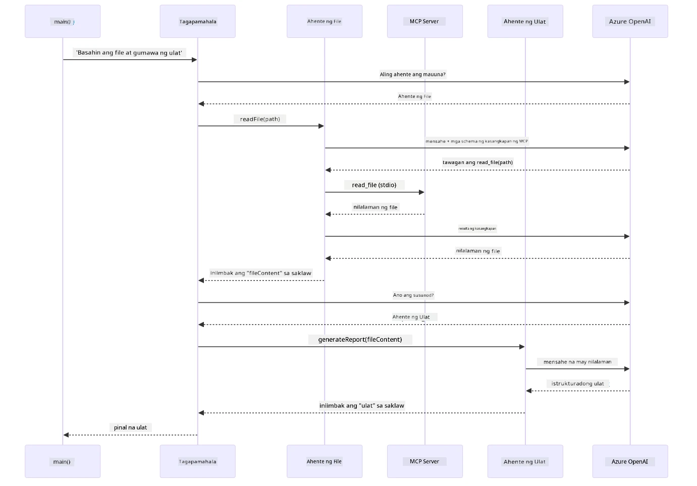

# Module 05: Model Context Protocol (MCP)

## Table of Contents

- [Ano ang Matututunan Mo](../../../05-mcp)
- [Ano ang MCP?](../../../05-mcp)
- [Paano Gumagana ang MCP](../../../05-mcp)
- [Ang Agentic Module](../../../05-mcp)
- [Pagpapatakbo ng mga Halimbawa](../../../05-mcp)
  - [Mga Kinakailangan](../../../05-mcp)
- [Mabilisang Pagsisimula](../../../05-mcp)
  - [Mga Operasyon sa File (Stdio)](../../../05-mcp)
  - [Supervisor Agent](../../../05-mcp)
    - [Pagpapatakbo ng Demo](../../../05-mcp)
    - [Paano Gumagana ang Supervisor](../../../05-mcp)
    - [Paano Natutuklasan ng FileAgent ang mga MCP Tool sa Runtime](../../../05-mcp)
    - [Mga Estratehiya ng Tugon](../../../05-mcp)
    - [Pag-unawa sa Output](../../../05-mcp)
    - [Paliwanag sa mga Tampok ng Agentic Module](../../../05-mcp)
- [Mga Pangunahing Konsepto](../../../05-mcp)
- [Binabati kita!](../../../05-mcp)
  - [Ano ang Susunod?](../../../05-mcp)

## Ano ang Matututunan Mo

Nakabuo ka na ng conversational AI, na-master ang prompts, na-ugat ang mga sagot sa mga dokumento, at nakalikha ng mga ahente na may mga tool. Ngunit lahat ng mga tool na iyon ay custom-built para sa iyong partikular na aplikasyon. Paano kung maaari mong bigyan ang iyong AI ng access sa isang standardized na ecosystem ng mga tool na maaaring likhain at ibahagi ng sinuman? Sa module na ito, matututuhan mo kung paano gawin iyon gamit ang Model Context Protocol (MCP) at agentic module ng LangChain4j. Una naming ipapakita ang isang simpleng MCP file reader at pagkatapos ay ipapakita kung paano ito madaling integrar sa advanced na mga agentic workflows gamit ang Supervisor Agent pattern.

## Ano ang MCP?

Ang Model Context Protocol (MCP) ay nagbibigay ng eksaktong iyon - isang standard na paraan para sa mga AI application upang matuklasan at magamit ang mga external na tool. Sa halip na sumulat ng custom integration para sa bawat data source o serbisyo, nakakonekta ka sa mga MCP server na nagpapakita ng kanilang mga kakayahan sa isang consistent na format. Ang iyong AI agent ay maaaring awtomatikong matuklasan at magamit ang mga tool na ito.

Ipinapakita ng diagram sa ibaba ang pagkakaiba — walang MCP, bawat integration ay nangangailangan ng custom point-to-point wiring; gamit ang MCP, isang protocol lang ang nagkokonekta sa iyong app sa anumang tool:


*Bago ang MCP: Kumplikadong point-to-point na mga integration. Pagkatapos ng MCP: Isang protocol, walang katapusang posibilidad.*

Nilulutas ng MCP ang isang pangunahing problema sa pag-develop ng AI: bawat integration ay custom. Gusto mong ma-access ang GitHub? Custom na code. Gusto mong magbasa ng mga file? Custom na code. Gusto mong mag-query ng database? Custom na code. At wala sa mga integration na ito ang gumagana sa iba pang mga AI application.

Pinapantayan ng MCP ito. Isang MCP server ang nagpapakita ng mga tool na may malinaw na mga paglalarawan at schema. Anumang MCP client ay maaaring kumonekta, matuklasan ang mga available na tool, at gamitin ang mga ito. Build one, use everywhere.

Ipinapakita ng diagram sa ibaba ang arkitekturang ito — isang MCP client (ang iyong AI application) ang nakakonekta sa maraming MCP server, bawat isa ay nagpapakita ng sarili nitong set ng mga tool sa pamamagitan ng standard protocol:


*Arkitektura ng Model Context Protocol - standardized tool discovery at execution*

## Paano Gumagana ang MCP

Sa ilalim, gumagamit ang MCP ng layered architecture. Ang iyong Java application (ang MCP client) ay natutuklasan ang mga available na tool, nagpapadala ng mga JSON-RPC na request sa pamamagitan ng transport layer (Stdio o HTTP), at ang MCP server ay nagpapatupad ng mga operasyon at nagbabalik ng resulta. Ipinapakita ng sumusunod na diagram ang bawat layer ng protocol na ito:


*Paano gumagana ang MCP sa ilalim — natutuklasan ng mga client ang mga tool, nagpapalitan ng JSON-RPC na mga mensahe, at nagpapatupad ng mga operasyon sa pamamagitan ng transport layer.*

**Arkitekturang Server-Client**

Gumagamit ang MCP ng client-server na modelo. Ang mga server ay nagbibigay ng mga tool - pagbabasa ng mga file, pag-query sa mga database, pagtawag ng APIs. Ang mga client (ang iyong AI application) ay nakakonekta sa mga server at ginagamit ang kanilang mga tool.

Para gamitin ang MCP sa LangChain4j, idagdag ang Maven dependency na ito:

```xml
<dependency>
    <groupId>dev.langchain4j</groupId>
    <artifactId>langchain4j-mcp</artifactId>
    <version>${langchain4j.version}</version>
</dependency>
```

**Pagdiskubre ng Tool**

Kapag kumonekta ang iyong client sa MCP server, tinatanong nito "Anong mga tool ang meron kayo?" Sumagot ang server ng listahan ng mga available na tool, bawat isa ay may mga paglalarawan at schema ng mga parameter. Ang iyong AI agent ay maaaring magdesisyon kung aling tool ang gagamitin base sa mga hiling ng user. Ipinapakita ng diagram sa ibaba ang handshake na ito — nagpadala ang client ng `tools/list` request at bumalik ang server sa mga available nitong tool na may paglalarawan at schema ng parameter:


*Natuklasan ng AI ang mga available na tool sa pagsisimula — ngayon ay alam na nito kung anong mga kakayahan ang available at maaaring magdesisyon kung alin ang gagamitin.*

**Mga Mekanismo ng Transport**

Sinusuportahan ng MCP ang iba't ibang mekanismo ng transport. Ang dalawang opsyon ay Stdio (para sa lokal na komunikasyon ng subprocess) at Streamable HTTP (para sa mga remote na server). Ipinapakita ng module na ito ang Stdio transport:


*Mekanismo ng transport ng MCP: HTTP para sa mga remote server, Stdio para sa mga lokal na proseso*

**Stdio** - [StdioTransportDemo.java](../../../05-mcp/src/main/java/com/example/langchain4j/mcp/StdioTransportDemo.java)

Para sa mga lokal na proseso. Nagpapasimula ang iyong application ng server bilang subprocess at nakikipag-ugnayan sa pamamagitan ng standard input/output. Kapaki-pakinabang para sa akses sa filesystem o mga command-line tool.

```java
McpTransport stdioTransport = new StdioMcpTransport.Builder()
    .command(List.of(
        npmCmd, "exec",
        "@modelcontextprotocol/server-filesystem@2025.12.18",
        resourcesDir
    ))
    .logEvents(false)
    .build();
```

Ang `@modelcontextprotocol/server-filesystem` na server ay nagpapakita ng mga sumusunod na tool, lahat ay sandboxed sa mga direktoryo na iyong tinukoy:

| Tool | Paglalarawan |
|------|--------------|
| `read_file` | Basahin ang nilalaman ng isang file |
| `read_multiple_files` | Basahin ang maraming file sa isang tawag |
| `write_file` | Gumawa o lampasan ang isang file |
| `edit_file` | Gawing targeted ang find-and-replace na mga edit |
| `list_directory` | Ilista ang mga file at direktoryo sa isang path |
| `search_files` | Recursive na hanapin ang mga file na tumutugma sa pattern |
| `get_file_info` | Kunin ang metadata ng file (laki, timestamps, mga permiso) |
| `create_directory` | Gumawa ng direktoryo (kasama ang mga parent directory) |
| `move_file` | Ilipat o palitan ang pangalan ng isang file o direktoryo |

Ipinapakita ng sumusunod na diagram kung paano gumagana ang Stdio transport sa runtime — nagpapasimula ang iyong Java application ng MCP server bilang child process at nakikipag-ugnayan sila sa pamamagitan ng stdin/stdout pipes, walang network o HTTP na kasama:


*Pagpapatakbo ng Stdio transport — nagpapasimula ang iyong application ng MCP server bilang child process at nakikipag-ugnayan sa pamamagitan ng stdin/stdout pipes.*

> **🤖 Subukan gamit ang [GitHub Copilot](https://github.com/features/copilot) Chat:** Buksan ang [`StdioTransportDemo.java`](../../../05-mcp/src/main/java/com/example/langchain4j/mcp/StdioTransportDemo.java) at itanong:
> - "Paano gumagana ang Stdio transport at kailan ko ito gagamitin kumpara sa HTTP?"
> - "Paano pinamamahalaan ng LangChain4j ang lifecycle ng mga spawned MCP server process?"
> - "Ano ang mga implikasyon sa seguridad ng pagbibigay ng AI ng akses sa file system?"

## Ang Agentic Module

Habang nagbibigay ang MCP ng standardized na mga tool, ang **agentic module** ng LangChain4j ay nagbibigay ng isang deklaratibong paraan para bumuo ng mga ahente na nag-orchestrate ng mga tool na iyon. Pinapagana ka ng `@Agent` annotation at `AgenticServices` na tukuyin ang pag-uugali ng agent sa pamamagitan ng mga interface sa halip na imperative na code.

Sa module na ito, i-eeksplora mo ang **Supervisor Agent** pattern — isang advanced na agentic AI na paraan kung saan ang isang "supervisor" agent ay dinamiko na nagpapasya kung aling mga sub-agent ang tatawagin base sa mga hiling ng user. Pagsasamahin natin ang dalawang konseptong ito sa pamamagitan ng pagbibigay sa isa sa ating mga sub-agent ng MCP-powered na kakayahan sa pag-access ng file.

Para gamitin ang agentic module, idagdag ang Maven dependency na ito:

```xml
<dependency>
    <groupId>dev.langchain4j</groupId>
    <artifactId>langchain4j-agentic</artifactId>
    <version>${langchain4j.mcp.version}</version>
</dependency>
```
> **Tandaan:** Ginagamit ng `langchain4j-agentic` module ang hiwalay na bersyon na property (`langchain4j.mcp.version`) dahil ito ay inilalabas sa ibang iskedyul kumpara sa core LangChain4j libraries.

> **⚠️ Eksperimental:** Ang `langchain4j-agentic` module ay **eksperimental** at maaaring magbago. Ang matatag na paraan para bumuo ng AI assistants ay ang `langchain4j-core` kasama ang custom tools (Module 04).

## Pagpapatakbo ng mga Halimbawa

### Mga Kinakailangan

- Nakumpleto ang [Module 04 - Tools](../04-tools/README.md) (ang module na ito ay nakabase sa mga konsepto ng custom tool at ikinumpara ang mga ito sa MCP tools)
- `.env` file sa root directory na may Azure credentials (nilikha ng `azd up` sa Module 01)
- Java 21+, Maven 3.9+
- Node.js 16+ at npm (para sa mga MCP server)

> **Tandaan:** Kung hindi mo pa naitakda ang iyong environment variables, tingnan ang [Module 01 - Introduction](../01-introduction/README.md) para sa mga tagubilin sa deployment (`azd up` ang awtomatikong lumilikha ng `.env` file), o kopyahin lang ang `.env.example` papuntang `.env` sa root directory at punan ang iyong mga halaga.

## Mabilisang Pagsisimula

**Gamit ang VS Code:** I-right-click lang ang kahit anong demo file sa Explorer at piliin ang **"Run Java"**, o gamitin ang launch configurations mula sa Run and Debug panel (siguraduhing nakakonfigura muna ang iyong `.env` file na may Azure credentials).

**Gamit ang Maven:** Bilang alternatibo, maaari mong patakbuhin ito mula sa command line gamit ang mga halimbawa sa ibaba.

### Mga Operasyon sa File (Stdio)

Ipinapakita nito ang mga tool na batay sa lokal na subprocess.

**✅ Walang kinakailangang prerequisites** - ang MCP server ay awtomatikong pinapasimulan.

**Gamit ang Start Scripts (Inirerekomenda):**

Awtomatikong niloload ng start scripts ang mga environment variable mula sa root `.env` file:

**Bash:**
```bash
cd 05-mcp
chmod +x start-stdio.sh
./start-stdio.sh
```

**PowerShell:**
```powershell
cd 05-mcp
.\start-stdio.ps1
```

**Gamit ang VS Code:** I-right-click ang `StdioTransportDemo.java` at piliin ang **"Run Java"** (siguraduhing naka-configure ang iyong `.env` file).

Ang application ay awtomatikong nagpapasimula ng MCP filesystem server at nagbabasa ng lokal na file. Pansinin kung paano inaasikaso ang subprocess management para sa iyo.

**Inaasahang output:**
```
Assistant response: The file provides an overview of LangChain4j, an open-source Java library
for integrating Large Language Models (LLMs) into Java applications...
```

### Supervisor Agent

Ang **Supervisor Agent pattern** ay isang **flexible** na anyo ng agentic AI. Gumagamit ang Supervisor ng LLM upang awtomatikong magpasya kung aling mga agent ang tatawagin base sa hiling ng user. Sa susunod na halimbawa, pagsasamahin natin ang MCP-powered na pag-access sa file kasama ang isang LLM agent upang bumuo ng isang supervised na workflow mula file reading → paggawa ng ulat.

Sa demo, binabasa ng `FileAgent` ang isang file gamit ang MCP filesystem tools, at gumagawa ang `ReportAgent` ng isang istrukturadong ulat na may executive summary (1 pangungusap), 3 mahahalagang punto, at mga rekomendasyon. Awtomatikong pinapangasiwaan ng Supervisor ang daloy na ito:


*Ginagamit ng Supervisor ang LLM nito upang magpasya kung aling mga agent ang tatawagin at sa anong pagkakasunod — hindi na kailangan ng hardcoded routing.*

Ganito ang hitsura ng konkretong workflow para sa ating file-to-report pipeline:


*Binabasa ng FileAgent ang file gamit ang MCP tools, pagkatapos ay ini-transform ni ReportAgent ang raw content sa isang istrukturadong ulat.*

Ipinapakita ng sumusunod na sequence diagram ang buong orchestration ng Supervisor — mula sa pagsisimula ng MCP server, sa autonomous na pagpili ng mga agent ng Supervisor, hanggang sa pagtawag sa mga tool sa pamamagitan ng stdio at ang huling ulat:



*Awtomatikong tinatawag ng Supervisor ang FileAgent (na tumatawag sa MCP server sa pamamagitan ng stdio para basahin ang file), pagkatapos ay tinatawag ang ReportAgent upang gumawa ng istrukturadong ulat — bawat agent ay nagtatabi ng output sa shared na Agentic Scope.*

Nagtatabi ang bawat agent ng output nito sa **Agentic Scope** (shared memory), na nagpapahintulot sa mga downstream agent na ma-access ang mga naunang resulta. Ipinapakita nito kung paano seamless na naiintegrate ang MCP tools sa agentic workflows — hindi kailangan ng Supervisor na malaman *paano* binabasa ang mga file, ang mahalaga ay kaya ito gawin ng `FileAgent`.

#### Pagpapatakbo ng Demo

Awtomatikong niloload ng start scripts ang mga environment variable mula sa root `.env` file:

**Bash:**
```bash
cd 05-mcp
chmod +x start-supervisor.sh
./start-supervisor.sh
```

**PowerShell:**
```powershell
cd 05-mcp
.\start-supervisor.ps1
```

**Gamit ang VS Code:** I-right-click ang `SupervisorAgentDemo.java` at piliin ang **"Run Java"** (siguraduhing naka-configure ang iyong `.env` file).

#### Paano Gumagana ang Supervisor

Bago gumawa ng mga agent, kailangan mong ikonekta ang MCP transport sa isang client at balutin ito bilang isang `ToolProvider`. Ganito nagiging available ang mga tool ng MCP server sa iyong mga agent:

```java
// Gumawa ng MCP client mula sa transport
McpClient mcpClient = new DefaultMcpClient.Builder()
        .transport(stdioTransport)
        .build();

// Balutin ang client bilang isang ToolProvider — ito ay nag-uugnay ng mga MCP tool sa LangChain4j
ToolProvider mcpToolProvider = McpToolProvider.builder()
        .mcpClients(List.of(mcpClient))
        .build();
```

Ngayon, maaari mong i-inject ang `mcpToolProvider` sa anumang agent na nangangailangan ng MCP tools:

```java
// Hakbang 1: Nagbabasa ang FileAgent ng mga file gamit ang mga MCP tool
FileAgent fileAgent = AgenticServices.agentBuilder(FileAgent.class)
        .chatModel(model)
        .toolProvider(mcpToolProvider)  // May mga MCP tool para sa mga operasyon sa file
        .build();

// Hakbang 2: Naggagawa ang ReportAgent ng mga istrakturadong ulat
ReportAgent reportAgent = AgenticServices.agentBuilder(ReportAgent.class)
        .chatModel(model)
        .build();

// Pinamamahalaan ng Supervisor ang workflow mula file patungong ulat
SupervisorAgent supervisor = AgenticServices.supervisorBuilder()
        .chatModel(model)
        .subAgents(fileAgent, reportAgent)
        .responseStrategy(SupervisorResponseStrategy.LAST)  // Ibalik ang panghuling ulat
        .build();

// Ang Supervisor ang nagdedesisyon kung aling mga ahente ang tatawagin base sa kahilingan
String response = supervisor.invoke("Read the file at /path/file.txt and generate a report");
```

#### Paano Natutuklasan ng FileAgent ang mga MCP Tool sa Runtime

Maaari mong itanong: **paano nalalaman ng `FileAgent` kung paano gamitin ang npm filesystem tools?** Ang sagot ay hindi nito alam iyon — ang **LLM** ang nagtutukoy nito sa runtime sa pamamagitan ng mga tool schema.

Ang interface ng `FileAgent` ay isang **prompt definition** lang. Wala itong hardcoded na kaalaman tungkol sa `read_file`, `list_directory`, o anumang iba pang MCP tool. Ganito ang nangyayari mula simula hanggang dulo:
1. **Pagsisimula ng Server:** Ang `StdioMcpTransport` ay nagpapalunsad ng `@modelcontextprotocol/server-filesystem` npm package bilang isang child process  
2. **Pagdiskubre ng Kasangkapan:** Ang `McpClient` ay nagpapadala ng `tools/list` JSON-RPC na kahilingan sa server, na sumasagot gamit ang mga pangalan ng kasangkapan, mga paglalarawan, at mga parameter schema (hal., `read_file` — *"Basahin ang kompletong nilalaman ng isang file"* — `{ path: string }`)  
3. **Pag-inject ng Schema:** Ang `McpToolProvider` ay nag-wrap ng mga natuklasang schema na ito at ginagawa itong available sa LangChain4j  
4. **Pagpapasya ng LLM:** Kapag tinawag ang `FileAgent.readFile(path)`, ipinapadala ng LangChain4j ang system message, user message, **at ang listahan ng mga tool schema** sa LLM. Binabasa ng LLM ang mga paglalarawan ng kasangkapan at bumubuo ng tool call (hal., `read_file(path="/some/file.txt")`)  
5. **Pagpapatupad:** Sinisita ng LangChain4j ang tool call, pinapasa ito pabalik sa Node.js subprocess sa pamamagitan ng MCP client, kinukuha ang resulta, at ibinabalik ito sa LLM  

Ito ang parehong mekanismong [Tool Discovery](../../../05-mcp) na inilarawan sa itaas, ngunit inilapat nang partikular sa agent workflow. Pinapatnubayan ng mga anotasyong `@SystemMessage` at `@UserMessage` ang ugali ng LLM, habang ang ini-inject na `ToolProvider` ay nagbibigay sa kanya ng **kakayahan** — pinag-uugnay ng LLM ang dalawa sa runtime.

> **🤖 Subukan gamit ang [GitHub Copilot](https://github.com/features/copilot) Chat:** Buksan ang [`FileAgent.java`](../../../05-mcp/src/main/java/com/example/langchain4j/mcp/agents/FileAgent.java) at itanong:  
> - "Paano nalalaman ng agent na ito kung aling MCP tool ang tatawagin?"  
> - "Ano ang mangyayari kung aalisin ko ang ToolProvider mula sa agent builder?"  
> - "Paano naipapasa ang mga tool schema sa LLM?"  

#### Mga Estratehiya sa Pagsagot

Kapag nag-configure ka ng `SupervisorAgent`, tinutukoy mo kung paano nito bubuuin ang panghuling sagot sa user matapos matapos ng mga sub-agent ang kanilang mga gawain. Ipinapakita ng diagram sa ibaba ang tatlong magagamit na estratehiya — ang LAST ay direktang nagbabalik ng panghuling output ng agent, ang SUMMARY ay nagsisintesis ng lahat ng mga output sa pamamagitan ng LLM, at ang SCORED ay pipili ng mas mataas na puntos mula sa orihinal na kahilingan:


*Tatlong estratehiya kung paano bumubuo ang Supervisor ng panghuling sagot — pumili batay kung nais mo ang huling output ng agent, isang sintetisadong buod, o ang opsiyong may pinakamataas na puntos.*

Ang mga magagamit na estratehiya ay:

| Estratehiya | Paglalarawan |
|-------------|--------------|
| **LAST**    | Ang supervisor ay nagbabalik ng output mula sa huling tinawag na sub-agent o kasangkapan. Kapaki-pakinabang ito kapag ang huling agent sa workflow ay partikular na dinisenyo para magbigay ng kumpleto, panghuling sagot (hal., isang "Summary Agent" sa isang research pipeline). |
| **SUMMARY** | Ginagamit ng supervisor ang sarili nitong internal Language Model (LLM) upang mag-synthesize ng buod ng buong interaksyon at lahat ng output ng sub-agent, pagkatapos ay ibinabalik ang buod bilang panghuling sagot. Nagbibigay ito ng malinis at pinagsamang sagot sa user. |
| **SCORED**  | Ginagamit ng sistema ang internal LLM upang iskor ang parehong LAST na sagot at ang SUMMARY ng interaksyon batay sa orihinal na kahilingan ng user, at ibinabalik ang sagot na may mas mataas na puntos. |

Tingnan ang [SupervisorAgentDemo.java](../../../05-mcp/src/main/java/com/example/langchain4j/mcp/SupervisorAgentDemo.java) para sa kumpletong implementasyon.

> **🤖 Subukan gamit ang [GitHub Copilot](https://github.com/features/copilot) Chat:** Buksan ang [`SupervisorAgentDemo.java`](../../../05-mcp/src/main/java/com/example/langchain4j/mcp/SupervisorAgentDemo.java) at itanong:  
> - "Paano nagpapasya ang Supervisor kung aling mga agent ang tatawagin?"  
> - "Ano ang kaibahan ng Supervisor sa Sequential workflow patterns?"  
> - "Paano ko ma-customize ang planning behavior ng Supervisor?"  

#### Pag-unawa sa Output

Kapag pinatakbo mo ang demo, makikita mo ang istrukturadong walkthrough kung paano pinaorganisa ng Supervisor ang maraming agent. Narito ang kahulugan ng bawat bahagi:

```
======================================================================
  FILE → REPORT WORKFLOW DEMO
======================================================================

This demo shows a clear 2-step workflow: read a file, then generate a report.
The Supervisor orchestrates the agents automatically based on the request.
```
  
**Ang header** ay nagpapakilala sa konsepto ng workflow: isang nakatuon na pipeline mula sa pagbabasa ng file hanggang sa pagbuo ng ulat.

```
--- WORKFLOW ---------------------------------------------------------
  ┌─────────────┐      ┌──────────────┐
  │  FileAgent  │ ───▶ │ ReportAgent  │
  │ (MCP tools) │      │  (pure LLM)  │
  └─────────────┘      └──────────────┘
   outputKey:           outputKey:
   'fileContent'        'report'

--- AVAILABLE AGENTS -------------------------------------------------
  [FILE]   FileAgent   - Reads files via MCP → stores in 'fileContent'
  [REPORT] ReportAgent - Generates structured report → stores in 'report'
```
  
**Workflow Diagram** ay nagpapakita ng daloy ng data sa pagitan ng mga agent. Bawat agent ay may tiyak na papel:  
- **FileAgent** ay nagbabasa ng mga file gamit ang mga MCP tool at iniimbak ang hilaw na nilalaman sa `fileContent`  
- **ReportAgent** ay kumukonsumo ng nilalamang iyon at gumagawa ng istrukturadong ulat sa `report`

```
--- USER REQUEST -----------------------------------------------------
  "Read the file at .../file.txt and generate a report on its contents"
```
  
**User Request** ay nagpapakita ng gawain. Pinoproseso ito ng Supervisor at nagpapasya na tawagin ang FileAgent → ReportAgent.

```
--- SUPERVISOR ORCHESTRATION -----------------------------------------
  The Supervisor decides which agents to invoke and passes data between them...

  +-- STEP 1: Supervisor chose -> FileAgent (reading file via MCP)
  |
  |   Input: .../file.txt
  |
  |   Result: LangChain4j is an open-source, provider-agnostic Java framework for building LLM...
  +-- [OK] FileAgent (reading file via MCP) completed

  +-- STEP 2: Supervisor chose -> ReportAgent (generating structured report)
  |
  |   Input: LangChain4j is an open-source, provider-agnostic Java framew...
  |
  |   Result: Executive Summary...
  +-- [OK] ReportAgent (generating structured report) completed
```
  
**Supervisor Orchestration** ay nagpapakita ng 2-hakbang na daloy sa aksyon:  
1. **FileAgent** ay nagbabasa ng file sa pamamagitan ng MCP at iniimbak ang nilalaman  
2. **ReportAgent** ay tumatanggap ng nilalaman at bumubuo ng istrukturadong ulat  

Ang Supervisor ay gumawa ng mga desisyong ito **nang autonomously** batay sa kahilingan ng user.

```
--- FINAL RESPONSE ---------------------------------------------------
Executive Summary
...

Key Points
...

Recommendations
...

--- AGENTIC SCOPE (Data Flow) ----------------------------------------
  Each agent stores its output for downstream agents to consume:
  * fileContent: LangChain4j is an open-source, provider-agnostic Java framework...
  * report: Executive Summary...
```
  
#### Paliwanag ng Mga Tampok ng Agentic Module

Ipinapakita ng halimbawa ang ilang advanced na tampok ng agentic module. Tingnan natin nang mas malapitan ang Agentic Scope at Agent Listeners.

**Agentic Scope** ay nagpapakita ng shared memory kung saan iniimbak ng mga agent ang kanilang mga resulta gamit ang `@Agent(outputKey="...")`. Ito ay nagpapahintulot:  
- Sa mga susunod na agent na ma-access ang mga output ng mga naunang agent  
- Sa Supervisor na gumawa ng synthesized na panghuling sagot  
- Sa iyo na suriin kung ano ang nilikha ng bawat agent  

Ipinapakita ng diagram sa ibaba kung paano gumagana ang Agentic Scope bilang shared memory sa workflow mula file papuntang ulat — sumusulat ang FileAgent ng output nito sa ilalim ng key na `fileContent`, binabasa ito ng ReportAgent at sumusulat ng sarili nitong output sa ilalim ng `report`:


*Gumaganap ang Agentic Scope bilang shared memory — sumusulat ang FileAgent ng `fileContent`, binabasa ito ng ReportAgent at sumusulat ng `report`, at binabasa ng iyong code ang panghuling resulta.*

```java
ResultWithAgenticScope<String> result = supervisor.invokeWithAgenticScope(request);
AgenticScope scope = result.agenticScope();
String fileContent = scope.readState("fileContent");  // Hilaw na datos ng file mula sa FileAgent
String report = scope.readState("report");            // Nakabalangkas na ulat mula sa ReportAgent
```
  
**Agent Listeners** ay nagpapahintulot sa pagmo-monitor at pag-debug ng pagpapatupad ng mga agent. Ang step-by-step na output na nakita mo sa demo ay mula sa isang AgentListener na nakakabit sa bawat pagtawag sa agent:  
- **beforeAgentInvocation** - Tinatawag kapag pinili ng Supervisor ang isang agent, na nagpapakita kung aling agent ang pinili at kung bakit  
- **afterAgentInvocation** - Tinatawag kapag natapos ang isang agent, na nagpapakita ng resulta nito  
- **inheritedBySubagents** - Kapag true, minomonitor ng listener ang lahat ng agent sa hierarchy  

Ipinapakita ng sumusunod na diagram ang buong lifecycle ng Agent Listener, kabilang kung paano hinahandle ng `onError` ang mga pagkabigo habang nagpapatupad ng agent:


*Nakakabit ang Agent Listeners sa lifecycle ng pagpapatupad — minomonitor kung kailan nagsisimula, natatapos, o nagkakaroon ng error ang mga agent.*

```java
AgentListener monitor = new AgentListener() {
    private int step = 0;
    
    @Override
    public void beforeAgentInvocation(AgentRequest request) {
        step++;
        System.out.println("  +-- STEP " + step + ": " + request.agentName());
    }
    
    @Override
    public void afterAgentInvocation(AgentResponse response) {
        System.out.println("  +-- [OK] " + response.agentName() + " completed");
    }
    
    @Override
    public boolean inheritedBySubagents() {
        return true; // Ipasa sa lahat ng sub-ahente
    }
};
```
  
Bukod sa Supervisor pattern, nagbibigay ang `langchain4j-agentic` module ng ilang makapangyarihang workflow pattern. Ipinapakita ng diagram sa ibaba ang limang pattern — mula sa simpleng sequential pipeline hanggang sa human-in-the-loop approval workflows:


*Limang workflow pattern para sa pag-orchestrate ng mga agent — mula sa simpleng sequential pipeline hanggang sa human-in-the-loop approval workflows.*

| Pattern          | Paglalarawan                 | Paggamit                                 |
|------------------|-----------------------------|-----------------------------------------|
| **Sequential**   | Ipatupad ang mga agent nang sunod-sunod, ang output ay dumadaloy sa susunod | Pipelines: research → analyze → report   |
| **Parallel**     | Patakbuhin ang mga agent nang sabay-sabay | Mga independiyenteng gawain: weather + news + stocks |
| **Loop**         | Ulitin hanggang matugunan ang kondisyon | Quality scoring: pinuhin hanggang ang score ay ≥ 0.8 |
| **Conditional**  | I-route batay sa mga kondisyon | Classify → ipa-route sa espesyalistang agent |
| **Human-in-the-Loop** | Magdagdag ng human checkpoints | Mga approval workflow, pagsusuri ng nilalaman |

## Mga Pangunahing Konsepto

Ngayon na na-explore mo na ang MCP at ang agentic module sa aksyon, buodin natin kung kailan gagamitin ang bawat paraan.

Isa sa mga pinakamalaking bentahe ng MCP ay ang lumalawak nitong ecosystem. Ipinapakita ng diagram sa ibaba kung paano nakakonekta ang isang unibersal na protocol ng iyong AI application sa malawak na uri ng mga MCP server — mula sa filesystem at database access hanggang GitHub, email, web scraping, at iba pa:


*Lumilikha ang MCP ng ecosystem ng unibersal na protocol — anumang MCP-compatible server ay gumagana sa anumang MCP-compatible client, na nagpapahintulot ng pagbahagi ng tool sa iba't ibang aplikasyon.*

**MCP** ay pinakamainam kapag nais mong gamitin ang umiiral na mga ecosystem ng kasangkapan, bumuo ng mga kasangkapan na maaaring magamit ng maraming aplikasyon, magsama ng third-party na serbisyo gamit ang standard na mga protocol, o palitan ang mga implementasyon ng kasangkapan nang hindi binabago ang code.

**Ang Agentic Module** ay pinakamainam kapag nais mo ng deklaratibong mga agent definition gamit ang `@Agent` na anotasyon, kailangan ng workflow orchestration (sequential, loop, parallel), mas gusto mo ang interface-based agent design kaysa imperative code, o pinagsasama mo ang maraming agent na nagbabahagi ng mga output gamit ang `outputKey`.

**Ang Supervisor Agent pattern** ay kapaki-pakinabang kapag ang workflow ay hindi predictable nang maaga at gusto mo na ang LLM ang magdesisyon, kapag mayroong maraming espesyalistang agent na nangangailangan ng dynamic na orchestration, kapag bumubuo ng mga conversational system na nagro-route sa iba't ibang kakayahan, o kapag gusto mo ng pinaka-flexible at adaptive na pag-uugali ng agent.

Para tulungan kang pumili sa pagitan ng custom `@Tool` methods mula sa Module 04 at mga MCP tool mula sa modulong ito, ipinapakita ng sumusunod na paghahambing ang pangunahing kalakasan at kahinaan — ang custom tools ay nagbibigay ng mahigpit na coupling at kumpletong type safety para sa specific na logic ng app, habang ang MCP tools ay nag-aalok ng standardized, reusable na integrasyon:


*Kailan gagamit ng custom @Tool methods kumpara sa MCP tools — custom tools para sa app-specific logic na may full type safety, MCP tools para sa standardized integration na gumagana sa iba't ibang aplikasyon.*

## Binabati kita!

Natapos mo na ang lahat ng limang module ng LangChain4j for Beginners na kurso! Narito ang buong paglalakbay sa pag-aaral na iyong tinapos — mula sa basic chat hanggang sa MCP-powered na mga agentic system:


*Ang iyong paglalakbay sa pag-aaral sa lahat ng limang module — mula sa basic chat hanggang sa MCP-powered na mga agentic system.*

Natapos mo ang LangChain4j for Beginners na kurso. Natutunan mo:  

- Paano bumuo ng conversational AI na may memorya (Module 01)  
- Mga pattern sa prompt engineering para sa iba't ibang gawain (Module 02)  
- Pag-ugat ng mga sagot sa iyong mga dokumento gamit ang RAG (Module 03)  
- Paglikha ng mga pangunahing AI agent (assistant) gamit ang custom tools (Module 04)  
- Pagsasama ng standardized tools gamit ang LangChain4j MCP at Agentic modules (Module 05)  

### Ano ang Susunod?

Pagkatapos mong matapos ang mga module, bisitahin ang [Testing Guide](../docs/TESTING.md) para makita ang mga konsepto ng LangChain4j testing sa aksyon.

**Opisyal na Mga Sanggunian:**  
- [LangChain4j Documentation](https://docs.langchain4j.dev/) - Komprehensibong mga gabay at API reference  
- [LangChain4j GitHub](https://github.com/langchain4j/langchain4j) - Source code at mga halimbawa  
- [LangChain4j Tutorials](https://docs.langchain4j.dev/tutorials/) - Hakbang-hakbang na mga tutorial para sa iba't ibang kaso ng paggamit  

Maraming salamat sa pagtatapos ng kursong ito!

---

**Navigation:** [← Nakaraan: Module 04 - Tools](../04-tools/README.md) | [Bumalik sa Pangunahing Pahina](../README.md)

---

<!-- CO-OP TRANSLATOR DISCLAIMER START -->
**Pagtatanggi**:
Ang dokumentong ito ay isinalin gamit ang serbisyong AI na pagsasalin na [Co-op Translator](https://github.com/Azure/co-op-translator). Bagaman nagsusumikap kami para sa katumpakan, pakatandaan na ang mga awtomatikong pagsasalin ay maaaring maglaman ng mga pagkakamali o di-tumpak na impormasyon. Ang orihinal na dokumento sa likas nitong wika ang dapat ituring na pangunahing sanggunian. Para sa mahahalagang impormasyon, inirerekomenda ang propesyonal na pagsasalin ng tao. Hindi kami mananagot sa anumang hindi pagkakaunawaan o maling interpretasyon na maaaring magmula sa paggamit ng pagsasaling ito.
<!-- CO-OP TRANSLATOR DISCLAIMER END -->