# Module 05: Model Context Protocol (MCP)

## Table of Contents

- [What You'll Learn](../../../05-mcp)
- [What is MCP?](../../../05-mcp)
- [How MCP Works](../../../05-mcp)
- [The Agentic Module](../../../05-mcp)
- [Running the Examples](../../../05-mcp)
  - [Prerequisites](../../../05-mcp)
- [Quick Start](../../../05-mcp)
  - [File Operations (Stdio)](../../../05-mcp)
  - [Supervisor Agent](../../../05-mcp)
    - [Running the Demo](../../../05-mcp)
    - [How the Supervisor Works](../../../05-mcp)
    - [Response Strategies](../../../05-mcp)
    - [Understanding the Output](../../../05-mcp)
    - [Explanation of Agentic Module Features](../../../05-mcp)
- [Key Concepts](../../../05-mcp)
- [Congratulations!](../../../05-mcp)
  - [What's Next?](../../../05-mcp)

## What You'll Learn

Nakabuo ka na ng conversational AI, na-master ang prompts, nagkaroon ng grounded responses sa mga dokumento, at nakagawa ng mga ahente gamit ang mga tool. Ngunit lahat ng mga tool na iyon ay custom-built para sa iyong partikular na aplikasyon. Paano kung maaari mong bigyan ang iyong AI ng access sa isang standardisadong ecosystem ng mga tool na maaaring likhain at ibahagi ng sinuman? Sa module na ito, matututunan mo kung paano gawin iyon gamit ang Model Context Protocol (MCP) at ang agentic module ng LangChain4j. Una naming ipapakita ang isang simpleng MCP file reader at pagkatapos ay ipapakita kung paano ito madaling maisasama sa mga advanced na agentic workflows gamit ang Supervisor Agent pattern.

## What is MCP?

Ang Model Context Protocol (MCP) ay nagbibigay ng eksaktong iyon - isang standard na paraan para sa mga AI application na matuklasan at gamitin ang mga external na tool. Sa halip na magsulat ng custom na integrasyon para sa bawat pinagkukunan ng datos o serbisyo, kumokonekta ka sa mga MCP server na naglalantad ng kanilang mga kakayahan sa isang pare-parehong format. Maaari nang awtomatikong matuklasan at gamitin ng iyong AI agent ang mga tool na ito.


*Bago ang MCP: Kumplikadong point-to-point na mga integrasyon. Pagkatapos ng MCP: Isang protocol, walang katapusang posibilidad.*

Nilulutas ng MCP ang isang pangunahing problema sa pag-develop ng AI: bawat integrasyon ay custom. Gusto mo bang magkaroon ng access sa GitHub? Custom code. Gusto mong magbasa ng mga file? Custom code. Gusto mong mag-query ng database? Custom code. At wala sa mga integrasyong ito ay gumagana sa ibang mga AI application.

Istandardisa ito ng MCP. Ang isang MCP server ay naglalantad ng mga tool na may malinaw na mga paglalarawan at mga schema. Maaaring kumonekta ang anumang MCP client, tuklasin ang mga available na tool, at gamitin ang mga ito. Gumawa ng isang beses, gamitin kahit saan.


*Arkitektura ng Model Context Protocol - standardisadong pagdiskubre at pagpapatupad ng mga tool*

## How MCP Works

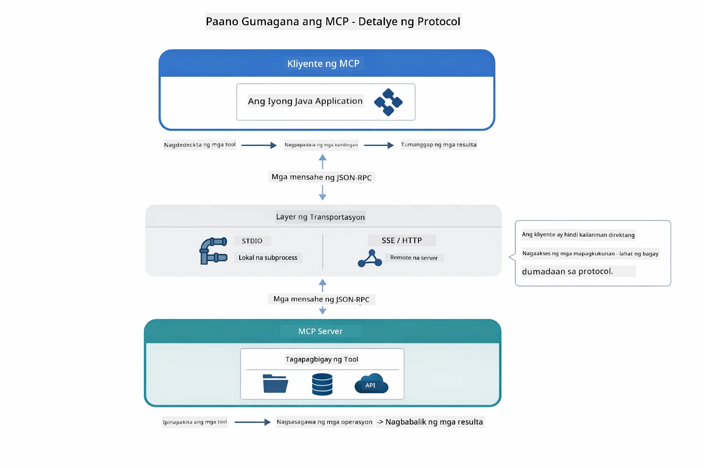

*Paano gumagana ang MCP sa ilalim — ang mga client ay natutuklasan ang mga tool, nagpapalitan ng mga JSON-RPC na mensahe, at nagsasagawa ng mga operasyon sa pamamagitan ng isang transport layer.*

**Server-Client Architecture**

Gumagamit ang MCP ng client-server na modelo. Ang mga server ay nagbibigay ng mga tool - pagbabasa ng mga file, pag-query ng mga database, pagtawag ng mga API. Ang mga client (iyong AI application) ay kumokonekta sa mga server at ginagamit ang kanilang mga tool.

Para magamit ang MCP sa LangChain4j, idagdag ang Maven dependency na ito:

```xml
<dependency>
    <groupId>dev.langchain4j</groupId>
    <artifactId>langchain4j-mcp</artifactId>
    <version>${langchain4j.version}</version>
</dependency>
```

**Tool Discovery**

Kapag kumonekta ang iyong client sa isang MCP server, tinatanong nito "Anong mga tool ang mayroon ka?" Sumagot ang server ng listahan ng mga available na tool, bawat isa ay may mga paglalarawan at parameter schemas. Maaari pagkatapos ng iyong AI agent na magdesisyon kung aling mga tool ang gagamitin base sa mga kahilingan ng user.

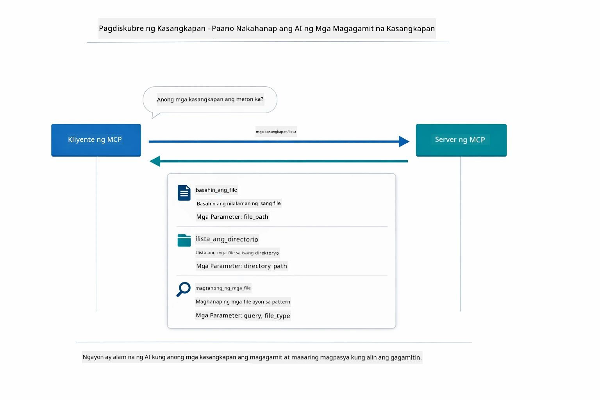

*Natuklasan ng AI ang mga available na tool sa pagsisimula — alam na nito kung ano ang mga kakayahan at maaaring magdesisyon kung alin ang gagamitin.*

**Transport Mechanisms**

Sinusuportahan ng MCP ang iba't ibang mekanismo ng transport. Sa module na ito ay ipinapakita ang Stdio transport para sa mga lokal na proseso:


*Mga mekanismo ng transport ng MCP: HTTP para sa mga remote na server, Stdio para sa mga lokal na proseso*

**Stdio** - [StdioTransportDemo.java](../../../05-mcp/src/main/java/com/example/langchain4j/mcp/StdioTransportDemo.java)

Para sa mga lokal na proseso. Ang iyong aplikasyon ay nagbabuo ng isang server bilang subprocess at nakikipag-ugnayan sa pamamagitan ng standard input/output. Kapaki-pakinabang para sa pag-access ng filesystem o mga command-line na tool.

```java
McpTransport stdioTransport = new StdioMcpTransport.Builder()
    .command(List.of(
        npmCmd, "exec",
        "@modelcontextprotocol/server-filesystem@2025.12.18",
        resourcesDir
    ))
    .logEvents(false)
    .build();
```

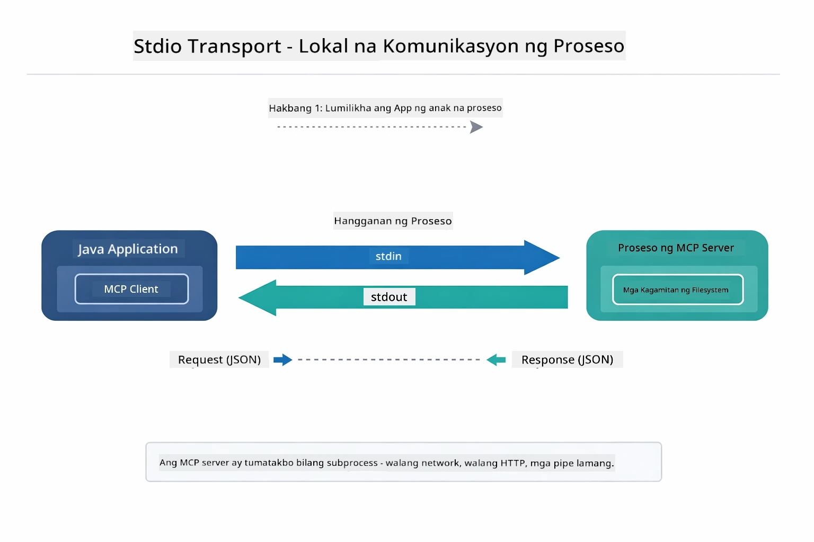

*Stdio transport sa aksyon — ang iyong aplikasyon ay nag-sspawn ng MCP server bilang child process at nakikipag-ugnayan sa pamamagitan ng stdin/stdout pipes.*

> **🤖 Subukan sa [GitHub Copilot](https://github.com/features/copilot) Chat:** Buksan ang [`StdioTransportDemo.java`](../../../05-mcp/src/main/java/com/example/langchain4j/mcp/StdioTransportDemo.java) at itanong:
> - "Paano gumagana ang Stdio transport at kailan ko dapat gamitin ito kumpara sa HTTP?"
> - "Paano pinamamahalaan ng LangChain4j ang lifecycle ng mga pinapadalang MCP server process?"
> - "Ano ang mga implikasyon sa seguridad ng pagbibigay ng AI ng access sa file system?"

## The Agentic Module

Habang nagbibigay ng standardisadong mga tool ang MCP, ang **agentic module** ng LangChain4j ay nagbibigay ng deklaratibong paraan para bumuo ng mga ahente na nag-o-orchestrate ng mga tool na iyon. Ang anotasyong `@Agent` at `AgenticServices` ay nagpapahintulot sa iyo na ideklara ang kilos ng ahente sa pamamagitan ng mga interface sa halip na code na imperative.

Sa module na ito, susuriin mo ang **Supervisor Agent** pattern — isang advanced na agentic AI na paraan kung saan ang isang "supervisor" agent ay dinamiko ang pagpapasya kung aling mga sub-agent ang tatawagin base sa mga kahilingan ng user. Pagsasamahin natin ang dalawang konsepto sa pamamagitan ng pagbibigay sa isa sa ating sub-agents ng MCP-powered na kakayahan sa pag-access ng file.

Para magamit ang agentic module, idagdag ang Maven dependency na ito:

```xml
<dependency>
    <groupId>dev.langchain4j</groupId>
    <artifactId>langchain4j-agentic</artifactId>
    <version>${langchain4j.mcp.version}</version>
</dependency>
```

> **⚠️ Eksperimental:** Ang `langchain4j-agentic` na module ay **eksperimental** at maaaring magbago. Ang matatag na paraan para gumawa ng AI assistant ay nananatiling `langchain4j-core` gamit ang custom tools (Module 04).

## Running the Examples

### Prerequisites

- Java 21+, Maven 3.9+
- Node.js 16+ at npm (para sa mga MCP server)
- Mga environment variable na naka-configure sa `.env` file (mula sa root directory):
  - `AZURE_OPENAI_ENDPOINT`, `AZURE_OPENAI_API_KEY`, `AZURE_OPENAI_DEPLOYMENT` (pareho sa Modules 01-04)

> **Tandaan:** Kung hindi mo pa na-set up ang iyong mga environment variable, tingnan ang [Module 00 - Quick Start](../00-quick-start/README.md) para sa mga tagubilin, o kopyahin ang `.env.example` sa `.env` sa root directory at punan ang iyong mga halaga.

## Quick Start

**Gamit ang VS Code:** I-right-click lang ang kahit anong demo file sa Explorer at piliin ang **"Run Java"**, o gamitin ang launch configurations mula sa Run and Debug panel (siguraduhing naidagdag mo na ang iyong token sa `.env` file muna).

**Gamit ang Maven:** Bilang alternatibo, maaari kang magpatakbo mula sa command line gamit ang mga halimbawa sa ibaba.

### File Operations (Stdio)

Ipinapakita nito ang mga lokal na subprocess-based na tool.

**✅ Walang kailangang prerequisites** - ang MCP server ay awtomatikong napapasimula.

**Gamit ang Start Scripts (Inirerekomenda):**

Awtomatikong niloload ng start scripts ang mga environment variable mula sa root `.env` file:

**Bash:**
```bash
cd 05-mcp
chmod +x start-stdio.sh
./start-stdio.sh
```

**PowerShell:**
```powershell
cd 05-mcp
.\start-stdio.ps1
```

**Gamit ang VS Code:** I-right-click ang `StdioTransportDemo.java` at piliin ang **"Run Java"** (siguraduhing naka-configure ang iyong `.env` file).

Nag-sspawn ang aplikasyon ng MCP filesystem server nang awtomatiko at nagbabasa ng lokal na file. Pansinin kung paano hinahawakan ang subprocess management para sa iyo.

**Inaasahang output:**
```
Assistant response: The file provides an overview of LangChain4j, an open-source Java library
for integrating Large Language Models (LLMs) into Java applications...
```

### Supervisor Agent

Ang **Supervisor Agent pattern** ay isang **flexible** na anyo ng agentic AI. Ang isang Supervisor ay gumagamit ng LLM upang awtomatikong magpasya kung alin ang mga ahente na tatawagin base sa kahilingan ng user. Sa susunod na halimbawa, pagsasamahin natin ang MCP-powered na pag-access ng file kasama ang isang LLM agent upang lumikha ng pinangangasi waang file read → report workflow.

Sa demo, nagbabasa ang `FileAgent` ng file gamit ang MCP filesystem tools, at ang `ReportAgent` ay gumagawa ng istrakturadong report na may executive summary (1 pangungusap), 3 pangunahing punto, at mga rekomendasyon. Ang Supervisor ang nag-o-orchestrate ng daloy na ito nang awtomatiko:

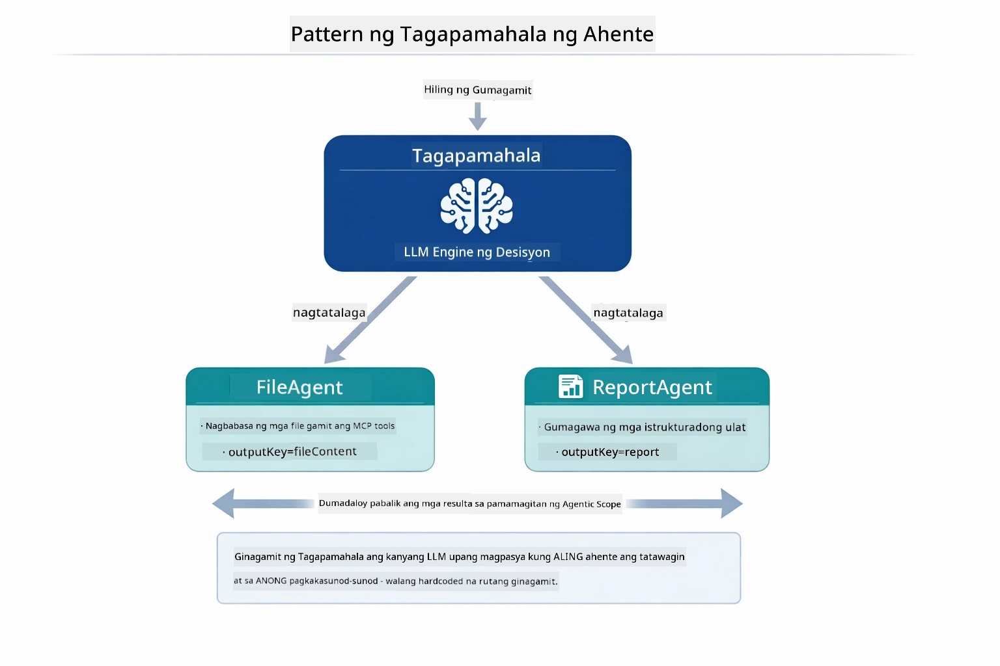

*Ginagamit ng Supervisor ang kanyang LLM para magpasya kung aling mga ahente ang tatawagin at sa anong pagkakasunod-sunod — hindi na kailangan ang hardcoded na routing.*

Ganito ang hitsura ng kongkretong workflow para sa ating file-to-report pipeline:

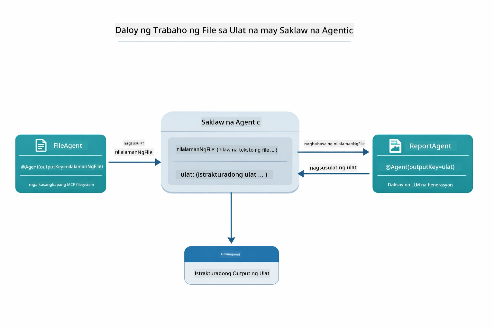

*Binabasa ng FileAgent ang file sa pamamagitan ng MCP tools, pagkatapos ay ang ReportAgent ay ginagawang istrakturadong report ang raw na nilalaman.*

Ang bawat ahente ay nag-iimbak ng output nito sa **Agentic Scope** (shared memory), na nagpapahintulot sa mga downstream agent na ma-access ang mga naunang resulta. Ipinapakita nito kung paano maayos na nakakasabay ang MCP tools sa mga agentic workflow — hindi kailangang malaman ng Supervisor kung *paano* binabasa ang mga file, sapat na na kaya ito gawin ng `FileAgent`.

#### Running the Demo

Awtomatikong niloload ng start scripts ang mga environment variable mula sa root `.env` file:

**Bash:**
```bash
cd 05-mcp
chmod +x start-supervisor.sh
./start-supervisor.sh
```

**PowerShell:**
```powershell
cd 05-mcp
.\start-supervisor.ps1
```

**Gamit ang VS Code:** I-right-click ang `SupervisorAgentDemo.java` at piliin ang **"Run Java"** (siguraduhing naka-configure ang iyong `.env` file).

#### How the Supervisor Works

```java
// Hakbang 1: Binabasa ng FileAgent ang mga file gamit ang MCP tools
FileAgent fileAgent = AgenticServices.agentBuilder(FileAgent.class)
        .chatModel(model)
        .toolProvider(mcpToolProvider)  // May MCP tools para sa mga operasyon ng file
        .build();

// Hakbang 2: Gumagawa ang ReportAgent ng mga nakaistrukturang ulat
ReportAgent reportAgent = AgenticServices.agentBuilder(ReportAgent.class)
        .chatModel(model)
        .build();

// Pinamumunuan ng Supervisor ang workflow mula file papuntang ulat
SupervisorAgent supervisor = AgenticServices.supervisorBuilder()
        .chatModel(model)
        .subAgents(fileAgent, reportAgent)
        .responseStrategy(SupervisorResponseStrategy.LAST)  // Ibalik ang panghuling ulat
        .build();

// Ang Supervisor ang nagpapasya kung aling mga agent ang tatawagin batay sa kahilingan
String response = supervisor.invoke("Read the file at /path/file.txt and generate a report");
```

#### Response Strategies

Kapag nag-configure ka ng `SupervisorAgent`, tinutukoy mo kung paano nito bubuuin ang panghuling sagot sa user matapos makumpleto ng mga sub-agent ang kanilang mga gawain.

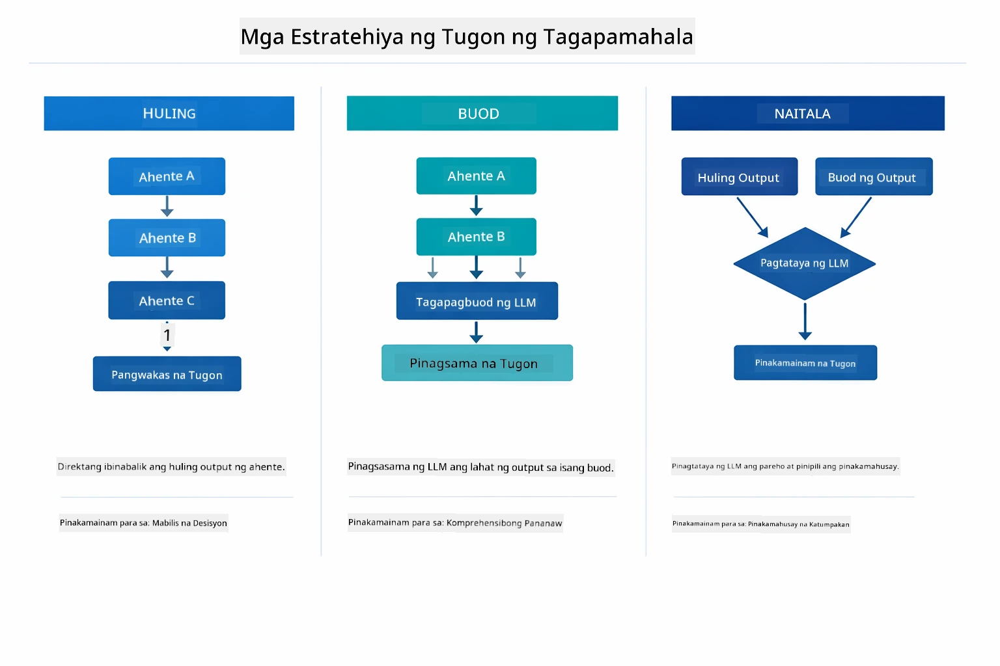

*Tatluhang estratehiya kung paano binubuo ng Supervisor ang panghuling sagot — pumili base sa gusto mong huling output ng agent, isang synthesized na buod, o ang may pinakamataas na score.*

Ang mga available na estratehiya ay:

| Strategy | Description |
|----------|-------------|
| **LAST** | Ang supervisor ay nagbabalik ng output ng huling sub-agent o tool na tinawag. Ito ay kapaki-pakinabang kapag ang huling agent sa workflow ay sadyang dinisenyo upang lumikha ng kumpleto, panghuling sagot (e.g., isang "Summary Agent" sa research pipeline). |
| **SUMMARY** | Ginagamit ng supervisor ang sarili nitong internal Language Model (LLM) para pagsamahin ang isang buod ng buong interaksyon at lahat ng output ng mga sub-agent, pagkatapos ay ibinabalik ito bilang panghuling sagot. Nagbibigay ito ng malinis, pinagsamang sagot para sa user. |
| **SCORED** | Ginagamit ng sistema ang internal LLM upang i-score ang parehong LAST na sagot at ang SUMMARY ng interaksyon laban sa orihinal na kahilingan ng user, pagkatapos ay ibinalik ang output na may mas mataas na score. |

Tingnan ang [SupervisorAgentDemo.java](../../../05-mcp/src/main/java/com/example/langchain4j/mcp/SupervisorAgentDemo.java) para sa kompletong implementasyon.

> **🤖 Subukan sa [GitHub Copilot](https://github.com/features/copilot) Chat:** Buksan ang [`SupervisorAgentDemo.java`](../../../05-mcp/src/main/java/com/example/langchain4j/mcp/SupervisorAgentDemo.java) at itanong:
> - "Paano nagdedesisyon ang Supervisor kung aling mga ahente ang tatawagin?"
> - "Ano ang pagkakaiba ng Supervisor at Sequential workflow patterns?"
> - "Paano ko mae-customize ang planning behavior ng Supervisor?"

#### Understanding the Output

Kapag pinatakbo mo ang demo, makikita mo ang istrukturadong walkthrough kung paano ini-orchestrate ng Supervisor ang maraming ahente. Ganito ang ibig sabihin ng bawat bahagi:

```
======================================================================
  FILE → REPORT WORKFLOW DEMO
======================================================================

This demo shows a clear 2-step workflow: read a file, then generate a report.
The Supervisor orchestrates the agents automatically based on the request.
```

**Ang header** ay nagpapakilala ng konsepto ng workflow: isang nakatuong pipeline mula pagbabasa ng file hanggang sa paggawa ng report.

```
--- WORKFLOW ---------------------------------------------------------
  ┌─────────────┐      ┌──────────────┐
  │  FileAgent  │ ───▶ │ ReportAgent  │
  │ (MCP tools) │      │  (pure LLM)  │
  └─────────────┘      └──────────────┘
   outputKey:           outputKey:
   'fileContent'        'report'

--- AVAILABLE AGENTS -------------------------------------------------
  [FILE]   FileAgent   - Reads files via MCP → stores in 'fileContent'
  [REPORT] ReportAgent - Generates structured report → stores in 'report'
```

**Workflow Diagram** ay nagpapakita ng daloy ng datos sa pagitan ng mga ahente. May kanya-kanyang tiyak na papel ang bawat ahente:
- **FileAgent** ang nagbabasa ng mga file gamit ang MCP tools at nag-imbak ng raw na nilalaman sa `fileContent`
- **ReportAgent** ang kumokonsumo sa nilalamang iyon at gumagawa ng istrakturadong report sa `report`

```
--- USER REQUEST -----------------------------------------------------
  "Read the file at .../file.txt and generate a report on its contents"
```

**User Request** ay nagpapakita ng gawain. Ini-parse ito ng Supervisor at nagdesisyon na tawagin ang FileAgent → ReportAgent.

```
--- SUPERVISOR ORCHESTRATION -----------------------------------------
  The Supervisor decides which agents to invoke and passes data between them...

  +-- STEP 1: Supervisor chose -> FileAgent (reading file via MCP)
  |
  |   Input: .../file.txt
  |
  |   Result: LangChain4j is an open-source, provider-agnostic Java framework for building LLM...
  +-- [OK] FileAgent (reading file via MCP) completed

  +-- STEP 2: Supervisor chose -> ReportAgent (generating structured report)
  |
  |   Input: LangChain4j is an open-source, provider-agnostic Java framew...
  |
  |   Result: Executive Summary...
  +-- [OK] ReportAgent (generating structured report) completed
```

**Supervisor Orchestration** ay nagpapakita ng 2-step na flow sa aksyon:
1. **FileAgent** binabasa ang file via MCP at iniimbak ang nilalaman
2. **ReportAgent** tinatanggap ang nilalaman at gumagawa ng istrakturadong report

Gawin ng Supervisor ang mga desisyong ito nang **autonomously** batay sa kahilingan ng user.

```
--- FINAL RESPONSE ---------------------------------------------------
Executive Summary
...

Key Points
...

Recommendations
...

--- AGENTIC SCOPE (Data Flow) ----------------------------------------
  Each agent stores its output for downstream agents to consume:
  * fileContent: LangChain4j is an open-source, provider-agnostic Java framework...
  * report: Executive Summary...
```

#### Explanation of Agentic Module Features

Ipinapakita ng halimbawa ang ilang advanced na tampok ng agentic module. Tingnan natin nang mas malapit ang Agentic Scope at Agent Listeners.

**Agentic Scope** ay nagpapakita ng shared memory kung saan iniimbak ng mga ahente ang kanilang mga resulta gamit ang `@Agent(outputKey="...")`. Ito ay nagpapahintulot:
- Sa mga susunod na ahente na ma-access ang mga output ng mga naunang ahente
- Sa Supervisor na sintesisin ang panghuling sagot
- Sa iyo na siyasatin kung ano ang ginawa ng bawat ahente

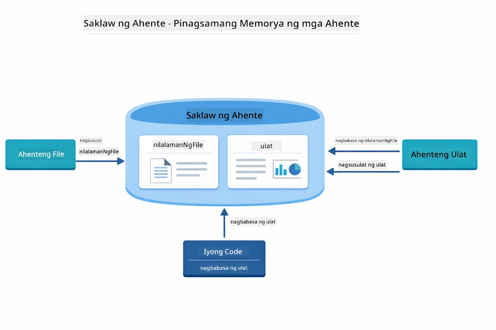

*Gumagana ang Agentic Scope bilang shared memory — nagsusulat ang FileAgent ng `fileContent`, binabasa ito at sumusulat ang ReportAgent ng `report`, at binabasa ng iyong code ang panghuling resulta.*

```java
ResultWithAgenticScope<String> result = supervisor.invokeWithAgenticScope(request);
AgenticScope scope = result.agenticScope();
String fileContent = scope.readState("fileContent");  // Raw na datos ng file mula sa FileAgent
String report = scope.readState("report");            // Istrakturadong ulat mula sa ReportAgent
```

**Agent Listeners** ay nagbibigay daan para mamonitor at mag-debug ng pagpapatakbo ng ahente. Ang step-by-step na output na nakikita mo sa demo ay nagmumula sa isang AgentListener na kumakabit sa bawat pagtawag ng ahente:
- **beforeAgentInvocation** - Tinatawag kapag pinili ng Supervisor ang isang ahente, na nagpapakita kung aling ahente ang napili at bakit
- **afterAgentInvocation** - Tinatawag kapag nakumpleto na ng ahente ang gawain, ipinapakita ang resulta nito
- **inheritedBySubagents** - Kapag totoo, minomonitor ng listener ang lahat ng ahente sa hierarchy

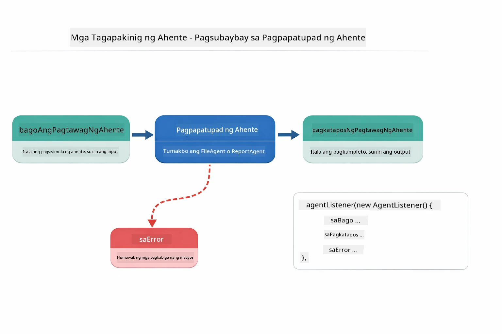

*Ang Agent Listeners ay nakakabit sa lifecycle ng pagpapatupad — minomonitor kung kailan nagsisimula, nakukumpleto, o nagkakaroon ng mga error ang mga ahente.*

```java
AgentListener monitor = new AgentListener() {
    private int step = 0;
    
    @Override
    public void beforeAgentInvocation(AgentRequest request) {
        step++;
        System.out.println("  +-- STEP " + step + ": " + request.agentName());
    }
    
    @Override
    public void afterAgentInvocation(AgentResponse response) {
        System.out.println("  +-- [OK] " + response.agentName() + " completed");
    }
    
    @Override
    public boolean inheritedBySubagents() {
        return true; // Ipasa sa lahat ng mga sub-ahente
    }
};
```

Bukod sa Supervisor pattern, naglalaan ang `langchain4j-agentic` module ng ilang makapangyarihang workflow patterns at mga tampok:

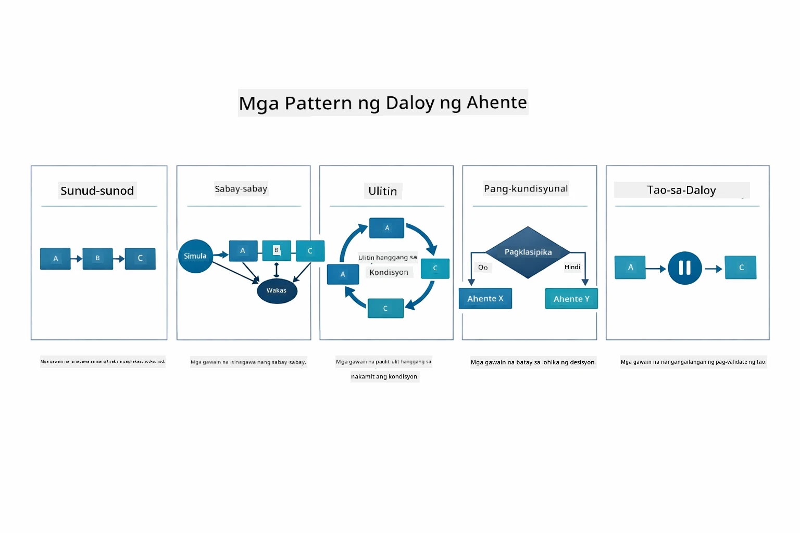

*Limang workflow pattern para sa pag-oorganisa ng mga ahente — mula sa simpleng sunud-sunod na mga pipeline hanggang sa human-in-the-loop na pag-apruba ng workflows.*

| Pattern | Paglalarawan | Gamit |
|---------|--------------|-------|
| **Sequential** | Ipatupad ang mga ahente nang sunud-sunod, ang output ay dumadaloy sa susunod | Mga pipeline: pananaliksik → pagsusuri → ulat |
| **Parallel** | Patakbuhin ang mga ahente nang sabay-sabay | Mga independiyenteng gawain: panahon + balita + stocks |
| **Loop** | Ulitin hanggang matugunan ang kondisyon | Pagsusukat ng kalidad: pinuhin hanggang score ≥ 0.8 |
| **Conditional** | I-route base sa mga kondisyon | Pag-uuri → i-route sa espesyalistang ahente |
| **Human-in-the-Loop** | Magdagdag ng human checkpoints | Mga approval workflow, pagsusuri sa nilalaman |

## Mga Pangunahing Konsepto

Ngayon na na-explore mo na ang MCP at ang agentic module sa aksyon, ibuod natin kung kailan gagamitin ang bawat diskarte.

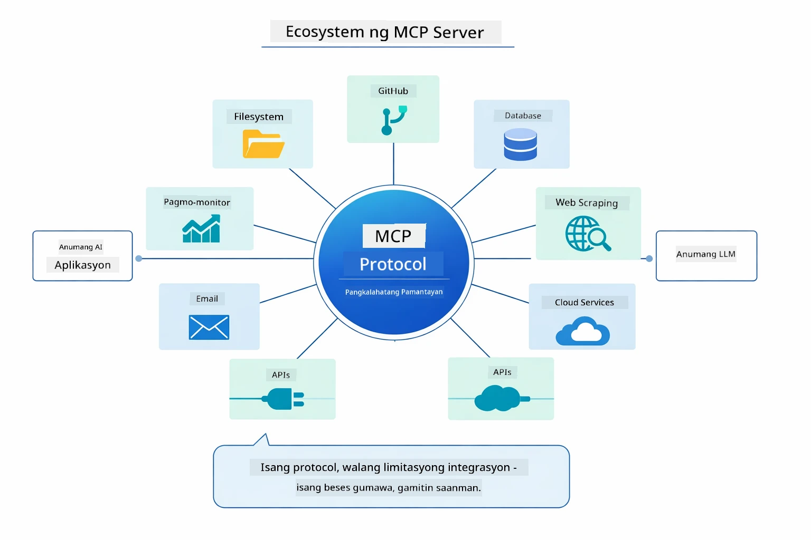

*Lumilikha ang MCP ng isang unibersal na protocol ecosystem — anumang MCP-compatible na server ay gumagana sa anumang MCP-compatible na kliyente, nagpapahintulot sa pagbabahagi ng mga tool sa iba't ibang aplikasyon.*

**MCP** ay mainam kapag nais mong gamitin ang umiiral na tool ecosystems, gumawa ng mga tool na maaaring gamitin ng maraming aplikasyon, isama ang third-party na serbisyo gamit ang mga standard na protocol, o palitan ang mga implementasyon ng tool nang hindi binabago ang code.

**Ang Agentic Module** ay pinakamahusay kapag gusto mo ng deklaratibong mga kahulugan ng ahente gamit ang `@Agent` annotations, kailangan ng workflow orchestration (sequential, loop, parallel), mas gusto ang interface-based agent design kaysa imperative code, o pinagsasama-sama ang maraming ahente na nagbabahagi ng mga output gamit ang `outputKey`.

**Ang Supervisor Agent pattern** ay nagpapaangat kapag hindi predictable ang workflow sa simula at gusto mong ang LLM ang magpasya, kapag mayroong maraming specialized na ahente na kailangan ng dynamic orchestration, kapag gumagawa ng mga conversational system na nagro-route sa iba't ibang kakayahan, o kapag gusto mo ng pinaka-flexible, adaptive na pag-uugali ng ahente.

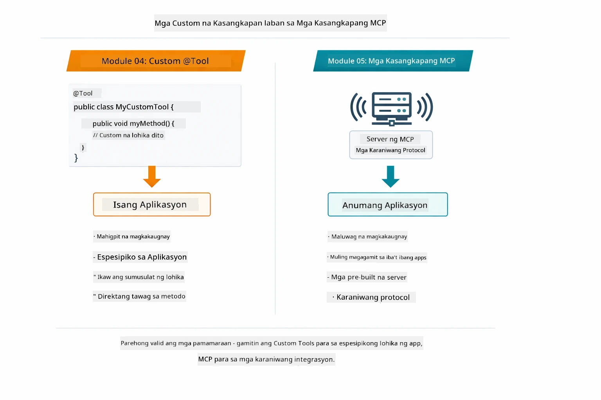

*Kailan gagamit ng custom na @Tool methods kumpara sa MCP tools — custom tools para sa app-specific na lohika na may kumpletong type safety, MCP tools para sa standardized integrations na gumagana sa iba't ibang aplikasyon.*

## Congratulations!

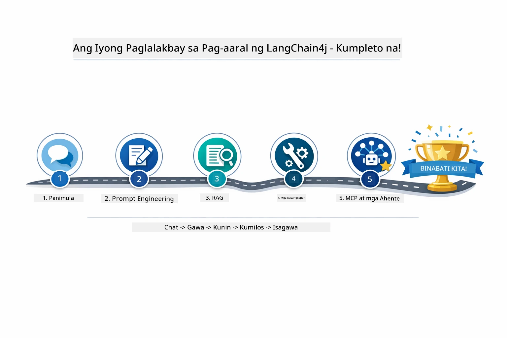

*Ang iyong paglalakbay sa pag-aaral sa lahat ng limang module — mula sa basic chat hanggang sa MCP-powered na agentic systems.*

Natapos mo na ang LangChain4j for Beginners course. Natutunan mo ang:

- Paano bumuo ng conversational AI na may memorya (Module 01)
- Mga pattern ng prompt engineering para sa iba't ibang gawain (Module 02)
- Pagdidiin ng mga sagot sa iyong mga dokumento gamit ang RAG (Module 03)
- Paggawa ng mga pangunahing AI agent (assistants) gamit ang custom tools (Module 04)
- Pagsasama ng standardized tools gamit ang LangChain4j MCP at Agentic modules (Module 05)

### Ano ang Susunod?

Pagkatapos matapos ang mga module, tuklasin ang [Testing Guide](../docs/TESTING.md) para makita ang mga konsepto ng LangChain4j testing sa aksyon.

**Opisyal na Mga Sanggunian:**
- [LangChain4j Documentation](https://docs.langchain4j.dev/) - Kumpletong mga gabay at API reference
- [LangChain4j GitHub](https://github.com/langchain4j/langchain4j) - Source code at mga halimbawa
- [LangChain4j Tutorials](https://docs.langchain4j.dev/tutorials/) - Mga step-by-step na tutorial para sa iba't ibang gamit

Salamat sa pagtatapos ng kursong ito!

---

**Navigation:** [← Nakaraan: Module 04 - Tools](../04-tools/README.md) | [Bumalik sa Pangunahing](../README.md)

---

<!-- CO-OP TRANSLATOR DISCLAIMER START -->
**Pahayag ng Pagtanggi**:
Ang dokumentong ito ay isinalin gamit ang serbisyong AI na pagsasalin [Co-op Translator](https://github.com/Azure/co-op-translator). Bagama't nagsusumikap kami para sa katumpakan, pakatandaan na ang awtomatikong pagsasalin ay maaaring maglaman ng mga pagkakamali o kawastuhan. Ang orihinal na dokumento sa sariling wika nito ang dapat ituring na pangunahing sanggunian. Para sa mahahalagang impormasyon, inirerekomenda ang propesyonal na pagsasaling-tao. Hindi kami mananagot sa anumang hindi pagkakaunawaan o maling interpretasyon na maaaring magmula sa paggamit ng pagsasaling ito.
<!-- CO-OP TRANSLATOR DISCLAIMER END -->