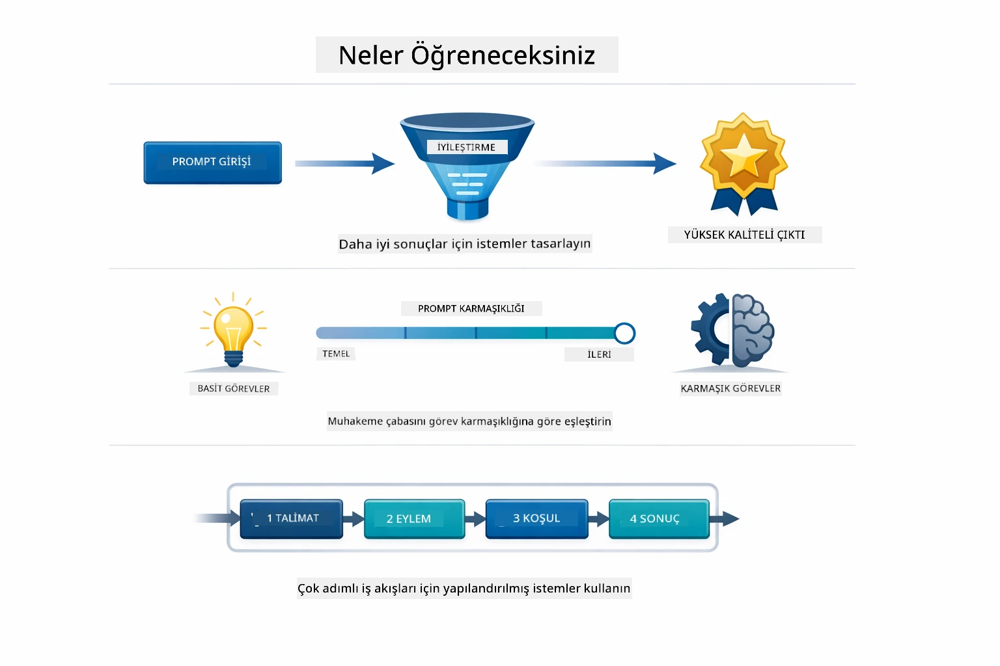
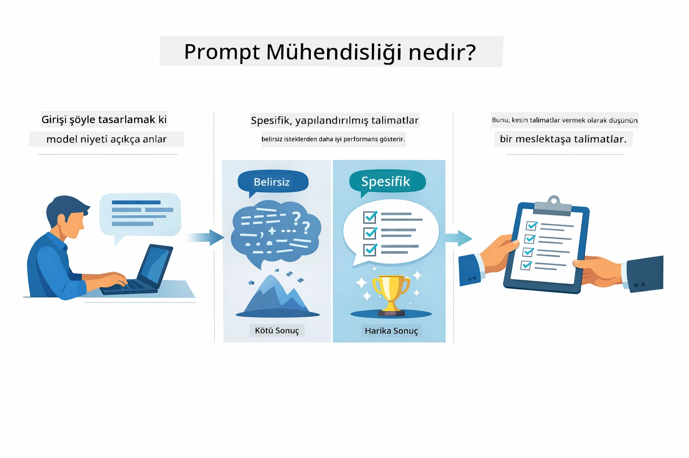
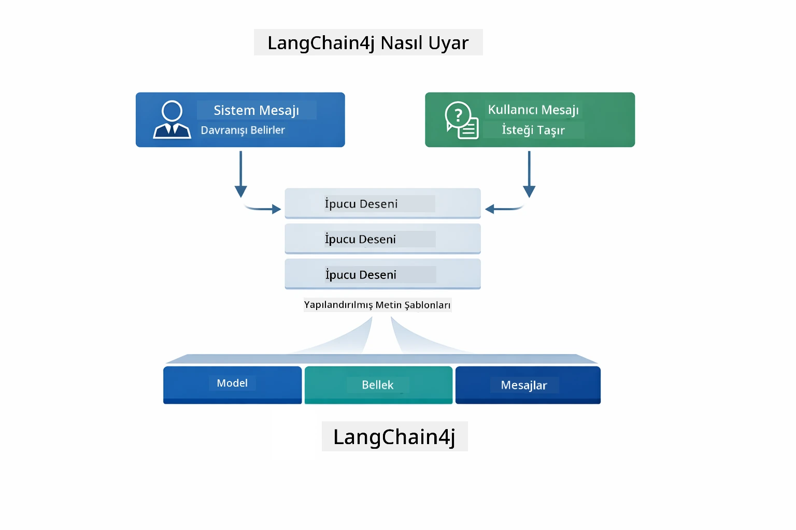
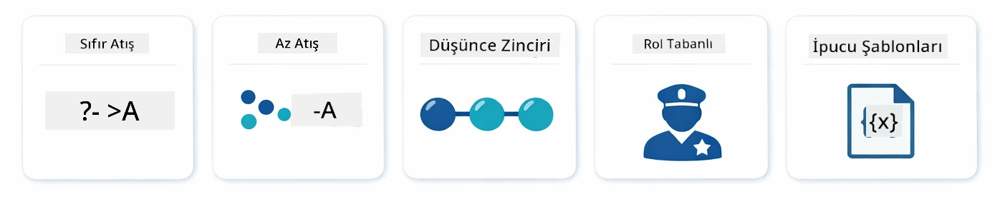
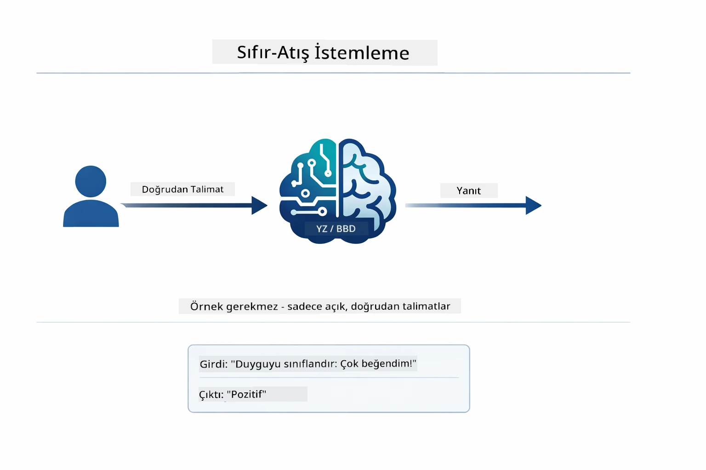
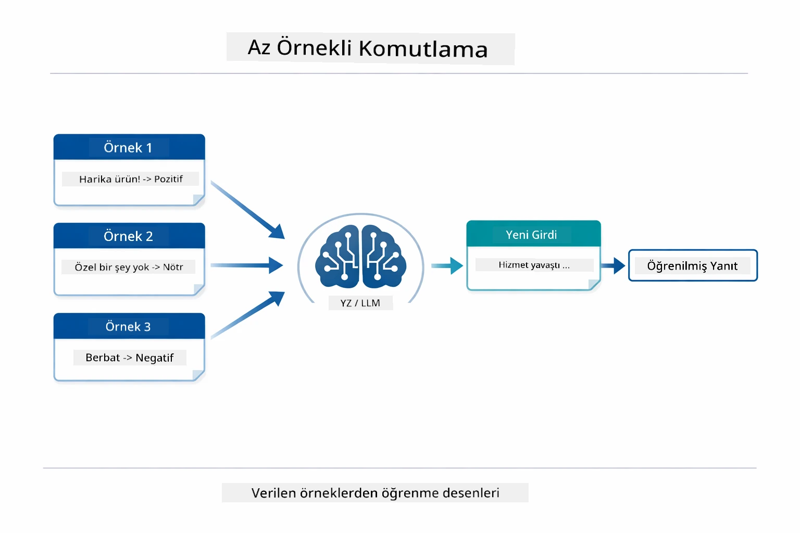
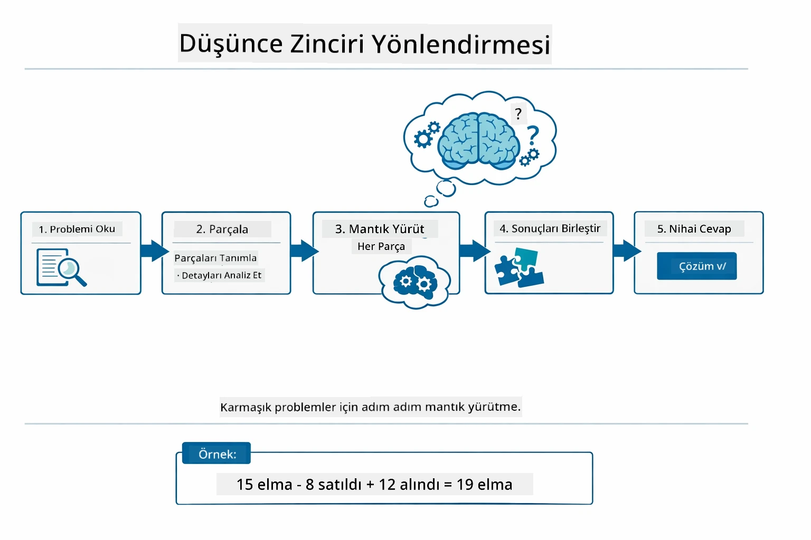
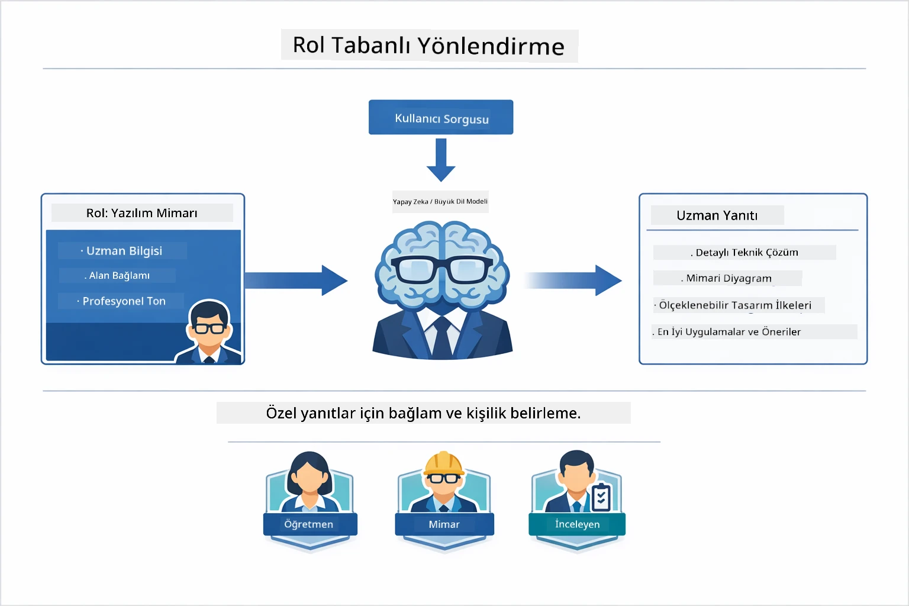
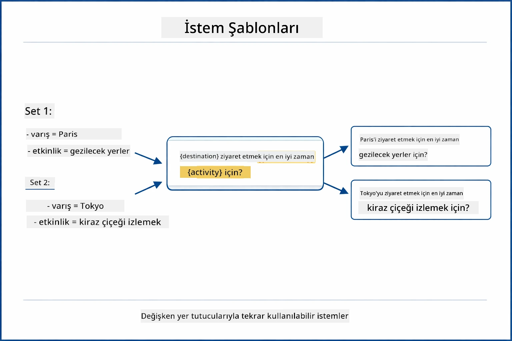
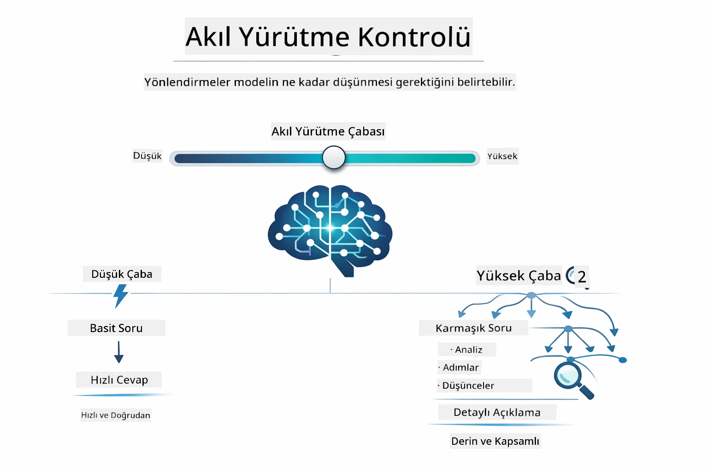

# Modül 02: GPT-5.2 ile İstem Mühendisliği

## İçindekiler

- [Öğrenecekleriniz](../../../02-prompt-engineering)
- [Önkoşullar](../../../02-prompt-engineering)
- [İstem Mühendisliğini Anlamak](../../../02-prompt-engineering)
- [İstem Mühendisliği Temelleri](../../../02-prompt-engineering)
  - [Sıfır-Örnek İstem](../../../02-prompt-engineering)
  - [Az Örnekli İstem](../../../02-prompt-engineering)
  - [Düşünce Zinciri](../../../02-prompt-engineering)
  - [Rol Tabanlı İstem](../../../02-prompt-engineering)
  - [İstem Şablonları](../../../02-prompt-engineering)
- [İleri Düzey Desenler](../../../02-prompt-engineering)
- [Mevcut Azure Kaynaklarını Kullanma](../../../02-prompt-engineering)
- [Uygulama Ekran Görüntüleri](../../../02-prompt-engineering)
- [Desenlerin Keşfi](../../../02-prompt-engineering)
  - [Düşük ve Yüksek İsteklilik](../../../02-prompt-engineering)
  - [Görev Yürütme (Araç Önbilgileri)](../../../02-prompt-engineering)
  - [Kendi Kendini Yansıtan Kod](../../../02-prompt-engineering)
  - [Yapılandırılmış Analiz](../../../02-prompt-engineering)
  - [Çok Turlu Sohbet](../../../02-prompt-engineering)
  - [Adım Adım Akıl Yürütme](../../../02-prompt-engineering)
  - [Kısıtlı Çıktı](../../../02-prompt-engineering)
- [Gerçekten Ne Öğreniyorsunuz](../../../02-prompt-engineering)
- [Sonraki Adımlar](../../../02-prompt-engineering)

## Öğrenecekleriniz



Önceki modülde, hafızanın sohbet tabanlı yapay zekaya nasıl olanak sağladığını gördünüz ve temel etkileşimler için GitHub Modellerini kullandınız. Şimdi ise Azure OpenAI'nin GPT-5.2'sini kullanarak soruları nasıl soracağınız — yani istemleri — üzerine odaklanacağız. İstemlerinizi nasıl yapılandırdığınız, aldığınız yanıtların kalitesini dramatik şekilde etkiler. Temel istem teknikleriyle başlayıp, ardından GPT-5.2'nin yeteneklerinden tam olarak yararlanan sekiz gelişmiş desene geçeceğiz.

GPT-5.2'yi kullanmamızın nedeni ise akıl yürütme kontrolü sunması — modele yanıtlamadan önce ne kadar düşünce yapacağını söyleyebilirsiniz. Bu farklı istem stratejilerini belirginleştirir ve hangi yaklaşımı ne zaman kullanmanız gerektiğini anlamanızı sağlar. Ayrıca GPT-5.2 için Azure'un GitHub Modellerine kıyasla daha az oran sınırı olması avantaj sağlar.

## Önkoşullar

- Modül 01 tamamlandı (Azure OpenAI kaynakları dağıtıldı)
- Kök dizinde Azure kimlik bilgileri içeren `.env` dosyası (Modül 01'de `azd up` komutuyla oluşturuldu)

> **Not:** Modül 01'i tamamlamadıysanız, önce oradaki dağıtım talimatlarını izleyin.

## İstem Mühendisliğini Anlamak



İstem mühendisliği, ihtiyacınız olan sonuçları istikrarlı şekilde almanızı sağlayan girdi metnini tasarlamakla ilgilidir. Sadece soru sormak değil — istekleri modelin ne istediğinizi ve nasıl sunacağını tam olarak anlayacağı şekilde yapılandırmakla ilgilidir.

Bunu bir meslektaşınıza talimat vermek gibi düşünün. "Bug'ı düzelt" belirsizdir. "UserService.java dosyasının 45. satırındaki null pointer istisnasını null kontrolü ekleyerek düzelt" ise spesifiktir. Dil modelleri de aynı şekilde çalışır — özgüllük ve yapı önemlidir.



LangChain4j, altyapıyı sağlar — model bağlantıları, hafıza ve mesaj türleri — istem desenleri ise bu altyapıdan geçen dikkatle yapılandırılmış metindir. Temel yapı taşları ise `SystemMessage` (yapay zekanın davranışını ve rolünü belirler) ve `UserMessage` (gerçek isteğinizi taşır).

## İstem Mühendisliği Temelleri



Bu modüldeki gelişmiş desenlere dalmadan önce, beş temel istem tekniğini gözden geçirelim. Bunlar her istem mühendisinin bilmesi gereken yapı taşlarıdır. Eğer [Hızlı Başlangıç modülünü](../00-quick-start/README.md#2-prompt-patterns) tamamladıysanız, bunları uygulamada gördünüz - işte bunların arkasındaki kavramsal çerçeve.

### Sıfır-Örnek İstem

En basit yaklaşım: modele örnek vermeden doğrudan bir talimat verme. Model görevi anlamak ve yerine getirmek için tamamen eğitimine güvenir. Beklenen davranışın bariz olduğu basit istekler için iyi çalışır.



*Örnek olmadan doğrudan talimat — model sadece talimattan görevi çıkarır*

```java
String prompt = "Classify this sentiment: 'I absolutely loved the movie!'";
String response = model.chat(prompt);
// Yanıt: "Olumlu"
```

**Ne zaman kullanılır:** Basit sınıflandırmalar, doğrudan sorular, çeviriler veya modelin ek rehberlik olmadan yapabileceği her görev.

### Az Örnekli İstem

Modelin izlemesini istediğiniz deseni gösteren örnekler verin. Model, beklenen giriş-çıkış formatını örneklerinizden öğrenir ve yeni girdilere uygular. Bu, istenen format veya davranışın bariz olmadığı görevlerde tutarlılığı ciddi şekilde artırır.



*Örneklerden öğrenme — model deseni tanır ve yeni girdilere uygular*

```java
String prompt = """
    Classify the sentiment as positive, negative, or neutral.
    
    Examples:
    Text: "This product exceeded my expectations!" → Positive
    Text: "It's okay, nothing special." → Neutral
    Text: "Waste of money, very disappointed." → Negative
    
    Now classify this:
    Text: "Best purchase I've made all year!"
    """;
String response = model.chat(prompt);
```

**Ne zaman kullanılır:** Özel sınıflandırmalar, tutarlı biçimlendirme, alan spesifik görevler veya sıfır-örnek sonuçların tutarsız olduğu durumlar.

### Düşünce Zinciri

Modelden akıl yürütmesini adım adım göstermesini isteyin. Doğrudan sonuca atlamak yerine, model problemi açıkça parçalar ve her bölümü ayrı ayrı işler. Bu matematik, mantık ve çok adımlı akıl yürütme görevlerinde doğruluğu artırır.



*Adım adım akıl yürütme — karmaşık problemleri açık mantıksal adımlara bölmek*

```java
String prompt = """
    Problem: A store has 15 apples. They sell 8 apples and then 
    receive a shipment of 12 more apples. How many apples do they have now?
    
    Let's solve this step-by-step:
    """;
String response = model.chat(prompt);
// Model şunu gösteriyor: 15 - 8 = 7, sonra 7 + 12 = 19 elma
```

**Ne zaman kullanılır:** Matematik problemleri, mantık bulmacaları, hata ayıklama veya akıl yürütme sürecinin doğruluğu ve güveni artırdığı her görev.

### Rol Tabanlı İstem

Soru sormadan önce yapay zekanın bir persona veya rolünü belirleyin. Bu, yanıtın tonunu, derinliğini ve odağını şekillendiren bağlam sağlar. "Yazılım mimarı", "junior geliştirici" veya "güvenlik denetçisi" farklı tavsiyeler verir.



*Bağlam ve persona belirleme — aynı soru atanan role göre farklı yanıt alır*

```java
String prompt = """
    You are an experienced software architect reviewing code.
    Provide a brief code review for this function:
    
    def calculate_total(items):
        total = 0
        for item in items:
            total = total + item['price']
        return total
    """;
String response = model.chat(prompt);
```

**Ne zaman kullanılır:** Kod incelemeleri, eğitmenlik, alan spesifik analiz veya belirli bir uzmanlık seviyesi ya da bakış açısına göre uyarlanmış yanıtlar gerektiğinde.

### İstem Şablonları

Değişken yer tutucuları olan tekrar kullanılabilir istemler oluşturun. Her seferinde yeni istem yazmak yerine, şablonu bir kez tanımlayın ve farklı değerlerle doldurun. LangChain4j’nin `PromptTemplate` sınıfı `{{variable}}` sözdizimi ile bunu kolaylaştırır.



*Değişken yer tutuculara sahip tekrar kullanılabilir istemler — bir şablon, çok kullanım*

```java
PromptTemplate template = PromptTemplate.from(
    "What's the best time to visit {{destination}} for {{activity}}?"
);

Prompt prompt = template.apply(Map.of(
    "destination", "Paris",
    "activity", "sightseeing"
));

String response = model.chat(prompt.text());
```

**Ne zaman kullanılır:** Farklı girdilerle tekrar eden sorgular, toplu işlemeler, tekrar kullanılabilir yapay zeka iş akışları veya istem yapısı aynı kalıp veriler değiştiğinde.

---

Bu beş temel size çoğu istem görevi için sağlam bir araç seti sağlar. Bu modülün geri kalanı ise GPT-5.2'nin akıl yürütme kontrolü, kendi kendini değerlendirme ve yapılandırılmış çıktı özelliklerinden yararlanan **sekiz gelişmiş desenle** üzerine inşa edilir.

## İleri Düzey Desenler

Temelleri tamamladıktan sonra, bu modülü benzersiz kılan sekiz gelişmiş desene geçelim. Tüm problemler aynı yaklaşımı gerektirmez. Bazı sorular hızlı yanıt ister, bazıları derin düşünce. Bazıları görülebilir akıl yürütme gerektirirken, bazıları sadece sonuç ister. Aşağıdaki her desen farklı bir senaryo için optimize edilmiştir — ve GPT-5.2'nin akıl yürütme kontrolü farkları daha da belirgin hale getirir.


*Sekiz istem mühendisliği deseni ve kullanım durumları genel bakışı*



*GPT-5.2'nin akıl yürütme kontrolü, modelin ne kadar düşünmesi gerektiğini belirtmenizi sağlar — hızlı doğrudan yanıtlar ile derin keşif arasında*


*Düşük istek (hızlı, doğrudan) vs Yüksek istek (kapsamlı, keşif odaklı) akıl yürütme yaklaşımları*

**Düşük İsteklilik (Hızlı & Odaklı)** - Basit sorular için hızlı, doğrudan yanıtlar istediğinizde. Model minimum akıl yürütme yapar - en fazla 2 adım. Hesaplamalar, aramalar veya doğrudan sorular için kullanın.

```java
String prompt = """
    <reasoning_effort>low</reasoning_effort>
    <instruction>maximum 2 reasoning steps</instruction>
    
    What is 15% of 200?
    """;

String response = chatModel.chat(prompt);
```

> 💡 **GitHub Copilot ile Keşfedin:** [`Gpt5PromptService.java`](../../../02-prompt-engineering/src/main/java/com/example/langchain4j/prompts/service/Gpt5PromptService.java) dosyasını açın ve sorun:
> - "Düşük istek ve yüksek istek istem desenleri arasındaki fark nedir?"
> - "İstemlerdeki XML etiketleri AI yanıtını nasıl yapılandırmaya yardımcı olur?"
> - "Kendi kendini yansıtma desenlerini ne zaman doğrudan talimat yerine kullanmalıyım?"

**Yüksek İsteklilik (Derin & Kapsamlı)** - Kapsamlı analiz istediğiniz karmaşık problemler için. Model detaylı akıl yürütme yapar ve derinlemesine keşfeder. Sistem tasarımı, mimari kararlar veya karmaşık araştırmalar için kullanın.

```java
String prompt = """
    <reasoning_effort>high</reasoning_effort>
    <instruction>explore thoroughly, show detailed reasoning</instruction>
    
    Design a caching strategy for a high-traffic REST API.
    """;

String response = chatModel.chat(prompt);
```

**Görev Yürütme (Adım Adım İlerleme)** - Çok adımlı iş akışları için. Model önceden plan sunar, her adımı işlemi anlatır, sonra özetler. Taşınmalar, uygulamalar veya çok adımlı süreçlerde kullanın.

```java
String prompt = """
    <task>Create a REST endpoint for user registration</task>
    <preamble>Provide an upfront plan</preamble>
    <narration>Narrate each step as you work</narration>
    <summary>Summarize what was accomplished</summary>
    """;

String response = chatModel.chat(prompt);
```

Düşünce Zinciri istemi, modelden akıl yürütme sürecini açıkça göstermesini ister; karmaşık görevlerde doğruluğu artırır. Adım adım parçalama hem insanlar hem yapay zekanın mantığı anlamasına yardımcı olur.

> **🤖 [GitHub Copilot](https://github.com/features/copilot) Chat ile deneyin:** Bu desen hakkında sorun:
> - "Uzun süren işlemlere görev yürütme desenini nasıl uyarlayabilirim?"
> - "Üretim uygulamalarında araç önbilgileri yapılandırmak için en iyi uygulamalar nelerdir?"
> - "Bir kullanıcı arayüzünde ara ilerleme güncellemelerini nasıl yakalar ve gösteririm?"


*Planla → Yürüt → Özetle iş akışı, çok adımlı görevler için*

**Kendi Kendini Yansıtan Kod** - Üretim kalitesinde kod oluşturmak için. Model kod üretir, kalite kriterlerine karşı kontrol eder ve iteratif olarak iyileştirir. Yeni özellikler veya hizmetler geliştirirken kullanın.

```java
String prompt = """
    <task>Create an email validation service</task>
    <quality_criteria>
    - Correct logic and error handling
    - Best practices (clean code, proper naming)
    - Performance optimization
    - Security considerations
    </quality_criteria>
    <instruction>Generate code, evaluate against criteria, improve iteratively</instruction>
    """;

String response = chatModel.chat(prompt);
```


*Yinelemeli iyileştirme döngüsü - üret, değerlendir, sorunları belirle, geliştir, tekrarla*

**Yapılandırılmış Analiz** - Tutarlı değerlendirme için. Model kodu sabit bir çerçeveyi (doğruluk, uygulamalar, performans, güvenlik) kullanarak gözden geçirir. Kod incelemeleri veya kalite değerlendirmeleri için kullanın.

```java
String prompt = """
    <code>
    public List getUsers() {
        return database.query("SELECT * FROM users");
    }
    </code>
    
    <framework>
    Evaluate using these categories:
    1. Correctness - Logic and functionality
    2. Best Practices - Code quality
    3. Performance - Efficiency concerns
    4. Security - Vulnerabilities
    </framework>
    """;

String response = chatModel.chat(prompt);
```

> **🤖 [GitHub Copilot](https://github.com/features/copilot) Chat ile deneyin:** Yapılandırılmış analiz için sorun:
> - "Farklı kod inceleme tipleri için analiz çerçevesini nasıl özelleştirebilirim?"
> - "Yapılandırılmış çıktıyı programatik olarak ayrıştırıp işlemenin en iyi yolu nedir?"
> - "Farklı inceleme oturumlarında tutarlı şiddet seviyelerini nasıl sağlarım?"


*Tutarlı kod incelemeleri için dört kategorili çerçeve ve şiddet seviyeleri*

**Çok Turlu Sohbet** - Bağlam gerektiren sohbetler için. Model önceki mesajları hatırlar ve üzerine inşa eder. Etkileşimli yardım oturumları veya karmaşık soru-cevap için kullanın.

```java
ChatMemory memory = MessageWindowChatMemory.withMaxMessages(10);

memory.add(UserMessage.from("What is Spring Boot?"));
AiMessage aiMessage1 = chatModel.chat(memory.messages()).aiMessage();
memory.add(aiMessage1);

memory.add(UserMessage.from("Show me an example"));
AiMessage aiMessage2 = chatModel.chat(memory.messages()).aiMessage();
memory.add(aiMessage2);
```


*Token sınırına ulaşana kadar birden fazla turda sohbet bağlamının birikimi*

**Adım Adım Akıl Yürütme** - Görülebilir mantık gerektiren problemler için. Model her adım için açık akıl yürütme gösterir. Matematik problemleri, mantık bulmacaları veya düşünme sürecini anlamak istediğinizde kullanın.

```java
String prompt = """
    <instruction>Show your reasoning step-by-step</instruction>
    
    If a train travels 120 km in 2 hours, then stops for 30 minutes,
    then travels another 90 km in 1.5 hours, what is the average speed
    for the entire journey including the stop?
    """;

String response = chatModel.chat(prompt);
```


*Problemleri açık mantıksal adımlara bölmek*

**Kısıtlı Çıktı** - Belirli format gereksinimli yanıtlar için. Model format ve uzunluk kurallarına sıkı şekilde uyar. Özetler veya kesin çıktı yapısı gerektiğinde kullanın.

```java
String prompt = """
    <constraints>
    - Exactly 100 words
    - Bullet point format
    - Technical terms only
    </constraints>
    
    Summarize the key concepts of machine learning.
    """;

String response = chatModel.chat(prompt);
```


*Belirli format, uzunluk ve yapı gereksinimlerinin zorunlu kılınması*

## Mevcut Azure Kaynaklarını Kullanma

**Dağıtımı doğrulayın:**

Kök dizinde Azure kimlik bilgileri içeren `.env` dosyasının mevcut olduğundan emin olun (Modül 01’de oluşturuldu):
```bash
cat ../.env  # AZURE_OPENAI_ENDPOINT, API_KEY, DEPLOYMENT göstermeli
```

**Uygulamayı başlatın:**

> **Not:** Eğer Modül 01’den `./start-all.sh` ile tüm uygulamaları zaten başlattıysanız, bu modül zaten 8083 numaralı portta çalışmaktadır. Aşağıdaki başlatma komutlarını atlayabilir ve doğrudan http://localhost:8083 adresine gidebilirsiniz.

**Seçenek 1: Spring Boot Dashboard Kullanma (VS Code kullanıcıları için önerilir)**

Geliştirici konteynerinde, tüm Spring Boot uygulamalarını yönetmek için görsel arayüz sağlayan Spring Boot Dashboard uzantısı bulunmaktadır. VS Code'un solundaki Etkinlik Çubuğunda (Spring Boot simgesine bakın) bulabilirsiniz.
Spring Boot Panosu'ndan şunları yapabilirsiniz:
- Çalışma alanındaki tüm kullanılabilir Spring Boot uygulamalarını görün
- Uygulamaları tek tıklamayla başlat/durdur
- Uygulama günlüklerini gerçek zamanlı görüntüle
- Uygulama durumunu izleyin

Bu modülü başlatmak için "prompt-engineering" yanındaki oynat düğmesine tıklayın veya tüm modülleri aynı anda başlatın.


**Seçenek 2: Shell betikleri kullanma**

Tüm web uygulamalarını (modüller 01-04) başlat:

**Bash:**
```bash
cd ..  # Kök dizinden
./start-all.sh
```

**PowerShell:**
```powershell
cd ..  # Kök dizinden
.\start-all.ps1
```

Veya sadece bu modülü başlat:

**Bash:**
```bash
cd 02-prompt-engineering
./start.sh
```

**PowerShell:**
```powershell
cd 02-prompt-engineering
.\start.ps1
```

Her iki betik de kök `.env` dosyasından otomatik olarak ortam değişkenlerini yükler ve JAR dosyaları yoksa oluşturur.

> **Not:** Başlatmadan önce tüm modülleri manuel olarak derlemeyi tercih ederseniz:
>
> **Bash:**
> ```bash
> cd ..  # Go to root directory
> mvn clean package -DskipTests
> ```
>
> **PowerShell:**
> ```powershell
> cd ..  # Go to root directory
> mvn clean package -DskipTests
> ```

Tarayıcınızda http://localhost:8083 adresini açın.

**Durdurmak için:**

**Bash:**
```bash
./stop.sh  # Sadece bu modül
# Veya
cd .. && ./stop-all.sh  # Tüm modüller
```

**PowerShell:**
```powershell
.\stop.ps1  # Sadece bu modül
# Veya
cd ..; .\stop-all.ps1  # Tüm modüller
```

## Uygulama Ekran Görüntüleri


*Tüm 8 prompt mühendisliği desenini özellikleri ve kullanım durumlarıyla gösteren ana pano*

## Desenleri Keşfetme

Web arayüzü farklı promptlama stratejileriyle denemeler yapmanızı sağlar. Her desen farklı problemleri çözer - her yaklaşımın ne zaman işe yaradığını görmek için deneyin.

### Düşük ve Yüksek İstek

"200'ün %15'i nedir?" gibi basit bir soruyu Düşük İstek ile sorun. Hemen, doğrudan bir cevap alırsınız. Şimdi "Yüksek trafikli bir API için önbellekleme stratejisi tasarla" gibi karmaşık bir soruyu Yüksek İstek ile sorun. Modelin nasıl yavaşladığını ve detaylı akıl yürütme sağladığını izleyin. Aynı model, aynı soru yapısı - ama prompt ona ne kadar düşünmesi gerektiğini söyler.


*Minimal akıl yürütmeyle hızlı hesaplama*


*Kapsamlı önbellekleme stratejisi (2.8MB)*

### Görev Yürütme (Araç Girişleri)

Çok adımlı iş akışları önceden planlama ve ilerleme anlatımı ile fayda sağlar. Model ne yapacağını taslak halinde belirtir, her adımı anlatır ve sonuçları özetler.


*Adım adım anlatımla REST uç noktası oluşturma (3.9MB)*

### Kendini Yansıtan Kod

"Bir e-posta doğrulama servis oluştur" deneyin. Model sadece kod üretip durmak yerine, ürettiği kodu kalite kriterlerine göre değerlendirir, zayıf noktaları tespit eder ve geliştirir. Kod üretim standartlarını sağlayana kadar iterasyona devam ettiğini göreceksiniz.


*Tam e-posta doğrulama servisi (5.2MB)*

### Yapılandırılmış Analiz

Kod incelemeleri tutarlı değerlendirme çerçeveleri gerektirir. Model, kodu sabit kategoriler (doğruluk, uygulamalar, performans, güvenlik) ve şiddet seviyeleriyle analiz eder.


*Çerçeve tabanlı kod değerlendirmesi*

### Çok Tur Sohbet

"Spring Boot nedir?" diye sorun, hemen ardından "Bir örnek göster" deyin. Model ilk soruyu hatırlar ve size özel Spring Boot örneği verir. Bellek olmasaydı ikinci soru çok belirsiz kalırdı.


*Sorular arasında bağlam koruması*

### Adım Adım Akıl Yürütme

Bir matematik problemi seçin ve hem Adım Adım Akıl Yürütme hem de Düşük İstek ile deneyin. Düşük istek sadece cevabı verir - hızlı ama kapalı. Adım adım, her hesaplamayı ve kararı gösterir.


*Açık adımlar içeren matematik problemi*

### Kısıtlı Çıktı

Belirli formatlarda veya kelime sayısında çıktı gerektiğinde, bu desen sıkı uyumu zorunlu kılar. Tam olarak 100 kelimelik madde işaretli bir özet oluşturarak deneyin.


*Format kontrolü ile makine öğrenimi özeti*

## Gerçekte Ne Öğreniyorsunuz

**Akıl Yürütme Çabası Her Şeyi Değiştirir**

GPT-5.2, istemlerinizle hesaplama çabasını kontrol etmenizi sağlar. Düşük çaba hızlı yanıtlar ve minimal keşif anlamına gelir. Yüksek çaba modelin derin düşünmesi için zaman ayırması demektir. Görev karmaşıklığına göre çabayı eşleştirmeyi öğreniyorsunuz - basit sorularda zaman kaybetmeyin ama karmaşık kararlarda acele etmeyin.

**Yapı Davranışı Yönlendirir**

Promptlarda XML etiketleri gördünüz mü? Süs amaçlı değil. Modeller yapılandırılmış komutları serbest biçime göre daha güvenilir takip eder. Çok adımlı işlemler veya karmaşık mantık gerektiğinde yapı, modelin nerede olduğunu ve sırada ne olduğunu takip etmesine yardımcı olur.


*Açık bölümler ve XML tarzı düzenlemeyle iyi yapılandırılmış bir prompt anatomisi*

**Kaliteyi Kendi Değerlendirmesiyle Sağlar**

Kendini yansıtan desenler, kalite kriterlerini açıklar. Modelin "doğru yapmasını" ummak yerine, ona "doğru"nun ne anlama geldiğini söylersiniz: doğru mantık, hata yönetimi, performans, güvenlik. Model kendi çıktısını değerlendirebilir ve geliştirebilir. Bu, kod üretimini bir piyango olmaktan çıkarıp sürece dönüştürür.

**Bağlam Sınırlıdır**

Çok tur sohbetler her istekte ileti geçmişini içerir. Ancak bir limite sahiptir - her modelin maksimum token sayısı vardır. Konuşmalar büyüdükçe o sınıra çarpmadan ilgili bağlamı korumak için stratejilere ihtiyacınız olur. Bu modül belleğin nasıl çalıştığını gösterir; sonrasında ne zaman özetlemeniz, ne zaman unutmanız ve ne zaman geri getirmeniz gerektiğini öğreneceksiniz.

## Sonraki Adımlar

**Sonraki Modül:** [03-rag - RAG (Retrieval-Augmented Generation)](../03-rag/README.md)

---

**Gezinme:** [← Önceki: Modül 01 - Giriş](../01-introduction/README.md) | [Ana Sayfaya Dön](../README.md) | [Sonraki: Modül 03 - RAG →](../03-rag/README.md)

---

<!-- CO-OP TRANSLATOR DISCLAIMER START -->
**Feragatname**:  
Bu belge, AI çeviri servisi [Co-op Translator](https://github.com/Azure/co-op-translator) kullanılarak çevrilmiştir. Doğruluk için çaba gösterilse de, otomatik çevirilerde hata veya yanlışlıklar bulunabilir. Orijinal belge, kendi dilinde yetkili ve esas kaynak olarak kabul edilmelidir. Önemli bilgiler için profesyonel insan çevirisi önerilir. Bu çevirinin kullanımı sonucu doğabilecek yanlış anlamalar veya hatalar için sorumluluk kabul edilmemektedir.
<!-- CO-OP TRANSLATOR DISCLAIMER END -->