# Modül 03: RAG (Arama Destekli Üretim)

## İçindekiler

- [Video Yürütme](../../../03-rag)
- [Neler Öğreneceksiniz](../../../03-rag)
- [Önkoşullar](../../../03-rag)
- [RAG'i Anlamak](../../../03-rag)
  - [Bu Eğitim Hangi RAG Yaklaşımını Kullanıyor?](../../../03-rag)
- [Nasıl Çalışır](../../../03-rag)
  - [Doküman İşleme](../../../03-rag)
  - [Eklemler Oluşturma](../../../03-rag)
  - [Anlamsal Arama](../../../03-rag)
  - [Cevap Üretimi](../../../03-rag)
- [Uygulamayı Çalıştır](../../../03-rag)
- [Uygulamayı Kullanmak](../../../03-rag)
  - [Doküman Yükle](../../../03-rag)
  - [Sorular Sor](../../../03-rag)
  - [Kaynak Referansları Kontrol Et](../../../03-rag)
  - [Sorularla Deney Yap](../../../03-rag)
- [Anahtar Kavramlar](../../../03-rag)
  - [Parçalara Ayırma Stratejisi](../../../03-rag)
  - [Benzerlik Puanları](../../../03-rag)
  - [Bellek İçi Depolama](../../../03-rag)
  - [Bağlam Penceresi Yönetimi](../../../03-rag)
- [RAG Ne Zaman Önemlidir](../../../03-rag)
- [Sonraki Adımlar](../../../03-rag)

## Video Yürütme

Bu modül ile başlamayı anlatan canlı yayın oturumunu izleyin: [RAG with LangChain4j - Canlı Oturum](https://www.youtube.com/watch?v=_olq75ZH_eY)

## Neler Öğreneceksiniz

Önceki modüllerde, yapay zeka ile nasıl sohbet edeceğinizi ve istemlerinizi etkili şekilde nasıl yapılandıracağınızı öğrendiniz. Ancak temel bir sınır var: dil modelleri yalnızca eğitim sırasında öğrendiklerini bilir. Şirket politikalarınız, proje dokümantasyonunuz veya eğitilmedikleri herhangi bir bilgi hakkında soruları yanıtlayamazlar.

RAG (Arama Destekli Üretim) bu sorunu çözer. Modeli bilgilerinizi öğretmeye çalışmak (ki bu maliyetli ve pratik değil) yerine, ona dokümanlarınızda arama yapma yeteneği verirsiniz. Birisi soru sorunca sistem ilgili bilgileri bulur ve isteme ekler. Model, bu bulunan bağlamı kullanarak yanıt verir.

RAG’i modele bir referans kütüphanesi vermek olarak düşünün. Soru sorulduğunda sistem:

1. **Kullanıcı Sorgusu** - Siz bir soru sorarsınız
2. **Ekleme** - Sorunuzu bir vektöre çevirir
3. **Vektör Araması** - Benzer doküman parçalarını bulur
4. **Bağlam Derleme** - İlgili parçaları isteme ekler
5. **Yanıt** - LLM, bağlama dayanarak yanıt üretir

Bu, modelin yanıtlarını eğitim bilgisine ya da uydurmalara dayanmak yerine gerçek verilerinize dayandırır.

## Önkoşullar

- Tamamlanmış [Modül 00 - Hızlı Başlangıç](../00-quick-start/README.md) (yukarıda referans verilen Kolay RAG örneği için)
- Tamamlanmış [Modül 01 - Giriş](../01-introduction/README.md) (Azure OpenAI kaynakları dağıtılmış, `text-embedding-3-small` embedding modeli dahil)
- Kök dizinde Azure kimlik bilgilerini içeren `.env` dosyası (Modül 01’de `azd up` ile oluşturulmuş)

> **Not:** Modül 01’i tamamlamadıysanız önce oradaki dağıtım talimatlarını izleyin. `azd up` komutu hem GPT sohbet modelini hem de bu modülde kullanılan embedding modelini dağıtır.

## RAG'i Anlamak

Aşağıdaki diyagram temel kavramı gösterir: modele yalnızca eğitim verisine dayanmak yerine, yanıt üretmeden önce danışacağı dokümanlardan oluşan bir referans kütüphanesi verilir.

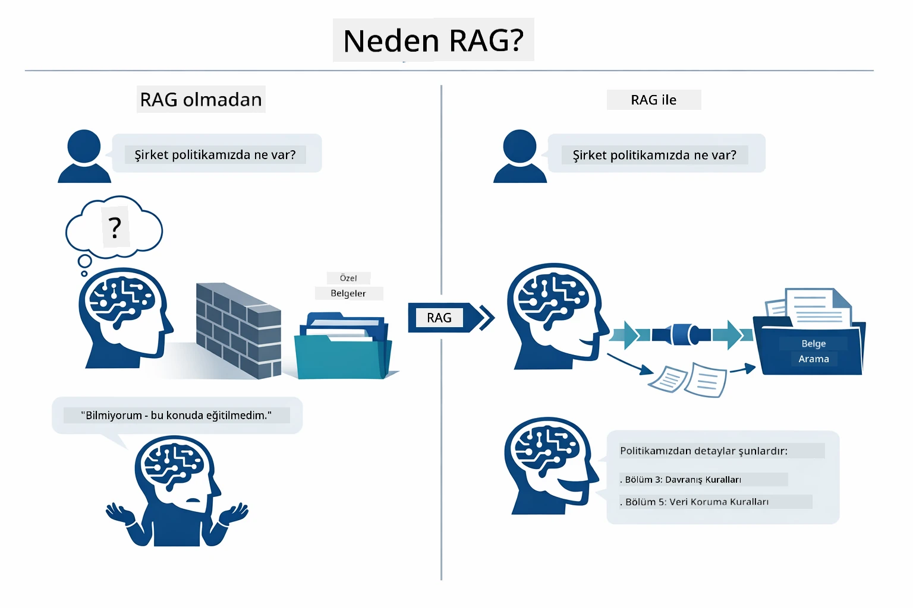

*Bu diyagram standart bir LLM (eğitimden tahmin yapar) ile RAG destekli bir LLM’in (önce dokümanlara bakar) farkını gösterir.*

Parçaların uçtan uca nasıl bağlandığı şöyle: bir kullanıcının sorusu dört aşamadan geçer—ekleme, vektör araması, bağlam derleme ve yanıt üretimi—her aşama öncekinin üzerine inşa edilir:


*Bu diyagram uçtan uca RAG boru hattını gösterir — kullanıcı sorgusu ekleme, vektör araması, bağlam derleme ve yanıt üretiminden geçer.*

Bu modülün geri kalan kısmı, çalıştırabileceğiniz ve değiştirebileceğiniz kodlarla her aşamayı detaylı anlatır.

### Bu Eğitim Hangi RAG Yaklaşımını Kullanıyor?

LangChain4j, farklı soyutlama düzeylerine sahip üç RAG uygulama yolu sunar. Aşağıdaki diyagram onları yan yana karşılaştırır:

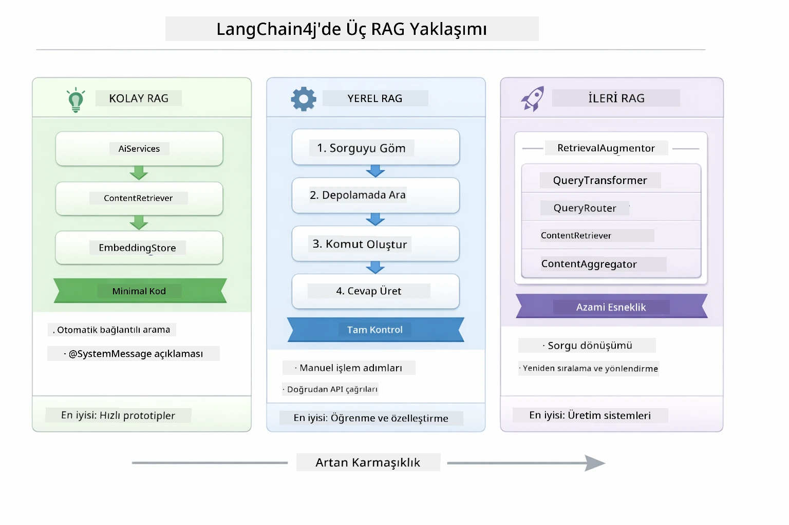

*Bu diyagram üç LangChain4j RAG yaklaşımını — Kolay, Yerel ve İleri — ana bileşenleri ve kullanım durumları ile karşılaştırır.*

| Yaklaşım | Ne Yapar | Dezavantaj |
|---|---|---|
| **Kolay RAG** | `AiServices` ve `ContentRetriever` ile her şeyi otomatik bağlar. Bir arayüzü açıklarsınız, bir arayıcı eklersiniz, LangChain4j arkada embed, arama ve istem derleme yapar. | Minimum kod, ama her adım gizlidir. |
| **Yerel RAG** | Embed modeli çağrılır, depoda arama yapılır, istem oluşturulur ve yanıt üretilir — her adım açıkça kontrol edilir. | Daha çok kod, ama her aşama görünür ve değiştirilebilir. |
| **İleri RAG** | Üretim kalitesinde boru hatları için `RetrievalAugmentor` çerçevesini kullanır, takılabilir sorgu dönüştürücüler, yönlendiriciler, yeniden sıralayıcılar ve içerik enjeksiyonlarıyla. | Maksimum esneklik, ancak önemli ölçüde karmaşıklık. |

**Bu eğitim Yerel yaklaşımı kullanır.** RAG boru hattının her aşaması — sorguyu eklemek, vektör mağazasında aramak, bağlam derlemek ve yanıt üretmek — [`RagService.java`](../../../03-rag/src/main/java/com/example/langchain4j/rag/service/RagService.java) dosyasında açıkça yazılmıştır. Bu bilinçli bir tercih: bir öğrenme kaynağı olarak, kodun minimize edilmesinden ziyade her aşamanın görülüp anlaşılması daha önemlidir. Parçaların nasıl bütünleştiğini anladıktan sonra hızlı prototipler için Kolay RAG’a, üretim sistemleri için de İleri RAG’a geçebilirsiniz.

> **💡 Kolay RAG’i zaten gördünüz mü?** [Hızlı Başlangıç modülü](../00-quick-start/README.md) Doküman Soru-Cevap örneği içerir ([`SimpleReaderDemo.java`](../../../00-quick-start/src/main/java/com/example/langchain4j/quickstart/SimpleReaderDemo.java)) — bu modül Kolay RAG yaklaşımını kullanır: LangChain4j otomatik olarak ekleme, arama ve istem derlemeyi yapar. Bu modül ise boru hattını açarak her aşamayı kendiniz görüp kontrol edebilmenizi sağlar.

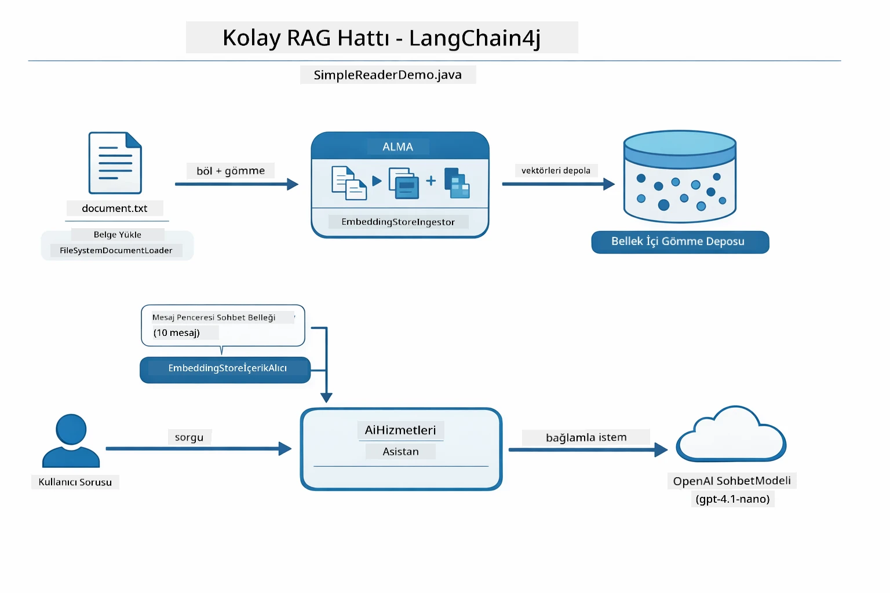

*Bu diyagram `SimpleReaderDemo.java` içindeki Kolay RAG boru hattını gösterir. Yerel yaklaşım ile karşılaştırın: Kolay RAG embedding, arama ve istem derlemeyi `AiServices` ve `ContentRetriever` arkasına saklar — dokümanı yüklersiniz, bir arayıcı eklersiniz ve yanıtları alırsınız. Bu modülde Yerel yaklaşım boru hattını açarak her aşamayı (embed et, ara, bağlam derle, üret) kendiniz çağırmanıza ve tam görünürlük ile kontrole sahip olmanıza olanak tanır.*

## Nasıl Çalışır

Bu modüldeki RAG boru hattı, bir kullanıcı soru sorduğunda art arda çalışan dört aşamaya ayrılır. Önce yüklenen doküman **parçalanır ve bölünür**. Bu parçalar sonra **vektör embedding**’lerine dönüştürülür ve matematiksel karşılaştırmaya uygun biçimde depolanır. Sorgu geldiğinde sistem en alakalı parçaları bulmak için **anlamsal arama** yapar, ardından bunları LLM’e **cevap üretimi** için bağlam olarak iletir. Aşağıdaki bölümler her aşamayı gerçek kod ve diyagramlarla anlatır. İlk adıma bakalım.

### Doküman İşleme

[DocumentService.java](../../../03-rag/src/main/java/com/example/langchain4j/rag/service/DocumentService.java)

Bir doküman yüklediğinizde sistem onu çözümler (PDF veya düz metin), dosya adı gibi meta veriler ekler ve sonra parçalar — modelin bağlam penceresine rahatça sığacak daha küçük parçalara bölünür. Bu parçalar biraz üst üste bindirilir ki sınırlarda bağlam kaybı olmasın.

```java
// Yüklenen dosyayı ayrıştırın ve LangChain4j Belgesinde sarın
Document document = Document.from(content, metadata);

// 30 token örtüşmeli 300 tokenlik parçalara bölün
DocumentSplitter splitter = DocumentSplitters
    .recursive(300, 30);

List<TextSegment> segments = splitter.split(document);
```

Aşağıdaki diyagram bunun görsel anlatımıdır. Her parçanın komşularıyla nasıl bazı token’ları paylaştığına dikkat edin — 30 token bindirme, önemli bağlamın kaybolmamasını sağlar:

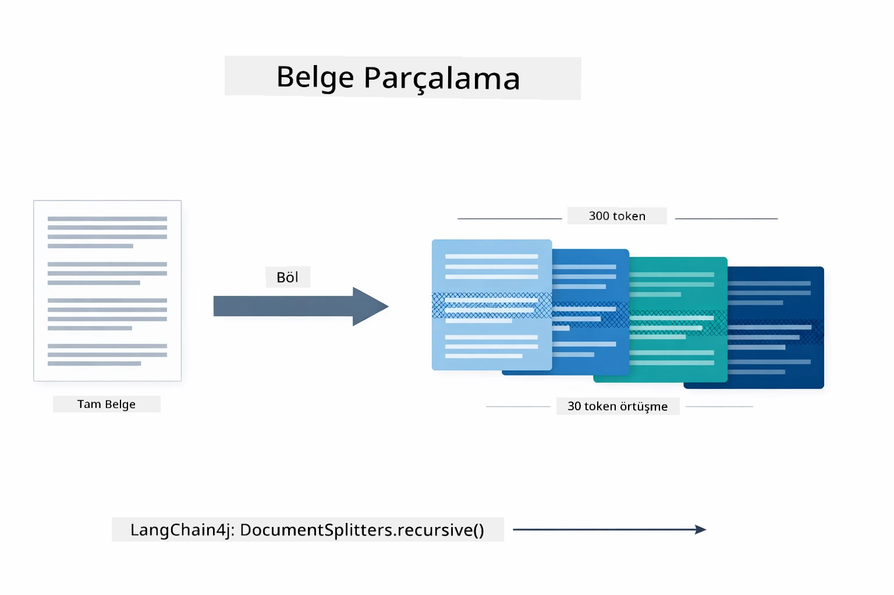

*Bu diyagram bir dokümanın 300 token’lık parçalar halinde 30 token bindirmeyle bölünmesini, bağlamın sınırda korunmasını gösterir.*

> **🤖 [GitHub Copilot](https://github.com/features/copilot) Chat ile deneyin:** [`DocumentService.java`](../../../03-rag/src/main/java/com/example/langchain4j/rag/service/DocumentService.java) dosyasını açın ve sorun:
> - "LangChain4j dokümanları nasıl parçalara ayırır ve bindirme neden önemli?"
> - "Farklı doküman tiplerine en uygun parça boyutu nedir ve neden?"
> - "Birden çok dil veya özel biçimlendirme içeren dokümanları nasıl işlerim?"

### Eklemler Oluşturma

[LangChainRagConfig.java](../../../03-rag/src/main/java/com/example/langchain4j/rag/config/LangChainRagConfig.java)

Her parça, embedding denen sayısal bir temsile dönüştürülür — özünde anlamı sayılara çeviren bir dönüştürücü. Embedding modeli, bir sohbet modeli gibi "zeka" sahibi değildir; talimat takip etmez, muhakeme yapmaz ya da soru yanıtlamaz. Yapabildiği, metni anlam benzerliğine göre matematiksel bir alana haritalamaktır — "araba" ile "otomobil" yakın, "iade politikası" ile "paramı geri al" yakın olur. Sohbet modeliyle konuştuğunuzu düşünün; embedding modeli ise çok iyi bir dosyalama sistemidir.

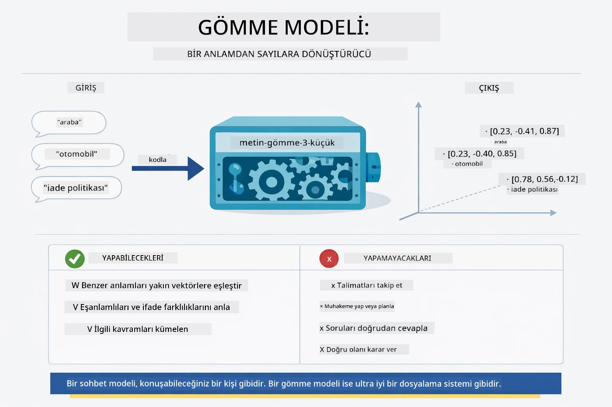

*Bu diyagram embedding modelinin metni sayısal vektörlere nasıl dönüştürdüğünü, benzer anlamların — "araba" ve "otomobil" gibi — vektör uzayında birbirine yakın yerleştiğini gösterir.*

```java
@Bean
public EmbeddingModel embeddingModel() {
    return OpenAiOfficialEmbeddingModel.builder()
        .baseUrl(azureOpenAiEndpoint)
        .apiKey(azureOpenAiKey)
        .modelName(azureEmbeddingDeploymentName)
        .build();
}

EmbeddingStore<TextSegment> embeddingStore = 
    new InMemoryEmbeddingStore<>();
```

Aşağıdaki sınıf diyagramı RAG boru hattındaki iki farklı akışı ve bunları uygulayan LangChain4j sınıflarını gösterir. **Alma akışı** (yükleme sırasında bir kere çalışır) dokümanı böler, parçaları embed eder ve `.addAll()` ile depolar. **Sorgu akışı** (her kullanıcı sorusunda çalışır) soruyu embed eder, `.search()` ile depoda arar ve bulunan bağlamı sohbet modeline iletir. İki akış ortak `EmbeddingStore<TextSegment>` arayüzünde birleşir:

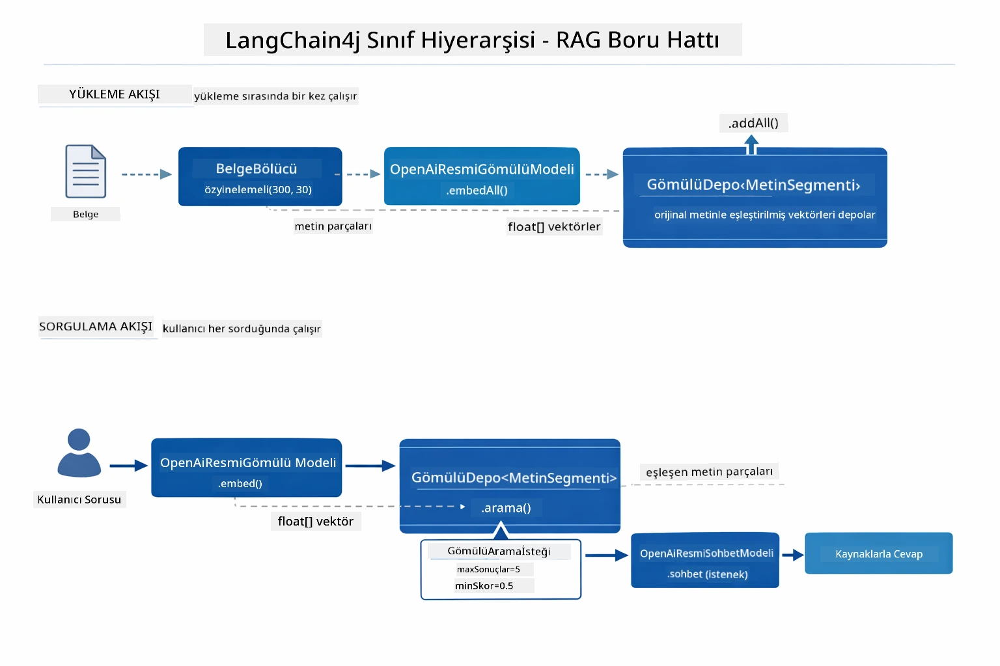

*Bu diyagram RAG boru hattındaki alma ve sorgu akışlarını ve bunların ortak bir EmbeddingStore üzerinden nasıl birleştiğini gösterir.*

Embeddingler depolandıktan sonra, benzer içerikler vektör uzayında doğal olarak kümelenir. Aşağıdaki görselleştirme, ilgili konulardaki dokümanların yakın noktalar olarak kümelendiğini, bunun da anlamsal aramayı mümkün kıldığını gösterir:


*Bu görselleştirme, Teknik Dokümanlar, İş Kuralları ve SSS gibi konuların ayrı gruplar oluşturduğu 3 boyutlu vektör uzayında ilişkili dokümanların nasıl kümelendiğini gösterir.*

Kullanıcı aradığında sistem dört adım izler: dokümanları bir kez embed eder, sorguyu her aramada embed eder, sorgu vektörünü tüm depolanmış vektörlerle kosinüs benzerliği ile karşılaştırır ve en yüksek puanlı üst-K parçaları döndürür. Aşağıdaki diyagram her adımı ve ilgili LangChain4j sınıflarını anlatır:

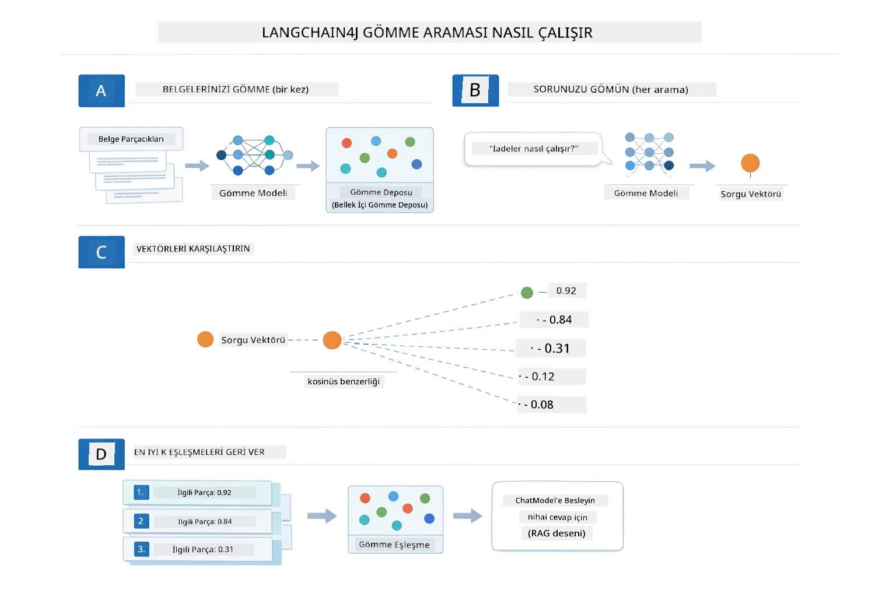

*Bu diyagram dört aşamalı embedding arama sürecini anlatır: doküman embed et, sorguyu embed et, kosinüs benzerliğiyle vektörleri karşılaştır ve en iyi K sonucu döndür.*

### Anlamsal Arama

[RagService.java](../../../03-rag/src/main/java/com/example/langchain4j/rag/service/RagService.java)

Soru sorduğunuzda, sorunuz da embed edilir. Sistem, sorunuzun embedding’ini tüm doküman parçalarının embedding’leriyle karşılaştırır. En benzer anlamdaki parçaları bulur — sadece anahtar kelime eşleşmesi değil, gerçek anlamsal benzerlik.

```java
Embedding queryEmbedding = embeddingModel.embed(question).content();

EmbeddingSearchRequest searchRequest = EmbeddingSearchRequest.builder()
    .queryEmbedding(queryEmbedding)
    .maxResults(5)
    .minScore(0.5)
    .build();

EmbeddingSearchResult<TextSegment> searchResult = embeddingStore.search(searchRequest);
List<EmbeddingMatch<TextSegment>> matches = searchResult.matches();

for (EmbeddingMatch<TextSegment> match : matches) {
    String relevantText = match.embedded().text();
    double score = match.score();
}
```

Aşağıdaki diyagram anlamsal aramayı geleneksel anahtar kelime aramasıyla karşılaştırır. "Araç" için yapılan anahtar kelime araması, "araba ve kamyonlar" hakkında bir parçayı kaçırır, ama anlamsal arama aynı anlama geldiklerini anlayıp onu yüksek puanla getirir:

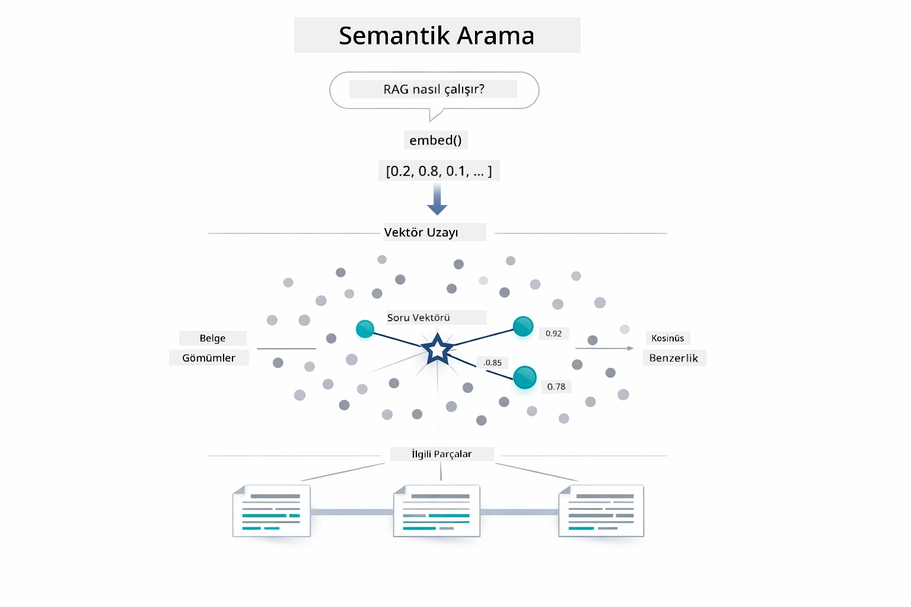

*Bu diyagram anahtar kelime tabanlı arama ile anlamsal aramayı karşılaştırır; anlamsal arama, tam anahtar kelimeler farklı olsa bile kavramsal olarak ilişkili içeriği getirir.*

Altta benzerlik, kosinüs benzerliği kullanılarak ölçülür — temelde "bu iki ok aynı yöne mi bakıyor?" sorusunu sorar. İki parça tamamen farklı kelimeler kullanabilir ama aynı anlama geliyorlarsa vektörleri aynı yönde olur ve puanları 1.0’a yakın olur:

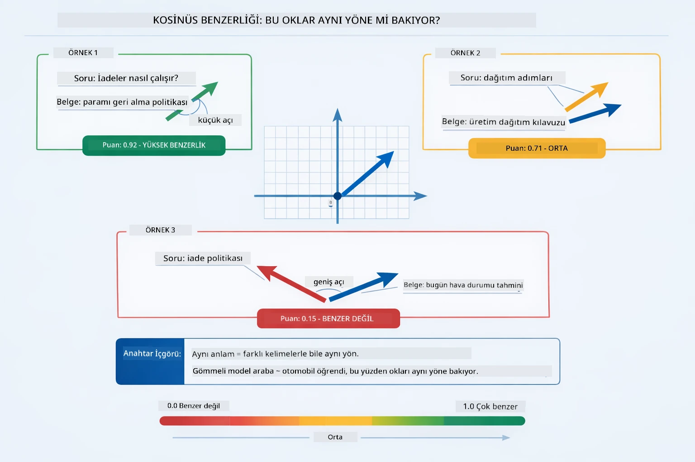

*Bu diyagram embedding vektörleri arasındaki açıyı (kosinüs benzerliğini) gösterir — daha hizalanmış vektörler 1.0’a yakın puan alır, yani daha yüksek anlamsal benzerlik gösterir.*
> **🤖 [GitHub Copilot](https://github.com/features/copilot) Sohbet ile Deneyin:** [`RagService.java`](../../../03-rag/src/main/java/com/example/langchain4j/rag/service/RagService.java) dosyasını açın ve sorun:
> - "Benzerlik araması gömme ile nasıl çalışır ve skoru ne belirler?"
> - "Hangi benzerlik eşik değerini kullanmalıyım ve bu sonuçları nasıl etkiler?"
> - "İlgili belge bulunamadığında nasıl işlem yapmalıyım?"

### Yanıt Üretimi

[RagService.java](../../../03-rag/src/main/java/com/example/langchain4j/rag/service/RagService.java)

En alakalı parçalar, açık talimatlar, alınan bağlam ve kullanıcının sorusunu içeren yapılandırılmış bir isteme yerleştirilir. Model, yalnızca önünde olan bilgileri okuyarak bu belirli parçaları kullanır ve buna göre yanıt verir — bu da hayal gücünü sınırlar.

```java
String context = matches.stream()
    .map(match -> match.embedded().text())
    .collect(Collectors.joining("\n\n"));

String prompt = String.format("""
    Answer the question based on the following context.
    If the answer cannot be found in the context, say so.

    Context:
    %s

    Question: %s

    Answer:""", context, request.question());

String answer = chatModel.chat(prompt);
```

Aşağıdaki diyagram bu birleştirmenin nasıl yapıldığını gösterir — arama adımından en yüksek puan alan parçalar istem şablonuna eklenir ve `OpenAiOfficialChatModel` bu verilere dayalı sağlam bir yanıt üretir:

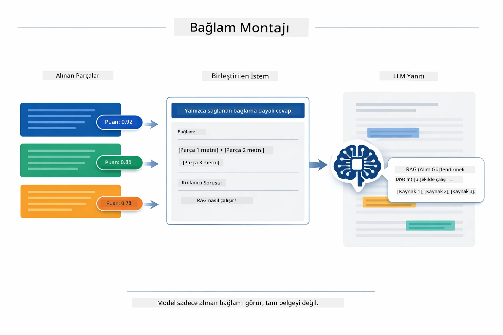

*Bu diyagram, en yüksek puanlı parçaların yapılandırılmış bir isteme nasıl birleştirildiğini gösterir ve modelin verilerinizden sağlam bir yanıt üretmesine olanak sağlar.*

## Uygulamayı Çalıştırma

**Dağıtımı doğrulayın:**

Kök dizinde Azure kimlik bilgileri içeren `.env` dosyasının var olduğundan emin olun (Modül 01 sırasında oluşturuldu):

**Bash:**
```bash
cat ../.env  # AZURE_OPENAI_ENDPOINT, API_KEY, DEPLOYMENT göstermeli
```

**PowerShell:**
```powershell
Get-Content ..\.env  # AZURE_OPENAI_ENDPOINT, API_KEY, DEPLOYMENT göstermeli
```

**Uygulamayı başlatın:**

> **Not:** Modül 01'deki `./start-all.sh` ile zaten tüm uygulamaları başlattıysanız, bu modül zaten 8081 portunda çalışıyor. Aşağıdaki başlatma komutlarını atlayabilir ve doğrudan http://localhost:8081 adresine gidebilirsiniz.

**Seçenek 1: Spring Boot Dashboard kullanarak (VS Code kullanıcıları için önerilir)**

Geliştirme konteyneri, tüm Spring Boot uygulamalarını yönetmek için görsel bir arayüz sağlayan Spring Boot Dashboard uzantısını içerir. Bunu VS Code’un sol tarafındaki Aktivite Çubuğunda Spring Boot simgesi olarak bulabilirsiniz.

Spring Boot Dashboard’dan şunları yapabilirsiniz:
- Çalışma alanındaki tüm mevcut Spring Boot uygulamalarını görüntüleyin
- Uygulamaları tek tıklamayla başlat/durdur
- Uygulama günlüklerini gerçek zamanlı izleyin
- Uygulama durumunu takip edin

Bu modülü başlatmak için "rag"ın yanındaki oynat düğmesine tıklayın ya da tüm modülleri aynı anda başlatın.


*Bu ekran görüntüsü, VS Code’da Spring Boot Dashboard’un uygulamaları görsel olarak başlatıp durdurup izlemenize olanak sağladığını gösteriyor.*

**Seçenek 2: Shell komut dosyaları kullanarak**

Tüm web uygulamalarını başlatın (modüller 01-04):

**Bash:**
```bash
cd ..  # Kök dizinden
./start-all.sh
```

**PowerShell:**
```powershell
cd ..  # Kök dizinden
.\start-all.ps1
```

Ya da sadece bu modülü başlatın:

**Bash:**
```bash
cd 03-rag
./start.sh
```

**PowerShell:**
```powershell
cd 03-rag
.\start.ps1
```

Her iki komut dosyası da otomatik olarak kök `.env` dosyasından ortam değişkenlerini yükler ve JAR dosyaları yoksa oluşturur.

> **Not:** Başlatmadan önce tüm modülleri elle derlemek isterseniz:
>
> **Bash:**
> ```bash
> cd ..  # Go to root directory
> mvn clean package -DskipTests
> ```

> **PowerShell:**
> ```powershell
> cd ..  # Go to root directory
> mvn clean package -DskipTests
> ```

Tarayıcınızda http://localhost:8081 adresini açın.

**Durdurmak için:**

**Bash:**
```bash
./stop.sh  # Yalnızca bu modül
# Veya
cd .. && ./stop-all.sh  # Tüm modüller
```

**PowerShell:**
```powershell
.\stop.ps1  # Sadece bu modül
# Veya
cd ..; .\stop-all.ps1  # Tüm modüller
```

## Uygulamayı Kullanma

Uygulama, belge yükleme ve soru sorma için web arayüzü sağlar.

<a href="images/rag-homepage.png"></a>

*Bu ekran görüntüsü, belge yükleyip sorular sorabildiğiniz RAG uygulama arayüzünü gösteriyor.*

### Belge Yükleme

Öncelikle bir belge yükleyin - test için TXT dosyaları en iyi sonucu verir. Bu dizinde LangChain4j özellikleri, RAG uygulaması ve en iyi uygulamalar hakkında bilgi içeren `sample-document.txt` dosyası bulunmaktadır - sistemi test etmek için ideal.

Sistem belgenizi işler, parçalara böler ve her parça için gömme oluşturur. Bu işlem yüklediğiniz anda otomatik olarak gerçekleşir.

### Sorular Sorun

Şimdi belge içeriği ile ilgili spesifik sorular sorabilirsiniz. Belgedeki açıkça belirtilmiş gerçeklere dayalı bir soru deneyin. Sistem ilgili parçaları arar, isteme ekler ve yanıt üretir.

### Kaynak Referanslarını Kontrol Edin

Her yanıtın, benzerlik skorlarıyla birlikte kaynak referanslarını içerdiğini fark edeceksiniz. Bu skorlar (0 ile 1 arasında), her parçanın soruyla ne kadar alakalı olduğunu gösterir. Yüksek skor daha iyi eşleşme demektir. Böylece yanıtı kaynakla karşılaştırabilirsiniz.

<a href="images/rag-query-results.png"></a>

*Bu ekran görüntüsünde, oluşturulan yanıt, kaynak referansları ve her alınan parça için ilgili skorlar gösterilmektedir.*

### Sorularla Deney Yapın

Farklı türden sorular deneyin:
- Spesifik gerçekler: "Ana konu nedir?"
- Karşılaştırmalar: "X ile Y arasındaki fark nedir?"
- Özetler: "Z hakkında önemli noktaları özetleyin."

Sorunuzun belge içeriğiyle uyumu arttıkça alaka skorlarının nasıl değiştiğine dikkat edin.

## Temel Kavramlar

### Parçalama Stratejisi

Belgeler, 300 token ve 30 token örtüşmeli parçalar halinde bölünür. Bu denge, her parçanın anlamlı bir bağlama sahip olmasını sağlar ve istem içinde çok sayıda parça yer almasını mümkün kılar.

### Benzerlik Skorları

Her alınan parçaya, kullanıcının sorusuyla ne kadar uyumlu olduğunu gösteren 0 ile 1 arasında bir benzerlik skoru atanır. Aşağıdaki diyagram, skor aralıklarını ve sistemin sonuçları nasıl filtrelediğini görselleştirir:

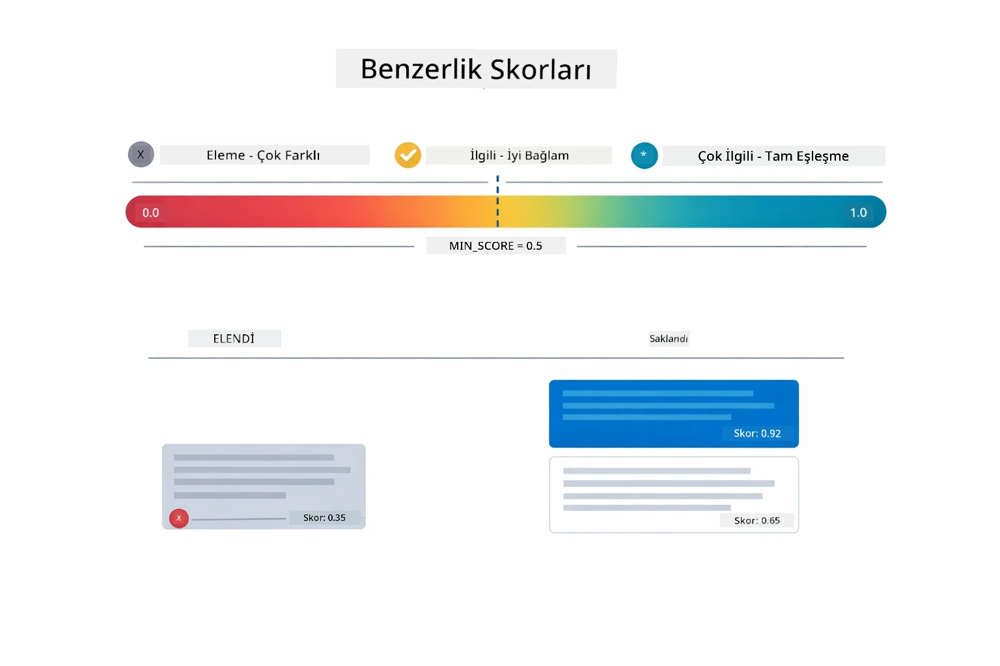

*Bu diyagram, 0 ile 1 arasındaki skor aralıklarını ve 0.5 olan minimum eşiğin ilgisiz parçaları filtrelediğini gösterir.*

Skorlar 0 ile 1 arasında değişir:
- 0.7-1.0: Yüksek alaka, tam eşleşme
- 0.5-0.7: Alakalı, iyi bağlam
- 0.5 altı: Filtrelenmiş, çok farklı

Sistem kaliteyi korumak için sadece minimum eşik üzerindeki parçaları getirir.

Gömme yöntemleri, anlamsal kümeler net olduğunda iyi çalışır fakat sınırlamaları vardır. Aşağıdaki diyagram, yaygın başarısızlık türlerini gösterir — çok büyük parçalar bulanık vektörler üretir, çok küçük parçalar bağlamdan yoksundur, belirsiz terimler birden çok kümeye işaret eder ve tam eşleşme aramaları (ID'ler, parça numaraları) gömme ile çalışmaz:

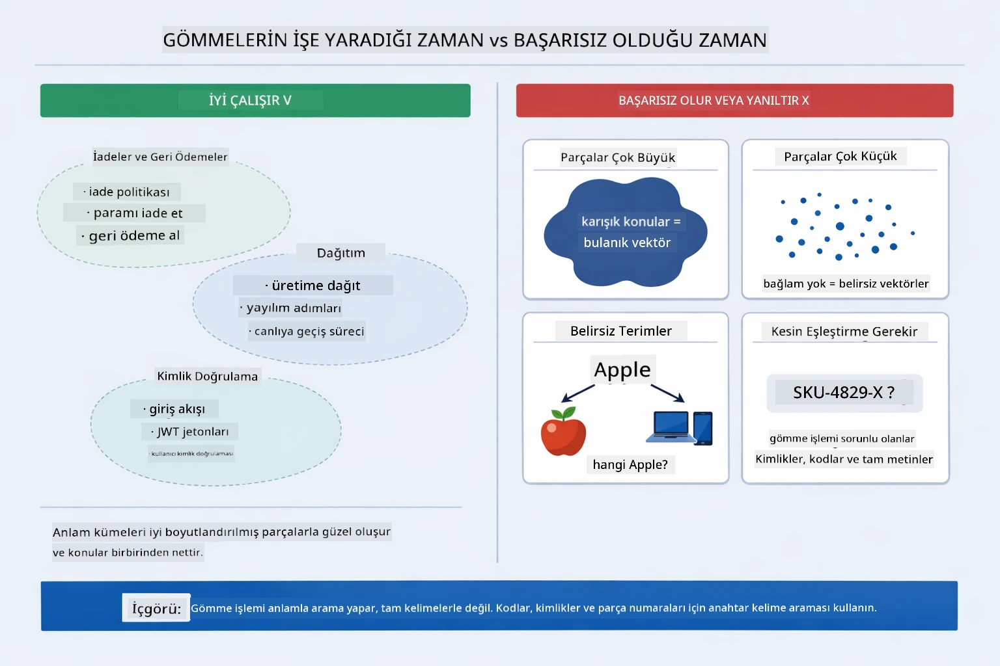

*Bu diyagram, yaygın gömme başarısızlık modlarını gösterir: çok büyük parçalar, çok küçük parçalar, birden fazla kümeye işaret eden belirsiz terimler ve tam eşleşme aramaları gibi durumlar.*

### Bellek İçi Depolama

Bu modül kolaylık için bellekte depolama kullanır. Uygulamayı yeniden başlattığınızda yüklenen belgeler kaybolur. Üretim ortamlarında Qdrant veya Azure AI Search gibi kalıcı vektör veritabanları kullanılır.

### Bağlam Penceresi Yönetimi

Her modelin maksimum bir bağlam penceresi vardır. Büyük belgelerin tüm parçalarını ekleyemezsiniz. Sistem, sınırlar içinde kalmak ve doğru yanıtlar için yeterli bağlam sağlamak amacıyla en alakalı N parça (varsayılan 5) alır.

## RAG Ne Zaman Önemlidir?

RAG her zaman doğru yöntem değildir. Aşağıdaki karar rehberi, RAG’ın değer kattığı durumları ve daha basit yöntemlerin — içerik doğrudan isteme eklenmesi veya modelin yerleşik bilgisine dayanma gibi — yeterli olduğu durumları gösterir:

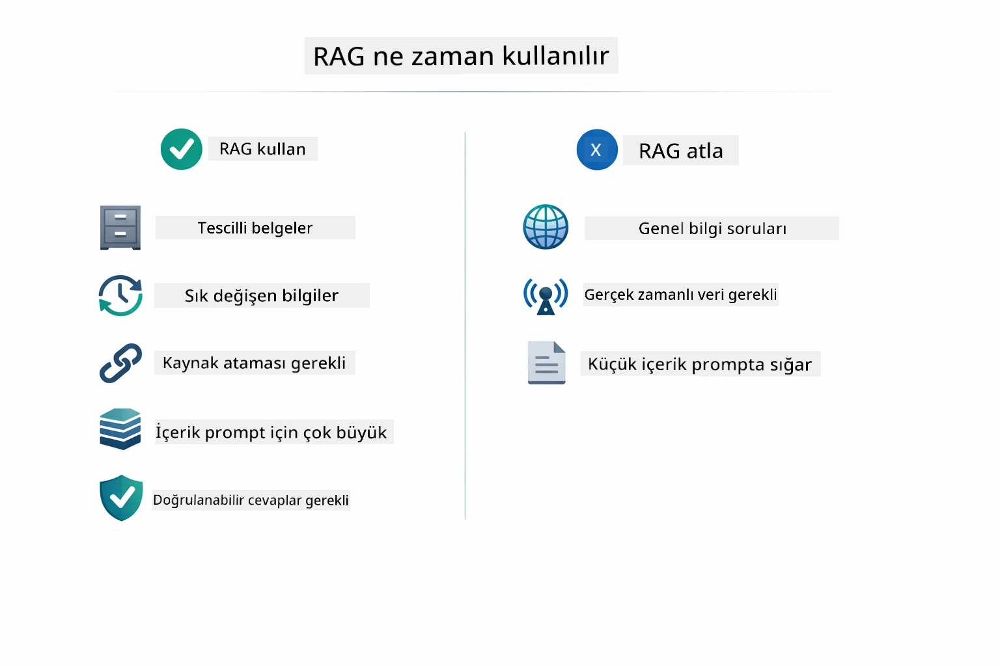

*Bu diyagram, RAG’ın değer kattığı ve basit yaklaşımların yeterli olduğu durumları gösteren karar rehberidir.*

**RAG kullanın:**
- Özel belgelerle ilgili soruları yanıtlarken
- Bilgi sıkça değişiyorsa (politikalar, fiyatlar, özellikler)
- Doğruluk kaynak ataması gerektiriyorsa
- İçerik tek bir istemde sığmayacak kadar büyükse
- Doğrulanabilir, sağlam yanıtlar gerektiğinde

**RAG kullanmayın:**
- Sorular modelin zaten bildiği genel bilgiye dayalıysa
- Gerçek zamanlı veri gerekiyorsa (RAG yalnızca yüklenen belgelerle çalışır)
- İçerik küçük ve doğrudan isteme sığabiliyorsa

## Sonraki Adımlar

**Sonraki Modül:** [04-tools - Araçlar ile Yapay Zeka Ajanları](../04-tools/README.md)

---

**Gezinme:** [← Önceki: Modül 02 - İsteme Mühendisliği](../02-prompt-engineering/README.md) | [Ana Sayfaya Dön](../README.md) | [Sonraki: Modül 04 - Araçlar →](../04-tools/README.md)

---

<!-- CO-OP TRANSLATOR DISCLAIMER START -->
**Feragatname**:
Bu belge, AI çeviri servisi [Co-op Translator](https://github.com/Azure/co-op-translator) kullanılarak çevrilmiştir. Doğruluk için çabalasak da, otomatik çevirilerin hatalar veya yanlışlıklar içerebileceğini lütfen unutmayınız. Orijinal belge, kendi dilindeki metin, yetkin kaynak olarak kabul edilmelidir. Önemli bilgiler için profesyonel insan çevirisi önerilir. Bu çevirinin kullanımı nedeniyle oluşabilecek yanlış anlamalar veya yanlış yorumlar konusunda sorumluluk kabul etmiyoruz.
<!-- CO-OP TRANSLATOR DISCLAIMER END -->