# Modül 04: Araçlara Sahip Yapay Zeka Ajanları

## İçindekiler

- [Video Rehberi](../../../04-tools)
- [Öğrenecekleriniz](../../../04-tools)
- [Ön Koşullar](../../../04-tools)
- [Araçlara Sahip Yapay Zeka Ajanlarını Anlamak](../../../04-tools)
- [Araç Çağrısı Nasıl Çalışır](../../../04-tools)
  - [Araç Tanımları](../../../04-tools)
  - [Karar Verme](../../../04-tools)
  - [Yürütme](../../../04-tools)
  - [Yanıt Üretimi](../../../04-tools)
  - [Mimari: Spring Boot Otomatik Bağlama](../../../04-tools)
- [Araç Zinciri](../../../04-tools)
- [Uygulamayı Çalıştırma](../../../04-tools)
- [Uygulamayı Kullanma](../../../04-tools)
  - [Basit Araç Kullanımını Deneyin](../../../04-tools)
  - [Araç Zincirini Test Edin](../../../04-tools)
  - [Konuşma Akışını Görün](../../../04-tools)
  - [Farklı Taleplerle Deneyler Yapın](../../../04-tools)
- [Temel Kavramlar](../../../04-tools)
  - [ReAct Deseni (Düşünme ve Hareket Etme)](../../../04-tools)
  - [Araç Açıklamaları Önemlidir](../../../04-tools)
  - [Oturum Yönetimi](../../../04-tools)
  - [Hata Yönetimi](../../../04-tools)
- [Mevcut Araçlar](../../../04-tools)
- [Araç Tabanlı Ajanları Ne Zaman Kullanmalı](../../../04-tools)
- [Araçlar vs RAG](../../../04-tools)
- [Sonraki Adımlar](../../../04-tools)

## Video Rehberi

Bu modüle nasıl başlanacağını açıklayan canlı oturumu izleyin:

<a href="https://www.youtube.com/watch?v=O_J30kZc0rw"></a>

## Öğrenecekleriniz

Şimdiye kadar AI ile nasıl sohbet edileceğini, yönlendirme (prompt) yapılarını etkin şekilde oluşturmayı ve yanıtları belgelerinizle ilişkilendirmeyi öğrendiniz. Ancak hâlâ temel bir sınırlama var: dil modelleri yalnızca metin oluşturabilir. Hava durumunu kontrol edemez, hesaplama yapamaz, veri tabanlarını sorgulayamaz veya dış sistemlerle etkileşime geçemez.

Araçlar bunu değiştirir. Modele çağırabileceği fonksiyonlara erişim vererek, onu metin üreticiden eylem alabilen bir ajana dönüştürürsünüz. Model ne zaman araca ihtiyacı olduğunu, hangi aracı kullanacağını ve hangi parametreleri geçeceğini belirler. Kodunuz fonksiyonu çalıştırır ve sonucu geri döner. Model bu sonucu yanıtına entegre eder.

## Ön Koşullar

- [Modül 01 - Giriş](../01-introduction/README.md) tamamlandı (Azure OpenAI kaynakları dağıtıldı)
- Önceki modüllerin tamamlanması önerilir (bu modül, Tools vs RAG karşılaştırmasında [Modül 03 RAG kavramlarına](../03-rag/README.md) referans verir)
- `.env` dosyası kök dizinde Azure kimlik bilgileri ile mevcut (Modül 01'de `azd up` ile oluşturuldu)

> **Not:** Modül 01'i tamamlamadıysanız, öncelikle oradaki dağıtım talimatlarını izleyin.

## Araçlara Sahip Yapay Zeka Ajanlarını Anlamak

> **📝 Not:** Bu modüldeki "ajanlar" terimi, araç çağırma yetenekleri ile geliştirilmiş yapay zeka asistanlarını ifade eder. Bu, [Modül 05: MCP](../05-mcp/README.md) içinde ele alacağımız **Agentic AI** (planlama, hafıza ve çok adımlı muhakeme gibi özelliklere sahip otonom ajanlar) desenlerinden farklıdır.

Araçlar olmadan, bir dil modeli sadece eğitim verilerinden metin oluşturabilir. Mevcut hava durumunu sorarsanız tahmin etmek zorundadır. Araç verin, hava durumu API'si çağırabilir, hesaplama yapabilir veya veri tabanını sorgulayabilir — sonra bu gerçek sonuçları yanıtına dahil eder.

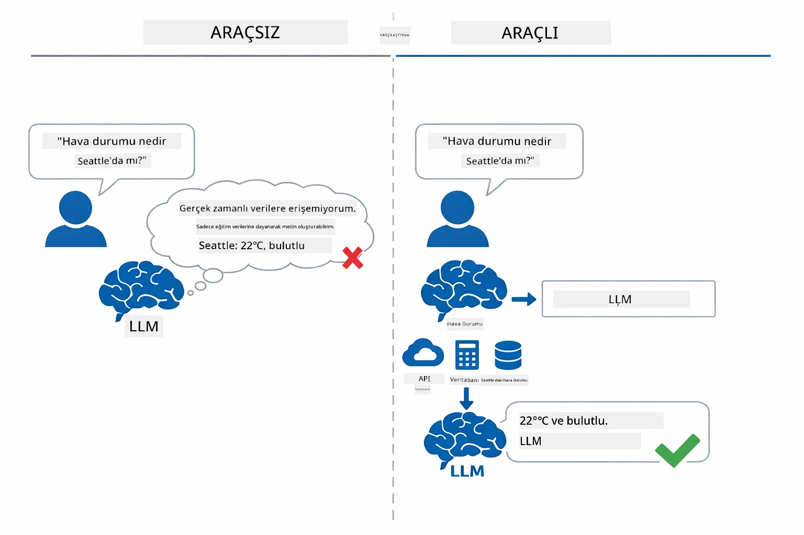

*Araç olmadan model sadece tahmin eder — araçlar sayesinde API çağırabilir, hesaplama yapabilir ve gerçek zamanlı veri dönebilir.*

Araçlara sahip AI ajanları **Düşünme ve Hareket Etme (ReAct)** desenini takip eder. Model sadece yanıt vermekle kalmaz — neye ihtiyacı olduğunu düşünür, bir aracı çağırarak eyleme geçer, sonucu gözlemler ve sonra tekrar mı hareket edeceğine yoksa nihai cevabı mı vereceğine karar verir:

1. **Düşün** — Ajan kullanıcının sorusunu analiz eder ve hangi bilgiye ihtiyaç duyduğunu belirler
2. **Harekete Geç** — Doğru aracı seçer, doğru parametreleri üretir ve çağırır
3. **Gözle** — Ajan aracın çıktısını alır ve sonucu değerlendirir
4. **Tekrarla veya Yanıtla** — Daha fazla veri gerekirse döngüye girer, yoksa doğal dil yanıtı oluşturur

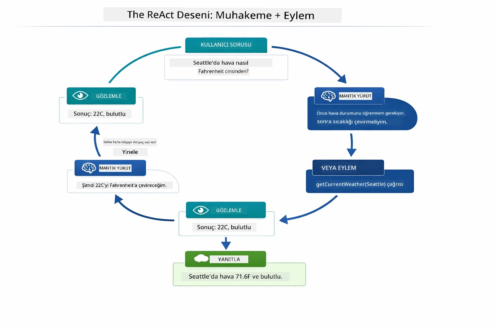

*ReAct döngüsü — ajan ne yapacağına karar verir, aracı çağırır, sonucu gözlemler ve nihai cevabı verene kadar döngüye devam eder.*

Bu süreç otomatik gerçekleşir. Siz araçları ve açıklamalarını tanımlarsınız. Model ne zaman ve nasıl kullanılacağına dair kararları kendisi verir.

## Araç Çağrısı Nasıl Çalışır

### Araç Tanımları

[WeatherTool.java](../../../04-tools/src/main/java/com/example/langchain4j/agents/tools/WeatherTool.java) | [TemperatureTool.java](../../../04-tools/src/main/java/com/example/langchain4j/agents/tools/TemperatureTool.java)

Fonksiyonları açık açıklamalar ve parametre tanımları ile belirlersiniz. Model bu açıklamaları sistem isteminde görür ve her aracın ne yaptığını anlar.

```java
@Component
public class WeatherTool {
    
    @Tool("Get the current weather for a location")
    public String getCurrentWeather(@P("Location name") String location) {
        // Hava durumu sorgulama mantığınız
        return "Weather in " + location + ": 22°C, cloudy";
    }
}

@AiService
public interface Assistant {
    String chat(@MemoryId String sessionId, @UserMessage String message);
}

// Asistan otomatik olarak Spring Boot tarafından şu şekilde bağlanır:
// - ChatModel bileşeni
// - @Component sınıflarından tüm @Tool metodları
// - Oturum yönetimi için ChatMemoryProvider
```
  
Aşağıdaki diyagram her anotasyonu ayırır ve her parçanın yapay zekanın aracı ne zaman çağıracağını ve hangi argümanları geçeceğini anlamasına nasıl yardımcı olduğunu gösterir:

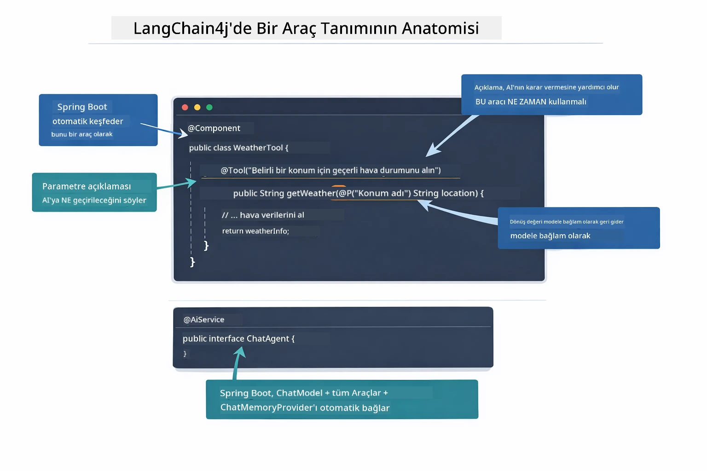

*Bir araç tanımının anatomisi — @Tool yapay zekaya ne zaman kullanacağını söyler, @P her parametreyi açıklar, ve @AiService her şeyi başlangıçta bağlar.*

> **🤖 [GitHub Copilot](https://github.com/features/copilot) Chat ile deneyin:** [`WeatherTool.java`](../../../04-tools/src/main/java/com/example/langchain4j/agents/tools/WeatherTool.java) dosyasını açın ve sorun:  
> - "Gerçek bir hava durumu API'si kullanmak için OpenWeatherMap yerine mock veriler yerine nasıl entegre ederim?"  
> - "Yapay zekanın doğru kullanmasını sağlayan iyi bir araç açıklaması nasıl olmalı?"  
> - "Araç uygulamalarında API hatalarını ve oran limitlerini nasıl yönetirim?"

### Karar Verme

Kullanıcı "Seattle'da hava nasıl?" diye sorduğunda, model rasgele bir araç seçmez. Kullanıcının amacını sahip olduğu her araç açıklaması ile karşılaştırır, her birini alaka düzeyine göre puanlar ve en uygun olanını seçer. Ardından doğru parametrelerle yapılandırılmış bir fonksiyon çağrısı oluşturur — bu örnekte `location` parametresine `"Seattle"` değeri atanır.

Eğer kullanıcının talebine uygun araç yoksa model bilgisiyle yanıt verir. Birden fazla uygun araç varsa en spesifik olanı seçer.

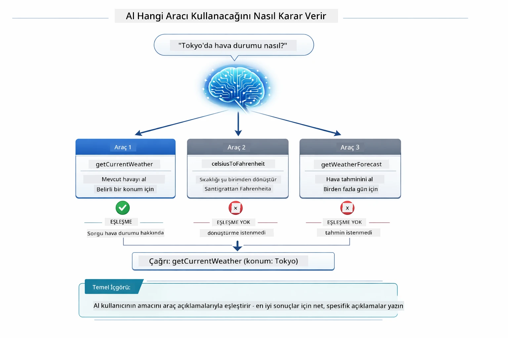

*Model, mevcut her aracı kullanıcının amacıyla değerlendirir ve en uygun olanı seçer — bu yüzden net ve spesifik araç açıklamaları önemlidir.*

### Yürütme

[AgentService.java](../../../04-tools/src/main/java/com/example/langchain4j/agents/service/AgentService.java)

Spring Boot, bildirisel `@AiService` arayüzünü tüm kayıtlı araçlarla otomatik bağlar ve LangChain4j araç çağrılarını otomatik yürütür. Sahne arkası, kullanıcının doğal dil sorusundan doğal dil yanıta kadar tam bir araç çağrısı akışı altı aşamadan geçer:

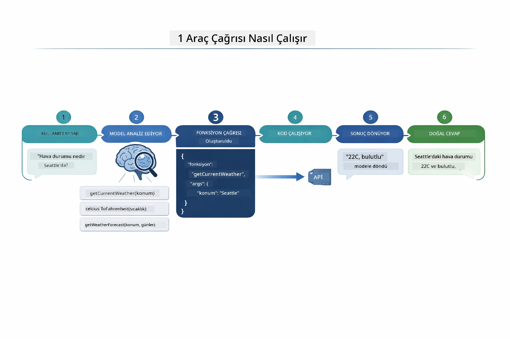

*Uçtan uca akış — kullanıcı soru sorar, model bir araç seçer, LangChain4j aracı çalıştırır ve model sonucu yanıt içine işler.*

Eğer Modül 00’teki [ToolIntegrationDemo](../../../00-quick-start/src/main/java/com/example/langchain4j/quickstart/ToolIntegrationDemo.java) çalıştırdıysanız bu desenin zaten nasıl işlediğini gördünüz — `Calculator` araçları benzer şekilde çağrıldı. Aşağıdaki dizin diyagramı demo sırasında tam olarak ne olduğunu gösterir:

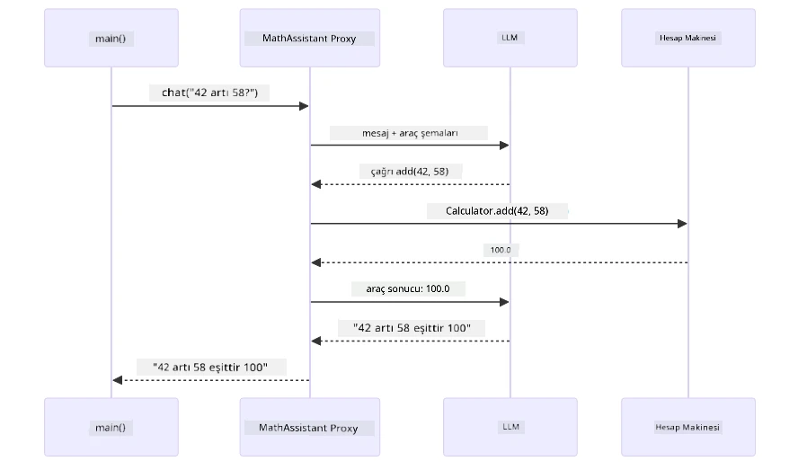

*Quick Start demosundaki araç çağrısı döngüsü — `AiServices` mesajınızı ve araç şemalarını LLM'ye gönderir, LLM `add(42, 58)` gibi fonksiyon çağrısı ile yanıt verir, LangChain4j `Calculator` metodunu yerel olarak çalıştırır ve sonucu nihai yanıt için geri besler.*

> **🤖 [GitHub Copilot](https://github.com/features/copilot) Chat ile deneyin:** [`AgentService.java`](../../../04-tools/src/main/java/com/example/langchain4j/agents/service/AgentService.java) dosyasını açın ve sorun:  
> - "ReAct deseni nasıl çalışır ve AI ajanları için neden etkilidir?"  
> - "Ajan hangi aracı kullanacağına ve hangi sırayla karar veriyor?"  
> - "Bir araç yürütmesi başarısız olursa ne olur — hataları sağlam şekilde nasıl yönetmeliyim?"

### Yanıt Üretimi

Model hava durumu verisini alır ve kullanıcı için doğal dil yanıtına dönüştürür.

### Mimari: Spring Boot Otomatik Bağlama

Bu modül, LangChain4j’nin Spring Boot entegrasyonunu bildirisel `@AiService` arayüzleri ile kullanır. Başlangıçta Spring Boot, `@Tool` metotları içeren her `@Component`’i, ChatModel bean’inizi ve ChatMemoryProvider’ı keşfeder — sonra hepsini tek bir `Assistant` arayüzünde sıfır kodla birbirine bağlar.

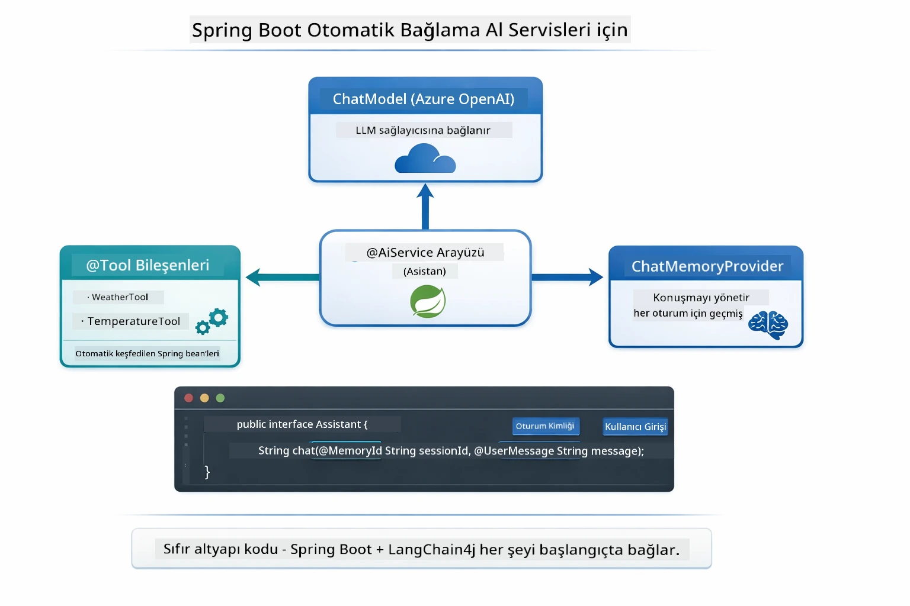

*@AiService arayüzü ChatModel, araç bileşenleri ve hafıza sağlayıcıyı bağlar — Spring Boot bağlantıları otomatik yönetir.*

İşte tam istek yaşam döngüsünün dizin diyagramı — HTTP isteğinden başlayarak controller, servis, otomatik bağlanan proxy, araç yürütme ve geri dönüşe kadar:

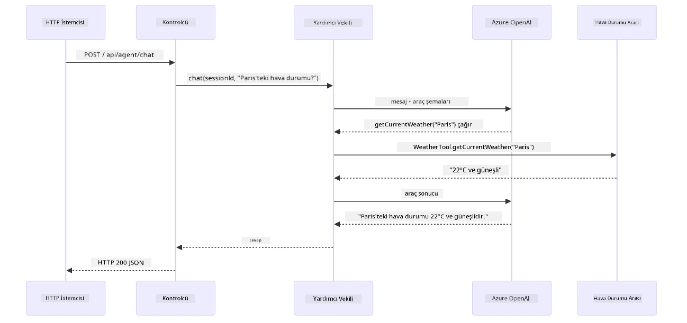

*Tam Spring Boot istek yaşam döngüsü — HTTP isteği controller ve servis üzerinden otomatik bağlanan Asistan proxy’sine akar, bu da LLM ve araç çağrılarını otomatik koordine eder.*

Bu yaklaşımın başlıca avantajları:

- **Spring Boot otomatik bağlama** — ChatModel ve araçlar otomatik olarak enjekte edilir
- **@MemoryId deseni** — Otomatik oturum temelli hafıza yönetimi
- **Tek örnek** — Asistan bir kez oluşturulur ve performans için tekrar kullanılır
- **Tip güvenli yürütme** — Java metotları doğrudan tip dönüşümü ile çağrılır
- **Çoklu tur orkestrasyonu** — Araç zincirlemesini otomatik yönetir
- **Sıfır kod tekrarları** — Manuel `AiServices.builder()` çağrısı veya hafıza için HashMap gerekmez

Alternatif yaklaşımlar (manuel `AiServices.builder()`) daha fazla kod gerektirir ve Spring Boot entegrasyonunun faydalarını kaçırır.

## Araç Zinciri

**Araç Zinciri** — Araç tabanlı ajanların gerçek gücü tek bir sorunun birden çok araç gerektirdiği durumlarda ortaya çıkar. "Seattle’da hava Fahrenheit cinsinden nasıl?" diye sorarsanız ajan otomatik olarak iki aracı zincirler: önce `getCurrentWeather`’i çağırır ve sıcaklığı Celcius cinsinden alır, sonra bu değeri `celsiusToFahrenheit` aracına geçirir — tümü tek bir konuşma turunda gerçekleşir.

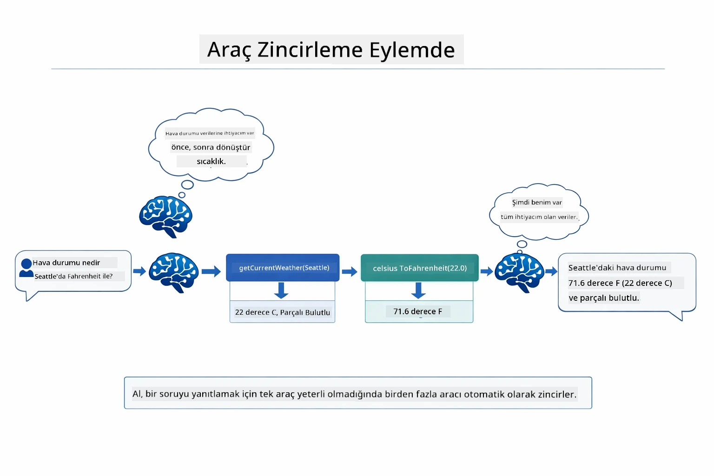

*Araç zinciri örneği — ajan önce getCurrentWeather'i çağırır, sonra Celcius sonucunu celsiusToFahrenheit aracına aktarır ve birleşik bir yanıt verir.*

**Kibar Hatalar** — Mock verilerde olmayan bir şehir için hava durumu isterseniz araç bir hata mesajı döner. Yapay zeka yardımcı olamayacağını açıklar, uygulama çökmez. Araçlar güvenli şekilde başarısız olur. Aşağıdaki diyagram iki yaklaşımı karşılaştırır — düzgün hata yönetimi ile ajan istisnayı yakalar ve açıklayıcı yanıt verir, olmadan tüm uygulama çöker:

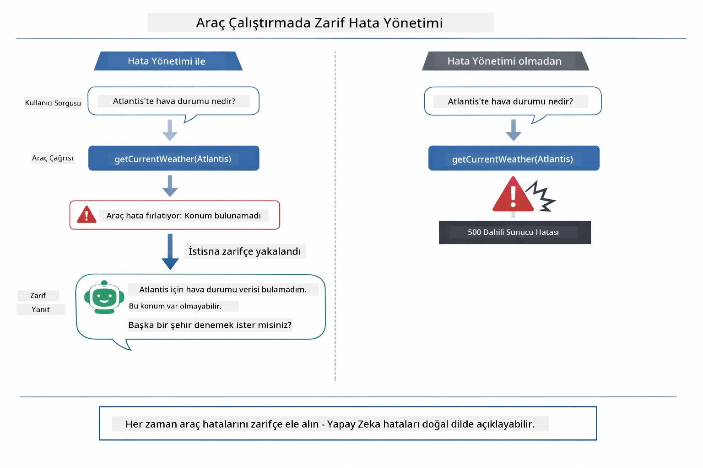

*Bir araç hata yaparsa ajan hatayı yakalar ve çökmek yerine yardımcı bir açıklama ile yanıt verir.*

Bu tek bir konuşma turunda olur. Ajan çoklu araç çağrılarını otonom şekilde orkestre eder.

## Uygulamayı Çalıştırma

**Dağıtımı doğrulayın:**

Azure kimlik bilgileri ile `.env` dosyasının kök dizinde var olduğundan emin olun (Modül 01’de oluşturuldu). Modül dizininden (`04-tools/`) şu komutları çalıştırın:

**Bash:**  
```bash
cat ../.env  # AZURE_OPENAI_ENDPOINT, API_KEY, DEPLOYMENT göstermeli
```
  
**PowerShell:**  
```powershell
Get-Content ..\.env  # AZURE_OPENAI_ENDPOINT, API_KEY, DEPLOYMENT göstermeli
```
  
**Uygulamayı başlatın:**

> **Not:** Eğer root dizinden `./start-all.sh` ile tüm uygulamaları zaten başlattıysanız (Modül 01’de anlatıldığı gibi), bu modül zaten 8084 portunda çalışıyor. Aşağıdaki başlatma komutlarını atlayabilir ve doğrudan http://localhost:8084 adresine gidebilirsiniz.

**Seçenek 1: Spring Boot Dashboard kullanmak (VS Code kullanıcıları için önerilir)**

Dev container, tüm Spring Boot uygulamalarını yönetmek için görsel arayüz sunan Spring Boot Dashboard uzantısını içerir. VS Code’un sol tarafındaki Aktivite Çubuğunda (Spring Boot simgesine bakın) bulabilirsiniz.

Spring Boot Dashboard’dan yapabilecekleriniz:  
- Çalışma alanında tüm mevcut Spring Boot uygulamalarını görme  
- Uygulamaları tek tıkla başlat/durdur  
- Uygulama günlüklerini gerçek zamanlı görüntüleme  
- Uygulama durumunu izleme
"tools" yanındaki oynat düğmesine tıklayarak bu modülü başlatın veya tüm modülleri aynı anda başlatın.

VS Code'daki Spring Boot Dashboard şöyle görünür:


*VS Code'daki Spring Boot Dashboard — tüm modülleri tek bir yerden başlatın, durdurun ve izleyin*

**Seçenek 2: Shell script kullanımı**

Tüm web uygulamalarını (modüller 01-04) başlat:

**Bash:**
```bash
cd ..  # Kök dizinden
./start-all.sh
```

**PowerShell:**
```powershell
cd ..  # Kök dizinden
.\start-all.ps1
```

Ya da sadece bu modülü başlat:

**Bash:**
```bash
cd 04-tools
./start.sh
```

**PowerShell:**
```powershell
cd 04-tools
.\start.ps1
```

Her iki script de root `.env` dosyasından ortam değişkenlerini otomatik olarak yükler ve JAR dosyaları yoksa derler.

> **Not:** Başlamadan önce tüm modülleri manuel olarak derlemeyi tercih ederseniz:
>
> **Bash:**
> ```bash
> cd ..  # Go to root directory
> mvn clean package -DskipTests
> ```
>
> **PowerShell:**
> ```powershell
> cd ..  # Go to root directory
> mvn clean package -DskipTests
> ```

Tarayıcınızda http://localhost:8084 adresini açın.

**Durdurmak için:**

**Bash:**
```bash
./stop.sh  # Yalnızca bu modül
# Veya
cd .. && ./stop-all.sh  # Tüm modüller
```

**PowerShell:**
```powershell
.\stop.ps1  # Sadece bu modül
# Veya
cd ..; .\stop-all.ps1  # Tüm modüller
```

## Uygulamanın Kullanımı

Uygulama, hava durumu ve sıcaklık dönüştürme araçlarına erişimi olan bir AI ajanıyla etkileşim kurabileceğiniz bir web arayüzü sağlar. Arayüz şöyle görünür — hızlı başlangıç örnekleri ve istek göndermek için bir sohbet paneli içerir:

<a href="images/tools-homepage.png"></a>

*AI Agent Tools arayüzü - araçlarla etkileşim için hızlı örnekler ve sohbet arayüzü*

### Basit Araç Kullanımını Deneyin

"100 derece Fahrenheit'ı Santigrata çevir" gibi basit bir istekle başlayın. Ajan, sıcaklık dönüştürme aracına ihtiyacı olduğunu anlar, doğru parametrelerle çağırır ve sonucu döner. Ne kadar doğal hissettirdiğine dikkat edin — hangi aracı kullanacağınızı ya da nasıl çağıracağınızı belirtmediniz.

### Araç Zincirlemeyi Test Edin

Şimdi daha karmaşık bir şey deneyin: "Seattle'daki hava durumu nedir ve bunu Fahrenheit'a çevir?" Ajanın adım adım nasıl çalıştığını gözlemleyin. Önce hava durumunu alır (Santigrat cinsinden döner), sonra Fahrenheit'a dönüştürmesi gerektiğini anlar, dönüşüm aracını çağırır ve her iki sonucu tek bir yanıtta birleştirir.

### Konuşma Akışını Görün

Sohbet arayüzü konuşma geçmişini korur, çok turlu etkileşimler yapmanızı sağlar. Önceki tüm sorguları ve yanıtları görebilirsiniz; böylece konuşmayı takip etmek ve ajanın bağlamı nasıl oluşturduğunu anlamak kolaydır.

<a href="images/tools-conversation-demo.png"></a>

*Basit dönüşümler, hava durumu sorgulamaları ve araç zincirleme gösteren çok turlu sohbet*

### Farklı İsteklerle Deney Yapın

Çeşitli kombinasyonları deneyin:
- Hava durumu sorgulamaları: "Tokyo'daki hava durumu nedir?"
- Sıcaklık dönüşümleri: "25°C kaç Kelvin?"
- Kombine sorgular: "Paris'teki hava durumunu kontrol et ve 20°C'nin üzerinde mi söyle"

Ajanın doğal dili nasıl yorumlayıp uygun araç çağrılarına dönüştürdüğüne dikkat edin.

## Temel Kavramlar

### ReAct Deseni (Muhakeme ve Eylem)

Ajan, muhakeme (ne yapılacağına karar verme) ve eylem (araçları kullanma) arasında geçiş yapar. Bu desen, sadece yanıt vermek yerine otonom problem çözmeyi mümkün kılar.

### Araç Tanımları Önemlidir

Araç tanımlarınızın kalitesi, ajanın onları ne kadar iyi kullandığını doğrudan etkiler. Açık, spesifik tanımlar modelin hangi aracı ne zaman ve nasıl çağıracağını anlamasına yardımcı olur.

### Oturum Yönetimi

`@MemoryId` notasyonu otomatik oturum bazlı bellek yönetimini sağlar. Her oturum ID'si, `ChatMemoryProvider` bean tarafından yönetilen kendi `ChatMemory` örneğini alır; böylece birden fazla kullanıcı ajana aynı anda, konuşmaları karışmadan erişebilir. Aşağıdaki diyagram, kullanıcıların oturum ID'lerine göre nasıl izole bellek depolarına yönlendirildiğini gösterir:

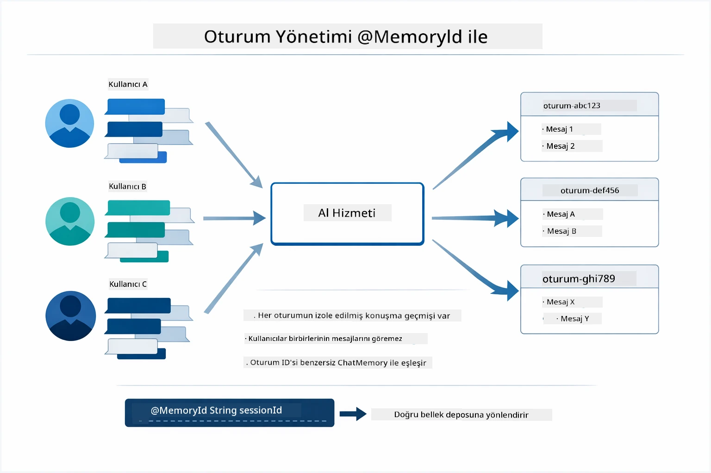

*Her oturum ID'si yalıtılmış bir konuşma geçmişine karşılık gelir — kullanıcılar birbirlerinin mesajlarını görmez.*

### Hata Yönetimi

Araçlar başarısız olabilir — API'ler zaman aşımına uğrayabilir, parametreler geçersiz olabilir, dış servisler kapanabilir. Üretim ajanlarının, modeli çökertmek yerine problemleri açıklayabilmesi veya alternatifleri deneyebilmesi için hata yönetimi gerekir. Bir araç istisna attığında, LangChain4j bunu yakalar ve hata mesajını modele geri besler; model de problemi doğal dilde açıklar.

## Mevcut Araçlar

Aşağıdaki diyagram, oluşturabileceğiniz geniş araç ekosistemini gösterir. Bu modül hava durumu ve sıcaklık araçlarını gösterir, ancak aynı `@Tool` deseni her türlü Java yöntemi için çalışır — veritabanı sorgularından ödeme işlemlerine kadar.

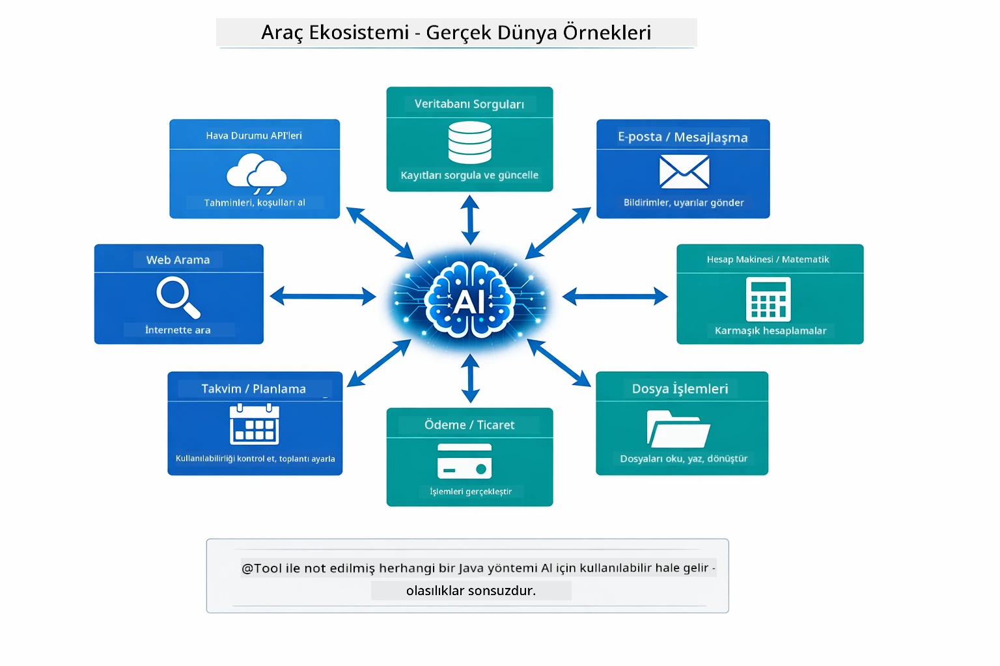

*@Tool ile işaretlenmiş herhangi bir Java yöntemi AI için kullanılabilir hale gelir — desen veritabanları, API'ler, e-posta, dosya işlemleri ve daha fazlasını kapsar.*

## Ne Zaman Araç Tabanlı Ajan Kullanılır

Her istek araç gerektirmez. Karar, AI'nın dış sistemlerle etkileşim kurup kurmaması ya da kendi bilgisiyle yanıt verebilmesine bağlıdır. Aşağıdaki rehber, araçların ne zaman değer kattığını ve ne zaman gereksiz olduğunu özetler:

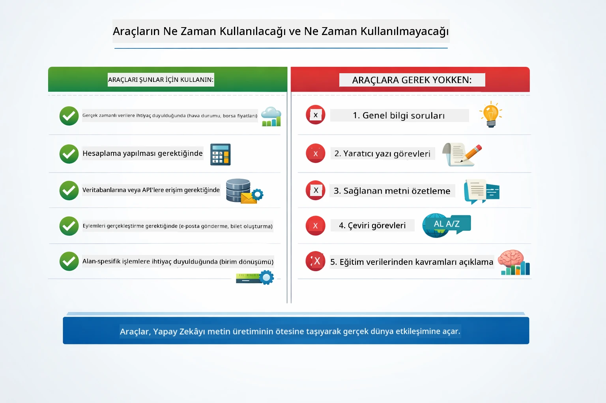

*Hızlı karar rehberi — araçlar gerçek zamanlı veri, hesaplama ve işlemler içindir; genel bilgi ve yaratıcı görevler için gerekmez.*

## Araçlar ve RAG Karşılaştırması

Modüller 03 ve 04, AI'nın yapabileceklerini genişletir fakat temel olarak farklı şekillerde. RAG modele **bilgi** erişimi sağlar — dökümanları getirir. Araçlar modele **eylem** yapma kabiliyeti verir — fonksiyonları çağırır. Aşağıdaki diyagram, her iki yaklaşımı yan yana karşılaştırır — her iş akışının nasıl çalıştığını ve aralarındaki farkları:

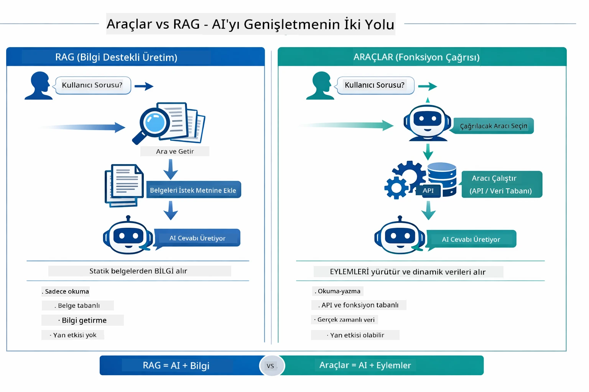

*RAG statik dökümanlardan bilgi getirir — Araçlar eylemler yapar ve dinamik, gerçek zamanlı veri alır. Pek çok üretim sistemi her iki yaklaşımı kombine eder.*

Pratikte, pek çok üretim sistemi her iki yaklaşımı birleştirir: RAG yanıtları belgelerde temellemek için, Araçlar ise canlı veri almak veya işlemler yapmak için.

## Sonraki Adımlar

**Sonraki Modül:** [05-mcp - Model Context Protocol (MCP)](../05-mcp/README.md)

---

**Gezinme:** [← Önceki: Modül 03 - RAG](../03-rag/README.md) | [Ana Sayfaya Dön](../README.md) | [Sonraki: Modül 05 - MCP →](../05-mcp/README.md)

---

<!-- CO-OP TRANSLATOR DISCLAIMER START -->
**Feragatname**:
Bu belge, AI çeviri hizmeti [Co-op Translator](https://github.com/Azure/co-op-translator) kullanılarak çevrilmiştir. Doğruluk için çaba göstermemize rağmen, otomatik çevirilerin hatalar veya yanlışlıklar içerebileceğini lütfen unutmayın. Orijinal belge, kendi dilinde yetkili kaynak olarak kabul edilmelidir. Kritik bilgiler için profesyonel insan çevirisi önerilir. Bu çevirinin kullanımı sonucu oluşabilecek herhangi bir yanlış anlama veya yorumlama için sorumluluk kabul edilmemektedir.
<!-- CO-OP TRANSLATOR DISCLAIMER END -->