# Modül 05: Model Context Protocol (MCP)

## İçindekiler

- [Ne Öğreneceksiniz](../../../05-mcp)
- [MCP Nedir?](../../../05-mcp)
- [MCP Nasıl Çalışır](../../../05-mcp)
- [Agent Modülü](../../../05-mcp)
- [Örneklerin Çalıştırılması](../../../05-mcp)
  - [Ön Koşullar](../../../05-mcp)
- [Hızlı Başlangıç](../../../05-mcp)
  - [Dosya İşlemleri (Stdio)](../../../05-mcp)
  - [Supervisor Agent](../../../05-mcp)
    - [Demoyu Çalıştırma](../../../05-mcp)
    - [Supervisor Nasıl Çalışır](../../../05-mcp)
    - [FileAgent MCP Araçlarını Çalışma Zamanında Nasıl Keşfeder](../../../05-mcp)
    - [Yanıt Stratejileri](../../../05-mcp)
    - [Çıktıyı Anlama](../../../05-mcp)
    - [Agent Modülü Özelliklerinin Açıklaması](../../../05-mcp)
- [Temel Kavramlar](../../../05-mcp)
- [Tebrikler!](../../../05-mcp)
  - [Sırada Ne Var?](../../../05-mcp)

## Ne Öğreneceksiniz

Konuşma tabanlı yapay zeka oluşturdunuz, istemleri (prompts) ustalıkla kullandınız, yanıtları belgelere dayandırdınız ve araçlarla ajanlar yarattınız. Ancak tüm bu araçlar sizin özel uygulamanız için özel olarak oluşturulmuştu. Peki ya AI’nıza herkesin oluşturup paylaşabileceği standart bir araç ekosistemine erişim verebilseydiniz? Bu modülde, Model Context Protocol (MCP) ve LangChain4j agent modülü ile bunu nasıl yapacağınızı öğreneceksiniz. Öncelikle basit bir MCP dosya okuyucuyu gösteriyoruz, ardından bunu Supervisor Agent desenini kullanarak gelişmiş agent iş akışlarına nasıl kolayca entegre edeceğimizi gösteriyoruz.

## MCP Nedir?

Model Context Protocol (MCP) tam da bunu sağlar — AI uygulamalarının dış araçları keşfetmesi ve kullanması için standart bir yol. Her veri kaynağı veya servis için özel entegrasyonlar yazmak yerine, yeteneklerini tutarlı biçimde sunan MCP sunucularına bağlanırsınız. AI ajanınız bu araçları otomatik olarak keşfedip kullanabilir.

Aşağıdaki diyagram farkı gösterir — MCP olmadan, her entegrasyon özel ve noktadan noktaya kablolama gerektirir; MCP ile tek bir protokol uygulamanızı herhangi bir araca bağlar:


*MCP Öncesi: Karmaşık nokta-noktaya entegrasyonlar. MCP Sonrası: Tek protokol, sonsuz olanak.*

MCP, AI geliştirmede temel bir sorunu çözer: her entegrasyon özeldir. GitHub erişmek mi istiyorsunuz? Özel kod. Dosya okumak mı? Özel kod. Veri tabanı sorgulamak mı? Özel kod. Ve bu entegrasyonlar başka AI uygulamalarıyla çalışmaz.

MCP bunu standartlaştırır. Bir MCP sunucu, araçları net açıklamalar ve şemalar ile sunar. Her MCP müşteri, bağlanabilir, mevcut araçları keşfedebilir ve kullanabilir. Bir kez oluşturun, her yerde kullanın.

Aşağıdaki diyagram bu mimariyi gösterir — tek bir MCP müşteri (yapay zeka uygulamanız), birden çok MCP sunucuya bağlanır ve her biri standart protokol ile kendi araç setini sunar:


*Model Context Protocol mimarisi — standartlaştırılmış araç keşfi ve yürütme*

## MCP Nasıl Çalışır

MCP’nin altında katmanlı bir mimari vardır. Java uygulamanız (MCP müşteri) mevcut araçları keşfeder, JSON-RPC isteklerini bir taşıma katmanı (Stdio veya HTTP) aracılığıyla gönderir ve MCP sunucu işlemleri yürütür ve sonuçları geri döner. Aşağıdaki diyagram protokolün her katmanını ayrıntılı gösterir:

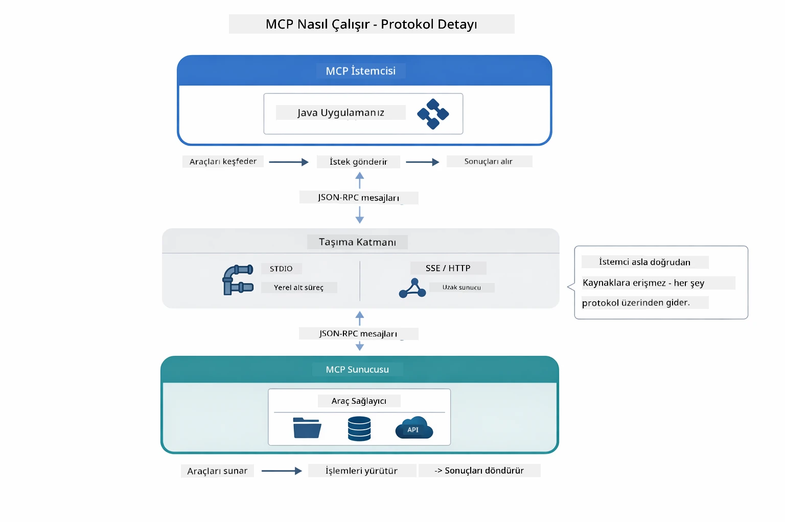

*MCP nasıl çalışır — müşteriler araçları keşfeder, JSON-RPC mesajları değiştirir ve taşıma katmanı üzerinden işlemler yürütür.*

**Sunucu-Müşteri Mimarisi**

MCP bir müşteri-sunucu modelidir. Sunucular araç sağlar — dosya okumak, veri tabanı sorgulamak, API çağırmak. Müşteriler (AI uygulamanız) sunuculara bağlanır ve araçları kullanır.

LangChain4j ile MCP kullanmak için bu Maven bağımlılığını ekleyin:

```xml
<dependency>
    <groupId>dev.langchain4j</groupId>
    <artifactId>langchain4j-mcp</artifactId>
    <version>${langchain4j.version}</version>
</dependency>
```

**Araç Keşfi**

Müşteriniz MCP sunucuya bağlandığında "Hangi araçlarınız var?" diye sorar. Sunucu mevcut araçların listesini, açıklamalar ve parametre şemaları ile yanıtlar. AI ajanınız kullanıcı isteklerine göre hangi araçları kullanacağına karar verebilir. Aşağıdaki diyagram bu el sıkışmayı gösterir — müşteri `tools/list` isteği gönderir, sunucu mevcut araçlarını açıklamalar ve parametre şemaları ile döner:

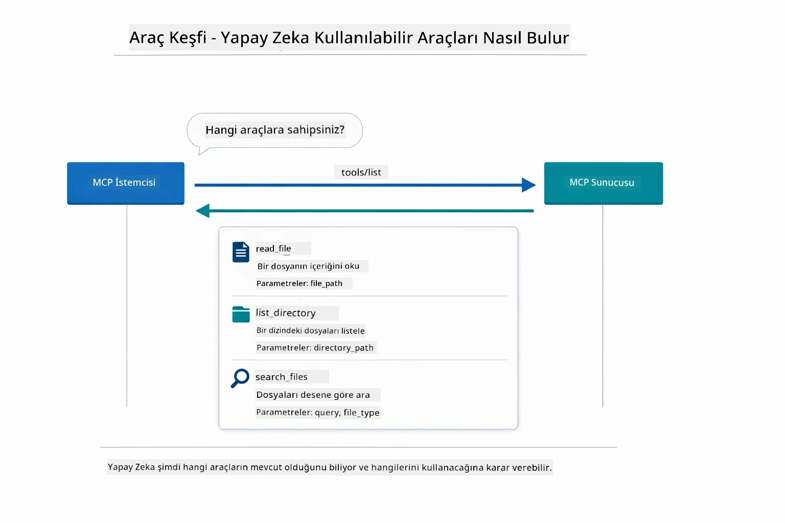

*AI başlangıçta mevcut araçları keşfeder — hangi yeteneklerin kullanılabilir olduğunu bilir ve hangilerini kullanacağına karar verir.*

**Taşıma Mekanizmaları**

MCP farklı taşıma mekanizmalarını destekler. İki seçenek vardır: Stdio (yerel alt süreç iletişimi için) ve Streamable HTTP (uzaktan sunucular için). Bu modülde Stdio taşımayı gösteriyoruz:


*MCP taşıma mekanizmaları: Uzaktan sunucular için HTTP, yerel süreçler için Stdio*

**Stdio** - [StdioTransportDemo.java](../../../05-mcp/src/main/java/com/example/langchain4j/mcp/StdioTransportDemo.java)

Yerel süreçler için. Uygulamanız bir sunucuyu alt süreç olarak başlatır ve standart giriş/çıkış aracılığıyla iletişim kurar. Dosya sistemi erişimi veya komut satırı araçları için kullanışlıdır.

```java
McpTransport stdioTransport = new StdioMcpTransport.Builder()
    .command(List.of(
        npmCmd, "exec",
        "@modelcontextprotocol/server-filesystem@2025.12.18",
        resourcesDir
    ))
    .logEvents(false)
    .build();
```

`@modelcontextprotocol/server-filesystem` sunucusu, belirttiğiniz dizinlerde sandbox edilmiş olarak aşağıdaki araçları sunar:

| Araç | Açıklama |
|------|----------|
| `read_file` | Tek bir dosyanın içeriğini okur |
| `read_multiple_files` | Birden fazla dosyayı tek çağrıda okur |
| `write_file` | Dosya oluşturur veya üzerine yazar |
| `edit_file` | Hedefli bul ve değiştir düzenlemeleri yapar |
| `list_directory` | Bir yoldaki dosya ve dizinleri listeler |
| `search_files` | Desene uyan dosyaları özyinelemeli arar |
| `get_file_info` | Dosya meta verisini alır (boyut, zaman damgaları, izinler) |
| `create_directory` | Dizin oluşturur (ebeveyn dizinlerle birlikte) |
| `move_file` | Dosya veya dizini taşır ya da yeniden adlandırır |

Aşağıdaki diyagram Stdio taşımanın çalışma zamanındaki akışını gösterir — Java uygulamanız MCP sunucusunu alt süreç olarak başlatır ve stdin/stdout boruları aracılığıyla iletişim kurar, ağ veya HTTP kullanılmaz:

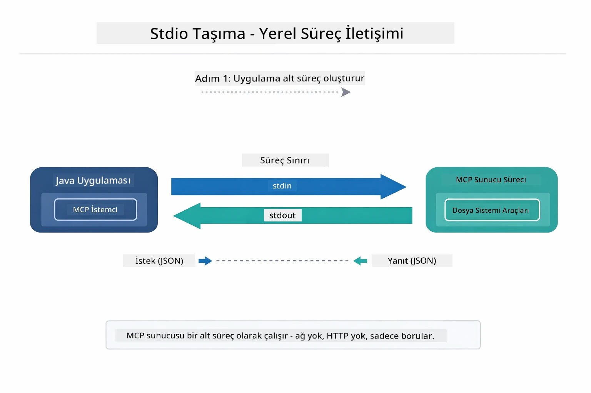

*Stdio taşımada uygulamanız MCP sunucusunu alt süreç olarak başlatır ve stdin/stdout ile iletişim kurar.*

> **🤖 [GitHub Copilot](https://github.com/features/copilot) Chat ile deneyin:** [`StdioTransportDemo.java`](../../../05-mcp/src/main/java/com/example/langchain4j/mcp/StdioTransportDemo.java) dosyasını açın ve sorun:
> - "Stdio taşıma nasıl çalışır ve HTTP ile ne zaman kullanmalıyım?"
> - "LangChain4j, başlatılan MCP sunucu işlemlerinin yaşam döngüsünü nasıl yönetir?"
> - "Yapay zekaya dosya sistemine erişim vermenin güvenlik sonuçları nelerdir?"

## Agent Modülü

MCP standart araçlar sunarken, LangChain4j'in **agent modülü**, bu araçları yöneten ajanlar oluşturmak için bildirimsel (declarative) bir yol sağlar. `@Agent` anotasyonu ve `AgenticServices`, ajan davranışlarını emir kipi kod yerine arayüzlerle tanımlamanıza imkan verir.

Bu modülde **Supervisor Agent** desenini keşfedeceksiniz — kullanıcının isteğine göre hangi alt ajanların çağrılacağını dinamik olarak belirleyen gelişmiş bir agent tabanlı AI yaklaşımı. Alt ajanlarımızdan birine MCP destekli dosya erişimi yetenekleri vererek her iki kavramı birleştireceğiz.

Agent modülünü kullanmak için bu Maven bağımlılığını ekleyin:

```xml
<dependency>
    <groupId>dev.langchain4j</groupId>
    <artifactId>langchain4j-agentic</artifactId>
    <version>${langchain4j.mcp.version}</version>
</dependency>
```
> **Not:** `langchain4j-agentic` modülü farklı bir sürüm takvimiyle yayınlandığı için ayrı bir sürüm özelliği (`langchain4j.mcp.version`) kullanır.

> **⚠️ Deneyseldir:** `langchain4j-agentic` modülü **deneysel** olup değişikliğe tabidir. Kararlı AI asistanları oluşturmanın yolu hâlâ `langchain4j-core` ve özel araçlar kullanmaktır (Modül 04).

## Örneklerin Çalıştırılması

### Ön Koşullar

- [Modül 04 - Araçlar](../04-tools/README.md) tamamlanmış olmalı (bu modül, özel araç kavramlarına dayanır ve MCP araçlarıyla karşılaştırır)
- Azure kimlik bilgileri içeren kök dizinde `.env` dosyası (Modül 01'de `azd up` ile oluşturulur)
- Java 21+, Maven 3.9+
- Node.js 16+ ve npm (MCP sunucuları için)

> **Not:** Ortam değişkenlerini henüz ayarlamadıysanız, dağıtım talimatları için [Modül 01 - Giriş](../01-introduction/README.md) dosyasına bakın (`azd up` otomatik olarak `.env` dosyasını oluşturur) veya `.env.example` dosyasını kök dizinde `.env` olarak kopyalayıp değerlerinizi doldurun.

## Hızlı Başlangıç

**VS Code Kullanarak:** Gezginde herhangi bir demo dosyasına sağ tıklayıp **"Run Java"** seçeneğini seçin veya Çalıştır ve Hata Ayıkla panelindeki başlatma yapılandırmalarını kullanın (önce `.env` dosyanızın Azure kimlik bilgileri ile yapılandırıldığından emin olun).

**Maven Kullanarak:** Alternatif olarak, örnekleri komut satırından aşağıdaki gibi çalıştırabilirsiniz.

### Dosya İşlemleri (Stdio)

Bu, yerel alt süreç tabanlı araçları gösterir.

**✅ Ön koşul gerektirmez** — MCP sunucu otomatik olarak başlatılır.

**Başlangıç Betikleri Kullanarak (Önerilen):**

Başlangıç betikleri kök `.env` dosyasından ortam değişkenlerini otomatik yükler:

**Bash:**
```bash
cd 05-mcp
chmod +x start-stdio.sh
./start-stdio.sh
```

**PowerShell:**
```powershell
cd 05-mcp
.\start-stdio.ps1
```

**VS Code Kullanarak:** `StdioTransportDemo.java` dosyasına sağ tıklayıp **"Run Java"** seçin (env dosyanızın yapılandırıldığından emin olun).

Uygulama otomatik olarak bir dosya sistemi MCP sunucusu başlatır ve yerel bir dosyayı okur. Alt süreç yönetiminin nasıl yapıldığına dikkat edin.

**Beklenen çıktı:**
```
Assistant response: The file provides an overview of LangChain4j, an open-source Java library
for integrating Large Language Models (LLMs) into Java applications...
```

### Supervisor Agent

**Supervisor Agent deseni**, agent tabanlı AI’da **esnek** bir yaklaşımdır. Bir Supervisor, kullanıcının isteğine göre hangi ajanların çağrılacağına otonom olarak LLM ile karar verir. Bir sonraki örnekte, MCP destekli dosya erişimini bir LLM ajanıyla birleştirerek denetimli bir dosya okuma → rapor oluşturma iş akışı yapıyoruz.

Demoda, `FileAgent` MCP dosya sistemi araçlarıyla dosya okur, `ReportAgent` ise yönetici özeti (1 cümle), 3 önemli nokta ve öneriler ile yapılandırılmış bir rapor oluşturur. Supervisor bu akışı otomatik yönetir:

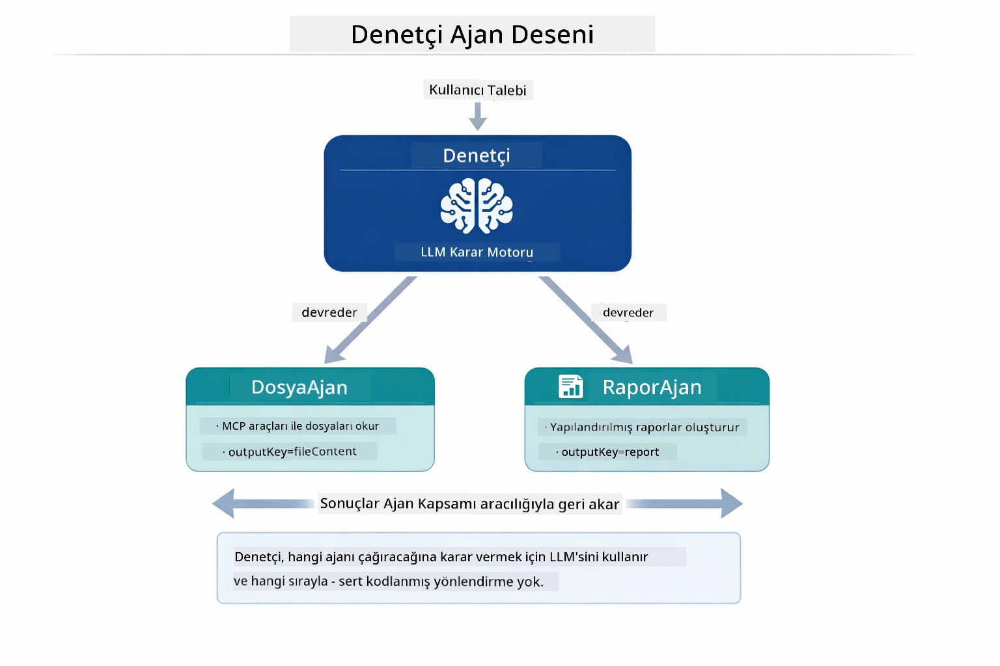

*Supervisor, hangi ajanların hangi sırayla çağrılacağına LLM ile karar verir — katı yönlendirme gerekmez.*

Dosyadan rapora boru hattında somut iş akışı şöyle görünür:

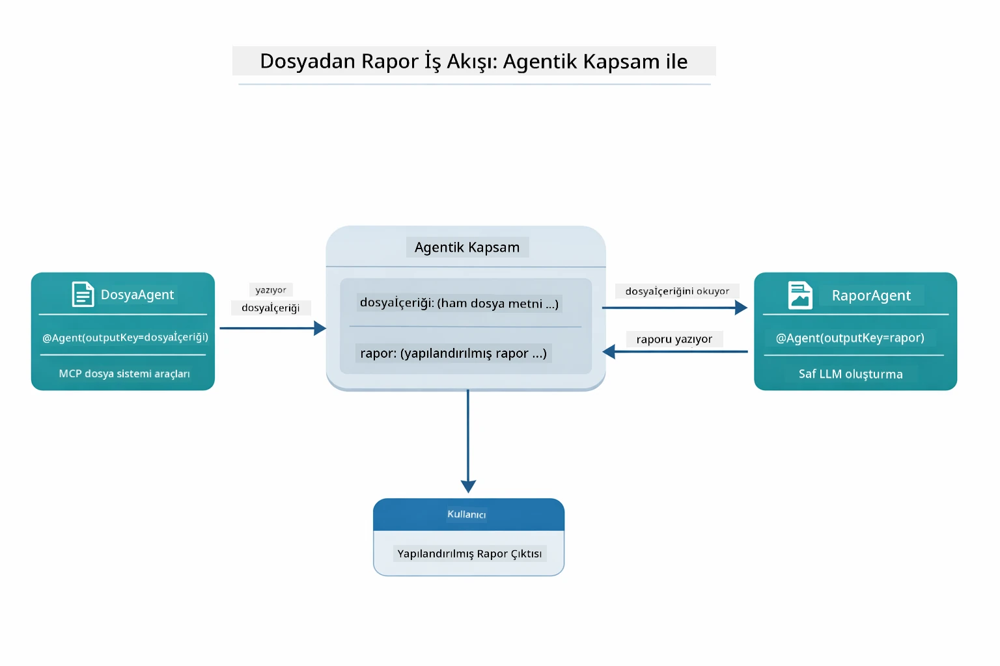

*FileAgent MCP araçlarıyla dosyayı okur, ardından ReportAgent ham içeriği yapılandırılmış rapora dönüştürür.*

Aşağıdaki sıra diyagramı Supervisor’un tam orkestrasyonunu izler — MCP sunucusunun başlatılmasından, Supervisor’un otonom ajan seçimine, stdio üzerinden araç çağrılarına ve nihai rapora kadar:

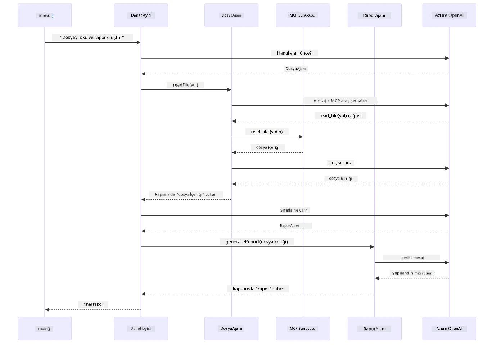

*Supervisor, dosyayı okumak için MCP sunucusunu stdio üzerinden çağıran FileAgent’i, ardından yapılandırılmış rapor üretmek için ReportAgent’i otonom çağırır — her ajan çıktısını paylaşılan Agentic Scope’a kaydeder.*

Her ajan çıktısını **Agentic Scope**’ta (paylaşılan bellek) saklar, böylece sonraki ajanlar önceki sonuçlara erişebilir. Bu, MCP araçlarının agent iş akışlarına sorunsuz entegrasyonunu gösterir — Supervisor dosyaların *nasıl* okunduğunu bilmek zorunda değil, sadece `FileAgent`’in bunu yapabileceğini bilir.

#### Demoyu Çalıştırma

Başlangıç betikleri kök `.env` dosyasından ortam değişkenlerini otomatik yükler:

**Bash:**
```bash
cd 05-mcp
chmod +x start-supervisor.sh
./start-supervisor.sh
```

**PowerShell:**
```powershell
cd 05-mcp
.\start-supervisor.ps1
```

**VS Code Kullanarak:** `SupervisorAgentDemo.java` dosyasına sağ tıklayıp **"Run Java"** seçin (env dosyanızın yapılandırıldığından emin olun).

#### Supervisor Nasıl Çalışır

Ajanları oluşturmadan önce, MCP taşımasını bir müşteriye bağlamanız ve bunu bir `ToolProvider` olarak sarmanız gerekir. MCP sunucusunun araçları böylece ajanlarınıza sunulur:

```java
// Transporttan bir MCP istemcisi oluştur
McpClient mcpClient = new DefaultMcpClient.Builder()
        .transport(stdioTransport)
        .build();

// İstemciyi bir ToolProvider olarak sarmala — bu, MCP araçlarını LangChain4j'ye bağlar
ToolProvider mcpToolProvider = McpToolProvider.builder()
        .mcpClients(List.of(mcpClient))
        .build();
```

Artık `mcpToolProvider`’ı MCP araçlarına ihtiyaç duyan herhangi bir ajana enjekte edebilirsiniz:

```java
// Adım 1: FileAgent, dosyaları MCP araçları kullanarak okur
FileAgent fileAgent = AgenticServices.agentBuilder(FileAgent.class)
        .chatModel(model)
        .toolProvider(mcpToolProvider)  // Dosya işlemleri için MCP araçlarına sahiptir
        .build();

// Adım 2: ReportAgent, yapılandırılmış raporlar oluşturur
ReportAgent reportAgent = AgenticServices.agentBuilder(ReportAgent.class)
        .chatModel(model)
        .build();

// Supervisor, dosya → rapor akışını düzenler
SupervisorAgent supervisor = AgenticServices.supervisorBuilder()
        .chatModel(model)
        .subAgents(fileAgent, reportAgent)
        .responseStrategy(SupervisorResponseStrategy.LAST)  // Son raporu döndür
        .build();

// Supervisor, isteğe göre hangi ajanların çağrılacağına karar verir
String response = supervisor.invoke("Read the file at /path/file.txt and generate a report");
```

#### FileAgent MCP Araçlarını Çalışma Zamanında Nasıl Keşfeder

Merak edebilirsiniz: **FileAgent npm dosya sistemi araçlarını nasıl kullanacağını nereden biliyor?** Cevap, *bilmiyor* — **LLM**, araç şemaları aracılığıyla bunu çalışma zamanında anlıyor.

`FileAgent` arayüzü sadece bir **istem (prompt) tanımıdır**. İçinde `read_file`, `list_directory` ya da başka bir MCP aracı hakkında sabit kodlanmış bilgi yoktur. Uçtan uca olan süreç şöyle işler:
1. **Sunucu başlatılır:** `StdioMcpTransport`, `@modelcontextprotocol/server-filesystem` npm paketini bir alt süreç olarak başlatır  
2. **Araç keşfi:** `McpClient`, sunucuya bir `tools/list` JSON-RPC isteği gönderir; sunucu araç adlarını, açıklamalarını ve parametre şemalarını döner (örneğin, `read_file` — *"Bir dosyanın tamamının içeriğini okur"* — `{ path: string }`)  
3. **Şema enjeksiyonu:** `McpToolProvider`, keşfedilen bu şemaları sarar ve LangChain4j’a erişilebilir hale getirir  
4. **LLM karar verir:** `FileAgent.readFile(path)` çağrıldığında, LangChain4j sistem mesajını, kullanıcı mesajını **ve araç şema listesini** LLM'ye gönderir. LLM araç açıklamalarını okur ve bir araç çağrısı üretir (örneğin, `read_file(path="/some/file.txt")`)  
5. **Yürütme:** LangChain4j araç çağrısını yakalar, MCP istemcisi aracılığıyla Node.js alt sürecine yönlendirir, sonucu alır ve LLM'ye geri besler  

Bu, yukarıda açıklanan aynı [Araç Keşfi](../../../05-mcp) mekanizmasıdır ancak özellikle ajan iş akışına uygulanmıştır. `@SystemMessage` ve `@UserMessage` açıklamaları LLM'nin davranışını yönlendirirken, enjekte edilen `ToolProvider` ona **yetenekler** sağlar — LLM, çalışma zamanında ikisini de birbirine bağlar.

> **🤖 [GitHub Copilot](https://github.com/features/copilot) Chat ile deneyin:** [`FileAgent.java`](../../../05-mcp/src/main/java/com/example/langchain4j/mcp/agents/FileAgent.java) dosyasını açın ve sorun:  
> - "Bu ajan hangi MCP aracını çağıracağını nasıl biliyor?"  
> - "Ajan yapıcıdan ToolProvider'ı kaldırırsam ne olur?"  
> - "Araç şemaları LLM'ye nasıl iletiliyor?"  

#### Yanıt Stratejileri  

Bir `SupervisorAgent` yapılandırdığınızda, alt ajanlar görevlerini tamamladıktan sonra kullanıcıya nihai cevabı nasıl sunacağı belirtilir. Aşağıdaki diyagram üç kullanılabilir stratejiyi gösterir — LAST son ajanın çıktısını doğrudan döner, SUMMARY tüm çıktıları LLM ile sentezler, SCORED ise orijinal isteğe göre daha yüksek puan alan sonucu seçer:

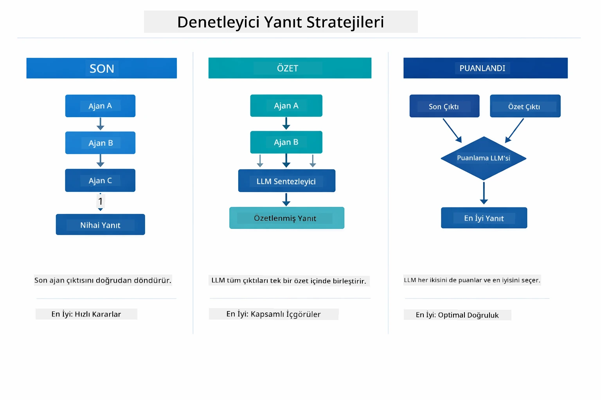

*Supervisor'un nihai yanıtı oluşturmak için kullandığı üç strateji — son ajanın çıktısı, sentezlenmiş özet veya en iyi puan alan seçeneğe göre tercihinizi yapın.*

Kullanılabilir stratejiler:

| Strateji | Açıklama |
|----------|----------|
| **LAST** | Supervisor, çağrılan son alt ajan veya aracın çıktısını döner. Bu, iş akışındaki son ajanın tamamlayıcı ve nihai cevabı üretmesi planlandığında faydalıdır (örneğin, araştırma hattında bir "Özet Ajanı"). |
| **SUMMARY** | Supervisor, kendi iç dil modelini (LLM) kullanarak tüm etkileşim ve alt ajan çıktılarını özetler ve bu özeti son yanıt olarak döner. Kullanıcıya temiz, birleşik bir cevap sağlar. |
| **SCORED** | Sistem, iç LLM kullanarak LAST cevabı ve SUMMARY özetini orijinal kullanıcı isteğine göre puanlar ve daha yüksek puan alan sonucu döner. |

Tam uygulama için [SupervisorAgentDemo.java](../../../05-mcp/src/main/java/com/example/langchain4j/mcp/SupervisorAgentDemo.java) dosyasına bakın.

> **🤖 [GitHub Copilot](https://github.com/features/copilot) Chat ile deneyin:** [`SupervisorAgentDemo.java`](../../../05-mcp/src/main/java/com/example/langchain4j/mcp/SupervisorAgentDemo.java) dosyasını açın ve sorun:  
> - "Supervisor hangi ajanları çağıracağına nasıl karar veriyor?"  
> - "Supervisor ile Ardışık iş akış desenleri arasındaki fark nedir?"  
> - "Supervisor'ün planlama davranışını nasıl özelleştirebilirim?"  

#### Çıktıyı Anlama  

Demo'yu çalıştırdığınızda, Supervisor'un birden çok ajanı nasıl yönettiğine dair yapılandırılmış bir anlatım göreceksiniz. Her bölümün anlamı şudur:

```
======================================================================
  FILE → REPORT WORKFLOW DEMO
======================================================================

This demo shows a clear 2-step workflow: read a file, then generate a report.
The Supervisor orchestrates the agents automatically based on the request.
```
  
**Başlık**, dosya okuma ile rapor üretimi arasındaki odaklanmış iş akışı kavramını tanıtır.

```
--- WORKFLOW ---------------------------------------------------------
  ┌─────────────┐      ┌──────────────┐
  │  FileAgent  │ ───▶ │ ReportAgent  │
  │ (MCP tools) │      │  (pure LLM)  │
  └─────────────┘      └──────────────┘
   outputKey:           outputKey:
   'fileContent'        'report'

--- AVAILABLE AGENTS -------------------------------------------------
  [FILE]   FileAgent   - Reads files via MCP → stores in 'fileContent'
  [REPORT] ReportAgent - Generates structured report → stores in 'report'
```
  
**İş Akışı Diyagramı**, ajanlar arasındaki veri akışını gösterir. Her ajanın belirli bir rolü vardır:  
- **FileAgent** MCP araçları kullanarak dosyaları okur ve ham içeriği `fileContent` içinde saklar  
- **ReportAgent** bu içeriği alır ve `report` içinde yapılandırılmış bir rapor üretir  

```
--- USER REQUEST -----------------------------------------------------
  "Read the file at .../file.txt and generate a report on its contents"
```
  
**Kullanıcı Talebi**, görevi gösterir. Supervisor bunu ayrıştırır ve FileAgent → ReportAgent'i çağırmaya karar verir.

```
--- SUPERVISOR ORCHESTRATION -----------------------------------------
  The Supervisor decides which agents to invoke and passes data between them...

  +-- STEP 1: Supervisor chose -> FileAgent (reading file via MCP)
  |
  |   Input: .../file.txt
  |
  |   Result: LangChain4j is an open-source, provider-agnostic Java framework for building LLM...
  +-- [OK] FileAgent (reading file via MCP) completed

  +-- STEP 2: Supervisor chose -> ReportAgent (generating structured report)
  |
  |   Input: LangChain4j is an open-source, provider-agnostic Java framew...
  |
  |   Result: Executive Summary...
  +-- [OK] ReportAgent (generating structured report) completed
```
  
**Supervisor Yönlendirmesi**, 2 aşamalı akışı gösterir:  
1. **FileAgent** MCP aracılığıyla dosyayı okur ve içeriği saklar  
2. **ReportAgent** içeriği alır ve yapılandırılmış rapor oluşturur  

Supervisor bu kararları **kendi başına** kullanıcının isteğine göre vermiştir.

```
--- FINAL RESPONSE ---------------------------------------------------
Executive Summary
...

Key Points
...

Recommendations
...

--- AGENTIC SCOPE (Data Flow) ----------------------------------------
  Each agent stores its output for downstream agents to consume:
  * fileContent: LangChain4j is an open-source, provider-agnostic Java framework...
  * report: Executive Summary...
```
  
#### Agentic Modül Özelliklerinin Açıklaması

Örnek, agentic modülün birçok gelişmiş özelliğini gösterir. Şimdi Agentic Scope ve Agent Dinleyicilerine yakından bakalım.

**Agentic Scope**, ajanların `@Agent(outputKey="...")` kullanarak sonuçlarını sakladığı paylaşılan belleği gösterir. Bu, şunlara imkan verir:  
- Daha sonra gelen ajanlar önceki ajanların çıktısına erişebilir  
- Supervisor nihai bir yanıt sentezleyebilir  
- Siz her ajanın ne ürettiğini inceleyebilirsiniz  

Aşağıdaki diyagram, Agentic Scope'un dosyadan rapora iş akışında paylaşılan bellek olarak nasıl çalıştığını gösterir — FileAgent çıktısını `fileContent` anahtarı altında yazar, ReportAgent onu okur ve kendi çıktısını `report` altında yazar:

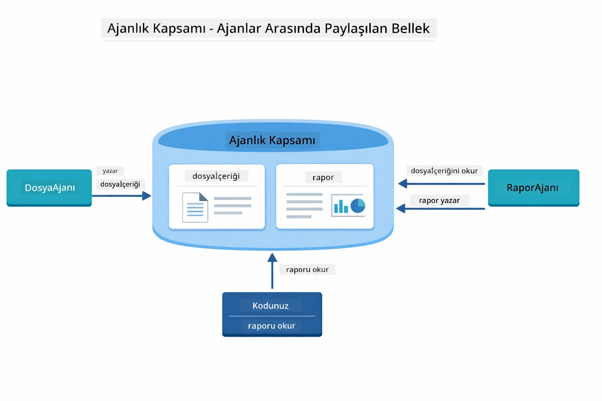

*Agentic Scope paylaşılan bellek olarak işlev görür — FileAgent `fileContent` yazar, ReportAgent okur ve `report` yazar, kodunuz nihai sonucu okur.*

```java
ResultWithAgenticScope<String> result = supervisor.invokeWithAgenticScope(request);
AgenticScope scope = result.agenticScope();
String fileContent = scope.readState("fileContent");  // FileAgent'ten ham dosya verisi
String report = scope.readState("report");            // ReportAgent'ten yapılandırılmış rapor
```
  
**Agent Dinleyiciler**, ajan yürütmesini izleme ve hata ayıklama olanağı sağlar. Demosunda adım adım çıkan çıktı, her ajan çağrısına bağlanan bir AgentListener'dan gelir:  
- **beforeAgentInvocation** - Supervisor bir ajan seçtiğinde çağrılır; hangi ajanın neden seçildiğini görmenizi sağlar  
- **afterAgentInvocation** - Ajan tamamlandığında çağrılır; sonucunu gösterir  
- **inheritedBySubagents** - true ise, dinleyici tüm hiyerarşideki ajanları izler  

Aşağıdaki diyagram, Agent Listener yaşam döngüsünü tam gösterir; `onError` ajan yürütme sırasında hataları nasıl ele alır:

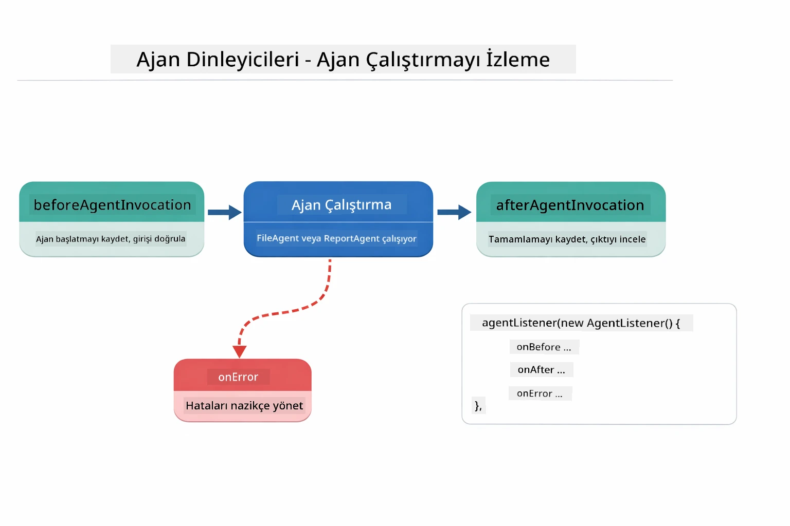

*Agent Dinleyiciler yürütme yaşam döngüsüne bağlanır — ajanların başlamasını, tamamlanmasını veya hata almasını izleyin.*

```java
AgentListener monitor = new AgentListener() {
    private int step = 0;
    
    @Override
    public void beforeAgentInvocation(AgentRequest request) {
        step++;
        System.out.println("  +-- STEP " + step + ": " + request.agentName());
    }
    
    @Override
    public void afterAgentInvocation(AgentResponse response) {
        System.out.println("  +-- [OK] " + response.agentName() + " completed");
    }
    
    @Override
    public boolean inheritedBySubagents() {
        return true; // Tüm alt ajanlara ilet
    }
};
```
  
Supervisor deseninin ötesinde, `langchain4j-agentic` modülü çeşitli güçlü iş akış desenleri sağlar. Aşağıdaki diyagram beşini gösterir — basit ardışık hatlardan insan denetimli onay iş akışlarına kadar:

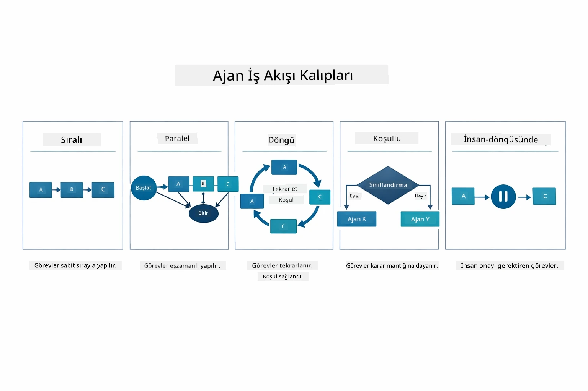

*Ajanları düzenlemek için beş iş akış deseni — basit ardışık hatlardan insan denetimli onay iş akışlarına kadar.*

| Desen | Açıklama | Kullanım Durumu |
|-------|----------|-----------------|
| **Ardışık** | Ajanları sırayla çalıştırır, çıktı sonraki aşamaya akar | Hatlar: araştır → analiz → rapor |
| **Paralel** | Ajanları eşzamanlı çalıştırır | Bağımsız görevler: hava durumu + haberler + hisse senetleri |
| **Döngü** | Koşul sağlanana kadar iterasyon yapar | Kalite puanı: puan ≥ 0.8 olana kadar iyileştir |
| **Koşullu** | Koşullara göre yönlendirir | Sınıflandır → uzman ajana yönlendir |
| **İnsan Denetimli** | İnsan onay noktaları ekler | Onay iş akışları, içerik denetimi |

## Temel Kavramlar

Artık MCP ve agentic modülü uygulamalı gördüğünüze göre, her yaklaşımı ne zaman kullanacağınıza özetle bakalım.

MCP'nin en büyük avantajlarından biri büyüyen ekosistemidir. Aşağıdaki diyagram, evrensel bir protokolün AI uygulamanızı çeşitli MCP sunucularına nasıl bağladığını gösterir — dosya sistemi ve veritabanı erişimlerinden GitHub, e-posta, web kazıma ve daha fazlasına:

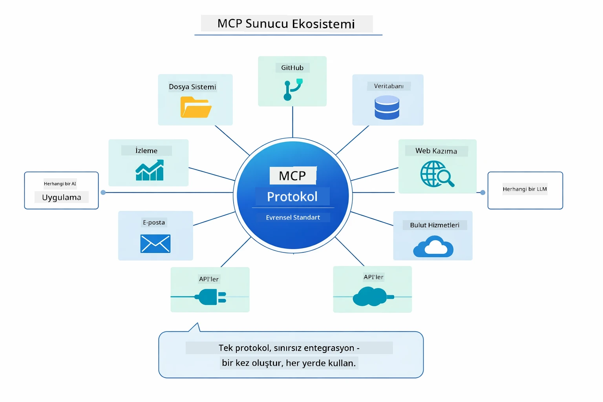

*MCP, evrensel bir protokol ekosistemi yaratır — her MCP uyumlu sunucu, her MCP uyumlu istemci ile çalışır; araç paylaşımını uygulamalar arasında mümkün kılar.*

**MCP**, mevcut araç ekosistemlerinden yararlanmak istediğinizde, birden çok uygulamanın paylaşabileceği araçlar oluşturmak istediğinizde, üçüncü taraf hizmetlerini standart protokollerle entegre etmek istediğinizde veya kodu değiştirmeden araç uygulamalarını değiştirmek istediğinizde idealdir.

**Agentic Modül**, `@Agent` açıklamalarıyla bildirimsal ajan tanımları yaptığınızda, iş akışı düzenlemesi (ardışık, döngü, paralel) gerektiğinde, imperatif kod yerine arayüz tabanlı ajan tasarımını tercih ettiğinizde veya `outputKey` ile paylaşılan çıktılara sahip birden çok ajanın birleştiği durumlarda en iyisidir.

**Supervisor Agent deseni**, iş akışının önceden tahmin edilemediği ve LLM'nin karar vermesini istediğinizde, birden çok uzmanlaşmış ajanın dinamik olarak yönetilmesi gerektiğinde, farklı yeteneklere yönlendiren konuşma sistemleri kurduğunuzda veya en esnek, uyarlanabilir ajan davranışına ihtiyaç duyduğunuzda öne çıkar.

Modül 04'teki özel `@Tool` yöntemleri ile bu modüldeki MCP araçlarını karşılaştırmanız için aşağıdaki tablo ana avantajları ve farkları vurgular — özel araçlar, uygulama özgü mantık için sıkı bağlama ve tam tür güvenliği sağlarken, MCP araçları standartlaştırılmış, yeniden kullanılabilir entegrasyonlar sunar:

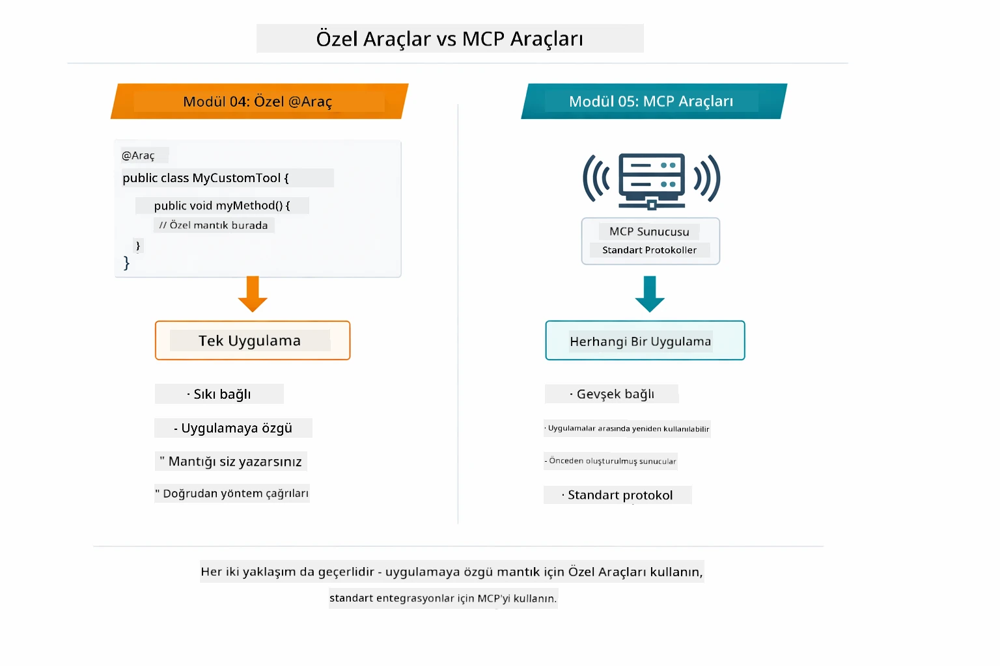

*Özel @Tool yöntemleri ile MCP araçlarını ne zaman kullanmalı — özel araçlar uygulama mantığı için tam tür güvenliği sağlar; MCP araçları, uygulamalar arası çalışan standartlaştırılmış entegrasyonlardır.*

## Tebrikler!

LangChain4j Başlangıç Kursu’nun tüm beş modülünü tamamladınız! İşte tamamladığınız öğrenme yolculuğu — temel sohbetten başlayarak MCP destekli agentic sistemlere kadar:

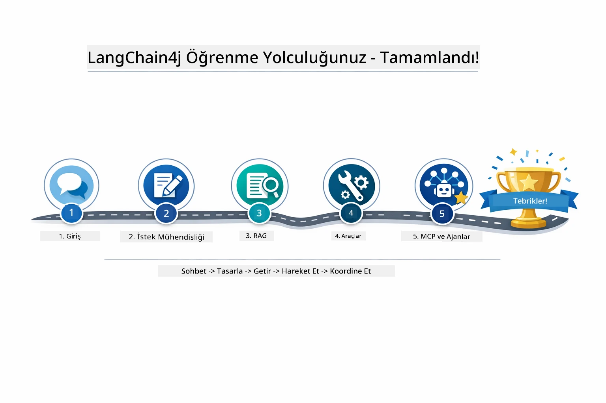

*Tüm beş modülden geçen öğrenme yolculuğunuz — temel sohbetten MCP destekli agentic sistemlere.*

LangChain4j Başlangıç Kursu’nu tamamladınız. Şunları öğrendiniz:

- Bellek ile konuşma tabanlı yapay zeka oluşturmayı (Modül 01)  
- Farklı görevler için istem mühendisliği kalıplarını (Modül 02)  
- Yanıtları dokümanlarınıza dayanarak temellendirmeyi (Modül 03)  
- Özel araçlarla temel AI ajanları (yardımcılar) oluşturmayı (Modül 04)  
- Standart araçları LangChain4j MCP ve Agentic modülleri ile entegre etmeyi (Modül 05)  

### Sırada Ne Var?  

Modülleri tamamladıktan sonra, [Test Rehberi](../docs/TESTING.md)’ni inceleyerek LangChain4j test konseptlerini uygulamada görebilirsiniz.

**Resmi Kaynaklar:**  
- [LangChain4j Dokümantasyonu](https://docs.langchain4j.dev/) - Kapsamlı rehberler ve API referansı  
- [LangChain4j GitHub](https://github.com/langchain4j/langchain4j) - Kaynak kodu ve örnekler  
- [LangChain4j Eğitimleri](https://docs.langchain4j.dev/tutorials/) - Çeşitli kullanım durumları için adım adım eğitimler  

Bu kursu tamamladığınız için teşekkürler!

---

**Geçiş:** [← Önceki: Modül 04 - Araçlar](../04-tools/README.md) | [Anasayfaya Dön](../README.md)

---

<!-- CO-OP TRANSLATOR DISCLAIMER START -->
**Feragatname**:
Bu belge, AI çeviri servisi [Co-op Translator](https://github.com/Azure/co-op-translator) kullanılarak çevrilmiştir. Doğruluk için çaba göstersek de, otomatik çevirilerin hatalar veya yanlışlıklar içerebileceğini lütfen unutmayın. Orijinal belge, kendi ana dilinde yetkili kaynak olarak kabul edilmelidir. Önemli bilgiler için profesyonel insan çevirisi önerilir. Bu çevirinin kullanımı sonucu ortaya çıkabilecek herhangi bir yanlış anlama veya yanlış yorumdan sorumlu değiliz.
<!-- CO-OP TRANSLATOR DISCLAIMER END -->