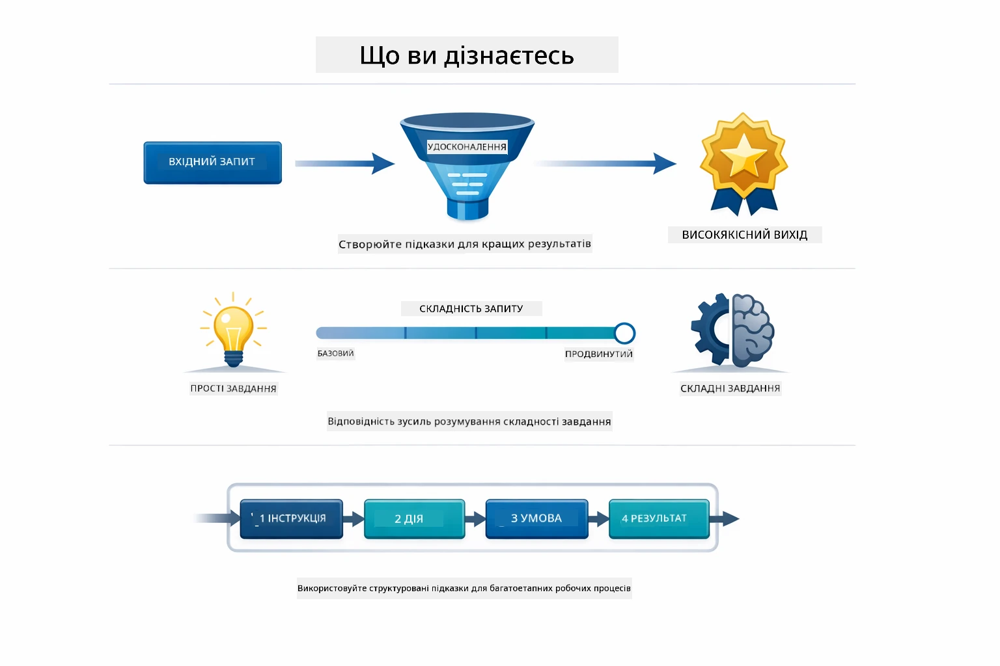
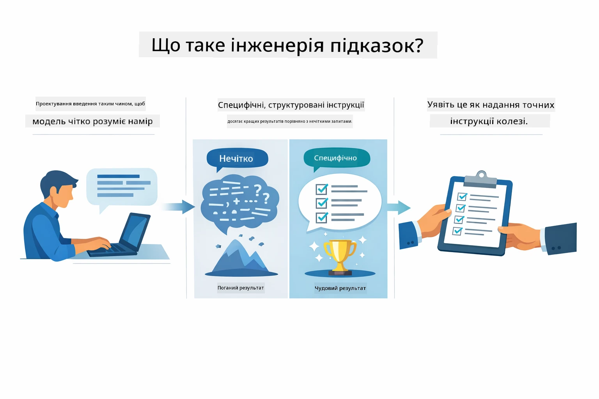
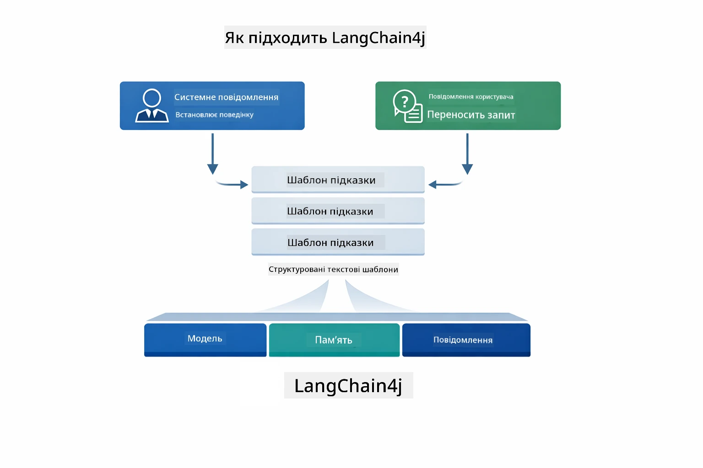
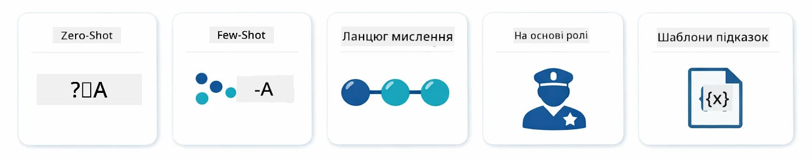
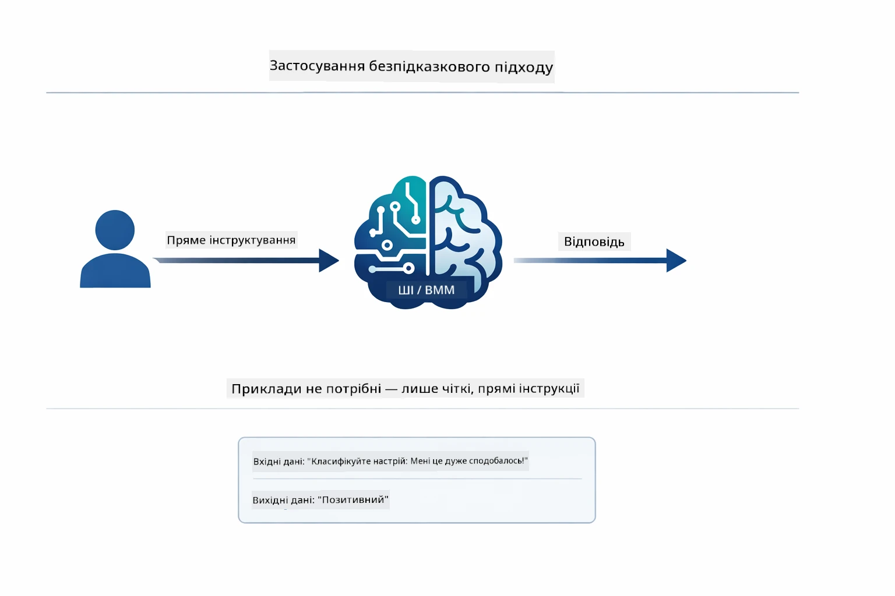
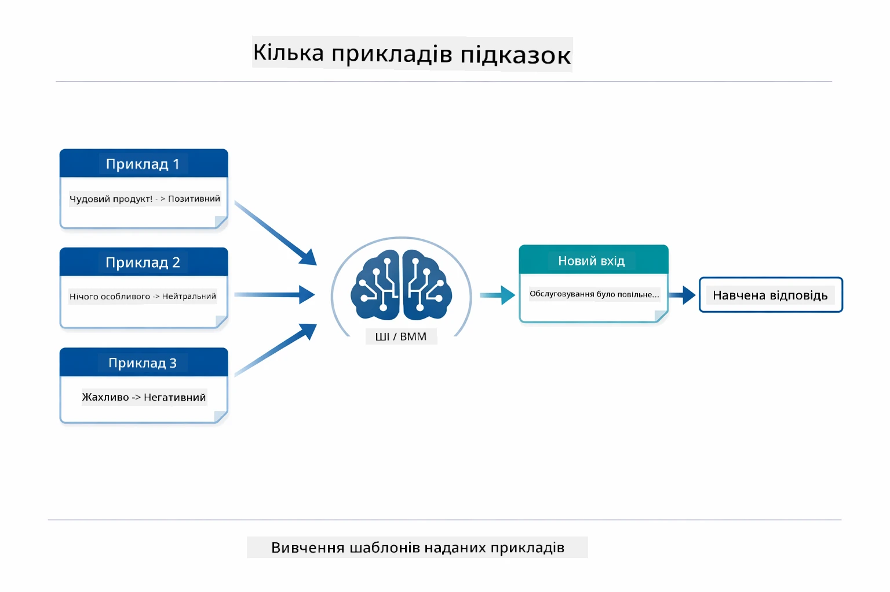
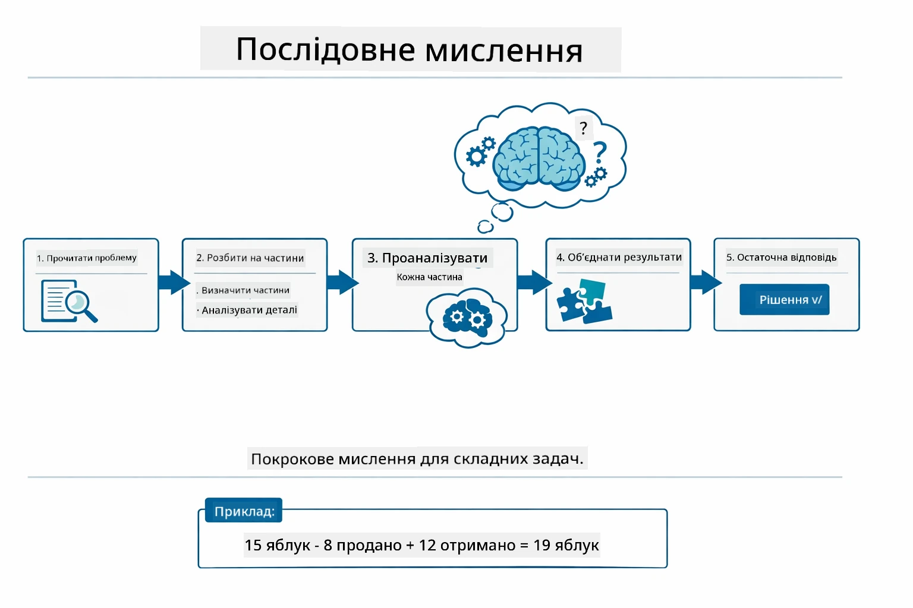
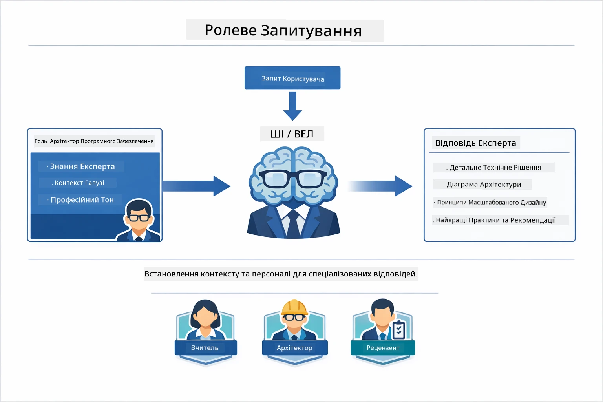
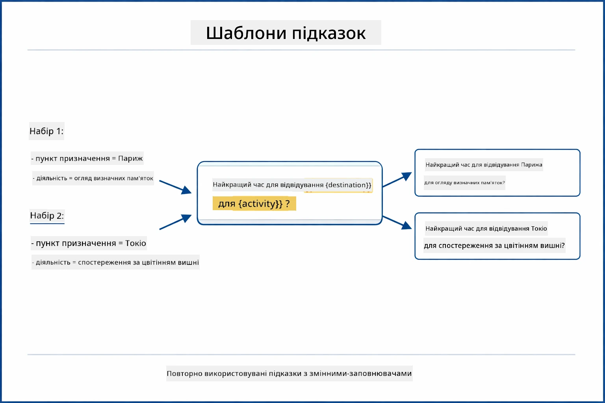
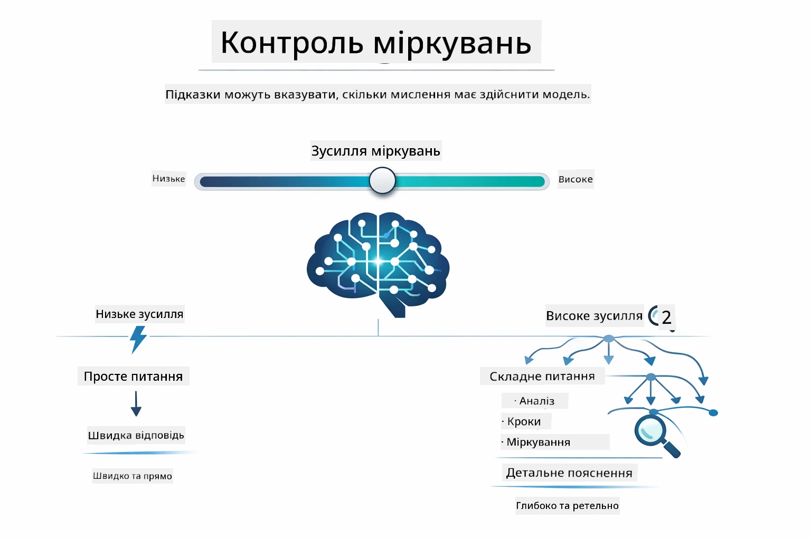

# Module 02: Розробка Запитів із GPT-5.2

## Зміст

- [Чому Ви Навчитесь](../../../02-prompt-engineering)
- [Передумови](../../../02-prompt-engineering)
- [Розуміння Розробки Запитів](../../../02-prompt-engineering)
- [Основи Розробки Запитів](../../../02-prompt-engineering)
  - [Zero-Shot Prompting](../../../02-prompt-engineering)
  - [Few-Shot Prompting](../../../02-prompt-engineering)
  - [Chain of Thought](../../../02-prompt-engineering)
  - [Role-Based Prompting](../../../02-prompt-engineering)
  - [Prompt Templates](../../../02-prompt-engineering)
- [Розширені Шаблони](../../../02-prompt-engineering)
- [Використання Існуючих Ресурсів Azure](../../../02-prompt-engineering)
- [Знімки Екрану Застосунку](../../../02-prompt-engineering)
- [Вивчення Шаблонів](../../../02-prompt-engineering)
  - [Низький проти Високого Енергійності](../../../02-prompt-engineering)
  - [Виконання Завдань (Преамбули Інструментів)](../../../02-prompt-engineering)
  - [Саморефлексуючий Код](../../../02-prompt-engineering)
  - [Структурований Аналіз](../../../02-prompt-engineering)
  - [Мульти-туровий Чат](../../../02-prompt-engineering)
  - [Крок за Кроком Логіка](../../../02-prompt-engineering)
  - [Обмежений Вивід](../../../02-prompt-engineering)
- [Що Ви Насправді Навчаєтесь](../../../02-prompt-engineering)
- [Наступні Кроки](../../../02-prompt-engineering)

## Чому Ви Навчитесь



У попередньому модулі ви побачили, як пам’ять забезпечує роботу розмовного ШІ, і використовували GitHub Models для базових взаємодій. Тепер ми зосередимося на тому, як ви ставите питання — самі запити — використовуючи Azure OpenAI GPT-5.2. Те, як ви структуруєте свої запити, кардинально впливає на якість отриманих відповідей. Почнемо з огляду основних технік формування запитів, а потім перейдемо до восьми розширених шаблонів, які максимально використовують можливості GPT-5.2.

Ми будемо використовувати GPT-5.2, тому що він вводить керування логікою мислення — ви можете вказати моделі, скільки часу варто розмірковувати перед відповіддю. Це робить різні стратегії запитів більш явними і допомагає зрозуміти, коли яку підхід застосовувати. Також вигода — у Azure менше обмежень по швидкості для GPT-5.2 у порівнянні з GitHub Models.

## Передумови

- Завершено модуль 01 (розгорнуті ресурси Azure OpenAI)
- Файл `.env` у кореневому каталозі з обліковими даними Azure (створений командою `azd up` у модулі 01)

> **Примітка:** Якщо ви ще не пройшли модуль 01, спочатку виконайте інструкції з розгортання там.

## Розуміння Розробки Запитів



Розробка запитів — це про те, як створювати вхідний текст, який послідовно дає вам потрібні результати. Це не лише про ставлення питань — це про структурування запитів так, щоб модель точно розуміла, чого ви хочете і як це надати.

Думайте про це як про інструкцію колезі. «Виправити баг» — це розмито. «Виправити NullPointerException у UserService.java на рядку 45, додавши перевірку на null» — це конкретно. Мовні моделі працюють так само — важлива конкретність і структура.



LangChain4j забезпечує інфраструктуру — підключення моделей, пам’ять і типи повідомлень — в той час як шаблони запитів — це просто обережно структурований текст, що передається через цю інфраструктуру. Ключові компоненти — це `SystemMessage` (який задає поведінку та роль ШІ) і `UserMessage` (який несе ваше фактичне прохання).

## Основи Розробки Запитів



Перш ніж заглибитися в розширені шаблони цього модуля, давайте переглянемо п’ять основних технік формування запитів. Це базові будівельні блоки, які повинен знати кожен інженер запитів. Якщо ви вже працювали з [модулем швидкого старту](../00-quick-start/README.md#2-prompt-patterns), то бачили ці патерни в дії — ось концептуальна основа за ними.

### Zero-Shot Prompting

Найпростіший підхід: дати моделі пряму інструкцію без прикладів. Модель повністю покладається на своє навчання, щоб зрозуміти і виконати завдання. Це добре працює для простих запитів, де очікувана поведінка очевидна.



*Пряма інструкція без прикладів — модель виводить завдання лише з інструкції*

```java
String prompt = "Classify this sentiment: 'I absolutely loved the movie!'";
String response = model.chat(prompt);
// Відповідь: "Позитивно"
```

**Коли використовувати:** Простий класифікації, прямі питання, переклади або будь-які завдання, які модель може виконати без додаткових вказівок.

### Few-Shot Prompting

Надайте приклади, які демонструють патерн, якого потрібно дотримуватися. Модель вивчає формат вхід-вихід із ваших прикладів і застосовує його до нових даних. Це значно покращує послідовність для завдань, де бажаний формат або поведінка неочевидні.



*Навчання на прикладах — модель визначає патерн і застосовує його до нових вхідних даних*

```java
String prompt = """
    Classify the sentiment as positive, negative, or neutral.
    
    Examples:
    Text: "This product exceeded my expectations!" → Positive
    Text: "It's okay, nothing special." → Neutral
    Text: "Waste of money, very disappointed." → Negative
    
    Now classify this:
    Text: "Best purchase I've made all year!"
    """;
String response = model.chat(prompt);
```

**Коли використовувати:** Кастомні класифікації, послідовне форматування, специфічні для домену завдання, або коли результати zero-shot непослідовні.

### Chain of Thought

Попросіть модель показати крок за кроком міркування. Замість того, щоб одразу давати відповідь, модель розбиває проблему і явно опрацьовує кожну частину. Це покращує точність у математиці, логіці та багатокрокових завданнях.



*Крок за кроком міркування — розбивка складної проблеми на явні логічні кроки*

```java
String prompt = """
    Problem: A store has 15 apples. They sell 8 apples and then 
    receive a shipment of 12 more apples. How many apples do they have now?
    
    Let's solve this step-by-step:
    """;
String response = model.chat(prompt);
// На моделі показано: 15 - 8 = 7, потім 7 + 12 = 19 яблук
```

**Коли використовувати:** Математичні задачі, логічні головоломки, налагодження або будь-які завдання, де показ процесу міркування покращує точність і довіру.

### Role-Based Prompting

Задайте персонажа або роль для ШІ до того, як поставити питання. Це надає контекст, який формує тон, глибину і фокус відповіді. «Софтверний архітектор» дає інші поради, ніж «молодший розробник» або «аудитор безпеки».



*Задавання контексту і персонажа — одне й те саме питання отримує різну відповідь залежно від присвоєної ролі*

```java
String prompt = """
    You are an experienced software architect reviewing code.
    Provide a brief code review for this function:
    
    def calculate_total(items):
        total = 0
        for item in items:
            total = total + item['price']
        return total
    """;
String response = model.chat(prompt);
```

**Коли використовувати:** Код-рев’ю, навчання, доменно-специфічний аналіз або коли потрібна відповідь, адаптована до певного рівня експертизи чи перспективи.

### Prompt Templates

Створюйте багаторазові запити з змінними місцезаповнювачами. Замість написання нового запиту кожного разу визначте шаблон один раз і підставляйте різні значення. Клас `PromptTemplate` в LangChain4j це спрощує за допомогою синтаксису `{{variable}}`.



*Багаторазові запити зі змінними — один шаблон, багато використань*

```java
PromptTemplate template = PromptTemplate.from(
    "What's the best time to visit {{destination}} for {{activity}}?"
);

Prompt prompt = template.apply(Map.of(
    "destination", "Paris",
    "activity", "sightseeing"
));

String response = model.chat(prompt.text());
```

**Коли використовувати:** Повторювані запити з різними вхідними даними, пакетна обробка, створення багаторазових AI робочих процесів, або ситуації, коли структура запиту залишається сталою, а змінюються лише дані.

---

Ці п’ять основ дають вам міцний інструмент для більшості завдань формування запитів. Залишок цього модуля будується на них із застосуванням **восьми розширених шаблонів**, які використовують керування логікою мислення GPT-5.2, самоперевірку і можливості структурованого виводу.

## Розширені Шаблони

Після розгляду основ перейдемо до восьми розширених шаблонів, які роблять цей модуль унікальним. Не всі проблеми потребують однакових підходів. Деякі питання потребують швидких відповідей, інші — глибокого аналізу. Одні потребують видимого мислення, інші — лише результату. Кожен шаблон підходить для різної ситуації — і керування логікою мислення GPT-5.2 робить відмінності ще більш помітними.


*Огляд восьми шаблонів розробки запитів і їхні випадки застосування*



*Керування логікою GPT-5.2 дозволяє вказувати, скільки модель має мислити — від швидких прямих відповідей до глибокого дослідження*


*Низька (швидка, пряма) проти Висока (ретельна, дослідницька) логіка мислення*

**Низька Енергійність (Швидко та Зосереджено)** — для простих запитань, де потрібні швидкі, конкретні відповіді. Модель виконує мінімальне мислення — максимум 2 кроки. Використовуйте це для обчислень, пошуку або простих питань.

```java
String prompt = """
    <context_gathering>
    - Search depth: very low
    - Bias strongly towards providing a correct answer as quickly as possible
    - Usually, this means an absolute maximum of 2 reasoning steps
    - If you think you need more time, state what you know and what's uncertain
    </context_gathering>
    
    Problem: What is 15% of 200?
    
    Provide your answer:
    """;

String response = chatModel.chat(prompt);
```

> 💡 **Дослідіть з GitHub Copilot:** Відкрийте [`Gpt5PromptService.java`](../../../02-prompt-engineering/src/main/java/com/example/langchain4j/prompts/service/Gpt5PromptService.java) і запитайте:
> - "У чому різниця між низькою та високою енергійністю патернів?"
> - "Як XML теги в запитах допомагають структурувати відповідь ШІ?"
> - "Коли слід використовувати патерни саморефлексії, а коли пряму інструкцію?"

**Висока Енергійність (Глибоко і Ретельно)** — для складних проблем, де потрібен всебічний аналіз. Модель ретельно досліджує і показує детальне міркування. Використовуйте це для проектування систем, архітектурних рішень або складних досліджень.

```java
String prompt = """
    Analyze this problem thoroughly and provide a comprehensive solution.
    Consider multiple approaches, trade-offs, and important details.
    Show your analysis and reasoning in your response.
    
    Problem: Design a caching strategy for a high-traffic REST API.
    """;

String response = chatModel.chat(prompt);
```

**Виконання Завдання (Прогрес Крок за Кроком)** — для багатокрокових робочих процесів. Модель надає план заздалегідь, коментує кожен крок під час роботи і в кінці робить підсумок. Використовуйте це для міграцій, впроваджень або будь-яких багатокрокових процесів.

```java
String prompt = """
    <task_execution>
    1. First, briefly restate the user's goal in a friendly way
    
    2. Create a step-by-step plan:
       - List all steps needed
       - Identify potential challenges
       - Outline success criteria
    
    3. Execute each step:
       - Narrate what you're doing
       - Show progress clearly
       - Handle any issues that arise
    
    4. Summarize:
       - What was completed
       - Any important notes
       - Next steps if applicable
    </task_execution>
    
    <tool_preambles>
    - Always begin by rephrasing the user's goal clearly
    - Outline your plan before executing
    - Narrate each step as you go
    - Finish with a distinct summary
    </tool_preambles>
    
    Task: Create a REST endpoint for user registration
    
    Begin execution:
    """;

String response = chatModel.chat(prompt);
```

Chain-of-Thought prompting явно просить модель показати свій процес міркування, що підвищує точність для складних завдань. Поетапний розбір допомагає і людям, і штучному інтелекту розуміти логіку.

> **🤖 Спробуйте з [GitHub Copilot](https://github.com/features/copilot) Chat:** Запитайте про цей патерн:
> - "Як адаптувати патерн виконання завдання для тривалих операцій?"
> - "Які найкращі практики структурування преамбул інструментів у виробничих застосунках?"
> - "Як можна захоплювати і відображати проміжні оновлення прогресу у UI?"


*План → Виконання → Підсумок для багатокрокових завдань*

**Саморефлексуючий Код** — для генерації коду виробничої якості. Модель генерує код згідно з виробничими стандартами з належним обробленням помилок. Використовуйте це при створенні нових функцій або сервісів.

```java
String prompt = """
    Generate Java code with production-quality standards: Create an email validation service
    Keep it simple and include basic error handling.
    """;

String response = chatModel.chat(prompt);
```


*Ітеративний цикл покращення - генерувати, оцінювати, виявляти проблеми, вдосконалювати, повторювати*

**Структурований Аналіз** — для послідовної оцінки. Модель переглядає код за фіксованою схемою (коректність, практики, продуктивність, безпека, підтримуваність). Використовуйте це для код-рев'ю або оцінки якості.

```java
String prompt = """
    <analysis_framework>
    You are an expert code reviewer. Analyze the code for:
    
    1. Correctness
       - Does it work as intended?
       - Are there logical errors?
    
    2. Best Practices
       - Follows language conventions?
       - Appropriate design patterns?
    
    3. Performance
       - Any inefficiencies?
       - Scalability concerns?
    
    4. Security
       - Potential vulnerabilities?
       - Input validation?
    
    5. Maintainability
       - Code clarity?
       - Documentation?
    
    <output_format>
    Provide your analysis in this structure:
    - Summary: One-sentence overall assessment
    - Strengths: 2-3 positive points
    - Issues: List any problems found with severity (High/Medium/Low)
    - Recommendations: Specific improvements
    </output_format>
    </analysis_framework>
    
    Code to analyze:
    ```
    public List getUsers() {
        return database.query("SELECT * FROM users");
    }
    ```
    Provide your structured analysis:
    """;

String response = chatModel.chat(prompt);
```

> **🤖 Спробуйте з [GitHub Copilot](https://github.com/features/copilot) Chat:** Запитайте про структурований аналіз:
> - "Як налаштувати рамки аналізу для різних типів код-рев’ю?"
> - "Який найкращий спосіб парсити і діставати дані зі структурованого виводу програмно?"
> - "Як забезпечити послідовність рівнів серйозності між різними сесіями перевірки?"


*Основи для послідовних код-рев’ю з рівнями серйозності*

**Мульти-туровий Чат** — для розмов, де потрібен контекст. Модель пам’ятає попередні повідомлення і будує на їх основі. Використовуйте для інтерактивної підтримки або складних запитань-відповідей.

```java
ChatMemory memory = MessageWindowChatMemory.withMaxMessages(10);

memory.add(UserMessage.from("What is Spring Boot?"));
AiMessage aiMessage1 = chatModel.chat(memory.messages()).aiMessage();
memory.add(aiMessage1);

memory.add(UserMessage.from("Show me an example"));
AiMessage aiMessage2 = chatModel.chat(memory.messages()).aiMessage();
memory.add(aiMessage2);
```


*Як контекст розмови акумулюється протягом кількох ходів до досягнення ліміту токенів*

**Крок за Кроком Логіка** — для проблем, що вимагають видимої логіки. Модель демонструє явні міркування на кожному кроці. Використовуйте для математичних задач, логічних головоломок або коли потрібно зрозуміти процес мислення.

```java
String prompt = """
    <instruction>Show your reasoning step-by-step</instruction>
    
    If a train travels 120 km in 2 hours, then stops for 30 minutes,
    then travels another 90 km in 1.5 hours, what is the average speed
    for the entire journey including the stop?
    """;

String response = chatModel.chat(prompt);
```


*Розбивка проблем на явні логічні кроки*

**Обмежений Вивід** — для відповідей із конкретними вимогами до формату. Модель строго дотримується правил формату і довжини. Використовуйте для резюме або коли потрібна точна структура відповіді.

```java
String prompt = """
    <constraints>
    - Exactly 100 words
    - Bullet point format
    - Technical terms only
    </constraints>
    
    Summarize the key concepts of machine learning.
    """;

String response = chatModel.chat(prompt);
```


*Забезпечення дотримання конкретного формату, довжини і структури*

## Використання Існуючих Ресурсів Azure

**Перевірка розгортання:**

Переконайтеся, що файл `.env` існує в кореневому каталозі з обліковими даними Azure (створений під час модулю 01):
```bash
cat ../.env  # Повинно показувати AZURE_OPENAI_ENDPOINT, API_KEY, DEPLOYMENT
```

**Запуск застосунку:**

> **Примітка:** Якщо ви вже запускали всі застосунки за допомогою `./start-all.sh` з модуля 01, цей модуль уже працює на порту 8083. Ви можете пропустити наведені нижче команди запуску і перейти безпосередньо за адресою http://localhost:8083.

**Опція 1: Використання Spring Boot Dashboard (Рекомендується для користувачів VS Code)**

Dev-контейнер включає розширення Spring Boot Dashboard, яке надає візуальний інтерфейс для керування усіма Spring Boot застосунками. Ви можете знайти його на панелі активності зліва у VS Code (зверніть увагу на іконку Spring Boot).
З панелі Spring Boot Dashboard ви можете:
- Переглянути всі доступні Spring Boot додатки у робочому просторі
- Запускати/зупиняти додатки одним кліком
- Переглядати журнали додатків у режимі реального часу
- Моніторити стан додатків

Просто натисніть кнопку відтворення поруч із "prompt-engineering", щоб запустити цей модуль, або запустіть усі модулі одночасно.


**Варіант 2: Використання shell-скриптів**

Запустіть усі веб-додатки (модулі 01-04):

**Bash:**
```bash
cd ..  # З кореневої директорії
./start-all.sh
```

**PowerShell:**
```powershell
cd ..  # З кореневого каталогу
.\start-all.ps1
```

Або запустіть лише цей модуль:

**Bash:**
```bash
cd 02-prompt-engineering
./start.sh
```

**PowerShell:**
```powershell
cd 02-prompt-engineering
.\start.ps1
```

Обидва скрипти автоматично завантажують змінні середовища з кореневого файлу `.env` та збудують JAR-файли, якщо вони не існують.

> **Примітка:** Якщо ви віддаєте перевагу вручну збирати всі модулі перед запуском:
>
> **Bash:**
> ```bash
> cd ..  # Go to root directory
> mvn clean package -DskipTests
> ```
>
> **PowerShell:**
> ```powershell
> cd ..  # Go to root directory
> mvn clean package -DskipTests
> ```

Відкрийте http://localhost:8083 у вашому браузері.

**Для зупинки:**

**Bash:**
```bash
./stop.sh  # Тільки цей модуль
# Або
cd .. && ./stop-all.sh  # Всі модулі
```

**PowerShell:**
```powershell
.\stop.ps1  # Тільки цей модуль
# Або
cd ..; .\stop-all.ps1  # Всі модулі
```

## Скриншоти додатків


*Головна панель, що показує всі 8 патернів prompt engineering з їх характеристиками та випадками використання*

## Дослідження патернів

Веб-інтерфейс дозволяє експериментувати з різними стратегіями промптингу. Кожен патерн вирішує різні задачі — спробуйте їх, щоб побачити, коли кожен підхід працює найкраще.

### Низький проти високого прагнення

Задайте просте питання, наприклад "Що таке 15% від 200?" використовуючи Низьке прагнення. Ви отримаєте миттєву, прямолінійну відповідь. Тепер задайте складне питання, як "Розробіть стратегію кешування для API з великим трафіком" використовуючи Високе прагнення. Спостерігайте, як модель уповільнюється і надає детальний розбір. Та сама модель, та сама структура питання — але промпт каже, скільки роздумів робити.


*Швидкий розрахунок з мінімальним роздумом*


*Комплексна стратегія кешування (2.8MB)*

### Виконання завдань (Tool Preambles)

Багатокрокові робочі процеси виграють від попереднього планування та опису прогресу. Модель описує, що зробить, розповідає про кожен крок, а потім підсумовує результати.


*Створення REST endpoint з покроковим описом (3.9MB)*

### Саморефлексивний код

Спробуйте "Створити сервіс перевірки електронної пошти". Замість того, щоб просто згенерувати код і зупинитись, модель генерує, оцінює за критеріями якості, визначає слабкі місця і покращує. Ви побачите, як вона ітерує, поки код не досягне виробничих стандартів.


*Повний сервіс перевірки електронної пошти (5.2MB)*

### Структурований аналіз

Код-рев’ю потребують послідовних рамок оцінювання. Модель аналізує код за фіксованими категоріями (коректність, практики, продуктивність, безпека) з рівнями серйозності.


*Код-рев’ю на основі фреймворку*

### Багатокроковий чат

Задайте питання "Що таке Spring Boot?" і відразу ж додайте "Покажи мені приклад". Модель пам’ятає ваше перше питання і надає вам приклад саме щодо Spring Boot. Без пам’яті друге питання було б надто загальним.


*Збереження контексту між питаннями*

### Крок за кроком роздуми

Виберіть математичну задачу і спробуйте її з крок за кроком роздумами та з низьким прагненням. Низьке прагнення просто дає відповідь — швидко, але непрозоро. Крок за кроком показує кожен розрахунок і рішення.


*Математична задача з поясненням кроків*

### Обмежений вивід

Коли потрібно специфічний формат або кількість слів, цей патерн забезпечує суворе дотримання. Спробуйте створити резюме рівно на 100 слів у вигляді маркованого списку.


*Резюме машинного навчання з контролем формату*

## Чого ви справді навчаєтесь

**Зусилля роздумів змінює все**

GPT-5.2 дає вам контроль над обчислювальними зусиллями через ваші промпти. Низькі зусилля означають швидкі відповіді з мінімальним дослідженням. Високі — модель витрачає час на глибокі роздуми. Ви навчаєтесь узгоджувати зусилля з складністю завдання — не витрачайте час на прості питання і водночас не поспішайте із складними рішеннями.

**Структура керує поведінкою**

Помітили XML-теги в промптах? Вони не декоративні. Моделі надійніше слідують структурованим інструкціям, ніж вільному тексту. Коли потрібні багатокрокові процеси чи складна логіка, структура допомагає моделі відстежувати, де вона і що буде далі.


*Анатомія добре структурованого промпта зі зрозумілими секціями та організацією в стилі XML*

**Якість через самооцінку**

Саморефлексивні патерни працюють, роблячи критерії якості явними. Замість того, щоб сподіватися, що модель "зробить правильно", ви чітко вказуєте, що означає "правильно": коректна логіка, обробка помилок, продуктивність, безпека. Модель може оцінити свій результат і покращити його. Це перетворює генерацію коду з лотереї на процес.

**Контекст є обмеженим**

Багатокрокові розмови працюють завдяки включенню історії повідомлень у кожен запит. Але існує межа — кожна модель має максимальну кількість токенів. З ростом розмов доведеться використовувати стратегії збереження релевантного контексту без перевищення ліміту. Цей модуль показує, як працює пам’ять; пізніше ви навчитесь, коли узагальнювати, коли забувати і коли витягувати.

## Наступні кроки

**Наступний модуль:** [03-rag - RAG (Retrieval-Augmented Generation)](../03-rag/README.md)

---

**Навігація:** [← Попередній: Модуль 01 - Вступ](../01-introduction/README.md) | [Назад до головного](../README.md) | [Далі: Модуль 03 - RAG →](../03-rag/README.md)

---

<!-- CO-OP TRANSLATOR DISCLAIMER START -->
**Відмова від відповідальності**:
Цей документ було перекладено за допомогою сервісу автоматичного перекладу [Co-op Translator](https://github.com/Azure/co-op-translator). Хоча ми прагнемо до точності, будь ласка, майте на увазі, що автоматичні переклади можуть містити помилки або неточності. Оригінальний документ рідною мовою слід вважати авторитетним джерелом. Для критичної інформації рекомендується професійний переклад людиною. Ми не несемо відповідальності за будь-які непорозуміння або неправильне тлумачення, що виникли внаслідок використання цього перекладу.
<!-- CO-OP TRANSLATOR DISCLAIMER END -->