# Модуль 03: RAG (Генерація з пошуком інформації)

## Зміст

- [Відеоогляд](../../../03-rag)
- [Чому ви навчитеся](../../../03-rag)
- [Вимоги](../../../03-rag)
- [Розуміння RAG](../../../03-rag)
  - [Який підхід RAG використовує цей посібник?](../../../03-rag)
- [Як це працює](../../../03-rag)
  - [Обробка документів](../../../03-rag)
  - [Створення векторів](../../../03-rag)
  - [Семантичний пошук](../../../03-rag)
  - [Генерація відповіді](../../../03-rag)
- [Запуск застосунку](../../../03-rag)
- [Використання застосунку](../../../03-rag)
  - [Завантаження документа](../../../03-rag)
  - [Задавання питань](../../../03-rag)
  - [Перевірка посилань на джерела](../../../03-rag)
  - [Експерименти з питаннями](../../../03-rag)
- [Ключові поняття](../../../03-rag)
  - [Стратегія поділу на частини](../../../03-rag)
  - [Оцінки схожості](../../../03-rag)
  - [Зберігання в пам’яті](../../../03-rag)
  - [Управління контекстним вікном](../../../03-rag)
- [Коли RAG має значення](../../../03-rag)
- [Наступні кроки](../../../03-rag)

## Відеоогляд

Перегляньте це live-заняття, що пояснює, як почати роботу з цим модулем: [RAG з LangChain4j - live-сесія](https://www.youtube.com/watch?v=_olq75ZH_eY)

## Чому ви навчитеся

У попередніх модулях ви навчились вести розмови з ШІ та ефективно структурувати запити. Але є фундаментальне обмеження: мовні моделі знають лише те, чому їх навчили під час тренування. Вони не можуть відповідати на запитання про політики вашої компанії, документацію вашого проєкту чи будь-яку інформацію, яку не було включено у їхнє навчання.

RAG (Генерація з пошуком інформації) вирішує цю проблему. Замість того, щоб намагатися навчити модель вашій інформації (що дорого та непрактично), ви даєте їй можливість шукати у ваших документах. Коли хтось ставить запитання, система знаходить релевантну інформацію і включає її до запиту. Модель потім відповідає на основі цього знайденого контексту.

Уявіть, що RAG дає моделі довідкову бібліотеку. Коли ви ставите питання, система:

1. **Запит користувача** — ви ставите питання  
2. **Векторизація** — перетворює ваше питання у вектор  
3. **Пошук у векторному просторі** — знаходить схожі фрагменти документів  
4. **Збирання контексту** — додає релевантні фрагменти до запиту  
5. **Відповідь** — LLM генерує відповідь на основі контексту  

Це робить відповіді моделі прив’язаними до ваших реальних даних, а не покладатися на знання під час тренування чи вигадувати відповіді.

## Вимоги

- Завершений [Модуль 00 - Швидкий старт](../00-quick-start/README.md) (для прикладу Easy RAG, згаданого вище)
- Завершений [Модуль 01 - Вступ](../01-introduction/README.md) (деплой Azure OpenAI ресурсів, включно з моделлю векторизації `text-embedding-3-small`)
- Файл `.env` у кореневому каталозі з обліковими даними Azure (створений командою `azd up` у Модулі 01)

> **Примітка:** Якщо ви не завершили Модуль 01, спочатку виконайте інструкції з розгортання там. Команда `azd up` розгортає як GPT чат-модель, так і модель векторизації, що використовується у цьому модулі.

## Розуміння RAG

На діаграмі нижче зображена основна ідея: замість того, щоб опиратися лише на навчальні дані моделі, RAG дає їй довідкову бібліотеку ваших документів, щоб перед генерацією кожної відповіді вона проконсультувалась із ними.

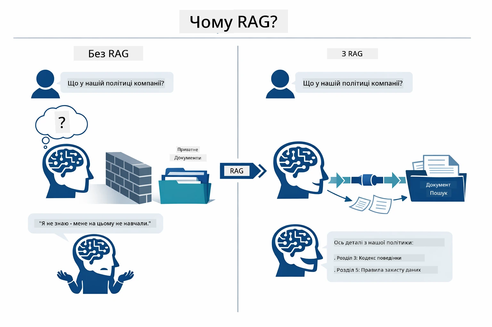

*Ця діаграма показує різницю між стандартною LLM (яка здогадується на основі тренувальних даних) і LLM з підтримкою RAG (яка спочатку консультується з вашими документами).*

Ось як частини з’єднані від початку до кінця. Запит користувача проходить через чотири етапи — векторизація, пошук у векторному просторі, збори контексту і генерація відповіді — кожен крок базується на попередньому:


*Ця діаграма демонструє повний RAG конвеєр — запит користувача проходить через векторизацію, пошук, збір контексту і генерацію відповіді.*

Далі у модулі крок за кроком розглядається кожен етап з прикладами коду, які ви можете запустити і змінювати.

### Який підхід RAG використовує цей посібник?

LangChain4j пропонує три способи реалізації RAG із різним рівнем абстракції. На діаграмі нижче їх порівнюють поруч:

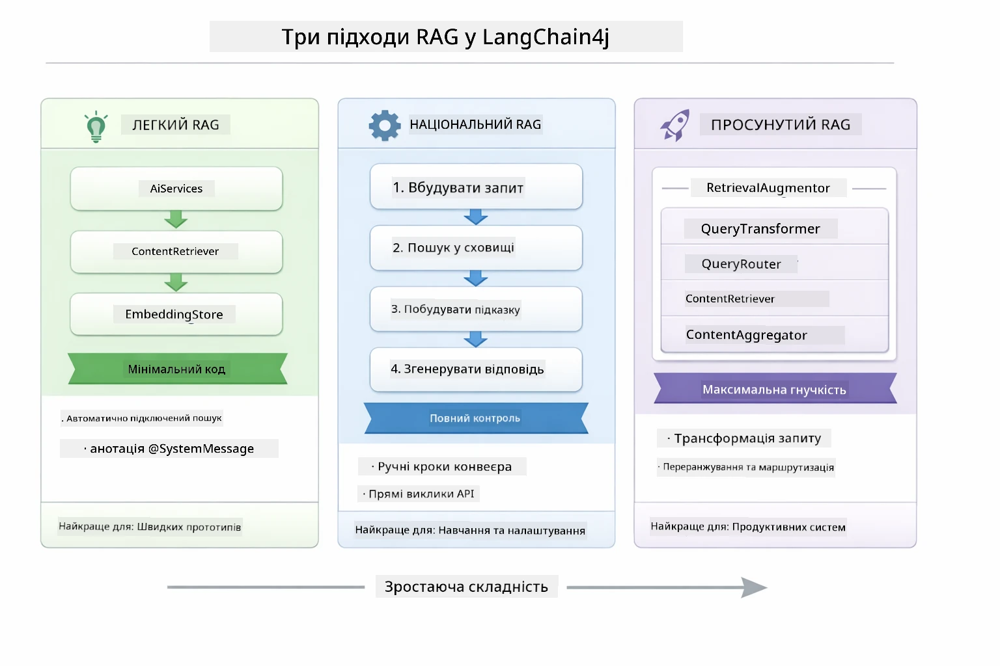

*Ця діаграма порівнює три підходи RAG в LangChain4j — Easy, Native та Advanced, показуючи їх основні компоненти та коли який варто застосовувати.*

| Підхід | Що робить | Компроміс |
|---|---|---|
| **Easy RAG** | Все підключається автоматично через `AiServices` і `ContentRetriever`. Ви анотуєте інтерфейс, додаєте рекрутер і LangChain4j керує векторизацією, пошуком і збіркою запиту за лаштунками. | Мінімум коду, але ви не бачите, що відбувається на кожному кроці. |
| **Native RAG** | Ви самі викликаєте модель векторизації, шукаєте у сховищі, складаєте запит і генеруєте відповідь — по одному кроку за раз. | Більше коду, але кожен етап видимий і змінюваний. |
| **Advanced RAG** | Використовує фреймворк `RetrievalAugmentor` з плагінами для трансформації запитів, маршрутизаторами, переоцінювачами та інжекторами контенту для складних промислових конвеєрів. | Максимальна гнучкість, але суттєво більша складність. |

**Цей посібник використовує Native підхід.** Кожен крок RAG-конвеєру — векторизація запиту, пошук у векторному сховищі, збір контексту і генерація відповіді — явно описаний у [`RagService.java`](../../../03-rag/src/main/java/com/example/langchain4j/rag/service/RagService.java). Це зроблено навмисно: як навчальний ресурс, головне щоб ви бачили і розуміли кожен крок, а не мінімізували код. Коли ви освоїтесь, можна перейти до Easy RAG для швидких прототипів або Advanced RAG для продуктивних систем.

> **💡 Вже бачили Easy RAG у дії?** Модуль [Швидкий старт](../00-quick-start/README.md) включає приклад питань-відповідей по документу ([`SimpleReaderDemo.java`](../../../00-quick-start/src/main/java/com/example/langchain4j/quickstart/SimpleReaderDemo.java)), який використовує Easy RAG — LangChain4j автоматично керує векторизацією, пошуком і збіркою запиту. Цей модуль йде далі, розкриваючи той конвеєр, щоб ви могли бачити і керувати кожним кроком самостійно.

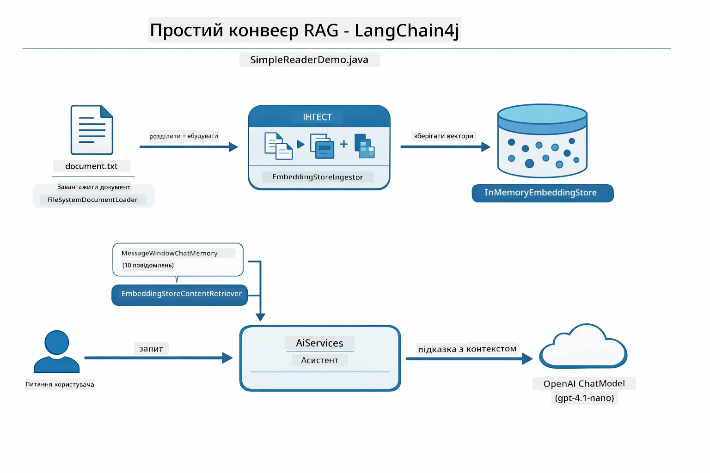

*Діаграма показує конвеєр Easy RAG із `SimpleReaderDemo.java`. Порівняйте з Native підходом у цьому модулі: Easy RAG ховає векторизацію, пошук і збірку за `AiServices` та `ContentRetriever` — ви завантажуєте документ, додаєте рекрутер і отримуєте відповіді. Native підхід цього модуля відкриває цей конвеєр, щоб ви викликали кожен етап (векторизація, пошук, збір контексту, генерація) самостійно, отримуючи повну прозорість і контроль.*

## Як це працює

RAG-конвеєр у цьому модулі складається з чотирьох етапів, які виконуються послідовно щоразу, коли користувач ставить питання. Спершу завантажений документ **парситься і ділиться на частини**. Потім ці частини конвертуються у **векторні представлення** і зберігаються для математичного порівняння. Коли надходить запит, система виконує **семантичний пошук**, щоб знайти найбільш релевантні частини, і нарешті передає їх як контекст LLM для **генерації відповіді**. Нижче детально розглянемо кожен етап і відповідний код з діаграмами. Розпочнемо з першого кроку.

### Обробка документів

[DocumentService.java](../../../03-rag/src/main/java/com/example/langchain4j/rag/service/DocumentService.java)

Коли ви завантажуєте документ, система парсить його (PDF або проста текстова версія), додає метадані, такі як ім’я файлу, а потім ділить на частини — менші шматки, які зручно вміщуються у контекстне вікно моделі. Ці частини трохи перекриваються, щоб не втрачати контекст на межах.

```java
// Розпарсити завантажений файл і обгорнути його у документ LangChain4j
Document document = Document.from(content, metadata);

// Розділити на частини по 300 токенів з перекриттям у 30 токенів
DocumentSplitter splitter = DocumentSplitters
    .recursive(300, 30);

List<TextSegment> segments = splitter.split(document);
```
  
Діаграма нижче показує це візуально. Зверніть увагу, що кожна частина ділиться деякими токенами з сусідніми — 30-токенове перекриття гарантує, що важливий контекст не загубиться:

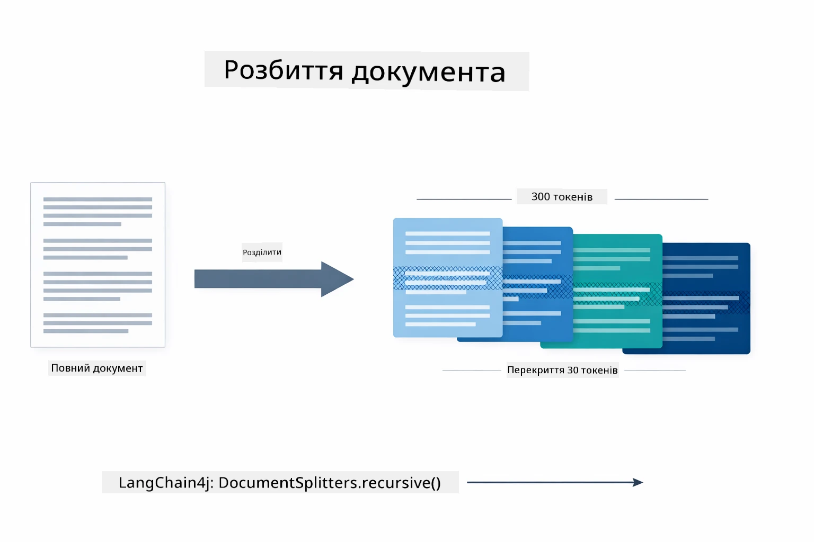

*Діаграма демонструє документ, розбитий на 300-токенові частини з 30-токеновим перекриттям, що зберігає контекст на межах частин.*

> **🤖 Спробуйте з [GitHub Copilot](https://github.com/features/copilot) Chat:** Відкрийте [`DocumentService.java`](../../../03-rag/src/main/java/com/example/langchain4j/rag/service/DocumentService.java) і запитайте:
> - "Як LangChain4j ділить документи на частини і чому перекриття важливе?"
> - "Який оптимальний розмір частини для різних типів документів і чому?"
> - "Як працювати з документами кількома мовами або зі спеціальним форматуванням?"

### Створення векторів

[LangChainRagConfig.java](../../../03-rag/src/main/java/com/example/langchain4j/rag/config/LangChainRagConfig.java)

Кожна частина перетворюється у числове представлення, яке називається embedding — фактично це конвертер значень у числа. Модель векторизації не є "інтелектуальною", як чат-модель; вона не виконує інструкції, не логікує і не відповідає на питання. Вона лише відображає текст у математичний простір, де схожі значення розташовуються поруч — "авто" поруч із "машина", "політика повернення" поруч із "вернути гроші". Уявіть чат-модель як людину, з якою говорите, а модель embedding — як суперефективну систему архівації.

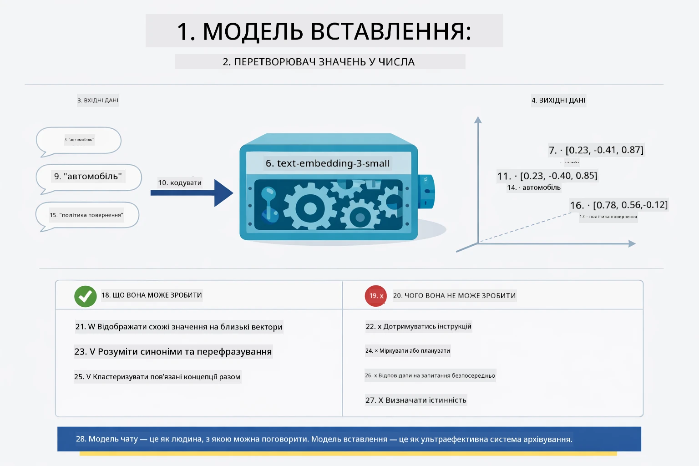

*Діаграма показує, як модель embedding перетворює текст у числові вектори, розташовуючи схожі значення — як "авто" і "машина" — поруч у векторному просторі.*

```java
@Bean
public EmbeddingModel embeddingModel() {
    return OpenAiOfficialEmbeddingModel.builder()
        .baseUrl(azureOpenAiEndpoint)
        .apiKey(azureOpenAiKey)
        .modelName(azureEmbeddingDeploymentName)
        .build();
}

EmbeddingStore<TextSegment> embeddingStore = 
    new InMemoryEmbeddingStore<>();
```
  
Клас-діаграма нижче показує два окремі потоки у RAG-конвеєрі і класи LangChain4j, які їх реалізують. Потік «інгесту» (виконується раз при завантаженні) ділить документ, векторизує частини і зберігає через `.addAll()`. Потік «запиту» (кожного разу, коли користувач питає) векторизує питання, шукає у сховищі через `.search()` і передає відповідний контекст чат-моделі. Обидва потоки сходяться на спільному інтерфейсі `EmbeddingStore<TextSegment>`:

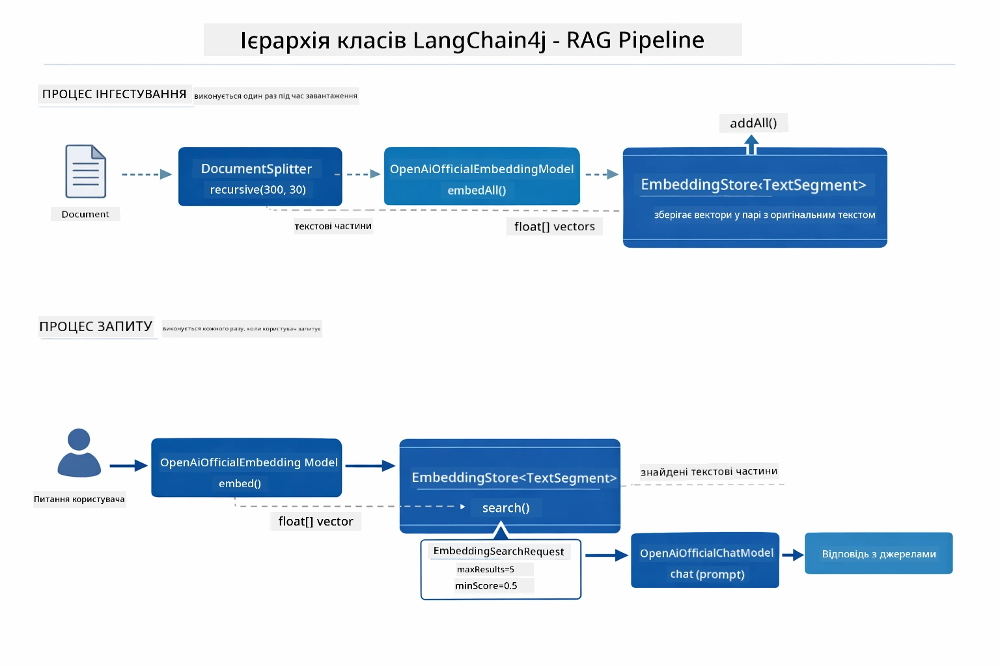

*Діаграма показує два потоки RAG — інгест та запит — і їх взаємодію через спільний EmbeddingStore.*

Після збереження векторів схожий контент природньо групується у векторному просторі. Візуалізація нижче демонструє, як документи споріднених тем опиняються поруч, що і робить семантичний пошук можливим:


*Візуалізація показує, як споріднені документи групуються у 3D векторному просторі за темами Типові Технічні Документи, Бізнес-правила та Часті Питання.*

Коли користувач шукає, система проходить через чотири кроки: векторизує документи один раз, векторизує запит під час кожного пошуку, порівнює вектор запиту зі всіма збереженими векторами за допомогою косинусної схожості і повертає топ-K найбільш релевантних частин. Діаграма нижче ілюструє кожен крок та класи LangChain4j, що беруть участь:

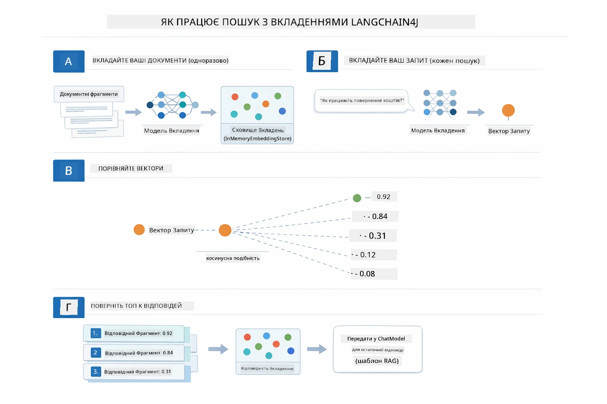

*Діаграма ілюструє чотирикроковий процес пошуку за embedding: векторизує документи, векторизує запит, порівнює вектори за косинусною схожістю та повертає топ-K результатів.*

### Семантичний пошук

[RagService.java](../../../03-rag/src/main/java/com/example/langchain4j/rag/service/RagService.java)

Коли ви ставите питання, ваше питання також перетворюється на embedding. Система порівнює embedding вашого запиту з embedding усіх частин документа. Вона знаходить ті частини, що мають найбільш схожі значення — не просто відповідність ключових слів, а реальна семантична схожість.

```java
Embedding queryEmbedding = embeddingModel.embed(question).content();

EmbeddingSearchRequest searchRequest = EmbeddingSearchRequest.builder()
    .queryEmbedding(queryEmbedding)
    .maxResults(5)
    .minScore(0.5)
    .build();

EmbeddingSearchResult<TextSegment> searchResult = embeddingStore.search(searchRequest);
List<EmbeddingMatch<TextSegment>> matches = searchResult.matches();

for (EmbeddingMatch<TextSegment> match : matches) {
    String relevantText = match.embedded().text();
    double score = match.score();
}
```
  
Діаграма нижче порівнює семантичний пошук з традиційним пошуком за ключовими словами. Пошук ключового слова "транспортний засіб" не знаходить частину про "автомобілі та вантажівки", але семантичний пошук розуміє, що це одне й те саме, і повертає її як релевантний результат:

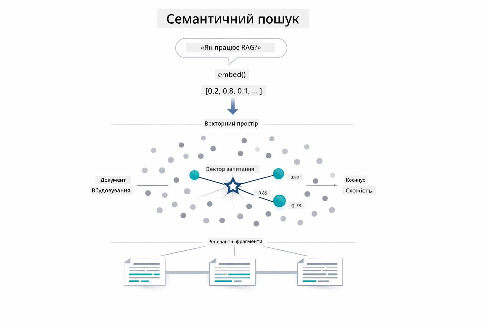

*Діаграма порівнює пошук за ключовими словами з семантичним пошуком, показуючи, як останній знаходить концептуально пов’язаний контент, навіть якщо точних ключових слів немає.*

Під капотом схожість вимірюється за допомогою косинусної схожості — фактично запитуючи "чи вказують ці дві стріли в одному напрямку?" Два фрагменти можуть бути написані зовсім різними словами, але якщо вони мають однакове значення, їхні вектори будуть спрямовані однаково і матимуть коефіцієнт близький до 1.0:

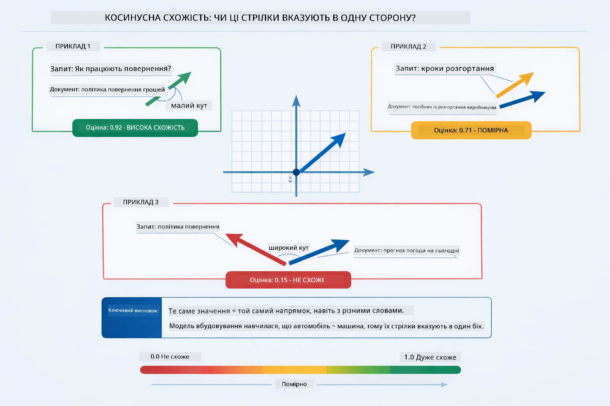

*Діаграма ілюструє косинусну схожість як кут між векторами embedding — більш вирівняні вектори оцінюються ближче до 1.0, що означає вищу семантичну схожість.*
> **🤖 Спробуйте з [GitHub Copilot](https://github.com/features/copilot) Chat:** Відкрийте [`RagService.java`](../../../03-rag/src/main/java/com/example/langchain4j/rag/service/RagService.java) і запитайте:
> - "Як працює пошук за подібністю з embedding-ами і що визначає оцінку?"
> - "Який поріг подібності мені слід використовувати і як це впливає на результати?"
> - "Як обробляти випадки, коли релевантні документи не знайдені?"

### Генерація Відповідей

[RagService.java](../../../03-rag/src/main/java/com/example/langchain4j/rag/service/RagService.java)

Найрелевантніші шматки збираються у структурований запит, який містить явні інструкції, вилучений контекст і запит користувача. Модель читає ці конкретні шматки і відповідає на основі цієї інформації — вона може використовувати лише те, що перед нею, що запобігає галюцинаціям.

```java
String context = matches.stream()
    .map(match -> match.embedded().text())
    .collect(Collectors.joining("\n\n"));

String prompt = String.format("""
    Answer the question based on the following context.
    If the answer cannot be found in the context, say so.

    Context:
    %s

    Question: %s

    Answer:""", context, request.question());

String answer = chatModel.chat(prompt);
```

Діаграма нижче показує цей процес — найвищо оцінені шматки з кроку пошуку вставляються у шаблон запиту, а `OpenAiOfficialChatModel` генерує обґрунтовану відповідь:

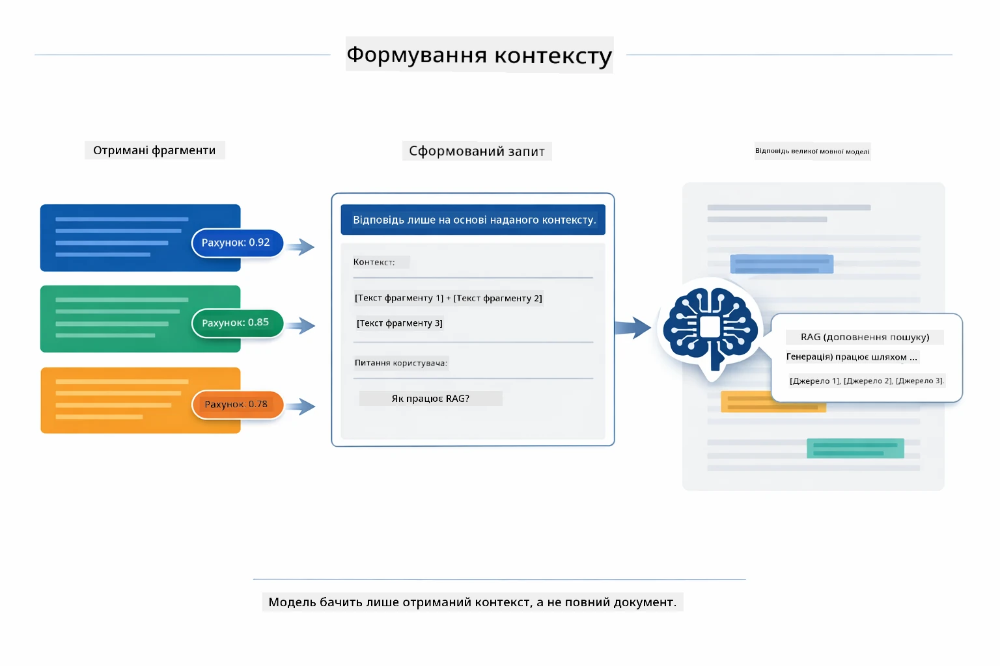

*Ця діаграма показує, як найвищо оцінені шматки збираються в структурований запит, що дозволяє моделі генерувати обґрунтовану відповідь на основі ваших даних.*

## Запуск Застосунку

**Перевірка розгортання:**

Переконайтеся, що файл `.env` існує у кореневому каталозі з обліковими даними Azure (створений під час Модуля 01):

**Bash:**
```bash
cat ../.env  # Повинно показувати AZURE_OPENAI_ENDPOINT, API_KEY, DEPLOYMENT
```

**PowerShell:**
```powershell
Get-Content ..\.env  # Має показати AZURE_OPENAI_ENDPOINT, API_KEY, DEPLOYMENT
```

**Запуск застосунку:**

> **Примітка:** Якщо ви вже запускали всі застосунки за допомогою `./start-all.sh` з Модуля 01, цей модуль вже працює на порту 8081. Ви можете пропустити наведені нижче команди запуску і перейти безпосередньо до http://localhost:8081.

**Варіант 1: Використання Spring Boot Dashboard (Рекомендується для користувачів VS Code)**

Розробницький контейнер містить розширення Spring Boot Dashboard, яке надає візуальний інтерфейс для керування всіма Spring Boot застосунками. Ви можете знайти його в панелі дій зліва в VS Code (шукайте іконку Spring Boot).

З Spring Boot Dashboard ви можете:
- Переглядати всі наявні Spring Boot застосунки у робочій області
- Запускати/зупиняти застосунки одним кліком
- Переглядати журнали застосунків у реальному часі
- Моніторити статус застосунків

Просто натисніть кнопку відтворення поруч із "rag", щоб запустити цей модуль, або запустіть всі модулі одночасно.


*Цей скріншот показує Spring Boot Dashboard у VS Code, де ви можете візуально запускати, зупиняти та моніторити застосунки.*

**Варіант 2: Використання shell-скриптів**

Запустіть всі веб-застосунки (модулі 01-04):

**Bash:**
```bash
cd ..  # З кореневої директорії
./start-all.sh
```

**PowerShell:**
```powershell
cd ..  # З кореневої директорії
.\start-all.ps1
```

Або запустіть лише цей модуль:

**Bash:**
```bash
cd 03-rag
./start.sh
```

**PowerShell:**
```powershell
cd 03-rag
.\start.ps1
```

Обидва скрипти автоматично завантажують змінні середовища з кореневого файлу `.env` і побудують JAR-файли, якщо їх немає.

> **Примітка:** Якщо ви надаєте перевагу будувати всі модулі вручну перед запуском:
>
> **Bash:**
> ```bash
> cd ..  # Go to root directory
> mvn clean package -DskipTests
> ```
>
> **PowerShell:**
> ```powershell
> cd ..  # Go to root directory
> mvn clean package -DskipTests
> ```

Відкрийте http://localhost:8081 у вашому браузері.

**Щоб зупинити:**

**Bash:**
```bash
./stop.sh  # Тільки цей модуль
# Або
cd .. && ./stop-all.sh  # Всі модулі
```

**PowerShell:**
```powershell
.\stop.ps1  # Тільки цей модуль
# Або
cd ..; .\stop-all.ps1  # Усі модулі
```

## Використання Застосунку

Застосунок надає веб-інтерфейс для завантаження документів і ставлення запитань.

<a href="images/rag-homepage.png"></a>

*Цей скріншот показує інтерфейс застосунку RAG, де ви можете завантажувати документи і ставити запитання.*

### Завантаження Документа

Почніть із завантаження документа — TXT файли найкраще підходять для тестування. У цій директорії наданий `sample-document.txt`, який містить інформацію про функції LangChain4j, реалізацію RAG і кращі практики — ідеально для тестування системи.

Система обробляє ваш документ, розбиває його на шматки і створює embedding-и для кожного шматка. Це відбувається автоматично при завантаженні.

### Ставте Запитання

Тепер ставте конкретні питання про вміст документа. Спробуйте щось фактичне, що чітко викладено в документі. Система шукає релевантні шматки, включає їх у запит і генерує відповідь.

### Перевірка Джерел

Зверніть увагу, що кожна відповідь містить посилання на джерела з оцінками подібності. Ці оцінки (від 0 до 1) показують, наскільки релевантним був кожен шматок до вашого запитання. Вищі оцінки означають кращі співпадіння. Це дозволяє перевірити відповідь із вихідним матеріалом.

<a href="images/rag-query-results.png"></a>

*Цей скріншот показує результати запиту з згенерованою відповіддю, посиланнями на джерела і оцінками релевантності для кожного витягнутого шматка.*

### Експериментуйте з Питаннями

Спробуйте різні типи питань:
- Конкретні факти: "Яка основна тема?"
- Порівняння: "В чому різниця між X і Y?"
- Підсумки: "Підсумуйте ключові моменти про Z"

Спостерігайте, як змінюються оцінки релевантності залежно від того, наскільки ваше питання відповідає вмісту документа.

## Ключові Поняття

### Стратегія Розбиття на Шматки

Документи розбиваються на шматки по 300 токенів з 30 токенами перекриття. Такий баланс забезпечує, щоб кожен шматок мав достатньо контексту для змістовності, але був досить маленьким, щоб у запиті можна було включити кілька шматків.

### Оцінки Подібності

Кожен витягнутий шматок має оцінку подібності від 0 до 1, що вказує, наскільки він співпадає з запитанням користувача. Діаграма нижче візуалізує діапазони оцінок і як система їх використовує для фільтрації результатів:

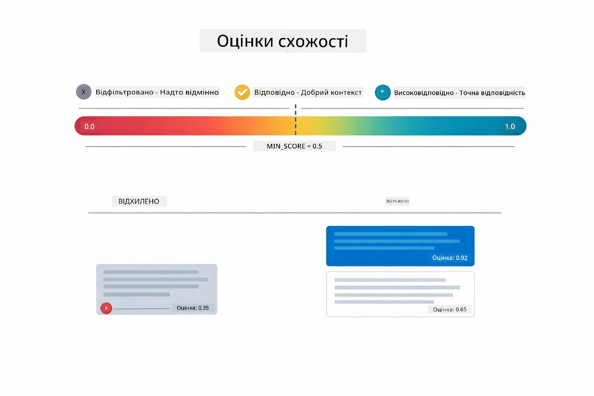

*Ця діаграма показує діапазони оцінок від 0 до 1, з мінімальним порогом 0.5, який фільтрує нерелевантні шматки.*

Оцінки коливаються від 0 до 1:
- 0.7-1.0: Дуже релевантно, точне співпадіння
- 0.5-0.7: Релевантно, хороший контекст
- Нижче за 0.5: Відфільтровано, занадто віддалене

Система витягує лише шматки з оцінкою вище мінімального порогу для забезпечення якості.

Embedding-и працюють добре, коли смислові кластери чітко розділені, але мають сліпі зони. Діаграма нижче показує поширені помилки — занадто великі шматки створюють нечіткі вектори, шматки надто маленькі не мають контексту, неоднозначні терміни ведуть до кількох кластерів, а точні пошуки (ID, номери деталей) взагалі не працюють з embedding-ами:

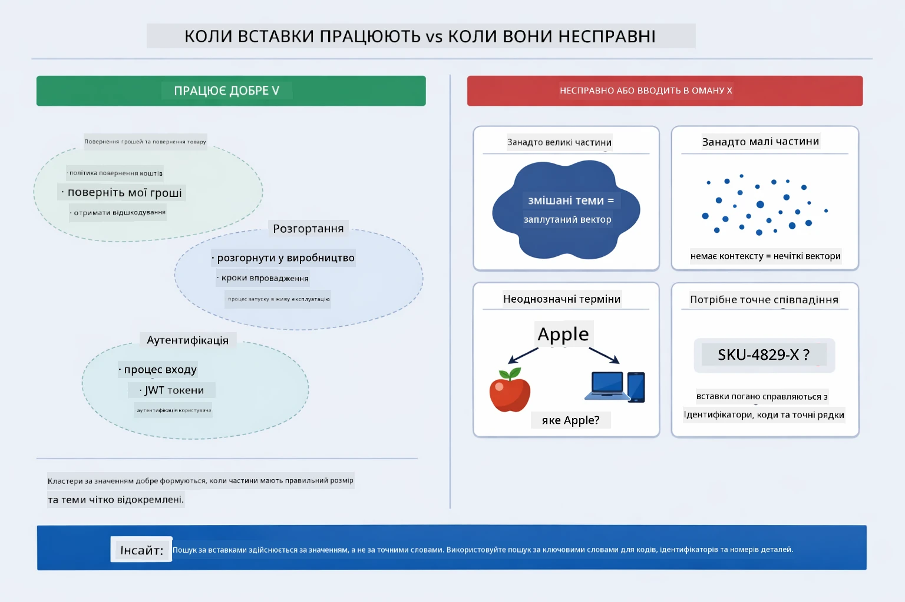

*Ця діаграма показує поширені помилки embedding-ів: занадто великі шматки, занадто малі, неоднозначні терміни, що вказують на кілька кластерів, та точні пошуки, як ID.*

### Зберігання в Пам’яті

Цей модуль використовує зберігання в оперативній пам’яті для простоти. При перезапуску застосунку завантажені документи втрачаються. Промислові системи використовують стійкі векторні бази даних, такі як Qdrant чи Azure AI Search.

### Керування Вікном Контексту

Кожна модель має максимальний розмір контексту. Ви не можете включити всі шматки великого документа. Система витягує топ N найбільш релевантних шматків (за замовчуванням 5), щоб залишатися у межах обмежень та водночас надати достатній контекст для точних відповідей.

## Коли RAG Має Значення

RAG не завжди є правильним підходом. Наступний довідник допоможе визначити, коли RAG додає цінність, а коли достатньо простіших підходів — як включення контенту безпосередньо в запит або використання вбудованих знань моделі:

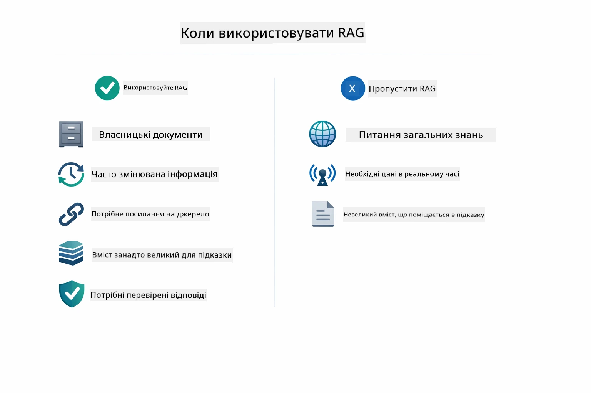

*Ця діаграма показує довідник рішень, коли RAG додає цінність, а коли достатньо простіших підходів.*

**Використовуйте RAG, коли:**
- Відповідаєте на питання щодо власних документів
- Інформація часто змінюється (політики, ціни, специфікації)
- Точність вимагає посилання на джерела
- Контент надто великий, щоб поміститися у один запит
- Потрібні перевірені, обґрунтовані відповіді

**Не використовуйте RAG, коли:**
- Питання вимагають загальних знань, що вже є у моделі
- Потрібні дані в реальному часі (RAG працює з завантаженими документами)
- Контент достатньо малий, щоб включити його безпосередньо у запити

## Наступні Кроки

**Наступний Модуль:** [04-tools - AI Агенти з Інструментами](../04-tools/README.md)

---

**Навігація:** [← Попередній: Модуль 02 - Prompt Engineering](../02-prompt-engineering/README.md) | [Назад до Головної](../README.md) | [Наступний: Модуль 04 - Інструменти →](../04-tools/README.md)

---

<!-- CO-OP TRANSLATOR DISCLAIMER START -->
**Відмова від відповідальності**:
Цей документ був перекладений за допомогою сервісу автоматичного перекладу [Co-op Translator](https://github.com/Azure/co-op-translator). Хоча ми прагнемо до точності, зверніть увагу, що автоматичний переклад може містити помилки або неточності. Оригінальний документ рідною мовою вважається авторитетним джерелом. Для критично важливої інформації рекомендується звертатися до професійного людського перекладу. Ми не несемо відповідальності за будь-які непорозуміння або неправильні тлумачення, що виникли внаслідок використання цього перекладу.
<!-- CO-OP TRANSLATOR DISCLAIMER END -->