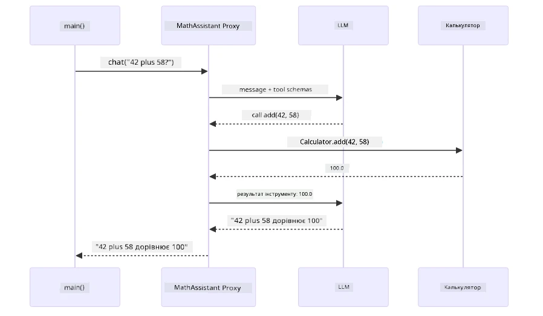
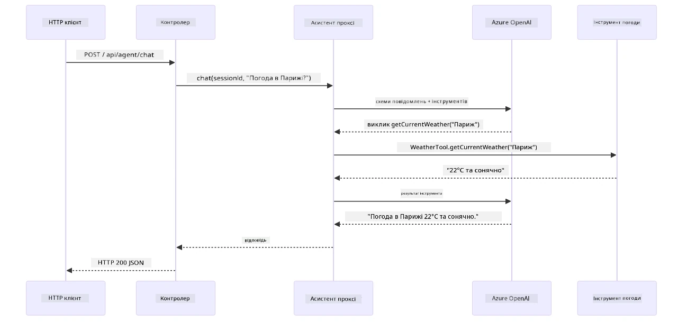

# Модуль 04: AI-агенти з інструментами

## Зміст

- [Відео-пояснення](../../../04-tools)
- [Чому ви навчитеся](../../../04-tools)
- [Передумови](../../../04-tools)
- [Розуміння AI агентів з інструментами](../../../04-tools)
- [Як працює виклик інструментів](../../../04-tools)
  - [Визначення інструментів](../../../04-tools)
  - [Прийняття рішень](../../../04-tools)
  - [Виконання](../../../04-tools)
  - [Генерація відповіді](../../../04-tools)
  - [Архітектура: Автовключення Spring Boot](../../../04-tools)
- [Ланцюжок інструментів](../../../04-tools)
- [Запуск програми](../../../04-tools)
- [Використання програми](../../../04-tools)
  - [Спробуйте просте використання інструментів](../../../04-tools)
  - [Перевірте ланцюжок інструментів](../../../04-tools)
  - [Подивіться на хід розмови](../../../04-tools)
  - [Експериментуйте з різними запитами](../../../04-tools)
- [Ключові поняття](../../../04-tools)
  - [Патерн ReAct (Міркування і Дія)](../../../04-tools)
  - [Опис інструментів має значення](../../../04-tools)
  - [Управління сеансами](../../../04-tools)
  - [Обробка помилок](../../../04-tools)
- [Доступні інструменти](../../../04-tools)
- [Коли слід використовувати агентів на основі інструментів](../../../04-tools)
- [Інструменти vs RAG](../../../04-tools)
- [Наступні кроки](../../../04-tools)

## Відео-пояснення

Перегляньте цю живу сесію, яка пояснює, як розпочати роботу з цим модулем:

<a href="https://www.youtube.com/watch?v=O_J30kZc0rw"></a>

## Чому ви навчитеся

До цього ви навчились вести бесіди з AI, ефективно структурувати запити і базувати відповіді на документах. Але існує фундаментальне обмеження: мовні моделі можуть тільки генерувати текст. Вони не можуть перевірити погоду, виконувати обчислення, робити запити до баз даних або взаємодіяти з зовнішніми системами.

Інструменти змінюють це. Надаючи моделі доступ до функцій, які вона може викликати, ви перетворюєте її з генератора тексту на агента, який здатен виконувати дії. Модель вирішує, коли їй потрібен інструмент, який саме і з якими параметрами. Ваш код виконує функцію і повертає результат. Модель включає цей результат у свою відповідь.

## Передумови

- Пройдено [Модуль 01 - Вступ](../01-introduction/README.md) (розгорнуті ресурси Azure OpenAI)
- Рекомендовано пройти попередні модулі (цей модуль посилається на [концепції RAG з Модуля 03](../03-rag/README.md) у порівнянні Інструменти vs RAG)
- Файл `.env` у кореневій теці з обліковими даними Azure (створений за допомогою `azd up` у Модулі 01)

> **Примітка:** Якщо ви не завершили Модуль 01, спершу виконайте інструкції з розгортання там.

## Розуміння AI агентів з інструментами

> **📝 Примітка:** Термін "агенти" у цьому модулі означає AI-асистентів із можливістю виклику інструментів. Це відрізняється від патернів **Agentic AI** (автономні агенти з плануванням, пам’яттю і багатоетапним міркуванням), які ми розглянемо в [Модулі 05: MCP](../05-mcp/README.md).

Без інструментів мовна модель може тільки генерувати текст на основі свого навчання. Запитайте погоду — вона мусить здогадуватись. Дайте їй інструменти — вона може викликати API погоди, робити обчислення або запити до бази даних, а потім вставити реальні результати у відповідь.


*Без інструментів модель тільки здогадується — з інструментами вона може викликати API, виконувати обчислення та повертати актуальні дані.*

AI-агент з інструментами слідує патерну **Reasoning and Acting (ReAct)**. Модель не просто відповідає — вона мислить, що їй потрібно, діє через виклик інструменту, спостерігає результат і вирішує, чи потрібно діяти знову, або надати остаточну відповідь:

1. **Міркування** — агент аналізує питання користувача та визначає, яка інформація потрібна
2. **Дія** — агент обирає правильний інструмент, формує параметри і викликає його
3. **Спостереження** — агент отримує результат інструменту і оцінює його
4. **Повтор або Відповідь** — якщо потрібно більше даних, агент повертається на початок; інакше формує відповідь природною мовою


*Цикл ReAct — агент міркує, що робити, діє через виклик інструменту, спостерігає результат і повторює, доки не сформує остаточну відповідь.*

Це відбувається автоматично. Ви визначаєте інструменти і їх описи. Модель приймає рішення про те, коли і як їх використовувати.

## Як працює виклик інструментів

### Визначення інструментів

[WeatherTool.java](../../../04-tools/src/main/java/com/example/langchain4j/agents/tools/WeatherTool.java) | [TemperatureTool.java](../../../04-tools/src/main/java/com/example/langchain4j/agents/tools/TemperatureTool.java)

Ви визначаєте функції з чіткими описами та специфікаціями параметрів. Модель бачить ці описи у системному запиті і розуміє, що робить кожен інструмент.

```java
@Component
public class WeatherTool {
    
    @Tool("Get the current weather for a location")
    public String getCurrentWeather(@P("Location name") String location) {
        // Ваша логіка пошуку погоди
        return "Weather in " + location + ": 22°C, cloudy";
    }
}

@AiService
public interface Assistant {
    String chat(@MemoryId String sessionId, @UserMessage String message);
}

// Помічник автоматично підключається Spring Boot з:
// - Bean ChatModel
// - Всі методи @Tool з класів @Component
// - ChatMemoryProvider для управління сесіями
```

Нижче наведена схема розбиває кожну анотацію і показує, як кожен елемент допомагає AI розуміти, коли викликати інструмент і які аргументи передавати:


*Анатомія визначення інструменту — @Tool повідомляє AI, коли використовувати його, @P описує кожен параметр, а @AiService зв’язує все разом під час запуску.*

> **🤖 Спробуйте з [GitHub Copilot](https://github.com/features/copilot) Chat:** Відкрийте [`WeatherTool.java`](../../../04-tools/src/main/java/com/example/langchain4j/agents/tools/WeatherTool.java) і запитайте:
> - "Як інтегрувати реальний API погоди як OpenWeatherMap замість макетних даних?"
> - "Що робить хороший опис інструменту, який допомагає AI правильно його використовувати?"
> - "Як обробляти помилки API і обмеження швидкості у реалізації інструментів?"

### Прийняття рішень

Коли користувач питає "Яка погода в Сіетлі?", модель не обирає інструмент випадково. Вона порівнює намір користувача з усіма описами інструментів, які їй доступні, оцінює кожен по релевантності і обирає найкращий. Потім створює структурований виклик функції з правильними параметрами — в цьому випадку встановлює `location` у `"Seattle"`.

Якщо жоден інструмент не підходить під запит користувача, модель відповідає зі своєї власної бази знань. Якщо кілька інструментів підходять, вона вибирає найконкретніший.


*Модель оцінює кожен доступний інструмент щодо наміру користувача і вибирає найкращий — тому важливо писати чіткі і конкретні описи інструментів.*

### Виконання

[AgentService.java](../../../04-tools/src/main/java/com/example/langchain4j/agents/service/AgentService.java)

Spring Boot автоматично підключає декларативний інтерфейс `@AiService` з усіма зареєстрованими інструментами, а LangChain4j виконує виклики інструментів автоматично. За лаштунками повний виклик інструменту проходить через шість стадій — від запитання користувача природною мовою до відповіді також природною мовою:


*Повний потік — користувач ставить питання, модель обирає інструмент, LangChain4j його виконує, а модель вкладає результат у природну відповідь.*

Якщо ви запускали [ToolIntegrationDemo](../../../00-quick-start/src/main/java/com/example/langchain4j/quickstart/ToolIntegrationDemo.java) у Модулі 00, ви вже бачили цей патерн у дії — інструменти калькулятора викликались так само. Нижче діаграма послідовності показує, що саме відбувалось “під капотом” того демо:



*Цикл виклику інструменту в демо Quick Start — `AiServices` надсилає повідомлення і схеми інструментів LLM, LLM відповідає викликом функції як `add(42, 58)`, LangChain4j локально виконує метод `Calculator` і повертає результат для остаточної відповіді.*

> **🤖 Спробуйте з [GitHub Copilot](https://github.com/features/copilot) Chat:** Відкрийте [`AgentService.java`](../../../04-tools/src/main/java/com/example/langchain4j/agents/service/AgentService.java) і запитайте:
> - "Як працює патерн ReAct і чому він ефективний для AI агентів?"
> - "Як агент вирішує, який інструмент використовувати і в якому порядку?"
> - "Що відбувається, якщо виконання інструменту не вдається — як надійно обробляти помилки?"

### Генерація відповіді

Модель отримує дані про погоду і форматує їх у відповідь природною мовою для користувача.

### Архітектура: Автовключення Spring Boot

Цей модуль використовує інтеграцію LangChain4j зі Spring Boot через декларативні інтерфейси `@AiService`. Під час запуску Spring Boot знаходить кожен `@Component`, що містить методи з `@Tool`, ваш `ChatModel` бін і `ChatMemoryProvider` — потім зв’язує їх у єдиний інтерфейс `Assistant` без жодного шаблонного коду.


*Інтерфейс @AiService об’єднує ChatModel, компоненти інструментів і провайдер пам’яті — Spring Boot автоматично керує всіма підключеннями.*

Ось повний життєвий цикл запиту у вигляді діаграми послідовності — від HTTP-запиту через контролер, сервіс та автопідключений проксі аж до виконання інструменту і назад:



*Повний життєвий цикл запиту Spring Boot — HTTP-запит проходить через контролер і сервіс до автопідключеного проксі Assistant, який автоматично оркеструє виклики LLM і інструментів.*

Основні переваги цього підходу:

- **Автовключення Spring Boot** — ChatModel і інструменти автоматично інжектяться
- **Патерн @MemoryId** — Автоматичне управління пам’яттю на основі сеансів
- **Одна інстанція** — Assistant створюється один раз і повторно використовується для кращої продуктивності
- **Типобезпечне виконання** — виклики Java методів напряму з конвертацією типів
- **Керування багатокроковими діалогами** — автоматичне оброблення ланцюгів інструментів
- **Жодного шаблонного коду** — не потрібно вручну викликати `AiServices.builder()` чи керувати хеш-мапами пам’яті

Альтернативні підходи (ручний `AiServices.builder()`) потребують більше коду і не дають переваг Spring Boot інтеграції.

## Ланцюжок інструментів

**Ланцюг інструментів** — справжня потужність агентів на основі інструментів виявляється, коли одне питання вимагає кількох інструментів. Запитайте "Яка погода в Сіетлі у Фаренгейтах?" і агент автоматично створює ланцюжок із двох інструментів: спочатку викликає `getCurrentWeather` для отримання температури в Цельсіях, потім передає значення у `celsiusToFahrenheit` для перетворення — і все це за один хід розмови.


*Ланцюжок інструментів у дії — агент спочатку викликає getCurrentWeather, потім передає результат у celsiusToFahrenheit і формує об’єднану відповідь.*

**Гарна обробка помилок** — запитайте погоду у місті, якого немає у макетних даних. Інструмент повертає повідомлення про помилку, і AI пояснює, що не може допомогти, замість того щоб аварійно завершитись. Інструменти виходять із ладу безпечно. Нижче наведена діаграма, що порівнює два підходи — з належною обробкою помилок агент ловить виняток і дає корисну відповідь, а без неї уся програма падає:


*Коли інструмент виходить з ладу, агент ловить помилку і відповідає з поясненням замість аварійного завершення.*

Це відбувається за один хід розмови. Агент автономно організовує кілька викликів інструментів.

## Запуск програми

**Перевірка розгортання:**

Переконайтеся, що файл `.env` існує в кореневій теці з обліковими даними Azure (створений під час Модуля 01). Запустіть цю команду у теці модуля (`04-tools/`):

**Bash:**
```bash
cat ../.env  # Має показувати AZURE_OPENAI_ENDPOINT, API_KEY, DEPLOYMENT
```

**PowerShell:**
```powershell
Get-Content ..\.env  # Повинно показувати AZURE_OPENAI_ENDPOINT, API_KEY, DEPLOYMENT
```

**Запустіть програму:**

> **Примітка:** Якщо ви вже запускали всі програми за допомогою `./start-all.sh` у кореневій теці (як описано в Модулі 01), цей модуль вже працює на порту 8084. Ви можете не виконувати команди запуску нижче і одразу перейти за адресою http://localhost:8084.

**Варіант 1: Використання Spring Boot Dashboard (рекомендовано для користувачів VS Code)**

Dev контейнер включає розширення Spring Boot Dashboard, яке надає візуальний інтерфейс для керування всіма Spring Boot застосунками. Його можна знайти у Activity Bar зліва у VS Code (шукайте іконку Spring Boot).

За допомогою Spring Boot Dashboard ви можете:
- Побачити всі доступні Spring Boot застосунки у робочому просторі
- Запускати/зупиняти застосунки одним кліком
- Переглядати логи застосунку у реальному часі
- Моніторити статус застосунку
Просто натисніть кнопку відтворення поруч із «tools», щоб запустити цей модуль, або запустіть всі модулі одразу.

Ось як виглядає панель Spring Boot Dashboard у VS Code:


*Панель Spring Boot Dashboard у VS Code — запуск, зупинка та моніторинг усіх модулів з одного місця*

**Варіант 2: Використання shell-скриптів**

Запустіть усі вебзастосунки (модулі 01-04):

**Bash:**
```bash
cd ..  # З кореневої директорії
./start-all.sh
```

**PowerShell:**
```powershell
cd ..  # З кореневого каталогу
.\start-all.ps1
```

Або запустіть лише цей модуль:

**Bash:**
```bash
cd 04-tools
./start.sh
```

**PowerShell:**
```powershell
cd 04-tools
.\start.ps1
```

Обидва скрипти автоматично завантажують змінні середовища з кореневого файлу `.env` і побудують JAR-файли, якщо вони не існують.

> **Примітка:** Якщо ви хочете вручну зібрати всі модулі перед запуском:
>
> **Bash:**
> ```bash
> cd ..  # Go to root directory
> mvn clean package -DskipTests
> ```
>
> **PowerShell:**
> ```powershell
> cd ..  # Go to root directory
> mvn clean package -DskipTests
> ```

Відкрийте http://localhost:8084 у вашому браузері.

**Щоб зупинити:**

**Bash:**
```bash
./stop.sh  # Тільки цей модуль
# Або
cd .. && ./stop-all.sh  # Всі модулі
```

**PowerShell:**
```powershell
.\stop.ps1  # Лише цей модуль
# Або
cd ..; .\stop-all.ps1  # Усі модулі
```

## Використання застосунку

Застосунок надає веб-інтерфейс, де ви можете взаємодіяти з AI-агентом, який має доступ до інструментів погоди та конвертації температури. Ось як виглядає інтерфейс — він містить приклади швидкого старту та панель чату для надсилання запитів:

<a href="images/tools-homepage.png"></a>

*Інтерфейс AI Agent Tools - швидкі приклади та чат для взаємодії з інструментами*

### Спробуйте просте використання інструменту

Почніть з простого запиту: «Перетворити 100 градусів за Фаренгейтом у Цельсій». Агент визначає, що йому потрібен інструмент конвертації температури, викликає його з потрібними параметрами та повертає результат. Зверніть увагу, наскільки це природньо — ви не вказували, який інструмент використовувати чи як його викликати.

### Перевірте ланцюжок інструментів

Тепер спробуйте щось складніше: «Яка погода в Сіетлі та конвертуй її у Фаренгейти?» Спостерігайте, як агент крок за кроком виконує завдання. Спочатку він отримує погоду (яка повертається в Цельсіях), розуміє, що потрібно конвертувати у Фаренгейти, викликає інструмент конвертації і об’єднує обидва результати в одну відповідь.

### Перегляньте хід розмови

Інтерфейс чату зберігає історію розмови, що дозволяє вести багатокрокові взаємодії. Ви бачите всі попередні запити та відповіді, що полегшує відстеження розмови та розуміння, як агент будує контекст протягом кількох обмінів.

<a href="images/tools-conversation-demo.png"></a>

*Багатокрокова розмова, що демонструє прості конверсії, запити погоди і ланцюг викликів інструментів*

### Експериментуйте з різними запитами

Спробуйте різні комбінації:
- Запити погоди: «Яка погода в Токіо?»
- Конвертації температур: «Що таке 25°C у Кельвінах?»
- Комбіновані запити: «Перевір погоду в Парижі і скажи, чи вище там 20°C»

Зверніть увагу, як агент інтерпретує природну мову і зіставляє її з потрібними викликами інструментів.

## Ключові поняття

### Патерн ReAct (Роздум і дія)

Агент чергує роздум (вирішення, що робити) та дію (використання інструментів). Цей патерн дозволяє автономно вирішувати завдання, а не просто виконувати інструкції.

### Опис інструментів має значення

Якість описів інструментів безпосередньо впливає на те, як агент їх використовує. Чіткі, конкретні описи допомагають моделі зрозуміти, коли і як викликати кожен інструмент.

### Керування сесіями

Анотація `@MemoryId` забезпечує автоматичне керування пам’яттю на основі сесії. Кожен ID сесії отримує власний екземпляр `ChatMemory`, який керує бін `ChatMemoryProvider`, тому кілька користувачів можуть одночасно взаємодіяти з агентом без змішування розмов. Наступна діаграма показує, як кілька користувачів направляються до ізольованих сховищ пам’яті на основі їхніх ID сесій:


*Кожен ID сесії відображається на ізольовану історію розмов — користувачі ніколи не бачать повідомлення один одного.*

### Обробка помилок

Інструменти можуть виходити з ладу — API таймаутяться, параметри можуть бути некоректними, сторонні сервіси відмовляють. Промислові агенти потребують обробки помилок, щоб модель могла пояснювати проблеми або пробувати альтернативи замість аварійного завершення роботи застосунку. Якщо інструмент генерує виняток, LangChain4j перехоплює його і передає повідомлення про помилку назад моделі, яка потім може пояснити проблему натуральною мовою.

## Доступні інструменти

Нижче наведена діаграма показує широку екосистему інструментів, які можна створювати. Цей модуль демонструє інструменти погоди та температури, але той самий патерн `@Tool` працює для будь-якого методу Java — від запитів до баз даних до обробки платежів.


*Будь-який метод Java з анотацією @Tool стає доступним для AI — патерн розширюється на бази даних, API, електронну пошту, роботу з файлами та інше.*

## Коли використовувати агентів із інструментами

Не кожен запит потребує інструментів. Рішення зводиться до того, чи потрібно AI взаємодіяти із зовнішніми системами, чи він може відповідати на основі власних знань. Наступне керівництво узагальнює, коли інструменти додають цінність, а коли вони непотрібні:


*Швидке керівництво з прийняття рішення — інструменти потрібні для актуальних даних, обчислень та дій; загальні знання та творчі завдання не потребують їх.*

## Інструменти vs RAG

Модулі 03 і 04 розширюють можливості AI, але принципово різними способами. RAG надає моделі доступ до **знань** через пошук документів. Інструменти надають моделі можливість виконувати **дії** через виклики функцій. Нижче наведена діаграма, що порівнює ці два підходи бок о бок — від того, як працює кожен робочий процес, до компромісів між ними:


*RAG витягує інформацію зі статичних документів — інструменти виконують дії та отримують динамічні, актуальні дані. Багато промислових систем поєднують обидва підходи.*

На практиці багато промислових систем комбінують обидва підходи: RAG для підкріплення відповідей документацією, та інструменти для отримання живих даних або виконання операцій.

## Наступні кроки

**Наступний Модуль:** [05-mcp - Протокол контексту моделі (MCP)](../05-mcp/README.md)

---

**Навігація:** [← Попередній: Модуль 03 - RAG](../03-rag/README.md) | [Назад до головної](../README.md) | [Наступний: Модуль 05 - MCP →](../05-mcp/README.md)

---

<!-- CO-OP TRANSLATOR DISCLAIMER START -->
**Відмова від відповідальності**:
Цей документ було перекладено за допомогою сервісу автоматичного перекладу [Co-op Translator](https://github.com/Azure/co-op-translator). Хоча ми докладаємо зусиль для забезпечення точності, зверніть увагу, що автоматичні переклади можуть містити помилки або неточності. Оригінальний документ рідною мовою слід вважати авторитетним джерелом інформації. Для критично важливої інформації рекомендується звертатися до професійного людського перекладу. Ми не несемо відповідальності за будь-які непорозуміння або неправильне тлумачення, що виникли в результаті використання цього перекладу.
<!-- CO-OP TRANSLATOR DISCLAIMER END -->