# Модуль 04: AI-Агенти з Інструментами

## Зміст

- [Чому Ви Навчитеся](../../../04-tools)
- [Передумови](../../../04-tools)
- [Розуміння AI-Агентів з Інструментами](../../../04-tools)
- [Як Працює Виклик Інструментів](../../../04-tools)
  - [Визначення Інструментів](../../../04-tools)
  - [Прийняття Рішень](../../../04-tools)
  - [Виконання](../../../04-tools)
  - [Генерація Відповідей](../../../04-tools)
  - [Архітектура: Автоматичне Підключення Spring Boot](../../../04-tools)
- [Ланцюжок Інструментів](../../../04-tools)
- [Запуск Додатка](../../../04-tools)
- [Використання Додатка](../../../04-tools)
  - [Спробуйте Просте Використання Інструментів](../../../04-tools)
  - [Перевірте Ланцюжок Інструментів](../../../04-tools)
  - [Перегляньте Потік Розмови](../../../04-tools)
  - [Експериментуйте з Різними Запитами](../../../04-tools)
- [Ключові Концепції](../../../04-tools)
  - [Патерн ReAct (Міркування та Дія)](../../../04-tools)
  - [Опис Інструментів Має Значення](../../../04-tools)
  - [Управління Сесіями](../../../04-tools)
  - [Обробка Помилок](../../../04-tools)
- [Доступні Інструменти](../../../04-tools)
- [Коли Використовувати Агентів на Основі Інструментів](../../../04-tools)
- [Інструменти проти RAG](../../../04-tools)
- [Наступні Кроки](../../../04-tools)

## Чому Ви Навчитеся

Дотепер ви навчилися вести розмови з AI, ефективно структурувати підказки та підкріплювати відповіді вашими документами. Але існує фундаментальне обмеження: моделі мов можуть лише генерувати текст. Вони не можуть перевірити погоду, виконати розрахунки, зробити запити до баз даних або взаємодіяти з зовнішніми системами.

Інструменти змінюють це. Надаючи моделі доступ до функцій, які вона може викликати, ви перетворюєте її з генератора тексту в агента, що може виконувати дії. Модель вирішує, коли їй потрібен інструмент, який інструмент використати і які параметри передати. Ваш код виконує функцію і повертає результат. Модель включає цей результат у свою відповідь.

## Передумови

- Завершений Модуль 01 (розгорнуті ресурси Azure OpenAI)
- Файл `.env` у кореневій директорії з обліковими даними Azure (створений командою `azd up` у Модулі 01)

> **Примітка:** Якщо ви не завершили Модуль 01, спочатку дотримуйтесь інструкцій з розгортання там.

## Розуміння AI-Агентів з Інструментами

> **📝 Примітка:** Термін "агенти" у цьому модулі стосується AI-помічників, доповнених можливістю виклику інструментів. Це відрізняється від патернів **Agentic AI** (автономних агентів з плануванням, пам’яттю та багатокроковим міркуванням), які ми розглянемо у [Модулі 05: MCP](../05-mcp/README.md).

Без інструментів модель мов може лише генерувати текст на основі своїх тренувальних даних. Запитайте у неї про поточну погоду — і вона мусить здогадуватися. Дайте їй інструменти — вона може викликати API погоди, виконати розрахунки або звернутися до бази даних — і потім вплітає ці реальні результати у свою відповідь.

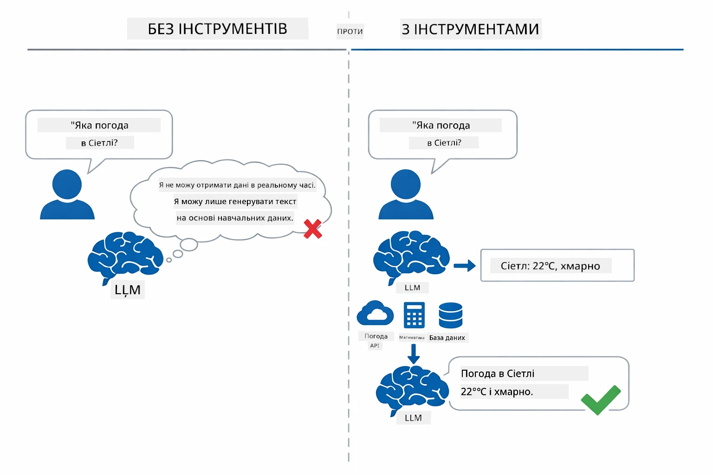

*Без інструментів модель лише припускає — з інструментами вона може викликати API, виконувати розрахунки і повертати дані в реальному часі.*

AI-агент з інструментами слідує патерну **Reasoning and Acting (ReAct)**. Модель не просто відповідає — вона розмірковує, що їй потрібно, діє, викликаючи інструмент, спостерігає результат і потім вирішує: діяти знову чи надати фінальну відповідь:

1. **Розмірковує** — агент аналізує запит користувача і визначає, яка інформація йому потрібна
2. **Діє** — агент обирає правильний інструмент, генерує відповідні параметри і викликає його
3. **Спостерігає** — агент отримує результат інструменту і оцінює його
4. **Повторює або Відповідає** — якщо потрібні додаткові дані, агент повторює цикл; інакше формує природну відповідь

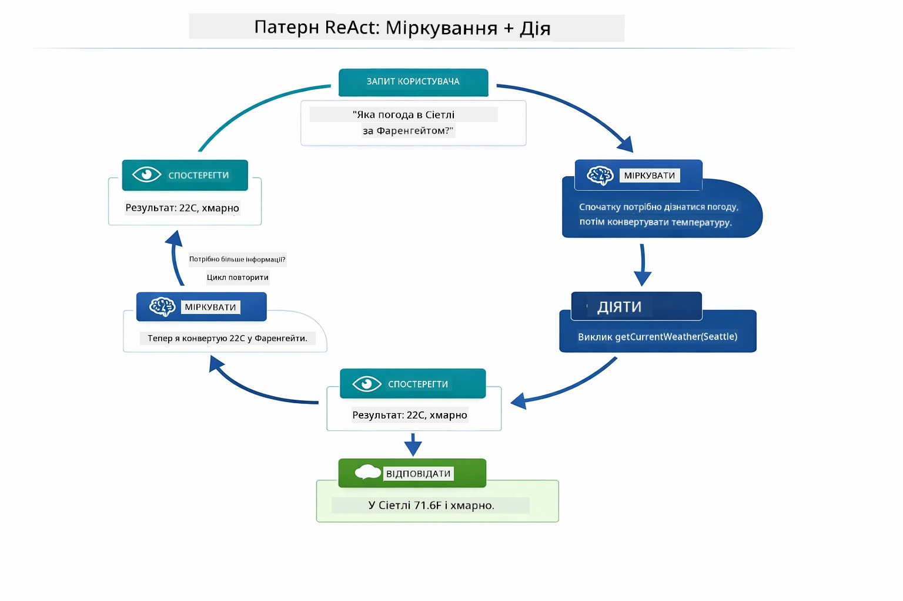

*Цикл ReAct — агент розмірковує над дією, виконує виклик інструменту, оцінює результат і повторює, доки не надасть остаточну відповідь.*

Це відбувається автоматично. Ви визначаєте інструменти та їх описи. Модель приймає рішення, коли і як їх використовувати.

## Як Працює Виклик Інструментів

### Визначення Інструментів

[WeatherTool.java](../../../04-tools/src/main/java/com/example/langchain4j/agents/tools/WeatherTool.java) | [TemperatureTool.java](../../../04-tools/src/main/java/com/example/langchain4j/agents/tools/TemperatureTool.java)

Ви визначаєте функції з чіткими описами та специфікаціями параметрів. Модель бачить ці описи у системній підказці і розуміє, що робить кожен інструмент.

```java
@Component
public class WeatherTool {
    
    @Tool("Get the current weather for a location")
    public String getCurrentWeather(@P("Location name") String location) {
        // Ваша логіка пошуку погоди
        return "Weather in " + location + ": 22°C, cloudy";
    }
}

@AiService
public interface Assistant {
    String chat(@MemoryId String sessionId, @UserMessage String message);
}

// Асистент автоматично підключений Spring Boot з:
// - beans ChatModel
// - Всі методи @Tool з класів @Component
// - ChatMemoryProvider для управління сесіями
```

Діаграма нижче розбиває кожну анотацію та показує, як кожен елемент допомагає AI зрозуміти, коли викликати інструмент і які аргументи передавати:

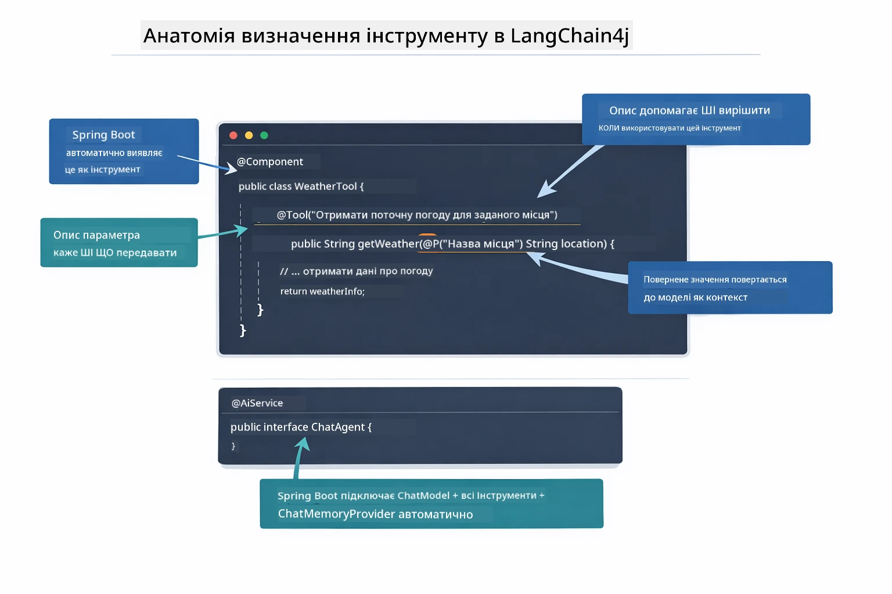

*Анатомія визначення інструменту — @Tool вказує AI, коли його використовувати, @P описує кожен параметр, а @AiService з’єднує все разом на старті.*

> **🤖 Спробуйте з [GitHub Copilot](https://github.com/features/copilot) Chat:** Відкрийте [`WeatherTool.java`](../../../04-tools/src/main/java/com/example/langchain4j/agents/tools/WeatherTool.java) і запитайте:
> - "Як інтегрувати справжнє weather API, наприклад OpenWeatherMap, замість мок-даних?"
> - "Що складає хороший опис інструменту, який допомагає AI правильно його використовувати?"
> - "Як обробляти помилки API та ліміти викликів у реалізації інструментів?"

### Прийняття Рішень

Коли користувач запитує "Яка погода в Сіетлі?", модель не вибирає інструмент наосліп. Вона порівнює намір користувача з кожним описом інструменту, оцінює релевантність і вибирає найкращий варіант. Потім генерує структурований виклик функції з правильними параметрами — в даному випадку задає `location` як `"Seattle"`.

Якщо жоден інструмент не підходить під запит користувача, модель відповідає з власних знань. Якщо підходить декілька інструментів — вибирає найбільш специфічний.

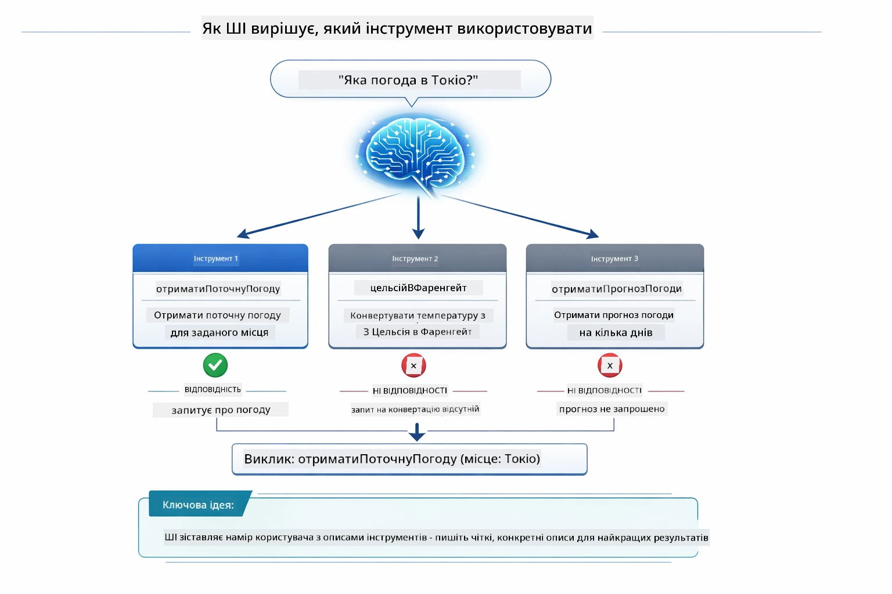

*Модель оцінює кожен доступний інструмент за наміром користувача і вибирає найкращий — тому написання чітких, специфічних описів інструментів дуже важливе.*

### Виконання

[AgentService.java](../../../04-tools/src/main/java/com/example/langchain4j/agents/service/AgentService.java)

Spring Boot автоматично підключає декларативний інтерфейс `@AiService` зі всіма зареєстрованими інструментами, а LangChain4j виконує виклики інструментів автоматично. За лаштунками виклик інструменту проходить шість етапів — від природньомовного запитання користувача до відповіді природною мовою:

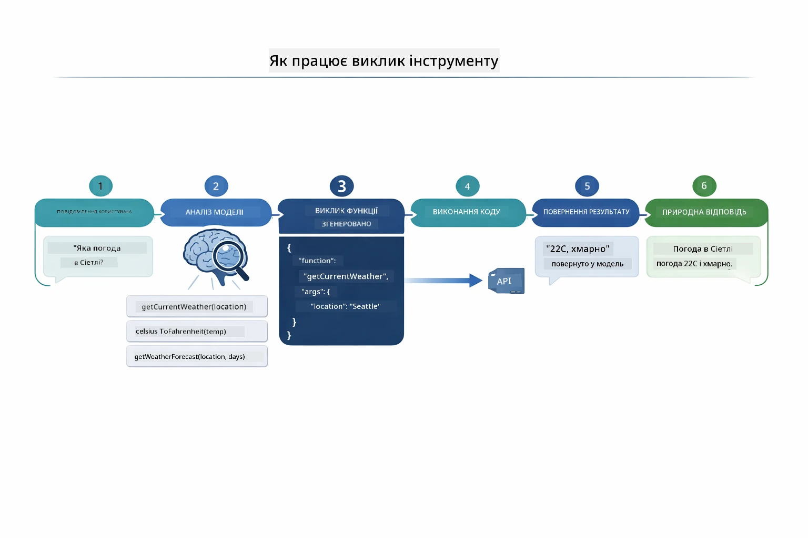

*Повний потік — користувач задає питання, модель вибирає інструмент, LangChain4j виконує його, а модель вплітає результат у природну відповідь.*

> **🤖 Спробуйте з [GitHub Copilot](https://github.com/features/copilot) Chat:** Відкрийте [`AgentService.java`](../../../04-tools/src/main/java/com/example/langchain4j/agents/service/AgentService.java) і запитайте:
> - "Як працює патерн ReAct і чому він ефективний для AI-агентів?"
> - "Як агент вирішує, який інструмент використовувати і в якому порядку?"
> - "Що трапляється, якщо виконання інструменту не вдається - як обробляти помилки надійно?"

### Генерація Відповідей

Модель отримує дані про погоду і формує з них природномовну відповідь для користувача.

### Архітектура: Автоматичне Підключення Spring Boot

Цей модуль використовує інтеграцію LangChain4j зі Spring Boot з декларативними інтерфейсами `@AiService`. Під час запуску Spring Boot знаходить кожен `@Component` з методами, позначеними `@Tool`, ваш бін `ChatModel` і `ChatMemoryProvider` — і підключає їх усі у єдиний інтерфейс `Assistant` без жодного шаблонного коду.

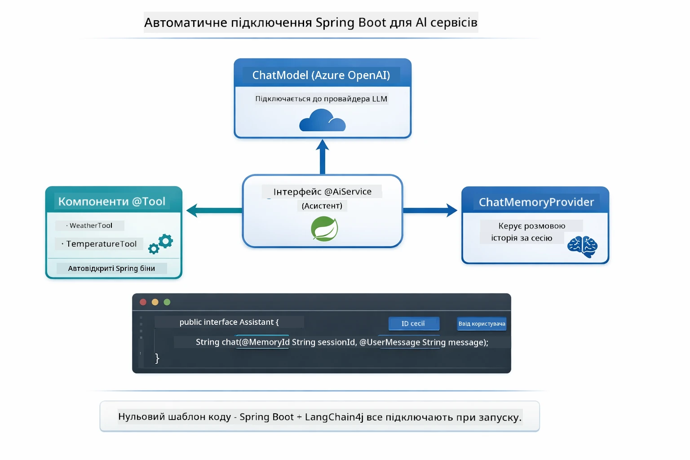

*Інтерфейс @AiService об’єднує ChatModel, компоненти інструментів та провайдера пам’яті — Spring Boot автоматично підключає все.*

Основні переваги такого підходу:

- **Автоматика підключення Spring Boot** — ChatModel та інструменти автоматично інжектяться
- **Патерн @MemoryId** — автоматичне управління пам’яттю на основі сесії
- **Одиничний екземпляр** — Assistant створюється один раз і повторно використовується для кращої продуктивності
- **Типобезпечне виконання** — виклик Java-методів напряму з конвертацією типів
- **Оркестрація кількох кроків** — автоматично керує ланцюжками інструментів
- **Нуль шаблонного коду** — без ручних викликів `AiServices.builder()` чи HashMap пам’яті

Альтернативні підходи (ручний `AiServices.builder()`) вимагають більше коду і не отримують переваг інтеграції зі Spring Boot.

## Ланцюжок Інструментів

**Ланцюжок Інструментів** — справжня сила агентів на основі інструментів проявляється, коли одне питання потребує виклику кількох інструментів. Запитайте "Яка погода в Сіетлі в градусах Фаренгейта?" — агент автоматично створить ланцюжок з двох інструментів: спочатку викличе `getCurrentWeather`, щоб отримати температуру в Цельсіях, потім передасть це значення у `celsiusToFahrenheit` для конвертації — і все в одному ході розмови.

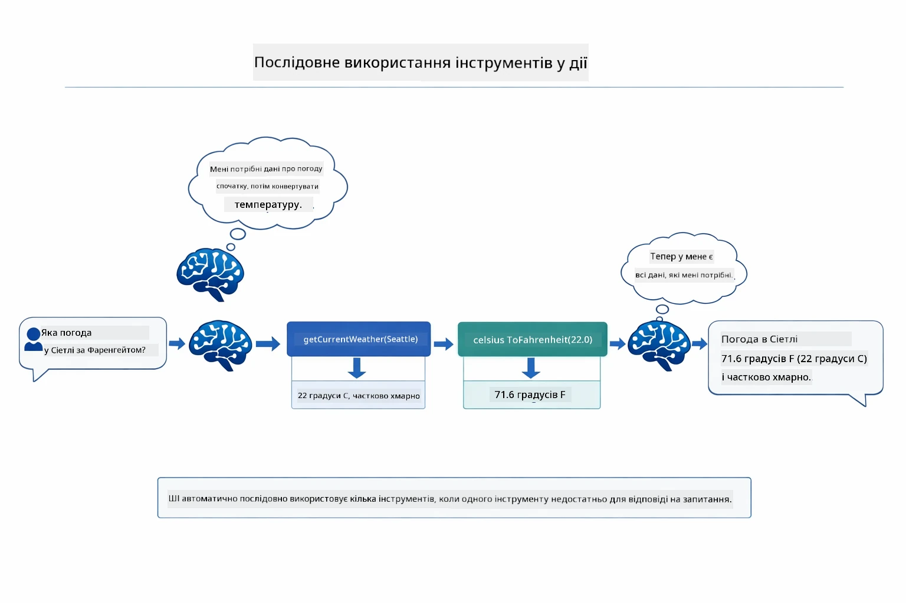

*Ланцюжок інструментів у дії — агент спершу викликає getCurrentWeather, потім передає результат у celsiusToFahrenheit і дає комбіновану відповідь.*

Ось як це виглядає у запущеному додатку — агент ланцюжить два виклики інструментів в одному ході розмови:

<a href="images/tool-chaining.png"></a>

*Вивід програми — агент автоматично ланцюжить getCurrentWeather → celsiusToFahrenheit в одному ході.*

**Гарна обробка відмов** — Запитайте погоду у місті, якого немає у мок-даних. Інструмент поверне повідомлення про помилку і AI пояснить, що не може допомогти замість аварійного завершення. Інструменти безпечно обробляють помилки.

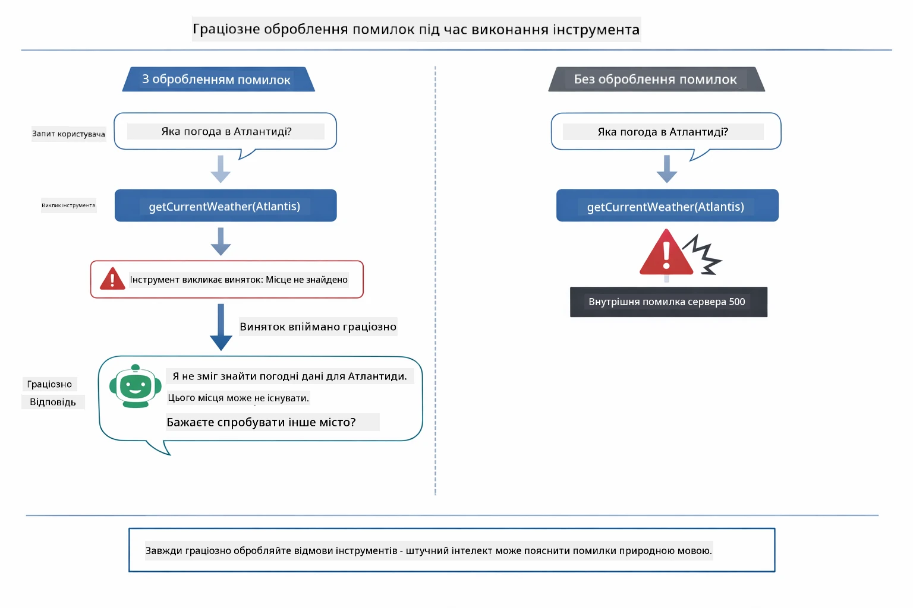

*Коли інструмент не виконується, агент ловить помилку і відповідає корисним поясненням, не аварійно завершуючись.*

Це все відбувається в одному ході розмови. Агент автономно керує кількома викликами інструментів.

## Запуск Додатка

**Перевірка розгортання:**

Переконайтеся, що файл `.env` існує у кореневій директорії з обліковими даними Azure (створений у Модулі 01):
```bash
cat ../.env  # Повинно показати AZURE_OPENAI_ENDPOINT, API_KEY, DEPLOYMENT
```

**Запуск додатка:**

> **Примітка:** Якщо ви вже запускали всі додатки за допомогою `./start-all.sh` з Модуля 01, цей модуль вже працює на порті 8084. Ви можете пропустити команди запуску нижче і перейти відразу до http://localhost:8084.

**Варіант 1: Використання Spring Boot Dashboard (Рекомендовано для користувачів VS Code)**

Dev контейнер містить розширення Spring Boot Dashboard, яке забезпечує візуальний інтерфейс для керування всіма Spring Boot додатками. Ви знайдете його у панелі активності ліворуч у VS Code (шукайте іконку Spring Boot).

За допомогою Spring Boot Dashboard ви можете:
- Переглянути всі доступні Spring Boot додатки у робочій області
- Запускати/зупиняти додатки одним кліком
- Дивитися логи додатків у реальному часі
- Контролювати статус додатків

Просто натисніть кнопку запуску поруч із "tools", щоб запустити цей модуль, або запустіть всі модулі одночасно.


**Варіант 2: Використання shell-скриптів**

Запустіть всі веб-додатки (модулі 01-04):

**Bash:**
```bash
cd ..  # З кореневого каталогу
./start-all.sh
```

**PowerShell:**
```powershell
cd ..  # З кореневого каталогу
.\start-all.ps1
```

Або запустіть лише цей модуль:

**Bash:**
```bash
cd 04-tools
./start.sh
```

**PowerShell:**
```powershell
cd 04-tools
.\start.ps1
```

Обидва скрипти автоматично завантажують змінні оточення з кореневого файлу `.env` і скомпілюють JAR-файли, якщо вони не існують.

> **Примітка:** Якщо ви хочете вручну скомпілювати всі модулі перед запуском:
>
> **Bash:**
> ```bash
> cd ..  # Go to root directory
> mvn clean package -DskipTests
> ```
>
> **PowerShell:**
> ```powershell
> cd ..  # Go to root directory
> mvn clean package -DskipTests
> ```

Відкрийте http://localhost:8084 у браузері.

**Щоб зупинити:**

**Bash:**
```bash
./stop.sh  # Тільки цей модуль
# Або
cd .. && ./stop-all.sh  # Всі модулі
```

**PowerShell:**
```powershell
.\stop.ps1  # Тільки цей модуль
# Або
cd ..; .\stop-all.ps1  # Всі модулі
```

## Використання Додатка

Додаток надає веб-інтерфейс, де ви можете взаємодіяти з AI-агентом, який має доступ до інструментів для роботи з погодою і конвертації температури.

<a href="images/tools-homepage.png"></a>

*Інтерфейс AI-Агент Інструменти — швидкі приклади та чат для взаємодії з інструментами*

### Спробуйте Просте Використання Інструментів
Почніть з простого запиту: "Перетворіть 100 градусів за Фаренгейтом на Цельсій". Агентиві зрозуміє, що потрібен інструмент конвертації температури, викличе його з правильними параметрами та поверне результат. Зверніть увагу, наскільки це природно — ви не вказували, який інструмент використовувати або як його викликати.

### Тестування послідовного використання інструментів

Тепер спробуйте щось складніше: "Яка погода в Сіетлі та переведіть її у Фаренгейти?" Спостерігайте, як агент працює покроково. Спершу він отримує погоду (яка повертає Цельсії), усвідомлює, що потрібно конвертувати у Фаренгейти, викликає інструмент конвертації та об’єднує обидва результати в одну відповідь.

### Перегляд потоку розмови

Інтерфейс чату зберігає історію розмови, що дозволяє вести багатокрокові взаємодії. Ви бачите всі попередні запити та відповіді, що допомагає відстежувати розмову і розуміти, як агент формує контекст протягом кількох обмінів.

<a href="images/tools-conversation-demo.png"></a>

*Багатокрокова розмова з простими конвертаціями, пошуками погоди та послідовним використанням інструментів*

### Експериментуйте з різними запитами

Спробуйте різні комбінації:
- Пошук погоди: "Яка погода в Токіо?"
- Конвертації температур: "Скільки буде 25°C у Кельвінах?"
- Комбіновані запити: "Перевір погоду в Парижі і скажи, чи вище там 20°C"

Зверніть увагу, як агент інтерпретує природну мову і відображає її у відповідні виклики інструментів.

## Ключові концепції

### Шаблон ReAct (Мислення і Дія)

Агент чергує мислення (вирішення що робити) і дію (використання інструментів). Цей шаблон дозволяє автономно вирішувати завдання, а не лише відповідати на інструкції.

### Опис інструментів має значення

Якість описів інструментів безпосередньо впливає на те, як добре агент їх використовує. Чіткі, конкретні описи допомагають моделі зрозуміти, коли і як викликати кожен інструмент.

### Керування сесією

Анотація `@MemoryId` дозволяє автоматичне керування пам’яттю на основі сесії. Кожен ідентифікатор сесії отримує власний екземпляр `ChatMemory`, яким керує компонент `ChatMemoryProvider`, тож кілька користувачів можуть одночасно взаємодіяти з агентом без змішування розмов.

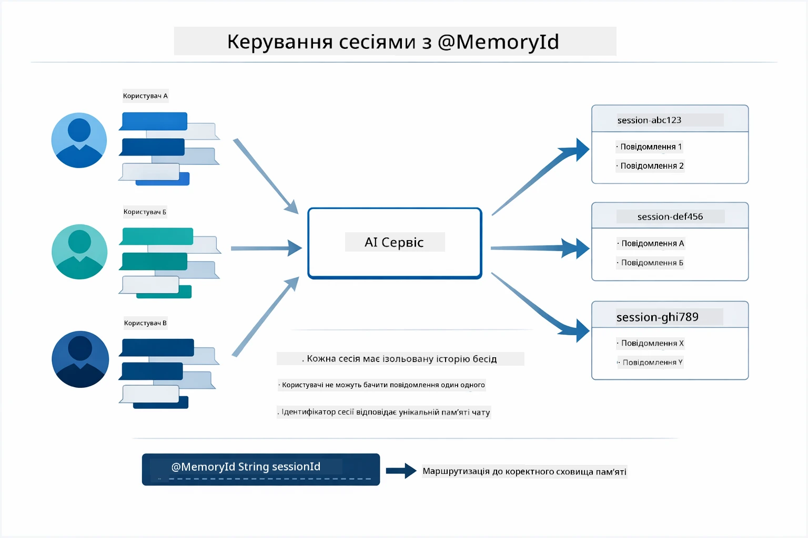

*Кожен ідентифікатор сесії відображається на ізольовану історію розмов — користувачі не бачать повідомлення одне одного.*

### Обробка помилок

Інструменти можуть відмовляти — API тайм-аут, параметри можуть бути неправильними, зовнішні сервіси можуть не працювати. Промислові агенти мають обробку помилок, щоб модель могла пояснити проблему або спробувати альтернативи замість аварійного завершення роботи додатку. Коли інструмент викидає виключення, LangChain4j ловить його і передає повідомлення про помилку назад моделі, яка може пояснити проблему природною мовою.

## Доступні інструменти

Діаграма нижче ілюструє широку екосистему інструментів, які ви можете створювати. Цей модуль демонструє інструменти для погоди та температури, але той самий шаблон `@Tool` працює з будь-яким методом Java — від запитів бази даних до обробки платежів.

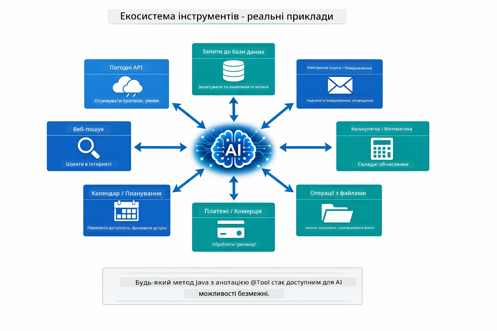

*Будь-який Java-метод з анотацією @Tool стає доступним для ШІ — цей шаблон поширюється на бази даних, API, електронну пошту, обробку файлів та інше.*

## Коли використовувати агенти на основі інструментів

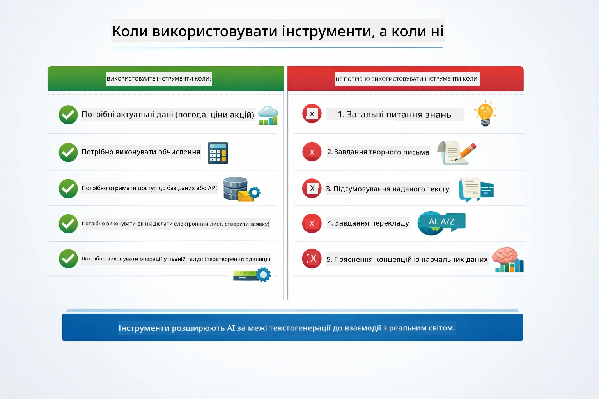

*Швидкий довідник — інструменти для даних у реальному часі, обчислень і дій; загальні знання та творчі задачі не потребують їх.*

**Використовуйте інструменти, коли:**
- Відповідь потребує даних у реальному часі (погода, ціни на акції, запаси)
- Потрібно виконати обчислення складніші за просту математику
- Ви звертаєтеся до баз даних або API
- Виконуєте дії (надсилання листів, створення звернень, оновлення записів)
- Поєднуєте кілька джерел даних

**Не використовуйте інструменти, коли:**
- Запит відповідається загальними знаннями
- Відповідь — це лише розмова
- Затримка інструментів ускладнює взаємодію

## Інструменти проти RAG

Модулі 03 і 04 обидва розширюють можливості ШІ, але абсолютно різними способами. RAG надає моделі доступ до **знань** через пошук документів. Інструменти дають моделі змогу виконувати **дії** через виклики функцій.

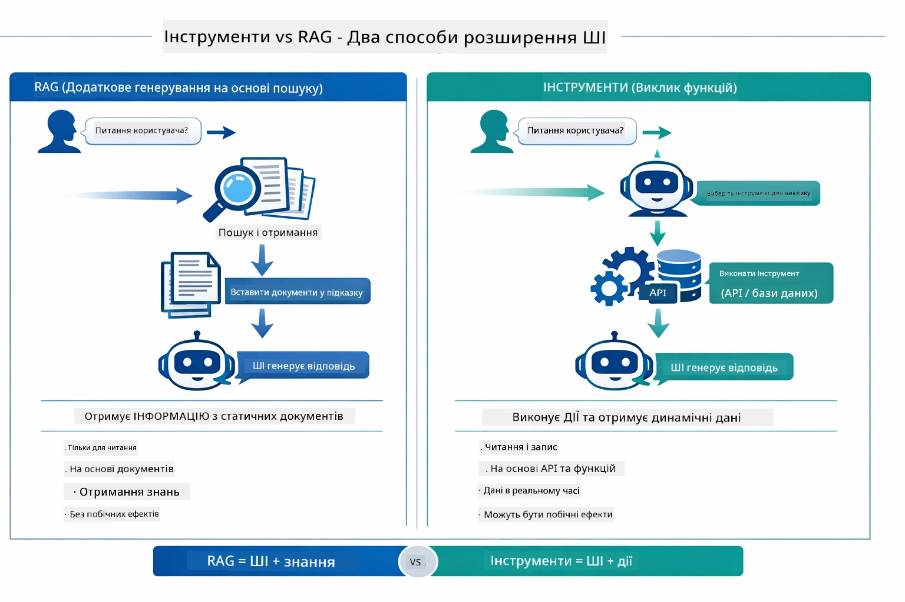

*RAG шукає інформацію у статичних документах — Інструменти виконують дії та отримують динамічні, реальні дані. Багато виробничих систем комбінують обидва підходи.*

На практиці багато виробничих систем поєднують обидва способи: RAG для обґрунтування відповідей у документації, та Інструменти — для отримання живих даних або виконання операцій.

## Наступні кроки

**Наступний модуль:** [05-mcp - Протокол контексту моделі (MCP)](../05-mcp/README.md)

---

**Навігація:** [← Попередній: Модуль 03 - RAG](../03-rag/README.md) | [Назад до головної](../README.md) | [Наступний: Модуль 05 - MCP →](../05-mcp/README.md)

---

<!-- CO-OP TRANSLATOR DISCLAIMER START -->
**Відмова від відповідальності**:
Цей документ було перекладено за допомогою сервісу автоматичного перекладу [Co-op Translator](https://github.com/Azure/co-op-translator). Хоча ми прагнемо до точності, просимо враховувати, що автоматичні переклади можуть містити помилки або неточності. Оригінальний документ рідною мовою слід вважати авторитетним джерелом. Для критично важливої інформації рекомендується звернутися до професійного людського перекладу. Ми не несемо відповідальності за будь-які непорозуміння чи неправильні тлумачення, що виникли внаслідок використання цього перекладу.
<!-- CO-OP TRANSLATOR DISCLAIMER END -->