# Модуль 05: Протокол контексту моделі (MCP)

## Зміст

- [Чому ви навчитеся](../../../05-mcp)
- [Що таке MCP?](../../../05-mcp)
- [Як працює MCP](../../../05-mcp)
- [Агентний модуль](../../../05-mcp)
- [Запуск прикладів](../../../05-mcp)
  - [Вимоги](../../../05-mcp)
- [Швидкий старт](../../../05-mcp)
  - [Операції з файлами (Stdio)](../../../05-mcp)
  - [Супервізорний агент](../../../05-mcp)
    - [Запуск демонстрації](../../../05-mcp)
    - [Як працює супервізор](../../../05-mcp)
    - [Стратегії відповіді](../../../05-mcp)
    - [Роз’яснення функцій агентного модуля](../../../05-mcp)
- [Ключові поняття](../../../05-mcp)
- [Вітаємо!](../../../05-mcp)
  - [Що далі?](../../../05-mcp)

## Чому ви навчитеся

Ви створили розмовний ШІ, опанували підказки, засновували відповіді на документах і створили агентів з інструментами. Але всі ці інструменти були створені спеціально для вашого конкретного застосування. А що якби ви могли надати вашому ШІ доступ до стандартизованої екосистеми інструментів, які будь-хто може створювати й поширювати? У цьому модулі ви навчитеся саме цьому за допомогою Протоколу контексту моделі (MCP) і агентного модуля LangChain4j. Спочатку ми демонструємо простий MCP рідер файлів, а потім показуємо, як його легко інтегрувати в розширені агентні робочі процеси через патерн Супервізорного агента.

## Що таке MCP?

Протокол контексту моделі (MCP) саме це і забезпечує — стандартний спосіб для ШІ-застосунків знаходити та використовувати зовнішні інструменти. Замість того, щоб писати індивідуальні інтеграції для кожного джерела даних чи сервісу, ви підключаєтесь до MCP серверів, які відкривають свої можливості в уніфікованому форматі. Ваш агент ШІ може тоді автоматично знаходити й використовувати ці інструменти.

Діаграма нижче ілюструє різницю — без MCP кожна інтеграція потребує індивідуального підключення; з MCP однаковий протокол з’єднує ваш застосунок з будь-яким інструментом:


*До MCP: складні індивідуальні підключення. Після MCP: один протокол, безмежні можливості.*

MCP розв’язує фундаментальну проблему в розробці ШІ: кожна інтеграція є унікальною. Хочете отримати доступ до GitHub? Індивідуальний код. Хочете читати файли? Індивідуальний код. Хочете робити запити до бази даних? Індивідуальний код. І жодна з цих інтеграцій не працює з іншими застосунками ШІ.

MCP стандартизує це. MCP сервер відкриває інструменти з чіткими описами й схемами параметрів. Будь-який MCP клієнт може підключатися, знаходити доступні інструменти і використовувати їх. Побудуй один раз — використовуй скрізь.

Діаграма нижче ілюструє цю архітектуру — один MCP клієнт (ваш ШІ-застосунок) підключається до кількох MCP серверів, кожен з яких відкриває свій набір інструментів через стандартний протокол:


*Архітектура Протоколу контексту моделі — стандартизоване виявлення та виконання інструментів*

## Як працює MCP

Під капотом MCP використовує багаторівневу архітектуру. Ваш Java застосунок (MCP клієнт) знаходить доступні інструменти, відправляє JSON-RPC запити через транспортний шар (Stdio або HTTP), а MCP сервер виконує операції і повертає результати. Наступна діаграма деталізує кожен рівень протоколу:

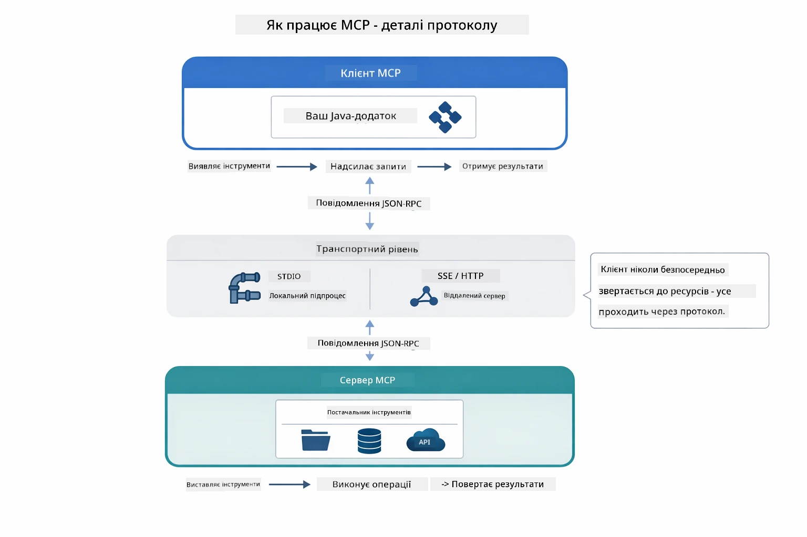

*Як MCP працює під капотом — клієнти знаходять інструменти, обмінюються JSON-RPC повідомленнями і виконують операції через транспортний шар.*

**Архітектура Сервер-Клієнт**

MCP працює за моделлю клієнт-сервер. Сервери надають інструменти — читання файлів, запити до баз даних, виклики API. Клієнти (ваш ШІ-застосунок) підключаються до серверів і використовують їхні інструменти.

Для використання MCP з LangChain4j додайте таку залежність Maven:

```xml
<dependency>
    <groupId>dev.langchain4j</groupId>
    <artifactId>langchain4j-mcp</artifactId>
    <version>${langchain4j.version}</version>
</dependency>
```

**Виявлення Інструментів**

Коли ваш клієнт підключається до MCP сервера, він запитує: "Які у вас інструменти?" Сервер відповідає списком доступних інструментів із описами та схемами параметрів. Ваш агент ШІ може потім вирішити, які інструменти використовувати, спираючись на запити користувача. Діаграма нижче ілюструє цей обмін — клієнт відправляє запит `tools/list`, і сервер повертає свої доступні інструменти з описами і схемами:

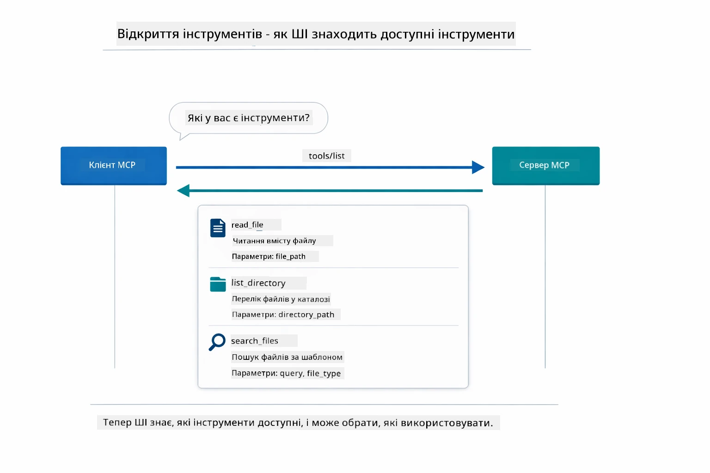

*ШІ знаходить доступні інструменти при запуску — тепер воно знає, які можливості доступні, і може вирішувати, які використовувати.*

**Транспортні механізми**

MCP підтримує різні транспорти. Два варіанти — Stdio (для локальної комунікації з підпроцесами) і Streamable HTTP (для віддалених серверів). У цьому модулі демонструється транспорт Stdio:


*Транспортні механізми MCP: HTTP для віддалених серверів, Stdio для локальних процесів*

**Stdio** - [StdioTransportDemo.java](../../../05-mcp/src/main/java/com/example/langchain4j/mcp/StdioTransportDemo.java)

Для локальних процесів. Ваш застосунок запускає сервер як підпроцес і спілкується через стандартний ввід/вивід. Корисно для доступу до файлової системи або командних інструментів.

```java
McpTransport stdioTransport = new StdioMcpTransport.Builder()
    .command(List.of(
        npmCmd, "exec",
        "@modelcontextprotocol/server-filesystem@2025.12.18",
        resourcesDir
    ))
    .logEvents(false)
    .build();
```

Сервер `@modelcontextprotocol/server-filesystem` відкриває такі інструменти, всі ізольовані у зазначених вами директоріях:

| Інструмент | Опис |
|------------|-------|
| `read_file` | Читання вмісту одного файлу |
| `read_multiple_files` | Читання кількох файлів за один виклик |
| `write_file` | Створення або перезапис файлу |
| `edit_file` | Цілеспрямоване пошук і заміна |
| `list_directory` | Перелік файлів і директорій за шляхом |
| `search_files` | Рекурсивний пошук файлів за шаблоном |
| `get_file_info` | Отримання метаданих файлу (розмір, часові позначки, права) |
| `create_directory` | Створення директорії (включно з батьківськими директоріями) |
| `move_file` | Переміщення або перейменування файлу чи директорії |

Наступна діаграма показує, як транспорт Stdio працює під час виконання — ваш Java застосунок запускає MCP сервер як дочірній процес і вони спілкуються через stdin/stdout канали, без мережі або HTTP:

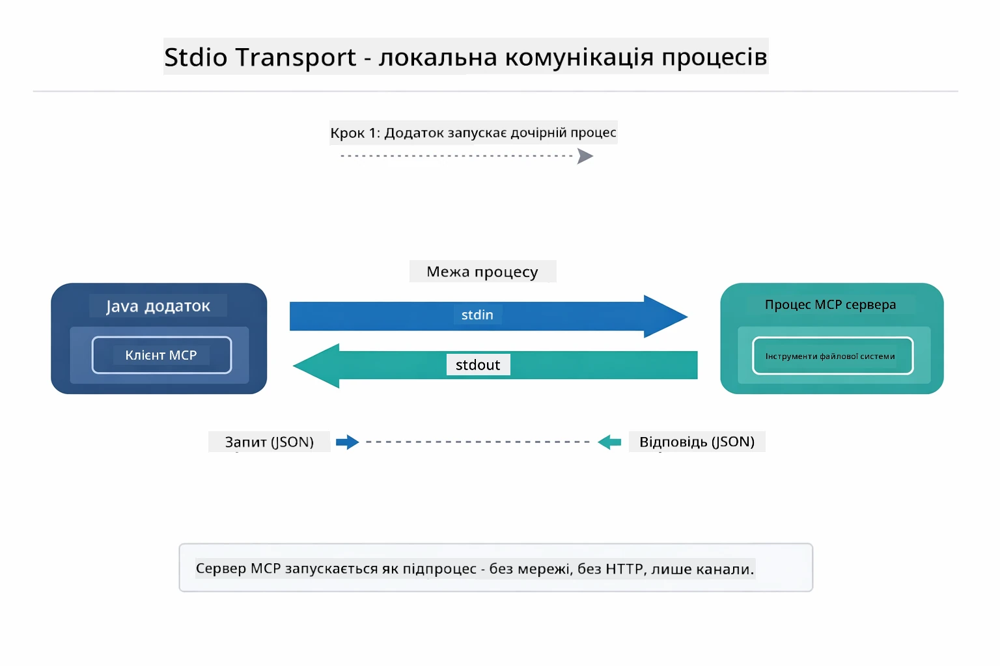

*Транспорт Stdio в дії — ваш застосунок запускає сервер MCP як дочірній процес і спілкується через stdin/stdout канали.*

> **🤖 Спробуйте з [GitHub Copilot](https://github.com/features/copilot) Chat:** Відкрийте [`StdioTransportDemo.java`](../../../05-mcp/src/main/java/com/example/langchain4j/mcp/StdioTransportDemo.java) і запитайте:
> - "Як працює транспорт Stdio і коли варто використовувати його замість HTTP?"
> - "Як LangChain4j управляє життєвим циклом запущених MCP серверних процесів?"
> - "Які наслідки безпеки від надання ШІ доступу до файлової системи?"

## Агентний модуль

Хоча MCP забезпечує стандартизовані інструменти, агентний модуль LangChain4j надає декларативний спосіб створення агентів, які оркестрируют ці інструменти. Анотація `@Agent` і `AgenticServices` дозволяють визначати поведінку агента через інтерфейси, а не імперативний код.

У цьому модулі ви дослідите патерн **Супервізорного агента** — розширений агентний підхід ШІ, де агент-супервізор динамічно вирішує, яких суб-агентів викликати на основі запитів користувача. Ми поєднаємо ці концепції, надаючи одному з наших суб-агентів можливості доступу до файлів з MCP.

Для використання агентного модуля додайте цю залежність Maven:

```xml
<dependency>
    <groupId>dev.langchain4j</groupId>
    <artifactId>langchain4j-agentic</artifactId>
    <version>${langchain4j.mcp.version}</version>
</dependency>
```
> **Примітка:** Модуль `langchain4j-agentic` використовує окрему версію (`langchain4j.mcp.version`), бо випускається за іншим графіком, ніж основні бібліотеки LangChain4j.

> **⚠️ Експериментально:** Модуль `langchain4j-agentic` є **експериментальним** і може змінюватися. Стабільним способом побудови ШІ асистентів залишаються `langchain4j-core` з власними інструментами (Модуль 04).

## Запуск прикладів

### Вимоги

- Завершений [Модуль 04 - Інструменти](../04-tools/README.md) (цей модуль базується на концепціях власних інструментів і порівнює їх з MCP інструментами)
- Файл `.env` у кореневій директорії з обліковими даними Azure (створений командою `azd up` в Модулі 01)
- Java 21+, Maven 3.9+
- Node.js 16+ та npm (для MCP серверів)

> **Примітка:** Якщо ви ще не налаштували змінні середовища, див. [Модуль 01 - Вступ](../01-introduction/README.md) для інструкцій з розгортання (команда `azd up` автоматично створює файл `.env`) або скопіюйте `.env.example` у `.env` в корені і заповніть значення.

## Швидкий старт

**Використання VS Code:** Просто клацніть правою кнопкою миші будь-який демонстраційний файл в Провіднику і оберіть **"Run Java"**, або скористайтеся конфігураціями запуску в панелі Run and Debug (переконайтеся, що файл `.env` налаштований з обліковими даними Azure).

**Використання Maven:** Альтернативно, ви можете запускати з командного рядка за допомогою наведених нижче прикладів.

### Операції з файлами (Stdio)

Це демонструє інструменти на основі локальних підпроцесів.

**✅ Немає необхідності в додаткових налаштуваннях** — MCP сервер запускається автоматично.

**Використання стартових скриптів (рекомендовано):**

Стартові скрипти автоматично завантажують змінні середовища з кореневого файлу `.env`:

**Bash:**
```bash
cd 05-mcp
chmod +x start-stdio.sh
./start-stdio.sh
```

**PowerShell:**
```powershell
cd 05-mcp
.\start-stdio.ps1
```

**Використання VS Code:** Клацніть правою кнопкою на `StdioTransportDemo.java` і виберіть **"Run Java"** (переконайтеся, що файл `.env` налаштований).

Застосунок автоматично запускає MCP сервер файлової системи і читає локальний файл. Зверніть увагу, як автоматично керується підпроцесом.

**Очікуваний вивід:**
```
Assistant response: The file provides an overview of LangChain4j, an open-source Java library
for integrating Large Language Models (LLMs) into Java applications...
```

### Супервізорний агент

Патерн **Супервізорного агента** — це **гнучка** форма агентного ШІ. Супервізор використовує LLM для автономного прийняття рішення, яких агентів викликати відповідно до запиту користувача. У наступному прикладі ми об’єднуємо MCP-забезпечений доступ до файлів із LLM агентом для створення послідовності читання файлу → генерації звіту під керівництвом.

У демонстрації `FileAgent` читає файл за допомогою MCP інструментів файлової системи, а `ReportAgent` генерує структурований звіт із виконавчим резюме (1 речення), 3 ключовими пунктами та рекомендаціями. Супервізор автоматично організовує цей потік:

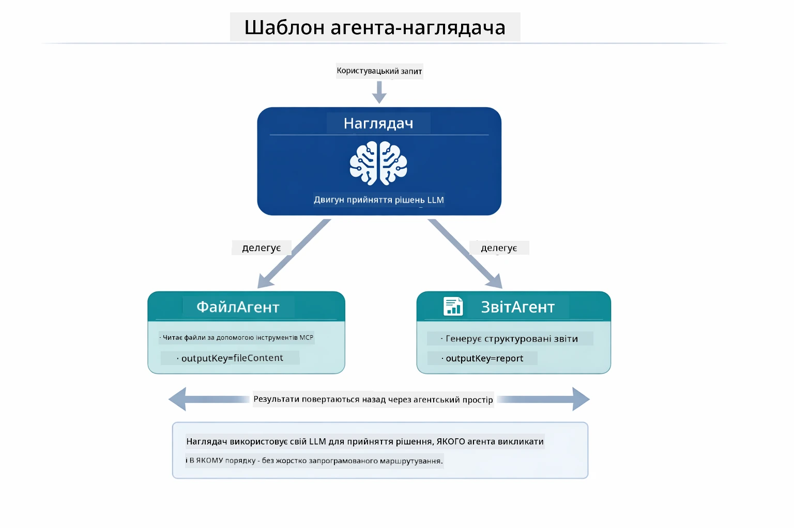

*Супервізор використовує свій LLM, щоб вирішити, яких агентів і в якому порядку викликати — жодного жорстко заданого маршруту.*

Ось як виглядає конкретний робочий потік для нашого конвеєру від файлу до звіту:

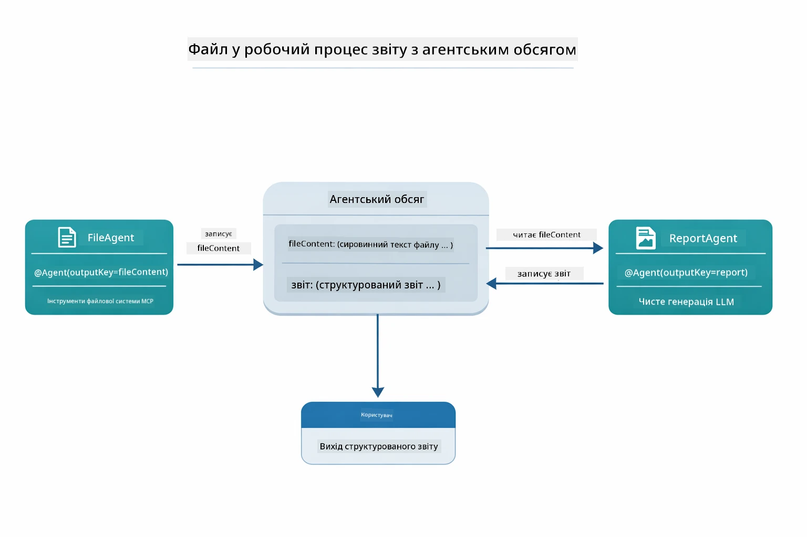

*FileAgent читає файл через не MCP інструменти, потім ReportAgent перетворює сирий контент у структурований звіт.*

Кожен агент зберігає свій вивід у **Agentic Scope** (спільній пам’яті), що дає змогу послідовним агентам отримувати доступ до попередніх результатів. Це демонструє, як MCP інструменти органічно інтегруються в агентні робочі процеси — Супервізору не потрібно знати *як* читають файли, лише що `FileAgent` це може.

#### Запуск демонстрації

Стартові скрипти автоматично завантажують змінні середовища з кореневого `.env` файлу:

**Bash:**
```bash
cd 05-mcp
chmod +x start-supervisor.sh
./start-supervisor.sh
```

**PowerShell:**
```powershell
cd 05-mcp
.\start-supervisor.ps1
```

**Використання VS Code:** Клацніть правою кнопкою на `SupervisorAgentDemo.java` і виберіть **"Run Java"** (переконайтеся, що файл `.env` налаштований).

#### Як працює супервізор

Перед створенням агентів ви повинні підключити MCP транспорт до клієнта і обгорнути його як `ToolProvider`. Так MCP серверні інструменти стають доступні вашим агентам:

```java
// Створити клієнта MCP з транспорту
McpClient mcpClient = new DefaultMcpClient.Builder()
        .transport(stdioTransport)
        .build();

// Обгорнути клієнта як ToolProvider — це з'єднує інструменти MCP з LangChain4j
ToolProvider mcpToolProvider = McpToolProvider.builder()
        .mcpClients(List.of(mcpClient))
        .build();
```

Тепер ви можете ввести `mcpToolProvider` в будь-який агент, який потребує MCP інструментів:

```java
// Крок 1: FileAgent читає файли за допомогою інструментів MCP
FileAgent fileAgent = AgenticServices.agentBuilder(FileAgent.class)
        .chatModel(model)
        .toolProvider(mcpToolProvider)  // Містить інструменти MCP для роботи з файлами
        .build();

// Крок 2: ReportAgent генерує структуровані звіти
ReportAgent reportAgent = AgenticServices.agentBuilder(ReportAgent.class)
        .chatModel(model)
        .build();

// Supervisor координує робочий процес файл → звіт
SupervisorAgent supervisor = AgenticServices.supervisorBuilder()
        .chatModel(model)
        .subAgents(fileAgent, reportAgent)
        .responseStrategy(SupervisorResponseStrategy.LAST)  // Повернути кінцевий звіт
        .build();

// Supervisor вирішує, які агенти викликати на основі запиту
String response = supervisor.invoke("Read the file at /path/file.txt and generate a report");
```

#### Стратегії відповіді

Коли ви налаштовуєте `SupervisorAgent`, ви визначаєте, як він повинен формулювати остаточну відповідь користувачу після завершення роботи суб-агентів. Діаграма нижче показує три доступні стратегії — LAST повертає прямо результат останнього агента, SUMMARY синтезує всі відповіді через LLM, а SCORED вибирає той варіант, що отримав кращий бал згідно з початковим запитом:

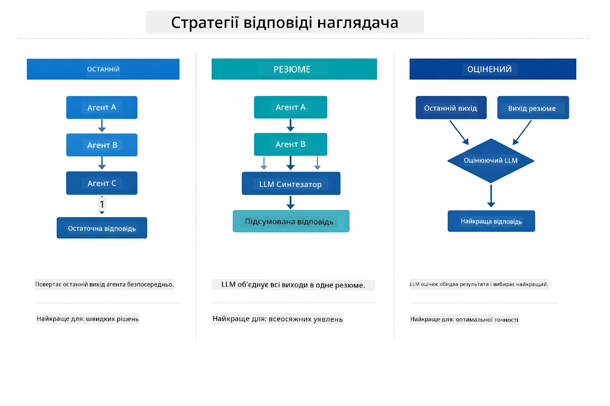

*Три стратегії того, як Супервізор формує остаточну відповідь — обирайте в залежності від того, чи хочете вивід останнього агента, синтезоване резюме чи варіант із найвищим балом.*

Доступні стратегії:

| Стратегія | Опис |
|-----------|-------|
| **LAST** | Супервізор повертає результат останнього викликаного суб-агента або інструменту. Корисно, коли останній агент робить повну, остаточну відповідь (наприклад, "Агент-резюме" у дослідницькому конвеєрі). |
| **SUMMARY** | Супервізор використовує власний внутрішній мовний модуль (LLM) для створення узагальненого резюме всієї взаємодії та виходів суб-агентів, яке повертається як кінцева відповідь. Це дає чисту, агреговану відповідь користувачу. |
| **SCORED** | Система використовує внутрішній LLM для оцінки як останньої відповіді, так і резюме на основі початкового запиту користувача, повертаючи той варіант, що отримав вищий бал. |
Дивіться повну реалізацію у файлі [SupervisorAgentDemo.java](../../../05-mcp/src/main/java/com/example/langchain4j/mcp/SupervisorAgentDemo.java).

> **🤖 Спробуйте з [GitHub Copilot](https://github.com/features/copilot) Chat:** Відкрийте [`SupervisorAgentDemo.java`](../../../05-mcp/src/main/java/com/example/langchain4j/mcp/SupervisorAgentDemo.java) і запитайте:
> - "Як Supervisor вирішує, які агенти викликати?"
> - "У чому різниця між патернами Supervisor і Sequential workflow?"
> - "Як я можу налаштувати поведінку планування Supervisor?"

#### Розуміння результатів

Коли ви запускаєте демо, ви побачите структурований огляд того, як Supervisor оркеструє роботу кількох агентів. Що означає кожен розділ:

```
======================================================================
  FILE → REPORT WORKFLOW DEMO
======================================================================

This demo shows a clear 2-step workflow: read a file, then generate a report.
The Supervisor orchestrates the agents automatically based on the request.
```

**Заголовок** знайомить із концепцією робочого процесу: цільовий конвеєр від читання файлу до створення звіту.

```
--- WORKFLOW ---------------------------------------------------------
  ┌─────────────┐      ┌──────────────┐
  │  FileAgent  │ ───▶ │ ReportAgent  │
  │ (MCP tools) │      │  (pure LLM)  │
  └─────────────┘      └──────────────┘
   outputKey:           outputKey:
   'fileContent'        'report'

--- AVAILABLE AGENTS -------------------------------------------------
  [FILE]   FileAgent   - Reads files via MCP → stores in 'fileContent'
  [REPORT] ReportAgent - Generates structured report → stores in 'report'
```

**Діаграма робочого процесу** показує потоки даних між агентами. Кожен агент має конкретну роль:
- **FileAgent** читає файли за допомогою MCP інструментів і зберігає необроблений вміст у `fileContent`
- **ReportAgent** споживає цей вміст і створює структурований звіт у `report`

```
--- USER REQUEST -----------------------------------------------------
  "Read the file at .../file.txt and generate a report on its contents"
```

**Запит користувача** показує завдання. Supervisor його парсить і вирішує викликати FileAgent → ReportAgent.

```
--- SUPERVISOR ORCHESTRATION -----------------------------------------
  The Supervisor decides which agents to invoke and passes data between them...

  +-- STEP 1: Supervisor chose -> FileAgent (reading file via MCP)
  |
  |   Input: .../file.txt
  |
  |   Result: LangChain4j is an open-source, provider-agnostic Java framework for building LLM...
  +-- [OK] FileAgent (reading file via MCP) completed

  +-- STEP 2: Supervisor chose -> ReportAgent (generating structured report)
  |
  |   Input: LangChain4j is an open-source, provider-agnostic Java framew...
  |
  |   Result: Executive Summary...
  +-- [OK] ReportAgent (generating structured report) completed
```

**Оркестрація Supervisor** демонструє 2-кроковий потік у дії:
1. **FileAgent** читає файл через MCP і зберігає вміст
2. **ReportAgent** отримує цей вміст і генерує структурований звіт

Ці рішення Supervisor прийняв **автономно** на підставі запиту користувача.

```
--- FINAL RESPONSE ---------------------------------------------------
Executive Summary
...

Key Points
...

Recommendations
...

--- AGENTIC SCOPE (Data Flow) ----------------------------------------
  Each agent stores its output for downstream agents to consume:
  * fileContent: LangChain4j is an open-source, provider-agnostic Java framework...
  * report: Executive Summary...
```

#### Пояснення функцій агентного модуля

Приклад демонструє кілька розширених можливостей агентного модуля. Розглянемо докладніше Agentic Scope і Agent Listeners.

**Agentic Scope** показує спільну пам’ять, де агенти зберігали свої результати за допомогою `@Agent(outputKey="...")`. Це дозволяє:
- Наступним агентам отримувати вихідні дані попередніх
- Supervisor синтезувати підсумкову відповідь
- Вам переглядати, що саме створив кожен агент

Нижче на діаграмі показано, як Agentic Scope працює як спільна пам’ять у робочому процесі від файлу до звіту — FileAgent пише результат під ключем `fileContent`, ReportAgent читає це й записує власний результат під `report`:

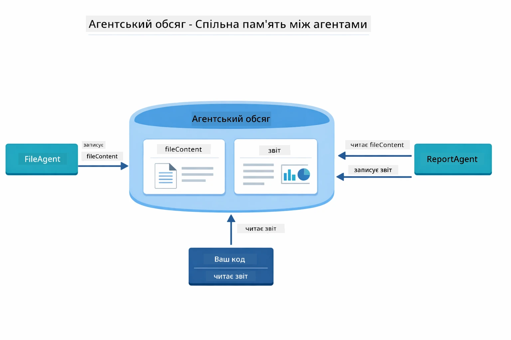

*Agentic Scope діє як спільна пам’ять — FileAgent записує `fileContent`, ReportAgent читає її та записує `report`, а ваш код читає остаточний результат.*

```java
ResultWithAgenticScope<String> result = supervisor.invokeWithAgenticScope(request);
AgenticScope scope = result.agenticScope();
String fileContent = scope.readState("fileContent");  // Сирі дані файлу від FileAgent
String report = scope.readState("report");            // Структурований звіт від ReportAgent
```

**Agent Listeners** дають змогу відстежувати й налагоджувати виконання агентів. Крок за кроком вивід, який ви бачите в демо, надходить від AgentListener, що підключений до кожного виклику агента:
- **beforeAgentInvocation** – викликається, коли Supervisor вибирає агента, даючи змогу побачити, який агент обраний і чому
- **afterAgentInvocation** – викликається, коли агент завершує роботу, показуючи його результат
- **inheritedBySubagents** – якщо true, слухач відстежує всіх агентів у ієрархії

Наступна діаграма показує повний життєвий цикл Agent Listener, включно з обробкою `onError` у разі збоїв під час виконання агента:

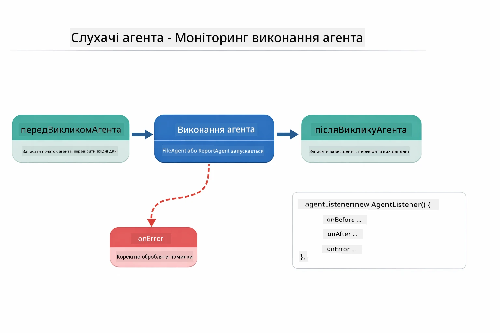

*Agent Listeners підключені до життєвого циклу виконання — відстежують початок роботи агентів, їх завершення або помилки.*

```java
AgentListener monitor = new AgentListener() {
    private int step = 0;
    
    @Override
    public void beforeAgentInvocation(AgentRequest request) {
        step++;
        System.out.println("  +-- STEP " + step + ": " + request.agentName());
    }
    
    @Override
    public void afterAgentInvocation(AgentResponse response) {
        System.out.println("  +-- [OK] " + response.agentName() + " completed");
    }
    
    @Override
    public boolean inheritedBySubagents() {
        return true; // Поширити на всі субагенти
    }
};
```

Окрім патерну Supervisor, модуль `langchain4j-agentic` пропонує кілька потужних шаблонів робочих процесів. Нижче діаграма з усіма п’ятьма — від простих послідовних конвеєрів до робочих процесів з підтвердженнями людиною:

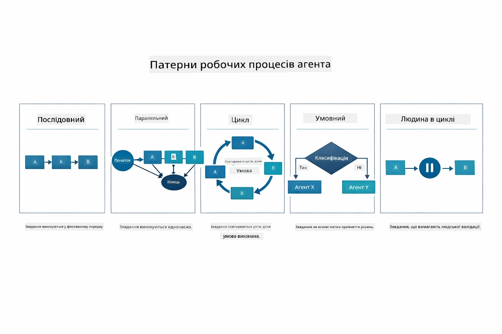

*П’ять патернів робочого процесу для оркестрації агентів — від простих послідовних конвеєрів до робочих процесів з участю людини.*

| Патерн | Опис | Випадок використання |
|---------|-------------|----------|
| **Sequential** | Виконання агентів послідовно, вихід передається наступному | Конвеєри: дослідження → аналіз → звіт |
| **Parallel** | Запуск агентів паралельно | Незалежні завдання: погода + новини + акції |
| **Loop** | Ітерації до виконання умови | Оцінка якості: уточнення до досягнення оцінки ≥ 0.8 |
| **Conditional** | Маршрутизація за умовами | Класифікація → направлення до спеціаліста |
| **Human-in-the-Loop** | Додавання людських перевірок | Робочі процеси з погодженням, огляд контенту |

## Ключові поняття

Після знайомства з MCP і агентним модулем на практиці підсумуємо, коли слід використовувати кожен підхід.

Однією з головних переваг MCP є зростаюча екосистема. Нижче діаграма показує, як універсальний протокол з’єднує ваш AI-застосунок з різними MCP серверами — від файлової системи та баз даних до GitHub, електронної пошти, веб-скрапінгу тощо:

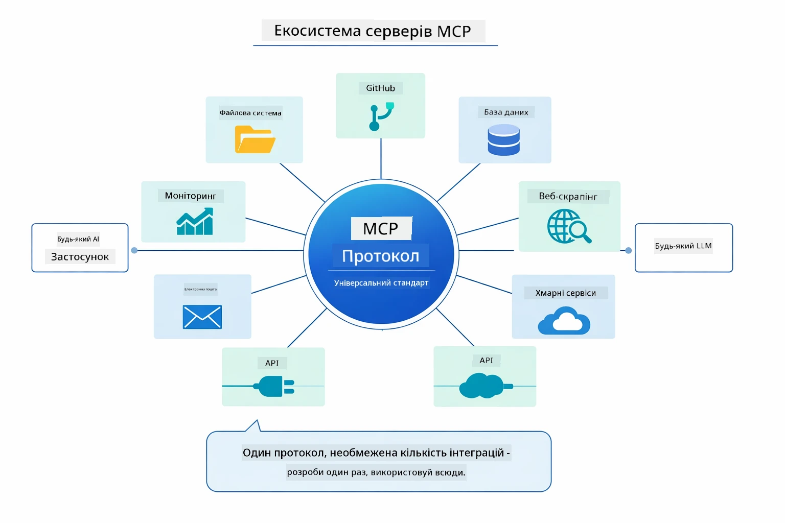

*MCP створює екосистему універсального протоколу — будь-який сумісний MCP сервер працює з будь-яким сумісним клієнтом, забезпечуючи спільне використання інструментів між застосунками.*

**MCP** ідеальний, якщо ви хочете використовувати існуючі екосистеми інструментів, створювати інструменти, якими можуть користуватися кілька застосунків, інтегрувати сторонні сервіси через стандартні протоколи або міняти реалізації інструментів без зміни коду.

**Агентний модуль** найкраще працює, коли потрібні декларативні визначення агентів за допомогою анотацій `@Agent`, потрібна оркестрація робочих процесів (послідовна, циклічна, паралельна), ви надаєте перевагу дизайну агентів через інтерфейси замість імперативного коду або поєднуєте кілька агентів, які діляться результатами через `outputKey`.

**Патерн Supervisor Agent** виблискує, коли робочий процес невизначений наперед і ви хочете, щоб рішення приймала LLM, коли у вас є кілька спеціалізованих агентів, яких потрібно динамічно оркеструвати, під час створення розмовних систем із маршрутизацією до різних можливостей або коли потрібна найбільш гнучка, адаптивна поведінка агента.

Щоб допомогти вам вибрати між власними методами `@Tool` з Модуля 04 і MCP інструментами з цього модуля, нижче наведено порівняння ключових компромісів — власні інструменти дають тісне зв’язування і повну типобезпечність для логіки застосунку, тоді як MCP інструменти пропонують стандартизовані, багаторазові інтеграції:

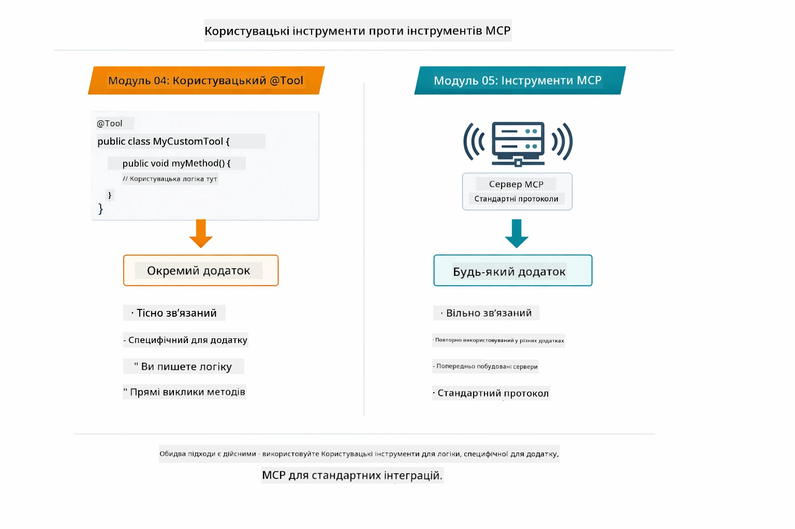

*Коли використовувати власні методи @Tool проти MCP інструментів — власні інструменти для логіки застосунку з повною типобезпечністю, MCP інструменти для стандартизованих інтеграцій між застосунками.*

## Вітаємо!

Ви пройшли всі п’ять модулів курсу LangChain4j для початківців! Ось погляд на повний навчальний шлях, який ви завершили — від базового чату до агентних систем на базі MCP:

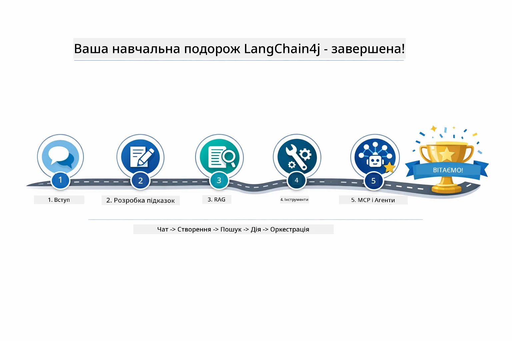

*Ваш навчальний шлях через усі п’ять модулів — від базового чату до агентних систем на базі MCP.*

Ви закінчили курс LangChain4j для початківців. Ви навчилися:

- Створювати розмовний ШІ з пам’яттю (Модуль 01)
- Шаблонам проектування підказок для різних завдань (Модуль 02)
- Закріплювати відповіді у ваших документах за допомогою RAG (Модуль 03)
- Створювати базових AI агентів (асистентів) з власними інструментами (Модуль 04)
- Інтегрувати стандартизовані інструменти через LangChain4j MCP і агентний модуль (Модуль 05)

### Що далі?

Після завершення модулів ознайомтеся з [Посібником з тестування](../docs/TESTING.md), щоб побачити концепції тестування LangChain4j у дії.

**Офіційні ресурси:**
- [Документація LangChain4j](https://docs.langchain4j.dev/) – повні посібники та API-довідник
- [LangChain4j на GitHub](https://github.com/langchain4j/langchain4j) – вихідний код і приклади
- [Навчальні курси LangChain4j](https://docs.langchain4j.dev/tutorials/) – покрокові уроки для різних випадків використання

Дякуємо за проходження курсу!

---

**Навігація:** [← Попередній: Модуль 04 - Інструменти](../04-tools/README.md) | [Назад до головної](../README.md)

---

<!-- CO-OP TRANSLATOR DISCLAIMER START -->
**Відмова від відповідальності**:  
Цей документ був перекладений за допомогою сервісу автоматичного перекладу [Co-op Translator](https://github.com/Azure/co-op-translator). Хоча ми прагнемо до точності, зверніть увагу, що автоматичні переклади можуть містити помилки чи неточності. Оригінальний документ рідною мовою слід вважати авторитетним джерелом. Для критично важливої інформації рекомендується звертатися до професійного людського перекладу. Ми не несемо відповідальності за будь-які непорозуміння чи неправильні тлумачення, що виникли внаслідок використання цього перекладу.
<!-- CO-OP TRANSLATOR DISCLAIMER END -->