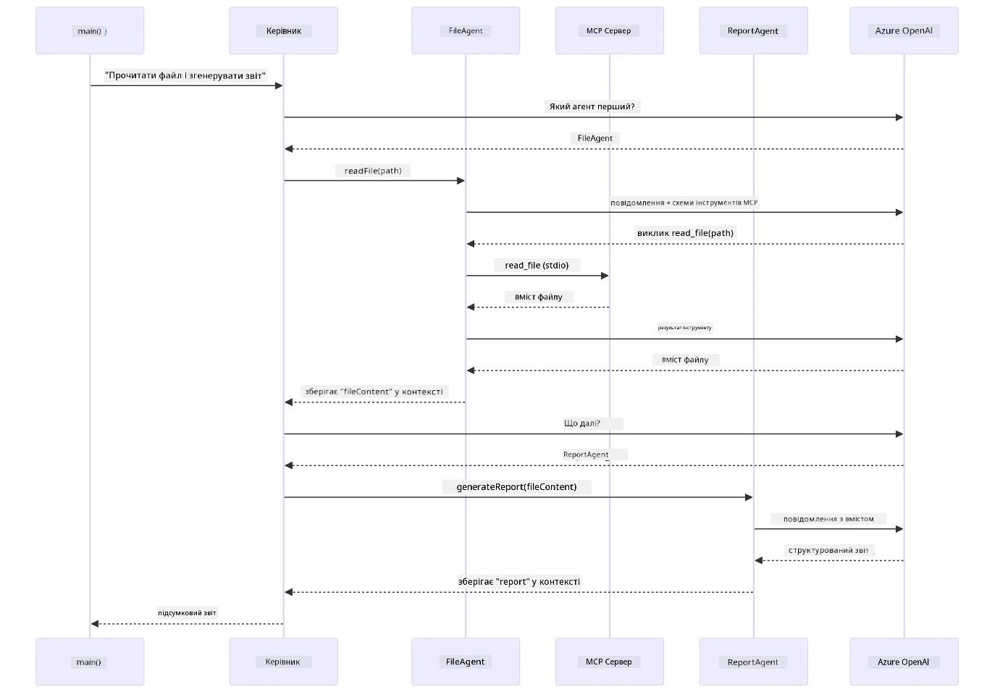

# Модуль 05: Протокол Контексту Моделі (MCP)

## Зміст

- [Відеоогляд](../../../05-mcp)
- [Чого ви навчитеся](../../../05-mcp)
- [Що таке MCP?](../../../05-mcp)
- [Як працює MCP](../../../05-mcp)
- [Агентний модуль](../../../05-mcp)
- [Запуск прикладів](../../../05-mcp)
  - [Вимоги](../../../05-mcp)
- [Швидкий старт](../../../05-mcp)
  - [Операції з файлами (Stdio)](../../../05-mcp)
  - [Супервізорний агент](../../../05-mcp)
    - [Запуск демонстрації](../../../05-mcp)
    - [Як працює супервізор](../../../05-mcp)
    - [Як FileAgent виявляє MCP-інструменти під час запуску](../../../05-mcp)
    - [Стратегії відповіді](../../../05-mcp)
    - [Розуміння результатів](../../../05-mcp)
    - [Пояснення функцій агентного модуля](../../../05-mcp)
- [Ключові поняття](../../../05-mcp)
- [Вітаємо!](../../../05-mcp)
  - [Що далі?](../../../05-mcp)

## Відеоогляд

Перегляньте це живе заняття, яке пояснює, як почати роботу з цим модулем:

<a href="https://www.youtube.com/watch?v=O_J30kZc0rw"></a>

## Чого ви навчитеся

Ви створили розмовні AI, опанували промпти, відобразили відповіді на документи і створили агентів із інструментами. Але всі ці інструменти були спеціально створені для вашого конкретного застосування. А що якщо ви могли б надати вашому AI доступ до стандартизованої екосистеми інструментів, які кожен може створювати і ділитися? У цьому модулі ви навчитеся саме цьому за допомогою Протоколу Контексту Моделі (MCP) і агентного модуля LangChain4j. Спершу ми демонструємо простий MCP-зчитувач файлів, а потім показуємо, як він легко інтегрується у просунуті агентні робочі процеси, використовуючи патерн Супервізорного Агента.

## Що таке MCP?

Протокол Контексту Моделі (MCP) саме це і забезпечує — стандартний спосіб для AI-застосунків знаходити і використовувати зовнішні інструменти. Замість написання спеціальних інтеграцій для кожного джерела даних або сервісу, ви підключаєтесь до MCP-серверів, які надають свої можливості у послідовному форматі. Ваш AI-агент може автоматично знаходити та використовувати ці інструменти.

Діаграма нижче показує різницю — без MCP кожна інтеграція потребує індивідуальних точкових зʼєднань; з MCP один протокол зʼєднує ваш застосунок з будь-яким інструментом:


*До MCP: складні точкові інтеграції. Після MCP: один протокол, безмежні можливості.*

MCP вирішує фундаментальну проблему у розробці AI: кожна інтеграція — це індивідуальна. Хочете отримати доступ до GitHub? Спеціальний код. Хочете читати файли? Спеціальний код. Хочете робити запити до бази даних? Спеціальний код. І жодна з цих інтеграцій не працює з іншими AI-застосунками.

MCP стандартизує це. MCP-сервер надає інструменти із чіткими описами та схемами. Будь-який MCP-клієнт може підключитися, виявити доступні інструменти і використати їх. Побудували один раз — використовуйте всюди.

Діаграма нижче ілюструє цю архітектуру — один MCP-клієнт (ваш AI-застосунок) підключається до кількох MCP-серверів, кожен із яких відкриває свій набір інструментів через стандартний протокол:


*Архітектура Протоколу Контексту Моделі — стандартизоване виявлення і виконання інструментів*

## Як працює MCP

Під капотом MCP використовує шарувату архітектуру. Ваш Java-застосунок (MCP-клієнт) виявляє доступні інструменти, надсилає JSON-RPC запити через транспортний рівень (Stdio або HTTP), а MCP-сервер виконує операції і повертає результати. Нижче наведена діаграма, що розбиває кожен шар цього протоколу:


*Як MCP працює під капотом — клієнти знаходять інструменти, обмінюються JSON-RPC повідомленнями і виконують операції через транспортний рівень.*

**Архітектура клієнт-сервер**

MCP використовує модель клієнт-сервер. Сервери надають інструменти — читання файлів, запити до баз даних, виклики API. Клієнти (ваш AI-застосунок) підключаються до серверів і користуються їхніми інструментами.

Щоб використовувати MCP з LangChain4j, додайте цю залежність Maven:

```xml
<dependency>
    <groupId>dev.langchain4j</groupId>
    <artifactId>langchain4j-mcp</artifactId>
    <version>${langchain4j.version}</version>
</dependency>
```

**Виявлення Інструментів**

Коли ваш клієнт підключається до MCP-сервера, він запитує "Які у вас інструменти?" Сервер відповідає списком доступних інструментів, кожен із описом і схемою параметрів. Ваш AI-агент може потім вирішити, які інструменти використовувати на основі запитів користувача. Діаграма нижче показує це рукостискання — клієнт надсилає запит `tools/list` і сервер повертає свої доступні інструменти з описом і схемою параметрів:


*AI виявляє доступні інструменти під час запуску — тепер він знає, які можливості доступні і може вирішити, які використовувати.*

**Транспортні механізми**

MCP підтримує різні транспортні механізми. Два варіанти — Stdio (для локальної взаємодії з підпроцесами) і Streamable HTTP (для віддалених серверів). Цей модуль демонструє транспорт Stdio:


*Транспортні механізми MCP: HTTP для віддалених серверів, Stdio для локальних процесів*

**Stdio** - [StdioTransportDemo.java](../../../05-mcp/src/main/java/com/example/langchain4j/mcp/StdioTransportDemo.java)

Для локальних процесів. Ваш застосунок запускає сервер як підпроцес і спілкується через стандартний ввід/вивід. Корисно для доступу до файлової системи або командних інструментів.

```java
McpTransport stdioTransport = new StdioMcpTransport.Builder()
    .command(List.of(
        npmCmd, "exec",
        "@modelcontextprotocol/server-filesystem@2025.12.18",
        resourcesDir
    ))
    .logEvents(false)
    .build();
```

Сервер `@modelcontextprotocol/server-filesystem` надає такі інструменти, всі обмежені директоріями, які ви вказуєте:

| Інструмент | Опис |
|------------|-------|
| `read_file` | Зчитати вміст одного файлу |
| `read_multiple_files` | Зчитати кілька файлів одним викликом |
| `write_file` | Створити або переписати файл |
| `edit_file` | Виконати цільове пошук-заміна |
| `list_directory` | Перерахувати файли і папки за шляхом |
| `search_files` | Рекурсивно шукати файли за шаблоном |
| `get_file_info` | Отримати метадані файлу (розмір, часові позначки, права) |
| `create_directory` | Створити папку (включно з батьківськими каталогами) |
| `move_file` | Перемістити або перейменувати файл чи папку |

Нижче діаграма показує, як працює транспорт Stdio під час виконання — ваш Java-застосунок запускає MCP-сервер як дочірній процес, і вони спілкуються через канали stdin/stdout без мережі чи HTTP:


*Транспорт Stdio в дії — ваш застосунок запускає MCP-сервер як дочірній процес і спілкується через канали stdin/stdout.*

> **🤖 Спробуйте з [GitHub Copilot](https://github.com/features/copilot) Chat:** Відкрийте [`StdioTransportDemo.java`](../../../05-mcp/src/main/java/com/example/langchain4j/mcp/StdioTransportDemo.java) і запитайте:
> - "Як працює транспорт Stdio і коли його використовувати замість HTTP?"
> - "Як LangChain4j керує життєвим циклом запущених MCP-серверних процесів?"
> - "Які безпекові наслідки надання AI доступу до файлової системи?"

## Агентний модуль

У той час як MCP надає стандартизовані інструменти, агентний модуль LangChain4j пропонує декларативний спосіб створення агентів, які оркеструють ці інструменти. Анотація `@Agent` та `AgenticServices` дозволяють визначати поведінку агента через інтерфейси, а не імперативний код.

У цьому модулі ви дослідите патерн **Супервізорного Агента** — просунутий агентний підхід, за якого "супервізор" динамічно вирішує, яких субагентів викликати залежно від запиту користувача. Ми поєднаємо обидві концепції, надавши одному з наших субагентів можливості доступу до файлів через MCP.

Щоб використовувати агентний модуль, додайте цю залежність Maven:

```xml
<dependency>
    <groupId>dev.langchain4j</groupId>
    <artifactId>langchain4j-agentic</artifactId>
    <version>${langchain4j.mcp.version}</version>
</dependency>
```
> **Примітка:** Модуль `langchain4j-agentic` використовує окрему властивість версії (`langchain4j.mcp.version`), бо він випускається окремо від основних бібліотек LangChain4j.

> **⚠️ Експериментально:** Модуль `langchain4j-agentic` є **експериментальним** і може змінюватися. Стабільним способом створення AI-помічників залишається `langchain4j-core` зі спеціальними інструментами (Модуль 04).

## Запуск прикладів

### Вимоги

- Завершили [Модуль 04 - Інструменти](../04-tools/README.md) (цей модуль базується на концепціях власних інструментів і порівнює їх з MCP-інструментами)
- Файл `.env` у кореневому каталозі з обліковими даними Azure (створений командою `azd up` у Модулі 01)
- Java 21+, Maven 3.9+
- Node.js 16+ і npm (для MCP-серверів)

> **Примітка:** Якщо ви ще не налаштували змінні середовища, дивіться [Модуль 01 — Вступ](../01-introduction/README.md) для інструкцій із розгортання (`azd up` автоматично створює файл `.env`), або скопіюйте `.env.example` у `.env` у корені і заповніть свої дані.

## Швидкий старт

**Використання VS Code:** Просто клікніть правою кнопкою миші на будь-якому демонстраційному файлі в Провіднику і виберіть **"Run Java"**, або використайте конфігурації запуску з панелі Run and Debug (переконайтесь, що ваш `.env` файл налаштований з обліковими даними Azure).

**Використання Maven:** Або можна запускати з командного рядка за прикладами нижче.

### Операції з файлами (Stdio)

Це демонструє інструменти на основі локальних підпроцесів.

**✅ Вимоги відсутні** — MCP-сервер запускається автоматично.

**Використання стартових скриптів (рекомендується):**

Стартові скрипти автоматично завантажують змінні середовища з файлу `.env` в корені:

**Bash:**
```bash
cd 05-mcp
chmod +x start-stdio.sh
./start-stdio.sh
```

**PowerShell:**
```powershell
cd 05-mcp
.\start-stdio.ps1
```

**Використання VS Code:** Клікніть правою кнопкою на `StdioTransportDemo.java` і виберіть **"Run Java"** (переконайтесь, що `.env` файл налаштований).

Застосунок автоматично запускає MCP-сервер файлової системи і зчитує локальний файл. Зверніть увагу, як керування підпроцесом відбувається для вас.

**Очікуваний вивід:**
```
Assistant response: The file provides an overview of LangChain4j, an open-source Java library
for integrating Large Language Models (LLMs) into Java applications...
```

### Супервізорний агент

Патерн **Супервізорного Агента** — це **гнучка** форма агентного AI. Супервізор використовує LLM для автономного рішення, яких агентів викликати залежно від запиту користувача. У наступному прикладі ми поєднуємо доступ до файлів через MCP із LLM-агентом, щоб створити робочий процес читання файлу → створення звіту під контролем.

У демонстрації `FileAgent` зчитує файл за допомогою MCP-інструментів файлової системи, а `ReportAgent` генерує структуруваний звіт з виконавчим резюме (1 речення), 3 ключовими пунктами і рекомендаціями. Супервізор автоматично організовує цей потік:


*Супервізор використовує свій LLM, щоб вирішити, яких агентів викликати і в якому порядку — без жорсткокодованої маршрутизації.*

Ось як виглядає конкретний робочий процес для нашого pipeline з файлу у звіт:


*FileAgent зчитує файл через MCP-інструменти, а ReportAgent перетворює сирий вміст у структурований звіт.*

Наступна послідовність діаграм відслідковує повну оркестрацію Супервізора — від запуску MCP-сервера, через автономний вибір агентів Супервізором, до викликів інструментів по stdio і кінцевого звіту:



*Супервізор автономно викликає FileAgent (який робить виклики MCP-серверу через stdio для читання файлу), потім викликає ReportAgent для генерації структурованого звіту — кожен агент зберігає свій вивід у спільному Agentic Scope.*

Кожен агент зберігає свій результат у **Agentic Scope** (спільна памʼять), даючи можливість іншим агентам отримувати доступ до попередніх результатів. Це демонструє, як MCP-інструменти безшовно інтегруються у агентні потоки — Супервізору не потрібно знати *як* саме файли читаються, лише що це може зробити `FileAgent`.

#### Запуск демонстрації

Стартові скрипти автоматично завантажують змінні середовища з файлу `.env` у корені:

**Bash:**
```bash
cd 05-mcp
chmod +x start-supervisor.sh
./start-supervisor.sh
```

**PowerShell:**
```powershell
cd 05-mcp
.\start-supervisor.ps1
```

**Використання VS Code:** Клікніть правою кнопкою на `SupervisorAgentDemo.java` і виберіть **"Run Java"** (переконайтесь, що `.env` файл налаштований).

#### Як працює супервізор

Перед створенням агентів потрібно підключити MCP-транспорт до клієнта і обгорнути його як `ToolProvider`. Ось як інструменти MCP-сервера стають доступними для ваших агентів:

```java
// Створіть клієнта MCP з транспорту
McpClient mcpClient = new DefaultMcpClient.Builder()
        .transport(stdioTransport)
        .build();

// Обгорніть клієнта як ToolProvider — це з'єднує інструменти MCP з LangChain4j
ToolProvider mcpToolProvider = McpToolProvider.builder()
        .mcpClients(List.of(mcpClient))
        .build();
```

Тепер ви можете інʼєктувати `mcpToolProvider` у будь-який агент, який потребує MCP-інструментів:

```java
// Крок 1: FileAgent читає файли за допомогою інструментів MCP
FileAgent fileAgent = AgenticServices.agentBuilder(FileAgent.class)
        .chatModel(model)
        .toolProvider(mcpToolProvider)  // Має інструменти MCP для роботи з файлами
        .build();

// Крок 2: ReportAgent генерує структуровані звіти
ReportAgent reportAgent = AgenticServices.agentBuilder(ReportAgent.class)
        .chatModel(model)
        .build();

// Supervisor оркеструє робочий процес файл → звіт
SupervisorAgent supervisor = AgenticServices.supervisorBuilder()
        .chatModel(model)
        .subAgents(fileAgent, reportAgent)
        .responseStrategy(SupervisorResponseStrategy.LAST)  // Повернути фінальний звіт
        .build();

// Supervisor вирішує, які агенти викликати залежно від запиту
String response = supervisor.invoke("Read the file at /path/file.txt and generate a report");
```

#### Як FileAgent виявляє MCP-інструменти під час запуску

Ви можете запитати: **як `FileAgent` знає, як використовувати npm-інструменти файлової системи?** Відповідь — він не знає прямо — **LLM** визначає це під час запуску за допомогою схем інструментів.
Інтерфейс `FileAgent` — це лише **визначення підказки (prompt)**. Він не має жодних жорстко закодованих знань про `read_file`, `list_directory` чи будь-який інший інструмент MCP. Ось як це працює від початку до кінця:

1. **Запуск сервера:** `StdioMcpTransport` запускає npm-пакет `@modelcontextprotocol/server-filesystem` як дочірній процес
2. **Виявлення інструментів:** `McpClient` надсилає JSON-RPC запит `tools/list` на сервер, який відповідає назвами інструментів, описами та схемами параметрів (наприклад, `read_file` — *"Прочитати повний вміст файлу"* — `{ path: string }`)
3. **Вставка схем:** `McpToolProvider` обгортає виявлені схеми та робить їх доступними для LangChain4j
4. **Рішення LLM:** Коли викликається `FileAgent.readFile(path)`, LangChain4j надсилає системне повідомлення, повідомлення користувача **та список схем інструментів** LLM. LLM читає описи інструментів і генерує виклик інструменту (наприклад, `read_file(path="/some/file.txt")`)
5. **Виконання:** LangChain4j перехоплює виклик інструменту, направляє його через MCP клієнт назад у підпроцес Node.js, отримує результат та повертає його LLM

Це той самий механізм [Виявлення інструментів](../../../05-mcp), описаний вище, але застосований конкретно до робочого процесу агента. Анотації `@SystemMessage` і `@UserMessage` направляють поведінку LLM, тоді як вставлений `ToolProvider` надає їй **можливості** — LLM поєднує два ці аспекти під час виконання.

> **🤖 Спробуйте з [GitHub Copilot](https://github.com/features/copilot) Chat:** Відкрийте [`FileAgent.java`](../../../05-mcp/src/main/java/com/example/langchain4j/mcp/agents/FileAgent.java) і запитайте:
> - "Як цей агент знає, який MCP інструмент викликати?"
> - "Що станеться, якщо я видалю ToolProvider з конструктора агента?"
> - "Як схеми інструментів передаються LLM?"

#### Стратегії відповіді

Коли ви конфігуруєте `SupervisorAgent`, ви визначаєте, як він повинен формулювати остаточну відповідь користувачу після завершення завдань суб-агентів. Нижче наведено три доступні стратегії — LAST повертає кінцевий вихід останнього агента напряму, SUMMARY синтезує всі виходи через LLM, а SCORED вибирає той варіант, що отримав кращу оцінку проти первинного запиту:


*Три стратегії, як Supervisor формулює остаточну відповідь — обирайте залежно від того, чи бажаєте отримати вихід останнього агента, синтезований підсумок або варіант з найвищою оцінкою.*

Доступні стратегії:

| Стратегія | Опис |
|----------|-------------|
| **LAST** | Supervisor повертає результат останнього викликаного суб-агента або інструмента. Це корисно, коли останній агент у робочому процесі спеціально створений для надання повної кінцевої відповіді (наприклад, "Агент Підсумку" у дослідницькому конвеєрі). |
| **SUMMARY** | Supervisor використовує власну внутрішню мовну модель (LLM), щоб синтезувати підсумок усієї взаємодії та результатів суб-агентів, а потім повертає цей підсумок як остаточну відповідь. Це надає користувачу чисту, агреговану відповідь. |
| **SCORED** | Система використовує внутрішню LLM, щоб оцінити і відповідь LAST, і SUMMARY взаємодії відносно початкового запиту користувача, і повертає той варіант, що отримав вищу оцінку. |

Дивіться повну реалізацію у [SupervisorAgentDemo.java](../../../05-mcp/src/main/java/com/example/langchain4j/mcp/SupervisorAgentDemo.java).

> **🤖 Спробуйте з [GitHub Copilot](https://github.com/features/copilot) Chat:** Відкрийте [`SupervisorAgentDemo.java`](../../../05-mcp/src/main/java/com/example/langchain4j/mcp/SupervisorAgentDemo.java) і запитайте:
> - "Як Supervisor вирішує, які агенти будуть викликані?"
> - "Чим відрізняються патерни Supervisor і Sequential workflow?"
> - "Як я можу настроїти поведінку планування Supervisor?"

#### Розуміння виводу

Коли ви запускаєте демо, бачите структурований покроковий огляд того, як Supervisor організовує кілька агентів. Ось що означає кожен розділ:

```
======================================================================
  FILE → REPORT WORKFLOW DEMO
======================================================================

This demo shows a clear 2-step workflow: read a file, then generate a report.
The Supervisor orchestrates the agents automatically based on the request.
```
  
**Заголовок** представляє концепцію робочого процесу: сфокусований конвеєр від читання файлу до генерації звіту.

```
--- WORKFLOW ---------------------------------------------------------
  ┌─────────────┐      ┌──────────────┐
  │  FileAgent  │ ───▶ │ ReportAgent  │
  │ (MCP tools) │      │  (pure LLM)  │
  └─────────────┘      └──────────────┘
   outputKey:           outputKey:
   'fileContent'        'report'

--- AVAILABLE AGENTS -------------------------------------------------
  [FILE]   FileAgent   - Reads files via MCP → stores in 'fileContent'
  [REPORT] ReportAgent - Generates structured report → stores in 'report'
```
  
**Діаграма робочого процесу** показує потік даних між агентами. Кожен агент виконує конкретну роль:  
- **FileAgent** читає файли за допомогою MCP інструментів і зберігає сирий вміст у `fileContent`  
- **ReportAgent** споживає цей вміст і створює структурований звіт у `report`

```
--- USER REQUEST -----------------------------------------------------
  "Read the file at .../file.txt and generate a report on its contents"
```
  
**Запит користувача** показує завдання. Supervisor аналізує його і вирішує викликати FileAgent → ReportAgent.

```
--- SUPERVISOR ORCHESTRATION -----------------------------------------
  The Supervisor decides which agents to invoke and passes data between them...

  +-- STEP 1: Supervisor chose -> FileAgent (reading file via MCP)
  |
  |   Input: .../file.txt
  |
  |   Result: LangChain4j is an open-source, provider-agnostic Java framework for building LLM...
  +-- [OK] FileAgent (reading file via MCP) completed

  +-- STEP 2: Supervisor chose -> ReportAgent (generating structured report)
  |
  |   Input: LangChain4j is an open-source, provider-agnostic Java framew...
  |
  |   Result: Executive Summary...
  +-- [OK] ReportAgent (generating structured report) completed
```
  
**Оркестрація Supervisor** демонструє покроковий процес:  
1. **FileAgent** читає файл через MCP і зберігає вміст  
2. **ReportAgent** отримує цей вміст і генерує структурований звіт

Supervisor прийняв ці рішення **автономно** на основі запиту користувача.

```
--- FINAL RESPONSE ---------------------------------------------------
Executive Summary
...

Key Points
...

Recommendations
...

--- AGENTIC SCOPE (Data Flow) ----------------------------------------
  Each agent stores its output for downstream agents to consume:
  * fileContent: LangChain4j is an open-source, provider-agnostic Java framework...
  * report: Executive Summary...
```
  
#### Пояснення функцій агентного модуля

Приклад демонструє кілька розширених функцій агентного модуля. Розглянемо детальніше Agentic Scope і Agent Listeners.

**Agentic Scope** показує спільну пам’ять, у якій агенти зберігали свої результати за допомогою `@Agent(outputKey="...")`. Це дозволяє:  
- Наступним агентам отримувати доступ до виходів попередніх агентів  
- Supervisor синтезувати остаточну відповідь  
- Вам переглядати, що кожен агент виробив

Нижче діаграма показує, як Agentic Scope працює як спільна пам’ять у робочому процесі file-to-report — FileAgent пише свій вихід під ключем `fileContent`, ReportAgent читає це і пише власний вихід під ключем `report`:


*Agentic Scope виступає як спільна пам’ять — FileAgent записує `fileContent`, ReportAgent читає це і записує `report`, а ваш код читає кінцевий результат.*

```java
ResultWithAgenticScope<String> result = supervisor.invokeWithAgenticScope(request);
AgenticScope scope = result.agenticScope();
String fileContent = scope.readState("fileContent");  // Сировинні дані файлу від FileAgent
String report = scope.readState("report");            // Структурований звіт від ReportAgent
```
  
**Agent Listeners** дозволяють моніторити і відлагоджувати виконання агентів. Крок за кроком вивід у демо надходить від AgentListener, який підключається до кожного виклику агента:  
- **beforeAgentInvocation** — викликається, коли Supervisor обирає агента, дозволяючи бачити, який агент вибраний і чому  
- **afterAgentInvocation** — викликається після завершення агента, показуючи його результат  
- **inheritedBySubagents** — якщо true, слухач моніторить усіх агентів у ієрархії

Наступна діаграма ілюструє повний життєвий цикл Agent Listener, включно з тим, як `onError` обробляє збої під час виконання агента:


*Agent Listeners інтегруються у життєвий цикл виконання — відстежують початок, завершення або помилки агентів.*

```java
AgentListener monitor = new AgentListener() {
    private int step = 0;
    
    @Override
    public void beforeAgentInvocation(AgentRequest request) {
        step++;
        System.out.println("  +-- STEP " + step + ": " + request.agentName());
    }
    
    @Override
    public void afterAgentInvocation(AgentResponse response) {
        System.out.println("  +-- [OK] " + response.agentName() + " completed");
    }
    
    @Override
    public boolean inheritedBySubagents() {
        return true; // Поширювати на всі підагенти
    }
};
```
  
Окрім патерну Supervisor, модуль `langchain4j-agentic` надає кілька потужних патернів робочих потоків. Нижче діаграма показує всі п’ять — від простих послідовних конвеєрів до робочих процесів з людською участю:


*П’ять патернів робочих потоків для організації агентів — від простих послідовних конвеєрів до робочих процесів з людською участю.*

| Патерн | Опис | Випадок використання |
|---------|-------------|----------|
| **Sequential** | Виконання агентів послідовно, вихід переходить до наступного | Конвеєри: дослідження → аналіз → звіт |
| **Parallel** | Запуск агентів паралельно | Незалежні завдання: погода + новини + акції |
| **Loop** | Ітерація поки умова не буде виконана | Оцінка якості: уточнювати поки оцінка ≥ 0.8 |
| **Conditional** | Маршрутизація за умовами | Класифікація → маршрутизація до спеціаліста |
| **Human-in-the-Loop** | Додавання людських перевірок | Робочі процеси затвердження, перевірка контенту |

## Ключові поняття

Тепер, коли ви ознайомилися з MCP та агентним модулем у дії, підсумуємо, коли використовувати кожен підхід.

Однією з найбільших переваг MCP є його зростаюча екосистема. Нижче діаграма показує, як універсальний протокол з’єднує ваш AI-додаток з широким спектром MCP-серверів — від доступу до файлової системи та баз даних до GitHub, електронної пошти, веб-скрапінгу та інших сервісів:


*MCP створює універсальну екосистему протоколу — будь-який MCP-сумісний сервер працює з будь-яким MCP-сумісним клієнтом, забезпечуючи спільне використання інструментів між додатками.*

**MCP** ідеально підходить, коли ви хочете скористатися існуючими екосистемами інструментів, створювати інструменти для багатьох додатків, інтегрувати сторонні сервіси за стандартними протоколами або замінювати реалізації інструментів без зміни коду.

**Агентний модуль** найкраще підходить, коли потрібні декларативні визначення агентів з анотаціями `@Agent`, потрібна оркестрація робочих потоків (послідовна, циклічна, паралельна), ви надаєте перевагу дизайну агентів через інтерфейси замість імперативного коду або поєднуєте кілька агентів, що спільно використовують виходи через `outputKey`.

**Патерн Supervisor Agent** потужний, коли робочий процес не можна передбачити заздалегідь і хочеться, щоб LLM приймала рішення, коли у вас є кілька спеціалізованих агентів, що потребують динамічної оркестрації, при створенні розмовних систем з різними можливостями або коли ви хочете максимально гнучку, адаптивну поведінку агента.

Щоб допомогти вам обрати між власними методами `@Tool` з Модуля 04 і MCP інструментами з цього модуля, нижче наведено порівняння ключових переваг — власні інструменти забезпечують тісне з’єднання та повну типобезпеку для специфічної логіки додатка, у той час як MCP інструменти пропонують стандартизовані, повторно використовувані інтеграції:


*Коли використовувати власні методи @Tool проти MCP інструментів — власні інструменти для специфічної логіки з повною типобезпекою, MCP інструменти для стандартизованих інтеграцій, що працюють у різних додатках.*

## Вітаємо!

Ви пройшли всі п’ять модулів курсу LangChain4j для початківців! Нижче показано повний шлях навчання, який ви завершили — від базового чату до агентних систем на базі MCP:


*Ваш шлях навчання через усі п’ять модулів — від базового чату до агентних систем на базі MCP.*

Ви завершили курс LangChain4j для початківців. Ви навчились:

- Як створювати розмовний AI з пам’яттю (Модуль 01)
- Шаблони проєктування підказок для різних завдань (Модуль 02)
- Підкріплення відповідей вашими документами за допомогою RAG (Модуль 03)
- Створення базових AI агентів (асистентів) з власними інструментами (Модуль 04)
- Інтеграція стандартизованих інструментів за допомогою LangChain4j MCP і Agentic модулів (Модуль 05)

### Що далі?

Після проходження модулів дослідіть [Посібник з тестування](../docs/TESTING.md), щоб побачити концепції тестування LangChain4j у дії.

**Офіційні ресурси:**  
- [Документація LangChain4j](https://docs.langchain4j.dev/) — Повні посібники та API референс  
- [LangChain4j на GitHub](https://github.com/langchain4j/langchain4j) — Вихідний код і приклади  
- [Навчальні посібники LangChain4j](https://docs.langchain4j.dev/tutorials/) — Покрокові інструкції для різних випадків використання

Дякуємо за проходження цього курсу!

---

**Навігація:** [← Попередній: Модуль 04 - Інструменти](../04-tools/README.md) | [Назад до головної](../README.md)

---

<!-- CO-OP TRANSLATOR DISCLAIMER START -->
**Відмова від відповідальності**:  
Цей документ було перекладено за допомогою сервісу автоматичного перекладу [Co-op Translator](https://github.com/Azure/co-op-translator). Хоч ми і прагнемо до точності, будь ласка, враховуйте, що автоматичні переклади можуть містити помилки або неточності. Орігінальний документ рідною мовою слід вважати авторитетним джерелом. Для критично важливої інформації рекомендується звертатися до професійного людського перекладу. Ми не несемо відповідальності за будь-які непорозуміння або неправильні тлумачення, що виникають внаслідок використання цього перекладу.
<!-- CO-OP TRANSLATOR DISCLAIMER END -->