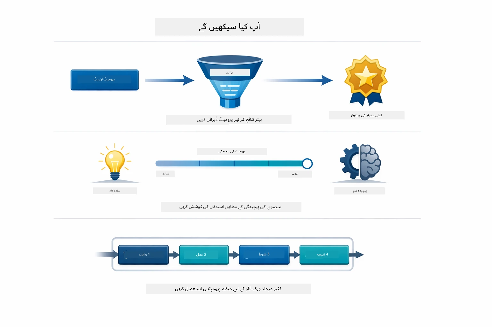
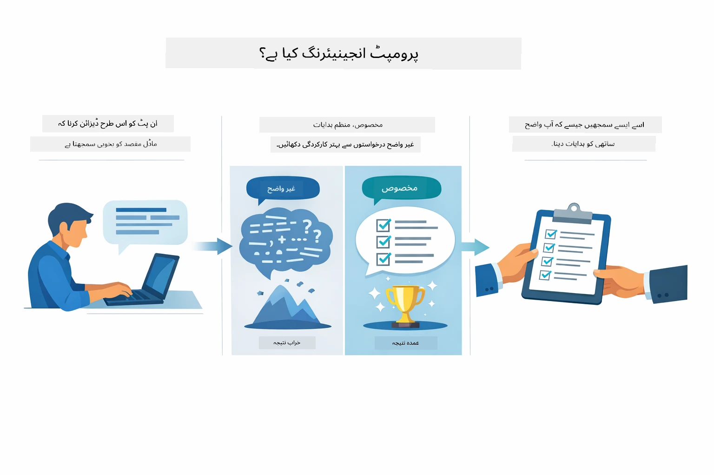
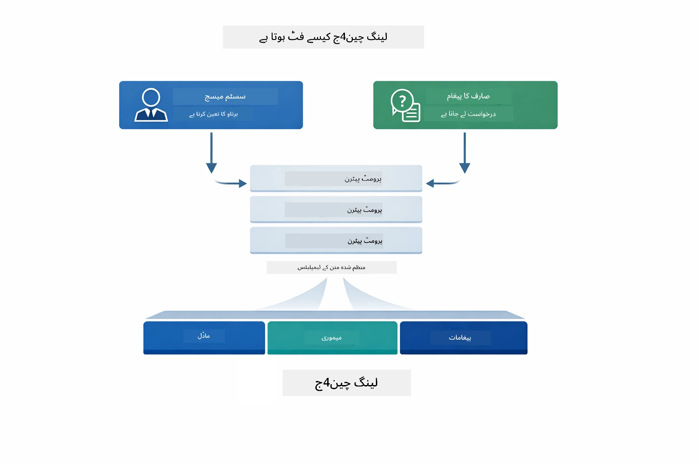
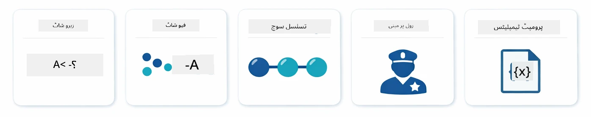
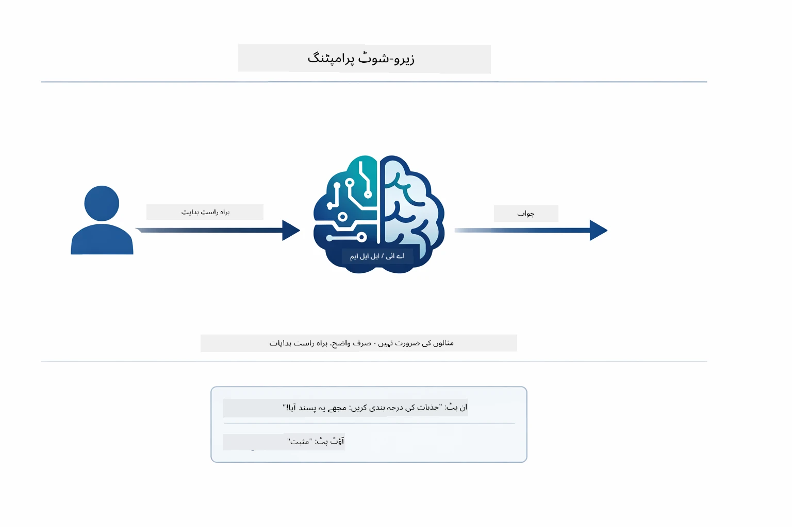
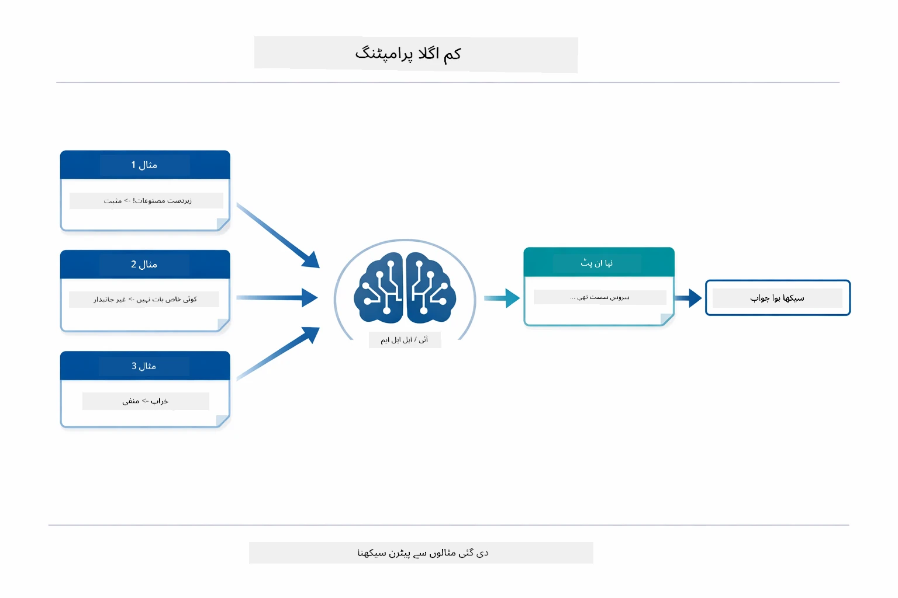
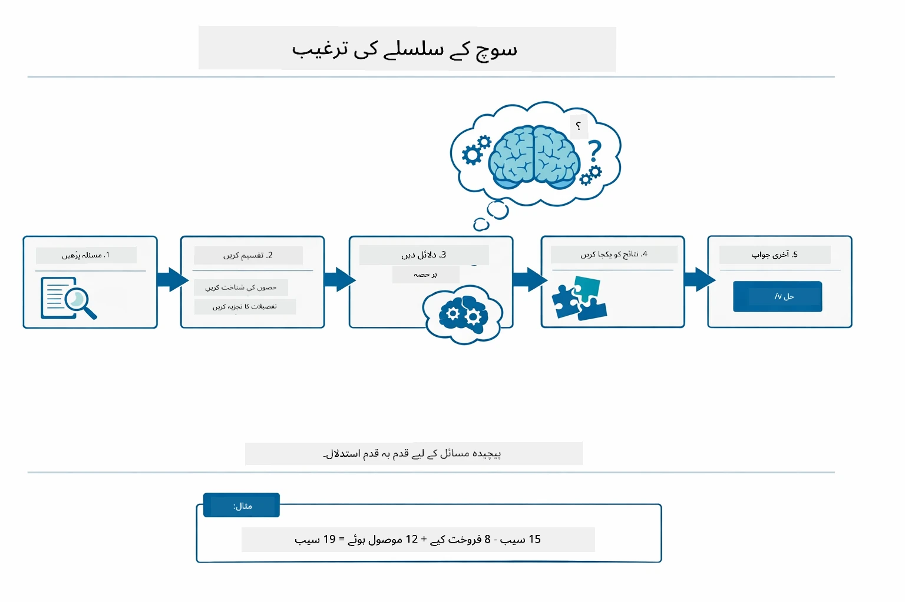
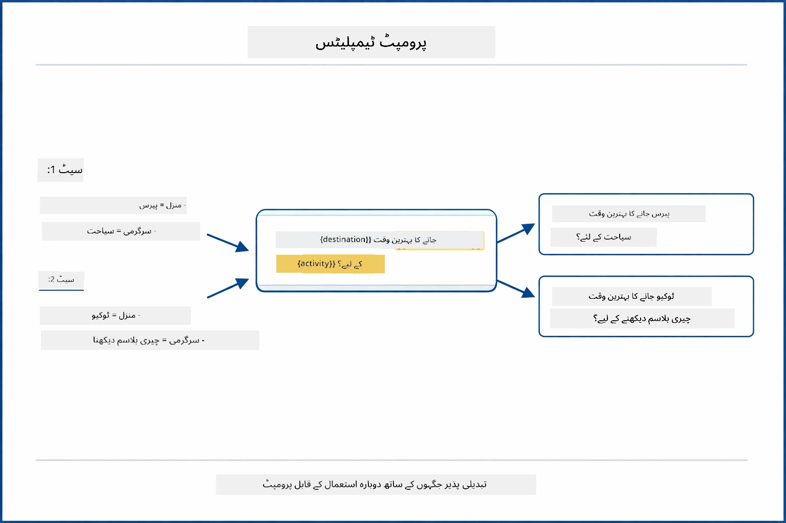
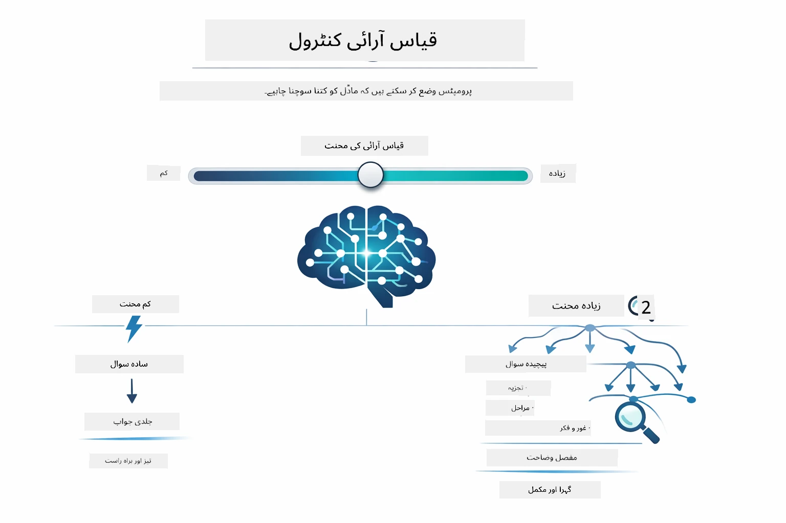

# ماڈیول ۰۲: GPT-5.2 کے ساتھ پرومپٹ انجینیئرنگ

## فہرست مضامین

- [ویڈیو واک تھرو](../../../02-prompt-engineering)
- [آپ کیا سیکھیں گے](../../../02-prompt-engineering)
- [ضروری شرائط](../../../02-prompt-engineering)
- [پرومپٹ انجینیئرنگ کو سمجھنا](../../../02-prompt-engineering)
- [پرومپٹ انجینیئرنگ کے بنیادی اصول](../../../02-prompt-engineering)
  - [زیرو شاٹ پرومپٹنگ](../../../02-prompt-engineering)
  - [فیو شاٹ پرومپٹنگ](../../../02-prompt-engineering)
  - [چین آف تھوٹ](../../../02-prompt-engineering)
  - [رول بیسڈ پرومپٹنگ](../../../02-prompt-engineering)
  - [پرومپٹ ٹیمپلیٹس](../../../02-prompt-engineering)
- [ایڈوانسڈ پیٹرنز](../../../02-prompt-engineering)
- [موجودہ Azure وسائل کا استعمال](../../../02-prompt-engineering)
- [ایپلیکیشن اسکرین شاٹس](../../../02-prompt-engineering)
- [پیٹرنز کی تلاش](../../../02-prompt-engineering)
  - [کم بمقابلہ زیادہ جوش](../../../02-prompt-engineering)
  - [ٹاسک ایکزیکیوشن (ٹول پری ایمبلز)](../../../02-prompt-engineering)
  - [سیلف ریفلیکٹنگ کوڈ](../../../02-prompt-engineering)
  - [اسٹرکچرد اینالیسس](../../../02-prompt-engineering)
  - [ملٹی ٹرن چیٹ](../../../02-prompt-engineering)
  - [قدم بہ قدم استدلال](../../../02-prompt-engineering)
  - [محدود آؤٹ پٹ](../../../02-prompt-engineering)
- [آپ واقعی کیا سیکھ رہے ہیں](../../../02-prompt-engineering)
- [اگلے مراحل](../../../02-prompt-engineering)

## ویڈیو واک تھرو

اس لائیو سیشن کو دیکھیں جو بتاتا ہے کہ اس ماڈیول کے ساتھ کیسے شروع کریں:

<a href="https://www.youtube.com/live/PJ6aBaE6bog?si=LDshyBrTRodP-wke"></a>

## آپ کیا سیکھیں گے



پچھلے ماڈیول میں، آپ نے دیکھا کہ میموری کس طرح کانورسیشنل AI کو ممکن بناتی ہے اور بنیادی تعاملات کے لیے GitHub ماڈلز کا استعمال کیا۔ اب ہم توجہ دیں گے کہ آپ سوالات کیسے پوچھتے ہیں — یعنی خود پرومپٹس — Azure OpenAI کے GPT-5.2 کا استعمال کرتے ہوئے۔ جس طرح آپ پرومپٹس کو ڈیزائن کرتے ہیں، اس سے جوابات کی کوالٹی پر نمایاں اثر پڑتا ہے۔ ہم بنیادی پرومپٹنگ تکنیکوں کا جائزہ لے کر شروع کرتے ہیں، پھر آٹھ جدید پیٹرنز کی طرف بڑھتے ہیں جو GPT-5.2 کی صلاحیتوں کو مکمل فائدہ دیتے ہیں۔

ہم GPT-5.2 استعمال کریں گے کیونکہ یہ استدلال کی کنٹرول متعارف کراتا ہے — آپ ماڈل کو بتا سکتے ہیں کہ جواب دینے سے پہلے کتنا سوچنا ہے۔ اس سے مختلف پرومپٹنگ حکمت عملیوں کی وضاحت ہوتی ہے اور آپ کو سمجھنے میں مدد ملتی ہے کہ کون سا طریقہ کب استعمال کرنا ہے۔ ہم Azure کی کم ریٹ لمٹس سے بھی فائدہ اٹھائیں گے جو GPT-5.2 کے لیے GitHub ماڈلز کی نسبت کم ہیں۔

## ضروری شرائط

- ماڈیول ۰۱ مکمل کیا ہوا (Azure OpenAI وسائل تعینات کیے ہوئے)
- روٹ ڈائریکٹری میں `.env` فائل Azure اسناد کے ساتھ (جو ماڈیول ۰۱ میں `azd up` کے ذریعہ بنائی گئی ہو)

> **نوٹ:** اگر آپ نے ماڈیول ۰۱ مکمل نہیں کیا تو پہلے وہاں دی گئی تعیناتی کی ہدایات پر عمل کریں۔

## پرومپٹ انجینیئرنگ کو سمجھنا



پرومپٹ انجینیئرنگ ایسے ان پٹ ٹیکسٹ ڈیزائن کرنے کے بارے میں ہے جو مستقل آپ کو مطلوبہ نتائج فراہم کرے۔ یہ صرف سوالات پوچھنے کے بارے میں نہیں ہے - بلکہ درخواستوں کی ساخت دینے کے بارے میں ہے تاکہ ماڈل بالکل سمجھ سکے کہ آپ کیا چاہتے ہیں اور اسے کیسے فراہم کرنا ہے۔

اسے ایسے سمجھیں جیسے کسی ساتھی کو ہدایات دینا۔ "بگ ٹھیک کریں" مبہم ہے۔ "UserService.java لائن 45 میں نل پوائنٹر ایکسیپشن کو نل چیک شامل کرکے ٹھیک کریں" خاص وضاحت ہے۔ زبان کے ماڈلز بھی اسی طرح کام کرتے ہیں - وضاحت اور ساخت اہم ہیں۔



LangChain4j بنیادی ڈھانچہ فراہم کرتا ہے — ماڈل کنکشنز، میموری، اور میسج کی اقسام — جبکہ پرومپٹ پیٹرنز صرف دھیان سے ڈیزائن کیا گیا ٹیکسٹ ہوتا ہے جو اس ڈھانچے کے ذریعے بھیجا جاتا ہے۔ کلیدی بلاکس `SystemMessage` (جو AI کے رویے اور کردار کا تعین کرتا ہے) اور `UserMessage` (جو آپ کی اصل درخواست لے کر آتا ہے) ہیں۔

## پرومپٹ انجینیئرنگ کے بنیادی اصول



اس ماڈیول میں جدید پیٹرنز میں جانے سے پہلے، آئیے پانچ بنیادی پرومپٹنگ تکنیکوں کا جائزہ لیں۔ یہ وہ بنیادی بلاکس ہیں جو ہر پرومپٹ انجینیئر کو جاننے چاہئیں۔ اگر آپ پہلے سے [Quick Start ماڈیول](../00-quick-start/README.md#2-prompt-patterns) کر چکے ہیں، تو آپ نے انہیں عمل میں دیکھا — یہاں ان کے پیچھے نظریاتی فریم ورک ہے۔

### زیرو شاٹ پرومپٹنگ

سب سے سادہ طریقہ: ماڈل کو براہِ راست کوئی ہدایت دیں بغیر کسی مثال کے۔ ماڈل اپنی تربیت کی بنیاد پر کام کو سمجھتا اور انجام دیتا ہے۔ یہ ان آسان درخواستوں کے لیے اچھا ہے جہاں متوقع رویہ واضح ہوتا ہے۔



*براہِ راست ہدایت بغیر مثالوں کے — ماڈل صرف ہدایت سے کام سمجھتا ہے*

```java
String prompt = "Classify this sentiment: 'I absolutely loved the movie!'";
String response = model.chat(prompt);
// جواب: "مثبت"
```

**استعمال کی صورت:** سادہ درجہ بندیاں، براہِ راست سوالات، تراجم، یا کوئی بھی کام جسے ماڈل بغیر اضافی رہنمائی کے سنبھال سکتا ہو۔

### فیو شاٹ پرومپٹنگ

ایسے مثالیں فراہم کریں جو ماڈل کو وہ پیٹرن دکھائیں جس کی پیروی کرنی ہے۔ ماڈل آپ کی مثالوں سے ان پٹ-آؤٹ پٹ فارمیٹ سیکھتا ہے اور نئے ان پٹس پر اس کا اطلاق کرتا ہے۔ یہ ان کاموں کے لیے زبردست مستقل مزاجی دیتا ہے جہاں مطلوبہ فارمیٹ یا رویہ واضح نہیں ہوتا۔



*مثالوں سے سیکھنا — ماڈل پیٹرن پہچان کر نئے ان پٹس پر لگاتا ہے*

```java
String prompt = """
    Classify the sentiment as positive, negative, or neutral.
    
    Examples:
    Text: "This product exceeded my expectations!" → Positive
    Text: "It's okay, nothing special." → Neutral
    Text: "Waste of money, very disappointed." → Negative
    
    Now classify this:
    Text: "Best purchase I've made all year!"
    """;
String response = model.chat(prompt);
```

**استعمال کی صورت:** کسٹم درجہ بندیاں، مستقل فارمیٹنگ، مخصوص ڈومین کے کام، یا جب زیرو شاٹ نتائج غیر مستقل ہوں۔

### چین آف تھوٹ

ماڈل سے کہیں کہ وہ اپنا استدلال قدم بہ قدم دکھائے۔ جواب پر سیدھا نہ پہنچے بلکہ مسئلے کو حصوں میں توڑ کر واضح کرے۔ اس سے ریاضی، منطق، اور کثیر مرحلہ استدلال کے کاموں میں درستگی بہتر ہوتی ہے۔



*قدم بہ قدم استدلال — پیچیدہ مسائل کو واضح منطقی مراحل میں توڑنا*

```java
String prompt = """
    Problem: A store has 15 apples. They sell 8 apples and then 
    receive a shipment of 12 more apples. How many apples do they have now?
    
    Let's solve this step-by-step:
    """;
String response = model.chat(prompt);
// ماڈل دکھاتا ہے: ۱۵ - ۸ = ۷، پھر ۷ + ۱۲ = ۱۹ سیب
```

**استعمال کی صورت:** ریاضی کے مسائل، منطق کے پہیلیاں، ڈیبگنگ، یا کوئی بھی کام جہاں استدلال کے عمل کا مظاہرہ درستگی اور اعتماد بڑھاتا ہے۔

### رول بیسڈ پرومپٹنگ

ماڈل سے پہلے اسے ایک کردار یا شخصیت دیں۔ یہ ایک سیاق و سباق فراہم کرتا ہے جو جواب کے لہجے، گہرائی، اور توجہ کو شکل دیتا ہے۔ ایک "سافٹ ویئر آرکیٹیکٹ" مختلف مشورے دیتا ہے بمقابلہ "جونئیر ڈیولپر" یا "سیکیورٹی آڈیٹر"۔


*سیاق و سباق اور کردار کا تعین — ایک ہی سوال مختلف کرداروں میں مختلف جواب دیتا ہے*

```java
String prompt = """
    You are an experienced software architect reviewing code.
    Provide a brief code review for this function:
    
    def calculate_total(items):
        total = 0
        for item in items:
            total = total + item['price']
        return total
    """;
String response = model.chat(prompt);
```

**استعمال کی صورت:** کوڈ ریویو، تدریس، مخصوص ڈومین کا تجزیہ، یا جب آپ کو خاص مہارت کی سطح یا نقطہ نظر کے مطابق جواب چاہیے۔

### پرومپٹ ٹیمپلیٹس

متغیر پلیس ہولڈرز کے ساتھ دوبارہ استعمال ہونے والے پرومپٹ بنائیں۔ ہر بار نیا پرومپٹ لکھنے کی بجائے ایک ٹیمپلیٹ تیار کریں اور مختلف اقدار بھریں۔ LangChain4j کا `PromptTemplate` کلاس `{{variable}}` کی آسان ترکیب کے ساتھ یہ عمل آسان بناتا ہے۔



*متغیرات کے ساتھ دوبارہ استعمال ہونے والے پرومپٹس — ایک ٹیمپلیٹ، متعدد استعمال*

```java
PromptTemplate template = PromptTemplate.from(
    "What's the best time to visit {{destination}} for {{activity}}?"
);

Prompt prompt = template.apply(Map.of(
    "destination", "Paris",
    "activity", "sightseeing"
));

String response = model.chat(prompt.text());
```

**استعمال کی صورت:** مختلف ان پٹس والی بار بار کی پوچھ گچھ، بیچ پراسیسنگ، دوبارہ قابل استعمال AI ورک فلو بنانے، یا کسی بھی صورتحال جہاں پرومپٹ کی ساخت ایک جیسی ہو مگر ڈیٹا بدلے۔

---

یہ پانچ بنیادی اصول آپ کو زیادہ تر پرومپٹنگ کاموں کے لیے ایک مضبوط ٹول کٹ دیتے ہیں۔ اس ماڈیول کے باقی حصے میں، ہم ان پر **آٹھ جدید پیٹرنز** کے ساتھ کام کریں گے جو GPT-5.2 کی استدلال کنٹرول، خود جانچ، اور منظم آؤٹ پٹ کی صلاحیتیں استعمال کرتے ہیں۔

## ایڈوانسڈ پیٹرنز

بنیادی اصولوں کا احاطہ کرنے کے بعد، آئیے آٹھ جدید پیٹرنز کی طرف بڑھیں جو اس ماڈیول کو منفرد بناتے ہیں۔ تمام مسائل کے لیے ایک ہی طریقہ کار ضروری نہیں ہوتا۔ کچھ سوالات کو فوری جواب درکار ہوتا ہے، جبکہ کچھ کو گہرائی میں سوچنا ہوتا ہے۔ بعض کو نظر آنے والا استدلال چاہیے، جبکہ بعض کو صرف نتائج۔ نیچے دیے گئے ہر پیٹرن کو مختلف منظرنامے کے لیے بہتر بنایا گیا ہے — اور GPT-5.2 کی استدلال کنٹرول ان اختلافات کو مزید واضح بناتا ہے۔


*آٹھ پرومپٹ انجینیئرنگ پیٹرنز اور ان کے استعمال کے کیسز کا جائزہ*



*GPT-5.2 کی استدلال کنٹرول آپ کو بتانے دیتی ہے کہ ماڈل کتنا سوچے — تیز اور براہِ راست جواب سے گہری دریافت تک*

**کم جوش (تیز اور مرکوز)** - آسان سوالات کے لیے جہاں آپ تیز، براہِ راست جواب چاہتے ہیں۔ ماڈل کم سے کم ۲ قدم تک سوچتا ہے۔ حسابات، تلاش یا سیدھے سوالات کے لیے استعمال کریں۔

```java
String prompt = """
    <context_gathering>
    - Search depth: very low
    - Bias strongly towards providing a correct answer as quickly as possible
    - Usually, this means an absolute maximum of 2 reasoning steps
    - If you think you need more time, state what you know and what's uncertain
    </context_gathering>
    
    Problem: What is 15% of 200?
    
    Provide your answer:
    """;

String response = chatModel.chat(prompt);
```

> 💡 **GitHub Copilot کے ساتھ دریافت کریں:** [`Gpt5PromptService.java`](../../../02-prompt-engineering/src/main/java/com/example/langchain4j/prompts/service/Gpt5PromptService.java) کھولیں اور پوچھیں:
> - "کم جوش اور زیادہ جوش والے پرومپٹنگ پیٹرنز میں کیا فرق ہے؟"
> - "پرومپٹ میں XML ٹیگز AI کے جواب کی ساخت میں کیسے مدد دیتے ہیں؟"
> - "میں کب خود عکاسی والے پیٹرنز استعمال کروں بمقابلہ براہِ راست ہدایت کے؟"

**زیادہ جوش (گہرا اور مکمل)** - پیچیدہ مسائل کے لیے جہاں آپ جامع تجزیہ چاہتے ہیں۔ ماڈل گہرائی سے تجزیہ کرتا ہے اور تفصیلی استدلال دکھاتا ہے۔ نظام ڈیزائن، آرکیٹیکچر فیصلے، یا پیچیدہ تحقیق کے لیے استعمال کریں۔

```java
String prompt = """
    Analyze this problem thoroughly and provide a comprehensive solution.
    Consider multiple approaches, trade-offs, and important details.
    Show your analysis and reasoning in your response.
    
    Problem: Design a caching strategy for a high-traffic REST API.
    """;

String response = chatModel.chat(prompt);
```

**ٹاسک ایکزیکیوشن (قدم بہ قدم پیش رفت)** - کثیر مرحلہ ورک فلو کے لیے۔ ماڈل ایک ابتدا ہی سے منصوبہ فراہم کرتا ہے، ہر قدم پر عمل کی اطلاع دیتا ہے، اور آخر میں خلاصہ دیتا ہے۔ مائیگریشنز، نفاذ، یا کسی بھی کثیر مرحلہ عمل کے لیے استعمال کریں۔

```java
String prompt = """
    <task_execution>
    1. First, briefly restate the user's goal in a friendly way
    
    2. Create a step-by-step plan:
       - List all steps needed
       - Identify potential challenges
       - Outline success criteria
    
    3. Execute each step:
       - Narrate what you're doing
       - Show progress clearly
       - Handle any issues that arise
    
    4. Summarize:
       - What was completed
       - Any important notes
       - Next steps if applicable
    </task_execution>
    
    <tool_preambles>
    - Always begin by rephrasing the user's goal clearly
    - Outline your plan before executing
    - Narrate each step as you go
    - Finish with a distinct summary
    </tool_preambles>
    
    Task: Create a REST endpoint for user registration
    
    Begin execution:
    """;

String response = chatModel.chat(prompt);
```

چین آف تھوٹ پرومپٹنگ واضح طور پر ماڈل سے چاہتی ہے کہ وہ اپنا استدلال ظاہر کرے، جو پیچیدہ کاموں کی درستگی بہتر بناتا ہے۔ قدم بہ قدم تجزیہ انسانوں اور AI دونوں کو منطق سمجھنے میں مدد دیتا ہے۔

> **🤖 [GitHub Copilot](https://github.com/features/copilot) چیٹ کے ساتھ آزمائیں:** اس پیٹرن کے بارے میں پوچھیں:
> - "طویل المدت آپریشنز کے لیے ٹاسک ایکزیکیوشن پیٹرن میں کیسے تبدیلی کریں؟"
> - "پروڈکشن ایپلیکیشنز میں ٹول پری ایمبلز کی ساخت کے بہترین طریقے کیا ہیں؟"
> - "UI میں درمیانی پیش رفت کی معلومات کیسے حاصل کریں اور دکھائیں؟"


*منصوبہ بندی → عملدرآمد → خلاصہ، کثیر مرحلہ کاموں کے لیے ورک فلو*

**سیلف ریفلیکٹنگ کوڈ** - پروڈکشن معیار کے کوڈ کے لیے۔ ماڈل پروڈکشن اسٹینڈرڈز کے مطابق کوڈ تیار کرتا ہے، مکمل ایرر ہینڈلنگ کے ساتھ۔ جب نئے فیچرز یا سروسز بنانے ہوں استعمال کریں۔

```java
String prompt = """
    Generate Java code with production-quality standards: Create an email validation service
    Keep it simple and include basic error handling.
    """;

String response = chatModel.chat(prompt);
```


*دہرانے والا بہتری کا چکر - پیدا کریں، جائزہ لیں، مسائل شناخت کریں، بہتر بنائیں، دہرائیں*

**اسٹرکچرد اینالیسس** - مسلسل جائزہ کے لیے۔ ماڈل ایک متعین فریم ورک (درستگی، طریقہ کار، کارکردگی، سیکیورٹی، برقرار رکھنے کی صلاحیت) کے تحت کوڈ کا جائزہ لیتا ہے۔ کوڈ ریویو یا معیار کے اندازے کے لیے استعمال کریں۔

```java
String prompt = """
    <analysis_framework>
    You are an expert code reviewer. Analyze the code for:
    
    1. Correctness
       - Does it work as intended?
       - Are there logical errors?
    
    2. Best Practices
       - Follows language conventions?
       - Appropriate design patterns?
    
    3. Performance
       - Any inefficiencies?
       - Scalability concerns?
    
    4. Security
       - Potential vulnerabilities?
       - Input validation?
    
    5. Maintainability
       - Code clarity?
       - Documentation?
    
    <output_format>
    Provide your analysis in this structure:
    - Summary: One-sentence overall assessment
    - Strengths: 2-3 positive points
    - Issues: List any problems found with severity (High/Medium/Low)
    - Recommendations: Specific improvements
    </output_format>
    </analysis_framework>
    
    Code to analyze:
    ```
    public List getUsers() {
        return database.query("SELECT * FROM users");
    }
    ```
    Provide your structured analysis:
    """;

String response = chatModel.chat(prompt);
```

> **🤖 [GitHub Copilot](https://github.com/features/copilot) چیٹ کے ساتھ آزمائیں:** اسٹرکچرد اینالیسس کے بارے میں پوچھیں:
> - "مختلف کوڈ ریویوز کے لیے تجزیہ فریم ورک کو کیسے حسب ضرورت بناؤں؟"
> - "منظم آؤٹ پٹ کو پروگرامی طور پر پارس اور عمل کرنے کا بہترین طریقہ کیا ہے؟"
> - "مختلف ریویو سیشنز میں مسلسل شدت کی سطح کیسے یقینی بناؤں؟"


*شدت کی سطح کے ساتھ مستقل کوڈ جائزے کا فریم ورک*

**ملٹی ٹرن چیٹ** - ایسے بات چیت کے لیے جس میں سیاق و سباق کی ضرورت ہو۔ ماڈل پچھلے پیغامات کو یاد رکھتا ہے اور ان پر تعمیر کرتا ہے۔ انٹرایکٹو ہیلپ سیشنز یا پیچیدہ سوال و جواب کے لیے استعمال کریں۔

```java
ChatMemory memory = MessageWindowChatMemory.withMaxMessages(10);

memory.add(UserMessage.from("What is Spring Boot?"));
AiMessage aiMessage1 = chatModel.chat(memory.messages()).aiMessage();
memory.add(aiMessage1);

memory.add(UserMessage.from("Show me an example"));
AiMessage aiMessage2 = chatModel.chat(memory.messages()).aiMessage();
memory.add(aiMessage2);
```


*مختلف ٹرنز پر بات چیت کا سیاق و سباق جمع ہوتا ہے جب تک کہ ٹوکن کی حد نہ پہنچے*

**قدم بہ قدم استدلال** - ایسے مسائل کے لیے جہاں مرئیت استدلال ضروری ہو۔ ماڈل ہر قدم کے لیے واضح استدلال دکھاتا ہے۔ ریاضی، منطق کی پہیلیاں، یا سوچنے کے عمل کو سمجھنے کے لیے استعمال کریں۔

```java
String prompt = """
    <instruction>Show your reasoning step-by-step</instruction>
    
    If a train travels 120 km in 2 hours, then stops for 30 minutes,
    then travels another 90 km in 1.5 hours, what is the average speed
    for the entire journey including the stop?
    """;

String response = chatModel.chat(prompt);
```


*مسائل کو واضح منطقی مراحل میں توڑنا*

**محدود آؤٹ پٹ** - ایسے جوابات کے لیے جن میں خاص فارمیٹ کی ضرورت ہو۔ ماڈل سختی سے فارمیٹ اور طوالت کے قواعد کی پیروی کرتا ہے۔ خلاصوں یا جب آپ کو بالکل درست آؤٹ پٹ ساخت چاہیے ہو، استعمال کریں۔

```java
String prompt = """
    <constraints>
    - Exactly 100 words
    - Bullet point format
    - Technical terms only
    </constraints>
    
    Summarize the key concepts of machine learning.
    """;

String response = chatModel.chat(prompt);
```


*خاص فارمیٹ، طوالت، اور ساخت کی ضروریات کو نافذ کرنا*

## موجودہ Azure وسائل کا استعمال

**تعیناتی کی تصدیق:**

یقینی بنائیں کہ روٹ ڈائریکٹری میں `.env` فائل Azure اسناد کے ساتھ موجود ہے (جو ماڈیول ۰۱ کے دوران بنائی گئی تھی):
```bash
cat ../.env  # AZURE_OPENAI_ENDPOINT، API_KEY، DEPLOYMENT دکھانا چاہیے
```

**ایپلیکیشن شروع کریں:**

> **نوٹ:** اگر آپ نے ماڈیول ۰۱ سے `./start-all.sh` کے ذریعے تمام ایپلیکیشنز پہلے ہی چلانا شروع کر دی ہیں، تو یہ ماڈیول پہلے سے پورٹ 8083 پر چل رہا ہے۔ آپ نیچے کے اسٹارٹ کمانڈز چھوڑ سکتے ہیں اور براہِ راست http://localhost:8083 پر جا سکتے ہیں۔
**آپشن 1: Spring Boot Dashboard استعمال کرنا (VS Code صارفین کے لیے تجویز کردہ)**

ڈویلیپمنٹ کنٹینر میں Spring Boot Dashboard ایکسٹینشن شامل ہے، جو تمام Spring Boot ایپلیکیشنز کو منظم کرنے کے لیے ایک بصری انٹرفیس فراہم کرتا ہے۔ آپ اسے VS Code کے بائیں طرف ایکٹیویٹی بار میں تلاش کر سکتے ہیں (Spring Boot آئیکن دیکھیں)۔

Spring Boot Dashboard سے آپ کر سکتے ہیں:
- ورک اسپیس میں دستیاب تمام Spring Boot ایپلیکیشنز دیکھیں
- ایک کلک سے ایپلیکیشنز شروع/روکیں
- ایپلیکیشن لاگز کو حقیقی وقت میں دیکھیں
- ایپلیکیشن کی حیثیت پر نظر رکھیں

بس "prompt-engineering" کے ساتھ پلے بٹن پر کلک کریں تاکہ یہ ماڈیول شروع ہو، یا تمام ماڈیول ایک ساتھ شروع کریں۔


**آپشن 2: شیل اسکرپٹس کا استعمال**

تمام ویب ایپلیکیشنز (ماڈیول 01-04) شروع کریں:

**Bash:**
```bash
cd ..  # روٹ ڈائریکٹری سے
./start-all.sh
```

**PowerShell:**
```powershell
cd ..  # روٹ ڈائریکٹری سے
.\start-all.ps1
```

یا صرف اس ماڈیول کو شروع کریں:

**Bash:**
```bash
cd 02-prompt-engineering
./start.sh
```

**PowerShell:**
```powershell
cd 02-prompt-engineering
.\start.ps1
```

دونوں اسکرپٹس خود بخود روٹ `.env` فائل سے انوائرمنٹ ویری ایبلز لوڈ کرتے ہیں اور اگر JARs موجود نہ ہوں تو انہیں بنائیں گے۔

> **نوٹ:** اگر آپ شروع کرنے سے پہلے تمام ماڈیولز کو دستی طور پر بنانا پسند کرتے ہیں:
>
> **Bash:**
> ```bash
> cd ..  # Go to root directory
> mvn clean package -DskipTests
> ```

> **PowerShell:**
> ```powershell
> cd ..  # Go to root directory
> mvn clean package -DskipTests
> ```

اپنے براؤزر میں http://localhost:8083 کھولیں۔

**بند کرنے کے لیے:**

**Bash:**
```bash
./stop.sh  # صرف یہ ماڈیول
# یا
cd .. && ./stop-all.sh  # تمام ماڈیولز
```

**PowerShell:**
```powershell
.\stop.ps1  # صرف یہ ماڈیول
# یا
cd ..; .\stop-all.ps1  # تمام ماڈیولز
```

## ایپلیکیشن اسکرین شاٹس


*مین ڈیش بورڈ جو تمام 8 پرامپٹ انجنیئرنگ پیٹرنز کو ان کی خصوصیات اور استعمال کے کیسز کے ساتھ دکھاتا ہے*

## پیٹرنز کی تلاش

ویب انٹرفیس آپ کو مختلف پرامپٹنگ حکمت عملیاں آزمانے دیتا ہے۔ ہر پیٹرن مختلف مسائل کا حل فراہم کرتا ہے - انہیں آزمائیں تاکہ معلوم ہو سکے کہ کون سا طریقہ کب بہترین کام کرتا ہے۔

> **نوٹ: اسٹریمنگ بمقابلہ غیر اسٹریمنگ** — ہر پیٹرن پیج پر دو بٹن موجود ہیں: **🔴 Stream Response (Live)** اور **Non-streaming** آپشن۔ اسٹریمنگ Server-Sent Events (SSE) استعمال کرتا ہے تاکہ ماڈل ٹوکنز کو حقیقی وقت میں ظاہر کرے جیسے جیسے وہ جنریٹ ہوتے ہیں، اس لیے آپ فوراً پیش رفت دیکھ سکتے ہیں۔ نان اسٹریمنگ آپشن پورا جواب ملنے کے بعد دکھاتا ہے۔ جن پرامپٹس سے گہری سوچ نکلتی ہے (مثلاً High Eagerness، Self-Reflecting Code)، نان اسٹریمنگ کال بہت دیر لے سکتی ہے — کبھی کبھار منٹوں تک — بغیر کوئی نظر آنے والا فیڈبیک دیے۔ **پیچیدہ پرامپٹس کے ساتھ تجربہ کرتے ہوئے اسٹریمنگ استعمال کریں** تاکہ ماڈل کام کرتا دکھائی دے اور یہ تاثر نہ ہو کہ درخواست ٹائم آؤٹ ہو گئی ہے۔
>
> **نوٹ: براؤزر کی شرط** — اسٹریمنگ فیچر Fetch Streams API (`response.body.getReader()`) استعمال کرتا ہے جو مکمل براؤزر (Chrome, Edge, Firefox, Safari) پر کام کرتا ہے۔ یہ VS Code کے بلٹ ان سمپل براؤزر میں کام نہیں کرتا کیونکہ اس کے ویب ویو میں ReadableStream API سپورٹ نہیں ہے۔ اگر آپ سمپل براؤزر استعمال کرتے ہیں، تو نان اسٹریمنگ بٹن معمول کے مطابق کام کریں گے — صرف اسٹریمنگ بٹن متاثر ہوں گے۔ مکمل تجربے کے لیے `http://localhost:8083` کو کسی خارجی براؤزر میں کھولیں۔

### Low vs High Eagerness

ایسا آسان سوال پوچھیں جیسے "15% کا 200 میں کتنا ہے؟" Low Eagerness کے ساتھ۔ آپ کو فوری اور براہ راست جواب ملے گا۔ اب "ہائی ٹریفک API کے لیے کیشنگ حکمت عملی تیار کریں" جیسا پیچیدہ سوال High Eagerness کے ساتھ پوچھیں۔ **🔴 Stream Response (Live)** پر کلک کریں اور ماڈل کی تفصیلی سوچ کو ٹوکن بہ ٹوکن دیکھیں۔ ماڈل ایک ہے، سوالی ڈھانچہ ایک ہے - لیکن پرامپٹ بتاتا ہے کہ کتنا سوچنا ہے۔

### ٹاسک کی انجام دہی (ٹوول پری ایمبلز)

کئی مراحل کے ورک فلو کو پیشگی منصوبہ بندی اور پیش رفت کی وضاحت سے فائدہ ہوتا ہے۔ ماڈل بیان کرتا ہے کہ کیا کرے گا، ہر قدم کی وضاحت کرتا ہے، پھر نتائج کا خلاصہ پیش کرتا ہے۔

### خود عکاسی کرنے والا کوڈ

"ایک ای میل ویلیڈیشن سروس بنائیں" آزمایں۔ صرف کوڈ بنانے اور روکنے کے بجائے، ماڈل کوڈ تیار کرتا ہے، معیار کے حوالے سے جائزہ لیتا ہے، کمزوریوں کی نشاندہی کرتا ہے، اور بہتر بناتا ہے۔ آپ اسے بار بار دیکھیں گے جب تک کہ کوڈ پروڈکشن معیار پر پورا نہ اترے۔

### منظم تجزیہ

کوڈ ریویو کے لیے مستقل جائزہ لینے کے فریم ورک کی ضرورت ہوتی ہے۔ ماڈل کوڈ کا تجزیہ مقررہ زمروں (درستی، طریقہ کار، کارکردگی، سیکیورٹی) کے تحت کرتا ہے جن کی شدت کی سطحیں ہوتی ہیں۔

### کثیر بار چیٹ

"Spring Boot کیا ہے؟" پوچھیں پھر فوراً "ایک مثال دکھائیں" کا سوال کریں۔ ماڈل آپ کا پہلا سوال یاد رکھتا ہے اور خاص طور پر Spring Boot کی مثال دیتا ہے۔ یادداشت کے بغیر، دوسرا سوال بہت مبہم ہوتا۔

### قدم بہ قدم استدلال

کسی ریاضی کے مسئلے کو منتخب کریں اور اسے Step-by-Step Reasoning اور Low Eagerness دونوں کے ساتھ آزمائیں۔ Low eagerness صرف جواب دیتا ہے — تیز مگر مبہم۔ Step-by-step آپ کو ہر حساب اور فیصلہ دکھاتا ہے۔

### محدود آؤٹ پٹ

جب آپ کو مخصوص فارمیٹس یا الفاظ کی تعداد چاہیے، یہ پیٹرن سخت پابندی عائد کرتا ہے۔ 100 الفاظ پر مشتمل بال پوائنٹ فارمیٹ میں خلاصہ تیار کریں۔

## جو آپ واقعی سیکھ رہے ہیں

**استدلال کی کوشش سب کچھ بدل دیتی ہے**

GPT-5.2 آپ کو اپنے پرامپٹس کے ذریعے کمپیوٹیشنل کوشش کو قابو میں رکھنے دیتا ہے۔ کم کوشش کا مطلب ہے تیز جوابات کم تلاش کے ساتھ۔ زیادہ کوشش کا مطلب ہے کہ ماڈل گہرائی سے سوچنے کے لیے وقت لیتا ہے۔ آپ سیکھ رہے ہیں کہ کام کی پیچیدگی کے مطابق کوشش کو میچ کریں — سادہ سوالات پر وقت ضائع نہ کریں، مگر پیچیدہ فیصلوں میں جلد بازی نہ کریں۔

**ڈھانچہ رویے کی رہنمائی کرتا ہے**

کیا آپ نے پرامپٹس میں XML ٹیگز دیکھے؟ یہ سجاوٹ نہیں ہیں۔ ماڈلز منظم ہدایات پر آزاد متن کی نسبت زیادہ معتبر عمل کرتے ہیں۔ جب آپ کو کئی مراحل کے عمل یا پیچیدہ منطق چاہیے، تو ڈھانچہ ماڈل کو بتاتا ہے کہ وہ کہاں ہے اور آگے کیا کرنا ہے۔


*اچھے منظم شدہ پرامپٹ کی تشریح جس میں واضح سیکشنز اور XML طرز کی ترتیب ہو*

**خود جائزہ کے ذریعے معیار**

خود عکاسی کرنے والے پیٹرنز معیار کے معیارات کو واضح کرتے ہیں۔ "صحیح طریقے سے کریں گے" کی امید لگانے کے بجائے، آپ ماڈل کو بتاتے ہیں کہ "صحیح" کا مطلب کیا ہے: درست منطق، غلطی کا ہینڈلنگ، کارکردگی، سیکیورٹی۔ ماڈل پھر اپنی آؤٹ پٹ کا جائزہ لے کر اسے بہتر بنا سکتا ہے۔ اس سے کوڈ جنریشن ایک قرعہ اندازی سے ایک عمل میں بدل جاتا ہے۔

**سیاق و سباق محدود ہے**

کثیر بار بات چیت ہر درخواست کے ساتھ پیغام کی تاریخ کو شامل کر کے کام کرتی ہے۔ مگر حد ہوتی ہے — ہر ماڈل کی زیادہ سے زیادہ ٹوکن گنتی ہوتی ہے۔ جیسے جیسے گفتگو بڑھتی ہے، آپ کو حکمت عملیاں اپنانا ہوں گی تاکہ متعلقہ سیاق و سباق برقرار رہے بغیر اس حد کو پار کیے۔ یہ ماڈیول آپ کو یادداشت کا کام دکھاتا ہے؛ بعد میں آپ سیکھیں گے کہ کب خلاصہ کریں، کب بھولیں، اور کب بازیافت کریں۔

## اگلے اقدامات

**اگلا ماڈیول:** [03-rag - RAG (Retrieval-Augmented Generation)](../03-rag/README.md)

---

**نیویگیشن:** [← پچھلا: ماڈیول 01 - تعارف](../01-introduction/README.md) | [مین پر واپس](../README.md) | [اگلا: ماڈیول 03 - RAG →](../03-rag/README.md)

---

<!-- CO-OP TRANSLATOR DISCLAIMER START -->
**عارضی دستبرداری**:  
اس دستاویز کا ترجمہ AI ترجمہ سروس [Co-op Translator](https://github.com/Azure/co-op-translator) کا استعمال کرتے ہوئے کیا گیا ہے۔ اگرچہ ہم درستگی کے لیے کوشاں ہیں، براہ کرم اس بات کا خیال رکھیں کہ خودکار تراجم میں غلطیاں یا نامکملیاں ہو سکتی ہیں۔ اصل دستاویز اپنی مادری زبان میں معتبر ماخذ سمجھی جانی چاہیے۔ اہم معلومات کے لیے پیشہ ور انسانی ترجمہ کی سفارش کی جاتی ہے۔ ہم اس ترجمہ کے استعمال سے پیدا ہونے والے کسی بھی غلط فہمی یا غلط تعبیر کے ذمہ دار نہیں ہیں۔
<!-- CO-OP TRANSLATOR DISCLAIMER END -->