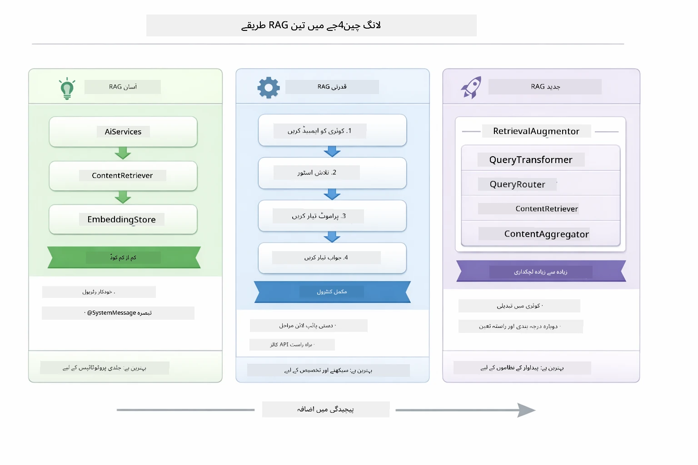
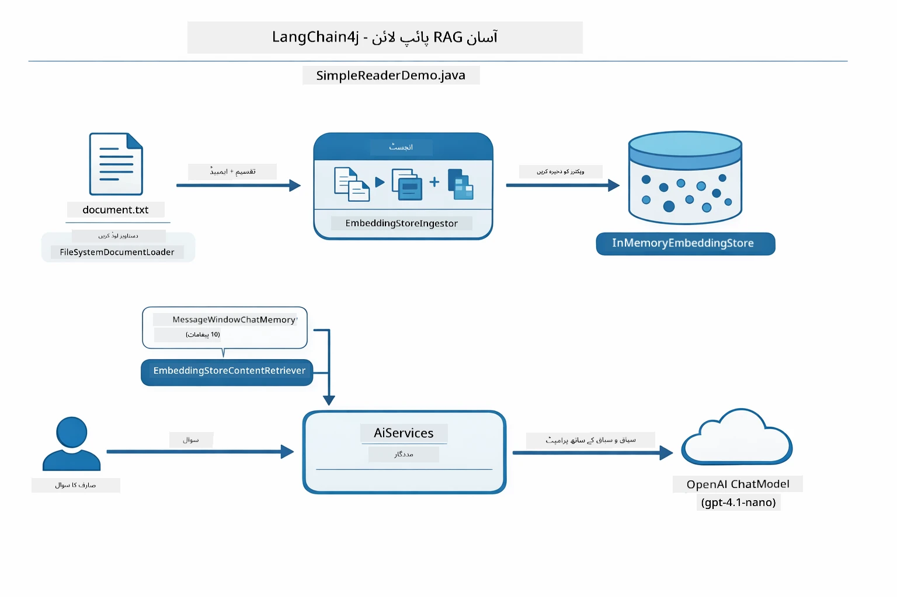
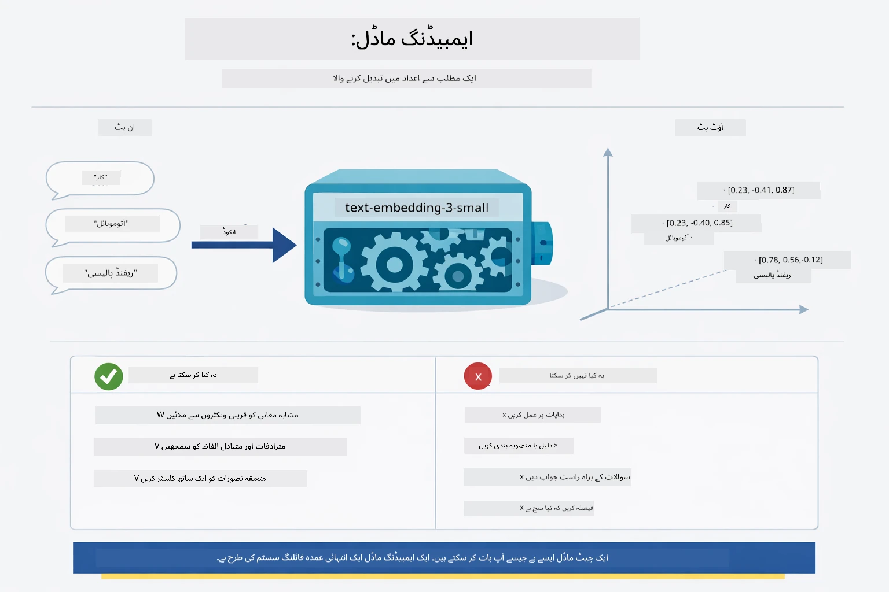
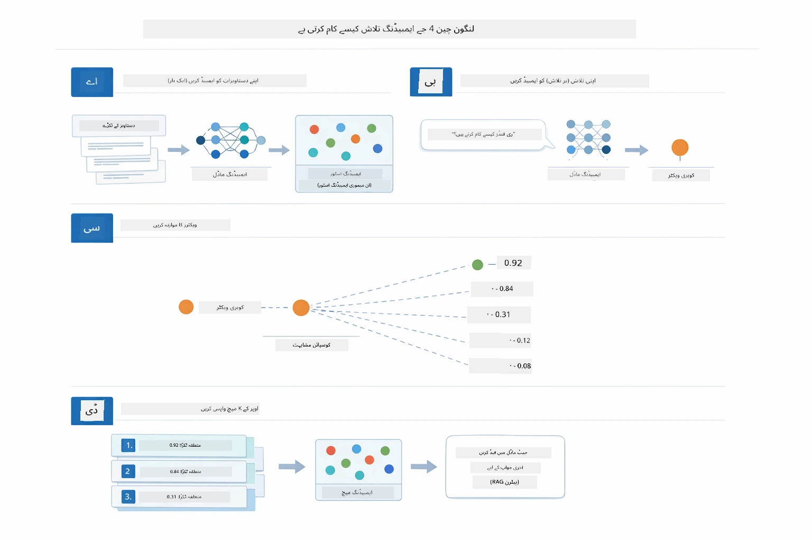
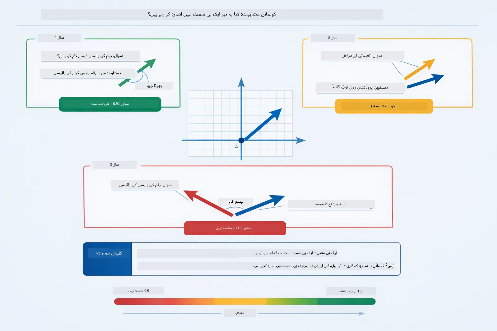
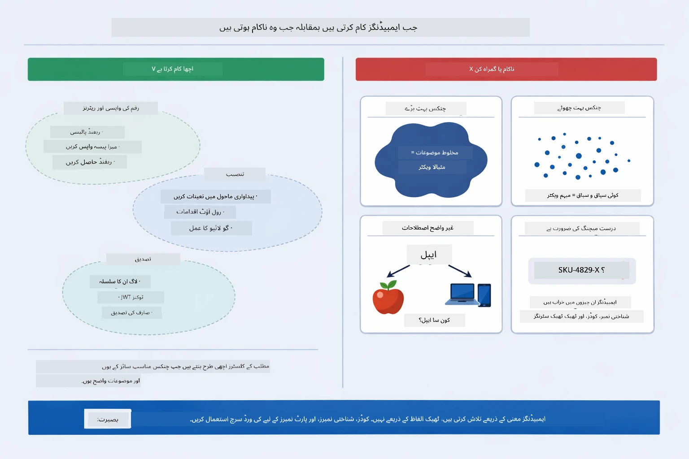

# ماڈیول 03: RAG (ریٹریول-اگمینٹڈ جنریشن)

## فہرست مضامین

- [ویڈیو واک تھرو](../../../03-rag)
- [آپ کیا سیکھیں گے](../../../03-rag)
- [پیشگی شرائط](../../../03-rag)
- [RAG کو سمجھنا](../../../03-rag)
  - [یہ ٹیوٹوریل کون سا RAG طریقہ استعمال کرتا ہے؟](../../../03-rag)
- [یہ کیسے کام کرتا ہے](../../../03-rag)
  - [دستاویز کی پروسیسنگ](../../../03-rag)
  - [ایمبیڈنگ بنانا](../../../03-rag)
  - [سمانٹک سرچ](../../../03-rag)
  - [جواب کی تخلیق](../../../03-rag)
- [ایپلیکیشن چلائیں](../../../03-rag)
- [ایپلیکیشن استعمال کرنا](../../../03-rag)
  - [دستاویز اپلوڈ کریں](../../../03-rag)
  - [سوالات پوچھیں](../../../03-rag)
  - [ذرائع کے حوالے چیک کریں](../../../03-rag)
  - [سوالات کے ساتھ تجربہ کریں](../../../03-rag)
- [اہم تصورات](../../../03-rag)
  - [چنکنگ حکمت عملی](../../../03-rag)
  - [شباہت کے اسکورز](../../../03-rag)
  - [ان-میموری اسٹوریج](../../../03-rag)
  - [کانٹیکسٹ ونڈو مینجمنٹ](../../../03-rag)
- [جب RAG اہم ہوتا ہے](../../../03-rag)
- [اگلے اقدامات](../../../03-rag)

## ویڈیو واک تھرو

اس لائیو سیشن کو دیکھیں جو بتاتا ہے کہ اس ماڈیول کے ساتھ کیسے شروع کیا جائے: [LangChain4j کے ساتھ RAG - لائیو سیشن](https://www.youtube.com/watch?v=_olq75ZH_eY)

## آپ کیا سیکھیں گے

پچھلے ماڈیولز میں، آپ نے سیکھا کہ AI کے ساتھ بات چیت کیسے کریں اور اپنے پرومپٹس کو مؤثر طریقے سے کیسے ترتیب دیں۔ لیکن ایک بنیادی حد بندی ہے: زبان کے ماڈلز صرف وہی جانتے ہیں جو انہیں تربیت کے دوران سکھایا گیا ہوتا ہے۔ وہ آپ کی کمپنی کی پالیسیاں، آپ کے پروجیکٹ کی دستاویزات، یا کوئی معلومات جو انہیں نہیں سکھائی گئی، پر سوالات کے جواب نہیں دے سکتے۔

RAG (ریٹریول-اگمینٹڈ جنریشن) اس مسئلے کو حل کرتا ہے۔ ماڈل کو آپ کی معلومات سکھانے کی کوشش کرنے کے بجائے (جو مہنگا اور عملی نہیں ہے)، آپ اسے اپنے دستاویزات میں تلاش کرنے کی صلاحیت دیتے ہیں۔ جب کوئی سوال کرتا ہے، نظام متعلقہ معلومات تلاش کرتا ہے اور پرومپٹ میں شامل کرتا ہے۔ ماڈل پھر اس بازیافت شدہ کانٹیکسٹ کی بنیاد پر جواب دیتا ہے۔

RAG کو ماڈل کو ایک حوالہ جاتی لائبریری دینے کے طور پر سوچیں۔ جب آپ سوال کرتے ہیں، نظام:

1. **صارف کا سوال** - آپ سوال پوچھتے ہیں
2. **ایمبیڈنگ** - آپ کے سوال کو ایک ویکٹر میں تبدیل کرتا ہے
3. **ویکٹر سرچ** - ملتے جلتے دستاویزی چنکس تلاش کرتا ہے
4. **کانٹیکسٹ اسمبلی** - متعلقہ چنکس کو پرومپٹ میں شامل کرتا ہے
5. **جواب** - ایل ایل ایم کانٹیکسٹ کی بنیاد پر جواب تیار کرتا ہے

یہ ماڈل کے جوابات کو اس کی تربیتی معلومات پر انحصار کرنے یا فرضی جوابات بنانے کی بجائے آپ کے اصل ڈیٹا کی بنیاد پر مضبوط کرتا ہے۔

## پیشگی شرائط

- مکمل شدہ [ماڈیول 00 - جلد شروع کریں](../00-quick-start/README.md) (اوپر حوالہ دیا گیا آسان RAG مثال کے لیے)
- مکمل شدہ [ماڈیول 01 - تعارف](../01-introduction/README.md) (Azure OpenAI وسائل ترتیب دیے گئے، بشمول `text-embedding-3-small` ایمبیڈنگ ماڈل)
- روٹ ڈائریکٹری میں `.env` فائل جس میں Azure کی اسناد موجود ہوں (جو ماڈیول 01 میں `azd up` کے ذریعے بنائی گئی ہو)

> **نوٹ:** اگر آپ نے ماڈیول 01 مکمل نہیں کیا، تو پہلے وہاں دی گئی تعیناتی کی ہدایات پر عمل کریں۔ `azd up` کمانڈ GPT چیٹ ماڈل اور اس ماڈیول کے استعمال شدہ ایمبیڈنگ ماڈل دونوں کو تعینات کرتا ہے۔

## RAG کو سمجھنا

ذیل میں دیا گیا خاکہ بنیادی تصور کو ظاہر کرتا ہے: ماڈل کے تربیتی ڈیٹا پر صرف انحصار کرنے کی بجائے، RAG اسے آپ کے دستاویزات کی ایک حوالہ جاتی لائبریری دیتا ہے تاکہ ہر جواب دینے سے پہلے اس سے رجوع کرے۔


*یہ خاکہ ایک معیاری ایل ایل ایم (جو تربیتی ڈیٹا سے اندازہ لگاتا ہے) اور ایک RAG سے مزین ایل ایل ایم (جو پہلے آپ کے دستاویزات سے رجوع کرتا ہے) کے درمیان فرق دکھاتا ہے۔*

یہاں دکھایا گیا ہے کہ مختلف اجزاء مکمل طریقے سے کیسے جڑتے ہیں۔ صارف کے سوال کا فلو چار مراحل سے گزرتا ہے — ایمبیڈنگ، ویکٹر سرچ، کانٹیکسٹ اسمبلی، اور جواب کی تخلیق — ہر ایک پچھلے کو بنیاد بنا کر:


*یہ خاکہ RAG پائپ لائن کا مکمل عمل دکھاتا ہے — صارف کا سوال ایمبیڈنگ، ویکٹر سرچ، کانٹیکسٹ اسمبلی، اور جواب سازی کے مراحل سے گزرتا ہے۔*

اس ماڈیول کے باقی حصے میں ہر مرحلے کی تفصیل کے ساتھ چلیں گے، کوڈ کے ساتھ جسے آپ چلا اور تبدیل کر سکتے ہیں۔

### یہ ٹیوٹوریل کون سا RAG طریقہ استعمال کرتا ہے؟

LangChain4j RAG کو نافذ کرنے کے تین طریقے پیش کرتا ہے، ہر ایک مختلف سطح کی انتزاع کے ساتھ۔ ذیل میں انہیں پہلو بہ پہلو موازنہ کیا گیا ہے:



*یہ خاکہ LangChain4j کے تین RAG طریقے — آسان، مقامی، اور اعلیٰ — کے بنیادی اجزاء اور استعمال کے مواقع دکھاتا ہے۔*

| طریقہ | یہ کیا کرتا ہے | فائدہ/نقصان |
|---|---|---|
| **آسان RAG** | سب کچھ خودکار طریقے سے `AiServices` اور `ContentRetriever` کے ذریعے منسلک کرتا ہے۔ آپ انٹرفیس پر تشریحات لگاتے ہیں، رٹریور جوڑتے ہیں، اور LangChain4j ایمبیڈنگ، تلاش، اور پرومپٹ اسمبلی کو پس منظر میں سنبھالتا ہے۔ | کوڈ کم، لیکن ہر مرحلے پر کیا ہو رہا ہے یہ نظر نہیں آتا۔ |
| **مقامی RAG** | آپ خود ایمبیڈنگ ماڈل کو کال کرتے ہیں، اسٹور میں تلاش کرتے ہیں، پرومپٹ بناتے ہیں، اور جواب تیار کرتے ہیں — ہر قدم واضح اور علیحدہ۔ | کوڈ زیادہ، لیکن ہر مرحلہ ظاہر اور قابل تبدیلی ہے۔ |
| **اعلیٰ RAG** | `RetrievalAugmentor` فریم ورک استعمال کرتا ہے جس میں پلیگیبل کویری ٹرانسفارمرز، راؤٹرز، ری-رینکرز، اور مواد انجیکٹرز شامل ہیں، پروڈکشن گریڈ پائپ لائنز کے لیے۔ | زیادہ سے زیادہ لچک، لیکن نمایاں زیادہ پیچیدگی۔ |

**یہ ٹیوٹوریل مقامی طریقہ استعمال کرتا ہے۔** RAG پائپ لائن کا ہر مرحلہ — کویری کا ایمبیڈنگ، ویکٹر اسٹور کی تلاش، کانٹیکسٹ اسمبلی، اور جواب کی تخلیق — [`RagService.java`](../../../03-rag/src/main/java/com/example/langchain4j/rag/service/RagService.java) میں واضح طور پر لکھا گیا ہے۔ یہ جان بوجھ کر ہے: ایک تعلیمی وسیلے کے طور پر یہ زیادہ اہم ہے کہ آپ ہر مرحلے کو دیکھیں اور سمجھیں بجائے اس کے کہ کوڈ کم سے کم ہو۔ جب آپ ہر حصے کے آپس میں جُڑنے کا اندازہ لگا لیں گے، تو آپ آسان RAG پر یا تو تیز پروٹوٹائپس کے لیے یا اعلیٰ RAG پر پروڈکشن سسٹمز کے لیے منتقل ہو سکتے ہیں۔

> **💡 پہلے آسان RAG دیکھا ہے؟** [جِلدی شروع کرنے والا ماڈیول](../00-quick-start/README.md) میں ایک دستاویزی سوال و جواب کی مثال شامل ہے ([`SimpleReaderDemo.java`](../../../00-quick-start/src/main/java/com/example/langchain4j/quickstart/SimpleReaderDemo.java)) جو آسان RAG طریقہ استعمال کرتا ہے — LangChain4j ایمبیڈنگ، تلاش، اور پرومپٹ اسمبلی کو خودکار کرتا ہے۔ یہ ماڈیول اگلا قدم اٹھاتا ہے اور اس پائپ لائن کو کھولتا ہے تاکہ آپ ہر مرحلے کو خود دیکھ سکیں اور قابو پا سکیں۔



*یہ خاکہ `SimpleReaderDemo.java` کی آسان RAG پائپ لائن کو دکھاتا ہے۔ اس کا موازنہ اس ماڈیول کے مقامی طریقے سے کریں: آسان RAG ایمبیڈنگ، ریٹریول، اور پرومپٹ اسمبلی کو `AiServices` اور `ContentRetriever` کے پیچھے چھپاتا ہے — آپ دستاویز لوڈ کرتے ہیں، رٹریور لگاتے ہیں، اور جوابات حاصل کرتے ہیں۔ اس ماڈیول میں مقامی طریقہ وہ پائپ لائن کھولتا ہے تاکہ آپ ہر مرحلے کو خود کال کریں (ایمبیڈ، تلاش، کانٹیکسٹ جمع کرنا، جواب دینا)، جو مکمل نظارہ اور قابو دیتا ہے۔*

## یہ کیسے کام کرتا ہے

اس ماڈیول میں RAG پائپ لائن چار مراحل میں تقسیم ہوتی ہے جو ہر بار جب صارف سوال کرتا ہے ترتیب وار چلتی ہے۔ پہلے، اپلوڈ کردہ دستاویز کو **تجزیہ کرکے اور چنکس میں تقسیم کرکے** manageable ٹکڑوں میں تبدیل کیا جاتا ہے۔ پھر ان چنکس کو **ویکٹر ایمبیڈنگز** میں تبدیل کرکے محفوظ کیا جاتا ہے تاکہ ان کا ریاضیاتی مقابلہ کیا جا سکے۔ جب کوئی سوال آتا ہے، نظام ایک **سمانٹک سرچ** انجام دیتا ہے تاکہ سب سے زیادہ متعلقہ چنکس تلاش کرے، اور آخر میں انہیں کانٹیکسٹ کے طور پر ایل ایل ایم کو دے کر **جواب تیار کرواتا ہے**۔ نیچے والے حصے میں ہر مرحلے کو حقیقی کوڈ اور خاکوں کے ساتھ تفصیل سے سمجھایا گیا ہے۔ آئیے پہلے قدم کو دیکھیں۔

### دستاویز کی پروسیسنگ

[DocumentService.java](../../../03-rag/src/main/java/com/example/langchain4j/rag/service/DocumentService.java)

جب آپ دستاویز اپلوڈ کرتے ہیں، نظام اسے پارس کرتا ہے (پی ڈی ایف یا سادہ متن)، اس کے ساتھ میٹا ڈیٹا جیسے فائل کا نام جوڑتا ہے، اور پھر اسے چنکس میں توڑتا ہے — چھوٹے حصے جو ماڈل کے کانٹیکسٹ ونڈو میں آرام دہ طریقے سے فٹ ہوتے ہیں۔ یہ چنکس ہلکا سا اوورلیپ کرتے ہیں تاکہ کناروں پر کانٹیکسٹ ضائع نہ ہو۔

```java
// اپ لوڈ کی گئی فائل کو پارس کریں اور اسے LangChain4j دستاویز میں لپیٹیں
Document document = Document.from(content, metadata);

// 300-ٹوکن حصوں میں تقسیم کریں جن میں 30-ٹوکن کا اوورلیپ ہو
DocumentSplitter splitter = DocumentSplitters
    .recursive(300, 30);

List<TextSegment> segments = splitter.split(document);
```

نیچے والا خاکہ بصری طور پر دکھاتا ہے کہ یہ کیسے کام کرتا ہے۔ دھیان دیں کہ ہر چنک اپنے پڑوسیوں کے ساتھ کچھ ٹوکنز شئیر کرتا ہے — 30 ٹوکن اوورلیپ یقینی بناتا ہے کہ کوئی اہم کانٹیکسٹ درمیان میں چھوٹ نہ جائے:


*یہ خاکہ دکھاتا ہے کہ دستاویز کو 300-ٹوکن چنکس میں 30 ٹوکن اوورلیپ کے ساتھ تقسیم کیا جاتا ہے، جو چنک کی سرحدوں پر کانٹیکسٹ کو محفوظ رکھتا ہے۔*

> **🤖 GitHub Copilot چیٹ کے ساتھ آزما کر دیکھیں:** [`DocumentService.java`](../../../03-rag/src/main/java/com/example/langchain4j/rag/service/DocumentService.java) کھولیں اور پوچھیں:
> - "LangChain4j دستاویزات کو چنکس میں کیسے تقسیم کرتا ہے اور اوورلیپ کیوں اہم ہے؟"
> - "مختلف دستاویزات کی اقسام کے لیے بہترین چنک سائز کیا ہے اور کیوں؟"
> - "میں متعدد زبانوں یا خاص فارمیٹنگ والی دستاویزات کو کیسے سنبھال سکتا ہوں؟"

### ایمبیڈنگ بنانا

[LangChainRagConfig.java](../../../03-rag/src/main/java/com/example/langchain4j/rag/config/LangChainRagConfig.java)

ہر چنک کو ایک عددی نمائندگی میں تبدیل کیا جاتا ہے جسے ایمبیڈنگ کہتے ہیں — بنیادی طور پر معنی کو اعداد میں تبدیل کرنے والا کنورٹر۔ ایمبیڈنگ ماڈل "ذہین" نہیں ہوتا جیسے چیٹ ماڈل ہوتا ہے؛ یہ ہدایات پر عمل نہیں کر سکتا، استدلال نہیں کر سکتا، یا سوالات کے جواب نہیں دے سکتا۔ جو کر سکتا ہے وہ یہ ہے کہ متن کو ایک ریاضیاتی جگہ میں نقشہ کرے جہاں ملتے جلتے معانی ایک دوسرے کے قریب آ جائیں — جیسے "کار" "موٹر گاڑی" کے قریب، "ریفنڈ پالیسی" "میرا پیسہ واپس کرو" کے قریب۔ چیٹ ماڈل کو ایک انسان سمجھیں جس سے آپ بات کر سکتے ہیں؛ ایمبیڈنگ ماڈل ایک بہترین فائلنگ سسٹم ہے۔



*یہ خاکہ دکھاتا ہے کہ ایمبیڈنگ ماڈل کس طرح متن کو عددی ویکٹرز میں بدلتا ہے، ملتے جلتے معانی — جیسے "کار" اور "موٹر گاڑی" — کو ویکٹر اسپیس میں ایک دوسرے کے قریب رکھتا ہے۔*

```java
@Bean
public EmbeddingModel embeddingModel() {
    return OpenAiOfficialEmbeddingModel.builder()
        .baseUrl(azureOpenAiEndpoint)
        .apiKey(azureOpenAiKey)
        .modelName(azureEmbeddingDeploymentName)
        .build();
}

EmbeddingStore<TextSegment> embeddingStore = 
    new InMemoryEmbeddingStore<>();
```

نیچے دیا گیا کلاس ڈایاگرام RAG پائپ لائن کے دو الگ الگ فلو اور LangChain4j کے وہ کلاسز دکھاتا ہے جو انہیں نافذ کرتے ہیں۔ **انجیشن فلو** (جو صرف اپلوڈ کے وقت چلتا ہے) دستاویز کو تقسیم کرتا ہے، چنکس کو ایمبیڈ کرتا ہے، اور `.addAll()` کے ذریعے انہیں اسٹور کرتا ہے۔ **کوئری فلو** (جو ہر بار سوال کرتے وقت چلتا ہے) سوال کو ایمبیڈ کرتا ہے، `.search()` کے ذریعے اسٹور میں تلاش کرتا ہے، اور ملتا جلتا کانٹیکسٹ چیٹ ماڈل تک پہنچاتا ہے۔ دونوں فلوز مشترکہ `EmbeddingStore<TextSegment>` انٹرفیس پر ملتے ہیں:


*یہ خاکہ RAG پائپ لائن میں دو فلوز — انجیشن اور کوئری — کو دکھاتا ہے اور بتاتا ہے کہ وہ مشترکہ ایمبیڈنگ اسٹور کے ذریعے کیسے جڑتے ہیں۔*

ایمبیڈنگز اسٹور ہونے کے بعد، مشابہ مواد ویکٹر اسپیس میں قدرتی طور پر ایک ساتھ جمع ہو جاتا ہے۔ نیچے دی گئی ویژولائزیشن دکھاتی ہے کہ متعلقہ موضوعات والی دستاویزات کس طرح قریب قریب نقاط کی صورت میں آتی ہیں، جو سمانٹک سرچ کو ممکن بناتا ہے:


*یہ ویژولائزیشن دکھاتی ہے کہ متعلقہ دستاویزات 3D ویکٹر اسپیس میں کیسے ایک ساتھ کلستر بنتی ہیں، جس میں تکنیکی دستاویزات، کاروباری قواعد، اور عمومی سوالات جیسے موضوعات الگ الگ گروپ بناتے ہیں۔*

جب صارف تلاش کرتا ہے، نظام چار مراحل سے گزرتا ہے: دستاویزات کو ایک بار ایمبیڈ کرنا، ہر تلاش پر سوال کو ایمبیڈ کرنا، سوالی ویکٹر کا تمام ذخیرہ شدہ ویکٹرز سے کوسائن شباہت کے ذریعے موازنہ کرنا، اور اعلیٰ سکور والے ٹاپ-K چنکس واپس کرنا۔ نیچے والا خاکہ ہر مرحلے اور LangChain4j کلاسز کو دکھاتا ہے:



*یہ خاکہ چار مرحلوں پر مبنی ایمبیڈنگ سرچ عمل دکھاتا ہے: دستاویزات ایمبیڈ کریں، سوال ایمبیڈ کریں، ویکٹرز کو کوسائن شباہت سے موازنہ کریں، اور ٹاپ-K نتائج واپس کریں۔*

### سمانٹک سرچ

[RagService.java](../../../03-rag/src/main/java/com/example/langchain4j/rag/service/RagService.java)

جب آپ سوال کرتے ہیں، تو آپ کا سوال بھی ایک ایمبیڈنگ بن جاتا ہے۔ نظام آپ کے سوال کی ایمبیڈنگ کو تمام دستاویزی چنکس کی ایمبیڈنگز کے ساتھ موازنہ کرتا ہے۔ یہ ان چنکس کو تلاش کرتا ہے جن کے معنی سب سے زیادہ ملتے جلتے ہوتے ہیں — صرف میچ کرنے والے کلیدی الفاظ نہیں، اصل معنوی مشابہت۔

```java
Embedding queryEmbedding = embeddingModel.embed(question).content();

EmbeddingSearchRequest searchRequest = EmbeddingSearchRequest.builder()
    .queryEmbedding(queryEmbedding)
    .maxResults(5)
    .minScore(0.5)
    .build();

EmbeddingSearchResult<TextSegment> searchResult = embeddingStore.search(searchRequest);
List<EmbeddingMatch<TextSegment>> matches = searchResult.matches();

for (EmbeddingMatch<TextSegment> match : matches) {
    String relevantText = match.embedded().text();
    double score = match.score();
}
```

نیچے والا خاکہ سمانٹک سرچ کو روایتی کلیدی الفاظ کی تلاش سے موازنہ کرتا ہے۔ "گاڑی" کے لیے کلیدی لفظ کی تلاش "کاروں اور ٹرکس" کے بارے میں چنک کو مس کر دیتی ہے، لیکن سمانٹک سرچ سمجھتا ہے کہ وہ ایک ہی چیز کا مطلب ہیں اور اسے زیادہ سکور والا میچ کے طور پر واپس کرتا ہے:


*یہ خاکہ کلیدی الفاظ کی بنیاد پر تلاش اور سمانٹک تلاش کا موازنہ کرتا ہے، دکھاتے ہوئے کہ سمانٹک تلاش کیسے تصوری لحاظ سے متعلق مواد کو بازیافت کرتا ہے یہاں تک کہ جب صحیح کلیدی الفاظ مختلف ہوں۔*

اندرون خانہ، شباہت کو کوسائن شباہت سے ناپا جاتا ہے — بنیادی طور پر پوچھنا "کیا یہ دو تیر ایک ہی سمت میں اشارہ کر رہے ہیں؟" دو چنکس بالکل مختلف الفاظ استعمال کر سکتے ہیں، لیکن اگر وہ ایک ہی معنی رکھتے ہیں تو ان کے ویکٹر ایک ہی سمت میں رہتے ہیں اور اسکور 1.0 کے قریب ہوتا ہے:



*یہ خاکہ کوسائن شباہت کو ایمبیڈنگ ویکٹرز کے درمیان زاویہ کے طور پر ظاہر کرتا ہے — زیادہ سیدھے چلے ہوئے ویکٹرز کا اسکور 1.0 کے قریب ہوتا ہے، جو زیادہ معنوی مشابہت کو ظاہر کرتا ہے۔*
> **🤖 [GitHub Copilot](https://github.com/features/copilot) چیٹ کے ساتھ کوشش کریں:** کھولیں [`RagService.java`](../../../03-rag/src/main/java/com/example/langchain4j/rag/service/RagService.java) اور پوچھیں:
> - "ایمبیڈنگز کے ساتھ مطابقت کی تلاش کیسے کام کرتی ہے اور اسکور کو کیا طے کرتا ہے؟"
> - "میں کون سا مماثلت کی حد استعمال کروں اور یہ نتائج کو کیسے متاثر کرتی ہے؟"
> - "میں ایسے کیسز کو کیسے سنبھالتا ہوں جہاں کوئی متعلقہ دستاویزات نہیں ملتی؟"

### جواب تخلیق

[RagService.java](../../../03-rag/src/main/java/com/example/langchain4j/rag/service/RagService.java)

سب سے متعلقہ چنکس کو ایک منظم پرامپٹ میں جمع کیا جاتا ہے جس میں واضح ہدایات، بازیافت کردہ سیاق و سباق، اور صارف کا سوال شامل ہوتا ہے۔ ماڈل ان مخصوص چنکس کو پڑھتا ہے اور اس معلومات کی بنیاد پر جواب دیتا ہے — یہ صرف وہی استعمال کر سکتا ہے جو اس کے سامنے ہوتا ہے، جو کہ ہیلوسینیشن کو روکتا ہے۔

```java
String context = matches.stream()
    .map(match -> match.embedded().text())
    .collect(Collectors.joining("\n\n"));

String prompt = String.format("""
    Answer the question based on the following context.
    If the answer cannot be found in the context, say so.

    Context:
    %s

    Question: %s

    Answer:""", context, request.question());

String answer = chatModel.chat(prompt);
```

نیچے دیا گیا خاکہ اس اسمبلی کو عمل میں دکھاتا ہے — تلاش کے مرحلے سے سب سے زیادہ اسکور کرنے والے چنکس پرامپٹ ٹیمپلیٹ میں داخل کیے جاتے ہیں، اور `OpenAiOfficialChatModel` ایک بنیاد پرست جواب تیار کرتا ہے:


*یہ خاکہ دکھاتا ہے کہ کس طرح سب سے زیادہ اسکور کرنے والے چنکس کو منظم پرامپٹ میں جمع کیا جاتا ہے، جو ماڈل کو آپ کے ڈیٹا سے بنیاد پرست جواب پیدا کرنے کی اجازت دیتا ہے۔*

## ایپلیکیشن چلائیں

**ڈپلائمنٹ کی تصدیق کریں:**

یقینی بنائیں کہ روٹ ڈائریکٹری میں `.env` فائل موجود ہے جس میں Azure کریڈینشلز ہوں (جو ماڈیول 01 کے دوران بنائی گئی تھیں):

**بش:**
```bash
cat ../.env  # AZURE_OPENAI_ENDPOINT، API_KEY، DEPLOYMENT کو ظاہر کرنا چاہیے
```

**پاور شیل:**
```powershell
Get-Content ..\.env  # دکھانا چاہیے AZURE_OPENAI_ENDPOINT, API_KEY, DEPLOYMENT
```

**ایپلیکیشن شروع کریں:**

> **نوٹ:** اگر آپ نے پہلے سے تمام ایپلیکیشنز `./start-all.sh` سے ماڈیول 01 میں شروع کر دی ہیں، تو یہ ماڈیول پہلے ہی پورٹ 8081 پر چل رہا ہے۔ آپ نیچے دیے گئے شروع کرنے کے کمانڈز چھوڑ کر براہ راست http://localhost:8081 پر جا سکتے ہیں۔

**اختیار 1: اسپرنگ بوٹ ڈیش بورڈ کے ذریعے (وی ایس کوڈ صارفین کے لیے تجویز کردہ)**

ڈیو کانٹینر میں اسپرنگ بوٹ ڈیش بورڈ ایکسٹینشن شامل ہے، جو تمام اسپرنگ بوٹ ایپلیکیشنز کو مینج کرنے کے لیے ایک بصری انٹرفیس فراہم کرتا ہے۔ آپ اسے وی ایس کوڈ کے بائیں جانب ایکٹیویٹی بار میں اسپرنگ بوٹ آئیکن کے قریب دیکھ سکتے ہیں۔

اسپرنگ بوٹ ڈیش بورڈ سے آپ کر سکتے ہیں:
- کام کے علاقے میں دستیاب تمام اسپرنگ بوٹ ایپلیکیشنز دیکھنا
- ایپلیکیشنز کو ایک کلک سے شروع/روکنا
- ریئل ٹائم میں ایپلیکیشن لاگز دیکھنا
- ایپلیکیشن کی صورتحال کی نگرانی کرنا

بس "rag" کے ساتھ پلے بٹن پر کلک کریں اس ماڈیول کو شروع کرنے کے لیے، یا ایک ساتھ تمام ماڈیولز چلائیں۔


*یہ اسکرین شاٹ وی ایس کوڈ میں اسپرنگ بوٹ ڈیش بورڈ دکھاتا ہے، جہاں آپ بصری طور پر ایپلیکیشنز کو شروع، روک اور نگرانی کر سکتے ہیں۔*

**اختیار 2: شیل اسکرپٹس استعمال کریں**

تمام ویب ایپلیکیشنز شروع کریں (ماڈیولز 01-04):

**بش:**
```bash
cd ..  # روٹ ڈائریکٹری سے
./start-all.sh
```

**پاور شیل:**
```powershell
cd ..  # سے جڑ ڈائریکٹری
.\start-all.ps1
```

یا صرف اس ماڈیول کو شروع کریں:

**بش:**
```bash
cd 03-rag
./start.sh
```

**پاور شیل:**
```powershell
cd 03-rag
.\start.ps1
```

دونوں اسکرپٹس خودکار طریقے سے روٹ `.env` فائل سے ماحول کی متغیرات لوڈ کرتے ہیں اور اگر JARs موجود نہیں ہیں تو انہیں بنائیں گے۔

> **نوٹ:** اگر آپ ترجیح دیتے ہیں کہ تمام ماڈیولز کو شروع کرنے سے پہلے دستی طور پر بنائیں:
>
> **بش:**
> ```bash
> cd ..  # Go to root directory
> mvn clean package -DskipTests
> ```
>
> **پاور شیل:**
> ```powershell
> cd ..  # Go to root directory
> mvn clean package -DskipTests
> ```

اپنے براؤزر میں http://localhost:8081 کھولیں۔

**رکنے کے لیے:**

**بش:**
```bash
./stop.sh  # صرف یہ ماڈیول
# یا
cd .. && ./stop-all.sh  # تمام ماڈیولز
```

**پاور شیل:**
```powershell
.\stop.ps1  # یہ ماڈیول فقط
# یا
cd ..; .\stop-all.ps1  # تمام ماڈیولز
```

## ایپلیکیشن کا استعمال

یہ ایپلیکیشن دستاویز اپ لوڈ اور سوالات کے لیے ویب انٹرفیس فراہم کرتی ہے۔

<a href="images/rag-homepage.png"></a>

*یہ اسکرین شاٹ RAG ایپلیکیشن انٹرفیس دکھاتا ہے جہاں آپ دستاویزات اپ لوڈ کرتے ہیں اور سوالات پوچھتے ہیں۔*

### دستاویز اپ لوڈ کریں

دستاویز اپ لوڈ کرکے شروع کریں - ٹیکسٹ فائلیں ٹیسٹنگ کے لیے بہترین کام کرتی ہیں۔ اس ڈائریکٹری میں `sample-document.txt` فراہم کیا گیا ہے جس میں LangChain4j کی خصوصیات، RAG نفاذ، اور بہترین طریقہ کار کی معلومات شامل ہیں - جو نظام کی جانچ کے لیے بہترین ہے۔

نظام آپ کی دستاویز کو پروسیس کرتا ہے، اسے چنکس میں تقسیم کرتا ہے، اور ہر چنک کے لیے ایمبیڈنگز بناتا ہے۔ یہ عمل خود بخود اپ لوڈ کرتے ہی ہوتا ہے۔

### سوالات پوچھیں

اب دستاویز کے مواد کے بارے میں مخصوص سوالات پوچھیں۔ ایسی معلوماتی بات آزمائیں جو دستاویز میں واضح طور پر بیان کی گئی ہو۔ نظام متعلقہ چنکس تلاش کرتا ہے، انہیں پرامپٹ میں شامل کرتا ہے، اور جواب تخلیق کرتا ہے۔

### ماخذ کے حوالے چیک کریں

نوٹ کریں کہ ہر جواب میں مماثلت کے اسکورز کے ساتھ ماخذ کے حوالے شامل ہیں۔ یہ اسکورز (0 سے 1 تک) دکھاتے ہیں کہ ہر چنک آپ کے سوال سے کتنا متعلق تھا۔ زیادہ سکور اچھے میچز ظاہر کرتے ہیں۔ یہ آپ کو جواب کی ماخذ مواد کے ساتھ تصدیق کرنے کی اجازت دیتا ہے۔

<a href="images/rag-query-results.png"></a>

*یہ اسکرین شاٹ سوال کے نتائج دکھاتا ہے جس میں تخلیق شدہ جواب، ماخذ حوالے، اور ہر بازیافت شدہ چنک کے متعلقہ اسکور شامل ہیں۔*

### سوالات کے ساتھ تجربہ کریں

مختلف اقسام کے سوالات آزمائیں:
- مخصوص حقائق: "مرکزی موضوع کیا ہے؟"
- موازنہ: "X اور Y میں کیا فرق ہے؟"
- خلاصے: "Z کے بارے میں اہم نکات کا خلاصہ کریں"

دیکھیں کہ کیسے متعلقہ اسکورز اس بات پر تبدیل ہوتے ہیں کہ آپ کا سوال دستاویز کے مواد سے کتنا میل کھاتا ہے۔

## اہم تصورات

### چنکنگ کی حکمت عملی

دستاویزات کو 300 ٹوکن والے چنکس میں تقسیم کیا جاتا ہے، جن میں 30 ٹوکن کا اوورلیپ ہوتا ہے۔ یہ توازن یقینی بناتا ہے کہ ہر چنک کا سیاق و سباق کافی ہو تاکہ اس کا مطلب سمجھ میں آئے، اور چنکس اتنے چھوٹے ہوں کہ انہیں ایک پرامپٹ میں متعدد بار شامل کیا جا سکے۔

### مماثلت اسکورز

ہر بازیافت شدہ چنک کے ساتھ مماثلت کا اسکور 0 سے 1 کے درمیان ہوتا ہے جو ظاہر کرتا ہے کہ وہ صارف کے سوال سے کتنا قریب میل کھاتا ہے۔ نیچے دیا گیا خاکہ اسکور کی حدود اور نظام کے انہیں کیسے فلٹر کرتا ہے، دکھاتا ہے:


*یہ خاکہ 0 سے 1 کے اسکور رینجز کو دکھاتا ہے، جس میں کم از کم حد 0.5 ہے جو غیر متعلقہ چنکس کو فلٹر کر دیتی ہے۔*

اسکور کی حد 0 سے 1 تک ہے:
- 0.7-1.0: بہت متعلقہ، بالکل میچ
- 0.5-0.7: متعلقہ، اچھا سیاق و سباق
- 0.5 سے کم: فلٹر شدہ، بہت مختلف

نظام صرف کم از کم حد سے اوپر کے چنکس بازیافت کرتا ہے تاکہ معیار یقینی بنایا جا سکے۔

ایمبیڈنگز اس وقت اچھے کام کرتے ہیں جب مفہوم صاف طور پر کلسٹر ہو، لیکن ان میں کمزوریاں بھی ہیں۔ نیچے دیا گیا خاکہ عام ناکامیوں کو دکھاتا ہے — بہت بڑے چنکس دھندلے ویکٹر پیدا کرتے ہیں، بہت چھوٹے چنکس کا سیاق و سباق نہیں ہوتا، مبہم اصطلاحات متعدد کلسٹرز کی طرف اشارہ کرتی ہیں، اور بالکل ملتے جلتے تلاش (IDs، پارٹ نمبرز) ایمبیڈنگز کے ساتھ کام نہیں کرتے:



*یہ خاکہ عام ایمبیڈنگ ناکامیوں کو دکھاتا ہے: بہت بڑے چنکس، بہت چھوٹے چنکس، مبہم اصطلاحات جو متعدد کلسٹرز کی طرف اشارہ کرتی ہیں، اور IDs جیسے بالکل مماثل تلاشیں۔*

### ان-میموری اسٹوریج

اس ماڈیول میں آسانی کے لیے ان-میموری اسٹوریج استعمال کی گئی ہے۔ جب آپ ایپلیکیشن کو ری اسٹارٹ کرتے ہیں، تو اپ لوڈ شدہ دستاویزات ضائع ہو جاتی ہیں۔ پروڈکشن سسٹمز مستقل ویکٹر ڈیٹابیسز جیسے Qdrant یا Azure AI Search استعمال کرتے ہیں۔

### سیاق و سباق ونڈو مینجمنٹ

ہر ماڈل کی زیادہ سے زیادہ سیاق و سباق ونڈو ہوتی ہے۔ آپ بڑے دستاویز سے ہر چنک شامل نہیں کر سکتے۔ نظام سب سے متعلقہ N چنکس (ڈیفالٹ 5) بازیافت کرتا ہے تاکہ حد بندی میں رہتے ہوئے درست جوابات کے لیے کافی سیاق و سباق فراہم کیا جا سکے۔

## جب RAG اہم ہوتا ہے

RAG ہمیشہ درست طریقہ نہیں ہوتا۔ نیچے دیا گیا فیصلہ ہدایت نامہ یہ بتاتا ہے کہ کب RAG مفید ہے اور کب سادہ طریقے جیسے پرامپٹ میں مواد شامل کرنا یا ماڈل کے اندر موجود علم پر انحصار کرنا کافی ہوتا ہے:


*یہ خاکہ فیصلہ گائیڈ دکھاتا ہے کہ کب RAGمتاثر کن ہے اور کب آسان طریقے کافی ہوتے ہیں۔*

**RAG استعمال کریں جب:**
- مخصوص دستاویزات پر سوالات کے جواب دینے ہوں
- معلومات اکثر تبدیل ہو رہی ہوں (پالیسیاں، قیمتیں، مواصفات)
- درستگی کے لیے ماخذ حوالہ درکار ہو
- مواد اتنا بڑا ہو کہ ایک پرامپٹ میں فٹ نہ ہو
- آپ کو قابل تصدیق، بنیاد پرست جوابات چاہئیں

**RAG استعمال نہ کریں جب:**
- سوالات عام معلومات کا تقاضا کرتے ہوں جو ماڈل پہلے سے جانتا ہے
- حقیقی وقت کا ڈیٹا درکار ہو (RAG اپ لوڈ شدہ دستاویزات پر کام کرتا ہے)
- مواد اتنا چھوٹا ہو کہ براہ راست پرامپٹ میں شامل کیا جا سکے

## اگلے اقدامات

**اگلا ماڈیول:** [04-tools - ٹولز کے ساتھ AI ایجنٹس](../04-tools/README.md)

---

**نیویگیشن:** [← پچھلا: ماڈیول 02 - پرامپٹ انجینئرنگ](../02-prompt-engineering/README.md) | [مین پر واپس](../README.md) | [اگلا: ماڈیول 04 - ٹولز →](../04-tools/README.md)

---

<!-- CO-OP TRANSLATOR DISCLAIMER START -->
**انتباہ**:
یہ دستاویز [Co-op Translator](https://github.com/Azure/co-op-translator) نامی AI ترجمہ سہولت کے ذریعے ترجمہ کی گئی ہے۔ اگرچہ ہم درستگی کی کوشش کرتے ہیں، لیکن براہ کرم آگاہ رہیں کہ خودکار ترجمے میں غلطیاں یا عدم صحیحی ہو سکتی ہے۔ اصل دستاویز اپنی مادری زبان میں معتبر ذریعہ سمجھی جائے۔ اہم معلومات کے لیے پیشہ ور انسانی ترجمہ تجویز کیا جاتا ہے۔ اس ترجمے کے استعمال سے پیدا ہونے والی کسی بھی غلط فہمی یا غلط تشریح کی ذمہ داری ہم قبول نہیں کرتے۔
<!-- CO-OP TRANSLATOR DISCLAIMER END -->